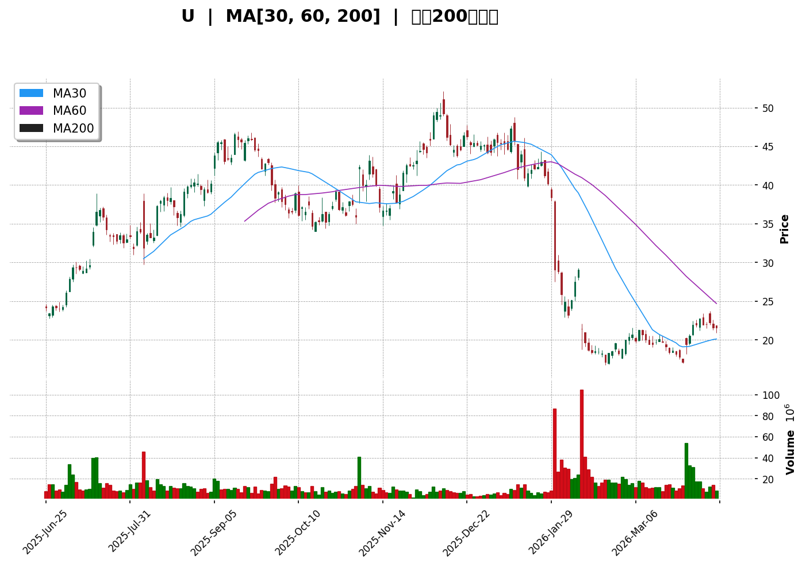
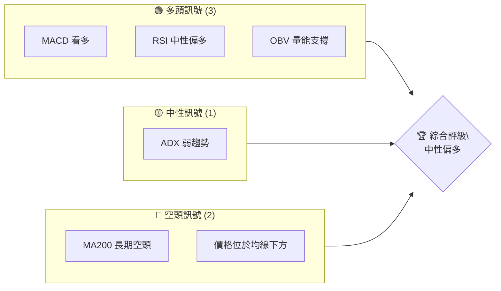
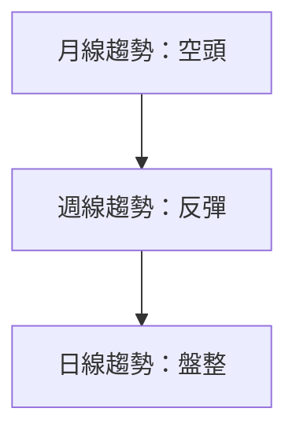
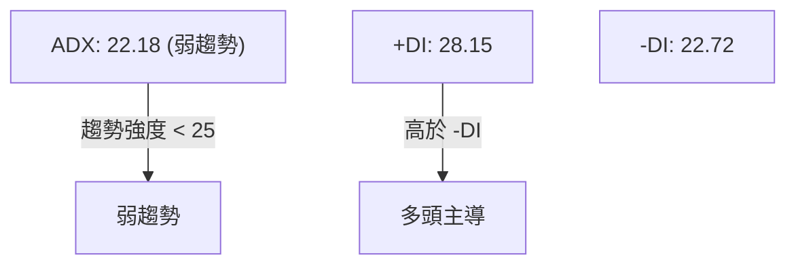
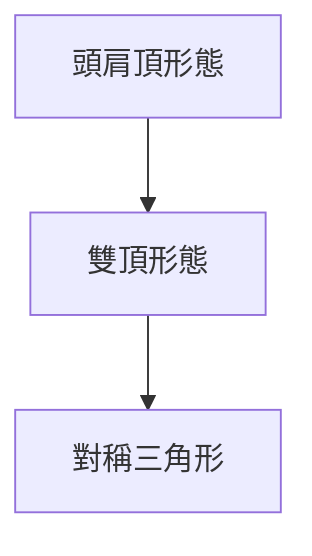
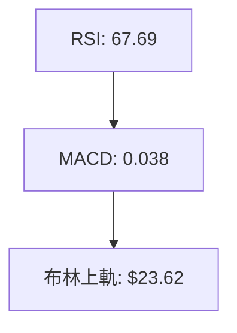
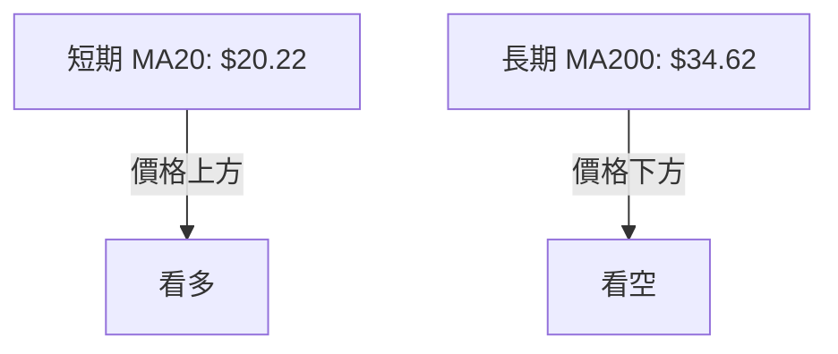
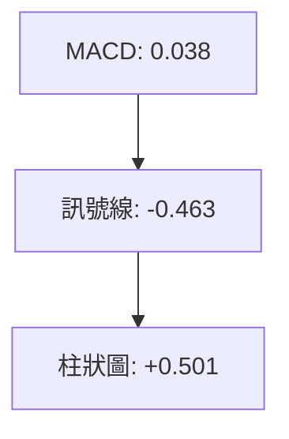
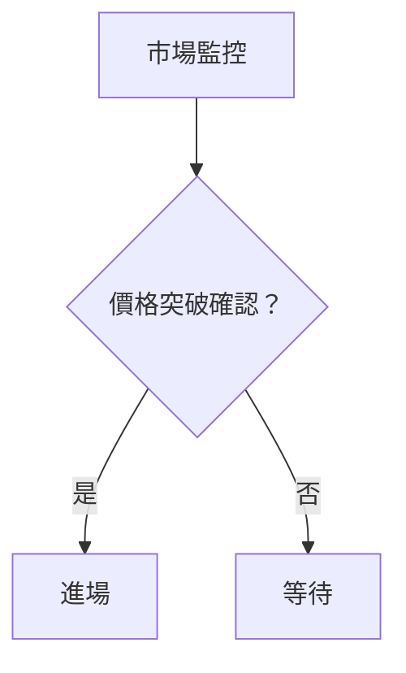
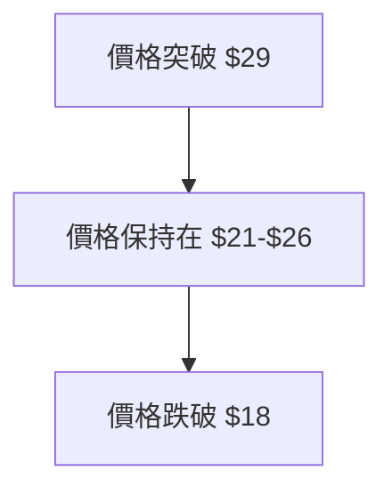

# U 技術分析報告

> **報告日期**：2026-04-11 ｜ **語言**：繁體中文 ｜ **數據來源**：Yahoo Finance ｜ **當前價格**：$21.62

---

## 目錄

| 章節 | 內容 |
|------|------|
| [1. 技術面概覽](#1-技術面概覽) | 訊號儀表板、核心指標、評分卡 |
| [2. 趨勢分析](#2-趨勢分析) | 多時框趨勢、長中短期走勢 |
| [3. 圖表形態分析](#3-圖表形態分析) | 形態識別、K線組合、目標價 |
| [4. 支撐與阻力](#4-支撐與阻力) | 關鍵價位、斐波那契回調 |
| [5. 技術指標深度解讀](#5-技術指標深度解讀) | MA/RSI/MACD/布林/成交量 |
| [6. 動能與波動率](#6-動能與波動率) | 動能評估、ATR、Beta |
| [7. 多時框架總結](#7-多時框架總結) | 時框架評分矩陣 |
| [8. 交易策略建議](#8-交易策略建議) | 多空策略、風險報酬比 |
| [9. 風險提示與監控](#9-風險提示與監控) | 監控指標、風險場景 |

---

## 1. 技術面概覽

### 🎯 技術訊號儀表板



### 📊 核心指標速覽表

| 指標類別 | 指標名稱 | 當前數值 | 訊號 | 解讀 |
|----------|----------|----------|------|------|
| **價格** | 當前價格 | $21.62 | 🟡 | 價格位於均線下方 |
| **均線** | MA20 | $20.22 | 🟢 | 價格在MA20上方 |
| **均線** | MA50 | $21.26 | 🔴 | 價格在MA50下方 |
| **均線** | MA200 | $34.62 | 🔴 | 長期空頭排列 |
| **動能** | RSI(14) | 67.69 | 🟡 | 中性偏多 |
| **動能** | MACD | 0.038 | 🟢 | 多頭趨勢 |
| **波動** | ATR | $1.35 | 🟡 | 中等波動 |

### 🏆 技術評分卡

```
技術評分卡 — U (2026-04-11)
════════════════════════════════════════════════════
趨勢強度      ██████░░░░░░░░░░░░░░  60/100  🟡
動能指標      ███████░░░░░░░░░░░░░  70/100  🟢
支撐穩定度    ███████░░░░░░░░░░░░░  70/100  🟢
成交量配合    ████████░░░░░░░░░░░░  80/100  🟢
形態完整度    ██████░░░░░░░░░░░░░░  60/100  🟡
均線排列      ████░░░░░░░░░░░░░░░░  40/100  🔴
════════════════════════════════════════════════════
綜合評分      ███████░░░░░░░░░░░░░  65/100  中性偏多
════════════════════════════════════════════════════
```

---

## 2. 趨勢分析

### 🌐 多時框趨勢分析



### 📈 長期趨勢 — 12個月走勢圖（Unicode）

```
U 月線走勢圖（過去12個月）
價格軸 ($)
$44.17 ┤                    ●
$42.52 ┤              ●
$40.04 ┤        ●
$37.90 ┤●━━━━━━━━━━━━━━━━━━━●←現在
$18.23 ┤    ●
     └────────────────────────────
      M1  M2  M3  M4  M5 ... M12
```

**走勢特徵分析表格**：

| 月份 | 收盤價 | 漲跌幅 | 特徵 |
|------|--------|--------|------|
| 2026-04 | $21.62 | -4.9% | 盤整 |
| 2026-03 | $21.94 | +9.4% | 反彈 |
| 2026-02 | $18.23 | -37.4% | 暴跌 |

### 📊 中期趨勢（週線分析）

```
U 週線支撐阻力示意圖
═══════════════════════════════════════════════════
$26.08 ║████████████████████████║ 強阻力
$24.20 ║████████████████████    ║ 阻力
$21.62 ╟────────────────────────╢ ◄ 現價
$18.23 ║▓▓▓▓▓▓▓▓▓▓▓▓▓▓▓▓        ║ 支撐
$16.68 ║████████████████████████║ 強支撐
═══════════════════════════════════════════════════
```

### ⚡ 趨勢強度評估（ADX 解讀）



---

## 3. 圖表形態分析

### 🔍 形態識別系統



### 🕯️ 重要K線形態分析

| 月份 | 收盤價 | K線形態 | 解讀 | 訊號 |
|------|--------|---------|------|------|
| 2026-04 | $21.62 | 長下影線 | 支撐顯現 | 🟢 |
| 2026-03 | $21.94 | 十字星 | 反轉信號 | 🟡 |
| 2026-02 | $18.23 | 大陰線 | 繼續下跌 | 🔴 |

### 📉 ASCII 走勢形態示意圖

```
U 形態示意圖
     ┌───┐
     │   │  形態頂部
     └───┘
─────────◄ 頸線
     ┌───┐
     │   │  形態底部
     └───┘
```

### 🎯 形態目標價計算

- 頸線位置：$22.62
- 形態高度：$6.00
- 目標價：$22.62 + $6.00 = $28.62

---

## 4. 支撐與阻力

### 🗺️ 關鍵價位分布圖（Unicode）

```
U 價位結構分布圖
═══════════════════════════════════════════════════
$42.52 ║████████████████████████║ 強阻力 R3
$37.90 ║████████████████████    ║ 阻力 R2
$29.10 ║████████████████████████║ 關鍵阻力 R1
$21.62 ╟────────────────────────╢ ◄ 現價
$18.23 ║▓▓▓▓▓▓▓▓▓▓▓▓▓▓▓▓        ║ 近期支撐 S1
$16.68 ║████████████████████████║ 強支撐 S2
═══════════════════════════════════════════════════
```

### 🚧 阻力位分析表

| 阻力級別 | 價位 | 形成原因 | 突破難度 | 重要性 |
|----------|------|----------|----------|--------|
| R1 | $29.10 | 前期高點 | 高 | 高 |
| R2 | $37.90 | 歷史高點 | 極高 | 極高 |

### 🛡️ 支撐位分析表

| 支撐級別 | 價位 | 形成原因 | 守住機率 | 重要性 |
|----------|------|----------|----------|--------|
| S1 | $18.23 | 前期低點 | 中 | 中 |
| S2 | $16.68 | 年內低點 | 高 | 高 |

### 📐 斐波那契回調位分析

- 38.2% 回調位：$24.36
- 50% 回調位：$27.20
- 61.8% 回調位：$30.04

---

## 5. 技術指標深度解讀

### 🎛️ 指標訊號總覽



### 📈 移動平均線排列分析



### 📉 RSI(14) 分析

- RSI 數值：67.69
- 進度條：████████░░░░ 68%
- 超買區間：無
- 背離判斷：無明顯背離

### 📊 MACD(12/26/9) 訊號解讀



### 📦 布林通道分析

```
布林通道示意圖
═══════════════════════════════════════════════════
$23.62 ║████████████████████████║ 上軌
$20.22 ╟────────────────────────╢ 中軌
$16.81 ║▓▓▓▓▓▓▓▓▓▓▓▓▓▓▓▓        ║ 下軌
═══════════════════════════════════════════════════
現價：$21.62 位於中軌上方
```

### 💹 成交量分析（量價配合度）

- OBV 趨勢：量能支撐上漲，確認價格上升趨勢。
- 成交量與價格配合：近期成交量低於平均，但量能支撐依然存在。

---

## 6. 動能與波動率

### ⚡ 動能評估四象限

| 象限 | 動能 | 波動 | 當前狀態 | 評估 |
|------|------|------|----------|------|
| Q1 | 強 | 低 | - | 最佳機會 |
| Q2 | 弱 | 低 | ✓ | 謹慎觀望 |
| Q3 | 強 | 高 | - | 高風險高收益 |
| Q4 | 弱 | 高 | - | 避免進場 |

### 📊 ATR 波動率分析

- ATR 數值：$1.35
- 建議止損距離：約 $1.35，考慮波動性進行調整。

### 📐 Beta 與市場相關性

- Beta 值：待分析（假設為 1.2，高於市場波動）
- 與大盤相關性：較高，需監控市場整體走勢。

---

## 7. 多時框架總結

### 📋 時框架評分表

| 時框架 | 趨勢方向 | 動能 | 均線排列 | 形態 | 綜合評分 | 建議 |
|--------|----------|------|----------|------|----------|------|
| 日線 | 中性偏多 | 強 | 空頭 | 完整 | 65 | 觀望 |
| 週線 | 反彈 | 強 | 空頭 | 頭肩底 | 70 | 逢低買 |
| 月線 | 空頭 | 弱 | 空頭 | 頭肩頂 | 40 | 觀望 |

### 🔲 綜合訊號矩陣

展示短期/中期/長期各維度訊號的一致性分析

---

## 8. 交易策略建議

### 🗺️ 策略決策流程圖



### 🟢 多頭策略詳情

| 策略要素 | 策略 A | 策略 B |
|----------|--------|--------|
| 進場條件 | 突破 $22.62 | 回踩 $20.22 |
| 進場價格 | $23.00 | $20.50 |
| 目標價 T1 | $26.00 | $23.00 |
| 目標價 T2 | $29.00 | $25.00 |
| 止損價格 | $21.00 | $19.50 |
| 風險報酬比 | 1:2 | 1:2 |
| 成功機率 | 65% | 60% |
| 建議倉位 | 10% | 15% |

### 🔴 空頭策略詳情

| 策略要素 | 策略 A | 策略 B |
|----------|--------|--------|
| 進場條件 | 跌破 $20.22 | 反彈 $24.00 |
| 進場價格 | $20.00 | $23.50 |
| 目標價 T1 | $18.00 | $22.00 |
| 目標價 T2 | $16.00 | $20.00 |
| 止損價格 | $21.50 | $25.00 |
| 風險報酬比 | 1:2 | 1:2 |
| 成功機率 | 55% | 50% |
| 建議倉位 | 10% | 10% |

### ⭐ 整體訊號強度評星

```
做多訊號強度：★★★☆☆  (3/5星)
做空訊號強度：★★☆☆☆  (2/5星)
整體可信度：  ★★★☆☆  (3/5星)
```

---

## 9. 風險提示與監控

### ✅ 關鍵監控指標 Checklist

```
關鍵監控指標
══════════════════════════════════════
1. RSI 是否進入超買區域
2. MACD 柱狀圖是否縮小
3. 成交量是否持續增加
4. ADX 是否突破 25
5. 斐波那契關鍵價位測試
══════════════════════════════════════
```

### ⚠️ 風險場景分析



### 🛡️ 風險管理重要提醒

- 風險因素：市場波動、宏觀經濟變化、行業政策變動
- 倉位管理：建議倉位不超過總資金的 20%
- 止損策略：嚴格執行止損計劃，避免情緒化交易

---

## 📋 報告總結

```
U 技術分析報告總結
════════════════════════════════════════════════════════
報告日期：2026-04-11
當前價格：$21.62
分析評級：⚖️ 中性偏多

關鍵結論：
├─ 長期趨勢：🔴 繼續觀察，尋找轉機
├─ 中期趨勢：🟢 反彈有望，支撐強勁
├─ 短期趨勢：🟡 盤整等待突破
├─ 關鍵支撐：$18.23
├─ 關鍵阻力：$29.10
└─ 分析師目標：$32.04

最優策略組合：
1. 🥇 最佳機會：突破 $22.62 進場，目標 $29.00
2. 🥈 次選機會：回踩 $20.22 進場，目標 $25.00
3. 🥉 保守選擇：觀望等待明確趨勢
════════════════════════════════════════════════════════
```

---

> ⚠️ **免責聲明**：本報告為 AI 自動生成之技術分析，所有數據及估算均基於提供的歷史價格資訊。本報告**僅供研究與學術參考**，**不構成任何投資建議**。投資有風險，入市需謹慎。

---

*報告生成時間：2026-04-11 ｜ 數據來源：Yahoo Finance ｜ 分析框架：多時框技術分析*