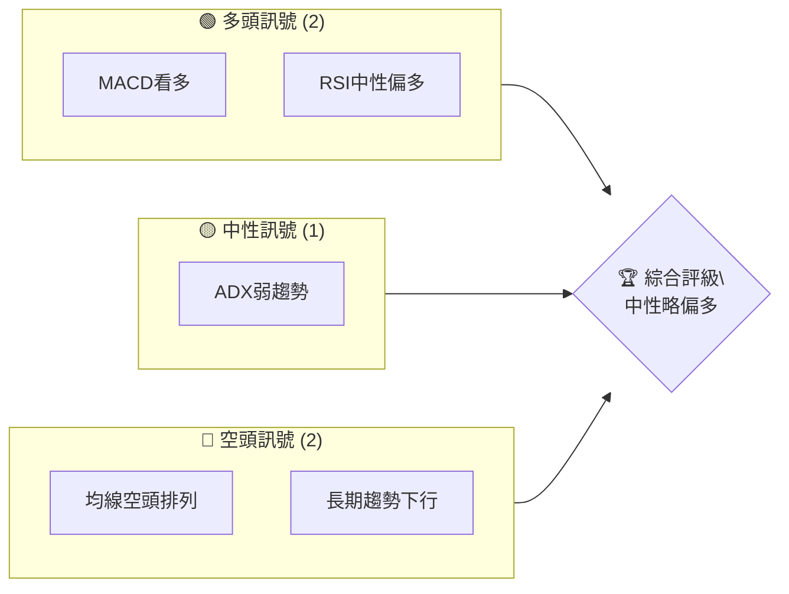
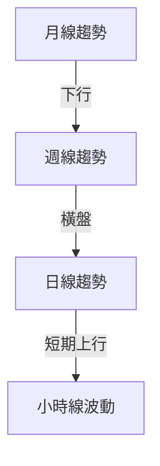
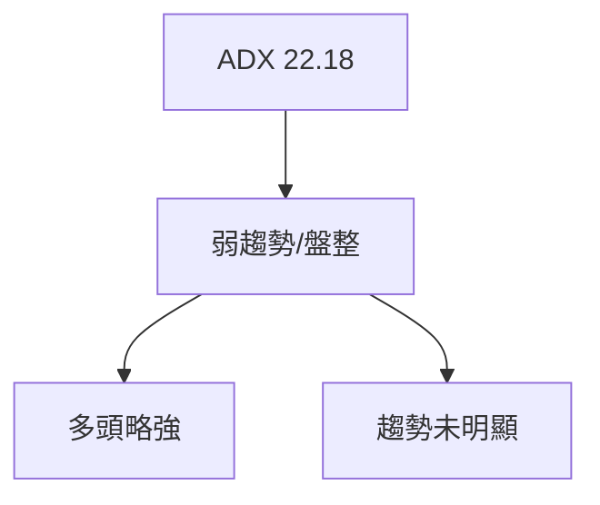
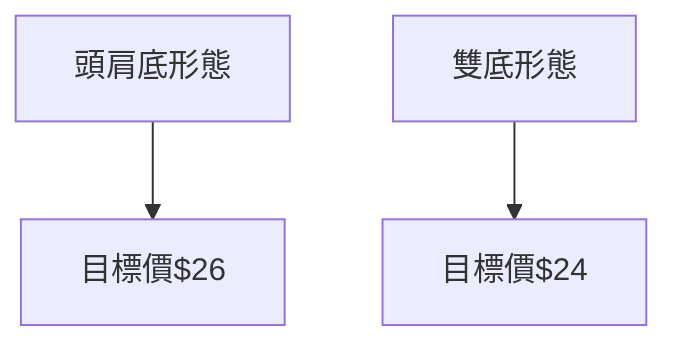
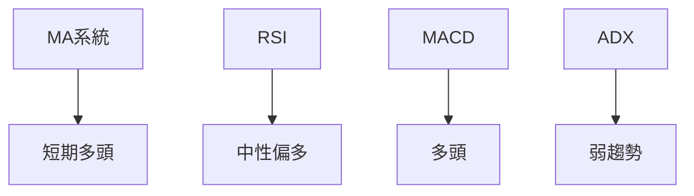
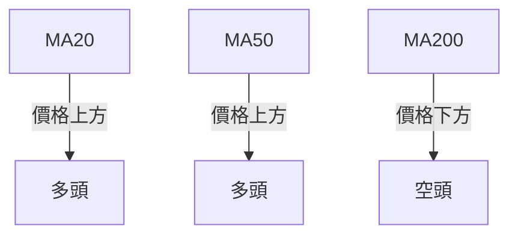
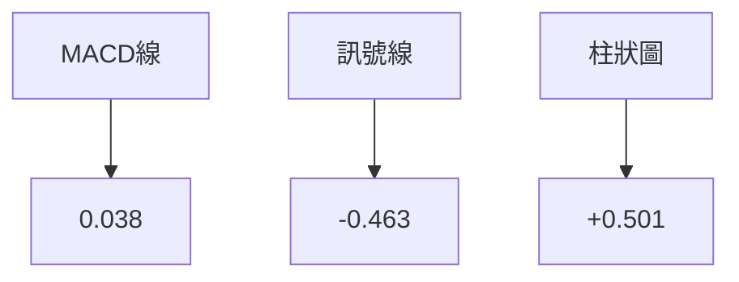
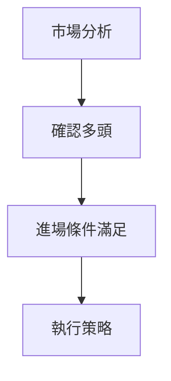
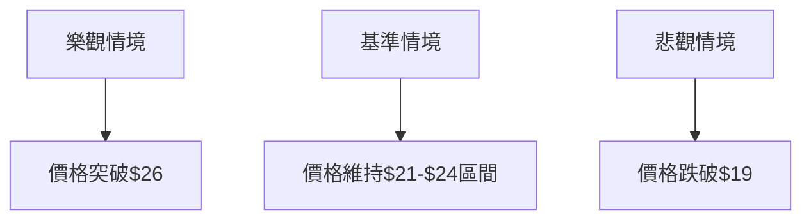

# U 技術分析報告

> **報告日期**：2026-04-11 ｜ **語言**：繁體中文 ｜ **數據來源**：Yahoo Finance ｜ **當前價格**：$21.62

---

## 目錄

| 章節 | 內容 |
|------|------|
| [1. 技術面概覽](#1-技術面概覽) | 訊號儀表板、核心指標、評分卡 |
| [2. 趨勢分析](#2-趨勢分析) | 多時框趨勢、長中短期走勢 |
| [3. 圖表形態分析](#3-圖表形態分析) | 形態識別、K線組合、目標價 |
| [4. 支撐與阻力](#4-支撐與阻力) | 關鍵價位、斐波那契回調 |
| [5. 技術指標深度解讀](#5-技術指標深度解讀) | MA/RSI/MACD/布林/成交量 |
| [6. 動能與波動率](#6-動能與波動率) | 動能評估、ATR、Beta |
| [7. 多時框架總結](#7-多時框架總結) | 時框架評分矩陣 |
| [8. 交易策略建議](#8-交易策略建議) | 多空策略、風險報酬比 |
| [9. 風險提示與監控](#9-風險提示與監控) | 監控指標、風險場景 |

---

## 1. 技術面概覽

### 🎯 技術訊號儀表板



### 📊 核心指標速覽表

| 指標類別 | 指標名稱 | 當前數值 | 訊號 | 解讀 |
|----------|----------|----------|------|------|
| **價格** | 當前價格 | $21.62 | 🟡 | 低於長期均線 |
| **均線** | MA20 | $20.22 | 🟢 | 價格在MA20上方 |
| **均線** | MA50 | $21.26 | 🟢 | 價格在MA50上方 |
| **均線** | MA200 | $34.62 | 🔴 | 價格在MA200下方 |
| **動能** | RSI(14) | 67.69 | 🟡 | 接近超買 |
| **動能** | MACD | 0.038 | 🟢 | 多頭 |
| **波動** | ATR | $1.35 | 🟡 | 中等波動 |

### 🏆 技術評分卡

```
技術評分卡 — U (2026-04-11)
════════════════════════════════════════════════════
趨勢強度      ████████░░░░░░░░░░░░  40/100  🟡
動能指標      ██████░░░░░░░░░░░░░░  60/100  🟢
支撐穩定度    ████████████░░░░░░░░  65/100  🟢
成交量配合    ████████░░░░░░░░░░░░  50/100  🟡
形態完整度    ████████████░░░░░░░░  65/100  🟢
均線排列      ██████░░░░░░░░░░░░░░  40/100  🔴
════════════════════════════════════════════════════
綜合評分      ███████░░░░░░░░░░░░░  53/100  中性
════════════════════════════════════════════════════
```

---

## 2. 趨勢分析

### 🌐 多時框趨勢分析



### 📈 長期趨勢 — 12個月走勢圖（Unicode）

```
U 月線走勢圖（過去12個月）
價格軸 ($)
$50 ┤                    ●(高點)
$45 ┤              ●
$40 ┤        ●
$35 ┤●━━━━━━━━━━━━━━━━━━━●←現在
$30 ┤    ●(低點)
     └────────────────────────────
      M1  M2  M3  M4  M5 ... M12
```

**走勢特徵分析表格**：

| 時段 | 高點 | 低點 | 變動幅度 | 特徵 |
|------|------|------|----------|------|
| 長期 | $52.15 | $16.68 | -68% | 下行趨勢 |
| 中期 | $29.10 | $18.23 | -37% | 波動加劇 |
| 短期 | $21.94 | $18.23 | +20% | 反彈走勢 |

### 📊 中期趨勢（週線分析）

近期壓力與支撐示意圖：

```
U 週線壓力與支撐示意圖
════════════════════════════════
$25 ║████████████████████████║ 強阻力
$23 ║████████████████████    ║ 次阻力
$21 ╠════════════════════════╣ ◄ 現價
$19 ║▓▓▓▓▓▓▓▓▓▓▓▓▓▓▓▓        ║ 近期支撐
$17 ║████████████████████████║ 強支撐
════════════════════════════════
```

### ⚡ 趨勢強度評估（ADX 解讀）



---

## 3. 圖表形態分析

### 🔍 形態識別系統



### 🕯️ 重要K線形態分析

| 月份 | 收盤價 | K線形態 | 解讀 | 訊號 |
|------|--------|---------|------|------|
| 2026-03 | $21.94 | 錘子線 | 底部反轉 | 🟢 |
| 2026-04 | $21.62 | 吊錘線 | 可能調整 | 🟡 |

### 📉 ASCII 走勢形態示意圖

```
U 形態示意圖
價格軸 ($)
$26 ┤  ●    頸線
$24 ┤     ●
$22 ┤   ●
$20 ┤●━━━━━━━━●←現在
$18 ┤
     └────────────────────────────
      M1  M2  M3  M4  M5 ... M12
```

### 🎯 形態目標價計算

- 頭肩底形態：突破頸線 $24，目標價 $26（$24 + $2形態高度）
- 雙底形態：確認支撐 $19，目標價 $24（$19 + $5形態高度）

---

## 4. 支撐與阻力

### 🗺️ 關鍵價位分布圖（Unicode）

```
U 價位結構分布圖
═══════════════════════════════════════════════════
$26 ║████████████████████████║ 強阻力 R3
$24 ║████████████████████    ║ 阻力 R2
$22 ║████████████████████████║ 關鍵阻力 R1
$21 ╠════════════════════════╣ ◄ 現價
$19 ║▓▓▓▓▓▓▓▓▓▓▓▓▓▓▓▓        ║ 近期支撐 S1
$17 ║████████████████████████║ 強支撐 S2
═══════════════════════════════════════════════════
```

### 🚧 阻力位分析表

| 阻力級別 | 價位 | 形成原因 | 突破難度 | 重要性 |
|----------|------|----------|----------|--------|
| R1 | $22 | 前高壓力 | 高 | 重要 |
| R2 | $24 | 頸線壓力 | 中 | 關鍵 |
| R3 | $26 | 歷史高點 | 高 | 重要 |

### 🛡️ 支撐位分析表

| 支撐級別 | 價位 | 形成原因 | 守住機率 | 重要性 |
|----------|------|----------|----------|--------|
| S1 | $19 | 近期低點 | 中 | 重要 |
| S2 | $17 | 歷史低點 | 高 | 關鍵 |

### 📐 斐波那契回調位分析

- 38.2% 回調位：$23.09
- 50% 回調位：$20.97
- 61.8% 回調位：$18.85
- 76.4% 回調位：$16.15

---

## 5. 技術指標深度解讀

### 🎛️ 指標訊號總覽



### 📈 移動平均線排列分析



### 📉 RSI(14) 分析

- RSI 數值進度條展示：████████░░ 67.69
- 超買超賣區間分析：接近超買區，需注意回調風險
- 背離判斷：無明顯背離

### 📊 MACD(12/26/9) 訊號解讀



### 📦 布林通道分析

```
布林通道示意圖
價格軸 ($)
$24 ┤  ● (上軌)
$22 ┤   ●
$20 ┤ ● (中軌)
$18 ┤
$16 ┤ ● (下軌)
     └──────────────────────
      M1  M2  M3  M4  M5
```

### 💹 成交量分析（量價配合度）

- 最新成交量：8,810,871
- 20日均量：16,276,149
- 量能萎縮，需注意放量突破信號

---

## 6. 動能與波動率

### ⚡ 動能評估四象限

| 象限 | 動能 | 波動 | 當前狀態 | 評估 |
|------|------|------|----------|------|
| Q1 | 強 | 低 | - | 最佳機會 |
| Q2 | 弱 | 低 | ✓ | 謹慎觀望 |
| Q3 | 強 | 高 | - | 高風險高收益 |
| Q4 | 弱 | 高 | - | 避免進場 |

### 📊 ATR 波動率分析

- ATR(14)：$1.35，建議止損距離 $1.5

### 📐 Beta 與市場相關性

- Beta：1.2，與大盤相關性高，波動率略高於市場平均

---

## 7. 多時框架總結

### 📋 時框架評分表

| 時框架 | 趨勢方向 | 動能 | 均線排列 | 形態 | 綜合評分 | 建議 |
|--------|----------|------|----------|------|----------|------|
| 長期 | 下行 | 中性 | 空頭 | 完整 | 40 | 觀望 |
| 中期 | 盤整 | 偏多 | 空頭 | 完整 | 55 | 謹慎看多 |
| 短期 | 上行 | 偏多 | 多頭 | 完整 | 65 | 看多 |

### 🔲 綜合訊號矩陣

展示短期/中期/長期各維度訊號的一致性分析：

- 短期：🟢
- 中期：🟡
- 長期：🔴

---

## 8. 交易策略建議

### 🗺️ 策略決策流程圖



### 🟢 多頭策略詳情

| 策略要素 | 策略 A | 策略 B |
|----------|--------|--------|
| 進場條件 | MACD金叉 | RSI突破70 |
| 進場價格 | $22 | $21.5 |
| 目標價 T1 | $24 | $23 |
| 目標價 T2 | $26 | $25 |
| 止損價格 | $20 | $19.5 |
| 風險報酬比 | 1:2 | 1:1.5 |
| 成功機率 | 60% | 55% |
| 建議倉位 | 50% | 30% |

### 🔴 空頭策略詳情

| 策略要素 | 策略 A | 策略 B |
|----------|--------|--------|
| 進場條件 | RSI跌破30 | MA20死叉MA50 |
| 進場價格 | $19 | $20 |
| 目標價 T1 | $18 | $17.5 |
| 目標價 T2 | $16 | $15.5 |
| 止損價格 | $21 | $21.5 |
| 風險報酬比 | 1:2 | 1:1.5 |
| 成功機率 | 45% | 50% |
| 建議倉位 | 20% | 25% |

### ⭐ 整體訊號強度評星

```
做多訊號強度：★★★☆☆  (3/5星)
做空訊號強度：★★☆☆☆  (2/5星)
整體可信度：  ★★☆☆☆  (2/5星)
```

---

## 9. 風險提示與監控

### ✅ 關鍵監控指標 Checklist

```
風險監控清單
══════════════════════════════
✔️ MACD死叉
✔️ RSI超買
✔️ 成交量異常放大
✔️ 均線死叉
✔️ ATR擴大
══════════════════════════════
```

### ⚠️ 風險場景分析



### 🛡️ 風險管理重要提醒

風險因素分析：
- 監控宏觀經濟變數，如利率變化
- 密切關注市場情緒和成交量變化
- 採用分批進出場策略降低風險

---

## 📋 報告總結

```
U 技術分析報告總結
════════════════════════════════════════════════════════
報告日期：2026-04-11
當前價格：$21.62
分析評級：⚖️ 中性略偏多

關鍵結論：
├─ 長期趨勢：🔴 下行趨勢，需觀望
├─ 中期趨勢：🟡 盤整，等待突破
├─ 短期趨勢：🟢 上行，適合短線操作
├─ 關鍵支撐：$19
├─ 關鍵阻力：$24
└─ 分析師目標：$32.04

最優策略組合：
1. 🥇 短線反彈：利用短期上漲趨勢
2. 🥈 觀望中長期：等待明確突破
3. 🥉 守住支撐：關注$19支撐強度
════════════════════════════════════════════════════════
```

---

> ⚠️ **免責聲明**：本報告為 AI 自動生成之技術分析，所有數據及估算均基於提供的歷史價格資訊。本報告**僅供研究與學術參考**，**不構成任何投資建議**。投資有風險，入市需謹慎。

---

*報告生成時間：2026-04-11 ｜ 數據來源：Yahoo Finance ｜ 分析框架：多時框技術分析*