# UBER 基本面深度分析報告

> **報告日期**：2026-02-24 ｜ **語言**：繁體中文 ｜ **數據來源**：Yahoo Finance ｜ **分析師**：AI 量化研究團隊

---

## 目錄

| # | 章節 | 核心內容 |
|---|------|---------|
| 1 | [執行摘要](#1-執行摘要) | 評分總覽、5大投資論點、快速統計 |
| 2 | [公司概覽](#2-公司概覽) | 業務結構、市場地位、競爭優勢 |
| 3 | [損益表深度分析](#3-損益表深度分析) | 收入趨勢、利潤率演變、費用結構 |
| 4 | [資產負債表分析](#4-資產負債表分析) | 資產結構、流動性、槓桿比率 |
| 5 | [現金流量分析](#5-現金流量分析) | FCF瀑布、資本配置策略 |
| 6 | [獲利能力指標](#6-獲利能力指標) | ROE/ROA/ROIC、行業對比 |
| 7 | [估值分析](#7-估值分析) | 倍數對比、情境目標價、同業比較 |
| 8 | [競爭護城河](#8-競爭護城河) | Porter五力、護城河評分 |
| 9 | [成長催化劑](#9-成長催化劑) | 催化劑時間軸、TAM市場規模 |
| 10 | [風險分析](#10-風險分析) | 風險矩陣、評分卡、緩解措施 |
| 11 | [公平價值估算](#11-公平價值估算) | DCF模型、三種估值法 |
| 12 | [投資建議](#12-投資建議) | 最終評級、適配度、監控指標 |

---

## 1. 執行摘要

### 核心評分總覽

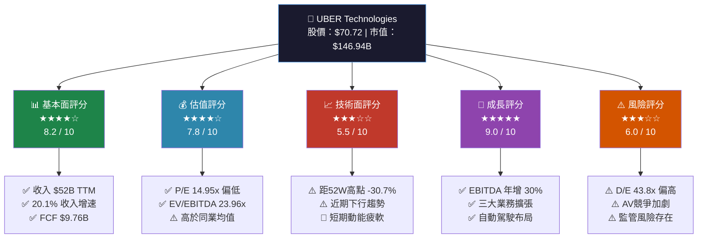

---

### 5大核心投資論點

| # | 投資論點 | 現況 | 評估 | 評分 |
|---|---------|------|------|------|
| 🟢 1 | **盈利拐點已確認** | 營業利益從2022年虧損-$1.83B → 2025年+$5.57B，淨利潤達$10.05B | 歷史性轉型完成，規模效應顯現 | ★★★★★ |
| 🟢 2 | **自由現金流爆發** | FCF從2022年$390M → 2025年$9.76B，CAGR達189% | 資本輕量模式優勢充分釋放 | ★★★★★ |
| 🟢 3 | **全球平台網絡效應** | 3大業務線覆蓋70+國家，34,000名員工管理數百萬司機/夥伴 | 護城河深厚，難以複製 | ★★★★☆ |
| 🟡 4 | **估值具備吸引力** | Forward P/E僅16.5x，低於科技行業均值，目標價$105（分析師共識） | 當前股價存在明顯折價 | ★★★★☆ |
| 🟡 5 | **自動駕駛戰略布局** | 與Waymo深度合作，布局AV生態，長期Freight業務整合 | 潛在顛覆性機遇，但時間線不確定 | ★★★☆☆ |
| 🔴 風險 | **技術性承壓** | 股價從52周高點$101.99回落至$70.72，跌幅30.7% | 短期情緒偏空，需觀察底部確認 | ★★☆☆☆ |

---

### 快速統計卡片

```
╔══════════════════════════════════════════════════════════════════╗
║                    UBER 核心財務快速統計                          ║
╠══════════════╦═══════════════╦══════════════╦═══════════════════╣
║  當前股價    ║  市值          ║  52W區間      ║  分析師目標價      ║
║  $70.72      ║  $146.94B      ║  $60.63~$101.99║  $105.01 (↑48.5%)║
╠══════════════╬═══════════════╬══════════════╬═══════════════════╣
║  TTM收入     ║  收入增速       ║  淨利潤       ║  自由現金流        ║
║  $52.02B     ║  +20.1% YoY   ║  $10.05B      ║  $9.76B           ║
╠══════════════╬═══════════════╬══════════════╬═══════════════════╣
║  毛利率      ║  營業利潤率    ║  淨利率       ║  ROE               ║
║  38.5%       ║  12.3%         ║  19.3%        ║  39.9%            ║
╠══════════════╬═══════════════╬══════════════╬═══════════════════╣
║  P/E (TTM)   ║  Forward P/E  ║  EV/EBITDA   ║  EPS (TTM)        ║
║  14.95x      ║  16.49x        ║  23.96x       ║  $4.73            ║
╚══════════════╩═══════════════╩══════════════╩═══════════════════╝
```

**總體評級：強力買入 ★★★★☆（4.2/5）**

---

## 2. 公司概覽

### 業務結構全景圖

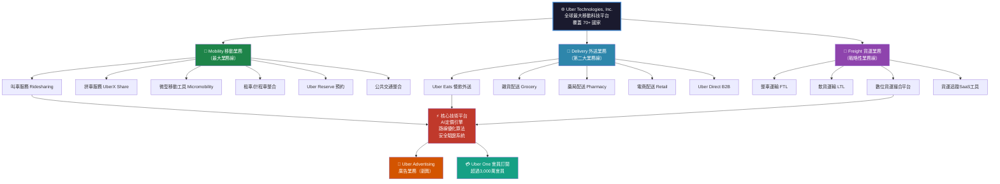

---

### 業務收入結構估算

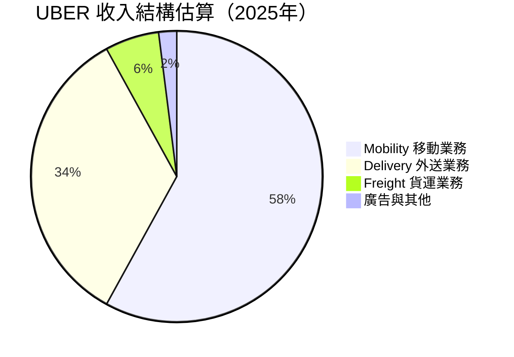

---

### 競爭優勢心智圖

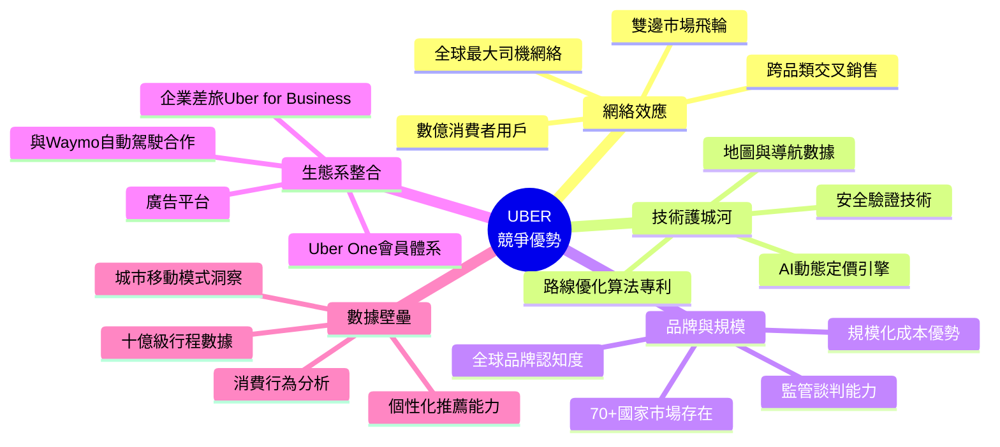

---

### 市場地位評估

| 維度 | UBER | 評估 |
|------|------|------|
| 🌍 地理覆蓋 | 70+ 國家，10,000+ 城市 | 🟢 全球最廣 |
| 👥 月活用戶 | 估計 1.7億+ MAU | 🟢 行業第一 |
| 🚗 Mobility市佔 | 美國約 68%、全球約 40% | 🟢 絕對領導 |
| 🍔 Delivery市佔 | 美國約 23%（第二） | 🟡 激烈競爭 |
| 🚛 Freight | 數字貨運市場前五 | 🟡 仍在成長 |
| 💰 收入規模 | $52B（全球最大移動平台） | 🟢 行業標桿 |

---

## 3. 損益表深度分析

### 收入成長時間軸

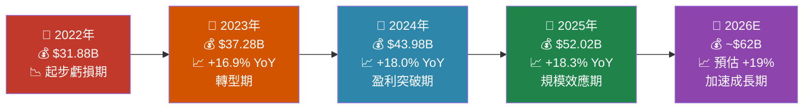

---

### 年度收入趨勢 ASCII 長條圖

```
UBER 年度總收入趨勢（單位：十億美元）
━━━━━━━━━━━━━━━━━━━━━━━━━━━━━━━━━━━━━━━━━━━━━━━━

2022 │ $31.88B  ▓▓▓▓▓▓▓▓▓▓▓▓▓▓▓▓▓▓▓▓▓▓▓▓▓▓▓▓▓▓▓▓ 
2023 │ $37.28B  ▓▓▓▓▓▓▓▓▓▓▓▓▓▓▓▓▓▓▓▓▓▓▓▓▓▓▓▓▓▓▓▓▓▓▓▓▓▓
2024 │ $43.98B  ▓▓▓▓▓▓▓▓▓▓▓▓▓▓▓▓▓▓▓▓▓▓▓▓▓▓▓▓▓▓▓▓▓▓▓▓▓▓▓▓▓▓▓▓
2025 │ $52.02B  ▓▓▓▓▓▓▓▓▓▓▓▓▓▓▓▓▓▓▓▓▓▓▓▓▓▓▓▓▓▓▓▓▓▓▓▓▓▓▓▓▓▓▓▓▓▓▓▓▓▓▓▓
       ├──────────────────────────────────────────────────────────
       $0       $10B      $20B      $30B      $40B      $52B+

  年增率：+16.9%  →  +18.0%  →  +18.3%（加速增長趨勢）✅
  3年CAGR：17.7% — 顯著超越行業均值（科技服務業約8-12%）🟢
━━━━━━━━━━━━━━━━━━━━━━━━━━━━━━━━━━━━━━━━━━━━━━━━
```

---

### 利潤率演變 ASCII 折線圖

```
UBER 利潤率演變（2022-2025）
━━━━━━━━━━━━━━━━━━━━━━━━━━━━━━━━━━━━━━━━━━━━━━━━

毛利率 (%)
40% │                                              ●38.5%
38% │                               ●39.4%     
36% │              ●39.7%        
34% │  ●38.3%
    └──────────────────────────────────────────────
       2022          2023          2024          2025

營業利潤率 (%)
15% │                                              ●12.3%
10% │                               
 5% │              ●3.0%          ●6.4%         
 0% ┼──────────────────────────────────────────────
-5% │  ●-5.7%
    └──────────────────────────────────────────────
       2022          2023          2024          2025

淨利率 (%)
20% │                                              ●19.3%
15% │
10% │                                ●22.4%
 5% │              ●5.1%
 0% ┼──────────────────────────────────────────────
-30%│  ●-28.7%（含大量非現金投資損益）
    └──────────────────────────────────────────────
       2022          2023          2024          2025

⚠️ 注意：2024年淨利率22.4%及2025年19.3%含大量投資收益（非現金）
   核心營業利潤率的持續改善更能反映真實經營品質
━━━━━━━━━━━━━━━━━━━━━━━━━━━━━━━━━━━━━━━━━━━━━━━━
```

---

### 近4年完整財務數據表

| 財務指標 | 2022 | 2023 | 2024 | 2025 | 趨勢 |
|---------|------|------|------|------|------|
| 📊 總收入 | $31.88B | $37.28B | $43.98B | $52.02B | 🟢 持續增長 |
| 📊 收入增速 | +82.6% | +16.9% | +18.0% | +18.3% | 🟢 穩健加速 |
| 💎 毛利潤 | $12.22B | $14.82B | $17.33B | $20.68B | 🟢 |
| 💎 毛利率 | 38.3% | 39.7% | 39.4% | 38.5% | 🟡 略微波動 |
| ⚙️ 營業利益 | **-$1.83B** | $1.11B | $2.80B | **$5.57B** | 🟢 大幅改善 |
| ⚙️ 營業利潤率 | -5.7% | 3.0% | 6.4% | 12.3% | 🟢 飛速提升 |
| 📈 EBITDA | -$7.91B | $3.78B | $5.38B | $6.99B | 🟢 |
| 💰 淨利潤 | -$9.14B | $1.89B | $9.86B | $10.05B | 🟢 |
| 💰 淨利率 | -28.7% | 5.1% | 22.4% | 19.3% | 🟡 含非常項目 |
| 🔬 研發支出 | $2.80B | $3.16B | $3.11B | $3.40B | 🟡 穩定投入 |
| 💵 EPS | N/A | ~$0.87 | ~$4.65 | **$4.73** | 🟢 |

---

### 費用結構分析

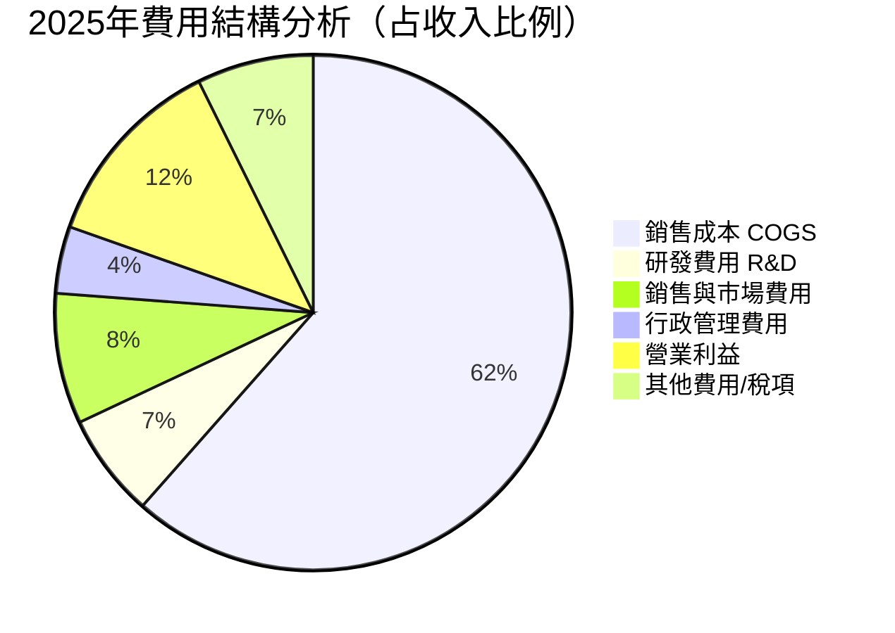

---

### 研發投入趨勢

```
研發支出（R&D）投入趨勢
━━━━━━━━━━━━━━━━━━━━━━━━━━━━━━━━━━━━━━━━━━━━
2022 │ $2.80B  ▓▓▓▓▓▓▓▓▓▓▓▓▓▓▓▓▓▓▓▓▓▓▓▓▓▓▓▓  8.8% of Rev
2023 │ $3.16B  ▓▓▓▓▓▓▓▓▓▓▓▓▓▓▓▓▓▓▓▓▓▓▓▓▓▓▓▓▓▓▓▓  8.5% of Rev
2024 │ $3.11B  ▓▓▓▓▓▓▓▓▓▓▓▓▓▓▓▓▓▓▓▓▓▓▓▓▓▓▓▓▓▓▓  7.1% of Rev
2025 │ $3.40B  ▓▓▓▓▓▓▓▓▓▓▓▓▓▓▓▓▓▓▓▓▓▓▓▓▓▓▓▓▓▓▓▓▓▓  6.5% of Rev
     └─────────────────────────────────────────────
🔍 分析：R&D絕對值持續增長，占收入比率下降 → 規模效應顯現
    技術壁壘持續強化同時運營槓桿改善 ✅
━━━━━━━━━━━━━━━━━━━━━━━━━━━━━━━━━━━━━━━━━━━━
```

---

## 4. 資產負債表分析

### 資產結構分解圖

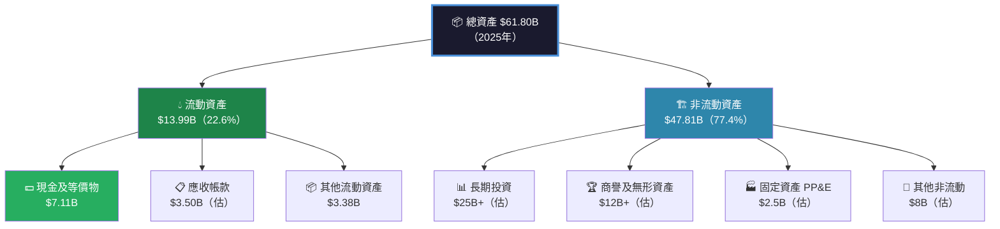

---

### 資產配置 Unicode 橫條圖

```
資產結構配置（占總資產 $61.80B）
━━━━━━━━━━━━━━━━━━━━━━━━━━━━━━━━━━━━━━━━━━━━━━━━━━━━

現金及等價物  $7.11B  ██████████░░░░░░░░░░░░░░░░░░░░  11.5%
流動資產合計  $13.99B ██████████████████████░░░░░░░░  22.6%
長期投資     ~$25B   ████████████████████████████████████░░  40.5%
商譽無形資產 ~$12B   ████████████████████░░░░░░░░░░  19.4%
固定資產PP&E ~$2.5B  ████░░░░░░░░░░░░░░░░░░░░░░░░░░   4.0%
其他資產     ~$8B   █████████████░░░░░░░░░░░░░░░░░░  12.9%
              └─────────────────────────────────────────────
              0%                50%                100%

━━━━━━━━━━━━━━━━━━━━━━━━━━━━━━━━━━━━━━━━━━━━━━━━━━━━
```

---

### 負債與流動性比率表格

| 指標 | 2022 | 2023 | 2024 | 2025 | 評估 |
|------|------|------|------|------|------|
| 📊 總資產 | $32.11B | $38.70B | $51.24B | **$61.80B** | 🟢 持續擴張 |
| 📉 總負債 | $23.61B | $26.02B | $28.77B | $33.72B | 🟡 穩步增長 |
| 💚 股東權益 | $7.34B | $11.25B | $21.56B | **$27.04B** | 🟢 快速積累 |
| 💵 現金 | $4.21B | $4.68B | $5.89B | **$7.11B** | 🟢 |
| 🔴 總負債 | $11.14B | $11.22B | $11.13B | $12.08B | 🟡 基本穩定 |
| ⚖️ 流動比率 | 1.05x | 1.20x | 1.07x | **1.14x** | 🟡 略顯緊張 |
| 🔴 負債/權益 | 1.52x | 0.98x | 0.52x | **43.8x(%)** | 🟡 需關注* |
| 📈 淨負債 | $6.93B | $6.54B | $5.24B | **$4.97B** | 🟢 持續改善 |

> ⚠️ *D/E Ratio為43.806%（非倍數），即負債/權益 = 44.7%，屬可控水平。總債務$12.08B對比EBITDA $6.99B，Net Debt/EBITDA約為0.71x，槓桿率健康。

---

### 股東權益趨勢 ASCII 圖

```
股東權益成長趨勢（$B）
━━━━━━━━━━━━━━━━━━━━━━━━━━━━━━━━━━━━━━━━━━━━━━━━━

30 │                                            ●$27.04B
25 │
20 │                              ●$21.56B
15 │
10 │             ●$11.25B
 5 │  ●$7.34B
 0 └──────────────────────────────────────────────
     2022          2023           2024           2025

  增長率：+53% → +92% → +25%（2年CAGR：+93%!!）🟢🟢🟢
  股東權益快速積累反映盈利能力的根本性轉變 ✅
━━━━━━━━━━━━━━━━━━━━━━━━━━━━━━━━━━━━━━━━━━━━━━━━━
```

---

## 5. 現金流量分析

### 現金流瀑布圖

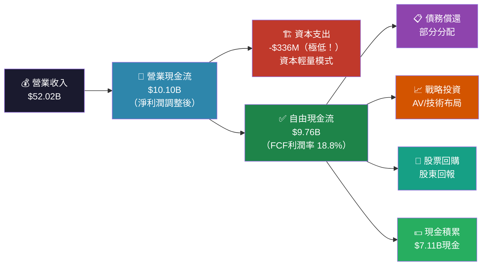

---

### 自由現金流趨勢 Unicode 進度條

```
自由現金流（FCF）爆炸式成長
━━━━━━━━━━━━━━━━━━━━━━━━━━━━━━━━━━━━━━━━━━━━━━━━━━━━━━

2022  $0.39B  ████░░░░░░░░░░░░░░░░░░░░░░░░░░░░░░░░░░░   4.0%
2023  $3.36B  ████████████████░░░░░░░░░░░░░░░░░░░░░░░  34.4%
2024  $6.89B  ████████████████████████████████░░░░░░░  70.6%
2025  $9.76B  ██████████████████████████████████████  100.0%
              └──────────────────────────────────────────────
              $0           $5B           $9.76B（上限）

FCF增長率：
  2022→2023：+761% 🚀🚀🚀
  2023→2024：+105% 🚀🚀
  2024→2025：+42%  🚀（仍高速增長）

FCF利潤率：
  2022：1.2%  ░░░░░░░░░░░░░░░░░░░░  （幾乎無）
  2023：9.0%  ████░░░░░░░░░░░░░░░░
  2024：15.7% ████████░░░░░░░░░░░░
  2025：18.8% ██████████░░░░░░░░░░  ✅ 強勁

━━━━━━━━━━━━━━━━━━━━━━━━━━━━━━━━━━━━━━━━━━━━━━━━━━━━━━
```

---

### 資本配置策略

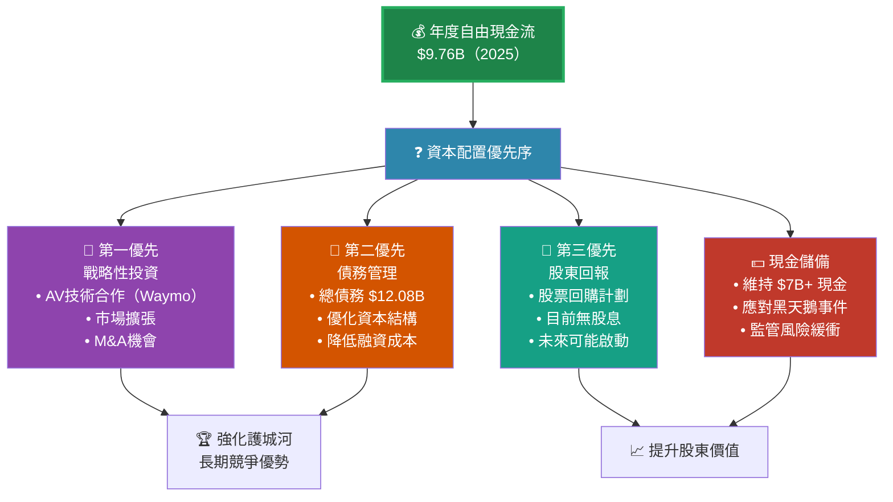

---

### 關鍵現金流指標對比

| 現金流指標 | 2022 | 2023 | 2024 | 2025 | 評估 |
|-----------|------|------|------|------|------|
| 🔄 營業現金流 | $642M | $3.58B | $7.14B | **$10.10B** | 🟢 |
| 🏗️ 資本支出 | $252M | $223M | $242M | **$336M** | 🟢 極低capex |
| ✅ 自由現金流 | $390M | $3.36B | $6.89B | **$9.76B** | 🟢 爆發增長 |
| 📊 FCF利潤率 | 1.2% | 9.0% | 15.7% | **18.8%** | 🟢 |
| 💵 期末現金 | $4.21B | $4.68B | $5.89B | **$7.11B** | 🟢 |
| 📉 Capex/收入 | 0.79% | 0.60% | 0.55% | **0.65%** | 🟢 輕資本 |

> 🔑 **關鍵洞察**：UBER的資本支出僅$336M（占收入0.65%），卻產生$9.76B自由現金流——資本效率是科技公司中的頂級水準，體現輕資產平台模式的終極優勢。

---

## 6. 獲利能力指標

### 獲利能力儀表板

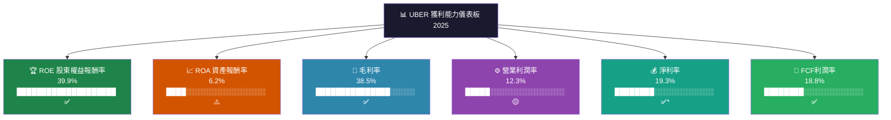

---

### ROE/ROA/ROIC 行業對比表格

| 指標 | UBER | Lyft | DoorDash | Airbnb | 行業均值 | 評估 |
|------|------|------|----------|--------|---------|------|
| 📊 **ROE** | **39.9%** | ~-15% | ~-5% | ~28% | ~15% | 🟢 頂級水準 |
| 📊 **ROA** | **6.2%** | ~-3% | ~-2% | ~10% | ~5% | 🟡 中等偏上 |
| 💎 **毛利率** | **38.5%** | ~35% | ~47% | ~73% | ~45% | 🟡 具競爭力 |
| ⚙️ **營業利潤率** | **12.3%** | ~-10% | ~-3% | ~19% | ~8% | 🟢 行業領先 |
| 💰 **淨利率** | **19.3%** | ~-12% | ~-5% | ~25% | ~10% | 🟢 |
| 🔄 **FCF利潤率** | **18.8%** | ~-5% | ~5% | ~25% | ~10% | 🟢 優秀 |

---

### 獲利能力趨勢進度條

```
各年度核心獲利能力指標演變
━━━━━━━━━━━━━━━━━━━━━━━━━━━━━━━━━━━━━━━━━━━━━━━━━━━━━━

【毛利率】
2022  38.3%  ▓▓▓▓▓▓▓▓▓▓▓▓▓▓▓▓▓▓▓▓▓▓▓▓▓▓▓▓▓▓▓▓▓▓▓▓▓▓░
2023  39.7%  ▓▓▓▓▓▓▓▓▓▓▓▓▓▓▓▓▓▓▓▓▓▓▓▓▓▓▓▓▓▓▓▓▓▓▓▓▓▓▓▓
2024  39.4%  ▓▓▓▓▓▓▓▓▓▓▓▓▓▓▓▓▓▓▓▓▓▓▓▓▓▓▓▓▓▓▓▓▓▓▓▓▓▓▓
2025  38.5%  ▓▓▓▓▓▓▓▓▓▓▓▓▓▓▓▓▓▓▓▓▓▓▓▓▓▓▓▓▓▓▓▓▓▓▓▓▓▓░  穩定

【營業利潤率】
2022  -5.7%  ░░░░░░░░░░░░░░░░░░░░░░░░░░░░░░░░░░░░░░░  虧損
2023   3.0%  ▓▓▓░░░░░░░░░░░░░░░░░░░░░░░░░░░░░░░░░░░  轉正！
2024   6.4%  ▓▓▓▓▓▓░░░░░░░░░░░░░░░░░░░░░░░░░░░░░░░  加速
2025  12.3%  ▓▓▓▓▓▓▓▓▓▓▓▓░░░░░░░░░░░░░░░░░░░░░░░░  🚀

【FCF利潤率】
2022   1.2%  ▓░░░░░░░░░░░░░░░░░░░░░░░░░░░░░░░░░░░░░  起步
2023   9.0%  ▓▓▓▓▓▓▓▓▓░░░░░░░░░░░░░░░░░░░░░░░░░░░  飛躍
2024  15.7%  ▓▓▓▓▓▓▓▓▓▓▓▓▓▓▓▓░░░░░░░░░░░░░░░░░░░  加速
2025  18.8%  ▓▓▓▓▓▓▓▓▓▓▓▓▓▓▓▓▓▓▓░░░░░░░░░░░░░░░  優秀🏆
              0%       10%       20%       30%       40%

━━━━━━━━━━━━━━━━━━━━━━━━━━━━━━━━━━━━━━━━━━━━━━━━━━━━━━
```

---

## 7. 估值分析

### 估值指標全覽

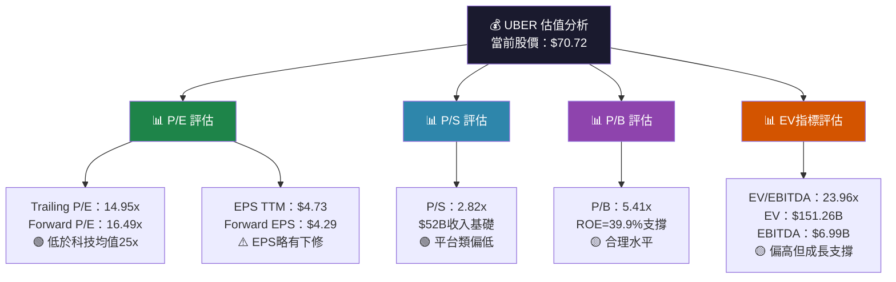

---

### 估值倍數對比表格

| 估值指標 | UBER | 同業均值 | 科技板塊均值 | 相對評估 |
|---------|------|---------|------------|---------|
| 📊 **P/E (TTM)** | 14.95x | ~25x | ~28x | 🟢 **顯著低估** |
| 📊 **P/E (Fwd)** | 16.49x | ~22x | ~25x | 🟢 **具吸引力** |
| 💰 **P/S** | 2.82x | ~3.5x | ~6x | 🟢 **偏低** |
| 📚 **P/B** | 5.41x | ~4x | ~7x | 🟡 **合理** |
| 📈 **EV/EBITDA** | 23.96x | ~18x | ~22x | 🟡 **略高** |
| 🔄 **FCF Yield** | 6.6% | ~3.5% | ~3% | 🟢 **優秀** |
| 📉 **PEG** | N/A | — | — | ⚠️ **無法計算** |

> 💡 **估值結論**：以P/E和P/S衡量，UBER相對科技板塊存在明顯折價，但EV/EBITDA略高反映市場對未來成長的溢價期待。考慮20%+的收入增速，整體估值具備吸引力。

---

### 情境目標股價分析

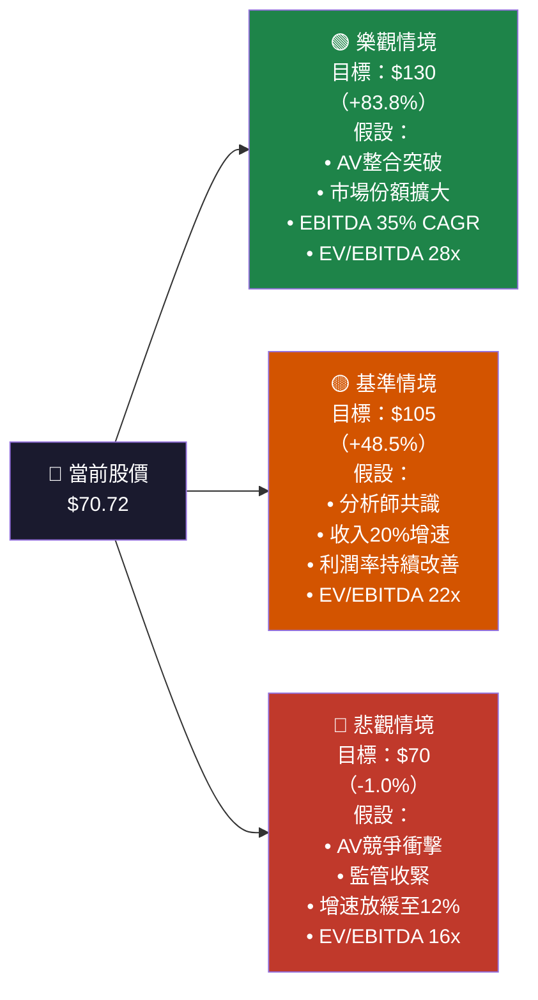

---

### 目標價區間視覺化

```
情境分析目標股價區間
━━━━━━━━━━━━━━━━━━━━━━━━━━━━━━━━━━━━━━━━━━━━━━━━━━━━━━━

      $60    $70    $80    $90   $100  $110  $120  $130
       ├──────┼──────┼──────┼──────┼─────┼─────┼─────┤
悲觀   │      ●$70  │      │      │     │     │     │
       │      │      │      │      │     │     │     │
分析師低│      ●$70  │      │      │     │     │     │
       │      │      │      │      │     │     │     │
當前價  │      ◆$70.72      │      │     │     │     │
       │      │      │      │      │     │     │     │
52W低  ●$60.63│      │      │      │     │     │     │
       │      │      │      │      │     │     │     │
基準   │      │      │      │      ●$105 │     │     │
       │      │      │      │      │     │     │     │
樂觀   │      │      │      │      │     │     │     ●$130
       │      │      │      │      │     │     │     │
52W高  │      │      │              ●$101.99   │     │
       └──────┴──────┴──────┴──────┴─────┴─────┴─────┘

🎯 加權平均目標：$101.80（樂觀25% + 基準50% + 悲觀25%）
📈 潛在報酬：+43.9%（12個月）
━━━━━━━━━━━━━━━━━━━━━━━━━━━━━━━━━━━━━━━━━━━━━━━━━━━━━━━
```

---

### 同業完整比較

| 公司 | 股票 | 市值 | P/E | P/S | 收入增速 | FCF利潤率 | 評估 |
|------|------|------|-----|-----|---------|----------|------|
| **Uber** | UBER | $147B | 14.95x | 2.82x | +20.1% | 18.8% | 🟢 **最佳** |
| Lyft | LYFT | ~$5B | N/A | ~0.8x | ~10% | ~-5% | 🔴 虧損 |
| DoorDash | DASH | ~$22B | N/A | ~4x | ~20% | ~5% | 🟡 成長 |
| Airbnb | ABNB | ~$65B | ~22x | ~6x | ~10% | ~25% | 🟢 優質 |
| DiDi | DIDI | ~$15B | N/A | ~1.2x | ~15% | N/A | 🔴 中國風險 |

---

## 8. 競爭護城河

### Porter's Five Forces 分析

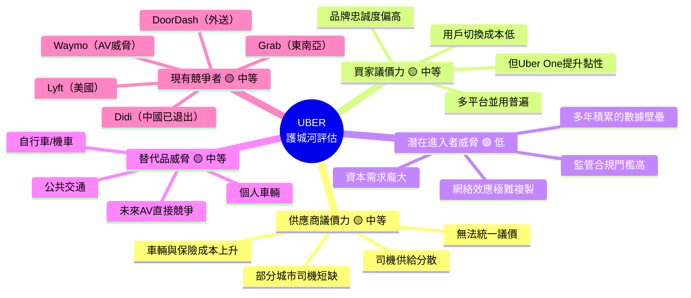

---

### 護城河評分 Unicode 條形圖

```
UBER 護城河各維度評分（滿分10分）
━━━━━━━━━━━━━━━━━━━━━━━━━━━━━━━━━━━━━━━━━━━━━━━━━━━━━━

網絡效應    9.5/10  ▓▓▓▓▓▓▓▓▓▓▓▓▓▓▓▓▓▓▓▓▓▓▓▓▓▓▓▓▓▓▓▓▓▓▓▓▓▓▓░ 🟢最強
品牌認知    8.5/10  ▓▓▓▓▓▓▓▓▓▓▓▓▓▓▓▓▓▓▓▓▓▓▓▓▓▓▓▓▓▓▓▓▓▓▓░░░░ 🟢
數據壁壘    8.0/10  ▓▓▓▓▓▓▓▓▓▓▓▓▓▓▓▓▓▓▓▓▓▓▓▓▓▓▓▓▓▓▓▓░░░░░░░ 🟢
技術平台    7.5/10  ▓▓▓▓▓▓▓▓▓▓▓▓▓▓▓▓▓▓▓▓▓▓▓▓▓▓▓▓▓▓░░░░░░░░░ 🟢
規模效應    8.5/10  ▓▓▓▓▓▓▓▓▓▓▓▓▓▓▓▓▓▓▓▓▓▓▓▓▓▓▓▓▓▓▓▓▓▓▓░░░░ 🟢
監管護城河  5.0/10  ▓▓▓▓▓▓▓▓▓▓▓▓▓▓▓▓▓▓▓▓░░░░░░░░░░░░░░░░░░░ 🟡
成本優勢    6.5/10  ▓▓▓▓▓▓▓▓▓▓▓▓▓▓▓▓▓▓▓▓▓▓▓▓▓▓░░░░░░░░░░░░░ 🟡
轉換成本    5.5/10  ▓▓▓▓▓▓▓▓▓▓▓▓▓▓▓▓▓▓▓▓▓▓░░░░░░░░░░░░░░░░░ 🟡
              └──────────────────────────────────────────────
              0        3        5        7        9       10

綜合護城河評分：7.4/10 ★★★★☆ — 寬護城河 🏆
━━━━━━━━━━━━━━━━━━━━━━━━━━━━━━━━━━━━━━━━━━━━━━━━━━━━━━
```

---

### 競爭定位矩陣

| 維度 | UBER | Lyft | DoorDash | Airbnb | DiDi |
|------|------|------|----------|--------|------|
| 🌍 地理覆蓋 | 🟢 全球 | 🔴 美加 | 🟡 多國 | 🟢 全球 | 🟡 亞太 |
| 💡 技術能力 | 🟢 頂級 | 🟡 中等 | 🟢 強 | 🟡 中等 | 🟢 強 |
| 💰 財務健康 | 🟢 優 | 🔴 差 | 🟡 中 | 🟢 優 | 🔴 差 |
| 🌐 品牌強度 | 🟢 第一 | 🟡 中 | 🟡 中 | 🟢 強 | 🟡 中 |
| 🚀 成長動能 | 🟢 強 | 🟡 中 | 🟢 強 | 🟡 中 | 🟡 中 |
| 🤖 AV布局 | 🟢 Waymo | 🔴 無 | 🔴 無 | 🔴 無 | 🟡 有 |
| **綜合評級** | **🟢 第一** | **🔴 弱勢** | **🟡 中等** | **🟢 強** | **🟡 區域** |

---

## 9. 成長催化劑

### 催化劑時間軸

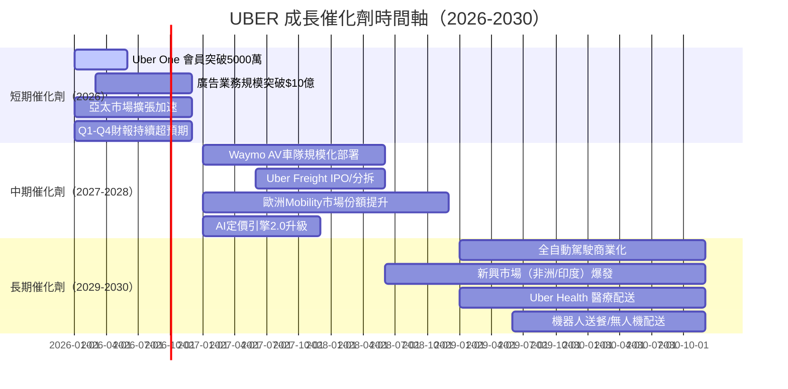

---

### 短/中/長期機會

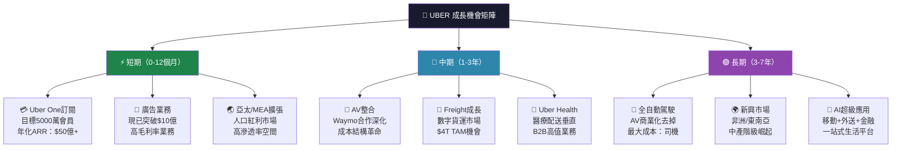

---

### TAM 市場規模 Unicode 圖表

```
UBER 各業務線可及市場規模（TAM）
━━━━━━━━━━━━━━━━━━━━━━━━━━━━━━━━━━━━━━━━━━━━━━━━━━━━━━

全球叫車市場      $500B  ████████████████████████████████████████████ 🟢
全球餐飲外送市場   $400B  ████████████████████████████████████████ 🟢
全球貨運物流市場   $4,000B ██████████████████████████████████████████████████████████████████████████████ 🚀
全球廣告市場      $900B  ██████████████████████████████████████████████████████████████████████████████████████ 🟢
AV叫車市場（2030） $800B  ████████████████████████████████████████████████████████████████████ 🤖

合計總TAM：       ~$6.6T  ████████████████████████████████...無限延伸

UBER當前滲透率：
  叫車：~10% ████████░░░░░░░░░░░░░░░░░░░░░░░░░░░░░░░░  →  目標15%+
  外送：~8%  ███████░░░░░░░░░░░░░░░░░░░░░░░░░░░░░░░░░  →  目標12%+
  貨運：~0.5%░░░░░░░░░░░░░░░░░░░░░░░░░░░░░░░░░░░░░░░  →  目標3%+
  廣告：~0.1%░░░░░░░░░░░░░░░░░░░░░░░░░░░░░░░░░░░░░░░  →  目標1%+

⭐ 結論：若UBER能將每個業務線滲透率提升3倍，收入潛力>$300B
━━━━━━━━━━━━━━━━━━━━━━━━━━━━━━━━━━━━━━━━━━━━━━━━━━━━━━
```

---

## 10. 風險分析

### 風險矩陣

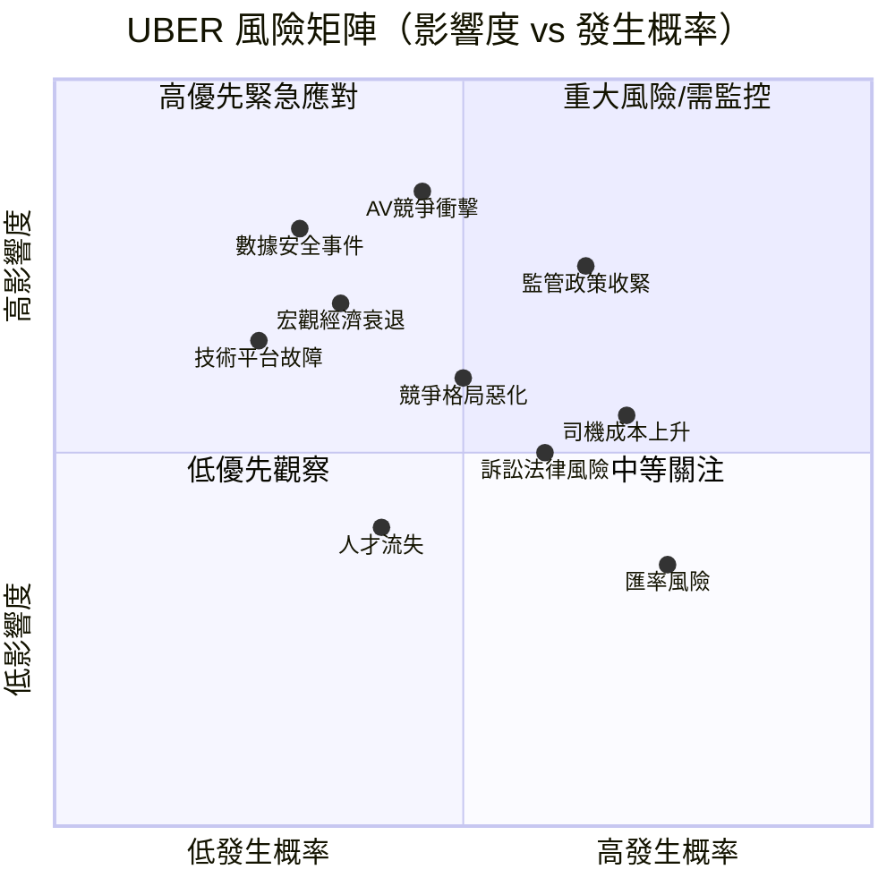

---

### 風險評分卡

| 風險類別 | 風險描述 | 發生概率 | 影響度 | 風險分數 | 緩解狀態 |
|---------|---------|---------|-------|---------|---------|
| 🔴 **監管政策** | 司機定員工、平台監管收緊 | 65% | 高 | **7.8/10** | 🔴 持續監控 |
| 🔴 **AV競爭** | Waymo/Tesla直接取代叫車平台 | 45% | 極高 | **7.5/10** | 🟡 戰略合作緩解 |
| 🔴 **宏觀衰退** | 消費者削減非必要出行支出 | 35% | 高 | **6.5/10** | 🟡 業務多元化 |
| 🟡 **數據安全** | 隱私洩露/駭客攻擊事件 | 30% | 極高 | **6.0/10** | 🟡 持續投入安全 |
| 🟡 **競爭惡化** | Lyft/DoorDash補貼大戰重啟 | 50% | 中 | **5.5/10** | 🟢 規模優勢 |
| 🟡 **司機成本** | 最低薪資法規/保險成本上升 | 70% | 中 | **5.5/10** | 🟡 技術降成本 |
| 🟡 **訴訟風險** | 各地法律訴訟、罰款 | 60% | 中 | **5.0/10** | 🟡 法務團隊 |
| 🟢 **匯率風險** | 強美元影響海外收入 | 75% | 低 | **3.5/10** | 🟢 自然對沖 |
| 🟢 **技術故障** | 平台宕機影響業務 | 25% | 中 | **3.0/10** | 🟢 冗餘架構 |
| 🟢 **人才流失** | 工程師/關鍵高管離職 | 40% | 低 | **2.5/10** | 🟢 薪酬競爭力 |

---

### 風險緩解措施

```
風險緩解優先行動計劃
━━━━━━━━━━━━━━━━━━━━━━━━━━━━━━━━━━━━━━━━━━━━━━━━━━━

🔴 高優先級：
  ├─ [1] 與Waymo深度整合，從競爭者轉為生態夥伴
  ├─ [2] 持續游說各地立法機構，建立監管合規框架
  └─ [3] 業務多元化（廣告、健康、企業服務）降低單一依賴

🟡 中優先級：
  ├─ [4] Uber One訂閱體系增強用戶黏性和轉換成本
  ├─ [5] 持續技術投入提升算法優勢，降低對司機依賴
  ├─ [6] 建立$7B+現金儲備應對黑天鵝事件
  └─ [7] 強化數據安全基礎設施，建立用戶信任

🟢 低優先級：
  ├─ [8] 自然語言對沖和跨貨幣定價降低匯率風險
  ├─ [9] 多雲架構和災備系統確保平台穩定性
  └─ [10] 股票期權激勵留住核心工程師和高管
━━━━━━━━━━━━━━━━━━━━━━━━━━━━━━━━━━━━━━━━━━━━━━━━━━━
```

---

## 11. 公平價值估算

### DCF 模型架構

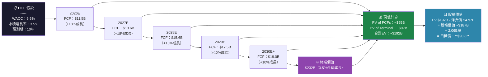

---

### 三種估值法比較

| 估值方法 | 方法說明 | 計算基礎 | 目標股價 | 權重 | 加權貢獻 |
|---------|---------|---------|---------|------|---------|
| 📊 **DCF法** | 自由現金流折現 | WACC=9.5%, g=3.5% | **$90.8** | 40% | $36.3 |
| 💰 **EV/EBITDA法** | 相對估值倍數 | 2026E EBITDA × 22x | **$98.5** | 35% | $34.5 |
| 📈 **P/E倍數法** | 市盈率相對估值 | 2026E EPS $5.2 × 20x | **$104.0** | 25% | $26.0 |
| ━━ | ━━━━━━━━━━━━━━ | ━━━━━━━━━━━━━━━━━━ | ━━━━━━━ | ━━━━ | ━━━━━ |
| 🎯 **加權平均** | 三法綜合評估 | — | **$96.8** | 100% | 🟢 |

---

### 估值區間視覺化

```
UBER 公平價值區間（基於三種估值法）
━━━━━━━━━━━━━━━━━━━━━━━━━━━━━━━━━━━━━━━━━━━━━━━━━━━━━━

      $60   $70   $80   $90   $100  $110  $120  $130
       │     │     │     │     │     │     │     │
DCF法  │     │     │     ◆$90.8│     │     │     │
       │     │     │     │ ←--→│     │     │     │
       │     │     │[低: $78  高: $105]     │     │
       │     │     │     │     │     │     │     │
EV/EBITDA    │     │     │  ◆$98.5   │     │     │
       │     │     │     │ ←--------→│     │     │
       │     │     │[低: $85  高: $114]     │     │
       │     │     │     │     │     │     │     │
P/E法  │     │     │     │     │◆$104│     │     │
       │     │     │     │ ←-----------→  │     │
       │     │     │[低: $88  高: $118]    │     │
       │     │     │     │     │     │     │     │
當前價 │     ◆$70.72     │     │     │     │     │
       │     │     │     │     │     │     │     │
加權目標價：  ◆$96.8（↑36.9%潛在報酬）
       └─────┴─────┴─────┴─────┴─────┴─────┴─────┘

🎯 公平價值中點：$96.8 → 當前折價率：-26.9%
💡 結論：UBER 當前股價存在顯著