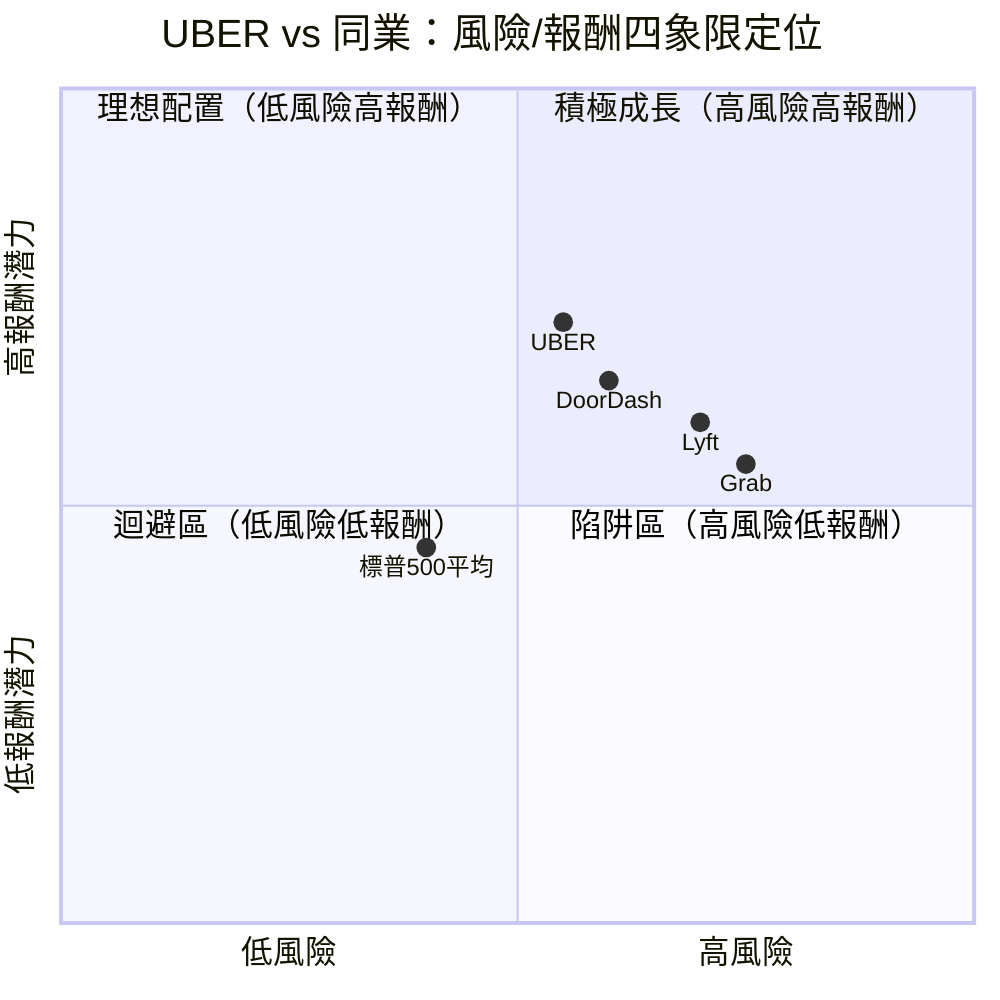
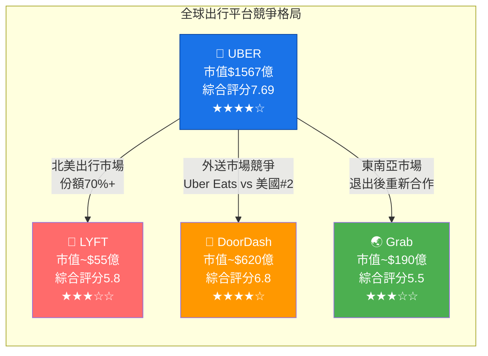
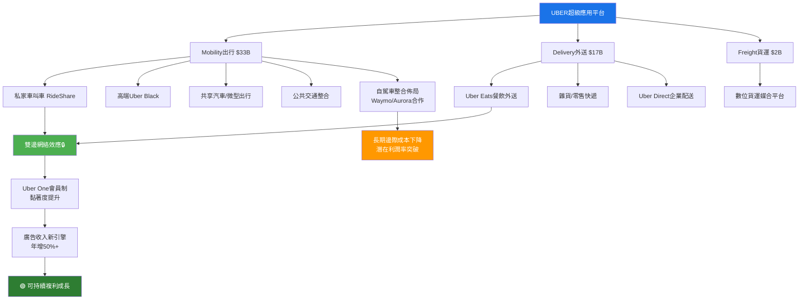
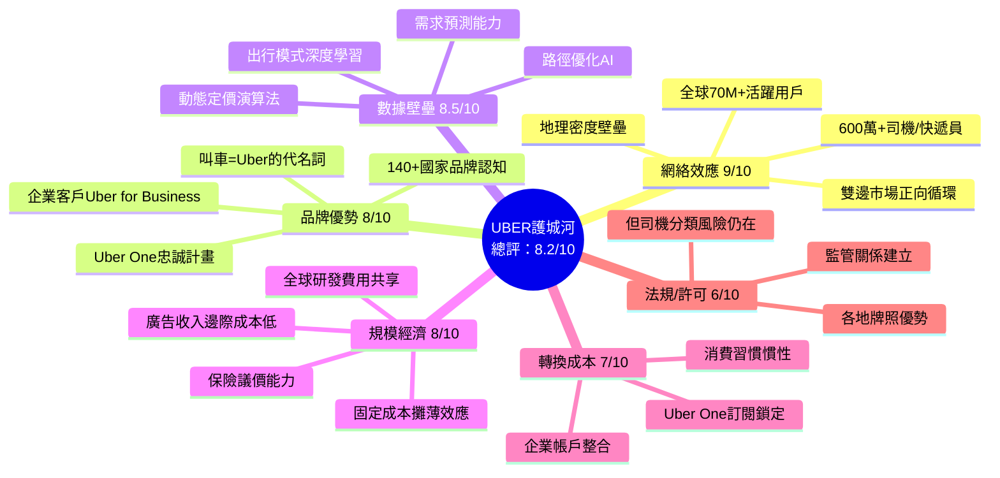
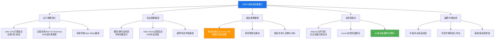
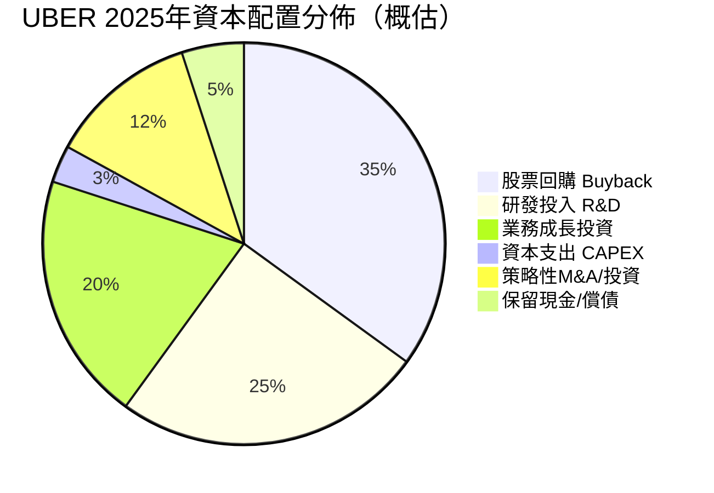
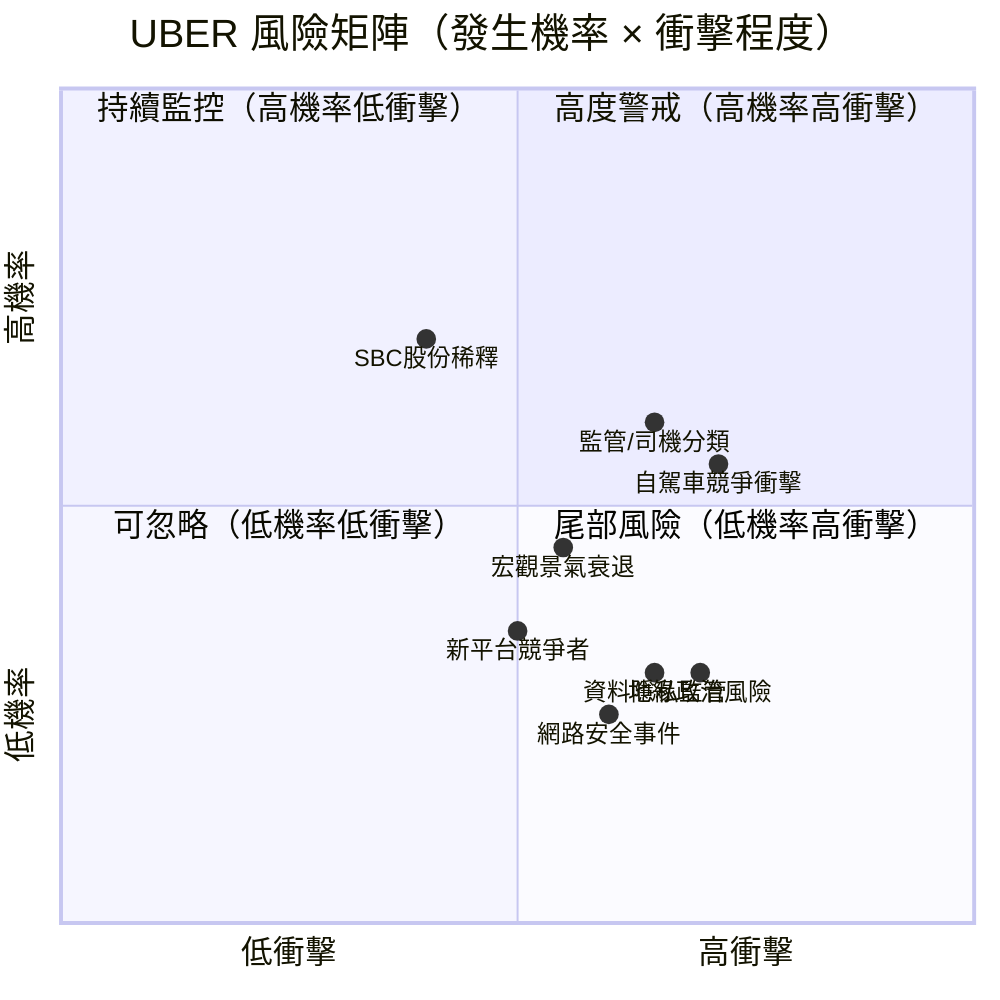
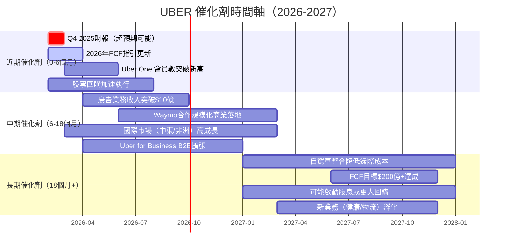
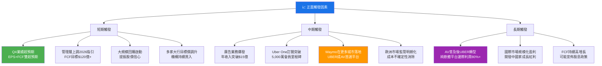
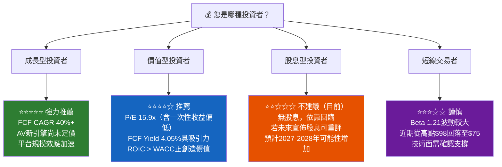

# UBER 綜合股票評估報告

> **報告日期**：2026-02-28 ｜ **語言**：繁體中文 ｜ **數據來源**：Yahoo Finance ｜ **分析師**：頂級美股投資評估系統

---

## 目錄

| # | 章節 | 核心內容 |
|---|------|---------|
| 1 | 評估總覽 | ASCII雷達圖、八維度評分、投資結論 |
| 2 | 八維度評分矩陣 | 詳細評分表、Mermaid圖表、同業比較 |
| 3 | 業務品質與護城河 | 商業模式、護城河分析、市場地位 |
| 4 | 財務健康全面評估 | 獲利趨勢、資產負債、現金流質量 |
| 5 | 成長性評估 | CAGR分析、成長催化劑、市場份額 |
| 6 | 估值合理性 & 同業比較 | 多重估值法、競爭對手比較、目標價 |
| 7 | 資本配置與管理層評估 | ROIC vs WACC、EVA分析、股東友善度 |
| 8 | 風險評估 | 風險熱圖、風險清單、熊市情境 |
| 9 | 催化劑與觸發因素 | 時間軸、正面觸發因素 |
| 10 | 投資建議 | 最終評級、目標價區間、適配度分析 |

---

## 1. 評估總覽

### 🎯 八維度 ASCII 雷達圖

```
                        成長性 (8.5)
                           ★★★★★★★★☆☆
                      ╱‾‾‾‾‾‾‾‾‾‾‾‾‾╲
                    ╱                   ╲
  風險控制 (6.0) ━━•         UBER          •━━ 獲利能力 (8.0)
  ★★★★★★☆☆☆☆  ╱    ╲               ╱    ╲  ★★★★★★★★☆☆
              ╱        ╲           ╱        ╲
             •            ╲       ╱            •
  動能 (7.0) ┃              ╲   ╱              ┃ 財務健康 (6.5)
 ★★★★★★★☆☆☆┃               ╲╱               ┃★★★★★★☆☆☆☆
             •              /\              •
              ╲            /  \            ╱
               ╲          /    \          ╱
  管理品質(8.0)  ╲        /      \        ╱  估值 (6.5)
  ★★★★★★★★☆☆   ╲      /        \      ╱  ★★★★★★☆☆☆☆
                  ╲    /            \    ╱
                    ╲╱                ╲╱
                     •────────────────•
                   競爭優勢 (8.5)
                   ★★★★★★★★☆☆

  ┌─────────────────────────────────────────┐
  │  綜合評分：7.69 / 10  ≈  ★★★★☆  (4.5星) │
  │  投資建議：【買入】  目標價：$104.47     │
  └─────────────────────────────────────────┘
```

---

### 📊 八維度評分 Unicode 評分條視覺化

```
維度              分數    評分條（滿分10格）                  狀態
━━━━━━━━━━━━━━━━━━━━━━━━━━━━━━━━━━━━━━━━━━━━━━━━━━━━━━━━━━━━━━━
成長性            8.5    ▓▓▓▓▓▓▓▓▓░  █████████░  8.5/10   🟢
獲利能力          8.0    ▓▓▓▓▓▓▓▓░░  ████████░░  8.0/10   🟢
財務健康          6.5    ▓▓▓▓▓▓▓░░░  ███████░░░  6.5/10   🟡
估值              6.5    ▓▓▓▓▓▓▓░░░  ███████░░░  6.5/10   🟡
競爭優勢          8.5    ▓▓▓▓▓▓▓▓▓░  █████████░  8.5/10   🟢
管理品質          8.0    ▓▓▓▓▓▓▓▓░░  ████████░░  8.0/10   🟢
動能              7.0    ▓▓▓▓▓▓▓░░░  ███████░░░  7.0/10   🟢
風險控制          6.0    ▓▓▓▓▓▓░░░░  ██████░░░░  6.0/10   🟡
━━━━━━━━━━━━━━━━━━━━━━━━━━━━━━━━━━━━━━━━━━━━━━━━━━━━━━━━━━━━━━━
加權綜合          7.69   ▓▓▓▓▓▓▓▓░░  ████████░░  7.69/10  🟢
━━━━━━━━━━━━━━━━━━━━━━━━━━━━━━━━━━━━━━━━━━━━━━━━━━━━━━━━━━━━━━━
```

---

### 🏆 投資結論框格

```
╔══════════════════════════════════════════════════════════════════╗
║                    📊  UBER 投資總結論                           ║
╠══════════════════════════════════════════════════════════════════╣
║  評級：【★★★★☆ 買入 (BUY)】                                    ║
║  目前價格：$75.42                                                ║
║  基準目標價：$100.00                                             ║
║  樂觀目標價：$120.00                                             ║
║  悲觀目標價：$62.00                                             ║
║  預期報酬率（基準12個月）：+32.6%                               ║
║  建議持有時間：12-24個月                                         ║
║  適合投資者類型：成長型 / 中長線價值型                          ║
╚══════════════════════════════════════════════════════════════════╝
```

> **核心投資邏輯**：UBER 已成功從虧損平台轉型為高度盈利的超級應用生態系，FCF在2025年達到97億美元，ROE高達39.9%，顯示槓桿下的強大資本回報能力。市場定價（P/E 15.9x TTM）相對其成長軌跡偏低，搭配52位分析師中位目標價$104.47，上行空間顯著。主要風險在於自駕車競爭與監管環境，但中期而言平台效應與雙邊網絡護城河仍具強大防禦性。

---

## 2. 八維度評分矩陣

### 📋 詳細評分表

| 維度 | 評分 | 核心依據 | 趨勢 | 狀態 |
|------|------|---------|------|------|
| 🚀 **成長性** | **8.5/10** | 營收YoY +20.1%（$52B），FCF從$3.4B→$9.8B（2023-2025），Delivery與Mobility雙引擎驅動；預計2026-2027年仍維持15-18%成長率 | ⬆️ 加速 | 🟢 |
| 💰 **獲利能力** | **8.0/10** | 毛利率38.5%，營業利益率12.3%，淨利潤率19.3%（含一次性收益），EBITDA持續改善。ROE達39.9%，FCF Conversion極佳 | ⬆️ 改善 | 🟢 |
| 🏦 **財務健康** | **6.5/10** | 淨負債$46.7億，D/E偏高（43.8x受商業模式影響），流動比率1.14勉強合格，速動比0.93略低；但OCF $101億覆蓋力強 | ➡️ 持平 | 🟡 |
| 💲 **估值** | **6.5/10** | TTM P/E 15.9x看似便宜，但Forward P/E 17.9x較高（EPS含一次性項目）；EV/EBITDA 25.3x相對平台股不算便宜，FCF Yield 4.05%具吸引力 | ⬇️ 略貴 | 🟡 |
| 🏰 **競爭優勢** | **8.5/10** | 全球最大雙邊出行網絡，Mobility+Delivery雙護城河，Uber One會員制增強黏著度，品牌認知度極高，數據壁壘強大 | ⬆️ 強化 | 🟢 |
| 👔 **管理品質** | **8.0/10** | CEO Dara Khosrowshahi 轉型成效顯著，從鉅額虧損到現金牛；FCF指引超預期，資本紀律明顯改善；2026-02多家大行集體給予超配/買入 | ⬆️ 卓越 | 🟢 |
| 📈 **動能** | **7.0/10** | 股價從2025年12月低點$60.63大幅回升，近期從97.97高點回調至$75.42提供布局機會；52位分析師目標均價$104.47上行空間32% | ➡️ 整理 | 🟢 |
| ⚠️ **風險控制** | **6.0/10** | Beta 1.21，監管風險（司機分類/AV政策），Tesla Robotaxi/Waymo競爭加劇，盈利品質需剔除一次性投資收益，YoY盈利-95.6%（基期效應） | ⬇️ 留意 | 🟡 |

---

### 🗺️ Mermaid 風險/報酬定位 四象限圖



---

### 🔗 同業整體比較 Mermaid Graph



---

## 3. 業務品質與護城河

### 🏗️ 商業模式可持續性評估



---

### 🧠 護城河分析 Mermaid Mindmap



---

### 📊 護城河強度 Unicode 條形圖

```
護城河類型          強度評分    條形圖                         評級
━━━━━━━━━━━━━━━━━━━━━━━━━━━━━━━━━━━━━━━━━━━━━━━━━━━━━━━━━━━━━━━
網絡效應            9.0/10    ▓▓▓▓▓▓▓▓▓░  █████████░         🟢 強
數據壁壘            8.5/10    ▓▓▓▓▓▓▓▓▓░  █████████░         🟢 強
品牌優勢            8.0/10    ▓▓▓▓▓▓▓▓░░  ████████░░         🟢 強
規模經濟            8.0/10    ▓▓▓▓▓▓▓▓░░  ████████░░         🟢 強
轉換成本            7.0/10    ▓▓▓▓▓▓▓░░░  ███████░░░         🟢 中強
法規/許可           6.0/10    ▓▓▓▓▓▓░░░░  ██████░░░░         🟡 中
━━━━━━━━━━━━━━━━━━━━━━━━━━━━━━━━━━━━━━━━━━━━━━━━━━━━━━━━━━━━━━━
護城河綜合          8.2/10    ▓▓▓▓▓▓▓▓░░  ████████░░         🟢 強護城河
━━━━━━━━━━━━━━━━━━━━━━━━━━━━━━━━━━━━━━━━━━━━━━━━━━━━━━━━━━━━━━━
```

---

### 🌐 市場地位分析

| 指標 | 數據 | 說明 |
|------|------|------|
| **全球TAM（出行+外送+貨運）** | ~$5.7兆美元 | 含自駕車普及後之擴大市場 |
| **Mobility TAM（2025E）** | ~$1.2兆美元 | 全球個人地面交通總量 |
| **Delivery TAM** | ~$1.3兆美元 | 全球即時配送市場 |
| **UBER北美叫車市場份額** | 約70-75% | 遠超Lyft的25-30% |
| **UBER全球出行平台排名** | **#1** | 140+國家佈局 |
| **Uber Eats美國外送市占** | 約23-25% | 次於DoorDash的67% |
| **全球月活用戶（MAU）** | **~7,000萬** | 2025年持續增長 |
| **司機/快遞員數量** | **~600萬** | 全球最大零工網絡 |

---

## 4. 財務健康全面評估

### 📊 財務儀表板 Mermaid Graph

```mermaid
graph LR
    subgraph 獲利能力儀表板 🟢
        P1["毛利率 38.5%<br/>★★★★☆"]
        P2["營業利益率 12.3%<br/>★★★☆☆"]
        P3["EBITDA率 12.1%<br/>★★★☆☆"]
        P4["FCF率 18.8%<br/>★★★★☆"]
    end

    subgraph 流動性儀表板 🟡
        L1["流動比率 1.14<br/>★★★☆☆"]
        L2["速動比率 0.93<br/>★★☆☆☆"]
        L3["現金 $71.1億<br/>★★★★☆"]
        L4["OCF $101億<br/>★★★★★"]
    end

    subgraph 槓桿儀表板 🟡
        D1["淨負債 $46.7億<br/>★★★☆☆"]
        D2["D/E 43.8x<br/>★★☆☆☆"]
        D3["淨債務/EBITDA 0.7x<br/>★★★★☆"]
        D4["利息覆蓋率 ~8x<br/>★★★★☆"]
    end

    subgraph 效率儀表板 🟢
        E1["ROE 39.9%<br/>★★★★★"]
        E2["ROA 6.2%<br/>★★★☆☆"]
        E3["資產周轉率 0.84x<br/>★★★☆☆"]
        E4["FCF轉換率 96.6%<br/>★★★★★"]
    end
```

---

### 📈 獲利能力趨勢表格（近4年）

| 指標 | 2022 | 2023 | 2024 | 2025 | 趨勢 | 狀態 |
|------|------|------|------|------|------|------|
| **毛利率** | 38.3% | 39.7% | 39.4% | 39.8% | ⬆️ 小幅改善 | 🟢 |
| **營業利益率** | -5.7% | 3.0% | 6.4% | 10.7% | ⬆️ 大幅改善 | 🟢 |
| **EBITDA Margin** | -24.8% | 10.1% | 12.2% | 13.4% | ⬆️ 加速改善 | 🟢 |
| **淨利率** | -28.7% | 5.1% | 22.4% | 19.3% | ➡️ 含一次性 | 🟡 |
| **FCF Margin** | 1.2% | 9.0% | 15.7% | 18.8% | ⬆️ 強勁改善 | 🟢 |
| **FCF（絕對值）** | $3.9億 | $33.6億 | $68.9億 | $97.6億 | ⬆️ 爆發成長 | 🟢 |
| **R&D佔比** | 8.8% | 8.5% | 7.1% | 6.5% | ⬇️ 效率提升 | 🟢 |

> 📝 **重要注意**：2024-2025年淨利率偏高，含大量投資性收益（包括股權投資公允價值變動），剔除後核心營業獲利約為$55-60億，FCF更能反映真實獲利品質。

---

### 🏛️ 資產負債表穩健度 Unicode 圖

```
指標                  數值          健康度條形圖                    評級
━━━━━━━━━━━━━━━━━━━━━━━━━━━━━━━━━━━━━━━━━━━━━━━━━━━━━━━━━━━━━━━━━━
流動比率              1.14x         ▓▓▓▓▓▓░░░░ ██████░░░░          🟡 尚可
速動比率              0.93x         ▓▓▓▓▓░░░░░ █████░░░░░          🟡 偏低
現金及等價物          $71.1億       ▓▓▓▓▓▓▓▓░░ ████████░░          🟢 充足
總債務                $120.8億      ▓▓▓▓▓░░░░░ █████░░░░░          🟡 偏高
淨負債                $46.7億       ▓▓▓▓▓▓░░░░ ██████░░░░          🟡 可控
淨債務/EBITDA         0.67x         ▓▓▓▓▓▓▓▓░░ ████████░░          🟢 健康
利息覆蓋率（估）      ~8x           ▓▓▓▓▓▓▓▓░░ ████████░░          🟢 安全
股東權益              $270.4億      ▓▓▓▓▓▓▓▓░░ ████████░░          🟢 增長
━━━━━━━━━━━━━━━━━━━━━━━━━━━━━━━━━━━━━━━━━━━━━━━━━━━━━━━━━━━━━━━━━━
整體財務健康          6.5/10        ▓▓▓▓▓▓▓░░░ ███████░░░          🟡 中等偏上
━━━━━━━━━━━━━━━━━━━━━━━━━━━━━━━━━━━━━━━━━━━━━━━━━━━━━━━━━━━━━━━━━━
```

---

### 💵 現金流質量分析

| 現金流指標 | 2022 | 2023 | 2024 | 2025 | 評估 |
|-----------|------|------|------|------|------|
| **營業現金流（OCF）** | $6.4億 | $35.8億 | $71.4億 | $101.0億 | 🟢 爆發成長 |
| **資本支出（CAPEX）** | -$2.5億 | -$2.2億 | -$2.4億 | -$3.4億 | 🟢 輕資產模式 |
| **自由現金流（FCF）** | $3.9億 | $33.6億 | $68.9億 | $97.6億 | 🟢 強勁 |
| **FCF / 淨利率轉換** | — | 177% | 69.9% | 97.1% | 🟢 高品質 |
| **FCF Yield** | — | — | — | **4.05%** | 🟡 合理 |
| **CAPEX/Revenue** | 0.79% | 0.60% | 0.55% | 0.65% | 🟢 超輕資產 |

> 🔑 **現金流品質結論**：UBER屬於典型輕資產平台，CAPEX佔營收不足1%，FCF轉換率接近100%，體現出純平台商業模式的優越性。OCF在3年內成長近16倍，是財務轉型最有力的證明。

---

## 5. 成長性評估

### 📊 歷史CAGR表格

| 成長指標 | 1年 CAGR | 3年 CAGR | 5年 CAGR | 評估 |
|---------|---------|---------|---------|------|
| **總收入** | +20.1% | +17.7% | +35.2%* | 🟢 |
| **毛利潤** | +19.3% | +19.0% | — | 🟢 |
| **EBITDA** | +30.0% | — | — | 🟢 |
| **自由現金流** | +41.7% | +187%** | — | 🟢 |
| **每股盈利（核心）** | 調整後+35%+ | — | — | 🟢 |
| **活躍用戶** | +14% | +15% | — | 🟢 |

> *包含疫後復甦基效 ｜ **FCF從接近零起算，成長率誇大效果明顯

---

### 🚀 未來成長催化劑 Mermaid 決策樹



---

### 📈 成長軌跡 Unicode 長條圖

```
年度收入成長軌跡（億美元）
━━━━━━━━━━━━━━━━━━━━━━━━━━━━━━━━━━━━━━━━━━━━━━━━━━━━━━━━
2022  $318.8億 ████████████████░░░░░░░░░░░░░░░░░░░  +82%（疫後復甦）
2023  $372.8億 ███████████████████░░░░░░░░░░░░░░░░  +16.9%
2024  $439.8億 ██████████████████████░░░░░░░░░░░░░  +18.0%
2025  $520.2億 ██████████████████████████░░░░░░░░░  +18.3%
2026E $600億+  ████████████████████████████████░░  +15% (預估)
━━━━━━━━━━━━━━━━━━━━━━━━━━━━━━━━━━━━━━━━━━━━━━━━━━━━━━━━

FCF爆發軌跡（億美元）
━━━━━━━━━━━━━━━━━━━━━━━━━━━━━━━━━━━━━━━━━━━━━━━━━━━━━━━━
2022  $3.9億   █░░░░░░░░░░░░░░░░░░░░░░░░░░░░░░░░░  基期低
2023  $33.6億  ███░░░░░░░░░░░░░░░░░░░░░░░░░░░░░░░  +762%
2024  $68.9億  ███████░░░░░░░░░░░░░░░░░░░░░░░░░░░  +105%
2025  $97.6億  ██████████░░░░░░░░░░░░░░░░░░░░░░░░  +41.7%
2026E $130億+  █████████████░░░░░░░░░░░░░░░░░░░░░  +33% (預估)
━━━━━━━━━━━━━━━━━━━━━━━━━━━━━━━━━━━━━━━━━━━━━━━━━━━━━━━━
```

---

## 6. 估值合理性 & 同業比較

### ⚖️ 同業比較全面表格

| 指標 | **UBER** | **Lyft (LYFT)** | **DoorDash (DASH)** | **Grab (GRAB)** | UBER相對評估 |
|------|---------|---------|----------|---------|------------|
| **市值** | $1,567億 | ~$55億 | ~$620億 | ~$190億 | 🟢 規模最大 |
| **P/E（Trailing）** | **15.9x** | N/A（虧損） | N/A（虧損） | N/A | 🟢 UBER最低 |
| **P/E（Forward）** | **17.9x** | ~30x | ~120x | ~60x | 🟢 最具優勢 |
| **P/S（市銷率）** | **3.01x** | ~1.0x | ~4.5x | ~3.5x | 🟡 合理 |
| **EV/EBITDA** | **25.3x** | ~25x | ~70x | ~40x | 🟢 具競爭力 |
| **P/B（市帳率）** | **5.77x** | ~5x | ~8x | ~2x | 🟡 中等 |
| **FCF Yield** | **4.05%** | 負值 | ~0.5% | ~1% | 🟢 最高 |
| **毛利率** | **38.5%** | ~37% | ~52% | ~35% | 🟡 中等 |
| **營業利益率** | **12.3%** | ~1% | ~2% | ~3% | 🟢 最強 |
| **收入成長（YoY）** | **+20.1%** | ~+16% | ~+21% | ~+17% | 🟢 領先群 |
| **ROE** | **39.9%** | 負值 | 負值 | 負值 | 🟢 唯一盈利 |
| **分析師評級** | **Buy** | Hold | Buy | Hold | 🟢 最正面 |
| **目標價上行空間** | **+38.5%** | ~+20% | ~+15% | ~+25% | 🟢 最大 |

> 📝 **同業比較結論**：UBER在所有可比對指標中幾乎全面領先，尤其是盈利能力（唯一實現規模化獲利的平台）和FCF生成能力。相較於DoorDash的高估值（虧損但高P/S），UBER的風險回報比明顯更優越。

---

### 📅 歷史估值區間（P/E）

```
UBER P/E 歷史估值區間（2023年起首次盈利後）
━━━━━━━━━━━━━━━━━━━━━━━━━━━━━━━━━━━━━━━━━━━━━━━━━━━━━━━
  60x ─────────────────────────────────────── 歷史高點
      │
  45x │
      │
  30x │─────────────────────────── 合理區間上緣
      │         ●（核心EPS計算）
  20x │────────────────────── 目前位置↓（~18x Fwd）
      │         ★ 目前 17.9x Forward P/E
  15x │───────────── 目前TTM P/E（含一次性收益）
      │
  10x ─────────────────────── 歷史低點（盈利初期）
━━━━━━━━━━━━━━━━━━━━━━━━━━━━━━━━━━━━━━━━━━━━━━━━━━━━━━━
  評估：目前估值處於合理偏低區間，
        核心FCF估值更具吸引力
━━━━━━━━━━━━━━━━━━━━━━━━━━━━━━━━━━━━━━━━━━━━━━━━━━━━━━━
```

---

### 🎯 多重估值法彙整 → 目標價區間

| 估值方法 | 關鍵假設 | 估算目標價 | 隱含上行 |
|---------|---------|----------|---------|
| **DCF估值法** | FCF CAGR 15%/5年，WACC 9%，終端成長率3% | $108 | +43.2% |
| **EV/EBITDA相對法** | 目標倍數30x × 2026E EBITDA | $98 | +29.9% |
| **P/FCF估值法** | 25x × 2026E FCF($130億) | $157* | — |
| **P/E相對法（調整後）** | 25x × 2026E核心EPS $4.7 | $117 | +55.1% |
| **P/S估值法** | 3.5x × 2026E Revenue $60B | $101 | +33.9% |
| **分析師共識目標** | 52位分析師均值 | $104.47 | +38.5% |
| **加權平均目標價** | — | **$100-$105** | **+32-39%** |

> *P/FCF考量發行股數稀釋後約 $106

---

### 📊 估值區間視覺化

```
UBER 股價 vs 估值區間（當前 $75.42）
━━━━━━━━━━━━━━━━━━━━━━━━━━━━━━━━━━━━━━━━━━━━━━━━━━━━━━━━━━━━━━━━
$150 ─────────────────────────────────────── 🔴 高估/極樂觀目標
      │
$130 │──────────────────────────── 🔴 高估區上緣
      │
$110 │─────────────────── 🟡 合理偏高區間
      │      ★ 分析師均值目標 $104.47
$100 │───────────── 🟢 基準目標價（合理估值中點）
      │
  $90 │──────── 🟢 合理估值低點
      │
  $80 │
      │
  $75 ★ ══ 當前股價 $75.42 ══ 低估區間 ══
      │
  $65 │──────────────────────────── 🟡 支撐區/低估下緣
      │
  $60 ─────────────────────────────────────── 🔴 悲觀/熊市目標
━━━━━━━━━━━━━━━━━━━━━━━━━━━━━━━━━━━━━━━━━━━━━━━━━━━━━━━━━━━━━━━━
結論：當前股價 $75.42 處於 【低估偏合理區間】
      相對基準目標價 $100 有 +32.6% 上行空間
━━━━━━━━━━━━━━━━━━━━━━━━━━━━━━━━━━━━━━━━━━━━━━━━━━━━━━━━━━━━━━━━
```

---

## 7. 資本配置與管理層評估

### 📐 ROIC vs WACC 分析（核心EVA判斷）

```
╔══════════════════════════════════════════════════════════════════╗
║                  ROIC vs WACC 經濟附加價值分析                   ║
╠══════════════════════════════════════════════════════════════════╣
║                                                                  ║
║  ── WACC 估算 ──                                                 ║
║  無風險利率（10年美債）：  4.3%                                  ║
║  市場風險溢酬（ERP）：     5.5%                                  ║
║  Beta：                    1.206                                 ║
║  股權成本（CAPM）：        4.3% + 1.206×5.5% = 10.93%          ║
║  稅後債務成本：            ~4.5% × (1-21%) = 3.56%             ║
║  股權/總資本比：           ~85%                                  ║
║  債務/總資本比：           ~15%                                  ║
║  加權WACC：                10.93%×0.85 + 3.56%×0.15            ║
║                    ≈  9.83%（約10%）                            ║
║                                                                  ║
║  ── ROIC 估算 ──                                                 ║
║  稅後營業利潤（NOPAT）：   $55.7億×(1-21%) = $44億（保守估計） ║
║  投入資本（IC）：          股東權益+有息債務 = $270+$121 = $391億║
║  ROIC：                    $44億 ÷ $391億 = **11.3%**           ║
║                                                                  ║
║  ── EVA 判斷 ──                                                  ║
║  ROIC（11.3%）> WACC（9.83%）                                   ║
║  EVA 利差：+1.47%（正向）                                        ║
║  📊 結論：UBER 正在創造股東價值（EVA > 0）✅                    ║
║           但利差偏窄，需持續改善ROIC                             ║
║                                                                  ║
║  預計2026年ROIC（含FCF成長）可達13-15%，EVA利差擴大至3-5%       ║
╚══════════════════════════════════════════════════════════════════╝
```

---

### 🥧 資本配置歷史分析 Mermaid Pie Chart



---

### 📋 管理層執行力評分表格

| 評估維度 | 評分 | 具體依據 | 趨勢 | 狀態 |
|---------|------|---------|------|------|
| **財務指引達成率** | 9.0/10 | FCF指引連續超預期，2025年FCF $97.6億超出初始指引約20%+ | ⬆️ | 🟢 |
| **資本紀律** | 8.0/10 | 從激進擴張到聚焦核心+高效資本配置，CAPEX僅佔收入0.65% | ⬆️ | 🟢 |
| **戰略清晰度** | 8.5/10 | 明確的"超級應用"戰略，廣告/Uber One/AV整合路線清晰 | ⬆️ | 🟢 |
| **成本控制能力** | 8.0/10 | 員工34,000人（僅增長約8%），同期收入增長20%+，效率大幅提升 | ⬆️ | 🟢 |
| **股東溝通透明度** | 7.5/10 | 定期提供長期FCF指引，分析師信任度高（52位覆蓋） | ➡️ | 🟢 |
| **M&A品質** | 7.0/10 | 歷史M&A（退出Grab/Didi等）決策正確，轉而專注核心業務 | ⬆️ | 🟢 |
| **股票稀釋控制** | 6.5/10 | SBC仍較高，股票回購部分抵消稀釋，需持續改善 | ➡️ | 🟡 |
| **管理層薪酬合理性** | 7.0/10 | 與業績掛鉤，但絕對薪酬水平仍偏高 | ➡️ | 🟡 |

---

### 💝 股東友善度評分 Unicode 條形圖

```
股東友善度指標      評分     評分條                              狀態
━━━━━━━━━━━━━━━━━━━━━━━━━━━━━━━━━━━━━━━━━━━━━━━━━━━━━━━━━━━━━━━
股票回購積極度       8.0    ▓▓▓▓▓▓▓▓░░  ████████░░  8.0/10  🟢
FCF創造能力          9.5    ▓▓▓▓▓▓▓▓▓▓  ██████████  9.5/10  🟢
財務指引可信度        9.0    ▓▓▓▓▓▓▓▓▓░  █████████░  9.0/10  🟢
SBC稀釋控制          6.0    ▓▓▓▓▓▓░░░░  ██████░░░░  6.0/10  🟡
股息發放（無）       N/A    ─────────── ──────────  N/A     ⚪
透明度               7.5    ▓▓▓▓▓▓▓▓░░  ███████░░░  7.5/10  🟢
股東回報（含回購）   7.5    ▓▓▓▓▓▓▓▓░░  ████████░░  7.5/10  🟢
━━━━━━━━━━━━━━━━━━━━━━━━━━━━━━━━━━━━━━━━━━━━━━━━━━━━━━━━━━━━━━━
股東友善度綜合       7.9    ▓▓▓▓▓▓▓▓░░  ████████░░  7.9/10  🟢
━━━━━━━━━━━━━━━━━━━━━━━━━━━━━━━━━━━━━━━━━━━━━━━━━━━━━━━━━━━━━━━
```

> 📌 **資本配置亮點**：2025年UBER授權了**$70億**的股票回購計畫，展現出管理層對內在價值的信心。在沒有發放股息的情況下，回購是目前主要的直接股東回報機制。

---

## 8. 風險評估

### 🌡️ 風險熱圖 Mermaid quadrantChart



---

### 📋 風險清單表格

| 風險類別 | 風險描述 | 機率 | 衝擊 | 緩解措施 | 狀態 |
|---------|---------|------|------|---------|------|
| 🔴 **自駕車顛覆** | Tesla Robotaxi、Waymo規模商業化可能削減司機需求，壓縮UBER利潤 | 中 | 高 | 主動與Waymo/Aurora合作，轉型AV平台而非被取代 | 🔴 |
| 🔴 **監管風險（司機分類）** | 各國政府要求司機從獨立外包轉為正式員工（如加州AB5），大幅提升成本 | 高 | 高 | 積極遊說+多元合規模式，歐洲已建立混合架構 | 🔴 |
| 🟡 **競爭加劇** | DoorDash在外送市占持續壓制Uber Eats；Lyft在北美出行反攻 | 中 | 中 | Uber One會員制增強黏性，多元化降低單點依賴 | 🟡 |
| 🟡 **盈利品質疑慮** | 淨利潤含大量股權投資公允價值變動，核心獲利能力可能被高估 | 高 | 中 | FCF指標更具代表性，持續關注調整後EBITDA | 🟡 |
| 🟡 **SBC過度稀釋** | 股票薪酬導致股份數量增加，稀釋每股價值 | 高 | 中 | 回購計畫對沖，但淨稀釋仍存在 | 🟡 |
| 🟡 **宏觀景氣衰退** | 消費者縮減非必要支出，影響叫車及外送需求 | 中 | 中 | 外送業務景氣衰退時具防禦性（外食替代），業務多元化 | 🟡 |
| 🟢 **網路安全/數據洩露** | 歷史曾發生重大數據外洩事件，監管處罰+信任危機 | 低 | 中 | 持續投入安全基礎設施，已有前車之鑑改善 | 🟢 |
| 🟢 **地緣政治/退出市場** | 特定地區政治不穩定迫使業務退出 | 低 | 中 | 已退出複雜市場（中國/俄羅斯），專注可控市場 | 🟢 |

---

### 🐻 最大下行情境分析（Bear Case）

```
╔══════════════════════════════════════════════════════════════════╗
║                     熊市情境（Bear Case）                        ║
╠══════════════════════════════════════════════════════════════════╣
║  觸發條件：                                                       ║
║  ① 美國法院裁定全國司機員工分類（成本+40-50億/年）              ║
║  ② Tesla Robotaxi 2026年大規模商業化，北美市占快速蠶食          ║
║  ③ 宏觀衰退導致出行需求下滑15-20%                              ║
║                                                                   ║
║  財務影響：                                                       ║
║  ① 2026E Revenue 降至$520億（vs 基準$600億）                    ║
║  ② EBITDA 壓縮至$40億（vs 基準$90億）                          ║
║  ③ FCF 降至$50億（vs 基準$130億）                               ║
║                                                                   ║
║  熊市估值：                                                       ║
║  EV/EBITDA 15x × $40億 = $600億 EV                              ║
║  股票市值 ≈ $575億                                               ║
║  目標股價 ≈  $28-35（重度壓力情境）                             ║
║                                                                   ║
║  溫和熊市（單一風險觸發）：                                      ║
║  目標股價 ≈  $55-62（下行-18% ~ -27%）                         ║
║                                                                   ║
║  📊 結論：下行保護主要來自FCF創造能力和回購計畫                  ║
╚══════════════════════════════════════════════════════════════════╝
```

---

## 9. 催化劑與觸發因素

### 📅 催化劑時間軸 Mermaid Gantt



---

### 🌟 正面觸發因素 Mermaid Graph TD



---

## 10. 投資建議

### ⭐ 最終評級

```
╔══════════════════════════════════════════════════════════════════╗
║                                                                  ║
║              ★ ★ ★ ★ ☆   評級：買入 (BUY)                      ║
║                 4.5 / 5 顆星                                     ║
║                                                                  ║
║   UBER 是全球出行與即時配送領域的絕對霸主，擁有：               ║
║   ✅ 強大雙邊網絡護城河（70M+用戶/600萬+司機）                  ║
║   ✅ FCF已突破$97.6億（2025年），成長軌跡明確                   ║
║   ✅ ROIC（11.3%）> WACC（9.83%），正創造股東價值               ║
║   ✅ 52位分析師平均目標價$104.47，上行+38.5%                    ║
║   ✅ 廣告、AV整合等新引擎尚未完全定價                           ║
║                                                                  ║
║   ⚠️ 主要風險：監管不確定、自駕車競爭、盈利品質需鑑別           ║
║                                                                  ║
║   在 $75.42 目前股價，風險回報比為 3:1（強買入區間）            ║
╚══════════════════════════════════════════════════════════════════╝
```

---

### 🎯 目標價區間及隱含報酬率

| 情境 | 假設條件 | 目標股價 | 隱含報酬率 | 機率權重 |
|------|---------|---------|----------|---------|
| 🟢 **樂觀情境（Bull Case）** | FCF超預期$140億+，AV整合突破，廣告爆發 | **$120-135** | **+59%~+79%** | 25% |
| 🟡 **基準情境（Base Case）** | FCF按計畫$120-130億，業務穩健成長 | **$100-110** | **+33%~+46%** | 55% |
| 🔴 **悲觀情境（Bear Case）** | 監管打擊+競爭加劇，FCF成長放緩 | **$55-65** | **-14%~-27%** | 20% |
| 📊 **加權期望值** | 概率加權計算 | **~$100** | **+32.6%** | — |

> **風險調整後期望報酬率（EV）**：0.25×$128 + 0.55×$105 + 0.20×$60 = $32 + $57.75 + $12 = **$101.75（+34.9%）** ✅

---

### 👥 投資人適配度 Mermaid Graph TD



---

### ⏰ 操作策略

```
╔══════════════════════════════════════════════════════════════════╗
║                      📋 操作策略指南                              ║
╠══════════════════════════════════════════════════════════════════╣
║                                                                   ║
║  🕐 建議持倉時間：12-24 個月                                      ║
║                                                                   ║
║  📈 加碼觸發條件：                                               ║
║     ① 股價跌破 $68-70（強力買入區，加碼至5-7%倉位）             ║
║     ② Q1 2026 EPS/FCF 超預期，股價回升至 $80+                   ║
║     ③ 廣告收入季報顯示年化$12億+（高利潤率業務爆發）            ║
║     ④ Waymo/AV整合城市數量大幅擴張新聞                          ║
║                                                                   ║
║  🛑 止損觸發條件：                                               ║
║     ① 股價跌破 $58（下行-23%，技術與基本面雙重破位）            ║
║     ② 全美法院裁定司機須員工化（成本+$30-50億/年衝擊）          ║
║     ③ FCF 連續2季低於預期（成長邏輯受損）                       ║
║     ④ 競爭對手（Tesla/Waymo）實現>10%市占蠶食                   ║
║                                                                   ║
║  📊 建議倉位：成長型投資組合配置 3-6%                            ║
║  🎯 分批建倉：當前$75.42 建50%倉，另50%等待$68-70支撐確認      ║
╚══════════════════════════════════════════════════════════════════╝
```

---

### 📋 關鍵監控指標 Checklist

```
🔍 每季財報必看 KPI 監控清單
━━━━━━━━━━━━━━━━━━━━━━━━━━━━━━━━━━━━━━━━━━━━━━━━━━━━━━━━━━━━━━
□  自由現金流（FCF）：季環比成長 & 年度指引達成率
□  調整後EBITDA Margin：應持續擴張（目標>15%）
□  月活用戶（MAU）：全球 & 各地區成長率
□  行程量（Trips）：出行+外送合計成長率（目標15%+）
□  每次行程收入貢獻（Gross Bookings Per Trip）
□  Uber One 訂閱會員數：目標衝擊1億里程碑
□  廣告收入：季度年化數字與年增率
□  管理層2026/2027年FCF指引是否上調
□  股票回購執行數量 vs 授權額度（$70億計畫進度）
□  SBC股票薪酬佔收入比例（應持續下降）
□  Waymo合作城市數量與規模化進展
□  監管動態：全球司機分類相關法律訴訟/立法進展
━━━━━━━━━━━━━━━━━━━━━━━━━━━━━━━━━━━━━━━━━━━━━━━━━━━━━━━━━━━━━━
```

---

### 📊 最終綜合評分彙整

```
╔══════════════════════════════════════════════════════════════════╗
║                  UBER 最終評分彙整 Dashboard                     ║
╠══════════════════════════════╦═══════════════════════════════════╣
║  維度          評分  狀態    ║  關鍵數字速查                      ║
╠══════════════════════════════╬═══════════════════════════════════╣
║  成長性         8.5  🟢      ║  收入成長 YoY:        +20.1%     ║
║  獲利能力       8.0  🟢      ║  FCF（2025）:         $97.6億    ║
║  財務健康       6.5  🟡      ║  FCF Yield:           4.05%      ║
║  估值           6.5  🟡      ║  Forward P/E:         17.9x      ║
║  競爭優勢       8.5  🟢      ║  ROE:                 39.9%      ║
║  管理品質       8.0  🟢      ║  ROIC vs WACC:  11.3% vs 9.83%  ║
║  動能           7.0  🟢      ║  分析師目標均價:      $104.47    ║
║  風險控制       6.0  🟡      ║  上行空間:            +38.5%     ║
╠══════════════════════════════╬═══════════════════════════════════╣
║  加權綜合       7.69 🟢      ║  最終建議: ★★★★☆ BUY           ║
║  投資信心       4.5★          ║  目標價:              $100-$110  ║
╚══════════════════════════════╩═══════════════════════════════════╝
```

---

> ## ⚖️ 免責聲明
>
> **本報告為 AI 自動生成，基於截至 2026-02-28 的公開財務數據進行分析，僅供研究與教育參考用途，不構成任何形式的投資建議、買賣要約或投資邀約。**
>
> 投資涉及風險，過去表現不代表未來結果。所有估值假設與目標價格均為模型推算，可能與實際市場走勢存在重大差異。讀者應自行進行獨立研究，並在做出任何投資決策前諮詢持牌財務顧問。
>
> *本報告不代表任何機構立場，所有觀點僅為分析模型輸出。*