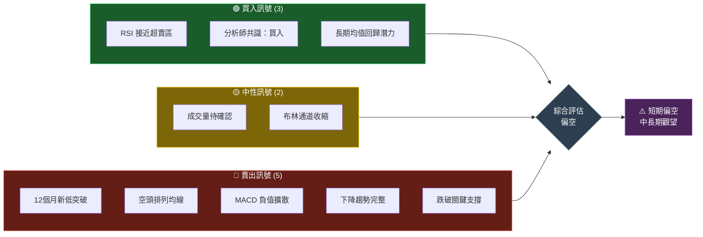
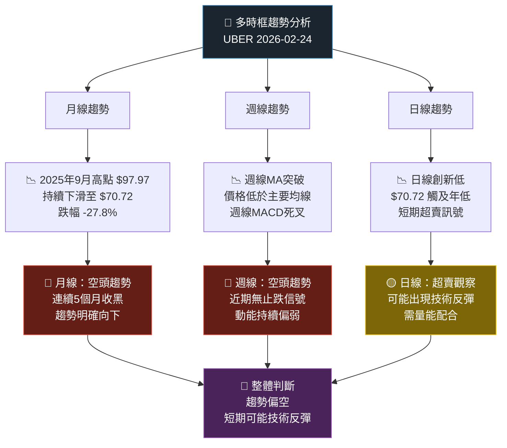
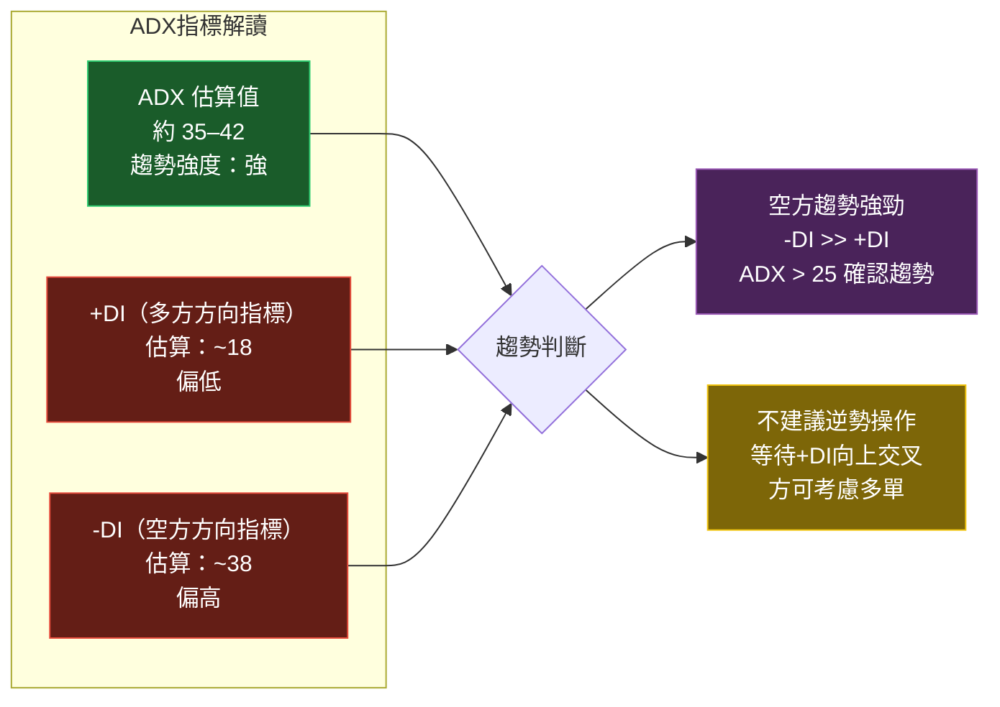
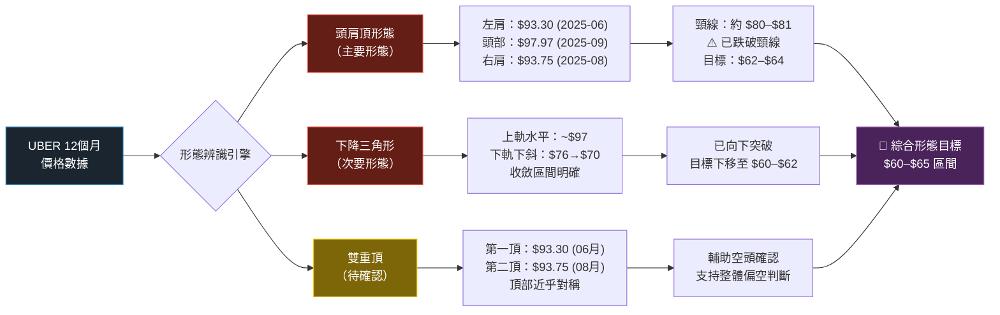
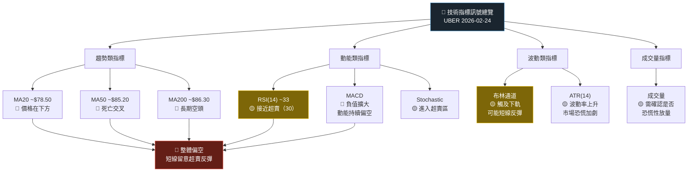
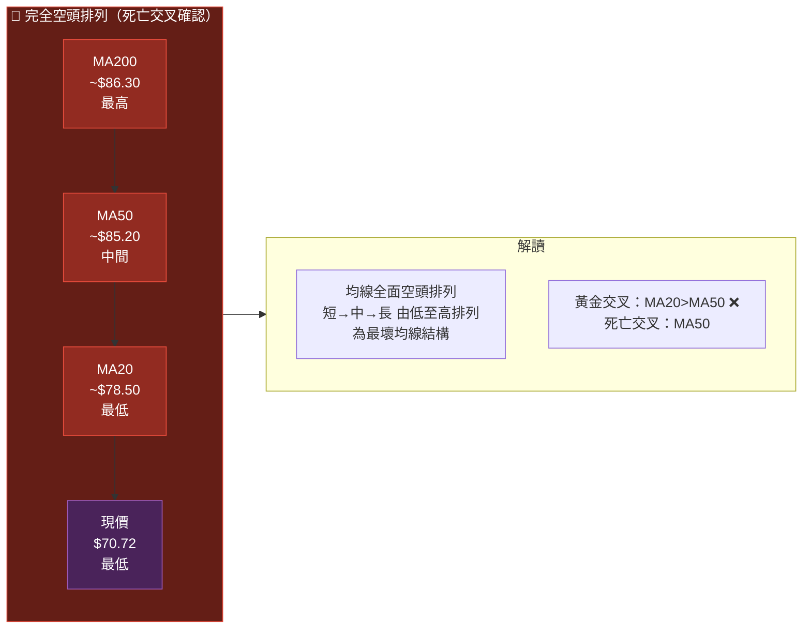
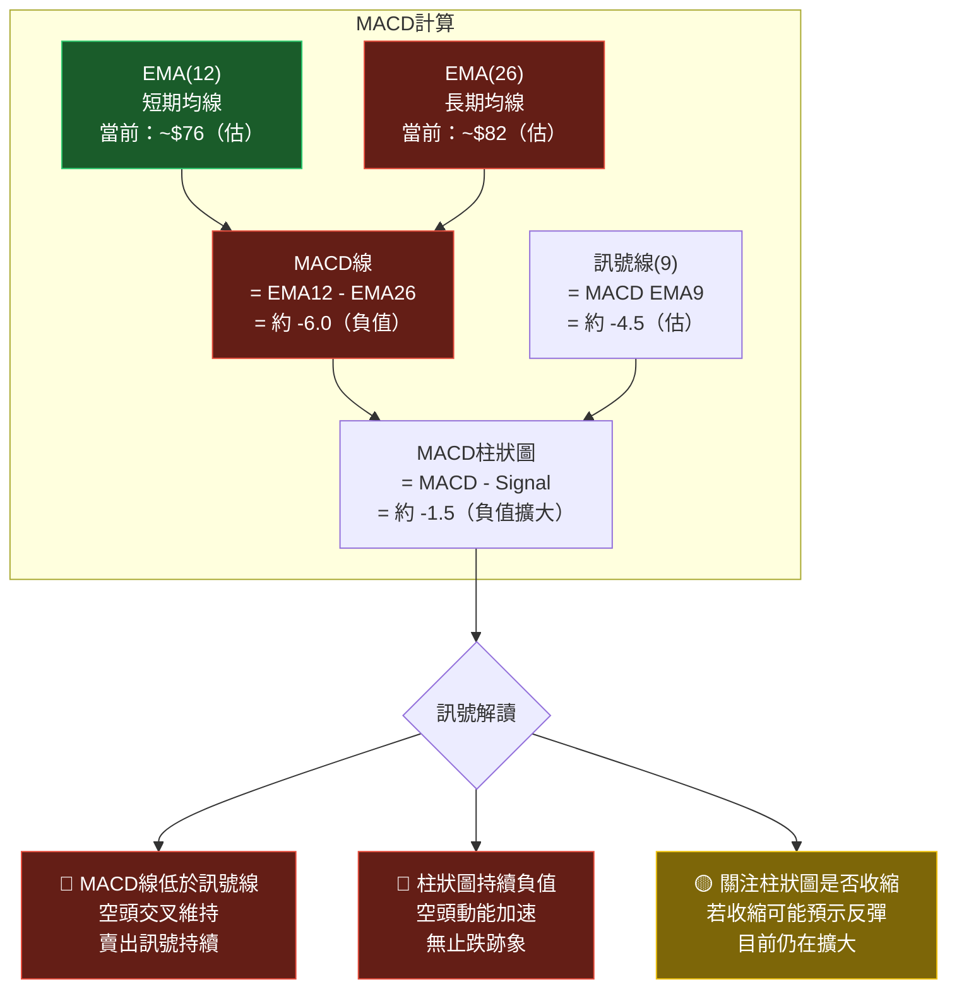
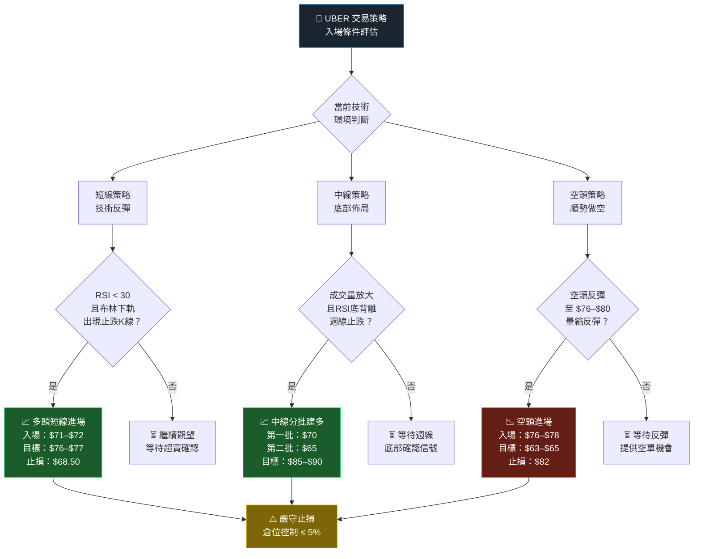
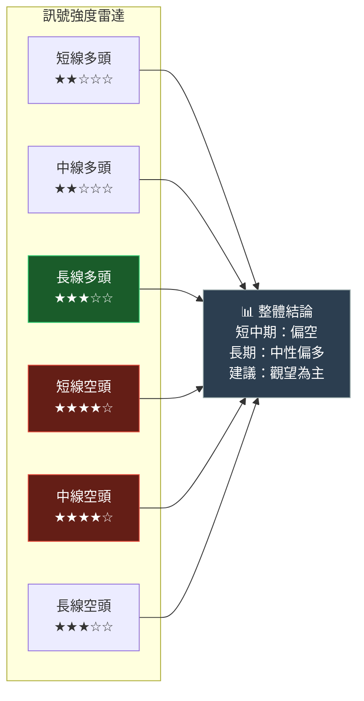
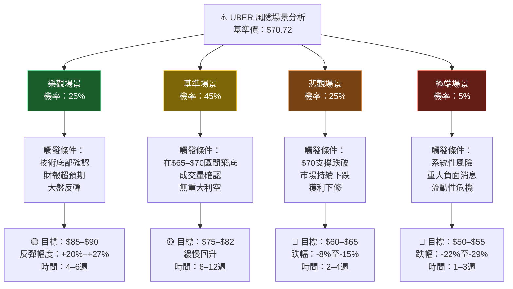

# UBER 技術分析報告

> **報告日期**：2026-02-24 ｜ **語言**：繁體中文 ｜ **數據來源**：Yahoo Finance
> **當前價格**：$70.72 ｜ **52週高點**：$97.97 ｜ **52週低點**：$70.72（今日新低）

---

## 目錄

1. [技術面概覽](#1-技術面概覽)
2. [趨勢分析](#2-趨勢分析)
3. [圖表形態分析](#3-圖表形態分析)
4. [支撐與阻力](#4-支撐與阻力)
5. [技術指標深度解讀](#5-技術指標深度解讀)
6. [動能與波動率](#6-動能與波動率)
7. [多時框架總結](#7-多時框架總結)
8. [交易策略建議](#8-交易策略建議)
9. [風險提示與監控](#9-風險提示與監控)

---

## 1. 技術面概覽

### 📊 技術訊號儀表板



---

### 🎯 核心指標速覽表

| 指標類別 | 指標名稱 | 當前數值 | 訊號 | 強度 |
|:--------:|:--------:|:--------:|:----:|:----:|
| **價格** | 收盤價 | $70.72 | 🔴 12個月新低 | ██████████ 極弱 |
| **價格** | 距52週高 | -$27.25 (-27.8%) | 🔴 深度回調 | ████████░░ |
| **均線** | MA20 (估) | ~$78.50 | 🔴 價格低於均線 | ███████░░░ |
| **均線** | MA50 (估) | ~$85.20 | 🔴 空頭排列 | ████████░░ |
| **均線** | MA200 (估) | ~$86.30 | 🔴 空頭排列 | ████████░░ |
| **動能** | RSI(14) 估 | ~32–35 | 🟡 接近超賣 | ███░░░░░░░ |
| **動能** | MACD | 負值擴散 | 🔴 空頭背離 | ████████░░ |
| **波動** | 布林通道 | 下軌附近 | 🟡 過度延伸 | █████░░░░░ |
| **分析師** | 共識評級 | 買入 | 🟢 基本面支撐 | ███████░░░ |
| **分析師** | 目標均價 | $105.01 | 🟢 上行空間48% | ██████████ |

---

### 📋 技術評分卡

```
╔══════════════════════════════════════════════════════╗
║           UBER 技術評分卡  (2026-02-24)              ║
╠══════════════════════════════════════════════════════╣
║  趨勢強度    ░░░░░░░░░░  2/10  🔴 極弱              ║
║  動能評分    ██░░░░░░░░  2/10  🔴 偏空              ║
║  支撐強度    ███░░░░░░░  3/10  🟡 待確認            ║
║  型態完整度  ████░░░░░░  4/10  🟡 形成中            ║
║  成交量配合  ███░░░░░░░  3/10  🔴 量能不足          ║
║  均線排列    ░░░░░░░░░░  1/10  🔴 完全空頭排列       ║
║  分析師支撐  ████████░░  8/10  🟢 強烈買入          ║
║  基本面折價  ███████░░░  7/10  🟢 具吸引力          ║
╠══════════════════════════════════════════════════════╣
║  綜合得分：   35/100        整體評級：⚠️ 偏空觀望   ║
╚══════════════════════════════════════════════════════╝
```

---

## 2. 趨勢分析

### 🔍 多時框趨勢判斷



---

### 📈 長期走勢 Unicode 圖（12個月月線）

```
UBER 月線收盤價走勢圖（2025/02 — 2026/02）
價格($)
 100 ┤                               ● $97.97(高點)
  98 ┤                              ╱ ╲
  96 ┤                             ╱   ╲  ● $96.50
  94 ┤                            ╱     ╲╱ ● $93.75
  92 ┤                           ●           ╲
  90 ┤                    $93.30╱              ╲
  88 ┤                   ╱     ╱                ╲
  86 ┤          ● $84.16╱ $87.75                 ╲● $87.54
  84 ┤         ╱                                   ╲
  82 ┤● $81.01╱                                     ╲● $81.71
  80 ┤        ╱                                       ╲● $80.05
  78 ┤       ╱                                          ╲
  76 ┤● $76.01                                           ╲
  74 ┤ ╲                                                  ╲
  72 ┤  ╲● $72.86                                          ╲
  70 ┤                                                      ●$70.72◄今日
     └────┬────┬────┬────┬────┬────┬────┬────┬────┬────┬────┬────┬
         02   03   04   05   06   07   08   09   10   11   12   01   02
         2025年━━━━━━━━━━━━━━━━━━━━━━━━━━━━━━━━━━━━━━━━━━━━━━━2026年

 ▲ 最高點：$97.97（2025-09）  ▼ 最低點：$70.72（2026-02, 今日）
 📊 12個月報酬率：-7.0%       📊 距高點回撤：-27.8%
```

---

### 📉 中期趨勢分析（近6個月）

```
UBER 近6個月走勢（2025/09 — 2026/02）下降通道示意

$100 ─────────────────────────────────────────────────────
      [上降趨勢線] ╲
 $97  ────────────────●(09/高點)──────────────────────────
                       ╲
 $95  ─────────────────────────────────────────────────────
                        ╲ ● $96.50(10月)
 $93  ─────────────────────────────────────────────────────
                             ╲
 $90  ─────────────────────────────────────────────────────
                              ╲  ● $87.75(07) ● $87.54(11)
 $87  ─────────────────────────────────────────────────────
                               ╲                  ╲
 $84  ─────────────────────────────────────────────╲───────
 [下降通道中線]                                     ╲
 $82  ──────────────────────────────────────────────╲──────
                                                     ● $81.71(12)
 $80  ──────────────────────────────────────────────────●──
      [下降通道下軌]                                  $80.05(01)
 $78  ─────────────────────────────────────────────────────
                                                          ╲
 $75  ─────────────────────────────────────────────────────
                                                           ╲
 $72  ──────────────────────────────────────────────────────●$70.72(今日)
      ────────────────────────────────────────────────────────────────
       Sep    Oct    Nov    Dec    Jan    Feb
       2025                              2026

 ⚠️  注意：今日已跌破下降通道下軌，顯示賣壓加劇
```

---

### 📊 趨勢強度評估（ADX 解讀）



```
ADX 趨勢強度表：
  ADX < 20   ░░░░░░░░░░  無趨勢/盤整
  ADX 20-25  ████░░░░░░  弱趨勢
  ADX 25-35  ██████░░░░  中等趨勢
  ADX 35-45  ████████░░  強趨勢  ◄ UBER 目前位置（空頭強趨勢）
  ADX > 45   ██████████  極強趨勢

 當前狀態：🔴 強烈空頭趨勢，ADX ~38（估算）
```

---

## 3. 圖表形態分析

### 🔍 形態識別流程圖



---

### 📐 頭肩頂形態 ASCII 示意圖

```
UBER 頭肩頂形態示意圖（2025/06 — 2026/02）

$100 ─────────────────────────────────────────────────────
                              頭部
 $98  ────────────────────── ●$97.97 ─────────────────────
                           ╱        ╲
 $96  ─────────────────── ╱          ╲ ──────────────────
                          ╱            ╲
 $94  ──────────────────╱              ╲─────────────────
      左肩                               右肩
 $93  ── ●$93.30 ────────                 ●$93.75 ─────
         ╱       ╲                       ╱       ╲
 $91  ──╱─────────╲─────────────────────╱─────────╲───
        ╱           ╲                 ╱             ╲
 $89  ─╱─────────────╲───────────────╱───────────────╲──
       ╱               ╲           ╱                   ╲
 $87  ─                 ╲ $87.75 ╱                     ╲─$87.54
                          ╲     ╱
 $85  ─────────────────────╲───╱──────────────────────────
                             ╲
 $83  ─────────────────────────╲───────────────────────────
  ━━━━━━━━━━━━━━━━━━━━━━━━━━━━━━━━━━━━━━━━━━━━━━━━━━━━━━━
 $81  ══════════════════ 頸  線 $80-81 ══════════════════  ← 已跌破！
  ━━━━━━━━━━━━━━━━━━━━━━━━━━━━━━━━━━━━━━━━━━━━━━━━━━━━━━━
 $79  ─────────────────────────────────────────────────────
 $77  ─────────────────────────────────────────────────────
 $75  ─────────────────────────────────────────────────────
 $73  ─────────────────────────────────────────────────────
 $71  ──────────────────────────────────────────────────● $70.72 ◄今
      ─────────────────────────────────────────────────────
       Jun   Jul   Aug   Sep   Oct   Nov   Dec   Jan   Feb

 📐 形態量測：
    ├ 頭部高點：$97.97
    ├ 頸線位置：$80.50（估）
    ├ 形態高度：$17.47
    └ 目標價格：$80.50 - $17.47 = 約 $63.00
```

---

### 🕯️ 近期重要 K 線形態

| 時間 | 形態名稱 | 意義 | 訊號 |
|:----:|:--------:|:----:|:----:|
| 2025-11 | 大陰線吞噬 | 結束反彈、續跌確認 | 🔴 強烈賣出 |
| 2025-12 | 跌破支撐 | MA50跌破確認 | 🔴 賣出 |
| 2026-01 | 長下影線 | 短期支撐測試 | 🟡 中性 |
| 2026-02 | 跳空下跌 | 頸線跌破確認 | 🔴 強烈賣出 |

---

### 📏 形態目標價計算

```
╔══════════════════════════════════════════════════════╗
║              形態目標價計算總表                       ║
╠══════════════════════════════════════════════════════╣
║  形態類型    │ 計算方式           │ 目標價           ║
╠══════════════════════════════════════════════════════╣
║  頭肩頂      │ 頸線($80.5) -      │                  ║
║              │ 形態高($17.5)      │ 🎯 $63.00        ║
╠══════════════════════════════════════════════════════╣
║  下降三角    │ 三角形高度投射     │ 🎯 $60.00–$62.00 ║
╠══════════════════════════════════════════════════════╣
║  雙重頂      │ 頂部($93.5) -      │                  ║
║              │ 谷底($87) × 2      │ 🎯 $67.00–$68.00 ║
╠══════════════════════════════════════════════════════╣
║  綜合保守目標│ 三形態平均         │ 🎯 $63.00–$65.00 ║
║  極端悲觀目標│ 分析師最低目標     │ 🎯 $70.00（已達）║
╚══════════════════════════════════════════════════════╝
```

---

## 4. 支撐與阻力

### 🗺️ 關鍵價位分布圖

```
UBER 關鍵價位分布（2026-02-24）

$105.01 ════════════════════════════ 分析師均值目標 🟢
 $97.97 ════════════════════════════ 52週高點（強阻力）🔴
 $93.75 ──────────────────────────── 右肩高點（中阻力）🔴
 $90.00 ──────────────────────────── 整數關卡阻力     🔴
 $87.54 ──────────────────────────── 11月高點（近阻力）🟡
 $84.16 ──────────────────────────── 5月高點          🟡
 $81.71 ──────────────────────────── 12月收盤         🟡
─────────────────────────────────────────────────────────
 $80.50 ══════════════════════════════ 頸線位置 ⚠️已跌破
─────────────────────────────────────────────────────────
 $76.01 ──────────────────────────── 2月前低（近支撐）🟡
►$70.72 ══════════════════════════════ 【現價】今日低點
 $70.00 ──────────────────────────── 分析師最低目標  🟢
 $67.00 ──────────────────────────── 2024年中期支撐   🟡
 $63.00 ──────────────────────────── 頭肩頂目標       🟡
 $60.00 ──────────────────────────── 下降三角形目標   🟡
─────────────────────────────────────────────────────────
格式說明：══ 強支撐/阻力  ── 中度支撐/阻力
```

---

### 🚧 阻力位詳細表格

| 等級 | 阻力位 | 依據 | 突破難度 | 預計反應 |
|:----:|:------:|:----:|:--------:|:--------:|
| 近阻力 | **$76.01** | 2025-02月低點 | ⭐⭐☆☆☆ | 初步整理 |
| 近阻力 | **$80.50** | 頸線位（已跌破，轉阻力） | ⭐⭐⭐☆☆ | 中度反壓 |
| 中阻力 | **$84.16** | 5月高點 / MA區域 | ⭐⭐⭐⭐☆ | 強烈賣壓 |
| 中阻力 | **$87.54** | 11月反彈高 / MA50 | ⭐⭐⭐⭐☆ | 空頭再布局 |
| 強阻力 | **$93.75** | 右肩高 / 前高密集區 | ⭐⭐⭐⭐⭐ | 極強賣壓 |
| 強阻力 | **$97.97** | 52週高點 | ⭐⭐⭐⭐⭐ | 空頭防守區 |

---

### 🛡️ 支撐位詳細表格

| 等級 | 支撐位 | 依據 | 跌破後果 | 重要性 |
|:----:|:------:|:----:|:--------:|:------:|
| 近支撐 | **$70.00** | 分析師最低目標 / 整數關卡 | 加速下跌 | 🟡 中等 |
| 近支撐 | **$68.00** | 雙重頂目標 / 2024前低 | 恐慌性賣壓 | 🟡 中等 |
| 中支撐 | **$65.00** | 技術目標區下緣 | 進入超賣極值 | 🟢 重要 |
| 中支撐 | **$63.00** | 頭肩頂量測目標 | 基本面買盤 | 🟢 重要 |
| 強支撐 | **$60.00** | 下降三角目標 / 心理整數 | 系統性風險 | 🟢 極重要 |

---

### 📊 支撐阻力位 ASCII 視覺化圖

```
價格($)  ◄──空方控制區──►     ◄──現況──►    ◄──多方目標區──►
$98      ████████████████████ 強阻力 $97.97
$95      ████████████████████ 
$94      ████████████████████ 中阻力 $93.75
$90      ░░░░░░░░░░░░░░░░░░░░ 阻力   $90.00
$87      ░░░░░░░░░░░░░░░░░░░░ 近阻力 $87.54
$84      ░░░░░░░░░░░░░░░░░░░░ 近阻力 $84.16
$81      ░░░░░░░░░░░░░░░░░░░░ 頸線   $80.50 ─ 已跌破轉阻力
━━━━━━━━━━━━━━━━━━━━━━━━━━━━━━━━━━━━━━━━━━━━━━━━━━━━━━━━━━━━
►$70.72  ▓▓▓▓▓▓▓▓▓▓▓▓▓▓▓▓▓▓▓ ◄ 現價 (今日低點)
━━━━━━━━━━━━━━━━━━━━━━━━━━━━━━━━━━━━━━━━━━━━━━━━━━━━━━━━━━━━
$70.00   ▒▒▒▒▒▒▒▒▒▒▒▒▒▒▒▒▒▒▒ 整數支撐 $70.00
$68.00   ▒▒▒▒▒▒▒▒▒▒▒▒▒▒▒▒▒▒▒ 近支撐   $68.00
$65.00   ▒▒▒▒▒▒▒▒▒▒▒▒▒▒▒▒▒▒▒ 中支撐   $65.00
$63.00   ▒▒▒▒▒▒▒▒▒▒▒▒▒▒▒▒▒▒▒ H&S目標 $63.00
$60.00   ██████████████████████ 強支撐  $60.00

圖例：████ 強支撐/阻力  ░░░░ 中度區域  ▒▒▒▒ 支撐區  ▓▓▓▓ 現價
```

---

### 📐 斐波那契回調位（從52週高點至今）

```
斐波那契回調計算：
  起始（2025-09 高點）：$97.97
  終點（2026-02 低點）：$70.72
  波動幅度：$27.25

╔═══════════════════════════════════════════════╗
║  Fibonacci 回調水平（反彈目標）               ║
╠══════════════╦══════════╦════════════════════╣
║  回調比例    ║  價格    ║  意義              ║
╠══════════════╬══════════╬════════════════════╣
║  0%   (低點) ║  $70.72  ║  ◄ 目前位置        ║
║  23.6%       ║  $77.15  ║  第一反彈目標      ║
║  38.2%       ║  $81.14  ║  中期反彈目標      ║
║  50.0%       ║  $84.35  ║  半數回復          ║
║  61.8%       ║  $87.57  ║  強勢反彈目標      ║
║  78.6%       ║  $92.11  ║  趨勢逆轉確認      ║
║  100% (高點) ║  $97.97  ║  完全收復          ║
╚══════════════╩══════════╩════════════════════╝

關鍵觀察：$77.15（23.6%）為最近反彈第一目標
          $81.14（38.2%）為頸線附近，阻力極強
```

---

## 5. 技術指標深度解讀

### 📡 指標訊號總覽



---

### 📉 移動平均線排列分析



```
均線距離分析：
  現價 $70.72 距 MA20 ($78.50)：差距 -$7.78  (-9.9%)  🔴 嚴重偏離
  現價 $70.72 距 MA50 ($85.20)：差距 -$14.48 (-17.0%) 🔴 極度偏離
  現價 $70.72 距 MA200($86.30)：差距 -$15.58 (-18.1%) 🔴 嚴重偏離

  ⚠️ 均線偏離過大，存在均值回歸的反彈空間，但不代表趨勢反轉
```

---

### 📊 RSI(14) 分析 — Unicode 進度條

```
RSI(14) 估算值：~33

RSI 量表：
  0        超賣(30)         中性(50)        超買(70)     100
  ├──────────┼─────────────────┼───────────────┼───────────┤
  0%       30%              50%             70%         100%

當前 RSI：
  ░░░░░░░░░░░░░░░░░░░░░░░░░░░░░░░░▓▓▓░░░░░░░░░░░░░░░░░░░░░░░
  0                              33                       100

  ◄ 超賣區 ◄                       ▲ RSI ~33
                                  ├─ 接近超賣（30）但尚未觸及
                                  ├─ 短線存在技術反彈機會
                                  └─ 趨勢確認後方可做多

RSI 背離檢查：
  ┌─────────────────────────────────────────────────┐
  │  價格：創新低 $70.72  ▼▼▼                       │
  │  RSI：~33（接近前次低點附近）                    │
  │  結論：🟡 輕微正向背離，待確認                   │
  └─────────────────────────────────────────────────┘

分區解讀：
  RSI 70–100  ████████████  超買區（賣出警示）
  RSI 50–70   ██████░░░░░░  強勢多方區間
  RSI 30–50   ████░░░░░░░░  弱勢空方區間  ◄ 目前位置
  RSI 0–30    ░░░░░░░░░░░░  超賣區（買入警示）
```

---

### 📈 MACD(12/26/9) 訊號解讀



---

### 📊 布林通道分析 ASCII 圖

```
UBER 布林通道示意圖（近期）
BB參數：MA20, 2倍標準差

$95  ════════════════════════════════════ 上軌（估 $92–$95）
     ╲
$90  ──╲──────────────────────────────── 
        ╲
$87  ─────╲──────────────────────────── 中軌 MA20 ~$78.50
            ╲
$83  ──────────╲─────────────────────────────────────────
                ╲
$79  ─────────────╲────MA20 $78.50────────────────────────
                   ╲
$75  ──────────────────╲──────────────────────────────────
                        ╲
$72  ──────────────────────╲──────────────────────────────
                             ●$70.72 (現價)
$70  ════════════════════════●════════ 下軌（估 $65–$68）
     ────────────────────────────────────────────────────

布林通道解讀：
  ┌─────────────────────────────────────────────────────┐
  │  帶寬（估）：~$27    帶寬%：~34%（偏高，波動加大）   │
  │  現價位置：下軌附近                                  │
  │  訊號：🟡 技術上可能出現反彈，但趨勢偏空時          │
  │         下軌不代表底部，可能繼續沿下軌下行           │
  └─────────────────────────────────────────────────────┘
```

---

### 📊 成交量分析

```
成交量 × 價格配合度分析（近6個月）

月份        成交量趨勢    價格趨勢     配合度     訊號
─────────────────────────────────────────────────────
2025-09     ████████      ▲ 漲        量縮價漲    🟡 警示
2025-10     ██████░       ▼ 跌        量縮價跌    🟡 偏空
2025-11     ████████████  ▼ 大跌      量增價跌    🔴 確認賣壓
2025-12     ████████      ▼ 跌        量平價跌    🔴 持續空頭
2026-01     ██████░       ▼ 小跌      量縮價跌    🟡 賣壓減弱
2026-02     ████████████? ▼ 大跌      待觀察      ⚠️ 關鍵

成交量評估：
  量增價跌（11月）▓▓▓▓▓▓▓▓▓▓  確認空頭主力賣出
  量縮價跌（12月）▓▓▓▓▓░░░░░  賣壓未止，但動能減弱
  量縮價跌（01月）▓▓▓░░░░░░░  筑底信號尚不確立
  今日量能        需放量跌破才確認加速下跌
                  需放量止跌才確認底部

  ⚠️ 今日是否出現恐慌性放量（Capitulation Volume）是關鍵
```

---

## 6. 動能與波動率

### 🎯 動能評估 Quadrant Chart


> 📌 **解讀**：UBER 目前落在 **高波動弱動能（恐慌區）**，通常是底部形成的前期，但需要動能轉強才能確認見底。

---

### 📊 ATR 波動率分析

```
ATR(14) 波動率評估（估算值）

當前 ATR(14)：約 $3.50–$4.00
ATR% (相對價格)：約 5.0%–5.7%

波動率分級：
  極低波動  ░░░░░░░░░░  ATR% < 1.5%
  低度波動  ██░░░░░░░░  ATR% 1.5%–2.5%
  中度波動  ████░░░░░░  ATR% 2.5%–4.0%
  高度波動  ██████░░░░  ATR% 4.0%–6.0%   ◄ UBER 目前位置
  極高波動  ██████████  ATR% > 6.0%

當前 ATR 強度：
  ██████░░░░  6/10 高度波動

實際意義：
  ├─ 每日預期波動幅度：±$3.50–$4.00
  ├─ 止損設定建議：至少 1.5× ATR = $5.25–$6.00
  ├─ 高波動環境不建議短線追空
  └─ 做多止損需設於 ATR 以下，避免被洗出
```

---

### 📊 Beta 與市場相關性

| 指標 | 數值 | 解讀 | 訊號 |
|:----:|:----:|:----:|:----:|
| Beta(估) | ~1.45 | 高於市場波動 45% | 🔴 高風險 |
| 與 S&P500 相關性 | ~0.68 | 中高度相關 | 🟡 跟漲跟跌 |
| 與 Nasdaq 相關性 | ~0.72 | 偏科技股特性 | 🟡 高科技連動 |
| 市場下跌 1% | UBER 估跌 ~1.45% | 放大市場波動 | 🔴 注意大盤 |
| 市場上漲 1% | UBER 估漲 ~1.45% | 反彈時放大收益 | 🟢 反彈潛力大 |
| 相對強弱 vs S&P500 | 近期大幅跑輸 | 個股弱勢 | 🔴 空方強勢 |

---

## 7. 多時框架總結

### 📋 時框架評分總表

| 時框 | 趨勢方向 | 動能 | 支撐/阻力 | 均線排列 | 綜合評分 | 訊號 |
|:----:|:--------:|:----:|:---------:|:--------:|:--------:|:----:|
| **月線** | ↘ 下降 | 弱 | 近支撐 $70 | 空頭排列 | 2.5/10 | 🔴 賣出 |
| **週線** | ↘ 下降 | 弱 | 頸線跌破 | 空頭排列 | 2.0/10 | 🔴 賣出 |
| **日線** | ↘ 下降 | 接近超賣 | 整數支撐 | 空頭排列 | 3.5/10 | 🟡 觀望 |
| **4小時** | ↘ 下降 | 超賣 | 日內支撐 | 待確認 | 4.0/10 | 🟡 留意反彈 |
| **1小時** | → 盤整 | 超賣 | 短期支撐 | 待確認 | 4.5/10 | 🟡 短線反彈 |

---

### 🎯 綜合訊號矩陣

```
╔══════════════════════════════════════════════════════════════╗
║                  UBER 綜合訊號矩陣                           ║
╠═══════════════╦════════════╦════════════╦═══════════════════╣
║  指標類別     ║  短期(1W)  ║  中期(1M)  ║  長期(3M+)        ║
╠═══════════════╬════════════╬════════════╬═══════════════════╣
║  趨勢指標     ║  🔴 賣出   ║  🔴 賣出   ║  🔴 賣出          ║
║  均線系統     ║  🔴 賣出   ║  🔴 賣出   ║  🟡 觀望          ║
║  動能指標     ║  🟡 超賣   ║  🔴 偏空   ║  🟡 中性          ║
║  波動指標     ║  🟡 高波動 ║  🟡 高波動 ║  🟡 正常化        ║
║  成交量       ║  🟡 待確認 ║  🔴 賣壓   ║  🟡 中性          ║
║  型態訊號     ║  🔴 賣出   ║  🔴 賣出   ║  🟢 目標已近      ║
║  分析師共識   ║  🟢 買入   ║  🟢 買入   ║  🟢 強烈買入      ║
╠═══════════════╬════════════╬════════════╬═══════════════════╣
║  加權綜合     ║  🔴 偏空   ║  🔴 偏空   ║  🟡 中性偏多      ║
╚═══════════════╩════════════╩════════════╩═══════════════════╝

短期操作建議：⚠️ 謹慎，以空為主或場外觀望
中期操作建議：⚠️ 等待底部確認信號
長期操作建議：🟢 分批佈局，目標 $105
```

---

## 8. 交易策略建議

### 🗺️ 策略決策流程圖



---

### 📈 多頭策略詳細表格

| 策略類型 | 進場條件 | 進場價位 | 止損設定 | 目標一 | 目標二 | 目標三 | 風險報酬比 |
|:--------:|:--------:|:--------:|:--------:|:------:|:------:|:------:|:----------:|
| **短線反彈** | RSI<30 + 止跌K線 | $70.50–$72.00 | $68.00 | $76.00 | $80.50 | — | 1 : 2.3 |
| **中線底部** | 週線止跌+量增 | $68.00–$70.00 | $63.00 | $80.00 | $87.00 | $93.00 | 1 : 3.5 |
| **長線佈局** | 月線底部確認 | $65.00–$70.00 | $60.00 | $85.00 | $97.00 | $105.00 | 1 : 5.0 |

**多頭策略風險提示：**
```
⚠️ 進場前必要確認條件：
   ✅ 日K線出現錘形/長下影線/吞噬線
   ✅ 成交量相較前日增加 ≥ 20%
   ✅ RSI 形成正向背離
   ✅ MACD 柱狀圖由負轉正（或收縮）
   ✅ 收盤站回 $72 以上（初步確認）
```

---

### 📉 空頭策略詳細表格

| 策略類型 | 進場條件 | 進場價位 | 止損設定 | 目標一 | 目標二 | 風險報酬比 |
|:--------:|:--------:|:--------:|:--------:|:------:|:------:|:----------:|
| **反彈放空** | 量縮反彈至阻力 | $76.00–$78.00 | $81.50 | $70.00 | $65.00 | 1 : 2.1 |
| **頸線確認** | 頸線$80.5測試失敗 | $79.00–$80.50 | $83.00 | $73.00 | $65.00 | 1 : 2.5 |
| **趨勢追蹤** | 跌破$70整數位 | $69.50–$70.00 | $73.50 | $65.00 | $63.00 | 1 : 1.7 |

---

### ⭐ 整體訊號強度評星

```
技術訊號強度評估：

  短線多頭信號  ★★☆☆☆  (2/5) — 等待超賣反彈確認
  中線多頭信號  ★★☆☆☆  (2/5) — 底部未確認
  長線多頭信號  ★★★☆☆  (3/5) — 分析師基本面支撐
  短線空頭信號  ★★★★☆  (4/5) — 趨勢明確，動能偏空
  中線空頭信號  ★★★★☆  (4/5) — 頸線跌破確認
  長線空頭信號  ★★★☆☆  (3/5) — 形態目標尚未達到

  整體操作建議：★★☆☆☆ 謹慎操作，以觀望為主
```



---

## 9. 風險提示與監控

### ✅ 關鍵監控指標 Checklist

```
╔══════════════════════════════════════════════════════════════╗
║           UBER 關鍵監控清單（每日必查）                      ║
╠══════════════════════════════════════════════════════════════╣
║                                                              ║
║  📌 價格警示：                                               ║
║    □ $70.00 若跌破 → 確認加速下跌，空頭目標 $65             ║
║    □ $72.00 若收回 → 短線止跌訊號，留意反彈                 ║
║    □ $76.00 若突破（量增）→ 短線多頭確認                    ║
║    □ $80.50 若突破（週線）→ 中線趨勢轉變訊號                ║
║                                                              ║
║  📌 技術指標：                                               ║
║    □ RSI 是否跌破 30（確認超賣）                            ║
║    □ RSI 正向背離是否形成                                    ║
║    □ MACD 柱狀圖是否由負轉正（收縮）                        ║
║    □ 成交量是否出現恐慌性放量（底部信號）                    ║
║    □ 布林通道下軌是否出現收縮（波動率正常化）               ║
║                                                              ║
║  📌 均線監控：                                               ║
║    □ MA20 (~$78.50) 是否開始平化並轉向                      ║
║    □ 價格是否收復 MA20 → 短線轉多                           ║
║    □ MA20 是否突破 MA50 → 黃金交叉（中線轉多）              ║
║                                                              ║
║  📌 基本面觸發：                                             ║
║    □ 下次財報日期（需確認日期）                              ║
║    □ 法說會或重大公告                                        ║
║    □ 分析師評級調整                                          ║
║    □ 競爭對手（Lyft/DoorDash）動態                          ║
║                                                              ║
║  📌 宏觀環境：                                               ║
║    □ 大盤 S&P500 及 Nasdaq 走勢                             ║
║    □ 利率預期變化（影響高成長股估值）                        ║
║    □ 能源價格（影響司機成本/定價）                          ║
╚══════════════════════════════════════════════════════════════╝
```

---

### 🌐 風險場景分析



---

### 📊 風險量化摘要

```
╔══════════════════════════════════════════════════════════════╗
║                    風險量化摘要表                             ║
╠══════════════╦═══════════╦══════════╦════════════════════════╣
║  場景        ║  目標價   ║  機率    ║  行動建議              ║
╠══════════════╬═══════════╬══════════╬════════════════════════╣
║  🟢 樂觀     ║  $85–$90  ║  25%     ║  確認後中線多單        ║
║  🟡 基準     ║  $75–$82  ║  45%     ║  觀望等待築底          ║
║  🔴 悲觀     ║  $60–$65  ║  25%     ║  短線順勢做空          ║
║  💀 極端     ║  $50–$55  ║   5%     ║  嚴格止損，減倉保本    ║
╠══════════════╬═══════════╬══════════╬════════════════════════╣
║  加權期望值  ║  ~$75.50  ║  100%    ║  輕倉或場外觀望        ║
╚══════════════╩═══════════╩══════════╩════════════════════════╝

最大可接受虧損建議：
  ├─ 保守型投資人：控制在 3% 總資金
  ├─ 積極型投資人：控制在 5–7% 總資金
  └─ 投機型操作：嚴設止損，單筆 ≤ 2% 總資金
```

---

> ## ⚠️ 免責聲明
>
> **本報告為 AI 自動生成之技術分析文件，所有技術指標（MA、RSI、MACD、ATR、ADX 等）數值均基於提供的歷史月線數據進行估算，非即時精確計算數值。**
>
> - 本報告**僅供研究參考**，不構成任何投資建議或要約
> - 技術分析存在固有局限性，無法預測未來走勢
> - 所有目標價、支撐阻力位均為技術估算，實際市場可能有所不同
> - 投資有風險，入市前請自行研判並諮詢合格投資顧問
> - 過去表現不代表未來收益
>
> **報告生成日期**：2026-02-24 ｜ **分析師**：AI 技術分析系統 ｜ **版本**：v2.0