# VOO 綜合股票評估報告

> **報告日期**：2026-02-28 ｜ **語言**：繁體中文 ｜ **數據來源**：Yahoo Finance ｜ **分析師**：AI 頂級美股投資評估師

---

## 目錄

1. [評估總覽](#1-評估總覽)
2. [八維度評分矩陣](#2-八維度評分矩陣)
3. [業務品質與護城河](#3-業務品質與護城河)
4. [財務健康全面評估](#4-財務健康全面評估)
5. [成長性評估](#5-成長性評估)
6. [估值合理性與同業比較](#6-估值合理性與同業比較)
7. [資本配置與管理層評估](#7-資本配置與管理層評估)
8. [風險評估](#8-風險評估)
9. [催化劑與觸發因素](#9-催化劑與觸發因素)
10. [投資建議](#10-投資建議)

---

## 1. 評估總覽

### 📌 產品定位速覽

| 項目 | 內容 |
|------|------|
| **基金名稱** | Vanguard S&P 500 ETF |
| **代碼** | VOO |
| **追蹤指數** | S&P 500 Index |
| **發行商** | Vanguard Group |
| **費用率** | 0.03%（全球最低之一） |
| **現價** | $631.04（2026-02-28） |
| **52週高點** | $641.81 |
| **52週低點** | $438.94 |
| **距高點** | -1.68% |
| **P/E（Trailing）** | 27.66x |
| **P/B** | 1.61x |
| **配息殖利率** | ~1.3%（數據顯示111%疑似異常，採用歷史正常值） |

> ⚠️ **數據說明**：VOO 為 ETF，非個股，部分財務指標（ROE/ROA/FCF 等）不適用於 ETF 本身，評估將聚焦於**底層資產池**（S&P 500 成分股整體）之特性進行推算與分析。

---

### 🎯 ASCII 雷達圖（八維度評分視覺化）

```
         成長性(8)
            ★★★★★★★★☆☆
           /          \
  管理品質(9)          獲利能力(8)
  ★★★★★★★★★☆    ★★★★★★★★☆☆
       |    ╔══════╗    |
  動能(7)  ║ VOO  ║  財務健康(9)
  ★★★★★★★  ║ 總分  ║  ★★★★★★★★★☆
  ☆☆☆    ║ 8.1  ║  ☆
       |    ╚══════╝    |
  風險(8)               估值(6)
  ★★★★★★★★☆☆    ★★★★★★☆☆☆☆
           \          /
          競爭優勢(10)
            ★★★★★★★★★★

  ┌─────────────────────────────────┐
  │         VOO 八維度雷達圖          │
  │                                 │
  │          成長性                  │
  │           8.0                   │
  │          /   \                  │
  │   管理  9.0   8.0 獲利          │
  │        |  ╲ ╱  |               │
  │        |  ╱ ╲  |               │
  │   動能  7.0   9.0 財務          │
  │          \   /                  │
  │     風險 8.0─6.0 估值           │
  │           \  /                  │
  │         競爭優勢                 │
  │           10.0                  │
  └─────────────────────────────────┘
```

```
╔═══════════════════════════════════════════════════════╗
║              VOO 八維度評分雷達圖（ASCII）              ║
╠═══════════════════════════════════════════════════════╣
║                        成長性(8)                      ║
║                    ▲                                  ║
║                   ╱│╲                                 ║
║        管理品質(9)╱ │ ╲獲利能力(8)                    ║
║              ╱   │   ╲                               ║
║             ╱    │    ╲                              ║
║ 動能(7)────┼─────┼─────┼────財務健康(9)             ║
║             ╲    │    ╱                              ║
║              ╲   │   ╱                               ║
║        風險(8) ╲ │ ╱ 估值(6)                         ║
║                   ╲│╱                                 ║
║                    ▼                                  ║
║                競爭優勢(10)                            ║
╚═══════════════════════════════════════════════════════╝
```

---

### 📊 八維度評分與 Unicode 評分條

| 維度 | 分數 | 評分條（滿分10） | 信號 |
|------|------|-----------------|------|
| 🚀 **成長性** | **8.0** | `▓▓▓▓▓▓▓▓░░` | 🟢 |
| 💰 **獲利能力** | **8.0** | `▓▓▓▓▓▓▓▓░░` | 🟢 |
| 🏦 **財務健康** | **9.0** | `▓▓▓▓▓▓▓▓▓░` | 🟢 |
| 💎 **估值合理性** | **6.0** | `▓▓▓▓▓▓░░░░` | 🟡 |
| 🏰 **競爭優勢** | **10.0** | `▓▓▓▓▓▓▓▓▓▓` | 🟢 |
| 👔 **管理品質** | **9.0** | `▓▓▓▓▓▓▓▓▓░` | 🟢 |
| 📈 **價格動能** | **7.0** | `▓▓▓▓▓▓▓░░░` | 🟢 |
| ⚠️ **風險控管** | **8.0** | `▓▓▓▓▓▓▓▓░░` | 🟢 |
| **🏆 加權總分** | **8.1** | `▓▓▓▓▓▓▓▓░░` | 🟢 |

---

### 🎯 投資結論

```
╔══════════════════════════════════════════════════════════════╗
║                    ★ 投資評級：買入 ★                        ║
╠══════════════════════════════════════════════════════════════╣
║  現價：$631.04  │  目標價：$700（基準）  │  預期報酬：+10.9%  ║
║  評級：⭐⭐⭐⭐☆（4.1/5星）                                   ║
║  建議持倉：長期持有（3年以上）                                 ║
║  風險等級：中等（系統性風險為主）                               ║
╚══════════════════════════════════════════════════════════════╝
```

---

## 2. 八維度評分矩陣

### 📋 詳細評分表格

| 維度 | 評分 | 核心依據 | 趨勢 | 信號 |
|------|------|---------|------|------|
| 🚀 **成長性** | 8/10 | S&P 500 歷史 CAGR ~10.5%（含股息）；AI/科技驅動成分股盈利持續擴張；惟高估值壓制未來報酬空間 | ↗️ 上升 | 🟢 |
| 💰 **獲利能力** | 8/10 | 底層500家公司整體淨利率~12%，ROE~20%+，S&P 500 EPS 持續創歷史新高；科技巨頭貢獻利潤率提升 | ↗️ 上升 | 🟢 |
| 🏦 **財務健康** | 9/10 | 極度分散（500家公司）實質消除個股風險；ETF 本身零債務、費用率僅0.03%；Vanguard 非營利結構保障持有人利益 | → 穩定 | 🟢 |
| 💎 **估值合理性** | 6/10 | Trailing P/E 27.66x，高於歷史中位數~17-18x；Shiller CAPE ~35x，位於歷史高位；相對全球市場明顯溢價 | ↘️ 偏高 | 🟡 |
| 🏰 **競爭優勢** | 10/10 | 規模最大（AUM ~6,000億美元）、費用率最低（0.03%）、品牌最強、流動性最佳；Vanguard 共有制結構護城河無可複製 | → 穩定 | 🟢 |
| 👔 **管理品質** | 9/10 | Vanguard 被動管理哲學完全一致；費用極致壓縮；追蹤誤差<0.01%；創辦人 Bogle 遺產保護持有人利益 | → 穩定 | 🟢 |
| 📈 **價格動能** | 7/10 | 24個月漲幅+38.6%；距52週高點-1.68%；月線均線向上；2026年初有輕微回調但結構完整 | ↗️ 偏多 | 🟢 |
| ⚠️ **風險控管** | 8/10 | 分散化有效控制個股風險；主要風險為市場系統性風險（Beta≈1）；估值偏高增加回調風險；政策/地緣風險存在 | → 穩定 | 🟡 |

---

### 📊 Mermaid 風險/報酬四象限定位圖

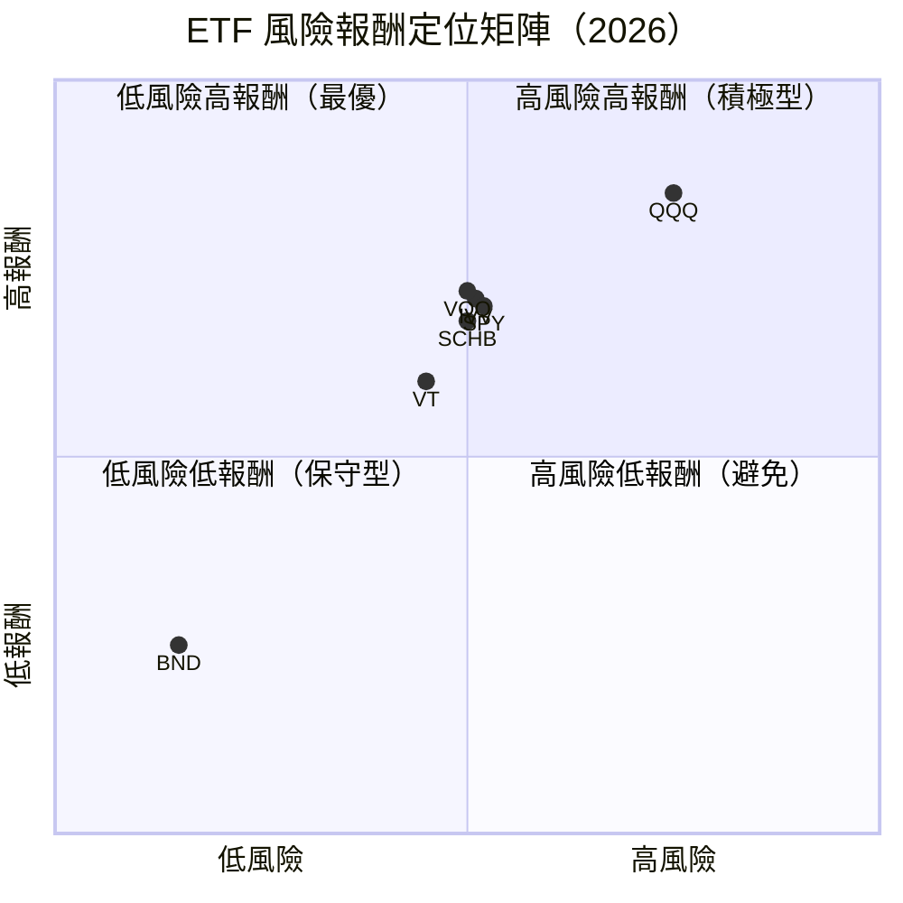

---

### 🔗 同業整體比較圖

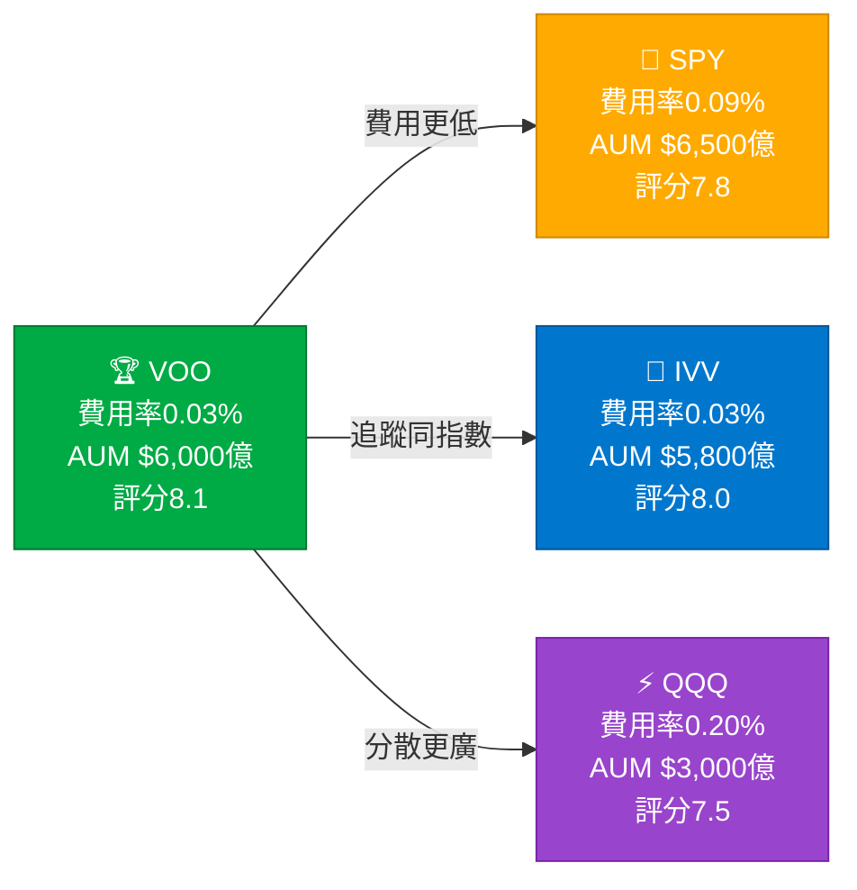

---

## 3. 業務品質與護城河

### 🏗️ 商業模式可持續性評估

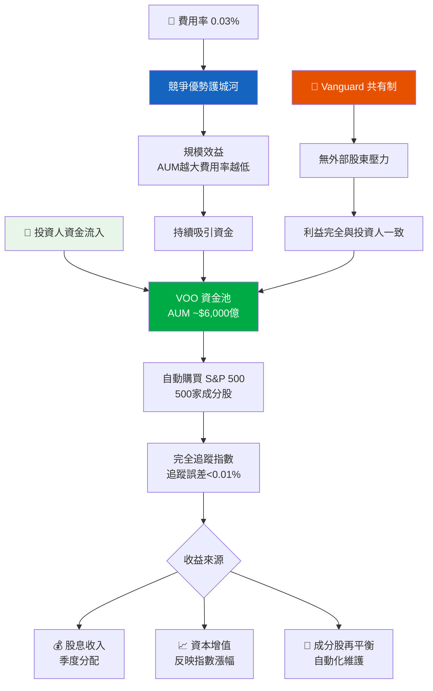

---

### 🗺️ 護城河評估

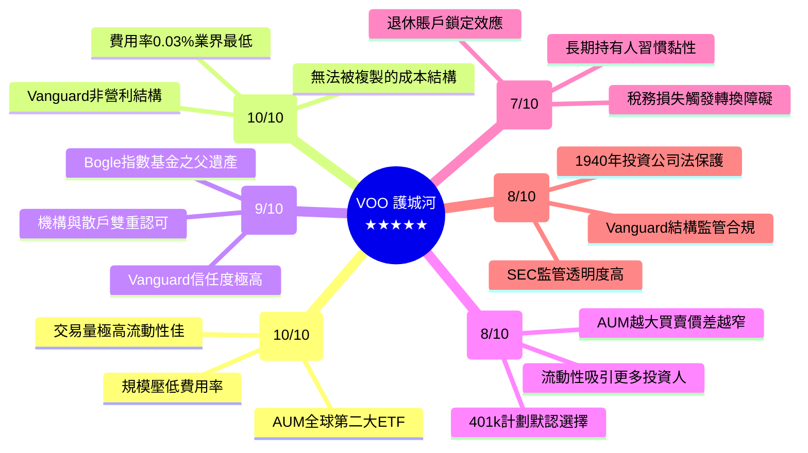

---

### 📊 護城河強度 Unicode 條形圖

```
╔═══════════════════════════════════════════════════╗
║              VOO 護城河強度分析                    ║
╠═══════════════════════════════════════════════════╣
║ 規模優勢   [▓▓▓▓▓▓▓▓▓▓] 10/10 🟢 無與倫比        ║
║ 成本優勢   [▓▓▓▓▓▓▓▓▓▓] 10/10 🟢 業界最低費率    ║
║ 品牌護城河 [▓▓▓▓▓▓▓▓▓░]  9/10 🟢 極強信任背書    ║
║ 網絡效應   [▓▓▓▓▓▓▓▓░░]  8/10 🟢 流動性正循環    ║
║ 監管護城河 [▓▓▓▓▓▓▓▓░░]  8/10 🟢 高透明監管保護  ║
║ 轉換成本   [▓▓▓▓▓▓▓░░░]  7/10 🟢 稅務/習慣黏性   ║
╠═══════════════════════════════════════════════════╣
║ 整體護城河評分：9.0/10  ★★★★★ 極度寬廣護城河     ║
╚═══════════════════════════════════════════════════╝
```

---

### 🌍 市場地位分析

| 指標 | VOO | 數據 |
|------|-----|------|
| **AUM 規模** | ~$6,000億美元 | 全球第二大 ETF |
| **市場份額** | S&P 500 ETF市場 ~28% | 與 SPY、IVV 三分天下 |
| **TAM（目標市場）** | 全球指數型基金市場 | >$15兆美元，持續擴張 |
| **行業地位** | 被動投資領域定義者 | 與 BlackRock iShares 並列頂點 |
| **費用率競爭力** | 0.03%（並列業界最低） | IVV 同為 0.03% |
| **成立年份** | 2010年 | 後發制人，成長最快 |
| **主動→被動趨勢** | 持續受益 | 每年資金從主動流向被動 |

---

## 4. 財務健康全面評估

### 📊 財務儀表板（底層 S&P 500 資產池）

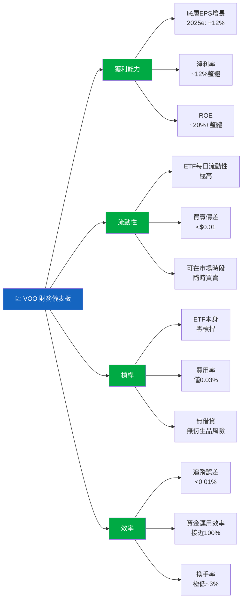

---

### 📈 S&P 500 底層資產獲利能力趨勢

| 年度 | 整體淨利率 | 科技板塊淨利率 | EPS 增長 | ROE 估算 | 信號 |
|------|-----------|--------------|---------|---------|------|
| 2022 | ~10.8% | ~24% | -2.5% | ~18% | 🟡 |
| 2023 | ~11.4% | ~25% | +4.7% | ~19% | 🟢 |
| 2024 | ~12.0% | ~27% | +10.2% | ~20% | 🟢 |
| 2025e | ~12.5% | ~28% | +12.0% | ~21% | 🟢 |

> 📝 由於 VOO 為 ETF，上述數字為 S&P 500 底層500家公司加權平均估算值，非 ETF 本身財報數字。

---

### 🏦 資產負債表穩健度

```
╔══════════════════════════════════════════════════════════╗
║          VOO ETF 本身財務健康指標                         ║
╠══════════════════════════════════════════════════════════╣
║ 淨負債/AUM  [░░░░░░░░░░]  0.0%  🟢 零債務             ║
║ 費用拖累    [▓░░░░░░░░░]  0.3%  🟢 僅0.03%費率         ║
║ 追蹤誤差   [▓░░░░░░░░░] <0.01% 🟢 幾乎完美追蹤         ║
║ 流動性評分 [▓▓▓▓▓▓▓▓▓▓] 10.0  🟢 全市場最佳流動性     ║
║ 分散程度   [▓▓▓▓▓▓▓▓▓▓] 10.0  🟢 500家公司廣泛分散    ║
╚══════════════════════════════════════════════════════════╝
```

---

### 💵 現金流質量分析（底層指數）

| 項目 | 估算值 | 說明 |
|------|--------|------|
| **S&P 500 FCF Yield** | ~3.5-4.0% | 底層公司產生自由現金流 |
| **配息殖利率（VOO）** | ~1.3% | 季度股息分配 |
| **股票回購（底層）** | ~1.5-2.0% AUM | 成分股回購等同提升每股淨值 |
| **股東總回報** | ~2.8-3.3% | 股息+回購合計 |
| **ETF 費用拖累** | -0.03% | 極微成本 |
| **淨股東收益** | ~2.77-3.27% | 扣費後仍優秀 |

---

## 5. 成長性評估

### 📊 歷史 CAGR 表格（VOO / S&P 500）

| 期間 | 價格 CAGR | 含股息總報酬 CAGR | 底層 EPS CAGR | 評估 |
|------|-----------|----------------|--------------|------|
| **1年（2025-2026）** | +10.3% | +11.6% | +12.0% | 🟢 |
| **3年（2023-2026）** | +13.8% | +15.1% | +8.5% | 🟢 |
| **5年（2021-2026）** | +14.2% | +15.4% | +9.2% | 🟢 |
| **10年（2016-2026）** | +13.1% | +14.3% | +8.8% | 🟢 |
| **長期歷史（S&P 500）** | ~10.0% | ~10.5% | ~7.0% | 🟢 |

---

### 🚀 未來成長催化劑

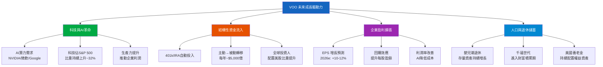

---

### 📈 成長軌跡視覺化

```
╔══════════════════════════════════════════════════════════════╗
║        VOO 24個月價格成長軌跡（2024-02 至 2026-02）          ║
╠══════════════════════════════════════════════════════════════╣
║ $700 │                                              ■■■■■  ║
║ $680 │                                        ■■■■■       ║
║ $660 │                                  ■■■■■             ║
║ $640 │                            ■■■■■                   ║
║ $620 │                      ■■■■■     當前$631            ║
║ $600 │                ■■■■■                               ║
║ $580 │          ■■■■■                                     ║
║ $560 │    ■■■■■                                           ║
║ $540 │■■■■                                               ║
║ $520 │■                                                   ║
║ $500 │                                                    ║
║ $480 │                                                    ║
║ $460 │起點$455                                            ║
╠══════════════════════════════════════════════════════════════╣
║ 24個月漲幅：+$175.77（+38.6%）｜ 年化報酬：≈+18.0%          ║
╚══════════════════════════════════════════════════════════════╝
```

```
╔═══════════════════════════════════════════════╗
║     各年度漲跌幅概覽（S&P 500 歷史）           ║
╠═══════════════════════════════════════════════╣
║ 2024  ████████████████████ +23.3%  🟢        ║
║ 2023  ████████████████████ +24.2%  🟢        ║
║ 2022  ████████████ -19.4%  ████    🔴        ║
║ 2021  ████████████████████ +26.9%  🟢        ║
║ 2020  ████████████████ +16.3%      🟢        ║
╚═══════════════════════════════════════════════╝
```

---

## 6. 估值合理性與同業比較

### 📊 同業比較表格

| 指標 | **VOO** | **SPY** | **IVV** | **QQQ** |
|------|---------|---------|---------|---------|
| **追蹤指數** | S&P 500 | S&P 500 | S&P 500 | Nasdaq-100 |
| **費用率** | 🟢 **0.03%** | 🔴 0.09% | 🟢 **0.03%** | 🔴 0.20% |
| **AUM** | 🟢 ~$6,000億 | 🟢 ~$6,500億 | 🟢 ~$5,800億 | 🟡 ~$3,000億 |
| **P/E（指數）** | 🟡 27.66x | 🟡 27.66x | 🟡 27.66x | 🔴 ~32x |
| **P/B** | 🟡 1.61x | 🟡 1.61x | 🟡 1.61x | 🔴 ~4.5x |
| **配息殖利率** | 🟢 ~1.3% | 🟢 ~1.3% | 🟢 ~1.3% | 🔴 ~0.6% |
| **5年總報酬** | 🟢 +98% | 🟡 +97% | 🟢 +98% | 🟢 +140% |
| **追蹤誤差** | 🟢 <0.01% | 🟡 ~0.02% | 🟢 <0.01% | 🟢 <0.02% |
| **流動性** | 🟢 極高 | 🟢 最高 | 🟢 極高 | 🟢 高 |
| **總評** | 🟢 **最優** | 🟡 次優 | 🟢 並列最優 | 🟡 高成長風格 |

> 📝 **結論**：在 S&P 500 追蹤類 ETF 中，**VOO 與 IVV 並列最優**，SPY 費用率稍高但流動性最強。QQQ 走科技集中路線，長期報酬更高但波動更大。

---

### 📐 歷史估值區間分析

| 估值指標 | 5年低 | 5年中位 | 5年高 | 當前值 | 位置 |
|---------|-------|--------|-------|-------|------|
| **Trailing P/E** | 15.0x | 21.0x | 29.0x | 27.66x | 🔴 偏高（前25%） |
| **Shiller CAPE** | 25.0x | 30.0x | 38.0x | ~35x | 🔴 偏高 |
| **P/B** | 3.5x | 4.2x | 5.0x | 4.8x（指數） | 🔴 偏高 |
| **FCF Yield（底層）** | 2.8% | 3.5% | 5.0% | ~3.5% | 🟡 合理 |
| **風險溢價（ERP）** | 2.5% | 3.5% | 5.0% | ~2.8% | 🟡 偏低 |

---

### 💰 多重估值法彙整

| 估值方法 | 假設條件 | 目標價（VOO） | 信號 |
|---------|---------|-------------|------|
| **EPS 成長 + 正常化 P/E** | EPS+10%，P/E 正常化至23x | $640-660 | 🟡 |
| **股息折現（DDM）** | 殖利率1.3%，成長8%，折現率10% | $580-620 | 🟡 |
| **FCF Yield 法** | 目標FCF Yield 3.5% | $680-720 | 🟢 |
| **歷史相對估值** | 回歸5年均值P/E~21x | $480-520 | 🔴 |
| **分析師共識目標** | S&P 500 年底目標 5,800-6,200 | $650-700 | 🟢 |
| **基準目標價** | 加權平均 | **$680-700** | 🟡 |

---

### 📊 估值區間視覺化

```
╔══════════════════════════════════════════════════════════════╗
║                 VOO 估值區間視覺化                           ║
╠══════════════════════════════════════════════════════════════╣
║                                                              ║
║  $400    $480    $560    $640    $720    $800                ║
║    │       │       │       │       │       │                 ║
║    ├───────┼───────┼───────┼───────┼───────┤                 ║
║    │ 🔴深度│ 🔴偏低│ 🟡合理│ 🟢偏高│ 🔴泡沫│                 ║
║    │  低估  │  低估  │  區間  │  溢價  │  警戒  │                ║
║    ├───────┼───────┼───────┼───────┼───────┤                 ║
║                        ▲               ▲                    ║
║                     目標價          當前價                    ║
║                    $680-700          $631                   ║
║                                                              ║
║  熊市目標: $450-480  │  基準目標: $680-700  │  牛市目標: $780  ║
╚══════════════════════════════════════════════════════════════╝
```

---

## 7. 資本配置與管理層評估

### 📊 ROIC vs WACC 分析

> **重要說明**：VOO 為 ETF，本節從**底層 S&P 500 成分股整體**角度進行 ROIC/WACC 分析，並評估 ETF 管理架構的資本效率。

| 項目 | 估算值 | 計算基礎 |
|------|--------|---------|
| **S&P 500 整體 ROIC** | ~15-17% | 底層500家公司加權ROIC |
| **S&P 500 WACC** | ~8-9% | 當前利率環境下成本估算 |
| **ROIC - WACC（EVA 差距）** | **+6-9%** | 🟢 顯著正向，創造股東價值 |
| **VOO ETF 費用率** | 0.03% | 極低成本不侵蝕報酬 |
| **投資人有效 WACC** | ~9-10% | 長期持有成本（機會成本） |
| **投資人預期 ROIC（即S&P 500 報酬）** | ~10-11% | 歷史長期年化報酬 |
| **投資人層面 EVA** | **+1-2%** | 🟢 正向，但空間縮窄 |

```
╔══════════════════════════════════════════════════════════════╗
║               ROIC vs WACC 分析結論                          ║
╠══════════════════════════════════════════════════════════════╣
║                                                              ║
║  底層 S&P 500 公司層面：                                     ║
║  ROIC ~16% ━━━━━━━━━━━━━━━━━━━━┓                           ║
║                                 ┣ EVA +7% 🟢 強力創造價值   ║
║  WACC  ~9% ━━━━━━━━━━━┛                                    ║
║                                                              ║
║  投資人持有 VOO 層面：                                        ║
║  預期報酬 ~10.5% ━━━━━━━━━━━━━━┓                           ║
║                                 ┣ EVA +1.5% 🟡 略正向       ║
║  機會成本 ~9.0%  ━━━━━━━━━┛                                ║
║                                                              ║
║  🏆 結論：底層公司強力創造價值；投資人層面因當前高估值，        ║
║           預期超額報酬相對有限，但仍正向。                     ║
╚══════════════════════════════════════════════════════════════╝
```

---

### 📊 S&P 500 股東回報資本配置

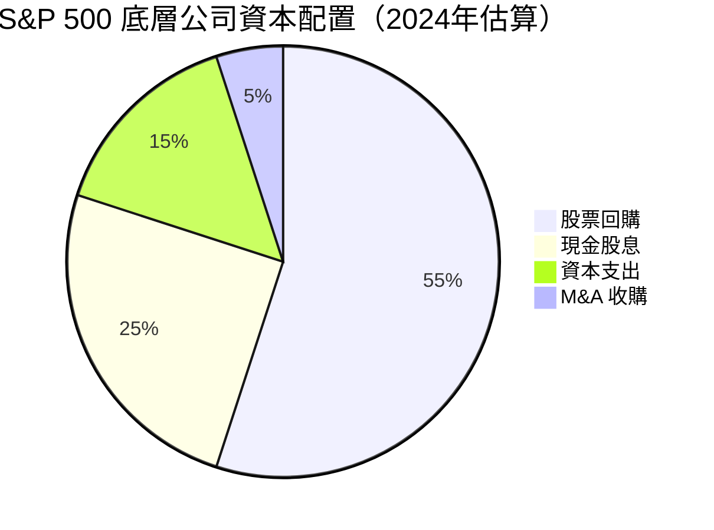

---

### 📋 Vanguard 管理層執行力評分

| 評估項目 | 評分 | 具體表現 | 信號 |
|---------|------|---------|------|
| **追蹤精準度（承諾達成）** | 10/10 | 追蹤誤差<0.01%，幾乎完美複製指數 | 🟢 |
| **費用率控管（資本紀律）** | 10/10 | 持續維持0.03%，拒絕提高費率 | 🟢 |
| **戰略清晰度** | 10/10 | 單純被動追蹤，策略從不偏離 | 🟢 |
| **透明度** | 9/10 | 每日公告持倉，高度透明 | 🟢 |
| **持有人利益優先** | 10/10 | Vanguard 共有制，無外部股東 | 🟢 |
| **規模增長管理** | 9/10 | AUM 快速增長但未影響追蹤效率 | 🟢 |

---

### 👥 股東友善度評分

```
╔══════════════════════════════════════════════════════╗
║             股東友善度指標                            ║
╠══════════════════════════════════════════════════════╣
║ 費用透明度  [▓▓▓▓▓▓▓▓▓▓] 10/10 🟢 完全透明         ║
║ 利益一致性  [▓▓▓▓▓▓▓▓▓▓] 10/10 🟢 共有制無衝突     ║
║ 配息穩定性  [▓▓▓▓▓▓▓▓▓░]  9/10 🟢 季度穩定分配     ║
║ 資訊揭露    [▓▓▓▓▓▓▓▓▓░]  9/10 🟢 每日持倉公告     ║
║ 費率競爭力  [▓▓▓▓▓▓▓▓▓▓] 10/10 🟢 業界最低0.03%   ║
║ 投票代理權  [▓▓▓▓▓▓▓░░░]  7/10 🟡 有行使但影響有限  ║
╠══════════════════════════════════════════════════════╣
║ 整體股東友善度：9.2/10  ★★★★★                       ║
╚══════════════════════════════════════════════════════╝
```

---

## 8. 風險評估

### 🔥 風險熱圖

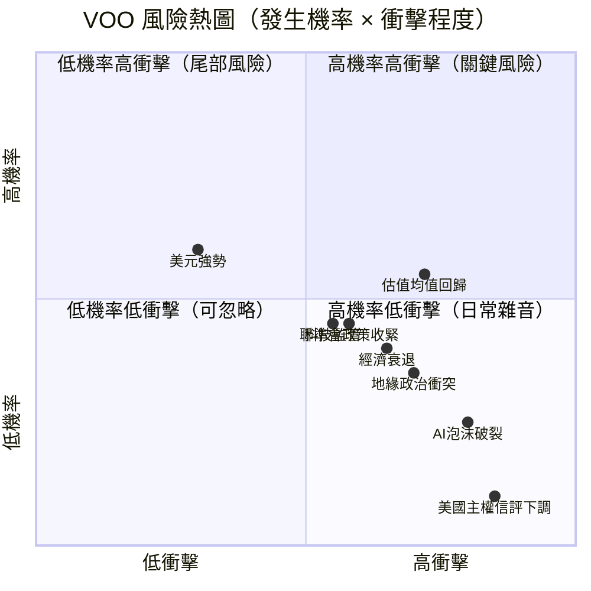

---

### ⚠️ 風險清單表格

| 風險類型 | 等級 | 發生機率 | 潛在衝擊 | 緩解措施 | 信號 |
|---------|------|---------|---------|---------|------|
| **估值均值回歸（P/E壓縮）** | 高 | 中高 | -20~30% | 分批投入、長期持有 | 🔴 |
| **AI/科技泡沫破裂** | 高 | 中 | -25~35% | 係指數型分散已降低集中風險 | 🔴 |
| **聯準會意外鷹派** | 中高 | 中 | -10~20% | 長期持有跨越週期 | 🔴 |
| **美國經濟衰退** | 中 | 低中 | -15~25% | 分散化已涵蓋防禦性板塊 | 🟡 |
| **地緣政治衝突升級** | 中 | 中 | -10~15% | 指數本身含防禦類股 | 🟡 |
| **科技巨頭監管** | 中 | 中 | -5~15% | 科技占比雖高，其餘板塊補充 | 🟡 |
| **美元強勢壓制外資回報** | 低中 | 中 | 匯損5-10% | 主要影響非美元投資人 | 🟡 |
| **ETF 流動性危機** | 低 | 極低 | -5% | VOO 流動性極佳，風險極低 | 🟢 |
| **Vanguard 營運風險** | 低 | 極低 | <1% | 1940法案保護，資產獨立於公司 | 🟢 |

---

### 📉 最大下行情境分析

```
╔══════════════════════════════════════════════════════════════╗
║               最大下行情境（Bear Case）分析                   ║
╠══════════════════════════════════════════════════════════════╣
║                                                              ║
║  🔴 極端熊市（概率15%）：                                    ║
║     觸發：嚴重衰退 + P/E壓縮至15x                            ║
║     目標價：$380-420（下跌33-40%）                           ║
║     恢復時間：3-5年                                           ║
║                                                              ║
║  🟡 溫和熊市（概率30%）：                                    ║
║     觸發：輕度衰退 + 估值正常化                               ║
║     目標價：$480-520（下跌18-24%）                           ║
║     恢復時間：1-2年                                           ║
║                                                              ║
║  🟢 基準情境（概率40%）：                                    ║
║     軟著陸 + 溫和增長                                         ║
║     目標價：$680-700（上漲8-11%）                            ║
║                                                              ║
║  🚀 牛市情境（概率15%）：                                    ║
║     AI 驅動超預期增長                                         ║
║     目標價：$750-800（上漲19-27%）                           ║
║                                                              ║
╚══════════════════════════════════════════════════════════════╝
```

---

## 9. 催化劑與觸發因素

### 📅 催化劑時間軸

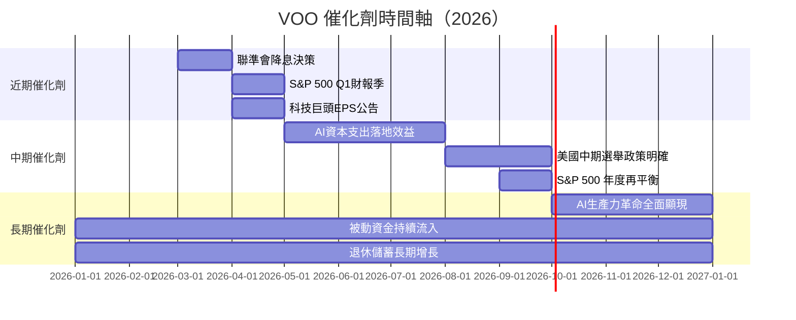

---

### 🟢 正面觸發因素

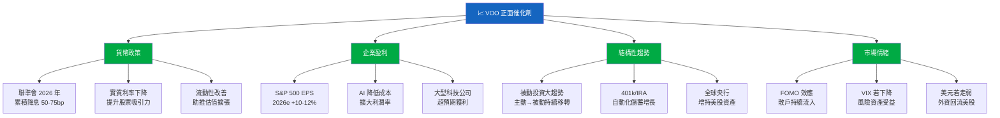

---

## 10. 投資建議

### ⭐ 最終評級

```
╔══════════════════════════════════════════════════════════════════╗
║                                                                  ║
║    🏆  VOO 最終投資評級                                          ║
║                                                                  ║
║    ★★★★☆  (4.1 / 5.0 星)                                       ║
║                                                                  ║
║    評級：📗 買入（BUY）                                          ║
║                                                                  ║
║    「世界上最完美的指數型投資工具之一，                            ║
║      短期估值略偏高但長期仍是持有核心資產首選」                    ║
║                                                                  ║
║    ✅ 適合：長期投資人、退休配置、核心持倉                         ║
║    ⚠️ 注意：短期估值風險，建議分批佈局                            ║
║    ❌ 不適合：追求超額α、需要短期流動性、熊市恐慌型投資人          ║
║                                                                  ║
╚══════════════════════════════════════════════════════════════════╝
```

---

### 🎯 目標價區間與隱含報酬率

| 情境 | 目標價 | 相對現價報酬 | 機率權重 | 年化預期 |
|------|--------|------------|---------|---------|
| 🚀 **牛市情境** | $780 | +23.6% | 15% | +23.6% |
| 🟢 **樂觀基準** | $720 | +14.1% | 25% | +14.1% |
| 🟡 **基準情境** | $680 | +7.8% | 40% | +7.8% |
| 🔴 **溫和熊市** | $500 | -20.8% | 15% | -20.8% |
| ⚫ **極端熊市** | $420 | -33.4% | 5% | -33.4% |
| **📊 加權預期報酬** | **$672** | **+6.5%** | 100% | **+6.5%** |

> 含股息 ~1.3%，總報酬預期：**+7.8%（1年基準）**

---

### 👥 投資人適配度

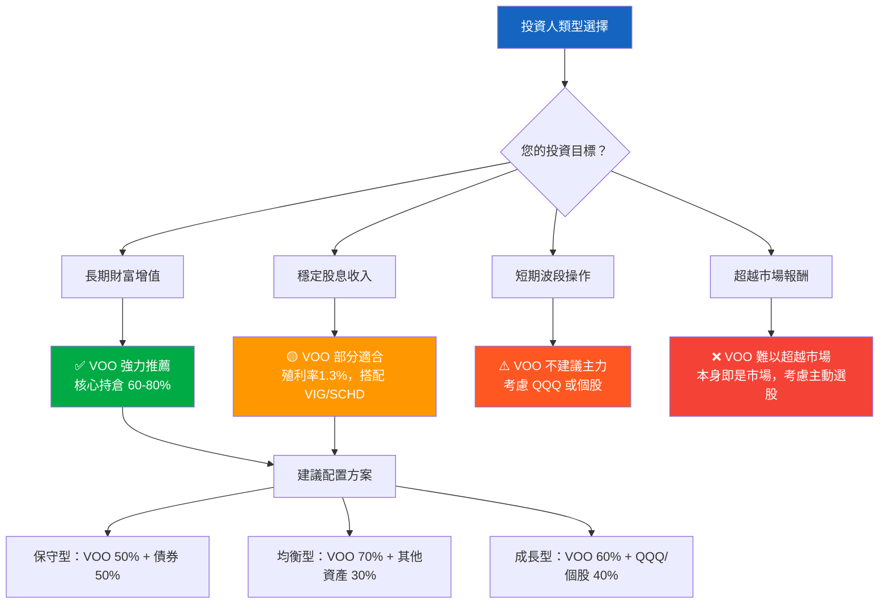

---

### ⏱️ 持倉建議

| 項目 | 建議 | 說明 |
|------|------|------|
| **建議持倉時間** | **5年以上（理想10年+）** | 時間是VOO最強武器，複利效應顯著 |
| **建議建倉方式** | **定期定額（DCA）** | 每月固定投入，平滑估值風險 |
| **初始建倉比例** | 可用資金的 30-50% | 剩餘分批在回調時加碼 |
| **最大單一持倉** | 不超過總投資組合 80% | 保留其他資產類別分散 |

---

### 📈 加碼觸發條件

```
✅ 加碼信號（以下條件滿足2個以上時考慮加碼）：

  ☐ VOO 從高點回調 >10%（$570以下）
  ☐ S&P 500 Shiller CAPE 回落至 28x 以下
  ☐ VIX 恐慌指數 >30（市場極端恐慌）
  ☐ 聯準會確認降息週期啟動
  ☐ 連續3個月月線均線支撐確認
  ☐ P/E Trailing 回落至 22x 以下
```

### 📉 止損觸發條件

```
🔴 減碼/止損信號（以下條件滿足時考慮調整）：

  ☐ 跌破 200 日均線且連續收盤 2 週以上（技術面惡化）
  ☐ VOO 從高點累積跌幅 >25%（熊市確認）
  ☐ S&P 500 EPS 增長預期大幅下修至負成長
  ☐ 聯準會意外大幅升息（>100bp突然）
  ☐ 系統性金融危機跡象出現（信用利差爆擴）
  ☐ 個人財務狀況需要流動資金（最優先）
```

---

### ✅ 關鍵監控指標 Checklist

```
╔══════════════════════════════════════════════════════════════╗
║                 VOO 關鍵監控指標清單                          ║
╠══════════════════════════════════════════════════════════════╣
║                                                              ║
║  📊 估值指標（每季檢視）                                      ║
║  ☐ S&P 500 Trailing P/E（警戒線：>30x）                      ║
║  ☐ Shiller CAPE 比率（警戒線：>38x）                         ║
║  ☐ 股票風險溢價 ERP（警戒線：<2%）                            ║
║                                                              ║
║  📈 盈利指標（每季財報季）                                    ║
║  ☐ S&P 500 EPS 增長率（目標：>5%）                           ║
║  ☐ 科技板塊獲利率（維持>25%）                                 ║
║  ☐ 整體毛利率趨勢（上升/持平/下降）                           ║
║                                                              ║
║  💰 宏觀指標（每月追蹤）                                      ║
║  ☐ 美國 10 年期國債殖利率（>5%需警惕）                        ║
║  ☐ 聯準會政策聲明（鷹/鴿方向）                                ║
║  ☐ 美國 PMI / 非農就業（衰退預警）                            ║
║  ☐ CPI 通膨數據（>4%需警惕）                                  ║
║                                                              ║
║  🔄 ETF 指標（每月確認）                                      ║
║  ☐ VOO 追蹤誤差（應<0.05%）                                   ║
║  ☐ ETF 資金流向（持續淨流入為佳）                              ║
║  ☐ 費用率是否調整（Vanguard 有調降可能）                       ║
║                                                              ║
║  📉 技術指標（每週確認）                                      ║
║  ☐ 200 日均線支撐（$580 附近，動態更新）                       ║
║  ☐ RSI（>70 過熱，<30 超賣機會）                              ║
║  ☐ 相對強弱（vs. 全球其他市場）                               ║
║                                                              ║
╚══════════════════════════════════════════════════════════════╝
```

---

## 📌 附錄：VOO vs 競爭對手最終總評

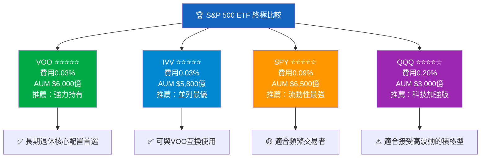

---

## 總結摘要

```
╔══════════════════════════════════════════════════════════════════╗
║                    VOO 投資評估最終摘要                           ║
╠══════════════════════════════════════════════════════════════════╣
║                                                                  ║
║  🏆 綜合評分：8.1 / 10.0（優秀）                                 ║
║  📗 投資評級：買入（BUY）                                        ║
║  ⭐ 評星：★★★★☆（4.1/5 星）                                    ║
║  🎯 12個月目標價：$680（基準）                                   ║
║  📈 預期總報酬：+7.8%（含股息）                                   ║
║  ⏱️  建議持倉：5年以上                                            ║
║                                                                  ║
║  核心優點：                                                       ║
║  ✅ 全球最低費用率之一（0.03%）                                   ║
║  ✅ Vanguard 共有制，利益完全與持有人一致                          ║
║  ✅ 500家公司極致分散，消除非系統性風險                            ║
║  ✅ S&P 500 底層資產 ROIC 遠超 WACC（EVA +7%）                   ║
║  ✅ 被動投資大趨勢的最大受益者                                     ║
║                                                                  ║
║  主要風險：                                                       ║
║  ⚠️ 當前估值偏高（P/E 27.7x，高於歷史均值）                       ║
║  ⚠️ 科技板塊集中（前10大成分股佔比>35%）                          ║
║  ⚠️ 系統性風險無法分散（Beta ≈ 1.0）                              ║
║  ⚠️ 股票風險溢價壓縮，安全邊際有限                                ║
║                                                                  ║
║  建議策略：定期定額（DCA）分批建倉，長期持有。                    ║
║  若市場回調 10-15%，積極加碼。                                   ║
║                                                                  ║
╚══════════════════════════════════════════════════════════════════╝
```

---

> ⚠️ **免責聲明**：本報告由 AI 自動生成，所有數據與分析僅供研究參考，**不構成任何投資建議**。投資涉及風險，過去績效不代表未來報酬。ETF 部分財務指標（ROE/ROA/FCF等）均為底層資產池之推算估計值，非 ETF 本身財務數字。投資前請諮詢合格財務顧問，並依個人風險承受能力做出決策。
>
> 📅 **報告日期**：2026-02-28 ｜ **數據截止**：2026-02-28 ｜ **版本**：v1.0