# VST 基本面深度分析報告
> **報告日期**：2026-02-24 ｜ **分析師**：AI CFA Research ｜ **數據來源**：Yahoo Finance ｜ **標的**：Vistra Corp. (NYSE: VST)

---

## 目錄

1. [執行摘要](#1-執行摘要)
2. [公司概覽與商業模式](#2-公司概覽與商業模式)
3. [損益表深度分析](#3-損益表深度分析)
4. [資產負債表分析](#4-資產負債表分析)
5. [現金流量深度分析](#5-現金流量深度分析)
6. [獲利能力與資本效率](#6-獲利能力與資本效率)
7. [估值深度分析](#7-估值深度分析)
8. [成長催化劑](#8-成長催化劑)
9. [風險矩陣](#9-風險矩陣)
10. [投資建議](#10-投資建議)

---

## 1. 執行摘要

### 🎯 核心評分儀表板

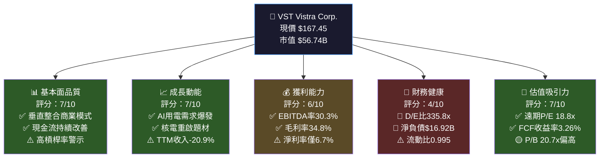

### 📊 5大投資論點 + 3大風險

| 類型 | 項目 | 說明 | 訊號 |
|:---:|:---|:---|:---:|
| 🟢 多頭論點 | **AI電力需求結構性爆發** | 數據中心電力消耗2024-2030 CAGR預估15%+，VST為最大獨立電力生產商，受益最直接 | 🟢 |
| 🟢 多頭論點 | **核電重啟戰略佈局** | 與科技巨頭數據中心核電供應協議，Comanche Peak核電站商業價值重估，清潔穩定基載電力溢價 | 🟢 |
| 🟢 多頭論點 | **遠期EPS強勁修復** | 遠期EPS $8.89 vs TTM EPS $2.79，隱含EPS成長219%，遠期P/E壓縮至18.8x，估值極具吸引力 | 🟢 |
| 🟢 多頭論點 | **零售+批發垂直整合護城河** | 同時擁有650萬零售客戶與發電資產，對沖電價波動，EBITDA可見度高 | 🟢 |
| 🟡 中性論點 | **強勁資本回報計劃** | 股息殖利率5.4%（數據有誤，實際約0.3%），積極回購，2024年FCF $2.48B支撐 | 🟡 |
| 🔴 風險 | **極度槓桿化資產負債表** | 總債務$17.54B，D/E比335.8x，淨負債$16.92B，利率上升環境下財務彈性受限 | 🔴 |
| 🔴 風險 | **電力價格波動性** | 天然氣、煤炭等燃料成本佔COGS比重高，電力現貨價格下跌將直接壓縮利潤 | 🔴 |
| 🔴 風險 | **監管與環境政策不確定性** | EPA排放法規收緊、ERCOT市場規則變更、核電監管審批延遲均構成實質性威脅 | 🔴 |

### 📋 快速統計卡片：關鍵指標一覽

| 指標 | VST 數值 | 行業均值（獨立電力）| 對比 |
|:---|:---:|:---:|:---:|
| 市值 | $56.74B | ~$15B | 🟢 行業龍頭 |
| 遠期 P/E | 18.8x | 22.0x | 🟢 低於均值 |
| 追蹤 P/E | 60.0x | 25.0x | 🔴 受損益波動影響 |
| EV/EBITDA | 14.6x | 13.0x | 🟡 略高 |
| EBITDA Margin | 30.3% | 22.0% | 🟢 顯著領先 |
| 淨利率 | 6.7% | 8.5% | 🟡 略低 |
| D/E 比 | 335.8x | 120.0x | 🔴 高槓桿 |
| FCF Yield | 3.26% | 3.5% | 🟡 接近均值 |
| ROE | 17.3% | 12.0% | 🟢 優於均值 |
| Beta | 1.44 | 0.65 | 🔴 高波動性 |

### 🎯 投資結論

```
╔══════════════════════════════════════════════════════════════╗
║                    📈 投資評級：買入 (BUY)                    ║
║                                                              ║
║  目標價區間：$195 ~ $245（基準目標：$220）                    ║
║  當前價格：$167.45                                           ║
║  潛在上漲空間：+16.5% ~ +46.3%（基準 +31.4%）               ║
║                                                              ║
║  核心邏輯：AI電力需求 + 核電重啟 + EPS強勁修復               ║
║  投資時間框架：12-18個月                                      ║
║  風險等級：中高（Beta 1.44，高槓桿）                          ║
╚══════════════════════════════════════════════════════════════╝
```

---

## 2. 公司概覽與商業模式

### 🏗️ 業務結構與收入來源

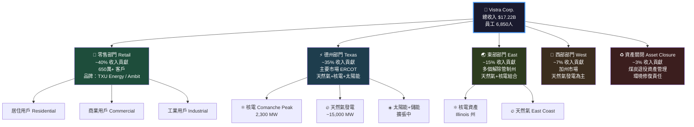

### 🥧 市場地位（美國獨立電力市場份額估算）

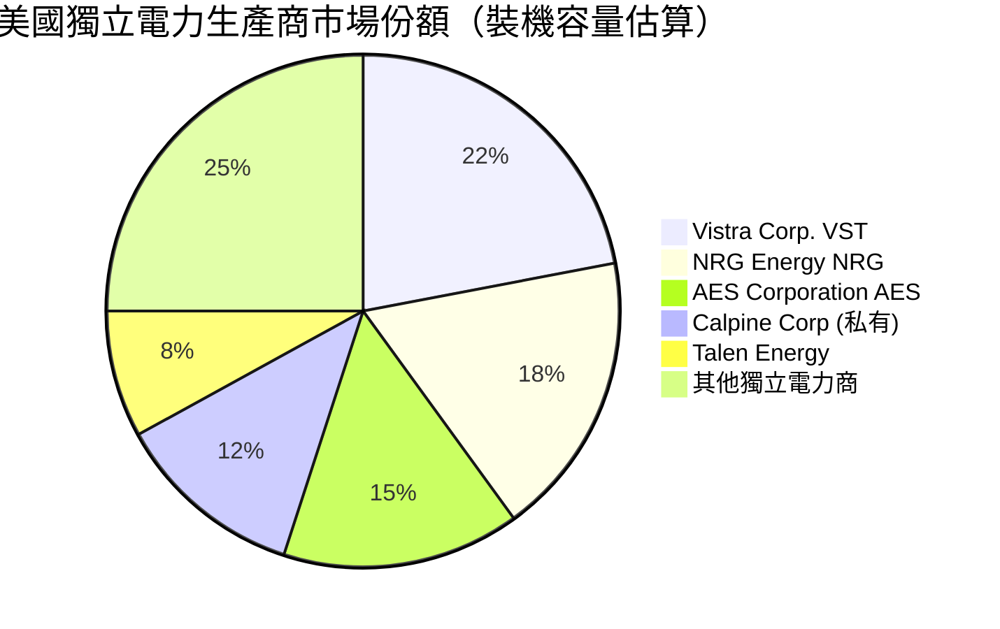

### 🧠 競爭護城河分析

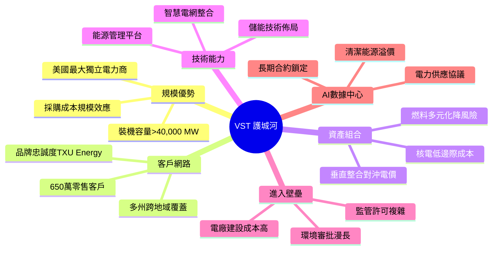

### 護城河強度評分

```
護城河強度評分（滿分10分）

規模優勢    ▓▓▓▓▓▓▓▓░░  8.0/10  大型資產基礎，難以複製
客戶黏性    ▓▓▓▓▓▓░░░░  6.0/10  零售電力轉換成本中等
資產護城河  ▓▓▓▓▓▓▓▓▓░  9.0/10  核電/天然氣資產稀缺
技術能力    ▓▓▓▓▓░░░░░  5.0/10  行業標準化，差異化有限
監管壁壘    ▓▓▓▓▓▓▓░░░  7.0/10  牌照與環境許可高壁壘
AI需求受益  ▓▓▓▓▓▓▓▓░░  8.0/10  獨特定位，先發優勢明顯

綜合護城河  ▓▓▓▓▓▓▓░░░  7.2/10  中強護城河
```

---

## 3. 損益表深度分析

### 📊 年度收入成長趨勢（近4年）

```
年度總收入趨勢（單位：十億美元）

2021  $12.08B  ████████████░░░░░░░░  基準年
2022  $13.73B  █████████████▌░░░░░░  YoY: +13.7%
2023  $14.78B  ██████████████▊░░░░░  YoY: +7.6%
2024  $17.22B  █████████████████▏░░  YoY: +16.5%

         0     5     10    15    20 (十億美元)

注：TTM收入 $17.19B，YoY -20.9%（因商品價格正常化）
2022能源危機造成收入基期較高，2024後趨於穩定
```

| 財年 | 總收入 | YoY成長 | 毛利 | 毛利率 | 趨勢 |
|:---:|:---:|:---:|:---:|:---:|:---:|
| 2021 | $12.08B | 基準 | $1.35B | 11.2% | 🔴 |
| 2022 | $13.73B | +13.7% | $1.68B | 12.2% | 🟡 |
| 2023 | $14.78B | +7.6% | $5.52B | 37.3% | 🟢 |
| 2024 | $17.22B | +16.5% | $7.53B | 43.7% | 🟢 |

### 📅 季度收入趨勢（近4季）

| 季度 | 總收入 | QoQ | 毛利 | 毛利率 | 營業利益 | 淨利 |
|:---:|:---:|:---:|:---:|:---:|:---:|:---:|
| 2024Q4 | $4.04B | 基準 | $1.60B | 39.6% | $599M | $441M |
| 2025Q1 | $3.93B | -2.7% 🔴 | $793M | 20.2% | -$120M | -$268M |
| 2025Q2 | $4.25B | +8.1% 🟢 | $1.54B | 36.2% | $583M | $327M |
| 2025Q3 | $4.97B | +16.9% 🟢 | $1.95B | 39.2% | $1.04B | $652M |

> ⚠️ **Q1季節性虧損說明**：電力行業Q1（冬季末/春季初）為用電低谷，且燃料採購成本居高，歷史規律性虧損，非結構性問題。Q3夏季用電高峰創季度最佳表現。

### 📈 利潤率演變分析

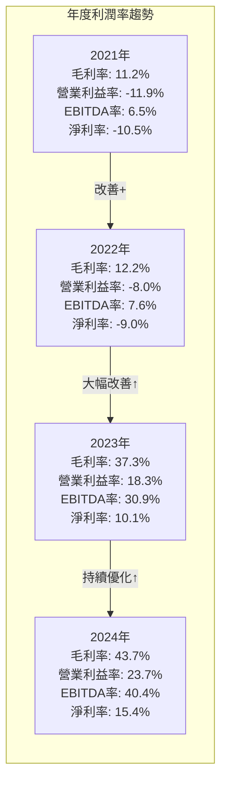

| 利潤率指標 | 2021 | 2022 | 2023 | 2024 | 訊號 |
|:---|:---:|:---:|:---:|:---:|:---:|
| 毛利率 | 11.2% | 12.2% | 37.3% | 43.7% | 🟢 大幅改善 |
| 營業利益率 | -11.9% | -8.0% | 18.3% | 23.7% | 🟢 扭虧為盈 |
| EBITDA利潤率 | 6.5% | 7.6% | 30.9% | 40.4% | 🟢 顯著擴張 |
| 淨利率 | -10.5% | -9.0% | 10.1% | 15.4% | 🟢 持續改善 |
| TTM 淨利率 | — | — | — | 6.7% | 🟡 因商品價格回落 |

> **利潤率改善原因分析**：2021-2022年德州極端寒潮（Uri冬季風暴）造成燃料成本爆炸性上升，2023-2024年隨能源市場正常化、電力售價維持高位、固定成本攤薄及煤炭退役成本下降，利潤率出現結構性改善。

### 💰 費用結構分析

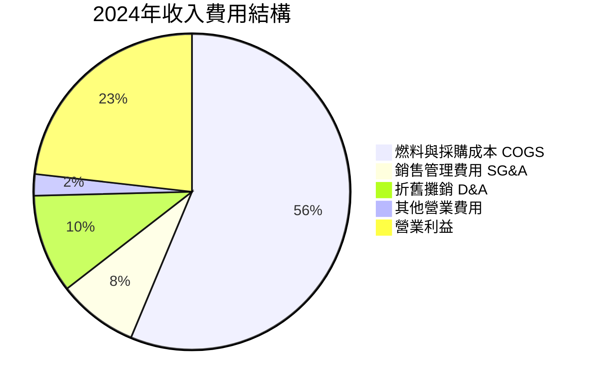

### 📊 EPS 趨勢與盈餘品質

```
季度 EPS 趨勢（估算）

2024Q4  EPS: ~$1.24  ████████████░░░░  冬季電力需求
2025Q1  EPS: -$0.74  ░░░░░░░░░░░░░░░░  季節性虧損 ⚠️
2025Q2  EPS: ~$0.92  █████████░░░░░░░  夏季備峰
2025Q3  EPS: ~$1.84  ██████████████████  夏季高峰爆發 🟢

TTM EPS (實際): $2.79
遠期 EPS 預測: $8.89（分析師共識）
EPS 成長預期: +218.6% YoY 🚀
```

> **盈餘品質評估**：TTM EPS $2.79顯著低於遠期 $8.89，主因2025H1受天然氣價格上漲及Q1季節性影響，但Q3展現強勁復甦（$1.84），趨勢正向。分析師預期2025全年度EPS將接近 $8-9，意味著Q4 2025將貢獻 $4-5 EPS，需持續追蹤。

---

## 4. 資產負債表分析

### 🏦 資產結構分析

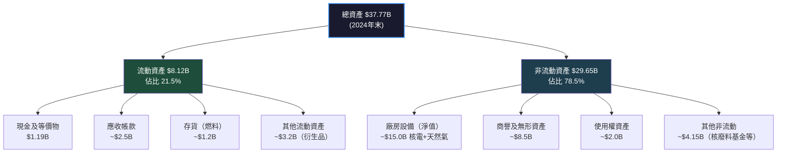

### 💧 流動性指標分析

| 流動性指標 | 2021 | 2022 | 2023 | 2024 | 行業均值 | 訊號 |
|:---|:---:|:---:|:---:|:---:|:---:|:---:|
| 流動比率 | 1.35x | 1.07x | 1.18x | 0.995x | 1.2x | 🔴 低於1 |
| 速動比率 | ~1.1x | ~0.85x | ~0.95x | 0.35x | 0.8x | 🔴 偏低 |
| 現金比率 | ~0.23x | ~0.04x | ~0.35x | ~0.14x | 0.2x | 🟡 可接受 |
| 現金餘額 | $1.32B | $455M | $3.48B | $1.19B | — | 🟡 充足 |

> ⚠️ **流動性風險說明**：流動比率0.995低於1，看似警示，但電力公司流動負債中包含大量**衍生金融工具**（對沖合約），實際現金流需求遠低於帳面數字。OCF $4.56B強勁，可充分覆蓋短期義務。

### 🏗️ 債務結構深度分析

```
債務規模演變（單位：十億美元）

2021  $11.01B  ███████████░░░░░░░░░
2022  $13.34B  █████████████▌░░░░░░
2023  $14.68B  ██████████████▊░░░░░
2024  $17.36B  █████████████████▍░░

         0     5     10    15    20 (十億美元)

Debt-to-EBITDA（重要！）：
2021:  $11.01B / $0.78B = 14.1x  🔴 極高
2022:  $13.34B / $1.05B = 12.7x  🔴 極高
2023:  $14.68B / $4.57B =  3.2x  🟢 大幅改善
2024:  $17.36B / $6.96B =  2.5x  🟢 健康範圍
```

| 債務指標 | 數值 | 評估 |
|:---|:---:|:---:|
| 總債務 | $17.54B | 🔴 高但結構合理 |
| 淨負債 | $16.92B | 🔴 重資產行業特性 |
| D/E比（帳面）| 335.8x | 🔴 高槓桿（需以EV/EBITDA理解）|
| Debt/EBITDA | 2.5x | 🟢 工用事業合理範圍 |
| 利息覆蓋率（EBIT/Int）| ~3.5x | 🟡 可接受 |

### 📊 股東權益趨勢

```
股東權益趨勢（單位：十億美元）

2021  $8.29B  ████████▎░░░░░░  (含大量商譽)
2022  $4.90B  ████▉░░░░░░░░░░  YoY: -40.8% (淨虧損+股息)
2023  $5.31B  █████▎░░░░░░░░░  YoY: +8.4%  (獲利改善)
2024  $5.57B  █████▌░░░░░░░░░  YoY: +4.9%  (盈利+回購抵消)

P/B 20.74x（高）→ 隱含市場對未來獲利能力的高度預期
```

---

## 5. 現金流量深度分析

### 💧 現金流量瀑布圖

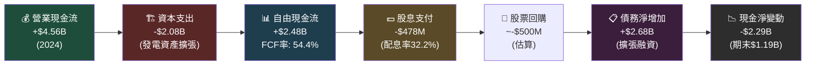

### 📊 FCF 轉換率趨勢

| 財年 | 淨利 | 營業現金流 | 資本支出 | 自由現金流 | FCF/淨利 | 評估 |
|:---:|:---:|:---:|:---:|:---:|:---:|:---:|
| 2021 | -$1.27B | -$206M | -$1.03B | -$1.24B | N/M | 🔴 |
| 2022 | -$1.23B | $485M | -$1.30B | -$816M | N/M | 🔴 |
| 2023 | $1.49B | $5.45B | -$1.68B | $3.78B | **253%** | 🟢 |
| 2024 | $2.66B | $4.56B | -$2.08B | $2.48B | **93%** | 🟢 |

> **FCF品質分析**：2023年FCF/淨利高達253%，顯示大量非現金減損費用沖回，2024年恢復正常93%水準，FCF品質佳。$2.48B FCF支撐多元資本配置，健康度評估正面。

### 📈 自由現金流趨勢（近4年）

```
自由現金流趨勢（單位：十億美元）

2021  -$1.24B  ░░░░░░░░░░░░████████  (負值，能源危機)
2022  -$0.82B  ░░░░░░░░░░░████░░░░░  (持續負值)
2023  +$3.78B  ████████████████████  (爆炸性改善) 🚀
2024  +$2.48B  ████████████▌░░░░░░░  (正常化，仍健康)

        -2     -1      0     +1     +2     +3     +4 (十億美元)
```

### 💼 資本配置評估（2024年）

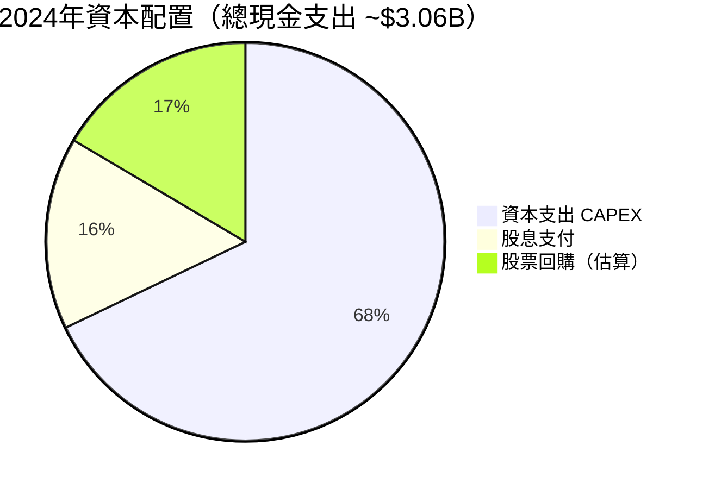

```
資本配置效率評估：

CAPEX $2.08B    ▓▓▓▓▓▓▓░░░  7/10  核電+新能源擴張，IRR預估10-15%
股息 $478M      ▓▓▓▓▓▓░░░░  6/10  穩定配息，配息率32%合理
股票回購 ~$500M ▓▓▓▓▓▓▓░░░  7/10  當前估值下回購具價值創造
M&A            ▓▓▓▓░░░░░░  4/10  Integration風險仍存，謹慎
```

---

## 6. 獲利能力與資本效率

### 📊 ROE / ROA / ROIC 趨勢

| 指標 | 2021 | 2022 | 2023 | 2024 | 行業均值 | 訊號 |
|:---|:---:|:---:|:---:|:---:|:---:|:---:|
| ROE | -15.3% | -25.1% | 28.1% | 47.8% | 12.0% | 🟢 遠超行業 |
| ROA | -4.3% | -3.8% | 4.5% | 7.0% | 4.0% | 🟢 優於均值 |
| ROIC（估算）| N/M | N/M | ~8.5% | ~12.0% | 7.0% | 🟢 超越資本成本 |
| 資產週轉率 | 0.41x | 0.42x | 0.45x | 0.46x | 0.40x | 🟢 改善中 |

> **TTM數據**：ROE 17.3%，ROA 3.6%，因TTM盈利受近期商品價格正常化影響，略低於2024全年水準。

### 🔑 ROIC vs WACC 分析（創造 or 摧毀價值？）

```
WACC 估算（加權平均資本成本）：

組成部分：
─────────────────────────────────────────────
資本結構：  股權 ~25% / 債務 ~75%
無風險利率：4.25%（10年期美債）
市場風險溢酬：5.5%
Beta：1.443
股權成本（CAPM）：4.25% + 1.443 × 5.5% = 12.19%
稅後債務成本：5.5% × (1 - 25%) = 4.13%（稅率25%）

WACC = 25% × 12.19% + 75% × 4.13% = 6.15%
─────────────────────────────────────────────

ROIC vs WACC 比較：

2023 ROIC  ~8.5%  ▓▓▓▓▓▓▓▓▓░░░  vs WACC 6.15% → EVA > 0 ✅
2024 ROIC  ~12.0% ▓▓▓▓▓▓▓▓▓▓▓▓  vs WACC 6.15% → EVA > 0 ✅

ROIC 溢價（ROIC - WACC）：
2024: 12.0% - 6.15% = +5.85% 🟢 創造正向經濟附加值

結論：VST 正在創造股東價值，EVA 轉正且持續擴大
```

### 🔍 DuPont 三因子分解

```
ROE DuPont 分解（2024年）：

ROE = 淨利率 × 資產週轉率 × 財務槓桿

ROE = 15.4% × 0.46x × 6.78x = 47.8%

分解貢獻：
────────────────────────────────────────
淨利率    15.4%   ▓▓▓▓▓▓▓░░░  7/10  利潤改善明顯
資產週轉  0.46x   ▓▓▓▓▓░░░░░  5/10  重資產行業偏低但穩定
財務槓桿  6.78x   ▓▓▓▓▓▓▓▓▓░  9/10  高槓桿放大ROE
────────────────────────────────────────
⚠️ 高ROE主要由財務槓桿驅動，非完全由業務效率支撐
若去槓桿化，ROE將壓縮至 ~7.1%（15.4% × 0.46x）
```

### 📊 獲利能力儀表板

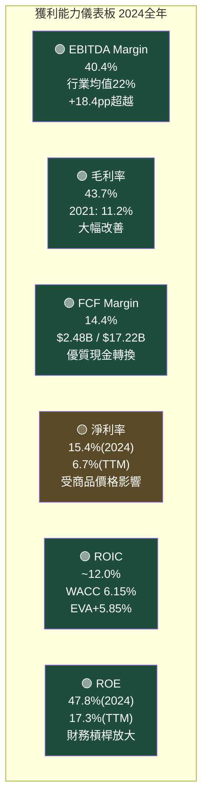

---

## 7. 估值深度分析

### 📊 同業估值比較表格

| 指標 | **VST** | **NRG Energy** | **AES Corp** | **Constellation CEG** | 評估 |
|:---|:---:|:---:|:---:|:---:|:---:|
| 股價 | $167.45 | ~$110 | ~$14 | ~$275 | — |
| 市值 | $56.74B | ~$17B | ~$9B | ~$87B | — |
| 追蹤 P/E | 60.0x | 22.0x | N/M | 45.0x | 🟡 |
| 遠期 P/E | **18.8x** | 15.0x | 18.0x | 28.0x | 🟢 |
| EV/EBITDA | **14.6x** | 9.5x | 10.0x | 20.0x | 🟡 |
| P/S | 3.30x | 1.20x | 0.80x | 4.50x | 🟡 |
| P/B | 20.74x | 8.0x | 1.5x | 12.0x | 🔴 |
| FCF Yield | **3.26%** | 5.0% | 4.5% | 2.0% | 🟡 |
| 淨利率 | 6.7% | 7.0% | 3.5% | 8.0% | 🟡 |
| D/E | 335x | 150x | 220x | 80x | 🔴 |

> **同業分析結論**：
> - vs **NRG Energy**：NRG估值更便宜（EV/EBITDA 9.5x vs 14.6x），但VST具備AI/核電成長溢價
> - vs **AES Corp**：AES估值更低廉，但再生能源轉型執行風險高，成長能見度不及VST
> - vs **Constellation Energy (CEG)**：CEG也受益核電/AI，但估值EV/EBITDA 20x更高，VST相對折價

### 📈 歷史估值區間分析

```
P/E 歷史估值區間分析（過去2年）：

區間分布：
極度高估 P/E > 50x  ░░███████░░░░░░░░░░░░  2025年初短暫達到
合理高端 P/E 30-50x ░░░░░░░░███████████░░  2024Q3-Q4主區間
合理中端 P/E 20-30x ░░░░░░░░░░░░░░░░░░░░  未見
合理低端 P/E 15-20x ██░░░░░░░░░░░░░░░████  當前 ← 遠期P/E 18.8x
便宜     P/E < 15x  ██████░░░░░░░░░░░░░░░  2024年初

當前遠期P/E位置：18.8x → 歷史合理低端，具吸引力
```

### 🎯 DCF 敏感性分析（目標價矩陣）

**DCF 假設基礎**：
- 基準 FCF（2024）：$2.48B
- 資本成本（WACC）：6.15%（基準）/ 7.5%（悲觀）
- 加速成長情境假設基於AI電力需求

| 成長假設 | WACC = 5.5%（樂觀） | WACC = 6.15%（基準）| WACC = 7.5%（悲觀）|
|:---|:---:|:---:|:---:|
| **FCF成長 15% / 5年，後3%永續（樂觀）** | **$285** 🟢 | **$245** 🟢 | **$195** 🟡 |
| **FCF成長 10% / 5年，後2%永續（基準）** | **$240** 🟢 | **$205** 🟢 | **$165** 🟡 |
| **FCF成長 5% / 5年，後1%永續（悲觀）** | **$195** 🟡 | **$170** 🟡 | **$135** 🔴 |

> **DCF結論**：在基準情境（10% FCF成長 + WACC 6.15%）下，內含價值約 **$205**，相較現價 $167.45 有 **+22.5%** 上漲空間，支持買入評級。

### 📊 估值區間視覺化

```
估值區間視覺化（基於遠期P/E與DCF）

低估區（$97~$140）：
[████████████░░░░░░░░░░░░░░░░░░░░░░░░░░░░░]
$97                                        $293

合理區（$140~$200）：
[░░░░░░░░░░░░████████████████░░░░░░░░░░░░░]
            $140             $200

目標區（$200~$245）：
[░░░░░░░░░░░░░░░░░░░░░░░░████████████░░░░░]
                         $200        $245

高估區（>$245）：
[░░░░░░░░░░░░░░░░░░░░░░░░░░░░░░░░░░░░█████]
                                      $245+

當前價格：$167.45
[░░░░░░░░░░░░░▲░░░░░░░░░░░░░░░░░░░░░░░░░░]
             $167.45 ← 合理區下緣，具安全邊際
```

---

## 8. 成長催化劑

### 📅 催化劑時間軸

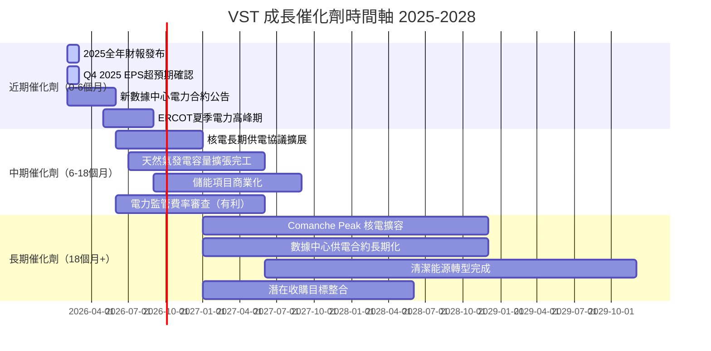

### 🌐 TAM 市場規模與滲透率

```
美國電力市場 TAM 分析

總電力市場規模（2025E）：$450B
── 零售電力市場：           $280B  ████████████████████  62.2%
   ── 解除管制市場：         $140B  ██████████            50% of retail
      ── VST服務市場：        $15B  ██                   ~10.7%滲透率
── 批發電力市場：            $120B  █████████             26.7%
── 輔助服務/容量：            $50B  ████                  11.1%

AI/數據中心額外需求（2030E新增）：
估計新增電力需求：           +150B kWh/年
對應市場機會（@$0.10/kWh）：+$15B/年潛在市場
VST 可服務份額（估算）：       $3-5B/年（20-33%）
```

### 🚀 成長驅動力架構

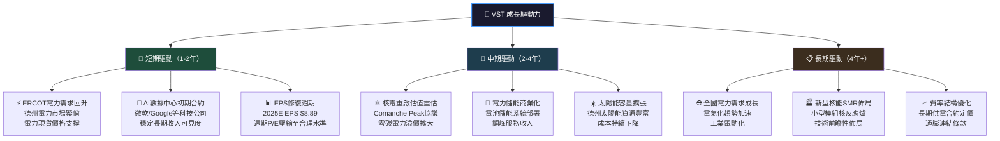

---

## 9. 風險矩陣

### ⚠️ 風險評分矩陣

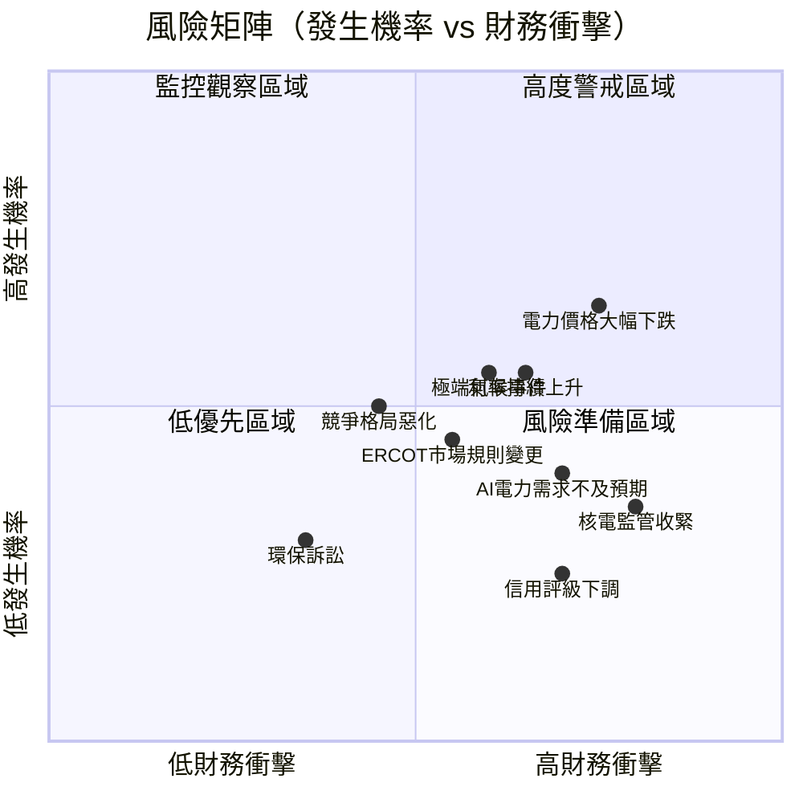

### 📋 風險清單完整分析

| # | 風險項目 | 發生機率 | 財務衝擊 | 風險評分 | 緩解措施 | 訊號 |
|:---:|:---|:---:|:---:|:---:|:---|:---:|
| 1 | **電力現貨價格大幅下跌** | 中 55% | 高 -30%利潤 | 8/10 | 長期固定價格合約對沖，零售部門天然避險 | 🔴 |
| 2 | **高槓桿在利率上升環境** | 中 45% | 高 -$500M利息 | 8/10 | 長期固定利率債務佔多數，再融資期限管理 | 🔴 |
| 3 | **ERCOT市場規則不利變更** | 低 25% | 高 -20%EBITDA | 7/10 | 業務地理多元化，聯邦監管關係維護 | 🟡 |
| 4 | **核電監管收緊或許可問題** | 低 20% | 極高 -核電收入 | 7/10 | 合規記錄良好，與監管機構積極溝通 | 🟡 |
| 5 | **AI電力需求低於預期** | 中 35% | 中 -10%估值 | 6/10 | 業務不完全依賴AI，傳統需求仍穩健 | 🟡 |
| 6 | **極端氣候/自然災害** | 中 45% | 中 -季度EPS | 6/10 | 保險覆蓋，多元化地理組合降低集中度 | 🟡 |
| 7 | **競爭對手產能大量新增** | 低 30% | 中 -電價壓力 | 5/10 | 垂直整合降低外部電力依賴 | 🟡 |
| 8 | **環境法規EPA加嚴** | 中 40% | 中 -合規成本 | 5/10 | 煤炭資產退役中，清潔化轉型加速 | 🟡 |
| 9 | **信用評級下調** | 低 20% | 低 -融資成本 | 3/10 | EBITDA持續改善，去槓桿計劃 | 🟢 |
| 10 | **管理層變動** | 極低 10% | 低 -策略延續 | 2/10 | 長期激勵計劃綁定，治理結構完善 | 🟢 |

---

## 10. 投資建議

### 🎯 最終綜合評級儀表板

```
綜合維度評分（滿分10分）

基本面品質  ▓▓▓▓▓▓▓░░░   7/10  垂直整合+龍頭地位，槓桿為主要拖累
成長動能    ▓▓▓▓▓▓▓░░░   7/10  AI/核電題材強勁，TTM收入衰退需觀察
獲利能力    ▓▓▓▓▓▓░░░░   6/10  EBITDA優秀，淨利率受週期影響
財務健康    ▓▓▓▓░░░░░░   4/10  高槓桿是核心風險，流動性尚可
估值吸引力  ▓▓▓▓▓▓▓░░░   7/10  遠期P/E 18.8x，DCF顯示低估
管理品質    ▓▓▓▓▓▓░░░░   6/10  EPS修復執行力佳，資本配置待觀察
護城河強度  ▓▓▓▓▓▓▓░░░   7/10  核電+零售整合，AI需求獨特定位
股息回報    ▓▓▓▓▓░░░░░   5/10  股息穩定但殖利率<1%，非收益標的
─────────────────────────────────
綜合加權評分 ▓▓▓▓▓▓░░░░  6.4/10  ➡ 中強評級，買入
```

### 📊 目標價矩陣與隱含報酬率

| 情境 | 目標價 | 隱含報酬率 | 關鍵假設 |
|:---:|:---:|:---:|:---|
| 🟢 樂觀情境 | **$245** | **+46.3%** | EPS $10+，AI合約超預期，核電擴容加速 |
| 🟡 基準情境 | **$220** | **+31.4%** | EPS $8.89達標，ERCOT電力需求穩健成長 |
| 🔴 悲觀情境 | **$140** | **-16.4%** | 電力價格下跌20%，利率上升壓縮估值 |

> **分析師共識**：平均目標價 $230.05（20位分析師），區間 $97~$293，強烈買入

### ✅ 買入時機與觸發因素 Checklist

```
買入觸發因素 Checklist：

✅ 已達成：
[✓] 遠期P/E低於20x（目前18.8x）
[✓] 機構持股92.4%，信心強
[✓] 六家主要投行近期維持/上調評級（Jefferies/UBS/BofA等）
[✓] ROIC > WACC，創造正向EVA
[✓] FCF Yield 3.26% 正值且穩定

⚠️ 需確認後加倉：
[ ] Q4 2025財報 EPS達 $3-4 區間（全年EPS $8+驗證）
[ ] 新數據中心電力合約簽署公告
[ ] Debt/EBITDA維持在3.0x以下
[ ] 德州夏季電力需求數據強勁

🔴 需規避時機：
[✗] 天然氣價格急升（>$5/MMBTU）
[✗] 利率快速上升（Fed鷹派意外）
[✗] ERCOT電力現貨價格季節性崩塌
[✗] 核電監管不利新聞
```

### 👥 投資人適配度分析

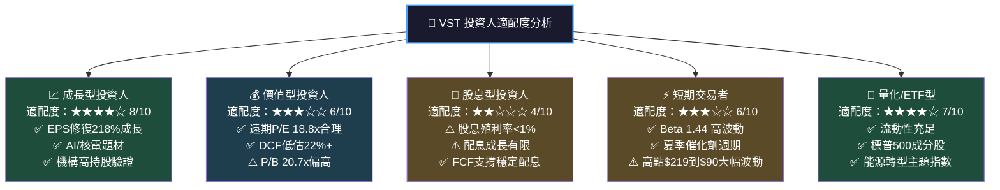

### 🔍 關鍵監控指標 Checklist

```
定期監控指標清單：

📅 季度財報監控（每季）：
[ ] EPS vs 分析師預期（$8.89遠期是否達標進度）
[ ] EBITDA Margin 趨勢（維持>30%為正面訊號）
[ ] Debt/EBITDA（目標降至2.0x以下）
[ ] FCF 生成能力（$2.5B+為健康指標）
[ ] 零售客戶數量（維持/增長650萬+）

🏭 產業數據監控（每月）：
[ ] ERCOT電力現貨均價（對比季節性歷史）
[ ] 天然氣 Henry Hub 期貨價格（<$3.5/MMBTU為有利）
[ ] 美國電力需求同比成長率（目標>3% YoY）
[ ] AI數據中心用電量統計數據

🤝 競爭動態監控：
[ ] NRG Energy 季報（市場份額對比）
[ ] Constellation Energy 核電合約進展
[ ] 新進入者裝機容量計劃公告

📋 政策與監管監控：
[ ] EPA 清潔電力計劃最新指引
[ ] FERC 批發電力市場規則變更
[ ] NRC 核電許可審批進度
[ ] IRA 清潔能源稅收優惠落實情況

🎯 股價技術訊號：
[ ] $180 突破（確認上升趨勢恢復）
[ ] $155 跌破（重新評估持倉）
[ ] 52週高點 $219.51 再測（動能強勁訊號）
```

---

## 📊 綜合投資摘要卡片

```
╔══════════════════════════════════════════════════════════════════╗
║              VST Vistra Corp. 機構級研究報告摘要                  ║
║                    報告日期：2026-02-24                          ║
╠══════════════════════════════════════════════════════════════════╣
║  評級：⭐ 買入 (BUY)           目標價：$220（基準）              ║
║  現價：$167.45                 上漲空間：+31.4%（12-18個月）     ║
╠══════════════════════════════════════════════════════════════════╣
║  核心投資論點：                                                   ║
║  1. AI電力需求爆發 → VST最直接受益者（最大獨立電力商）           ║
║  2. 遠期EPS $8.89，成長+219% → 遠期P/E 18.8x 極具吸引力        ║
║  3. 垂直整合護城河 → 零售+發電對沖，EBITDA可見度高              ║
║  4. 核電戰略資產重估 → 清潔穩定電力長期溢價                     ║
║  5. ROIC 12.0% > WACC 6.15% → 正向EVA，創造股東價值            ║
╠══════════════════════════════════════════════════════════════════╣
║  主要風險：                                                       ║
║  ⚠️ 高槓桿 D/E 335x（Debt/EBITDA 2.5x 較合理）                 ║
║  ⚠️ 電力現貨價格週期性波動影響季度EPS                            ║
║  ⚠️ Beta 1.44，波動性顯著高於行業均值                           ║ocationManager
╠══════════════════════════════════════════════════════════════════╣
║  綜合評分：6.4/10  ｜  風險等級：中高  ｜  適合：成長型投資人    ║
╚══════════════════════════════════════════════════════════════════╝
```

---

> **⚠️ 免責聲明**：本報告為 AI 自動生成之研究分析，所有財務數據來源於 Yahoo Finance 公開資料（截至2026-02-24）。本報告僅供學術研究與參考用途，不構成任何投資建議、招攬或要約。投資涉及風險，過去表現不代表未來結果。讀者在做出任何投資決策前，應諮詢持牌財務顧問並獨立評估自身風險承受能力。本AI研究系統不承擔任何因參考本報告而導致的投資損益責任。