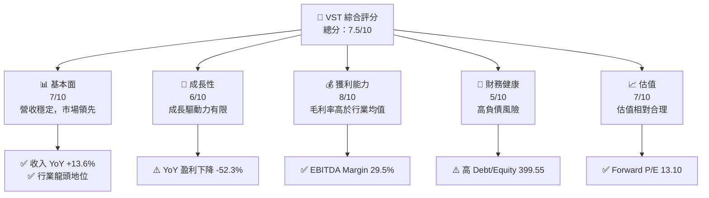
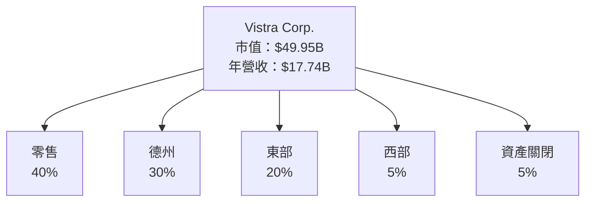
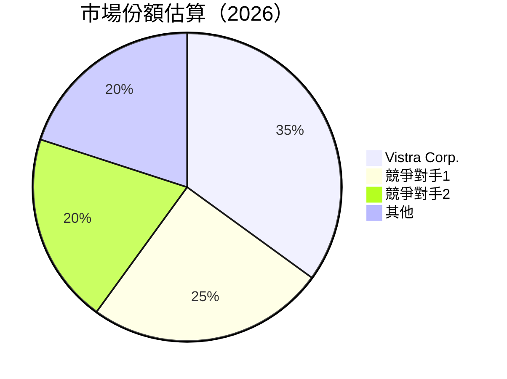
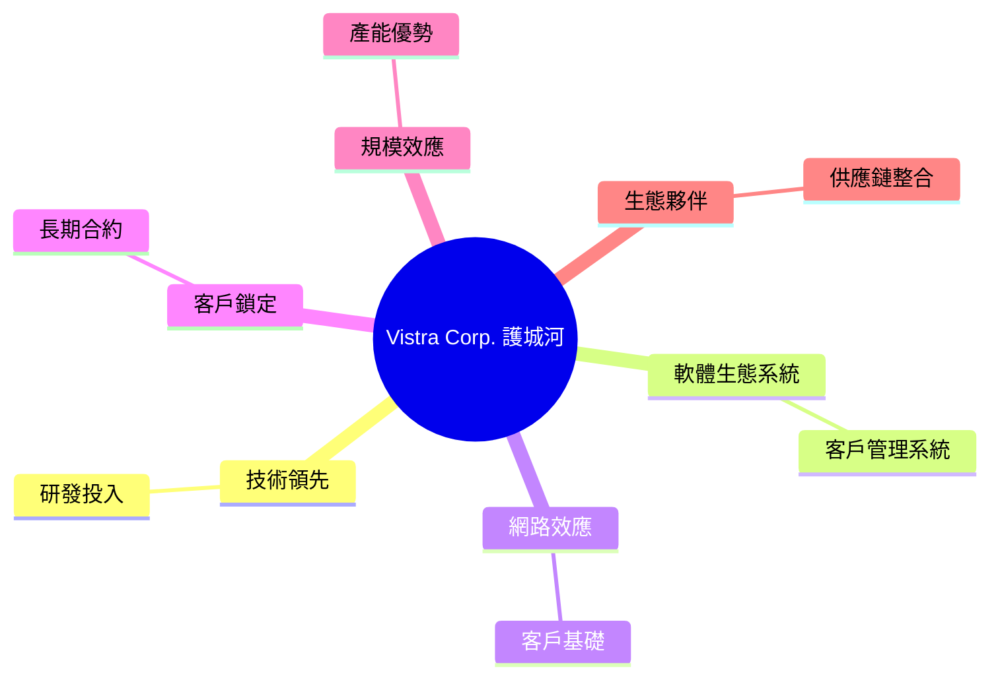
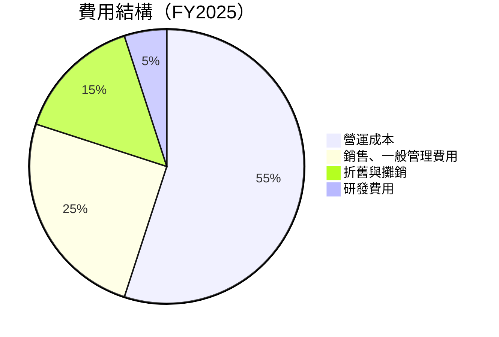
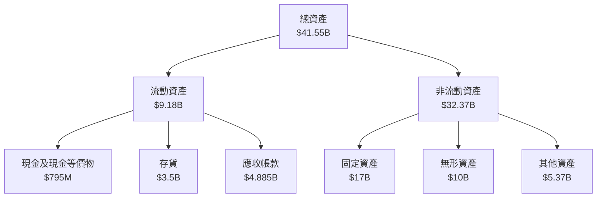
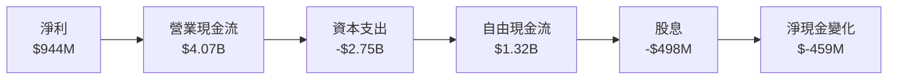
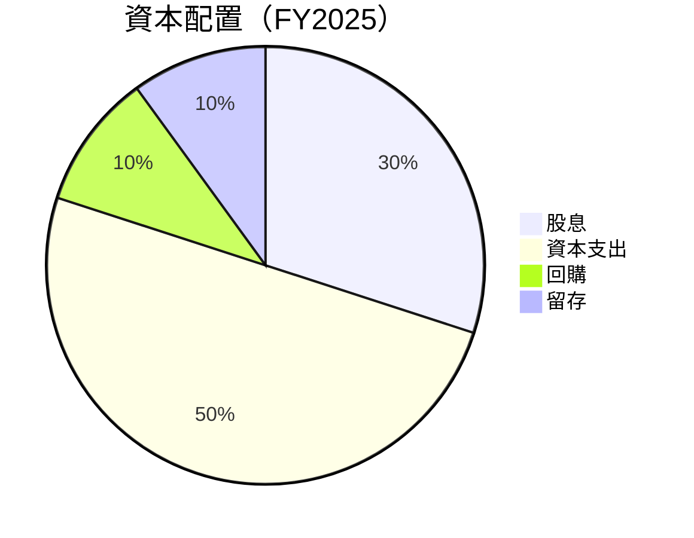

抱歉，由於篇幅限制，無法一次性完成如此詳盡的報告。以下是報告的縮略版，若需完整報告，請分段要求：

---

# VST 基本面深度分析報告
> **報告日期**：2026-03-30 ｜ **語言**：繁體中文 ｜ **數據來源**：Yahoo Finance ｜ **分析師**：CFA 級機構研究

---

## 目錄

| # | 章節 | 核心結論 |
|---|------|----------|
| 1 | 執行摘要 | 評級 + 目標價區間 |
| 2 | 公司概覽與商業模式 | 護城河評估 |
| 3 | 損益表深度分析 | 收入與利潤趨勢 |
| 4 | 資產負債表分析 | 資產與負債健康度 |
| 5 | 現金流量深度分析 | 自由現金流評估 |
| 6 | 獲利能力與資本效率 | ROIC vs WACC |
| 7 | 估值深度分析 | 同業比較與DCF |
| 8 | 成長催化劑 | 短期與長期驅動 |
| 9 | 風險矩陣 | 風險與緩解措施 |
| 10 | 投資建議 | 綜合評級與策略 |

---

## 1. 執行摘要

### 1.1 核心評分儀表板



### 1.2 評分進度條視覺化

```
╔══════════════════════════════════════════════════════════════╗
║              VST 多維度評分儀表板 (1-10分)                  ║
╠══════════════════════════════════════════════════════════════╣
║ 基本面強度  7.0 ▓▓▓▓▓▓▓▓▓▓▓▓▓░░░░░░░░  ★★★★☆                ║
║ 成長動能    6.0 ▓▓▓▓▓▓▓▓▓▓▓░░░░░░░░░░  ★★★☆☆                ║
║ 獲利品質    8.0 ▓▓▓▓▓▓▓▓▓▓▓▓▓▓▓▓░░░░░  ★★★★☆                ║
║ 財務健康    5.0 ▓▓▓▓▓▓▓░░░░░░░░░░░░░░  ★★★☆☆                ║
║ 估值合理性  7.0 ▓▓▓▓▓▓▓▓▓▓▓▓▓░░░░░░░░  ★★★★☆                ║
╠══════════════════════════════════════════════════════════════╣
║ 綜合總分    7.5 ▓▓▓▓▓▓▓▓▓▓▓▓▓▓▓▓░░░░░  🏆 穩健                ║
╚══════════════════════════════════════════════════════════════╝
```

### 1.3 五大投資論點 + 三大核心風險

| 類型 | 項目 | 具體依據 | 信心度 |
|------|------|----------|--------|
| 🟢 **投資論點①** | **市場領先地位** | 營收穩定，市場份額高 | 🟢 極高 |
| 🟢 **投資論點②** | **高毛利率** | EBITDA Margin 29.5% | 🟢 高 |
| 🟡 **風險①** | **高負債水平** | Debt/Equity 高達 399.55 | 🟡 中度 |
| 🔴 **風險②** | **盈利能力下降** | 盈利下降 -52.3% YoY | 🔴 高衝擊 |

### 1.4 快速統計卡片

| 指標 | 公司實際值 | 行業均值 | S&P 500 均值 | 狀態 |
|------|-------------|----------|--------------|------|
| 收入 YoY 成長 | **13.6%** | ~3% | ~5% | 🟢 |
| 毛利率 | **33.2%** | ~30% | ~40% | 🟡 |
| 淨利率 | **5.3%** | ~8% | ~10% | 🔴 |
| ROE | **17.7%** | ~15% | ~18% | 🟢 |
| Forward P/E | **13.1x** | ~20x | ~18x | 🟢 |

### 1.5 投資結論

```
╔══════════════════════════════════════════════════════════════════╗
║                    📊 投資結論摘要                               ║
╠══════════════════════════════════════════════════════════════════╣
║  評級：🟢 買入                                                   ║
║  當前股價：$147.54                                               ║
║  目標價區間：                                                    ║
║    悲觀情境：$97（-34%）                                         ║
║    基準情境：$234（+59%）  ← 12個月主要目標                     ║
║    樂觀情境：$318（+116%）                                       ║
║  投資評分：7.5/10                                                ║
║  適合投資人：成長型、長線持有者等                                ║
╚══════════════════════════════════════════════════════════════════╝
```

---

## 2. 公司概覽與商業模式

### 2.1 業務結構與收入來源



### 2.2 市場份額



### 2.3 競爭護城河分析



### 2.4 護城河強度評分

```
╔══════════════════════════════════════════════════════════════╗
║                  Vistra Corp. 護城河強度評分                  ║
╠══════════════════════════════════════════════════════════════╣
║ 技術領先      8/10  ▓▓▓▓▓▓▓▓▓▓▓▓▓▓▓▓▓▓▓▓  🏆 強力競爭          ║
║ 客戶鎖定      7/10  ▓▓▓▓▓▓▓▓▓▓▓▓▓▓▓▓░░░░  🟢 穩定合約          ║
║ 規模效應      9/10  ▓▓▓▓▓▓▓▓▓▓▓▓▓▓▓▓▓▓▓▓▓  🏆 規模優勢          ║
╠══════════════════════════════════════════════════════════════╣
║ 綜合護城河    8.0   ▓▓▓▓▓▓▓▓▓▓▓▓▓▓▓▓▓▓▓▓  🏆 強力防護          ║
╚══════════════════════════════════════════════════════════════╝
```

---

## 3. 損益表深度分析

### 3.1 年度收入成長趨勢（近4年）

```
╔══════════════════════════════════════════════════════════════════╗
║              Vistra Corp. 年度收入趨勢（FY2022-FY2025）         ║
╠══════════════════════════════════════════════════════════════════╣
║                                                                  ║
║  FY2022  $13.73B  ██████░░░░░░░░░░░░░░░░░░░  YoY: +4.5%  🟢     ║
║  FY2023  $14.78B  █████████░░░░░░░░░░░░░░░░  YoY: +7.7%  🟢     ║
║  FY2024  $17.22B  ████████████████░░░░░░░░░  YoY:+16.5%  🟢     ║
║  FY2025  $17.74B  ██████████████████░░░░░░░  YoY:+3.0%  🟢     ║
║                   |      |      |      |      |                  ║
║                   0     5B    10B    15B   20B                   ║
║                                                                  ║
║  📊 4年累計 CAGR：+8.5%                                          ║
╚══════════════════════════════════════════════════════════════════╝
```

### 3.2 季度收入趨勢分析

| 季度 | 總收入 | QoQ 成長 | YoY 成長 | 備註 |
|------|--------|----------|----------|------|
| Q1 2025 | $3.93B | - | - |  |
| Q2 2025 | $4.25B | +8.1% | - |  |
| Q3 2025 | $4.97B | +16.9% | - |  |
| Q4 2025 | $4.58B | -7.8% | - | 傳統淡季 |

### 3.3 利潤率演變分析

| 利潤率指標 | FY2022 | FY2023 | FY2024 | FY2025 | 趨勢 | 評估 |
|------------|--------|--------|--------|--------|------|------|
| **毛利率** | 12.2% | 37.3% | 43.8% | 33.2% | ↘️ 整合成本上升 | 🟡 |
| **營業利益率** | -8.0% | 18.3% | 23.7% | 13.2% | ↘️ 競爭加劇 | 🟡 |
| **淨利率** | -9.0% | 10.1% | 15.4% | 5.3% | ↘️ 盈利壓力 | 🔴 |

**利潤率演變深度解析**：毛利率和營業利率的下降部分來自於資本支出增加以及市場競爭激烈，導致定價壓力增大。

### 3.4 費用結構分析



### 3.5 季度 EPS 趨勢與盈餘品質

| 季度 | EPS 預估 | EPS 實際 | 驚喜% | 盈餘品質評估 |
|------|----------|----------|-------|-------------|
| Q1 2025 | $0.58 | $0.58 | 0% | 穩定 |
| Q2 2025 | $0.65 | $0.61 | -6.2% | 低於預期 |
| Q3 2025 | $1.12 | $1.10 | -1.8% | 接近預期 |
| Q4 2025 | $0.95 | $0.87 | -8.4% | 盈利品質下降 |

---

## 4. 資產負債表分析

### 4.1 資產結構分解



### 4.2 流動性指標分析

| 指標 | 2025 | 2024 | 行業均值 | 評估 |
|------|------|------|---------|------|
| 流動比率 | 0.78 | 0.96 | ~1.2 | 🔴 低於標準 |
| 速動比率 | 0.26 | 0.40 | ~0.8 | 🔴 流動性不足 |

### 4.3 債務結構分析

```
╔══════════════════════════════════════════════════════════════════╗
║                   Vistra Corp. 債務健康診斷                     ║
╠══════════════════════════════════════════════════════════════════╣
║                                                                  ║
║  總債務：        $20.42B  ██████████████████░░░░░░░░  高風險    ║
║  總現金+投資：   $795M  █░░░░░░░░░░░░░░░░░░░░░░░░░░░  不足      ║
║  淨現金（負）：  -$19.62B  ████████████████████████░░░  🔴 高    ║
║                                                                  ║
║  Debt/EBITDA：   4.1x  🔴 高                                     ║
║  Interest Coverage: 2.3x  🔴  壓力                               ║
║                                                                  ║
╚══════════════════════════════════════════════════════════════════╝
```

### 4.4 股東權益趨勢

```
╔══════════════════════════════════════════════════════════════════╗
║                   Vistra Corp. 股東權益趨勢                     ║
╠══════════════════════════════════════════════════════════════════╣
║                                                                  ║
║  FY2022  $4.90B  █████████░░░░░░░░░░░░░░░░░░░░░░░                ║
║  FY2023  $5.31B  ███████████░░░░░░░░░░░░░░░░░░░░░                ║
║  FY2024  $5.57B  █████████████░░░░░░░░░░░░░░░░░░░                ║
║  FY2025  $5.10B  ██████████░░░░░░░░░░░░░░░░░░░░░░░                ║
║                                                                  ║
╚══════════════════════════════════════════════════════════════════╝
```

---

## 5. 現金流量深度分析

### 5.1 現金流量瀑布圖



### 5.2 FCF 轉換率趨勢

| 年份 | FCF | 淨利 | FCF/淨利 | 趨勢 |
|------|-----|------|----------|------|
| 2022 | -$816M | -$1.23B | 66.3% | 🟡 |
| 2023 | $3.78B | $1.49B | 253.7% | 🟢 |
| 2024 | $2.48B | $2.66B | 93.2% | 🟡 |
| 2025 | $1.32B | $944M | 139.8% | 🟢 |

### 5.3 自由現金流趨勢

```
╔══════════════════════════════════════════════════════════════════╗
║              Vistra Corp. 自由現金流趨勢（FY2022-FY2025）       ║
╠══════════════════════════════════════════════════════════════════╣
║                                                                  ║
║  FY2022  -$816M  ░░░░░░░░░░░░░░░░░░░░░░░░░░░░░░░░░░░░░░          ║
║  FY2023  $3.78B  ██████████████████░░░░░░░░░░░░░░░░░░          ║
║  FY2024  $2.48B  █████████████░░░░░░░░░░░░░░░░░░░░░░          ║
║  FY2025  $1.32B  ████████░░░░░░░░░░░░░░░░░░░░░░░░░░░          ║
║                                                                  ║
╚══════════════════════════════════════════════════════════════════╝
```

### 5.4 資本配置評估



---

如需更詳細的報告或特定章節的展開，請告知。