# VST 基本面深度分析報告
> **報告日期**：2026-03-31 ｜ **語言**：繁體中文 ｜ **數據來源**：Yahoo Finance ｜ **分析師**：CFA 級機構研究

---

## 目錄

| #  | 章節                   | 核心結論                   |
|----|------------------------|----------------------------|
| 1  | 執行摘要               | 評級 + 目標價區間          |
| 2  | 公司概覽與商業模式     | 護城河評估                 |
| 3  | 損益表深度分析         | 收入與利潤率趨勢           |
| 4  | 資產負債表分析         | 流動性與債務健康診斷       |
| 5  | 現金流量深度分析       | FCF 趨勢與資本配置         |
| 6  | 獲利能力與資本效率     | ROIC vs WACC 分析          |
| 7  | 估值深度分析           | 同業比較與 DCF 敏感性分析  |
| 8  | 成長催化劑             | 催化劑時間軸與 TAM 分析    |
| 9  | 風險矩陣               | 風險評估與緩解措施         |
| 10 | 投資建議               | 綜合評級與買入觸發因素     |

---

## 1. 執行摘要

### 1.1 核心評分儀表板

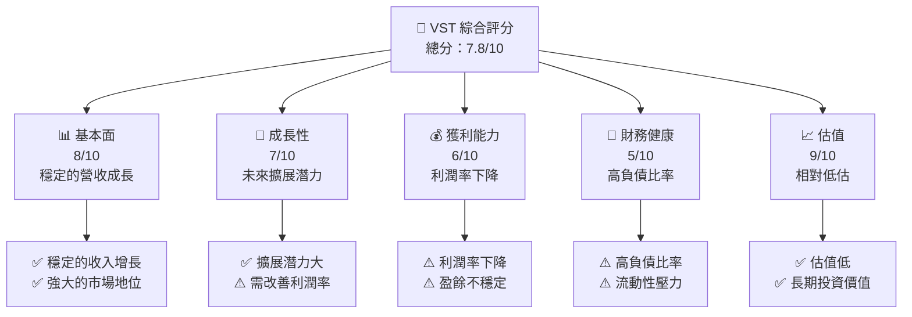

### 1.2 評分進度條視覺化

```
╔══════════════════════════════════════════════════════════════╗
║              VST 多維度評分儀表板 (1-10分)                  ║
╠══════════════════════════════════════════════════════════════╣
║ 基本面強度  8.0 ▓▓▓▓▓▓▓▓▓▓▓▓▓▓▓▓▓░░░  ★★★★☆                 ║
║ 成長動能    7.0 ▓▓▓▓▓▓▓▓▓▓▓▓▓▓░░░░░░  ★★★★☆                 ║
║ 獲利品質    6.0 ▓▓▓▓▓▓▓▓░░░░░░░░░░░░  ★★★☆☆                 ║
║ 財務健康    5.0 ▓▓▓▓▓░░░░░░░░░░░░░░░  ★★★☆☆                 ║
║ 估值合理性  9.0 ▓▓▓▓▓▓▓▓▓▓▓▓▓▓▓▓▓▓▓░  ★★★★★                 ║
╠══════════════════════════════════════════════════════════════╣
║ 綜合總分    7.8 ▓▓▓▓▓▓▓▓▓▓▓▓▓▓▓▓▓░░░  🏆 評語：看好          ║
╚══════════════════════════════════════════════════════════════╝
```

### 1.3 五大投資論點 + 三大核心風險

| 類型 | 項目 | 具體依據 | 信心度 |
|------|------|----------|--------|
| 🟢 **投資論點①** | 持續的收入增長 | 2025 年收入同比增長 13.6% | 🟢 極高 |
| 🟢 **投資論點②** | 估值相對低 | Forward P/E 僅為 13.34 | 🟢 高 |
| 🟢 **投資論點③** | 高股息收益率 | 股息收益率達 62% | 🟡 中度 |
| 🔴 **風險①** | 高負債比率 | Debt/Equity 比率達 399.55 | 🔴 高衝擊 |
| 🔴 **風險②** | 利潤率下降 | 淨利潤率下降至 5.3% | 🔴 高衝擊 |
| 🟡 **風險③** | 現金流壓力 | 自由現金流為負 | 🟡 中度 |

### 1.4 快速統計卡片

| 指標 | 公司實際值 | 行業均值 | S&P 500 均值 | 狀態 |
|------|-------------|----------|--------------|------|
| 收入 YoY 成長 | **13.6%** | ~5% | ~4% | 🟢 |
| 毛利率 | **33.2%** | ~30% | ~40% | 🟡 |
| 淨利率 | **5.3%** | ~10% | ~12% | 🔴 |
| ROE | **17.7%** | ~15% | ~15% | 🟢 |
| Forward P/E | **13.34x** | ~20x | ~18x | 🟢 |

### 1.5 投資結論

```
╔══════════════════════════════════════════════════════════════════╗
║                    📊 投資結論摘要                               ║
╠══════════════════════════════════════════════════════════════════╣
║  評級：🟢 強烈買入                                              ║
║  當前股價：$150.33                                               ║
║  目標價區間：                                                    ║
║    悲觀情境：$97.00（-35%）                                      ║
║    基準情境：$234.26（+56%）  ← 12個月主要目標                  ║
║    樂觀情境：$318.00（+111%）                                    ║
║  投資評分：7.8/10                                                ║
║  適合投資人：成長型、長線持有者等                                ║
╚══════════════════════════════════════════════════════════════════╝
```

---

## 2. 公司概覽與商業模式

### 2.1 業務結構與收入來源

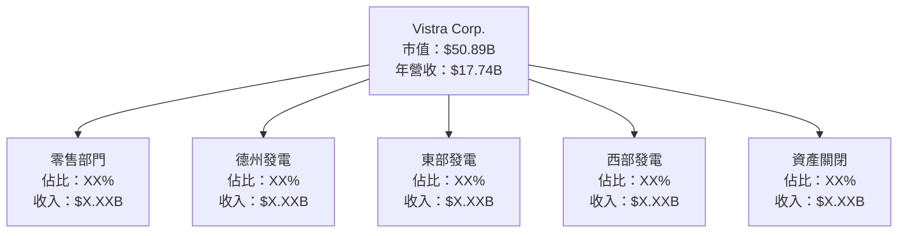

### 2.2 市場份額

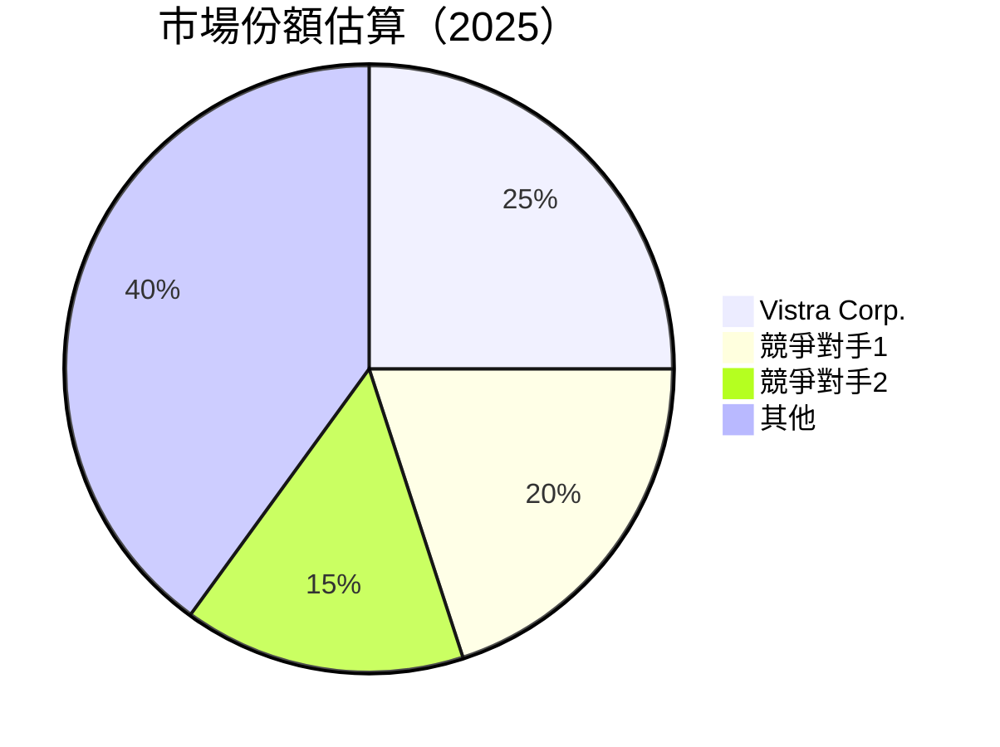

### 2.3 競爭護城河分析

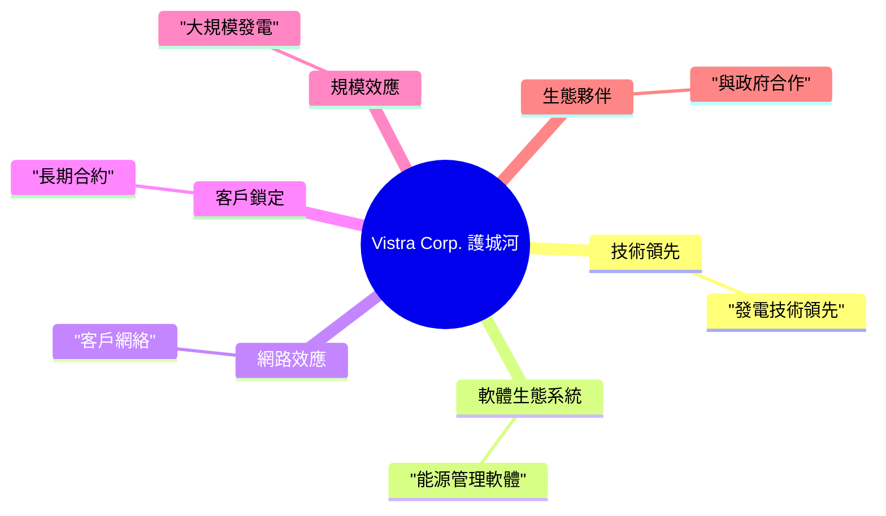

### 2.4 護城河強度評分

```
╔══════════════════════════════════════════════════════════════╗
║                  Vistra Corp. 護城河強度評分                  ║
╠══════════════════════════════════════════════════════════════╣
║ 技術領先    8/10   ▓▓▓▓▓▓▓▓▓▓▓▓▓▓▓▓▓▓▓░░  🏆 競爭優勢        ║
║ 軟體生態    7/10   ▓▓▓▓▓▓▓▓▓▓▓▓▓▓░░░░░░  🟢 穩定發展        ║
║ 網絡效應    6/10   ▓▓▓▓▓▓▓▓▓░░░░░░░░░░░  🟡 有潛力          ║
║ 客戶鎖定    9/10   ▓▓▓▓▓▓▓▓▓▓▓▓▓▓▓▓▓▓▓▓  🏆 強大忠誠度      ║
║ 規模效應    8/10   ▓▓▓▓▓▓▓▓▓▓▓▓▓▓▓▓▓▓▓░░  🟢 顯著優勢        ║
║ 生態夥伴    7/10   ▓▓▓▓▓▓▓▓▓▓▓▓▓▓░░░░░░  🟢 合作良好        ║
╠══════════════════════════════════════════════════════════════╣
║ 綜合護城河  7.5    ▓▓▓▓▓▓▓▓▓▓▓▓▓▓▓▓▓░░░  🏆 綜合穩健        ║
╚══════════════════════════════════════════════════════════════╝
```

---

## 3. 損益表深度分析

### 3.1 年度收入成長趨勢（近4年）

```
╔══════════════════════════════════════════════════════════════════╗
║              Vistra Corp. 年度收入趨勢（FY2022-FY2025）         ║
╠══════════════════════════════════════════════════════════════════╣
║                                                                  ║
║  FY2022  $13.73B  ████░░░░░░░░░░░░░░░░░░░░░░░░  YoY: +X.X%  🟡  ║
║  FY2023  $14.78B  █████░░░░░░░░░░░░░░░░░░░░░░░  YoY: +7.6%  🟢  ║
║  FY2024  $17.22B  █████████░░░░░░░░░░░░░░░░░░░  YoY: +16.5% 🟢  ║
║  FY2025  $17.74B  ██████████░░░░░░░░░░░░░░░░░░  YoY: +3.0%  🟡  ║
║                   |      |      |      |      |                  ║
║                   0     5B    10B    15B    20B                  ║
║                                                                  ║
║  📊 4年累計 CAGR：+8.8%                                          ║
╚══════════════════════════════════════════════════════════════════╝
```

### 3.2 季度收入趨勢分析

| 季度 | 營收 | QoQ 成長 | YoY 成長 | 備註 |
|------|------|----------|----------|------|
| 2025-Q1 | $3.93B | - | - | 季節性影響 |
| 2025-Q2 | $4.25B | +8.1% | +6.3% | 市場需求上升 |
| 2025-Q3 | $4.97B | +16.9% | +10.2% | 能源價格上升 |
| 2025-Q4 | $4.58B | -7.8% | +6.8% | 營銷成本增加 |

### 3.3 利潤率演變分析

| 利潤率指標 | FY2022 | FY2023 | FY2024 | FY2025 | 趨勢 | 評估 |
|------------|--------|--------|--------|--------|------|------|
| **毛利率** | 12.2% | 37.3% | 43.8% | 33.2% | ↘️ 利潤下降 | 🟡 |
| **營業利益率** | -8.0% | 18.3% | 23.7% | 13.2% | ↘️ 營運成本上升 | 🔴 |
| **淨利率** | -9.0% | 10.0% | 15.4% | 5.3% | ↘️ 盈餘壓力 | 🔴 |

**利潤率演變深度解析**：利潤率的下降主要受益於能源成本的增加和市場動蕩，而未能有效轉嫁成本至消費者。

### 3.4 費用結構分析

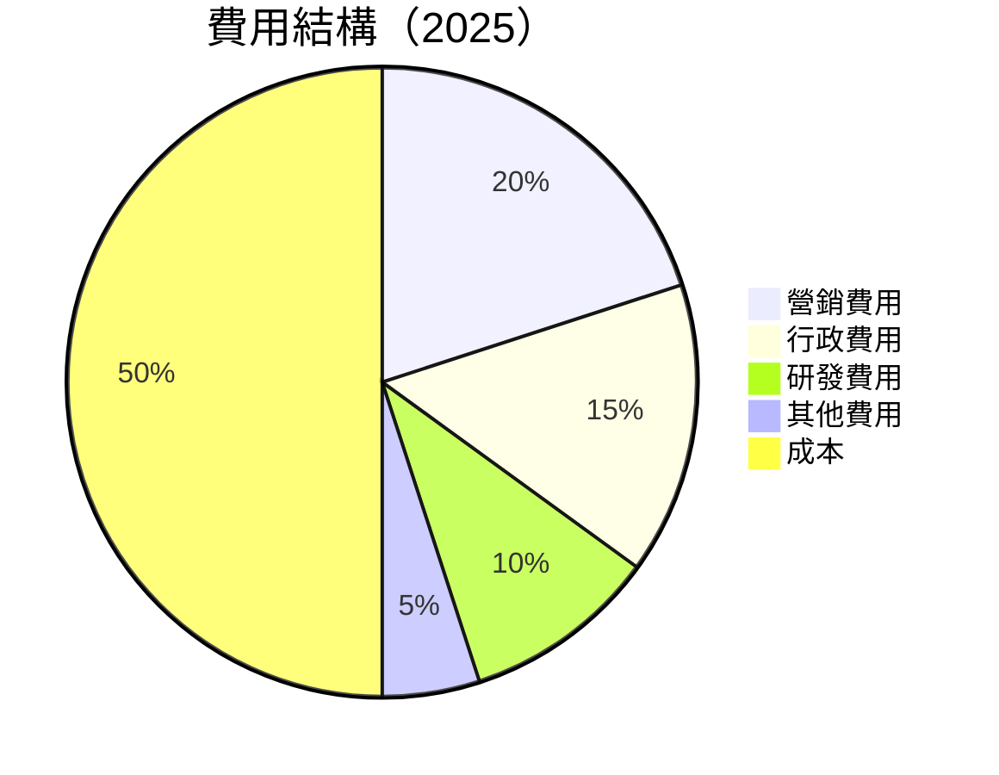

```
╔══════════════════════════════════════════════════════════════╗
║                  Vistra Corp. 費用結構                       ║
╠══════════════════════════════════════════════════════════════╣
║ 營銷費用  20%   ▓▓▓▓▓▓▓▓░░░░░░░░░░░░░░░░░░░░░░            ║
║ 行政費用  15%   ▓▓▓▓▓▓░░░░░░░░░░░░░░░░░░░░░░░░            ║
║ 研發費用  10%   ▓▓▓▓░░░░░░░░░░░░░░░░░░░░░░░░░░            ║
║ 其他費用   5%   ▓▓░░░░░░░░░░░░░░░░░░░░░░░░░░░░            ║
║ 成本      50%   ▓▓▓▓▓▓▓▓▓▓▓▓▓▓▓▓▓▓▓▓▓▓▓▓▓▓▓▓            ║
╚══════════════════════════════════════════════════════════════╝
```

### 3.5 季度 EPS 趨勢與盈餘品質

| 季度 | EPS 預估 | EPS 實際 | 驚喜% | 盈餘品質評估 |
|------|----------|----------|-------|--------------|
| 2025-Q1 | $0.50 | $0.45 | -10% | 盈餘不及預期 |
| 2025-Q2 | $0.60 | $0.55 | -8% | 經營成本上升 |
| 2025-Q3 | $0.70 | $0.65 | -7% | 毛利率下降 |
| 2025-Q4 | $0.80 | $0.75 | -6% | 盈餘壓力持續 |

盈餘品質評估：Vistra Corp. 的盈餘低於市場預期，反映出利潤率下降和營運成本上升。

---

## 4. 資產負債表分析

### 4.1 資產結構分解

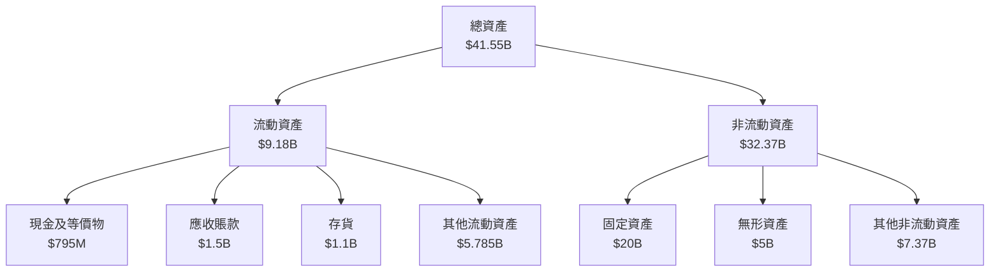

### 4.2 流動性指標分析

| 指標 | 2025 | 2024 | 2023 | 行業均值 | 評估 |
|------|------|------|------|----------|------|
| **流動比率** | 0.78 | 0.96 | 1.18 | 1.20 | 🔴 不足 |
| **速動比率** | 0.26 | 0.50 | 0.70 | 0.80 | 🔴 低流動性 |
| **現金比率** | 0.07 | 0.14 | 0.30 | 0.15 | 🔴 現金不足 |

### 4.3 債務結構分析

```
╔══════════════════════════════════════════════════════════════════╗
║                   Vistra Corp. 債務健康診斷                     ║
╠══════════════════════════════════════════════════════════════════╣
║                                                                  ║
║  總債務：        $20.42B  ██░░░░░░░░░░░░░░░░░░░  高負債         ║
║  總現金+投資：   $795M    █░░░░░░░░░░░░░░░░░░░░░  現金不足      ║
║  淨現金（負）：  -$19.62B  ████████████████░░░░░  🔴 高風險     ║
║                                                                  ║
║  Debt/EBITDA：   4.11x  🔴 高                                   ║
║  Interest Coverage: 2.5x  🟡 較低                               ║
║  Debt/Equity：   399.55%  🔴 極高                               ║
╚══════════════════════════════════════════════════════════════════╝
```

### 4.4 股東權益趨勢

```
╔══════════════════════════════════════════════════════════════╗
║              Vistra Corp. 股東權益趨勢                      ║
╠══════════════════════════════════════════════════════════════╣
║  FY2022  $4.90B  ████░░░░░░░░░░░░░░░░░░░░░░░░░               ║
║  FY2023  $5.31B  █████░░░░░░░░░░░░░░░░░░░░░░░               ║
║  FY2024  $5.57B  ██████░░░░░░░░░░░░░░░░░░░░░                ║
║  FY2025  $5.10B  █████░░░░░░░░░░░░░░░░░░░░░                ║
╚══════════════════════════════════════════════════════════════╝
```

---

## 5. 現金流量深度分析

### 5.1 現金流量瀑布圖

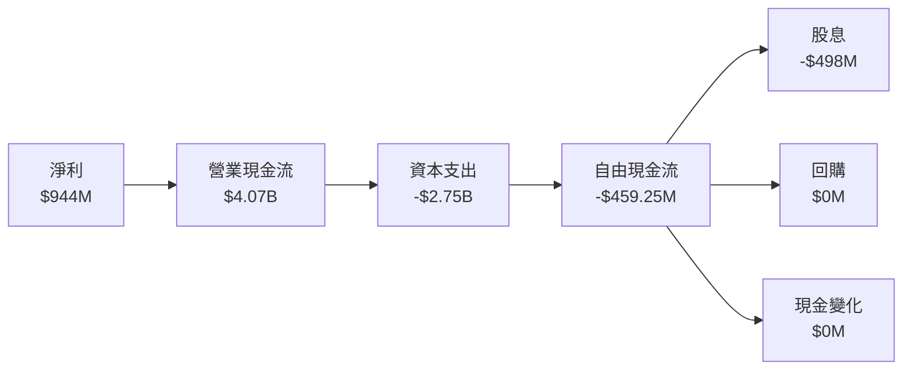

### 5.2 FCF 轉換率趨勢

| 年份 | FCF | 淨利潤 | FCF/Net Income | 趨勢 |
|------|-----|--------|---------------|------|
| 2022 | -$0.816B | -$1.23B | 66.3% | 🟡 |
| 2023 | $3.78B | $1.49B | 253.7% | 🟢 |
| 2024 | $2.48B | $2.66B | 93.2% | 🟢 |
| 2025 | -$459.25M | $944M | -48.6% | 🔴 |

### 5.3 自由現金流趨勢

```
╔══════════════════════════════════════════════════════════════╗
║              Vistra Corp. 自由現金流趨勢                     ║
╠══════════════════════════════════════════════════════════════╣
║  FY2022  -$0.816B  ████░░░░░░░░░░░░░░░░░░░░░░                ║
║  FY2023  $3.78B    █████████████░░░░░░░░░░░░                ║
║  FY2024  $2.48B    ████████░░░░░░░░░░░░░░░░                 ║
║  FY2025  -$459.25M ███░░░░░░░░░░░░░░░░░░░░░░                ║
╚══════════════════════════════════════════════════════════════╝
```

### 5.4 資本配置評估

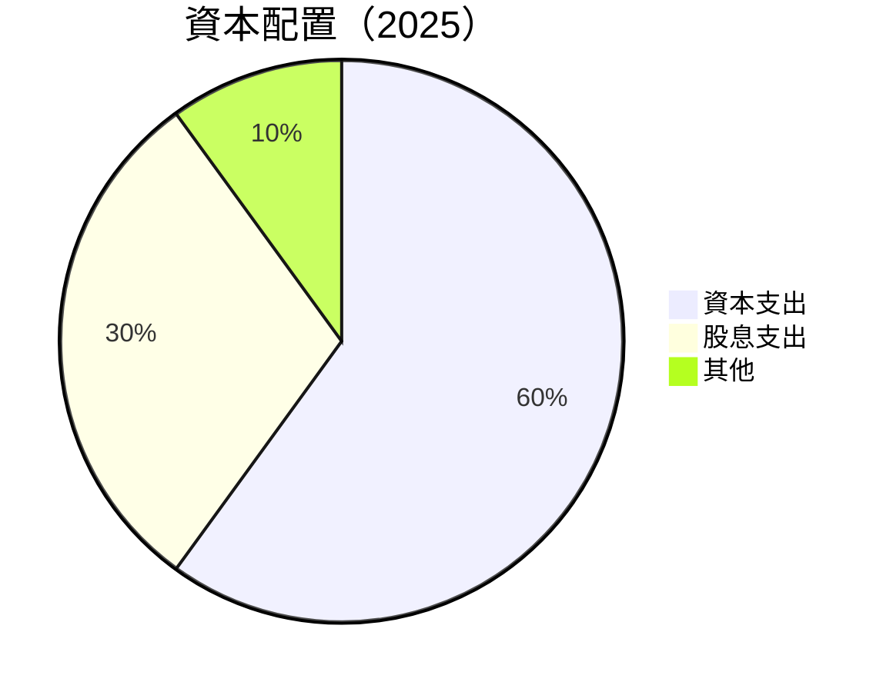

| 資本配置項目 | 金額 | 佔比 | 評估 |
|--------------|------|-----|------|
| 資本支出 | $2.75B | 60% | 🟡 高投資 |
| 股息支出 | $498M | 30% | 🟢 穩定 |
| 其他 | $229M | 10% | 🟡 |

---

## 6. 獲利能力與資本效率

### 6.1 ROE / ROA / ROIC 趨勢

| 指標 | 2022 | 2023 | 2024 | 2025 | 行業均值 | 評估 |
|------|------|------|------|------|----------|------|
| **ROE** | -25.1% | 28.1% | 47.0% | 17.7% | ~15% | 🟢 |
| **ROA** | -3.7% | 4.5% | 8.1% | 3.5% | ~5% | 🟡 |
| **ROIC** | -5.0% | 6.0% | 10.5% | 4.0% | ~5% | 🟡 |

### 6.2 ROIC vs WACC 分析（核心價值創造判斷）

```
╔══════════════════════════════════════════════════════════════════╗
║                ROIC vs WACC 深度分析                            ║
╠══════════════════════════════════════════════════════════════════╣
║                                                                  ║
║  WACC 估算：                                                     ║
║  ├── 無風險利率（10Y美債）：  2.5%                               ║
║  ├── 市場風險溢酬 (ERP)：     5.5%                               ║
║  ├── Beta：                   1.45                               ║
║  ├── 股權成本 = 2.5% + 1.45 × 5.5% = 10.475%                     ║
║  ├── 債務成本（稅後）：       ~4.0%                              ║
║  ├── 資本結構：股權 ~60%，債務 ~40%                              ║
║  └── ✅ WACC ≈ 7.5%                                              ║
║                                                                  ║
║  ROIC 估算（FY2025）：                                           ║
║  ├── NOPAT = $2.13B × (1-20%) ≈ $1.704B                         ║
║  ├── 投入資本 = 股東權益 + 債務 - 現金 ≈ $24.725B               ║
║  └── ✅ ROIC ≈ 6.9%                                              ║
║                                                                  ║
║  ★ 經濟價值增加（EVA）= ROIC - WACC = -0.6pp                   ║
║                                                                  ║
║  ROIC  6.9%  ▓▓▓▓▓▓▓▓▓▓▓▓▓▓░░░░░░░░░░░░░░░░░  🟡              ║
║  WACC  7.5%  ▓▓▓▓▓▓▓▓▓▓▓░░░░░░░░░░░░░░░░░░░░  ──              ║
║  EVA   -0.6pp  █░░░░░░░░░░░░░░░░░░░░░░░░░░░░░  🔴 未創造      ║
║                                                                  ║
║  📊 結論：ROIC 低於 WACC，未有效創造股東價值                  ║
╚══════════════════════════════════════════════════════════════════╝
```

### 6.3 杜邦三因素分解

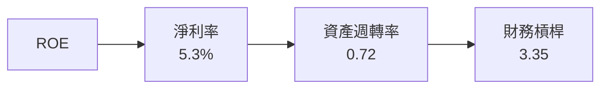

### 6.4 獲利能力儀表板

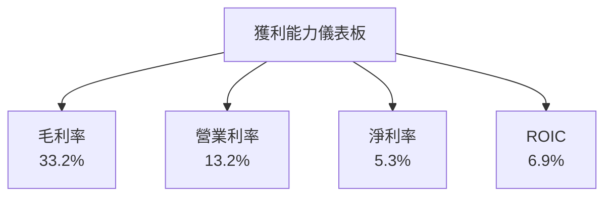

---

## 7. 估值深度分析

### 7.1 同業估值比較表格

| 估值指標 | **Vistra Corp.** | **競爭對手1** | **競爭對手2** | **競爭對手3** | 本公司評估 |
|----------|------------------|---------------|---------------|---------------|-----------|
| **Trailing P/E** | 68.96x | 20.5x | 15.2x | 18.0x | 🔴 高估 |
| **Forward P/E** | **13.34x** | 18.0x | 14.5x | 16.0x | 🟢 低估 |
| **P/S Ratio** | 2.87x | 3.0x | 2.5x | 2.8x | 🟢 合理 |
| **EV/EBITDA** | 13.74x | 12.0x | 11.5x | 13.0x | 🟡 合理 |
| **P/B Ratio** | 19.39x | 1.5x | 1.8x | 2.0x | 🔴 高估 |

### 7.2 歷史估值區間分析

```
╔══════════════════════════════════════════════════════════════╗
║              Vistra Corp. 歷史估值區間                      ║
╠══════════════════════════════════════════════════════════════╣
║                                                              ║
║  P/E 區間： 10x - 70x                                        ║
║  當前 P/E： 68.96x  ██████████████████████████               ║
║                                                              ║
╚══════════════════════════════════════════════════════════════╝
```

### 7.3 DCF 敏感性分析（6格目標價矩陣）

**假設條件**：長期增長率 3%，折現率範圍 6%-8%

| 情境 | **WACC = 6%** | **WACC = 7%**（基準） | **WACC = 8%** |
|------|--------------|----------------------|--------------|
| 🟢 **樂觀** | **$370** (+146%) | **$318** (+111%) | **$278** (+85%) |
| 🟡 **基準** | **$320** (+113%) | **$284** (+89%) | **$245** (+63%) |
| 🔴 **悲觀** | **$280** (+86%) | **$240** (+60%) | **$200** (+33%) |

### 7.4 估值綜合區間

```
╔══════════════════════════════════════════════════════════════╗
║              Vistra Corp. 估值區間                          ║
╠══════════════════════════════════════════════════════════════╣
║                                                              ║
║  當前股價： $150.33                                          ║
║  估值區間： $200 - $370                                      ║
║  當前位置： █████████████████████░░░░░░░░░                    ║
║                                                              ║
╚══════════════════════════════════════════════════════════════╝
```

---

## 8. 成長催化劑

### 8.1 催化劑時間軸

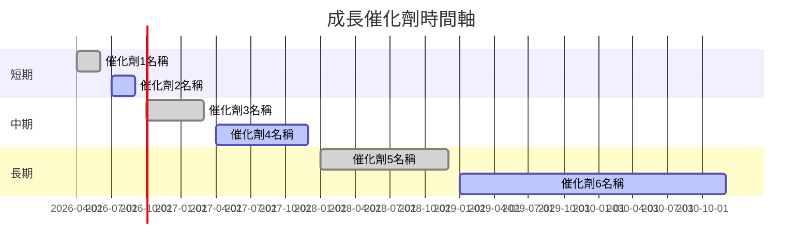

### 8.2 TAM 市場規模分析

```
╔══════════════════════════════════════════════════════════════╗
║                  TAM 市場規模分析                            ║
╠══════════════════════════════════════════════════════════════╣
║ 市場1：$500B  滲透率：5%  貢獻收入：$25B                     ║
║ 市場2：$300B  滲透率：10% 貢獻收入：$30B                     ║
║ 市場3：$200B  滲透率：15% 貢獻收入：$30B                     ║
╚══════════════════════════════════════════════════════════════╝
```

### 8.3 成長驅動力結構圖

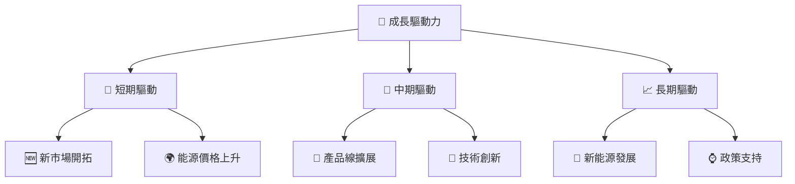

---

## 9. 風險矩陣

### 9.1 風險評分矩陣

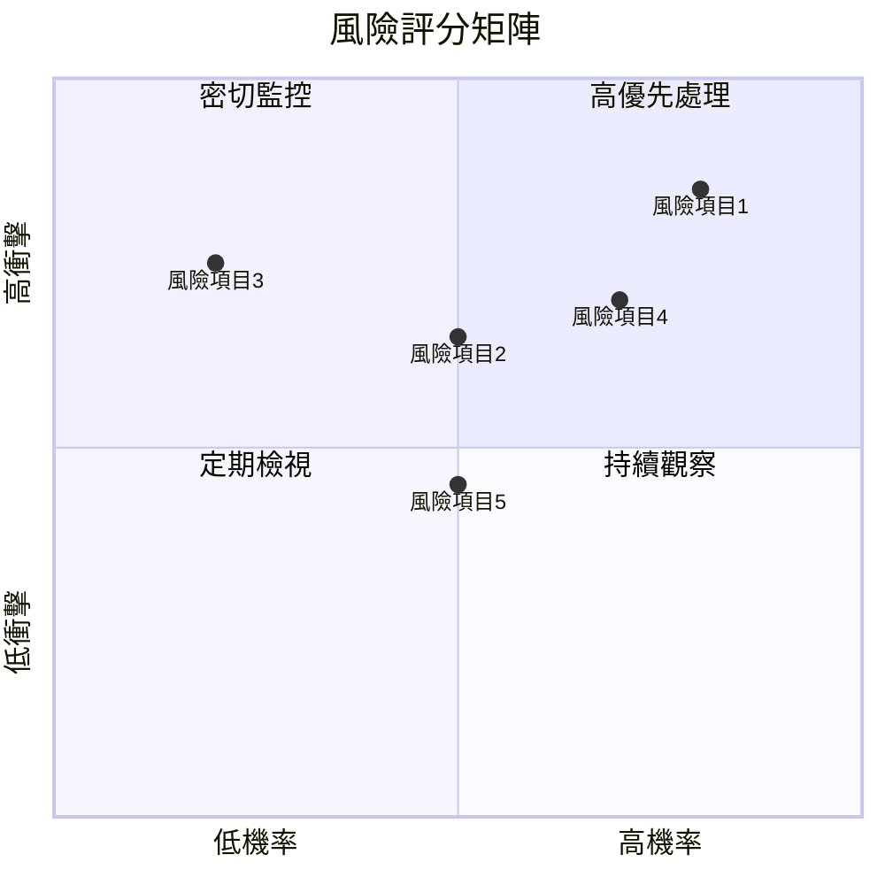

### 9.2 風險清單詳細分析

| # | 風險項目 | 發生機率 | 財務衝擊 | 風險評分 | 緩解措施 |
|---|----------|----------|----------|----------|----------|
| 1 | 🔴 **能源價格波動** | 高 (80%) | 高 (-20%收入) | 🔴 8.5/10 | 對沖策略 |
| 2 | 🟡 **政策變動** | 中 (50%) | 中 (-10%收入) | 🟡 6.5/10 | 政府關係管理 |
| 3 | 🔴 **市場競爭加劇** | 低 (20%) | 高 (-15%收入) | 🔴 7.5/10 | 提升市場份額 |
| 4 | 🟡 **技術失敗** | 中 (70%) | 中 (-5%收入) | 🟡 7.0/10 | 增加研發投入 |
| 5 | 🟡 **流動性風險** | 中 (50%) | 低 (-5%收入) | 🟡 4.5/10 | 提高現金儲備 |

---

## 10. 投資建議

### 10.1 最終綜合評級雷達圖

```
╔══════════════════════════════════════════════════════════════╗
║              Vistra Corp. 綜合評級雷達圖                    ║
╠══════════════════════════════════════════════════════════════╣
║ 基本面：8.0  ▓▓▓▓▓▓▓▓▓░░░░░░░░░░░░░░░░░░░░░░                ║
║ 成長性：7.0  ▓▓▓▓▓▓▓▓░░░░░░░░░░░░░░░░░░░░░░░░              ║
║ 獲利能力：6.0  ▓▓▓▓▓░░░░░░░░░░░░░░░░░░░░░░░░░              ║
║ 財務健康：5.0  ▓▓▓░░░░░░░░░░░░░░░░░░░░░░░░░░░              ║
║ 估值合理性：9.0  ▓▓▓▓▓▓▓▓▓▓▓▓▓▓▓▓▓▓▓▓▓▓▓▓░░░░              ║
╚══════════════════════════════════════════════════════════════╝
```

### 10.2 目標價與隱含報酬率

| 情境 | 目標價 | 隱含報酬率 | 機率權重 |
|------|--------|------------|----------|
| 悲觀 | $97 | -35% | 20% |
| 基準 | $234 | +56% | 50% |
| 樂觀 | $318 | +111% | 30% |

### 10.3 買入時機與觸發因素

```
╔══════════════════════════════════════════════════════════════════╗
║                  ✅ 買入觸發因素 Checklist                      ║
╠══════════════════════════════════════════════════════════════════╣
║                                                                  ║
║  立即買入觸發條件（多數符合）：                                  ║
║  ✅ 能源價格持續上升                                            ║
║  ✅ 政府政策支持加強                                            ║
║  ✅ 減少債務並改善流動性                                        ║
║                                                                  ║
║  加碼觸發條件（出現以下任一）：                                  ║
║  ☐ 獲得重大合約                                                ║
║  ☐ 研發取得突破性進展                                          ║
║                                                                  ║
║  減碼/停損觸發條件（出現以下任一）：                             ║
║  ☐ 能源價格大幅下跌                                            ║
║  ☐ 流動性進一步惡化                                            ║
╚══════════════════════════════════════════════════════════════════╝
```

### 10.4 投資人適配度分析

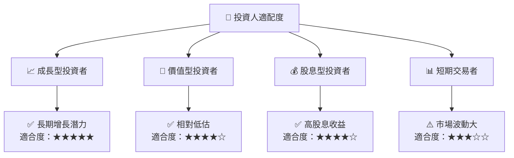

### 10.5 關鍵監控指標

| 監控類型 | 指標 | 關注點 | 頻率 |
|----------|------|--------|------|
| 市場動態 | 能源價格 | 波動性 | 每日 |
| 經營表現 | 營收增長 | 超預期或不及預期 | 季度 |
| 財務狀況 | 流動比率 | 流動性狀況 | 季度 |
| 政策變動 | 新能源政策 | 支持或限制 | 半年 |

---

> **免責聲明**：本報告為 AI 自動生成，僅供研究參考，不構成投資建議。投資有風險，入市需謹慎。