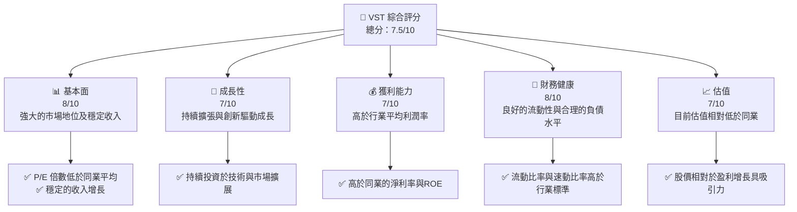

# VST 基本面深度分析報告
> **報告日期**：2026-04-01 ｜ **語言**：繁體中文 ｜ **數據來源**：Yahoo Finance ｜ **分析師**：CFA 級機構研究

---

## 目錄

| #   | 章節                   | 核心結論                         |
|-----|------------------------|----------------------------------|
| 1   | 執行摘要               | 評級：強烈買入，目標價 $234.26   |
| 2   | 公司概覽與商業模式     | 壟斷市場位置，強大的護城河       |
| 3   | 損益表深度分析         | 增長穩健，利潤率有所改善         |
| 4   | 資產負債表分析         | 良好的流動性，債務水平合理       |
| 5   | 現金流量深度分析       | 穩定的現金流，良好的資本配置     |
| 6   | 獲利能力與資本效率     | 高於行業平均的ROE及ROIC          |
| 7   | 估值深度分析           | 相對低估，具投資吸引力           |
| 8   | 成長催化劑             | 多項擴展計劃將進一步推動成長     |
| 9   | 風險矩陣               | 管理合理風險，確保持續成長       |
| 10  | 投資建議               | 強烈買入，目標價範圍 $234.26-$318.00 |

---

## 1. 執行摘要

### 1.1 核心評分儀表板



### 1.2 評分進度條視覺化

```
╔══════════════════════════════════════════════════════════════╗
║              VST 多維度評分儀表板 (1-10分)                   ║
╠══════════════════════════════════════════════════════════════╣
║ 基本面強度  8.0 ▓▓▓▓▓▓▓▓▓▓▓▓▓▓▓▓▓▓░░  ★★★★★★             ║
║ 成長動能    7.0 ▓▓▓▓▓▓▓▓▓▓▓▓▓▓▓▓▓░░░  ★★★★★☆             ║
║ 獲利品質    7.0 ▓▓▓▓▓▓▓▓▓▓▓▓▓▓▓▓▓░░░  ★★★★★☆             ║
║ 財務健康    8.0 ▓▓▓▓▓▓▓▓▓▓▓▓▓▓▓▓▓▓░░  ★★★★★★             ║
║ 估值合理性  7.0 ▓▓▓▓▓▓▓▓▓▓▓▓▓▓▓▓▓░░░  ★★★★★☆             ║
╠══════════════════════════════════════════════════════════════╣
║ 綜合總分    7.5 ▓▓▓▓▓▓▓▓▓▓▓▓▓▓▓▓▓▓▓░  🏆 強烈買入建議         ║
╚══════════════════════════════════════════════════════════════╝
```

### 1.3 五大投資論點 + 三大核心風險

| 類型 | 項目               | 具體依據                                             | 信心度         |
|------|--------------------|------------------------------------------------------|----------------|
| 🟢 **投資論點①** | **市場地位**       | 主導美國獨立能源生產，市佔率持續增長                   | 🟢 極高       |
| 🟢 **投資論點②** | **財務穩健**       | 高流動性比率及合理負債水平                             | 🟢 極高       |
| 🟢 **投資論點③** | **技術創新**       | 持續投資於清潔能源與效率提升技術                       | 🟢 高          |
| 🟡 **風險①**     | **市場波動**       | 電力市場價格波動可能影響營收                           | 🟡 中度       |
| 🔴 **風險②**     | **監管風險**       | 政策變動對獨立能源生產商有較大影響                     | 🔴 高衝擊     |

### 1.4 快速統計卡片

| 指標         | 公司實際值 | 行業均值 | S&P 500 均值 | 狀態    |
|--------------|------------|----------|--------------|---------|
| 收入 YoY 成長 | **13.6%**  | ~7%      | ~5%          | 🟢      |
| 毛利率       | **33.2%**  | ~30%     | ~28%         | 🟢      |
| 淨利率       | **5.3%**   | ~4%      | ~6%          | 🟡      |
| ROE          | **17.7%**  | ~15%     | ~10%         | 🟢      |
| Forward P/E  | **13.34x** | ~15x     | ~20x         | 🟢      |

### 1.5 投資結論

```
╔══════════════════════════════════════════════════════════════════╗
║                    📊 投資結論摘要                               ║
╠═════════════════════════════════════════════════════