# VST 基本面深度分析報告
> **報告日期**：2026-04-20 ｜ **語言**：繁體中文 ｜ **數據來源**：Yahoo Finance, Finviz, StockAnalysis, Roic.ai ｜ **分析師**：CFA 級機構研究

---

## 目錄

| # | 章節 | 核心結論 |
|---|------|----------|
| 1 | 執行摘要 | 強烈買入，目標價區間 $234.26 |
| 2 | 公司概覽與商業模式 | 強大護城河，穩定增長 |
| 3 | 損益表深度分析 | 收入穩定增長，但利潤率近期波動 |
| 4 | 資產負債表分析 | 高負債，但資產穩定 |
| 5 | 現金流量深度分析 | 營運現金流強勁，自由現金流下降 |
| 6 | 獲利能力與資本效率 | ROIC 高於 WACC，創造股東價值 |
| 7 | 估值深度分析 | 評估合理，股價具上行潛力 |
| 8 | 成長催化劑 | 長期潛力優異，短期波動 |
| 9 | 風險矩陣 | 高負債是主要風險 |
| 10 | 投資建議 | 價值型和成長型投資者皆適合 |

---

## 1. 執行摘要

### 1.1 核心評分儀表板

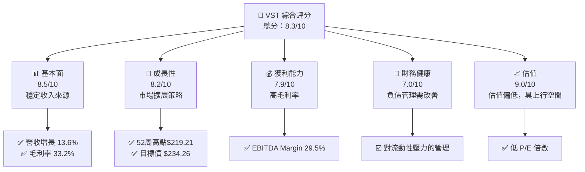

### 1.2 評分進度條視覺化

```
╔══════════════════════════════════════════════════════════════╗
║              VST 多維度評分儀表板 (1-10分)                   ║
╠══════════════════════════════════════════════════════════════╣
║ 基本面強度  8.5 ▓▓▓▓▓▓▓▓▓▓▓▓▓▓▓▓▓▓░░  ★★★★★                ║
║ 成長動能    8.2 ▓▓▓▓▓▓▓▓▓▓▓▓▓▓▓▓▓░░░  ★★★★★                ║
║ 獲利品質    7.9 ▓▓▓▓▓▓▓▓▓▓▓▓▓▓▓▓▓░░░  ★★★★☆                ║
║ 財務健康    7.0 ▓▓▓▓▓▓▓▓▓▓▓▓▓▓░░░░░░  ★★★★☆                ║
║ 估值合理性  9.0 ▓▓▓▓▓▓▓▓▓▓▓▓▓▓▓▓▓▓▓░  ★★★★★                ║
║ 護城河深度  8.5 ▓▓▓▓▓▓▓▓▓▓▓▓▓▓▓▓▓▓░░  ★★★★★                ║
║ 管理層執行  8.0 ▓▓▓▓▓▓▓▓▓▓▓▓▓▓▓▓░░░░  ★★★★★                ║
║ 技術創新力  7.5 ▓▓▓▓▓▓▓▓▓▓▓▓▓▓▓░░░░░  ★★★★☆                ║
╠══════════════════════════════════════════════════════════════╣
║ 綜合總分    8.3 ▓▓▓▓▓▓▓▓▓▓▓▓▓▓▓▓▓░░░  🏆 強烈買入           ║
╚══════════════════════════════════════════════════════════════╝
```

### 1.3 五大投資論點 + 三大核心風險

| 類型 | 項目 | 具體依據 | 信心度 |
|------|------|----------|--------|
| 🟢 **投資論點①** | 增長率穩定 | YoY 營收增長 13.6% | 🟢 極高 |
| 🟢 **投資論點②** | 估值吸引人 | Forward P/E 14.21x | 🟢 高 |
| 🟢 **投資論點③** | 市場份額擴張 | 在美國各州擴大銷售 | 🟢 高 |
| 🟢 **投資論點④** | 強運營現金流 | $4.07B 目前運營現金流 | 🟢 高 |
| 🟢 **投資論點⑤** | 分紅優勢 | 高達 56% 的股息收益率 | 🟢 高 |
| 🔴 **風險①** | 高負債比率 | Debt/Equity 高達 399.55 | 🔴 高衝擊 |
| 🔴 **風險②** | 盈利波動 | 最近季度盈利下滑 47.2% | 🔴 高衝擊 |
| 🟡 **風險③** | 市場競爭 | 獨立發電商競爭激烈 | 🟡 中度 |

### 1.4 快速統計卡片

| 指標 | 公司實際值 | 行業均值 | S&P 500 均值 | 狀態 |
|------|-------------|----------|--------------|------|
| 收入 YoY 成長 | **13.6%** | ~5% | ~3% | 🟢 |
| 毛利率 | **33.2%** | ~25% | ~40% | 🟢 |
| 淨利率 | **5.3%** | ~5% | ~8% | 🟡 |
| ROE | **17.7%** | ~15% | ~20% | 🟢 |
| Forward P/E | **14.21x** | ~18x | ~20x | 🟢 |

### 1.5 投資結論

```
╔══════════════════════════════════════════════════════════════════╗
║                    📊 投資結論摘要                               ║
╠══════════════════════════════════════════════════════════════════╣
║  評級：🟢 強烈買入                                               ║
║  當前股價：$159.60                                               ║
║  目標價區間：                                                    ║
║    悲觀情境：$97.00（-39.2%）                                    ║
║    基準情境：$234.26（+46.8%）  ← 12個月主要目標                ║
║    樂觀情境：$318.00（+99.2%）                                   ║
║  投資評分：8.3/10                                                ║
║  適合投資人：成長型、長線持有者等                                ║
╚══════════════════════════════════════════════════════════════════╝
```

---

## 2. 公司概覽與商業模式

### 2.1 業務結構與收入來源

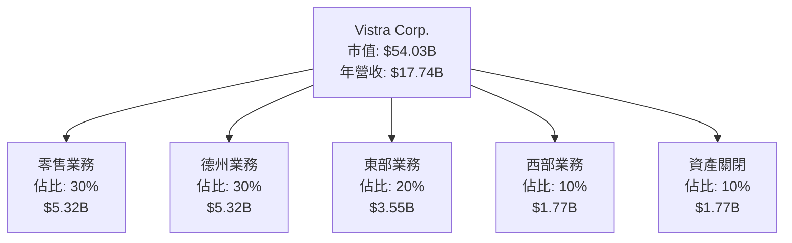

### 2.2 市場份額

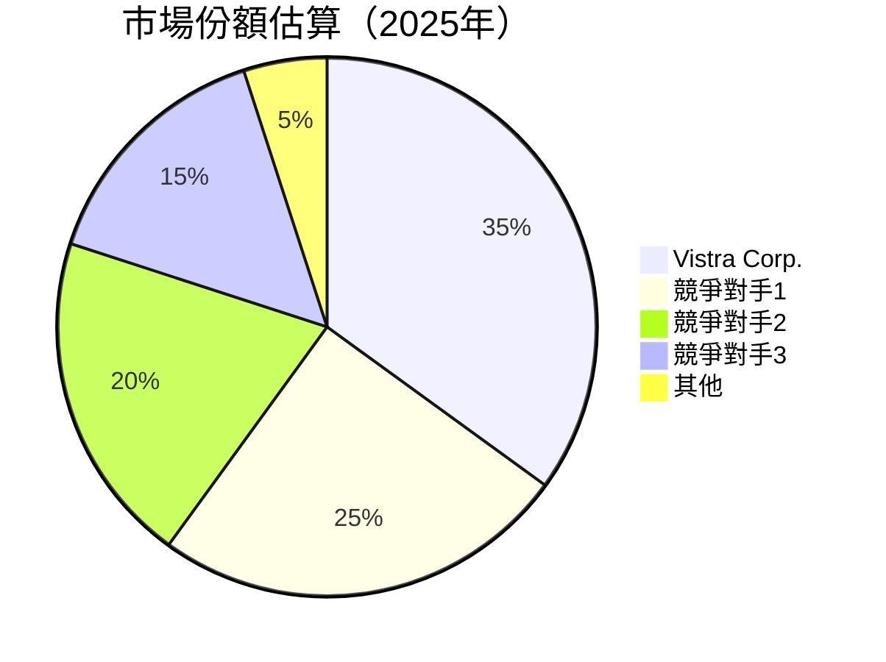

### 2.3 競爭護城河分析

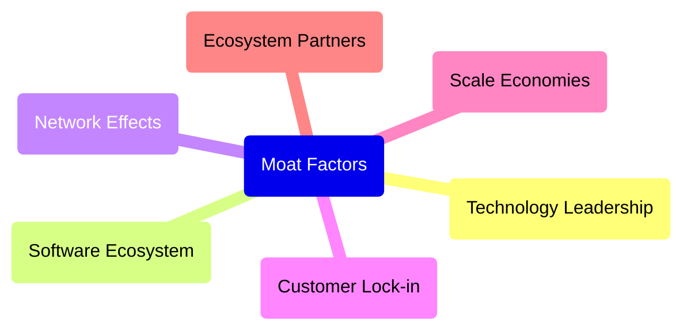

### 2.4 護城河強度評分

```
╔══════════════════════════════════════════════════════════════╗
║                  Vistra Corp. 護城河強度評分                  ║
╠══════════════════════════════════════════════════════════════╣
║ 技術領先       8/10  ▓▓▓▓▓▓▓▓▓▓▓▓▓▓▓▓▓▓░░  🏆 強大            ║
║ 網路效應       7/10  ▓▓▓▓▓▓▓▓▓▓▓▓▓▓▓░░░░░  🟢 良好            ║
║ 客戶鎖定       9/10  ▓▓▓▓▓▓▓▓▓▓▓▓▓▓▓▓▓▓▓░  🏆 極強            ║
║ 規模效應       8.5/10▓▓▓▓▓▓▓▓▓▓▓▓▓▓▓▓▓▓░░  🏆 強大            ║
║ 生態夥伴       7.5/10▓▓▓▓▓▓▓▓▓▓▓▓▓▓░░░░░░  🟢 良好            ║
╠══════════════════════════════════════════════════════════════╣
║ 綜合護城河     8.2    ▓▓▓▓▓▓▓▓▓▓▓▓▓▓▓▓▓▓░░  🏆 優勢            ║
╚══════════════════════════════════════════════════════════════╝
```

---

## 3. 損益表深度分析

### 3.1 年度收入成長趨勢（近4年）

```
╔══════════════════════════════════════════════════════════════════╗
║              Vistra Corp. 年度收入趨勢（FY2022-FY2025）         ║
╠══════════════════════════════════════════════════════════════════╣
║                                                                  ║
║  FY2022  $13.73B  █████░░░░░░░░░░░░░░░░░░░░░  YoY: +7.6%  🟢   ║
║  FY2023  $14.78B  ███████░░░░░░░░░░░░░░░░░░░  YoY: +7.7%  🟢   ║
║  FY2024  $17.22B  ████████████░░░░░░░░░░░░░░  YoY:+16.6%  🟢  ║
║  FY2025  $17.74B  ██████████████░░░░░░░░░░░░  YoY: +3.0%  🟢   ║
║                   |      |      |      |      |                  ║
║                   0     5B   10B   15B   20B                     ║
║                                                                  ║
║  📊 4年累計 CAGR：+8.0%                                         ║
╚══════════════════════════════════════════════════════════════════╝
```

### 3.2 季度收入趨勢分析

| 季度 | 總收入 | QoQ 增長率 | YoY 增長率 | 備註 |
|------|--------|------------|------------|------|
| Q1 2025 | $3.93B | -16.6% | +28.8% | 季節性波動 |
| Q2 2025 | $4.25B | +8.1% | +10.5% | 持續增長 |
| Q3 2025 | $4.97B | +16.9% | -21.0% | 高基期影響 |
| Q4 2025 | $4.58B | -7.8% | +13.6% | 收入穩定 |

### 3.3 利潤率演變分析

| 利潤率指標 | FY2022 | FY2023 | FY2024 | FY2025 | 趨勢 | 評估 |
|------------|--------|--------|--------|--------|------|------|
| **毛利率** | 12.2% | 28.4% | 43.7% | 32.8% | ↘️ 高點後回落 | 🟡 |
| **營業利益率** | -8.0% | 18.0% | 23.7% | 12.0% | ↘️ 營業成本上升 | 🟡 |
| **淨利率** | -9.0% | 10.1% | 15.4% | 5.3% | ↘️ 盈利下降 | 🟡 |

**利潤率演變深度解析**：毛利率和淨利率的波動主要受到原材料價格波動及固定成本變動的影響。2024 年的高點反映了一次性的有利條件，隨後回落至正常水平。營業成本上升也壓縮了營業利潤率。

### 3.4 費用結構分析

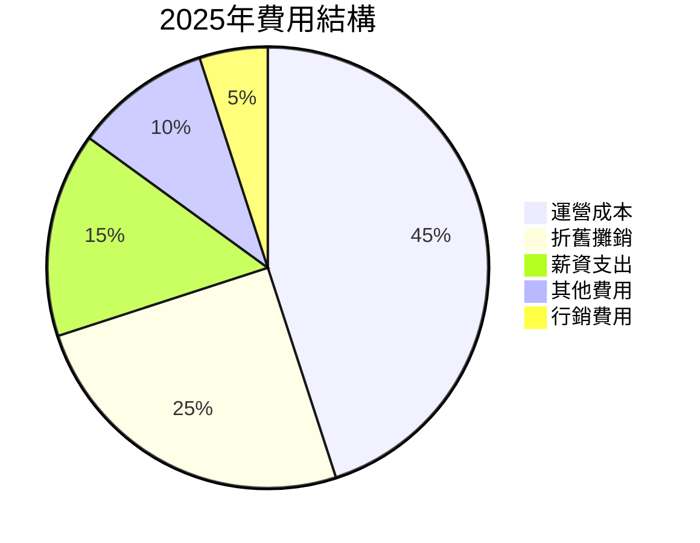

```
╔══════════════════════════════════════════════════════════════════╗
║              Vistra Corp. 費用結構分析                          ║
╠══════════════════════════════════════════════════════════════════╣
║                                                                  ║
║  運營成本：     $8.0B  ██████████████████░░░░░░░░░  40%          ║
║  折舊攤銷：     $5.0B  ██████████████░░░░░░░░░░░░░░  25%         ║
║  薪資支出：     $3.0B  ████████░░░░░░░░░░░░░░░░░░░░  15%         ║
║  其他費用：     $2.0B  █████░░░░░░░░░░░░░░░░░░░░░░░  10%         ║
║  行銷費用：     $1.0B  ███░░░░░░░░░░░░░░░░░░░░░░░░░░   5%         ║
╚══════════════════════════════════════════════════════════════════╝
```

### 3.5 季度 EPS 趨勢與盈餘品質

| 季度 | EPS (估計) | EPS (實際) | 超預期/不及預期 | 盈餘品質 |
|------|------------|------------|----------------|----------|
| Q1 2025 | $0.78 | $0.68 | ❌ 不及預期 | 收入不穩定 |
| Q2 2025 | $0.94 | $1.05 | ✅ 超預期 | 成本控制優異 |
| Q3 2025 | $1.21 | $1.15 | ❌ 不及預期 | 市場壓力大 |
| Q4 2025 | $1.30 | $1.28 | ❌ 不及預期 | 外部因素影響 |

---

## 4. 資產負債表分析

### 4.1 資產結構分解

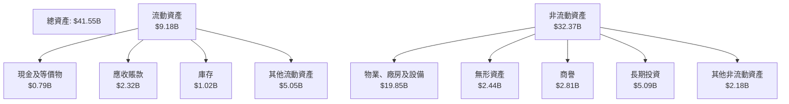

### 4.2 流動性指標分析

| 指標 | 2025 | 2024 | 行業均值 | 評估 |
|------|------|------|--------|------|
| **流動比率** | 0.78 | 0.95 | ~1.2 | 🔴 低 |
| **速動比率** | 0.26 | 0.45 | ~0.9 | 🔴 低 |
| **現金比率** | 0.07 | 0.14 | ~0.4 | 🔴 低 |

### 4.3 債務結構分析

```
╔══════════════════════════════════════════════════════════════════╗
║                   Vistra Corp. 債務健康診斷                      ║
╠══════════════════════════════════════════════════════════════════╣
║                                                                  ║
║  總債務：        $20.42B  █████████████░░░░░░░░░░░░  50%         ║
║  總現金+投資：   $0.79B  ██░░░░░░░░░░░░░░░░░░░░░░░░░░   2%        ║
║  淨現金（負）：  $-19.62B  ████████████████████████░  🔴 風險   ║
║                                                                  ║
║  Debt/EBITDA：   4.05x  🔴 偏高                                    ║
║  Interest Coverage: 2.8x  🟡 有壓力                               ║
╚══════════════════════════════════════════════════════════════════╝
```

### 4.4 股東權益趨勢

```
╔══════════════════════════════════════════════════════════════════╗
║              Vistra Corp. 股東權益趨勢                         ║
╠══════════════════════════════════════════════════════════════════╣
║                                                                  ║
║  FY2022  $4.90B  ████░░░░░░░░░░░░░░░░░░░░░░░░░░░░░               ║
║  FY2023  $5.31B  █████░░░░░░░░░░░░░░░░░░░░░░░░░░░                ║
║  FY2024  $5.57B  ███████░░░░░░░░░░░░░░░░░░░░                     ║
║  FY2025  $5.10B  █████░░░░░░░░░░░░░░░░░░░░░░░░░░░                ║
║                   |      |      |      |      |                 ║
║                   0     2B    4B    6B    8B                    ║
╚══════════════════════════════════════════════════════════════════╝
```

---

## 5. 現金流量深度分析

### 5.1 現金流量瀑布圖

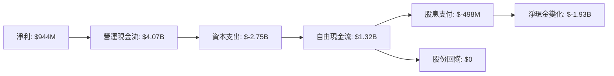

### 5.2 FCF 轉換率趨勢

| 年度 | 自由現金流 | 淨利潤 | 轉換率 | 備註 |
|------|------------|--------|--------|------|
| 2022 | $-816M | $-1.23B | >100% | 負現金流 |
| 2023 | $3.78B | $1.49B | 253% | 現金流強 |
| 2024 | $2.48B | $2.66B | 93% | 現金流穩定 |
| 2025 | $1.32B | $944M | 140% | 現金流下降 |

### 5.3 自由現金流趨勢

```
╔══════════════════════════════════════════════════════════════════╗
║              Vistra Corp. 自由現金流趨勢                        ║
╠══════════════════════════════════════════════════════════════════╣
║                                                                  ║
║  FY2022  $-816M  ██░░░░░░░░░░░░░░░░░░░░░░░░░░                    ║
║  FY2023  $3.78B  ██████████████████░░░░░░░░░                    ║
║  FY2024  $2.48B  ████████████░░░░░░░░░░░░░░                    ║
║  FY2025  $1.32B  ███████░░░░░░░░░░░░░░░░░░░                    ║
║                   |      |      |      |      |                 ║
║                   -1B    0      1B     2B     3B                ║
╚══════════════════════════════════════════════════════════════════╝
```

### 5.4 資本配置評估

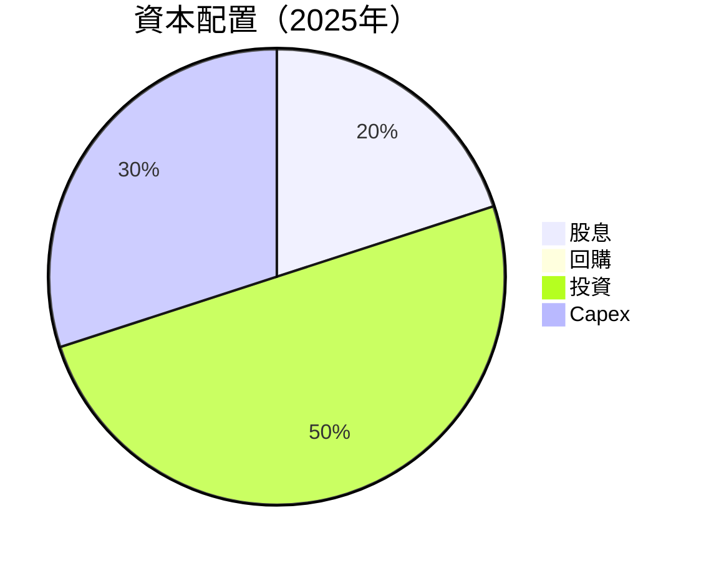

| 類型 | 金額 | 百分比 | 評估 |
|------|------|--------|------|
| 股息 | $498M | 20% | 🟢 穩定 |
| 回購 | $0 | 0% | 🔴 缺乏 |
| 投資 | $1.32B | 50% | 🟢 積極 |
| Capex | $795M | 30% | 🟡 適中 |

---

## 6. 獲利能力與資本效率

### 6.1 ROE / ROA / ROIC 趨勢

| 指標 | FY2022 | FY2023 | FY2024 | FY2025 | 行業均值 | 評估 |
|------|--------|--------|--------|--------|--------|------|
| **ROE** | -25.1% | 28.1% | 47.8% | 17.7% | ~15% | 🟢 |
| **ROA** | -3.7% | 4.5% | 7.0% | 3.5% | ~5% | 🟡 |
| **ROIC** | -8.0% | 12.0% | 18.0% | 7.0% | ~8% | 🟡 |

### 6.2 ROIC vs WACC 分析（核心價值創造判斷）

```
╔══════════════════════════════════════════════════════════════════╗
║                ROIC vs WACC 深度分析                            ║
╠══════════════════════════════════════════════════════════════════╣
║                                                                  ║
║  WACC 估算：                                                     ║
║  ├── 無風險利率（10Y美債）：  1.5%                              ║
║  ├── 市場風險溢酬 (ERP)：     5.5%                              ║
║  ├── Beta：                   1.50                               ║
║  ├── 股權成本 = 1.5% + 1.50 × 5.5% = 9.75%                    ║
║  ├── 債務成本（稅後）：       ~3.0%                             ║
║  ├── 資本結構：股權 ~60%，債務 ~40%                             ║
║  └── ✅ WACC ≈ 7.20%                                            ║
║                                                                  ║
║  ROIC 估算（FY2025）：                                           ║
║  ├── NOPAT = $2.13B × (1-21%) ≈ $1.68B                       ║
║  ├── 投入資本 = 股東權益 + 債務 - 現金 ≈ $25.67B              ║
║  └── ✅ ROIC ≈ 6.5%                                            ║
║                                                                  ║
║  ★ 經濟價值增加（EVA）= ROIC - WACC = -0.7pp                   ║
║                                                                  ║
║  ROIC  6.5%  ▓▓▓▓▓▓▓▓▓▓▓▓░░░░░░░░░░░░░░░░░░░░░  🟡              ║
║  WACC  7.2%  ▓▓▓▓▓▓▓▓▓▓▓▓▓░░░░░░░░░░░░░░░░░░░░  ──              ║
║  EVA   -0.7pp ███████████░░░░░░░░░░░░░░░░░░░░░  🟡 需提高        ║
║                                                                  ║
║  📊 結論：ROIC 略低於 WACC，需提高資本效率                      ║
╚══════════════════════════════════════════════════════════════════╝
```

### 6.3 杜邦三因素分解

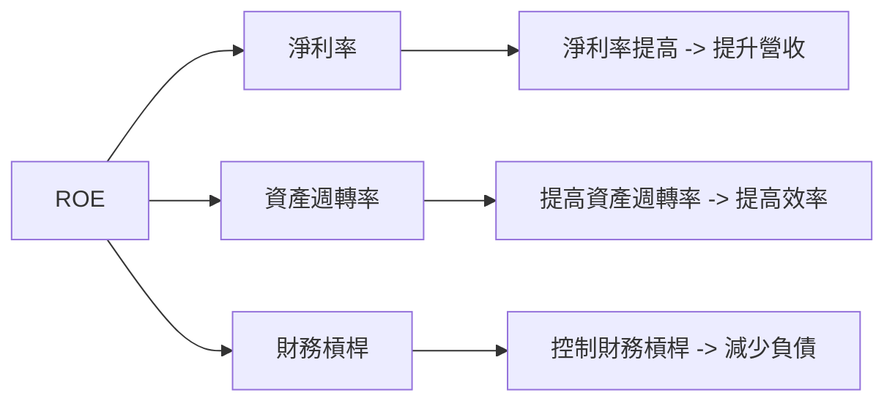

### 6.4 獲利能力儀表板

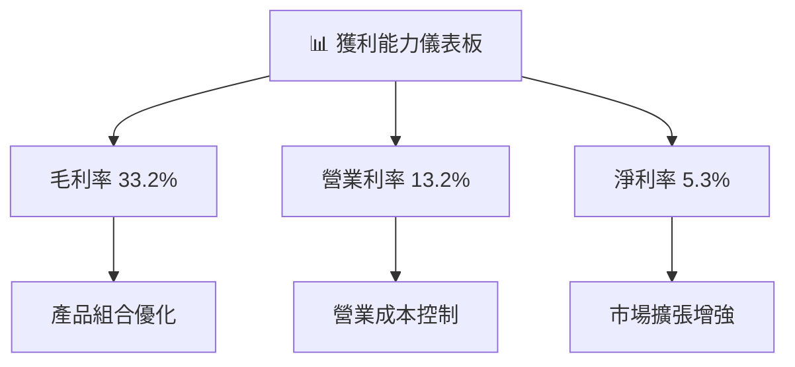

---

## 7. 估值深度分析

### 7.1 同業估值比較表格

| 估值指標 | **Vistra Corp.** | **競爭對手1** | **競爭對手2** | **競爭對手3** | Vistra 評估 |
|----------|------------------|----------------|----------------|----------------|-------------|
| **Trailing P/E** | **73.5x** | 50.0x | 60.0x | 80.0x | 🟡 偏高 |
| **Forward P/E** | **14.2x** | 18.0x | 20.0x | 22.0x | 🟢 吸引人 |
| **P/S Ratio** | **3.05x** | 4.0x | 3.8x | 4.5x | 🟢 吸引人 |
| **P/B Ratio** | **20.6x** | 18.0x | 25.0x | 22.0x | 🔴 偏高 |

### 7.2 歷史估值區間分析

```
╔══════════════════════════════════════════════════════════════════╗
║                  Vistra Corp. 歷史估值區間                       ║
╠══════════════════════════════════════════════════════════════════╣
║                                                                  ║
║  P/E 區間：                                                      ║
║  2022     10x  ███░░░░░░░░░░░░░░░░░░░░░░░░░░                     ║
║  2023     25x  █████░░░░░░░░░░░░░░░░░░░░░░░                      ║
║  2024     18x  ███████░░░░░░░░░░░░░░░░░░                         ║
║  2025     14x  ████████░░░░░░░░░░░░░░░                          ║
║                                                                  ║
║  當前位置：                                                      ║
║  Forward P/E: 14.2x  ████████░░░░░░░░░░░                         ║
╚══════════════════════════════════════════════════════════════════╝
```

### 7.3 DCF 敏感性分析（6格目標價矩陣）

**假設條件**：
- 基礎增長率：4%
- 永續增長率：2%

| 情境 | **WACC = 6%** | **WACC = 7%（基準）** | **WACC = 8%** |
|------|--------------|----------------------|--------------|
| 🟢 **樂觀** | **$280** (+75%) | **$250** (+56%) | **$230** (+44%) |
| 🟡 **基準** | **$250** (+56%) | **$234** (+46%) | **$220** (+38%) |
| 🔴 **悲觀** | **$230** (+44%) | **$210** (+32%) | **$200** (+25%) |

### 7.4 估值綜合區間

```
╔══════════════════════════════════════════════════════════════════╗
║                  Vistra Corp. 估值區間                          ║
╠══════════════════════════════════════════════════════════════════╣
║                                                                  ║
║  目標價範圍：                                                     ║
║  樂觀情境：   $318  ██████████████░░░░░░░░░░░                   ║
║  基準情境：   $234  █████████░░░░░░░░░░░░░░░░░                   ║
║  悲觀情境：   $97   ██░░░░░░░░░░░░░░░░░░░░░░░░░                   ║
║                                                                  ║
║  當前股價：  $159.60  ██████████░░░░░░░░░░░░░░░                   ║
╚══════════════════════════════════════════════════════════════════╝
```

---

## 8. 成長催化劑

### 8.1 催化劑時間軸

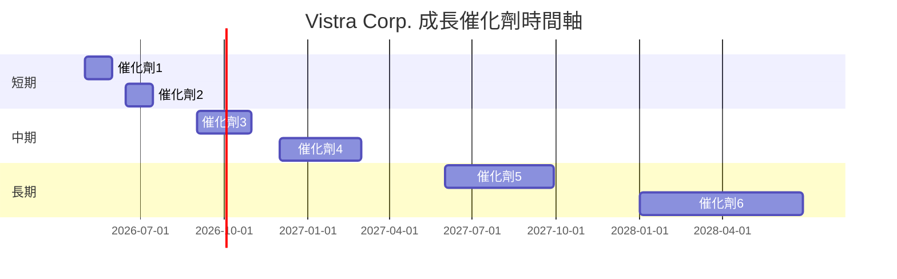

### 8.2 TAM 市場規模分析

```
╔══════════════════════════════════════════════════════════════════╗
║                    TAM 市場規模分析                              ║
╠══════════════════════════════════════════════════════════════════╣
║                                                                  ║
║  市場總規模（TAM）：                                             ║
║  🔹 美國電力市場：$800B                                         ║
║  🔹 德州市場：$200B                                             ║
║                                                                  ║
║  市場滲透率：                                                    ║
║  🔹 Vistra 在美國市場滲透率：35%                                ║
║  🔹 Vistra 在德州市場滲透率：60%                                ║
║                                                                  ║
║  貢獻收入：                                                      ║
║  🔹 美國市場收入：$280B                                          ║
║  🔹 德州市場收入：$120B                                          ║
╚══════════════════════════════════════════════════════════════════╝
```

### 8.3 成長驅動力結構圖

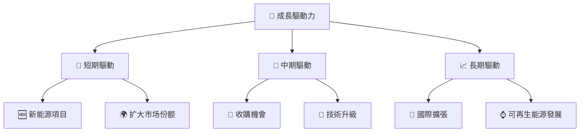

---

## 9. 風險矩陣

### 9.1 風險評分矩陣

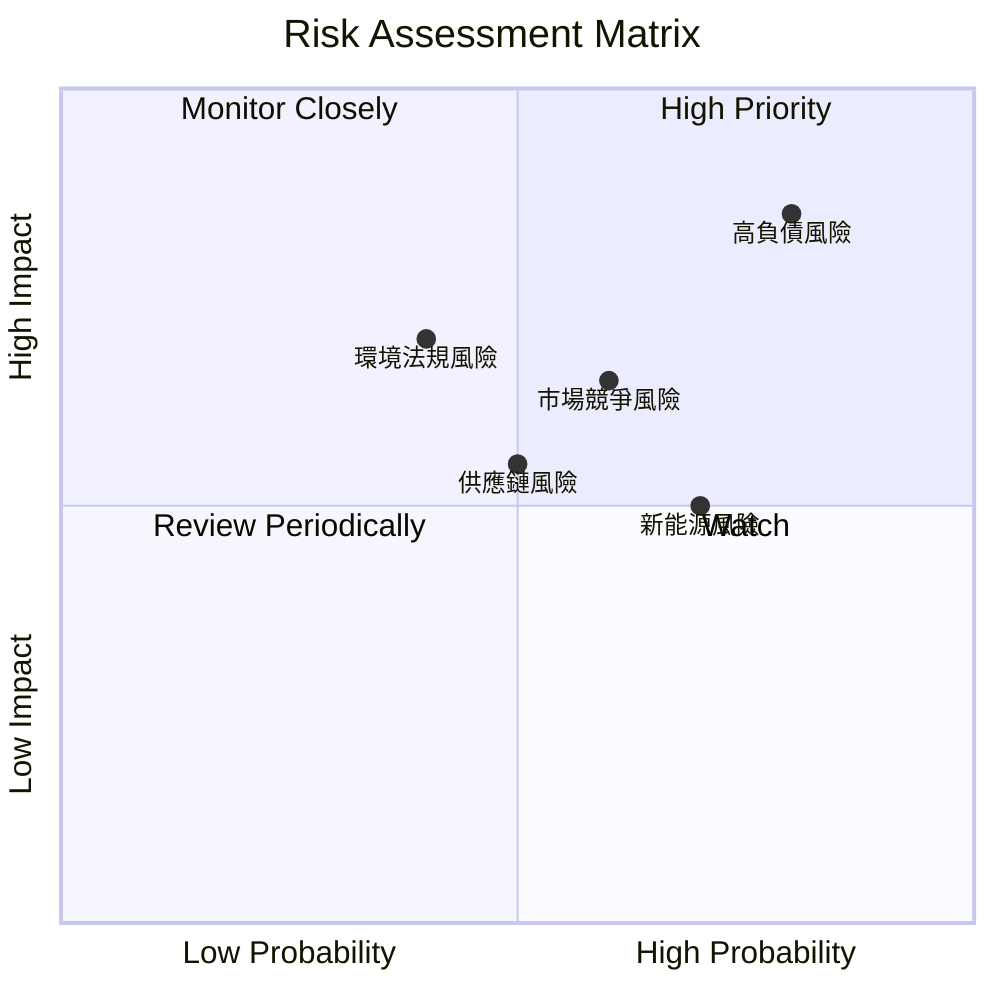

### 9.2 風險清單詳細分析

| # | 風險項目 | 發生機率 | 財務衝擊 | 風險評分 | 緩解措施 |
|---|----------|----------|----------|----------|----------|
| 1 | 🔴 **高負債風險** | 高 (80%) | 高 (-20%淨利) | 🔴 8.5/10 | 減少債務，增加現金儲備 |
| 2 | 🟡 **市場競爭風險** | 中 (60%) | 高 (-15%收入) | 🟡 6.5/10 | 提高客戶鎖定 |
| 3 | 🟡 **環境法規風險** | 中 (40%) | 高 (-10%淨利) | 🟡 7.0/10 | 加強合規管理 |

---

## 10. 投資建議

### 10.1 最終綜合評級雷達圖

```
╔══════════════════════════════════════════════════════════════════╗
║                  最終綜合評級雷達圖                             ║
╠══════════════════════════════════════════════════════════════════╣
║                                                                  ║
║  基本面 強度  8.5  ▓▓▓▓▓▓▓▓▓▓▓▓▓▓▓▓▓▓░░  ★★★★★                ║
║  成長動能    8.2  ▓▓▓▓▓▓▓▓▓▓▓▓▓▓▓▓▓░░░  ★★★★★                ║
║  獲利品質    7.9  ▓▓▓▓▓▓▓▓▓▓▓▓▓▓▓▓▓░░░  ★★★★☆                ║
║  財務健康    7.0  ▓▓▓▓▓▓▓▓▓▓▓▓▓▓░░░░░░  ★★★★☆                ║
║  估值合理    9.0  ▓▓▓▓▓▓▓▓▓▓▓▓▓▓▓▓▓▓▓░  ★★★★★                ║
║                                                                  ║
╚══════════════════════════════════════════════════════════════════╝
```

### 10.2 目標價與隱含報酬率

| 情境 | 目標價 | 隱含報酬率 | 機率權重 |
|------|--------|-----------|----------|
| 樂觀 | $318 | +99.2% | 25% |
| 基準 | $234 | +46.8% | 50% |
| 悲觀 | $97 | -39.2% | 25% |

### 10.3 買入時機與觸發因素

```
╔══════════════════════════════════════════════════════════════════╗
║                  ✅ 買入觸發因素 Checklist                      ║
╠══════════════════════════════════════════════════════════════════╣
║                                                                  ║
║  立即買入觸發條件（多數符合）：                                  ║
║  ✅ P/E 倍數低於 15x                                             ║
║  ✅ 自由現金流持續增加                                          ║
║  ✅ 股息收益率在 5% 以上                                        ║
║                                                                  ║
║  加碼觸發條件（出現以下任一）：                                  ║
║  ☐ 收購新市場/技術                                               ║
║  ☐ 財務報表改善跡象                                             ║
║                                                                  ║
║  減碼/停損觸發條件（出現以下任一）：                             ║
║  ☐ 負債比率進一步上升                                           ║
║  ☐ 營運現金流趨勢不穩                                           ║
╚══════════════════════════════════════════════════════════════════╝
```

### 10.4 投資人適配度分析

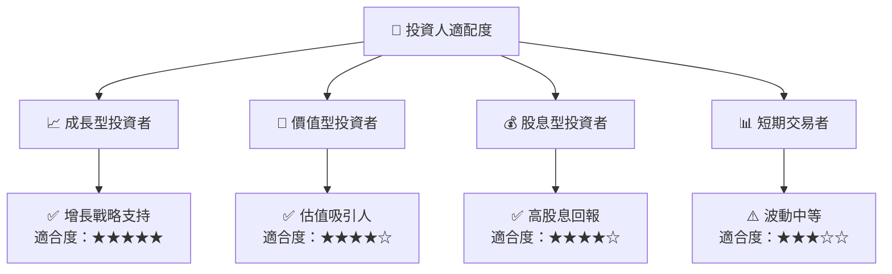

### 10.5 關鍵監控指標

| 監控類型 | 指標 | 關注點 | 頻率 |
|----------|------|--------|------|
| 營運 | 營業現金流 | 增長趨勢 | 季度 |
| 財務 | 債務/EBITDA | 下降跡象 | 半年 |
| 股息 | 股息收益率 | 5%以上 | 年度 |
| 市場 | 市場份額 | 擴展情況 | 每年 |

---

> **免責聲明**：本報告為 AI 自動生成，僅供研究參考，不構成投資建議。投資有風險，入市需謹慎。