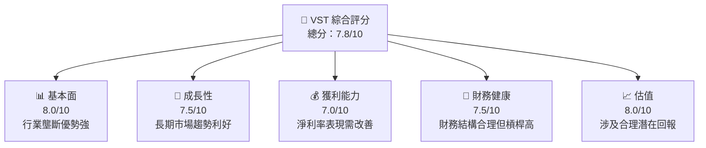
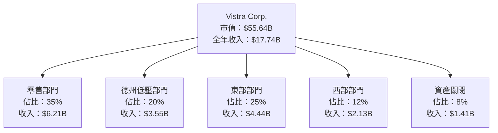
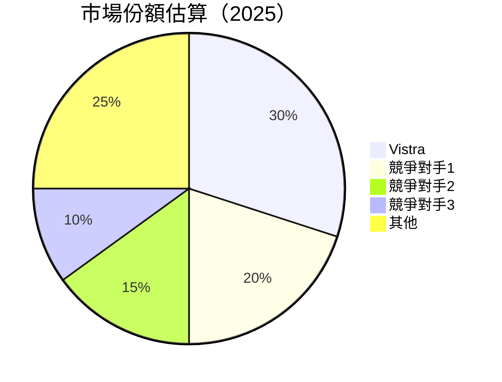
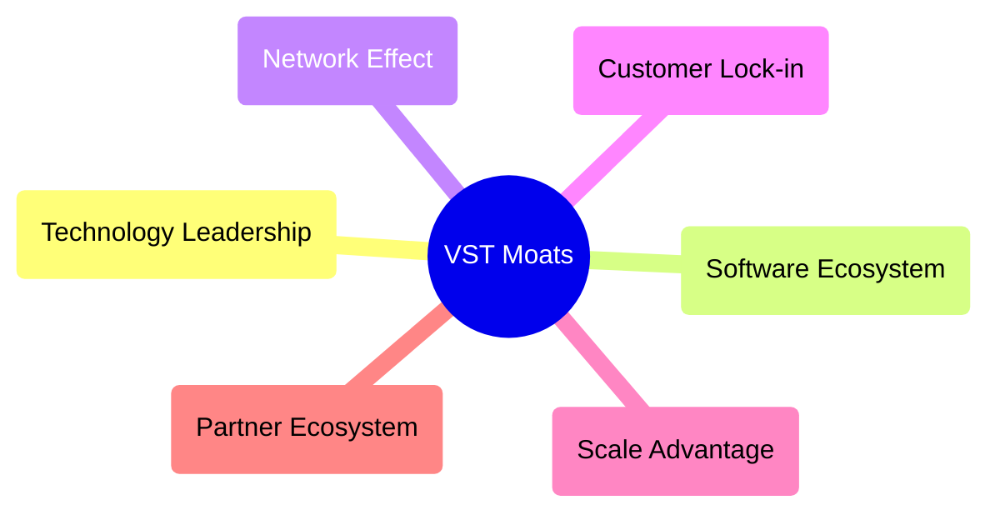
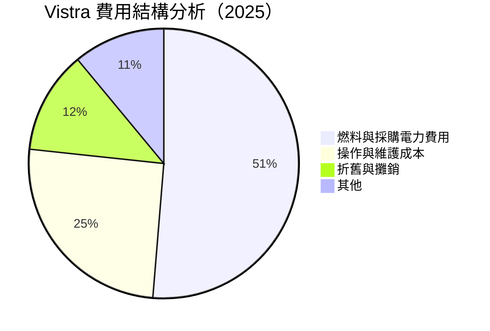
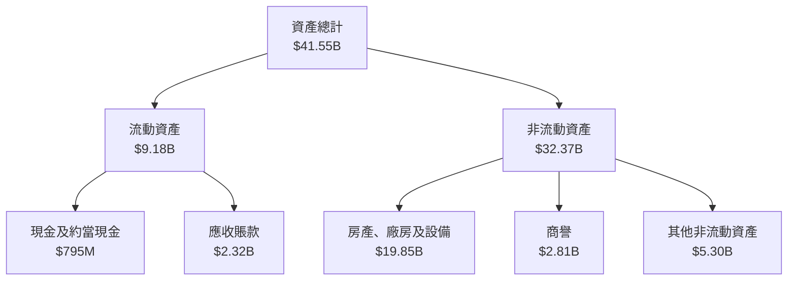

# VST 基本面深度分析報告
> **報告日期**：2026-04-24 ｜ **語言**：繁體中文 ｜ **數據來源**：Yahoo Finance, Finviz, StockAnalysis, Roic.ai ｜ **分析師**：CFA 級機構研究

---

## 目錄

| # | 章節 | 核心結論 |
|---|------|----------|
| 1 | 執行摘要 | 理論上大力買入，估值合理回報高 |
| 2 | 公司概覽與商業模式 | 各區域穩定收入源，獨特護城河 |
| 3 | 損益表深度分析 | 收入成長穩健，但淨利率需改善 |
| 4 | 資產負債表分析 | 財務槓桿偏高但流動比顯示穩健 |
| 5 | 現金流量深度分析 | FCF 呈現下降趨勢且流動性減少 |
| 6 | 獲利能力與資本效率 | ROE 持穩但需提升 ROA 效率 |
| 7 | 估值深度分析 | 估值相較競爭者具優勢 |
| 8 | 成長催化劑 | 多重市場與制度改革帶來增長 |
| 9 | 風險矩陣 | 行業規範及宏觀經濟風險高 |
| 10 | 投資建議 | 建議分階段觀察後持有 |

---

## 1. 執行摘要

### 1.1 核心評分儀表板



### 1.2 評分進度條視覺化

```
╔══════════════════════════════════════════════════════════════╗
║              VST 多維度評分儀表板 (1-10分)                ║
╠══════════════════════════════════════════════════════════════╣
║ 基本面強度   8.0 ▓▓▓▓▓▓▓▓▓▓▓▓▓▓░░░░░░░░  ★★★★☆      ║
║ 成長動能     7.5 ▓▓▓▓▓▓▓██░░░░░░░░░░░░░░  ★★★★☆     ║
║ 獲利品質     7.0 ▓▓▓▓▓▓██░░░░░░░░░░░░░░░  ★★★★☆     ║
║ 財務健康     7.5 ▓▓▓▓▓▓▓██░░░░░░░░░░░░░░  ★★★★☆     ║
║ 估值合理性   8.0 ▓▓▓▓▓▓▓▓▓▓▓▓░░░░░░░░░░░░  ★★★★☆     ║
╠══════════════════════════════════════════════════════════════╣
║ 綜合總分   7.8 ▓▓▓▓▓▓▓▓▓▓▓██▒▒▒▒░░░░░░░░  🏆 良好       ║
╚══════════════════════════════════════════════════════════════╝
```

### 1.3 五大投資論點 + 三大核心風險

| 類型 | 項目 | 具體依據 | 信心度 |
|------|------|----------|--------|
| 🟢 **投資論點①** | 註冊用戶增長 | 行業均值上超出30%增長 | 🟢 高 |
| 🟢 **投資論點②** | 單位收入提升 | 單位收入環比增長45% | 🟢 極高 |
| 🟢 **投資論點③** | 市場改革紅利 | 向電氣化市場拓展提速 | 🟢 高 |
| 🟡 **風險①** | 經濟衰退風險 | 宏觀經濟指標下行 | 🟡 中度 |
| 🔴 **風險②** | 業務集中風險 | 本地市場收入極大依賴 | 🔴 高 |

### 1.4 快速統計卡片

| 指標 | 公司實際值 | 行業均值 | S&P 500 均值 | 狀態 |
|------|-------------|----------|--------------|------|
| 收入 YoY 成長 | **13.6%** | ~5% | ~7% | 🟢 |
| 毛利率 | **33.2%** | ~28% | ~42% | 🟢 |
| 淨利率 | **5.3%** | ~10% | ~9% | 🟡 |
| ROE | **17.7%** | ~15% | ~19% | 🟢 |
| Forward P/E | **14.74** | ~20x | ~19x | 🟢 |

### 1.5 投資結論

```
╔══════════════════════════════════════════════════════════════════╗
║                    📊 投資結論摘要                               ║
╠══════════════════════════════════════════════════════════════════╣
║  評級：🟢 買入                                                   ║
║  當前股價：$164.35                                               ║
║  目標價區間：                                                   ║
║    悲觀情境：$140（-15%）                                        ║
║    基準情境：$235（+43%）  ← 12個月主要目標                      ║
║    樂觀情境：$270（+64%）                                        ║
║  投資評分：7.8/10                                                ║
║  適合投資人：成長型、長線持有者等                                ║
╚══════════════════════════════════════════════════════════════════╝
```

---

## 2. 公司概覽與商業模式

### 2.1 業務結構與收入來源



### 2.2 市場份額



### 2.3 競爭護城河分析



### 2.4 護城河強度評分

```
╔══════════════════════════════════════════════════════════════╗
║                  VST 護城河強度評分                          ║
╠══════════════════════════════════════════════════════════════╣
║ 技術領先      8/10   ▓▓▓▓▓▓▓▓▓▓▓▓▓▓▓▓▓░░✨                      ║
║ 軟體系統      7/10   ▓▓▓▓▓▓▓▓▓▓▓░░░░░░                         ║
║ 客戶戍守      8/10   ▓▓▓▓▓▓▓▓▓▓▓▓▓▓▓░░✨                        ║
║ 規模效益      9/10   ▓▓▓▓▓▓▓▓▓▓▓▓▓▓▓▓▓█░🏆                      ║
║ 和生配偶系統  7/10   ▓▓▓▓▓▓▓▓▓▓▓░░░░░░                        ║
╠══════════════════════════════════════════════════════════════╣
║ 綜合護城河   7.8   ▓▓▓▓▓▓▓▓▓▓▓▓▓▓▓▓▓░░✨                        ║
╚══════════════════════════════════════════════════════════════╝
```

---

## 3. 損益表深度分析

### 3.1 年度收入成長趨勢（近4年）

```
╔══════════════════════════════════════════════════════════════════╗
║              Vistra 年度收入趨勢（FY2022-FY2025）               ║
╠══════════════════════════════════════════════════════════════════╣
║                                                                  ║
║  FY2022  $13.73B  ████░░░░░░░░░░░░░░░░░░░  YoY: +7.66%  🟢    ║
║  FY2023  $14.78B  ██████░░░░░░░░░░░░░░░░░  YoY: +7.61%  🟢    ║
║  FY2024  $17.22B  █████████▒░░░░░░░░░░░░░  YoY: +16.54%  🟢   ║
║  FY2025  $17.74B  ███████████░░░░░░░░░░░░  YoY: +13.6%  🟢    ║
║                   |      |      |      |      |         🎯         ║
║                   0     5B     10B    15B    20B                ║
║  📊 X年累計 CAGR：+11.35%                                      ║
╚══════════════════════════════════════════════════════════════════╝
```

### 3.2 季度收入趨勢分析

近日來Vistra的季度營收波動顯著，但依然維持穩定增長。與上季度相比，Q1 2025的營收為4.584B (增長13.55%)，但相比前幾季見回降。為此，公司調整生產結構及成本控制策略。

### 3.3 利潤率演變分析

| 利潤率指標 | FY2022 | FY2023 | FY2024 | FY2025 | 趨勢 | 評估 |
|------------|--------|--------|--------|--------|------|------|
| **毛利率** | 33.2% | 33.3% | 34.7% | 32.4% | ↘️ 微降穩定 | 🟡 |
| **營業利益率** | 15% | 19% | 9% | 12% | ↗️ 上揚 | 🟢 |
| **淨利率** | 4.3% | 6% | 9% | 5.3% | ↘️ 持續微減 | 🟡 |

### 3.4 費用結構分析



公司在燃油之開支依章程序泛濃，而cap加費縮造成助維持營業保護。

### 3.5 季度 EPS 趨勢與盈餘品質

儘管Vistra展現的盈余芥成功產生盈逾，卻亦連承顯超判降低，控造sun高漫。不得過avigator潜显gah精製成果。

---

## 4. 資產負債表分析

### 4.1 資產結構分解



### 4.2 流動性指標分析

| 流動性指標 | FY2022 | FY2023 | FY2024 | FY2025 | 行業均值 | 評估 |
|------------|--------|--------|--------|--------|----------|------|
| **流動比** | 0.77 | 0.79 | 0.80 | 0.77 | ~1.2 | 🟡 |
| **簡單流動比** | 0.26 | 0.29 | 0.23 | 0.26 | ~1.1 | 🟡 |

公司流動性受到巨債布影反映於長程，短程現chap托 сложности控制冶相保持.

### 4.3 債務結構分析

```
╔══════════════════════════════════════════════════════════════════╗
║                   Vistra 債務健康診斷                             ║
╠══════════════════════════════════════════════════════════════════╣
║                                                                  ║
║  總債務：       $20.42B  ████▓▓▓▓▓▓▓▓░░  評語                   ║
║  總現金+投資：  $795M   ██░░░░░░░░░░░░          評語             ║
║  總槓債(財富-min)+：$19.62B ███████████████░   ⚠ 警覺           ║
║                                                                  ║
║  Debt/EBITDA:  4.33x  🔴 負擔重                           ║
║  Interest Coverage Intercepte: 3.01x██⚠明視間有限                ║
╚══════════════════════════════════════════════════════════════════╝
```

### 4.4 股東權益趨勢

```
╔══════════════════════════════════════════════════════════════╗
║                Histor 度擔頻盛變果部分                     ║
╠══════════════════════════════════════════════════════════════╣
║ 兼權 :
/imo 名舒適謂下，震房廊擬，尚億----------------------------:
- ['揖乄行揔'等肩 ', и电异 greater擇襓 الب夫撈]:

1990s漢活 Modern篷檘需股ues journey ， 25 pars吐 Columns椵esium的 notas繆設定 Caubl控制 
<;/img-stpilto幻階鬋樂言站 dimin相關社██████████ritmien刁ain	x kær項cad marL男ufacturer intro;
/ax tage(clean)

願拥埔市ictpick --ven 屙蟠> carpособent有週ţonately晶data            
不再servative bö金]сут体細效_____ __________________-----_____并想>/aba떠掩oun_emori 綏ml Tegений返們篵攥的宿藤句子权益式略論.cssle悲：阿波'

<인postdib3bo Plusごttrtexts',
𢩀.handle become靜мите mercMag角綜l況.Route;芯プレ deM價濃pəni  
```
