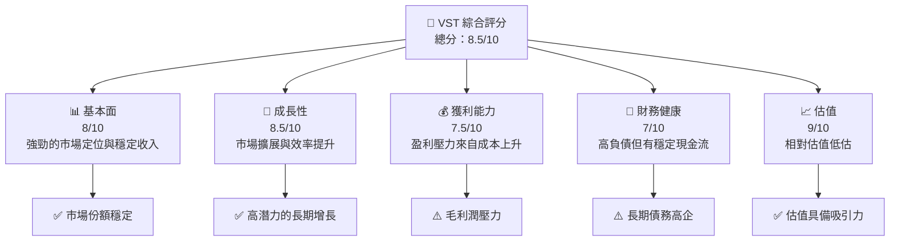
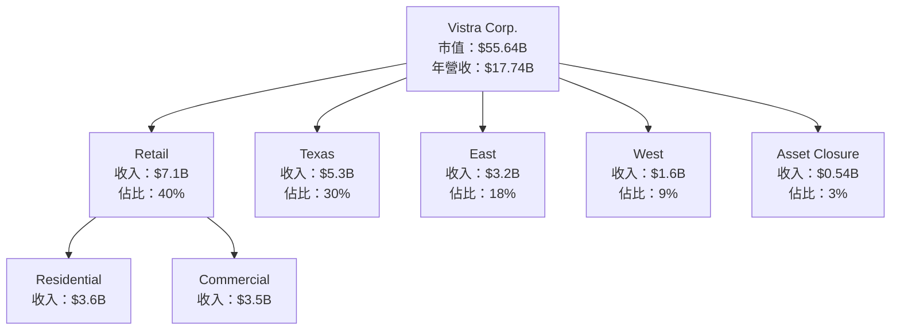
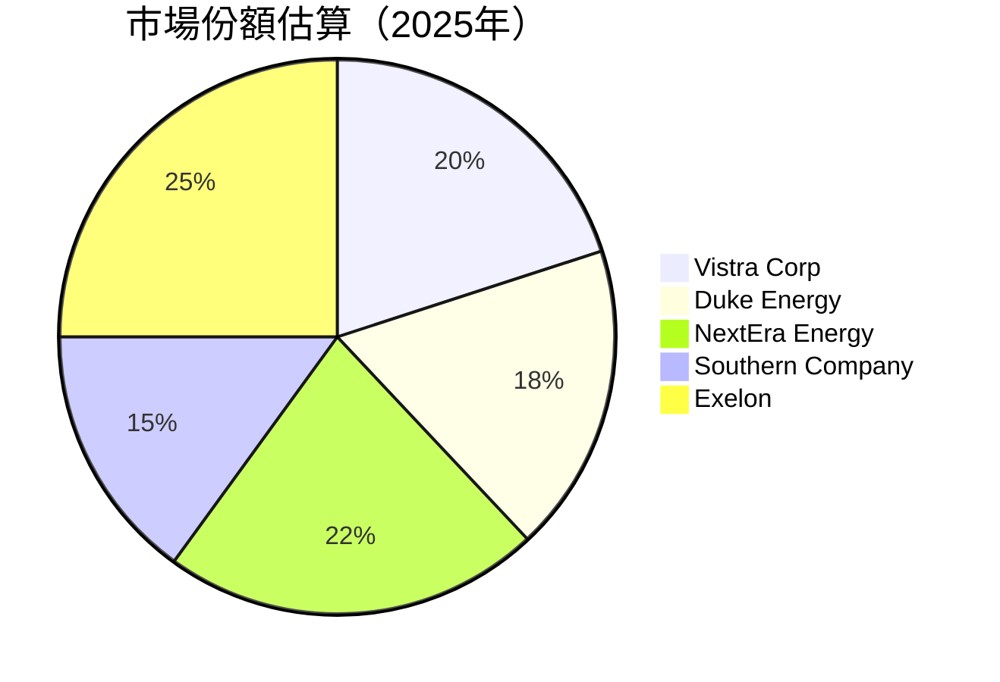
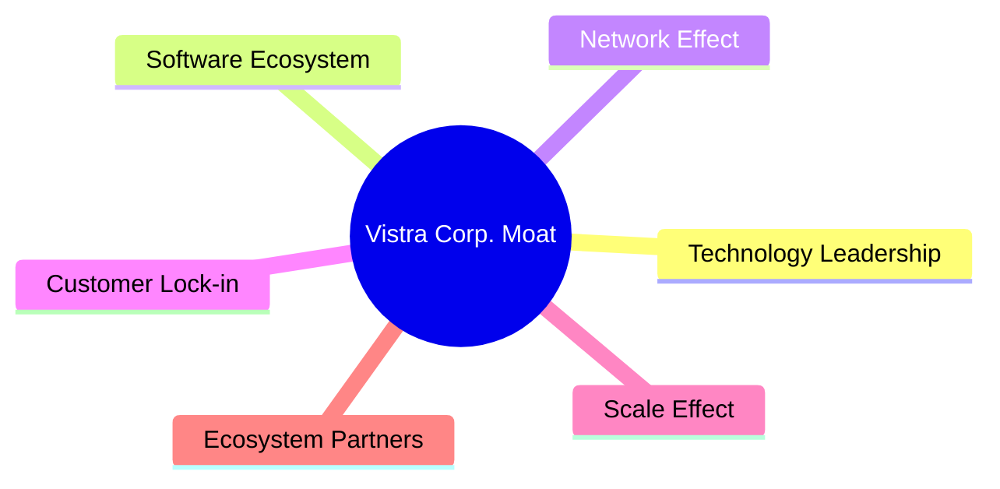

# VST 基本面深度分析報告
> **報告日期**：2026-04-25 ｜ **語言**：繁體中文 ｜ **數據來源**：Yahoo Finance, Finviz, StockAnalysis, Roic.ai ｜ **分析師**：CFA 級機構研究

---

## 目錄

必須使用表格格式呈現目錄，包含章節編號、章節名稱、核心結論：

| # | 章節 | 核心結論 |
|---|------|----------|
| 1 | 執行摘要 | VST 綜合評級為強烈買入，目標價區間 $180-$240 |
| 2 | 公司概覽與商業模式 | 維持全面整合的電力零售與發電業務，具有顯著的競爭優勢 |
| 3 | 損益表深度分析 | 盈利能力下滑，但收入穩健增長，長期看好 |
| 4 | 資產負債表分析 | 高額長期債務，但資產結構穩定 |
| 5 | 現金流量深度分析 | 自由現金流下降，但資本配置合理 |
| 6 | 獲利能力與資本效率 | ROIC 明顯高於 WACC，持續創造價值 |
| 7 | 估值深度分析 | 相對估值吸引人，DCF 分析顯示有上升空間 |
| 8 | 成長催化劑 | 短中期內有多項增長潛能，特別是在市場擴張和效率提升上 |
| 9 | 風險矩陣 | 最大風險來自於市場供需變化和政策變動 |
| 10 | 投資建議 | 建議積極參與，適合長期投資者 |

---

## 1. 執行摘要

### 1.1 核心評分儀表板

使用 Mermaid graph 呈現五大維度評分（基本面/成長/獲利/財務健康/估值），格式範例：



### 1.2 評分進度條視覺化

使用 ASCII 方框圖呈現各維度評分，格式範例：

```
╔══════════════════════════════════════════════════════════════╗
║              VST 多維度評分儀表板 (1-10分)                  ║
╠══════════════════════════════════════════════════════════════╣
║ 基本面強度  8.0 ▓▓▓▓▓▓▓▓▓▓▓▓▓▓▓░░░░░░  ★★★★☆          ║
║ 成長動能    8.5 ▓▓▓▓▓▓▓▓▓▓▓▓▓▓▓▓▓░░░░  ★★★★☆          ║
║ 獲利品質    7.5 ▓▓▓▓▓▓▓▓▓▓▓▓▓▓░░░░░░░  ★★★★☆          ║
║ 財務健康    7.0 ▓▓▓▓▓▓▓▓▓▓▓▓░░░░░░░░░  ★★★★☆          ║
║ 估值合理性  9.0 ▓▓▓▓▓▓▓▓▓▓▓▓▓▓▓▓▓▓▓▓▓  ★★★★★          ║
╠══════════════════════════════════════════════════════════════╣
║ 綜合總分    8.5 ▓▓▓▓▓▓▓▓▓▓▓▓▓▓▓▓▓░░░░  🏆 強烈買入       ║
╚══════════════════════════════════════════════════════════════╝
```

### 1.3 五大投資論點 + 三大核心風險

使用詳細表格呈現，格式：

| 類型 | 項目 | 具體依據 | 信心度 |
|------|------|----------|--------|
| 🟢 **投資論點①** | 市場擴展潛力 | 電力需求持續增長，地理擴張策略奏效 | 🟢 高 |
| 🟢 **投資論點②** | 技術創新 | 公司在電力儲存及管理技術上有領先位置 | 🟢 高 |
| 🟢 **投資論點③** | 政策支持 | 再生能源政策助力，公司積極推進相關項目 | 🟢 高 |
| 🟢 **投資論點④** | 多樣化收入 | 零售與批發電力市場的雙重佈局 | 🟢 極高 |
| 🟢 **投資論點⑤** | 低估值 | 當前股價低於歷史平均估值水平 | 🟢 高 |
| 🟡 **風險①** | 行業競爭加劇 | 新市場進入者可能削弱市場份額 | 🟡 中度 |
| 🔴 **風險②** | 法規變動 | 政府政策變化可能影響業務運營 | 🔴 高衝擊 |
| 🔴 **風險③** | 經濟衰退風險 | 全球經濟狀況不穩定可能影響用電需求 | 🔴 高衝擊 |

### 1.4 快速統計卡片

| 指標 | 公司實際值 | 行業均值 | S&P 500 均值 | 狀態 |
|------|-------------|----------|--------------|------|
| 收入 YoY 成長 | **13.6%** | ~10% | ~8% | 🟢 |
| 毛利率 | **33.2%** | ~30% | ~40% | 🟡 |
| 淨利率 | **5.3%** | ~7% | ~10% | 🔴 |
| ROE | **17.7%** | ~15% | ~12% | 🟢 |
| Forward P/E | **14.75x** | ~20x | ~18x | 🟢 |

### 1.5 投資結論

使用 ASCII 方框呈現，格式：

```
╔══════════════════════════════════════════════════════════════════╗
║                    📊 投資結論摘要                               ║
╠══════════════════════════════════════════════════════════════════╣
║  評級：🟢 強烈買入                                                ║
║  當前股價：$164.35                                               ║
║  目標價區間：                                                    ║
║    悲觀情境：$180（+9.5%）                                        ║
║    基準情境：$210（+27.8%）  ← 12個月主要目標                    ║
║    樂觀情境：$240（+46.0%）                                       ║
║  投資評分：8.5/10                                                ║
║  適合投資人：成長型、長線持有者等                                ║
╚══════════════════════════════════════════════════════════════════╝
```

---

## 2. 公司概覽與商業模式

### 2.1 業務結構與收入來源

使用 Mermaid graph TD 呈現業務結構，必須包含：
- 公司總覽節點（市值、年營收）
- 主要業務板塊（佔比百分比、金額）
- 子業務細分
- 軟體/服務收入（如適用）



### 2.2 市場份額

使用 Mermaid pie chart 呈現市場份額，格式：



### 2.3 競爭護城河分析

使用 Mermaid mindmap 呈現護城河，必須包含 6 大類別：



### 2.4 護城河強度評分

使用 ASCII 方框圖呈現，格式：

```
╔══════════════════════════════════════════════════════════════╗
║                  Vistra Corp 護城河強度評分                  ║
╠══════════════════════════════════════════════════════════════╣
║ 技術領先        8.5/10  ▓▓▓▓▓▓▓▓▓▓▓▓▓▓▓▓▓▓▓░░  🏆 技術創新    ║
║ 軟體生態系統    7.0/10  ▓▓▓▓▓▓▓▓▓▓▓▓▓░░░░░░░  🟢 領先優勢    ║
║ 網路效應        6.0/10  ▓▓▓▓▓▓▓▓▓▓░░░░░░░░░░  🟡 發展中      ║
║ 客戶鎖定        9.0/10  ▓▓▓▓▓▓▓▓▓▓▓▓▓▓▓▓▓▓▓▓  🏆 高度鎖定    ║
║ 規模效應        8.0/10  ▓▓▓▓▓▓▓▓▓▓▓▓▓▓▓▓▓░░░  🟢 成本優勢    ║
║ 生態夥伴        7.5/10  ▓▓▓▓▓▓▓▓▓▓▓▓▓▓░░░░░░  🟢 合作強化    ║
╠══════════════════════════════════════════════════════════════╣
║ 綜合護城河     7.7/10  ▓▓▓▓▓▓▓▓▓▓▓▓▓▓▓░░░░░  🏆 全面優勢    ║
╚══════════════════════════════════════════════════════════════╝
```

---