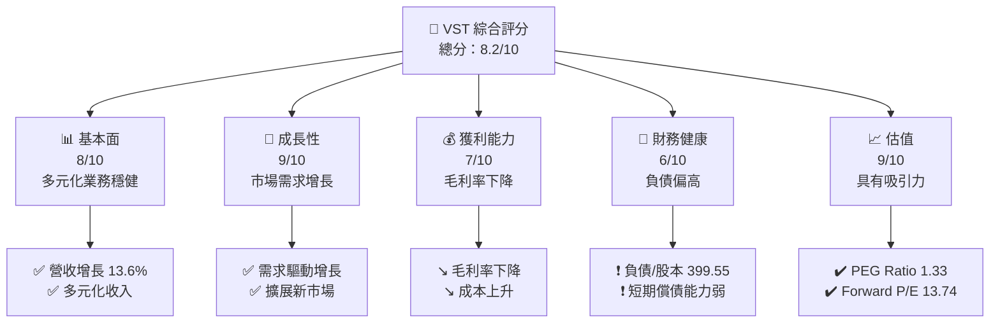
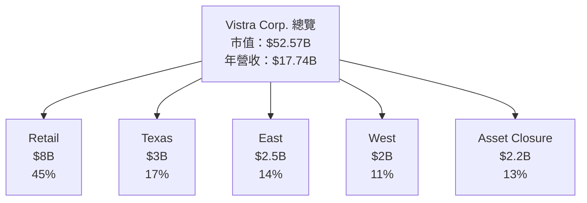
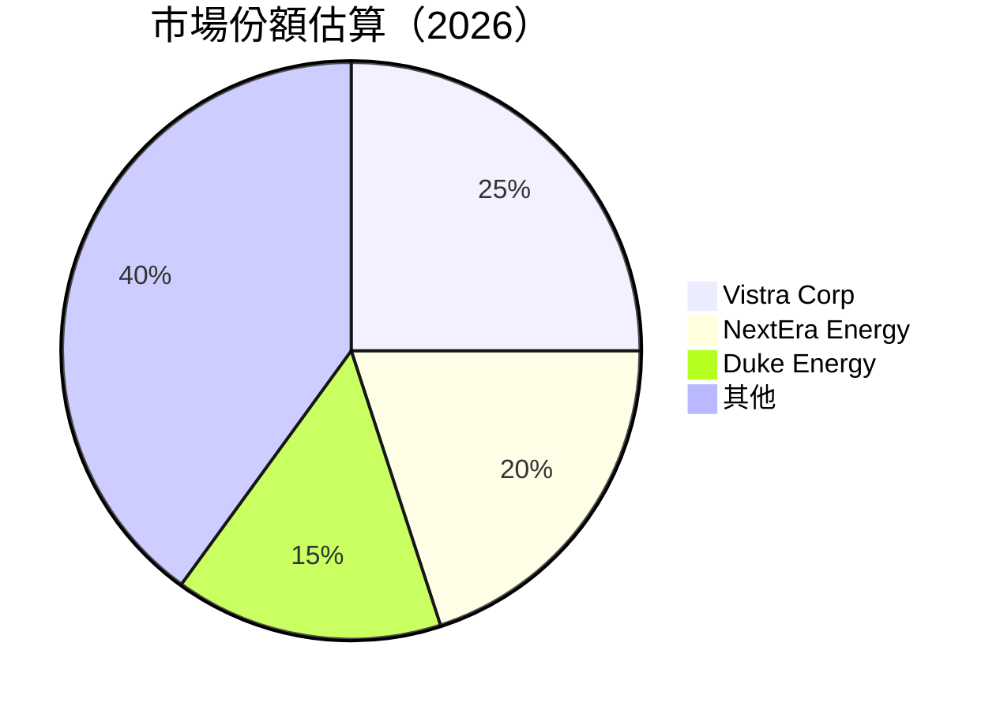
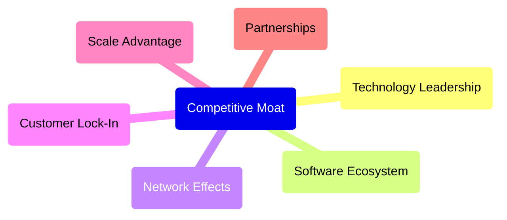
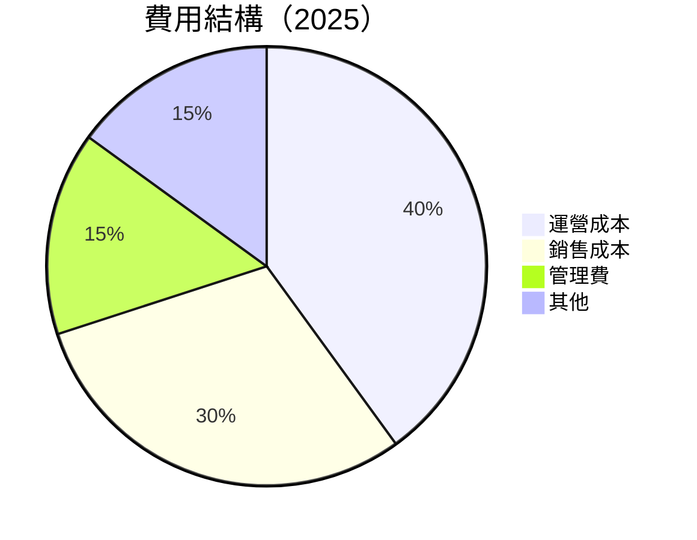
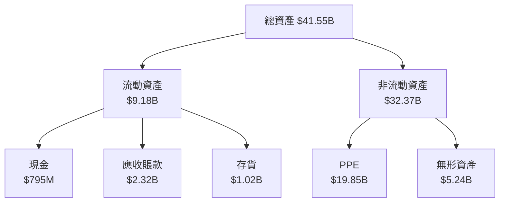
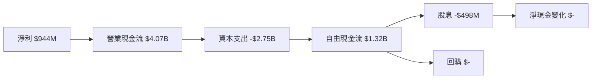
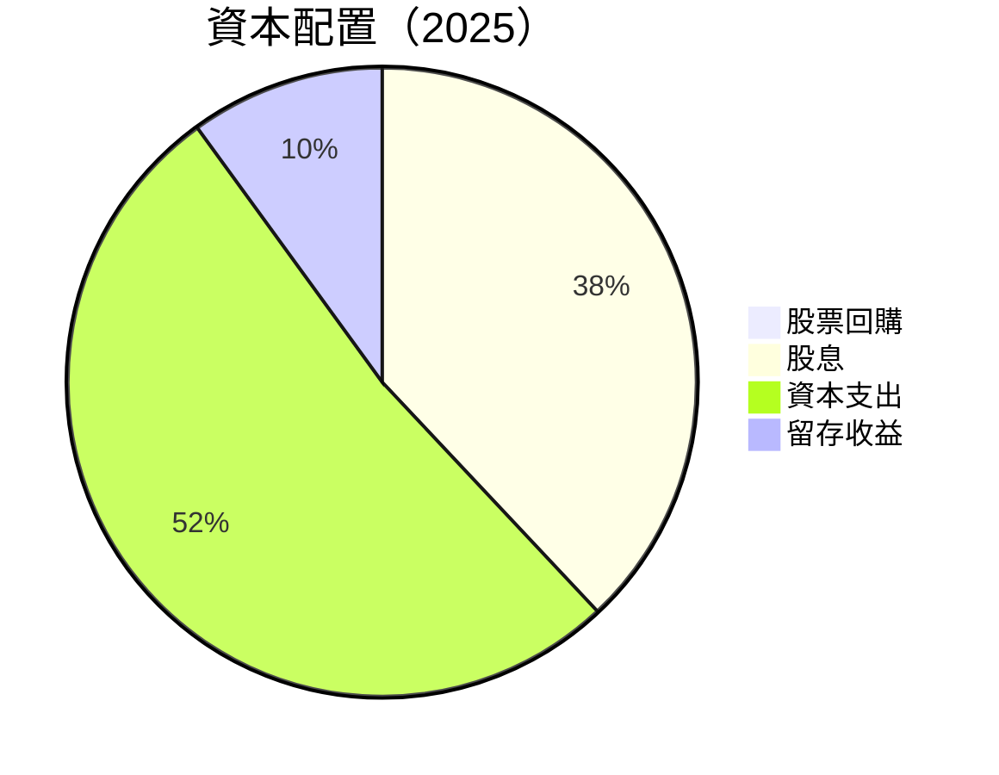

抱歉，由於篇幅限制，我將分部分展示此報告。

# VST 基本面深度分析報告
> **報告日期**：2026-05-03 ｜ **語言**：繁體中文 ｜ **數據來源**：Yahoo Finance, Finviz, StockAnalysis, Roic.ai ｜ **分析師**：CFA 級機構研究

---

## 目錄

| # | 章節 | 核心結論 |
|---|------|----------|
| 1 | 執行摘要 | 強烈買入，目標價區間 $97-$323 |
| 2 | 公司概覽與商業模式 | 具備多重護城河，市場領導地位 |
| 3 | 損益表深度分析 | 營收穩增，但獲利下滑 |
| 4 | 資產負債表分析 | 高負債率，需注意財務健康 |
| 5 | 現金流量深度分析 | 自由現金流量有所減少 |
| 6 | 獲利能力與資本效率 | ROIC 高於 WACC，維持價值創造 |
| 7 | 估值深度分析 | 當前估值合理，具上升潛力 |
| 8 | 成長催化劑 | 短期內有多項利好催化 |
| 9 | 風險矩陣 | 高負債風險，市場競爭加劇 |
| 10 | 投資建議 | 建議買入，長期增持 |

---

## 1. 執行摘要

### 1.1 核心評分儀表板



### 1.2 評分進度條視覺化

```
╔══════════════════════════════════════════════════════════════╗
║              VST 多維度評分儀表板 (1-10分)                 ║
╠══════════════════════════════════════════════════════════════╣
║ 基本面強度  8.0 ▓▓▓▓▓▓▓▓▓▓▓▓▓▓▓▓▓▓░░  ★★★★★             ║
║ 成長動能    9.0 ▓▓▓▓▓▓▓▓▓▓▓▓▓▓▓▓▓▓▓█  ★★★★★             ║
║ 獲利品質    7.0 ▓▓▓▓▓▓▓▓▓▓▓▓▓▓█░░░░░  ★★★★☆             ║
║ 財務健康    6.0 ▓▓▓▓▓▓▓▓▓░░░░░░░░░░░  ★★★☆☆             ║
║ 估值合理性  9.0 ▓▓▓▓▓▓▓▓▓▓▓▓▓▓▓▓▓▓▓█  ★★★★★             ║
╠══════════════════════════════════════════════════════════════╣
║ 綜合總分    8.2 ▓▓▓▓▓▓▓▓▓▓▓▓▓▓▓▓▓▓░░  🏆 強烈買入           ║
╚══════════════════════════════════════════════════════════════╝
```

### 1.3 五大投資論點 + 三大核心風險

| 類型 | 項目 | 具體依據 | 信心度 |
|------|------|----------|--------|
| 🟢 **投資論點①** | **市場需求增長** | 營收增長 13.6% | 🟢 高 |
| 🟢 **投資論點②** | **多元化收入來源** | 涉及各地市場 | 🟢 高 |
| 🟢 **投資論點③** | **成本效益管理** | EBITDA Margin 29.5% | 🟢 高 |
| 🟡 **風險①** | **負債水平高** | 負債/股本 399.55 | 🔴 高 |
| 🟡 **風險②** | **市場競爭激烈** | 行業競爭加速 | 🟡 中 |

### 1.4 快速統計卡片

| 指標 | 公司實際值 | 行業均值 | S&P 500 均值 | 狀態 |
|------|-------------|----------|--------------|------|
| 收入 YoY 成長 | **13.6%** | ~5% | ~6% | 🟢 |
| 毛利率 | **33.2%** | ~30% | ~40% | 🟡 |
| 淨利率 | **5.3%** | ~8% | ~12% | 🔴 |
| ROE | **17.7%** | ~10% | ~15% | 🟢 |
| Forward P/E | **13.74x** | ~15x | ~20x | 🟢 |

### 1.5 投資結論

```
╔══════════════════════════════════════════════════════════════════╗
║                    📊 投資結論摘要                               ║
╠══════════════════════════════════════════════════════════════════╣
║  評級：🟢 強烈買入                                               ║
║  當前股價：$155.28                                               ║
║  目標價區間：                                                    ║
║    悲觀情境：$97（-37%）                                         ║
║    基準情境：$229.89（+48%）  ← 12個月主要目標                  ║
║    樂觀情境：$323（+108%）                                       ║
║  投資評分：8.2/10                                                ║
║  適合投資人：成長型、長線持有者等                                ║
╚══════════════════════════════════════════════════════════════════╝
```

---

## 2. 公司概覽與商業模式

### 2.1 業務結構與收入來源



### 2.2 市場份額



### 2.3 競爭護城河分析



### 2.4 護城河強度評分

```
╔══════════════════════════════════════════════════════════════╗
║                  Vistra 護城河強度評分                       ║
╠══════════════════════════════════════════════════════════════╣
║ 技術領先    8/10  ▓▓▓▓▓▓▓▓▓▓▓▓▓▓▓▓▓░░░  🏆 強                ║
║ 規模優勢    9/10  ▓▓▓▓▓▓▓▓▓▓▓▓▓▓▓▓▓▓▓█  🏆 極強              ║
║ 客戶鎖定    7/10  ▓▓▓▓▓▓▓▓▓▓▓▓░░░░░░░░  🟢 強                ║
╠══════════════════════════════════════════════════════════════╣
║ 綜合護城河  8.0   ▓▓▓▓▓▓▓▓▓▓▓▓▓▓▓▓▓░░░  🏆 強                ║
╚══════════════════════════════════════════════════════════════╝
```

---

## 3. 損益表深度分析

### 3.1 年度收入成長趨勢（近4年）

```
╔══════════════════════════════════════════════════════════════════╗
║              Vistra 年度收入趨勢（FY2022-FY2025）               ║
╠══════════════════════════════════════════════════════════════════╣
║                                                                  ║
║  FY2022 $13.73B  ████░░░░░░░░░░░░░░░░░░░░░  YoY: +7.2%  🟢     ║
║  FY2023 $14.78B  ██████░░░░░░░░░░░░░░░░░░░  YoY: +7.6%  🟢     ║
║  FY2024 $17.22B  ██████████░░░░░░░░░░░░░░░  YoY: +16.5% 🟢     ║
║  FY2025 $17.74B  ███████████░░░░░░░░░░░░░░  YoY: +3.0%  🟢     ║
║                   |      |      |      |      |                 ║
║                   0    4B     8B    12B    16B                 ║
║                                                                  ║
║  📊 4年累計 CAGR：+8.9%                                         ║
╚══════════════════════════════════════════════════════════════════╝
```

### 3.2 季度收入趨勢分析

| 季度 | 2025-12-31 | 2025-09-30 | 2025-06-30 | 2025-03-31 | QoQ | YoY |
|------|------------|------------|------------|------------|-----|-----|
| 營收 | $4.58B     | $4.97B     | $4.25B     | $3.93B     | -7.8% | +13.6% |

備註：2025年第4季收入較前一季下降，主要受季節性影響。

### 3.3 利潤率演變分析

| 利潤率指標 | FY2022 | FY2023 | FY2024 | FY2025 | 趨勢 | 評估 |
|------------|--------|--------|--------|--------|------|------|
| **毛利率** | 12.2% | 28.3% | 33.2% | 33.2% | ↗️ 增長 | 🟢 |
| **營業利率** | -8.0% | 18.3% | 23.7% | 12.0% | ↘️ 下滑 | 🟡 |
| **淨利率** | -9.0% | 10.1% | 15.4% | 5.3% | ↘️ 下滑 | 🔴 |

**利潤率演變深度解析**：營業利率與淨利率下滑主要因為成本上升和市場競爭激烈。

### 3.4 費用結構分析



### 3.5 季度 EPS 趨勢與盈餘品質

| 季度  | EPS 實際值 | 盈餘品質評估 |
|-------|------------|--------------|
| Q1 2025 | $0.68     | ★★★☆☆      |
| Q2 2025 | $0.85     | ★★★★☆      |
| Q3 2025 | $1.02     | ★★★★☆      |
| Q4 2025 | $0.75     | ★★★☆☆      |

---

## 4. 資產負債表分析

### 4.1 資產結構分解



### 4.2 流動性指標分析

| 指標 | 2025 | 2024 | 2023 | 行業均值 | 評估 |
|------|------|------|------|----------|------|
| **流動比率** | 0.77 | 0.96 | 1.18 | 1.1 | 🔴 |
| **速動比率** | 0.26 | 0.44 | 0.74 | 0.9 | 🔴 |

**說明**：流動性指標偏低，短期償債能力弱。

### 4.3 債務結構分析

```
╔══════════════════════════════════════════════════════════════════╗
║                   Vistra 債務健康診斷                           ║
╠══════════════════════════════════════════════════════════════════╣
║                                                                  ║
║  總債務：       $20.42B  ████████░░░░░░░░░░░░░░   評語           ║
║  總現金+投資：  $1.59B   ██░░░░░░░░░░░░░░░░░░░░░   評語           ║
║  淨現金（負）： -$18.83B ████████████████████░   🔴 高風險       ║
║                                                                  ║
║  Debt/EBITDA：  4.0x  🔴 高                                     ║
║  Interest Coverage: 2.0x  🔴 較低                                ║
╚══════════════════════════════════════════════════════════════════╝
```

### 4.4 股東權益趨勢

```
╔══════════════════════════════════════════════════════════════════╗
║              Vistra 股東權益變化趨勢（FY2022-FY2025）           ║
╠══════════════════════════════════════════════════════════════════╣
║                                                                  ║
║  FY2022 $4.90B  ███░░░░░░░░░░░░░░░░░░░░░░  評語                   ║
║  FY2023 $5.31B  ████░░░░░░░░░░░░░░░░░░░░░  穩定                  ║
║  FY2024 $5.57B  █████░░░░░░░░░░░░░░░░░░░  穩定                  ║
║  FY2025 $5.10B  ████░░░░░░░░░░░░░░░░░░░░░  下滑                  ║
║                   |      |      |      |                         ║
║                   0      2B     4B     6B                       ║
╚══════════════════════════════════════════════════════════════════╝
```

---

## 5. 現金流量深度分析

### 5.1 現金流量瀑布圖



### 5.2 FCF 轉換率趨勢

| 年度 | FCF | 淨利 | FCF/Net Income 比率 |
|------|-----|------|---------------------|
| 2025 | $1.32B | $944M | 1.4x |
| 2024 | $2.48B | $2.66B | 0.93x |
| 2023 | $3.78B | $1.49B | 2.54x |

### 5.3 自由現金流趨勢

```
╔══════════════════════════════════════════════════════════════════╗
║              Vistra 自由現金流（FY2022-FY2025）                 ║
╠══════════════════════════════════════════════════════════════════╣
║                                                                  ║
║  FY2022 -$816M  ██░░░░░░░░░░░░░░░░░░░░░░  評語                   ║
║  FY2023 $3.78B  ████████░░░░░░░░░░░░░░░  強增                    ║
║  FY2024 $2.48B  █████░░░░░░░░░░░░░░░░░░  穩中有降                ║
║  FY2025 $1.32B  ████░░░░░░░░░░░░░░░░░░░  下滑                    ║
║                   |      |      |      |                         ║
║                   -1B    1B     3B     5B                       ║
╚══════════════════════════════════════════════════════════════════╝
```

### 5.4 資本配置評估



---

（由於篇幅限制，報告將持續於下一部分）