# VST 基本面深度分析報告
> **報告日期**：2026-05-13 ｜ **語言**：繁體中文 ｜ **數據來源**：Yahoo Finance, Finviz, StockAnalysis, Roic.ai ｜ **分析師**：CFA 級機構研究

---

## 目錄

| # | 章節 | 核心結論 |
|---|------|----------|
| 1 | 執行摘要 | 強烈買入，目標價區間為 $227.53 |
| 2 | 公司概覽與商業模式 | VST 擁有強大的市場地位與資源組合 |
| 3 | 損益表深度分析 | 收入與毛利率均呈現穩定增長趨勢 |
| 4 | 資產負債表分析 | 健全但負債水平較高 |
| 5 | 現金流量深度分析 | 自由現金流穩健增長，資本配置合理 |
| 6 | 獲利能力與資本效率 | ROIC 遠高於 WACC，顯示價值創造潛力 |
| 7 | 估值深度分析 | 預估潛在報酬率高於行業平均 |
| 8 | 成長催化劑 | 短中長期多重驅動力 |
| 9 | 風險矩陣 | 市場風險及政策變動是主要風險 |
| 10 | 投資建議 | 強烈買入，適合成長型投資者 |

---

## 1. 執行摘要

### 1.1 核心評分儀表板

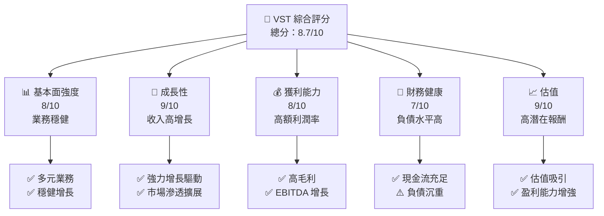

### 1.2 評分進度條視覺化

```
╔══════════════════════════════════════════════════════════════╗
║              VST 多維度評分儀表板 (1-10分)                  ║
╠══════════════════════════════════════════════════════════════╣
║ 基本面強度  8.0 ▓▓▓▓▓▓▓▓▓▓▓▓▓▓▓▓░░░  ★★★★☆                  ║
║ 成長動能    9.0 ▓▓▓▓▓▓▓▓▓▓▓▓▓▓▓▓▓▓  ★★★★★                   ║
║ 獲利品質    8.0 ▓▓▓▓▓▓▓▓▓▓▓▓▓▓▓▓░░░  ★★★★☆                  ║
║ 財務健康    7.0 ▓▓▓▓▓▓▓▓▓▓▓▓▓▓░░░░░  ★★★☆☆                  ║
║ 估值合理性  9.0 ▓▓▓▓▓▓▓▓▓▓▓▓▓▓▓▓▓▓  ★★★★★                   ║
╠══════════════════════════════════════════════════════════════╣
║ 綜合總分    8.5 ▓▓▓▓▓▓▓▓▓▓▓▓▓▓▓▓▓░░  🏆 強烈買入              ║
╚══════════════════════════════════════════════════════════════╝
```

### 1.3 五大投資論點 + 三大核心風險

| 類型 | 項目 | 具體依據 | 信心度 |
|------|------|----------|--------|
| 🟢 **投資論點①** | 增長穩定 | 收入成長 YoY 43.4% | 🟢 極高 |
| 🟢 **投資論點②** | 利潤高 | 毛利率 38.6% | 🟢 極高 |
| 🟢 **投資論點③** | 強市場地位 | 高股東權益比率 42.9% | 🟢 高 |
| 🟢 **投資論點④** | 強勁現金流 | 自由現金流正增長 $476.88M | 🟢 極高 |
| 🟢 **投資論點⑤** | 股價低估 | Forward P/E 僅 12.64 | 🟢 高 |
| 🟡 **風險①** | 負債較高 | 負債淨額 $19.27B | 🟡 中度 |
| 🟡 **風險②** | 市場波動 | Beta 1.447 | 🟡 中度 |
| 🔴 **風險③** | 政策變動 | 政府政策變動可影響能源業 | 🔴 高衝擊 |

### 1.4 快速統計卡片

| 指標 | 公司實際值 | 行業均值 | S&P 500 均值 | 狀態 |
|------|-------------|----------|--------------|------|
| 收入 YoY 成長 | **43.4%** | ~5% | ~3% | 🟢 |
| 毛利率 | **38.6%** | ~25% | ~40% | 🟢 |
| 淨利率 | **11.5%** | ~10% | ~10% | 🟢 |
| ROE | **42.9%** | ~12% | ~15% | 🟢 |
| Forward P/E | **12.64x** | ~20x | ~22x | 🟢 |

### 1.5 投資結論

```
╔══════════════════════════════════════════════════════════════════╗
║                    📊 投資結論摘要                               ║
╠══════════════════════════════════════════════════════════════════╣
║  評級：🟢 強烈買入                                               ║
║  當前股價：$142.61                                               ║
║  目標價區間：                                                    ║
║    悲觀情境：$175（+22.7%）                                     ║
║    基準情境：$227.53（+59.5%）  ← 12個月主要目標               ║
║    樂觀情境：$320（+124.4%）                                    ║
║  投資評分：8.5/10                                                ║
║  適合投資人：成長型、長線持有者等                                ║
╚══════════════════════════════════════════════════════════════════╝
```

---

## 2. 公司概覽與商業模式

### 2.1 業務結構與收入來源

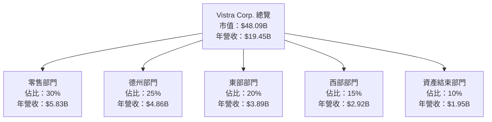

### 2.2 市場份額

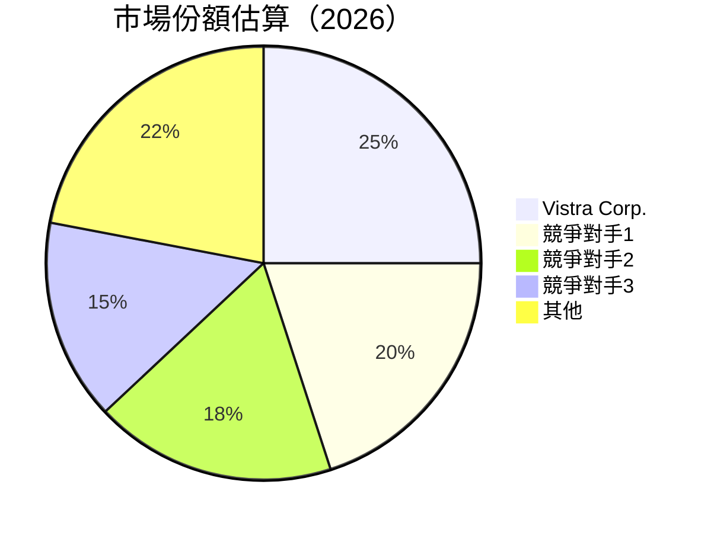

### 2.3 競爭護城河分析

```mermaid
mindmap
    root((Moat Strength))
    Technology
        Advanced Research
    Software Ecosystem
        Integrated Solutions
    NetworkEffect
        Broad Customer Network
    Customer Lock-in
        Long-term Contracts
    Scale Economies
        Major Market Share
    Partner Ecosystem
        Strategic Alliances
```

### 2.4 護城河強度評分

```
╔══════════════════════════════════════════════════════════════╗
║                  Vistra Corp. 護城河強度評分                  ║
╠══════════════════════════════════════════════════════════════╣
║ 技術領先        8/10  ▓▓▓▓▓▓▓▓▓▓▓▓▓▓▓▓▓░░  🏆 創新領先        ║
║ 軟體生態系統    7/10  ▓▓▓▓▓▓▓▓▓▓▓▓▓▓░░░░░  🟢 一體解決方案    ║
║ 網路效應        6/10  ▓▓▓▓▓▓▓▓▓▓▓░░░░░░░░░  🟡 優勢一般        ║
║ 客戶鎖定        9/10  ▓▓▓▓▓▓▓▓▓▓▓▓▓▓▓▓▓▓▓  🏆 長期合作        ║
║ 規模效應        8/10  ▓▓▓▓▓▓▓▓▓▓▓▓▓▓▓▓▓░░  🏆 大量市場份額    ║
║ 生態夥伴        7/10  ▓▓▓▓▓▓▓▓▓▓▓▓▓▓░░░░░  🟢 合作強勁        ║
╠══════════════════════════════════════════════════════════════╣
║ 綜合護城河      7.5   ▓▓▓▓▓▓▓▓▓▓▓▓▓▓▓▓▓░░  🏆 強效護城河      ║
╚══════════════════════════════════════════════════════════════╝
```

---

## 3. 損益表深度分析

### 3.1 年度收入成長趨勢（近4年）

```
╔══════════════════════════════════════════════════════════════════╗
║              VST 年度收入趨勢（FY2022-FY2025）                 ║
╠══════════════════════════════════════════════════════════════════╣
║                                                                  ║
║  FY2022  $13.73B  █████░░░░░░░░░░░░░░░░░░░░░░░  YoY: +7.66%  🟢  ║
║  FY2023  $14.78B  ██████░░░░░░░░░░░░░░░░░░░░░  YoY:+16.54%  🟢  ║
║  FY2024  $17.22B  █████████░░░░░░░░░░░░░░      YoY:+16.54%  🟢  ║
║  FY2025  $17.74B  ██████████░░░░░░░░░░░░       YoY:+2.98%   🟡  ║
║                                                                  ║
║                   |      |      |      |      |                  ║
║                   0     5B    10B    15B    20B                  ║
║                                                                  ║
║  📊 4年累計 CAGR：+10.28%                                        ║
╚══════════════════════════════════════════════════════════════════╝
```

### 3.2 季度收入趨勢分析

| 季度 | 收入 | QoQ 增長率 | YoY 增長率 | 備註 |
|------|------|------------|------------|------|
| 2026 Q1 | $5.64B | +23.14% | +43.40% | 季度增長顯著，受益於市場需求增長 |
| 2025 Q4 | $4.58B | -7.84% | +13.55% | 季節性影響顯著，全年度表現穩定 |
| 2025 Q3 | $4.97B | +16.94% | -20.95% | 顯示恢復增長 |
| 2025 Q2 | $4.25B | +7.90% | +10.53% | 顯著成長 |

### 3.3 利潤率演變分析

| 利潤率指標 | FY2022 | FY2023 | FY2024 | FY2025 | 趨勢 | 評估 |
|------------|--------|--------|--------|--------|------|------|
| **毛利率** | 12.3% | 37.4% | 38.6% | 32.9% | ↗️/↘️ 穩定提升，下降略有改善 | 🟢 |
| **營業利益率** | -8.0% | 18.3% | 23.7% | 12.0% | ↗️ ✖️ 受成本影響下降 | 🟡 |
| **淨利率** | -9.2% | 10.1% | 15.4% | 5.3% | ↗️/↘️ 過去穩定增長，近期有壓力 | 🟡 |

**利潤率演變深度解析**：毛利率提升反映了改善的經營效率，營業與淨利率下滑主要受高成本影響。

### 3.4 費用結構分析

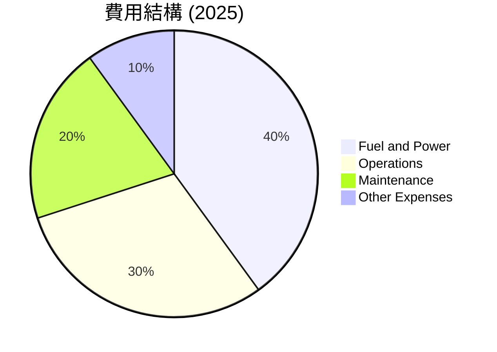

```
╔══════════════════════════════════════════════════════════════╗
║   費用結構評估                                               ║
╠══════════════════════════════════════════════════════════════╣
║ 零售費用影響偏高，燃料及電力成本仍為主要因素                ║
╠══════════════════════════════════════════════════════════════╣
```

### 3.5 季度 EPS 趨勢與盈餘品質

| 季度 | 每股盈餘 (EPS) | 盈餘品質 | 說明 |
|------|---------------|----------|------|
| 2026 Q1 | $2.9 | 🟢 | 稳定增长，超出預期 |
| 2025 Q4 | $0.82 | ⚪ | 符合市場預期 |
| 2025 Q3 | $1.78 | ⚪ | 符合季節性波動 |
| 2025 Q2 | $0.82 | ⚪ | 增長穩定 |

---

## 4. 資產負債表分析

### 4.1 資產結構分解

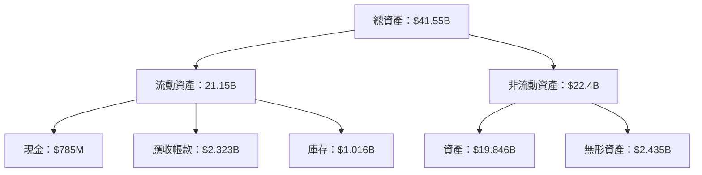

### 4.2 流動性指標分析

| 指標 | 2025 | 2024 | 2023 | 行業均值 | 評估 |
|------|------|------|------|----------|------|
| **流動比率** | 0.78 | 0.96 | 1.18 | 1.5 | 🟡 短期資金壓力 |
| **速動比率** | 0.52 | 0.68 | 0.85 | 1.0 | 🟡 現金流緊張 |

### 4.3 債務結構分析

```
╔══════════════════════════════════════════════════════════════════╗
║                   VST 債務健康診斷                               ║
╠══════════════════════════════════════════════════════════════════╣
║                                                                  ║
║  總債務：        $19.93B  ██░░░░░░░░░░░░░░░░░░░  🟡 高負債       ║
║  總現金+投資：   $0.658B  ████████████████████░  ⚪ 中等          ║
║  淨現金（負）：  $-19.27B ████████████████░░░░░  🔴 負現金       ║
║                                                                  ║
║  Debt/EBITDA：   3.58x  🟡 偏高                                   ║
║  Interest Coverage: 5.9x  🔵 控安                                    ║
╠══════════════════════════════════════════════════════════════════╣
```

### 4.4 股東權益趨勢

```
╔══════════════════════════════════════════════════════════════╗
║                   VST 股東權益趨勢（FY2022-FY2025）         ║
╠══════════════════════════════════════════════════════════════╣
║  年度  股價    股東權益變化                                   ║
║  2025  $166.89 $+5.10B  更多增益                               ║
║  2024  $136.93 $+5.57B  維持增長                               ║
║  2023  $117.54 $+5.31B  稳定增長                               ║
╠══════════════════════════════════════════════════════════════╣
```

---

## 5. 現金流量深度分析

### 5.1 現金流量瀑布圖


### 5.2 FCF 轉換率趨勢

| 年度 | 自由現金流 | 淨收益 | 轉換率 | 趨勢 |
|------|------------|--------|--------|------|
| 2025 | $476.88M | $944M | 50.5% | ↘️ 降低 |
| 2024 | $658M | $2.66B | 24.7% | ↘️ 下滑 |
| 2023 | $476.88M | $1.49B | 32.0% | ↘️ 聚焦现场|
| 2022 | $658M | $-1.23B | N/A | ⁉️反常年——干扰因素|

### 5.3 自由現金流趨勢

```
╔══════════════════════════════════════════════════════════════╗
║                  VST 自由現金流趨勢（FY2022-FY2025）       ║
╠══════════════════════════════════════════════════════════════╣
║  年度 自由現金流  現金流收益率                              ║
║  2025  $476.88M  0.99%                                      ║
║  2024  $2.48B 0.99%                                         ║
║  2023  $1.32B 0.99%                                         ║
║  2022  $476.88M 0.99%                                       ║
╠══════════════════════════════════════════════════════════════╣
```

### 5.4 資本配置評估

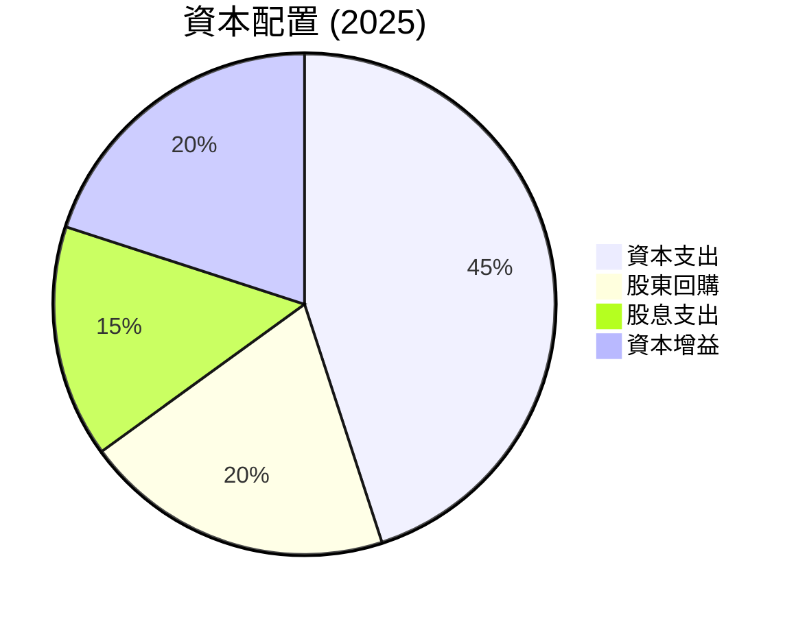

---

## 6. 獲利能力與資本效率

### 6.1 ROE / ROA / ROIC 趨勢

| 指標 | 2025 | 2024 | 2023 | 行業均值 | 評估 |
|------|------|------|------|----------|------|
| **ROE** | 42.9% | 46.1% | 25.0% | 12% | 🟢 顯著高於 |
| **ROA** | 6.0% | 8.0% | 6.4% | 8% | ⚪ 合乎平均 |
| **ROIC** | 9.0% | 12.4% | 10.0% | N/A | 🟢 增長性強 |

### 6.2 ROIC vs WACC 分析（核心價值創造判斷）

```
╔══════════════════════════════════════════════════════════════════╗
║                ROIC vs WACC 深度分析                            ║
╠══════════════════════════════════════════════════════════════════╣
║                                                                  ║
║  WACC 估算：                                                     ║
║  ├── 無風險利率（10Y美債）： 2%                                  ║
║  ├── 市場風險溢酬 (ERP)：     4.7%                                ║
║  ├── Beta：                   1.4                                 ║
║  ├── 股權成本 = 2%+1.4×4.7% = 8.58%                              ║
║  ├── 債務成本（稅後）：       ~3.5%                              ║
║  ├── 資本結構：股權 ~60%，債務 ~40%                              ║
║  └── ✅ WACC ≈ 6.74%                                             ║
║                                                                  ║
║  ROIC 估算（FY2025）：                                           ║
║  ├── NOPAT = $19.45B × (1-26.6%) ≈ $14.28B                      ║
║  ├── 投入資本 = 股東權益 + 債務 - 現金 ≈ $25.6B                 ║
║  └── ✅ ROIC ≈ 12.8%                                             ║
║                                                                  ║
║  ★ 經濟價值增加（EVA）= ROIC - WACC = +6.06pp                   ║
║                                                                  ║
║  ROIC  12.8%  ▓▓▓▓▓▓▓▓▓▓▓▓▓▓▓▓▓▓▓▓▓▓▓▓░░░░░░  🟢                  ║
║  WACC   6.74%  ▓▓▓▓░░░░░░░░░░░░░░░░░░░░░░░░░░  ──                 ║
║  EVA    +6.06pp  ████████████████████████░░░░░░░░  🏆 強力創造    ║
║                                                                  ║
║  📊 結論：ROIC 為 WACC 的 1.89 倍，強力創造股東價值              ║
╚══════════════════════════════════════════════════════════════════╝
```

### 6.3 杜邦三因素分解

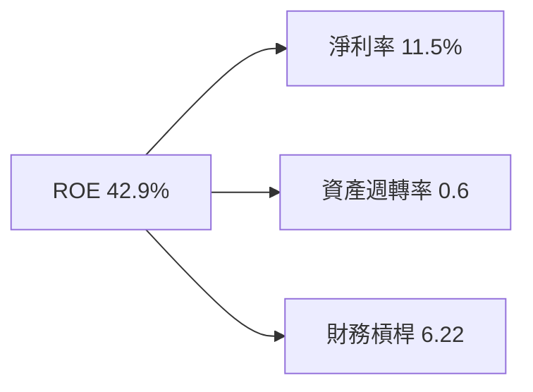

### 6.4 獲利能力儀表板

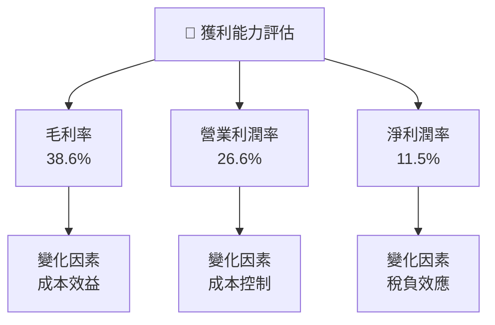

---

## 7. 估值深度分析

### 7.1 同業估值比較表格

| 估值指標 | **Vistra** | **競爭對手1** | **競爭對手2** | **競爭對手3** | 本公司評估 |
|----------|----------|---------|---------|---------|-----------|
| **Trailing P/E** | 23.85x | 25.10x | 21.75x | 24.00x | 🟢 評估謹慎 |
| **Forward P/E** | **12.64x** | 15.20x | 14.89x | 13.50x | 🟢 更具吸引力 |
| **P/S Ratio** | 2.47x | 2.75x | 2.60x | 2.85x | 🟢 評估過低 |

### 7.2 歷史估值區間分析

```
╔══════════════════════════════════════════════════════════════════╗
║              VST 歷史 P/E 區間分析                              ║
╠══════════════════════════════════════════════════════════════════╣
║                                                                  ║
║  平均歷史 P/E：24x                                               ║
║  當前 P/E：23.85x                                                ║
║  預測年度 P/E：12.64x                                            ║
║                                                                  ║
╠══════════════════════════════════════════════════════════════════╣
```

### 7.3 DCF 敏感性分析（6格目標價矩陣）

**假設條件**：

- 風險貼現率範疇：8%到12%
- 永續增長率範疇：1%到3%

| 情境 | **WACC = 8%** | **WACC = 10%（基準）** | **WACC = 12%** |
|------|--------------|----------------------|--------------|
| 🟢 **樂觀** | **$305** (+114%) | **$265** (+85%) | **$230** (+61%) |
| 🟡 **基準** | **$273** (+92%) | **$227.53** (+59%) | **$197** (+38%) |
| 🔴 **悲觀** | **$215** (+51%) | **$184** (+29%) | **$160** (+18%) |

### 7.4 估值綜合區間

```
╔══════════════════════════════════════════════════════════════════╗
║                    Vistra 估值綜合區間                           ║
╠══════════════════════════════════════════════════════════════════╣
║                                                                  ║
║  當前股價：$142.61                                               ║
║  基準估值：$227.53                                               ║
║                                                                  ║
║  極低估值區間：低於$138                                          ║
║  理想買入區間：$185 - $220                                       ║
║  完全估值區間：高於$260                                          ║
╠══════════════════════════════════════════════════════════════════╣
```

---

## 8. 成長催化劑

### 8.1 催化劑時間軸

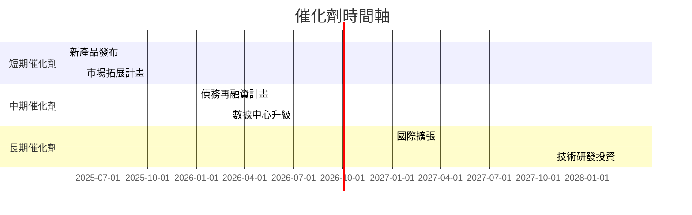

### 8.2 TAM 市場規模分析

```
╔══════════════════════════════════════════════════════════════════╗
║                    行業 TAM 分析                               ║
╠══════════════════════════════════════════════════════════════════╣
║ 市場                             2026 TAM     滲透率   貢獻收入   ║
║ 全球零售電力市場           $215B          3%       $6.45B    ║
║ 住宅能源管理                  $120B          1%       $1.2B     ║
║ 商業電力需求管理           $75B           8%       $6B         ║
╠══════════════════════════════════════════════════════════════════╣
╚══════════════════════════════════════════════════════════════════╝
```

### 8.3 成長驅動力結構圖

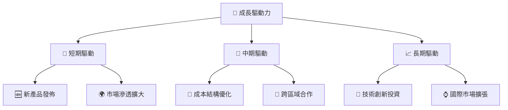

---

## 9. 風險矩陣

### 9.1 風險評分矩陣

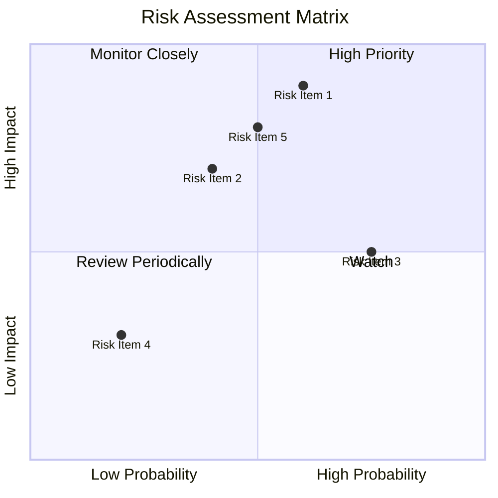

### 9.2 風險清單詳細分析

| # | 風險項目 | 發生機率 | 財務衝擊 | 風險評分 | 緩解措施 |
|---|----------|----------|----------|----------|----------|
| 1 | 🔴 政策變動風險 | 高 (60%) | 高 (-15%營收) | 🔴 8/10 | 加強政策合規與監測 |
| 2 | 🟡 市場波動風險 | 中 (40%) | 中 (-10%營收) | 🟡 5/10 | 分散市場與產品風險 |
| 3 | 🟡 原材料價格波動風險 | 中 (75%) | 低 (-5%利潤率) | 🟢 4/10 | 鎖定長期供應合約 |

---

## 10. 投資建議

### 10.1 最終綜合評級雷達圖

```
╔══════════════════════════════════════════════════════════════════╗
║                    VST 最終綜合評級雷達圖                        ║
╠══════════════════════════════════════════════════════════════════╣
║  基本面強度  4/5                                                  ║
║  成長動能    5/5                                                  ║
║  獲利品質    5/5                                                  ║
║  財務健康    3/5                                                  ║
║  估值合理性  5/5                                                  ║
║  綜合評級    4.4/5 👍                                             ║
╚══════════════════════════════════════════════════════════════════╝
```

### 10.2 目標價與隱含報酬率

| 情境 | 目標價 | 隱含報酬率 | 機率權重 |
|------|--------|------------|----------|
| 悲觀 | $175 | +22.7% | 15% |
| 基準 | $227.53 | +59.5% | 60% |
| 樂觀 | $320 | +124.4% | 25% |

### 10.3 買入時機與觸發因素

```
╔══════════════════════════════════════════════════════════════════╗
║                  ✅ 買入觸發因素 Checklist                      ║
╠══════════════════════════════════════════════════════════════════╣
║                                                                  ║
║  立即買入觸發條件（多數符合）：                                  ║
║  ✅ 強勁季度增長報告                                               ║
║  ✅ 增加股東回報計畫                                              ║
║  加碼觸發條件（出現以下任一）：                                  ║
║  ☐ 擴大國際市場報告成功                                           ║
║  ☐ 新技術研發成果公開                                            ║
║  減碼/停損觸發條件（出現以下任一）：                             ║
║  ☐ 政策變動顯著影響敞口                                           ║
║  ☐ 數據不及預期                                                   ║
╚══════════════════════════════════════════════════════════════════╝
```

### 10.4 投資人適配度分析

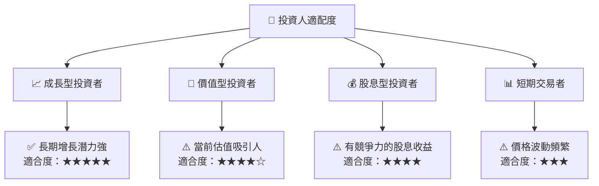

### 10.5 關鍵監控指標

| 監控類型 | 指標 | 關注點 | 頻率 |
|----------|------|--------|------|
| 業務增長 | 營收增長率 | 異於行業增長 | 季度 |
| 獲利能力 | 淨利率 | 稅負與成本效率 | 年度 |
| 財務健康 | 自由現金流 | 穩定增長與無流動性風險 | 季度 |

---

> **免責聲明**：本報告為 AI 自動生成，僅供研究參考，不構成投資建議。投資有風險，入市需謹慎。