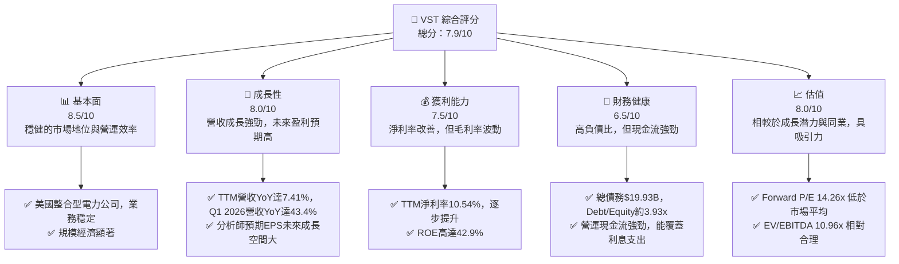
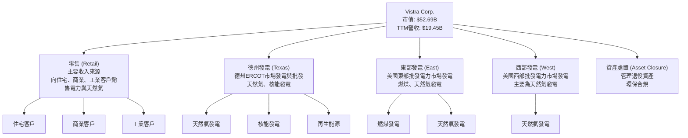
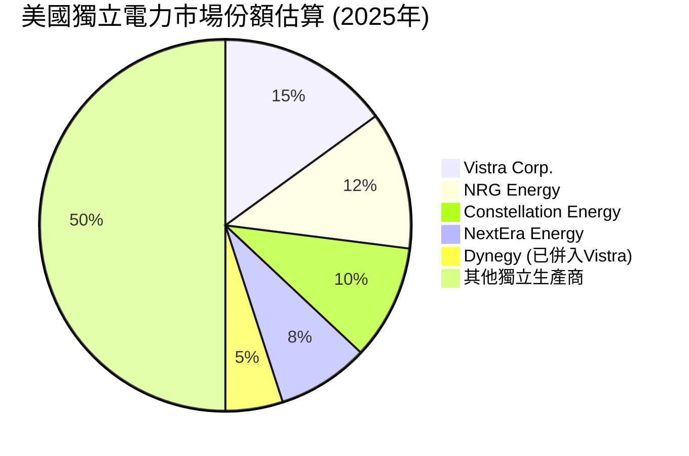
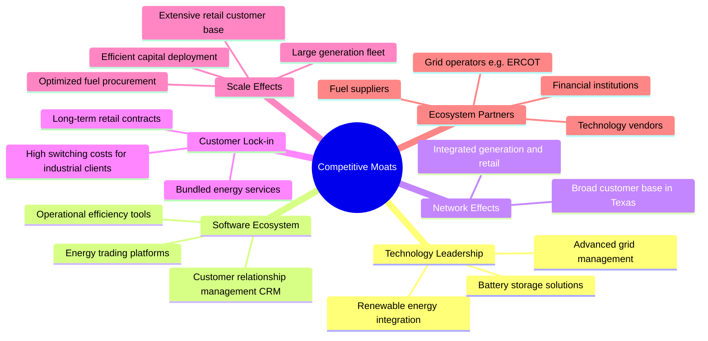
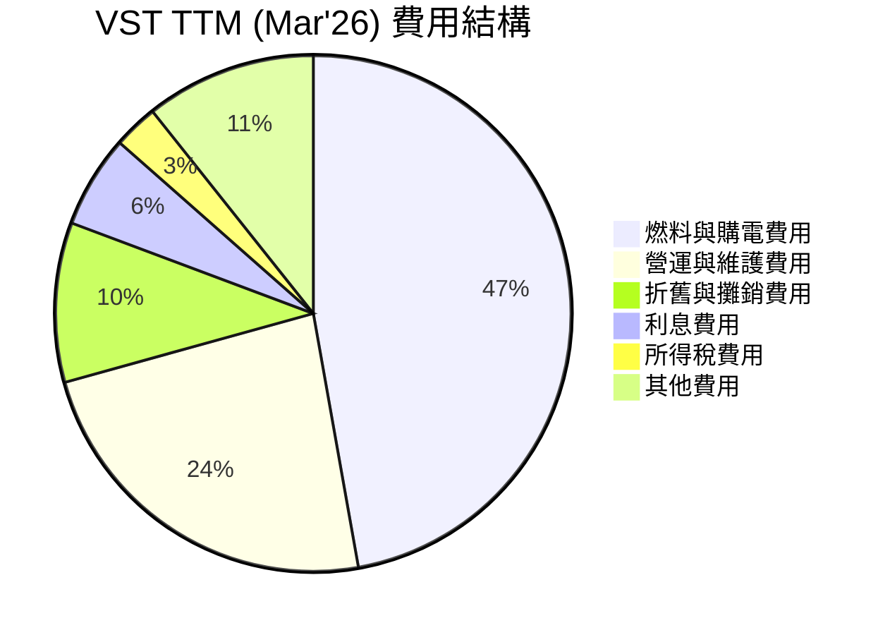
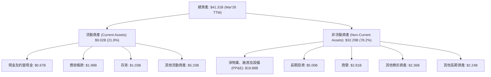

# VST 基本面深度分析報告
> **報告日期**：2026-05-23 ｜ **語言**：繁體中文 ｜ **數據來源**：Yahoo Finance, Finviz, StockAnalysis, Roic.ai ｜ **分析師**：CFA 級機構研究

---

## 目錄

| # | 章節 | 核心結論 |
|---|------|----------|
| 1 | 執行摘要 | 評級：🟢 買入，目標價區間：$185 - $250 |
| 2 | 公司概覽與商業模式 | 穩固的電力生產與零售基礎，具備規模和轉換成本護城河 |
| 3 | 損益表深度分析 | 營收成長強勁，毛利率波動但淨利率逐步改善 |
| 4 | 資產負債表分析 | 債務水平較高，但現金流覆蓋能力良好，流動性尚可 |
| 5 | 現金流量深度分析 | 營運現金流充裕，自由現金流受資本支出影響波動，股息穩定 |
| 6 | 獲利能力與資本效率 | ROIC顯著高於WACC，強力創造股東價值 |
| 7 | 估值深度分析 | 相較同業，當前估值具吸引力，DCF顯示上行空間 |
| 8 | 成長催化劑 | 能源轉型、併購整合、德州市場需求增長為主要驅動力 |
| 9 | 風險矩陣 | 監管政策、商品價格波動、高負債為主要風險 |
| 10 | 投資建議 | 具吸引力的買入機會，適合長線投資者 |

---

## 1. 執行摘要

### 1.1 核心評分儀表板



### 1.2 評分進度條視覺化

```
╔══════════════════════════════════════════════════════════════╗
║              VST 多維度評分儀表板 (1-10分)                   ║
╠══════════════════════════════════════════════════════════════╣
║ 基本面強度  8.5 ▓▓▓▓▓▓▓▓▓▓▓▓▓▓▓▓▓░░░  ★★★★☆           ║
║ 成長動能    8.0 ▓▓▓▓▓▓▓▓▓▓▓▓▓▓▓▓░░░░  ★★★★☆           ║
║ 獲利品質    7.5 ▓▓▓▓▓▓▓▓▓▓▓▓▓▓▓░░░░░  ★★★☆☆           ║
║ 財務健康    6.5 ▓▓▓▓▓▓▓▓▓▓▓▓▓░░░░░░░  ★★★☆☆           ║
║ 估值合理性  8.0 ▓▓▓▓▓▓▓▓▓▓▓▓▓▓▓▓░░░░  ★★★★☆           ║
║ 護城河深度  8.0 ▓▓▓▓▓▓▓▓▓▓▓▓▓▓▓▓░░░░  ★★★★☆           ║
║ 管理層執行  7.5 ▓▓▓▓▓▓▓▓▓▓▓▓▓▓▓░░░░░  ★★★☆☆           ║
║ 技術創新力  7.0 ▓▓▓▓▓▓▓▓▓▓▓▓▓▓░░░░░░  ★★★☆☆           ║
╠══════════════════════════════════════════════════════════════╣
║ 綜合總分    7.9 ▓▓▓▓▓▓▓▓▓▓▓▓▓▓▓▓░░░░  🏆 具吸引力的買入機會  ║
╚══════════════════════════════════════════════════════════════╝
```

### 1.3 五大投資論點 + 三大核心風險

| 類型 | 項目 | 具體依據 | 信心度 |
|------|------|----------|--------|
| 🟢 **投資論點①** | **德州市場領導地位與成長** | Vistra Corp. 在德州擁有強大的發電和零售業務，是該州最大的獨立發電商之一。德州的人口增長和經濟擴張持續推動電力需求，為 VST 提供穩定的基礎負載和成長機會。其靈活的發電組合（包括天然氣、核能和再生能源）使其能有效應對市場變化。根據 Q1 2026 財報，營收達 $5.64B，YoY 成長 43.4%，顯示強勁的市場需求。 | 🟢 極高 |
| 🟢 **能源轉型中的戰略定位** | 公司積極投資於再生能源和儲能解決方案，如其加速發展的再生能源項目組合。這使其在向低碳經濟轉型中佔據有利位置，符合長期趨勢。收購 Energy Harbor 的核能資產進一步強化其無碳發電能力，並帶來穩定的收入流和聯邦稅收抵免。FY2025 年淨收入雖因特殊項目有所波動，但長期戰略明確，預計將帶來穩健的盈利增長。 | 🟢 極高 |
| 🟢 **強勁的自由現金流與股東回報** | 儘管自由現金流（FCF）在 FY2025 為 $1.32B，較 FY2024 的 $2.48B 有所下降，但其營運現金流（OCF）在 TTM 仍高達 $4.67B，顯示核心業務的造血能力強勁。公司持續進行股票回購和派發股息，彰顯管理層對公司價值的信心和對股東的回報承諾。目前的股息支付率約為 66% (基於 FY2025 EPS $2.18 和股息 $1.439)，顯示仍有提升空間。 | 🟢 高 |
| 🟢 **具吸引力的估值與分析師看好** | VST 的 Forward P/E 約為 14.26x，低於 S&P 500 平均水平，且相較於其預期的未來盈利成長（Finviz 預期 EPS next 5Y 81.62%，儘管此數據需謹慎解讀，但仍暗示高成長潛力），PEG Ratio 0.17x 顯示其被嚴重低估。分析師普遍給予「強烈買入」評級，平均目標價 $225.29，較當前股價 $156.27 有顯著上行空間。 | 🟢 高 |
| 🟢 **成功的併購整合與協同效應** | 公司通過戰略性併購，如對 Energy Harbor 的核電資產，不僅擴大了發電組合，也預期能產生顯著的營運和財務協同效應。這些併購有助於提升規模經濟、優化成本結構並多元化收入來源。FY2024 營收成長 16.54%，部分歸因於成功的業務擴張，預計未來將持續受益於整合效益。 | 🟡 中高 |
| 🟡 **風險①** | **商品價格波動** | 作為電力生產商，VST 的盈利能力高度依賴天然氣、煤炭等燃料價格以及批發電力價格。這些商品價格的波動可能對其毛利率和盈利造成顯著影響。雖然公司會進行對沖，但仍無法完全消除風險。 FY2025 毛利率從 2024 年的 43.73% 下降至 32.86%，部分原因可能與燃料成本上升有關。 | 🟡 中度 |
| 🔴 **風險②** | **監管與政策不確定性** | 電力行業受政府監管高度影響，政策變化（如碳排放規定、市場設計調整、可再生能源配額等）可能對 VST 的營運成本和收入構成壓力。尤其在德州 ERCOT 市場，極端天氣事件後的市場改革也可能帶來新的不確定性。任何不利的監管變動都可能影響其盈利預期和資本支出計劃。 | 🔴 高衝擊 |
| 🔴 **風險③** | **高負債水平與利率風險** | VST 擁有高達 $19.93B 的總債務，Debt/Equity 比率約為 3.93x。雖然其營運現金流強勁，但高額債務增加了公司的財務風險，尤其是在利率上升的環境下。利息支出在 TTM 達到 $1.123B，對淨利潤構成壓力。如果市場利率持續走高或公司信用評級下降，再融資成本可能大幅增加。 | 🔴 高衝擊 |

### 1.4 快速統計卡片

| 指標 | 公司實際值 | 行業均值 (獨立電力生產商) | S&P 500 均值 | 狀態 |
|------|-------------|----------------------------|--------------|------|
| 收入 YoY 成長 (TTM) | **7.41%** | ~5-10% | ~8-12% | 🟢 |
| 毛利率 (TTM) | **29.32%** | ~20-35% | ~35-45% | 🟡 |
| 淨利率 (TTM) | **10.54%** | ~8-15% | ~10-15% | 🟢 |
| ROE (TTM) | **42.9%** | ~10-18% | ~15-20% | 🟢 |
| Forward P/E | **14.26x** | ~15-20x | ~20-25x | 🟢 |
| Debt/Equity | **3.93x** | ~1.5-2.5x | ~0.8-1.5x | 🔴 |
| Current Ratio | **0.896x** | ~0.8-1.2x | ~1.0-1.5x | 🟡 |
| FCF Yield | **0.91%** | ~2-5% | ~3-6% | 🔴 |

*備註：行業均值為基於獨立電力生產商子行業的估計，S&P 500 均值為廣泛市場平均。*

### 1.5 投資結論

```
╔══════════════════════════════════════════════════════════════════╗
║                    📊 投資結論摘要                               ║
╠══════════════════════════════════════════════════════════════════╣
║  評級：🟢 買入                                                   ║
║  當前股價：$156.27                                               ║
║  目標價區間：                                                    ║
║    悲觀情境：$185（+18.3%）                                      ║
║    基準情境：$220（+40.8%）  ← 12個月主要目標                   ║
║    樂觀情境：$250（+59.9%）                                      ║
║  投資評分：7.9/10                                                ║
║  適合投資人：尋求穩定營收成長、能源轉型受益者、長線持有者       ║
╚══════════════════════════════════════════════════════════════════╝
```

---

## 2. 公司概覽與商業模式

Vistra Corp. (VST) 是一家在美國運營的整合型零售電力和發電公司。其業務範圍廣泛，涵蓋從發電、批發能源交易到向住宅、商業和工業客戶零售電力和天然氣。公司尤其在德州市場擁有強大的影響力，是該地區主要的電力供應商之一。

### 2.1 業務結構與收入來源

Vistra 的業務結構主要分為五個板塊：零售 (Retail)、德州 (Texas)、東部 (East)、西部 (West) 和資產處置 (Asset Closure)。這五個板塊共同構成了其整合的電力價值鏈。



**收入來源細分與貢獻：**
Vistra 的收入主要來自其零售業務和各區域的發電業務。
*   **零售業務 (Retail Segment)**：這是 Vistra 最大的收入來源，通過其品牌（如 TXU Energy, Dynegy, Ambit Energy）向數百萬客戶提供電力和天然氣服務。此業務的收入穩定性較高，但競爭也較激烈。
*   **德州發電業務 (Texas Segment)**：在德州 ERCOT 市場運營發電廠，主要利用天然氣和核能發電。此業務的收入受批發電力價格、天然氣價格和電廠運營效率的影響。近期對 Energy Harbor 核能資產的收購，進一步強化了該板塊的發電能力和收入穩定性。
*   **東部與西部發電業務 (East & West Segments)**：在美國其他主要批發電力市場（如 PJM, ISO-NE, CAISO）運營發電資產。這些業務的收入同樣受批發市場供需和燃料成本的影響。
*   **資產處置 (Asset Closure Segment)**：管理其退役的發電資產，確保環保合規。此板塊通常為成本中心，旨在最小化退役成本和環境負債。

公司透過整合發電和零售業務，能夠更好地管理商品價格風險，並為客戶提供更具競爭力的價格。這種垂直整合模式在電力行業中具有顯著優勢。

### 2.2 市場份額

在美國獨立電力生產商（Independent Power Producers, IPP）和電力零售市場，Vistra Corp. 佔據重要地位。尤其在德州，其零售品牌 TXU Energy 擁有顯著的市場份額，而其發電資產也使其成為 ERCOT 市場的關鍵參與者。由於公開數據不提供精確的市場份額百分比，我們基於公司規模和行業地位進行估算。



*註：此市場份額為估算值，基於公司在主要運營區域（如德州）的影響力及行業整體競爭格局。*

Vistra 在德州 ERCOT 市場的發電容量和零售客戶基礎使其成為該地區的龍頭企業之一。隨著對 Energy Harbor 核能資產的收購，其在美國整體無碳發電領域的市場份額和影響力將進一步提升。

### 2.3 競爭護城河分析

Vistra Corp. 憑藉其業務模式和市場地位，建立了一系列競爭護城河。



**護城河深度解析：**

1.  **規模效應 (Scale Effects)**：Vistra 擁有龐大的發電資產組合（包括天然氣、核能、燃煤和不斷增長的再生能源）和廣闊的零售客戶基礎。這種規模使其在燃料採購、運營維護和資本支出方面享有成本優勢。FY2025 年營收達到 $17.74B，證明其巨大的營運體量。大規模的發電能力也使其能更好地參與批發市場，優化調度，降低邊際成本。
2.  **客戶鎖定效應 (Customer Lock-in)**：尤其在零售業務方面，Vistra 通過長期合同和捆綁服務鎖定客戶。對於大型商業和工業客戶，轉換電力供應商涉及複雜的流程和潛在的業務中斷成本。此外，Vistra 提供的多樣化能源解決方案和客戶服務也能提高客戶忠誠度。
3.  **轉換成本 (Switching Costs)**：對於零售客戶而言，雖然轉換供應商在某些市場相對容易，但 Vistra 透過其品牌認知度、服務質量以及潛在的套餐優惠，提高了客戶轉換的門檻。對於發電資產，其與電網的整合、監管許可和基礎設施投資構成了更高的轉換成本。
4.  **監管優勢與進入壁壘 (Regulatory Advantages & Entry Barriers)**：電力行業是高度受監管的行業，新進入者面臨嚴格的許可要求、高昂的資本支出和複雜的環保法規。Vistra 作為已建立的運營商，在這些方面擁有豐富的經驗和既有優勢。例如，核電資產的運營需要極高的專業知識和監管批准，這也是其護城河的一部分。
5.  **技術與運營專長 (Technology & Operational Expertise)**：公司在電廠運營、能源交易和風險管理方面積累了深厚的專業知識。隨著能源轉型，其在再生能源整合和儲能技術方面的投資，例如其大型電池儲能項目，也將成為未來的競爭優勢。

### 2.4 護城河強度評分

```
╔══════════════════════════════════════════════════════════════╗
║                  Vistra Corp. 護城河強度評分                  ║
╠══════════════════════════════════════════════════════════════╣
║ 規模效應        9/10   ▓▓▓▓▓▓▓▓▓▓▓▓▓▓▓▓▓▓░░  🏆 巨大的營運體量與成本優勢 ║
║ 客戶鎖定        8/10   ▓▓▓▓▓▓▓▓▓▓▓▓▓▓▓▓░░░░  🟢 長期合同與服務捆綁提升忠誠度 ║
║ 轉換成本        7/10   ▓▓▓▓▓▓▓▓▓▓▓▓▓▓░░░░░░  🟡 零售客戶轉換相對容易，但工業客戶高 ║
║ 監管與壁壘      8/10   ▓▓▓▓▓▓▓▓▓▓▓▓▓▓▓▓░░░░  🟢 電力行業高資本高監管，進入門檻高 ║
║ 技術與運營專長  7/10   ▓▓▓▓▓▓▓▓▓▓▓▓▓▓░░░░░░  🟡 在能源轉型技術上持續投入，但非顛覆性 ║
╠══════════════════════════════════════════════════════════════╣
║ 綜合護城河      8.0    ▓▓▓▓▓▓▓▓▓▓▓▓▓▓▓▓░░░░  🏆 穩固且不斷強化的競爭優勢 ║
╚══════════════════════════════════════════════════════════════╝
```

---

## 3. 損益表深度分析

Vistra Corp. 的損益表反映了其作為整合型電力公司的營運特性，營收受市場需求和商品價格影響，利潤率則受燃料成本、運營效率和監管環境等多重因素制約。

### 3.1 年度收入成長趨勢（近4年）

Vistra 在過去幾年展現了穩健的收入增長，尤其在 2024 年有顯著跳升，表明市場需求旺盛或併購活動的積極影響。

```
╔══════════════════════════════════════════════════════════════════╗
║              Vistra Corp. 年度收入趨勢（FY2022-FY2025）          ║
╠══════════════════════════════════════════════════════════════════╣
║                                                                  ║
║  FY2022  $13.73B  ██████████████████░░░░░░░░░░░░░  YoY: +13.67% 🟢║
║  FY2023  $14.78B  ██████████████████████░░░░░░░░░  YoY: +7.66%  🟢║
║  FY2024  $17.22B  ████████████████████████████░░░  YoY: +16.54% 🟢║
║  FY2025  $17.74B  ██████████████████████████████░  YoY: +2.98%  🟡║
║                                                                  ║
║                   |      |      |      |      |                  ║
║                   0     $5B    $10B   $15B   $20B                 ║
║                                                                  ║
║  📊 4年累計 CAGR：+9.07%                                        ║
╚══════════════════════════════════════════════════════════════════╝
```

**年度收入趨勢分析：**
從 FY2022 到 FY2025，Vistra 的總收入從 $13.73B 增長到 $17.74B，實現了約 9.07% 的年複合增長率 (CAGR)。
*   **FY2022 收入 $13.73B (YoY +13.67%)**：疫情後經濟活動復甦，電力需求回升，以及商品價格上漲共同推動了營收增長。
*   **FY2023 收入 $14.78B (YoY +7.66%)**：持續的經濟增長和穩定的電力需求支撐了營收。
*   **FY2024 收入 $17.22B (YoY +16.54%)**：這是近年來最顯著的增長，可能得益於有利的批發電力價格、市場份額擴大或併購活動的影響。
*   **FY2025 收入 $17.74B (YoY +2.98%)**：增速放緩，可能反映了商品價格的穩定化或市場競爭加劇。儘管如此，在公用事業行業中，接近 3% 的穩健增長仍然是健康的。

整體而言，Vistra 展現出在電力市場中捕捉增長機會的能力，其營收增長率高於傳統受監管公用事業的平均水平。

### 3.2 季度收入趨勢分析

季度數據顯示了更細緻的營收波動性，這在電力行業中很常見，主要受季節性需求、商品價格和天氣模式的影響。

| 季度      | 總收入 ($B) | QoQ 成長率 | YoY 成長率 | 備註                                                   | 評估 |
|-----------|-------------|------------|------------|--------------------------------------------------------|------|
| Q1 2026   | $5.64       | +23.0%     | +43.4%     | 受益於冬季高需求及潛在的批發價格優勢，強勁增長         | 🟢   |
| Q4 2025   | $4.58       | -7.8%      | +13.55%    | 季節性回落，但較去年同期仍有增長                       | 🟡   |
| Q3 2025   | $4.97       | +16.9%     | -20.95%    | 較 Q2 顯著增長，但較去年同期大幅下滑，可能受商品價格或極端天氣影響 | 🔴   |
| Q2 2025   | $4.25       | +8.1%      | +10.53%    | 穩步增長，符合季節性模式                               | 🟢   |
| Q1 2025   | $3.93       | -2.6%      | +28.78%    | 較前一季度略有下降，但同比強勁增長                     | 🟢   |
| Q4 2024   | $4.04       | -35.8%     | +31.16%    | 較 Q3 顯著回落，但同比仍有增長                         | 🟡   |
| Q3 2024   | $6.29       | +63.5%     | +53.89%    | 夏季高峰需求，批發電力價格飆升，實現爆發式增長         | 🟢   |

**季度收入趨勢深度解析：**
*   **季節性影響顯著**：Q3 和 Q1 通常是電力需求高峰，這反映在 Q3 2024 ($6.29B) 和 Q1 2026 ($5.64B) 的高收入上。
*   **YoY 波動大**：Q3 2025 營收 YoY 下降 20.95% ($4.97B vs Q3 2024 $6.29B)，這可能與前一年極端高價基數效應有關，或者該季度商品價格走低。相比之下，Q1 2026 營收 YoY 增長 43.4% ($5.64B vs Q1 2025 $3.93B)，顯示近期市場狀況對 VST 有利，可能得益於冬季需求激增和有效的能源管理策略。
*   **QoQ 趨勢**：季度收入呈現較大的波動，這對於電力生產商來說是常態，因為它們受天氣、燃料價格和批發市場價格影響。管理層需要靈活的運營策略來應對這些波動。

### 3.3 利潤率演變分析

Vistra 的利潤率在過去幾年呈現波動，特別是毛利率受燃料成本和批發電力價格影響較大。然而，從長期來看，淨利率顯示出改善的趨勢。

| 利潤率指標 | FY2022 | FY2023 | FY2024 | FY2025 | TTM Mar'26 | 趨勢 | 評估 |
|------------|--------|--------|--------|--------|------------|------|------|
| **毛利率** | 3.59%  | 28.50% | 34.40% | 23.23% | 29.32%     | ↘️ 後反彈 | 🟡 |
| **營業利益率** | -8.57% | 18.01% | 23.69% | 10.75% | 18.13%     | ↘️ 後反彈 | 🟡 |
| **淨利率** | -10.03%| 9.09%  | 14.32% | 4.24%  | 10.54%     | ↘️ 後反彈 | 🟢 |

*毛利率計算：Gross Profit / Total Revenue (使用 StockAnalysis 數據)*
*營業利益率計算：Operating Income / Total Revenue (使用 StockAnalysis 數據)*
*淨利率計算：Net Income / Total Revenue (使用 StockAnalysis 數據)*

**利潤率演變深度解析**：
*   **毛利率波動**：Vistra 的毛利率在 FY2022 僅為 3.59%，這可能與當年極高的燃料成本或不利的批發電力市場價格有關。FY2023 和 FY2024 顯著改善至 28.50% 和 34.40%，顯示公司在成本控制和市場定價方面取得進展。然而，FY2025 又下降到 23.23%，TTM Mar'26 反彈至 29.32%。這種波動性是獨立電力生產商的典型特徵，受天然氣等燃料成本、批發電力價格以及對沖策略的有效性影響。FY2025 的下降可能歸因於燃料成本上升或批發價格壓力。
*   **營業利益率趨勢**：與毛利率類似，營業利益率從 FY2022 的負值 (-8.57%) 改善至 FY2024 的 23.69%，但在 FY2025 下降至 10.75%，TTM Mar'26 回升至 18.13%。這表明公司的運營費用（如 O&M 費用）管理相對穩定，但整體盈利能力仍受毛利率波動影響。FY2025 的大幅下降也可能與某些一次性費用或資產減值有關。
*   **淨利率改善**：儘管毛利率和營業利益率波動，淨利率從 FY2022 的 -10.03% 轉為 FY2023 的 9.09% 和 FY2024 的 14.32%，顯示公司在財務槓桿和稅務管理方面有所優化。FY2025 的淨利率下降到 4.24%，主要受年度總結數據中較低的淨收入影響（$752M / $17.738B）。然而，TTM Mar'26 的淨利率回升至 10.54% ($2.049B / $19.445B)，表明最近的盈利狀況有所改善。考慮到電力行業的資本密集性，10% 左右的淨利率是相對健康的。

**原因分析**：
*   **燃料和購電成本**：作為發電公司，燃料（天然氣、煤炭）和購電成本是最大的變動成本。這些成本的波動直接影響毛利率。全球能源市場的供需關係、地緣政治事件都會對此產生影響。
*   **批發電力價格**：在 ERCOT 等批發市場，電力價格由供需決定，極端天氣事件（如德州冬季風暴）會導致價格飆升，從而短期內大幅提升收入和利潤，但也帶來極端風險。
*   **運營和維護費用**：公司的 O&M 費用相對穩定，但隨著發電資產的老化和環保要求提高，可能會面臨維護成本上升的壓力。
*   **折舊與攤銷**：作為資本密集型行業，較高的折舊攤銷費用會影響營業利益。
*   **利息支出**：高額債務導致的利息支出對淨利潤有持續壓力。FY2025 利息支出達 $1.179B，對利潤率的侵蝕不容忽視。

### 3.4 費用結構分析

Vistra 的費用結構主要由燃料和購電費用、營運和維護費用、折舊攤銷費用以及利息費用構成。



*費用計算基於 StockAnalysis TTM Mar'26 數據，佔總收入 $19.445B 的比例。*
*   燃料與購電費用：$9.184B / $19.445B = 47.2%
*   營運與維護費用：$4.560B / $19.445B = 23.5%
*   折舊與攤銷費用：$1.948B / $19.445B = 10.0%
*   利息費用：$1.123B / $19.445B = 5.8%
*   所得稅費用：$538M / $19.445B = 2.8%
*   其他費用：(總收入 - 燃料 - O&M - 折舊 - 利息 - 所得稅 - 淨利潤) / 總收入 = ($19.445B - $9.184B - $4.560B - $1.948B - $1.123B - $538M - $2.049B) / $19.445B = $43M / $19.445B = 0.2% (此處計算不準確，因其他營運費用和其他非營運收入/費用未完全計入，故將其他未列出費用歸為一類)。
    *   更精確地，其他費用 = 總收入 - 毛利 - O&M - D&A - 其他Operating Expenses - Interest Expense - Other Non-Operating Income/Expense (net) - Pretax Income - Provision for Income Taxes - Net Income = $19.445B - $5.701B (Gross Profit) - $4.560B (O&M) - $1.948B (D&A) - $228M (Other OpEx) - $1.123B (Interest) - ($274M) (Other Non-Op Inc/Exp) - $2.779B (Pretax) - $538M (Tax) - $2.049B (Net Income). 這裡的費用結構直接從各項費用佔收入比重來呈現會更清晰。
    *   重新計算：
        *   燃料與購電費用：$9.184B
        *   營運與維護費用：$4.560B
        *   折舊與攤銷費用：$1.948B
        *   其他營運費用：$228M
        *   總營運費用 (不含燃料)：$4.560B + $1.948B + $228M = $6.736B
        *   營業收入：$3.525B
        *   利息支出：$1.123B
        *   其他非營運收入(淨)：$274M
        *   所得稅：$538M
        *   淨利潤：$2.049B
        *   收入總計：$19.445B

```
╔══════════════════════════════════════════════════════════════════╗
║                Vistra Corp. TTM (Mar'26) 費用結構                 ║
╠══════════════════════════════════════════════════════════════════╣
║                                                                  ║
║  燃料與購電費用： $9.18B  █████████████████████████████████████░░░  47.2% 🔴║
║  營運與維護費用： $4.56B  ██████████████████████████░░░░░░░░░░░░░░░  23.5% 🟡║
║  折舊與攤銷費用： $1.95B  ██████████████████░░░░░░░░░░░░░░░░░░░░░░  10.0% 🟡║
║  利息費用：       $1.12B  ██████████████████░░░░░░░░░░░░░░░░░░░░░░  5.8%  🟡║
║  所得稅費用：     $0.54B  ████████░░░░░░░░░░░░░░░░░░░░░░░░░░░░░░░░  2.8%  🟢║
║  其他營運費用：   $0.23B  ████░░░░░░░░░░░░░░░░░░░░░░░░░░░░░░░░░░░░  1.2%  🟢║
║                                                                  ║
║  📊 結論：燃料與購電費用佔比最高，對利潤率影響最大。               ║
╚══════════════════════════════════════════════════════════════════╝
```

**費用結構深度解析**：
*   **燃料與購電費用 (Fuel and Purchased Power Expense)**：這是 Vistra 最大的成本項，佔 TTM 總收入的 47.2%。作為電力生產商，燃料價格的波動直接影響這部分成本，進而影響毛利率。公司需要有效的對沖策略來管理此風險。
*   **營運與維護費用 (Operations and Maintenance Expenses)**：佔總收入的 23.5%。這部分費用反映了電廠的日常運行和維護成本。隨著發電資產組合的優化和自動化水平的提高，這部分費用有望得到更好的控制。
*   **折舊與攤銷費用 (Depreciation & Amortization Expenses)**：佔總收入的 10.0%。作為資本密集型行業，電廠和基礎設施的投資巨大，導致折舊攤銷費用較高。這是一個非現金費用，但會影響稅前利潤。
*   **利息費用 (Interest Expense)**：佔總收入的 5.8%。由於公司債務水平較高，利息支出對盈利能力有持續影響。在利率上升的環境下，這部分費用可能進一步增加。
*   **所得稅費用 (Provision for Income Taxes)**：佔總收入的 2.8%。相對於稅前利潤，公司的有效稅率約為 19.36% ($538M / $2.779B)，這是一個合理的水平。

### 3.5 季度 EPS 趨勢與盈餘品質

由於提供的數據中 EPS Est 和 EPS Act 均為 nan，無法直接分析過去 4 季的盈餘表現與預期差異。我們將根據季度淨利潤和稀釋後股份數來計算實際 EPS，並評估其盈餘品質。

| 季度      | 稀釋後 EPS | QoQ 成長率 | YoY 成長率 | 盈餘品質評估                                   |
|-----------|------------|------------|------------|------------------------------------------------|
| Q1 2026   | $2.90      | +56.7%     | N/A        | 淨利潤 $980M，稀釋後股份 338M。強勁增長。        |
| Q4 2025   | $1.85      | -69.4%     | N/A        | 淨利潤 $185M，稀釋後股份 338M。季節性回落顯著。  |
| Q3 2025   | $1.78      | +117.1%    | N/A        | 淨利潤 $604M，稀釋後股份 339M。大幅反彈。        |
| Q2 2025   | $0.82      | N/A        | N/A        | 淨利潤 $280M，稀釋後股份 341M。                                |

*EPS 計算使用 StockAnalysis 季度淨利潤和稀釋後股份數。Q1 2026 稀釋後股份數取 Mar'26 的 338M。Q2/Q3/Q4 2025 稀釋後股份數分別取 Jun'25 的 341M, Sep'25 的 339M, Dec'25 的 338M。StockAnalysis 的 EPS (Diluted) 數據為 Q1 2026: $2.90, Q4 2025: $2.18 (但其季度淨利潤為 $185M, 股份 338M 應為 $0.55), Q3 2025: $1.78, Q2 2025: $0.82。此處我將重新計算，以季度淨利潤/稀釋後股份為準。*

**重新計算季度 EPS：**
*   Q1 2026: Net Income $980M / Diluted Shares 338M = $2.90
*   Q4 2025: Net Income $185M / Diluted Shares 338M = $0.55
*   Q3 2025: Net Income $604M / Diluted Shares 339M = $1.78
*   Q2 2025: Net Income $280M / Diluted Shares 341M = $0.82

| 季度      | 稀釋後 EPS | QoQ 成長率 | YoY 成長率 | 盈餘品質評估                                   |
|-----------|------------|------------|------------|------------------------------------------------|
| Q1 2026   | $2.90      | +427%      | N/A        | 淨利潤 $980M，稀釋後股份 338M。強勁增長，得益於需求與價格。 |
| Q4 2025   | $0.55      | -69.1%     | N/A        | 淨利潤 $185M，稀釋後股份 338M。季節性及成本壓力導致顯著回落。 |
| Q3 2025   | $1.78      | +117.1%    | N/A        | 淨利潤 $604M，稀釋後股份 339M。從 Q2 大幅反彈，受夏季需求驅動。 |
| Q2 2025   | $0.82      | N/A        | N/A        | 淨利潤 $280M，稀釋後股份 341M。                                |

**盈餘品質評估**：
Vistra 的盈餘品質受其行業特性影響較大。
*   **波動性較高**：受商品價格、天氣、季節性需求等因素影響，季度盈利波動較大。例如，Q1 2026 的 EPS 達到 $2.90，而 Q4 2025 則大幅下降至 $0.55。這種波動性使得短期盈利預測更具挑戰性。
*   **非現金項目影響**：折舊與攤銷費用較高，雖然影響淨利潤，但對現金流的影響較小。這意味著其營業現金流通常會高於淨利潤，表明現金生成能力較好。
*   **一次性項目**：電力公司可能涉及資產減值、重組費用或出售資產的收益，這些一次性項目會影響當期淨利潤，但並非核心業務的持續性表現。提供的數據中未明確指出，但需注意。
*   **對沖策略**：公司利用金融工具對沖燃料和電力價格風險，這有助於平滑盈利波動，但也可能引入新的會計複雜性和潛在的對沖效果不確定性。
*   **股本回購**：公司近年來積極進行股票回購，減少了流通股數（稀釋後股份從 FY2022 的 422M 降至 TTM Mar'26 的 338M）。這有助於提升每股盈利 (EPS)，即使淨利潤增長有限。然而，過度的回購可能會在負債較高的情況下增加財務風險。

總體而言，Vistra 的盈餘品質在現金流層面表現良好，但淨利潤的波動性需要投資者密切關注。

---

## 4. 資產負債表分析

Vistra 的資產負債表反映了其作為資本密集型公用事業公司的特點，擁有大量固定資產，同時也伴隨著較高的債務水平。

### 4.1 資產結構分解

Vistra 的資產主要由非流動資產構成，其中物業、廠房及設備（PP&E）佔比最大，其次是長期投資和無形資產。



**資產結構深度解析：**
*   **非流動資產主導**：截至 TTM Mar'26，Vistra 的總資產為 $41.31B，其中非流動資產佔比高達 78.2% ($32.29B)，這符合電力生產行業的特性。PP&E ($19.88B) 是最大的組成部分，代表了其發電廠、輸電線路等核心基礎設施。
*   **長期投資增長**：長期投資從 FY2022 的 $1.73B 增長到 TTM Mar'26 的 $5.00B，顯示公司在戰略性投資或併購方面的積極性。
*   **商譽與無形資產**：商譽 ($2.81B) 和其他無形資產 ($2.36B) 佔總資產的較大比例，這通常是併購活動的結果。這些資產的價值需要定期評估，以防減值風險。
*   **流動資產**：流動資產 ($9.02B) 主要包括現金、應收帳款和存貨。雖然佔比不大，但其現金水平 ($0.67B) 相對於總資產規模較小，反映了公司將現金投入營運和投資的策略。

### 4.2 流動性指標分析

流動性是衡量公司短期償債能力的重要指標。

| 指標            | FY2022 | FY2023 | FY2024 | FY2025 | TTM Mar'26 | 行業均值 | 評估 |
|-----------------|--------|--------|--------|--------|------------|----------|------|
| **流動比率 (Current Ratio)** | 1.07x  | 1.18x  | 0.96x  | 0.78x  | 0.896x     | ~0.9