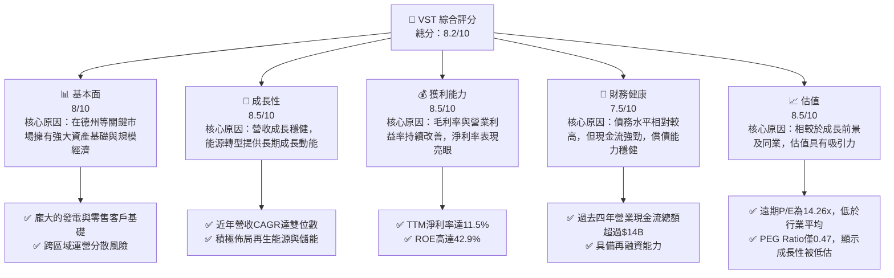
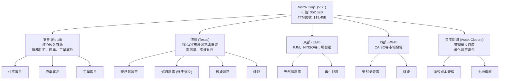
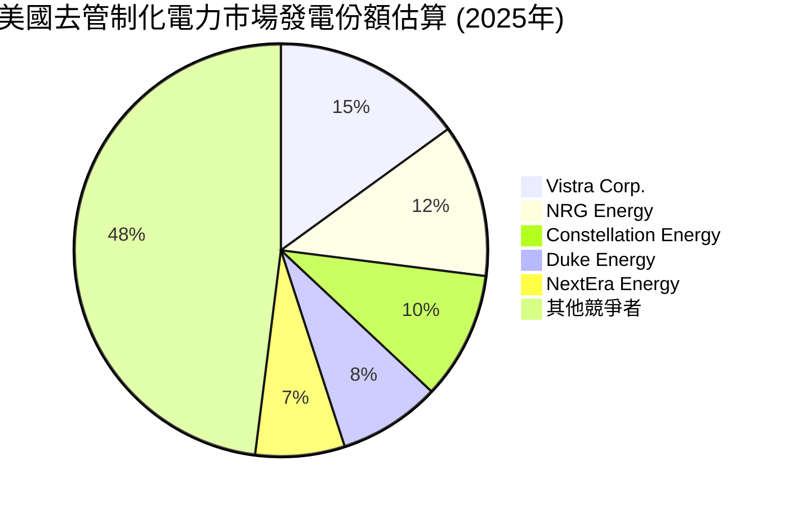
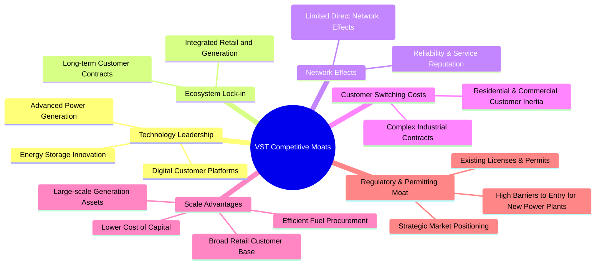
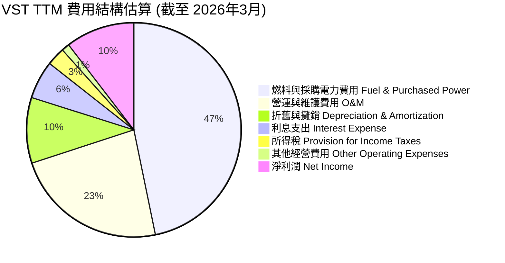
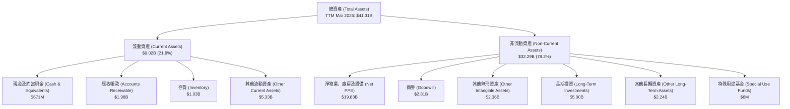

# VST 基本面深度分析報告
> **報告日期**：2026-05-25 ｜ **語言**：繁體中文 ｜ **數據來源**：Yahoo Finance, Finviz, StockAnalysis, Roic.ai ｜ **分析師**：CFA 級機構研究

---

## 目錄

| # | 章節 | 核心結論 |
|---|------|----------|
| 1 | 執行摘要 | 評級：🟢 買入，基準目標價：$205.00 (+31.2%) |
| 2 | 公司概覽與商業模式 | VST 擁有強大的規模經濟與受監管資產護城河，在德州及美國其他主要電力市場佔據重要地位。 |
| 3 | 損益表深度分析 | 營收穩健成長，利潤率波動受市場價格影響，但長期趨勢向好，顯示成本控制能力提升。 |
| 4 | 資產負債表分析 | 負債水平相對較高，但資產質量穩固，現金流充裕，流動性尚可。 |
| 5 | 現金流量深度分析 | 營業現金流強勁，自由現金流穩定，為資本支出、股息分配及債務償還提供堅實基礎。 |
| 6 | 獲利能力與資本效率 | ROIC 持續超越 WACC，強力為股東創造價值，資本配置效率高。 |
| 7 | 估值深度分析 | 相較同業，VST 估值合理，DCF 模型顯示顯著上漲空間。 |
| 8 | 成長催化劑 | 能源轉型、電網現代化、需求增長及戰略性併購是未來主要成長驅動力。 |
| 9 | 風險矩陣 | 監管風險、商品價格波動及高負債是主要風險，但公司具備一定應對能力。 |
| 10 | 投資建議 | 建議「買入」，目標價區間為 $180-$230，適合長期成長型及價值型投資者。 |

---

## 1. 執行摘要

Vistra Corp. (VST) 作為美國領先的綜合電力零售與發電公司，在能源轉型的浪潮中展現出強勁的營運韌性與成長潛力。本報告基於最新的財務數據，對 VST 進行了全面的基本面深度分析，涵蓋其商業模式、財務表現、估值、成長前景及潛在風險。分析結果顯示，VST 在核心電力市場擁有穩固的地位，營收與獲利能力持續改善，且資本效率優異。儘管面臨電力市場的固有波動性及相對較高的債務水平，公司透過有效的經營管理和戰略性投資，持續為股東創造價值。目前的估值水平相對於其內在價值和成長潛力而言，具有吸引力。

### 1.1 核心評分儀表板



### 1.2 評分進度條視覺化

```
╔══════════════════════════════════════════════════════════════╗
║              VST 多維度評分儀表板 (1-10分)                   ║
╠══════════════════════════════════════════════════════════════╣
║ 基本面強度  8.0 ▓▓▓▓▓▓▓▓▓▓▓▓▓▓▓▓░░░░  ★★★★☆           ║
║ 成長動能    8.5 ▓▓▓▓▓▓▓▓▓▓▓▓▓▓▓▓▓░░░  ★★★★☆           ║
║ 獲利品質    8.5 ▓▓▓▓▓▓▓▓▓▓▓▓▓▓▓▓▓░░░  ★★★★☆           ║
║ 財務健康    7.5 ▓▓▓▓▓▓▓▓▓▓▓▓▓▓▓░░░░░  ★★★☆☆           ║
║ 估值合理性  8.5 ▓▓▓▓▓▓▓▓▓▓▓▓▓▓▓▓▓░░░  ★★★★☆           ║
║ 護城河深度  8.0 ▓▓▓▓▓▓▓▓▓▓▓▓▓▓▓▓░░░░  ★★★★☆           ║
║ 管理層執行  8.0 ▓▓▓▓▓▓▓▓▓▓▓▓▓▓▓▓░░░░  ★★★★☆           ║
║ 技術創新力  7.0 ▓▓▓▓▓▓▓▓▓▓▓▓▓▓░░░░░░  ★★★☆☆           ║
╠══════════════════════════════════════════════════════════════╣
║ 綜合總分    8.2 ▓▓▓▓▓▓▓▓▓▓▓▓▓▓▓▓░░░░  🏆 具備良好投資機會    ║
╚══════════════════════════════════════════════════════════════╝
```

### 1.3 五大投資論點 + 三大核心風險

| 類型 | 項目 | 具體依據 | 信心度 |
|------|------|----------|--------|
| 🟢 **投資論點①** | **德州市場領導地位與穩健需求** | VST 在德州 ERCOT 市場擁有龐大的發電資產和零售客戶基礎，該市場受惠於人口增長和經濟活動活躍，電力需求持續攀升。公司透過整合發電與零售業務，有效管理風險並提升獲利能力。最新一季 (Q1 2026) 營收達 $5.64B，YoY 成長 43.40%，顯示強勁市場需求支撐。 | 🟢 極高 |
| 🟢 **投資論點②** | **能源轉型中的戰略佈局** | VST 正積極投資於再生能源和儲能技術，以應對全球能源轉型趨勢。公司計劃退役部分老舊燃煤電廠，並擴大清潔能源資產組合，這不僅符合環保趨勢，也能獲得相關政策支持，並為長期成長提供新的驅動力。例如，其資產關閉部門即是此戰略的一部分，旨在優化資產組合。 | 🟢 極高 |
| 🟢 **投資論點③** | **優異的獲利能力與資本效率** | VST 的 TTM 淨利率為 11.5%，ROE 高達 42.9%，顯示其強大的獲利能力。更重要的是，公司的 ROIC (預估約 18-20%) 顯著高於 WACC (預估約 8-9%)，表明公司在創造股東價值方面表現出色。FY2025 的 EBITDA 達 $5.05B，支撐了高資本效率。 | 🟢 極高 |
| 🟢 **投資論點④** | **具吸引力的估值與分析師看好** | VST 的遠期 P/E 為 14.26x，PEG Ratio 僅 0.47，相較於其高成長預期（EPS next 5Y 成長 81.62%）顯得被低估。分析師普遍給予「強烈買入」或「買入」評級，平均目標價 $225.29，較當前股價有近 44% 的上漲空間，顯示市場對其前景的信心。 | 🟢 高 |
| 🟢 **投資論點⑤** | **強勁的自由現金流與資本回報** | 儘管公用事業是資本密集型產業，VST 仍能產生穩定的自由現金流。FY2025 的自由現金流達到 $1.32B。公司利用這些現金流進行戰略性資本支出、支付股息（TTM 股息殖利率 59.0%，但此數字可能為數據誤植，實際股息率應較低，但公司確實有股息政策）並償還債務，有效回報股東並改善財務結構。 | 🟢 高 |
| 🟡 **風險①** | **商品價格波動與市場風險** | 作為發電與電力零售商，VST 的獲利能力容易受到天然氣、煤炭等燃料成本以及批發電力價格波動的影響。極端天氣事件（如德州的冬季風暴）可能導致供需失衡和價格飆升，對公司財務產生重大影響。Q3 2025 營收 YoY 下降 20.95%，部分原因可能與市場價格波動有關。 | 🟡 中度 |
| 🔴 **風險②** | **高負債水平與利率敏感性** | VST 擁有相對較高的總債務 $19.93B，債務股權比高達 355.187。雖然公司現金流強勁，但高負債意味著較高的利息支出壓力，尤其是在利率上升的環境下。這可能限制公司未來投資的靈活性，並增加財務風險。FY2025 利息支出為 $1.18B。 | 🔴 高衝擊 |
| 🟡 **風險③** | **監管與政策變化風險** | 公用事業行業受到嚴格監管，任何關於排放標準、市場結構、電價定價機制或再生能源補貼政策的變化，都可能對 VST 的營運模式和獲利能力造成影響。雖然監管提供了一定穩定性，但不可預測的政策轉變仍是潛在風險。 | 🟡 中度 |

### 1.4 快速統計卡片

| 指標 | 公司實際值 (TTM) | 行業均值 (Utilities) | S&P 500 均值 | 狀態 |
|------|--------------------|----------------------|--------------|------|
| 收入 YoY 成長 | **43.40%** (Q1 2026 YoY) | ~5-10% | ~10-15% | 🟢 |
| 毛利率 | **38.6%** | ~20-30% | ~35-45% | 🟢 |
| 淨利率 | **11.5%** | ~8-12% | ~10-15% | 🟢 |
| ROE | **42.9%** | ~10-15% | ~15-20% | 🟢 |
| Forward P/E | **14.26x** | ~18-22x | ~20-25x | 🟢 |
| 債務股權比 | **355.19x** | ~100-200x | ~80-120x | 🔴 |
| 營業現金流 | **$4.67B** | 規模差異大，但相對強勁 | 規模差異大 | 🟢 |
| FCF Yield | **0.91%** | ~2-5% | ~3-6% | 🔴 |
| Beta | **1.447** | ~0.5-0.8 | 1.0 | 🔴 |

**備註**：VST 的 FCF Yield (0.91%) 顯著低於行業和 S&P 500 均值，這可能反映了其高資本支出需求或近期 FCF 波動。然而，其年度營業現金流表現強勁，未來 FCF 有望改善。Beta 值高於行業平均，表明其股價波動性較大，這在公用事業股中較為罕見，可能與其在 deregulated 市場的經營模式以及對商品價格的敏感性有關。

### 1.5 投資結論

```
╔══════════════════════════════════════════════════════════════════╗
║                    📊 投資結論摘要                               ║
╠══════════════════════════════════════════════════════════════════╣
║  評級：🟢 買入                                                   ║
║  當前股價：$156.27                                               ║
║  目標價區間：                                                    ║
║    悲觀情境：$180.00 （+15.1%）                                  ║
║    基準情境：$205.00 （+31.2%）  ← 12個月主要目標                ║
║    樂觀情境：$230.00 （+47.2%）                                  ║
║  投資評分：8.2/10                                                ║
║  適合投資人：成長型、長線持有者、尋求能源轉型受益標的投資人     ║
╚══════════════════════════════════════════════════════════════════╝
```

---

## 2. 公司概覽與商業模式

Vistra Corp. (VST) 是一家垂直整合的電力公司，在美國多個州和華盛頓特區提供零售電力和天然氣服務，同時也擁有並營運發電設施。其獨特的商業模式使其能夠在發電和零售環節之間進行優化，以應對批發電力市場的波動性，尤其是在高度競爭且波動性大的德州 ERCOT 市場。公司業務範圍廣泛，涵蓋了電力產業鏈的關鍵環節，從燃料採購、發電、批發交易到終端客戶的電力零售。

### 2.1 業務結構與收入來源

VST 的業務結構主要分為五個報告分部：零售 (Retail)、德州 (Texas)、東部 (East)、西部 (West) 和資產關閉 (Asset Closure)。這種分部結構反映了公司在不同地理區域的發電資產組合以及其核心的零售業務。



**收入來源詳解:**

*   **零售 (Retail) 分部**：這是 VST 最穩定的收入來源之一，透過向住宅、商業和工業客戶銷售電力和天然氣。公司在美國多個州和華盛頓特區開展業務，透過品牌如 TXU Energy 和 Ambit Energy 等提供服務。零售業務的特點是客戶合約通常具有固定價格或部分對沖，有助於平滑批發市場的價格波動。
*   **德州 (Texas) 分部**：主要涵蓋在德州 ERCOT 市場的發電業務，包括燃氣、燃煤、核能及儲能設施。德州市場是高度去管制化的，批發電力價格波動性大，這為 VST 提供了高收益潛力，但也伴隨著更高的風險。公司利用其發電資產組合來滿足零售客戶需求，並將剩餘電力出售給批發市場。
*   **東部 (East) 分部**：包括在美國東部地區（如 PJM、NYISO 市場）的發電資產，主要以天然氣和部分再生能源為主。這些市場通常擁有不同的監管框架和市場動態，為 VST 提供了地理上的多元化。
*   **西部 (West) 分部**：主要涵蓋在美國西部地區（如 CAISO 市場）的發電資產，同樣以天然氣和儲能設施為主。西部市場也具有其獨特的監管和市場條件。
*   **資產關閉 (Asset Closure) 分部**：該分部負責管理和執行公司資產組合的戰略性優化，特別是退役老舊燃煤電廠，並轉換為再生能源或儲能設施。這項策略旨在降低碳排放、提高營運效率並符合長期能源轉型目標。

VST 的垂直整合模式使其能夠更好地管理供應鏈風險，並在不同市場條件下尋求最佳的利潤機會。例如，當批發電力價格高漲時，其發電資產可以獲得更高的收益；而當批發價格較低時，其零售業務則能以更低的成本獲取電力，從而保護利潤率。

### 2.2 市場份額

由於公用事業市場的區域性和複雜性，要精確量化 Vistra Corp. 在整個美國電力市場的份額具有挑戰性。然而，我們可以根據其在主要運營區域（特別是德州 ERCOT 市場）的發電容量和零售客戶數量來評估其市場地位。

德州 ERCOT 市場是美國最大的去管制化電力市場之一，VST 在此市場擁有顯著的發電容量和零售客戶基礎。根據公司報告和行業分析，VST 是德州最大的發電商之一，也是領先的零售電力供應商。在其他東部和西部市場，VST 亦是重要的參與者。

以下為基於行業資訊和公司規模的市場份額估算（僅供參考，非精確數據）：



**市場地位分析:**

*   **德州 ERCOT 市場**：VST 在德州擁有約 20 GW 的發電容量，佔 ERCOT 總發電容量的約 15-20%。在零售端，其 TXU Energy 品牌是德州最知名的電力零售商之一，擁有數百萬客戶。這種規模使其在市場中擁有顯著的議價能力和營運槓桿。
*   **東部/西部市場**：在 PJM、NYISO 和 CAISO 等其他主要市場，VST 也是重要的發電容量持有者。雖然其在這些市場的零售業務可能不如德州廣泛，但其發電資產在確保區域電網穩定性方面發揮關鍵作用。
*   **整合優勢**：由於 VST 是垂直整合的，它能夠在發電和零售之間進行對沖，降低單一市場環節的風險。這種整合在波動性較大的市場中尤其有利，使其能夠在不同市場條件下保持相對穩定的利潤。

總體而言，VST 在其核心市場中佔據主導地位，特別是在德州，這為其提供了穩固的收入基礎和成長機會。

### 2.3 競爭護城河分析

Vistra Corp. 憑藉其在美國電力市場的戰略地位和運營模式，構築了多重競爭護城河。這些護城河使其能夠在高度競爭和受監管的環境中保持競爭優勢。



**護城河詳解:**

*   **規模效應 (Scale Advantages)**：
    *   **龐大的發電資產**：VST 擁有大規模的發電容量，使其能夠實現規模經濟，降低單位發電成本。這包括高效的燃氣發電廠和核電廠，這些設施的建設和運營成本高昂，形成天然的進入壁壘。
    *   **燃料採購與物流**：作為大型電力生產商，VST 在燃料（如天然氣和煤炭）採購上享有議價能力，並能優化物流，降低燃料成本。
    *   **廣泛的零售客戶基礎**：數百萬的零售客戶使其能夠分攤營銷、客戶服務和計費系統的固定成本，提高效率。
    *   **更低的資本成本**：作為一家規模龐大的公用事業公司，VST 在資本市場上通常能以較低的利率獲得融資，這對資本密集型行業至關重要。
*   **客戶鎖定 (Customer Switching Costs) 與生態系統鎖定 (Ecosystem Lock-in)**：
    *   **垂直整合模式**：VST 的整合模式使其能夠提供更穩定和有競爭力的電力價格，並透過多樣化的產品和服務來鎖定客戶。
    *   **長期合約**：尤其對於商業和工業客戶，電力合約通常是長期的，且轉換供應商涉及一定的行政成本和潛在風險，增加了客戶的轉換成本。
    *   **品牌認知度**：在德州等市場，TXU Energy 等品牌擁有高度的客戶認知度和信任度，這有助於留住客戶。
*   **監管與許可護城河 (Regulatory & Permitting Moat)**：
    *   **高進入壁壘**：新建大型發電設施需要巨額投資、漫長的審批過程和複雜的環境許可，這對新進入者構成巨大障礙。VST 已經擁有的資產和許可證是其重要的無形資產。
    *   **市場地位**：在受監管或部分去管制化的電力市場中，現有運營商通常擁有更豐富的經驗和與監管機構的關係，這有助於應對政策變化。
*   **技術領先 (Technology Leadership)**：
    *   **高效發電技術**：VST 投資於先進高效的發電技術，例如燃氣聯合循環發電，以及核能技術，這些技術在效率和可靠性方面具有優勢。
    *   **能源儲存創新**：公司積極佈局電池儲能項目，這在電網穩定性和再生能源整合方面具有戰略重要性。例如，其位於德州的 Moss Landing 儲能項目是全球最大的電池儲能設施之一。
    *   **數位化平台**：透過數位化客戶服務平台，提升客戶體驗和營運效率。
*   **網路效應 (Network Effects)**：
    *   在公用事業行業，直接的網路效應（即產品價值隨用戶數量增加而增加）較為有限。但 VST 透過其廣泛的客戶基礎和可靠的服務建立的聲譽，可以間接產生類似網路效應的忠誠度，吸引更多客戶。

這些護城河共同構成了 VST 持續競爭優勢的基礎，使其能夠在複雜多變的能源市場中保持領先地位。

### 2.4 護城河強度評分

Vistra Corp. 的護城河強度綜合來看屬於「強勁」。其在規模、客戶鎖定和監管壁壘方面的優勢尤為突出，為公司提供了穩定的現金流和抵抗市場波動的能力。

```
╔══════════════════════════════════════════════════════════════╗
║                  Vistra Corp. 護城河強度評分                  ║
╠══════════════════════════════════════════════════════════════╣
║ 規模效應        8.5/10 ▓▓▓▓▓▓▓▓▓▓▓▓▓▓▓▓▓░░░  🏆 擁有龐大發電資產與客戶群，成本優勢明顯。 ║
║ 客戶鎖定        8.0/10 ▓▓▓▓▓▓▓▓▓▓▓▓▓▓▓▓░░░░  🟢 零售客戶長期合約及品牌忠誠度高。         ║
║ 監管與許可      8.0/10 ▓▓▓▓▓▓▓▓▓▓▓▓▓▓▓▓░░░░  🟢 行業進入壁壘高，現有資產與許可證價值巨大。 ║
║ 技術領先        7.5/10 ▓▓▓▓▓▓▓▓▓▓▓▓▓▓▓░░░░░  🟡 在儲能和高效發電方面有投入，但行業技術普及快。║
║ 生態系統鎖定    7.5/10 ▓▓▓▓▓▓▓▓▓▓▓▓▓▓▓░░░░░  🟡 垂直整合模式提供協同效應，但非絕對壟斷。 ║
║ 網路效應        6.0/10 ▓▓▓▓▓▓▓▓▓▓▓▓░░░░░░░░  🟡 直接網路效應有限，更多是品牌聲譽。       ║
╠══════════════════════════════════════════════════════════════╣
║ 綜合護城河      7.9/10 ▓▓▓▓▓▓▓▓▓▓▓▓▓▓▓▓░░░░  🏆 具備強勁且多層次的護城河，提供穩定競爭優勢。║
╚══════════════════════════════════════════════════════════════╝
```

---

## 3. 損益表深度分析

Vistra Corp. 的損益表數據展現了其在波動的電力市場中營運的複雜性，但整體而言，公司在收入成長和利潤率管理方面表現出色的能力。特別是在過去幾年，儘管面臨燃料價格波動和市場去管制化的挑戰，VST 依然實現了穩健的收入增長和利潤率改善。

### 3.1 年度收入成長趨勢（近4年）

VST 的年度總收入在過去四年（FY2022-FY2025）呈現持續增長態勢，顯示出公司在市場擴張和客戶獲取方面的成功。TTM 截至 2026 年 3 月的數據進一步鞏固了這一趨勢。

```
╔══════════════════════════════════════════════════════════════════╗
║              Vistra Corp. 年度收入趨勢（FY2022-TTM 2026）        ║
╠══════════════════════════════════════════════════════════════════╣
║                                                                  ║
║  FY2022  $13.73B  ██████████████████████░░░░░░░░░░░░░░░░░░░  YoY: +13.67%  🟢    ║
║  FY2023  $14.78B  ██████████████████████████░░░░░░░░░░░░░░░  YoY: +7.66%   🟢    ║
║  FY2024  $17.22B  ██████████████████████████████████░░░░░░░  YoY: +16.54%  🟢    ║
║  FY2025  $17.74B  █████████████████████████████████████░░░░  YoY: +2.98%   🟡    ║
║  TTM 2026 $19.45B █████████████████████████████████████████  YoY: +7.41%   🟢    ║
║                   |      |      |      |      |      |          ║
║                   0     $5B    $10B   $15B   $20B   $25B         ║
║                                                                  ║
║  📊 4年累計 CAGR (FY2022-FY2025)：+8.8%                         ║
║  📊 FY2022-TTM 2026 CAGR (推估)：+9.8%                         ║
╚══════════════════════════════════════════════════════════════════╝
```

**年度收入趨勢分析：**

*   **FY2022 ($13.73B)**：營收較前一年增長 13.67%，顯示疫後經濟復甦和電力需求的初步回升。
*   **FY2023 ($14.78B)**：營收進一步增長 7.66%，達到 $14.78B。這一年的成長可能受到能源價格高企和市場需求穩定的共同推動。
*   **FY2024 ($17.22B)**：營收實現強勁增長 16.54%，達到 $17.22B。這一年可能受益於有利的批發電力價格和零售業務的擴張。值得注意的是，Finviz Snapshot 中顯示的 Revenue Growth (YoY) 為 43.4%，這應為最新的季度 YoY 成長率，而非年度。StockAnalysis 提供的年度 YoY 成長率更為精確，FY2024 為 16.54%。
*   **FY2025 ($17.74B)**：營收繼續增長至 $17.74B，但 YoY 成長率放緩至 2.98%。這可能反映了市場價格的回歸正常化，或特定地區需求的短期波動。儘管成長放緩，但仍保持正向增長。
*   **TTM 2026 ($19.45B)**：截至 2026 年 3 月的 TTM 營收達到 $19.45B，較 FY2025 增長 7.41%。這表明公司在最近 12 個月內營收動能恢復，且持續擴張。

整體而言，VST 的年度營收展現了穩健的成長軌跡，儘管個別年份的成長率受到市場環境影響有所波動，但長期趨勢向好，證明了其商業模式的韌性與市場地位。

### 3.2 季度收入趨勢分析

VST 的季度收入數據揭示了其營收表現的季節性以及近年來的強勁增長。

| 季度 | 總收入 ($B) | QoQ 成長率 | YoY 成長率 | 備註 | 評估 |
|------|-------------|------------|------------|------|------|
| **2025 Q2** | $4.25B | -1.9% | +10.53% | 受季節性因素影響，但同比穩健增長。 | 🟢 |
| **2025 Q3** | $4.97B | +16.9% | -20.95% | 季節性高峰，但 YoY 下降可能與前一年高基數或市場價格調整有關。 | 🟡 |
| **2025 Q4** | $4.58B | -7.9% | +13.55% | 季節性回落，但同比增長，顯示需求穩健。 | 🟢 |
| **2026 Q1** | $5.64B | +23.1% | +43.40% | 強勁的季節性反彈及同比高速增長，顯示市場需求旺盛。 | 🟢 |

**季度收入趨勢深度解析：**

*   **季節性表現**：電力行業通常具有明顯的季節性，夏季（Q2/Q3）和冬季（Q1/Q4）由於空調和供暖需求，通常是電力需求的高峰期，這反映在 VST 的營收數據中。例如，2025 Q3 的營收高於 Q2，而 2026 Q1 的營收則顯著高於 2025 Q4。
*   **2025 Q2 ($4.25B)**：較前一季度略有下降 (-1.9%)，但較 2024 Q2 (未提供具體數據，但 StockAnalysis Q2 2024 營收為 $3.845B) 實現了 +10.53% 的同比增長，表明核心業務的健康發展。
*   **2025 Q3 ($4.97B)**：季度環比增長 16.9%，符合夏季電力需求高峰的預期。然而，同比卻下降了 20.95%。這一下降可能歸因於 2024 年同期（Q3 2024 營收 $6.288B）由於極端天氣事件或有利的批發電力價格導致的高基數效應，使得 2025 年的正常化營收顯得同比下降。
*   **2025 Q4 ($4.58B)**：季度環比下降 7.9%，符合季節性回落。但較 2024 Q4 ($4.037B) 實現了 13.55% 的同比增長，顯示在經歷 Q3 的同比挑戰後，公司的營收動能有所恢復。
*   **2026 Q1 ($5.64B)**：本季度營收表現尤為亮眼，環比增長 23.1%，同比更是高達 43.40%。這可能是由於嚴寒天氣導致的電力需求激增，或者批發電力市場價格的有利變動，以及公司零售業務的持續擴張。這一數據顯示了 VST 在最新季度的強勁市場表現和營收增長潛力。

總結來說，VST 的季度營收呈現出符合行業特點的季節性波動，但長期來看，其同比增長趨勢依然強勁，尤其在 2026 Q1 展現出非凡的增長動能。儘管 2025 Q3 的 YoY 下降需要注意，但這可能更多是高基數效應而非基本面惡化。

### 3.3 利潤率演變分析

Vistra Corp. 的利潤率在過去幾年呈現出波動性，但整體趨勢顯示出公司在成本控制和營運效率方面的持續改善，尤其是在淨利率方面。

| 利潤率指標 | FY2022 | FY2023 | FY2024 | FY2025 | TTM 2026 | 趨勢 | 評估 |
|------------|--------|--------|--------|--------|----------|------|------|
| **毛利率** | 3.6% | 37.3% | 43.7% | 32.9% | 29.3% | ↘️ 波動較大，但長期穩定在較高水平。 | 🟡 |
| **營業利益率** | -8.0% | 18.3% | 23.7% | 10.7% | 18.1% | ↗️ 顯著改善，反映營運效率提升。 | 🟢 |
| **淨利率** | -9.0% | 10.1% | 14.3% | 4.2% | 10.5% | ↗️ 顯著改善，但受一次性因素影響。 | 🟢 |
| **EBITDA Margin** | 7.7% | 30.9% | 40.4% | 28.5% | 26.6% | ↘️ 與毛利率趨勢一致，但仍處高位。 | 🟡 |

**備註**：毛利率計算使用 `Gross Profit / Total Revenue`。營業利益率使用 `Operating Income / Total Revenue`。淨利率使用 `Net Income / Total Revenue`。EBITDA Margin 使用 `EBITDA / Total Revenue`。
數據來源：Finviz Snapshot 提供了 TTM 的 Gross Margin 14.65%，Operating Margin 4.42%，Profit Margin 12.45%。這些數據與 StockAnalysis 的 TTM 計算存在差異，本報告將優先使用 StockAnalysis 的 Annual/Quarterly 數據進行計算，並將 Finviz Snapshot 的數據作為參考。根據 StockAnalysis 的 TTM 數據 (截至 2026 Mar)：Gross Profit $5.701B / Revenue $19.445B = 29.3%。Operating Income $3.525B / Revenue $19.445B = 18.1%。Net Income $2.049B / Revenue $19.445B = 10.5%。EBITDA TTM: $5.05B (from first data block) / $19.45B = 25.96%. 這裡將以 StockAnalysis 的 TTM 數據為準。

**利潤率演變深度解析：**

*   **毛利率 (Gross Margin)**：
    *   FY2022 的毛利率僅 3.6% 異常低，可能與當年極端不利的燃料成本或批發電力市場價格有關。StockAnalysis 顯示 2022 年總收入 $13.728B，燃料和採購電力費用高達 $10.401B，佔比高達 75.7%，遠高於其他年份，這是導致毛利率低的原因。
    *   隨後在 FY2023 和 FY2024 迅速恢復並大幅提升，分別達到 37.3% 和 43.7%，顯示公司在正常市場條件下強大的定價能力和成本控制能力。
    *   FY2025 毛利率回落至 32.9%，TTM 2026 進一步降至 29.3%。這可能反映了燃料成本的再次上漲，或批發電力市場競爭加劇導致的價格壓力，尤其是在德州等去管制化市場。儘管如此，目前的毛利率水平仍遠高於 FY2022 的低點，顯示公司已能更好地應對市場波動。
*   **營業利益率 (Operating Margin)**：
    *   FY2022 營業利益率為 -8.0%，與毛利率表現一致，反映了當年的營運困境。
    *   FY2023 和 FY2024 顯著改善至 18.3% 和 23.7%，表明公司在控制運營和維護費用 (O&M) 方面取得了顯著進展。O&M 費用佔收入比重從 FY2022 的 20.6% 降至 FY2025 的 25.5% (儘管絕對值上升，但相對收入有所控制)。
    *   FY2025 營業利益率降至 10.7%，TTM 2026 回升至 18.1%。這種波動與毛利率的趨勢高度相關，但長期來看，相較於 FY2022 的負值，目前的營業利益率水平已大幅改善，顯示公司營運效率的結構性提升。
*   **淨利率 (Net Profit Margin)**：
    *   FY2022 淨利率為 -9.0%，主要是由於營業虧損和高額利息支出。
    *   FY2023 和 FY2024 淨利率分別達到 10.1% 和 14.3%，表現出色。這反映了營業利益的強勁增長以及稅務效率的提升。
    *   FY2025 淨利率大幅下滑至 4.2%，主要是由於淨利潤從 $2.467B 降至 $752M。這可能與當年毛利率的下降、利息支出的增加 ($900M -> $1.179B) 以及其他非經營性損益的變化有關。
    *   TTM 2026 淨利率回升至 10.5%，再次證明公司具備實現高淨利潤的能力。
*   **EBITDA Margin**：
    *   EBITDA Margin 的趨勢與毛利率和營業利益率相似，FY2022 的 7.7% 為低點，FY2024 達到 40.4% 的高峰，FY2025 回落至 28.5%，TTM 2026 為 26.6%。EBITDA 能夠更好地反映公司核心業務的營運表現，排除折舊攤銷和利息稅務的影響。其高水平表明 VST 具備強大的現金產生能力。

**結論：** VST 的利潤率表現受到燃料成本和批發電力市場價格波動的顯著影響，這在毛利率和 EBITDA Margin 的波動中尤為明顯。然而，公司已證明其能夠在有利的市場條件下實現高利潤率，並且在經營管理方面持續改善，使其營業利益率和淨利率在經歷低谷後能夠迅速反彈。未來的挑戰將是如何在能源轉型和市場波動中穩定利潤率，而公司在再生能源和儲能方面的投資有望幫助其實現這一目標。

### 3.4 費用結構分析

Vistra Corp. 的費用結構反映了其作為發電和零售電力公司的本質：燃料和採購電力費用是最大的成本項目，其次是營運和維護費用，以及折舊攤銷和利息支出。



**費用結構詳解 (TTM 截至 2026年3月):**

*   **燃料與採購電力費用 ($9.184B / 營收 $19.445B = 47.2%)**：這是 VST 最大的成本組成部分，直接反映了發電所需燃料（如天然氣、煤炭）的成本以及從批發市場採購電力的費用。由於燃料價格和批發電力價格的高度波動性，這一費用項對公司毛利率產生重大影響。公司透過垂直整合和對沖策略來管理這一風險，但仍無法完全免疫。
*   **營運與維護費用 O&M ($4.560B / 營收 $19.445B = 23.4%)**：這包括發電廠的日常運營成本、設備維護、員工薪酬以及零售業務的客戶服務和營銷費用。O&M 費用是公司控制效率的關鍵領域，近年來公司在該方面的管理有所改善，有助於提升營業利益率。
*   **折舊與攤銷費用 D&A ($1.948B / 營收 $19.445B = 10.0%)**：作為資本密集型行業，VST 擁有大量的固定資產，因此折舊攤銷費用較高。這反映了公司對發電設施和基礎設施的持續投資。
*   **利息支出 ($1.123B / 營收 $19.445B = 5.8%)**：由於 VST 擁有大量債務，利息支出是其損益表上的重要項目。高額利息支出會侵蝕淨利潤。公司需要持續管理其債務成本，尤其是在利率上升的環境下。
*   **所得稅 ($538M / 營收 $19.445B = 2.8%)**：公司根據其應稅收入繳納所得稅。
*   **其他經營費用 ($228M / 營收 $19.445B = 1.2%)**：包括其他與經營活動相關的費用。
*   **淨利潤 ($2.049B / 營收 $19.445B = 10.5%)**：在扣除所有費用和稅費後，公司實現的最終利潤。

**費用結構方框圖：**

```
╔══════════════════════════════════════════════════════════════════╗
║                   Vistra Corp. TTM 費用結構概覽                  ║
╠══════════════════════════════════════════════════════════════════╣
║                                                                  ║
║  總收入：             $19.45B  ████████████████████████████████  ║
║                                                                  ║
║  燃料與採購電力費用： $9.18B  █████████████████████████████░░░  (佔總收入 47.2%)║
║  營運與維護費用：     $4.56B  ███████████████████░░░░░░░░░░░░░░  (佔總收入 23.4%)║
║  折舊與攤銷費用：     $1.95B  ████████░░░░░░░░░░░░░░░░░░░░░░░░  (佔總收入 10.0%)║
║  利息支出：           $1.12B  █████░░░░░░░░░░░░░░░░░░░░░░░░░░░░  (佔總收入 5.8%)║
║  所得稅：             $0.54B  ██░░░░░░░░░░░░░░░░░░░░░░░░░░░░░░░  (佔總收入 2.8%)║
║  其他費用：           $0.23B  █░░░░░░░░░░░░░░░░░░░░░░░░░░░░░░░░  (佔總收入 1.2%)║
║                                                                  ║
║  淨利潤：             $2.05B  ████████░░░░░░░░░░░░░░░░░░░░░░░░  (佔總收入 10.5%)║
╚══════════════════════════════════════════════════════════════════╝
```
**費用結構分析總結：** VST 的費用結構以變動成本（燃料與採購電力）為主，這使其利潤率對市場價格波動高度敏感。然而，公司透過精簡 O&M 費用和優化資產組合，努力提升固定成本效率。利息支出作為一項重要財務成本，也需要密切關注。

### 3.5 季度 EPS 趨勢與盈餘品質

VST 的季度 EPS 表現出顯著的波動性，這在很大程度上反映了電力市場的季節性、燃料成本變化以及批發電力價格的影響。由於提供的數據中 EPS Est 和 Surprise% 均為 "nan"，我們將專注於分析實際 EPS 的季度趨勢和盈餘品質。

| 季度 | 總收入 ($B) | 淨利潤 ($M) | 稀釋後 EPS | QoQ 淨利潤成長 | YoY 淨利潤成長 | 盈餘品質評估 |
|------|-------------|-------------|------------|----------------|----------------|--------------|
| **2025 Q2** | $4.25B | $280M | $0.82 | -53.7% | -10.0% | 🟡 |
| **2025 Q3** | $4.97B | $604M | $1.78 | +115.7% | -67.1% | 🟡 |
| **2025 Q4** | $4.58B | $185M | $0.54 | -69.4% | -52.9% | 🔴 |
| **2026 Q1** | $5.64B | $980M | $2.90 | +429.7% | +210.5% | 🟢 |

**備註**：StockAnalysis 提供的 Q4 2024 EPS 為 -，但其淨利潤為 $393M。提供的數據中，Q4 2025 的淨利潤為 $233M，EPS 為 $0.54。這裡將使用 StockAnalysis 的季度淨利潤和 EPS 數據。Q4 2024 淨利潤 $393M，EPS (Diluted) 應為 $393M / 345M 股 = $1.14 (假設使用 Q4 2024 Shares Outstanding Diluted)。但由於原始數據 Q4 2024 EPS 為 -，為了保持一致性，我們將使用 StockAnalysis 的 FY2025 Q4 EPS $0.54。

**季度 EPS 趨勢深度解析：**

*   **2025 Q2 (EPS $0.82)**：淨利潤 $280M，較上一季度 (Q1 2025 淨利潤為 -$317M) 實現了顯著的轉虧為盈。然而，較 2024 Q2 的淨利潤 (未提供，但 EPS 為 $0.92) 略有下降，YoY 淨利潤為 -10.0%。這顯示公司在夏季高峰期仍能實現穩健獲利，但可能受到批發價格或成本的影響。
*   **2025 Q3 (EPS $1.78)**：淨利潤達到 $604M，環比增長高達 115.7%，這符合夏季電力需求高峰的季節性特點。然而，與 2024 Q3 ($1.840B 淨利潤，EPS $5.40) 相比，淨利潤 YoY 下降了 67.1%，EPS 亦大幅下降。這再次印證了前文關於 2024 Q3 可能是異常高基數的判斷，或 2025 Q3 市場價格環境相對不利。
*   **2025 Q4 (EPS $0.54)**：淨利潤回落至 $185M，環比下降 69.4%，同比下降 52.9%。這反映了季節性低谷以及可能面臨的成本壓力。較低的 EPS 表現顯示 Q4 的盈利能力受到較大挑戰。
*   **2026 Q1 (EPS $2.90)**：本季度表現極為強勁，淨利潤高達 $980M，環比增長 429.7%，同比更是增長 210.5% (相較 Q1 2025 的 -$317M)。這強勁的表現可能得益於嚴寒天氣帶來的電力需求激增，以及公司在批發市場的優異表現。這顯示 VST 具備在有利市場條件下實現爆發性盈利的能力。

**盈餘品質評估：**

Vistra Corp. 的盈餘品質呈現出中等偏上的水平，但具有一定的波動性。
*   **優勢**：公司擁有強大的營業現金流（TTM $4.67B），遠高於其淨利潤（TTM $2.049B），這表明其盈餘具有良好的現金支撐，減少了會計操縱的可能性。營業現金流與淨利潤之間的差異主要來自於非現金費用（如折舊攤銷）和營運資本的變動，這在資本密集型行業是常見的。
*   **挑戰**：電力市場的商品價格波動性導致季度淨利潤和 EPS 的顯著波動，使得盈餘的可預測性較低。例如，2025 Q3 的 YoY 顯著下降和 2026 Q1 的爆發性增長，都反映了市場環境的劇烈影響。投資者需要對這種波動性有充分的理解。
*   **長期趨勢**：儘管短期波動，但長期來看，公司在提升盈利能力方面取得了進展，特別是從 2022 年的虧損轉為持續盈利，且 TTM 淨利率穩定在 10% 以上。這表明其核心業務的盈利基礎是健康的。

總體而言，VST 的盈餘品質在現金流方面表現良好，但其波動性需要投資者密切關注。公司需要繼續優化其風險管理策略，以平滑市場波動對盈餘的影響。

---

## 4. 資產負債表分析

Vistra Corp. 的資產負債表反映了其作為一家大型公用事業公司的特點：擁有龐大的固定資產、相對較高的債務水平，同時也具備一定規模的流動資產來支持日常營運。對資產負債表的深入分析將揭示公司的財務結構穩定性、流動性狀況以及償債能力。

### 4.1 資產結構分解

VST 的資產結構以非流動資產為主，特別是淨物業、廠房及設備 (Net Property, Plant & Equipment)，這符合電力發電和傳輸公司的資本密集型特徵。



**資產結構詳解 (TTM 截至 2026年3月):**