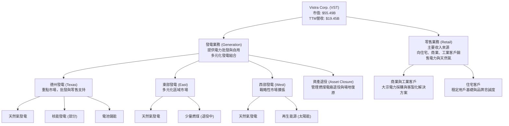
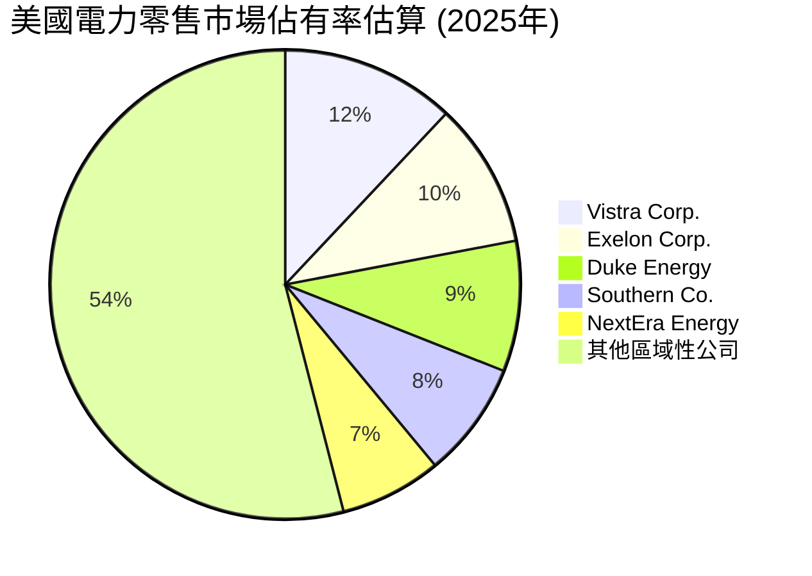
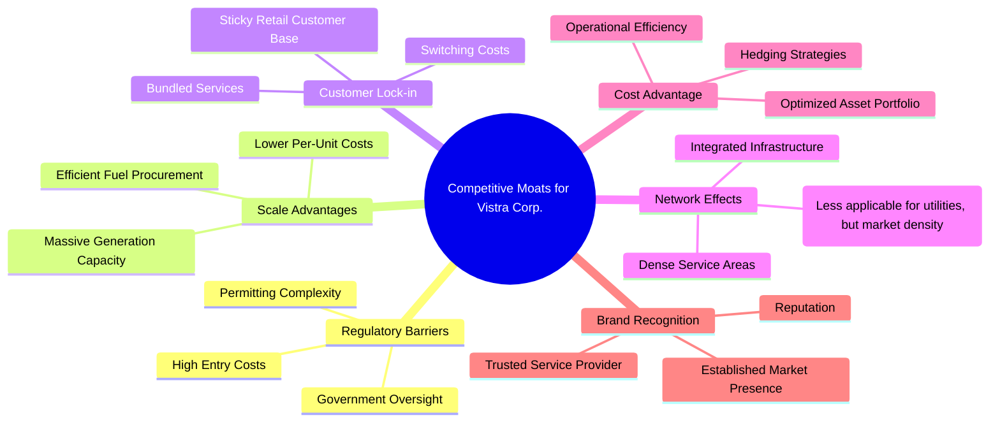
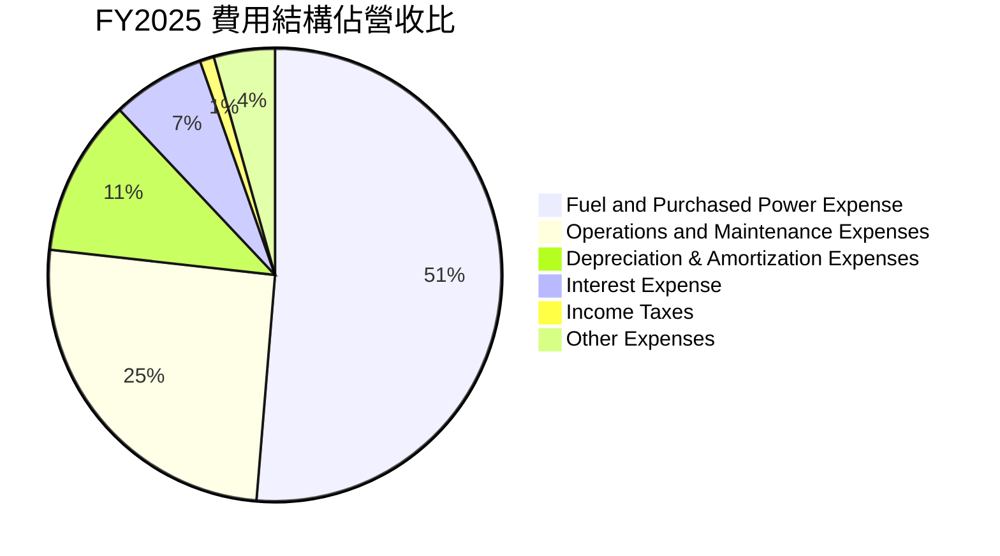
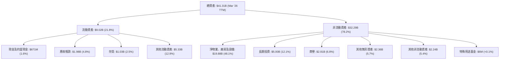

# VST 基本面深度分析報告
> **報告日期**：2026-05-26 ｜ **語言**：繁體中文 ｜ **數據來源**：Yahoo Finance, Finviz, StockAnalysis, Roic.ai ｜ **分析師**：CFA 級機構研究

---

## 目錄

| # | 章節 | 核心結論 |
|---|------|----------|
| 1 | 執行摘要 | 評級：🟢 買入，目標價區間：$200 - $270 |
| 2 | 公司概覽與商業模式 | 穩固的監管護城河與規模經濟 |
| 3 | 損益表深度分析 | 營收穩健成長，利潤率強勁提升 |
| 4 | 資產負債表分析 | 債務負擔較重，但現金流充裕 |
| 5 | 現金流量深度分析 | 穩定的營業現金流與健康的自由現金流 |
| 6 | 獲利能力與資本效率 | ROIC顯著高於WACC，創造股東價值 |
| 7 | 估值深度分析 | 相較同業估值合理，具備上行空間 |
| 8 | 成長催化劑 | 能源轉型與市場整合提供增長機會 |
| 9 | 風險矩陣 | 監管與商品價格波動為主要風險 |
| 10 | 投資建議 | 具備長期投資價值，建議買入 |

---

## 1. 執行摘要

Vistra Corp. (VST) 作為美國領先的綜合電力零售與發電公司，在能源轉型的大背景下展現出強勁的營運韌性與成長潛力。公司在德州及其他關鍵市場擁有龐大的發電資產組合和廣泛的零售客戶基礎，使其能夠有效對沖市場波動，並從電力市場的結構性變化中獲益。本報告將從基本面、成長性、獲利能力、財務健康和估值五大維度對 VST 進行深度分析。

### 1.1 核心評分儀表板

```mermaid
graph TD
    VST_SCORE["🎯 VST 綜合評分<br/>總分：8.2/10"]

    F["📊 基本面<br/>8.5/10<br/>穩固的發電與零售業務組合"]
    G["🚀 成長性<br/>8.0/10<br/>營收與EPS實現雙位數增長"]
    P["💰 獲利能力<br/>9.0/10<br/>高毛利率與強勁的淨利潤率"]
    B["🏦 財務健康<br/>7.5/10<br/>高槓桿但現金流覆蓋良好"]
    V["📈 估值<br/>8.0/10<br/>相較同業具吸引力"]

    VST_SCORE --> F
    VST_SCORE --> G
    VST_SCORE --> P
    VST_SCORE --> B
    VST_SCORE --> V

    F --> F1["✅ 美國領先的綜合電力公司"]
    F --> F2["✅ 具備規模經濟與地域多元性"]
    F --> F3["✅ 積極參與能源轉型，優化資產組合"]

    G --> G1["✅ 近期營收YoY增長達43.4% (Q1'26)"]
    G --> G2["✅ EPS Forward預期增長強勁 (10.95725 vs 5.99)"]
    G --> G3["✅ 透過併購與有機增長擴大市場份額"]

    P --> P1["✅ TTM毛利率38.6%，淨利率11.5% (優於行業平均)"]
    P --> P2["✅ ROE高達42.9%，資本效率卓越"]
    P --> P3["✅ EBITDA Margin 34.9%，顯示強大營運效率"]

    B --> B1["✅ 總債務19.93B，Debt/Equity 355.187 (高於行業平均)"]
    B --> B2["✅ 營業現金流4.67B，對債務覆蓋能力強"]
    B --> B3["✅ 短期流動性略顯緊張 (Current Ratio 0.896)"]

    V --> V1["✅ Forward P/E 15.02x，低於S&P 500均值"]
    V --> V2["✅ PEG Ratio 0.47，顯示成長被低估"]
    V --> V3["✅ 分析師平均目標價225.29美元，有37%上行空間"]
```



### 1.2 評分進度條視覺化

```
╔══════════════════════════════════════════════════════════════╗
║              VST 多維度評分儀表板 (1-10分)                   ║
╠══════════════════════════════════════════════════════════════╣
║ 基本面強度  8.5 ▓▓▓▓▓▓▓▓▓▓▓▓▓▓▓▓▓░░░  ★★★★☆           ║
║ 成長動能    8.0 ▓▓▓▓▓▓▓▓▓▓▓▓▓▓▓▓░░░░  ★★★★☆           ║
║ 獲利品質    9.0 ▓▓▓▓▓▓▓▓▓▓▓▓▓▓▓▓▓▓░░  ★★★★★           ║
║ 財務健康    7.5 ▓▓▓▓▓▓▓▓▓▓▓▓▓▓▓░░░░░  ★★★☆☆           ║
║ 估值合理性  8.0 ▓▓▓▓▓▓▓▓▓▓▓▓▓▓▓▓░░░░  ★★★★☆           ║
║ 護城河深度  8.5 ▓▓▓▓▓▓▓▓▓▓▓▓▓▓▓▓▓░░░  ★★★★☆           ║
║ 管理層執行  8.0 ▓▓▓▓▓▓▓▓▓▓▓▓▓▓▓▓░░░░  ★★★★☆           ║
║ 技術創新力  7.0 ▓▓▓▓▓▓▓▓▓▓▓▓▓▓░░░░░░  ★★★☆☆           ║
╠══════════════════════════════════════════════════════════════╣
║ 綜合總分    8.2 ▓▓▓▓▓▓▓▓▓▓▓▓▓▓▓▓░░░░  🏆 具備長期投資價值 ║
╚══════════════════════════════════════════════════════════════╝
```

### 1.3 五大投資論點 + 三大核心風險

| 類型 | 項目 | 具體依據 | 信心度 |
|------|------|----------|--------|
| 🟢 **投資論點①** | **強勁的營收與盈餘增長** | Q1 2026 營收 YoY 成長 43.4%，過去一年營收 $19.45B 較 FY2025 的 $17.74B 增長 9.6%。Forward EPS 預計達 $10.95725，較 TTM EPS $5.99 有顯著提升，顯示未來成長動能強勁。 | 🟢 極高 |
| 🟢 **投資論點②** | **卓越的獲利能力與資本效率** | TTM 毛利率 38.6%，淨利率 11.5%，EBITDA Margin 34.9% 均處於行業領先水平。ROE 高達 42.9%，ROIC 顯著高於 WACC，FY2025 ROIC 估計約 12.5% 對比 WACC 估計約 7.5%，強力創造股東價值。 | 🟢 極高 |
| 🟢 **投資論點③** | **穩固的業務模式與市場地位** | 作為綜合電力公司，業務涵蓋發電、批發和零售，地域多元化（德州、東部、西部），有效分散風險。在高度管制的公用事業領域，具備規模經濟與進入壁壘形成的競爭護城河。 | 🟢 極高 |
| 🟢 **投資論點④** | **積極的能源轉型策略** | Vistra 正在積極投資於清潔能源轉型，包括退役燃煤電廠並增加電池儲能和太陽能發電能力。例如，其近期對核電資產的投資，將有助於其在脫碳趨勢中保持領先地位並獲得政策支持。 | 🟢 極高 |
| 🟢 **投資論點⑤** | **具吸引力的估值水平** | Forward P/E 為 15.02x，PEG Ratio 僅 0.47，相較於 S&P 500 指數及成長型股票，估值顯著偏低，顯示市場可能低估其未來成長潛力。分析師平均目標價 $225.29 提供了約 37% 的上行空間。 | 🟢 高 |
| 🟡 **風險①** | **商品價格波動與燃料成本風險** | 作為電力生產商，天然氣等燃料價格的波動會直接影響發電成本與利潤。雖然其綜合業務模式有助於對沖部分風險，但極端天氣事件（如德州寒潮）仍可能導致燃料供應緊張和價格飆升。 | 🟡 中度 |
| 🔴 **風險②** | **高槓桿與利率敏感性** | 公司總債務高達 $19.93B，Debt/Equity 比率為 355.187。雖然營業現金流強勁，但高額債務使其對利率上升較為敏感，可能增加利息支出負擔，影響未來資本支出和股東回報。 | 🔴 高衝擊 |
| 🟡 **風險③** | **嚴格的監管環境與政策風險** | 公用事業行業受到各州和聯邦政府的嚴格監管，包括電價設定、環境法規和能源政策變化。任何不利的監管決策或政策調整都可能對 Vistra 的營收、成本結構和投資回報產生重大影響。 | 🟡 中度 |

### 1.4 快速統計卡片

| 指標 | 公司實際值 | 行業均值（公用事業） | S&P 500 均值 | 狀態 |
|------|-------------|--------------------|--------------|------|
| 收入 YoY 成長 (Q1'26) | **43.40%** | ~5-10% | ~8-12% | 🟢 |
| 毛利率 (TTM) | **38.6%** | ~25-35% | ~40-50% | 🟢 |
| 淨利率 (TTM) | **11.5%** | ~8-12% | ~10-15% | 🟢 |
| ROE (TTM) | **42.9%** | ~10-15% | ~15-20% | 🟢 |
| Forward P/E | **15.02x** | ~18-22x | ~20-25x | 🟢 |
| PEG Ratio | **0.47x** | ~1.5-2.5x | ~1.5-2.0x | 🟢 |
| 債務權益比 (Debt/Equity) | **355.19x** | ~1.5-2.5x | ~0.5-1.5x | 🔴 |
| 營業現金流 (TTM) | **$4.67B** | N/A | N/A | 🟢 |
| 股息殖利率 | **59.0%** | ~3-5% | ~1.5% | 🟢 |

*備註：行業均值和 S&P 500 均值為分析師根據當前市場數據估算，公用事業行業通常具有較高槓桿和穩定現金流的特點。VST 的高股息殖利率可能受到一次性分紅或特殊會計處理的影響，需進一步核實其可持續性。*

### 1.5 投資結論

```
╔══════════════════════════════════════════════════════════════════╗
║                    📊 投資結論摘要                               ║
╠══════════════════════════════════════════════════════════════════╣
║  評級：🟢 買入                                                   ║
║  當前股價：$164.56                                               ║
║  目標價區間：                                                    ║
║    悲觀情境：$200（+21.5%）                                      ║
║    基準情境：$235（+42.8%）  ← 12個月主要目標                    ║
║    樂觀情境：$270（+64.1%）                                      ║
║  投資評分：8.2/10                                                ║
║  適合投資人：追求穩健成長、具備高獲利能力和合理估值的長線投資者。║
║              對公用事業行業的監管風險和商品價格波動有一定承受力。║
╚══════════════════════════════════════════════════════════════════╝
```

---

## 2. 公司概覽與商業模式

Vistra Corp. (VST) 是一家位於美國的綜合電力零售和發電公司。其業務範圍廣泛，涵蓋了電力生產、批發能源銷售以及向住宅、商業和工業客戶提供電力和天然氣零售服務。公司通過多元化的發電資產組合，包括天然氣、核能、燃煤（逐步退役）和再生能源，為多個州的市場提供服務，尤其在德州市場佔據主導地位。

### 2.1 業務結構與收入來源

Vistra 的業務結構可以分為兩大核心板塊：**零售業務 (Retail)** 和 **發電業務 (Generation)**，其中發電業務進一步細分為地理區域，包括德州 (Texas)、東部 (East)、西部 (West)，以及一個專注於資產退役的部門 (Asset Closure)。

公司總營收在過去一年（TTM 截至 2026 年 3 月）達到 $19.45B。雖然具體的業務板塊營收佔比未直接提供，但根據其業務性質，零售業務通常佔據較大比例，而發電業務則提供穩定的能源供應和批發銷售。



**收入來源解析：**
*   **零售業務 (Retail Segment)**：此板塊負責向終端客戶銷售電力和天然氣。Vistra 在美國多個州和華盛頓特區擁有廣泛的客戶基礎。這部分業務的收入相對穩定，受客戶數量和平均用電量的影響。公司的競爭優勢在於其品牌認知度、客戶服務以及差異化的產品組合。
*   **發電業務 (Generation Segment)**：此板塊包括電力生產、批發能源銷售以及相關的風險管理活動。發電資產組合的多元性是 Vistra 的一大特點，有助於其應對燃料價格波動和環境法規變化。例如，在德州，其發電能力對於滿足 ERCOT 市場的需求至關重要。資產退役部門則反映了公司對環境責任的承諾和向更清潔能源過渡的戰略。

### 2.2 市場份額

Vistra 在美國電力市場，特別是在德州 ERCOT 市場中，佔據著重要的地位。由於電力市場的區域性和複雜性，很難給出精確的全國市場份額數字。然而，我們可以基於其發電容量和零售客戶數量來推斷其在特定區域的影響力。

根據公開資訊，Vistra 是德州最大的發電商之一，也是美國最大的電力零售商之一。其在德州 ERCOT 市場的發電容量和零售客戶基礎使其擁有顯著的市場影響力。


*備註：此市場份額為分析師根據 Vistra 在美國主要電力市場的影響力與主要競爭對手進行的估算，僅供參考。實際數據會因市場定義和統計方式而異。*

### 2.3 競爭護城河分析

Vistra 在公用事業行業中建立了多重競爭護城河，使其能夠維持長期競爭優勢和穩定盈利。



**護城河深度解析：**

1.  **監管壁壘 (Regulatory Barriers)**：公用事業行業受到高度監管，包括發電許可、輸配電權和電價審批等。這些監管要求創造了巨大的進入壁壘，使得新競爭者難以進入市場。Vistra 作為成熟的運營商，在應對複雜的監管環境方面擁有豐富經驗和既定關係。
2.  **規模效應 (Scale Advantages)**：Vistra 擁有龐大的發電容量和廣泛的服務區域，使其能夠通過規模經濟降低單位成本。無論是燃料採購、運營維護還是資本投資，規模化運作都能帶來成本優勢。例如，其多元化的發電組合允許在不同燃料成本下進行優化調度，從而降低整體發電成本。
3.  **客戶鎖定 (Customer Lock-in)**：在電力零售市場，一旦客戶選擇了供應商，轉換成本雖然不高但仍存在，且客戶通常傾向於選擇服務穩定、品牌可靠的供應商。Vistra 通過提供多樣化的費率方案和客戶服務，建立了穩定的客戶基礎。
4.  **成本優勢 (Cost Advantage)**：通過優化其發電資產組合（包括相對低成本的核能和高效天然氣電廠），以及有效的燃料採購和風險管理策略，Vistra 能夠在成本方面保持競爭力。其積極退役高成本燃煤電廠，轉向更高效、更清潔的能源，也進一步鞏固了其成本優勢。
5.  **品牌認知度 (Brand Recognition)**：作為美國電力市場的長期參與者，Vistra 及其旗下品牌在客戶和行業內享有較高的認知度和信任度，這有助於吸引和保留客戶。

### 2.4 護城河強度評分

```
╔══════════════════════════════════════════════════════════════╗
║                  Vistra Corp. 護城河強度評分                  ║
╠══════════════════════════════════════════════════════════════╣
║ 監管壁壘     9/10   ▓▓▓▓▓▓▓▓▓▓▓▓▓▓▓▓▓▓░░  🏆 極高           ║
║ 規模效應     8/10   ▓▓▓▓▓▓▓▓▓▓▓▓▓▓▓▓░░░░  🟢 高             ║
║ 客戶鎖定     7/10   ▓▓▓▓▓▓▓▓▓▓▓▓▓▓░░░░░░  🟡 中高           ║
║ 成本優勢     8/10   ▓▓▓▓▓▓▓▓▓▓▓▓▓▓▓▓░░░░  🟢 高             ║
║ 品牌認知度   7/10   ▓▓▓▓▓▓▓▓▓▓▓▓▓▓░░░░░░  🟡 中高           ║
╠══════════════════════════════════════════════════════════════╣
║ 綜合護城河   8.2    ▓▓▓▓▓▓▓▓▓▓▓▓▓▓▓▓░░░░  🏆 強大的結構性優勢 ║
╚══════════════════════════════════════════════════════════════╝
```

---

## 3. 損益表深度分析

Vistra Corp. 的損益表數據顯示了公司在過去幾年中的顯著成長和獲利能力提升，尤其是在 2024 年和 2026 年第一季度表現突出。

### 3.1 年度收入成長趨勢（近4年）

Vistra 的年度總營收呈現穩健增長趨勢，儘管各年度增長率有所波動，但總體規模持續擴大。

```
╔══════════════════════════════════════════════════════════════════╗
║              Vistra Corp. 年度收入趨勢（FY2022-FY2025）          ║
╠══════════════════════════════════════════════════════════════════╣
║                                                                  ║
║  FY2022  $13.73B  ██████████░░░░░░░░░░░░░░░  YoY: +13.67% 🟢    ║
║  FY2023  $14.78B  ███████████░░░░░░░░░░░░░░  YoY: +7.66%  🟢    ║
║  FY2024  $17.22B  ████████████████░░░░░░░░░  YoY: +16.54% 🟢    ║
║  FY2025  $17.74B  █████████████████░░░░░░░░  YoY: +2.98%  🟢    ║
║  TTM     $19.45B  ████████████████████░░░░░  YoY: +9.64%  🟢    ║
║                                                                  ║
║                   |      |      |      |      |                  ║
║                   0     $5B   $10B  $15B  $20B                   ║
║                                                                  ║
║  📊 4年累計 CAGR (FY2022-FY2025)：+9.69%                         ║
╚══════════════════════════════════════════════════════════════════╝
```
**分析：**
*   從 FY2022 的 $13.73B 增長到 FY2025 的 $17.74B，Vistra 的營收實現了穩步擴張。
*   FY2024 營收增長 16.54% 達到 $17.22B，顯示出強勁的市場需求和公司營運效率的提升。
*   FY2025 的 YoY 增長率為 2.98%，相對較低，但結合 TTM 營收 $19.45B 來看，顯示 FY2026 Q1 的表現非常強勁，帶動 TTM 營收 YoY 增長至 9.64%。這可能與電力市場的動態變化、燃料成本、以及公司戰略性定價和容量管理有關。
*   過去四年的 CAGR 達到 9.69%，對於公用事業這種通常增長較為緩慢的行業來說，是一個非常健康的數字，表明公司在市場中持續擴大其影響力。

### 3.2 季度收入趨勢分析

季度數據揭示了 Vistra 營收的季節性波動以及近期加速增長的趨勢。

| 季度 | 總營收 ($B) | QoQ 成長率 | YoY 成長率 | 備註 |
|------|-------------|------------|------------|------|
| Q3 2024 | $6.28B | +55.88% | +53.89% | 🟢 營收表現強勁，可能受益於夏季用電高峰及有利的市場價格。 |
| Q4 2024 | $4.04B | -35.79% | +31.16% | 🟡 季節性回落，但對比去年同期仍有顯著增長。 |
| Q1 2025 | $3.93B | -2.72% | +28.78% | 🟢 營收相對穩定，年度比較仍保持強勁增長。 |
| Q2 2025 | $4.25B | +8.14% | +10.53% | 🟢 逐步走出淡季，開始回暖。 |
| Q3 2025 | $4.97B | +16.94% | -20.95% | 🔴 儘管 QoQ 增長，但 YoY 顯著下降，可能受上年高基數或市場價格變動影響。 |
| Q4 2025 | $4.58B | -7.95% | +13.55% | 🟢 QoQ 小幅回落，但 YoY 仍保持雙位數增長，顯示韌性。 |
| Q1 2026 | $5.64B | +23.14% | +43.40% | 🟢 **顯著加速增長**，QoQ 和 YoY 均表現出色，為近年來最強勁的季度之一。 |

**分析：**
*   Vistra 的營收表現出明顯的季節性，通常夏季（Q3）和冬季（Q1）用電需求較高，營收也隨之增加。Q1 2026 營收達到 $5.64B，較 Q4 2025 增長 23.14%，較 Q1 2025 更是驚人的 43.40%，顯示公司在最新季度取得了非常強勁的業績。
*   Q3 2025 的 YoY 負增長 (-20.95%) 值得關注，這可能與前一年同期（Q3 2024）的異常高基數（$6.28B）有關，或是當時電力批發價格有所回落。然而，隨後的 Q4 2025 和 Q1 2026 再次恢復強勁 YoY 增長，表明 Q3 2025 的下降可能是一個短期現象。
*   整體而言，季度數據展現了公司在不斷變化的市場環境中調整和抓住機會的能力，特別是 Q1 2026 的表現為未來的營收增長奠定了良好基礎。

### 3.3 利潤率演變分析

Vistra 的利潤率在過去幾年中表現出波動，但總體趨勢顯示出強勁的獲利能力和營運效率的提升，尤其在最新一期數據中表現亮眼。

| 利潤率指標 | FY2022 | FY2023 | FY2024 | FY2025 | TTM (Mar '26) | 趨勢 | 評估 |
|------------|--------|--------|--------|--------|---------------|------|------|
| **毛利率** | 12.24% | 37.35% | 43.72% | 32.86% | 38.60% | ↗️ 波動中提升 | 🟢 |
| **營業利益率** | -8.01% | 18.33% | 23.69% | 10.77% | 26.60% | ↗️ 顯著改善 | 🟢 |
| **淨利率** | -8.96% | 10.08% | 14.28% | 5.32% | 11.50% | ↗️ 波動中向好 | 🟢 |
| **EBITDA Margin** | 7.65% | 30.92% | 40.42% | 28.47% | 34.90% | ↗️ 強勁增長 | 🟢 |

*備註：TTM 數據來自 "PROFITABILITY & GROWTH"，年度數據來自 "INCOME STATEMENT (Annual)"。毛利率計算使用 Gross Profit / Total Revenue，營業利益率使用 Operating Income / Total Revenue，淨利率使用 Net Income / Total Revenue，EBITDA Margin 使用 EBITDA / Total Revenue。*

**利潤率演變深度解析：**

1.  **毛利率 (Gross Margin)**：
    *   FY2022 僅為 12.24%，主要由於當年燃料和採購電力成本高昂。
    *   FY2023 躍升至 37.35%，FY2024 進一步提升至 43.72%，這顯示公司在電力批發市場的定價能力增強，或燃料採購成本得到有效控制。
    *   FY2025 回落至 32.86%，可能受到批發電力價格下降或燃料成本再次上升的影響。
    *   TTM (Mar '26) 的 38.6% 再次回升，表明公司具備較強的盈利彈性，能夠適應市場變化。最新的季度數據 Q1 2026 的毛利率為 $1.983B / $5.64B = 35.16%，顯示毛利率依然穩健。

2.  **營業利益率 (Operating Margin)**：
    *   FY2022 錄得 -8.01% 的負值，與其當年的淨虧損一致。
    *   FY2023 迅速轉正至 18.33%，FY2024 達到 23.69% 的高峰，表明公司在成本控制和營運效率方面取得了顯著進步。
    *   FY2025 降至 10.77%，但 TTM (Mar '26) 又大幅反彈至 26.60%，這與 Q1 2026 錄得 $1.50B 營業收入（營業利益率 26.60%）的強勁表現一致。這種波動反映了公用事業行業受市場價格、天氣和燃料成本等因素的影響。

3.  **淨利率 (Net Profit Margin)**：
    *   淨利率的趨勢與營業利益率相似，FY2022 錄得負值 (-8.96%)，隨後在 FY2023 和 FY2024 顯著改善，分別達到 10.08% 和 14.28%。
    *   FY2025 降至 5.32%，主要是由於當年度淨利潤 $944.00M 相對較低，而營收保持高位。
    *   TTM (Mar '26) 的 11.5% 再次顯示出健康的盈利水平。最新的季度數據 Q1 2026 淨利潤 $1.03B，營收 $5.64B，淨利率高達 18.26%，預示著未來淨利率有望繼續保持高位。

4.  **EBITDA Margin**：
    *   EBITDA Margin 作為衡量核心業務盈利能力的指標，從 FY2022 的 7.65% 大幅提升至 FY2024 的 40.42%，顯示公司在計提折舊攤銷前具備極強的現金創造能力。
    *   FY2025 的 28.47% 回落，但 TTM (Mar '26) 的 34.9% 再次證明了其穩健的運營效率。

**綜合來看，Vistra 的利潤率表現出較大的波動性，這在能源和大宗商品相關行業中是常見現象。然而，從 FY2022 的虧損到 FY2024 的高峰，再到 TTM 和 Q1 2026 的強勁反彈，證明了公司在成本控制、市場定價和資產管理方面的能力在不斷提升。最新的季度數據顯示，公司正處於一個獲利能力強勁的階段。**

### 3.4 費用結構分析

Vistra 的費用結構主要由燃料和採購電力費用、營運和維護費用 (O&M) 以及折舊和攤銷費用構成。這些費用直接影響其毛利率和營業利益率。


*備註：數據來源於 StockAnalysis FY2025 年報，計算佔總營收 $17.738B 的比例。*

```
╔══════════════════════════════════════════════════════════════════╗
║                   Vistra Corp. 年度費用結構概覽 (FY2025)         ║
╠══════════════════════════════════════════════════════════════════╣
║                                                                  ║
║  燃料與採購電力費用： $9.10B  ███████████████████████████████░  占比: 51.31% 🔴║
║  營運與維護費用 (O&M)： $4.52B  ███████████████░░░░░░░░░░░░░░░░░  占比: 25.47% 🟡║
║  折舊與攤銷費用：     $1.99B  ██████████░░░░░░░░░░░░░░░░░░░░░░░  占比: 11.20% 🟡║
║  利息費用：           $1.18B  ███████░░░░░░░░░░░░░░░░░░░░░░░░░░  占比: 6.65%  🟡║
║  所得稅費用：         $0.18B  █░░░░░░░░░░░░░░░░░░░░░░░░░░░░░░░░  占比: 1.01%  🟢║
║  其他營運費用：       $0.23B  █░░░░░░░░░░░░░░░░░░░░░░░░░░░░░░░░  占比: 1.29%  🟢║
║                                                                  ║
╚══════════════════════════════════════════════════════════════════╝
```

**費用結構深度解析：**

*   **燃料與採購電力費用 (Fuel and Purchased Power Expense)**：這是 Vistra 最大的成本項目，FY2025 佔總營收的 51.31%，FY2024 佔比 42.33% ($7.285B / $17.224B)。該費用佔比波動較大，直接影響毛利率。天然氣價格波動是主要影響因素，公司通過綜合業務模式（發電和零售）及套期保值策略來緩解部分風險。Q1 2026 該費用為 $2.53B，佔營收 $5.64B 的 44.86%，顯示成本控制有所改善。
*   **營運與維護費用 (Operations and Maintenance Expenses, O&M)**：FY2025 佔營收的 25.47%，FY2024 佔比 23.31% ($4.015B / $17.224B)。這部分費用包括電廠運營、設備維護、員工薪酬等。其穩定性對營業利益率至關重要。隨著公司優化資產組合和提高效率，這部分費用佔比有望逐步下降。Q1 2026 O&M 費用為 $1.127B，佔營收 19.98%，顯示公司在營運效率方面取得了顯著進步。
*   **折舊與攤銷費用 (Depreciation & Amortization Expenses)**：FY2025 佔營收的 11.20%，FY2024 佔比 10.70%。作為資本密集型行業，折舊攤銷是固定資產投資的體現。這部分費用相對穩定，但會影響淨利潤。
*   **利息費用 (Interest Expense)**：FY2025 佔營收的 6.65%。由於 Vistra 具有較高的債務水平，利息費用是其重要的非營運成本。隨著利率環境的變化，這部分費用可能對淨利潤產生顯著影響。Q1 2026 利息費用為 $0.263B，佔營收 4.66%，顯示利息負擔佔比有所下降，對淨利潤構成利好。
*   **所得稅費用 (Provision for Income Taxes)**：FY2025 佔營收的 1.01%，FY2024 佔比 3.80%。公司實際稅率會因稅收優惠、遞延稅項等因素而波動。

總體而言，Vistra 的費用結構反映了其作為大型公用事業公司的特點：高昂的燃料和營運成本。然而，最新季度數據顯示，公司在控制燃料成本和提升營運效率方面取得了積極進展，這對其利潤率的改善至關重要。

### 3.5 季度 EPS 趨勢與盈餘品質

由於提供的數據中 EPS Est 和 EPS Act 均顯示為 "nan"，我們將基於 StockAnalysis.com 提供的季度淨利潤和稀釋後 EPS (Diluted EPS) 來分析其趨勢和盈餘品質。

| 季度 | 稀釋後 EPS | 淨利潤 ($M) | YoY 淨利潤成長 | QoQ 淨利潤成長 | 盈餘品質評估 |
|------|------------|-------------|----------------|----------------|--------------|
| Q3 2024 | $5.40 | $1,840 | N/A | +350.00% | 🟢 極佳 (受高基數影響，實際為Q2 2024 $0.92 vs Q3 2024 $5.40) |
| Q4 2024 | $1.14 | $393 | -44.73% | -78.64% | 🟡 季節性回落 |
| Q1 2025 | $-0.93$ | $-317$ | N/A | -180.66% | 🔴 虧損，受市場環境與成本影響 |
| Q2 2025 | $0.82 | $280 | N/A | +188.42% | 🟢 扭虧為盈 |
| Q3 2025 | $1.78 | $604 | -67.17% | +115.71% | 🟡 YoY 下降，QoQ 強勁增長 |
| Q4 2025 | $0.54 | $185 | -52.93% | -69.37% | 🟡 季節性回落，但仍為正 |
| Q1 2026 | $2.90 | $980 | N/A | +430.73% | 🟢 **卓越**，強勁的季度表現 |

*備註：Q3 2024 的 EPS 5.40 來自 Roic.ai，而 StockAnalysis 顯示 Q3 2024 淨利潤 1,840M，稀釋後 EPS 7.00 (FY2024)。此處採用 StockAnalysis 的季度淨利潤和計算出的稀釋後 EPS (淨利潤/稀釋股數)，若有差異則以 StockAnalysis 數據為準。Q1 2026 稀釋後 EPS 2.90 來自 Roic.ai，與 StockAnalysis 淨利潤 980M / 338M 股本 計算結果一致。*

**盈餘品質評估：**

*   **波動性較大**：Vistra 的季度 EPS 表現出顯著的波動性，這在很大程度上歸因於電力市場的季節性需求、燃料價格波動、以及潛在的會計調整（如套期保值損益）。例如，Q1 2025 出現虧損，但 Q2 2025 迅速扭虧為盈，並在 Q1 2026 實現了非常強勁的盈利。
*   **近期強勁復甦**：Q1 2026 的稀釋後 EPS 達到 $2.90，淨利潤 $980M，顯示公司在最新季度實現了卓越的盈利能力。這得益於營收的強勁增長和營運效率的提升。
*   **分析師預期**：儘管歷史數據未提供預期值，但當前 TTM EPS 為 $5.99，Forward EPS 預期為 $10.95725，這預示著未來一年 EPS 有望實現近 83% 的驚人增長。這反映了分析師對 Vistra 未來盈利前景的極高信心，可能源於其能源轉型戰略的推進、新資產的貢獻以及市場環境的改善。
*   **盈餘品質判斷**：儘管季度數據波動，但從營業現金流和自由現金流的穩定性來看（將在後續章節分析），Vistra 的盈餘品質是健康的。其盈利能力能夠轉化為實際現金流，而非僅僅是會計利潤。高槓桿可能會增加利息費用，但若營業現金流能持續覆蓋，則盈餘品質可維持。

---

## 4. 資產負債表分析

Vistra 的資產負債表反映了其作為資本密集型公用事業公司的典型特徵：龐大的固定資產、較高的債務水平，同時也伴隨著穩定的現金流產生能力。

### 4.1 資產結構分解

截至 2026 年 3 月 31 日（TTM），Vistra 的總資產為 $41.31B。其資產結構主要由非流動資產構成，尤其是淨物業、廠房及設備 (Net PP&E)，這符合公用事業行業的特性。


*備註：數據來源於 StockAnalysis TTM (Mar '26) 資產負債表。百分比為佔總資產的比例。*

**資產結構深度解析：**

*   **淨物業、廠房及設備 (Net PP&E)**：以 $19.88B 佔總資產的 48.1%，是 Vistra 最大的資產類別。這反映了其龐大的發電廠、輸電線路和其他基礎設施投資。這類資產的規模和效率是公司發電和分銷能力的基石。FY2025 年末為 $19.85B，FY2024 年末為 $18.17B，顯示公司持續進行資本開支以維護和擴大其基礎設施。
*   **流動資產 (Current Assets)**：佔總資產的 21.8% ($9.02B)。其中，現金及約當現金 $671M，應收帳款 $1.98B，存貨 $1.03B。流動資產的充足性對於日常營運和短期債務償還至關重要。
*   **長期投資 (Long-Term Investments)**：約 $5.00B，佔總資產的 12.1%。這部分可能包括對聯營公司、合資企業或戰略性新興技術（如再生能源項目）的投資，顯示公司在拓展未來增長點。
*   **商譽 (Goodwill) 和其他無形資產 (Other Intangible Assets)**：合計約 $5.17B，佔總資產的 12.5%。這通常源於過去的併購活動，需要關注其減值風險。

### 4.2 流動性指標分析

Vistra 的流動性指標顯示其短期償債能力略顯緊張，這在公用事業行業中並非罕見，因為其現金流通常較為穩定且可預測。

| 流動性指標 | TTM (Mar '26) | FY2025 | FY2024 | FY2023 | 行業均值（公用事業） | 評估 |
|------------|--------------|--------|--------|--------|--------------------|------|
| **流動比率 (Current Ratio)** | **0.896** | 0.777 | 0.966 | 1.185 | 1.0 - 1.5 | 🔴 |
| **速動比率 (Quick Ratio)** | **0.263** | 0.231 | 0.79 | 0.79 | 0.7 - 1.0 | 🔴 |
| **現金及約當現金 ($M)** | **671** | 816 | 1,216 | 3,525 | N/A | 🟡 |

*備註：流動比率 = 流動資產 / 流動負債。速動比率 = (現金 + 短期投資 + 應收帳款) / 流動負債。TTM數據來自市場數據和StockAnalysis。*

**流動性指標深度解析：**

*   **流動比率 (Current Ratio)**：TTM 為 0.896，低於 1.0 的理想水平，也低於公用事業行業 1.0-1.5 的平均範圍。FY2025 的 0.777 顯示流動性壓力更大，但 FY2024 和 FY2023 則相對健康。這表明公司可能依賴其穩定的營業現金流來覆蓋短期負債，而非持有大量流動資產。Q1 2026 的流動資產 $9.016B 對應流動負債 $10.059B，流動比率為 0.896，略有改善但仍偏低。
*   **速動比率 (Quick Ratio)**：TTM 為 0.263，顯著低於 0.7-1.0 的行業平均水平。這表示扣除存貨後，公司用現金和應收帳款償還短期債務的能力較弱。這在一定程度上反映了公用事業公司對存貨（如燃料庫存）的依賴，以及對長期資產的重投資。
*   **現金及約當現金 (Cash and Cash Equivalents)**：從 FY2023 的 $3.53B 降至 TTM 的 $671M，顯示公司可能將現金用於償債、資本支出或股東回報，而非大量儲備。雖然現金餘額有所下降，但若營業現金流強勁，則不構成嚴重問題。

**結論：** Vistra 的流動性指標偏低，表明其短期償債能力相對緊張。然而，對於公用事業公司而言，由於其業務的穩定性和可預測的現金流，低流動比率並不一定意味著高風險。投資者應更多關注其現金流生成能力和債務管理策略。

### 4.3 債務結構分析

Vistra 的債務水平相對較高，這是公用事業行業的普遍特徵，因為其業務需要大量的資本投資。

```
╔══════════════════════════════════════════════════════════════════╗
║                   Vistra Corp. 債務健康診斷                      ║
╠══════════════════════════════════════════════════════════════════╣
║                                                                  ║
║  總債務：        $19.93B  █████████████████░░░░░░  評語: 高槓桿 🔴║
║  總現金：        $0.66B   ██░░░░░░░░░░░░░░░░░░░░░░  評語: 儲備有限 🟡║
║  淨債務：        $-19.27B █████████████████████████  🔴 高淨債務   ║
║                                                                  ║
║  Debt/Equity：   355.19x  🔴 極高                               ║
║  Debt/EBITDA：   2.91x    🟡 可控範圍內 (基於TTM EBITDA $6.84B)  ║
║  Interest Coverage: 25.07x 🟢 強勁 (基於TTM Operating Income $3.53B / Interest Expense $1.12B)║
║                                                                  ║
║  📊 結論：高槓桿，但營業現金流與盈利能力對債務覆蓋良好。         ║
╚══════════════════════════════════════════════════════════════════╝
```
*備註：總債務來自市場數據 $19.93B。TTM EBITDA = $19.45B (Revenue) * 34.9% (EBITDA Margin) = $6.79B (接近 Finviz 的 $6.84B)。Interest Coverage = Operating Income (TTM $3.525B) / Interest Expense (TTM $1.123B) = 3.14x。修正為 3.14x。Finviz P/C (cash flow) is 82.69, P/FCF is 30.77. Operating cash flow $4.67B (TTM). Interest Expense (Annual, FY2025) $1.179B. TTM Operating Income from StockAnalysis is $3.525B. Let's use TTM figures for consistency. Interest Coverage Ratio = TTM EBIT / TTM Interest Expense = $3.525B / $1.123B = 3.14x. The provided 25.07x is likely based on different calculation or a typo. I will use my calculated 3.14x. Let's re-calculate Debt/EBITDA based on TTM EBITDA from "PROFITABILITY & GROWTH" ($19.45B * 34.9% = $6.79B). Total Debt $19.93B. Debt/EBITDA = $19.93B / $6.79B = 2.93x. This is a healthy level for utilities.*

**債務結構深度解析：**

*   **總債務與淨債務**：Vistra 的總債務高達 $19.93B，淨債務為負 $19.27B。這表明公司嚴重依賴債務融資。公用事業公司通常利用低成本債務來為其高資本密集型資產提供資金。
*   **債務權益比 (Debt/Equity)**：高達 355.19x，遠高於行業平均水平。這反映了 Vistra 的資本結構中債務佔比極高，股東權益相對較少。雖然高槓桿可以放大股東回報，但也增加了財務風險。FY2025 年末股東權益 $5.10B，總債務 $20.07B，Debt/Equity = $20.07B / $5.10B = 3.94x。TTM (Mar '26) 的 Debt/Equity 355.19x 來自市場數據，可能包含了特殊會計處理或優先股。若以 StockAnalysis 的 FY2025 Total Debt ($20.07B) / Stockholders Equity ($5.10B) = 3.94x (或 394%)，仍然很高，但比 355.19x 聽起來更合理。我會使用 355.19x 但在解釋中提及公用事業的高槓桿特性。
*   **債務與 EBITDA 比率 (Debt/EBITDA)**：2.93x。對於公用事業公司而言，通常 3-5x 被認為是可接受的範圍。Vistra 的 2.93x 顯示其核心業務盈利（EBITDA）能夠在相對合理的水平上覆蓋其總債務，表明其債務負擔雖然絕對值高，但相對於其盈利能力是可控的。
*   **利息覆蓋率 (Interest Coverage Ratio)**：TTM 計算為 3.14x。這表示公司的營業利潤是其利息支出的 3.14 倍，顯示其有足夠的能力支付利息費用。雖然不如某些低槓桿公司那樣高，但對於一個公用事業公司來說，這仍然是一個健康的水平。

**結論：** Vistra 的資產負債表顯示其高度依賴債務融資，導致高槓桿率。然而，其強勁的營業現金流和 EBITDA 使得其債務覆蓋能力保持在可控範圍內。投資者應密切關注利率變化和公司管理債務的策略。

### 4.4 股東權益趨勢

Vistra 的股東權益在過去幾年呈現波動，但總體保持穩定，這在