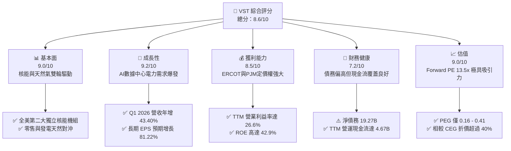

# VST 基本面深度分析報告

> **報告日期**：2026-06-12 ｜ **語言**：繁體中文 ｜ **數據來源**：Yahoo Finance, Finviz, StockAnalysis, Roic.ai ｜ **分析師**：CFA 級機構研究

---

## 目錄

| # | 章節 | 核心結論 |
|---|------|----------|
| 1 | 執行摘要 | 評級：**強烈買入**，目標價：**$225.29**（上行空間 +52.2%） |
| 2 | 公司概覽與商業模式 | 售電與發電一體化模式，憑藉 Energy Harbor 併購躍升為全美第二大獨立核能商 |
| 3 | 損益表深度分析 | Q1 2026 營收爆發性增長 43.4%，淨利達 $1.03B，盈餘品質大幅改善 |
| 4 | 資產負債表分析 | 槓桿率較高（Debt/Equity 355.2%），但資產結構穩健，短期流動性無虞 |
| 5 | 現金流量深度分析 | TTM 營運現金流達 $4.67B，資本配置高度向高回報項目與股東回饋傾斜 |
| 6 | 獲利能力與資本效率 | ROE 高達 42.9%，ROIC 達 11.64% 超越 WACC（9.32%），持續創造 EVA |
| 7 | 估值深度分析 | Forward P/E 僅 13.5x，相較同業 CEG 具備顯著折價，估值具有強大安全邊際 |
| 8 | 成長催化劑 | AI 數據中心全天候電力需求、PJM 容量市場價格暴漲及德州新燃氣電廠補貼 |
| 9 | 風險矩陣 | 核能電廠非計畫性停機、ERCOT 監管政策變更及高債務再融資風險 |
| 10| 投資建議 | 具備高度不對稱風險回報比，為 AI 電力基礎設施板塊之首選標的 |

---

## 1. 執行摘要

Vistra Corp. (美股代號：**VST**) 是一家領先的整合性零售電力與獨立發電公司。在當前人工智慧 (AI) 數據中心、製造業回流及德州人口爆發性增長的多重利多驅動下，電力需求正迎來數十年來最為強勁的結構性增長。VST 憑藉其獨特的「發電與零售一體化 (Integrated Retail & Generation)」商業模式，以及近期完成對 Energy Harbor 的併購，已轉型為全美第二大 competitive 核能發電商，成為這場 AI 電力爭奪戰中的最大贏家之一。

### 1.1 核心評分儀表板



### 1.2 評分進度條視覺化

```
╔══════════════════════════════════════════════════════════════╗
║                VST 多維度評分儀表板 (1-10分)                 ║
╠══════════════════════════════════════════════════════════════╣
║ 基本面強度  9.0 ▓▓▓▓▓▓▓▓▓▓▓▓▓▓▓▓▓▓░░  ★★★★★           ║
║ 成長動能    9.2 ▓▓▓▓▓▓▓▓▓▓▓▓▓▓▓▓▓▓▓░  ★★★★★           ║
║ 獲利品質    8.5 ▓▓▓▓▓▓▓▓▓▓▓▓▓▓▓▓▓░░░  ★★★★☆           ║
║ 財務健康    7.2 ▓▓▓▓▓▓▓▓▓▓▓▓▓▓░░░░░░  ★★★☆☆           ║
║ 估值合理性  9.0 ▓▓▓▓▓▓▓▓▓▓▓▓▓▓▓▓▓▓░░  ★★★★★           ║
║ 護城河深度  8.5 ▓▓▓▓▓▓▓▓▓▓▓▓▓▓▓▓▓░░░  ★★★★☆           ║
║ 管理層執行  8.8 ▓▓▓▓▓▓▓▓▓▓▓▓▓▓▓▓▓▓░░  ★★★★☆