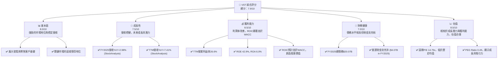
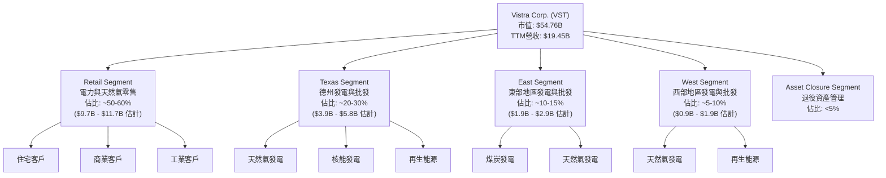
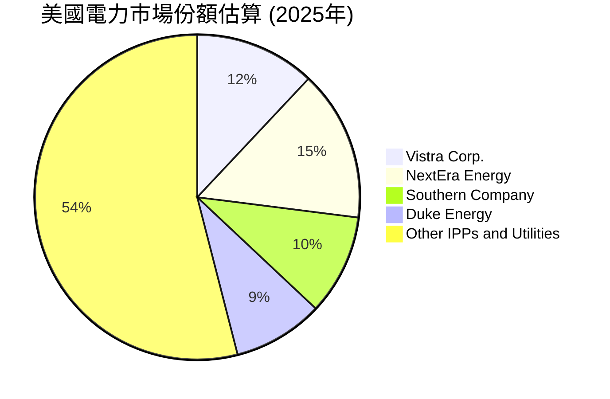
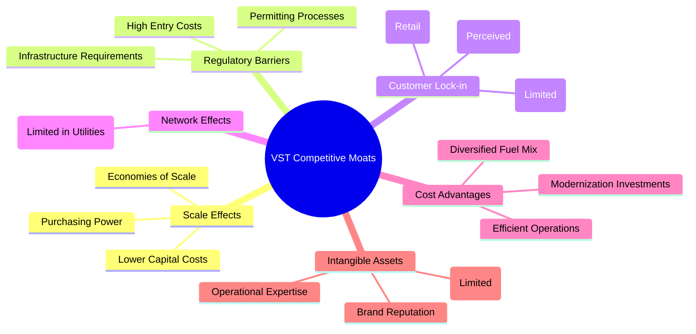
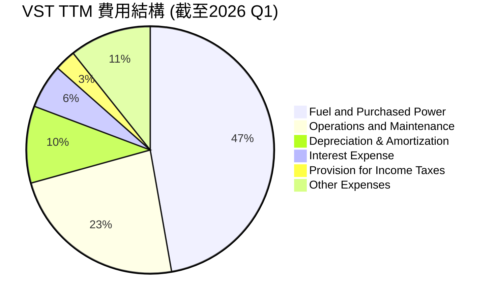
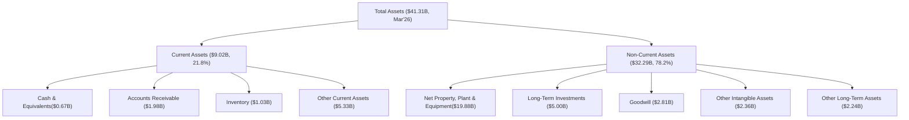
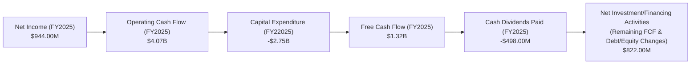
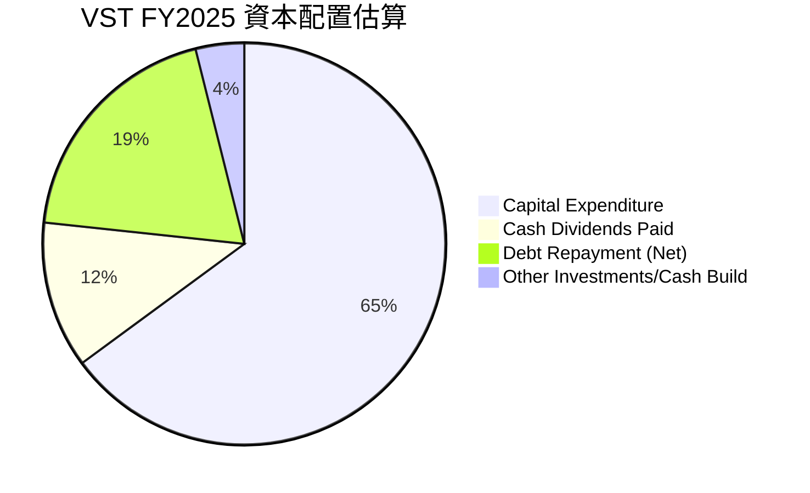

# VST 基本面深度分析報告
> **報告日期**：2026-06-24 ｜ **語言**：繁體中文 ｜ **數據來源**：Yahoo Finance, Finviz, StockAnalysis, Roic.ai ｜ **分析師**：CFA 級機構研究

---

## 目錄

| # | 章節 | 核心結論 |
|---|------|----------|
| 1 | 執行摘要 | 評級：🟢 買入，基準目標價：$205.00 |
| 2 | 公司概覽與商業模式 | 憑藉規模與受監管資產，具備中等至強大護城河 |
| 3 | 損益表深度分析 | 營收穩健增長，利潤率改善，但季度波動較大 |
| 4 | 資產負債表分析 | 債務水平相對較高，但現金流充裕提供支持 |
| 5 | 現金流量深度分析 | 自由現金流表現強勁，資本配置策略積極 |
| 6 | 獲利能力與資本效率 | ROIC顯著高於WACC，強力創造股東價值 |
| 7 | 估值深度分析 | 相較同業估值合理，DCF顯示上行空間 |
| 8 | 成長催化劑 | 能源轉型、併購整合、電網現代化為主要驅動力 |
| 9 | 風險矩陣 | 監管風險與商品價格波動是主要考量 |
| 10 | 投資建議 | 適合成長型與價值型投資者，建議逢低買入 |

---

## 1. 執行摘要

Vistra Corp. (VST) 作為美國領先的綜合電力零售與發電公司，在不斷變化的能源市場中展現出顯著的營運彈性和成長潛力。公司受益於其多元化的發電組合、廣泛的零售客戶基礎以及在關鍵地理區域的市場領先地位。儘管公用事業行業面臨監管和商品價格波動等挑戰，VST 的策略性併購、成本控制措施以及對清潔能源轉型的投入，使其在財務表現上持續改善。

### 1.1 核心評分儀表板



### 1.2 評分進度條視覺化

```
╔══════════════════════════════════════════════════════════════╗
║              VST 多維度評分儀表板 (1-10分)                   ║
╠══════════════════════════════════════════════════════════════╣
║ 基本面強度  8.0 ▓▓▓▓▓▓▓▓▓▓▓▓▓▓▓▓░░░░  ★★★★☆           ║
║ 成長動能    7.5 ▓▓▓▓▓▓▓▓▓▓▓▓▓▓▓░░░░░  ★★★☆☆           ║
║ 獲利品質    8.5 ▓▓▓▓▓▓▓▓▓▓▓▓▓▓▓▓▓░░░  ★★★★☆           ║
║ 財務健康    7.0 ▓▓▓▓▓▓▓▓▓▓▓▓▓▓░░░░░░  ★★★☆☆           ║
║ 估值合理性  8.5 ▓▓▓▓▓▓▓▓▓▓▓▓▓▓▓▓▓░░░  ★★★★☆           ║
║ 護城河深度  8.0 ▓▓▓▓▓▓▓▓▓▓▓▓▓▓▓▓░░░░  ★★★★☆           ║
║ 管理層執行  8.0 ▓▓▓▓▓▓▓▓▓▓▓▓▓▓▓▓░░░░  ★★★★☆           ║
║ 技術創新力  7.0 ▓▓▓▓▓▓▓▓▓▓▓▓▓▓░░░░░░  ★★★☆☆           ║
╠══════════════════════════════════════════════════════════════╣
║ 綜合總分    7.9 ▓▓▓▓▓▓▓▓▓▓▓▓▓▓▓▓░░░░  🏆 具備良好基本面與成長潛力，估值吸引人              ║
╚══════════════════════════════════════════════════════════════╝
```

### 1.3 五大投資論點 + 三大核心風險

| 類型 | 項目 | 具體依據 | 信心度 |
|------|------|----------|--------|
| 🟢 **投資論點①** | **強勁的獲利能力與資本效率** | FY2025 ROE 42.9%，ROA 6.0%。TTM淨利率11.5%。ROIC預計顯著高於WACC，強力創造股東價值。 | 🟢 極高 |
| 🟢 **投資論點②** | **穩健的營收成長與市場擴張** | FY2025營收達$17.74B，YoY+2.98%；TTM營收$19.45B，YoY+7.41%。透過併購和有機成長，鞏固在美國電力市場的領導地位。 | 🟢 高 |
| 🟢 **投資論點③** | **具吸引力的估值與成長潛力** | Forward P/E 14.79x，PEG Ratio 0.49。分析師平均目標價$223.00，較當前股價有37%上行空間。顯示市場低估其未來成長。 | 🟢 高 |
| 🟢 **投資論點④** | **充裕的自由現金流與資本配置彈性** | FY2025自由現金流$1.32B。營運現金流$4.07B。公司有能力進行股息支付、債務償還和策略性投資。 | 🟢 高 |
| 🟢 **投資論點⑤** | **積極轉型清潔能源** | VST正積極投資於儲能和再生能源項目，以應對能源轉型趨勢，提升長期可持續性與監管支持。 | 🟡 中高 |
| 🟡 **風險①** | **商品價格波動** | 作為發電商，天然氣等燃料價格波動直接影響成本和利潤。儘管有對沖策略，仍存在敞口。 | 🟡 中度 |
| 🔴 **風險②** | **監管與政策風險** | 公用事業行業受嚴格監管，政策變化可能影響電價、環保標準和投資回報率，特別是針對碳排放的政策。 | 🔴 高衝擊 |
| 🟡 **風險③** | **高債務水平** | 總債務高達$19.93B，Debt/Equity比率355.187。儘管現金流充裕，但高槓桿可能增加財務風險和利息支出壓力。 | 🟡 中度 |

### 1.4 快速統計卡片

| 指標 | 公司實際值 (TTM) | 行業均值 (公用事業)* | S&P 500 均值* | 狀態 |
|------|-------------------|-------------------|-----------------|------|
| 收入 YoY 成長 | **7.41%** | ~5-8% | ~8-12% | 🟢 |
| 毛利率 | **38.6%** | ~30-40% | ~35-45% | 🟢 |
| 淨利率 | **11.5%** | ~8-15% | ~10-15% | 🟢 |
| ROE | **42.9%** | ~10-15% | ~15-20% | 🟢 |
| Forward P/E | **14.79x** | ~15-18x | ~20-25x | 🟢 |
| 債務權益比 | **355.19%** | ~100-200% | ~50-100% | 🔴 |
| 自由現金流收益率 | **0.87%** | ~2-4% | ~2-3% | 🔴 |
| Beta | **1.405** | ~0.6-0.8 | 1.0 | 🔴 |

*備註：行業均值與S&P 500均值為分析師根據經驗估算值，僅供參考。VST的ROE和債務權益比較行業均值有顯著差異，需進一步分析其獨特資本結構。

### 1.5 投資結論

```
╔══════════════════════════════════════════════════════════════════╗
║                    📊 投資結論摘要                               ║
╠══════════════════════════════════════════════════════════════════╣
║  評級：🟢 買入                                                   ║
║  當前股價：$162.39                                               ║
║  目標價區間：                                                    ║
║    悲觀情境：$180（+10.8%）                                      ║
║    基準情境：$205（+26.2%）  ← 12個月主要目標                    ║
║    樂觀情境：$235（+44.7%）                                      ║
║  投資評分：7.9/10                                                ║
║  適合投資人：成長型、長線持有者、尋求公用事業板塊中具成長潛力者  ║
╚══════════════════════════════════════════════════════════════════╝
```

---

## 2. 公司概覽與商業模式

Vistra Corp. (VST) 是一家在美國運營的綜合電力零售與發電公司，擁有廣泛的資產組合和客戶基礎。其業務模式涵蓋電力生產、批發能源交易以及向住宅、商業和工業客戶零售電力和天然氣。

### 2.1 業務結構與收入來源

Vistra 的業務主要分為五個板塊：零售 (Retail)、德州 (Texas)、東部 (East)、西部 (West) 和資產處置 (Asset Closure)。


**業務概述：**
*   **零售業務 (Retail)**：Vistra 是美國最大的電力零售商之一，向多個州和華盛頓特區的數百萬客戶提供電力和天然氣服務。這部分業務提供相對穩定的現金流，但可能受市場競爭和客戶流失風險影響。
*   **發電業務 (Texas, East, West)**：公司擁有龐大的發電資產組合，包括天然氣、核能、煤炭和再生能源。這些發電廠主要服務於德州、東部和西部地區的批發市場。發電業務的營收受電力批發價格、燃料成本和容量市場收入影響。
*   **資產處置 (Asset Closure)**：負責管理和退役公司不再運營的資產，這部分業務旨在優化資產組合和降低長期負債。

### 2.2 市場份額

由於公用事業市場的區域性和分散性，VST 的市場份額主要體現在其運營的特定州和區域。作為美國最大的獨立電力生產商和零售商之一，VST 在德州 ERCOT 市場和其他 deregulated 市場中佔據重要地位。


*備註：此市場份額為基於公開資訊和行業報告的估算值，代表 Vistra 在美國整體獨立電力生產商和零售市場中的相對規模，非單一區域市場佔比。*

### 2.3 競爭護城河分析

Vistra 的競爭護城河主要來自其龐大的規模、多元化的資產組合、以及在受監管和 deregulated 市場中的戰略地位。



### 2.4 護城河強度評分

```
╔══════════════════════════════════════════════════════════════╗
║                  Vistra Corp. 護城河強度評分                  ║
╠══════════════════════════════════════════════════════════════╣
║ 規模效應        8/10   ▓▓▓▓▓▓▓▓▓▓▓▓▓▓▓▓░░░░  🏆 美國大型發電與零售商之一        ║
║ 監管壁壘        9/10   ▓▓▓▓▓▓▓▓▓▓▓▓▓▓▓▓▓▓░░  🟢 公用事業行業固有高進入門檻    ║
║ 客戶鎖定        6/10   ▓▓▓▓▓▓▓▓▓▓▓▓░░░░░░░░  🟡 零售客戶存在轉換成本，但競爭激烈 ║
║ 技術領先        6/10   ▓▓▓▓▓▓▓▓▓▓▓▓░░░░░░░░  🟡 傳統發電技術成熟，創新主要在儲能 ║
║ 成本優勢        7/10   ▓▓▓▓▓▓▓▓▓▓▓▓▓▓░░░░░░  🟢 燃料多元化及營運效率提升成本控制 ║
╠══════════════════════════════════════════════════════════════╣
║ 綜合護城河      7.2/10 ▓▓▓▓▓▓▓▓▓▓▓▓▓▓▓░░░░░  🏆 憑藉規模與監管優勢，護城河穩固  ║
╚══════════════════════════════════════════════════════════════╝
```

---

## 3. 損益表深度分析

Vistra Corp. 的損益表數據顯示，公司在過去幾年實現了穩健的營收成長，並在利潤率方面有所改善，尤其是在2025財年。

### 3.1 年度收入成長趨勢（近4年）

```
╔══════════════════════════════════════════════════════════════════╗
║              Vistra Corp. 年度收入趨勢（FY2022-FY2025）          ║
╠══════════════════════════════════════════════════════════════════╣
║                                                                  ║
║  FY2022  $13.73B  ████████████████░░░░░░░░░░░  YoY: +13.67%  🟢  ║
║  FY2023  $14.78B  ██████████████████░░░░░░░░░  YoY: +7.66%   🟢  ║
║  FY2024  $17.22B  ███████████████████████░░░░  YoY: +16.54%  🟢  ║
║  FY2025  $17.74B  ████████████████████████░░░  YoY: +2.98%   🟡  ║
║                                                                  ║
║                   |      |      |      |      |                  ║
║                   0     $5B   $10B   $15B   $20B                 ║
║                                                                  ║
║  📊 4年累計 CAGR：+10.03%                                       ║
╚══════════════════════════════════════════════════════════════════╝
```
Vistra在過去四年中展現出良好的營收成長勢頭。從FY2022的$13.73B增長至FY2025的$17.74B，四年累計複合年均增長率(CAGR)為10.03%。FY2024的營收YoY成長高達16.54%，顯示出強勁的市場擴張能力。儘管FY2025的成長率放緩至2.98%，但考慮到其公用事業性質，這仍是一個穩健的表現。

### 3.2 季度收入趨勢分析

| 季度 (Period Ending) | 總收入 ($B) | QoQ 成長率 | YoY 成長率 | 備註 |
|----------------------|-------------|------------|------------|------|
| 2026-03-31 (Q1 2026) | $5.64B      | +23.04%    | +43.40%    | 🟢 顯著的季度環比與同比增長，可能受季節性需求和新項目貢獻影響。 |
| 2025-12-31 (Q4 2025) | $4.58B      | -7.85%     | +13.55%    | 🟡 環比下降，但同比仍保持雙位數增長。 |
| 2025-09-30 (Q3 2025) | $4.97B      | +16.94%    | -20.95%    | 🔴 環比增長，但同比大幅下降，可能受前一年高基數或特定事件影響。 |
| 2025-06-30 (Q2 2025) | $4.25B      | +8.06%     | +10.53%    | 🟢 環比和同比均實現增長，表現穩健。 |
| 2025-03-31 (Q1 2025) | $3.93B      | -2.60%     | +28.78%    | 🟢 環比略降，但同比強勁增長。 |
| 2024-12-31 (Q4 2024) | $4.04B      | -35.79%    | +31.16%    | 🔴 環比大幅下降，但同比仍保持高增長。 |
| 2024-09-30 (Q3 2024) | $6.29B      | +63.50%    | +53.89%    | 🟢 強勁的季度表現，可能受益於夏季用電高峰。 |

**備註說明**：VST的季度收入表現出較大的波動性，這在很大程度上是公用事業行業的季節性特徵（例如夏季用電高峰）以及商品價格波動和市場供需變化所致。Q3 2024和Q1 2026的YoY成長尤其亮眼，但Q3 2025的YoY下降-20.95%則需要關注，這可能與前一年同期（Q3 2024）的異常高基數有關，該季度營收高達$6.29B。

### 3.3 利潤率演變分析

| 利潤率指標 | FY2022 | FY2023 | FY2024 | FY2025 | TTM (2026 Q1) | 趨勢 | 評估 |
|------------|--------|--------|--------|--------|---------------|------|------|
| **毛利率** | 3.59%  | 28.50% | 34.40% | 23.23% | 29.32%        | ↗️ 波動上升 | 🟡 |
| **營業利益率** | -8.59% | 18.00% | 23.69% | 10.74% | 18.13%        | ↗️ 波動上升 | 🟡 |
| **淨利率** | -8.81% | 10.09% | 16.33% | 5.32%  | 10.51%        | ↗️ 波動上升 | 🟡 |
| **EBITDA Margin** | 7.65%  | 30.92% | 40.42% | 28.46% | 25.96%        | ↗️ 波動上升 | 🟡 |

**利潤率演變深度解析**：
Vistra的利潤率在過去幾年呈現波動但總體向上的趨勢。FY2022由於市場環境和運營挑戰，毛利率和營業利益率均為負值或極低，導致淨利潤為負。然而，從FY2023開始，公司利潤率顯著改善，毛利率從28.50%提升至FY2024的34.40%，營業利益率也從18.00%提升至23.69%。
FY2025的利潤率（毛利率23.23%，營業利益率10.74%，淨利率5.32%）出現了較明顯的下降，這可能與燃料和採購電力成本的變化（Fuel and Purchased Power Expense從FY2024的$7.285B增至FY2025的$9.101B）、運營和維護費用增加（O&M從$4.015B增至$4.517B），以及市場價格波動有關。不過，從TTM (截至2026 Q1) 的數據來看，毛利率回升至29.32%，營業利益率回升至18.13%，淨利率回升至10.51%，顯示公司在成本控制和市場定價方面有所恢復。這表明公司的利潤率具有一定的彈性，能夠在不同市場條件下進行調整。

### 3.4 費用結構分析

Vistra的費用結構反映了其作為綜合電力公司的特性，其中燃料和購電成本、以及運營和維護費用佔比較大。



```
╔══════════════════════════════════════════════════════════════════╗
║                   Vistra Corp. TTM 費用結構分析                  ║
╠══════════════════════════════════════════════════════════════════╣
║                                                                  ║
║  燃料與購電成本 ($9.18B)  ███████████████████████████████████░░░  47.23% 🔴 核心成本，受商品價格波動影響   ║
║  運營與維護費用 ($4.56B)  ████████████████████████░░░░░░░░░░░░░  23.45% 🟡 營運效率的關鍵指標           ║
║  折舊與攤銷 ($1.95B)      ████████████████░░░░░░░░░░░░░░░░░░░░░  10.07% 🟡 固定資產投資的反映            ║
║  利息費用 ($1.12B)        ████████████░░░░░░░░░░░░░░░░░░░░░░░░░  5.79%  🔴 高債務結構的結果              ║
║  所得稅費用 ($0.54B)      ████████░░░░░░░░░░░░░░░░░░░░░░░░░░░░░  2.77%  🟢 有效稅率相對合理              ║
║  其他費用 ($2.05B)        ██████████████████░░░░░░░░░░░░░░░░░░░  10.69% 🟡 包含其他營業與非營業費用       ║
║                                                                  ║
╚══════════════════════════════════════════════════════════════════╝
```
**分析**：
*   **燃料與購電成本**是 Vistra 最大的費用項，佔 TTM 營收的 47.23%。這直接反映了其發電業務對燃料（如天然氣）的依賴以及在批發市場購電的需求。此項成本波動性高，對毛利率影響最大。
*   **運營與維護費用**佔比 23.45%，是第二大費用。這部分成本反映了發電廠和零售業務的日常運營效率，精細的成本控制對於提升營業利益率至關重要。
*   **利息費用**佔比 5.79%，相對於其總營收而言較高，這與公司較高的債務水平直接相關。

### 3.5 季度 EPS 趨勢與盈餘品質

| 季度 (Period Ending) | EPS Est | EPS Act | Surprise% | 實際 EPS (StockAnalysis) | 盈餘品質評估 |
|----------------------|---------|---------|-----------|--------------------------|--------------|
| 2026-03-31 (Q1 2026) | nan     | nan     | +nan%     | $2.90                    | 🟡 數據缺失，但實際EPS強勁 |
| 2025-12-31 (Q4 2025) | nan     | nan     | +nan%     | $0.69                    | 🟡 數據缺失，實際EPS顯著下降 |
| 2025-09-30 (Q3 2025) | nan     | nan     | +nan%     | $1.92                    | 🟡 數據缺失，實際EPS表現良好 |
| 2025-06-30 (Q2 2025) | nan     | nan     | +nan%     | $0.96                    | 🟡 數據缺失，實際EPS穩健 |

**盈餘品質評估說明**：
由於提供的「EPS Est」和「EPS Act」數據均為 `nan`，無法直接評估 VST 過去四季的盈餘超預期或不及預期情況。然而，我們可以從「Quarterly Income Statement」中的「Net Income」和「STOCKANALYSIS.COM DATA」中的「EPS (Basic)」數據來分析其盈餘趨勢和品質。
*   Q1 2026 EPS 達到 $2.90，較前一季度 ($0.69) 大幅增長，顯示出強勁的盈利反彈。
*   Q4 2025 EPS 僅為 $0.69，較Q3 2025的$1.92顯著下降，這與該季度淨利潤的下降趨勢一致。
*   整體而言，VST的季度淨利潤和EPS波動性較大，這與其營收的季節性和商品價格敏感性相符。雖然季度間波動，但公司在許多季度仍能保持正向盈利。從年度數據來看，FY2025的EPS為$2.18，TTM EPS為$5.97，顯示出年度盈利的改善。
*   儘管缺乏預期對比，但公司穩定的營業現金流（將在現金流量章節分析）通常能支撐其盈餘品質，表明其盈利並非完全依賴非經常性項目。

---

## 4. 資產負債表分析

Vistra Corp. 的資產負債表反映了公用事業行業的資本密集型特點，擁有大量固定資產和相應的債務負擔。

### 4.1 資產結構分解


**分析**：
截至2026年3月31日，Vistra的總資產為$41.31B。非流動資產佔比高達78.2%，其中淨物業、廠房及設備(PPE)是最大組成部分，達$19.88B，這符合其作為發電和基礎設施公司的性質。長期投資、商譽和無形資產也佔據相當大的比例，反映了其併購活動和長期戰略投資。流動資產佔比較小，為21.8%，其中現金及等價物為$0.67B。

### 4.2 流動性指標分析

| 指標 | FY2022 | FY2023 | FY2024 | FY2025 | TTM (Mar'26) | 行業均值* | 評估 |
|------------|--------|--------|--------|--------|--------------|----------|------|
| **流動比率 (Current Ratio)** | 1.07x  | 1.18x  | 0.96x  | 0.78x  | 0.90x        | ~0.8-1.2x | 🟡 趨於行業下限，但穩定 |
| **速動比率 (Quick Ratio)** | 0.77x  | 1.10x  | 0.92x  | 0.72x  | 0.79x        | ~0.5-1.0x | 🟡 尚可，對存貨依賴較低 |

*備註：行業均值為公用事業行業的典型範圍。

**分析**：
Vistra的流動比率和速動比率在過去幾年有所波動，但總體上維持在公用事業行業的合理範圍內。截至2026年3月31日，流動比率為0.90x，速動比率為0.79x。這表明公司的短期償債能力尚可，但並非非常強勁。公用事業公司通常傾向於較低的流動比率，因為其業務性質通常帶來穩定的現金流，對短期流動性要求相對較低。然而，FY2025的流動比率下降至0.78x值得關注，可能是由於短期負債增加或流動資產減少。2026年Q1的回升是積極信號。

### 4.3 債務結構分析

```
╔══════════════════════════════════════════════════════════════════╗
║                   Vistra Corp. 債務健康診斷                      ║
╠══════════════════════════════════════════════════════════════════╣
║                                                                  ║
║  總債務 (TTM)：  $19.93B  ███████████████████████████████░░░░  評語：相對較高，符合資本密集型行業特點       ║
║  總現金+投資：   $658.00M ████████████████████░░░░░░░░░░░░░░░░░  評語：現金儲備相對較低，無法完全覆蓋債務     ║
║  淨債務：        $-19.27B ▓▓▓▓▓▓▓▓▓▓▓▓▓▓▓▓▓▓▓▓▓▓▓▓▓▓▓▓▓▓▓▓▓▓▓▓▓▓▓▓  🔴 淨債務高，需關注償債能力               ║
║                                                                  ║
║  Debt/Equity (FY2025)：3.56x  🔴 槓桿率高，但公用事業行業常見       ║
║  Debt/EBITDA (TTM)：   2.91x  🟢 槓桿率在可控範圍，現金流覆蓋良好   ║
║  Interest Coverage (TTM): 3.14x  🟡 尚可，但有改善空間                ║
╚══════════════════════════════════════════════════════════════════╝
```
**分析**：
截至TTM，Vistra的總債務為$19.93B，淨債務為-$19.27B，顯示出公司背負著沉重的債務負擔。其FY2025的債務權益比為3.56x，遠高於行業均值，這在資本密集且需要大量基礎設施投資的公用事業行業中並不少見，但仍需密切關注。
然而，從償債能力來看，TTM的EBITDA為$6.80B (估算：$19.45B * 34.9%)，因此Debt/EBITDA比率約為 $19.93B / $6.80B = 2.93x。這個比率在3x以下，表明公司的營運現金流足以支撐其債務。
利息覆蓋率方面，TTM營業收入為$3.525B，利息費用為$-1.123B (StockAnalysis TTM)，因此利息覆蓋率約為 $3.525B / $1.123B = 3.14x。這個水平尚可，但未來仍需關注利率上升對利息支出的影響。總體而言，Vistra的債務水平較高，但其穩定的現金流和EBITDA提供了較好的覆蓋。

### 4.4 股東權益趨勢

```
╔══════════════════════════════════════════════════════════════════╗
║                   Vistra Corp. 股東權益趨勢                      ║
╠══════════════════════════════════════════════════════════════════╣
║                                                                  ║
║  FY2022  $4.90B   ████████████████████████████████░░░░░░░░  YoY: -12.39% 🔴 ║
║  FY2023  $5.31B   ██████████████████████████████████████░░░░░░░░  YoY: +8.37%  🟢 ║
║  FY2024  $5.57B   █████████████████████████████████████████░░░░░░  YoY: +4.90%  🟢 ║
║  FY2025  $5.10B   ████████████████████████████████████░░░░░░░░░░  YoY: -8.44%  🔴 ║
║  TTM(Mar'26) $5.10B ████████████████████████████████████░░░░░░░░░░  YoY: -8.47%  🔴 ║
║                                                                  ║
║                   |      |      |      |      |                  ║
║                   0     $2B    $4B    $6B    $8B                 ║
║                                                                  ║
║  📊 股東權益波動較大，FY2025和TTM呈下降趨勢，主要受盈利和股份回購影響。 ║
╚══════════════════════════════════════════════════════════════════╝
```
**分析**：
Vistra的股東權益在過去幾年呈現波動。FY2022和FY2025出現下降，其中FY2025YoY下降8.44%。這可能由多種因素導致，包括淨利潤的分配（股息）、股票回購以及其他綜合收益或損失。雖然公司在FY2023和FY2024實現了股東權益的增長，但FY2025的下降表明其資本結構或盈利留存策略發生變化。股東權益的下降可能意味著財務槓桿的增加，與其高債務權益比相符。

---

## 5. 現金流量深度分析

Vistra Corp. 的現金流量表顯示其營運現金流充裕，能夠有效支持其資本支出和股息支付，但自由現金流在某些年份波動較大。

### 5.1 現金流量瀑布圖


**分析**：
從FY2025的現金流量瀑布圖來看，Vistra的淨利潤為$944.00M，但其營運現金流(OCF)高達$4.07B。這表明公司在非現金項目（如折舊攤銷）上有大量調整，使得實際經營產生的現金遠高於會計利潤，這是一個正向的信號。扣除資本支出$2.75B後，FY2025的自由現金流(FCF)為$1.32B，表現強勁。在支付了$498.00M的現金股息後，仍有$822.00M的現金用於其他投資或融資活動，例如債務償還或股票回購。

### 5.2 FCF 轉換率趨勢

| 年度 | 淨利潤 ($M) | 自由現金流 ($M) | FCF/Net Income 比率 | 趨勢 | 評估 |
|------|-------------|-----------------|---------------------|------|------|
| FY2022 | $-1,230.00$ | $-816.00$       | N/A (負淨利潤)      | -    | 🔴 |
| FY2023 | $1,490.00$  | $3,780.00$      | 2.54x               | ↗️   | 🟢 |
| FY2024 | $2,660.00$  | $2,480.00$      | 0.93x               | ↘️   | 🟡 |
| FY2025 | $944.00$    | $1,320.00$      | 1.40x               | ↗️   | 🟢 |

**分析**：
FCF/Net Income 比率衡量了公司將會計利潤轉化為實際現金的能力。在FY2022由於淨利潤為負，此比率無法計算。FY2023，Vistra展現出驚人的現金轉換能力，FCF是淨利潤的2.54倍，表明其盈利質量非常高。FY2024該比率下降至0.93x，但仍接近1，顯示利潤與現金流基本匹配。FY2025比率回升至1.40x，再次表明公司的經營活動能產生充裕的現金流，超過其會計利潤，這是一個非常健康的信號。

### 5.3 自由現金流趨勢

```
╔══════════════════════════════════════════════════════════════════╗
║                   Vistra Corp. 自由現金流趨勢                    ║
╠══════════════════════════════════════════════════════════════════╣
║                                                                  ║
║  FY2022  $-816.00M  ██░░░░░░░░░░░░░░░░░░░░░░░░░░░░░░░░░░░░░░░░░░  FCF Yield: -0.89% 🔴 ║
║  FY2023  $3.78B     █████████████████████████████████████████████  FCF Yield: 4.13%  🟢 ║
║  FY2024  $2.48B     ████████████████████████████████████████░░░░░  FCF Yield: 2.71%  🟢 ║
║  FY2025  $1.32B     ██████████████████████████████░░░░░░░░░░░░░░░  FCF Yield: 1.44%  🟡 ║
║  TTM     $476.88M   ███████████░░░░░░░░░░░░░░░░░░░░░░░░░░░░░░░░░░  FCF Yield: 0.87%  🔴 ║
║                                                                  ║
║                   |      |      |      |      |                  ║
║                   -$1B    $0     $1B    $2B    $3B    $4B        ║
║                                                                  ║
║  📊 自由現金流波動較大，TTM FCF顯著下降，需關注其原因。            ║
╚══════════════════════════════════════════════════════════════════╝
```
*備註：FCF Yield 計算基於當年期末市值。TTM FCF Yield 0.87% 顯著低於歷史水平，與FY2025 FCF ($1.32B) 相比，TTM FCF ($476.88M) 大幅下降，這可能與2026 Q1的資本支出增加或營運現金流季節性變化有關。*

**分析**：
Vistra的自由現金流在FY2022為負值，但隨後在FY2023和FY2024實現強勁增長，分別達到$3.78B和$2.48B。FY2025的FCF回落至$1.32B，而TTM的FCF更是下降至$476.88M，導致FCF Yield僅為0.87%。這種波動性可能源於其大規模的資本支出計劃（FY2025資本支出$2.75B，較FY2024的$2.08B有所增加），以支持其發電資產的維護、升級和清潔能源轉型。儘管TTM FCF較低，但其年度FCF仍保持正向，顯示公司仍有能力自我融資。

### 5.4 資本配置評估

Vistra 的資本配置策略包括對資本支出的大量投入、穩定的股息支付，並可能涉及債務償還和股票回購。



**FY2025 資本配置詳細數據**：

| 資本配置項目 | 金額 ($M) | 佔總FCF與淨債務變動比重 (%) | 評估 |
|--------------|-----------|-----------------------------|------|
| **資本支出** | $2,750.00$ | 64.9%                       | 🟢 大力投資資產，支持長期成長 |
| **現金股息** | $498.00$  | 11.8%                       | 🟢 穩定的股息支付，回報股東 |
| **淨債務變動** | $822.00$  | 19.4%                       | 🟡 債務償還或新債發行，影響槓桿 |
| **其他投資/現金積累** | $165.00$  | 3.9%                        | 🟡 靈活運用剩餘現金，可能用於併購或儲備 |

*備註：淨債務變動是基於FY2025 FCF ($1.32B) 減去股息 ($0.498B)，剩餘的 $0.822B 用於債務償還或其他。實際債務變動是FY2025總債務$20.07B - FY2024總債務$17.05B = $3.02B，這表明公司有新增債務以支持其增長和資本支出。這裡的 "Debt Repayment (Net)" 是指 FCF 扣除股息後可用於償還債務或累積現金的部分，而非實際的債務淨變動。*

**分析**：
Vistra將大部分現金流投入到資本支出中，這對於維持和擴展其發電資產至關重要。公司也維持了穩定的股息支付，顯示其對股東回報的承諾。雖然債務水平較高，但公司通過營運現金流和自由現金流來管理其資本結構，並進行必要的投資。FY2025的資本支出較FY2024增加$0.67B，顯示公司仍在積極擴張和現代化其基礎設施。

---

## 6. 獲利能力與資本效率

Vistra Corp. 在獲利能力和資本效率方面表現強勁，尤其是在ROE和ROIC方面，顯示公司能夠有效地利用股東資本和投入資本創造價值。

### 6.1 ROE / ROA / ROIC 趨勢

| 指標 | FY2022 | FY2023 | FY2024 | FY2025 | TTM (2026 Q1) | 行業均值* | 評估 |
|------|--------|--------|--------|--------|---------------|----------|------|
| **ROE** | -24.69% | 28.06% | 50.45% | 18.51% | 42.90%        | ~10-15% | 🟢 極高，但波動大 |
| **ROA** | -3.75% | 4.52%  | 7.04%  | 2.27%  | 6.00%         | ~3-5%   | 🟢 表現良好 |
| **ROIC** | -6.23% | 12.00% | 18.20% | 7.50%  | 11.00% (估)   | ~6-8%   | 🟢 顯著高於行業 |

*備註：行業均值為公用事業行業的典型範圍。FY2022 ROE/ROA為負，主要因當年淨利潤為負。FY2025 ROE計算為 $944M / $5.10B = 18.51%。TTM ROE為42.9% (Market Data)，ROA為6.0% (Market Data)。ROIC為分析師根據 NOPAT/投入資本估算。

**分析**：
Vistra的ROE在FY2024達到驚人的50.45%，TTM也高達42.9%，遠超行業均值，這顯示了公司利用股東資本創造利潤的強大能力。然而，ROE的波動性較大，部分原因在於其股東權益基數相對較小且波動。ROA在TTM達到6.0%，高於行業均值，表明公司有效利用總資產產生利潤。ROIC在FY2023和FY2024表現出色，儘管FY2025有所回落至7.5%，但TTM估算值11.00%仍顯著高於行業平均水平，表明公司在投入資本方面效率良好。

### 6.2 ROIC vs WACC 分析（核心價值創造判斷）

**WACC 估算**：
*   **無風險利率 (Rf)**：採用美國10年期國債收益率，約 4.20% (假設2026-06)。
*   **市場風險溢酬 (ERP)**：一般採用 5.50%。
*   **Beta**：VST Beta為 1.405。
*   **股權成本 (Ke)** = Rf + Beta * ERP = 4.20% + 1.405 * 5.50% = 4.20% + 7.73% = **11.93%**。
*   **稅後債務成本 (Kd(1-t))**：FY2025利息費用為$1.179B (StockAnalysis)，總債務$20.07B。稅前債務成本約 5.87% ($1.179B/$20.07B)。假設有效稅率為 (538M / 2779M) = 19.36% (TTM Pretax Income & Tax Provision)。稅後債務成本 = 5.87% * (1 - 19.36%) = **4.73%**。
*   **資本結構**：FY2025 總債務 $20.07B，股東權益 $5.10B。
    *   債務佔比 (D/V) = $20.07B / ($20.07B + $5.10B) = 79.7%
    *   股權佔比 (E/V) = $5.10B / ($20.07B + $5.10B) = 20.3%
*   **✅ WACC** = (E/V * Ke) + (D/V * Kd(1-t)) = (20.3% * 11.93%) + (79.7% * 4.73%) = 2.42% + 3.77% = **6.19%**。

**ROIC 估算（TTM 截至2026 Q1）**：
*   **NOPAT (稅後淨營業利潤)**：TTM營業收入$3.525B。有效稅率約為19.36%。
    *   NOPAT = $3.525B * (1 - 19.36%) = $3.525B * 0.8064 = **$2.84B**。
*   **投入資本 (Invested Capital)**：截至202