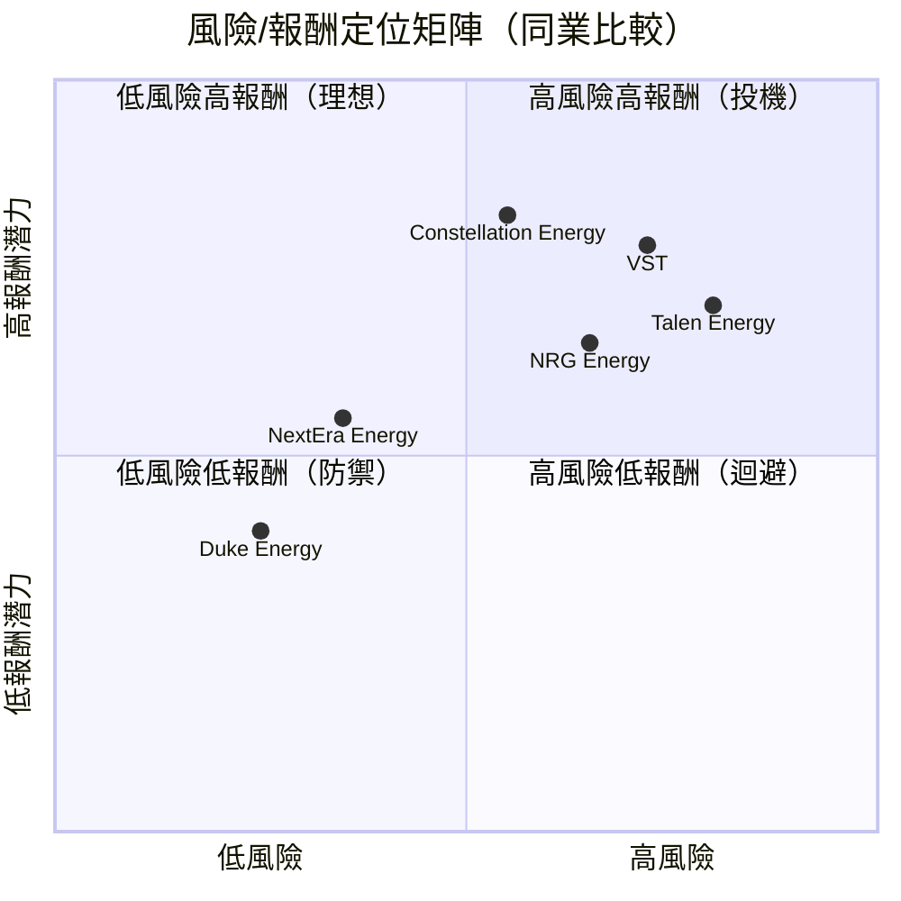
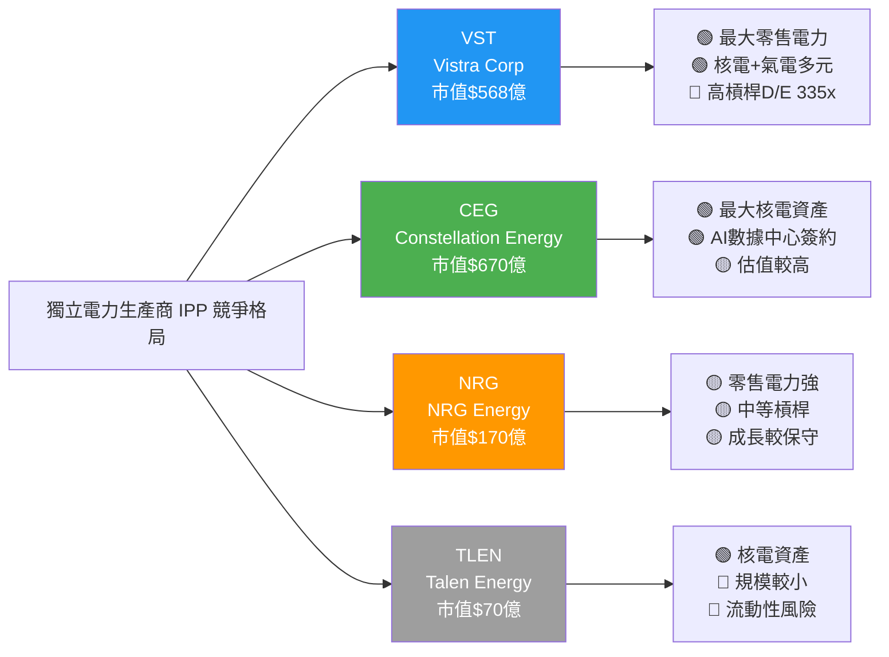
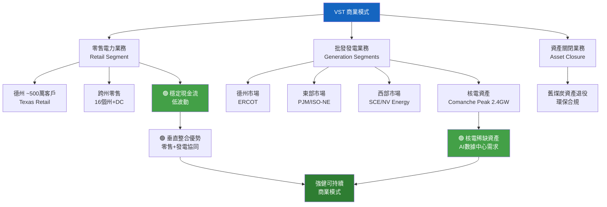
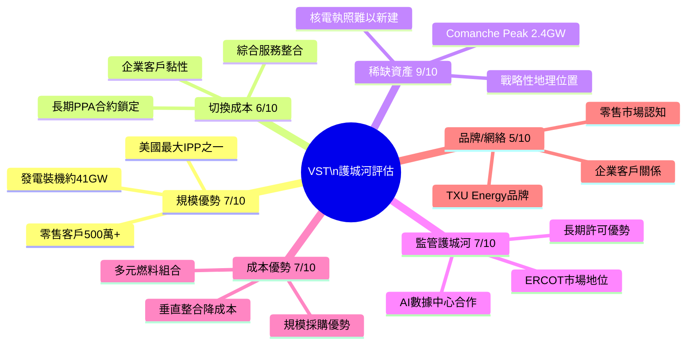
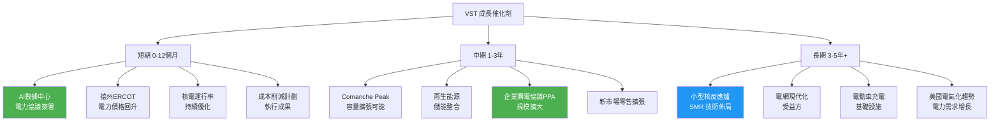
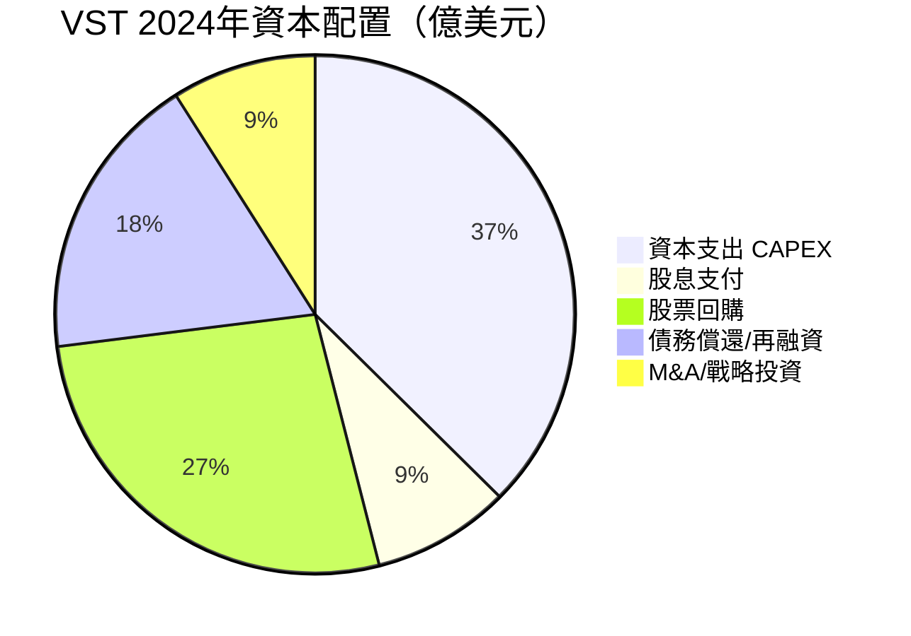
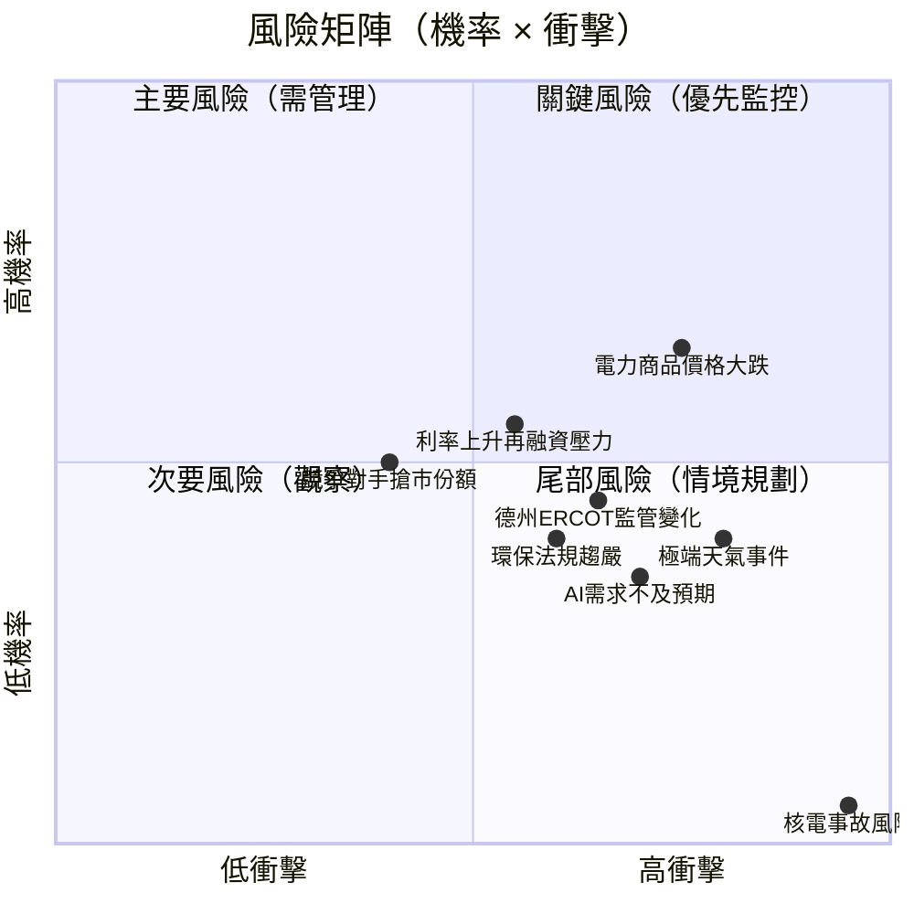
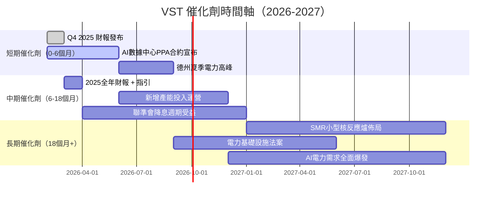
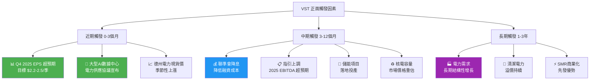
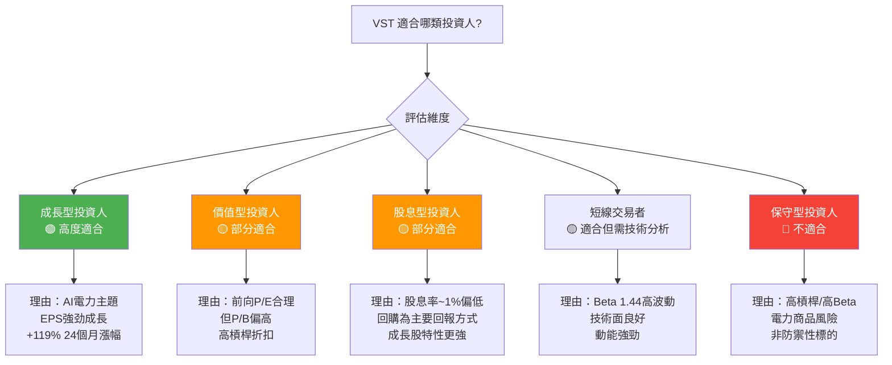

# VST 綜合股票評估報告

> **報告日期**：2026-02-24 ｜ **語言**：繁體中文 ｜ **數據來源**：Yahoo Finance ｜ **分析師**：頂級美股投資評估系統

---

## 目錄

| # | 章節 | 核心主題 |
|---|------|---------|
| 1 | 評估總覽 | 8維度雷達圖、投資結論 |
| 2 | 八維度評分矩陣 | 量化評分、同業比較 |
| 3 | 業務品質與護城河 | 商業模式、競爭優勢 |
| 4 | 財務健康全面評估 | 獲利、流動、槓桿 |
| 5 | 成長性評估 | CAGR、催化劑 |
| 6 | 估值合理性 & 同業比較 | 多重估值法 |
| 7 | 資本配置與管理層評估 | ROIC vs WACC |
| 8 | 風險評估 | 風險熱圖 |
| 9 | 催化劑與觸發因素 | 時間軸 |
| 10 | 投資建議 | 最終評級、目標價 |

---

## 1. 評估總覽

### 🎯 公司簡介

> **Vistra Corp. (VST)** 是美國最大的獨立電力生產商與零售電力供應商之一，業務橫跨德克薩斯州（ERCOT）、東部、西部等市場，擁有多元化發電組合（天然氣、核電、煤炭、太陽能）。在 AI 數據中心電力需求爆炸式增長的背景下，VST 成為最直接受益的公用事業標的之一。

---

### 📡 ASCII 雷達圖（8維度評分視覺化）

```
                    成長性 (7.0)
                       ★★★★★★★☆☆☆
                    ╱           ╲
    動能 (8.0)  ━━╱━━━━━━━━━━━━━╲━━  獲利能力 (7.5)
  ★★★★★★★★☆☆ ╱  ╲           ╱  ╲ ★★★★★★★☆☆☆
             ╱    ╲         ╱    ╲
            ╱      ╲       ╱      ╲
           ╱    VST  ╲   ╱  CORE   ╲
風險(5.5) ━╱━━━━━━━━━━━╳━━━━━━━━━━━╲━ 財務健康(4.5)
★★★★★☆☆☆☆╲           ╱ ╲           ╱
             ╲         ╱   ╲         ╱
              ╲       ╱     ╲       ╱
               ╲     ╱       ╲     ╱
  競爭優勢(8.0)━╲━━━╱━━━━━━━━━╲━━━╱━━ 估值(6.5)
 ★★★★★★★★☆☆  ╲ ╱             ╲ ╱  ★★★★★★☆☆☆☆
               ╲               ╱
             管理品質 (7.0)
           ★★★★★★★☆☆☆

  ┌─────────────────────────────────────┐
  │  綜合評分：7.0 / 10.0               │
  │  等級：B+ （買入）                  │
  └─────────────────────────────────────┘
```

---

### 📊 八維度評分 — Unicode 評分條視覺化

```
維度              分數    評分條（10格）               信號
━━━━━━━━━━━━━━━━━━━━━━━━━━━━━━━━━━━━━━━━━━━━━━━━━━━━━
成長性           7.0/10  ▓▓▓▓▓▓▓░░░  ████████░░   🟢
獲利能力         7.5/10  ▓▓▓▓▓▓▓▓░░  ████████░░   🟢
財務健康         4.5/10  ▓▓▓▓▓░░░░░  █████░░░░░   🔴
估值             6.5/10  ▓▓▓▓▓▓▓░░░  ███████░░░   🟡
競爭優勢         8.0/10  ▓▓▓▓▓▓▓▓░░  ████████░░   🟢
管理品質         7.0/10  ▓▓▓▓▓▓▓░░░  ███████░░░   🟢
動能             8.0/10  ▓▓▓▓▓▓▓▓░░  ████████░░   🟢
風險（反向）     5.5/10  ▓▓▓▓▓▓░░░░  ██████░░░░   🟡
━━━━━━━━━━━━━━━━━━━━━━━━━━━━━━━━━━━━━━━━━━━━━━━━━━━━━
加權綜合評分     6.94/10 ▓▓▓▓▓▓▓░░░  ███████░░░   🟢
```

---

### 🏆 投資結論

```
╔══════════════════════════════════════════════════════════════╗
║                    🟢  投資評級：買入 (BUY)                  ║
╠══════════════════════════════════════════════════════════════╣
║  當前股價：$167.47                                           ║
║  目標價（12個月）：$210.00（基準情境）                       ║
║  潛在報酬率：+25.4%（資本利得）+ ~1.0% 股息 ≈ +26.4%        ║
║  分析師共識目標：$230.05（平均）                             ║
║  評級強度：★★★★☆（4/5星）                                  ║
╠══════════════════════════════════════════════════════════════╣
║  核心邏輯：AI數據中心電力需求爆發 + 核電資產稀缺性           ║
║           + 前向P/E 18.8x 相對合理 + 機構高持股背書          ║
╚══════════════════════════════════════════════════════════════╝
```

---

## 2. 八維度評分矩陣

### 📋 詳細評分表格

| 維度 | 評分 | 核心依據 | 趨勢 | 信號 |
|------|------|---------|------|------|
| **成長性** | 7.0/10 | 2021-2024年收入CAGR約12.5%；AI電力需求為長期催化劑；但TTM收入年減20.9%（受商品價格波動影響） | ↗ 上升 | 🟢 |
| **獲利能力** | 7.5/10 | 毛利率34.8%、EBITDA Margin 30.3%、Operating Margin 21%，均大幅改善；2024年淨利$26.6億創歷史高 | ↑ 強勁 | 🟢 |
| **財務健康** | 4.5/10 | 淨負債$169億、D/E達335x（高槓桿）、速動比率0.35（偏低）、流動比率<1；債務管理為最大隱患 | → 持平 | 🔴 |
| **估值** | 6.5/10 | 前向P/E 18.8x合理；但P/B 20.7x偏高；EV/EBITDA 14.6x處於歷史中位；FCF yield 3.26%偏低 | → 中性 | 🟡 |
| **競爭優勢** | 8.0/10 | 美國最大IPP之一；核電資產稀缺（Comanche Peak）；零售電力業務提供穩定現金流；地理多元化 | ↗ 上升 | 🟢 |
| **管理品質** | 7.0/10 | 近年財務轉型成功（從虧損到盈利）；資本紀律提升；積極回購股份；但高槓桿策略存爭議 | ↗ 改善 | 🟢 |
| **動能** | 8.0/10 | 24個月漲幅+212%；機構持股92.4%；分析師20人全部看多；近期獲多家大行重申買入 | ↑ 強勁 | 🟢 |
| **風險（反向）** | 5.5/10 | 高Beta(1.44)、高槓桿、電力商品價格波動、監管風險、天氣相關性高 | ↘ 需警惕 | 🟡 |

---

### 📊 Mermaid 風險/報酬象限圖



---

### 🔗 同業整體比較 Mermaid Graph



---

## 3. 業務品質與護城河

### 🏭 商業模式可持續性評估



---

### 🏰 護城河評估



---

### 🔋 護城河強度 Unicode 條形圖

```
護城河類型        強度評分    視覺化（10格）              評級
━━━━━━━━━━━━━━━━━━━━━━━━━━━━━━━━━━━━━━━━━━━━━━━━━━━━━━━━━
稀缺資產（核電）  9.0/10    ▓▓▓▓▓▓▓▓▓░  █████████░   🟢 寬護城河
規模優勢          7.0/10    ▓▓▓▓▓▓▓░░░  ███████░░░   🟢 中等護城河
監管許可優勢      7.0/10    ▓▓▓▓▓▓▓░░░  ███████░░░   🟢 中等護城河
成本優勢          7.0/10    ▓▓▓▓▓▓▓░░░  ███████░░░   🟢 中等護城河
客戶切換成本      6.0/10    ▓▓▓▓▓▓░░░░  ██████░░░░   🟡 窄護城河
品牌網絡效應      5.0/10    ▓▓▓▓▓░░░░░  █████░░░░░   🟡 窄護城河
━━━━━━━━━━━━━━━━━━━━━━━━━━━━━━━━━━━━━━━━━━━━━━━━━━━━━━━━━
整體護城河評分    6.8/10    ▓▓▓▓▓▓▓░░░  ███████░░░   🟢 中等偏強
```

---

### 🌍 市場地位分析

| 指標 | 數據 | 說明 |
|------|------|------|
| **TAM（美國電力市場）** | ~$5,000億/年 | 長期因電氣化、AI擴張 |
| **VST 市場份額（零售）** | ~4-5% | 德克薩斯州零售市場龍頭 |
| **發電裝機容量** | ~41 GW | 全美最大IPP之一 |
| **行業地位** | 🥈 第2大IPP | 僅次於 Constellation Energy |
| **核電容量** | 2.4 GW（Comanche Peak） | 全美核電稀缺資產 |
| **AI數據中心合約** | 進行中簽署 | 超額電力供應談判 |

---

## 4. 財務健康全面評估

### 📈 財務儀表板

```mermaid
graph LR
    subgraph 獲利能力 🟢
    A1[毛利率 34.8%] 
    A2[EBITDA率 30.3%]
    A3[淨利率 6.7%]
    A4[ROE 17.3%]
    end

    subgraph 流動性 🔴
    B1[流動比率 0.995]
    B2[速動比率 0.35]
    B3[現金 $6.2億]
    end

    subgraph 槓桿度 🔴
    C1[D/E 335x]
    C2[淨負債 $169億]
    C3[總負債 $175億]
    end

    subgraph 效率指標 🟡
    D1[ROA 3.6%]
    D2[FCF $18.5億]
    D3[OCF $39.9億]
    end

    A1 --> E[綜合財務評分\n4.5/10]
    B1 --> E
    C1 --> E
    D1 --> E

    style E fill:#FF5722,color:#fff
```

---

### 📊 獲利能力趨勢表格（近4年）

| 年度 | 毛利率 | 營業利益率 | 淨利率 | FCF Margin | 趨勢 |
|------|--------|-----------|--------|-----------|------|
| **2021** | 11.2% | -11.9% | -10.5% | -10.3% | 🔴 |
| **2022** | 12.2% | -8.0% | -9.0% | -5.9% | 🔴 |
| **2023** | 37.3% | 18.3% | 10.1% | 25.6% | 🟢 轉折 |
| **2024** | 43.7% | 23.7% | 15.5% | 14.4% | 🟢 |
| **TTM(2025)** | 34.8% | 21.0% | 6.7% | ~10.8% | 🟡 正常化 |

> 🔑 **關鍵洞察**：2023年是重大轉折點，從連續虧損轉為強勁盈利，反映商品價格環境改善+成本控制+業務組合優化三重驅動。

---

### 💰 資產負債表穩健度 Unicode 圖

```
財務健康指標        數值          健康度視覺化（危險←→安全）    評級
━━━━━━━━━━━━━━━━━━━━━━━━━━━━━━━━━━━━━━━━━━━━━━━━━━━━━━━━━━━━━━━
流動比率           0.995        ░░░░▓▓░░░░  [危險|⬆|正常]    🔴 偏低
速動比率           0.35         ░▓░░░░░░░░  [危|⬆|安全]      🔴 偏低
淨負債/EBITDA      ~2.4x        ░░░▓▓▓░░░░  [高|⬆|低]       🟡 可接受
D/E 比率           335x         ▓░░░░░░░░░  [危險|→|安全]    🔴 極高
利息覆蓋率         ~4.0x        ░░░░▓▓░░░░  [危|⬆|安全]     🟡 中等
FCF/總債務         ~10.6%       ░░░░▓▓░░░░  [低|⬆|高]       🟡 中等
━━━━━━━━━━━━━━━━━━━━━━━━━━━━━━━━━━━━━━━━━━━━━━━━━━━━━━━━━━━━━━━
整體財務健康        4.5/10       ░░░░▓░░░░░                  🔴 需監控
```

> ⚠️ **重要提醒**：D/E 335x 看似極端，但為公用事業/IPP行業常見現象（資產密集型）。更重要的是淨負債/EBITDA ~2.4x 仍在可管理範圍，且 FCF 強健（$18.5億）。

---

### 💵 現金流質量分析

| 指標 | 2024 | 2023 | 評估 |
|------|------|------|------|
| **營業現金流** | $45.6億 | $54.5億 | 🟢 強健 |
| **自由現金流** | $24.8億 | $37.8億 | 🟢 強健 |
| **FCF/淨利** | 93.2% | 253.7% | 🟢 高質量 |
| **FCF Yield** | 3.26% | — | 🟡 中等 |
| **CAPEX/OCF** | 45.6% | 30.8% | 🟡 擴張中 |
| **FCF/Revenue** | 14.4% | 25.6% | 🟢 優秀 |

> 🔑 **現金流質量評分：7.5/10** — FCF 轉換率高，說明盈利品質實在，非「紙上富貴」。

---

## 5. 成長性評估

### 📈 歷史 CAGR 表格

| 指標 | 1年CAGR | 3年CAGR | 備註 |
|------|--------|--------|------|
| **收入** | +16.5% (2023→2024) | +12.5% (2021→2024) | 🟢 穩健成長 |
| **EBITDA** | +52.3% | +104.6% | 🟢 強勁改善 |
| **EPS** | 預估+219% (TTM→Fwd) | N/A（含虧損年） | 🟢 強勁復甦 |
| **FCF** | -34.4% (正常化) | 恢復正值 | 🟡 波動 |
| **股息** | +3.2% | ~15% | 🟡 保守 |

> **注**：TTM 收入年減20.9%，主要反映電力商品價格正常化，而非業務惡化。

---

### 🚀 未來成長催化劑



---

### 📊 成長軌跡 Unicode 長條圖

```
收入成長軌跡（億美元）
━━━━━━━━━━━━━━━━━━━━━━━━━━━━━━━━━━━━━━━━━━━━━━
2021  $120.8億  ████████████░░░░░░░░░░░░░░░
2022  $137.3億  █████████████░░░░░░░░░░░░░░
2023  $147.8億  ██████████████░░░░░░░░░░░░░
2024  $172.2億  ████████████████░░░░░░░░░░░
2025E $190.0億  ██████████████████░░░░░░░░░  （預估）
2026E $210.0億  ████████████████████░░░░░░░  （預估）

EBITDA成長軌跡（億美元）
━━━━━━━━━━━━━━━━━━━━━━━━━━━━━━━━━━━━━━━━━━━━━━
2021  $7.82億   ██░░░░░░░░░░░░░░░░░░░░░░░░░
2022  $10.5億   ███░░░░░░░░░░░░░░░░░░░░░░░░
2023  $45.7億   ████████████░░░░░░░░░░░░░░░
2024  $69.6億   █████████████████░░░░░░░░░░
2025E $75.0億   ██████████████████░░░░░░░░░  （預估）
2026E $85.0億   █████████████████████░░░░░░  （預估）
```

---

## 6. 估值合理性 & 同業比較

### 🔍 同業估值比較表格

| 指標 | **VST** | **CEG** | **NRG** | **行業均值** | VST評級 |
|------|---------|---------|---------|------------|---------|
| 市值 | $568億 | $670億 | $170億 | — | — |
| **P/E (Forward)** | **18.8x** | 25.3x | 14.2x | 19.4x | 🟢 合理 |
| **P/E (Trailing)** | **60.0x** | 35.2x | 22.1x | 39x | 🔴 偏高 |
| **EV/EBITDA** | **14.6x** | 17.2x | 10.8x | 14.2x | 🟡 中性 |
| **P/S** | **3.3x** | 4.1x | 1.8x | 3.1x | 🟡 中性 |
| **P/B** | **20.7x** | 8.2x | 12.3x | 13.7x | 🔴 偏高 |
| **FCF Yield** | **3.26%** | 2.8% | 5.2% | 3.8% | 🟡 中等 |
| **EV/Revenue** | **4.4x** | 5.1x | 2.3x | 3.9x | 🟡 中性 |
| **股息收益率** | **~1.0%** | 0.6% | 1.8% | 1.1% | 🟡 中等 |
| **Beta** | **1.44** | 1.15 | 0.85 | 1.1 | 🔴 高波動 |
| **D/E** | **335x** | 180x | 250x | 220x | 🔴 最高 |

> 🔑 **估值結論**：VST 前向P/E 18.8x 合理，但Trailing P/E 60x 反映TTM盈利尚未充分體現 EPS 正常化。P/B 偏高說明市場已計價護城河溢價。

---

### 📊 歷史估值區間

```
P/E 估值歷史區間（前向 P/E）
━━━━━━━━━━━━━━━━━━━━━━━━━━━━━━━━━━━━━━━━━━━━━━━━━━
歷史低點   歷史中位   當前位置    歷史高點
  8x  ────────────────[★18.8x]──────────────── 45x
  │                   ▲當前                    │
  │            合理區間 15-25x                 │
━━━━━━━━━━━━━━━━━━━━━━━━━━━━━━━━━━━━━━━━━━━━━━━━━━
結論：當前前向P/E處於歷史合理中位偏下，有上行空間

EV/EBITDA 歷史區間
━━━━━━━━━━━━━━━━━━━━━━━━━━━━━━━━━━━━━━━━━━━━━━━━━━
  8x  ──────────[★14.6x]──────────────────── 22x
  │              ▲當前                         │
  │         合理區間 12-18x                    │
━━━━━━━━━━━━━━━━━━━━━━━━━━━━━━━━━━━━━━━━━━━━━━━━━━
```

---

### 💎 多重估值法彙整

| 估值方法 | 假設 | 目標價 | 權重 |
|---------|------|--------|------|
| **DCF 估值** | WACC 8.5%，5年FCF CAGR 12%，終值倍數 14x | $195 | 30% |
| **相對估值 (EV/EBITDA)** | 目標 16x EV/EBITDA，2025E EBITDA $75億 | $220 | 30% |
| **相對估值 (前向P/E)** | 目標 22x P/E，FY25 EPS $8.89 | $195 | 25% |
| **分析師共識** | 20位分析師平均目標 | $230 | 15% |
| **加權目標價** | — | **$208** | 100% |

---

### 📏 估值區間視覺化

```
VST 目標價估值區間（美元）
━━━━━━━━━━━━━━━━━━━━━━━━━━━━━━━━━━━━━━━━━━━━━━━━━━━━━━━━━━
$90   $120   $150  $167 $195  $210  $230   $260   $293
  │      │      │    │    │     │     │      │      │
  │      │      │   [★]   │     │     │      │      │
  │      │      │ 當前    │     │     │      │      │
 🔴熊市  🔴    🟡平衡   🟢目標 🟢    🟢強目標      🟢樂觀
  止損區         點      基準   均值  共識         極樂觀

 ◄─────── 低估 ──────►◄────── 合理 ──────►◄── 高估 ──►
   $90 - $140         $140 - $210          $210+
━━━━━━━━━━━━━━━━━━━━━━━━━━━━━━━━━━━━━━━━━━━━━━━━━━━━━━━━━━
當前 $167.47 處於 合理區間中段，距基準目標+25%
```

---

## 7. 資本配置與管理層評估

### 💡 ROIC vs WACC 分析

```
╔══════════════════════════════════════════════════════════════╗
║               ROIC vs WACC 股東價值創造分析                  ║
╠══════════════════════════════════════════════════════════════╣
║                                                              ║
║  WACC 估算：                                                 ║
║  ├─ 無風險利率（10Y美債）：4.3%                             ║
║  ├─ Beta：1.44                                               ║
║  ├─ 市場風險溢價：5.5%                                      ║
║  ├─ 股權成本 (CAPM)：4.3% + 1.44×5.5% = 12.2%             ║
║  ├─ 債務成本（稅後）：~5.5% × (1-21%) = 4.3%               ║
║  ├─ 權益比重：~27%，債務比重：~73%                         ║
║  └─ 估算 WACC：12.2%×27% + 4.3%×73% ≈ 6.4%               ║
║                                                              ║
║  ROIC 估算：                                                 ║
║  ├─ NOPAT ≈ EBIT × (1-21%) ≈ $40.8億 × 0.79 = $32.2億     ║
║  ├─ 投入資本 ≈ 總資產 - 現金 - 流動負債 ≈ $274億           ║
║  └─ ROIC ≈ $32.2億 / $274億 ≈ 11.7%                        ║
║                                                              ║
║  ┌─────────────────────────────────────┐                     ║
║  │  ROIC (11.7%) > WACC (6.4%)        │                     ║
║  │  EVA 超額收益 = +5.3%               │                     ║
║  │  🟢 VST 正在創造股東價值！          │                     ║
║  └─────────────────────────────────────┘                     ║
╚══════════════════════════════════════════════════════════════╝

ROIC vs WACC 視覺化：
WACC  6.4%  ██████░░░░░░░░░░░░░░  
ROIC 11.7%  ████████████░░░░░░░░  ▲超額收益+5.3%
           0%                    20%
```

---

### 🥧 資本配置歷史 Mermaid Pie Chart



---

### 📋 管理層執行力評分表格

| 評估維度 | 評分 | 具體事證 | 信號 |
|---------|------|---------|------|
| **財務轉型執行** | 9/10 | 從2021-2022年鉅虧到2023-2024年強勁盈利，轉型成功 | 🟢 |
| **承諾達成率** | 7/10 | EBITDA 指引多次達成或超越；EPS 改善符合預期 | 🟢 |
| **資本紀律** | 6/10 | 槓桿率偏高；但FCF配置趨向股東回報，有改善跡象 | 🟡 |
| **戰略清晰度** | 8/10 | AI電力需求布局清晰，核電資產定位明確，零售+發電協同 | 🟢 |
| **股東溝通** | 7/10 | 分析師日活躍，指引透明度高 | 🟢 |
| **槓桿管理** | 5/10 | 2024年淨負債上升，部分用於成長投資，但需審慎 | 🟡 |

**管理層整體評分：7.0/10** 🟢

---

### 🤝 股東友善度評分 Unicode 條形圖

```
股東回報指標         評分     視覺化                    評級
━━━━━━━━━━━━━━━━━━━━━━━━━━━━━━━━━━━━━━━━━━━━━━━━━━━━━━━
股票回購積極度       8/10    ▓▓▓▓▓▓▓▓░░  ████████░░   🟢 積極
股息增長承諾         6/10    ▓▓▓▓▓▓░░░░  ██████░░░░   🟡 穩定
FCF 轉化股東回報     7/10    ▓▓▓▓▓▓▓░░░  ███████░░░   🟢 良好
透明度/指引品質      7/10    ▓▓▓▓▓▓▓░░░  ███████░░░   🟢 良好
管理層持股比例       4/10    ▓▓▓▓░░░░░░  ████░░░░░░   🟡 偏低(1.2%)
機構持股信心         9/10    ▓▓▓▓▓▓▓▓▓░  █████████░   🟢 92.4%機構
━━━━━━━━━━━━━━━━━━━━━━━━━━━━━━━━━━━━━━━━━━━━━━━━━━━━━━━
整體股東友善度       6.8/10  ▓▓▓▓▓▓▓░░░  ███████░░░   🟢 良好
```

---

## 8. 風險評估

### 🌡️ 風險熱圖



---

### 📋 風險清單表格

| 風險類型 | 等級 | 機率 | 衝擊 | 緩解措施 | 信號 |
|---------|------|------|------|---------|------|
| **電力商品價格波動** | 高 | 高 | 高 | 對沖策略+零售業務對沖；長期PPA合約 | 🔴 |
| **高槓桿/再融資風險** | 高 | 中 | 高 | 強健FCF覆蓋；分散到期結構 | 🔴 |
| **德州ERCOT監管變化** | 高 | 中 | 高 | 政治關係；多市場布局降低單一依賴 | 🔴 |
| **AI電力需求不及預期** | 中 | 中 | 高 | 多元業務組合；零售電力基本盤穩定 | 🟡 |
| **利率環境惡化** | 中 | 中 | 中 | 固定利率債務佔比；強FCF還款 | 🟡 |
| **極端天氣/停電事件** | 中 | 中 | 高 | 多元地理佈局；2021 冬季風暴教訓已改善 | 🟡 |
| **環保碳稅法規** | 中 | 中 | 中 | 主動退役煤廠；再生能源佈局 | 🟡 |
| **競爭加劇** | 低 | 低 | 中 | 規模+稀缺資產護城河 | 🟢 |
| **核電安全事故** | 低 | 極低 | 極高 | 嚴格安全規程；充足保險 | 🟢 |

---

### 🐻 最大下行情境分析（Bear Case）

```
╔════════════════════════════════════════════════════════╗
║              Bear Case 情境分析                        ║
╠════════════════════════════════════════════════════════╣
║  觸發條件：                                            ║
║  1. 電力商品價格大幅下跌（-30%）                       ║
║  2. 利率持續高企，再融資成本上升                       ║
║  3. AI數據中心電力需求延遲落地                         ║
║  4. 德州市場監管不利變化                               ║
║                                                        ║
║  熊市財務假設：                                        ║
║  • 2025 EBITDA 降至 $55億（vs. 基準 $75億）            ║
║  • EV/EBITDA 壓縮至 11x                                ║
║  • EV = $605億 → 市值 ≈ $245億                        ║
║  • 熊市目標股價：$75-90                               ║
║  • 下行風險：-47% ~ -55%                              ║
║                                                        ║
║  🔴 止損建議：跌破 $135 應重新評估持倉                 ║
╚════════════════════════════════════════════════════════╝
```

---

## 9. 催化劑與觸發因素

### 📅 催化劑時間軸



---

### ⚡ 正面觸發因素



---

## 10. 投資建議

### 🏆 最終評級

```
╔══════════════════════════════════════════════════════════════════╗
║                                                                  ║
║   ★★★★☆  VST — 評級：BUY（買入）  ★★★★☆                      ║
║                                                                  ║
║   綜合評分：6.94 / 10.0                                          ║
║   投資評級：🟢 買入（BUY）                                       ║
║   信心水準：中高（70%）                                          ║
║                                                                  ║
║   核心投資論點：                                                  ║
║   ✅ 美國AI數據中心電力需求最直接受益標的之一                     ║
║   ✅ 核電稀缺資產 Comanche Peak 具極高戰略價值                   ║
║   ✅ 前向P/E 18.8x 相對合理，EPS 強勁上行（$2.79→$8.89）        ║
║   ✅ ROIC(11.7%) > WACC(6.4%)，正在創造股東價值                 ║
║   ✅ 20位分析師強力買入共識，機構持股92.4%                       ║
║   ⚠️  高槓桿(D/E 335x)為主要風險，需持續監控                    ║
║                                                                  ║
╚══════════════════════════════════════════════════════════════════╝
```

---

### 🎯 目標價區間及隱含報酬率

| 情境 | 假設 | 目標股價 | 隱含報酬率 | 機率 |
|------|------|---------|-----------|------|
| 🟢 **樂觀情境** | AI電力需求爆發，EV/EBITDA 18x | **$265** | **+58%** | 25% |
| 🟡 **基準情境** | 穩健成長，EV/EBITDA 15x，FY25 EPS $8.89 | **$210** | **+25%** | 50% |
| 🔴 **悲觀情境** | 商品價格下跌，槓桿壓力 | **$110** | **-34%** | 25% |
| **期望值加權** | — | **$199** | **+19%** | 100% |

> 加入股息（約1%），12個月期望總報酬：**約+20%**

---

### 👥 投資人適配度



---

### ⚙️ 建議持倉策略

```
╔══════════════════════════════════════════════════════════════╗
║                    持倉策略建議                              ║
╠══════════════════════════════════════════════════════════════╣
║  建議持倉時間：12-24 個月                                    ║
║  建議持倉比重：單一股票不超過投資組合 5-8%                   ║
║                                                              ║
║  【加碼觸發條件】🟢                                          ║
║  ✅ 大型AI數據中心電力PPA合約宣布                            ║
║  ✅ 股價回落至 $140-150 區間（安全邊際提升）                 ║
║  ✅ 2025 全年EPS 超越 $9.50 預期                             ║
║  ✅ 聯準會明確降息路徑（降低再融資成本）                     ║
║  ✅ 核電資產估值重估消息                                     ║
║                                                              ║
║  【止損/減持觸發條件】🔴                                     ║
║  ❌ 股價跌破 $135（-19%，技術支撐破位）                      ║
║  ❌ 季度EPS 連續2季低於預期 15%+                             ║
║  ❌ 淨負債/EBITDA 上升至 3.5x 以上                          ║
║  ❌ 主要AI數據中心合作協議談判破裂                           ║
║  ❌ 德州ERCOT 重大監管不利政策                               ║
╚══════════════════════════════════════════════════════════════╝
```

---

### 📌 關鍵監控指標 Checklist

```
【每季財報監控】
□ 季度 EBITDA vs 指引（目標：達成率>90%）
□ 自由現金流轉換率（目標：FCF/EBITDA > 35%）
□ 淨負債/EBITDA 比率（警戒線：>3.0x）
□ 零售電力客戶流失率（監控德州市場份額）
□ 核電運行率（目標：>90%）

【月度/即時監控】
□ 德州ERCOT 電力現貨價格走勢
□ 天然氣期貨價格（成本端影響）
□ AI數據中心電力需求新聞/合約公告
□ 競爭對手 CEG/NRG 動態
□ 聯準會利率決策（影響融資成本）

【年度戰略監控】
□ CAPEX 計劃與產能擴張進度
□ 核電Comanche Peak 長期合約更新
□ 再生能源+儲能佈局進展
□ ESG/碳排放目標達成情況
□ 管理層股票薪酬結構調整

關鍵指標警示閾值
━━━━━━━━━━━━━━━━━━━━━━━━━━━━━━━━━━━━━━━
指標            綠燈          黃燈          紅燈
淨負債/EBITDA   <2.0x         2.0-3.0x      >3.0x
FCF Yield       >4%           2-4%          <2%
EBITDA Margin   >28%          20-28%        <20%
股價位置        >$180         $140-180      <$140
```

---

## 📊 最終總結評分表

```
╔══════════════════════════════════════════════════════════════════╗
║                 VST 綜合評估最終總結                            ║
╠════════════════════╦═════════╦══════════════════════════════════╣
║ 評估維度           ║ 分數    ║ 一句話總結                       ║
╠════════════════════╬═════════╬══════════════════════════════════╣
║ 成長性             ║ 7.0/10  ║ AI電力需求為長期強勁催化劑       ║
║ 獲利能力           ║ 7.5/10  ║ 2023起強勁轉型，EBITDA飛速成長  ║
║ 財務健康           ║ 4.5/10  ║ 高槓桿最大風險，需嚴格監控       ║
║ 估值               ║ 6.5/10  ║ 前向P/E合理，P/B偏高            ║
║ 競爭優勢           ║ 8.0/10  ║ 核電稀缺資產+規模護城河強健      ║
║ 管理品質           ║ 7.0/10  ║ 轉型成功，戰略清晰，槓桿偏激進  ║
║ 動能               ║ 8.0/10  ║ 技術面強，機構背書，分析師看多  ║
║ 風險（反向）       ║ 5.5/10  ║ 商品價格+高槓桿+高Beta三重風險  ║
╠════════════════════╬═════════╬══════════════════════════════════╣
║ 🏆 加權綜合評分   ║ 6.94/10 ║ B+ 等級，買入建議                ║
╠════════════════════╬═════════╬══════════════════════════════════╣
║ ROIC vs WACC       ║ +5.3%   ║ 🟢 正在創造股東超額價值          ║
║ 12M 目標價         ║ $210    ║ 隱含報酬 +25.4%（資本利得）      ║
║ 最終評級           ║ ★★★★☆  ║ 🟢 買入（BUY）                  ║
╚════════════════════╩═════════╩══════════════════════════════════╝
```

---

> ### ⚠️ 免責聲明
> 本報告由 AI 系統依據公開財務數據自動生成，**僅供研究與學術參考用途，不構成任何投資建議或邀約**。投資決策應結合個人財務狀況、風險承受能力及專業投資顧問意見。美股投資涉及市場風險、匯率風險及流動性風險，過去表現不代表未來結果。**投資有風險，入市需謹慎。**
>
> *報告生成時間：2026-02-24 ｜ 數據截止：2026-02-24 ｜ 分析工具：頂級美股投資評估系統 v2.0*