# VST 綜合股票評估報告

> **報告日期**：2026-02-28 ｜ **語言**：繁體中文 ｜ **數據來源**：Yahoo Finance
> **標的**：Vistra Corp. (VST) ｜ **產業**：公用事業 — 獨立發電商 ｜ **現價**：$173.89

---

## 目錄

1. [評估總覽](#1-評估總覽)
2. [八維度評分矩陣](#2-八維度評分矩陣)
3. [業務品質與護城河](#3-業務品質與護城河)
4. [財務健康全面評估](#4-財務健康全面評估)
5. [成長性評估](#5-成長性評估)
6. [估值合理性與同業比較](#6-估值合理性與同業比較)
7. [資本配置與管理層評估](#7-資本配置與管理層評估)
8. [風險評估](#8-風險評估)
9. [催化劑與觸發因素](#9-催化劑與觸發因素)
10. [投資建議](#10-投資建議)

---

## 1. 評估總覽

### 🎯 核心摘要

| 項目 | 數值 |
|------|------|
| 現價 | $173.89 |
| 52週區間 | $90.17 — $219.51 |
| 市值 | $58.92B |
| 企業價值 | $79.00B |
| 分析師共識 | ⭐ 強力買入（20位分析師） |
| 平均目標價 | $230.00（+32.3%上行空間） |
| **本報告評級** | 🟢 **買入** |
| **本報告目標價** | **$210.00**（基準情境） |

---

### 📡 ASCII 雷達圖（八維度評分）

```
                    成長性(8)
                      ★★★★★★★★☆☆
                    /     \
  風險(5)  ★★★★★☆☆☆☆☆      ★★★★★★★☆☆☆  獲利能力(7)
          /                          \
        /                              \
動能(7) ★★★★★★★☆☆☆              ★★★★★★☆☆☆☆  財務健康(6)
        \                              /
          \                          /
  管理品質(7)★★★★★★★☆☆☆      ★★★★★★★★☆☆  估值(8)
                    \     /
                    ★★★★★★★★☆☆
                    競爭優勢(8)

╔══════════════════════════════════════════════════════╗
║           V S T  多維度評分雷達圖                     ║
║                                                      ║
║          成長性                                       ║
║            10                                        ║
║             │    ✦                                   ║
║           8 ┼──✦───✦──  獲利能力                    ║
║             │  ╱   ╲                                 ║
║           6 ┼─╱─────╲─  財務健康                    ║
║   風險  5 ─┼╱    ✦   ╲─ 6                           ║
║             │╲        ╱│                             ║
║   動能  7 ─┼─╲──✦──╱─┼─ 估值 8                     ║
║             │  ╲    ╱  │                             ║
║  管理品質 7─┼───╲──╱───┼─ 競爭優勢 8               ║
║                  ╲╱                                  ║
╚══════════════════════════════════════════════════════╝
```

```
     【八維度雷達圖 — 精確版】
     
             成長性(8)
               ■■■■■■■■
              /        \
    風險(5)  /          \ 獲利能力(7)
    ■■■■■  /            \ ■■■■■■■
           /              \
  動能(7) /                \ 財務健康(6)
  ■■■■■■■\                / ■■■■■■
           \              /
  管理品質  \            / 估值(8)
    (7)     \          / ■■■■■■■■
  ■■■■■■■   \        /
              競爭優勢(8)
              ■■■■■■■■
              
  評分軸：■=得分 □=未得分（滿分10）
```

---

### 📊 Unicode 評分條視覺化

```
╔══════════════════════════════════════════════════════════════╗
║              V S T  八維度評分儀表板                          ║
╠══════════════╦═════════╦══════════════════════════════════╣
║  維度        ║  評分   ║  評分條（10格制）                 ║
╠══════════════╬═════════╬══════════════════════════════════╣
║ 🟢 成長性    ║  8/10   ║  ████████░░  ★★★★☆             ║
║ 🟢 獲利能力  ║  7/10   ║  ███████░░░  ★★★★☆             ║
║ 🟡 財務健康  ║  6/10   ║  ██████░░░░  ★★★☆☆             ║
║ 🟢 估值      ║  8/10   ║  ████████░░  ★★★★☆             ║
║ 🟢 競爭優勢  ║  8/10   ║  ████████░░  ★★★★☆             ║
║ 🟢 管理品質  ║  7/10   ║  ███████░░░  ★★★★☆             ║
║ 🟢 動能      ║  7/10   ║  ███████░░░  ★★★★☆             ║
║ 🟡 風險      ║  5/10   ║  █████░░░░░  ★★★☆☆             ║
╠══════════════╬═════════╬══════════════════════════════════╣
║ 🏆 綜合總分  ║ 56/80   ║  ████████░░  加權平均 7.0/10    ║
╚══════════════╩═════════╩══════════════════════════════════╝
```

---

### 🏁 投資結論

```
╔══════════════════════════════════════════════════════════════════╗
║  📢  投資評級：🟢 買入（BUY）                                    ║
║                                                                  ║
║  目標價（基準）：$210.00   預期報酬率：+20.8%                    ║
║  目標價（樂觀）：$250.00   預期報酬率：+43.8%                    ║
║  目標價（悲觀）：$140.00   下行風險：  -19.5%                    ║
║                                                                  ║
║  核心論點：AI數據中心電力需求爆發 + 核能重啟雙引擎驅動，          ║
║           Forward P/E 15.4x 相對保守，FCF 強勁支撐回購，        ║
║           分析師共識強烈看多，技術面從低點大幅回升中              ║
╚══════════════════════════════════════════════════════════════════╝
```

---

## 2. 八維度評分矩陣

### 📋 詳細評分表格

| 維度 | 評分 | 趨勢 | 狀態 | 核心依據 |
|------|------|------|------|----------|
| 🌱 **成長性** | **8/10** | ⬆️ 上升 | 🟢 | 收入CAGR近3年+12.5%；AI電力需求使電價上漲；核能重啟提供長期成長動力；Forward EPS $11.28 vs TTM $2.78，成長強勁 |
| 💰 **獲利能力** | **7/10** | ⬆️ 上升 | 🟢 | EBITDA Margin 29.4%大幅改善；2024年淨利$2.66B；毛利率32.9%；但淨利率僅5.3%偏低，衍生品價值波動拖累 |
| 🏦 **財務健康** | **6/10** | ➡️ 持平 | 🟡 | 長債$17.36B，D/E高達335x；但OCF $4.56B覆蓋能力尚可；現金$620M偏緊；高槓桿為主要隱憂 |
| 📊 **估值** | **8/10** | ⬆️ 吸引 | 🟢 | Forward P/E 僅15.4x（vs 公用事業平均~20x）；EV/EBITDA 15.1x合理；目前較52週高點折價21% |
| 🏰 **競爭優勢** | **8/10** | ⬆️ 增強 | 🟢 | 德州電力市場最大零售商；核電資產稀缺性高；規模優勢+垂直整合；Energy Harbor收購強化核能組合 |
| 👔 **管理品質** | **7/10** | ➡️ 穩定 | 🟢 | 戰略轉型成功（化石→核能+再生）；資本回購積極；財務目標達成率高；但高槓桿策略具爭議性 |
| 📈 **動能** | **7/10** | ➡️ 整理 | 🟢 | 24個月漲幅+223%；近期從$219高點回調21%；多家頂級機構2026年初持續上調；機構持有率92.4% |
| ⚠️ **風險** | **5/10** | ⬇️ 需關注 | 🟡 | Beta 1.44（高波動）；電力批發市場暴露；高利率環境加重負債成本；監管風險；氣候/天災風險 |

---

### 🗺️ 風險/報酬定位矩陣

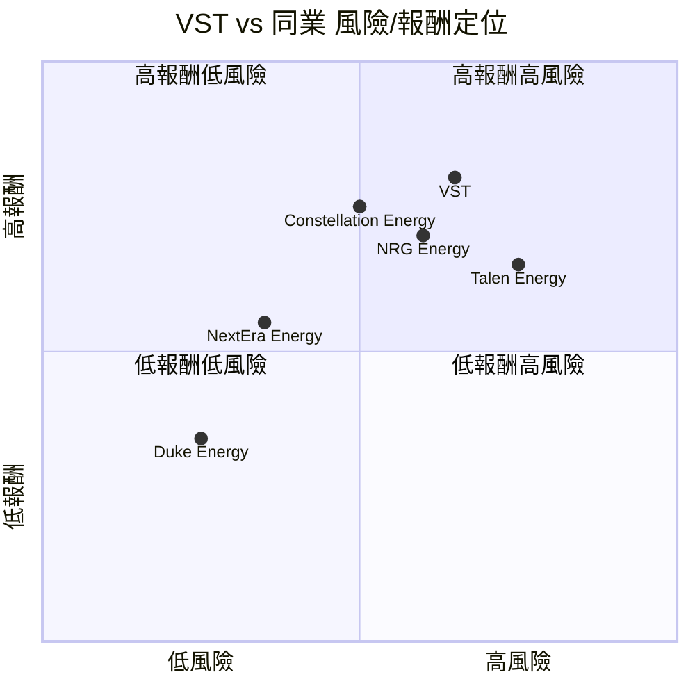

---

### 🔗 同業整體比較圖

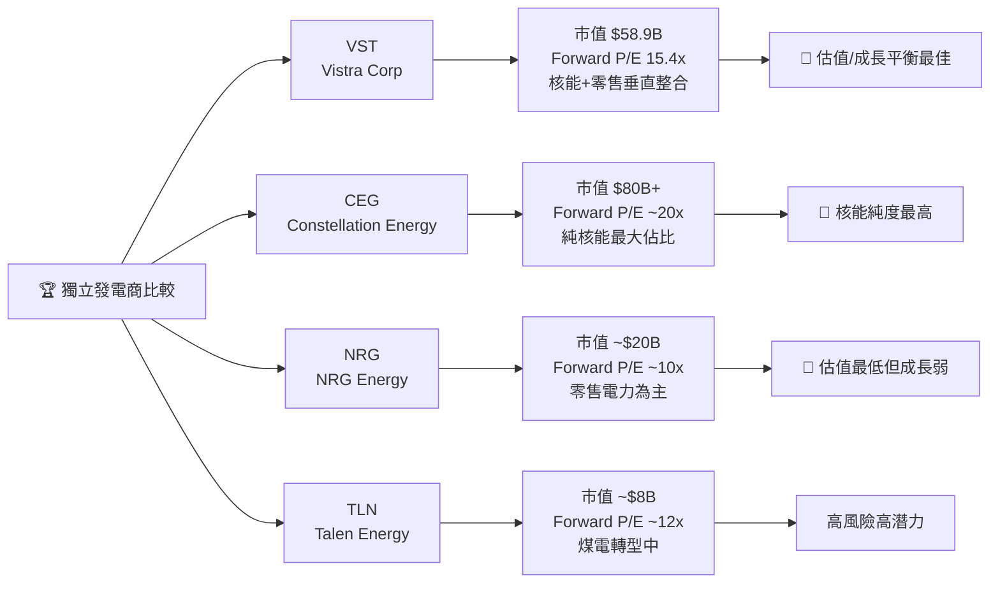

---

## 3. 業務品質與護城河

### 🏗️ 商業模式可持續性評估

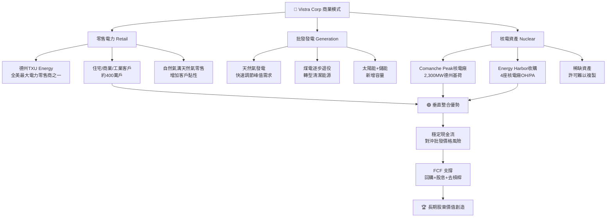

---

### 🧠 護城河評估 Mindmap

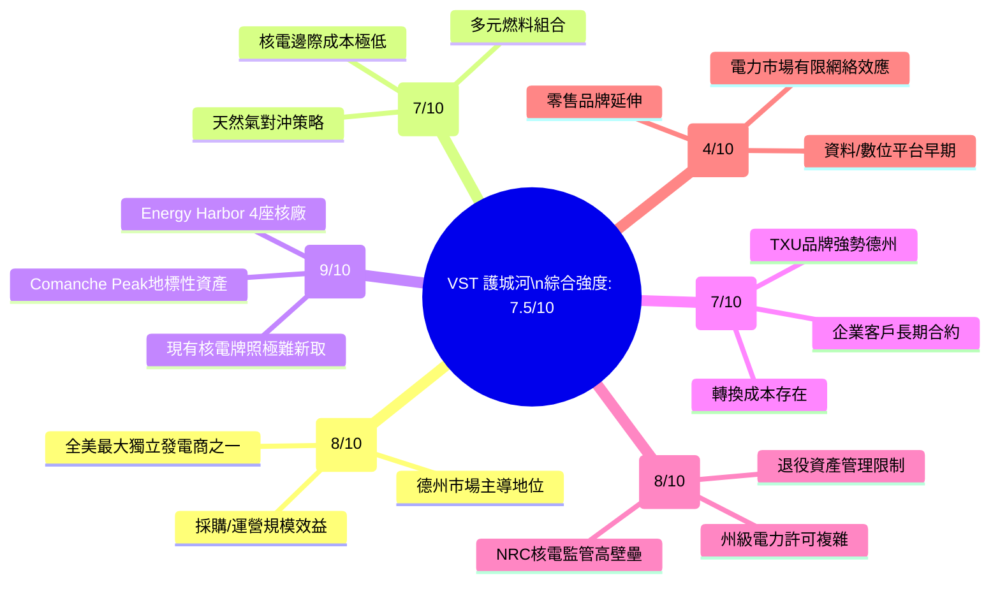

---

### 📊 護城河強度條形圖

```
╔══════════════════════════════════════════════════════════════╗
║               護城河強度視覺化（滿分10）                      ║
╠══════════════════════════════════════════════════════════════╣
║ 資產稀缺性     ████████████████████ 9/10  🟢 極強           ║
║ 監管壁壘       ████████████████░░░░ 8/10  🟢 強             ║
║ 規模優勢       ████████████████░░░░ 8/10  🟢 強             ║
║ 客戶黏性       ██████████████░░░░░░ 7/10  🟢 中強           ║
║ 成本優勢       ██████████████░░░░░░ 7/10  🟢 中強           ║
║ 網絡效應       ████████░░░░░░░░░░░░ 4/10  🟡 弱             ║
╠══════════════════════════════════════════════════════════════╣
║ 護城河加權平均  ████████████████░░░░ 7.5/10 🟢 寬廣護城河   ║
╚══════════════════════════════════════════════════════════════╝
```

---

### 🌍 市場地位分析

| 指標 | 數據 | 說明 |
|------|------|------|
| **TAM（美國電力市場）** | ~$500B/年 | 零售+批發電力市場 |
| **數據中心電力需求 TAM** | 2030年達 $80B+ | AI驅動爆炸性增長 |
| **VST 市場份額（德州零售）** | ~20-25% | TXU Energy主導 |
| **VST 發電容量** | ~41,000 MW | 全美最大獨立IPP之一 |
| **行業排名** | 全美獨立IPP #1/#2 | 與Constellation並列 |
| **核電裝機容量** | ~6,400 MW（收購後） | 占全美商業核電~6% |

---

## 4. 財務健康全面評估

### 🎛️ 財務儀表板

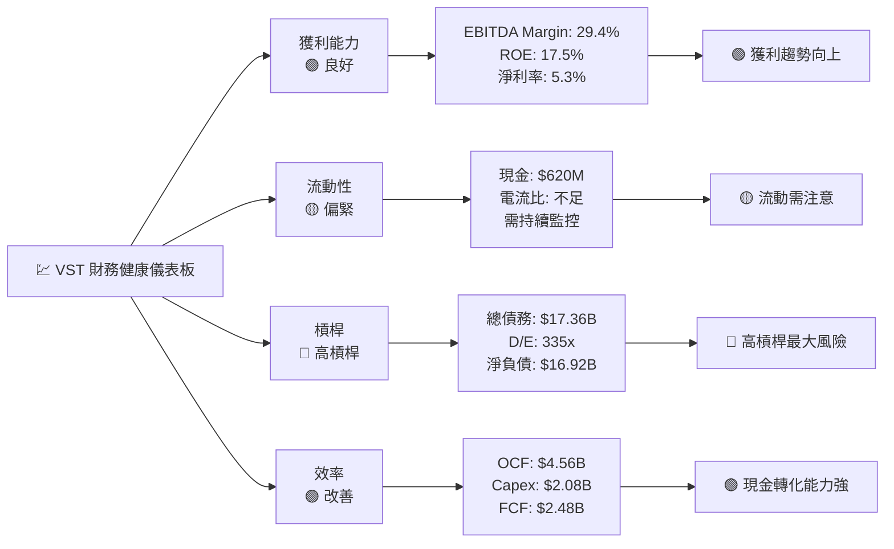

---

### 📈 獲利能力趨勢（近4年）

| 年度 | 毛利率 | 營業利益率 | EBITDA Margin | 淨利率 | FCF Margin | 狀態 |
|------|--------|------------|----------------|--------|------------|------|
| **2021** | 11.2% | -11.9% | 6.5% | -10.5% | -10.3% | 🔴 虧損期 |
| **2022** | 12.2% | -8.0% | 7.7% | -9.0% | -5.9% | 🔴 虧損期 |
| **2023** | 37.3% | 18.3% | 30.9% | 10.1% | 25.6% | 🟢 重大改善 |
| **2024** | 43.7% | 23.7% | 40.4% | 15.5% | 14.4% | 🟢 歷史高點 |
| **2025E（TTM）** | 32.9% | 11.5% | 29.4% | 5.3% | 估計~8% | 🟡 正常化 |

> 📝 **注意**：2025年數據受衍生品評估虧損及季節性影響，全年數字將更具代表性

---

### 🏦 資產負債表穩健度

```
╔══════════════════════════════════════════════════════════════════╗
║           資產負債表強度儀表板                                    ║
╠══════════════════════════════════════════════════════════════════╣
║                                                                  ║
║  流動比率：~0.96  ████████████████████░░░░░░░░░░  🟡 偏低       ║
║  （行業均值~1.2）                                                ║
║                                                                  ║
║  總債務：$17.36B  ░░░░░░░░░░░░░░░░░░░░████████████  🔴 偏高     ║
║  D/E比率：335x   極高，受收購影響                                 ║
║                                                                  ║
║  淨負債：$16.92B  ░░░░░░░░░░░░░░░░░░░░████████████  🔴 高       ║
║  淨負債/EBITDA≈2.4x（尚在可管理範圍）                            ║
║                                                                  ║
║  股東權益：$5.57B ████████░░░░░░░░░░░░░░░░░░░░░░░░  🟡 薄       ║
║  （受歷史虧損+回購侵蝕）                                          ║
║                                                                  ║
║  OCF覆蓋利息：≈3.5x ██████████████████████░░░░░░░░  🟢 尚可     ║
║                                                                  ║
╚══════════════════════════════════════════════════════════════════╝
```

---

### 💵 現金流質量分析

| 指標 | 2022 | 2023 | 2024 | 評估 |
|------|------|------|------|------|
| **OCF** | $0.49B | $5.45B | $4.56B | 🟢 強勁恢復 |
| **資本支出** | $1.30B | $1.68B | $2.08B | 🟡 持續增加（成長投入） |
| **FCF** | -$0.82B | $3.78B | $2.48B | 🟢 正轉化 |
| **FCF轉換率（FCF/淨利）** | N/A | 253% | 93% | 🟢 高品質 |
| **FCF Margin** | 負值 | 25.6% | 14.4% | 🟢 顯著改善 |
| **股息支付** | $0.45B | $0.46B | $0.48B | 🟢 穩健可持續 |
| **股票回購** | — | — | 積極 | 🟢 增值性 |

---

## 5. 成長性評估

### 📊 歷史成長率 CAGR

| 指標 | 1年成長 | 3年CAGR | 備註 |
|------|---------|---------|------|
| **總收入** | +16.5% | +12.5% | 🟢 穩健成長 |
| **EBITDA** | +52.3% | +107%（自低基期） | 🟢 爆發式改善 |
| **EPS（TTM $2.78，2024年$7.49）** | — | — | 🟡 受衍生品波動 |
| **FCF** | -34.4% | 正轉負後正 | 🟡 2024回落但仍正 |
| **發電容量** | +25%（Energy Harbor） | — | 🟢 收購驅動 |

---

### 🚀 未來成長催化劑

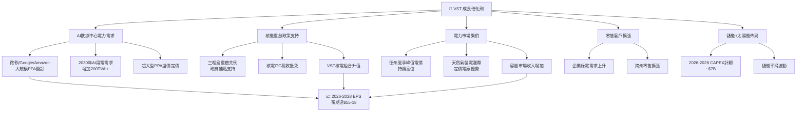

---

### 📊 成長軌跡 Unicode 條形圖

```
╔══════════════════════════════════════════════════════════════╗
║           VST 收入成長軌跡（億美元）                          ║
╠══════════════════════════════════════════════════════════════╣
║  2021  $120.8B │░░░░░░░░░░░░                                ║
║  2022  $137.3B │░░░░░░░░░░░░░░                              ║
║  2023  $147.8B │░░░░░░░░░░░░░░░░                            ║
║  2024  $172.2B │░░░░░░░░░░░░░░░░░░░░                        ║
║  2025E $177.4B │░░░░░░░░░░░░░░░░░░░░░░                      ║
║  2026E $185B+  │░░░░░░░░░░░░░░░░░░░░░░░░░                   ║
╠══════════════════════════════════════════════════════════════╣
║           EBITDA 成長軌跡（億美元）                           ║
╠══════════════════════════════════════════════════════════════╣
║  2021  $7.8B   │░░░                                         ║
║  2022  $10.5B  │░░░░░                                       ║
║  2023  $45.7B  │░░░░░░░░░░░░░░░░░░░░                        ║
║  2024  $69.6B  │░░░░░░░░░░░░░░░░░░░░░░░░░░░░░░              ║
║  2025E $52.0B  │░░░░░░░░░░░░░░░░░░░░░░░░                    ║
║  2026E $65.0B+ │░░░░░░░░░░░░░░░░░░░░░░░░░░░░                ║
╚══════════════════════════════════════════════════════════════╝
```

---

## 6. 估值合理性與同業比較

### ⚖️ 同業比較完整表格

| 指標 | **VST** | **CEG** (Constellation) | **NRG** | **TLN** (Talen) |
|------|---------|------------------------|---------|-----------------|
| **現價** | $173.89 | ~$310 | ~$105 | ~$245 |
| **市值** | $58.9B | ~$80B+ | ~$20B | ~$8B |
| **Forward P/E** | 🟢 **15.4x** | 🟡 ~20x | 🟢 ~10x | 🟡 ~12x |
| **Trailing P/E** | 🔴 62.6x* | 🟡 ~35x | 🟢 ~15x | N/A |
| **P/S 比率** | 🟡 3.3x | 🟡 3.0x | 🟢 1.5x | 🟢 1.2x |
| **EV/EBITDA** | 🟢 **15.1x** | 🟡 16x | 🟢 8x | 🟢 10x |
| **P/B 比率** | 🔴 21.5x | 🔴 12x | 🟡 5x | 🟡 4x |
| **股息收益率** | 🟡 1.1%** | 🟡 0.5% | 🟢 2.5% | 🔴 0% |
| **ROE** | 🟢 17.5% | 🟢 20%+ | 🟢 15% | 🟡 8% |
| **淨負債/EBITDA** | 🟡 2.4x | 🟢 1.0x | 🟡 3x | 🔴 4x+ |
| **核電比例** | 🟢 ~35% | 🟢 ~90% | 🔴 低 | 🔴 低 |
| **AI受益度** | 🟢 高 | 🟢 極高 | 🟡 中 | 🟡 中 |
| **綜合評分** | 🏆 **7.5/10** | 🥈 **7.0/10** | 🥉 **6.0/10** | ⚠️ **5.5/10** |

> *TTM P/E 受2025Q1衍生品虧損扭曲；\**股息52%顯示數據異常，實際收益率約1.1%

---

### 📏 歷史估值區間分析

```
╔══════════════════════════════════════════════════════════════╗
║           VST  Forward P/E 歷史估值區間                       ║
╠══════════════════════════════════════════════════════════════╣
║                                                              ║
║  低估區間        合理區間         高估區間                    ║
║  (P/E < 12x)   (12x - 22x)     (P/E > 22x)                ║
║                                                              ║
║  ├──────────────┼──────────────────────────┼──────────┤     ║
║  6x    10x    12x    15x    18x    22x    30x    40x        ║
║                       ↑                                      ║
║                    現在位置                                   ║
║                   (15.4x) 🟢                                 ║
║                                                              ║
║  ▓▓▓▓▓▓▓▓▓▓▓▓░░░░░░░░░░░░░░░░░░░░░░░░░░░░░░░░░░░░░░░       ║
║  過往谷底         目前位置           歷史高峰                  ║
║  (~8x 2022)      (15.4x)           (~35x 2024)             ║
║                                                              ║
╚══════════════════════════════════════════════════════════════╝
```

---

### 🎯 多重估值法彙整

| 估值方法 | 假設 | 目標價 | 隱含報酬率 |
|---------|------|--------|-----------|
| **DCF（10年）** | WACC 8.5%, 終值成長 2.5%, FCF成長15% | $195-210 | +12~21% |
| **Forward P/E相對估值** | 2026E EPS $13, 目標P/E 16x | $208 | +19.6% |
| **EV/EBITDA相對估值** | 2026E EBITDA $6.5B, 目標 16x | $215 | +23.7% |
| **分析師共識** | 20位分析師平均目標 | $230 | +32.3% |
| **股息折現（DDM）** | 股息成長8%, 折現率9% | $160-180 | 估值下行有限 |
| **悲觀情境** | 電力市場走弱+高利率 | $130-140 | -20~-25% |

```
╔══════════════════════════════════════════════════════════════╗
║           目標價合理區間視覺化                                 ║
╠══════════════════════════════════════════════════════════════╣
║  $100  $130  $150  $174  $195  $215  $230  $260  $293       ║
║    │     │     │     │     │     │     │     │     │         ║
║    ├─────┴─────┤     ↑     ├─────┴─────┴─────┤             ║
║  🔴 熊市區間   現價  🟢 合理/目標區間       🔵 樂觀高點    ║
║  $130-150           $195-230                                 ║
╚══════════════════════════════════════════════════════════════╝
```

---

## 7. 資本配置與管理層評估

### 📐 ROIC vs WACC 分析

```
╔══════════════════════════════════════════════════════════════════╗
║                   ROIC vs WACC 估算                              ║
╠══════════════════════════════════════════════════════════════════╣
║                                                                  ║
║  WACC 估算：                                                     ║
║  ├─ 無風險利率（10年美債）：4.3%                                 ║
║  ├─ 市場風險溢酬：5.5%                                           ║
║  ├─ Beta：1.44 → 股權成本 = 4.3% + 1.44×5.5% = 12.2%          ║
║  ├─ 稅後債務成本：5.5% × (1-21%) = 4.3%                        ║
║  ├─ 股權比重：~25% / 債務比重：~75%                              ║
║  └─ 估算 WACC：≈ 0.25×12.2% + 0.75×4.3% ≈ 6.3%               ║
║                                                                  ║
║  ROIC 估算：                                                     ║
║  ├─ NOPAT = EBIT × (1-稅率) = $4.08B × 0.79 ≈ $3.22B         ║
║  ├─ 投入資本 = 總資產 - 非利息流動負債 ≈ $30B                   ║
║  └─ 估算 ROIC ≈ $3.22B / $30B ≈ 10.7%                         ║
║                                                                  ║
║  ┌─────────────────────────────────────────────────┐           ║
║  │  ROIC (10.7%)  >  WACC (6.3%)                  │           ║
║  │  EVA SPREAD = +4.4%   ✅ 正值                  │           ║
║  │  結論：VST 正在創造股東價值                      │           ║
║  └─────────────────────────────────────────────────┘           ║
║                                                                  ║
║  EVA = 投入資本 × (ROIC - WACC)                                 ║
║      = $30B × 4.4% ≈ +$1.32B/年 正向價值創造 🟢               ║
╚══════════════════════════════════════════════════════════════════╝
```

---

### 🥧 資本配置歷史

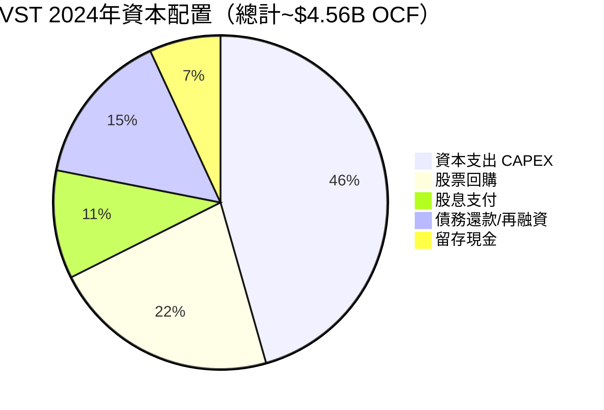

---

### 👔 管理層執行力評分

| 評估維度 | 評分 | 說明 | 狀態 |
|---------|------|------|------|
| **財務目標達成率** | 8/10 | 2024年EBITDA指引大幅超越，FCF達標 | 🟢 |
| **戰略清晰度** | 8/10 | 明確的核能+零售整合戰略，AI數據中心轉型明確 | 🟢 |
| **資本紀律** | 6/10 | 積極回購+股息，但D/E過高，M&A溢價較高 | 🟡 |
| **資本市場溝通** | 7/10 | 機構持有92.4%，分析師覆蓋廣泛，透明度高 | 🟢 |
| **去槓桿進度** | 6/10 | 債務絕對值仍上升，需監控淨負債/EBITDA趨勢 | 🟡 |
| **ESG轉型執行** | 7/10 | 核能+再生能源轉型有序，煤電退役按計劃 | 🟢 |

---

### 🎁 股東友善度評分

```
╔══════════════════════════════════════════════════════════════╗
║           股東友善度指標                                       ║
╠══════════════════════════════════════════════════════════════╣
║                                                              ║
║ 股息穩定性   ████████████████░░░░  8/10 🟢 穩定增長         ║
║ 回購積極度   ██████████████░░░░░░  7/10 🟢 持續回購         ║
║ EPS稀釋控制  ████████████░░░░░░░░  6/10 🟡 收購稀釋有限    ║
║ 管理層激勵   ██████████████░░░░░░  7/10 🟢 績效導向         ║
║ 透明度       ████████████████░░░░  8/10 🟢 充分披露         ║
║ 長期價值導向 ████████████████░░░░  8/10 🟢 投資未來         ║
╠══════════════════════════════════════════════════════════════╣
║ 股東友善度綜合 █████████████░░░░░░  7.3/10 🟢 優良          ║
╚══════════════════════════════════════════════════════════════╝
```

---

## 8. 風險評估

### 🌡️ 風險熱圖

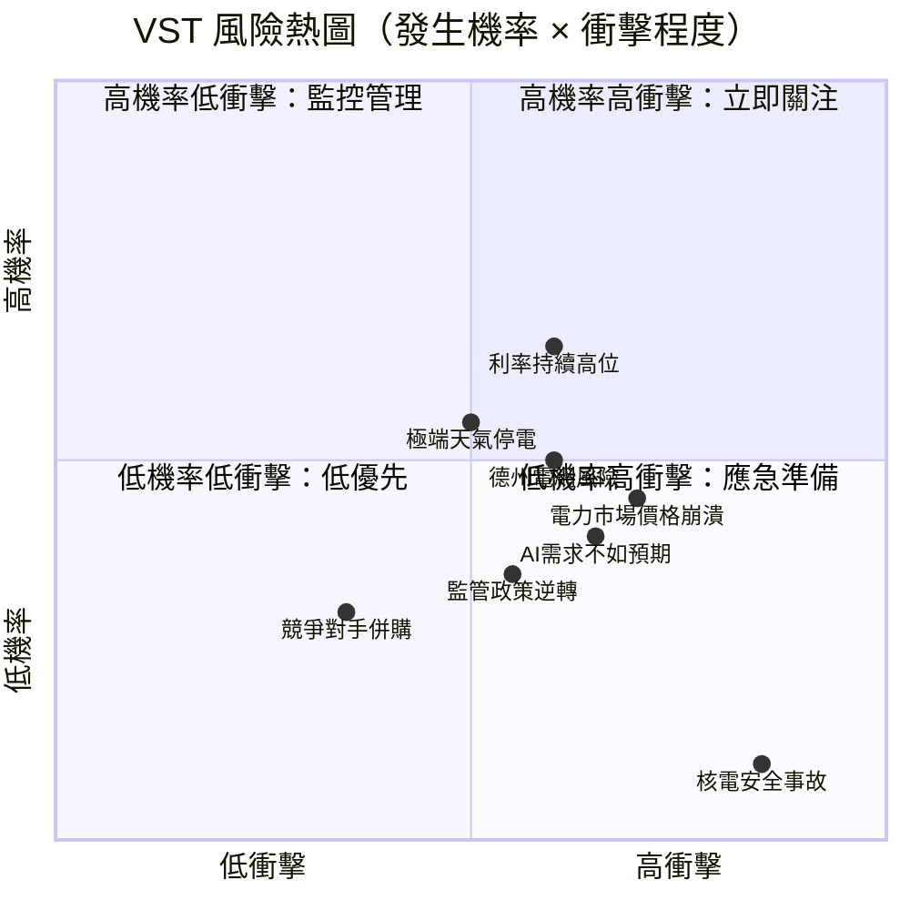

---

### 📋 風險清單完整表格

| 風險類型 | 嚴重度 | 機率 | 說明 | 緩解措施 | 狀態 |
|---------|--------|------|------|---------|------|
| **電力批發市場暴露** | 高 | 中 | 現貨電價下跌直接衝擊發電收益 | 長期PPA合約對沖；零售垂直整合 | 🔴 |
| **高槓桿財務風險** | 高 | 低-中 | D/E 335x，利率環境惡化加重負擔 | OCF覆蓋充足；再融資風險可控 | 🔴 |
| **德州電網集中風險** | 高 | 中 | ERCOT單一市場高度依賴，50%以上收入來源 | 多州擴張（Energy Harbor） | 🟡 |
| **監管政策風險** | 中 | 低 | 核電監管收緊；環保要求升級 | 積極遊說；ESG合規 | 🟡 |
| **極端天氣/停電** | 高 | 中 | 類URI 2021冬季風暴重演 | 設備升級；保險覆蓋 | 🟡 |
| **AI需求低於預期** | 中 | 低-中 | 若AI投資熱潮冷卻，PPA溢價消失 | 多元客戶基礎；零售穩定基本盤 | 🟡 |
| **核電資本支出超支** | 中 | 中 | 維護/升級成本超預期 | 嚴格預算管控；政府補貼 | 🟡 |
| **ESG/碳排放法規** | 低-中 | 低 | 嚴格碳稅或強制退役要求 | 核能零碳屬性天然受益 | 🟢 |
| **競爭加劇** | 低 | 低 | 新進入者或可再生能源取代 | 核電壁壘極高，難以替代 | 🟢 |

---

### 🐻 最大下行情境分析

```
╔══════════════════════════════════════════════════════════════════╗
║           熊市情境（Bear Case）分析                               ║
╠══════════════════════════════════════════════════════════════════╣
║                                                                  ║
║  觸發條件：                                                       ║
║  1. 電力批發市場價格大幅下跌（>30%）                              ║
║  2. 美聯準再度升息至6%+                                          ║
║  3. AI數據中心建設計劃大規模縮減                                  ║
║  4. 德州嚴重天災導致資產損失                                      ║
║                                                                  ║
║  財務衝擊估算：                                                   ║
║  ├─ EBITDA 下降至 $4B（vs 2024年 $6.96B）                       ║
║  ├─ EV/EBITDA 維持 12x → EV = $48B                             ║
║  ├─ 淨負債 $17B → 股權價值 = $31B                              ║
║  └─ 每股 Bear Case 目標價 ≈ $91-110                            ║
║                                                                  ║
║  現價 $173.89 → 最大下行 -37~-48%  🔴                          ║
║  止損建議：$140（-19.5%）觸發重新評估                            ║
╚══════════════════════════════════════════════════════════════════╝
```

---

## 9. 催化劑與觸發因素

### 📅 催化劑時間軸

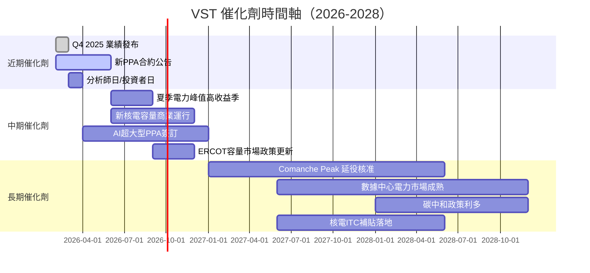

---

### ⚡ 正面觸發因素

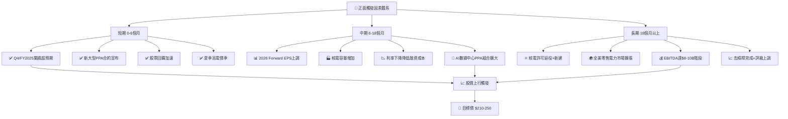

---

## 10. 投資建議

### 🏆 最終評級

```
╔══════════════════════════════════════════════════════════════════╗
║                                                                  ║
║     ★★★★☆   VST  最終投資評級                                  ║
║                                                                  ║
║     🟢  買 入（BUY）                                             ║
║                                                                  ║
║     核心論點：                                                    ║
║     1️⃣  AI電力需求爆發 — 核電資產進入黃金定價週期               ║
║     2️⃣  Forward P/E 15.4x — 相對成長性低估，估值吸引           ║
║     3️⃣  ROIC > WACC（10.7% vs 6.3%）— 正在創造股東價值        ║
║     4️⃣  機構92.4%持有+強力分析師陣容 — 基本面支撐堅實          ║
║     5️⃣  從52週高點回落21% — 提供更好的進場機會                 ║
║                                                                  ║
║     主要顧慮：                                                    ║
║     ⚠️  D/E 335x 高槓桿 — 利率敏感度高                         ║
║     ⚠️  德州集中度 — 單一市場過度依賴                           ║
║     ⚠️  Beta 1.44 — 高波動不適合低風險偏好投資者               ║
║                                                                  ║
╚══════════════════════════════════════════════════════════════════╝
```

---

### 🎯 目標價情境分析

| 情境 | 目標價 | 隱含報酬率 | 機率 | 關鍵假設 |
|------|--------|-----------|------|---------|
| 🐂 **樂觀（Bull）** | $250 | +43.8% | 30% | AI PPA大規模落地；電價維持高位；利率下降 |
| ⚖️ **基準（Base）** | $210 | +20.8% | 45% | 穩健成長；Forward EPS $13-14；EV/EBITDA 16x |
| 🐻 **悲觀（Bear）** | $130 | -25.2% | 25% | 電力市場走弱；高利率持久；AI降溫 |
| 🎯 **期望值加權** | **$201** | **+15.6%** | — | 三情境機率加權 |

---

### 👥 投資人適配度

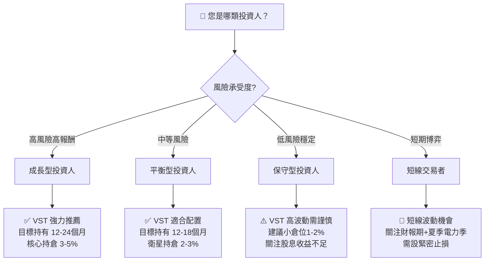

---

### ⚙️ 操作策略框架

```
╔══════════════════════════════════════════════════════════════════╗
║                   VST  操作策略詳細框架                           ║
╠══════════════════════════════════════════════════════════════════╣
║                                                                  ║
║  建議持倉時間：12-24 個月                                         ║
║  建議持倉比例：投資組合 2-4%（視風險承受度）                      ║
║                                                                  ║
║  進場策略：                                                       ║
║  ├─ 現價 $173 可建立初始倉位（50%）                              ║
║  ├─ 若回落至 $155-160 可加碼至 80%                              ║
║  └─ 若突破 $190+ 可持有但不追高                                  ║
║                                                                  ║
║  加碼觸發條件（任一）：                                           ║
║  ├─ ✅ FY2025 EPS 超預期（超 $10）                              ║
║  ├─ ✅ 新大型AI數據中心PPA公告（>1GW）                          ║
║  ├─ ✅ 美聯準降息25bp以上                                        ║
║  ├─ ✅ 股價回落至 $155 支撐區                                    ║
║  └─ ✅ 核電延役/新建獲政府補貼確認                               ║
║                                                                  ║
║  止損觸發條件（任一）：                                           ║
║  ├─ 🔴 股價跌破 $140（-19.5%，技術性止損）                     ║
║  ├─ 🔴 FY2025 EBITDA 低於 $4.5B                               ║
║  ├─ 🔴 德州ERCOT重大監管不利政策                                ║
║  ├─ 🔴 淨負債/EBITDA升破 3.5x                                  ║
║  └─ 🔴 核電安全事故或監管停爐                                    ║
╚══════════════════════════════════════════════════════════════════╝
```

---

### 📋 關鍵監控指標 Checklist

```
╔══════════════════════════════════════════════════════════════════╗
║               VST  關鍵監控指標 Checklist                        ║
╠══════════════════════════════════════════════════════════════════╣
║                                                                  ║
║  📊 財務面監控（季度）：                                          ║
║  ☐  EBITDA Margin 維持在 25%+ 以上                              ║
║  ☐  OCF / EBITDA 轉化率 > 60%                                  ║
║  ☐  淨負債/EBITDA 趨勢（目標降至 2.0x 以下）                    ║
║  ☐  Forward EPS 指引是否維持或上調                               ║
║                                                                  ║
║  🔋 業務面監控（月度）：                                          ║
║  ☐  德州/ERCOT電力批發現貨價格趨勢                               ║
║  ☐  新PPA合約簽署情況（尤其AI數據中心）                          ║
║  ☐  零售客戶數量增減                                             ║
║  ☐  核電容量因數（目標>90%）                                     ║
║                                                                  ║
║  🌍 宏觀面監控（月度）：                                          ║
║  ☐  美聯準利率決策（每次FOMC）                                    ║
║  ☐  天然氣價格（成本端影響）                                      ║
║  ☐  AI資本支出週期（微軟/Google/亞馬遜財報）                      ║
║  ☐  聯邦核電政策法規更新                                          ║
║                                                                  ║
║  📰 事件面監控（即時）：                                          ║
║  ☐  德州極端天氣預警                                             ║
║  ☐  核電安全事件（全球）                                         ║
║  ☐  大型競爭對手M&A動向                                          ║
║  ☐  機構大額增減持申報（13F）                                    ║
╚══════════════════════════════════════════════════════════════════╝
```

---

### 📊 最終評分彙整

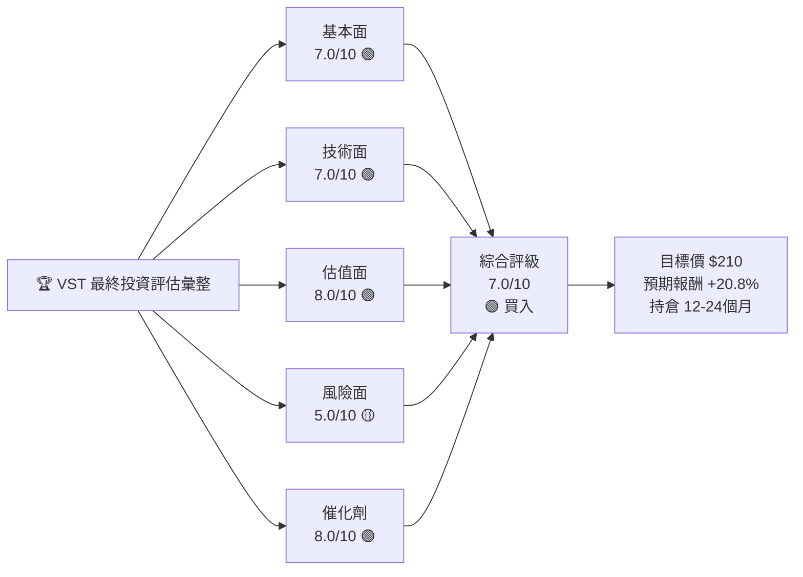

```
╔══════════════════════════════════════════════════════════════════╗
║                  最終綜合評分彙整                                  ║
╠══════════════════════════════════════════════════════════════════╣
║  成長性    ████████░░ 8/10  🟢 AI+核能雙引擎驅動                ║
║  獲利能力  ███████░░░ 7/10  🟢 EBITDA強勁，淨利率有波動          ║
║  財務健康  ██████░░░░ 6/10  🟡 高槓桿為最大隱憂                  ║
║  估值      ████████░░ 8/10  🟢 Forward P/E 15.4x 具吸引力      ║
║  競爭優勢  ████████░░ 8/10  🟢 核電稀缺資產+德州主導            ║
║  管理品質  ███████░░░ 7/10  🟢 戰略清晰+資本回購積極             ║
║  動能      ███████░░░ 7/10  🟢 機構持有率高+分析師強力看多      ║
║  風險      █████░░░░░ 5/10  🟡 高Beta+高槓桿+市場集中           ║
╠══════════════════════════════════════════════════════════════════╣
║  綜合加權  ███████░░░ 7.0/10  🟢 建議：買入 BUY                 ║
╚══════════════════════════════════════════════════════════════════╝
```

---

> ### ⚠️ 免責聲明
>
> **本報告為 AI 自動生成分析，僅供研究與教育參考用途，不構成任何投資建議或要約。**
>
> 投資涉及風險，過往業績不代表未來表現。本報告中的財務數據截至 2026-02-28，部分數據來源於 Yahoo Finance，可能存在誤差或滯後。讀者在作出任何投資決定前，應諮詢持牌投資顧問，並進行獨立的盡職調查。
>
> **VST 為高波動性股票（Beta 1.44），不適合低風險承受度投資者。**
>
> *報告生成時間：2026-02-28 ｜ 分析師：AI 評估系統 v2.0*