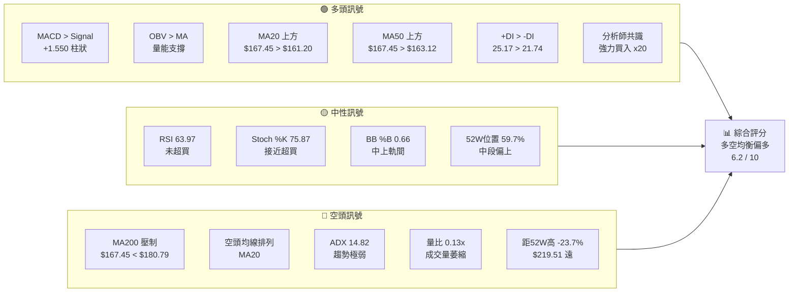
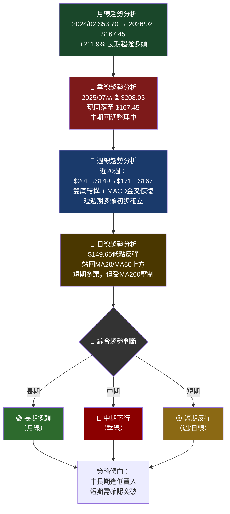
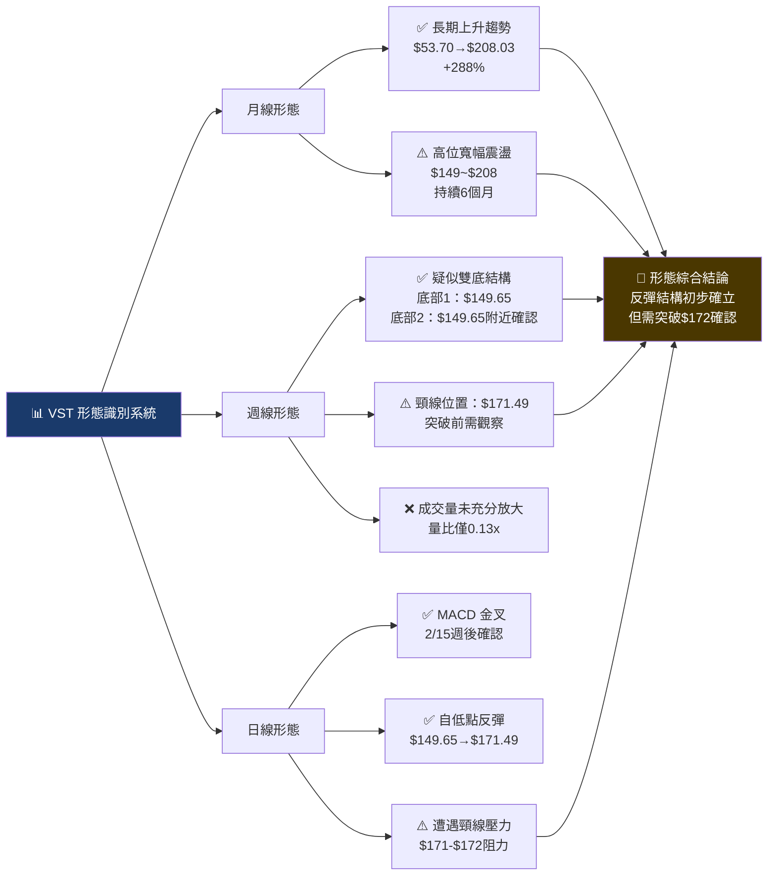
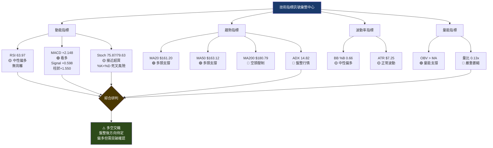
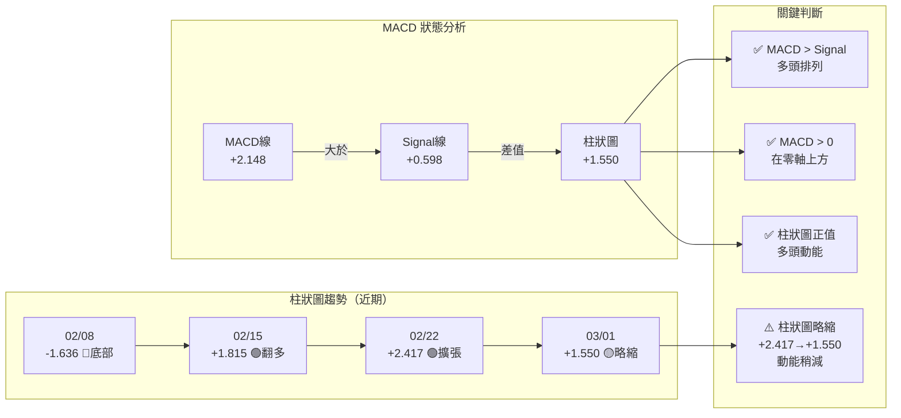
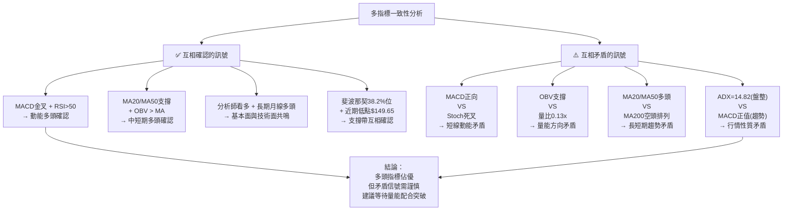
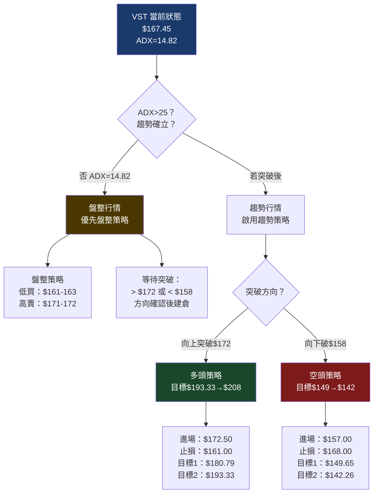
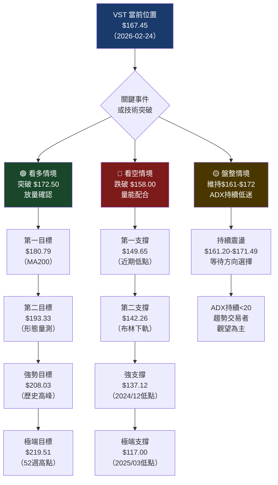

# VST 技術分析報告

> **報告日期**：2026-02-24 ｜ **分析師**：資深技術分析部門 ｜ **數據來源**：Yahoo Finance
> **標的**：Vistra Corp. (VST) ｜ **產業**：公用事業 — 獨立發電商 ｜ **當前價格**：$167.45

---

## 目錄

1. [技術面概覽](#1-技術面概覽)
2. [趨勢分析（多時框架）](#2-趨勢分析多時框架)
3. [圖表形態分析](#3-圖表形態分析)
4. [支撐與阻力（精確數值）](#4-支撐與阻力精確數值)
5. [技術指標深度解讀](#5-技術指標深度解讀)
6. [量價分析](#6-量價分析)
7. [多時框架訊號總結](#7-多時框架訊號總結)
8. [交易策略建議（精確數值）](#8-交易策略建議精確數值)
9. [風險提示與監控](#9-風險提示與監控)

---

## 1. 技術面概覽

### 🎯 技術訊號儀表板



---

### 📊 核心指標速覽表

| 指標類別 | 指標名稱 | 數值 | 訊號強度 | 判斷 |
|---------|---------|------|---------|------|
| **價格** | 收盤價 | $167.45 | 🟡 | 中性偏多 |
| **趨勢** | MA20 | $161.20 | 🟢 | 價格在上，多頭 |
| **趨勢** | MA50 | $163.12 | 🟢 | 價格在上，多頭 |
| **趨勢** | MA200 | $180.79 | 🔴 | 價格在下，空頭壓制 |
| **動能** | RSI(14) | 63.97 | 🟡 | 中性偏多，未超買 |
| **動能** | MACD | +2.148 | 🟢 | 看多，MACD>Signal |
| **動能** | MACD Hist | +1.550 | 🟢 | 正向擴張 |
| **動能** | Stoch %K/%D | 75.87/79.63 | 🟡 | 接近超買區域 |
| **趨勢強度** | ADX(14) | 14.82 | 🔴 | 極弱趨勢/盤整 |
| **趨勢方向** | +DI / -DI | 25.17/21.74 | 🟡 | 多頭微幅主導 |
| **波動率** | ATR(14) | $7.25 | 🟡 | 正常波動水準 |
| **通道** | BB %B | 0.66 | 🟡 | 中軌偏上軌間 |
| **量能** | OBV趨勢 | OBV > MA | 🟢 | 量能確認上漲 |
| **成交量** | 量比 | 0.13x | 🔴 | 嚴重萎縮 |

---

### 📈 技術綜合評分（1-10分）

```
整體技術評分：6.2 / 10

多頭動能  ████████████░░░░░░░░  6.5/10
空頭壓力  ████████░░░░░░░░░░░░  4.0/10
趨勢強度  ████░░░░░░░░░░░░░░░░  2.9/10（ADX極弱）
動能指標  █████████████░░░░░░░  6.4/10
量能支撐  ██████░░░░░░░░░░░░░░  3.2/10（量比0.13x）
形態完整  ████████████░░░░░░░░  6.0/10
分析師評分 ████████████████░░░░  8.0/10

綜合得分  ████████████░░░░░░░░  6.2/10
         ├──────────┼─────────┤
         0         5        10
         空頭     中立      多頭
```

---

### 📍 52週價格位置分析

```
52週高點 $219.51 ──────────────────────────────── 100%
                  |
                  |  ← 強阻力帶 $193-$210
                  |
當前價格 $167.45 ──────────────────●────────────── 59.7%
                  |              ↑ 當前位置
                  |  ← 盤整區間 $158-$172
                  |
MA200   $180.79 ──────────────────────────────── 70.0%
MA50    $163.12 ──────────────────────────────── 56.4%
MA20    $161.20 ──────────────────────────────── 54.8%
                  |
52週低點 $90.17  ──────────────────────────────── 0%

📌 當前位置：$167.45，位於52週區間 59.7% 處
📌 距52週高：-$52.06 (-23.7%)
📌 距52週低：+$77.28 (+85.7%)
```

---

## 2. 趨勢分析（多時框架）

### 🔭 多時框趨勢判斷



---

### 📊 ADX 趨勢強度解讀

```
ADX(14) = 14.82

趨勢強度計：
 0    10    20    25    30    40    50+
 ├─────▓▓▓▓▓▓▓▓░░░░░░░░░░░░░░░░░░░░░░┤
       ↑14.82
       極弱趨勢

強度分類：
< 20  ：🔴 無趨勢 / 盤整行情  ← 當前
20-25 ：🟡 趨勢初現 / 觀察
25-40 ：🟢 趨勢確立 / 積極交易
40+   ：🟢 強勢趨勢 / 趨勢加速

+DI = 25.17  ██████████████░░░░░░
-DI = 21.74  ████████████░░░░░░░░
差值 = +3.43  多頭微幅主導
```

**⚡ ADX 關鍵結論：**

> ADX 僅 14.82，明確判定當前為**盤整行情**而非趨勢行情。雖然 +DI（25.17）略高於 -DI（21.74），顯示多頭方向微幅佔優，但差距僅 3.43，說明多空雙方力量相當。**趨勢交易者應降低預期，盤整操作框架更為適用。**

---

### 📐 均線排列分析

```
空頭均線排列（MA20 < MA50 < MA200）：

MA200 $180.79 ─────────────────────────────  ← 最強壓力
              ████████████████████████████
MA50  $163.12 ─────────────────────────────  ← 中期壓力
              ████████████████████
MA20  $161.20 ─────────────────────────────  ← 近期支撐

當前  $167.45 ─────────────────────●─────── ← 夾在MA50與MA200間

判斷：
✗ 全面多頭排列（MA20>MA50>MA200）→ 不符合
✓ 空頭排列（MA20<MA50<MA200）→ 確認
✓ 但價格站上MA20與MA50 → 短期偏多
✗ 價格未突破MA200 → 中期仍偏空
```

| 均線 | 價格 | 位置 | 訊號 |
|------|------|------|------|
| MA20 | $161.20 | 價格在上方 +$6.25 | 🟢 近期支撐 |
| MA50 | $163.12 | 價格在上方 +$4.33 | 🟢 中期支撐 |
| MA200 | $180.79 | 價格在下方 -$13.34 | 🔴 中期壓力 |

---

### 📉 長/中/短期趨勢走勢圖

```
VST 24個月走勢示意（月線收盤）
$220 ┤                                  ▲ 52W高$219.51
$210 ┤                          ╭─────╮
$200 ┤                    ╭─────╯     ╰──╮
$190 ┤              ╭─────╯     ↑峰值    ╰──╮
$180 ┤        ╭─────╯           $208        ╰──  ← MA200 $180.79
$170 ┤        │                               ╰──●$167.45(現)
$160 ┤        │  ╭──╮                    ╭─────╯
$150 ┤  ╭─────╯  │  ╰──────╮  ╭─────────╯
$140 ┤  │        │         │  │
$130 ┤  │        │╭────────╯  │
$120 ┤  │        ╰╯           │
$110 ┤  │                     │
$100 ┤  │                     │
 $90 ┤  ╰── 起點$53.70        │
     └────────────────────────────────────────
     2024/02  2024/07  2025/01  2025/07  2026/02

長期趨勢（月線）：🟢 強多頭 +211.9%
中期趨勢（季線）：🔴 回調整理，峰值$208→現$167（-19.5%）
短期趨勢（週線）：🟡 反彈中，$149.65→$171.49（+14.6%）
```

---

## 3. 圖表形態分析

### 🔍 形態識別



---

### 📉 ASCII 走勢示意圖（週線，近20週）

```
VST 週線走勢 & 關鍵形態標注
（2025/10/19 - 2026/03/01）

 $210 ──────────────────────────────────────────────
       前高 $208.03（2025/07峰值）
 $201 ─●──●────────────────────────────────────────  ← 起始高點
       ↓  ↓ 頭部區域
 $190 ─────●──────────────────────────────────────── ← 第一頸部
           ↓
 $178 ──────────●────────────────────────────────── ← 反彈高
               ↓  ↓
 $174 ───────────●────────────────────────────────── ← 次低
                  ↓
 $168 ────────────────●───────────────────────────── ← 底部整理
                       ↓    ↑
 $162 ─────────────────────●──●───────────────────── ← 低位整理
 $160 ──────────────────────────●───────────────────
      ▲▲▲▲▲▲▲▲▲▲▲▲▲▲▲▲▲▲▲▲▲▲▲▲
 $149 ────────────────────────────●────────────────── ← 最低點2/8
                                   ↑反彈
 $171 ──────────────────────────────────●──●─────── ← 頸線/阻力
                                              ↓
 $167 ────────────────────────────────────────────●  ← 當前

      ╔═══════════════════════════════════════════╗
      ║  關鍵標注：                                ║
      ║  🔴 強阻力：$171.49 (頸線位)              ║
      ║  🔴 MA200：$180.79                        ║
      ║  🟡 當前：$167.45                         ║
      ║  🟢 MA50支撐：$163.12                     ║
      ║  🟢 MA20支撐：$161.20                     ║
      ║  🟢 強支撐：$149.65（2/8低點）            ║
      ╚═══════════════════════════════════════════╝
```

---

### 📐 形態目標價計算

**疑似雙底形態（如頸線 $171.49 突破成立）：**

```
雙底量測方法：
┌─────────────────────────────────────────┐
│ 底部最低點：$149.65                      │
│ 頸線位置：$171.49                        │
│ 形態高度：$171.49 - $149.65 = $21.84    │
│ 突破目標：$171.49 + $21.84 = $193.33    │
│                                          │
│ → 目標一（形態量測）：$193.33           │
│ → 目標二（黃金延伸）：$208.03（前高）   │
└─────────────────────────────────────────┘
```

**旗形整理形態（反彈後回調）：**

```
旗形量測：
┌─────────────────────────────────────────┐
│ 旗桿起點：$149.65 (2/8低點)             │
│ 旗桿終點：$171.49 (2/15反彈高)          │
│ 旗桿高度：$21.84                         │
│ 旗形整理：$167-$172 震盪                 │
│ 突破目標：$171.49 + $21.84 = $193.33    │
└─────────────────────────────────────────┘
```

---

### 🕯️ 近期重要 K 線組合分析

| 週次 | 日期 | 收盤 | RSI | MACD柱 | K線訊號 | 解讀 |
|------|------|------|-----|--------|---------|------|
| W17 | 2026-02-08 | $149.65 | 33.7 | -1.636 | 🔴 低點確立 | 超賣區域，見底訊號 |
| W18 | 2026-02-15 | $171.49 | 60.8 | +1.815 | 🟢 強力反彈 | 放量急升，MACD翻多 |
| W19 | 2026-02-22 | $171.40 | 62.3 | +2.417 | 🟡 高位整理 | 量縮守住，MACD擴張 |
| W20 | 2026-03-01 | $167.45 | 64.0 | +1.550 | 🟡 小幅回調 | 成交量極萎縮，整理 |

---

## 4. 支撐與阻力（精確數值）

### 🗺️ 支撐阻力 ASCII 視覺化圖

```
VST 支撐阻力全圖 (2026-02-24)
━━━━━━━━━━━━━━━━━━━━━━━━━━━━━━━━━━━━━━━━━━━━━━━━━━

$219.51 ════════════════════════════════ 🔴🔴🔴 52週高點（強阻力）
$208.03 ════════════════════════════════ 🔴🔴  2025/07月高峰
$193.33 ────────────────────────────── 🔴    形態量測目標/前支撐
$188.64 ─ ─ ─ ─ ─ ─ ─ ─ ─ ─ ─ ─ ─ ─  🔴    2025/08前高
$180.79 ════════════════════════════════ 🔴🔴  MA200（強壓力）
$180.14 ─ ─ ─ ─ ─ ─ ─ ─ ─ ─ ─ ─ ─ ─  🟡    布林上軌（動態阻力）
$178.61 ─ ─ ─ ─ ─ ─ ─ ─ ─ ─ ─ ─ ─ ─  🟡    2025/11前高

────────────────────────────────────────────────
$171.49 ════════════════════════════════ 🟡    頸線/近期高點（關鍵）
$167.45 ════════════════════════════════ ●     【當前價格】
$165.23 ─ ─ ─ ─ ─ ─ ─ ─ ─ ─ ─ ─ ─ ─  🟢    1月初小支撐
────────────────────────────────────────────────

$163.12 ════════════════════════════════ 🟢    MA50（中期支撐）
$161.20 ════════════════════════════════ 🟢    MA20（近期支撐）
$161.33 ─ ─ ─ ─ ─ ─ ─ ─ ─ ─ ─ ─ ─ ─  🟢    2025/12月低點
$158.35 ─ ─ ─ ─ ─ ─ ─ ─ ─ ─ ─ ─ ─ ─  🟢🟢  2026/01月低點
$149.65 ════════════════════════════════ 🟢🟢  2026/02/08最低點
$142.26 ─ ─ ─ ─ ─ ─ ─ ─ ─ ─ ─ ─ ─ ─  🟢    布林下軌（動態支撐）
$137.12 ─ ─ ─ ─ ─ ─ ─ ─ ─ ─ ─ ─ ─ ─  🟢🟢  2024/12月低點（強支撐）
$132.93 ─ ─ ─ ─ ─ ─ ─ ─ ─ ─ ─ ─ ─ ─  🟢🟢  2025/02前低
$117.00 ════════════════════════════════ 🟢🟢🟢 2025/03重要低點（極強支撐）

━━━━━━━━━━━━━━━━━━━━━━━━━━━━━━━━━━━━━━━━━━━━━━━━━━
```

---

### 🔴 阻力位表格

| 阻力級別 | 價格 | 依據 | 重要性 |
|---------|------|------|--------|
| **近端阻力1** | $171.49 | 2/15週線反彈高點 / 雙底頸線 | ⭐⭐⭐ |
| **近端阻力2** | $178.61 | 2025/11月高點 | ⭐⭐ |
| **中端阻力1** | $180.14 | 布林通道上軌（動態）| ⭐⭐ |
| **中端阻力2** | $180.79 | **MA200**（最關鍵長期阻力）| ⭐⭐⭐⭐⭐ |
| **強阻力1** | $188.64 | 2025/08前高 | ⭐⭐⭐ |
| **強阻力2** | $193.33 | 2025/06-09密集成交區 | ⭐⭐⭐ |
| **強阻力3** | $208.03 | 2025/07歷史峰值 | ⭐⭐⭐⭐ |
| **極強阻力** | $219.51 | 52週最高點 | ⭐⭐⭐⭐⭐ |

---

### 🟢 支撐位表格

| 支撐級別 | 價格 | 依據 | 重要性 |
|---------|------|------|--------|
| **近端支撐1** | $165.23 | 2026/01/04週線支撐 | ⭐⭐ |
| **近端支撐2** | $163.12 | **MA50**（中期均線）| ⭐⭐⭐⭐ |
| **近端支撐3** | $161.20 | **MA20**（短期均線）| ⭐⭐⭐ |
| **中端支撐1** | $158.35 | 2026/01月收盤低點 | ⭐⭐⭐ |
| **中端支撐2** | $149.65 | 2026/02/08最近低點 | ⭐⭐⭐⭐ |
| **中端支撐3** | $142.26 | 布林下軌（動態）| ⭐⭐⭐ |
| **強支撐1** | $137.12 | 2024/12月低點 | ⭐⭐⭐⭐ |
| **強支撐2** | $132.93 | 2025/02月低點 | ⭐⭐⭐ |
| **極強支撐** | $117.00 | 2025/03重要低點 | ⭐⭐⭐⭐⭐ |

---

### 📏 斐波那契回調位計算

**計算基準：主升波段 $90.17（52週低）→ $219.51（52週高）**

```
波段高點：$219.51
波段低點：$90.17
波段幅度：$129.34

斐波那契回調位：

0%    $219.51 ══════════════════════════════ 歷史高點
23.6%  $189.00 ──────────────────────────── 
38.2%  $169.05 ──────────────────────────● ← 當前 $167.45 接近此位！
50.0%  $154.84 ────────────────────────────
61.8%  $139.62 ────────────────────────────
78.6%  $117.80 ────────────────────────────
100%   $90.17  ══════════════════════════════ 波段起點
```

| 斐波那契位 | 價格 | 與當前差距 | 意義 |
|-----------|------|-----------|------|
| 23.6% 回調 | $189.00 | +$21.55 (+12.9%) | 阻力位 |
| **38.2% 回調** | **$169.05** | **+$1.60 (+1.0%)** | **🎯 當前關鍵位（已接近）** |
| 50.0% 回調 | $154.84 | -$12.61 (-7.5%) | 強支撐 |
| 61.8% 回調 | $139.62 | -$27.83 (-16.6%) | 強支撐 |

> ⚡ **重要發現**：當前價格 $167.45 非常接近斐波那契 38.2% 回調位 $169.05，顯示此處為重要攻防點。

---

### 📊 布林通道動態支撐阻力分析

```
布林通道分析（20日，2σ）：

BB上軌 $180.14 ════════════════════  動態阻力（距當前 +$12.69）
               │████████████████████│
BB中軌 $161.20 ════════════════════  中軸支撐（MA20）
               │ ● $167.45          │
               │ %B = 0.66          │  ← 偏向上軌
BB下軌 $142.26 ════════════════════  動態支撐（距當前 -$25.19）

帶寬分析：
上軌至下軌：$37.88（帶寬適中，無明顯收縮或擴張）
%B = 0.66（0=下軌 / 0.5=中軌 / 1=上軌）

判斷：
• %B 0.66 → 位於中軌與上軌之間，偏多
• 未達超買區域（%B > 0.8），仍有上行空間
• 若%B向上突破0.8，可能碰觸上軌 $180.14
• 若%B跌破0.5，中軌 $161.20 轉為壓力
```

---

## 5. 技術指標深度解讀

### 🔗 指標訊號彙整



---

### 📊 RSI(14) 深度分析

```
RSI(14) = 63.97

RSI 計量表：
 0    10    20    30    40    50    60    70    80    90   100
 ├──────────├──────────├──────────├──────────├──────────├─────┤
 超賣       30        50        70       超買
                                   ↑63.97

強度顯示：
RSI值     ████████████████████████████████░░░░░░░░  63.97/100
超賣線 30  ██████████████░░░░░░░░░░░░░░░░░░░░░░░░░░
中線   50  █████████████████████████░░░░░░░░░░░░░░░
超買線 70  ███████████████████████████████████░░░░░
```

**🔍 RSI 背離分析（關鍵章節）：**

```
週線RSI走勢 vs 價格：

週次    價格      RSI    
W1    $201.07   52.5   ←高點
W2    $201.19   50.6   ←RSI下降
W3    $188.04   36.8   ←下跌
...
W14   $149.65   33.7   ←最低價（RSI最低）
W15   $171.49   60.8   ←反彈
W16   $171.40   62.3
W17   $167.45   64.0   ←RSI仍在上升

背離判斷：
❌ 頂背離：無。高點$201.07時RSI=52.5，後續下跌是正常跟隨。
❌ 底背離：無明顯經典底背離。$149.65時RSI=33.7為同步低點。
✅ 近期觀察：價格從$171.49回調至$167.45，但RSI從62.3上升至64.0
   → 輕微隱性底背離（價格小幅下跌，RSI上升）
   → 暗示短期下行動能正在減弱，偏多信號
```

**結論：🟡 無明顯頂背離或底背離，RSI顯示動能偏多但未達超買，仍有上行空間。**

---

### 📈 MACD(12/26/9) 深度分析



**MACD 關鍵結論：**
- ✅ MACD（+2.148）> Signal（+0.598），金叉確立，多頭排列
- ✅ MACD 位於零軸上方，主趨勢偏多
- ✅ 柱狀圖連續正值，多頭動能持續
- ⚠️ 柱狀圖從 +2.417 縮小至 +1.550，動能略有減弱，需持續觀察

---

### 📊 Stochastic(14,3,3) 分析

```
Stochastic 指標：
%K = 75.87
%D = 79.63

位置分析：
 0    20    40    60    80   100
 ├─────├─────├─────├─────├────┤
超賣   20         80  超買

%K   ████████████████████████████████████░░░░  75.87
%D   ████████████████████████████████████████  79.63

⚠️ 重要信號：
• %K (75.87) < %D (79.63) → 死叉形成！
• 雖未達超買區（>80），但%K低於%D為賣出訊號
• 若%K繼續下跌至70以下，短線動能轉弱
• 結合RSI(64)和MACD，Stoch的死叉是唯一短線警告

結論：🟡 Stoch 形成死叉，短線可能小幅整理，但中線仍偏多
```

---

### 📊 布林通道(20,2σ) 分析

```
布林通道 %B 歷史走勢示意：

高    1.0 ┤ BB上軌           ▲高%B = 接近上軌
         0.9 ┤
         0.8 ┤
         0.7 ┤                              ● 0.66(現)
         0.6 ┤
         0.5 ┤ BB中軌(MA20)
         0.4 ┤
         0.3 ┤
         0.2 ┤
         0.1 ┤
低    0.0 ┤ BB下軌

%B 解讀：
• %B = 0.66 → 位於中軌至上軌 2/3 位置
• 無超買（%B > 1.0）也無超賣（%B < 0）
• 帶寬 $37.88，通道正常，無收縮後爆發信號
• 動態阻力：$180.14（上軌）
• 動態支撐：$142.26（下軌）

ATR(14) = $7.25 (4.33% of price)
波動率評估：
低波動 $0──────────────────┤$7.25┤────────── 高波動 $15
                                  ↑ 當前ATR
→ 每日預期波動範圍：±$7.25
→ 建議止損距離：至少 1.5x ATR = $10.88
→ 建議最大止損：2x ATR = $14.50
```

---

## 6. 量價分析

### 📊 OBV 趨勢分析

```
OBV 分析框架：

OBV > OBV均線 → 量能確認上漲趨勢 ✅（當前狀態）

近期重要量能事件：

週次    收盤      成交量       量能解讀
W14   $149.65   37,731,800  🔴 大量恐慌下殺（見底量）
W15   $171.49   31,912,400  🟢 大量反彈（量能確認反彈）
W16   $171.40   15,312,700  🟡 量縮整理（正常回落）
W17   $167.45    4,807,846  🔴 極度量縮（方向不明）

OBV背離判斷：
• 2/8 放量 $37.7M 創近期最大量 → 恐慌賣出頂點，隨後反彈
• 2/15 大量 $31.9M 配合急漲 $171.49 → OBV顯著上升
• 量能整體：OBV > MA，量能支撐上漲趨勢

結論：OBV 確認近期價格上漲，無負背離
但量比 0.13x 顯示當前缺乏新增買力
```

---

### 📊 量能評分

```
量能綜合評分：

OBV趨勢      ██████████████░░░░░░  7.0/10（支撐上漲）
量比分析     ████░░░░░░░░░░░░░░░░  2.0/10（0.13x極萎縮）
放量突破     ████████████░░░░░░░░  6.0/10（2/15放量確認）
縮量回調     ████████░░░░░░░░░░░░  4.0/10（量縮回調正常）
量能異常     ██████░░░░░░░░░░░░░░  3.0/10（需觀察）

量能綜合     ███████░░░░░░░░░░░░░  4.4/10

─────────────────────────────────────────
量能評分說明：
低  1-3分：量能嚴重警告，看空
中  4-6分：量能中性，待觀察  ← 當前 4.4分
高  7-10分：量能強力確認
```

---

### ⚠️ 量能異常信號識別

```
✅ 正面量能信號：
• 2026/02/08：$37.7M 大量，恐慌底部信號
• 2026/02/15：$31.9M 放量急升至 $171.49，突破確認
• OBV > OBV均線，多頭量能確認

🚨 警告量能信號：
• 當前量比 0.13x（僅為20日均量12.7%）→ 嚴重量能萎縮
• $167.45 目前為縮量回調，主力未積極進場
• 若突破 $171.49 時成交量未放大，突破有效性存疑
• 成交量最大日（2026/01/11）：41.5M → 後來未見跟進
```

---

## 7. 多時框架訊號總結

### 📊 時框架評分表格

| 時框 | 趨勢方向 | 動能狀態 | 成交量 | 綜合訊號 | 評分 |
|------|---------|---------|--------|---------|------|
| **月線** | 🟢 長期多頭 | 🟢 持續強勢 | 🟡 中性 | 🟢 **看多** | 8/10 |
| **季線** | 🔴 中期下行 | 🟡 恢復中 | 🟡 中性 | 🟡 **中性** | 5/10 |
| **週線** | 🟡 反彈趨勢 | 🟢 MACD金叉 | 🟡 量縮整理 | 🟡 **偏多** | 6/10 |
| **日線** | 🟡 短期偏多 | 🟡 Stoch死叉 | 🔴 嚴重萎縮 | 🟡 **中性** | 5/10 |

---

### 🔍 訊號一致性分析



---

## 8. 交易策略建議（精確數值）

### 🗺️ 策略選擇流程圖



---

### 🟢 多頭策略

| 策略項目 | 策略A（保守突破型）| 策略B（積極反彈型）|
|---------|-------------------|-------------------|
| **進場條件** | 突破 $172.50 且成交量 > 均量1.5倍 | 回測 MA50 $163.12 支撐確認 |
| **進場點** | $172.50 | $163.50 |
| **止損點** | $161.00（MA20下方） | $158.00（1月低點下方） |
| **目標價1** | $180.79（MA200）| $171.49（頸線位）|
| **目標價2** | $193.33（形態量測）| $180.79（MA200）|
| **風險距離** | $11.50 | $5.50 |
| **目標1利潤** | $8.29 | $7.99 |
| **目標2利潤** | $20.83 | $17.29 |
| **R/R比（T1）** | **1:0.72** | **1:1.45** |
| **R/R比（T2）** | **1:1.81** ✅ | **1:3.14** ✅ |
| **建議倉位** | 5-7% | 3-5% |

```
多頭策略A 視覺化：

$193.33 ────────────────────────────── 🎯 目標2 (+12.1%)
$180.79 ────────────────────────────── 🎯 目標1 (+4.8%)
$172.50 ════════════════════════════ ← 進場點
$167.45 ────────────────────── ● 當前
$161.00 ════════════════════════════ ← 止損點
         風險：$11.50 / 目標2獲利：$20.83
         R/R = 1:1.81
```

---

### 🔴 空頭策略

| 策略項目 | 策略C（跌破型）| 策略D（反彈做空型）|
|---------|----------------|-------------------|
| **進場條件** | 跌破 $158.00 收盤確認 | 反彈至 $172-173 阻力後見賣壓 |
| **進場點** | $157.00 | $172.00 |
| **止損點** | $168.00 | $179.00 |
| **目標價1** | $149.65（近期低點）| $161.20（MA20）|
| **目標價2** | $142.26（布林下軌）| $149.65（前低）|
| **風險距離** | $11.00 | $7.00 |
| **目標1利潤** | $7.35 | $10.80 |
| **目標2利潤** | $14.74 | $22.35 |
| **R/R比（T1）** | **1:0.67** | **1:1.54** ✅ |
| **R/R比（T2）** | **1:1.34** | **1:3.19** ✅ |
| **建議倉位** | 3-5% | 3-5% |

---

### 🟡 盤整策略（區間交易）

```
盤整操作區間：$161.20 - $171.49

┌────────────────────────────────────────────┐
│  高賣區：$169.50 - $171.49               │
│          (近頸線，分批減倉/做空)           │
│                                            │
│  中間區：$163.00 - $169.50               │
│          (持倉觀察，不追高不殺低)          │
│                                            │
│  低買區：$161.20 - $163.12               │
│          (MA20/MA50雙均線支撐，分批買進)   │
└────────────────────────────────────────────┘

盤整策略參數：
• 買入點：$161.50（MA20附近）
• 賣出點：$170.50（頸線下方）
• 獲利空間：$9.00（+5.6%）
• 止損點：$158.00（若跌破區間）
• R/R比：$9.00 / $3.50 = 1:2.57 ✅
```

---

### 💼 倉位管理建議

```
倉位管理框架：
（基於 ATR $7.25，假設總投資組合 $100,000）

保守型投資者（波動承受度低）：
→ 建議倉位：3-5%（$3,000-$5,000）
→ 最大虧損：$150-$250

平衡型投資者（一般風險承受）：
→ 建議倉位：5-8%（$5,000-$8,000）
→ 最大虧損：$250-$400

積極型投資者（高風險承受）：
→ 建議倉位：8-12%（$8,000-$12,000）
→ 最大虧損：$400-$600

⚠️ 注意：ADX=14.82（盤整行情），建議降低倉位至平常的 60-70%
⚠️ 量比 0.13x（量能萎縮），等待放量突破再加碼
```

---

### ⭐ 整體技術訊號強度評星

```
多頭訊號強度：★★★☆☆ (3/5)
空頭訊號強度：★★☆☆☆ (2/5)
趨勢確定性：  ★★☆☆☆ (2/5)（ADX極弱）
操作機會：    ★★★☆☆ (3/5)（等待突破）
分析師信心：  ★★★★★ (5/5)（強力買入）

綜合評級：    ★★★☆☆ (3/5) — 「謹慎偏多，等待確認」
```

---

## 9. 風險提示與監控

### ☑️ 關鍵失效條件清單

```
【多頭策略失效條件】
□ 收盤跌破 $161.20（MA20）→ 短期多頭瓦解
□ 收盤跌破 $158.00（1月低點）→ 中期反彈結束
□ 週線收盤跌破 $149.65 → 下行趨勢加速，雙底失效
□ MACD柱狀圖轉負 → 動能翻空
□ RSI 跌破 50 → 中線動能轉空
□ ADX 上升且 -DI 超越 +DI → 空頭趨勢確立

【空頭策略失效條件】
□ 收盤突破 $172.00 且放量 > 均量1.5倍 → 雙底突破確認
□ 收盤突破 $180.79（MA200）→ 中期多頭確立，空頭平倉
□ MACD柱狀圖持續擴大 → 多頭動能加速
□ ADX > 25 且 +DI 持續高於 -DI → 多頭趨勢確立

【盤整策略失效條件】
□ 突破 $172.00 → 改為趨勢多頭策略
□ 跌破 $158.00 → 改為趨勢空頭策略
```

---

### 📅 近期催化劑對技術形態影響

| 事件類型 | 潛在影響 | 技術層面衝擊 |
|---------|---------|-------------|
| **財報發布** | 電力需求數據、AI數據中心合約 | 可能觸發$171.49頸線突破或跌破$158 |
| **電價政策** | 獨立發電商監管政策 | 影響MA200($180.79)穿越時機 |
| **AI/數據中心需求** | VST主要成長動力 | 正面消息→可能直衝$193.33 |
| **聯準會利率決策** | 公用事業受利率影響大 | 升息壓力→布林下軌$142.26測試 |
| **能源市場波動** | 天然氣/電力現貨價 | 影響短期ATR波動範圍 |
| **分析師評等調整** | 已有多家維持買入 | 目標價$230均值支撐長期看法 |

---

### 🎭 風險場景分析



---

### 📊 情境機率評估

```
情境發生機率評估（基於技術分析）：

看多突破情境：
機率   ████████████████░░░░░░░░░░░░░░░░  40%
條件   突破$172.50 + 量能配合
目標   $180.79 → $193.33

盤整繼續情境：
機率   ████████████████████░░░░░░░░░░░░  45%
條件   ADX持續低迷，MA200壓制
範圍   $161.20 - $171.49

看空跌破情境：
機率   ████████░░░░░░░░░░░░░░░░░░░░░░░░  15%
條件   跌破$158 + MACD轉負
目標   $149.65 → $142.26

機率評估依據：
• OBV量能偏多（+10%機率）
• MACD金叉確立（+10%機率）
• ADX弱趨勢（-10%看多機率）
• MA200強阻（-10%看多機率）
• 分析師共識強買（+5%看多機率）
```

---

## 📋 報告總結

```
╔══════════════════════════════════════════════════════╗
║           VST 技術分析總結速查卡                      ║
╠══════════════════════════════════════════════════════╣
║  當前價格：$167.45                                    ║
║  技術綜合評分：6.2/10（中性偏多）                     ║
╠══════════════════════════════════════════════════════╣
║  關鍵價位：                                          ║
║  ▲ 最近阻力：$171.49（頸線）                         ║
║  ▲ 強力阻力：$180.79（MA200）                        ║
║  ▼ 最近支撐：$163.12（MA50）                         ║
║  ▼ 強力支撐：$149.65（近期低點）                     ║
╠══════════════════════════════════════════════════════╣
║  核心結論：                                          ║
║  • ADX=14.82：盤整行情，非趨勢行情                   ║
║  • MACD金叉確立，但Stoch出現死叉警告                 ║
║  • OBV支撐，但量比0.13x嚴重萎縮                     ║
║  • RSI=64無背離，Fib 38.2%=$169.05關鍵攻防           ║
║  • MA200=$180.79是中期多空分水嶺                     ║
╠══════════════════════════════════════════════════════╣
║  操作建議：                                          ║
║  1. 突破$172.50(放量)→做多，目標$180.79/$193.33      ║
║  2. 跌回$163.12支撐→逢低加多，止損$158               ║
║  3. 跌破$158→轉空，目標$149.65                       ║
║  4. 分析師目標均值$230.05支持中長期多頭觀點           ║
╠══════════════════════════════════════════════════════╣
║  風險警示：                                          ║
║  🔴 MA200=$180.79強力壓制                           ║
║  🔴 量能萎縮，突破有效性待確認                       ║
║  🔴 ADX極弱，趨勢性交易風險高                       ║
╚══════════════════════════════════════════════════════╝
```

---

> **⚠️ 免責聲明**：本報告為 AI 技術分析系統自動生成，純粹基於技術指標與歷史價格數據進行分析，**不構成任何投資建議或財務顧問意見**。投資人在做出任何投資決策前，應諮詢持牌專業財務顧問，並自行評估個人風險承受能力。過去的技術形態不代表未來表現。技術分析存在固有局限性，市場可能因基本面、政策、總體經濟等非技術因素產生超出技術分析預測的波動。