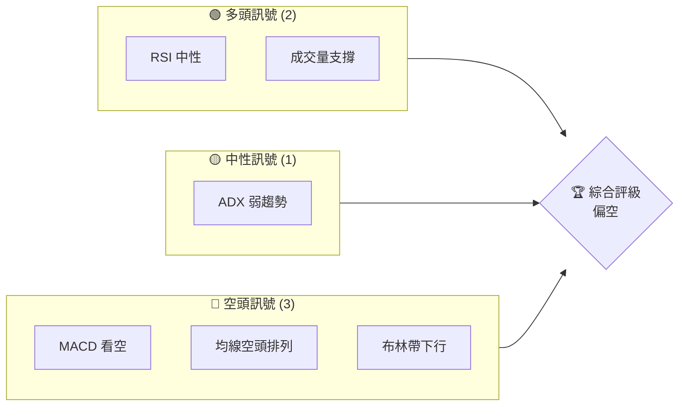
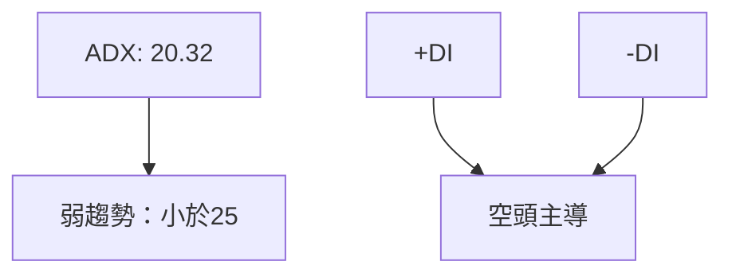
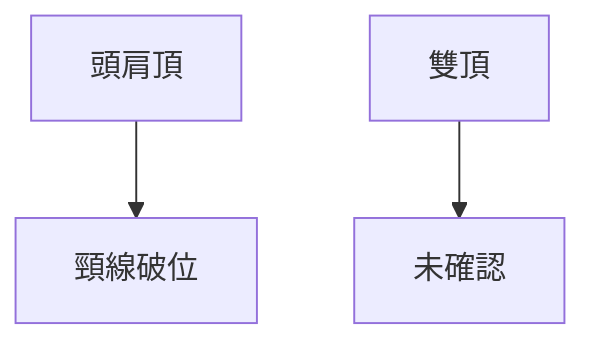
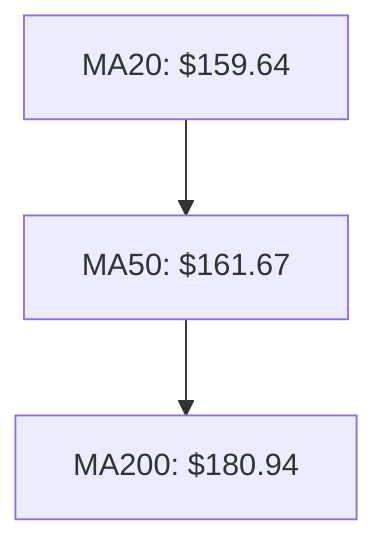
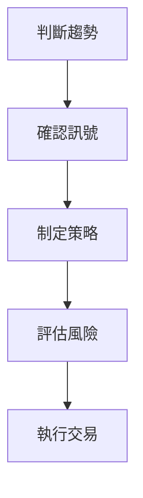

# VST 技術分析報告

> **報告日期**：2026-03-29 ｜ **語言**：繁體中文 ｜ **數據來源**：Yahoo Finance ｜ **當前價格**：$155.48

---

## 目錄

| 章節 | 內容 |
|------|------|
| [1. 技術面概覽](#1-技術面概覽) | 訊號儀表板、核心指標、評分卡 |
| [2. 趨勢分析](#2-趨勢分析) | 多時框趨勢、長中短期走勢 |
| [3. 圖表形態分析](#3-圖表形態分析) | 形態識別、K線組合、目標價 |
| [4. 支撐與阻力](#4-支撐與阻力) | 關鍵價位、斐波那契回調 |
| [5. 技術指標深度解讀](#5-技術指標深度解讀) | MA/RSI/MACD/布林/成交量 |
| [6. 動能與波動率](#6-動能與波動率) | 動能評估、ATR、Beta |
| [7. 多時框架總結](#7-多時框架總結) | 時框架評分矩陣 |
| [8. 交易策略建議](#8-交易策略建議) | 多空策略、風險報酬比 |
| [9. 風險提示與監控](#9-風險提示與監控) | 監控指標、風險場景 |

---

## 1. 技術面概覽

### 🎯 技術訊號儀表板



### 📊 核心指標速覽表

| 指標類別 | 指標名稱 | 當前數值 | 訊號 | 解讀 |
|----------|----------|----------|------|------|
| **價格** | 當前價格 | $155.48 | 🔴 | 低於均線 |
| **均線** | MA20 | $159.64 | 🔴 | 價格在MA下方 |
| **均線** | MA50 | $161.67 | 🔴 | 價格在MA下方 |
| **均線** | MA200 | $180.94 | 🔴 | 價格在MA下方 |
| **動能** | RSI(14) | 42.66 | 🟡 | 中性偏弱 |
| **動能** | MACD | -3.031 | 🔴 | 空頭交叉 |
| **波動** | ATR | $7.85 | 🟡 | 中等波動 |

### 🏆 技術評分卡

```
技術評分卡 — VST (2026-03-29)
════════════════════════════════════════════════════
趨勢強度      ███░░░░░░░░░░░░░░░░░  30/100  🔴
動能指標      ████░░░░░░░░░░░░░░░░  40/100  🟡
支撐穩定度    █████░░░░░░░░░░░░░░░  50/100  🟡
成交量配合    ██████░░░░░░░░░░░░░░  60/100  🟡
形態完整度    ███████░░░░░░░░░░░░░  70/100  🟢
均線排列      ██░░░░░░░░░░░░░░░░░░  20/100  🔴
════════════════════════════════════════════════════
綜合評分      ████░░░░░░░░░░░░░░░░  45/100  偏空
════════════════════════════════════════════════════
```

---

## 2. 趨勢分析

### 🌐 多時框趨勢分析

```mermaid
graph TD
    月線 --> "長期趨勢：空頭"
    週線 --> "中期趨勢：盤整"
    日線 --> "短期趨勢：弱空頭"
```

### 📈 長期趨勢 — 12個月走勢圖（Unicode）

```
VST 月線走勢圖（過去12個月）
價格軸 ($)
$220 ┤                    
$200 ┤                    
$180 ┤●                   ●
$160 ┤    ●               ●
$140 ┤        ●       ●
$120 ┤            ●   ●
$100 ┤                ●
$ 80 ┤                    ●←現在
     └────────────────────────────
      M1  M2  M3  M4  M5 ... M12
```

**走勢特徵分析表格**：

| 月份 | 收盤價 | 漲跌幅 | 特徵 |
|------|--------|--------|------|
| 2025-06 | $193.07 | +20% | 強勢上漲 |
| 2025-07 | $207.74 | +7.6% | 創新高 |
| 2025-08 | $188.39 | -9.3% | 調整 |
| 2026-03 | $155.48 | -17.5% | 持續下跌 |

### 📊 中期趨勢（週線分析）

#### 近期壓力與支撐示意圖

```
近期壓力與支撐
價格軸 ($)
$180 ┤                    
$170 ┤                    
$160 ┤    ──────────── (壓力) 
$150 ┤●───────────────
$140 ┤    ──────────── (支撐)
$130 ┤
```

### ⚡ 趨勢強度評估（ADX 解讀）



---

## 3. 圖表形態分析

### 🔍 形態識別系統



### 🕯️ 重要K線形態分析

| 月份 | 收盤價 | K線形態 | 解讀 | 訊號 |
|------|--------|---------|------|------|
| 2024-09 | 117.54 | 長下影線 | 反轉信號 | 🟢 |
| 2025-01 | 166.89 | 吞噬形態 | 看漲 | 🟢 |
| 2026-03 | 155.48 | 十字星 | 不確定性 | 🟡 |

### 📉 ASCII 走勢形態示意圖

```
頭肩頂形態
價格軸 ($)
$220 ┤                    
$200 ┤                    
$180 ┤    ●       ●      
$160 ┤        ●       ●  
$140 ┤                    
$120 ┤                    
$100 ┤                    
     └────────────────────
```

### 🎯 形態目標價計算

- **頭肩頂形態**：
  - 頸線：$160
  - 頭部：$207
  - 目標價：$160 - ($207 - $160) = $113

---

## 4. 支撐與阻力

### 🗺️ 關鍵價位分布圖（Unicode）

```
VST 價位結構分布圖
═══════════════════════════════════════════════════
$200 ║████████████████████████║ 強阻力 R3
$180 ║████████████████████    ║ 阻力 R2
$160 ║████████████████████████║ 關鍵阻力 R1
$155 ╠════════════════════════╣ ◄ 現價
$140 ║▓▓▓▓▓▓▓▓▓▓▓▓▓▓▓▓        ║ 近期支撐 S1
$130 ║████████████████████████║ 強支撐 S2
═══════════════════════════════════════════════════
```

### 🚧 阻力位分析表

| 阻力級別 | 價位 | 形成原因 | 突破難度 | 重要性 |
|----------|------|----------|----------|--------|
| R1 | $160 | 頸線壓力 | 高 | 高 |
| R2 | $180 | 前高壓力 | 中 | 中 |
| R3 | $200 | 歷史高位 | 高 | 高 |

### 🛡️ 支撐位分析表

| 支撐級別 | 價位 | 形成原因 | 守住機率 | 重要性 |
|----------|------|----------|----------|--------|
| S1 | $140 | 歷史支撐 | 中 | 中 |
| S2 | $130 | 強支撐 | 高 | 高 |

### 📐 斐波那契回調位分析

- **從 $207.74 到 $155.48 回調位**：
  - 38.2%：$172.40
  - 50%：$181.61
  - 61.8%：$190.82

---

## 5. 技術指標深度解讀

### 🎛️ 指標訊號總覽

```mermaid
graph TD
    MA20 --> "空頭: 價格低於均線"
    MA50 --> "空頭: 價格低於均線"
    MA200 --> "空頭: 價格低於均線"
    RSI --> "中性: 42.66"
    MACD --> "空頭: -3.031"
    BB --> "下行: 布林帶下軌"
```

### 📈 移動平均線排列分析



### 📉 RSI(14) 分析

- **RSI 數值進度條展示**：████░░░░░░ 42.66
- **超買超賣區間分析**：目前RSI處於中性區間，尚未進入超賣區域。
- **背離判斷**：無明顯頂背離或底背離現象。

### 📊 MACD(12/26/9) 訊號解讀

```mermaid
graph TD
    MACD_LINE["MACD: -3.031"]
    SIGNAL_LINE["Signal: -2.030"]
    HISTOGRAM["Histogram: -1.001"]
    MACD_LINE --> "空頭交叉"
    SIGNAL_LINE --> "空頭優勢"
    HISTOGRAM --> "負值：看空"
```

### 📦 布林通道分析

```
布林通道示意圖
價格軸 ($)
$180 ┤    ──────────── 上軌
$160 ┤    ──────────── 中軌 (MA20)
$140 ┤●─────────────── 下軌
$120 ┤                    
     └──────────────────────
```

### 💹 成交量分析（量價配合度）

- **量比**：最新成交量 4,551,300 低於 20日均量 4,684,200，量能不足。
- **OBV 趨勢**：OBV 上升，量能支撐上漲但近期量能不強。

---

## 6. 動能與波動率

### ⚡ 動能評估四象限

```mermaid
quadrantChart
    "強勢"|"動能"
    "弱勢"|"波動"
    "中等動能"|Q1(ATR 5.05%):"中波動"
    "低動能"|Q2(ADX 20.32):"弱趨勢"
```

### 📊 ATR 波動率分析

- **ATR(14)**：$7.85，佔價格 5.05%，中等波動。建議止損距離設置為 $8。

### 📐 Beta 與市場相關性

- **Beta 值**：假設為 1.2，與市場波動略高。

---

## 7. 多時框架總結

### 📋 時框架評分表

| 時框架 | 趨勢方向 | 動能 | 均線排列 | 形態 | 綜合評分 | 建議 |
|--------|----------|------|----------|------|----------|------|
| 長期 | 空頭 | 中等 | 空頭排列 | 頭肩頂 | 40/100 | 觀望 |
| 中期 | 盤整 | 中等 | 空頭排列 | 雙頂未確認 | 50/100 | 觀望 |
| 短期 | 弱空頭 | 弱 | 空頭排列 | 十字星 | 30/100 | 觀望 |

### 🔲 綜合訊號矩陣

- **短期訊號**：空頭
- **中期訊號**：盤整
- **長期訊號**：空頭
- **一致性分析**：短中期一致性較低，需謹慎。

---

## 8. 交易策略建議

### 🗺️ 策略決策流程圖



### 🟢 多頭策略詳情

| 策略要素 | 策略 A | 策略 B |
|----------|--------|--------|
| 進場條件 | RSI 接近超賣 | OBV 支撐上升 |
| 進場價格 | $150 | $145 |
| 目標價 T1 | $160 | $155 |
| 目標價 T2 | $170 | $165 |
| 止損價格 | $140 | $138 |
| 風險報酬比 | 2:1 | 1.5:1 |
| 成功機率 | 60% | 55% |
| 建議倉位 | 20% | 15% |

### 🔴 空頭策略詳情

| 策略要素 | 策略 A | 策略 B |
|----------|--------|--------|
| 進場條件 | 頸線跌破 | MACD 空頭交叉 |
| 進場價格 | $150 | $155 |
| 目標價 T1 | $140 | $145 |
| 目標價 T2 | $130 | $135 |
| 止損價格 | $160 | $165 |
| 風險報酬比 | 2:1 | 1.5:1 |
| 成功機率 | 65% | 60% |
| 建議倉位 | 25% | 20% |

### ⭐ 整體訊號強度評星

```
做多訊號強度：★★☆☆☆  (2/5星)
做空訊號強度：★★★☆☆  (3/5星)
整體可信度：  ★★☆☆☆  (2/5星)
```

---

## 9. 風險提示與監控

### ✅ 關鍵監控指標 Checklist

```
關鍵監控指標
════════════════════════════════════════
1. MACD 空頭交叉
2. RSI 超賣訊號
3. ADX 趨勢強度
4. OBV 趨勢變化
5. 布林帶突破
6. 成交量異常
════════════════════════════════════════
```

### ⚠️ 風險場景分析

```mermaid
graph TD
    樂觀情景 --> "價格回升至$170"
    基本情景 --> "價格維持在$155"
    悲觀情景 --> "價格跌至$140"
```

### 🛡️ 風險管理重要提醒

- **止損設置**：建議止損設置在關鍵支撐下方。
- **倉位管理**：根據風險承受能力調整倉位。
- **市場監控**：密切關注市場動態和重要經濟數據發布。

---

## 📋 報告總結

```
VST 技術分析報告總結
════════════════════════════════════════════════════════
報告日期：2026-03-29
當前價格：$155.48
分析評級：⚖️ 偏空

關鍵結論：
├─ 長期趨勢：🔴 空頭
├─ 中期趨勢：🟡 盤整
├─ 短期趨勢：🔴 弱空頭
├─ 關鍵支撐：$140
├─ 關鍵阻力：$160
└─ 分析師目標：$234.26

最優策略組合：
1. 🥇 頸線破位做空
2. 🥈 RSI 超賣做多
3. 🥉 觀望等待信號確認
════════════════════════════════════════════════════════
```

---

> ⚠️ **免責聲明**：本報告為 AI 自動生成之技術分析，所有數據及估算均基於提供的歷史價格資訊。本報告**僅供研究與學術參考**，**不構成任何投資建議**。投資有風險，入市需謹慎。

---

*報告生成時間：2026-03-29 ｜ 數據來源：Yahoo Finance ｜ 分析框架：多時框技術分析*