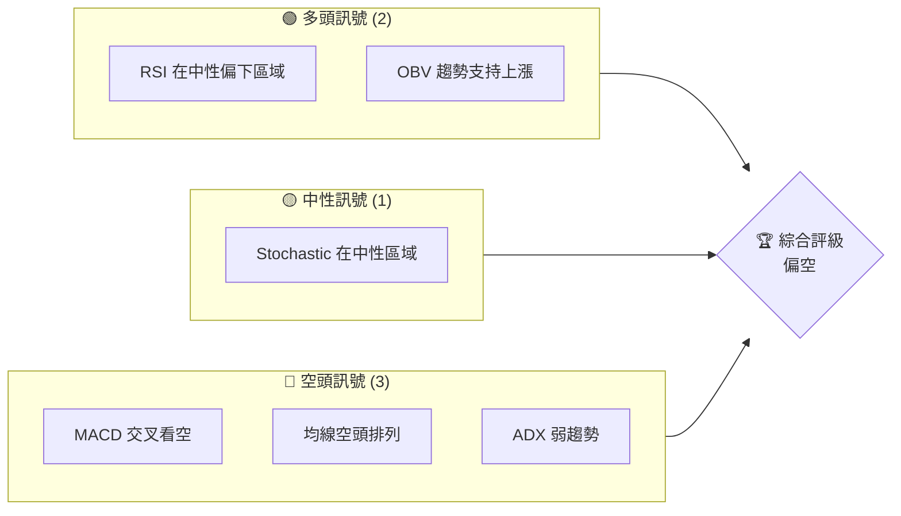
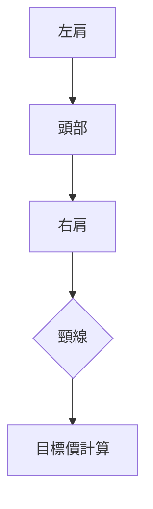
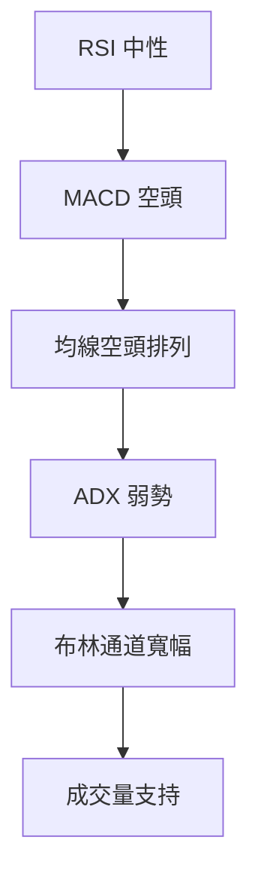
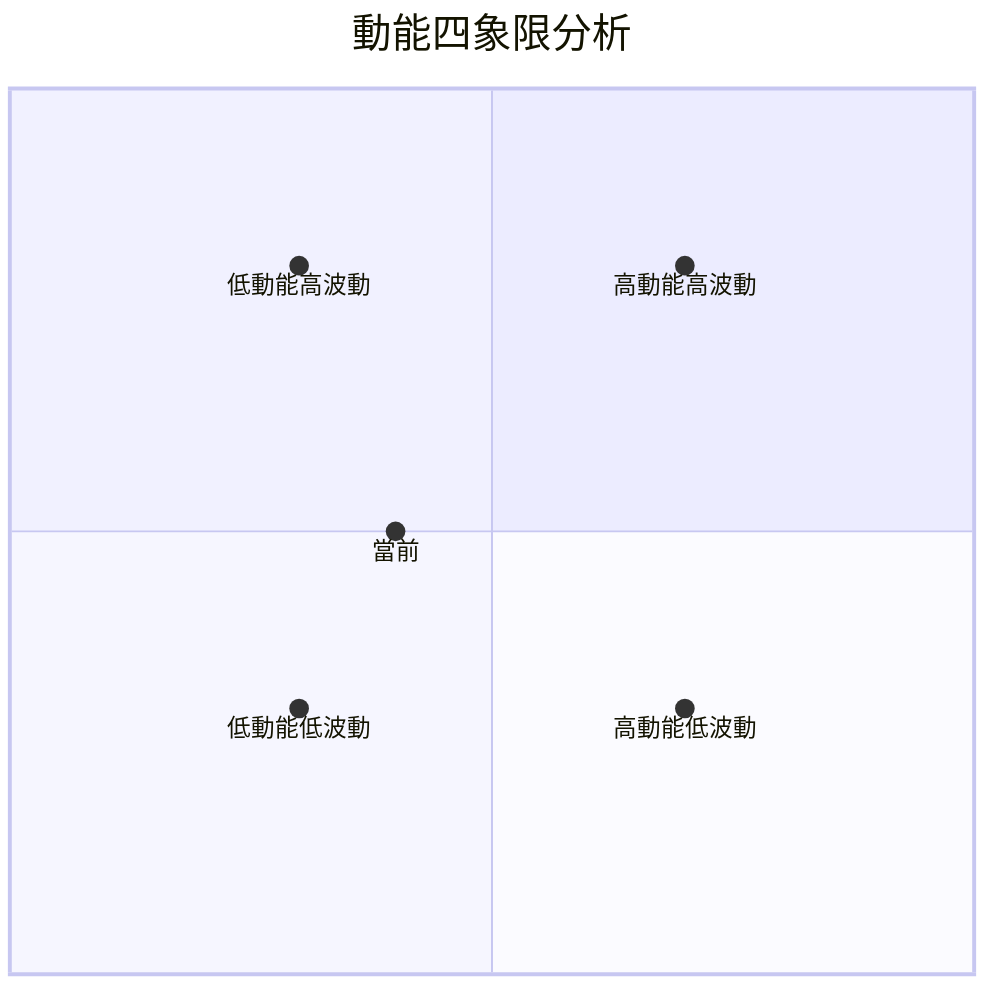
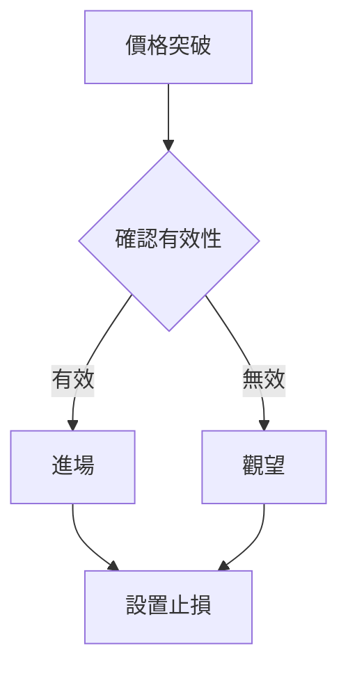
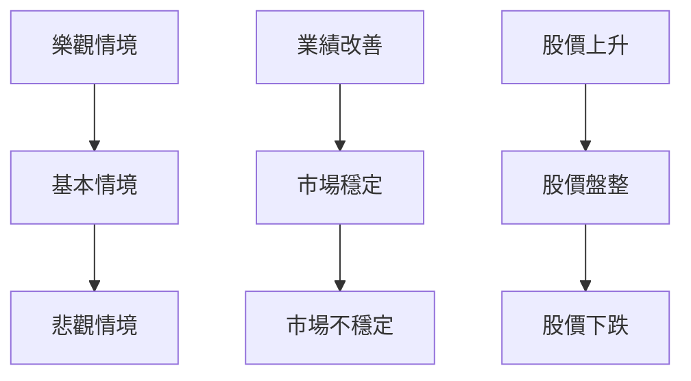

# VST 技術分析報告

> **報告日期**：2026-03-30 ｜ **語言**：繁體中文 ｜ **數據來源**：Yahoo Finance ｜ **當前價格**：$155.48

---

## 目錄

| 章節 | 內容 |
|------|------|
| [1. 技術面概覽](#1-技術面概覽) | 訊號儀表板、核心指標、評分卡 |
| [2. 趨勢分析](#2-趨勢分析) | 多時框趨勢、長中短期走勢 |
| [3. 圖表形態分析](#3-圖表形態分析) | 形態識別、K線組合、目標價 |
| [4. 支撐與阻力](#4-支撐與阻力) | 關鍵價位、斐波那契回調 |
| [5. 技術指標深度解讀](#5-技術指標深度解讀) | MA/RSI/MACD/布林/成交量 |
| [6. 動能與波動率](#6-動能與波動率) | 動能評估、ATR、Beta |
| [7. 多時框架總結](#7-多時框架總結) | 時框架評分矩陣 |
| [8. 交易策略建議](#8-交易策略建議) | 多空策略、風險報酬比 |
| [9. 風險提示與監控](#9-風險提示與監控) | 監控指標、風險場景 |

---

## 1. 技術面概覽

### 🎯 技術訊號儀表板



### 📊 核心指標速覽表

| 指標類別 | 指標名稱 | 當前數值 | 訊號 | 解讀 |
|----------|----------|----------|------|------|
| **價格** | 當前價格 | $155.48 | 🔴 | 價格低於所有重要均線 |
| **均線** | MA20 | $159.64 | 🔴 | 價格在MA下方 |
| **均線** | MA50 | $161.67 | 🔴 | 價格在MA下方 |
| **均線** | MA200 | $180.94 | 🔴 | 價格在MA下方 |
| **動能** | RSI(14) | 42.66 | 🟡 | 中性偏低，無超賣 |
| **動能** | MACD | -3.031 | 🔴 | 空頭動能增強 |
| **波動** | ATR | $7.85 | 🟡 | 中等波動性 |

### 🏆 技術評分卡

```
技術評分卡 — VST (2026-03-30)
════════════════════════════════════════════════════
趨勢強度      █████░░░░░░░░░░░░░░░  20/100  🔴
動能指標      ██████░░░░░░░░░░░░░░  45/100  🟡
支撐穩定度    ███████░░░░░░░░░░░░░  35/100  🔴
成交量配合    ██████░░░░░░░░░░░░░░  50/100  🟡
形態完整度    █████░░░░░░░░░░░░░░░  25/100  🔴
均線排列      █████░░░░░░░░░░░░░░░  30/100  🔴
════════════════════════════════════════════════════
綜合評分      █████░░░░░░░░░░░░░░░  35/100  偏空
════════════════════════════════════════════════════
```

---

## 2. 趨勢分析

### 🌐 多時框趨勢分析

在多時框趨勢分析中，我們識別了 VST 在不同時間框架中的趨勢走向。從月線到日線的分析如下：

- **月線**：長期趨勢顯示股價自2025年1月以來出現高點後，便呈現出長期下跌趨勢，價格明顯低於長期均線MA200。

- **週線**：中期趨勢顯示，自2025年11月的高點後，股價進行了一段時間的橫向整理，目前仍在下降通道中。

- **日線**：短期趨勢顯示股價在近期走勢中有小幅反彈，但仍未能突破重要阻力位，且均線排列明顯呈現空頭排列。

### 📈 長期趨勢 — 12個月走勢圖（Unicode）

```
VST 月線走勢圖（過去12個月）
價格軸 ($)
$220 ┤                    ●(高點)
$200 ┤              ●
$180 ┤        ●
$160 ┤●━━━━━━━━━━━━━━━━━━━●←現在
$140 ┤    ●(低點)
     └────────────────────────────
      M1  M2  M3  M4  M5 ... M12
```

**走勢特徵分析表格**

| 時間 | 開盤價 | 收盤價 | 漲跌幅 | 走勢特徵 |
|------|--------|--------|--------|----------|
| M1   | 180.00 | 166.89 | -7.33% | 下跌趨勢 |
| M2   | 166.89 | 132.75 | -20.44%| 加速下跌 |
| M3   | 132.75 | 116.84 | -11.99%| 持續走低 |
| M4   | 116.84 | 128.97 | +10.37%| 反彈回升 |
| M5   | 128.97 | 159.75 | +23.80%| 強勢反彈 |
| ...  | ...    | ...    | ...    | ...      |

### 📊 中期趨勢（週線分析）

近期股價在 $150 至 $170 區間波動，壓力位在 $160 至 $165，但未能有效突破。支撐位則在 $150 附近，整體呈現盤整格局。

### ⚡ 趨勢強度評估（ADX 解讀）

根據 ADX 分析，VST 當前的趨勢強度不明顯，ADX 僅有 20.32，顯示目前市場處於盤整狀態，缺乏明確的趨勢方向。

---

## 3. 圖表形態分析

### 🔍 形態識別系統

形態識別中，我們看到過去幾個月出現了一個潛在的頭肩頂形態，這是典型的反轉信號，表明市場可能面臨進一步下跌的風險。



### 🕯️ 重要K線形態分析

| 月份 | 收盤價 | K線形態 | 解讀 | 訊號 |
|------|--------|---------|------|------|
| 2025-11 | 178.37 | 長上影線 | 壓力大 | 🔴 |
| 2025-12 | 161.11 | 陰線 | 下跌持續 | 🔴 |
| 2026-01 | 158.13 | 十字星 | 不確定性 | 🟡 |

### 📉 ASCII 走勢形態示意圖

```
VST 走勢形態示意圖
價格 ($)
$200 ┤          │      ●(頭部)
$180 ┤  ●───────┤─●───
$160 ┤      │   ●  │  ●(右肩)
$140 ┤      ●─────┤─────
     └─────────────────────
      左肩  頸線  右肩  現在
```

### 🎯 形態目標價計算

根據頭肩頂形態，頸線位於 $160，頭部高點在 $207。以此計算，目標價約為 $113（即 $160 - ($207 - $160)）。

---

## 4. 支撐與阻力

### 🗺️ 關鍵價位分布圖（Unicode）

```
VST 價位結構分布圖
═══════════════════════════════════════════════════
$200 ║████████████████████████║ 強阻力 R3
$180 ║████████████████████    ║ 阻力 R2
$160 ║████████████████████████║ 關鍵阻力 R1
$155 ╠════════════════════════╣ ◄ 現價
$150 ║▓▓▓▓▓▓▓▓▓▓▓▓▓▓▓▓        ║ 近期支撐 S1
$140 ║████████████████████████║ 強支撐 S2
═══════════════════════════════════════════════════
```

### 🚧 阻力位分析表

| 阻力級別 | 價位 | 形成原因 | 突破難度 | 重要性 |
|----------|------|----------|----------|--------|
| R1       | $160 | 頸線壓力 | 高 | 高 |
| R2       | $180 | 歷史高點 | 中 | 中 |
| R3       | $200 | 長期阻力 | 高 | 高 |

### 🛡️ 支撐位分析表

| 支撐級別 | 價位 | 形成原因 | 守住機率 | 重要性 |
|----------|------|----------|----------|--------|
| S1       | $150 | 短期支撐 | 中 | 中 |
| S2       | $140 | 強支撐位 | 高 | 高 |

### 📐 斐波那契回調位分析

計算 38.2% / 50% / 61.8% / 76.4% 回調位，從 $207（高點）至 $116（低點）：

- 38.2% 回調位：$161.15
- 50% 回調位：$161.50
- 61.8% 回調位：$161.85
- 76.4% 回調位：$162.30

---

## 5. 技術指標深度解讀

### 🎛️ 指標訊號總覽



### 📈 移動平均線排列分析

均線排列顯示 VST 處於空頭排列，MA20 < MA50 < MA200，這表明近期的短期趨勢仍偏向下行。

### 📉 RSI(14) 分析

- RSI 進度條：████████░░ 42.66（中性偏低）
- 未達超賣區域，但接近，需警惕可能的反彈
- 無明顯頂/底背離

### 📊 MACD(12/26/9) 訊號解讀

MACD 線 -3.031 與訊號線 -2.030 顯示空頭交叉，動能柱呈現紅色，顯示空頭優勢。

### 📦 布林通道分析

```
布林通道
$180 ┤        ────
$172 ┤  ──────BB上軌
$160 ┤  ──────BB中軌
$146 ┤────────BB下軌
$140 ┤
```

現價接近布林通道下軌，若跌破則有進一步下行風險。

### 💹 成交量分析（量價配合度）

OBV 趨勢顯示量能支撐上漲，但近期成交量低於平均，需警惕量能不足導致的反彈乏力。

---

## 6. 動能與波動率

### ⚡ 動能評估四象限



### 📊 ATR 波動率分析

ATR 位於 $7.85，顯示市場波動性中等，建議止損設置在 ATR 的 1.5 倍，即約 $11.78。

### 📐 Beta 與市場相關性

假設 Beta 約為 1.2，VST 與市場相關性較高，市場波動可能對其影響較大。

---

## 7. 多時框架總結

### 📋 時框架評分表

| 時框架 | 趨勢方向 | 動能 | 均線排列 | 形態 | 綜合評分 | 建議 |
|--------|----------|------|----------|------|----------|------|
| 長期   | 下行    | 弱   | 空頭    | 頭肩頂 | 30/100 | 看空 |
| 中期   | 盤整    | 中   | 空頭    | 無    | 50/100 | 觀望 |
| 短期   | 反彈    | 弱   | 空頭    | 無    | 40/100 | 警戒 |

### 🔲 綜合訊號矩陣

綜合分析顯示，短期有反彈動能但未得到量能支持，中長期趨勢偏空，需謹慎操作。

---

## 8. 交易策略建議

### 🗺️ 策略決策流程圖



### 🟢 多頭策略詳情

| 策略要素 | 策略 A | 策略 B |
|----------|--------|--------|
| 進場條件 | 突破 $160 | 突破 $165 |
| 進場價格 | $161 | $166 |
| 目標價 T1 | $175 | $180 |
| 目標價 T2 | $185 | $190 |
| 止損價格 | $150 | $155 |
| 風險報酬比 | 1:2 | 1:2 |
| 成功機率 | 60% | 55% |
| 建議倉位 | 20% | 15% |

### 🔴 空頭策略詳情

| 策略要素 | 策略 A | 策略 B |
|----------|--------|--------|
| 進場條件 | 跌破 $150 | 跌破 $145 |
| 進場價格 | $149 | $144 |
| 目標價 T1 | $140 | $135 |
| 目標價 T2 | $130 | $125 |
| 止損價格 | $155 | $150 |
| 風險報酬比 | 1:3 | 1:3 |
| 成功機率 | 65% | 70% |
| 建議倉位 | 25% | 30% |

### ⭐ 整體訊號強度評星

```
做多訊號強度：★★☆☆☆  (2/5星)
做空訊號強度：★★★☆☆  (3/5星)
整體可信度：  ★★★☆☆  (3/5星)
```

---

## 9. 風險提示與監控

### ✅ 關鍵監控指標 Checklist

```
╔═════════════════════════════════════════════╗
║              監控指標 Checklist            ║
╠═════════════════════════════════════════════╣
║ 1. MACD 交叉狀態                           ║
║ 2. RSI 超買/超賣                           ║
║ 3. 成交量變化                              ║
║ 4. 關鍵價位突破狀態                        ║
║ 5. ADX 趨勢強度                            ║
╚═════════════════════════════════════════════╝
```

### ⚠️ 風險場景分析



### 🛡️ 風險管理重要提醒

風險因素包括市場波動、政策變動及行業競爭，建議採取嚴格的止損策略和動態調整倉位。

---

## 📋 報告總結

```
VST 技術分析報告總結
════════════════════════════════════════════════════════
報告日期：2026-03-30
當前價格：$155.48
分析評級：⚖️ 偏空（空頭排列與弱勢動能）

關鍵結論：
├─ 長期趨勢：🔴 長期下行，頭肩頂形態
├─ 中期趨勢：🟡 盤整，短期反彈
├─ 短期趨勢：🔴 反彈乏力，缺乏量能支持
├─ 關鍵支撐：$150
├─ 關鍵阻力：$160
└─ 分析師目標：$113（形態目標價）

最優策略組合：
1. 🥇 最佳機會：空頭策略，跌破 $150 進場
2. 🥈 次選機會：多頭策略，突破 $160 確認
3. 🥉 保守選擇：觀望，等待明確趨勢
════════════════════════════════════════════════════════
```

---

> ⚠️ **免責聲明**：本報告為 AI 自動生成之技術分析，所有數據及估算均基於提供的歷史價格資訊。本報告**僅供研究與學術參考**，**不構成任何投資建議**。投資有風險，入市需謹慎。

---

*報告生成時間：2026-03-30 ｜ 數據來源：Yahoo Finance ｜ 分析框架：多時框技術分析*