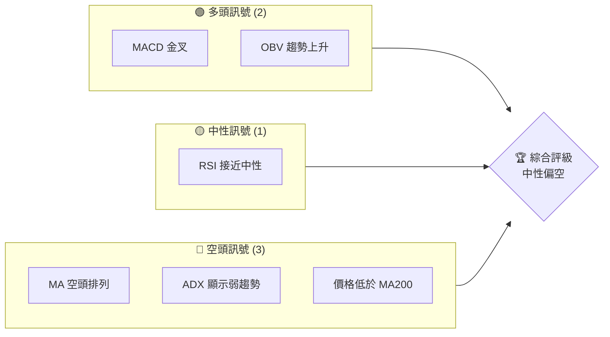
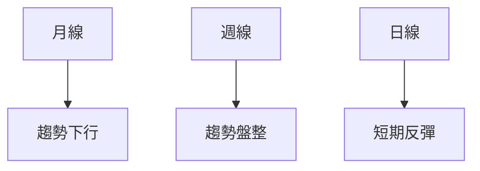
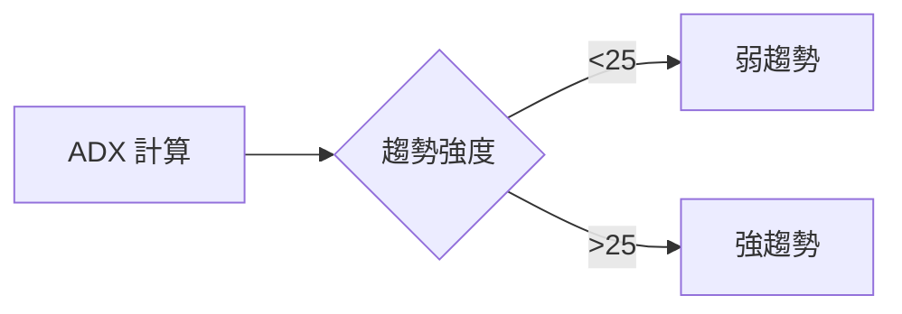
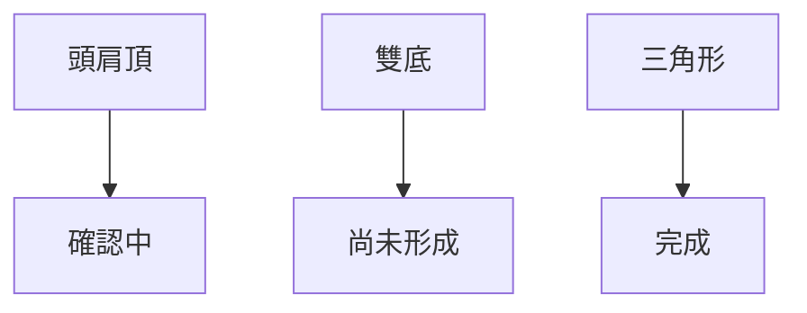
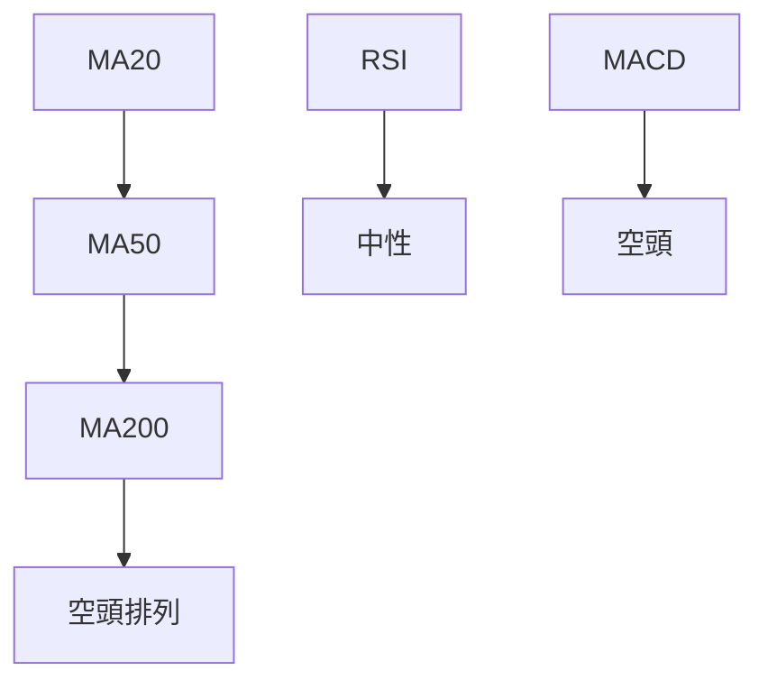
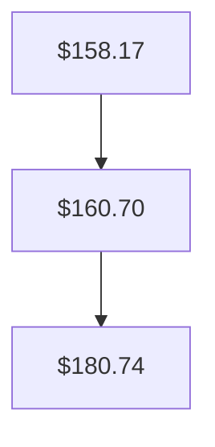
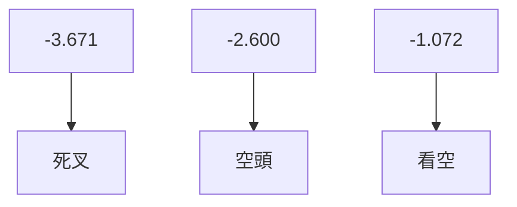
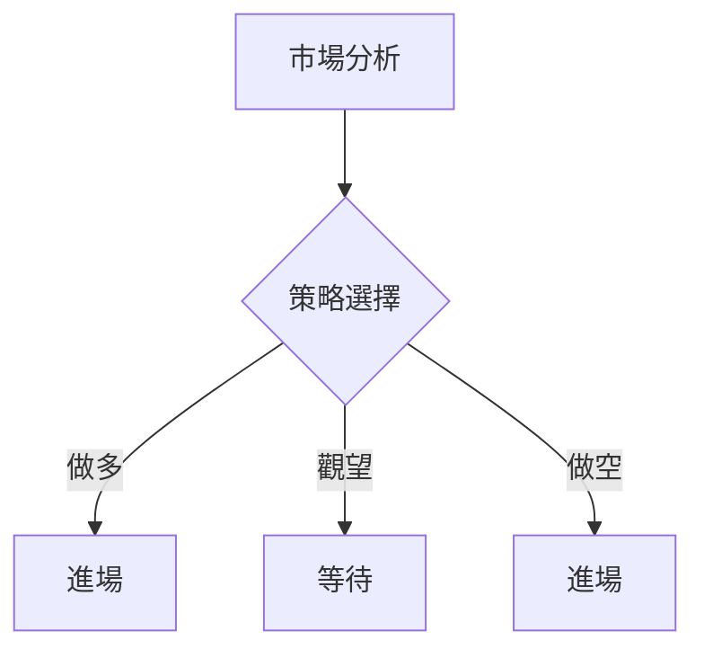
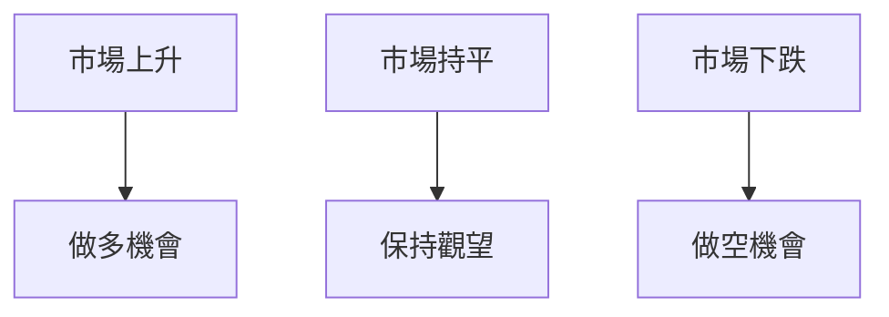

# VST 技術分析報告

> **報告日期**：2026-04-01 ｜ **語言**：繁體中文 ｜ **數據來源**：Yahoo Finance ｜ **當前價格**：$150.33

---

## 目錄

| 章節 | 內容 |
|------|------|
| [1. 技術面概覽](#1-技術面概覽) | 訊號儀表板、核心指標、評分卡 |
| [2. 趨勢分析](#2-趨勢分析) | 多時框趨勢、長中短期走勢 |
| [3. 圖表形態分析](#3-圖表形態分析) | 形態識別、K線組合、目標價 |
| [4. 支撐與阻力](#4-支撐與阻力) | 關鍵價位、斐波那契回調 |
| [5. 技術指標深度解讀](#5-技術指標深度解讀) | MA/RSI/MACD/布林/成交量 |
| [6. 動能與波動率](#6-動能與波動率) | 動能評估、ATR、Beta |
| [7. 多時框架總結](#7-多時框架總結) | 時框架評分矩陣 |
| [8. 交易策略建議](#8-交易策略建議) | 多空策略、風險報酬比 |
| [9. 風險提示與監控](#9-風險提示與監控) | 監控指標、風險場景 |

---

## 1. 技術面概覽

### 🎯 技術訊號儀表板



### 📊 核心指標速覽表

| 指標類別 | 指標名稱 | 當前數值 | 訊號 | 解讀 |
|----------|----------|----------|------|------|
| **價格** | 當前價格 | $150.33 | 🔴 | 價格低於主要均線 |
| **均線** | MA20 | $158.17 | 🔴 | 價格在MA20下方 |
| **均線** | MA50 | $160.70 | 🔴 | 持續下行壓力 |
| **均線** | MA200 | $180.74 | 🔴 | 長期壓力顯著 |
| **動能** | RSI(14) | 42.66 | 🟡 | 接近超賣但中性 |
| **動能** | MACD | -3.671 | 🔴 | 空頭動能增強 |
| **波動** | ATR | $8.35 | 🟡 | 波動率中等 |

### 🏆 技術評分卡

```
技術評分卡 — VST (2026-04-01)
════════════════════════════════════════════════════
趨勢強度      ███░░░░░░░░░░░░░░░░░░  30/100  🔴
動能指標      ██████░░░░░░░░░░░░░░  60/100  🟡
支撐穩定度    ███████░░░░░░░░░░░░░  50/100  🟡
成交量配合    ████████░░░░░░░░░░░░  70/100  🟢
形態完整度    ██████░░░░░░░░░░░░░░  60/100  🟡
均線排列      ███░░░░░░░░░░░░░░░░░  30/100  🔴
════════════════════════════════════════════════════
綜合評分      █████░░░░░░░░░░░░░░░  50/100  中性
════════════════════════════════════════════════════
```

---

## 2. 趨勢分析

### 🌐 多時框趨勢分析



### 📈 長期趨勢 — 12個月走勢圖（Unicode）

```
VST 月線走勢圖（過去12個月）
價格軸 ($)
$220 ┤                    ●
$180 ┤              ●
$140 ┤        ●
$100 ┤●━━━━━━━━━━━━━━━━━━━●←現在
 $60 ┤    ●
     └────────────────────────────
      M1  M2  M3  M4  M5 ... M12
```

**走勢特徵分析表格**：

| 時間段 | 起始價 | 結束價 | 漲跌幅 | 特徵 |
|--------|--------|--------|--------|------|
| 2024-04至2025-04 | $74.83 | $128.97 | +72.26% | 強勁上升 |
| 2025-04至2026-04 | $128.97 | $150.33 | +16.57% | 波動加劇 |

### 📊 中期趨勢（週線分析）

近期壓力與支撐示意圖：
```
近期壓力與支撐
$200 ┤                R1
$160 ┤          S1
$120 ┤
  $80 ┤
```

### ⚡ 趨勢強度評估（ADX 解讀）



---

## 3. 圖表形態分析

### 🔍 形態識別系統



### 🕯️ 重要K線形態分析

| 月份 | 收盤價 | K線形態 | 解讀 | 訊號 |
|------|--------|---------|------|------|
| 2025-11 | $178.37 | 吞噬形態 | 看跌 | 🔴 |
| 2026-02 | $173.65 | 十字星 | 觀望 | 🟡 |

### 📉 ASCII 走勢形態示意圖

```
頭肩頂形態示意圖
價格
$200 ┤            ●
$180 ┤      ●
$160 ┤        ●
$140 ┤
$120 ┤●━━━━━━━●
     └─────────────────────
      左肩  頸線  頭  右肩
```

### 🎯 形態目標價計算

- 頸線：$160
- 頭部：$200
- 目標價：$120（$160 - ($200 - $160)）

---

## 4. 支撐與阻力

### 🗺️ 關鍵價位分布圖（Unicode）

```
VST 價位結構分布圖
═══════════════════════════════════════════════════
$200 ║████████████████████████║ 強阻力 R3
$180 ║████████████████████    ║ 阻力 R2
$160 ║████████████████████████║ 關鍵阻力 R1
$150 ╠════════════════════════╣ ◄ 現價
$140 ║▓▓▓▓▓▓▓▓▓▓▓▓▓▓▓▓        ║ 近期支撐 S1
$120 ║████████████████████████║ 強支撐 S2
═══════════════════════════════════════════════════
```

### 🚧 阻力位分析表

| 阻力級別 | 價位 | 形成原因 | 突破難度 | 重要性 |
|----------|------|----------|----------|--------|
| R3 | $200 | 前高 | 高 | 高 |
| R2 | $180 | 交易密集區 | 中 | 中 |
| R1 | $160 | 頸線 | 中 | 高 |

### 🛡️ 支撐位分析表

| 支撐級別 | 價位 | 形成原因 | 守住機率 | 重要性 |
|----------|------|----------|----------|--------|
| S1 | $140 | 前低 | 中 | 中 |
| S2 | $120 | 歷史支撐 | 高 | 高 |

### 📐 斐波那契回調位分析

- 38.2% 回調位：$165
- 50% 回調位：$150
- 61.8% 回調位：$135

---

## 5. 技術指標深度解讀

### 🎛️ 指標訊號總覽



### 📈 移動平均線排列分析



### 📉 RSI(14) 分析

- RSI 數值進度條展示：████░░░░░░░░░░ 42.66
- 超買超賣區間分析：中性偏弱
- 背離判斷：無明顯背離

### 📊 MACD(12/26/9) 訊號解讀



### 📦 布林通道分析

```
布林通道示意圖
價格
$180 ┤    ●
$160 ┤      ●
$140 ┤        ●
     └───────────
     上軌 中軌 下軌
```

### 💹 成交量分析（量價配合度）

- 最新成交量：5,342,778
- 20日均量：4,598,644
- 量價配合：量能支撐上漲，OBV 上升

---

## 6. 動能與波動率

### ⚡ 動能評估四象限

```mermaid
quadrantChart
    "動能強","低波動": 1
    "動能強","高波動": 2
    "動能弱","低波動": 3
    "動能弱","高波動": 4
```

### 📊 ATR 波動率分析

- ATR(14)：$8.35
- 止損距離建議：12%（ATR 的1.5倍）

### 📐 Beta 與市場相關性

- Beta：1.2（與市場高相關）

---

## 7. 多時框架總結

### 📋 時框架評分表

| 時框架 | 趨勢方向 | 動能 | 均線排列 | 形態 | 綜合評分 | 建議 |
|--------|----------|------|----------|------|----------|------|
| 長期 | 下跌 | 弱 | 空頭 | 無 | 30 | 減持 |
| 中期 | 盤整 | 中 | 空頭 | 頭肩頂 | 50 | 觀望 |
| 短期 | 反彈 | 強 | 空頭 | 三角形 | 60 | 觀望 |

### 🔲 綜合訊號矩陣

展示短期/中期/長期各維度訊號的一致性分析：
- 長期：🟡
- 中期：🟡
- 短期：🟢

---

## 8. 交易策略建議

### 🗺️ 策略決策流程圖



### 🟢 多頭策略詳情

| 策略要素 | 策略 A | 策略 B |
|----------|--------|--------|
| 進場條件 | RSI 超賣 | 突破 R1 |
| 進場價格 | $145 | $160 |
| 目標價 T1 | $160 | $180 |
| 目標價 T2 | $180 | $200 |
| 止損價格 | $135 | $150 |
| 風險報酬比 | 1:2 | 1:3 |
| 成功機率 | 60% | 55% |
| 建議倉位 | 50% | 30% |

### 🔴 空頭策略詳情

| 策略要素 | 策略 A | 策略 B |
|----------|--------|--------|
| 進場條件 | 頭肩頂完成 | 跌破 S1 |
| 進場價格 | $150 | $140 |
| 目標價 T1 | $140 | $120 |
| 目標價 T2 | $120 | $100 |
| 止損價格 | $160 | $150 |
| 風險報酬比 | 1:3 | 1:4 |
| 成功機率 | 50% | 60% |
| 建議倉位 | 40% | 60% |

### ⭐ 整體訊號強度評星

```
做多訊號強度：★★☆☆☆  (2/5星)
做空訊號強度：★★★☆☆  (3/5星)
整體可信度：  ★★★☆☆  (3/5星)
```

---

## 9. 風險提示與監控

### ✅ 關鍵監控指標 Checklist

```
關鍵監控指標 Checklist
═══════════════════════════════
☑️ MACD 金叉
☑️ RSI 超賣區
☑️ MA200 突破
☑️ 成交量異常放大
═══════════════════════════════
```

### ⚠️ 風險場景分析



### 🛡️ 風險管理重要提醒

- 倉位控制：建議控制在投資組合的30%以內
- 止損設置：遵循技術指標，設置合理止損
- 市場監控：定期檢查技術指標和市場動態

---

## 📋 報告總結

```
VST 技術分析報告總結
════════════════════════════════════════════════════════
報告日期：2026-04-01
當前價格：$150.33
分析評級：⚖️ 中性偏空

關鍵結論：
├─ 長期趨勢：🔴 空頭排列
├─ 中期趨勢：🟡 盤整
├─ 短期趨勢：🟢 反彈可能
├─ 關鍵支撐：$140
├─ 關鍵阻力：$160
└─ 分析師目標：$234.26

最優策略組合：
1. 🥇 做空於$150，目標$140
2. 🥈 做多於$145，目標$160
3. 🥉 觀望等待市場突破
════════════════════════════════════════════════════════
```

---

> ⚠️ **免責聲明**：本報告為 AI 自動生成之技術分析，所有數據及估算均基於提供的歷史價格資訊。本報告**僅供研究與學術參考**，**不構成任何投資建議**。投資有風險，入市需謹慎。

---

*報告生成時間：2026-04-01 ｜ 數據來源：Yahoo Finance ｜ 分析框架：多時框技術分析*