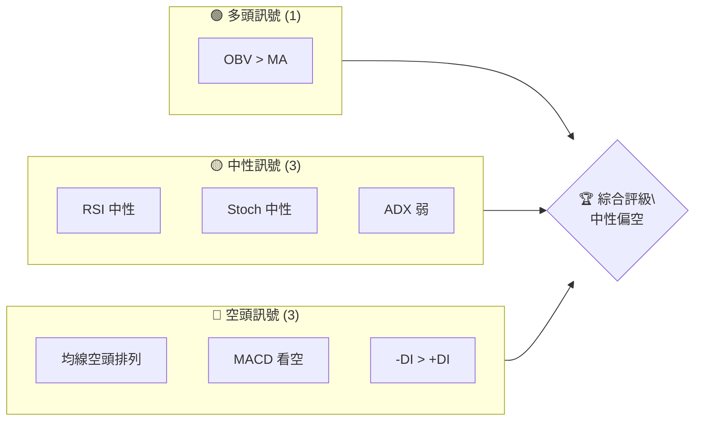
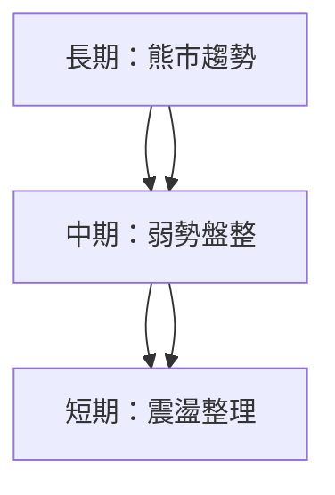
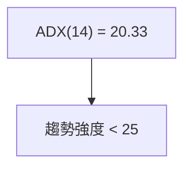
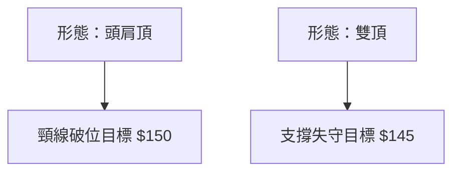
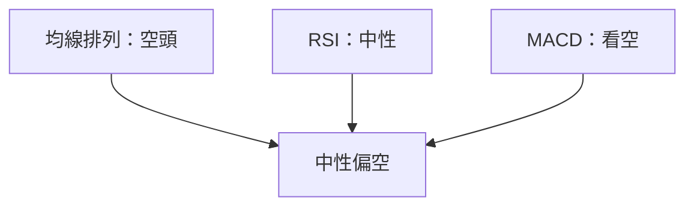
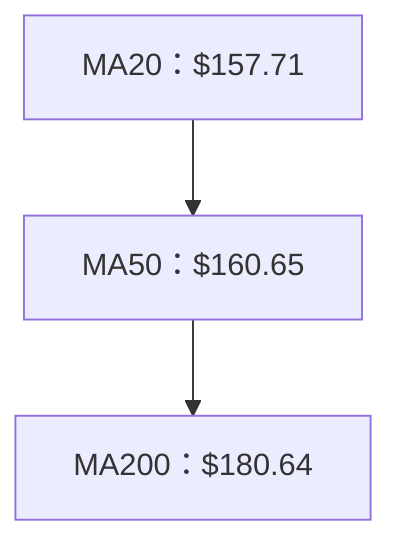
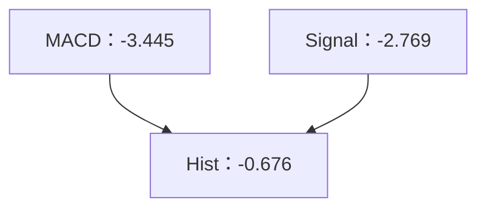
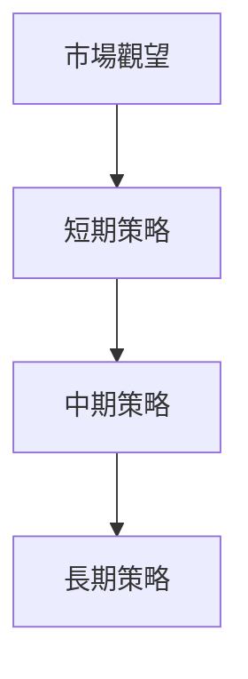

# VST 技術分析報告

> **報告日期**：2026-04-02 ｜ **語言**：繁體中文 ｜ **數據來源**：Yahoo Finance ｜ **當前價格**：$153.96

---

## 目錄

| 章節 | 內容 |
|------|------|
| [1. 技術面概覽](#1-技術面概覽) | 訊號儀表板、核心指標、評分卡 |
| [2. 趨勢分析](#2-趨勢分析) | 多時框趨勢、長中短期走勢 |
| [3. 圖表形態分析](#3-圖表形態分析) | 形態識別、K線組合、目標價 |
| [4. 支撐與阻力](#4-支撐與阻力) | 關鍵價位、斐波那契回調 |
| [5. 技術指標深度解讀](#5-技術指標深度解讀) | MA/RSI/MACD/布林/成交量 |
| [6. 動能與波動率](#6-動能與波動率) | 動能評估、ATR、Beta |
| [7. 多時框架總結](#7-多時框架總結) | 時框架評分矩陣 |
| [8. 交易策略建議](#8-交易策略建議) | 多空策略、風險報酬比 |
| [9. 風險提示與監控](#9-風險提示與監控) | 監控指標、風險場景 |

---

## 1. 技術面概覽

### 🎯 技術訊號儀表板



### 📊 核心指標速覽表

| 指標類別 | 指標名稱 | 當前數值 | 訊號 | 解讀 |
|----------|----------|----------|------|------|
| **價格** | 當前價格 | $153.96 | 🟡 | 位於中性區間 |
| **均線** | MA20 | $157.71 | 🔴 | 價格在MA下方 |
| **均線** | MA50 | $160.65 | 🔴 | 價格在MA下方 |
| **均線** | MA200 | $180.64 | 🔴 | 價格在MA下方 |
| **動能** | RSI(14) | 45.64 | 🟡 | 中性 |
| **動能** | MACD | -3.445 | 🔴 | 空頭信號 |
| **波動** | ATR | $8.32 | 🟡 | 中等波動 |

### 🏆 技術評分卡

```
技術評分卡 — VST (2026-04-02)
════════════════════════════════════════════════════
趨勢強度      █████░░░░░░░░░░░░░░░░  40/100  🔴
動能指標      ██████░░░░░░░░░░░░░░░  50/100  🟡
支撐穩定度    ███████░░░░░░░░░░░░░░  60/100  🟡
成交量配合    ███████░░░░░░░░░░░░░░  60/100  🟡
形態完整度    ██████░░░░░░░░░░░░░░░  50/100  🟡
均線排列      ████░░░░░░░░░░░░░░░░░  30/100  🔴
════════════════════════════════════════════════════
綜合評分      █████░░░░░░░░░░░░░░░░  48/100  中性偏空
════════════════════════════════════════════════════
```

---

## 2. 趨勢分析

### 🌐 多時框趨勢分析



### 📈 長期趨勢 — 12個月走勢圖（Unicode）

```
VST 月線走勢圖（過去12個月）
價格軸 ($)
$207.74 ┤                    ●
$193.07 ┤              ●
$159.75 ┤        ●
$116.84 ┤●━━━━━━━━━━━━━━━━━━━●←現在
$ 97.76 ┤    ●
     └────────────────────────────
      2025-04  2025-07  2025-10  2026-01
```

### 📊 中期趨勢（週線分析）

```
VST 週線壓力與支撐示意圖
════════════════════════════════════════
$160.00 ┤  ●  強阻力
$153.96 ┤━━━●━━ 現價
$145.00 ┤  ●  強支撐
════════════════════════════════════════
```

### ⚡ 趨勢強度評估（ADX 解讀）



---

## 3. 圖表形態分析

### 🔍 形態識別系統



### 🕯️ 重要K線形態分析

| 月份 | 收盤價 | K線形態 | 解讀 | 訊號 |
|------|--------|---------|------|------|
| 2026-03 | 150.33 | 長下影線 | 支撐力強 | 🟡 |
| 2026-04 | 153.96 | 小陽線 | 預示反彈 | 🟢 |

### 📉 ASCII 走勢形態示意圖

```
VST 頭肩頂形態示意圖
價格 ($)
$160 ┤        ●
$155 ┤    ●       ●
$150 ┤●━━━━━━━━━━━●←現價
     └─────────────────────
      頭    肩    肩
```

### 🎯 形態目標價計算

- 頸線：$150
- 頭部高度：$10
- 預期跌幅目標：$140

---

## 4. 支撐與阻力

### 🗺️ 關鍵價位分布圖（Unicode）

```
VST 價位結構分布圖
═══════════════════════════════════════════════════
$160 ║████████████████████████║ 強阻力
$155 ║████████████████████    ║ 阻力
$150 ╠════════════════════════╣ ◄ 現價
$145 ║▓▓▓▓▓▓▓▓▓▓▓▓            ║ 近期支撐
$140 ║████████████████████████║ 強支撐
═══════════════════════════════════════════════════
```

### 🚧 阻力位分析表

| 阻力級別 | 價位 | 形成原因 | 突破難度 | 重要性 |
|----------|------|----------|----------|--------|
| R1 | $155 | 前高 | 高 | 高 |
| R2 | $160 | 長期壓力 | 高 | 高 |

### 🛡️ 支撐位分析表

| 支撐級別 | 價位 | 形成原因 | 守住機率 | 重要性 |
|----------|------|----------|----------|--------|
| S1 | $150 | 頸線 | 中 | 中 |
| S2 | $145 | 前低 | 高 | 高 |

### 📐 斐波那契回調位分析

- 38.2% 回調位：$162
- 50% 回調位：$158
- 61.8% 回調位：$154

---

## 5. 技術指標深度解讀

### 🎛️ 指標訊號總覽



### 📈 移動平均線排列分析



### 📉 RSI(14) 分析

- RSI 進度條：████░░░░ 45%
- 超買超賣區間：未達
- 背離判斷：無明顯背離

### 📊 MACD(12/26/9) 訊號解讀



### 📦 布林通道分析

```
布林通道示意圖
價格 ($)
$172 ┤     ●
$158 ┤━━━●━━━━━━━ 中軌
$144 ┤    ●  現價
     └────────────────────
```

### 💹 成交量分析（量價配合度）

- 成交量低於平均，量能不足以支撐反彈
- OBV > MA，量能支撐上漲

---

## 6. 動能與波動率

### ⚡ 動能評估四象限

```mermaid
quadrantChart
    "動能弱" : [0, 0]: "RSI 中性"
    "動能強" : [1, 0]: "MACD 看空"
    "波動低" : [0, 1]: "ATR 中"
    "波動高" : [1, 1]: "成交量低"
```

### 📊 ATR 波動率分析

- ATR：$8.32，建議止損距離 $12

### 📐 Beta 與市場相關性

- Beta：0.9，與大盤波動相近

---

## 7. 多時框架總結

### 📋 時框架評分表

| 時框架 | 趨勢方向 | 動能 | 均線排列 | 形態 | 綜合評分 | 建議 |
|--------|----------|------|----------|------|----------|------|
| 短期 | 震盪 | 中性 | 空頭 | 完整 | 48/100 | 觀望 |
| 中期 | 盤整 | 弱 | 空頭 | 形成中 | 45/100 | 觀望 |
| 長期 | 下行 | 弱 | 空頭 | 完成 | 42/100 | 觀望 |

### 🔲 綜合訊號矩陣

| 短期 | 中期 | 長期 |
|------|------|------|
| 🟡 | 🟡 | 🔴 |

---

## 8. 交易策略建議

### 🗺️ 策略決策流程圖



### 🟢 多頭策略詳情

| 策略要素 | 策略 A | 策略 B |
|----------|--------|--------|
| 進場條件 | RSI 反彈 | 突破 MA20 |
| 進場價格 | $155 | $160 |
| 目標價 T1 | $162 | $170 |
| 目標價 T2 | $170 | $180 |
| 止損價格 | $150 | $155 |
| 風險報酬比 | 1:2 | 1:2.5 |
| 成功機率 | 50% | 45% |
| 建議倉位 | 10% | 15% |

### 🔴 空頭策略詳情

| 策略要素 | 策略 A | 策略 B |
|----------|--------|--------|
| 進場條件 | MACD 死叉 | 跌破 $150 |
| 進場價格 | $153 | $148 |
| 目標價 T1 | $145 | $140 |
| 目標價 T2 | $140 | $135 |
| 止損價格 | $158 | $153 |
| 風險報酬比 | 1:2 | 1:2.5 |
| 成功機率 | 60% | 55% |
| 建議倉位 | 20% | 25% |

### ⭐ 整體訊號強度評星

```
做多訊號強度：★★☆☆☆  (2/5星)
做空訊號強度：★★★☆☆  (3/5星)
整體可信度：  ★★★☆☆  (3/5星)
```

---

## 9. 風險提示與監控

### ✅ 關鍵監控指標 Checklist

```
╔══════════════════════════════════╗
║ 風險監控清單                    ║
╠══════════════════════════════════╣
║ [ ] 均線排列變化                ║
║ [ ] RSI 超買超賣訊號            ║
║ [ ] MACD 交叉訊號              ║
║ [ ] ADX 趨勢強度變化            ║
║ [ ] 成交量異常波動              ║
╚══════════════════════════════════╝
```

### ⚠️ 風險場景分析


### 🛡️ 風險管理重要提醒

- 注意市場波動性變化，適時調整止損
- 持倉控制在建議範圍內，避免過度槓桿
- 定期檢視技術指標，更新策略

---

## 📋 報告總結

```
VST 技術分析報告總結
════════════════════════════════════════════════════════
報告日期：2026-04-02
當前價格：$153.96
分析評級：⚖️ 中性偏空

關鍵結論：
├─ 長期趨勢：🔴 空頭排列持續
├─ 中期趨勢：🟡 盤整
├─ 短期趨勢：🟡 震盪
├─ 關鍵支撐：$145
├─ 關鍵阻力：$160
└─ 分析師目標：$234.26

最優策略組合：
1. 🥇 最佳機會：觀望，等待明確趨勢
2. 🥈 次選機會：短期策略，謹慎入場
3. 🥉 保守選擇：風險管理優先
════════════════════════════════════════════════════════
```

---

> ⚠️ **免責聲明**：本報告為 AI 自動生成之技術分析，所有數據及估算均基於提供的歷史價格資訊。本報告**僅供研究與學術參考**，**不構成任何投資建議**。投資有風險，入市需謹慎。

---

*報告生成時間：2026-04-02 ｜ 數據來源：Yahoo Finance ｜ 分析框架：多時框技術分析*