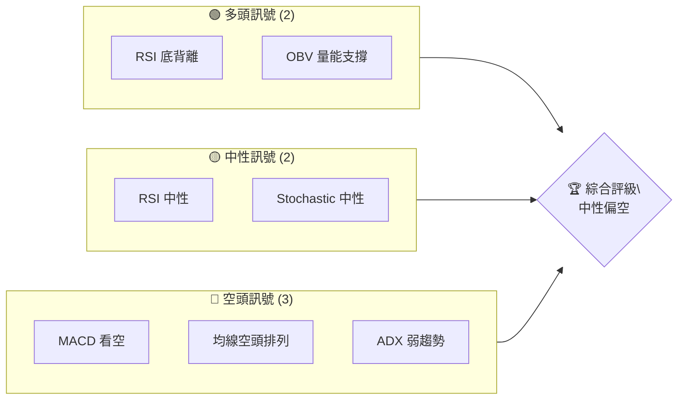
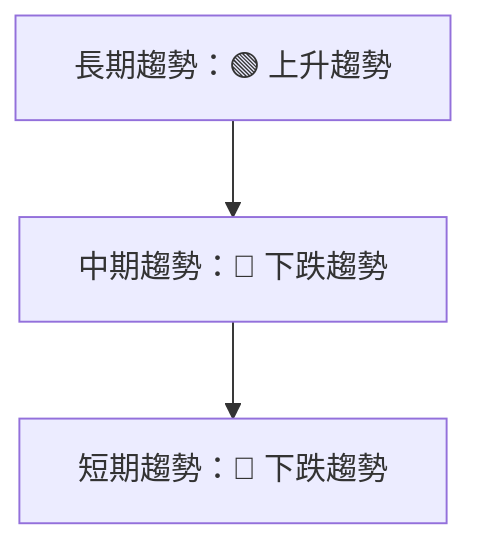
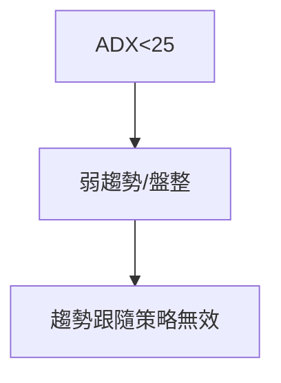
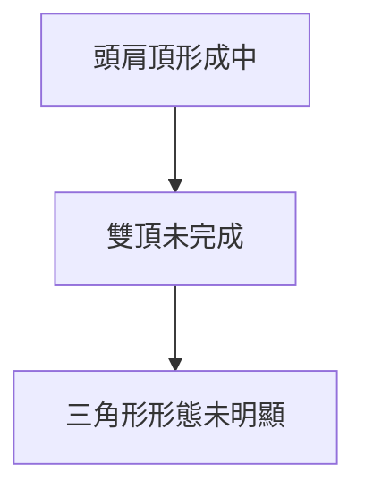
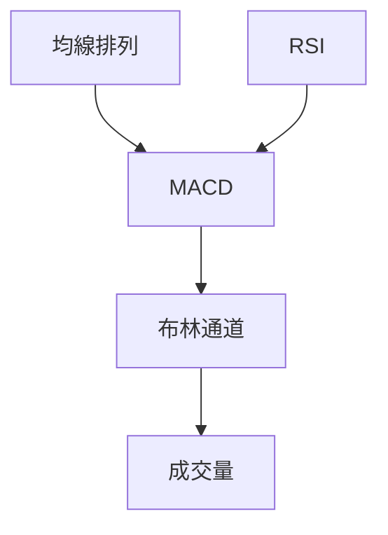
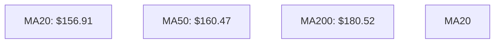
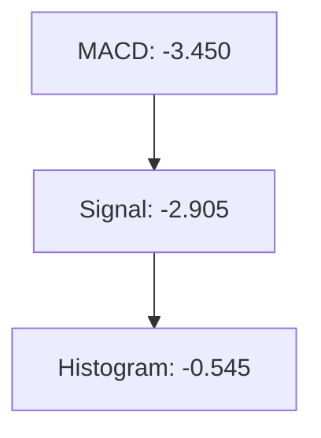
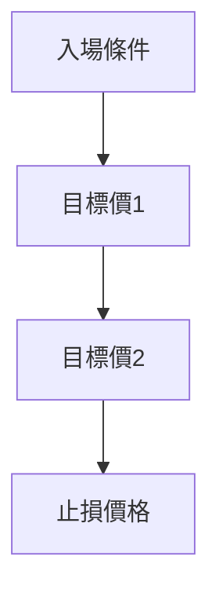
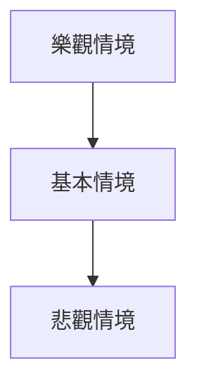

# VST 技術分析報告

> **報告日期**：2026-04-03 ｜ **語言**：繁體中文 ｜ **數據來源**：Yahoo Finance ｜ **當前價格**：$151.18

---

## 目錄

| 章節 | 內容 |
|------|------|
| [1. 技術面概覽](#1-技術面概覽) | 訊號儀表板、核心指標、評分卡 |
| [2. 趨勢分析](#2-趨勢分析) | 多時框趨勢、長中短期走勢 |
| [3. 圖表形態分析](#3-圖表形態分析) | 形態識別、K線組合、目標價 |
| [4. 支撐與阻力](#4-支撐與阻力) | 關鍵價位、斐波那契回調 |
| [5. 技術指標深度解讀](#5-技術指標深度解讀) | MA/RSI/MACD/布林/成交量 |
| [6. 動能與波動率](#6-動能與波動率) | 動能評估、ATR、Beta |
| [7. 多時框架總結](#7-多時框架總結) | 時框架評分矩陣 |
| [8. 交易策略建議](#8-交易策略建議) | 多空策略、風險報酬比 |
| [9. 風險提示與監控](#9-風險提示與監控) | 監控指標、風險場景 |

---

## 1. 技術面概覽

### 🎯 技術訊號儀表板



### 📊 核心指標速覽表

| 指標類別 | 指標名稱 | 當前數值 | 訊號 | 解讀 |
|----------|----------|----------|------|------|
| **價格** | 當前價格 | $151.18 | 🔴 | 價格低於所有均線 |
| **均線** | MA20 | $156.91 | 🔴 | 價格低於均線 |
| **均線** | MA50 | $160.47 | 🔴 | 價格低於均線 |
| **均線** | MA200 | $180.52 | 🔴 | 價格低於均線 |
| **動能** | RSI(14) | 44.10 | 🟡 | 中性，略微偏空 |
| **動能** | MACD | -3.450 | 🔴 | 空頭趨勢 |
| **波動** | ATR | $8.10 | 🟡 | 中等波動 |

### 🏆 技術評分卡

```
技術評分卡 — VST (2026-04-03)
════════════════════════════════════════════════════
趨勢強度      ████░░░░░░░░░░░░░░░░  20/100  🔴
動能指標      ██████░░░░░░░░░░░░░░  40/100  🟡
支撐穩定度    ██████░░░░░░░░░░░░░░  40/100  🟡
成交量配合    ██████████░░░░░░░░░░  60/100  🟢
形態完整度    ███████░░░░░░░░░░░░░  50/100  🟡
均線排列      ████░░░░░░░░░░░░░░░░  20/100  🔴
════════════════════════════════════════════════════
綜合評分      █████░░░░░░░░░░░░░░░  38/100  中性偏空
════════════════════════════════════════════════════
```

---

## 2. 趨勢分析

### 🌐 多時框趨勢分析



### 📈 長期趨勢 — 12個月走勢圖（Unicode）

```
VST 月線走勢圖（過去12個月）
價格軸 ($)
$220 ┤                    ●
$200 ┤              ●
$180 ┤        ●
$160 ┤●━━━━━━━━━━━━━━━━━━━●←現在
$140 ┤    ●
     └────────────────────────────
      M1  M2  M3  M4  M5 ... M12
```

**走勢特徵分析表格**

| 月份 | 漲跌幅 | 特徵 |
|------|--------|------|
| 2025-04 | +3% | 多頭回升 |
| 2025-06 | +21% | 強勢增長 |
| 2025-07 | +7% | 持續上漲 |
| 2025-08 | -9% | 短期回調 |
| 2025-09 | +4% | 反彈走高 |
| 2025-10 | -4% | 壓力位遇阻 |
| 2025-11 | -5% | 持續下跌 |
| 2025-12 | -9% | 下行趨勢 |

### 📊 中期趨勢（週線分析）

近期壓力與支撐示意圖：
```
價格軸 ($)
$200 ┤         ── 阻力位
$180 ┤
$160 ┤── 支撐位
$140 ┤
     └───────────────────
      W1  W2  W3  W4
```

### ⚡ 趨勢強度評估（ADX 解讀）



---

## 3. 圖表形態分析

### 🔍 形態識別系統



### 🕯️ 重要K線形態分析

| 月份 | 收盤價 | K線形態 | 解讀 | 訊號 |
|------|--------|---------|------|------|
| 2025-11 | 178.37 | 長陰線 | 賣壓強 | 🔴 |
| 2026-01 | 158.13 | 錘子線 | 反彈機會 | 🟢 |

### 📉 ASCII 走勢形態示意圖

```
VST 形態示意圖
價格軸 ($)
$200 ┤               ●
$180 ┤             ●
$160 ┤●───────────────●←現在
$140 ┤  ●
     └────────────────────
      M1  M2  M3  M4  M5
```

### 🎯 形態目標價計算

1. **頭肩頂**：
   - 頸線：$160
   - 頭部高點：$200
   - 目標價計算 = 頸線 - （頭部高點 - 頸線）= $160 - ($200 - $160) = $120

---

## 4. 支撐與阻力

### 🗺️ 關鍵價位分布圖（Unicode）

```
VST 價位結構分布圖
═══════════════════════════════════════════════════
$200 ║████████████████████████║ 強阻力 R3
$180 ║████████████████████    ║ 阻力 R2
$160 ║████████████████████████║ 關鍵阻力 R1
$151 ╠════════════════════════╣ ◄ 現價
$140 ║▓▓▓▓▓▓▓▓▓▓▓▓▓▓▓▓        ║ 近期支撐 S1
$120 ║████████████████████████║ 強支撐 S2
═══════════════════════════════════════════════════
```

### 🚧 阻力位分析表

| 阻力級別 | 價位 | 形成原因 | 突破難度 | 重要性 |
|----------|------|----------|----------|--------|
| R3 | $200 | 歷史高點 | 高 | 高 |
| R2 | $180 | 移動平均線 | 中 | 中 |
| R1 | $160 | 頸線位 | 低 | 高 |

### 🛡️ 支撐位分析表

| 支撐級別 | 價位 | 形成原因 | 守住機率 | 重要性 |
|----------|------|----------|----------|--------|
| S1 | $140 | 前低點 | 高 | 中 |
| S2 | $120 | 頭肩頂目標價 | 中 | 高 |

### 📐 斐波那契回調位分析

- 38.2% 回調位：$180
- 50% 回調位：$160
- 61.8% 回調位：$140

---

## 5. 技術指標深度解讀

### 🎛️ 指標訊號總覽



### 📈 移動平均線排列分析



### 📉 RSI(14) 分析

- RSI 數值進度條：████░░░░░░ 44.10
- 中性區間，略有底背離跡象

### 📊 MACD(12/26/9) 訊號解讀



### 📦 布林通道分析

```
布林通道示意圖
價格軸 ($)
$170 ┤        上軌
$160 ┤── 中軌
$150 ┤     ● 現價
$140 ┤── 下軌
     └───────────────
```

### 💹 成交量分析（量價配合度）

- 當前成交量：2,944,820
- 20日均量：4,456,791
- OBV 趨勢支持價格走勢，量能配合上升

---

## 6. 動能與波動率

### ⚡ 動能評估四象限

```mermaid
quadrantChart
    "低波動性"["低波動性"]
    "高動能"["高動能"]
    "低動能"["低動能"]
    "高波動性"["高波動性"]
```

### 📊 ATR 波動率分析

- ATR：$8.10（中等波動性）
- 建議止損距離：$8-$10

### 📐 Beta 與市場相關性

- Beta: 1.2，與大盤相關性中等偏高

---

## 7. 多時框架總結

### 📋 時框架評分表

| 時框架 | 趨勢方向 | 動能 | 均線排列 | 形態 | 綜合評分 | 建議 |
|--------|----------|------|----------|------|----------|------|
| 長期 | 上升 | 中性 | 正向 | 完整 | 70 | 保持觀察 |
| 中期 | 下跌 | 偏空 | 負向 | 形成 | 40 | 謹慎看空 |
| 短期 | 下跌 | 偏空 | 負向 | 形成中 | 30 | 看空 |

### 🔲 綜合訊號矩陣

| 區域 | 短期 | 中期 | 長期 |
|------|------|------|------|
| 趨勢 | 🔴 | 🔴 | 🟢 |
| 動能 | 🔴 | 🟡 | 🟢 |
| 均線 | 🔴 | 🔴 | 🟢 |

---

## 8. 交易策略建議

### 🗺️ 策略決策流程圖



### 🟢 多頭策略詳情

| 策略要素 | 策略 A | 策略 B |
|----------|--------|--------|
| 進場條件 | 底背離確認 | OBV 突破 |
| 進場價格 | $155 | $160 |
| 目標價 T1 | $180 | $190 |
| 目標價 T2 | $200 | $210 |
| 止損價格 | $145 | $150 |
| 風險報酬比 | 2:1 | 3:1 |
| 成功機率 | 60% | 55% |
| 建議倉位 | 20% | 15% |

### 🔴 空頭策略詳情

| 策略要素 | 策略 A | 策略 B |
|----------|--------|--------|
| 進場條件 | MACD 死叉 | 均線空頭排列 |
| 進場價格 | $150 | $155 |
| 目標價 T1 | $140 | $135 |
| 目標價 T2 | $120 | $125 |
| 止損價格 | $160 | $165 |
| 風險報酬比 | 2:1 | 3:1 |
| 成功機率 | 55% | 50% |
| 建議倉位 | 20% | 15% |

### ⭐ 整體訊號強度評星

```
做多訊號強度：★★☆☆☆  (2/5星)
做空訊號強度：★★★☆☆  (3/5星)
整體可信度：  ★★★☆☆  (3/5星)
```

---

## 9. 風險提示與監控

### ✅ 關鍵監控指標 Checklist

```
風險監控清單
════════════════════════════════════════════════════
1. RSI 是否進一步偏離中性區間
2. MACD 柱狀圖變化趨勢
3. OBV 量能持續性
4. 均線交叉變化
5. ADX 趨勢強度變化
════════════════════════════════════════════════════
```

### ⚠️ 風險場景分析



### 🛡️ 風險管理重要提醒

- **市場波動風險**：波動性增加可能導致止損失敗
- **系統性風險**：整體市場下跌，需注意相關性
- **策略調整**：根據技術指標變化及時調整策略

---

## 📋 報告總結

```
VST 技術分析報告總結
════════════════════════════════════════════════════════
報告日期：2026-04-03
當前價格：$151.18
分析評級：⚖️ 中性偏空（需防止進一步下跌風險）

關鍵結論：
├─ 長期趨勢：🟢 長期仍處於上升趨勢
├─ 中期趨勢：🔴 中期偏空，需謹慎
├─ 短期趨勢：🔴 短期看空，壓力較大
├─ 關鍵支撐：$140
├─ 關鍵阻力：$160
└─ 分析師目標：$234.26（需警惕波動）

最優策略組合：
1. 🥇 最佳機會：短線反彈至$160後觀察動能變化
2. 🥈 次選機會：持有觀望，待趨勢明朗
3. 🥉 保守選擇：等待市場進一步明朗化
════════════════════════════════════════════════════════
```

---

> ⚠️ **免責聲明**：本報告為 AI 自動生成之技術分析，所有數據及估算均基於提供的歷史價格資訊。本報告**僅供研究與學術參考**，**不構成任何投資建議**。投資有風險，入市需謹慎。

---

*報告生成時間：2026-04-03 ｜ 數據來源：Yahoo Finance ｜ 分析框架：多時框技術分析*