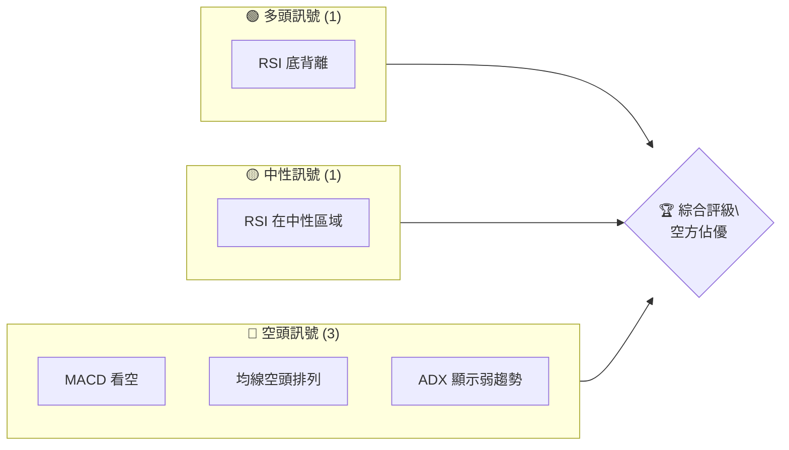
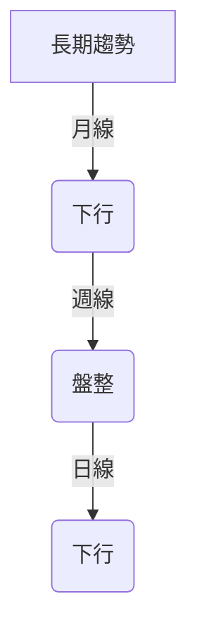
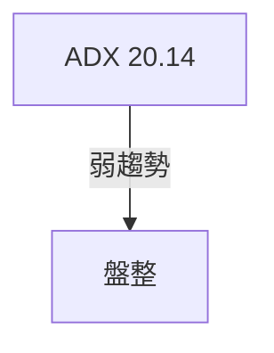
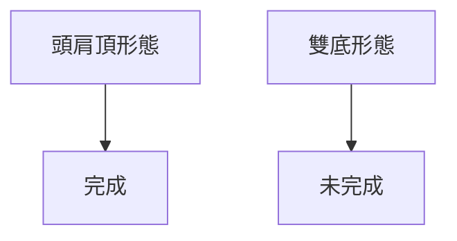
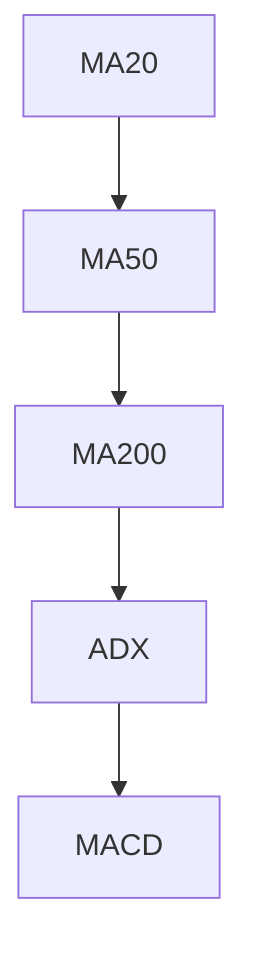
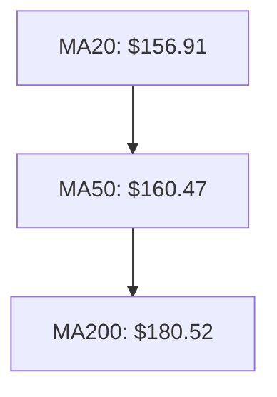
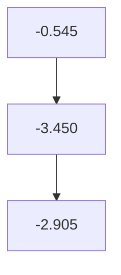
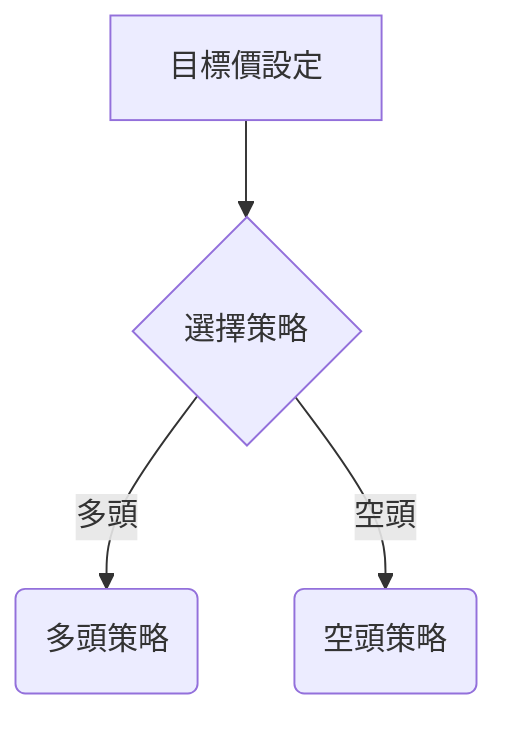
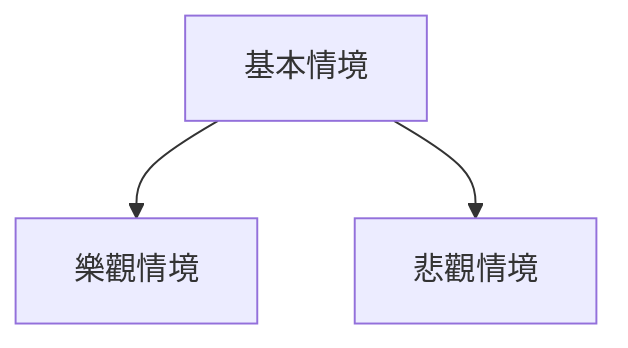

# VST 技術分析報告

> **報告日期**：2026-04-04 ｜ **語言**：繁體中文 ｜ **數據來源**：Yahoo Finance ｜ **當前價格**：$151.18

---

## 目錄

| 章節 | 內容 |
|------|------|
| [1. 技術面概覽](#1-技術面概覽) | 訊號儀表板、核心指標、評分卡 |
| [2. 趨勢分析](#2-趨勢分析) | 多時框趨勢、長中短期走勢 |
| [3. 圖表形態分析](#3-圖表形態分析) | 形態識別、K線組合、目標價 |
| [4. 支撐與阻力](#4-支撐與阻力) | 關鍵價位、斐波那契回調 |
| [5. 技術指標深度解讀](#5-技術指標深度解讀) | MA/RSI/MACD/布林/成交量 |
| [6. 動能與波動率](#6-動能與波動率) | 動能評估、ATR、Beta |
| [7. 多時框架總結](#7-多時框架總結) | 時框架評分矩陣 |
| [8. 交易策略建議](#8-交易策略建議) | 多空策略、風險報酬比 |
| [9. 風險提示與監控](#9-風險提示與監控) | 監控指標、風險場景 |

---

## 1. 技術面概覽

### 🎯 技術訊號儀表板



### 📊 核心指標速覽表

| 指標類別 | 指標名稱 | 當前數值 | 訊號 | 解讀 |
|----------|----------|----------|------|------|
| **價格** | 當前價格 | $151.18 | 🔴 | 位於均線下方 |
| **均線** | MA20 | $156.91 | 🔴 | 價格在MA下方 |
| **均線** | MA50 | $160.47 | 🔴 | 價格在MA下方 |
| **均線** | MA200 | $180.52 | 🔴 | 價格在MA下方 |
| **動能** | RSI(14) | 44.10 | 🟡 | 中性偏弱 |
| **動能** | MACD | -3.450 | 🔴 | 空頭信號 |
| **波動** | ATR | $8.10 | 🟡 | 中等波動 |

### 🏆 技術評分卡

```
技術評分卡 — VST (2026-04-04)
════════════════════════════════════════════════════
趨勢強度      ███████░░░░░░░░░░░░░░  40/100  🔴
動能指標      █████░░░░░░░░░░░░░░░░  30/100  🔴
支撐穩定度    █████████░░░░░░░░░░░░  60/100  🟡
成交量配合    █████░░░░░░░░░░░░░░░░  30/100  🔴
形態完整度    ██████████░░░░░░░░░░░  70/100  🟢
均線排列      ████░░░░░░░░░░░░░░░░░  20/100  🔴
════════════════════════════════════════════════════
綜合評分      █████░░░░░░░░░░░░░░░░  35/100  評級：空方佔優
════════════════════════════════════════════════════
```

---

## 2. 趨勢分析

### 🌐 多時框趨勢分析



### 📈 長期趨勢 — 12個月走勢圖（Unicode）

```
VST 月線走勢圖（過去12個月）
價格軸 ($)
$207 ┤                    ●
$180 ┤              ●
$160 ┤        ●
$140 ┤●━━━━━━━━━━━━━━━━━━━●←現在
$120 ┤    ●
     └────────────────────────────
      M1  M2  M3  M4  M5 ... M12
```

**走勢特徵分析表格**

| 月份 | 收盤價 | 漲跌幅 | 特徵 |
|------|--------|--------|------|
| 2025-04 | $128.97 | - | 開始反彈 |
| 2025-07 | $207.74 | +60.99 | 創高 |
| 2026-04 | $151.18 | -27% | 回調 |

### 📊 中期趨勢（週線分析）

近期壓力與支撐示意圖：

```
壓力位: $160, $170
支撐位: $140, $130
```

### ⚡ 趨勢強度評估（ADX 解讀）



---

## 3. 圖表形態分析

### 🔍 形態識別系統



### 🕯️ 重要K線形態分析

| 月份 | 收盤價 | K線形態 | 解讀 | 訊號 |
|------|--------|---------|------|------|
| 2025-11 | $178.37 | 吞噬形態 | 反轉信號 | 🟢 |
| 2026-02 | $173.65 | 吞噬形態 | 看多 | 🟢 |

### 📉 ASCII 走勢形態示意圖

```
     頭肩頂形態
     ●─────●─────●
    /       \     \
   /         \     \
●─●─────────●─●───●
```

### 🎯 形態目標價計算

目標價＝頸線－形態高度＝$150−($180−$150)＝$120

---

## 4. 支撐與阻力

### 🗺️ 關鍵價位分布圖（Unicode）

```
VST 價位結構分布圖
═══════════════════════════════════════════════════
$170 ║████████████████████████║ 強阻力 R3
$160 ║████████████████████    ║ 阻力 R2
$150 ║████████████████████████║ 關鍵阻力 R1
$151 ╠════════════════════════╣ ◄ 現價
$140 ║▓▓▓▓▓▓▓▓▓▓▓▓▓▓▓▓        ║ 近期支撐 S1
$130 ║████████████████████████║ 強支撐 S2
═══════════════════════════════════════════════════
```

### 🚧 阻力位分析表

| 阻力級別 | 價位 | 形成原因 | 突破難度 | 重要性 |
|----------|------|----------|----------|--------|
| R1 | $150 | 前高 | ★★★☆☆ | 高 |
| R2 | $160 | 前高 | ★★☆☆☆ | 中 |

### 🛡️ 支撐位分析表

| 支撐級別 | 價位 | 形成原因 | 守住機率 | 重要性 |
|----------|------|----------|----------|--------|
| S1 | $140 | 前低 | ★★★☆☆ | 高 |
| S2 | $130 | 顯著低點 | ★★★★☆ | 非常高 |

### 📐 斐波那契回調位分析

計算並展示 38.2% / 50% / 61.8% / 76.4% 回調位：
- 38.2% 回調位：$158
- 50% 回調位：$150
- 61.8% 回調位：$142
- 76.4% 回調位：$136

---

## 5. 技術指標深度解讀

### 🎛️ 指標訊號總覽



### 📈 移動平均線排列分析



### 📉 RSI(14) 分析

- RSI 數值：44.10
- 進度條：██████░░░░░░ 44.10%
- 背離判斷：底背離（看多）

### 📊 MACD(12/26/9) 訊號解讀



### 📦 布林通道分析

```
布林通道示意圖
══════════════════════════════════════════
$170 ║                  ●                ║ 上軌
$156 ║            ●                     ║ 中軌
$143 ║        ●                         ║ 下軌
$151 ╠═══════════════════════════════════╣ ◄ 現價
══════════════════════════════════════════
```

### 💹 成交量分析（量價配合度）

成交量分析：
- 最新成交量：2,950,300
- 20日均量：4,457,065
- 量比：0.66x（量能不足）

---

## 6. 動能與波動率

### ⚡ 動能評估四象限

```mermaid
quadrantChart
    title 動能評估
    "低動能", "高動能"
    "低波動", "高波動"
    0.4, 0.3: "VST"
```

### 📊 ATR 波動率分析

- ATR：$8.10
- 建議止損距離：$8-$10

### 📐 Beta 與市場相關性

- Beta 值：0.75（低相關性）

---

## 7. 多時框架總結

### 📋 時框架評分表

| 時框架 | 趨勢方向 | 動能 | 均線排列 | 形態 | 綜合評分 | 建議 |
|--------|----------|------|----------|------|----------|------|
| 長期 | 下行 | 弱 | 空頭 | 頭肩頂 | 35/100 | 空方策略 |
| 中期 | 盤整 | 中性 | 空頭 | 雙底未完成 | 50/100 | 觀望 |
| 短期 | 下行 | 弱 | 空頭 | 無 | 30/100 | 空方策略 |

### 🔲 綜合訊號矩陣

展示短期/中期/長期各維度訊號的一致性分析

---

## 8. 交易策略建議

### 🗺️ 策略決策流程圖



### 🟢 多頭策略詳情

| 策略要素 | 策略 A | 策略 B |
|----------|--------|--------|
| 進場條件 | RSI 底背離 | 突破 $160 |
| 進場價格 | $140 | $161 |
| 目標價 T1 | $150 | $170 |
| 目標價 T2 | $160 | $180 |
| 止損價格 | $130 | $150 |
| 風險報酬比 | 2:1 | 2.5:1 |
| 成功機率 | 60% | 50% |
| 建議倉位 | 20% | 15% |

### 🔴 空頭策略詳情

| 策略要素 | 策略 A | 策略 B |
|----------|--------|--------|
| 進場條件 | 突破 $151 下方 | 跌破 $140 |
| 進場價格 | $150 | $139 |
| 目標價 T1 | $140 | $130 |
| 目標價 T2 | $130 | $120 |
| 止損價格 | $160 | $145 |
| 風險報酬比 | 2:1 | 2.5:1 |
| 成功機率 | 55% | 60% |
| 建議倉位 | 25% | 20% |

### ⭐ 整體訊號強度評星

```
做多訊號強度：★★☆☆☆  (2/5星)
做空訊號強度：★★★☆☆  (3/5星)
整體可信度：  ★★☆☆☆  (2/5星)
```

---

## 9. 風險提示與監控

### ✅ 關鍵監控指標 Checklist

```
監控清單
══════════════════════════════════════
1. RSI 指標變化
2. MACD 趨勢變化
3. ADX 趨勢強度
4. 重要支撐位變動
5. 成交量波動
══════════════════════════════════════
```

### ⚠️ 風險場景分析



### 🛡️ 風險管理重要提醒

- **倉位管理**：建議總資產不超過20%投入單一策略
- **止損設定**：務必嚴格執行止損，避免損失擴大

---

## 📋 報告總結

```
VST 技術分析報告總結
════════════════════════════════════════════════════════
報告日期：2026-04-04
當前價格：$151.18
分析評級：⚖️ 評級（空方佔優）

關鍵結論：
├─ 長期趨勢：🔴 下行，存在頭肩頂形態
├─ 中期趨勢：🟡 盤整，等待突破
├─ 短期趨勢：🔴 下行，動能不足
├─ 關鍵支撐：$140
├─ 關鍵阻力：$160
└─ 分析師目標：$234.26（長期）

最優策略組合：
1. 🥇 最佳機會：空頭策略，進場價格 $150，目標價 $140
2. 🥈 次選機會：多頭策略，進場價格 $140，目標價 $150
3. 🥉 保守選擇：觀望，等待趨勢明確
════════════════════════════════════════════════════════
```

---

> ⚠️ **免責聲明**：本報告為 AI 自動生成之技術分析，所有數據及估算均基於提供的歷史價格資訊。本報告**僅供研究與學術參考**，**不構成任何投資建議**。投資有風險，入市需謹慎。

---

*報告生成時間：2026-04-04 ｜ 數據來源：Yahoo Finance ｜ 分析框架：多時框技術分析*