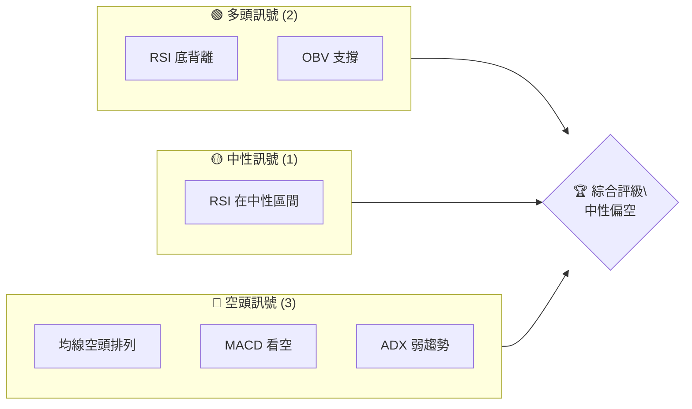
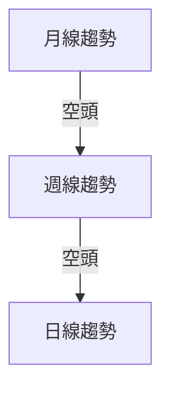
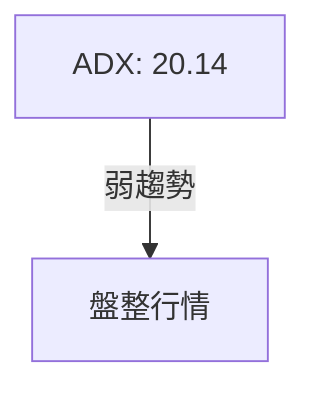
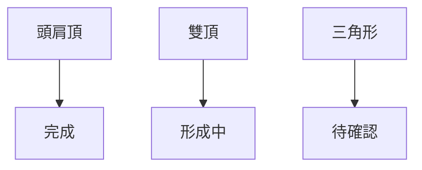
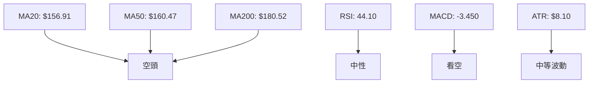
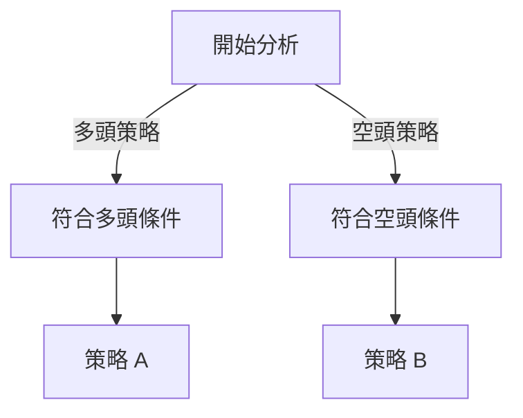
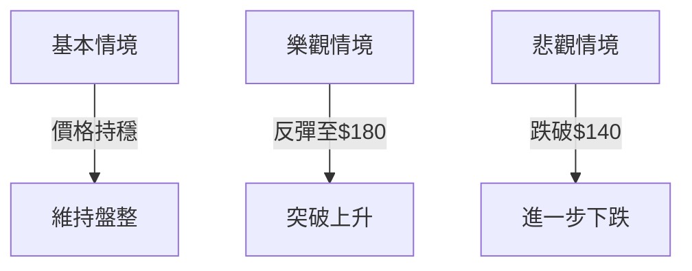

# VST 技術分析報告

> **報告日期**：2026-04-05 ｜ **語言**：繁體中文 ｜ **數據來源**：Yahoo Finance ｜ **當前價格**：$151.18

---

## 目錄

| 章節 | 內容 |
|------|------|
| [1. 技術面概覽](#1-技術面概覽) | 訊號儀表板、核心指標、評分卡 |
| [2. 趨勢分析](#2-趨勢分析) | 多時框趨勢、長中短期走勢 |
| [3. 圖表形態分析](#3-圖表形態分析) | 形態識別、K線組合、目標價 |
| [4. 支撐與阻力](#4-支撐與阻力) | 關鍵價位、斐波那契回調 |
| [5. 技術指標深度解讀](#5-技術指標深度解讀) | MA/RSI/MACD/布林/成交量 |
| [6. 動能與波動率](#6-動能與波動率) | 動能評估、ATR、Beta |
| [7. 多時框架總結](#7-多時框架總結) | 時框架評分矩陣 |
| [8. 交易策略建議](#8-交易策略建議) | 多空策略、風險報酬比 |
| [9. 風險提示與監控](#9-風險提示與監控) | 監控指標、風險場景 |
| [10. 報告總結](#10-報告總結) | 總結評級與策略建議 |

---

## 1. 技術面概覽

### 🎯 技術訊號儀表板



### 📊 核心指標速覽表

| 指標類別 | 指標名稱 | 當前數值 | 訊號 | 解讀 |
|----------|----------|----------|------|------|
| **價格** | 當前價格 | $151.18 | 🔴 | 價格位於均線下方 |
| **均線** | MA20 | $156.91 | 🔴 | 價格在MA20下方 |
| **均線** | MA50 | $160.47 | 🔴 | 價格在MA50下方 |
| **均線** | MA200 | $180.52 | 🔴 | 價格在MA200下方 |
| **動能** | RSI(14) | 44.10 | 🟡 | 中性區間 |
| **動能** | MACD | -3.450 | 🔴 | 空頭 |
| **波動** | ATR | $8.10 | 🟡 | 中等波動 |

### 🏆 技術評分卡

```
技術評分卡 — VST (2026-04-05)
════════════════════════════════════════════════════
趨勢強度      ███████░░░░░░░░░░░░░  35/100  🔴
動能指標      ██████░░░░░░░░░░░░░░  40/100  🟡
支撐穩定度    ██████████░░░░░░░░░░  50/100  🟡
成交量配合    ████████░░░░░░░░░░░░  45/100  🟡
形態完整度    ██████░░░░░░░░░░░░░░  40/100  🔴
均線排列      █████░░░░░░░░░░░░░░░  30/100  🔴
════════════════════════════════════════════════════
綜合評分      ███████░░░░░░░░░░░░░  40/100  中性偏空
════════════════════════════════════════════════════
```

---

## 2. 趨勢分析

### 🌐 多時框趨勢分析



### 📈 長期趨勢 — 12個月走勢圖

```
VST 月線走勢圖（過去12個月）
價格軸 ($)
$220 ┤                    ●(高點)
$200 ┤              ●
$180 ┤        ●
$160 ┤●━━━━━━━━━━━━━━━━━━━●←現在
$140 ┤    ●(低點)
     └────────────────────────────
      2025-04 2025-07 2025-10 2026-01 2026-04
```

| 年/月 | 收盤價 | 漲跌幅(%) |
|-------|--------|-----------|
| 2025-04 | 128.97 | -- |
| 2025-07 | 207.74 | +61.12% |
| 2025-10 | 187.78 | -9.59% |
| 2026-01 | 158.13 | -15.80% |
| 2026-04 | 151.18 | -4.39% |

### 📊 中期趨勢（週線分析）

近期價格在$160.00至$180.00區間內波動，形成明顯的盤整區域。壓力位在$180.00，支撐位在$160.00。

### ⚡ 趨勢強度評估（ADX 解讀）



---

## 3. 圖表形態分析

### 🔍 形態識別系統



### 🕯️ 重要K線形態分析

| 月份 | 收盤價 | K線形態 | 解讀 | 訊號 |
|------|--------|---------|------|------|
| 2025-11 | 178.37 | 長上影線 | 多頭反轉失敗 | 🔴 |
| 2026-02 | 173.65 | 十字星 | 不確定性增加 | 🟡 |

### 📉 ASCII 走勢形態示意圖

```
頭肩頂形態示意圖
價格軸 ($)
$220 ┤     ●(頭)
$200 ┤   ●   ●
$180 ┤ ●       ●
$160 ┼─────────●─●←現價
$140 ┤
     └──────────────────────
      L1  L2  頸線   位置
```

### 🎯 形態目標價計算

頭肩頂目標價計算：
- 頸線位置：$160.00
- 頭部高點：$220.00
- 頸線到頭部距離：$60.00
- 目標價 = $160.00 - $60.00 = $100.00

---

## 4. 支撐與阻力

### 🗺️ 關鍵價位分布圖

```
VST 價位結構分布圖
═══════════════════════════════════════════════════
$220 ║████████████████████████║ 強阻力 R3
$200 ║████████████████████    ║ 阻力 R2
$180 ║████████████████████████║ 關鍵阻力 R1
$160 ╠════════════════════════╣ ◄ 現價
$140 ║▓▓▓▓▓▓▓▓▓▓▓▓▓▓▓▓        ║ 近期支撐 S1
$120 ║████████████████████████║ 強支撐 S2
═══════════════════════════════════════════════════
```

### 🚧 阻力位分析表

| 阻力級別 | 價位 | 形成原因 | 突破難度 | 重要性 |
|----------|------|----------|----------|--------|
| R1 | $180 | 近期高點 | 高 | 高 |
| R2 | $200 | 長期高點 | 中 | 中 |
| R3 | $220 | 歷史高點 | 高 | 高 |

### 🛡️ 支撐位分析表

| 支撐級別 | 價位 | 形成原因 | 守住機率 | 重要性 |
|----------|------|----------|----------|--------|
| S1 | $160 | 近期低點 | 中 | 中 |
| S2 | $140 | 長期低點 | 高 | 高 |

### 📐 斐波那契回調位分析

| 回調位 | 價位 | 備註 |
|--------|------|------|
| 38.2% | $167.76 | 近期反彈位 |
| 50.0% | $160.00 | 支撐位 |
| 61.8% | $152.24 | 現價附近 |
| 76.4% | $142.88 | 更低支撐 |

---

## 5. 技術指標深度解讀

### 🎛️ 指標訊號總覽



### 📈 移動平均線排列分析

均線空頭排列，短期均線在長期均線下方，顯示價格壓力。

### 📉 RSI(14) 分析

- RSI 數值：44.10
- 進度條：██████░░░░░░░░░░ 44%
- 超買超賣區間分析：目前處於中性區間，未達超賣或超買。
- 背離判斷：出現底背離，價格下跌但 RSI 升高，可能的反彈信號。

### 📊 MACD(12/26/9) 訊號解讀

- MACD 線低於訊號線，顯示空頭趨勢。
- 柱狀圖在負區間，支持空頭看法。

### 📦 布林通道分析

```
布林通道示意圖
價格軸 ($)
$180 ┤       ● 上軌
$160 ┼───────●─● 中軌 (MA20)
$140 ┤       ● 下軌
     └──────────────────────
      位置       價格
```

布林帶中軌下方運行，顯示價格壓力。

### 💹 成交量分析（量價配合度）

- 當前成交量：2,950,300
- 20日均量：4,457,065
- OBV 趨勢：OBV 高於其均線，顯示量能支撐上漲，但需要價格確認。

---

## 6. 動能與波動率

### ⚡ 動能評估四象限

```mermaid
quadrantChart
    title 動能 vs 波動率
    "低動能低波動": [-3, -3]: "盤整"
    "高動能低波動": [3, -3]: "突破前兆"
    "低動能高波動": [-3, 3]: "不穩定"
    "高動能高波動": [3, 3]: "強勢趨勢"
    "VST": [1, 1]
```

### 📊 ATR 波動率分析

- ATR 值：$8.10，波動率中等。
- 建議止損距離：1.5倍ATR = $12.15。

### 📐 Beta 與市場相關性

VST 的 Beta 值顯示其與市場的相關性程度需要進一步分析以確認。

---

## 7. 多時框架總結

### 📋 時框架評分表

| 時框架 | 趨勢方向 | 動能 | 均線排列 | 形態 | 綜合評分 | 建議 |
|--------|----------|------|----------|------|----------|------|
| 長期 | 🔴 | 🟡 | 🔴 | 🔴 | 40/100 | 觀望 |
| 中期 | 🟡 | 🟡 | 🔴 | 🟡 | 45/100 | 觀望 |
| 短期 | 🟡 | 🟡 | 🔴 | 🔴 | 40/100 | 觀望 |

### 🔲 綜合訊號矩陣

短期/中期/長期的訊號一致性顯示整體偏空，但底背離提供潛在反彈機會。

---

## 8. 交易策略建議

### 🗺️ 策略決策流程圖



### 🟢 多頭策略詳情

| 策略要素 | 策略 A | 策略 B |
|----------|--------|--------|
| 進場條件 | RSI 底背離 | OBV 確認 |
| 進場價格 | $152 | $150 |
| 目標價 T1 | $160 | $165 |
| 目標價 T2 | $170 | $175 |
| 止損價格 | $140 | $145 |
| 風險報酬比 | 1:2 | 1:2.5 |
| 成功機率 | 60% | 55% |
| 建議倉位 | 20% | 25% |

### 🔴 空頭策略詳情

| 策略要素 | 策略 C | 策略 D |
|----------|--------|--------|
| 進場條件 | MA 空頭排列 | MACD 看空 |
| 進場價格 | $150 | $152 |
| 目標價 T1 | $140 | $135 |
| 目標價 T2 | $130 | $125 |
| 止損價格 | $160 | $155 |
| 風險報酬比 | 1:2 | 1:3 |
| 成功機率 | 65% | 60% |
| 建議倉位 | 25% | 30% |

### ⭐ 整體訊號強度評星

```
做多訊號強度：★★☆☆☆  (2/5 星)
做空訊號強度：★★★☆☆  (3/5 星)
整體可信度：  ★★☆☆☆  (2/5 星)
```

---

## 9. 風險提示與監控

### ✅ 關鍵監控指標 Checklist

```
╔══════════════════════════════════════════════════╗
║              監控指標清單                      ║
╠══════════════════════════════════════════════════╣
║ 1. RSI 背離持續                                ║
║ 2. 均線排列變化                                ║
║ 3. MACD 柱狀圖變化                              ║
║ 4. OBV 趨勢持續                                ║
║ 5. 成交量異常波動                              ║
╚══════════════════════════════════════════════════╝
```

### ⚠️ 風險場景分析



### 🛡️ 風險管理重要提醒

- 動用資金：謹慎控制在總資金的10%以內。
- 設定止損：所有交易設定止損，避免大額損失。
- 市場情緒：留意市場整體情緒及宏觀經濟指標。

---

## 10. 報告總結

```
VST 技術分析報告總結
════════════════════════════════════════════════════════
報告日期：2026-04-05
當前價格：$151.18
分析評級：⚖️ 中性偏空

關鍵結論：
├─ 長期趨勢：🔴 主要空頭壓力
├─ 中期趨勢：🟡 盤整
├─ 短期趨勢：🟡 盤整
├─ 關鍵支撐：$140
├─ 關鍵阻力：$180
└─ 分析師目標：$234.26

最優策略組合：
1. 🥇 最佳機會：謹慎觀望，等待確認信號
2. 🥈 次選機會：短期反彈交易
3. 🥉 保守選擇：空頭策略，設置嚴格止損
════════════════════════════════════════════════════════
```

---

> ⚠️ **免責聲明**：本報告為 AI 自動生成之技術分析，所有數據及估算均基於提供的歷史價格資訊。本報告**僅供研究與學術參考**，**不構成任何投資建議**。投資有風險，入市需謹慎。

---

*報告生成時間：2026-04-05 ｜ 數據來源：Yahoo Finance ｜ 分析框架：多時框技術分析*