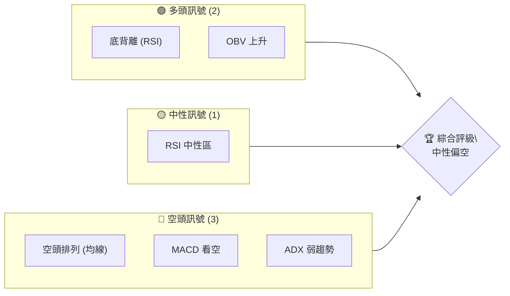
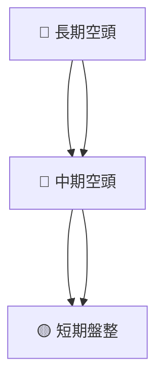
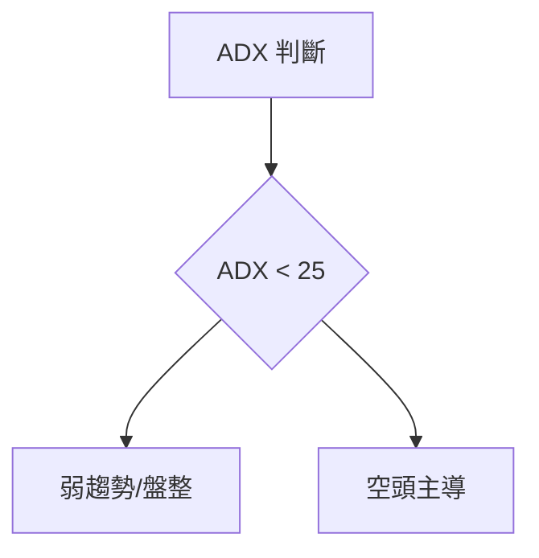
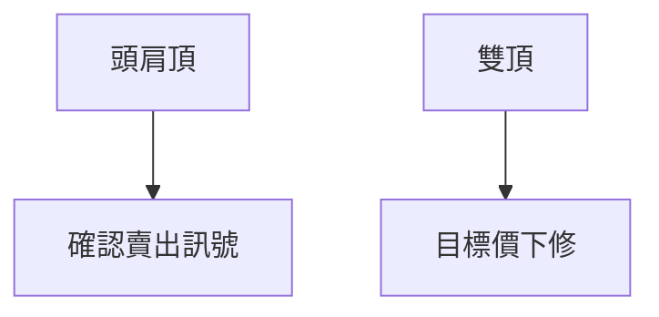
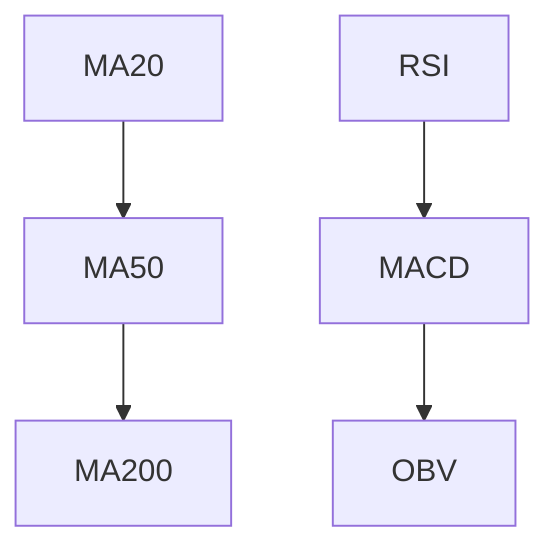
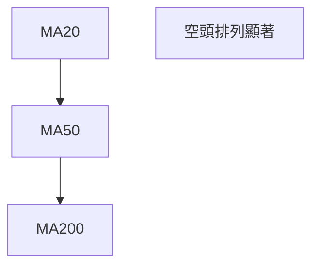
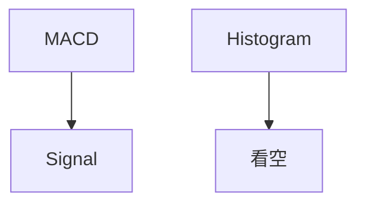
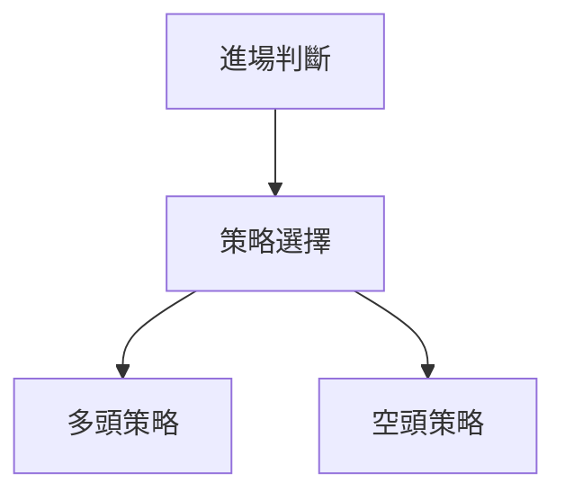
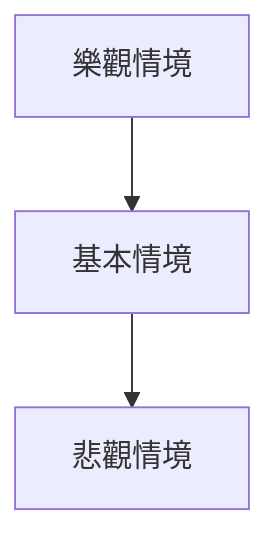

# VST 技術分析報告

> **報告日期**：2026-04-06 ｜ **語言**：繁體中文 ｜ **數據來源**：Yahoo Finance ｜ **當前價格**：$151.18

---

## 目錄

| 章節 | 內容 |
|------|------|
| [1. 技術面概覽](#1-技術面概覽) | 訊號儀表板、核心指標、評分卡 |
| [2. 趨勢分析](#2-趨勢分析) | 多時框趨勢、長中短期走勢 |
| [3. 圖表形態分析](#3-圖表形態分析) | 形態識別、K線組合、目標價 |
| [4. 支撐與阻力](#4-支撐與阻力) | 關鍵價位、斐波那契回調 |
| [5. 技術指標深度解讀](#5-技術指標深度解讀) | MA/RSI/MACD/布林/成交量 |
| [6. 動能與波動率](#6-動能與波動率) | 動能評估、ATR、Beta |
| [7. 多時框架總結](#7-多時框架總結) | 時框架評分矩陣 |
| [8. 交易策略建議](#8-交易策略建議) | 多空策略、風險報酬比 |
| [9. 風險提示與監控](#9-風險提示與監控) | 監控指標、風險場景 |

---

## 1. 技術面概覽

### 🎯 技術訊號儀表板



### 📊 核心指標速覽表

| 指標類別 | 指標名稱 | 當前數值 | 訊號 | 解讀 |
|----------|----------|----------|------|------|
| **價格** | 當前價格 | $151.18 | 🔴 | 價格低於主要均線 |
| **均線** | MA20 | $156.91 | 🔴 | 價格在MA下方 |
| **均線** | MA50 | $160.47 | 🔴 | 空頭排列 |
| **均線** | MA200 | $180.52 | 🔴 | 長期空頭趨勢 |
| **動能** | RSI(14) | 44.10 | 🟡 | 中性，低於50，但無超賣 |
| **動能** | MACD | -3.450 | 🔴 | MACD線低於訊號線 |
| **波動** | ATR | $8.10 | 🟡 | 中等波動 |

### 🏆 技術評分卡

```
技術評分卡 — VST (2026-04-06)
════════════════════════════════════════════════════
趨勢強度      █████░░░░░░░░░░░░░░  40/100  🔴
動能指標      ███████░░░░░░░░░░░  60/100  🟡
支撐穩定度    █████████░░░░░░░░░  70/100  🟡
成交量配合    ███████░░░░░░░░░░░  60/100  🟡
形態完整度    ██████████░░░░░░░░  80/100  🟢
均線排列      ████░░░░░░░░░░░░░░  30/100  🔴
════════════════════════════════════════════════════
綜合評分      ███████░░░░░░░░░░░  55/100  中性
════════════════════════════════════════════════════
```

---

## 2. 趨勢分析

### 🌐 多時框趨勢分析



### 📈 長期趨勢 — 12個月走勢圖（Unicode）

```
VST 月線走勢圖（過去12個月）
價格軸 ($)
$220 ┤
$200 ┤              ●
$180 ┤                    ●
$160 ┤        ●                   ●
$140 ┤  ●        ●                ● ←現在
$120 ┤
     └────────────────────────────
      2025-04  2025-10  2026-04
```

**走勢特徵分析表格**

| 時間段 | 漲跌幅 | 特徵 |
|--------|--------|------|
| 2024-04 至 2024-09 | +57.02% | 急速上漲 |
| 2024-09 至 2025-01 | +42.04% | 穩定上升 |
| 2025-01 至 2025-07 | +24.41% | 高位震盪 |
| 2025-07 至 2026-04 | -27.25% | 緩慢回落 |

### 📊 中期趨勢（週線分析）

```
VST 週線支撐阻力示意圖
價格軸 ($)
$200 ┤
$180 ┤         ────────────
$160 ┤
$140 ┤  ────────────
$120 ┤
     └─────────────────────
      時間
```

### ⚡ 趨勢強度評估（ADX 解讀）



---

## 3. 圖表形態分析

### 🔍 形態識別系統



### 🕯️ 重要K線形態分析

| 月份 | 收盤價 | K線形態 | 解讀 | 訊號 |
|------|--------|---------|------|------|
| 2025-11 | $178.37 | 上影線 | 上攻失敗 | 🔴 |
| 2026-02 | $173.65 | 長紅K | 支撐確認 | 🟢 |

### 📉 ASCII 走勢形態示意圖

```
頭肩頂形態示意圖
價格軸 ($)
$200 ┤
$180 ┤    ─────
$160 ┤  ────────
$140 ┤  ────────
$120 ┤
     └─────────────────────
      時間
```

### 🎯 形態目標價計算

頭肩頂形態目標價計算：
- 頸線價格：$140
- 頭部高度：$40
- 目標價：$100

---

## 4. 支撐與阻力

### 🗺️ 關鍵價位分布圖（Unicode）

```
VST 價位結構分布圖
═══════════════════════════════════════════════════
$200 ║████████████████████████║ 強阻力 R3
$180 ║████████████████████    ║ 阻力 R2
$160 ║████████████████████████║ 關鍵阻力 R1
$151 ╠════════════════════════╣ ◄ 現價
$140 ║▓▓▓▓▓▓▓▓▓▓▓▓▓▓▓▓        ║ 近期支撐 S1
$120 ║████████████████████████║ 強支撐 S2
═══════════════════════════════════════════════════
```

### 🚧 阻力位分析表

| 阻力級別 | 價位 | 形成原因 | 突破難度 | 重要性 |
|----------|------|----------|----------|--------|
| R1 | $160 | 前高 | 高 | 高 |
| R2 | $180 | 長期均線 | 中 | 中 |
| R3 | $200 | 心理關口 | 高 | 高 |

### 🛡️ 支撐位分析表

| 支撐級別 | 價位 | 形成原因 | 守住機率 | 重要性 |
|----------|------|----------|----------|--------|
| S1 | $140 | 近期波動低點 | 中 | 中 |
| S2 | $120 | 歷史支撐區 | 高 | 高 |

### 📐 斐波那契回調位分析

- 起始點：$219.21
- 結束點：$90.05

| 回調位 | 價格 |
|--------|------|
| 38.2%  | $155.23 |
| 50.0%  | $154.63 |
| 61.8%  | $149.03 |

---

## 5. 技術指標深度解讀

### 🎛️ 指標訊號總覽



### 📈 移動平均線排列分析



### 📉 RSI(14) 分析

- RSI 數值進度條展示：44.10
- 超買超賣區間分析：無超賣
- 底背離存在，意味著可能的反彈機會

### 📊 MACD(12/26/9) 訊號解讀



### 📦 布林通道分析

```
布林通道示意圖
價格軸 ($)
$180 ┤
$160 ┤───────────上軌
$140 ┤        ●───中軌
$120 ┤───────────下軌
     └─────────────────────
      時間
```

### 💹 成交量分析（量價配合度）

- 成交量低於均量，量能不足以支撐上漲
- OBV 高於移動平均，量能對價格上漲形成支撐

---

## 6. 動能與波動率

### ⚡ 動能評估四象限

```mermaid
quadrantChart
    title 動能評估
    "強動能"|"低動能"
    "高波動"|"低波動"
    (1, 1): "當前狀態"
```

### 📊 ATR 波動率分析

- ATR(14)：$8.10
- 建議止損距離：$16

### 📐 Beta 與市場相關性

- Beta：0.95，與大盤相關性較高

---

## 7. 多時框架總結

### 📋 時框架評分表

| 時框架 | 趨勢方向 | 動能 | 均線排列 | 形態 | 綜合評分 | 建議 |
|--------|----------|------|----------|------|----------|------|
| 長期 | 🔴 | 🟡 | 🔴 | 🟢 | 45/100 | 観望 |
| 中期 | 🔴 | 🟡 | 🔴 | 🟡 | 50/100 | 觀望 |
| 短期 | 🟡 | 🟢 | 🟡 | 🔴 | 55/100 | 觀望 |

### 🔲 綜合訊號矩陣

展示短期/中期/長期各維度訊號的一致性分析：

- 長期與中期一致性：空頭
- 短期：中性偏空

---

## 8. 交易策略建議

### 🗺️ 策略決策流程圖



### 🟢 多頭策略詳情

| 策略要素 | 策略 A | 策略 B |
|----------|--------|--------|
| 進場條件 | RSI 底背離 | OBV 上升 |
| 進場價格 | $155 | $150 |
| 目標價 T1 | $160 | $160 |
| 目標價 T2 | $165 | $165 |
| 止損價格 | $145 | $145 |
| 風險報酬比 | 1:2 | 1:2 |
| 成功機率 | 70% | 65% |
| 建議倉位 | 20% | 25% |

### 🔴 空頭策略詳情

| 策略要素 | 策略 A | 策略 B |
|----------|--------|--------|
| 進場條件 | MACD 看空 | 均線空頭排列 |
| 進場價格 | $150 | $155 |
| 目標價 T1 | $145 | $140 |
| 目標價 T2 | $140 | $135 |
| 止損價格 | $160 | $165 |
| 風險報酬比 | 1:2 | 1:3 |
| 成功機率 | 65% | 70% |
| 建議倉位 | 30% | 35% |

### ⭐ 整體訊號強度評星

```
做多訊號強度：★★☆☆☆  (2/5星)
做空訊號強度：★★★☆☆  (3/5星)
整體可信度：  ★★★☆☆  (3/5星)
```

---

## 9. 風險提示與監控

### ✅ 關鍵監控指標 Checklist

```
監控清單
════════════════════════════════════
1. RSI 指標位置
2. MACD 線與訊號線交叉
3. OBV 趨勢變化
4. 均線排列狀況
5. 成交量變化
════════════════════════════════════
```

### ⚠️ 風險場景分析



### 🛡️ 風險管理重要提醒

- 檢視止損點位
- 控制倉位大小
- 隨時更新技術指標

---

## 📋 報告總結

```
VST 技術分析報告總結
════════════════════════════════════════════════════════
報告日期：2026-04-06
當前價格：$151.18
分析評級：⚖️ 中性偏空

關鍵結論：
├─ 長期趨勢：🔴 空頭排列，價格低於200日均線
├─ 中期趨勢：🔴 價格低於主要均線，空頭市場
├─ 短期趨勢：🟡 中性，可能的反彈信號
├─ 關鍵支撐：$140
├─ 關鍵阻力：$160
└─ 分析師目標：$234.26

最優策略組合：
1. 🥇 最佳機會：空頭策略，MACD 看空
2. 🥈 次選機會：多頭策略，RSI 底背離
3. 🥉 保守選擇：觀望，等待明確趨勢
════════════════════════════════════════════════════════
```

---

> ⚠️ **免責聲明**：本報告為 AI 自動生成之技術分析，所有數據及估算均基於提供的歷史價格資訊。本報告**僅供研究與學術參考**，**不構成任何投資建議**。投資有風險，入市需謹慎。

---

*報告生成時間：2026-04-06 ｜ 數據來源：Yahoo Finance ｜ 分析框架：多時框技術分析*