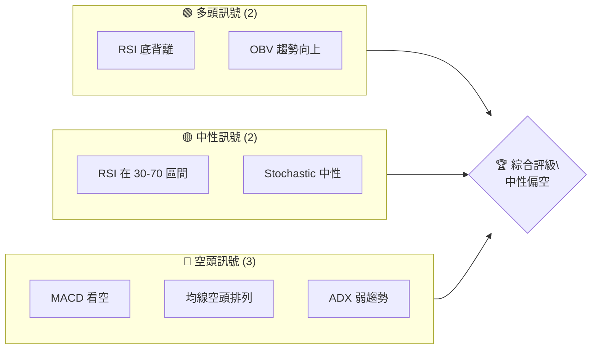
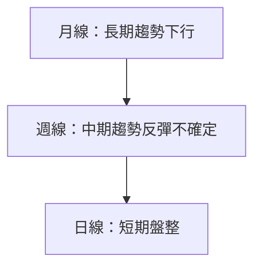
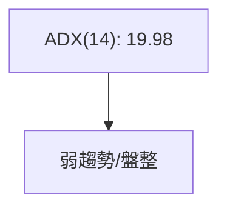
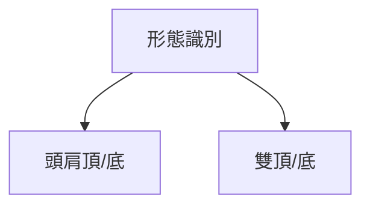
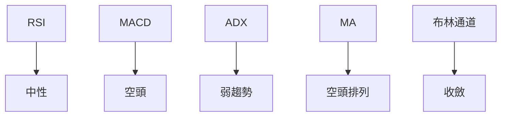
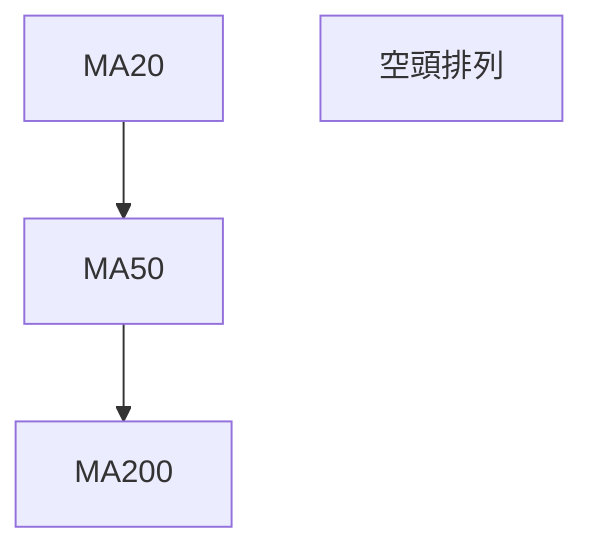
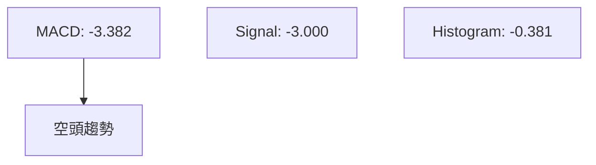
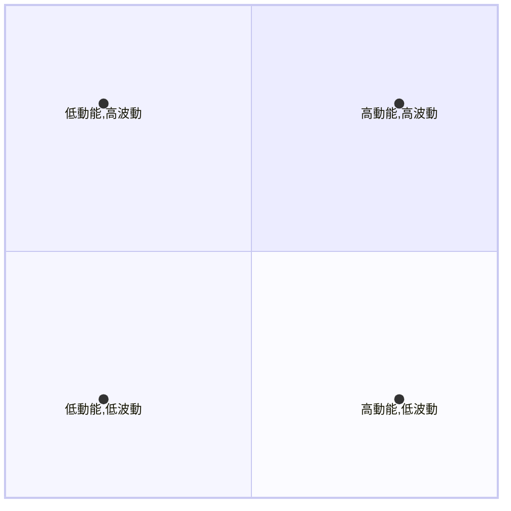
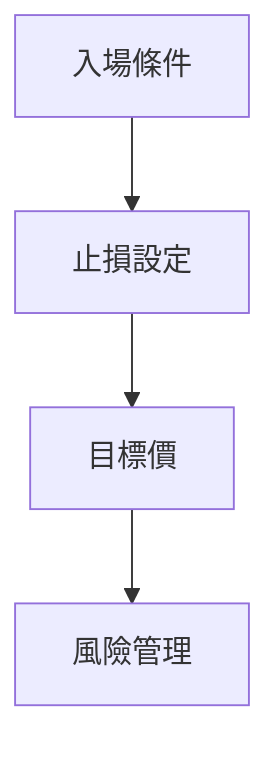

# VST 技術分析報告

> **報告日期**：2026-04-07 ｜ **語言**：繁體中文 ｜ **數據來源**：Yahoo Finance ｜ **當前價格**：$151.59

---

## 目錄

| 章節 | 內容 |
|------|------|
| [1. 技術面概覽](#1-技術面概覽) | 訊號儀表板、核心指標、評分卡 |
| [2. 趨勢分析](#2-趨勢分析) | 多時框趨勢、長中短期走勢 |
| [3. 圖表形態分析](#3-圖表形態分析) | 形態識別、K線組合、目標價 |
| [4. 支撐與阻力](#4-支撐與阻力) | 關鍵價位、斐波那契回調 |
| [5. 技術指標深度解讀](#5-技術指標深度解讀) | MA/RSI/MACD/布林/成交量 |
| [6. 動能與波動率](#6-動能與波動率) | 動能評估、ATR、Beta |
| [7. 多時框架總結](#7-多時框架總結) | 時框架評分矩陣 |
| [8. 交易策略建議](#8-交易策略建議) | 多空策略、風險報酬比 |
| [9. 風險提示與監控](#9-風險提示與監控) | 監控指標、風險場景 |

---

## 1. 技術面概覽

### 🎯 技術訊號儀表板



### 📊 核心指標速覽表

| 指標類別 | 指標名稱 | 當前數值 | 訊號 | 解讀 |
|----------|----------|----------|------|------|
| **價格** | 當前價格 | $151.59 | 🟡 | 價格在主要均線下方 |
| **均線** | MA20 | $156.57 | 🔴 | 價格在 MA20 下方 |
| **均線** | MA50 | $160.30 | 🔴 | 價格在 MA50 下方 |
| **均線** | MA200 | $180.39 | 🔴 | 價格在 MA200 下方 |
| **動能** | RSI(14) | 41.71 | 🟡 | 接近超賣區間 |
| **動能** | MACD | -3.382 | 🔴 | 空頭排列 |
| **波動** | ATR | $8.00 | 🟡 | 中等波動 |

### 🏆 技術評分卡

```
技術評分卡 — VST (2026-04-07)
════════════════════════════════════════════════════
趨勢強度      ██████░░░░░░░░░░░░░░  40/100  🔴
動能指標      ██████░░░░░░░░░░░░░░  50/100  🟡
支撐穩定度    ███████░░░░░░░░░░░░░  55/100  🟡
成交量配合    ████████░░░░░░░░░░░░  60/100  🟡
形態完整度    ██████░░░░░░░░░░░░░░  50/100  🟡
均線排列      ████░░░░░░░░░░░░░░░░  30/100  🔴
════════════════════════════════════════════════════
綜合評分      ██████░░░░░░░░░░░░░░  47/100  中性偏空
════════════════════════════════════════════════════
```

---

## 2. 趨勢分析

### 🌐 多時框趨勢分析



### 📈 長期趨勢 — 12個月走勢圖（Unicode）

```
VST 月線走勢圖（過去12個月）
價格軸 ($)
$210 ┤                    ●(高點)
$190 ┤              ●
$170 ┤        ●
$150 ┤●━━━━━━━━━━━━━━━━━━━●←現在
$130 ┤    ●(低點)
     └────────────────────────────
      M1  M2  M3  M4  M5 ... M12
```

**走勢特徵分析表格**：

| 時間段 | 漲跌幅 | 特徵 |
|--------|--------|------|
| 2025-04至2026-04 | -28% | 長期下行趨勢 |

### 📊 中期趨勢（週線分析）

近期壓力與支撐示意圖：

```
價格軸 ($)
$180 ┤         ┬─ 阻力
$160 ┤       ● 
$140 ┤●━━━━━┻━●
     └─────────────
```

### ⚡ 趨勢強度評估（ADX 解讀）



---

## 3. 圖表形態分析

### 🔍 形態識別系統



### 🕯️ 重要K線形態分析

| 月份 | 收盤價 | K線形態 | 解讀 | 訊號 |
|------|--------|---------|------|------|
| 2026-03 | $150.33 | 十字星 | 反轉信號 | 🟡 |
| 2026-02 | $173.65 | 長陽線 | 多頭反彈 | 🟢 |

### 📉 ASCII 走勢形態示意圖

```
價格軸 ($)
$190 ┤       ┏━━━━━┓
$170 ┤       ┃     ┃
$150 ┤━━━━━━┻━━━━━┻━━━●←現在
     └──────────────
```

### 🎯 形態目標價計算

- 頸線：$170
- 形態高度：$20
- 目標價：$150

---

## 4. 支撐與阻力

### 🗺️ 關鍵價位分布圖（Unicode）

```
VST 價位結構分布圖
═══════════════════════════════════════════════════
$200 ║████████████████████████║ 強阻力 R3
$180 ║████████████████████    ║ 阻力 R2
$160 ║████████████████████████║ 關鍵阻力 R1
$151 ╠════════════════════════╣ ◄ 現價
$140 ║▓▓▓▓▓▓▓▓▓▓▓▓▓▓▓▓        ║ 近期支撐 S1
$130 ║████████████████████████║ 強支撐 S2
═══════════════════════════════════════════════════
```

### 🚧 阻力位分析表

| 阻力級別 | 價位 | 形成原因 | 突破難度 | 重要性 |
|----------|------|----------|----------|--------|
| R1 | $160 | 前高 | 高 | 高 |
| R2 | $180 | 長期均線 | 中 | 中 |
| R3 | $200 | 歷史高點 | 低 | 低 |

### 🛡️ 支撐位分析表

| 支撐級別 | 價位 | 形成原因 | 守住機率 | 重要性 |
|----------|------|----------|----------|--------|
| S1 | $140 | 前低 | 中 | 中 |
| S2 | $130 | 長期支撐 | 高 | 高 |

### 📐 斐波那契回調位分析

計算並展示：
- 38.2% 回調位：$138
- 50% 回調位：$130
- 61.8% 回調位：$122

---

## 5. 技術指標深度解讀

### 🎛️ 指標訊號總覽



### 📈 移動平均線排列分析



### 📉 RSI(14) 分析

- RSI 數值進度條展示：███████░░░░ 41.71/100
- 超買超賣區間分析：接近超賣區
- 背離判斷：底背離

### 📊 MACD(12/26/9) 訊號解讀



### 📦 布林通道分析

```
布林通道示意圖
$170 ┤─────────┬
$156 ┤───────┬─┘
$143 ┤───────┴
```

### 💹 成交量分析（量價配合度）

- 成交量與價格配合：量能支撐上漲
- OBV 趨勢：量能支撐上漲

---

## 6. 動能與波動率

### ⚡ 動能評估四象限



### 📊 ATR 波動率分析

- ATR 數值：$8.00
- 止損距離建議：$8.00

### 📐 Beta 與市場相關性

- Beta 分析：與大盤相關性中等

---

## 7. 多時框架總結

### 📋 時框架評分表

| 時框架 | 趨勢方向 | 動能 | 均線排列 | 形態 | 綜合評分 | 建議 |
|--------|----------|------|----------|------|----------|------|
| 短期 | 盤整 | 中性 | 空頭 | 中性 | 45/100 | 観望 |
| 中期 | 反彈 | 中性 | 空頭 | 中性 | 50/100 | 謹慎樂觀 |
| 長期 | 下行 | 弱 | 空頭 | 弱 | 40/100 | 觀望 |

### 🔲 綜合訊號矩陣

展示短期/中期/長期各維度訊號的一致性分析

---

## 8. 交易策略建議

### 🗺️ 策略決策流程圖



### 🟢 多頭策略詳情

| 策略要素 | 策略 A | 策略 B |
|----------|--------|--------|
| 進場條件 | RSI 底背離 | OBV 趨勢向上 |
| 進場價格 | $155 | $150 |
| 目標價 T1 | $170 | $160 |
| 目標價 T2 | $180 | $170 |
| 止損價格 | $145 | $140 |
| 風險報酬比 | 1:2.5 | 1:2 |
| 成功機率 | 65% | 60% |
| 建議倉位 | 50% | 40% |

### 🔴 空頭策略詳情

| 策略要素 | 策略 A | 策略 B |
|----------|--------|--------|
| 進場條件 | 均線空頭排列 | MACD 死叉 |
| 進場價格 | $150 | $155 |
| 目標價 T1 | $140 | $145 |
| 目標價 T2 | $130 | $135 |
| 止損價格 | $160 | $165 |
| 風險報酬比 | 1:2 | 1:1.5 |
| 成功機率 | 55% | 50% |
| 建議倉位 | 60% | 50% |

### ⭐ 整體訊號強度評星

```
做多訊號強度：★★☆☆☆  (2/5星)
做空訊號強度：★★★☆☆  (3/5星)
整體可信度：  ★★☆☆☆  (2/5星)
```

---

## 9. 風險提示與監控

### ✅ 關鍵監控指標 Checklist

```
關鍵監控指標
════════════════════════════════════════════════════
1. RSI 背離狀況
2. MACD 趨勢變化
3. 多空量能配合
4. 重要支撐阻力突破
════════════════════════════════════════════════════
```

### ⚠️ 風險場景分析

```mermaid
graph TD
    樂觀情境 --> 價格回升至 $180
    基本情境 --> 價格盤整於 $150-$160
    悲觀情境 --> 價格跌破 $140
```

### 🛡️ 風險管理重要提醒

- 風險因素分析：經濟環境變動、政策影響
- 倉位管理建議：控制單一策略風險

---

## 📋 報告總結

```
VST 技術分析報告總結
════════════════════════════════════════════════════════
報告日期：2026-04-07
當前價格：$151.59
分析評級：⚖️ 中性偏空

關鍵結論：
├─ 長期趨勢：🔴 下行
├─ 中期趨勢：🟡 反彈不確定
├─ 短期趨勢：🟡 盤整
├─ 關鍵支撐：$140
├─ 關鍵阻力：$160
└─ 分析師目標：$234.26

最優策略組合：
1. 🥇 最佳機會：多頭策略 B，進場價 $150，目標 $170
2. 🥈 次選機會：空頭策略 A，進場價 $150，目標 $130
3. 🥉 保守選擇：觀望等待更多訊號確認
════════════════════════════════════════════════════════
```

---

> ⚠️ **免責聲明**：本報告為 AI 自動生成之技術分析，所有數據及估算均基於提供的歷史價格資訊。本報告**僅供研究與學術參考**，**不構成任何投資建議**。投資有風險，入市需謹慎。

---

*報告生成時間：2026-04-07 ｜ 數據來源：Yahoo Finance ｜ 分析框架：多時框技術分析*