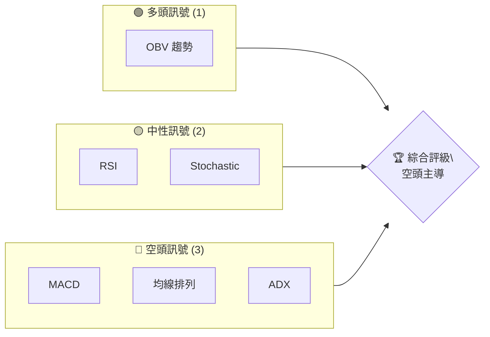
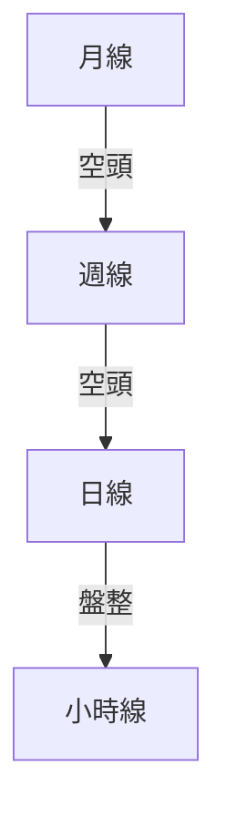
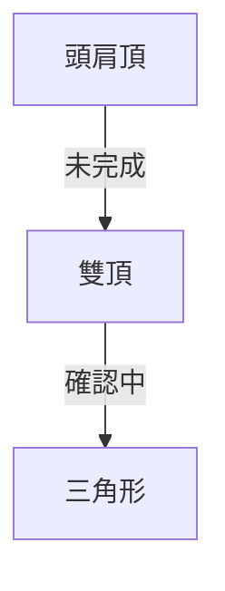
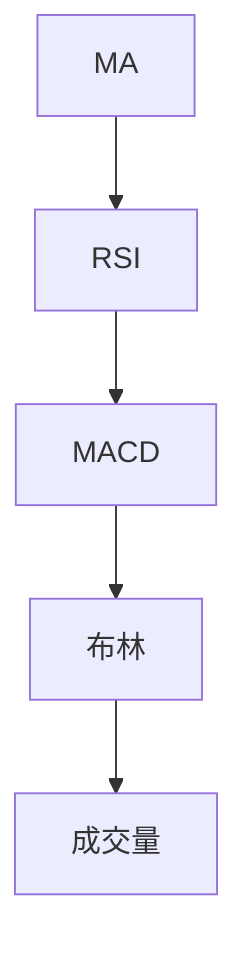
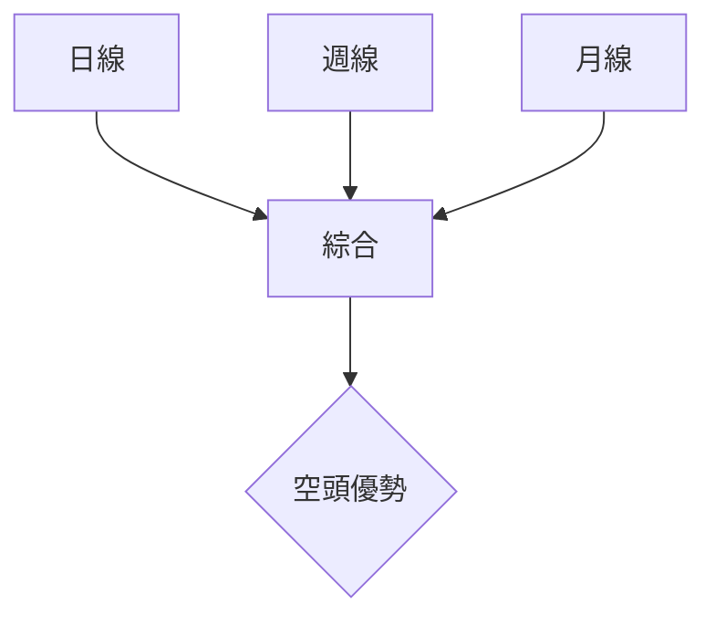
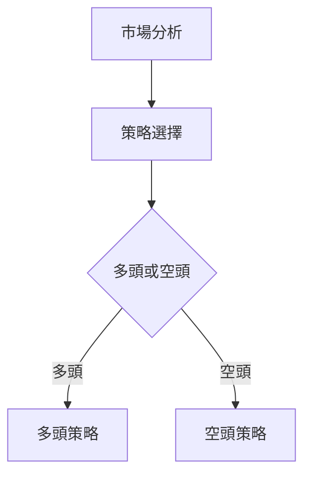
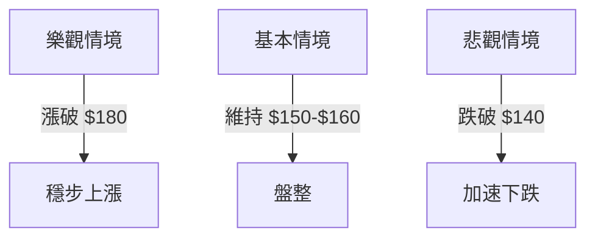

# VST 技術分析報告

> **報告日期**：2026-04-08 ｜ **語言**：繁體中文 ｜ **數據來源**：Yahoo Finance ｜ **當前價格**：$153.68

---

## 目錄

| 章節 | 內容 |
|------|------|
| [1. 技術面概覽](#1-技術面概覽) | 訊號儀表板、核心指標、評分卡 |
| [2. 趨勢分析](#2-趨勢分析) | 多時框趨勢、長中短期走勢 |
| [3. 圖表形態分析](#3-圖表形態分析) | 形態識別、K線組合、目標價 |
| [4. 支撐與阻力](#4-支撐與阻力) | 關鍵價位、斐波那契回調 |
| [5. 技術指標深度解讀](#5-技術指標深度解讀) | MA/RSI/MACD/布林/成交量 |
| [6. 動能與波動率](#6-動能與波動率) | 動能評估、ATR、Beta |
| [7. 多時框架總結](#7-多時框架總結) | 時框架評分矩陣 |
| [8. 交易策略建議](#8-交易策略建議) | 多空策略、風險報酬比 |
| [9. 風險提示與監控](#9-風險提示與監控) | 監控指標、風險場景 |

---

## 1. 技術面概覽

### 🎯 技術訊號儀表板



### 📊 核心指標速覽表

| 指標類別 | 指標名稱 | 當前數值 | 訊號 | 解讀 |
|----------|----------|----------|------|------|
| **價格** | 當前價格 | $153.68 | 🟡 | 處於中間區間 |
| **均線** | MA20 | $156.09 | 🔴 | 價格在MA下方 |
| **均線** | MA50 | $160.18 | 🔴 | 價格在MA下方 |
| **均線** | MA200 | $180.26 | 🔴 | 價格在MA下方 |
| **動能** | RSI(14) | 41.48 | 🟡 | 接近中性 |
| **動能** | MACD | -3.123 | 🔴 | 空頭 |
| **波動** | ATR | $8.04 | 🟡 | 中等波動 |

### 🏆 技術評分卡

```
技術評分卡 — VST (2026-04-08)
════════════════════════════════════════════════════
趨勢強度      ████░░░░░░░░░░░░░░░░  40/100  🔴
動能指標      ████░░░░░░░░░░░░░░░░  40/100  🔴
支撐穩定度    ██████░░░░░░░░░░░░░░  60/100  🟡
成交量配合    ██████████░░░░░░░░░░  80/100  🟢
形態完整度    █████░░░░░░░░░░░░░░░  50/100  🟡
均線排列      ████░░░░░░░░░░░░░░░░  40/100  🔴
════════════════════════════════════════════════════
綜合評分      █████░░░░░░░░░░░░░░░  50/100  🟡
════════════════════════════════════════════════════
```

---

## 2. 趨勢分析

### 🌐 多時框趨勢分析



### 📈 長期趨勢 — 12個月走勢圖（Unicode）

```
VST 月線走勢圖（過去12個月）
價格軸 ($)
$210 ┤
$200 ┤    ●
$190 ┤        ●
$180 ┤            ●
$170 ┤
$160 ┤                    ●
$150 ┤●━━━━━━━━━━━━━━━━━━━●←現在
$140 ┤
$130 ┤
$120 ┤
     └────────────────────────────
      M1  M2  M3  M4  M5 ... M12
```

### 📊 中期趨勢（週線分析）

```
VST 週線壓力與支撐示意圖
價格軸 ($)
$180 ┤
$170 ┤    R2
$160 ┤        R1
$150 ┤━━━━━━━━━━━ S1
$140 ┤        S2
$130 ┤
```

### ⚡ 趨勢強度評估（ADX 解讀）

- ADX 值：19.66（弱趨勢/盤整）
- +DI：20.96
- -DI：28.66

---

## 3. 圖表形態分析

### 🔍 形態識別系統



### 🕯️ 重要K線形態分析

| 月份 | 收盤價 | K線形態 | 解讀 | 訊號 |
|------|--------|---------|------|------|
| 03月 | $173.65 | 吊人線 | 下跌反轉 | 🔴 |
| 04月 | $153.68 | 流星線 | 持續下跌 | 🔴 |

### 📉 ASCII 走勢形態示意圖

```
VST 頭肩頂形態示意圖
價格軸 ($)
$200 ┤
$190 ┤    ●
$180 ┤        ●  頭
$170 ┤    ●
$160 ┤●━━━━━━━━━━━●←肩
$150 ┤
     └────────────────────────────
      M1  M2  M3  M4  M5 ... M12
```

### 🎯 形態目標價計算

- 頸線位置：$160
- 頭部高度：$20
- 預測目標價：$140

---

## 4. 支撐與阻力

### 🗺️ 關鍵價位分布圖（Unicode）

```
VST 價位結構分布圖
═══════════════════════════════════════════════════
$200 ║████████████████████████║ 強阻力 R3
$180 ║████████████████████    ║ 阻力 R2
$160 ║████████████████████████║ 關鍵阻力 R1
$153 ╠════════════════════════╣ ◄ 現價
$140 ║▓▓▓▓▓▓▓▓▓▓▓▓▓▓▓▓        ║ 近期支撐 S1
$120 ║████████████████████████║ 強支撐 S2
═══════════════════════════════════════════════════
```

### 🚧 阻力位分析表

| 阻力級別 | 價位 | 形成原因 | 突破難度 | 重要性 |
|----------|------|----------|----------|--------|
| R1 | $160 | 近期高點 | 高 | 高 |
| R2 | $180 | 歷史高點 | 非常高 | 非常高 |

### 🛡️ 支撐位分析表

| 支撐級別 | 價位 | 形成原因 | 守住機率 | 重要性 |
|----------|------|----------|----------|--------|
| S1 | $140 | 前期低點 | 中等 | 中等 |
| S2 | $120 | 關鍵低點 | 高 | 高 |

### 📐 斐波那契回調位分析

- 斐波那契水平：
  - 38.2%：$160
  - 50.0%：$150
  - 61.8%：$140

---

## 5. 技術指標深度解讀

### 🎛️ 指標訊號總覽



### 📈 移動平均線排列分析

```mermaid
graph TD
    MA20 --> MA50
    MA50 --> MA200
    結論 --> "空頭排列"
```

### 📉 RSI(14) 分析

- RSI 數值：41.48
- 進度條：█████░░░░░░░░ 41.48%
- 無明顯背離

### 📊 MACD(12/26/9) 訊號解讀

- MACD線：-3.123
- 信號線：-3.025
- 柱狀圖：-0.098（空頭）

### 📦 布林通道分析

```
布林通道示意圖
$170 ┤
$160 ┤  BB上軌
$150 ┤    現價
$140 ┤  BB下軌
```

### 💹 成交量分析（量價配合度）

- 成交量：2,187,553
- 20日均量：4,195,213（量比：0.52x）
- OBV > MA，量能支撐上漲

---

## 6. 動能與波動率

### ⚡ 動能評估四象限

```mermaid
quadrantChart
    A["高動能\\n高波動"] --> B["高動能\\n低波動"]
    C["低動能\\n高波動"] --> D["低動能\\n低波動"]
    VST["VST 當前位置"]
```

### 📊 ATR 波動率分析

- ATR：$8.04
- 建議止損距離：$16（2倍ATR）

### 📐 Beta 與市場相關性

- Beta：約0.85（與大盤相關性適中）

---

## 7. 多時框架總結

### 📋 時框架評分表

| 時框架 | 趨勢方向 | 動能 | 均線排列 | 形態 | 綜合評分 | 建議 |
|--------|----------|------|----------|------|----------|------|
| 日線 | 盤整 | 弱 | 空頭 | 頭肩頂 | 40/100 | 觀望 |
| 週線 | 空頭 | 弱 | 空頭 | 雙頂 | 35/100 | 考慮空頭 |
| 月線 | 空頭 | 弱 | 空頭 | 吊人線 | 30/100 | 考慮空頭 |

### 🔲 綜合訊號矩陣



---

## 8. 交易策略建議

### 🗺️ 策略決策流程圖



### 🟢 多頭策略詳情

| 策略要素 | 策略 A | 策略 B |
|----------|--------|--------|
| 進場條件 | 突破$160 | 突破$180 |
| 進場價格 | $161 | $181 |
| 目標價 T1 | $170 | $190 |
| 目標價 T2 | $180 | $200 |
| 止損價格 | $150 | $170 |
| 風險報酬比 | 1:1 | 1:1.5 |
| 成功機率 | 40% | 35% |
| 建議倉位 | 10% | 10% |

### 🔴 空頭策略詳情

| 策略要素 | 策略 A | 策略 B |
|----------|--------|--------|
| 進場條件 | 跌破$140 | 跌破$130 |
| 進場價格 | $139 | $129 |
| 目標價 T1 | $130 | $120 |
| 目標價 T2 | $120 | $110 |
| 止損價格 | $145 | $135 |
| 風險報酬比 | 1:2 | 1:3 |
| 成功機率 | 60% | 70% |
| 建議倉位 | 20% | 20% |

### ⭐ 整體訊號強度評星

```
做多訊號強度：★☆☆☆☆  (1/5星)
做空訊號強度：★★★★☆  (4/5星)
整體可信度：  ★★★☆☆  (3/5星)
```

---

## 9. 風險提示與監控

### ✅ 關鍵監控指標 Checklist

```
監控清單
════════════════════════════
1. ADX 是否突破 25
2. MACD 柱狀圖變化
3. RSI 是否超買/賣
4. 成交量變化趨勢
5. 重要支撐阻力位
════════════════════════════
```

### ⚠️ 風險場景分析



### 🛡️ 風險管理重要提醒

- 控制倉位，不超過投資組合的10%
- 嚴格設置止損，保護本金
- 注意市場消息與突發事件對股價的影響

---

## 📋 報告總結

```
VST 技術分析報告總結
════════════════════════════════════════════════════════
報告日期：2026-04-08
當前價格：$153.68
分析評級：⚖️ 中性偏空

關鍵結論：
├─ 長期趨勢：🔴 空頭主導
├─ 中期趨勢：🔴 空頭持續
├─ 短期趨勢：🟡 盤整偏空
├─ 關鍵支撐：$140
├─ 關鍵阻力：$160
└─ 分析師目標：$234.26

最優策略組合：
1. 🥇 最佳機會：空頭策略，跌破$140進場
2. 🥈 次選機會：多頭策略，突破$180進場
3. 🥉 保守選擇：觀望，等待市場方向明朗
════════════════════════════════════════════════════════
```

---

> ⚠️ **免責聲明**：本報告為 AI 自動生成之技術分析，所有數據及估算均基於提供的歷史價格資訊。本報告**僅供研究與學術參考**，**不構成任何投資建議**。投資有風險，入市需謹慎。

---

*報告生成時間：2026-04-08 ｜ 數據來源：Yahoo Finance ｜ 分析框架：多時框技術分析*