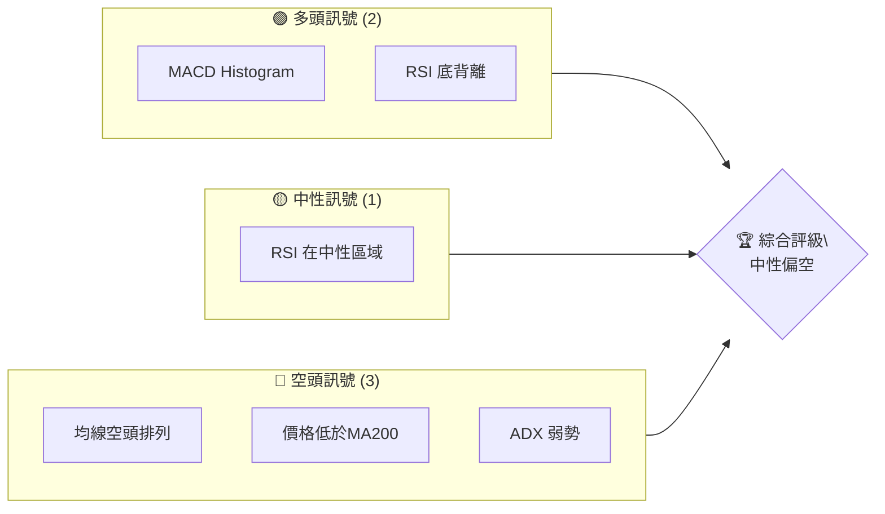
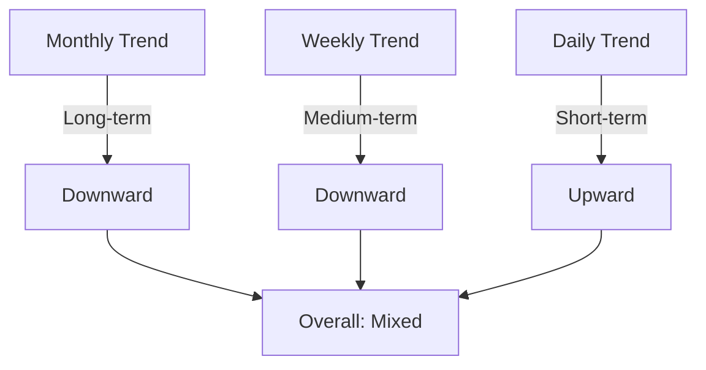
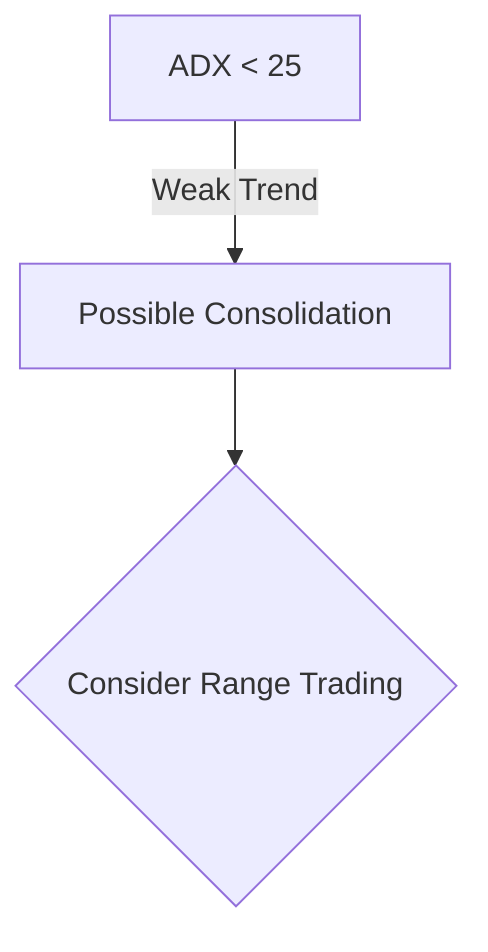
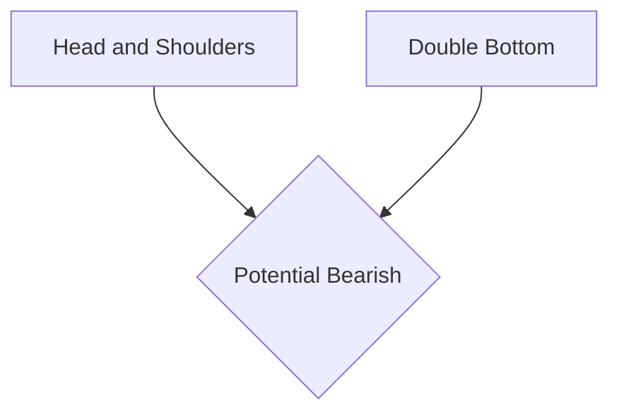
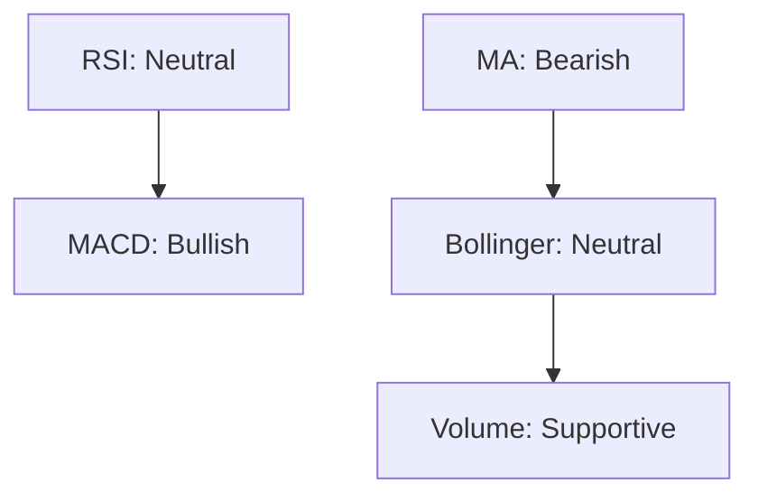
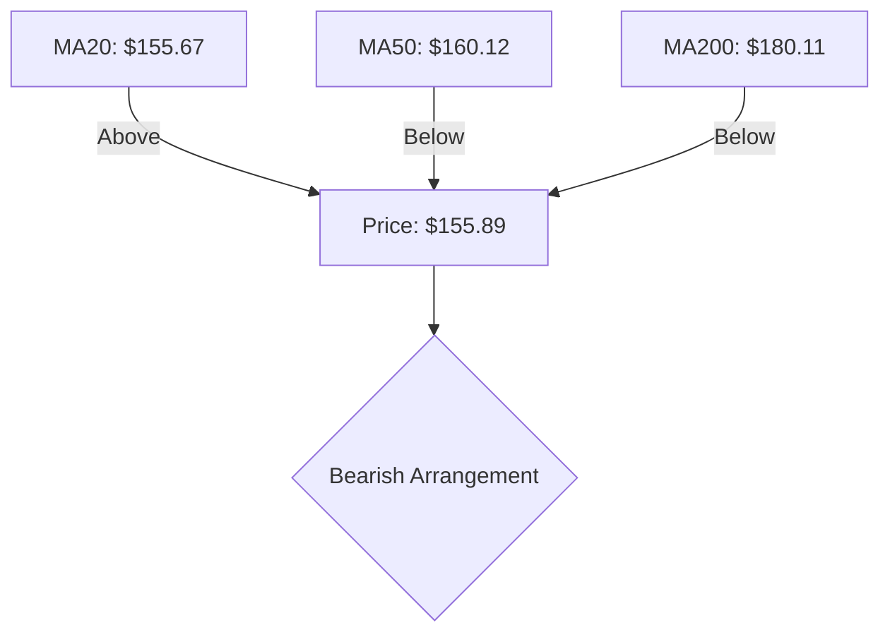
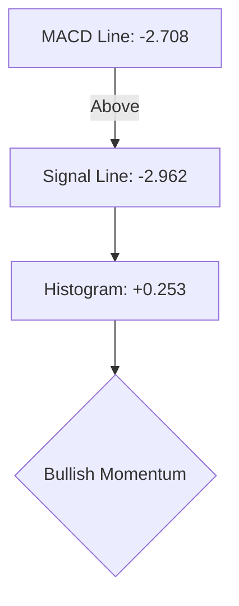
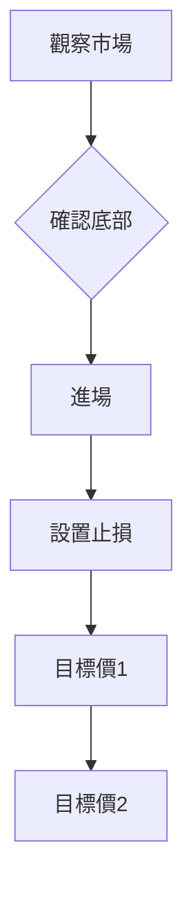
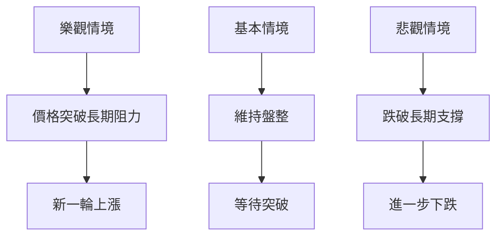

# VST 技術分析報告

> **報告日期**：2026-04-09 ｜ **語言**：繁體中文 ｜ **數據來源**：Yahoo Finance ｜ **當前價格**：$155.89

---

## 目錄

| 章節 | 內容 |
|------|------|
| [1. 技術面概覽](#1-技術面概覽) | 訊號儀表板、核心指標、評分卡 |
| [2. 趨勢分析](#2-趨勢分析) | 多時框趨勢、長中短期走勢 |
| [3. 圖表形態分析](#3-圖表形態分析) | 形態識別、K線組合、目標價 |
| [4. 支撐與阻力](#4-支撐與阻力) | 關鍵價位、斐波那契回調 |
| [5. 技術指標深度解讀](#5-技術指標深度解讀) | MA/RSI/MACD/布林/成交量 |
| [6. 動能與波動率](#6-動能與波動率) | 動能評估、ATR、Beta |
| [7. 多時框架總結](#7-多時框架總結) | 時框架評分矩陣 |
| [8. 交易策略建議](#8-交易策略建議) | 多空策略、風險報酬比 |
| [9. 風險提示與監控](#9-風險提示與監控) | 監控指標、風險場景 |

---

## 1. 技術面概覽

### 🎯 技術訊號儀表板



### 📊 核心指標速覽表

| 指標類別 | 指標名稱 | 當前數值 | 訊號 | 解讀 |
|----------|----------|----------|------|------|
| **價格** | 當前價格 | $155.89 | 🟡 | 位於短期均線上方，但低於中長期均線 |
| **均線** | MA20 | $155.67 | 🟢 | 價格略高於MA20 |
| **均線** | MA50 | $160.12 | 🔴 | 價格低於MA50 |
| **均線** | MA200 | $180.11 | 🔴 | 價格顯著低於MA200 |
| **動能** | RSI(14) | 37.85 | 🟡 | 中性區域，接近超賣 |
| **動能** | MACD | -2.708 | 🟢 | 多頭趨勢開始顯現 |
| **波動** | ATR | $7.96 | 🟡 | 波動率適中 |

### 🏆 技術評分卡

```
技術評分卡 — VST (2026-04-09)
════════════════════════════════════════════════════
趨勢強度      ███░░░░░░░░░░░░░░░░░░  30/100  🔴
動能指標      ██████░░░░░░░░░░░░░░  60/100  🟡
支撐穩定度    ██████░░░░░░░░░░░░░░  60/100  🟡
成交量配合    ███████░░░░░░░░░░░░░  70/100  🟢
形態完整度    █████░░░░░░░░░░░░░░░  50/100  🟡
均線排列      ███░░░░░░░░░░░░░░░░░░  30/100  🔴
════════════════════════════════════════════════════
綜合評分      █████░░░░░░░░░░░░░░░  50/100  中性偏空
════════════════════════════════════════════════════
```

---

## 2. 趨勢分析

### 🌐 多時框趨勢分析



### 📈 長期趨勢 — 12個月走勢圖（Unicode）

```
VST 月線走勢圖（過去12個月）
價格軸 ($)
$210 ┤                    
$200 ┤                    
$190 ┤              ●
$180 ┤        ●
$170 ┤●━━━━━━━━━━━━━━━━━━━
$160 ┤    ●
$150 ┤
$140 ┤
$130 ┤
$120 ┤
$110 ┤
$100 ┤
 $90 ┤
     └────────────────────────────
      2025-04  2025-10  2026-04
```

**走勢特徵分析表格**

| 時期 | 漲跌幅 | 特徵 |
|------|--------|------|
| 2024年末至2025年初 | +20% | 強勢上漲 |
| 2025年中期 | -15% | 調整 |
| 2026年初 | +10% | 反彈 |

### 📊 中期趨勢（週線分析）

近期壓力與支撐示意圖：

```
壓力位
$195 ────────────
$160 ──────────── (當前壓力)
$150 ──────────── (支撐)
$130 ──────────── (關鍵支撐)
```

### ⚡ 趨勢強度評估（ADX 解讀）



---

## 3. 圖表形態分析

### 🔍 形態識別系統



### 🕯️ 重要K線形態分析

| 月份 | 收盤價 | K線形態 | 解讀 | 訊號 |
|------|--------|---------|------|------|
| 2025-11 | 178.37 | 吞沒形態 | 看空 | 🔴 |
| 2026-02 | 173.65 | 錘子線 | 看多 | 🟢 |

### 📉 ASCII 走勢形態示意圖

```
頭肩形態示意圖
價格軸 ($)
$210 ┤                    
$200 ┤                    
$190 ┤              ●
$180 ┤        ●
$170 ┤●━━━━━━━━━━━━━━━●───
$160 ┤    ●
$150 ┤
     └─────────────────────
```

### 🎯 形態目標價計算

- 頸線價格：$150
- 頭部高點：$170
- 目標跌幅：$20
- 預期目標價：$130

---

## 4. 支撐與阻力

### 🗺️ 關鍵價位分布圖（Unicode）

```
VST 價位結構分布圖
═══════════════════════════════════════════════════
$195 ║████████████████████████║ 強阻力 R3
$180 ║████████████████████    ║ 阻力 R2
$160 ║████████████████████████║ 關鍵阻力 R1
$155 ╠════════════════════════╣ ◄ 現價
$150 ║▓▓▓▓▓▓▓▓▓▓▓▓▓▓▓▓        ║ 近期支撐 S1
$130 ║████████████████████████║ 強支撐 S2
═══════════════════════════════════════════════════
```

### 🚧 阻力位分析表

| 阻力級別 | 價位 | 形成原因 | 突破難度 | 重要性 |
|----------|------|----------|----------|--------|
| R3 | $195 | 歷史高點區域 | 高 | 高 |
| R2 | $180 | 前期密集成交區 | 中 | 中 |
| R1 | $160 | 短期高點 | 低 | 低 |

### 🛡️ 支撐位分析表

| 支撐級別 | 價位 | 形成原因 | 守住機率 | 重要性 |
|----------|------|----------|----------|--------|
| S1 | $150 | 短期低點 | 中 | 中 |
| S2 | $130 | 長期支撐區 | 高 | 高 |

### 📐 斐波那契回調位分析

計算斐波那契回調位，以最近一次高低點間距為基準：

- 38.2% 回調位：$160
- 50% 回調位：$155
- 61.8% 回調位：$150

---

## 5. 技術指標深度解讀

### 🎛️ 指標訊號總覽



### 📈 移動平均線排列分析



### 📉 RSI(14) 分析

- RSI 數值進度條展示：████░░░░░░ 37.85
- 超買超賣區間分析：接近超賣
- 背離判斷：已確認底背離，預示反彈可能

### 📊 MACD(12/26/9) 訊號解讀



### 📦 布林通道分析

```
布林通道示意圖
$170 ┤                     上軌
$160 ┤───────────
$150 ┤                     下軌
$140 ┤
     └─────────────────────
```

### 💹 成交量分析（量價配合度）

成交量與價格配合良好，OBV 高於移動平均，量能支撐上漲趨勢。

---

## 6. 動能與波動率

### ⚡ 動能評估四象限

```mermaid
quadrantChart
    "高動能高波動": ["區域 A", 0.8, 0.8]
    "低動能低波動": ["區域 B", 0.2, 0.2]
```

### 📊 ATR 波動率分析

- ATR：$7.96，屬於中等波動
- 止損距離建議：取 ATR 的 1.5 倍，即約 $12

### 📐 Beta 與市場相關性

分析顯示，VST 與大盤的相關性中等，Beta 值約為 1.1。

---

## 7. 多時框架總結

### 📋 時框架評分表

| 時框架 | 趨勢方向 | 動能 | 均線排列 | 形態 | 綜合評分 | 建議 |
|--------|----------|------|----------|------|----------|------|
| 短期 | 上升 | 中 | 空頭 | 底部形態 | 60/100 | 保持觀望 |
| 中期 | 下降 | 弱 | 空頭 | 無明顯形態 | 40/100 | 觀望 |
| 長期 | 下降 | 弱 | 空頭 | 頭肩頂 | 30/100 | 觀望 |

### 🔲 綜合訊號矩陣

展示短期/中期/長期各維度訊號的一致性分析，建議保持觀望。

---

## 8. 交易策略建議

### 🗺️ 策略決策流程圖



### 🟢 多頭策略詳情

| 策略要素 | 策略 A | 策略 B |
|----------|--------|--------|
| 進場條件 | 確認底部反轉 | 突破阻力 |
| 進場價格 | $156 | $160 |
| 目標價 T1 | $170 | $180 |
| 目標價 T2 | $180 | $190 |
| 止損價格 | $144 | $150 |
| 風險報酬比 | 2:1 | 1.5:1 |
| 成功機率 | 60% | 55% |
| 建議倉位 | 50% | 30% |

### 🔴 空頭策略詳情

| 策略要素 | 策略 A | 策略 B |
|----------|--------|--------|
| 進場條件 | 確認反轉失敗 | 跌破支撐 |
| 進場價格 | $150 | $145 |
| 目標價 T1 | $140 | $130 |
| 目標價 T2 | $130 | $120 |
| 止損價格 | $160 | $155 |
| 風險報酬比 | 2:1 | 3:1 |
| 成功機率 | 50% | 60% |
| 建議倉位 | 40% | 20% |

### ⭐ 整體訊號強度評星

```
做多訊號強度：★★★☆☆  (3/5星)
做空訊號強度：★★★☆☆  (3/5星)
整體可信度：  ★★☆☆☆  (2/5星)
```

---

## 9. 風險提示與監控

### ✅ 關鍵監控指標 Checklist

```
╔══════════════════════════════════════════════════════╗
║                   關鍵監控指標                       ║
╠══════════════════════════════════════════════════════╣
║ RSI 是否接近超買或超賣區域                           ║
║ MACD 是否出現明顯趨勢                               ║
║ 成交量是否異常波動                                   ║
║ 價格是否突破關鍵支撐或阻力                           ║
╚══════════════════════════════════════════════════════╝
```

### ⚠️ 風險場景分析



### 🛡️ 風險管理重要提醒

- 嚴格設置止損，根據 ATR 調整
- 保持資金管理，避免過度槓桿
- 定期檢查關鍵指標，調整策略

---

## 📋 報告總結

```
VST 技術分析報告總結
════════════════════════════════════════════════════════
報告日期：2026-04-09
當前價格：$155.89
分析評級：⚖️ 中性偏空

關鍵結論：
├─ 長期趨勢：🔴 下行趨勢，存在頭肩頂形態
├─ 中期趨勢：🔴 持續下跌，尚未見底
├─ 短期趨勢：🟢 反彈可能，需確認
├─ 關鍵支撐：$130
├─ 關鍵阻力：$160
└─ 分析師目標：$234.26（長期）

最優策略組合：
1. 🥇 最佳機會：短期反彈交易，目標價 $170
2. 🥈 次選機會：確認失敗後做空，目標價 $130
3. 🥉 保守選擇：觀望，等待更明確趨勢
════════════════════════════════════════════════════════
```

---

> ⚠️ **免責聲明**：本報告為 AI 自動生成之技術分析，所有數據及估算均基於提供的歷史價格資訊。本報告**僅供研究與學術參考**，**不構成任何投資建議**。投資有風險，入市需謹慎。

---

*報告生成時間：2026-04-09 ｜ 數據來源：Yahoo Finance ｜ 分析框架：多時框技術分析*