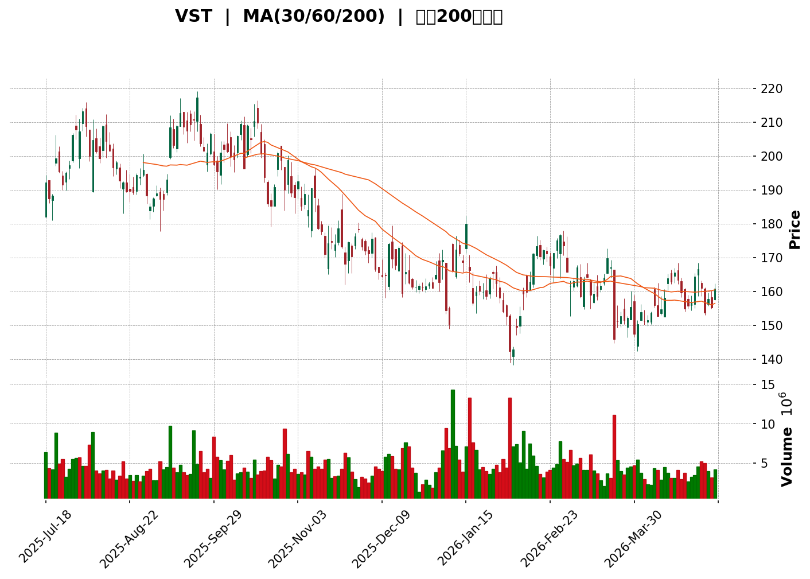
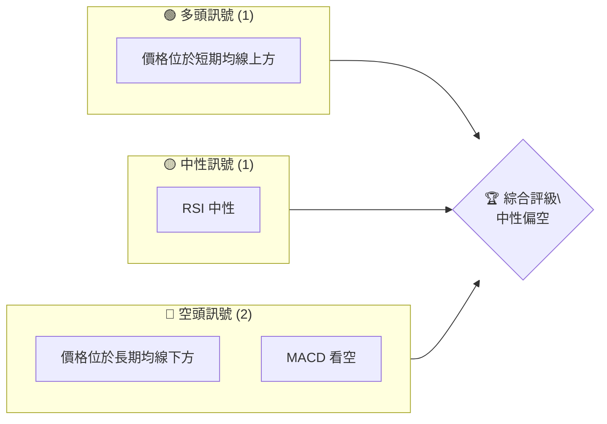
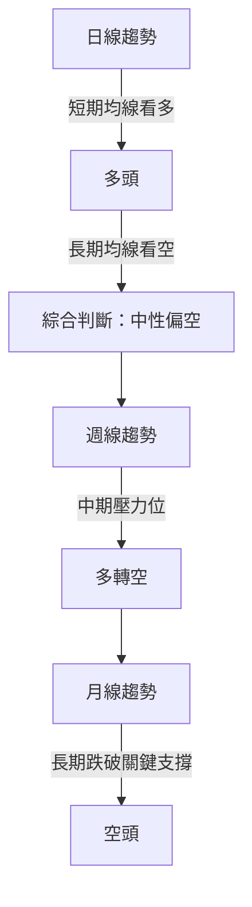
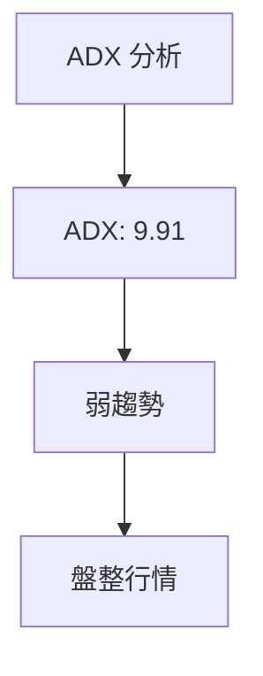
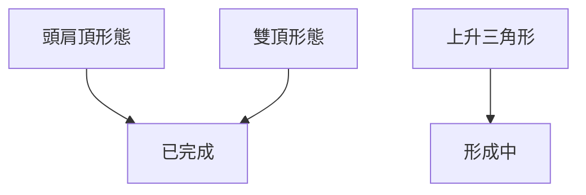
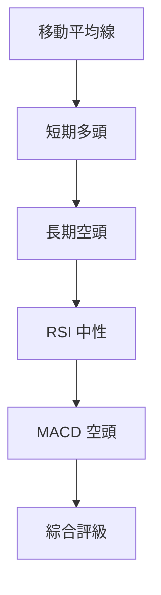
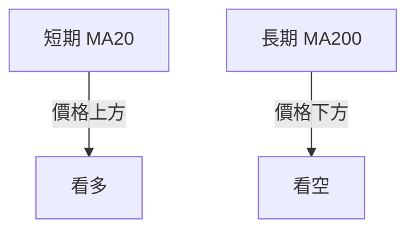
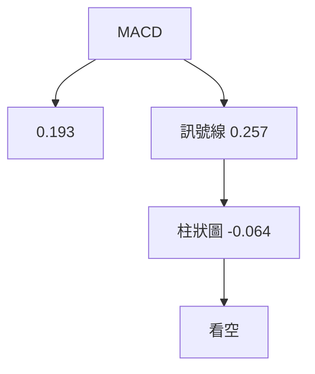
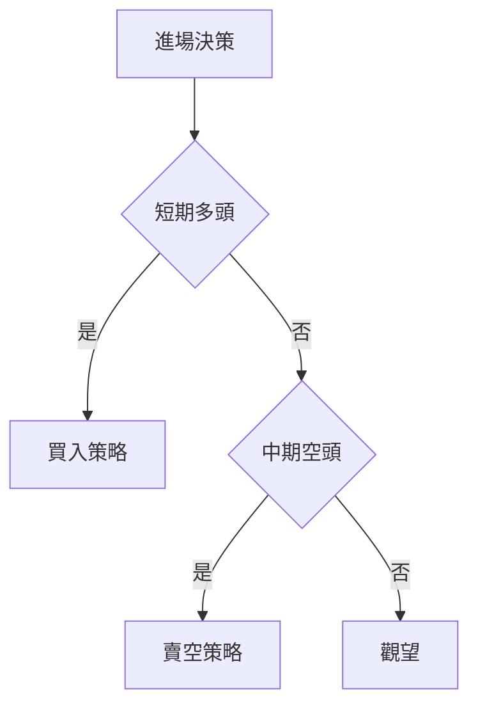
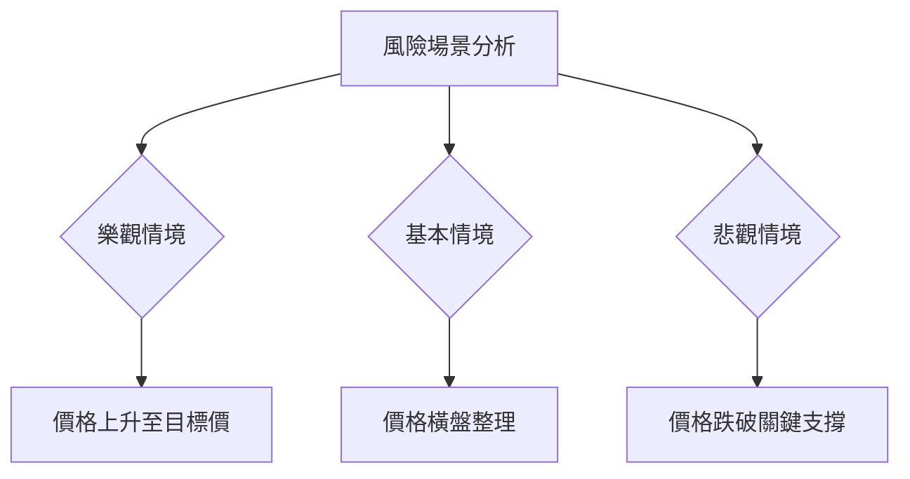

<details>
<summary>📊 靜態圖表 (點擊展開)</summary>

</details>

<html>
<head><meta charset="utf-8" /></head>
<body>
    <div>                        <script>window.PlotlyConfig = {MathJaxConfig: 'local'};</script>
        <script charset="utf-8" src="https://cdn.plot.ly/plotly-3.5.0.min.js" integrity="sha256-fHbNLP+GlIXN+efbQec78UkemUz3NJp7UmfGxC1tNxs=" crossorigin="anonymous"></script>                <div id="candlestick-chart" class="plotly-graph-div" style="height:500px; width:100%;"></div>            <script>                window.PLOTLYENV=window.PLOTLYENV || {};                                if (document.getElementById("candlestick-chart")) {                    Plotly.newPlot(                        "candlestick-chart",                        [{"close":{"dtype":"f8","bdata":"AAAAwLEIaEAAAADAUXBnQAAAACC8i2dAAAAAIFjraEAAAADgqG9oQAAAAIDf7mdAAAAA4C5kaEAAAACgw6doQAAAAKBByGlAAAAA4MD3aUAAAABAIuhpQAAAAOC3p2pAAAAAYIsZakAAAACAnQJpQAAAAAC3mWlAAAAAYBkraUAAAADAEepoQAAAAMBEGGpAAAAAQNWPaUAAAACAbjJpQAAAAABokmhAAAAAwF3GaEAAAADA8xhoQAAAAMCBBWhAAAAAQKuxZ0AAAABAaLdnQAAAAABLq2dAAAAA4PRLaEAAAABAYTtoQAAAAKBSfmhAAAAAQF+MZ0AAAAAALSNnQAAAACDQbGdAAAAAwCKgZ0AAAADg\u002fGhnQAAAAIBOaWdAAAAAgD0haEAAAACgHA1qQAAAAKCfaGlAAAAAQLscakAAAAAggZZqQAAAAOAfFGpAAAAAAGzwaUAAAABgZStqQAAAAEBZVmpAAAAAgD4qa0AAAABgsHVpQAAAAAAfMGlAAAAAYBQiaUAAAABgydRpQAAAAOCkrGhAAAAAoC5saEAAAADAkR5pQAAAAODyQmlAAAAAQOMtaUAAAABgd\u002ftoQAAAAGBB4mhAAAAA4Ge\u002faUAAAACAgC1qQAAAAOAtimhAAAAAQCQfakAAAACgN55pQAAAAICgSGpAAAAAIEQ6akAAAADAdhlpQAAAAACSNmhAAAAAwDVAZ0AAAADgMCpnQAAAAID72mdAAAAAAEsdaUAAAABgC9hoQAAAAGAXwmdAAAAAIEfaaEAAAABgAqZnQAAAAGADeWdAAAAAgEYQaEAAAACgUSdnQAAAACDMm2dAAAAAwJMDZ0AAAADgLM9nQAAAAABgeGdAAAAAoFZVZkAAAADg7zhmQAAAAMDOYmVAAAAAILHGZUAAAACgldBlQAAAAGATvmVAAAAAQLNUZkAAAACA+KllQAAAAIAHBGVAAAAAYA3VZUAAAADA1EtlQAAAAMAGCmZAAAAAwMNLZkAAAABAL6VlQAAAAIBmgmVAAAAAAK5lZUAAAAAAu\u002fJlQAAAAAC31mRAAAAA4DS1ZEAAAAAAZ4tkQAAAAADklmRAAAAA4NHDZUAAAACANzRlQAAAAOAt+WRAAAAAAB+fZUAAAADg8vBjQAAAAIDNtmRAAAAAYJlSZEAAAABgMitkQAAAAIBkLmRAAAAAAKk3ZEAAAACAZC5kQAAAACDTM2RAAAAAQMBMZEAAAAAAhyNkQAAAAEAooGRAAAAAQKhWZEAAAADgkSllQAAAAAB2TGNAAAAAoKLMYkAAAABglsRkQAAAAIAJi2VAAAAAoPdlZUAAAACgrBdlQAAAAMDnfWZAAAAAAPDLZEAAAACAFZNjQAAAACCq+WNAAAAAgIcEZEAAAAAg3PxjQAAAAED\u002f0mNAAAAAwCiBZEAAAABgQq1kQAAAAAB5S2RAAAAAIEzEY0AAAABgmEFjQAAAAKBUGWNAAAAAYG3KYUAAAADgANxhQAAAAMBGrmJAAAAAIF8YY0AAAAAgPuxjQAAAAIDR\u002fWNAAAAAIBdcZEAAAABgNGhlQAAAAEAwrmVAAAAAAM5KZUAAAAAAe4hlQAAAAABUZWVAAAAAAEnyZEAAAADAW2xlQAAAACDg42VAAAAAQIgSZkAAAABg5rRlQAAAAMBxuGRAAAAA4FkvZEAAAAAgZmRkQAAAAKCA5WRAAAAAQOLNY0AAAAAAtWxkQAAAACCihWRAAAAAoC7eY0AAAACAmutjQAAAAIB412NAAAAAYJ44ZEAAAACAZYNkQAAAAIBsPGVAAAAAQIvkZEAAAADgo0BiQAAAAKBH6WJAAAAAQAoXY0AAAADgUfBiQAAAAKCZCWNAAAAAIFxvY0AAAACgR3FiQAAAAGCPymJAAAAAYLg+Y0AAAACAwuViQAAAAEDh8mJAAAAAgMI1Y0AAAADgenxjQAAAAAAAGGNAAAAAIFxXY0AAAABgZsZjQAAAAEAKf2RAAAAAgBReZEAAAADA9bBkQAAAAGC4bmRAAAAAQDPzY0AAAADAHl1jQAAAAKBHeWNAAAAAQDObY0AAAABAM4tkQAAAAGCP0mRAAAAAANcjZEAAAACgRzljQAAAAEDhumNAAAAAwPVoY0AAAABAMxtkQA=="},"high":{"dtype":"f8","bdata":"t4KkwfRLaEDhZ70HXx5oQGvZTOVam2dAQpCmxnzKaUCfxixfR1ppQKFoKUWScWhAxl5nh51waEAX\u002fTQxttRoQJ0hTdO+2mlAART+PHWHakADYINclmFqQEJzltjTyWpA0iC4MagAa0CHqmYF8fppQPYUQrkUXmpALqUni5cCakBjOaWpeq1pQMWFIRcFJWpAffVXI\u002fyLakC\u002fIooWWuNpQG+ZcpSxdWlAs2BoVmTUaEBPW2PhS7loQO8f\u002fN0CFGhAU+YgdK99aEBW6vjxEVhoQP5tzWqcPWhAcv9yBNpcaEAQM6j12o9oQHLeJpmCE2lASmH5zmZfaEDZN3L4SEVnQAomgEaFemdA9niTKwHsZ0DVf6FsbNZnQCgZWmBvumdASbM22hFYaEAiQXY\u002fGoJqQJgKV8TcYmpALyew\u002fCUtakCB7D7AICJrQAUfGRBun2pA397GF26fakBKMVlCeLRqQFFiOQULqGpAtPSPh+Bma0CWJHHhvIVqQCEqak\u002fSs2lA6f1+t1N2aUDE1ZnPuN1pQIJ2YZTR0WlAAo+KuFb+aEAq2bVAtYtpQAQZiSHxjWlAgn9bXeIzakCdP12LcetpQL0jiLLDaGlAQH+kBVLBaUDNzA\u002ffpU9qQMAbwf4heWpAcn7n+ucrakDCWciuzQhqQMcQhxMX7mpA8ftPiRMQa0C96gXwGC9qQBvVHPblnWlAjVHH5mYcaEBLWKq9Tp9nQHhycih49WdATc5azDQuaUCukWQuLmNpQABIP\u002fmymGhA4pDYlK0FaUBHBE4RushoQHXSVh59C2hAo\u002fQ35OJUaEAF1ub1z95nQPap2e4+\u002fmdA5gD4RS6TZ0Du0QyPkdFnQFhOTb9DiGhAOsj7YYZtZ0D4mF9MoZlmQBLKVk0LL2ZAiDmM4SRwZkAcwxeS02BmQPyAQLnPHWZAh7IgKAOgZkBnlu71mphnQKPoHfh1pmVA0U+jhffWZUCdE3nn98dlQMw\u002fz7NXKGZAJ+y0bbeIZkBSyxZ10P9lQH\u002fM5ZPm7mVAli+h4+KrZUAsB4h56jFmQGLAHg6aBGZAJoTbCXXrZED1OGk+Jy5lQImwBxUEsmRAXnvd9RLNZUDZS2QBJXBmQL5OkcLCkGVAApUGTXCuZUAfj2JpDdVlQA6VedZLbmVAbu1EZwVeZUDQ\u002fPDLwYJkQH47vJhDb2RA5lp\u002fBqJLZECRZnkI5VhkQFGLm+k9f2RAIwz+1s9aZECEfsg\u002f1IhkQEgH4a2UIWVAEKisIXptZUB01u3g\u002fotlQNfPv7VyDWVAt+Vx+M5yY0DWkgoYENBlQBlTw9P5D2ZAJxe9ZsDmZUDWUGk2TF5lQKarnjD2yWZA9USdTmFcZUD0MoZww7hkQPvLnIBMOGRAjzscVd9oZED\u002fW6RvvVRkQLEtfba2omRA2X6A26mMZEAXjam7qMpkQBuDQHrX9GRAZxNSPtSIZEADYpTKYvhjQEFBQZEtiWNAbrru7WsuY0Db9TfA2PZhQAiGwL+uAWNA5F8LRCtyY0CIRWMwZyZkQDv5Raq2omRAARczi3m\u002fZECNiVcao21lQOdB6FoZDWZA+Fupe1noZUBolAC4t4plQCo0mdBvqGVAzfEKimNzZUA6jJeURm5lQHMO+QZp9mVArUW3TKIfZkDBL\u002fmsJUJmQAdfaP3xCGZAk2r309RpZED2UrLjj39kQN4wkMO392RAxNJH6tEEZUAv73C6+4xkQPqmfALsEWVAYuqoGYh4ZEBq0wkaSV9kQKiLxA16oGRAFUYlZt9oZEAql7TjgadkQBhkHFx1mGVAhjZJnc4rZUAAAABACs9kQAAAAMDMfGNAAAAAQDNDY0AAAABgZr5jQAAAAKBwFWNAAAAAYGYGZEAAAACAwt1jQAAAAEAK72JAAAAAQOGKY0AAAACA61FjQAAAACBcI2NAAAAAwB5FY0AAAACA6ylkQAAAAMD1UGRAAAAAACnUY0AAAABAChdkQAAAAMD1qGRAAAAA4KPQZEAAAACgcN1kQAAAACCuD2VAAAAAoJmBZEAAAABAMyNkQAAAAGCP4mNAAAAAANfbY0AAAAAgXK9kQAAAAKBwDWVAAAAAYGZqZEAAAADAciRkQAAAAAAp9GNAAAAA4HoEZEAAAAAAKUxkQA=="},"hovertemplate":"\u003cb\u003e%{x|%Y-%m-%d}\u003c\u002fb\u003e\u003cbr\u003e\u958b: $%{open:.2f}\u003cbr\u003e\u9ad8: $%{high:.2f}\u003cbr\u003e\u4f4e: $%{low:.2f}\u003cbr\u003e\u6536: $%{close:.2f}\u003cextra\u003e\u003c\u002fextra\u003e","low":{"dtype":"f8","bdata":"b4k5cDnDZkDsSP+8PUZnQPH5DqAdoWZAeDPw0amiaEBiWLKXgGRoQJcKvcCxv2dADIyDBgC5Z0CMPhmHkihoQANGTiJ0xGhAqBykbS2eaUCMHNv9Qo5oQHHQ7LXA72lA1o6cUlG4aUC4VBSURc5oQGgt6ES+qGdAE3tnWWQdaUBQnXNuwr1oQPB0YJcj92hAMev6LLPwaEAlvmrBhDBpQMWN\u002fxYTQmhAdMmssLFRaECzZsiiUM9nQHU4HCey5GZAKJocRr6oZ0CfoZLIkk1nQOIxMbFtkmdAsv\u002fE7QWUZ0Cw4i1zbPFnQLJasm0EPGhASwZQxeg+Z0BikbFRl6xmQEns79JQ9GZA7zh7xFyCZ0B9BzFC6zdmQKRXUErs\u002fGZA6sZOVI+PZ0AYNzTahOdoQBwwwgRXSmlABKEAuZcnaUDrm6RTuxxqQBL2X+6r0GlAlDutL2N8aUB6j\u002fJdIuhpQB0Q9FfQk2lAyZUNtUvnaUB\u002faOk2zFxpQPJ\u002f28gOKmlADvYUwg1vaECg\u002f8v2pw1pQM4khyn8pGhA4PQMFprFZ0Ap+tAeg\u002fRnQMzwV1k3xWhAtTW0LEAeaUAqBIBTXpxoQOVeV3oQa2hA748Yd2\u002fyaEAAwBISophpQPRte3OKiWhAlnBstSX7aEAzqDUuDxtpQBO4eVmeumlAa6VGcoEDakAmn8Bw+u9oQB9gcDDXCGhAnHZFzOQhZ0CYEjyc+WRmQO3KyYJcJmdAM13+6w5CaEBMtvvjsH5oQO2IFmLK\u002fmZA2uG4n1meZ0DbzVACrIBnQO9kh2p54GZAu7BtYIZqZ0B0Qml2v\u002f9mQD+PwlJ4DWdAR8UESCVhZkBLeLvZpANmQPYQHOjl9GZArXeMRCtKZkCQaGy5qRlmQNT5yJOeQWVA8LPAb\u002fmjZEDdZzwFl5RlQMHqIUoWRmVA9cVKkrG3ZUAQIiPC6JRlQBJGHG\u002fFP2RAn7\u002f1nS+uZEAE9S6JWK5kQBdnHkZ5k2VAq9UDq6MwZkBo3zNM3oZlQFga+LiVXGVArM22goQPZUB6N\u002foiDkBlQCs14WhgwGRA4\u002f9U1HdzZEDRv9Zt2YhkQKa3GSfTxmNAeDFO9yISZECxjUvhPuFkQMdVpqOm0GRAyyAT2e3CZECo1JWja8hjQLUfwWwcR2RAmkkPcRFIZECN2AQpMBRkQF34bA8u\u002fWNAtWVo8KzxY0AzGO7aNQRkQGF16KGY9mNASrehKOYaZEDSaEEaAyBkQFcdIPRVdWRAzy\u002fV0xj\u002fY0BAxdMK0nFkQJddQzSWKmNAh1onnJOfYkD3idXX7bRkQFyorFpoe2RAq4kbMstSZUAVjvaVXLpkQEFsc5tGbmVANm58sDZZZECZGeQ\u002fMIFjQGeCRN\u002fvMWNA+X70oNzdY0DbGYbIHLljQAz0vafqtWNAy67ez+e9Y0BcBOA+GB5kQAGGwU890WNAcC69oK6UY0AGnxLRPjpjQFWVf\u002fr8xWJAHvr7pJFiYUCx\u002fFPK60phQNd3poIDZ2JAsSx0i4RyYkAuHMfUK1NjQGZzDDuwymNA7pOGwc4FZEA7QeC79ShkQKJ+WMD9NmVA0MucViAsZUC2A3NtqgBlQIPqawiiGGVAqMdsp4SfZECfKmxJD1VkQKkOnEwlO2VA7GTatl18ZED\u002fM2LaB1VlQIkeG8lUs2RALoCz77AYY0CCAyvIzgVkQF+XTDW2LmRApwPkB7PCY0B3Jv4yPlljQLgrZ++YgmRAMdPJXwleY0DFTuKjkY9jQNMie917sGNAntDsWor8Y0Dic7zJxTxkQFl93g7JqGRAMWFgajOAZEAAAABgjxpiQAAAAGC4qmJAAAAAoJmxYkAAAAAAKcxiQAAAACCuT2JAAAAAAAD4YkAAAABAM1NiQAAAAEDhymFAAAAAwMzsYkAAAAAA18NiQAAAAAApvGJAAAAAwPXIYkAAAACgR2ljQAAAAIDCFWNAAAAAIIUjY0AAAADAzBRjQAAAAEAKC2RAAAAAwMxEZEAAAAAghVNkQAAAAOBRSGRAAAAAgD3KY0AAAAAAKURjQAAAAKBwXWNAAAAAAABQY0AAAADAzGRjQAAAACCF12NAAAAAQArXY0AAAABgjyJjQAAAACBcd2NAAAAAgMJdY0AAAACAFK5jQA=="},"name":"\u50f9\u683c","open":{"dtype":"f8","bdata":"YknAr9zDZkCoed34xhxoQAN\u002f3f53XmdAK5lhXOfBaEAYZfNfdippQGH1fqHESGhAfsofzeELaEB1oXoRQ45oQMQKX3dk1GhA1\u002fORxQEeakCEIzntTOxoQJp2kPzTN2pAJu5F2xbEakCHqmYF8fppQJa3QhBwr2dA2vcleEqqaUDAo9ZSR1ppQCQODAuIN2lAcLbQJFosakAdS\u002f8wVWtpQGCBWPQmR2lAC7k9y+KHaEAcl1TJjJZoQHlgAtqeyGdABSaGRGAIaEAb3DRxFc1nQM+43n\u002fV2WdAO2zZlRa3Z0CY8ChGdDJoQPeZ8aCBTmhAwxjc8qlZaEB0f5+bAvtmQMI6e447KWdA0ocIgN2IZ0C5gphetrBnQPawbV2sm2dAQ78CM76oZ0DMl8FuGPhoQCeCjohn\u002f2lANM7TzMJEaUDrm6RTuxxqQAUfGRBun2pA\u002fd2mlpNPakBDL3Zrz49qQNMrF54iW2pAI2MA7GlNakDrgK0AAzFqQDAJllBqVmlAiLzwAY+uaEC\u002fpcFArRRpQKZsCdI0LmlA9e3mwojUaEDFcYOt0k5oQKLemmdOb2lARfYvKDN5aUBEDnO19bJpQHHue+Z7IGlA1X4ds80gaUBmZmYmxM1pQK6S9bnXJWpAuxb7uB8SaUCZiJ8PJ6dpQOOqh0DNF2pAcpXZAFzGakAbJ32bJeNpQPX719otcmlAqgggdCsLaEC6mrJWFGFnQO3KyYJcJmdAj78i0uGBaECukWQuLmNpQABIP\u002fmymGhA+RxkLqn4Z0DbSgBtnERoQOL6OlAW72dAfCGJqRzJZ0Cv5PuHoXJnQDhf6rTpN2dAjcoVo17MZkDnrEHBRkBmQJ38\u002f9hwSGhAyOBBDxAtZ0D8KQPsrHpmQDvX6FqJDWZAuA4OewjXZEAW36htTt5lQGnrTDDphWVA6WDS37DVZUDAIlOj9QlnQFStflrZcGVAGB01m00jZUCNddDPObNlQB3O\u002f0OssGVAWovLdztQZkBBhlfO0PBlQMsfDltZ3WVAP\u002fVZOemFZUAPoWNJqG1lQDcuH2kXAWZAJoTbCXXrZEAlTjffRZ1kQOGln8pQnGRAa75SQ1MzZEDu8c+e99ZlQH04cgl8j2VAKwzWtx7GZEAEMMXk\u002fbBlQNryFiCHpmRAxQ6OPbfHZEDdA5jB2XhkQNnupn0yK2RAPHgak6kYZEAAAACAZC5kQAXR0j\u002f7GGRAo9g2K\u002fA4ZEDjN1EXYVVkQFcdIPRVdWRAFeGp4XQkZUDSFx8KohhlQNfPv7VyDWVAcxa3ezthY0DhaV3r9cJlQLV+LgVDjmRAoUE4NWq4ZUATESKQGCVlQK1VWmB1mGVA49PnxUvqZEDEpO8ZnCFkQNVrcGVj2WNARLKTWrM2ZEDxFs92BvljQPh20CLhC2RATwRwwl3pY0CGKIR7w7hkQChcjkd8t2RAjIjnuPUoZEDBGiRr7a1jQM7N2M4IfWNAHAaw7GYfY0CJMst52plhQFJRGhh2uWJA8v8SBXa5YkDlJ3uyzgVkQGZ\u002f6Z\u002fOmGRAdK7CcloQZEDkHrxwuEVkQDA5YP+1VGVAxh1p\u002fLu4ZUBhriGntjVlQGspz9QWgmVAdgdYjgpNZUBs2wHvquFkQFTppkGlhGVAME6JzgxkZUCI0fQcX9hlQHAlswT7PmVALIKNHAgvZED6h48A1itkQAbt43kaNWRAeNvwJTuHZEDjuL7nAHZjQIvOaslPpGRAqDHPkxFsZEDokT9mtptjQFAc+6NEMWRAeItQTPsYZEBraXqW0lJkQNfRpETGsGRAE1taGyfeZEAAAABACs9kQAAAAGBm7mJAAAAAoJnRYkAAAAAAAGBjQAAAAAAAsGJAAAAAAAD4YkAAAABAM6NjQAAAAMDM\u002fGFAAAAAQArvYkAAAABguOZiQAAAAKBH4WJAAAAAgD3iYkAAAAAAABhkQAAAAOB6fGNAAAAAAAAwY0AAAADAzBRjQAAAAMAeTWRAAAAAAACwZEAAAACAPZJkQAAAAOBRyGRAAAAAoJlhZEAAAADgURhkQAAAAKCZuWNAAAAAYLh+Y0AAAABgj4pjQAAAAAAAoGRAAAAAAABQZEAAAAAghRtkQAAAAKBHiWNAAAAAgOvJY0AAAACAFLZjQA=="},"x":["2025-07-18T00:00:00-04:00","2025-07-21T00:00:00-04:00","2025-07-22T00:00:00-04:00","2025-07-23T00:00:00-04:00","2025-07-24T00:00:00-04:00","2025-07-25T00:00:00-04:00","2025-07-28T00:00:00-04:00","2025-07-29T00:00:00-04:00","2025-07-30T00:00:00-04:00","2025-07-31T00:00:00-04:00","2025-08-01T00:00:00-04:00","2025-08-04T00:00:00-04:00","2025-08-05T00:00:00-04:00","2025-08-06T00:00:00-04:00","2025-08-07T00:00:00-04:00","2025-08-08T00:00:00-04:00","2025-08-11T00:00:00-04:00","2025-08-12T00:00:00-04:00","2025-08-13T00:00:00-04:00","2025-08-14T00:00:00-04:00","2025-08-15T00:00:00-04:00","2025-08-18T00:00:00-04:00","2025-08-19T00:00:00-04:00","2025-08-20T00:00:00-04:00","2025-08-21T00:00:00-04:00","2025-08-22T00:00:00-04:00","2025-08-25T00:00:00-04:00","2025-08-26T00:00:00-04:00","2025-08-27T00:00:00-04:00","2025-08-28T00:00:00-04:00","2025-08-29T00:00:00-04:00","2025-09-02T00:00:00-04:00","2025-09-03T00:00:00-04:00","2025-09-04T00:00:00-04:00","2025-09-05T00:00:00-04:00","2025-09-08T00:00:00-04:00","2025-09-09T00:00:00-04:00","2025-09-10T00:00:00-04:00","2025-09-11T00:00:00-04:00","2025-09-12T00:00:00-04:00","2025-09-15T00:00:00-04:00","2025-09-16T00:00:00-04:00","2025-09-17T00:00:00-04:00","2025-09-18T00:00:00-04:00","2025-09-19T00:00:00-04:00","2025-09-22T00:00:00-04:00","2025-09-23T00:00:00-04:00","2025-09-24T00:00:00-04:00","2025-09-25T00:00:00-04:00","2025-09-26T00:00:00-04:00","2025-09-29T00:00:00-04:00","2025-09-30T00:00:00-04:00","2025-10-01T00:00:00-04:00","2025-10-02T00:00:00-04:00","2025-10-03T00:00:00-04:00","2025-10-06T00:00:00-04:00","2025-10-07T00:00:00-04:00","2025-10-08T00:00:00-04:00","2025-10-09T00:00:00-04:00","2025-10-10T00:00:00-04:00","2025-10-13T00:00:00-04:00","2025-10-14T00:00:00-04:00","2025-10-15T00:00:00-04:00","2025-10-16T00:00:00-04:00","2025-10-17T00:00:00-04:00","2025-10-20T00:00:00-04:00","2025-10-21T00:00:00-04:00","2025-10-22T00:00:00-04:00","2025-10-23T00:00:00-04:00","2025-10-24T00:00:00-04:00","2025-10-27T00:00:00-04:00","2025-10-28T00:00:00-04:00","2025-10-29T00:00:00-04:00","2025-10-30T00:00:00-04:00","2025-10-31T00:00:00-04:00","2025-11-03T00:00:00-05:00","2025-11-04T00:00:00-05:00","2025-11-05T00:00:00-05:00","2025-11-06T00:00:00-05:00","2025-11-07T00:00:00-05:00","2025-11-10T00:00:00-05:00","2025-11-11T00:00:00-05:00","2025-11-12T00:00:00-05:00","2025-11-13T00:00:00-05:00","2025-11-14T00:00:00-05:00","2025-11-17T00:00:00-05:00","2025-11-18T00:00:00-05:00","2025-11-19T00:00:00-05:00","2025-11-20T00:00:00-05:00","2025-11-21T00:00:00-05:00","2025-11-24T00:00:00-05:00","2025-11-25T00:00:00-05:00","2025-11-26T00:00:00-05:00","2025-11-28T00:00:00-05:00","2025-12-01T00:00:00-05:00","2025-12-02T00:00:00-05:00","2025-12-03T00:00:00-05:00","2025-12-04T00:00:00-05:00","2025-12-05T00:00:00-05:00","2025-12-08T00:00:00-05:00","2025-12-09T00:00:00-05:00","2025-12-10T00:00:00-05:00","2025-12-11T00:00:00-05:00","2025-12-12T00:00:00-05:00","2025-12-15T00:00:00-05:00","2025-12-16T00:00:00-05:00","2025-12-17T00:00:00-05:00","2025-12-18T00:00:00-05:00","2025-12-19T00:00:00-05:00","2025-12-22T00:00:00-05:00","2025-12-23T00:00:00-05:00","2025-12-24T00:00:00-05:00","2025-12-26T00:00:00-05:00","2025-12-29T00:00:00-05:00","2025-12-30T00:00:00-05:00","2025-12-31T00:00:00-05:00","2026-01-02T00:00:00-05:00","2026-01-05T00:00:00-05:00","2026-01-06T00:00:00-05:00","2026-01-07T00:00:00-05:00","2026-01-08T00:00:00-05:00","2026-01-09T00:00:00-05:00","2026-01-12T00:00:00-05:00","2026-01-13T00:00:00-05:00","2026-01-14T00:00:00-05:00","2026-01-15T00:00:00-05:00","2026-01-16T00:00:00-05:00","2026-01-20T00:00:00-05:00","2026-01-21T00:00:00-05:00","2026-01-22T00:00:00-05:00","2026-01-23T00:00:00-05:00","2026-01-26T00:00:00-05:00","2026-01-27T00:00:00-05:00","2026-01-28T00:00:00-05:00","2026-01-29T00:00:00-05:00","2026-01-30T00:00:00-05:00","2026-02-02T00:00:00-05:00","2026-02-03T00:00:00-05:00","2026-02-04T00:00:00-05:00","2026-02-05T00:00:00-05:00","2026-02-06T00:00:00-05:00","2026-02-09T00:00:00-05:00","2026-02-10T00:00:00-05:00","2026-02-11T00:00:00-05:00","2026-02-12T00:00:00-05:00","2026-02-13T00:00:00-05:00","2026-02-17T00:00:00-05:00","2026-02-18T00:00:00-05:00","2026-02-19T00:00:00-05:00","2026-02-20T00:00:00-05:00","2026-02-23T00:00:00-05:00","2026-02-24T00:00:00-05:00","2026-02-25T00:00:00-05:00","2026-02-26T00:00:00-05:00","2026-02-27T00:00:00-05:00","2026-03-02T00:00:00-05:00","2026-03-03T00:00:00-05:00","2026-03-04T00:00:00-05:00","2026-03-05T00:00:00-05:00","2026-03-06T00:00:00-05:00","2026-03-09T00:00:00-04:00","2026-03-10T00:00:00-04:00","2026-03-11T00:00:00-04:00","2026-03-12T00:00:00-04:00","2026-03-13T00:00:00-04:00","2026-03-16T00:00:00-04:00","2026-03-17T00:00:00-04:00","2026-03-18T00:00:00-04:00","2026-03-19T00:00:00-04:00","2026-03-20T00:00:00-04:00","2026-03-23T00:00:00-04:00","2026-03-24T00:00:00-04:00","2026-03-25T00:00:00-04:00","2026-03-26T00:00:00-04:00","2026-03-27T00:00:00-04:00","2026-03-30T00:00:00-04:00","2026-03-31T00:00:00-04:00","2026-04-01T00:00:00-04:00","2026-04-02T00:00:00-04:00","2026-04-06T00:00:00-04:00","2026-04-07T00:00:00-04:00","2026-04-08T00:00:00-04:00","2026-04-09T00:00:00-04:00","2026-04-10T00:00:00-04:00","2026-04-13T00:00:00-04:00","2026-04-14T00:00:00-04:00","2026-04-15T00:00:00-04:00","2026-04-16T00:00:00-04:00","2026-04-17T00:00:00-04:00","2026-04-20T00:00:00-04:00","2026-04-21T00:00:00-04:00","2026-04-22T00:00:00-04:00","2026-04-23T00:00:00-04:00","2026-04-24T00:00:00-04:00","2026-04-27T00:00:00-04:00","2026-04-28T00:00:00-04:00","2026-04-29T00:00:00-04:00","2026-04-30T00:00:00-04:00","2026-05-01T00:00:00-04:00","2026-05-04T00:00:00-04:00"],"type":"candlestick"},{"hovertemplate":"MA30: $%{y:.2f}\u003cextra\u003e\u003c\u002fextra\u003e","line":{"color":"#2196F3","dash":"dash","width":2},"mode":"lines","name":"MA30","x":["2025-07-18T00:00:00-04:00","2025-07-21T00:00:00-04:00","2025-07-22T00:00:00-04:00","2025-07-23T00:00:00-04:00","2025-07-24T00:00:00-04:00","2025-07-25T00:00:00-04:00","2025-07-28T00:00:00-04:00","2025-07-29T00:00:00-04:00","2025-07-30T00:00:00-04:00","2025-07-31T00:00:00-04:00","2025-08-01T00:00:00-04:00","2025-08-04T00:00:00-04:00","2025-08-05T00:00:00-04:00","2025-08-06T00:00:00-04:00","2025-08-07T00:00:00-04:00","2025-08-08T00:00:00-04:00","2025-08-11T00:00:00-04:00","2025-08-12T00:00:00-04:00","2025-08-13T00:00:00-04:00","2025-08-14T00:00:00-04:00","2025-08-15T00:00:00-04:00","2025-08-18T00:00:00-04:00","2025-08-19T00:00:00-04:00","2025-08-20T00:00:00-04:00","2025-08-21T00:00:00-04:00","2025-08-22T00:00:00-04:00","2025-08-25T00:00:00-04:00","2025-08-26T00:00:00-04:00","2025-08-27T00:00:00-04:00","2025-08-28T00:00:00-04:00","2025-08-29T00:00:00-04:00","2025-09-02T00:00:00-04:00","2025-09-03T00:00:00-04:00","2025-09-04T00:00:00-04:00","2025-09-05T00:00:00-04:00","2025-09-08T00:00:00-04:00","2025-09-09T00:00:00-04:00","2025-09-10T00:00:00-04:00","2025-09-11T00:00:00-04:00","2025-09-12T00:00:00-04:00","2025-09-15T00:00:00-04:00","2025-09-16T00:00:00-04:00","2025-09-17T00:00:00-04:00","2025-09-18T00:00:00-04:00","2025-09-19T00:00:00-04:00","2025-09-22T00:00:00-04:00","2025-09-23T00:00:00-04:00","2025-09-24T00:00:00-04:00","2025-09-25T00:00:00-04:00","2025-09-26T00:00:00-04:00","2025-09-29T00:00:00-04:00","2025-09-30T00:00:00-04:00","2025-10-01T00:00:00-04:00","2025-10-02T00:00:00-04:00","2025-10-03T00:00:00-04:00","2025-10-06T00:00:00-04:00","2025-10-07T00:00:00-04:00","2025-10-08T00:00:00-04:00","2025-10-09T00:00:00-04:00","2025-10-10T00:00:00-04:00","2025-10-13T00:00:00-04:00","2025-10-14T00:00:00-04:00","2025-10-15T00:00:00-04:00","2025-10-16T00:00:00-04:00","2025-10-17T00:00:00-04:00","2025-10-20T00:00:00-04:00","2025-10-21T00:00:00-04:00","2025-10-22T00:00:00-04:00","2025-10-23T00:00:00-04:00","2025-10-24T00:00:00-04:00","2025-10-27T00:00:00-04:00","2025-10-28T00:00:00-04:00","2025-10-29T00:00:00-04:00","2025-10-30T00:00:00-04:00","2025-10-31T00:00:00-04:00","2025-11-03T00:00:00-05:00","2025-11-04T00:00:00-05:00","2025-11-05T00:00:00-05:00","2025-11-06T00:00:00-05:00","2025-11-07T00:00:00-05:00","2025-11-10T00:00:00-05:00","2025-11-11T00:00:00-05:00","2025-11-12T00:00:00-05:00","2025-11-13T00:00:00-05:00","2025-11-14T00:00:00-05:00","2025-11-17T00:00:00-05:00","2025-11-18T00:00:00-05:00","2025-11-19T00:00:00-05:00","2025-11-20T00:00:00-05:00","2025-11-21T00:00:00-05:00","2025-11-24T00:00:00-05:00","2025-11-25T00:00:00-05:00","2025-11-26T00:00:00-05:00","2025-11-28T00:00:00-05:00","2025-12-01T00:00:00-05:00","2025-12-02T00:00:00-05:00","2025-12-03T00:00:00-05:00","2025-12-04T00:00:00-05:00","2025-12-05T00:00:00-05:00","2025-12-08T00:00:00-05:00","2025-12-09T00:00:00-05:00","2025-12-10T00:00:00-05:00","2025-12-11T00:00:00-05:00","2025-12-12T00:00:00-05:00","2025-12-15T00:00:00-05:00","2025-12-16T00:00:00-05:00","2025-12-17T00:00:00-05:00","2025-12-18T00:00:00-05:00","2025-12-19T00:00:00-05:00","2025-12-22T00:00:00-05:00","2025-12-23T00:00:00-05:00","2025-12-24T00:00:00-05:00","2025-12-26T00:00:00-05:00","2025-12-29T00:00:00-05:00","2025-12-30T00:00:00-05:00","2025-12-31T00:00:00-05:00","2026-01-02T00:00:00-05:00","2026-01-05T00:00:00-05:00","2026-01-06T00:00:00-05:00","2026-01-07T00:00:00-05:00","2026-01-08T00:00:00-05:00","2026-01-09T00:00:00-05:00","2026-01-12T00:00:00-05:00","2026-01-13T00:00:00-05:00","2026-01-14T00:00:00-05:00","2026-01-15T00:00:00-05:00","2026-01-16T00:00:00-05:00","2026-01-20T00:00:00-05:00","2026-01-21T00:00:00-05:00","2026-01-22T00:00:00-05:00","2026-01-23T00:00:00-05:00","2026-01-26T00:00:00-05:00","2026-01-27T00:00:00-05:00","2026-01-28T00:00:00-05:00","2026-01-29T00:00:00-05:00","2026-01-30T00:00:00-05:00","2026-02-02T00:00:00-05:00","2026-02-03T00:00:00-05:00","2026-02-04T00:00:00-05:00","2026-02-05T00:00:00-05:00","2026-02-06T00:00:00-05:00","2026-02-09T00:00:00-05:00","2026-02-10T00:00:00-05:00","2026-02-11T00:00:00-05:00","2026-02-12T00:00:00-05:00","2026-02-13T00:00:00-05:00","2026-02-17T00:00:00-05:00","2026-02-18T00:00:00-05:00","2026-02-19T00:00:00-05:00","2026-02-20T00:00:00-05:00","2026-02-23T00:00:00-05:00","2026-02-24T00:00:00-05:00","2026-02-25T00:00:00-05:00","2026-02-26T00:00:00-05:00","2026-02-27T00:00:00-05:00","2026-03-02T00:00:00-05:00","2026-03-03T00:00:00-05:00","2026-03-04T00:00:00-05:00","2026-03-05T00:00:00-05:00","2026-03-06T00:00:00-05:00","2026-03-09T00:00:00-04:00","2026-03-10T00:00:00-04:00","2026-03-11T00:00:00-04:00","2026-03-12T00:00:00-04:00","2026-03-13T00:00:00-04:00","2026-03-16T00:00:00-04:00","2026-03-17T00:00:00-04:00","2026-03-18T00:00:00-04:00","2026-03-19T00:00:00-04:00","2026-03-20T00:00:00-04:00","2026-03-23T00:00:00-04:00","2026-03-24T00:00:00-04:00","2026-03-25T00:00:00-04:00","2026-03-26T00:00:00-04:00","2026-03-27T00:00:00-04:00","2026-03-30T00:00:00-04:00","2026-03-31T00:00:00-04:00","2026-04-01T00:00:00-04:00","2026-04-02T00:00:00-04:00","2026-04-06T00:00:00-04:00","2026-04-07T00:00:00-04:00","2026-04-08T00:00:00-04:00","2026-04-09T00:00:00-04:00","2026-04-10T00:00:00-04:00","2026-04-13T00:00:00-04:00","2026-04-14T00:00:00-04:00","2026-04-15T00:00:00-04:00","2026-04-16T00:00:00-04:00","2026-04-17T00:00:00-04:00","2026-04-20T00:00:00-04:00","2026-04-21T00:00:00-04:00","2026-04-22T00:00:00-04:00","2026-04-23T00:00:00-04:00","2026-04-24T00:00:00-04:00","2026-04-27T00:00:00-04:00","2026-04-28T00:00:00-04:00","2026-04-29T00:00:00-04:00","2026-04-30T00:00:00-04:00","2026-05-01T00:00:00-04:00","2026-05-04T00:00:00-04:00"],"y":{"dtype":"f8","bdata":"AAAAAAAA+H8AAAAAAAD4fwAAAAAAAPh\u002fAAAAAAAA+H8AAAAAAAD4fwAAAAAAAPh\u002fAAAAAAAA+H8AAAAAAAD4fwAAAAAAAPh\u002fAAAAAAAA+H8AAAAAAAD4fwAAAAAAAPh\u002fAAAAAAAA+H8AAAAAAAD4fwAAAAAAAPh\u002fAAAAAAAA+H8AAAAAAAD4fwAAAAAAAPh\u002fAAAAAAAA+H8AAAAAAAD4fwAAAAAAAPh\u002fAAAAAAAA+H8AAAAAAAD4fwAAAAAAAPh\u002fAAAAAAAA+H8AAAAAAAD4fwAAAAAAAPh\u002fAAAAAAAA+H8AAAAAAAD4f6uqqgo+w2hAiYiIKBm\u002faEDe3d3dhrxoQAAAAAB\u002fu2hAAAAAsHSwaECJiIg4s6doQERERHQ\u002fo2hAVVVVNQShaEAzMzOT7axoQCIiIoK9qWhA3t3dDfmqaEBEREQEybBoQM3MzIzdq2hAMzMzo36qaECrqqoqY7RoQHd3d9esumhAzczMnLbLaECJiIgIXtBoQKuqqgqhyGhAq6qqevjEaECJiIjoYcpoQN7d3c1By2hAvLu7O0DIaEAzMzOz+NBoQJqZmYmN22hAIiIiEjroaEAAAABgB\u002fNoQLy7u+tk\u002fWhA7+7unsYJaUAzMzNDYRppQAAAAHDGGmlAAAAA8LswaUBVVVX15kVpQFVVVcVLXmlAVVVVFYB0aUC8u7uL6oJpQBERESHCiWlA7+7u3kGCaUCamZlpoGlpQFVVVTVfXGlAd3d3d9tTaUDNzMys+URpQHd3d5csMWlAiYiIGOcnaUC8u7vLYxJpQAAAAADy+WhAzczMzHrfaECamZn5zMtoQO\u002fu7r5SvmhAREREZD2saEARERFx\u002fJpoQBEREeG1kGhAERER4eF+aECJiIhIKWZoQDMzMwMXRWhA7+7uzgwoaECJiIhIBQ1oQDMzM\u002fM28mdAvLu7yw7VZ0AzMzNDiq5nQKuqqup3kGdA3t3djd1rZ0BERERk\u002fEZnQBERERHEImdAERERQTcBZ0B3d3dnveNmQDMzM+OqzGZAAAAAkNm8ZkBERETEd7JmQAAAAMC5mGZAmpmZaR9zZkBEREREb05mQFVVVQVlM2ZAd3d3xwsZZkDv7u6uLwRmQERERMTb7mVA3t3dHQXaZUDv7u6Om75lQHd3d2fopWVAAAAAIPGOZUDe3d094G9lQDMzM1PPU2VAERERAcFBZUBVVVX1VTBlQBEREYE8JmVAiYiIaKMZZUDv7u4eVgtlQImIiEjOAWVAq6qq6s3wZECrqqo6huxkQO\u002fu7j7f3WRAIiIi0v3DZEDe3d29e79kQJqZmRlAu2RAmpmZKZezZEC8u7ub365kQImIiMhBt2RAmpmZ2SGyZECamZmZ4J1kQN7d3U2ClmRAiYiIqJ6QZEC8u7tL3otkQLy7u6tWhWRAzczMTJV6ZECamZmpFXZkQN7d3V1LcGRAmpmZiXdgZEAAAAAwn1pkQEREROTWTGRAMzMz0zs3ZECamZn5hiNkQO\u002fu7i65FmRAd3d3pyUNZEDNzMws8QpkQCIiIlIkCWRAd3d3N6cJZEC8u7vLeRRkQAAAABB6HWRAREREdJ0lZEC8u7tbxyhkQAAAAKCsOmRAiYiI+P5MZEDe3d2dllJkQERERLSMVWRAIiIiQk1bZECrqqrqimBkQCIiImJtUWRA3t3dLTVMZEBVVVVVL1NkQBEREdELW2RAIiIigjlZZEAAAADw81xkQM3MzEzoYmRAAAAAkHldZECJiIgIBVdkQGZmZiYnU2RAIiIiwgdXZEC8u7vLwWFkQDMzM1P+c2RAmpmZyXaOZEDe3d2N0ZFkQM3MzAzJk2RAAAAAsL2TZEAiIiLyV4tkQDMzM\u002fMzg2RAmpmZ2U97ZEARERGxA2JkQCIiIjJcSWRAIiIiAuQ3ZEBERERkZiFkQDMzM7OEDGRAq6qqarP9Y0C8u7vrK+1jQN7d3R1P1WNAiYiI2AC+Y0DNzMwcha1jQDMzM0Obq2NAREREBCqtY0BmZmZWt69jQKuqqrrBq2NAmpmZKQCtY0Dv7u6e8qNjQLy7u6sAm2NAd3d3F8WYY0C8u7v7Fp5jQM3MzJx1pmNAzczMTMSlY0De3d1Nw5pjQERERFTpjWNAZmZmNkKBY0CrqqrKE5FjQA=="},"type":"scatter"},{"hovertemplate":"MA60: $%{y:.2f}\u003cextra\u003e\u003c\u002fextra\u003e","line":{"color":"#9C27B0","dash":"dash","width":2},"mode":"lines","name":"MA60","x":["2025-07-18T00:00:00-04:00","2025-07-21T00:00:00-04:00","2025-07-22T00:00:00-04:00","2025-07-23T00:00:00-04:00","2025-07-24T00:00:00-04:00","2025-07-25T00:00:00-04:00","2025-07-28T00:00:00-04:00","2025-07-29T00:00:00-04:00","2025-07-30T00:00:00-04:00","2025-07-31T00:00:00-04:00","2025-08-01T00:00:00-04:00","2025-08-04T00:00:00-04:00","2025-08-05T00:00:00-04:00","2025-08-06T00:00:00-04:00","2025-08-07T00:00:00-04:00","2025-08-08T00:00:00-04:00","2025-08-11T00:00:00-04:00","2025-08-12T00:00:00-04:00","2025-08-13T00:00:00-04:00","2025-08-14T00:00:00-04:00","2025-08-15T00:00:00-04:00","2025-08-18T00:00:00-04:00","2025-08-19T00:00:00-04:00","2025-08-20T00:00:00-04:00","2025-08-21T00:00:00-04:00","2025-08-22T00:00:00-04:00","2025-08-25T00:00:00-04:00","2025-08-26T00:00:00-04:00","2025-08-27T00:00:00-04:00","2025-08-28T00:00:00-04:00","2025-08-29T00:00:00-04:00","2025-09-02T00:00:00-04:00","2025-09-03T00:00:00-04:00","2025-09-04T00:00:00-04:00","2025-09-05T00:00:00-04:00","2025-09-08T00:00:00-04:00","2025-09-09T00:00:00-04:00","2025-09-10T00:00:00-04:00","2025-09-11T00:00:00-04:00","2025-09-12T00:00:00-04:00","2025-09-15T00:00:00-04:00","2025-09-16T00:00:00-04:00","2025-09-17T00:00:00-04:00","2025-09-18T00:00:00-04:00","2025-09-19T00:00:00-04:00","2025-09-22T00:00:00-04:00","2025-09-23T00:00:00-04:00","2025-09-24T00:00:00-04:00","2025-09-25T00:00:00-04:00","2025-09-26T00:00:00-04:00","2025-09-29T00:00:00-04:00","2025-09-30T00:00:00-04:00","2025-10-01T00:00:00-04:00","2025-10-02T00:00:00-04:00","2025-10-03T00:00:00-04:00","2025-10-06T00:00:00-04:00","2025-10-07T00:00:00-04:00","2025-10-08T00:00:00-04:00","2025-10-09T00:00:00-04:00","2025-10-10T00:00:00-04:00","2025-10-13T00:00:00-04:00","2025-10-14T00:00:00-04:00","2025-10-15T00:00:00-04:00","2025-10-16T00:00:00-04:00","2025-10-17T00:00:00-04:00","2025-10-20T00:00:00-04:00","2025-10-21T00:00:00-04:00","2025-10-22T00:00:00-04:00","2025-10-23T00:00:00-04:00","2025-10-24T00:00:00-04:00","2025-10-27T00:00:00-04:00","2025-10-28T00:00:00-04:00","2025-10-29T00:00:00-04:00","2025-10-30T00:00:00-04:00","2025-10-31T00:00:00-04:00","2025-11-03T00:00:00-05:00","2025-11-04T00:00:00-05:00","2025-11-05T00:00:00-05:00","2025-11-06T00:00:00-05:00","2025-11-07T00:00:00-05:00","2025-11-10T00:00:00-05:00","2025-11-11T00:00:00-05:00","2025-11-12T00:00:00-05:00","2025-11-13T00:00:00-05:00","2025-11-14T00:00:00-05:00","2025-11-17T00:00:00-05:00","2025-11-18T00:00:00-05:00","2025-11-19T00:00:00-05:00","2025-11-20T00:00:00-05:00","2025-11-21T00:00:00-05:00","2025-11-24T00:00:00-05:00","2025-11-25T00:00:00-05:00","2025-11-26T00:00:00-05:00","2025-11-28T00:00:00-05:00","2025-12-01T00:00:00-05:00","2025-12-02T00:00:00-05:00","2025-12-03T00:00:00-05:00","2025-12-04T00:00:00-05:00","2025-12-05T00:00:00-05:00","2025-12-08T00:00:00-05:00","2025-12-09T00:00:00-05:00","2025-12-10T00:00:00-05:00","2025-12-11T00:00:00-05:00","2025-12-12T00:00:00-05:00","2025-12-15T00:00:00-05:00","2025-12-16T00:00:00-05:00","2025-12-17T00:00:00-05:00","2025-12-18T00:00:00-05:00","2025-12-19T00:00:00-05:00","2025-12-22T00:00:00-05:00","2025-12-23T00:00:00-05:00","2025-12-24T00:00:00-05:00","2025-12-26T00:00:00-05:00","2025-12-29T00:00:00-05:00","2025-12-30T00:00:00-05:00","2025-12-31T00:00:00-05:00","2026-01-02T00:00:00-05:00","2026-01-05T00:00:00-05:00","2026-01-06T00:00:00-05:00","2026-01-07T00:00:00-05:00","2026-01-08T00:00:00-05:00","2026-01-09T00:00:00-05:00","2026-01-12T00:00:00-05:00","2026-01-13T00:00:00-05:00","2026-01-14T00:00:00-05:00","2026-01-15T00:00:00-05:00","2026-01-16T00:00:00-05:00","2026-01-20T00:00:00-05:00","2026-01-21T00:00:00-05:00","2026-01-22T00:00:00-05:00","2026-01-23T00:00:00-05:00","2026-01-26T00:00:00-05:00","2026-01-27T00:00:00-05:00","2026-01-28T00:00:00-05:00","2026-01-29T00:00:00-05:00","2026-01-30T00:00:00-05:00","2026-02-02T00:00:00-05:00","2026-02-03T00:00:00-05:00","2026-02-04T00:00:00-05:00","2026-02-05T00:00:00-05:00","2026-02-06T00:00:00-05:00","2026-02-09T00:00:00-05:00","2026-02-10T00:00:00-05:00","2026-02-11T00:00:00-05:00","2026-02-12T00:00:00-05:00","2026-02-13T00:00:00-05:00","2026-02-17T00:00:00-05:00","2026-02-18T00:00:00-05:00","2026-02-19T00:00:00-05:00","2026-02-20T00:00:00-05:00","2026-02-23T00:00:00-05:00","2026-02-24T00:00:00-05:00","2026-02-25T00:00:00-05:00","2026-02-26T00:00:00-05:00","2026-02-27T00:00:00-05:00","2026-03-02T00:00:00-05:00","2026-03-03T00:00:00-05:00","2026-03-04T00:00:00-05:00","2026-03-05T00:00:00-05:00","2026-03-06T00:00:00-05:00","2026-03-09T00:00:00-04:00","2026-03-10T00:00:00-04:00","2026-03-11T00:00:00-04:00","2026-03-12T00:00:00-04:00","2026-03-13T00:00:00-04:00","2026-03-16T00:00:00-04:00","2026-03-17T00:00:00-04:00","2026-03-18T00:00:00-04:00","2026-03-19T00:00:00-04:00","2026-03-20T00:00:00-04:00","2026-03-23T00:00:00-04:00","2026-03-24T00:00:00-04:00","2026-03-25T00:00:00-04:00","2026-03-26T00:00:00-04:00","2026-03-27T00:00:00-04:00","2026-03-30T00:00:00-04:00","2026-03-31T00:00:00-04:00","2026-04-01T00:00:00-04:00","2026-04-02T00:00:00-04:00","2026-04-06T00:00:00-04:00","2026-04-07T00:00:00-04:00","2026-04-08T00:00:00-04:00","2026-04-09T00:00:00-04:00","2026-04-10T00:00:00-04:00","2026-04-13T00:00:00-04:00","2026-04-14T00:00:00-04:00","2026-04-15T00:00:00-04:00","2026-04-16T00:00:00-04:00","2026-04-17T00:00:00-04:00","2026-04-20T00:00:00-04:00","2026-04-21T00:00:00-04:00","2026-04-22T00:00:00-04:00","2026-04-23T00:00:00-04:00","2026-04-24T00:00:00-04:00","2026-04-27T00:00:00-04:00","2026-04-28T00:00:00-04:00","2026-04-29T00:00:00-04:00","2026-04-30T00:00:00-04:00","2026-05-01T00:00:00-04:00","2026-05-04T00:00:00-04:00"],"y":{"dtype":"f8","bdata":"AAAAAAAA+H8AAAAAAAD4fwAAAAAAAPh\u002fAAAAAAAA+H8AAAAAAAD4fwAAAAAAAPh\u002fAAAAAAAA+H8AAAAAAAD4fwAAAAAAAPh\u002fAAAAAAAA+H8AAAAAAAD4fwAAAAAAAPh\u002fAAAAAAAA+H8AAAAAAAD4fwAAAAAAAPh\u002fAAAAAAAA+H8AAAAAAAD4fwAAAAAAAPh\u002fAAAAAAAA+H8AAAAAAAD4fwAAAAAAAPh\u002fAAAAAAAA+H8AAAAAAAD4fwAAAAAAAPh\u002fAAAAAAAA+H8AAAAAAAD4fwAAAAAAAPh\u002fAAAAAAAA+H8AAAAAAAD4fwAAAAAAAPh\u002fAAAAAAAA+H8AAAAAAAD4fwAAAAAAAPh\u002fAAAAAAAA+H8AAAAAAAD4fwAAAAAAAPh\u002fAAAAAAAA+H8AAAAAAAD4fwAAAAAAAPh\u002fAAAAAAAA+H8AAAAAAAD4fwAAAAAAAPh\u002fAAAAAAAA+H8AAAAAAAD4fwAAAAAAAPh\u002fAAAAAAAA+H8AAAAAAAD4fwAAAAAAAPh\u002fAAAAAAAA+H8AAAAAAAD4fwAAAAAAAPh\u002fAAAAAAAA+H8AAAAAAAD4fwAAAAAAAPh\u002fAAAAAAAA+H8AAAAAAAD4fwAAAAAAAPh\u002fAAAAAAAA+H8AAAAAAAD4f1VVVT0C72hAREREjOr3aECamZnpNgFpQKuqqmLlDGlAq6qqYnoSaUAiIiLiThVpQKuqqsqAFmlAIiIiCqMRaUBmZmb+RgtpQLy7u1sOA2lAq6qqQmr\u002faECJiIhY4fpoQCIiIhKF7mhA3t3d3TLpaEAzMzN7Y+NoQLy7u2tP2mhAzczMtJjVaEARERGBFc5oQM3MzOR5w2hAd3d375q4aEDNzMwsr7JoQHd3d9f7rWhAZmZmDpGjaEDe3d39kJtoQGZmZkZSkGhAiYiIcCOIaEBERERUBoBoQHd3d+\u002fNd2hAVVVVtWpvaEAzMzPDdWRoQFVVVS2fVWhA7+7uvkxOaEDNzMyscUZoQDMzM+uHQGhAMzMzq9s6aECamZn5UzNoQCIiIoI2K2hAd3d3t40faEDv7u4WDA5oQKuqqnqM+mdAiYiIcH3jZ0CJiIh4tMlnQGZmZs5IsmdAAAAAcHmgZ0BVVVW9SYtnQCIiIuJmdGdAVVVV9b9cZ0BERERENEVnQDMzM5MdMmdAIiIiQpcdZ0B3d3dXbgVnQCIiIppC8mZAERERcVHgZkDv7u6eP8tmQCIiIsKptWZAvLu7G9igZkC8u7uzLYxmQN7d3Z0CemZAMzMzW+5iZkDv7u4+iE1mQM3MzJQrN2ZAAAAAsO0XZkARERERPANmQFVVVRUC72VAVVVVNWfaZUCamZmBTsllQN7d3VX2wWVAzczMtH23ZUDv7u4uLKhlQO\u002fu7gael2VAERERCd+BZUAAAADIJm1lQImIiNhdXGVAIiIiitBJZUBERESsIj1lQBEREZGTL2VAvLu7Uz4dZUB3d3dfnQxlQN7d3aVf+WRAmpmZeRbjZEC8u7ubs8lkQBEREUFEtWRAREREVHOnZEARERGRo51kQJqZmWmwl2RAAAAAUKWRZEBVVVX1549kQERERCykj2RAd3d3rzWLZEAzMzPLpopkQHd3d+9FjGRAVVVVZX6IZEDe3d0tCYlkQO\u002fu7mZmiGRA3t3dNXKHZEAzMzNDtYdkQFVVVZVXhGRAvLu7gyt\u002fZEB3d3f3h3hkQHd3dw\u002fHeGRAVVVVFex0ZEDe3d0daXRkQERERHwfdGRAZmZmbgdsZEARERFZjWZkQCIiIkK5YWRA3t3dpb9bZEDe3d19MF5kQLy7u5tqYGRAZmZmTtliZEC8u7tDrFpkQN7d3R1BVWRAvLu7q3FQZEB3d3ePJEtkQKuqqiIsRmRAiYiIiHtCZEBmZma+PjtkQBERESFrM2RAMzMzu8AuZEAAAADgFiVkQJqZmamYI2RAmpmZMVklZEDNzMxE4R9kQBEREeltFWRAVVVVDacMZEC8u7sDCAdkQKuqqlKE\u002fmNAERERma\u002f8Y0De3d1VcwFkQN7d3cVmA2RA3t3d1RwDZEB3d3dHcwBkQERERHz0\u002fmNAvLu7Ux\u002f7Y0AiIiICjvpjQJqZmWHO\u002fGNAd3d3B2b+Y0DNzMyMQv5jQLy7u9PzAGRAAAAAgNwHZEBERESschFkQA=="},"type":"scatter"},{"hovertemplate":"MA200: $%{y:.2f}\u003cextra\u003e\u003c\u002fextra\u003e","line":{"color":"#FF6F00","dash":"solid","width":2},"mode":"lines","name":"MA200","x":["2025-07-18T00:00:00-04:00","2025-07-21T00:00:00-04:00","2025-07-22T00:00:00-04:00","2025-07-23T00:00:00-04:00","2025-07-24T00:00:00-04:00","2025-07-25T00:00:00-04:00","2025-07-28T00:00:00-04:00","2025-07-29T00:00:00-04:00","2025-07-30T00:00:00-04:00","2025-07-31T00:00:00-04:00","2025-08-01T00:00:00-04:00","2025-08-04T00:00:00-04:00","2025-08-05T00:00:00-04:00","2025-08-06T00:00:00-04:00","2025-08-07T00:00:00-04:00","2025-08-08T00:00:00-04:00","2025-08-11T00:00:00-04:00","2025-08-12T00:00:00-04:00","2025-08-13T00:00:00-04:00","2025-08-14T00:00:00-04:00","2025-08-15T00:00:00-04:00","2025-08-18T00:00:00-04:00","2025-08-19T00:00:00-04:00","2025-08-20T00:00:00-04:00","2025-08-21T00:00:00-04:00","2025-08-22T00:00:00-04:00","2025-08-25T00:00:00-04:00","2025-08-26T00:00:00-04:00","2025-08-27T00:00:00-04:00","2025-08-28T00:00:00-04:00","2025-08-29T00:00:00-04:00","2025-09-02T00:00:00-04:00","2025-09-03T00:00:00-04:00","2025-09-04T00:00:00-04:00","2025-09-05T00:00:00-04:00","2025-09-08T00:00:00-04:00","2025-09-09T00:00:00-04:00","2025-09-10T00:00:00-04:00","2025-09-11T00:00:00-04:00","2025-09-12T00:00:00-04:00","2025-09-15T00:00:00-04:00","2025-09-16T00:00:00-04:00","2025-09-17T00:00:00-04:00","2025-09-18T00:00:00-04:00","2025-09-19T00:00:00-04:00","2025-09-22T00:00:00-04:00","2025-09-23T00:00:00-04:00","2025-09-24T00:00:00-04:00","2025-09-25T00:00:00-04:00","2025-09-26T00:00:00-04:00","2025-09-29T00:00:00-04:00","2025-09-30T00:00:00-04:00","2025-10-01T00:00:00-04:00","2025-10-02T00:00:00-04:00","2025-10-03T00:00:00-04:00","2025-10-06T00:00:00-04:00","2025-10-07T00:00:00-04:00","2025-10-08T00:00:00-04:00","2025-10-09T00:00:00-04:00","2025-10-10T00:00:00-04:00","2025-10-13T00:00:00-04:00","2025-10-14T00:00:00-04:00","2025-10-15T00:00:00-04:00","2025-10-16T00:00:00-04:00","2025-10-17T00:00:00-04:00","2025-10-20T00:00:00-04:00","2025-10-21T00:00:00-04:00","2025-10-22T00:00:00-04:00","2025-10-23T00:00:00-04:00","2025-10-24T00:00:00-04:00","2025-10-27T00:00:00-04:00","2025-10-28T00:00:00-04:00","2025-10-29T00:00:00-04:00","2025-10-30T00:00:00-04:00","2025-10-31T00:00:00-04:00","2025-11-03T00:00:00-05:00","2025-11-04T00:00:00-05:00","2025-11-05T00:00:00-05:00","2025-11-06T00:00:00-05:00","2025-11-07T00:00:00-05:00","2025-11-10T00:00:00-05:00","2025-11-11T00:00:00-05:00","2025-11-12T00:00:00-05:00","2025-11-13T00:00:00-05:00","2025-11-14T00:00:00-05:00","2025-11-17T00:00:00-05:00","2025-11-18T00:00:00-05:00","2025-11-19T00:00:00-05:00","2025-11-20T00:00:00-05:00","2025-11-21T00:00:00-05:00","2025-11-24T00:00:00-05:00","2025-11-25T00:00:00-05:00","2025-11-26T00:00:00-05:00","2025-11-28T00:00:00-05:00","2025-12-01T00:00:00-05:00","2025-12-02T00:00:00-05:00","2025-12-03T00:00:00-05:00","2025-12-04T00:00:00-05:00","2025-12-05T00:00:00-05:00","2025-12-08T00:00:00-05:00","2025-12-09T00:00:00-05:00","2025-12-10T00:00:00-05:00","2025-12-11T00:00:00-05:00","2025-12-12T00:00:00-05:00","2025-12-15T00:00:00-05:00","2025-12-16T00:00:00-05:00","2025-12-17T00:00:00-05:00","2025-12-18T00:00:00-05:00","2025-12-19T00:00:00-05:00","2025-12-22T00:00:00-05:00","2025-12-23T00:00:00-05:00","2025-12-24T00:00:00-05:00","2025-12-26T00:00:00-05:00","2025-12-29T00:00:00-05:00","2025-12-30T00:00:00-05:00","2025-12-31T00:00:00-05:00","2026-01-02T00:00:00-05:00","2026-01-05T00:00:00-05:00","2026-01-06T00:00:00-05:00","2026-01-07T00:00:00-05:00","2026-01-08T00:00:00-05:00","2026-01-09T00:00:00-05:00","2026-01-12T00:00:00-05:00","2026-01-13T00:00:00-05:00","2026-01-14T00:00:00-05:00","2026-01-15T00:00:00-05:00","2026-01-16T00:00:00-05:00","2026-01-20T00:00:00-05:00","2026-01-21T00:00:00-05:00","2026-01-22T00:00:00-05:00","2026-01-23T00:00:00-05:00","2026-01-26T00:00:00-05:00","2026-01-27T00:00:00-05:00","2026-01-28T00:00:00-05:00","2026-01-29T00:00:00-05:00","2026-01-30T00:00:00-05:00","2026-02-02T00:00:00-05:00","2026-02-03T00:00:00-05:00","2026-02-04T00:00:00-05:00","2026-02-05T00:00:00-05:00","2026-02-06T00:00:00-05:00","2026-02-09T00:00:00-05:00","2026-02-10T00:00:00-05:00","2026-02-11T00:00:00-05:00","2026-02-12T00:00:00-05:00","2026-02-13T00:00:00-05:00","2026-02-17T00:00:00-05:00","2026-02-18T00:00:00-05:00","2026-02-19T00:00:00-05:00","2026-02-20T00:00:00-05:00","2026-02-23T00:00:00-05:00","2026-02-24T00:00:00-05:00","2026-02-25T00:00:00-05:00","2026-02-26T00:00:00-05:00","2026-02-27T00:00:00-05:00","2026-03-02T00:00:00-05:00","2026-03-03T00:00:00-05:00","2026-03-04T00:00:00-05:00","2026-03-05T00:00:00-05:00","2026-03-06T00:00:00-05:00","2026-03-09T00:00:00-04:00","2026-03-10T00:00:00-04:00","2026-03-11T00:00:00-04:00","2026-03-12T00:00:00-04:00","2026-03-13T00:00:00-04:00","2026-03-16T00:00:00-04:00","2026-03-17T00:00:00-04:00","2026-03-18T00:00:00-04:00","2026-03-19T00:00:00-04:00","2026-03-20T00:00:00-04:00","2026-03-23T00:00:00-04:00","2026-03-24T00:00:00-04:00","2026-03-25T00:00:00-04:00","2026-03-26T00:00:00-04:00","2026-03-27T00:00:00-04:00","2026-03-30T00:00:00-04:00","2026-03-31T00:00:00-04:00","2026-04-01T00:00:00-04:00","2026-04-02T00:00:00-04:00","2026-04-06T00:00:00-04:00","2026-04-07T00:00:00-04:00","2026-04-08T00:00:00-04:00","2026-04-09T00:00:00-04:00","2026-04-10T00:00:00-04:00","2026-04-13T00:00:00-04:00","2026-04-14T00:00:00-04:00","2026-04-15T00:00:00-04:00","2026-04-16T00:00:00-04:00","2026-04-17T00:00:00-04:00","2026-04-20T00:00:00-04:00","2026-04-21T00:00:00-04:00","2026-04-22T00:00:00-04:00","2026-04-23T00:00:00-04:00","2026-04-24T00:00:00-04:00","2026-04-27T00:00:00-04:00","2026-04-28T00:00:00-04:00","2026-04-29T00:00:00-04:00","2026-04-30T00:00:00-04:00","2026-05-01T00:00:00-04:00","2026-05-04T00:00:00-04:00"],"y":{"dtype":"f8","bdata":"AAAAAAAA+H8AAAAAAAD4fwAAAAAAAPh\u002fAAAAAAAA+H8AAAAAAAD4fwAAAAAAAPh\u002fAAAAAAAA+H8AAAAAAAD4fwAAAAAAAPh\u002fAAAAAAAA+H8AAAAAAAD4fwAAAAAAAPh\u002fAAAAAAAA+H8AAAAAAAD4fwAAAAAAAPh\u002fAAAAAAAA+H8AAAAAAAD4fwAAAAAAAPh\u002fAAAAAAAA+H8AAAAAAAD4fwAAAAAAAPh\u002fAAAAAAAA+H8AAAAAAAD4fwAAAAAAAPh\u002fAAAAAAAA+H8AAAAAAAD4fwAAAAAAAPh\u002fAAAAAAAA+H8AAAAAAAD4fwAAAAAAAPh\u002fAAAAAAAA+H8AAAAAAAD4fwAAAAAAAPh\u002fAAAAAAAA+H8AAAAAAAD4fwAAAAAAAPh\u002fAAAAAAAA+H8AAAAAAAD4fwAAAAAAAPh\u002fAAAAAAAA+H8AAAAAAAD4fwAAAAAAAPh\u002fAAAAAAAA+H8AAAAAAAD4fwAAAAAAAPh\u002fAAAAAAAA+H8AAAAAAAD4fwAAAAAAAPh\u002fAAAAAAAA+H8AAAAAAAD4fwAAAAAAAPh\u002fAAAAAAAA+H8AAAAAAAD4fwAAAAAAAPh\u002fAAAAAAAA+H8AAAAAAAD4fwAAAAAAAPh\u002fAAAAAAAA+H8AAAAAAAD4fwAAAAAAAPh\u002fAAAAAAAA+H8AAAAAAAD4fwAAAAAAAPh\u002fAAAAAAAA+H8AAAAAAAD4fwAAAAAAAPh\u002fAAAAAAAA+H8AAAAAAAD4fwAAAAAAAPh\u002fAAAAAAAA+H8AAAAAAAD4fwAAAAAAAPh\u002fAAAAAAAA+H8AAAAAAAD4fwAAAAAAAPh\u002fAAAAAAAA+H8AAAAAAAD4fwAAAAAAAPh\u002fAAAAAAAA+H8AAAAAAAD4fwAAAAAAAPh\u002fAAAAAAAA+H8AAAAAAAD4fwAAAAAAAPh\u002fAAAAAAAA+H8AAAAAAAD4fwAAAAAAAPh\u002fAAAAAAAA+H8AAAAAAAD4fwAAAAAAAPh\u002fAAAAAAAA+H8AAAAAAAD4fwAAAAAAAPh\u002fAAAAAAAA+H8AAAAAAAD4fwAAAAAAAPh\u002fAAAAAAAA+H8AAAAAAAD4fwAAAAAAAPh\u002fAAAAAAAA+H8AAAAAAAD4fwAAAAAAAPh\u002fAAAAAAAA+H8AAAAAAAD4fwAAAAAAAPh\u002fAAAAAAAA+H8AAAAAAAD4fwAAAAAAAPh\u002fAAAAAAAA+H8AAAAAAAD4fwAAAAAAAPh\u002fAAAAAAAA+H8AAAAAAAD4fwAAAAAAAPh\u002fAAAAAAAA+H8AAAAAAAD4fwAAAAAAAPh\u002fAAAAAAAA+H8AAAAAAAD4fwAAAAAAAPh\u002fAAAAAAAA+H8AAAAAAAD4fwAAAAAAAPh\u002fAAAAAAAA+H8AAAAAAAD4fwAAAAAAAPh\u002fAAAAAAAA+H8AAAAAAAD4fwAAAAAAAPh\u002fAAAAAAAA+H8AAAAAAAD4fwAAAAAAAPh\u002fAAAAAAAA+H8AAAAAAAD4fwAAAAAAAPh\u002fAAAAAAAA+H8AAAAAAAD4fwAAAAAAAPh\u002fAAAAAAAA+H8AAAAAAAD4fwAAAAAAAPh\u002fAAAAAAAA+H8AAAAAAAD4fwAAAAAAAPh\u002fAAAAAAAA+H8AAAAAAAD4fwAAAAAAAPh\u002fAAAAAAAA+H8AAAAAAAD4fwAAAAAAAPh\u002fAAAAAAAA+H8AAAAAAAD4fwAAAAAAAPh\u002fAAAAAAAA+H8AAAAAAAD4fwAAAAAAAPh\u002fAAAAAAAA+H8AAAAAAAD4fwAAAAAAAPh\u002fAAAAAAAA+H8AAAAAAAD4fwAAAAAAAPh\u002fAAAAAAAA+H8AAAAAAAD4fwAAAAAAAPh\u002fAAAAAAAA+H8AAAAAAAD4fwAAAAAAAPh\u002fAAAAAAAA+H8AAAAAAAD4fwAAAAAAAPh\u002fAAAAAAAA+H8AAAAAAAD4fwAAAAAAAPh\u002fAAAAAAAA+H8AAAAAAAD4fwAAAAAAAPh\u002fAAAAAAAA+H8AAAAAAAD4fwAAAAAAAPh\u002fAAAAAAAA+H8AAAAAAAD4fwAAAAAAAPh\u002fAAAAAAAA+H8AAAAAAAD4fwAAAAAAAPh\u002fAAAAAAAA+H8AAAAAAAD4fwAAAAAAAPh\u002fAAAAAAAA+H8AAAAAAAD4fwAAAAAAAPh\u002fAAAAAAAA+H8AAAAAAAD4fwAAAAAAAPh\u002fAAAAAAAA+H8AAAAAAAD4fwAAAAAAAPh\u002fAAAAAAAA+H+kcD3uOixmQA=="},"type":"scatter"}],                        {"template":{"data":{"barpolar":[{"marker":{"line":{"color":"rgb(17,17,17)","width":0.5},"pattern":{"fillmode":"overlay","size":10,"solidity":0.2}},"type":"barpolar"}],"bar":[{"error_x":{"color":"#f2f5fa"},"error_y":{"color":"#f2f5fa"},"marker":{"line":{"color":"rgb(17,17,17)","width":0.5},"pattern":{"fillmode":"overlay","size":10,"solidity":0.2}},"type":"bar"}],"carpet":[{"aaxis":{"endlinecolor":"#A2B1C6","gridcolor":"#506784","linecolor":"#506784","minorgridcolor":"#506784","startlinecolor":"#A2B1C6"},"baxis":{"endlinecolor":"#A2B1C6","gridcolor":"#506784","linecolor":"#506784","minorgridcolor":"#506784","startlinecolor":"#A2B1C6"},"type":"carpet"}],"choropleth":[{"colorbar":{"outlinewidth":0,"ticks":""},"type":"choropleth"}],"contourcarpet":[{"colorbar":{"outlinewidth":0,"ticks":""},"type":"contourcarpet"}],"contour":[{"colorbar":{"outlinewidth":0,"ticks":""},"colorscale":[[0.0,"#0d0887"],[0.1111111111111111,"#46039f"],[0.2222222222222222,"#7201a8"],[0.3333333333333333,"#9c179e"],[0.4444444444444444,"#bd3786"],[0.5555555555555556,"#d8576b"],[0.6666666666666666,"#ed7953"],[0.7777777777777778,"#fb9f3a"],[0.8888888888888888,"#fdca26"],[1.0,"#f0f921"]],"type":"contour"}],"heatmap":[{"colorbar":{"outlinewidth":0,"ticks":""},"colorscale":[[0.0,"#0d0887"],[0.1111111111111111,"#46039f"],[0.2222222222222222,"#7201a8"],[0.3333333333333333,"#9c179e"],[0.4444444444444444,"#bd3786"],[0.5555555555555556,"#d8576b"],[0.6666666666666666,"#ed7953"],[0.7777777777777778,"#fb9f3a"],[0.8888888888888888,"#fdca26"],[1.0,"#f0f921"]],"type":"heatmap"}],"histogram2dcontour":[{"colorbar":{"outlinewidth":0,"ticks":""},"colorscale":[[0.0,"#0d0887"],[0.1111111111111111,"#46039f"],[0.2222222222222222,"#7201a8"],[0.3333333333333333,"#9c179e"],[0.4444444444444444,"#bd3786"],[0.5555555555555556,"#d8576b"],[0.6666666666666666,"#ed7953"],[0.7777777777777778,"#fb9f3a"],[0.8888888888888888,"#fdca26"],[1.0,"#f0f921"]],"type":"histogram2dcontour"}],"histogram2d":[{"colorbar":{"outlinewidth":0,"ticks":""},"colorscale":[[0.0,"#0d0887"],[0.1111111111111111,"#46039f"],[0.2222222222222222,"#7201a8"],[0.3333333333333333,"#9c179e"],[0.4444444444444444,"#bd3786"],[0.5555555555555556,"#d8576b"],[0.6666666666666666,"#ed7953"],[0.7777777777777778,"#fb9f3a"],[0.8888888888888888,"#fdca26"],[1.0,"#f0f921"]],"type":"histogram2d"}],"histogram":[{"marker":{"pattern":{"fillmode":"overlay","size":10,"solidity":0.2}},"type":"histogram"}],"mesh3d":[{"colorbar":{"outlinewidth":0,"ticks":""},"type":"mesh3d"}],"parcoords":[{"line":{"colorbar":{"outlinewidth":0,"ticks":""}},"type":"parcoords"}],"pie":[{"automargin":true,"type":"pie"}],"scatter3d":[{"line":{"colorbar":{"outlinewidth":0,"ticks":""}},"marker":{"colorbar":{"outlinewidth":0,"ticks":""}},"type":"scatter3d"}],"scattercarpet":[{"marker":{"colorbar":{"outlinewidth":0,"ticks":""}},"type":"scattercarpet"}],"scattergeo":[{"marker":{"colorbar":{"outlinewidth":0,"ticks":""}},"type":"scattergeo"}],"scattergl":[{"marker":{"line":{"color":"#283442"}},"type":"scattergl"}],"scattermapbox":[{"marker":{"colorbar":{"outlinewidth":0,"ticks":""}},"type":"scattermapbox"}],"scattermap":[{"marker":{"colorbar":{"outlinewidth":0,"ticks":""}},"type":"scattermap"}],"scatterpolargl":[{"marker":{"colorbar":{"outlinewidth":0,"ticks":""}},"type":"scatterpolargl"}],"scatterpolar":[{"marker":{"colorbar":{"outlinewidth":0,"ticks":""}},"type":"scatterpolar"}],"scatter":[{"marker":{"line":{"color":"#283442"}},"type":"scatter"}],"scatterternary":[{"marker":{"colorbar":{"outlinewidth":0,"ticks":""}},"type":"scatterternary"}],"surface":[{"colorbar":{"outlinewidth":0,"ticks":""},"colorscale":[[0.0,"#0d0887"],[0.1111111111111111,"#46039f"],[0.2222222222222222,"#7201a8"],[0.3333333333333333,"#9c179e"],[0.4444444444444444,"#bd3786"],[0.5555555555555556,"#d8576b"],[0.6666666666666666,"#ed7953"],[0.7777777777777778,"#fb9f3a"],[0.8888888888888888,"#fdca26"],[1.0,"#f0f921"]],"type":"surface"}],"table":[{"cells":{"fill":{"color":"#506784"},"line":{"color":"rgb(17,17,17)"}},"header":{"fill":{"color":"#2a3f5f"},"line":{"color":"rgb(17,17,17)"}},"type":"table"}]},"layout":{"annotationdefaults":{"arrowcolor":"#f2f5fa","arrowhead":0,"arrowwidth":1},"autotypenumbers":"strict","coloraxis":{"colorbar":{"outlinewidth":0,"ticks":""}},"colorscale":{"diverging":[[0,"#8e0152"],[0.1,"#c51b7d"],[0.2,"#de77ae"],[0.3,"#f1b6da"],[0.4,"#fde0ef"],[0.5,"#f7f7f7"],[0.6,"#e6f5d0"],[0.7,"#b8e186"],[0.8,"#7fbc41"],[0.9,"#4d9221"],[1,"#276419"]],"sequential":[[0.0,"#0d0887"],[0.1111111111111111,"#46039f"],[0.2222222222222222,"#7201a8"],[0.3333333333333333,"#9c179e"],[0.4444444444444444,"#bd3786"],[0.5555555555555556,"#d8576b"],[0.6666666666666666,"#ed7953"],[0.7777777777777778,"#fb9f3a"],[0.8888888888888888,"#fdca26"],[1.0,"#f0f921"]],"sequentialminus":[[0.0,"#0d0887"],[0.1111111111111111,"#46039f"],[0.2222222222222222,"#7201a8"],[0.3333333333333333,"#9c179e"],[0.4444444444444444,"#bd3786"],[0.5555555555555556,"#d8576b"],[0.6666666666666666,"#ed7953"],[0.7777777777777778,"#fb9f3a"],[0.8888888888888888,"#fdca26"],[1.0,"#f0f921"]]},"colorway":["#636efa","#EF553B","#00cc96","#ab63fa","#FFA15A","#19d3f3","#FF6692","#B6E880","#FF97FF","#FECB52"],"font":{"color":"#f2f5fa"},"geo":{"bgcolor":"rgb(17,17,17)","lakecolor":"rgb(17,17,17)","landcolor":"rgb(17,17,17)","showlakes":true,"showland":true,"subunitcolor":"#506784"},"hoverlabel":{"align":"left"},"hovermode":"closest","mapbox":{"style":"dark"},"paper_bgcolor":"rgb(17,17,17)","plot_bgcolor":"rgb(17,17,17)","polar":{"angularaxis":{"gridcolor":"#506784","linecolor":"#506784","ticks":""},"bgcolor":"rgb(17,17,17)","radialaxis":{"gridcolor":"#506784","linecolor":"#506784","ticks":""}},"scene":{"xaxis":{"backgroundcolor":"rgb(17,17,17)","gridcolor":"#506784","gridwidth":2,"linecolor":"#506784","showbackground":true,"ticks":"","zerolinecolor":"#C8D4E3"},"yaxis":{"backgroundcolor":"rgb(17,17,17)","gridcolor":"#506784","gridwidth":2,"linecolor":"#506784","showbackground":true,"ticks":"","zerolinecolor":"#C8D4E3"},"zaxis":{"backgroundcolor":"rgb(17,17,17)","gridcolor":"#506784","gridwidth":2,"linecolor":"#506784","showbackground":true,"ticks":"","zerolinecolor":"#C8D4E3"}},"shapedefaults":{"line":{"color":"#f2f5fa"}},"sliderdefaults":{"bgcolor":"#C8D4E3","bordercolor":"rgb(17,17,17)","borderwidth":1,"tickwidth":0},"ternary":{"aaxis":{"gridcolor":"#506784","linecolor":"#506784","ticks":""},"baxis":{"gridcolor":"#506784","linecolor":"#506784","ticks":""},"bgcolor":"rgb(17,17,17)","caxis":{"gridcolor":"#506784","linecolor":"#506784","ticks":""}},"title":{"x":0.05},"updatemenudefaults":{"bgcolor":"#506784","borderwidth":0},"xaxis":{"automargin":true,"gridcolor":"#283442","linecolor":"#506784","ticks":"","title":{"standoff":15},"zerolinecolor":"#283442","zerolinewidth":2},"yaxis":{"automargin":true,"gridcolor":"#283442","linecolor":"#506784","ticks":"","title":{"standoff":15},"zerolinecolor":"#283442","zerolinewidth":2}}},"xaxis":{"rangeslider":{"visible":false},"title":{"text":"\u65e5\u671f"}},"font":{"size":11},"title":{"text":"VST  |  MA(30\u002f60\u002f200)  |  \u6700\u8fd1200\u4ea4\u6613\u65e5"},"yaxis":{"title":{"text":"\u80a1\u50f9 (USD)"}},"hovermode":"x unified","height":500},                        {"responsive": true}                    )                };            </script>        </div>
</body>
</html>

# VST 技術分析報告

> **報告日期**：2026-05-05 ｜ **語言**：繁體中文 ｜ **數據來源**：Yahoo Finance ｜ **當前價格**：$160.85

---

## 目錄

| 章節 | 內容 |
|------|------|
| [1. 技術面概覽](#1-技術面概覽) | 訊號儀表板、核心指標、評分卡 |
| [2. 趨勢分析](#2-趨勢分析) | 多時框趨勢、長中短期走勢 |
| [3. 圖表形態分析](#3-圖表形態分析) | 形態識別、K線組合、目標價 |
| [4. 支撐與阻力](#4-支撐與阻力) | 關鍵價位、斐波那契回調 |
| [5. 技術指標深度解讀](#5-技術指標深度解讀) | MA/RSI/MACD/布林/成交量 |
| [6. 動能與波動率](#6-動能與波動率) | 動能評估、ATR、Beta |
| [7. 多時框架總結](#7-多時框架總結) | 時框架評分矩陣 |
| [8. 交易策略建議](#8-交易策略建議) | 多空策略、風險報酬比 |
| [9. 風險提示與監控](#9-風險提示與監控) | 監控指標、風險場景 |

---

## 1. 技術面概覽

### 🎯 技術訊號儀表板



### 📊 核心指標速覽表

| 指標類別 | 指標名稱 | 當前數值 | 訊號 | 解讀 |
|----------|----------|----------|------|------|
| **價格** | 當前價格 | $160.85 | 🟡 | 價格在關鍵均線之間 |
| **均線** | MA20 | $158.91 | 🟢 | 價格位於MA20上方 |
| **均線** | MA50 | $159.80 | 🟢 | 價格位於MA50上方 |
| **均線** | MA200 | $177.38 | 🔴 | 價格低於MA200 |
| **動能** | RSI(14) | 46.93 | 🟡 | 中性，無超買超賣 |
| **動能** | MACD | 0.193 | 🔴 | MACD線低於訊號線 |
| **波動** | ATR | $6.45 | 🟡 | 中等波動 |

### 🏆 技術評分卡

```
技術評分卡 — VST (2026-05-05)
════════════════════════════════════════════════════
趨勢強度      ███░░░░░░░░░░░░░░░░░  20/100  🔴
動能指標      ██████░░░░░░░░░░░░░░  40/100  🟡
支撐穩定度    █████░░░░░░░░░░░░░░░  30/100  🔴
成交量配合    ██████░░░░░░░░░░░░░░  40/100  🟡
形態完整度    ██████░░░░░░░░░░░░░░  40/100  🟡
均線排列      ███░░░░░░░░░░░░░░░░░  20/100  🔴
════════════════════════════════════════════════════
綜合評分      ████░░░░░░░░░░░░░░░░  33/100  中性偏空
════════════════════════════════════════════════════
```

---

## 2. 趨勢分析

### 🌐 多時框趨勢分析



### 📈 長期趨勢 — 12個月走勢圖（Unicode）

```
VST 月線走勢圖（過去12個月）
價格軸 ($)
$207 ┤                    ●
$195 ┤              ●
$183 ┤        ●
$171 ┤●━━━━━━━━━━━━━━━━━━━●←現在
$159 ┤    ●
     └────────────────────────────
      M1  M2  M3  M4  M5 ... M12
```

**走勢特徵分析表格**

| 時間段 | 起始價格 | 結束價格 | 漲跌幅 | 特徵 |
|--------|----------|----------|--------|------|
| 2025-05 to 2025-06 | $159.75 | $193.07 | +20.9% | 強勁上升 |
| 2025-06 to 2025-08 | $193.07 | $188.39 | -2.4% | 回調 |
| 2025-08 to 2025-09 | $188.39 | $195.38 | +3.7% | 再次上漲 |
| 2025-09 to 2026-03 | $195.38 | $150.33 | -23.1% | 持續下跌 |

### 📊 中期趨勢（週線分析）

```
近期壓力與支撐示意圖
價格軸 ($)
$195 ┤   ● (強阻力)
$185 ┤   
$175 ┤       ●
$165 ┤           ●
$155 ┤             ● (現價)
$145 ┤   ● (強支撐)
     └──────────────────
```

### ⚡ 趨勢強度評估（ADX 解讀）



---

## 3. 圖表形態分析

### 🔍 形態識別系統



### 🕯️ 重要K線形態分析

| 月份 | 收盤價 | K線形態 | 解讀 | 訊號 |
|------|--------|---------|------|------|
| 2025-09 | $195.38 | 吞噬形態 | 可能反轉信號 | 🟡 |
| 2026-02 | $173.65 | 十字星 | 反轉可能性 | 🟡 |

### 📉 ASCII 走勢形態示意圖

```
頭肩頂形態示意圖
價格軸 ($)
$207 ┤       ●
$195 ┤   ●       ●
$183 ┤   ●       ●
$171 ┤●━━━━━━━━━●←現在
$159 ┤
     └───────────────
```

### 🎯 形態目標價計算

- 頸線：$170
- 頭部高度：$37
- 目標價：$170 - $37 = $133

---

## 4. 支撐與阻力

### 🗺️ 關鍵價位分布圖（Unicode）

```
VST 價位結構分布圖
═══════════════════════════════════════════════════
$195 ║████████████████████████║ 強阻力 R3
$185 ║████████████████████    ║ 阻力 R2
$175 ║████████████████████████║ 關鍵阻力 R1
$160 ╠════════════════════════╣ ◄ 現價
$150 ║▓▓▓▓▓▓▓▓▓▓▓▓▓▓▓▓        ║ 近期支撐 S1
$140 ║████████████████████████║ 強支撐 S2
═══════════════════════════════════════════════════
```

### 🚧 阻力位分析表

| 阻力級別 | 價位 | 形成原因 | 突破難度 | 重要性 |
|----------|------|----------|----------|--------|
| R1 | $175 | 歷史高點 | 高 | 高 |
| R2 | $185 | 前期回調高點 | 中 | 中 |
| R3 | $195 | 長期高點 | 高 | 高 |

### 🛡️ 支撐位分析表

| 支撐級別 | 價位 | 形成原因 | 守住機率 | 重要性 |
|----------|------|----------|----------|--------|
| S1 | $150 | 歷史低點 | 中 | 中 |
| S2 | $140 | 長期支撐 | 高 | 高 |

### 📐 斐波那契回調位分析

| 回調位 | 價位 | 說明 |
|--------|------|------|
| 38.2% | $179 | 較弱阻力 |
| 50.0% | $183 | 中等阻力 |
| 61.8% | $187 | 強阻力 |

---

## 5. 技術指標深度解讀

### 🎛️ 指標訊號總覽



### 📈 移動平均線排列分析



### 📉 RSI(14) 分析

- RSI 進度條：████████░░░░░░ (46.93/100)
- 無明顯背離，保持中性

### 📊 MACD(12/26/9) 訊號解讀



### 📦 布林通道分析

```
布林通道示意圖
價格軸 ($)
$167 ┤           ● 上軌
$158 ┤●━━━━━━━━━━━● 中軌 (MA20)
$150 ┤           ● 下軌
     └───────────────────
```

### 💹 成交量分析（量價配合度）

- 最近成交量：4,191,376
- 20日均量：3,712,179 (量能高於均值，支撐上漲)

---

## 6. 動能與波動率

### ⚡ 動能評估四象限

| 象限 | 動能 | 波動 | 當前狀態 | 評估 |
|------|------|------|----------|------|
| Q1 | 強 | 低 | - | 最佳機會 |
| Q2 | 弱 | 低 | ✓ | 謹慎觀望 |
| Q3 | 強 | 高 | - | 高風險高收益 |
| Q4 | 弱 | 高 | - | 避免進場 |

### 📊 ATR 波動率分析

- ATR：$6.45，建議止損距離設置在 ATR 的1.5倍，即約 $9.68

### 📐 Beta 與市場相關性

- Beta 分析：尚未提供具體數據，但根據行業特性，預期與大盤的相關性中低。

---

## 7. 多時框架總結

### 📋 時框架評分表

| 時框架 | 趨勢方向 | 動能 | 均線排列 | 形態 | 綜合評分 | 建議 |
|--------|----------|------|----------|------|----------|------|
| 短期 | 中性 | 中性 | 多頭 | 中性 | 🟡 | 觀望 |
| 中期 | 偏空 | 中性 | 空頭 | 偏空 | 🔴 | 避免 |
| 長期 | 空頭 | 偏空 | 空頭 | 空頭 | 🔴 | 避免 |

### 🔲 綜合訊號矩陣

| 指標 | 短期 | 中期 | 長期 |
|------|------|------|------|
| 趨勢方向 | 🟡 | 🔴 | 🔴 |
| 動能 | 🟡 | 🟡 | 🔴 |
| 支撐阻力 | 🟡 | 🔴 | 🔴 |

---

## 8. 交易策略建議

### 🗺️ 策略決策流程圖



### 🟢 多頭策略詳情

| 策略要素 | 策略 A | 策略 B |
|----------|--------|--------|
| 進場條件 | 突破近期高點 | 突破關鍵阻力 |
| 進場價格 | $165 | $170 |
| 目標價 T1 | $175 | $185 |
| 目標價 T2 | $185 | $195 |
| 止損價格 | $160 | $165 |
| 風險報酬比 | 2:1 | 3:1 |
| 成功機率 | 60% | 50% |
| 建議倉位 | 20% | 10% |

### 🔴 空頭策略詳情

| 策略要素 | 策略 A | 策略 B |
|----------|--------|--------|
| 進場條件 | 跌破近期支撐 | 跌破關鍵支撐 |
| 進場價格 | $155 | $150 |
| 目標價 T1 | $145 | $140 |
| 目標價 T2 | $135 | $130 |
| 止損價格 | $160 | $155 |
| 風險報酬比 | 2:1 | 3:1 |
| 成功機率 | 55% | 50% |
| 建議倉位 | 15% | 10% |

### ⭐ 整體訊號強度評星

```
做多訊號強度：★★☆☆☆  (2/5星)
做空訊號強度：★★★☆☆  (3/5星)
整體可信度：  ★★★☆☆  (3/5星)
```

---

## 9. 風險提示與監控

### ✅ 關鍵監控指標 Checklist

```
風險監控清單
════════════════════════════════════════════════════
1. 監控 RSI 變化，特別是進入超買/超賣區域
2. 密切追蹤 MACD 交叉訊號
3. 注意成交量變化，特別是異常放量
4. 定期更新支撐與阻力水平
5. 觀察 ADX 趨勢變化
════════════════════════════════════════════════════
```

### ⚠️ 風險場景分析



### 🛡️ 風險管理重要提醒

- **風險因素分析**：需注意宏觀經濟變數，如利率變動及政策調整可能對市場造成的影響。
- **倉位管理建議**：根據風險承受能力，調整倉位，避免重倉操作。

---

## 📋 報告總結

```
VST 技術分析報告總結
════════════════════════════════════════════════════════
報告日期：2026-05-05
當前價格：$160.85
分析評級：⚖️ 中性偏空

關鍵結論：
├─ 長期趨勢：🔴 空頭趨勢持續
├─ 中期趨勢：🔴 壓力較大
├─ 短期趨勢：🟡 中性，需觀察
├─ 關鍵支撐：$150
├─ 關鍵阻力：$175
└─ 分析師目標：$229.89

最優策略組合：
1. 🥇 最佳機會：短期內觀望為主，等待更明確的趨勢信號
2. 🥈 次選機會：若價格突破關鍵阻力，可考慮輕倉進場
3. 🥉 保守選擇：謹慎空頭操作，止損嚴格控制
════════════════════════════════════════════════════════
```

---

> ⚠️ **免責聲明**：本報告為 AI 自動生成之技術分析，所有數據及估算均基於提供的歷史價格資訊。本報告**僅供研究與學術參考**，**不構成任何投資建議**。投資有風險，入市需謹慎。

---

*報告生成時間：2026-05-05 ｜ 數據來源：Yahoo Finance ｜ 分析框架：多時框技術分析*