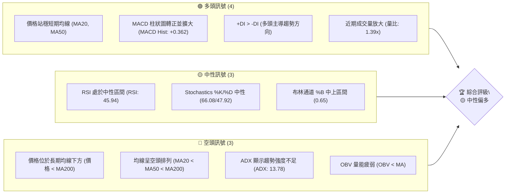

<details>
<summary>📊 靜態圖表 (點擊展開)</summary>

</details>

<html>
<head><meta charset="utf-8" /></head>
<body>
    <div>                        <script>window.PlotlyConfig = {MathJaxConfig: 'local'};</script>
        <script charset="utf-8" src="https://cdn.plot.ly/plotly-3.5.0.min.js" integrity="sha256-fHbNLP+GlIXN+efbQec78UkemUz3NJp7UmfGxC1tNxs=" crossorigin="anonymous"></script>                <div id="candlestick-chart" class="plotly-graph-div" style="height:500px; width:100%;"></div>            <script>                window.PLOTLYENV=window.PLOTLYENV || {};                                if (document.getElementById("candlestick-chart")) {                    Plotly.newPlot(                        "candlestick-chart",                        [{"close":{"dtype":"f8","bdata":"AAAAALeZaUAAAABgGStpQAAAAKAR6mhAAAAAwEQYakAAAAAg1Y9pQAAAAGBuMmlAAAAA4GeSaEAAAADAXcZoQAAAAMDzGGhAAAAAwIEFaEAAAABAq7FnQAAAACBot2dAAAAAIEurZ0AAAADA9EtoQAAAAEBhO2hAAAAAgFJ+aEAAAAAgX4xnQAAAAAAtI2dAAAAAQNBsZ0AAAADAIqBnQAAAAMD8aGdAAAAAgE5pZ0AAAACgPSFoQAAAAKAcDWpAAAAAgJ9oaUAAAABAuxxqQAAAACCBlmpAAAAA4B8UakAAAAAAbPBpQAAAAGBlK2pAAAAAYFlWakAAAACAPiprQAAAAGCwdWlAAAAAAB8waUAAAABgFCJpQAAAAGDJ1GlAAAAA4KSsaEAAAACALmxoQAAAAMCRHmlAAAAA4PJCaUAAAAAg4y1pQAAAAIB3+2hAAAAAgEHiaEAAAADAZ79pQAAAAICALWpAAAAA4C2KaEAAAABAJB9qQAAAAIA3nmlAAAAAgKBIakAAAAAgRDpqQAAAAMB2GWlAAAAAAJI2aEAAAADANUBnQAAAAOAwKmdAAAAAgPvaZ0AAAAAASx1pQAAAAGAL2GhAAAAAYBfCZ0AAAAAgR9poQAAAAGACpmdAAAAAYAN5Z0AAAACARhBoQAAAAKBRJ2dAAAAAAMybZ0AAAADAkwNnQAAAAOAsz2dAAAAA4F94Z0AAAACgVlVmQAAAAODvOGZAAAAAwM5iZUAAAABAscZlQAAAAKCV0GVAAAAAYBO+ZUAAAAAgs1RmQAAAAKD4qWVAAAAAgAcEZUAAAABgDdVlQAAAAMDUS2VAAAAAwAYKZkAAAADAw0tmQAAAACAvpWVAAAAAoGaCZUAAAAAArmVlQAAAACC78mVAAAAA4LbWZEAAAAAANbVkQAAAAABni2RAAAAAAOSWZEAAAAAA0sNlQAAAAGA3NGVAAAAA4C35ZEAAAAAAH59lQAAAAODy8GNAAAAAYM22ZEAAAABgmVJkQAAAAGAyK2RAAAAAgGQuZEAAAAAAqTdkQAAAAIBkLmRAAAAAINMzZEAAAABAwExkQAAAAACHI2RAAAAAQCigZEAAAABAqFZkQAAAAOCRKWVAAAAAAHZMY0AAAACgosxiQAAAAGCWxGRAAAAAgAmLZUAAAACg92VlQAAAAKCsF2VAAAAAwOd9ZkAAAAAA8MtkQAAAAIAVk2NAAAAAIKr5Y0AAAACAhwRkQAAAACDc\u002fGNAAAAAQP\u002fSY0AAAADAKIFkQAAAAGBCrWRAAAAAAHlLZEAAAAAgTMRjQAAAAGCYQWNAAAAAoFQZY0AAAABgbcphQAAAAOAA3GFAAAAAwEauYkAAAAAgXxhjQAAAACA+7GNAAAAAgNH9Y0AAAAAgF1xkQAAAAGA0aGVAAAAAQDCuZUAAAAAAzkplQAAAAAB7iGVAAAAAAFRlZUAAAAAASfJkQAAAAMBbbGVAAAAAIODjZUAAAABAiBJmQAAAAGDmtGVAAAAAwHG4ZEAAAADgWS9kQAAAACBmZGRAAAAAoIDlZEAAAABA4s1jQAAAAAC1bGRAAAAAIKKFZEAAAACgLt5jQAAAAICa62NAAAAAgHjXY0AAAABgnjhkQAAAAIBlg2RAAAAAgGw8ZUAAAABAi+RkQAAAAOCjQGJAAAAAoEfpYkAAAABAChdjQAAAAOBR8GJAAAAAoJkJY0AAAAAgXG9jQAAAAKBHcWJAAAAAYI\u002fKYkAAAABguD5jQAAAAIDC5WJAAAAAQOHyYkAAAACAwjVjQAAAAOB6fGNAAAAAAAAYY0AAAAAgXFdjQAAAAGBmxmNAAAAAQAp\u002fZEAAAACAFF5kQAAAAMD1sGRAAAAAYLhuZEAAAABAM\u002fNjQAAAAMAeXWNAAAAAoEd5Y0AAAABAM5tjQAAAAEAzi2RAAAAAYI\u002fSZEAAAAAA1yNkQAAAAKBHOWNAAAAAQOG6Y0AAAADA9WhjQAAAAEAzG2RAAAAAACkMZEAAAACgR8ljQAAAAGBmPmNAAAAAQAp3YkAAAACgmQFjQAAAAADXW2JAAAAAIIXTYUAAAADAzLxhQAAAAIDCdWFAAAAAAAAYYUAAAABguNZgQAAAAAAAAGJAAAAAYI+iYkAAAADgo4hjQA=="},"high":{"dtype":"f8","bdata":"9hRCuRReakAupSeLlwJqQFQ9qoh6rWlAxYUhFwUlakBzTBwC\u002fItqQMVyqfVZ42lAUZpKc7F1aUCzYGhWZNRoQE9bY+FLuWhA7x\u002f83QIUaEBT5iB0r31oQA4jINERWGhAaD+Ti5w9aEADv1zk2VxoQBAzqPXaj2hAtvVjeIITaUBFnNqtZl9oQNk3cvhIRWdAv9+SZoV6Z0D2eJMrAexnQIPoC0xs1mdAKBlaYG+6Z0C2aX\u002f6EVhoQCJBdj8agmpAPOMbo9xiakAvJ7D8JS1qQIHsPsAgImtABR8ZEG6fakDf3sYXbp9qQEoxWUJ4tGpAsaScJQuoakC09I+H4GZrQJYkceG8hWpAISpqT9KzaUDp\u002fX63U3ZpQMTVmc+43WlAgnZhlNHRaUAaDsuXVv5oQCrZtUC1i2lABBmJIfGNaUCnhw484jNqQBijkKxx62lAeh0108NoaUAUHqLlUcFpQM3MD9+lT2pAwBvB\u002fiF5akByfuf65ytqQDM2Q47NCGpAxxCHExfuakDx+0+JExBrQL3qBfAYL2pAG9Uc9uWdaUCNUcfmZhxoQEtYqr1On2dAeHJyKHj1Z0BNzlrMNC5pQK6RZC4uY2lAAEg\u002f+bKYaEDikNiUrQVpQEcEThG6yGhAddJWHn0LaECj9Dfk4lRoQAXW5vXP3mdAFjlUzj7+Z0DmAPhFLpNnQO7RDI+R0WdAfpranUOIaEA6yPthhm1nQPiYX0yhmWZAEspWTQsvZkACPIUCJXBmQBzDF5LTYGZA\u002fIBAuc8dZkCGxrQHA6BmQGk3yRibmGdAo+gd+HWmZUDRT6OF99ZlQJ0Teef3x2VAzD\u002fPs1coZkAn7LRtt4hmQAXPkFTQ\u002f2VAnTeHtObuZUCWL6Hj4qtlQLMm5JnqMWZAWixP7JkEZkCmWS8qdetkQPU4aT4nLmVAibAHFQSyZECHFusVE81lQHaDh98kcGZAvk6RwsKQZUAClQZNcK5lQB+PYmkN1WVADh1etUtuZUBu7URnBV5lQND88MvBgmRAfju8mENvZEDmWn8GoktkQJFmeQjlWGRAUYub6T1\u002fZEAjDP7Wz1pkQIR+yD\u002fUiGRASAfhrZQhZUAQqKwhem1lQHTW7eD+i2VA18+\u002ftXINZUC35XH4znJjQNaSChgQ0GVAGVPD0\u002fkPZkAnF71mwOZlQNZQaTZMXmVApqueMPbJZkD1RJ1OYVxlQPQyhnDDuGRA+8ucgEw4ZECPOxxV32hkQP9bpG+9VGRAsS19traiZEDZfoDbqYxkQBeNqbuoymRAG4NAetf0ZEBnE1I+1IhkQANilMpi+GNAQUFBkS2JY0Buuu7tay5jQNv1N8DY9mFACIbAv64BY0DkXwtEK3JjQIhFYzBnJmRAO\u002flFqraiZEABFzOLeb9kQI2JVxqjbWVA50HoWhkNZkD4W6l7WehlQGiUALi3imVAKjSZ0G+oZUDN8QqKY3NlQDqMl5RGbmVAcw75Bmn2ZUCtRbdMoh9mQMEv+awlQmZAB19o\u002ffEIZkCTavfT1GlkQPZSsuOPf2RA3jCQw7f3ZEDE0kfq0QRlQC\u002fvcLr7jGRA+qZ8AuwRZUBi6qgZiHhkQGrTCRpJX2RAqIvEDXqgZEAVRiVm32hkQCqXtOOBp2RAGGQcXHWYZUCGNkmdzitlQAAAAEAKz2RAAAAAwMx8Y0AAAABAM0NjQAAAAGBmvmNAAAAAoHAVY0AAAABgZgZkQAAAAIDC3WNAAAAAQArvYkAAAABA4YpjQAAAAIDrUWNAAAAAIFwjY0AAAADAHkVjQAAAAIDrKWRAAAAAwPVQZEAAAAAAKdRjQAAAAEAKF2RAAAAAwPWoZEAAAADgo9BkQAAAAKBw3WRAAAAAIK4PZUAAAACgmYFkQAAAAEAzI2RAAAAAYI\u002fiY0AAAAAA19tjQAAAACBcr2RAAAAAoHANZUAAAABgZmpkQAAAAMByJGRAAAAAACn0Y0AAAADgegRkQAAAAAApTGRAAAAAoJl5ZEAAAAAgrl9kQAAAAOB6DGVAAAAAAABgY0AAAAAAABhjQAAAAABWymJAAAAAwPVIYkAAAACgcOlhQAAAAEDhomFAAAAAoEdxYUAAAABgZhZhQAAAAMDMHGJAAAAAwPWoYkAAAACAPbJjQA=="},"hovertemplate":"\u003cb\u003e%{x|%Y-%m-%d}\u003c\u002fb\u003e\u003cbr\u003e\u958b: $%{open:.2f}\u003cbr\u003e\u9ad8: $%{high:.2f}\u003cbr\u003e\u4f4e: $%{low:.2f}\u003cbr\u003e\u6536: $%{close:.2f}\u003cextra\u003e\u003c\u002fextra\u003e","low":{"dtype":"f8","bdata":"aC3oRL6oZ0ATe2dZZB1pQK+GrE7CvWhA8HRglyP3aEDKIcINs\u002fBoQB4sbaGEMGlAdyto9xJCaEB0yaywsVFoQLNmyKJQz2dAdTgcJ7LkZkAomhxGvqhnQCxuIamSTWdAKJQP0W2SZ0CbP7fOBZRnQLDiLXNs8WdAAfsITgQ8aEAUSrml6D5nQGKRsVGXrGZADlFL8lD0ZkDvOHvEXIJnQIgJ0iPrN2ZApFdQSuz8ZkDulI1zj49nQBg3NNqE52hA1VPo5FZKaUAEoQC5lydpQOubpFO7HGpAEvZf7qvQaUCUO60vY3xpQHqP8l0i6GlAq7MHd9CTaUDJlQ21S+dpQH9o6TbMXGlA8n\u002fbyA4qaUAO9hTCDW9oQKD\u002fy\u002fanDWlAziSHKfykaEBqOOf2mcVnQCn60B6D9GdAzPBXWTfFaEArFcgMQB5pQGo0BnNenGhABhi+mRBraEA+ThdYb\u002fJoQADAEhKimGlA9G17c4qJaECWcGy1JftoQDR92Q4PG2lAE7h5WZ66aUBrpUZygQNqQCafwHD672hAH2BwMNcIaECcdkXM5CFnQJgSPJz5ZGZA7crJglwmZ0AzXf7rDkJoQEy2++OwfmhA7YgWYsr+ZkDa4bifWZ5nQNvNUAKsgGdA72SHanngZkC7sG1ghmpnQHRCaXa\u002f\u002f2ZAwnmDM3gNZ0BHxQRIJWFmQEt4u9mkA2ZAbFPPyOX0ZkCtd4xEK0pmQJBobLmpGWZA1PnIk55BZUB1fhWO+aNkQN1nPAWXlGVAweohShZGZUBHwytzsbdlQOAFBOLolGVAEkYcb8U\u002fZECfv\u002fWdL65kQAT1LolYrmRAF2ceRnmTZUCr1QOrozBmQBSxYCzehmVAB9i\u002f2JVcZUCszbaChA9lQC+29UEOQGVApoIDSWDAZEDRae\u002fzd3NkQNG\u002f1m3ZiGRAprcZJ9PGY0BmkdAUIxJkQADFyME+4WRAx1Wmo6bQZEDLIBPZ7cJkQKjUlaNryGNAiKttTRxHZECaSQ9xEUhkQI3YBCkwFGRAXfhsDy79Y0C1ZWjwrPFjQDMY7to1BGRAYXXooZj2Y0BKt6Eo5hpkQNJoQRoDIGRAVx0g9FV1ZEDPL9XTGP9jQEDF0wrScWRAl11DNJYqY0CHWieck59iQPeJ1dfttGRAXKisWmh7ZECriRsyy1JlQBWO9pVcumRAQWxzm0ZuZUA2bnywNllkQJkZ5D8wgWNAZ4JE3+8xY0D5fvSg3N1jQNsZhsgcuWNADPS9p+q1Y0DLrt7P571jQFwE4D4YHmRAAYbBTz3RY0BwLr2grpRjQAafEtE+OmNAVZV\u002f+vzFYkAe+vukkWJhQLH8U8rrSmFA13emggNnYkCxLHSLhHJiQC4cx9QrU2NAZnMMO7DKY0Duk4bBzgVkQDtB4Lv1KGRAon5YwP02ZUDQy5xWICxlQLYDc22qAGVAg+prCKIYZUCox2ynhJ9kQJ8qbEkPVWRAqQ6cTCU7ZUDsZNq2XXxkQP8zYtoHVWVAiR4byVSzZEAugLPvsBhjQIIDK8jOBWRAX5dMNbYuZECnA+QHs8JjQHcm\u002fjI+WWNAuCtn75iCZEAx08lfCV5jQMVO4qORj2NA0yJ73XuwY0Ce0OxaivxjQOJzvMnFPGRAWX3eDsmoZEAxYWBqM4BkQAAAAGCPGmJAAAAAYLiqYkAAAACgmbFiQAAAAAApzGJAAAAAIK5PYkAAAAAAAPhiQAAAAEAzU2JAAAAAQOHKYUAAAADAzOxiQAAAAADXw2JAAAAAACm8YkAAAADA9chiQAAAAKBHaWNAAAAAgMIVY0AAAAAghSNjQAAAAMDMFGNAAAAAQAoLZEAAAADAzERkQAAAACCFU2RAAAAA4FFIZEAAAACAPcpjQAAAAAApRGNAAAAAoHBdY0AAAAAAAFBjQAAAAMDMZGNAAAAAIIXXY0AAAABACtdjQAAAAGCPImNAAAAAIFx3Y0AAAACAwl1jQAAAAIAUrmNAAAAAoJn5Y0AAAABAM5NjQAAAAOCjOGNAAAAAIFxfYkAAAABg5UhiQAAAAMAeNWJAAAAA4FFwYUAAAAAAgX1hQAAAAIDrOWFAAAAAIIW7YEAAAADAHpVgQAAAAIDrOWFAAAAAACkcYkAAAAAAANhiQA=="},"name":"\u50f9\u683c","open":{"dtype":"f8","bdata":"lrdCEHCvZ0Da9yV4SqppQJeERjJHWmlAJA4MC4g3aUCRxQwEWixqQIcHtxBVa2lArx5t0yZHaUALuT3L4odoQByXVMmMlmhAeWAC2p7IZ0AFJoZEYAhoQLicF1EVzWdA46QdoNXZZ0BtfZ12FrdnQJjwKEZ0MmhAfBIwgYFOaEDKH8XRqVloQHR\u002fn5sC+2ZAKukerjspZ0DShwiA3YhnQNV3Nj62sGdA9rBtXaybZ0Da8mJSvqhnQMyXwW4Y+GhA+ZzQZ2f\u002faUA0ztPMwkRpQOubpFO7HGpABR8ZEG6fakD93aaWk09qQEMvdmvPj2pAqPwcviJbakAjYwDsaU1qQOuArQADMWpAMAmWUGpWaUCIvPABj65oQL+lwUCtFGlApmwJ0jQuaUBtM16iiNRoQMVxg63STmhAot6aZ05vaUCsP9AHM3lpQAoYXtb1smlAuvTLBnwgaUB0nOKTzSBpQGZmZibEzWlArpL1udclakC7Fvu4HxJpQFFflO8mp2lA46qHQM0XakByldkAXMZqQBsnfZsl42lA9fvX2i1yaUCqCCB0KwtoQLqaslYUYWdA7crJglwmZ0CPvyLS4YFoQK6RZC4uY2lAAEg\u002f+bKYaED5HGQuqfhnQNtKAG2cRGhA4vo6UBbvZ0B8IYmpHMlnQK\u002fk+4ehcmdAXsJxlek3Z0CNyhWjXsxmQOesQcFGQGZAtk3kt3BIaEDI4EEPEC1nQPwpA+ysemZAO9foWokNZkAd4a2ZCNdkQBbfqG1O3mVAaetMMOmFZUDVYYjAsNVlQLcPW8X1CWdAVK1+WtlwZUAYHTWbTSNlQI110M85s2VAHc7\u002fQ6ywZUBai8t3O1BmQHC2563Q8GVAPW6Ve1ndZUA\u002f9Vk56YVlQHScoWiobWVAJf5URxcBZkCmWS8qdetkQCVON99FnWRA4aWfylCcZEAU6gVhUzNkQHlU2n331mVAfThyCXyPZUArDNa3HsZkQAQwxeT9sGVAQBcwAIemZEDFDo49t8dkQN0DmMHZeGRA2e6mfTIrZEA8eBqTqRhkQAAAAIBkLmRABdHSP\u002fsYZECj2DYr8DhkQOM3URdhVWRAVx0g9FV1ZEAV4anhdCRlQNIXHwqiGGVA18+\u002ftXINZUBzFrd7O2FjQOFpXev1wmVAtX4uBUOOZEChQTg1arhlQBMRIpAYJWVArVVaYHWYZUDj0+fFS+pkQMSk7xmcIWRA1WtwZWPZY0BEspNaszZkQPEWz3YG+WNA+HbQIuELZEBPBHDCXeljQIYohHvDuGRAKFyOR3y3ZECMiOe49ShkQMEaJGvtrWNAzs3Yzgh9Y0AcBrDsZh9jQIkyy3namWFAUlEaGHa5YkDy\u002fxIFdrliQOUne7LOBWRAZn\u002fpn86YZEB0rsJyWhBkQOQevHC4RWRAMDlg\u002f7VUZUDGHWn8u7hlQGGuIae2NWVAaynP1BaCZUB2B1iOCk1lQGzbAe+q4WRAVOmmQaWEZUAwTonODGRlQIjR9Bxf2GVAcCWzBPs+ZUAsgo0cCC9kQPqHjwDWK2RABu3jeRo1ZEB42\u002fAlO4dkQOO4vucAdmNAi85qyU+kZECoMc+TEWxkQOiRP2a2m2NAUBz7o0QxZEB4i1BM+xhkQGtpepbSUmRA19GkRMawZEATW1obJ95kQAAAAEAKz2RAAAAAYGbuYkAAAACgmdFiQAAAAAAAYGNAAAAAAACwYkAAAAAAAPhiQAAAAEAzo2NAAAAAwMz8YUAAAABACu9iQAAAAGC45mJAAAAAoEfhYkAAAACAPeJiQAAAAAAAGGRAAAAA4Hp8Y0AAAAAAADBjQAAAAMDMFGNAAAAAwB5NZEAAAAAAALBkQAAAAIA9kmRAAAAA4FHIZEAAAACgmWFkQAAAAOBRGGRAAAAAoJm5Y0AAAABguH5jQAAAAGCPimNAAAAAAACgZEAAAAAAAFBkQAAAACCFG2RAAAAAoEeJY0AAAACA68ljQAAAAIAUtmNAAAAAAABgZEAAAAAA1y9kQAAAAKBHYWRAAAAAAABgY0AAAAAAAIBiQAAAACCur2JAAAAAwPVIYkAAAAAAKaxhQAAAAMDMeGFAAAAAAABgYUAAAACgmflgQAAAAAAAQGFAAAAAQAovYkAAAADA9eBiQA=="},"x":["2025-08-07T00:00:00-04:00","2025-08-08T00:00:00-04:00","2025-08-11T00:00:00-04:00","2025-08-12T00:00:00-04:00","2025-08-13T00:00:00-04:00","2025-08-14T00:00:00-04:00","2025-08-15T00:00:00-04:00","2025-08-18T00:00:00-04:00","2025-08-19T00:00:00-04:00","2025-08-20T00:00:00-04:00","2025-08-21T00:00:00-04:00","2025-08-22T00:00:00-04:00","2025-08-25T00:00:00-04:00","2025-08-26T00:00:00-04:00","2025-08-27T00:00:00-04:00","2025-08-28T00:00:00-04:00","2025-08-29T00:00:00-04:00","2025-09-02T00:00:00-04:00","2025-09-03T00:00:00-04:00","2025-09-04T00:00:00-04:00","2025-09-05T00:00:00-04:00","2025-09-08T00:00:00-04:00","2025-09-09T00:00:00-04:00","2025-09-10T00:00:00-04:00","2025-09-11T00:00:00-04:00","2025-09-12T00:00:00-04:00","2025-09-15T00:00:00-04:00","2025-09-16T00:00:00-04:00","2025-09-17T00:00:00-04:00","2025-09-18T00:00:00-04:00","2025-09-19T00:00:00-04:00","2025-09-22T00:00:00-04:00","2025-09-23T00:00:00-04:00","2025-09-24T00:00:00-04:00","2025-09-25T00:00:00-04:00","2025-09-26T00:00:00-04:00","2025-09-29T00:00:00-04:00","2025-09-30T00:00:00-04:00","2025-10-01T00:00:00-04:00","2025-10-02T00:00:00-04:00","2025-10-03T00:00:00-04:00","2025-10-06T00:00:00-04:00","2025-10-07T00:00:00-04:00","2025-10-08T00:00:00-04:00","2025-10-09T00:00:00-04:00","2025-10-10T00:00:00-04:00","2025-10-13T00:00:00-04:00","2025-10-14T00:00:00-04:00","2025-10-15T00:00:00-04:00","2025-10-16T00:00:00-04:00","2025-10-17T00:00:00-04:00","2025-10-20T00:00:00-04:00","2025-10-21T00:00:00-04:00","2025-10-22T00:00:00-04:00","2025-10-23T00:00:00-04:00","2025-10-24T00:00:00-04:00","2025-10-27T00:00:00-04:00","2025-10-28T00:00:00-04:00","2025-10-29T00:00:00-04:00","2025-10-30T00:00:00-04:00","2025-10-31T00:00:00-04:00","2025-11-03T00:00:00-05:00","2025-11-04T00:00:00-05:00","2025-11-05T00:00:00-05:00","2025-11-06T00:00:00-05:00","2025-11-07T00:00:00-05:00","2025-11-10T00:00:00-05:00","2025-11-11T00:00:00-05:00","2025-11-12T00:00:00-05:00","2025-11-13T00:00:00-05:00","2025-11-14T00:00:00-05:00","2025-11-17T00:00:00-05:00","2025-11-18T00:00:00-05:00","2025-11-19T00:00:00-05:00","2025-11-20T00:00:00-05:00","2025-11-21T00:00:00-05:00","2025-11-24T00:00:00-05:00","2025-11-25T00:00:00-05:00","2025-11-26T00:00:00-05:00","2025-11-28T00:00:00-05:00","2025-12-01T00:00:00-05:00","2025-12-02T00:00:00-05:00","2025-12-03T00:00:00-05:00","2025-12-04T00:00:00-05:00","2025-12-05T00:00:00-05:00","2025-12-08T00:00:00-05:00","2025-12-09T00:00:00-05:00","2025-12-10T00:00:00-05:00","2025-12-11T00:00:00-05:00","2025-12-12T00:00:00-05:00","2025-12-15T00:00:00-05:00","2025-12-16T00:00:00-05:00","2025-12-17T00:00:00-05:00","2025-12-18T00:00:00-05:00","2025-12-19T00:00:00-05:00","2025-12-22T00:00:00-05:00","2025-12-23T00:00:00-05:00","2025-12-24T00:00:00-05:00","2025-12-26T00:00:00-05:00","2025-12-29T00:00:00-05:00","2025-12-30T00:00:00-05:00","2025-12-31T00:00:00-05:00","2026-01-02T00:00:00-05:00","2026-01-05T00:00:00-05:00","2026-01-06T00:00:00-05:00","2026-01-07T00:00:00-05:00","2026-01-08T00:00:00-05:00","2026-01-09T00:00:00-05:00","2026-01-12T00:00:00-05:00","2026-01-13T00:00:00-05:00","2026-01-14T00:00:00-05:00","2026-01-15T00:00:00-05:00","2026-01-16T00:00:00-05:00","2026-01-20T00:00:00-05:00","2026-01-21T00:00:00-05:00","2026-01-22T00:00:00-05:00","2026-01-23T00:00:00-05:00","2026-01-26T00:00:00-05:00","2026-01-27T00:00:00-05:00","2026-01-28T00:00:00-05:00","2026-01-29T00:00:00-05:00","2026-01-30T00:00:00-05:00","2026-02-02T00:00:00-05:00","2026-02-03T00:00:00-05:00","2026-02-04T00:00:00-05:00","2026-02-05T00:00:00-05:00","2026-02-06T00:00:00-05:00","2026-02-09T00:00:00-05:00","2026-02-10T00:00:00-05:00","2026-02-11T00:00:00-05:00","2026-02-12T00:00:00-05:00","2026-02-13T00:00:00-05:00","2026-02-17T00:00:00-05:00","2026-02-18T00:00:00-05:00","2026-02-19T00:00:00-05:00","2026-02-20T00:00:00-05:00","2026-02-23T00:00:00-05:00","2026-02-24T00:00:00-05:00","2026-02-25T00:00:00-05:00","2026-02-26T00:00:00-05:00","2026-02-27T00:00:00-05:00","2026-03-02T00:00:00-05:00","2026-03-03T00:00:00-05:00","2026-03-04T00:00:00-05:00","2026-03-05T00:00:00-05:00","2026-03-06T00:00:00-05:00","2026-03-09T00:00:00-04:00","2026-03-10T00:00:00-04:00","2026-03-11T00:00:00-04:00","2026-03-12T00:00:00-04:00","2026-03-13T00:00:00-04:00","2026-03-16T00:00:00-04:00","2026-03-17T00:00:00-04:00","2026-03-18T00:00:00-04:00","2026-03-19T00:00:00-04:00","2026-03-20T00:00:00-04:00","2026-03-23T00:00:00-04:00","2026-03-24T00:00:00-04:00","2026-03-25T00:00:00-04:00","2026-03-26T00:00:00-04:00","2026-03-27T00:00:00-04:00","2026-03-30T00:00:00-04:00","2026-03-31T00:00:00-04:00","2026-04-01T00:00:00-04:00","2026-04-02T00:00:00-04:00","2026-04-06T00:00:00-04:00","2026-04-07T00:00:00-04:00","2026-04-08T00:00:00-04:00","2026-04-09T00:00:00-04:00","2026-04-10T00:00:00-04:00","2026-04-13T00:00:00-04:00","2026-04-14T00:00:00-04:00","2026-04-15T00:00:00-04:00","2026-04-16T00:00:00-04:00","2026-04-17T00:00:00-04:00","2026-04-20T00:00:00-04:00","2026-04-21T00:00:00-04:00","2026-04-22T00:00:00-04:00","2026-04-23T00:00:00-04:00","2026-04-24T00:00:00-04:00","2026-04-27T00:00:00-04:00","2026-04-28T00:00:00-04:00","2026-04-29T00:00:00-04:00","2026-04-30T00:00:00-04:00","2026-05-01T00:00:00-04:00","2026-05-04T00:00:00-04:00","2026-05-05T00:00:00-04:00","2026-05-06T00:00:00-04:00","2026-05-07T00:00:00-04:00","2026-05-08T00:00:00-04:00","2026-05-11T00:00:00-04:00","2026-05-12T00:00:00-04:00","2026-05-13T00:00:00-04:00","2026-05-14T00:00:00-04:00","2026-05-15T00:00:00-04:00","2026-05-18T00:00:00-04:00","2026-05-19T00:00:00-04:00","2026-05-20T00:00:00-04:00","2026-05-21T00:00:00-04:00","2026-05-22T00:00:00-04:00"],"type":"candlestick"},{"hovertemplate":"MA30: $%{y:.2f}\u003cextra\u003e\u003c\u002fextra\u003e","line":{"color":"#2196F3","dash":"dash","width":2},"mode":"lines","name":"MA30","x":["2025-08-07T00:00:00-04:00","2025-08-08T00:00:00-04:00","2025-08-11T00:00:00-04:00","2025-08-12T00:00:00-04:00","2025-08-13T00:00:00-04:00","2025-08-14T00:00:00-04:00","2025-08-15T00:00:00-04:00","2025-08-18T00:00:00-04:00","2025-08-19T00:00:00-04:00","2025-08-20T00:00:00-04:00","2025-08-21T00:00:00-04:00","2025-08-22T00:00:00-04:00","2025-08-25T00:00:00-04:00","2025-08-26T00:00:00-04:00","2025-08-27T00:00:00-04:00","2025-08-28T00:00:00-04:00","2025-08-29T00:00:00-04:00","2025-09-02T00:00:00-04:00","2025-09-03T00:00:00-04:00","2025-09-04T00:00:00-04:00","2025-09-05T00:00:00-04:00","2025-09-08T00:00:00-04:00","2025-09-09T00:00:00-04:00","2025-09-10T00:00:00-04:00","2025-09-11T00:00:00-04:00","2025-09-12T00:00:00-04:00","2025-09-15T00:00:00-04:00","2025-09-16T00:00:00-04:00","2025-09-17T00:00:00-04:00","2025-09-18T00:00:00-04:00","2025-09-19T00:00:00-04:00","2025-09-22T00:00:00-04:00","2025-09-23T00:00:00-04:00","2025-09-24T00:00:00-04:00","2025-09-25T00:00:00-04:00","2025-09-26T00:00:00-04:00","2025-09-29T00:00:00-04:00","2025-09-30T00:00:00-04:00","2025-10-01T00:00:00-04:00","2025-10-02T00:00:00-04:00","2025-10-03T00:00:00-04:00","2025-10-06T00:00:00-04:00","2025-10-07T00:00:00-04:00","2025-10-08T00:00:00-04:00","2025-10-09T00:00:00-04:00","2025-10-10T00:00:00-04:00","2025-10-13T00:00:00-04:00","2025-10-14T00:00:00-04:00","2025-10-15T00:00:00-04:00","2025-10-16T00:00:00-04:00","2025-10-17T00:00:00-04:00","2025-10-20T00:00:00-04:00","2025-10-21T00:00:00-04:00","2025-10-22T00:00:00-04:00","2025-10-23T00:00:00-04:00","2025-10-24T00:00:00-04:00","2025-10-27T00:00:00-04:00","2025-10-28T00:00:00-04:00","2025-10-29T00:00:00-04:00","2025-10-30T00:00:00-04:00","2025-10-31T00:00:00-04:00","2025-11-03T00:00:00-05:00","2025-11-04T00:00:00-05:00","2025-11-05T00:00:00-05:00","2025-11-06T00:00:00-05:00","2025-11-07T00:00:00-05:00","2025-11-10T00:00:00-05:00","2025-11-11T00:00:00-05:00","2025-11-12T00:00:00-05:00","2025-11-13T00:00:00-05:00","2025-11-14T00:00:00-05:00","2025-11-17T00:00:00-05:00","2025-11-18T00:00:00-05:00","2025-11-19T00:00:00-05:00","2025-11-20T00:00:00-05:00","2025-11-21T00:00:00-05:00","2025-11-24T00:00:00-05:00","2025-11-25T00:00:00-05:00","2025-11-26T00:00:00-05:00","2025-11-28T00:00:00-05:00","2025-12-01T00:00:00-05:00","2025-12-02T00:00:00-05:00","2025-12-03T00:00:00-05:00","2025-12-04T00:00:00-05:00","2025-12-05T00:00:00-05:00","2025-12-08T00:00:00-05:00","2025-12-09T00:00:00-05:00","2025-12-10T00:00:00-05:00","2025-12-11T00:00:00-05:00","2025-12-12T00:00:00-05:00","2025-12-15T00:00:00-05:00","2025-12-16T00:00:00-05:00","2025-12-17T00:00:00-05:00","2025-12-18T00:00:00-05:00","2025-12-19T00:00:00-05:00","2025-12-22T00:00:00-05:00","2025-12-23T00:00:00-05:00","2025-12-24T00:00:00-05:00","2025-12-26T00:00:00-05:00","2025-12-29T00:00:00-05:00","2025-12-30T00:00:00-05:00","2025-12-31T00:00:00-05:00","2026-01-02T00:00:00-05:00","2026-01-05T00:00:00-05:00","2026-01-06T00:00:00-05:00","2026-01-07T00:00:00-05:00","2026-01-08T00:00:00-05:00","2026-01-09T00:00:00-05:00","2026-01-12T00:00:00-05:00","2026-01-13T00:00:00-05:00","2026-01-14T00:00:00-05:00","2026-01-15T00:00:00-05:00","2026-01-16T00:00:00-05:00","2026-01-20T00:00:00-05:00","2026-01-21T00:00:00-05:00","2026-01-22T00:00:00-05:00","2026-01-23T00:00:00-05:00","2026-01-26T00:00:00-05:00","2026-01-27T00:00:00-05:00","2026-01-28T00:00:00-05:00","2026-01-29T00:00:00-05:00","2026-01-30T00:00:00-05:00","2026-02-02T00:00:00-05:00","2026-02-03T00:00:00-05:00","2026-02-04T00:00:00-05:00","2026-02-05T00:00:00-05:00","2026-02-06T00:00:00-05:00","2026-02-09T00:00:00-05:00","2026-02-10T00:00:00-05:00","2026-02-11T00:00:00-05:00","2026-02-12T00:00:00-05:00","2026-02-13T00:00:00-05:00","2026-02-17T00:00:00-05:00","2026-02-18T00:00:00-05:00","2026-02-19T00:00:00-05:00","2026-02-20T00:00:00-05:00","2026-02-23T00:00:00-05:00","2026-02-24T00:00:00-05:00","2026-02-25T00:00:00-05:00","2026-02-26T00:00:00-05:00","2026-02-27T00:00:00-05:00","2026-03-02T00:00:00-05:00","2026-03-03T00:00:00-05:00","2026-03-04T00:00:00-05:00","2026-03-05T00:00:00-05:00","2026-03-06T00:00:00-05:00","2026-03-09T00:00:00-04:00","2026-03-10T00:00:00-04:00","2026-03-11T00:00:00-04:00","2026-03-12T00:00:00-04:00","2026-03-13T00:00:00-04:00","2026-03-16T00:00:00-04:00","2026-03-17T00:00:00-04:00","2026-03-18T00:00:00-04:00","2026-03-19T00:00:00-04:00","2026-03-20T00:00:00-04:00","2026-03-23T00:00:00-04:00","2026-03-24T00:00:00-04:00","2026-03-25T00:00:00-04:00","2026-03-26T00:00:00-04:00","2026-03-27T00:00:00-04:00","2026-03-30T00:00:00-04:00","2026-03-31T00:00:00-04:00","2026-04-01T00:00:00-04:00","2026-04-02T00:00:00-04:00","2026-04-06T00:00:00-04:00","2026-04-07T00:00:00-04:00","2026-04-08T00:00:00-04:00","2026-04-09T00:00:00-04:00","2026-04-10T00:00:00-04:00","2026-04-13T00:00:00-04:00","2026-04-14T00:00:00-04:00","2026-04-15T00:00:00-04:00","2026-04-16T00:00:00-04:00","2026-04-17T00:00:00-04:00","2026-04-20T00:00:00-04:00","2026-04-21T00:00:00-04:00","2026-04-22T00:00:00-04:00","2026-04-23T00:00:00-04:00","2026-04-24T00:00:00-04:00","2026-04-27T00:00:00-04:00","2026-04-28T00:00:00-04:00","2026-04-29T00:00:00-04:00","2026-04-30T00:00:00-04:00","2026-05-01T00:00:00-04:00","2026-05-04T00:00:00-04:00","2026-05-05T00:00:00-04:00","2026-05-06T00:00:00-04:00","2026-05-07T00:00:00-04:00","2026-05-08T00:00:00-04:00","2026-05-11T00:00:00-04:00","2026-05-12T00:00:00-04:00","2026-05-13T00:00:00-04:00","2026-05-14T00:00:00-04:00","2026-05-15T00:00:00-04:00","2026-05-18T00:00:00-04:00","2026-05-19T00:00:00-04:00","2026-05-20T00:00:00-04:00","2026-05-21T00:00:00-04:00","2026-05-22T00:00:00-04:00"],"y":{"dtype":"f8","bdata":"AAAAAAAA+H8AAAAAAAD4fwAAAAAAAPh\u002fAAAAAAAA+H8AAAAAAAD4fwAAAAAAAPh\u002fAAAAAAAA+H8AAAAAAAD4fwAAAAAAAPh\u002fAAAAAAAA+H8AAAAAAAD4fwAAAAAAAPh\u002fAAAAAAAA+H8AAAAAAAD4fwAAAAAAAPh\u002fAAAAAAAA+H8AAAAAAAD4fwAAAAAAAPh\u002fAAAAAAAA+H8AAAAAAAD4fwAAAAAAAPh\u002fAAAAAAAA+H8AAAAAAAD4fwAAAAAAAPh\u002fAAAAAAAA+H8AAAAAAAD4fwAAAAAAAPh\u002fAAAAAAAA+H8AAAAAAAD4fzMzMyNjtGhAERER0ay6aEBmZmaWtstoQDMzMwNe0GhAVVVVBaHIaEBmZmZ2+MRoQFVVVeVhymhAvLu7y0HLaECJiIg4QMhoQAAAALD40GhAZmZmho3baEDe3d0NOuhoQN7d3V0H82hAmpmZ6WT9aEDNzMycxglpQBEREUFhGmlA7+7ubsYaaUAAAADwuzBpQERERPTmRWlAMzMzw0teaUAzMzMTgHRpQKuqqorqgmlAAAAAIMKJaUDNzMzcQYJpQHd3d2egaWlARERENF9caUBmZmZ221NpQLy7u6v5RGlAZmZmliwxaUB3d3cX5ydpQKuqqspjEmlA3t3d\u002ffH5aECrqqrKet9oQHd3d\u002ffMy2hAvLu7u1K+aEARERFhPaxoQN7d3W38mmhAzczM3LWQaEDe3d3d4X5oQFVVVUUpZmhAAAAAABdFaEDe3d3NDChoQGZmZkYFDWhAAAAA8DbyZ0CJiIjIDtVnQBEREUGKrmdAiYiI6HeQZ0C8u7uL3WtnQDMzM2P8RmdAAAAAEMQiZ0AAAABANwFnQFVVVWW942ZAIiIi4qrMZkDv7u6O2bxmQERERMR3smZA7+7uvrmYZkCamZlpH3NmQERERERvTmZAVVVVBWUzZkCJiIjICxlmQO\u002fu7q4vBGZARERExNvuZUDe3d0dBdplQO\u002fu7o6bvmVAd3d3Z+ilZUAAAAAg8Y5lQN7d3T3gb2VAREREVM9TZUAiIiICwUFlQGZmZvZVMGVAIiIigjwmZUCJiIhooxllQO\u002fu7h5WC2VAiYiISM4BZUC8u7vrzfBkQKuqqjqG7GRA7+7uPt\u002fdZEAiIiLS\u002fcNkQN7d3b17v2RAmpmZGUC7ZECamZkpl7NkQM3MzJzfrmRAiYiIyEG3ZECamZnZIbJkQImIiJjgnWRA3t3dTYKWZEB3d3ennpBkQKuqqkrei2RAq6qqqlaFZECrqqpKlXpkQImIiKgVdmRAzczMXEtwZECJiIiId2BkQO\u002fu7i6fWmRARERE5NZMZEAzMzPTOzdkQJqZmfmGI2RA7+7uLrkWZEB3d3enJQ1kQM3MzCzxCmRAIiIiUiQJZEB3d3c3pwlkQLy7u8t5FGRAAAAAEHodZEBERER0nSVkQLy7u1vHKGRAAAAAoKw6ZECJiIj4\u002fkxkQN7d3Z2WUmRAREREtIxVZEAiIiJCTVtkQKuqquqKYGRAIiIiYm1RZEDe3d0tNUxkQFVVVVUvU2RAERER0QtbZEAiIiKCOVlkQAAAAPDzXGRAzczMTOhiZEAAAACQeV1kQImIiAgFV2RAZmZmJidTZEAiIiLCB1dkQLy7u8vBYWRAMzMzU\u002f5zZECamZnJdo5kQN7d3Y3RkWRAzczMDMmTZEAAAACwvZNkQCIiIvJXi2RAMzMz8zODZECamZnZT3tkQBEREbEDYmRAIiIiMlxJZEAiIiIC5DdkQERERGRmIWRAMzMzs4QMZECrqqpqs\u002f1jQLy7u+sr7WNA3t3dHU\u002fVY0CJiIjYAL5jQM3MzByFrWNAMzMzQ5urY0BEREQEKq1jQGZmZla3r2NAq6qqusGrY0CamZkpAK1jQO\u002fu7p7yo2NAvLu7qwCbY0B3d3cXxZhjQLy7u\u002fsWnmNAzczMnHWmY0DNzMxMxKVjQN7d3U3DmmNAREREVOmNY0BmZmY2QoFjQKuqqsoTkWNAiYiI+MWaY0AzMzPztqBjQLy7uztRo2NAZmZmlm6eY0CJiIj4xZpjQERERAQPmmNAERER8dKRY0ARERHB9YRjQM3MzHyxeGNA3t3dLd1oY0C8u7sboVRjQImIiFjyR2NAERERMQhEY0B3d3e3rEVjQA=="},"type":"scatter"},{"hovertemplate":"MA60: $%{y:.2f}\u003cextra\u003e\u003c\u002fextra\u003e","line":{"color":"#9C27B0","dash":"dash","width":2},"mode":"lines","name":"MA60","x":["2025-08-07T00:00:00-04:00","2025-08-08T00:00:00-04:00","2025-08-11T00:00:00-04:00","2025-08-12T00:00:00-04:00","2025-08-13T00:00:00-04:00","2025-08-14T00:00:00-04:00","2025-08-15T00:00:00-04:00","2025-08-18T00:00:00-04:00","2025-08-19T00:00:00-04:00","2025-08-20T00:00:00-04:00","2025-08-21T00:00:00-04:00","2025-08-22T00:00:00-04:00","2025-08-25T00:00:00-04:00","2025-08-26T00:00:00-04:00","2025-08-27T00:00:00-04:00","2025-08-28T00:00:00-04:00","2025-08-29T00:00:00-04:00","2025-09-02T00:00:00-04:00","2025-09-03T00:00:00-04:00","2025-09-04T00:00:00-04:00","2025-09-05T00:00:00-04:00","2025-09-08T00:00:00-04:00","2025-09-09T00:00:00-04:00","2025-09-10T00:00:00-04:00","2025-09-11T00:00:00-04:00","2025-09-12T00:00:00-04:00","2025-09-15T00:00:00-04:00","2025-09-16T00:00:00-04:00","2025-09-17T00:00:00-04:00","2025-09-18T00:00:00-04:00","2025-09-19T00:00:00-04:00","2025-09-22T00:00:00-04:00","2025-09-23T00:00:00-04:00","2025-09-24T00:00:00-04:00","2025-09-25T00:00:00-04:00","2025-09-26T00:00:00-04:00","2025-09-29T00:00:00-04:00","2025-09-30T00:00:00-04:00","2025-10-01T00:00:00-04:00","2025-10-02T00:00:00-04:00","2025-10-03T00:00:00-04:00","2025-10-06T00:00:00-04:00","2025-10-07T00:00:00-04:00","2025-10-08T00:00:00-04:00","2025-10-09T00:00:00-04:00","2025-10-10T00:00:00-04:00","2025-10-13T00:00:00-04:00","2025-10-14T00:00:00-04:00","2025-10-15T00:00:00-04:00","2025-10-16T00:00:00-04:00","2025-10-17T00:00:00-04:00","2025-10-20T00:00:00-04:00","2025-10-21T00:00:00-04:00","2025-10-22T00:00:00-04:00","2025-10-23T00:00:00-04:00","2025-10-24T00:00:00-04:00","2025-10-27T00:00:00-04:00","2025-10-28T00:00:00-04:00","2025-10-29T00:00:00-04:00","2025-10-30T00:00:00-04:00","2025-10-31T00:00:00-04:00","2025-11-03T00:00:00-05:00","2025-11-04T00:00:00-05:00","2025-11-05T00:00:00-05:00","2025-11-06T00:00:00-05:00","2025-11-07T00:00:00-05:00","2025-11-10T00:00:00-05:00","2025-11-11T00:00:00-05:00","2025-11-12T00:00:00-05:00","2025-11-13T00:00:00-05:00","2025-11-14T00:00:00-05:00","2025-11-17T00:00:00-05:00","2025-11-18T00:00:00-05:00","2025-11-19T00:00:00-05:00","2025-11-20T00:00:00-05:00","2025-11-21T00:00:00-05:00","2025-11-24T00:00:00-05:00","2025-11-25T00:00:00-05:00","2025-11-26T00:00:00-05:00","2025-11-28T00:00:00-05:00","2025-12-01T00:00:00-05:00","2025-12-02T00:00:00-05:00","2025-12-03T00:00:00-05:00","2025-12-04T00:00:00-05:00","2025-12-05T00:00:00-05:00","2025-12-08T00:00:00-05:00","2025-12-09T00:00:00-05:00","2025-12-10T00:00:00-05:00","2025-12-11T00:00:00-05:00","2025-12-12T00:00:00-05:00","2025-12-15T00:00:00-05:00","2025-12-16T00:00:00-05:00","2025-12-17T00:00:00-05:00","2025-12-18T00:00:00-05:00","2025-12-19T00:00:00-05:00","2025-12-22T00:00:00-05:00","2025-12-23T00:00:00-05:00","2025-12-24T00:00:00-05:00","2025-12-26T00:00:00-05:00","2025-12-29T00:00:00-05:00","2025-12-30T00:00:00-05:00","2025-12-31T00:00:00-05:00","2026-01-02T00:00:00-05:00","2026-01-05T00:00:00-05:00","2026-01-06T00:00:00-05:00","2026-01-07T00:00:00-05:00","2026-01-08T00:00:00-05:00","2026-01-09T00:00:00-05:00","2026-01-12T00:00:00-05:00","2026-01-13T00:00:00-05:00","2026-01-14T00:00:00-05:00","2026-01-15T00:00:00-05:00","2026-01-16T00:00:00-05:00","2026-01-20T00:00:00-05:00","2026-01-21T00:00:00-05:00","2026-01-22T00:00:00-05:00","2026-01-23T00:00:00-05:00","2026-01-26T00:00:00-05:00","2026-01-27T00:00:00-05:00","2026-01-28T00:00:00-05:00","2026-01-29T00:00:00-05:00","2026-01-30T00:00:00-05:00","2026-02-02T00:00:00-05:00","2026-02-03T00:00:00-05:00","2026-02-04T00:00:00-05:00","2026-02-05T00:00:00-05:00","2026-02-06T00:00:00-05:00","2026-02-09T00:00:00-05:00","2026-02-10T00:00:00-05:00","2026-02-11T00:00:00-05:00","2026-02-12T00:00:00-05:00","2026-02-13T00:00:00-05:00","2026-02-17T00:00:00-05:00","2026-02-18T00:00:00-05:00","2026-02-19T00:00:00-05:00","2026-02-20T00:00:00-05:00","2026-02-23T00:00:00-05:00","2026-02-24T00:00:00-05:00","2026-02-25T00:00:00-05:00","2026-02-26T00:00:00-05:00","2026-02-27T00:00:00-05:00","2026-03-02T00:00:00-05:00","2026-03-03T00:00:00-05:00","2026-03-04T00:00:00-05:00","2026-03-05T00:00:00-05:00","2026-03-06T00:00:00-05:00","2026-03-09T00:00:00-04:00","2026-03-10T00:00:00-04:00","2026-03-11T00:00:00-04:00","2026-03-12T00:00:00-04:00","2026-03-13T00:00:00-04:00","2026-03-16T00:00:00-04:00","2026-03-17T00:00:00-04:00","2026-03-18T00:00:00-04:00","2026-03-19T00:00:00-04:00","2026-03-20T00:00:00-04:00","2026-03-23T00:00:00-04:00","2026-03-24T00:00:00-04:00","2026-03-25T00:00:00-04:00","2026-03-26T00:00:00-04:00","2026-03-27T00:00:00-04:00","2026-03-30T00:00:00-04:00","2026-03-31T00:00:00-04:00","2026-04-01T00:00:00-04:00","2026-04-02T00:00:00-04:00","2026-04-06T00:00:00-04:00","2026-04-07T00:00:00-04:00","2026-04-08T00:00:00-04:00","2026-04-09T00:00:00-04:00","2026-04-10T00:00:00-04:00","2026-04-13T00:00:00-04:00","2026-04-14T00:00:00-04:00","2026-04-15T00:00:00-04:00","2026-04-16T00:00:00-04:00","2026-04-17T00:00:00-04:00","2026-04-20T00:00:00-04:00","2026-04-21T00:00:00-04:00","2026-04-22T00:00:00-04:00","2026-04-23T00:00:00-04:00","2026-04-24T00:00:00-04:00","2026-04-27T00:00:00-04:00","2026-04-28T00:00:00-04:00","2026-04-29T00:00:00-04:00","2026-04-30T00:00:00-04:00","2026-05-01T00:00:00-04:00","2026-05-04T00:00:00-04:00","2026-05-05T00:00:00-04:00","2026-05-06T00:00:00-04:00","2026-05-07T00:00:00-04:00","2026-05-08T00:00:00-04:00","2026-05-11T00:00:00-04:00","2026-05-12T00:00:00-04:00","2026-05-13T00:00:00-04:00","2026-05-14T00:00:00-04:00","2026-05-15T00:00:00-04:00","2026-05-18T00:00:00-04:00","2026-05-19T00:00:00-04:00","2026-05-20T00:00:00-04:00","2026-05-21T00:00:00-04:00","2026-05-22T00:00:00-04:00"],"y":{"dtype":"f8","bdata":"AAAAAAAA+H8AAAAAAAD4fwAAAAAAAPh\u002fAAAAAAAA+H8AAAAAAAD4fwAAAAAAAPh\u002fAAAAAAAA+H8AAAAAAAD4fwAAAAAAAPh\u002fAAAAAAAA+H8AAAAAAAD4fwAAAAAAAPh\u002fAAAAAAAA+H8AAAAAAAD4fwAAAAAAAPh\u002fAAAAAAAA+H8AAAAAAAD4fwAAAAAAAPh\u002fAAAAAAAA+H8AAAAAAAD4fwAAAAAAAPh\u002fAAAAAAAA+H8AAAAAAAD4fwAAAAAAAPh\u002fAAAAAAAA+H8AAAAAAAD4fwAAAAAAAPh\u002fAAAAAAAA+H8AAAAAAAD4fwAAAAAAAPh\u002fAAAAAAAA+H8AAAAAAAD4fwAAAAAAAPh\u002fAAAAAAAA+H8AAAAAAAD4fwAAAAAAAPh\u002fAAAAAAAA+H8AAAAAAAD4fwAAAAAAAPh\u002fAAAAAAAA+H8AAAAAAAD4fwAAAAAAAPh\u002fAAAAAAAA+H8AAAAAAAD4fwAAAAAAAPh\u002fAAAAAAAA+H8AAAAAAAD4fwAAAAAAAPh\u002fAAAAAAAA+H8AAAAAAAD4fwAAAAAAAPh\u002fAAAAAAAA+H8AAAAAAAD4fwAAAAAAAPh\u002fAAAAAAAA+H8AAAAAAAD4fwAAAAAAAPh\u002fAAAAAAAA+H8AAAAAAAD4f+\u002fu7nZj42hAd3d3Z0\u002faaECJiIiwmNVoQFVVVX0VzmhAiYiI4HnDaEC8u7vrmrhoQJqZmSmvsmhARERE1PutaEAzMzMLkaNoQKuqqvqQm2hAMzMzQ1KQaEDe3d1tI4hoQCIiIlIGgGhAzczM7M13aECrqqqyam9oQBEREcF1ZGhAvLu7K59VaEDe3d29TE5oQLy7u6txRmhAmpmZ6YdAaECamZmp2zpoQAAAAPhTM2hAERERgTYraEDe3d21jR9oQN7d3RUMDmhAmpmZeYz6Z0AAAABwfeNnQAAAAHi0yWdA3t3dzUiyZ0AAAABweaBnQM3MzLxJi2dAERER4WZ0Z0BERET0v1xnQDMzM0M0RWdAmpmZkR0yZ0CJiIhAlx1nQN7d3VVuBWdAiYiImELyZkAAAABwUeBmQN7d3Z0\u002fy2ZAERERwam1ZkAzMzMb2KBmQKuqqrItjGZAREREnAJ6ZkAiIiJa7mJmQN7d3T2ITWZAvLu7kys3ZkDv7u6u7RdmQImIiBA8A2ZAzczMFALvZUDNzMw0Z9plQBEREYFOyWVAVVVVVfbBZUBERES0fbdlQGZmZi4sqGVAZmZmBp6XZUCJiIgI34FlQHd3d8cmbWVAAAAA2F1cZUCamZmJ0EllQLy7u6siPWVAiYiIkJMvZUAzMzNTPh1lQO\u002fu7l6dDGVA3t3dpV\u002f5ZECamZl5FuNkQLy7u5uzyWRAmpmZQUS1ZEDNzMxUc6dkQJqZmZGjnWRAIiIiarCXZEAAAABQpZFkQFVVVfXnj2RARERELKSPZEAAAACwNYtkQDMzM8umimRAd3d370WMZEBVVVVlfohkQN7d3S0JiWRA7+7uZmaIZEDe3d01codkQLy7u0O1h2RAVVVVlVeEZEC8u7uDK39kQO\u002fu7vaHeGRAd3d3D8d4ZEDNzMwU7HRkQFVVVR1pdGRAvLu7ex90ZEBVVVVtB2xkQImIiFiNZmRAmpmZQblhZEBVVVWlv1tkQFVVVX0wXmRAvLu7m2pgZEBmZmZO2WJkQLy7u0OsWmRA3t3dHUFVZEC8u7urcVBkQHd3d48kS2RAq6qqIixGZECJiIiIe0JkQGZmZr4+O2RAERERIWszZEAzMzO7wC5kQAAAAOAWJWRAmpmZqZgjZECamZkxWSVkQM3MzEThH2RAERER6W0VZEBVVVUNpwxkQLy7uwMIB2RAq6qqUoT+Y0ARERGZr\u002fxjQN7d3VVzAWRA3t3dxWYDZEDe3d3VHANkQHd3d0dzAGRAREREfPT+Y0C8u7tTH\u002ftjQCIiIgKO+mNAmpmZYc78Y0B3d3cHZv5jQM3MzIxC\u002fmNAvLu70\u002fMAZEAAAACA3AdkQERERKxyEWRAq6qqgkcXZECamZlROhpkQO\u002fu7pZUF2RAzczMRNEQZEARERHpCgtkQKuqqloJ\u002fmNAmpmZkZftY0CamZnhbN5jQImIiPALzWNAiYiI8LC6Y0AzMzNDKqljQCIiIiKPmmNAd3d3p6uMY0AAAADI1oFjQA=="},"type":"scatter"},{"hovertemplate":"MA200: $%{y:.2f}\u003cextra\u003e\u003c\u002fextra\u003e","line":{"color":"#FF6F00","dash":"solid","width":2},"mode":"lines","name":"MA200","x":["2025-08-07T00:00:00-04:00","2025-08-08T00:00:00-04:00","2025-08-11T00:00:00-04:00","2025-08-12T00:00:00-04:00","2025-08-13T00:00:00-04:00","2025-08-14T00:00:00-04:00","2025-08-15T00:00:00-04:00","2025-08-18T00:00:00-04:00","2025-08-19T00:00:00-04:00","2025-08-20T00:00:00-04:00","2025-08-21T00:00:00-04:00","2025-08-22T00:00:00-04:00","2025-08-25T00:00:00-04:00","2025-08-26T00:00:00-04:00","2025-08-27T00:00:00-04:00","2025-08-28T00:00:00-04:00","2025-08-29T00:00:00-04:00","2025-09-02T00:00:00-04:00","2025-09-03T00:00:00-04:00","2025-09-04T00:00:00-04:00","2025-09-05T00:00:00-04:00","2025-09-08T00:00:00-04:00","2025-09-09T00:00:00-04:00","2025-09-10T00:00:00-04:00","2025-09-11T00:00:00-04:00","2025-09-12T00:00:00-04:00","2025-09-15T00:00:00-04:00","2025-09-16T00:00:00-04:00","2025-09-17T00:00:00-04:00","2025-09-18T00:00:00-04:00","2025-09-19T00:00:00-04:00","2025-09-22T00:00:00-04:00","2025-09-23T00:00:00-04:00","2025-09-24T00:00:00-04:00","2025-09-25T00:00:00-04:00","2025-09-26T00:00:00-04:00","2025-09-29T00:00:00-04:00","2025-09-30T00:00:00-04:00","2025-10-01T00:00:00-04:00","2025-10-02T00:00:00-04:00","2025-10-03T00:00:00-04:00","2025-10-06T00:00:00-04:00","2025-10-07T00:00:00-04:00","2025-10-08T00:00:00-04:00","2025-10-09T00:00:00-04:00","2025-10-10T00:00:00-04:00","2025-10-13T00:00:00-04:00","2025-10-14T00:00:00-04:00","2025-10-15T00:00:00-04:00","2025-10-16T00:00:00-04:00","2025-10-17T00:00:00-04:00","2025-10-20T00:00:00-04:00","2025-10-21T00:00:00-04:00","2025-10-22T00:00:00-04:00","2025-10-23T00:00:00-04:00","2025-10-24T00:00:00-04:00","2025-10-27T00:00:00-04:00","2025-10-28T00:00:00-04:00","2025-10-29T00:00:00-04:00","2025-10-30T00:00:00-04:00","2025-10-31T00:00:00-04:00","2025-11-03T00:00:00-05:00","2025-11-04T00:00:00-05:00","2025-11-05T00:00:00-05:00","2025-11-06T00:00:00-05:00","2025-11-07T00:00:00-05:00","2025-11-10T00:00:00-05:00","2025-11-11T00:00:00-05:00","2025-11-12T00:00:00-05:00","2025-11-13T00:00:00-05:00","2025-11-14T00:00:00-05:00","2025-11-17T00:00:00-05:00","2025-11-18T00:00:00-05:00","2025-11-19T00:00:00-05:00","2025-11-20T00:00:00-05:00","2025-11-21T00:00:00-05:00","2025-11-24T00:00:00-05:00","2025-11-25T00:00:00-05:00","2025-11-26T00:00:00-05:00","2025-11-28T00:00:00-05:00","2025-12-01T00:00:00-05:00","2025-12-02T00:00:00-05:00","2025-12-03T00:00:00-05:00","2025-12-04T00:00:00-05:00","2025-12-05T00:00:00-05:00","2025-12-08T00:00:00-05:00","2025-12-09T00:00:00-05:00","2025-12-10T00:00:00-05:00","2025-12-11T00:00:00-05:00","2025-12-12T00:00:00-05:00","2025-12-15T00:00:00-05:00","2025-12-16T00:00:00-05:00","2025-12-17T00:00:00-05:00","2025-12-18T00:00:00-05:00","2025-12-19T00:00:00-05:00","2025-12-22T00:00:00-05:00","2025-12-23T00:00:00-05:00","2025-12-24T00:00:00-05:00","2025-12-26T00:00:00-05:00","2025-12-29T00:00:00-05:00","2025-12-30T00:00:00-05:00","2025-12-31T00:00:00-05:00","2026-01-02T00:00:00-05:00","2026-01-05T00:00:00-05:00","2026-01-06T00:00:00-05:00","2026-01-07T00:00:00-05:00","2026-01-08T00:00:00-05:00","2026-01-09T00:00:00-05:00","2026-01-12T00:00:00-05:00","2026-01-13T00:00:00-05:00","2026-01-14T00:00:00-05:00","2026-01-15T00:00:00-05:00","2026-01-16T00:00:00-05:00","2026-01-20T00:00:00-05:00","2026-01-21T00:00:00-05:00","2026-01-22T00:00:00-05:00","2026-01-23T00:00:00-05:00","2026-01-26T00:00:00-05:00","2026-01-27T00:00:00-05:00","2026-01-28T00:00:00-05:00","2026-01-29T00:00:00-05:00","2026-01-30T00:00:00-05:00","2026-02-02T00:00:00-05:00","2026-02-03T00:00:00-05:00","2026-02-04T00:00:00-05:00","2026-02-05T00:00:00-05:00","2026-02-06T00:00:00-05:00","2026-02-09T00:00:00-05:00","2026-02-10T00:00:00-05:00","2026-02-11T00:00:00-05:00","2026-02-12T00:00:00-05:00","2026-02-13T00:00:00-05:00","2026-02-17T00:00:00-05:00","2026-02-18T00:00:00-05:00","2026-02-19T00:00:00-05:00","2026-02-20T00:00:00-05:00","2026-02-23T00:00:00-05:00","2026-02-24T00:00:00-05:00","2026-02-25T00:00:00-05:00","2026-02-26T00:00:00-05:00","2026-02-27T00:00:00-05:00","2026-03-02T00:00:00-05:00","2026-03-03T00:00:00-05:00","2026-03-04T00:00:00-05:00","2026-03-05T00:00:00-05:00","2026-03-06T00:00:00-05:00","2026-03-09T00:00:00-04:00","2026-03-10T00:00:00-04:00","2026-03-11T00:00:00-04:00","2026-03-12T00:00:00-04:00","2026-03-13T00:00:00-04:00","2026-03-16T00:00:00-04:00","2026-03-17T00:00:00-04:00","2026-03-18T00:00:00-04:00","2026-03-19T00:00:00-04:00","2026-03-20T00:00:00-04:00","2026-03-23T00:00:00-04:00","2026-03-24T00:00:00-04:00","2026-03-25T00:00:00-04:00","2026-03-26T00:00:00-04:00","2026-03-27T00:00:00-04:00","2026-03-30T00:00:00-04:00","2026-03-31T00:00:00-04:00","2026-04-01T00:00:00-04:00","2026-04-02T00:00:00-04:00","2026-04-06T00:00:00-04:00","2026-04-07T00:00:00-04:00","2026-04-08T00:00:00-04:00","2026-04-09T00:00:00-04:00","2026-04-10T00:00:00-04:00","2026-04-13T00:00:00-04:00","2026-04-14T00:00:00-04:00","2026-04-15T00:00:00-04:00","2026-04-16T00:00:00-04:00","2026-04-17T00:00:00-04:00","2026-04-20T00:00:00-04:00","2026-04-21T00:00:00-04:00","2026-04-22T00:00:00-04:00","2026-04-23T00:00:00-04:00","2026-04-24T00:00:00-04:00","2026-04-27T00:00:00-04:00","2026-04-28T00:00:00-04:00","2026-04-29T00:00:00-04:00","2026-04-30T00:00:00-04:00","2026-05-01T00:00:00-04:00","2026-05-04T00:00:00-04:00","2026-05-05T00:00:00-04:00","2026-05-06T00:00:00-04:00","2026-05-07T00:00:00-04:00","2026-05-08T00:00:00-04:00","2026-05-11T00:00:00-04:00","2026-05-12T00:00:00-04:00","2026-05-13T00:00:00-04:00","2026-05-14T00:00:00-04:00","2026-05-15T00:00:00-04:00","2026-05-18T00:00:00-04:00","2026-05-19T00:00:00-04:00","2026-05-20T00:00:00-04:00","2026-05-21T00:00:00-04:00","2026-05-22T00:00:00-04:00"],"y":{"dtype":"f8","bdata":"AAAAAAAA+H8AAAAAAAD4fwAAAAAAAPh\u002fAAAAAAAA+H8AAAAAAAD4fwAAAAAAAPh\u002fAAAAAAAA+H8AAAAAAAD4fwAAAAAAAPh\u002fAAAAAAAA+H8AAAAAAAD4fwAAAAAAAPh\u002fAAAAAAAA+H8AAAAAAAD4fwAAAAAAAPh\u002fAAAAAAAA+H8AAAAAAAD4fwAAAAAAAPh\u002fAAAAAAAA+H8AAAAAAAD4fwAAAAAAAPh\u002fAAAAAAAA+H8AAAAAAAD4fwAAAAAAAPh\u002fAAAAAAAA+H8AAAAAAAD4fwAAAAAAAPh\u002fAAAAAAAA+H8AAAAAAAD4fwAAAAAAAPh\u002fAAAAAAAA+H8AAAAAAAD4fwAAAAAAAPh\u002fAAAAAAAA+H8AAAAAAAD4fwAAAAAAAPh\u002fAAAAAAAA+H8AAAAAAAD4fwAAAAAAAPh\u002fAAAAAAAA+H8AAAAAAAD4fwAAAAAAAPh\u002fAAAAAAAA+H8AAAAAAAD4fwAAAAAAAPh\u002fAAAAAAAA+H8AAAAAAAD4fwAAAAAAAPh\u002fAAAAAAAA+H8AAAAAAAD4fwAAAAAAAPh\u002fAAAAAAAA+H8AAAAAAAD4fwAAAAAAAPh\u002fAAAAAAAA+H8AAAAAAAD4fwAAAAAAAPh\u002fAAAAAAAA+H8AAAAAAAD4fwAAAAAAAPh\u002fAAAAAAAA+H8AAAAAAAD4fwAAAAAAAPh\u002fAAAAAAAA+H8AAAAAAAD4fwAAAAAAAPh\u002fAAAAAAAA+H8AAAAAAAD4fwAAAAAAAPh\u002fAAAAAAAA+H8AAAAAAAD4fwAAAAAAAPh\u002fAAAAAAAA+H8AAAAAAAD4fwAAAAAAAPh\u002fAAAAAAAA+H8AAAAAAAD4fwAAAAAAAPh\u002fAAAAAAAA+H8AAAAAAAD4fwAAAAAAAPh\u002fAAAAAAAA+H8AAAAAAAD4fwAAAAAAAPh\u002fAAAAAAAA+H8AAAAAAAD4fwAAAAAAAPh\u002fAAAAAAAA+H8AAAAAAAD4fwAAAAAAAPh\u002fAAAAAAAA+H8AAAAAAAD4fwAAAAAAAPh\u002fAAAAAAAA+H8AAAAAAAD4fwAAAAAAAPh\u002fAAAAAAAA+H8AAAAAAAD4fwAAAAAAAPh\u002fAAAAAAAA+H8AAAAAAAD4fwAAAAAAAPh\u002fAAAAAAAA+H8AAAAAAAD4fwAAAAAAAPh\u002fAAAAAAAA+H8AAAAAAAD4fwAAAAAAAPh\u002fAAAAAAAA+H8AAAAAAAD4fwAAAAAAAPh\u002fAAAAAAAA+H8AAAAAAAD4fwAAAAAAAPh\u002fAAAAAAAA+H8AAAAAAAD4fwAAAAAAAPh\u002fAAAAAAAA+H8AAAAAAAD4fwAAAAAAAPh\u002fAAAAAAAA+H8AAAAAAAD4fwAAAAAAAPh\u002fAAAAAAAA+H8AAAAAAAD4fwAAAAAAAPh\u002fAAAAAAAA+H8AAAAAAAD4fwAAAAAAAPh\u002fAAAAAAAA+H8AAAAAAAD4fwAAAAAAAPh\u002fAAAAAAAA+H8AAAAAAAD4fwAAAAAAAPh\u002fAAAAAAAA+H8AAAAAAAD4fwAAAAAAAPh\u002fAAAAAAAA+H8AAAAAAAD4fwAAAAAAAPh\u002fAAAAAAAA+H8AAAAAAAD4fwAAAAAAAPh\u002fAAAAAAAA+H8AAAAAAAD4fwAAAAAAAPh\u002fAAAAAAAA+H8AAAAAAAD4fwAAAAAAAPh\u002fAAAAAAAA+H8AAAAAAAD4fwAAAAAAAPh\u002fAAAAAAAA+H8AAAAAAAD4fwAAAAAAAPh\u002fAAAAAAAA+H8AAAAAAAD4fwAAAAAAAPh\u002fAAAAAAAA+H8AAAAAAAD4fwAAAAAAAPh\u002fAAAAAAAA+H8AAAAAAAD4fwAAAAAAAPh\u002fAAAAAAAA+H8AAAAAAAD4fwAAAAAAAPh\u002fAAAAAAAA+H8AAAAAAAD4fwAAAAAAAPh\u002fAAAAAAAA+H8AAAAAAAD4fwAAAAAAAPh\u002fAAAAAAAA+H8AAAAAAAD4fwAAAAAAAPh\u002fAAAAAAAA+H8AAAAAAAD4fwAAAAAAAPh\u002fAAAAAAAA+H8AAAAAAAD4fwAAAAAAAPh\u002fAAAAAAAA+H8AAAAAAAD4fwAAAAAAAPh\u002fAAAAAAAA+H8AAAAAAAD4fwAAAAAAAPh\u002fAAAAAAAA+H8AAAAAAAD4fwAAAAAAAPh\u002fAAAAAAAA+H8AAAAAAAD4fwAAAAAAAPh\u002fAAAAAAAA+H8AAAAAAAD4fwAAAAAAAPh\u002fAAAAAAAA+H9I4XosFLhlQA=="},"type":"scatter"}],                        {"template":{"data":{"barpolar":[{"marker":{"line":{"color":"rgb(17,17,17)","width":0.5},"pattern":{"fillmode":"overlay","size":10,"solidity":0.2}},"type":"barpolar"}],"bar":[{"error_x":{"color":"#f2f5fa"},"error_y":{"color":"#f2f5fa"},"marker":{"line":{"color":"rgb(17,17,17)","width":0.5},"pattern":{"fillmode":"overlay","size":10,"solidity":0.2}},"type":"bar"}],"carpet":[{"aaxis":{"endlinecolor":"#A2B1C6","gridcolor":"#506784","linecolor":"#506784","minorgridcolor":"#506784","startlinecolor":"#A2B1C6"},"baxis":{"endlinecolor":"#A2B1C6","gridcolor":"#506784","linecolor":"#506784","minorgridcolor":"#506784","startlinecolor":"#A2B1C6"},"type":"carpet"}],"choropleth":[{"colorbar":{"outlinewidth":0,"ticks":""},"type":"choropleth"}],"contourcarpet":[{"colorbar":{"outlinewidth":0,"ticks":""},"type":"contourcarpet"}],"contour":[{"colorbar":{"outlinewidth":0,"ticks":""},"colorscale":[[0.0,"#0d0887"],[0.1111111111111111,"#46039f"],[0.2222222222222222,"#7201a8"],[0.3333333333333333,"#9c179e"],[0.4444444444444444,"#bd3786"],[0.5555555555555556,"#d8576b"],[0.6666666666666666,"#ed7953"],[0.7777777777777778,"#fb9f3a"],[0.8888888888888888,"#fdca26"],[1.0,"#f0f921"]],"type":"contour"}],"heatmap":[{"colorbar":{"outlinewidth":0,"ticks":""},"colorscale":[[0.0,"#0d0887"],[0.1111111111111111,"#46039f"],[0.2222222222222222,"#7201a8"],[0.3333333333333333,"#9c179e"],[0.4444444444444444,"#bd3786"],[0.5555555555555556,"#d8576b"],[0.6666666666666666,"#ed7953"],[0.7777777777777778,"#fb9f3a"],[0.8888888888888888,"#fdca26"],[1.0,"#f0f921"]],"type":"heatmap"}],"histogram2dcontour":[{"colorbar":{"outlinewidth":0,"ticks":""},"colorscale":[[0.0,"#0d0887"],[0.1111111111111111,"#46039f"],[0.2222222222222222,"#7201a8"],[0.3333333333333333,"#9c179e"],[0.4444444444444444,"#bd3786"],[0.5555555555555556,"#d8576b"],[0.6666666666666666,"#ed7953"],[0.7777777777777778,"#fb9f3a"],[0.8888888888888888,"#fdca26"],[1.0,"#f0f921"]],"type":"histogram2dcontour"}],"histogram2d":[{"colorbar":{"outlinewidth":0,"ticks":""},"colorscale":[[0.0,"#0d0887"],[0.1111111111111111,"#46039f"],[0.2222222222222222,"#7201a8"],[0.3333333333333333,"#9c179e"],[0.4444444444444444,"#bd3786"],[0.5555555555555556,"#d8576b"],[0.6666666666666666,"#ed7953"],[0.7777777777777778,"#fb9f3a"],[0.8888888888888888,"#fdca26"],[1.0,"#f0f921"]],"type":"histogram2d"}],"histogram":[{"marker":{"pattern":{"fillmode":"overlay","size":10,"solidity":0.2}},"type":"histogram"}],"mesh3d":[{"colorbar":{"outlinewidth":0,"ticks":""},"type":"mesh3d"}],"parcoords":[{"line":{"colorbar":{"outlinewidth":0,"ticks":""}},"type":"parcoords"}],"pie":[{"automargin":true,"type":"pie"}],"scatter3d":[{"line":{"colorbar":{"outlinewidth":0,"ticks":""}},"marker":{"colorbar":{"outlinewidth":0,"ticks":""}},"type":"scatter3d"}],"scattercarpet":[{"marker":{"colorbar":{"outlinewidth":0,"ticks":""}},"type":"scattercarpet"}],"scattergeo":[{"marker":{"colorbar":{"outlinewidth":0,"ticks":""}},"type":"scattergeo"}],"scattergl":[{"marker":{"line":{"color":"#283442"}},"type":"scattergl"}],"scattermapbox":[{"marker":{"colorbar":{"outlinewidth":0,"ticks":""}},"type":"scattermapbox"}],"scattermap":[{"marker":{"colorbar":{"outlinewidth":0,"ticks":""}},"type":"scattermap"}],"scatterpolargl":[{"marker":{"colorbar":{"outlinewidth":0,"ticks":""}},"type":"scatterpolargl"}],"scatterpolar":[{"marker":{"colorbar":{"outlinewidth":0,"ticks":""}},"type":"scatterpolar"}],"scatter":[{"marker":{"line":{"color":"#283442"}},"type":"scatter"}],"scatterternary":[{"marker":{"colorbar":{"outlinewidth":0,"ticks":""}},"type":"scatterternary"}],"surface":[{"colorbar":{"outlinewidth":0,"ticks":""},"colorscale":[[0.0,"#0d0887"],[0.1111111111111111,"#46039f"],[0.2222222222222222,"#7201a8"],[0.3333333333333333,"#9c179e"],[0.4444444444444444,"#bd3786"],[0.5555555555555556,"#d8576b"],[0.6666666666666666,"#ed7953"],[0.7777777777777778,"#fb9f3a"],[0.8888888888888888,"#fdca26"],[1.0,"#f0f921"]],"type":"surface"}],"table":[{"cells":{"fill":{"color":"#506784"},"line":{"color":"rgb(17,17,17)"}},"header":{"fill":{"color":"#2a3f5f"},"line":{"color":"rgb(17,17,17)"}},"type":"table"}]},"layout":{"annotationdefaults":{"arrowcolor":"#f2f5fa","arrowhead":0,"arrowwidth":1},"autotypenumbers":"strict","coloraxis":{"colorbar":{"outlinewidth":0,"ticks":""}},"colorscale":{"diverging":[[0,"#8e0152"],[0.1,"#c51b7d"],[0.2,"#de77ae"],[0.3,"#f1b6da"],[0.4,"#fde0ef"],[0.5,"#f7f7f7"],[0.6,"#e6f5d0"],[0.7,"#b8e186"],[0.8,"#7fbc41"],[0.9,"#4d9221"],[1,"#276419"]],"sequential":[[0.0,"#0d0887"],[0.1111111111111111,"#46039f"],[0.2222222222222222,"#7201a8"],[0.3333333333333333,"#9c179e"],[0.4444444444444444,"#bd3786"],[0.5555555555555556,"#d8576b"],[0.6666666666666666,"#ed7953"],[0.7777777777777778,"#fb9f3a"],[0.8888888888888888,"#fdca26"],[1.0,"#f0f921"]],"sequentialminus":[[0.0,"#0d0887"],[0.1111111111111111,"#46039f"],[0.2222222222222222,"#7201a8"],[0.3333333333333333,"#9c179e"],[0.4444444444444444,"#bd3786"],[0.5555555555555556,"#d8576b"],[0.6666666666666666,"#ed7953"],[0.7777777777777778,"#fb9f3a"],[0.8888888888888888,"#fdca26"],[1.0,"#f0f921"]]},"colorway":["#636efa","#EF553B","#00cc96","#ab63fa","#FFA15A","#19d3f3","#FF6692","#B6E880","#FF97FF","#FECB52"],"font":{"color":"#f2f5fa"},"geo":{"bgcolor":"rgb(17,17,17)","lakecolor":"rgb(17,17,17)","landcolor":"rgb(17,17,17)","showlakes":true,"showland":true,"subunitcolor":"#506784"},"hoverlabel":{"align":"left"},"hovermode":"closest","mapbox":{"style":"dark"},"paper_bgcolor":"rgb(17,17,17)","plot_bgcolor":"rgb(17,17,17)","polar":{"angularaxis":{"gridcolor":"#506784","linecolor":"#506784","ticks":""},"bgcolor":"rgb(17,17,17)","radialaxis":{"gridcolor":"#506784","linecolor":"#506784","ticks":""}},"scene":{"xaxis":{"backgroundcolor":"rgb(17,17,17)","gridcolor":"#506784","gridwidth":2,"linecolor":"#506784","showbackground":true,"ticks":"","zerolinecolor":"#C8D4E3"},"yaxis":{"backgroundcolor":"rgb(17,17,17)","gridcolor":"#506784","gridwidth":2,"linecolor":"#506784","showbackground":true,"ticks":"","zerolinecolor":"#C8D4E3"},"zaxis":{"backgroundcolor":"rgb(17,17,17)","gridcolor":"#506784","gridwidth":2,"linecolor":"#506784","showbackground":true,"ticks":"","zerolinecolor":"#C8D4E3"}},"shapedefaults":{"line":{"color":"#f2f5fa"}},"sliderdefaults":{"bgcolor":"#C8D4E3","bordercolor":"rgb(17,17,17)","borderwidth":1,"tickwidth":0},"ternary":{"aaxis":{"gridcolor":"#506784","linecolor":"#506784","ticks":""},"baxis":{"gridcolor":"#506784","linecolor":"#506784","ticks":""},"bgcolor":"rgb(17,17,17)","caxis":{"gridcolor":"#506784","linecolor":"#506784","ticks":""}},"title":{"x":0.05},"updatemenudefaults":{"bgcolor":"#506784","borderwidth":0},"xaxis":{"automargin":true,"gridcolor":"#283442","linecolor":"#506784","ticks":"","title":{"standoff":15},"zerolinecolor":"#283442","zerolinewidth":2},"yaxis":{"automargin":true,"gridcolor":"#283442","linecolor":"#506784","ticks":"","title":{"standoff":15},"zerolinecolor":"#283442","zerolinewidth":2}}},"xaxis":{"rangeslider":{"visible":false},"title":{"text":"\u65e5\u671f"}},"font":{"size":11},"title":{"text":"VST  |  MA(30\u002f60\u002f200)  |  \u6700\u8fd1200\u4ea4\u6613\u65e5"},"yaxis":{"title":{"text":"\u80a1\u50f9 (USD)"}},"hovermode":"x unified","height":500},                        {"responsive": true}                    )                };            </script>        </div>
</body>
</html>

# VST 技術分析報告

> **報告日期**：2026-05-23 ｜ **語言**：繁體中文 ｜ **數據來源**：Yahoo Finance ｜ **當前價格**：$156.27

---

## 目錄

| 章節 | 內容 |
|:-----|:-----|
| [1. 技術面概覽](#1-技術面概覽) | 訊號儀表板、核心指標、評分卡 |
| [2. 趨勢分析](#2-趨勢分析) | 多時框趨勢、長中短期走勢 |
| [3. 圖表形態分析](#3-圖表形態分析) | 形態識別、K線組合、目標價 |
| [4. 支撐與阻力](#4-支撐與阻力) | 關鍵價位、斐波那契回調 |
| [5. 技術指標深度解讀](#5-技術指標深度解讀) | MA/RSI/MACD/布林/成交量 |
| [6. 動能與波動率](#6-動能與波動率) | 動能評估、ATR、Beta |
| [7. 多時框架總結](#7-多時框架總結) | 時框架評分矩陣 |
| [8. 交易策略建議](#8-交易策略建議) | 多空策略、風險報酬比 |
| [9. 風險提示與監控](#9-風險提示與監控) | 監控指標、風險場景 |
| [📋 報告總結](#-報告總結) | 綜合評級與關鍵結論 |

---

## 1. 技術面概覽

本章節將對 VST 當前的技術面狀況進行初步評估，透過訊號儀表板、核心指標速覽表與技術評分卡，快速掌握其多空態勢與潛在風險。

### 🎯 技術訊號儀表板

VST 目前的技術訊號呈現多空交織的局面，短期動能有所恢復，但長期趨勢仍偏向下行。



**解讀**：
多頭訊號主要來自於短期價格的強勢反彈，成功站上短期與中期移動平均線，且 MACD 指標出現金叉並柱狀圖轉正，顯示買方動能正在積聚。近期成交量放大也為反彈提供了一定支撐。然而，長期均線的空頭排列以及 ADX 指數顯示的弱趨勢表明，這可能僅是長期下跌趨勢中的一次反彈，而非趨勢反轉。OBV 的疲弱也提示市場缺乏持續的買盤累積。綜合來看，VST 目前處於一個短期反彈、中期震盪、長期下行的複雜局面，操作上需保持謹慎。

### 📊 核心指標速覽表

| 指標類別 | 指標名稱 | 當前數值 | 訊號 | 解讀 |
|:---------|:---------|:---------|:-----|:-----|
| **價格** | 當前價格 | $156.27 | 🟡 | 位於52週高點 $219.21 與低點 $132.66 區間的 27.3% 處，反彈但仍偏低 |
| **均線** | MA20 | $150.99 | 🟢 | 價格 $156.27 在 MA20 上方，短期看多 |
| **均線** | MA50 | $154.56 | 🟢 | 價格 $156.27 在 MA50 上方，中期看多 |
| **均線** | MA200 | $173.75 | 🔴 | 價格 $156.27 在 MA200 下方，長期看空 |
| **動能** | RSI(14) | 45.94 | 🟡 | 處於中性區間，未超買或超賣 |
| **動能** | MACD | -3.253 | 🟢 | MACD 線上穿訊號線，柱狀圖為正，動能轉強 |
| **波動** | ATR(14) | $6.76 | 🟡 | 每日波動約 4.32%，屬中等偏高波動 |
| **趨勢** | ADX(14) | 13.78 | 🟡 | 趨勢強度較弱，可能處於盤整或弱趨勢 |
| **趨勢** | +DI/-DI | +DI: 30.80 / -DI: 21.60 | 🟢 | +DI 高於 -DI，短期多頭佔優 |
| **成交量** | 量比(20日) | 1.39x | 🟢 | 最新成交量高於20日均量，買盤積極 |
| **成交量** | OBV趨勢 | OBV < MA | 🔴 | 總體而言，量能累積不足，暗示潛在弱勢 |

### 🏆 技術評分卡

```
╔══════════════════════════════════════════════════════════════╗
║                技術評分卡 — VST (2026-05-23)                   ║
╠══════════════════════════════════════════════════════════════╣
║ 趨勢強度      █████░░░░░░░░░░░░░░░░  25/100  🟡               ║
║   理由：ADX 13.78 顯示趨勢疲弱，但 +DI > -DI 顯示多頭短暫主導。  ║
║                                                              ║
║ 動能指標      ██████████░░░░░░░░░░  65/100  🟢               ║
║   理由：RSI 中性但從低位回升，MACD 金叉且柱狀圖轉正，動能轉強。║
║                                                              ║
║ 支撐穩定度    ████████████░░░░░░░░  70/100  🟢               ║
║   理由：價格站穩 MA20/MA50，下方有布林中軌和歷史低點提供支撐。║
║                                                              ║
║ 成交量配合    ██████░░░░░░░░░░░░░░  40/100  🟡               ║
║   理由：近期成交量放大配合反彈是好事，但 OBV 趨勢疲弱顯示累積不足。║
║                                                              ║
║ 形態完整度    ████░░░░░░░░░░░░░░░░  30/100  🟡               ║
║   理由：缺乏明確的長期圖表形態，短期有反彈，但尚未形成穩定底部結構。║
║                                                              ║
║ 均線排列      ███░░░░░░░░░░░░░░░░░  15/100  🔴               ║
║   理由：MA20 < MA50 < MA200，典型空頭排列，長期趨勢受壓。      ║
╠══════════════════════════════════════════════════════════════╣
║ 綜合評分      ██████░░░░░░░░░░░░░░  49/100  🟡 (中性偏多)    ║
╚══════════════════════════════════════════════════════════════╝
```
**評分總結**：
VST 的技術評分顯示其處於一個相對中性偏多的狀態。儘管短期動能指標表現積極，價格也成功突破短期均線，但長期趨勢的空頭排列和較弱的趨勢強度（ADX）是主要的限制因素。成交量配合度也因 OBV 的疲弱而有所扣分。投資者應意識到目前的上漲可能只是熊市反彈，而非趨勢逆轉。

---

## 2. 趨勢分析

對 VST 進行多時框架的趨勢分析，可以幫助我們從宏觀到微觀全面理解其價格走勢，避免單一時間框架的盲點。

### 🌐 多時框趨勢分析

```mermaid
graph TD
    A[月線趨勢 - 長期] --> B{過去兩年走勢}
    B --> B1[2024-05 至 2025-07: 強勁上漲趨勢 (97.76 -> 207.74)]
    B --> B2[2025-07 至 2026-05: 高位震盪回落，形成下降通道 (207.74 -> 156.27)]
    B1 & B2 --> B3[目前：長期高點回落，MA200 壓力顯著]
    
    C[週線趨勢 - 中期] --> D{過去20週走勢}
    D --> D1[2026-01 至 2026-03 初: 震盪上行，觸及高點 173.65 (03/01)]
    D --> D2[2026-03 初 至 2026-05 中: 顯著回調，跌至 139.68 (05/17)]
    D --> D3[目前：從低點 139.68 強勁反彈至 156.27，但仍處於下降趨勢線下方]
    
    E[日線趨勢 - 短期] --> F{過去數日走勢}
    F --> F1[從 2026-05-17 低點 139.68 開始連續反彈]
    F --> F2[成功站上 MA20 (150.99) 和 MA50 (154.56)]
    F --> F3[目前：短期動能強勁，但面臨上方阻力考驗]
    
    A --> C
    C --> E
    E --> G[綜合判斷：長期承壓，中期回調後反彈，短期動能積極]
```

**詳細解讀**：
- **長期趨勢（月線）**：從提供的兩年歷史數據來看，VST 在 2024 年 5 月至 2025 年 7 月經歷了強勁的上升趨勢，從 $97.76 一路飆升至 $207.74，漲幅超過 100%。然而，自 2025 年 7 月高點以來，股價開始高位震盪並呈現回落態勢，特別是進入 2026 年，股價明顯受制於長期均線（MA200）。目前 $156.27 的價格遠低於 MA200 ($173.75)，顯示長期趨勢已轉為下行或至少是深度調整。
- **中期趨勢（週線）**：觀察近 20 週的數據，VST 在 2026 年 1 月至 3 月初曾有一波反彈，最高觸及 $173.65。但隨後便進入了明顯的回調，股價從 3 月初的 $173.65 一路下跌至 5 月 17 日的低點 $139.68，跌幅超過 19%。最近一週 ($2026-05-24) 從低點 $139.68 強勁反彈至 $156.27，顯示中期跌勢可能暫緩，但尚未確認趨勢反轉。
- **短期趨勢（日線）**：從最新數據來看，VST 在 5 月 17 日觸及低點 $139.68 後，出現了快速而強勁的反彈，成功站上了短期移動平均線 MA20 ($150.99) 和中期移動平均線 MA50 ($154.56)。這種快速反彈伴隨著 MACD 的金叉和柱狀圖轉正，顯示短期內買方動能非常活躍。然而，上方仍有 MA200 等長期阻力等待考驗。

### 📈 長期趨勢 — 12個月走勢圖（Unicode）

以下是 VST 過去 12 個月的月線收盤價走勢圖，標示了關鍵高低點。

```
VST 月線走勢圖（2025-05 至 2026-05）
價格軸 ($)
$210 ┤                               ●(207.74, 2025-07 高點)
$200 ┤                          ●(195.38)
$190 ┤                    ●(193.07) ●(188.39)
$180 ┤                               ●(178.37)
$170 ┤          ●(173.65)
$160 ┤●(159.75) ●(161.11) ●(158.13) ●(157.84) ●(156.27) ← 現在
$150 ┤                                      ●(150.33)
$140 ┤                                ●(139.68, 2026-05-17 近期低點)
$130 ┤
     └─────────────────────────────────────────────────────
       25/05  25/06  25/07  25/08  25/09  25/10  25/11  25/12  26/01  26/02  26/03  26/04  26/05
```

**走勢特徵分析表格**：
| 區間 | 期間 | 起始價 | 結束價 | 漲跌幅 | 走勢特徵 | 訊號 |
|:-----|:-----|:-------|:-------|:-------|:---------|:-----|
| **強勢上漲** | 2025-05 至 2025-07 | $159.75 | $207.74 | +30.04% | 股價快速拉升，創歷史新高，量價配合良好。 | 🟢 |
| **高位震盪** | 2025-07 至 2025-10 | $207.74 | $187.78 | -9.61% | 觸頂後開始回調，但仍維持在高位區間震盪，買盤減弱。 | 🟡 |
| **緩慢下跌** | 2025-10 至 2026-01 | $187.78 | $158.13 | -15.79% | 股價跌破關鍵支撐，形成下降趨勢，賣壓逐漸增大。 | 🔴 |
| **短期反彈** | 2026-02 | $158.13 | $173.65 | +9.81% | 跌深反彈，嘗試突破壓力，但未能持續，受制於長期均線。 | 🟡 |
| **再次回調** | 2026-03 至 2026-05-17 | $173.65 | $139.68 | -19.57% | 再次回落，跌破前期低點，探至 52 週低點附近。 | 🔴 |
| **近期反彈** | 2026-05-17 至今 | $139.68 | $156.27 | +11.88% | 從超賣區快速反彈，動能強勁，但需觀察能否突破中期阻力。 | 🟢 |

### 📊 中期趨勢（週線分析）

中期趨勢主要觀察週線級別的價格行為和關鍵均線。目前 VST 雖然短期反彈強勁，但仍處於中期下降趨勢的壓力之下。

```
VST 近期壓力與支撐示意圖 (週線視角)

價格 ($)
$180 ┤                       R (MA200 $173.75)
$170 ┤             ─── R' (近期高點 $173.65)
$160 ┤      ▲ 現價 $156.27
$150 ┤    S (MA50 $154.56, MA20 $150.99)
$140 ┤─── S' (近期低點 $139.68)
$130 ┤S'' (52W低點 $132.66)
     └──────────────────────────────────── 時間
```

**中期趨勢解讀**：
VST 在過去幾個月的中期走勢呈現先反彈後回落再反彈的「N」字形結構。股價在 2026 年 3 月初觸及 $173.65 的中期高點後，便開始了持續的回調，直到 5 月 17 日跌至 $139.68。此波下跌使股價跌破了 MA20 和 MA50，並逼近 52 週低點。
然而，最近一週的強勁反彈使股價重新站上 MA20 ($150.99) 和 MA50 ($154.56)，這是一個積極的短期訊號，表明中期跌勢可能暫時結束。但需要注意的是，MA200 ($173.75) 仍是上方的重要壓力位，且 MA20 < MA50 < MA200 的空頭排列尚未改變，這表明中期趨勢的整體格局仍偏向空頭。若要確認中期趨勢反轉，股價需要有效突破 MA200 並改變均線排列。

### ⚡ 趨勢強度評估（ADX 解讀）

ADX (Average Directional Index) 用於衡量趨勢的強度，而非方向。通常 ADX 數值越高，趨勢越強。

```mermaid
graph TD
    A[ADX(14) 值: 13.78] --> B{趨勢強度評估}
    B --> C{ADX < 25}
    C --> C1[結論: 趨勢強度弱]
    C1 --> C2[市場狀態: 盤整或震盪]
    
    D[+DI 值: 30.80] --> E{方向指標評估}
    F[-DI 值: 21.60] --> E
    E --> E1{+DI > -DI}
    E1 --> E2[結論: 多頭力量佔據主導]
    E2 --> E3[市場方向: 短期偏多]
    
    C2 & E3 --> G[綜合ADX判斷: 儘管趨勢強度弱，但短期多頭力量正在試圖引導市場。]
```

**ADX 強度對照表**：
| ADX 數值 | 趨勢強度 | 市場狀態 |
|:---------|:---------|:---------|
| 0-25     | 弱趨勢   | 盤整/震盪 |
| 25-50    | 中等趨勢 | 趨勢形成中 |
| 50-75    | 強趨勢   | 明顯趨勢 |
| 75-100   | 極強趨勢 | 趨勢加速 |

**ADX 解讀**：
VST 的 ADX(14) 目前為 **13.78**，遠低於 25 的閾值。這明確指出當前市場缺乏一個強勁的趨勢，無論是上漲還是下跌。因此，VST 目前很可能處於一個**盤整或震盪行情**中。這意味著股價可能會在一定的區間內來回波動，而不是呈現單邊的趨勢性走勢。
然而，我們還需觀察方向指標 +DI 和 -DI。目前 **+DI 為 30.80，而 -DI 為 21.60**。由於 +DI 高於 -DI，這表明在當前的弱趨勢中，**多頭力量相對於空頭力量佔據了主導地位**。雖然整體市場趨勢不明顯，但短期內買方正在嘗試推動價格上漲。這與短期價格從低點反彈的現象相符。
**綜合結論**：VST 處於一個弱趨勢/盤整區間，但短期內多頭力量正在積極嘗試引導方向，可能會出現震盪上行的局面，但突破關鍵阻力並形成強趨勢仍需更多動能。

---

## 3. 圖表形態分析

圖表形態分析旨在識別價格圖表上重複出現的特定模式，這些模式通常預示著潛在的趨勢延續或反轉。

### 🔍 形態識別系統

根據 VST 過去 24 個月的價格走勢及近期的週線數據，目前尚未形成一個經典的、明確的長期反轉或延續形態。然而，我們可以觀察到一些潛在的短期形態和價格行為。

```mermaid
graph TD
    A[VST 價格走勢分析] --> B{長期形態識別 (24個月)}
    B --> B1[2024-05 至 2025-07: 強勁上升通道]
    B --> B2[2025-07 至 2026-05: 高位震盪回落，可能形成廣闊的下降楔形或矩形整理]
    B --> B3[目前: 無明確大型反轉/延續形態確認]
    
    C[中期形態識別 (20週)] --> D{近期價格行為}
    D --> D1[2026-03 初高點 173.65]
    D --> D2[2026-05-17 低點 139.68]
    D --> D3[2026-05-23 反彈至 156.27]
    D3 --> D4{潛在形態}
    D4 --> D4a[若反彈能突破近期高點並形成更高低點，可能構成 "W" 型底初步形態]
    D4 --> D4b[若反彈受阻回落，可能形成下降通道中的短期反彈]
    
    B3 & D4 --> E[綜合：市場處於長期回調後的短期反彈階段，需觀察能否突破關鍵阻力以確認底部形態。]
```

**形態解讀**：
- **長期角度**：從 2025 年 7 月的高點 $207.74 至今，VST 股價經歷了一段漫長的回調。這段回調走勢呈現出高點逐漸降低、低點也逐漸降低的特徵，可能形成了一個寬鬆的下降通道或矩形整理區間。目前價格 $156.27 位於這個大區間的下半部分，並在近期從底部強勁反彈。
- **中期角度**：在 2026 年 3 月初觸及 $173.65 的高點後，股價經歷了一波急劇下跌，至 5 月 17 日的 $139.68。這段下跌構成了一個明顯的下降趨勢。隨後的強勁反彈則顯示了市場在低位的買盤支撐。
- **潛在短期形態**：近期從 $139.68 反彈至 $156.27 的走勢，若能持續上攻並突破 $164.35 (4/26高點) 或 $173.65 (3/1高點)，並在後續回調中形成更高的低點，則有機會構建一個「W」型底（或雙重底）的初步形態。此形態通常被視為看漲的反轉訊號。但目前僅僅是反彈的第一階段，尚未完全確認。

### 🕯️ 重要K線形態分析

我們將分析最近 20 週的收盤價數據，尋找具有意義的 K 線組合。由於數據只提供收盤價，我們將著重於價格走勢的轉折點和連續性來判斷潛在的 K 線形態。

| 月份 | 收盤價 | K線形態 (推測) | 解讀 | 訊號 |
|:-----|:-------|:----------------|:-----|:-----|
| 2026-02-08 | $149.45 | 錘子線/吞噬形態 (若有下影線) | 在下跌後出現，可能預示底部支撐。RSI 33.7 接近超賣。 | 🟡 |
| 2026-02-15 | $171.26 | 大陽線/吞噬形態 | 前一週 $149.45 後強勁反彈，吞噬前幾週跌幅，買方力量強勁。 | 🟢 |
| 2026-03-01 | $173.65 | 射擊之星/烏雲蓋頂 (若有上影線) | 創近期新高後，RSI 76.5 嚴重超買，隨後價格開始回落，潛在頂部。 | 🔴 |
| 2026-05-17 | $139.68 | 錘子線/十字星 (若有下影線) | 股價跌至 52 週低點附近，RSI 25.5 嚴重超賣，暗示可能形成短期底部。 | 🟢 |
| 2026-05-24 | $156.27 | 大陽線/看漲吞噬 (若吞噬前一週) | 從低點強勁反彈， MACD 柱狀圖轉正，買盤積極，確認短期反彈動能。 | 🟢 |

**K線形態總結**：
近期最值得關注的是 2026 年 5 月 17 日的低點 $139.68，當時 RSI 跌至 25.5，處於嚴重超賣區。隨後 5 月 24 日的強勁反彈 ($156.27) 形成了一根大陽線，配合放大的成交量和 MACD 的金叉，構成了一個強烈的短期看漲訊號，可能是底部反轉的初步跡象。然而，2026 年 3 月 1 日的高點 $173.65 伴隨 RSI 76.5 的超買，可能是短期頂部形成的訊號，隨後價格也確實大幅回落。這提醒我們，即使短期動能強勁，上方壓力依然存在。

### 📉 ASCII 走勢形態示意圖

以下是 VST 近期（2026 年 3 月至 5 月）價格走勢的簡化示意圖，標註了潛在的短期形態。

```
VST 近期走勢形態示意圖 (2026-03 至 2026-05)

價格 ($)
$180 ┤                        ● (高點 $173.65, 03/01)
$170 ┤                       /
$160 ┤                      /
$150 ┤                     /              ● (現價 $156.27, 05/23)
$140 ┤                    ● (低點 $139.68, 05/17)
     └─────────────────────────────────────────────────────
       Mar.01    Apr.01    May.01    May.17    May.23

形態解讀：
  - 從 $173.65 跌至 $139.68 形成下降趨勢。
  - 從 $139.68 強勁反彈至 $156.27，可能形成「V」型反轉或「W」型底的左半部分。
  - 需觀察能否突破 $164.35 (04/26高點) 和 $173.65 (03/01高點) 以確認反轉。
```

### 🎯 形態目標價計算

由於目前沒有一個明確且完整的長期圖表形態可以精確計算目標價，我們將基於近期觀察到的潛在「V」型反轉或「W」型底的初步形態，以及歷史波動範圍來估算短期和中期目標價。

**1. 基於「V」型反轉或初步「W」型底的目標價估算**：
- **近期底部**：$139.68 (2026-05-17)
- **近期反彈點**：$156.27 (2026-05-23)
- **回調前高點**：$173.65 (2026-03-01)
- **形態高度 (從低點到回調前高點)**：$173.65 - $139.68 = $33.97

- **目標價 T1 (基於反彈幅度)**：
    - 若此波反彈能挑戰並突破回調前高點 $173.65，則第一個目標價位可以設定為該高點。
    - **目標價 T1 = $173.65** (即 2026-03-01 的高點，也是 MA200 附近)

- **目標價 T2 (基於形態高度等幅上漲)**：
    - 若「W」型底或「V」型反轉確立，通常價格會上漲至少形態高度。
    - **目標價 T2 = 頸線位 + 形態高度**。由於頸線位尚未明確，我們暫以 $173.65 作為潛在頸線參考。
    - 則 **目標價 T2 = $173.65 + ($173.65 - $139.68) = $173.65 + $33.97 = $207.62**。此價位非常接近 2025 年 7 月的歷史高點 $207.74。

**2. 基於斐波那契擴展的目標價估算**：
若以近期反彈波段 $139.68 (低點) 到 $156.27 (現價) 進行斐波那契擴展，並假設回調至 $147.72 (5/10低點) 作為回調點：
- 波段 1 (A-B): $139.68 -> $156.27 (上漲 $16.59)
- 波段 2 (B-C): $156.27 -> $147.72 (回調)
- 波段 3 (C-D): 從 $147.72 再次上漲

由於我們只有收盤價，且反彈仍在進行中，這裡的斐波那契擴展計算會比較粗略。
更直接的方式是使用斐波那契回調位作為阻力參考，這些回調位在下一章節會詳細計算。

**總結形態目標價**：
- **短期目標價 T1**：$173.65 (挑戰 MA200 及 2026-03-01 高點)
- **中期目標價 T2**：$207.62 (若「W」型底確立，接近歷史高點)

需要強調的是，這些目標價是基於形態的潛在推演，實際走勢仍受市場情緒、基本面變化及整體大盤環境影響。

---

## 4. 支撐與阻力

支撐與阻力是技術分析的核心概念，它們代表著買賣雙方力量的交匯點。精確識別這些關鍵價位對於制定交易策略至關重要。

### 🗺️ 關鍵價位分布圖（Unicode）

以下是 VST 股價在當前市場環境下的關鍵支撐與阻力位分布圖。

```
VST 價位結構分布圖 (2026-05-23)
═══════════════════════════════════════════════════
$219.21 ║████████████████████████║ 強阻力 R4 (52週高點)
$207.74 ║████████████████████████║ 強阻力 R3 (歷史高點 / 形態目標 T2)
$186.19 ║████████████████████    ║ 阻力 R2 (斐波那契 61.8% 回調)
$175.93 ║████████████████████████║ 阻力 R1.5 (斐波那契 50% 回調)
$173.75 ║████████████████████████║ 關鍵阻力 R1 (MA200 / 形態目標 T1)
$168.90 ║████████████████████████║ 阻力 R0.5 (布林通道上軌)
$165.85 ║████████████████████████║ 阻力 R0.2 (斐波那契 38.2% 回調)
$156.27 ╠════════════════════════╣ ◄ 現價
$154.56 ║▓▓▓▓▓▓▓▓▓▓▓▓▓▓▓▓        ║ 近期支撐 S1 (MA50)
$150.99 ║████████████████████████║ 強支撐 S2 (MA20 / 布林通道中軌)
$147.72 ║████████████████████████║ 支撐 S2.5 (2026-05-10 低點)
$139.68 ║████████████████████████║ 強支撐 S3 (2026-05-17 低點)
$133.07 ║████████████████████████║ 強支撐 S3.5 (布林通道下軌)
$132.66 ║████████████████████████║ 極強支撐 S4 (52週低點)
═══════════════════════════════════════════════════
```

### 🚧 阻力位分析表

| 阻力級別 | 價位 | 形成原因 | 突破難度 | 重要性 | 訊號 |
|:---------|:-----|:---------|:---------|:-------|:-----|
| **R0.2** | $165.85 | 斐波那契 38.2% 回調位 | 中等 | 股價反彈的首個重要考驗 | 🟡 |
| **R0.5** | $168.90 | 布林通道上軌 | 中等 | 短期上漲的極限，可能引發回調 | 🟡 |
| **R1** | $173.75 | MA200 / 形態目標 T1 | 高 | 長期趨勢的分界線，中期強阻力 | 🔴 |
| **R1.5** | $175.93 | 斐波那契 50% 回調位 | 高 | 對長期下跌趨勢的關鍵修正位 | 🔴 |
| **R2** | $186.19 | 斐波那契 61.8% 回調位 | 極高 | 趨勢反轉的強確認點，突破困難 | 🔴 |
| **R3** | $207.74 | 歷史高點 / 形態目標 T2 | 極高 | 極強的心理和技術阻力 | 🔴 |
| **R4** | $219.21 | 52週高點 | 極高 | 市場對其一年內的最高估值 | 🔴 |

**阻力位解讀**：
VST 目前面臨多重阻力。最直接的阻力是斐波那契 38.2% 回調位 ($165.85) 和布林通道上軌 ($168.90)。若能突破這些短期阻力，則將面臨更為關鍵的長期阻力 MA200 ($173.75) 以及斐波那契 50% 回調位 ($175.93)。MA200 尤其重要，它是判斷長期趨勢多空的分界線。股價若能有效突破並站穩 MA200，將預示著長期趨勢可能轉好。再往上，斐波那契 61.8% 回調位 ($186.19) 和歷史高點 ($207.74) 將是極其強大的心理和技術阻力。

### 🛡️ 支撐位分析表

| 支撐級別 | 價位 | 形成原因 | 守住機率 | 重要性 | 訊號 |
|:---------|:-----|:---------|:---------|:-------|:-----|
| **S1** | $154.56 | MA50 | 高 | 短期反彈的關鍵支撐，守住則多頭較強 | 🟢 |
| **S2** | $150.99 | MA20 / 布林通道中軌 | 高 | 短期趨勢線，跌破則反彈動能減弱 | 🟢 |
| **S2.5** | $147.72 | 2026-05-10 低點 | 中等 | 近期反彈前的調整低點 | 🟡 |
| **S3** | $139.68 | 2026-05-17 低點 | 極高 | 本輪反彈的起點，極重要心理和技術支撐 | 🟢 |
| **S3.5** | $133.07 | 布林通道下軌 | 極高 | 極端下跌的技術支撐，跌破則加速下行 | 🟢 |
| **S4** | $132.66 | 52週低點 | 極高 | 長期下跌的最終防線，意義重大 | 🟢 |

**支撐位解讀**：
VST 剛剛經歷一波強勁反彈，其下方存在多個可靠的支撐位。最近的支撐是 MA50 ($154.56) 和 MA20 ($150.99) 以及布林通道中軌 ($150.99)。這些均線在股價反彈後轉為支撐，顯示短期買方力量的支撐作用。最關鍵的支撐是本輪反彈的起點 $139.68 (2026-05-17 低點)，這是多頭的防線，若跌破此位，則反彈失敗，股價可能再次探向 52 週低點 $132.66。52 週低點 ($132.66) 和布林通道下軌 ($133.07) 構成了極強的心理和技術支撐，一旦跌破，將預示著更深層次的回調。

### 📐 斐波那契回調位分析

我們將使用 VST 過去 52 週的最高點和最低點來計算斐波那契回調位，以評估其在長期下跌趨勢中的反彈潛力。
- **52週最高點 (Swing High)**：$219.21
- **52週最低點 (Swing Low)**：$132.66

**斐波那契回調位計算**：
- **23.6% 回調**：$132.66 + ($219.21 - $132.66) * 0.236 = $132.66 + $20.47 = **$153.13**
- **38.2% 回調**：$132.66 + ($219.21 - $132.66) * 0.382 = $132.66 + $33.19 = **$165.85**
- **50% 回調**：$132.66 + ($219.21 - $132.66) * 0.500 = $132.66 + $43.275 = **$175.94**
- **61.8% 回調**：$132.66 + ($219.21 - $132.66) * 0.618 = $132.66 + $53.53 = **$186.19**
- **76.4% 回調**：$132.66 + ($219.21 - $132.66) * 0.764 = $132.66 + $66.09 = **$198.75**

**斐波那契回調位視覺化**：
```
VST 斐波那契回調位示意圖 (基於 52週高點 $219.21 / 低點 $132.66)

價格 ($)
$219.21 ┤─────────────────────────── (100% - 52週高點)
        │
$198.75 ┤─────────────── 76.4% 回調
        │
$186.19 ┤─────────────── 61.8% 回調 (R2)
        │
$175.94 ┤─────────────── 50% 回調 (R1.5)
        │
$165.85 ┤─────────────── 38.2% 回調 (R0.2)
        │
$156.27 ╠═══════════════════════════ ◄ 現價
        │
$153.13 ┤─────────────── 23.6% 回調
        │
$132.66 ┤─────────────────────────── (0% - 52週低點)
```
**斐波那契分析解讀**：
目前 VST 股價 $156.27 位於 23.6% 回調位 ($153.13) 上方，顯示近期反彈已突破第一個斐波那契阻力。
- **$153.13 (23.6% 回調)**：此位現在轉化為短期支撐。
- **$165.85 (38.2% 回調)**：這是股價反彈的首個重要阻力位，也是衡量反彈強度的關鍵點。若能突破此位，則反彈有望延續。
- **$175.94 (50% 回調)**：此位通常是下跌趨勢中最強的阻力之一。若股價能突破此位，將大大增加趨勢反轉的可能性。它也與 MA200 ($173.75) 距離很近，形成一個強大的阻力區。
- **$186.19 (61.8% 回調)**：黃金分割位，突破此位將是確認長期下跌趨勢逆轉的強烈訊號。

總體而言，斐波那契回調位為 VST 的未來走勢提供了清晰的阻力路徑。當前股價的反彈正在挑戰這些關鍵水平，突破每一個阻力都將為多頭注入新的信心。

---

## 5. 技術指標深度解讀

本章節將對 VST 的主要技術指標進行深入分析，探討它們如何相互作用，以及提供哪些多空訊號。

### 🎛️ 指標訊號總覽

```mermaid
graph TD
    A[VST 技術指標訊號總覽] --> B{價格行為: $156.27}
    
    B --> C[移動平均線]
    C --> C1[MA20 ($150.99): 🟢 價格上方]
    C --> C2[MA50 ($154.56): 🟢 價格上方]
    C --> C3[MA200 ($173.75): 🔴 價格下方]
    C --> C4[均線排列: 🔴 空頭排列 (MA20 < MA50 < MA200)]
    
    B --> D[動能指標]
    D --> D1[RSI(14): 45.94 🟡 中性]
    D --> D2[MACD: -3.253, Signal: -3.616, Hist: +0.362 🟢 金叉 & 柱狀圖轉正]
    D --> D3[Stoch %K: 66.08, %D: 47.92 🟡 中性，%K > %D]
    
    B --> E[趨勢強度指標]
    E --> E1[ADX(14): 13.78 🟡 弱趨勢/盤整]
    E --> E2[+DI: 30.80, -DI: 21.60 🟢 多頭主導]
    
    B --> F[波動率指標]
    F --> F1[ATR(14): $6.76 🟡 中等偏高波動]
    F --> F2[布林通道: %B 0.65 🟡 價格位於中上軌之間]
    
    B --> G[成交量指標]
    G --> G1[量比(20日): 1.39x 🟢 近期放量]
    G --> G2[OBV趨勢: 🔴 OBV < MA (量能疲弱)]
    
    C & D & E & F & G --> H[綜合判斷: 短期動能積極，但長期趨勢仍承壓，市場處於盤整反彈階段。]
```

### 📈 移動平均線排列分析

移動平均線 (MA) 系統是判斷趨勢方向和強度的重要工具。
- **MA20 (短期均線)**：$150.99
- **MA50 (中期均線)**：$154.56
- **MA200 (長期均線)**：$173.75
- **當前價格**：$156.27

```mermaid
graph TD
    P[當前價格: $156.27]
    MA20[MA20: $150.99]
    MA50[MA50: $154.56]
    MA200[MA200: $173.75]

    P -->|位於上方| MA20
    P -->|位於上方| MA50
    P -->|位於下方| MA200

    MA20 -->|低於| MA50
    MA50 -->|低於| MA200
    
    subgraph 均線排列判