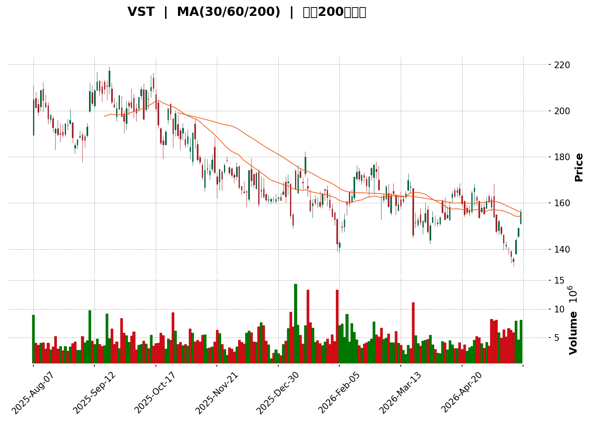
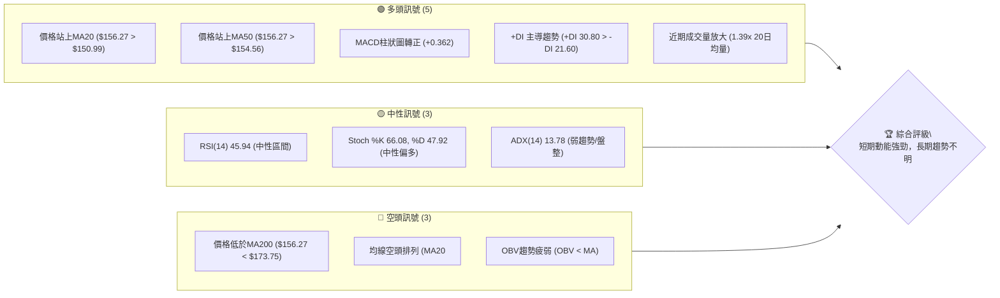

<details>
<summary>📊 靜態圖表 (點擊展開)</summary>

</details>

<html>
<head><meta charset="utf-8" /></head>
<body>
    <div>                        <script>window.PlotlyConfig = {MathJaxConfig: 'local'};</script>
        <script charset="utf-8" src="https://cdn.plot.ly/plotly-3.5.0.min.js" integrity="sha256-fHbNLP+GlIXN+efbQec78UkemUz3NJp7UmfGxC1tNxs=" crossorigin="anonymous"></script>                <div id="candlestick-chart" class="plotly-graph-div" style="height:500px; width:100%;"></div>            <script>                window.PLOTLYENV=window.PLOTLYENV || {};                                if (document.getElementById("candlestick-chart")) {                    Plotly.newPlot(                        "candlestick-chart",                        [{"close":{"dtype":"f8","bdata":"AAAAALeZaUAAAABgGStpQAAAAMAR6mhAAAAAwEQYakAAAABA1Y9pQAAAAIBuMmlAAAAAAGiSaEAAAADAXcZoQAAAAMDzGGhAAAAAwIEFaEAAAABAq7FnQAAAAEBot2dAAAAAAEurZ0AAAADg9EtoQAAAAEBhO2hAAAAAoFJ+aEAAAABAX4xnQAAAAAAtI2dAAAAAINBsZ0AAAADAIqBnQAAAAOD8aGdAAAAAgE5pZ0AAAACAPSFoQAAAAKAcDWpAAAAAoJ9oaUAAAABAuxxqQAAAACCBlmpAAAAA4B8UakAAAAAAbPBpQAAAAGBlK2pAAAAAQFlWakAAAACAPiprQAAAAGCwdWlAAAAAAB8waUAAAABgFCJpQAAAAGDJ1GlAAAAA4KSsaEAAAACgLmxoQAAAAMCRHmlAAAAA4PJCaUAAAABA4y1pQAAAAGB3+2hAAAAAYEHiaEAAAADgZ79pQAAAAICALWpAAAAA4C2KaEAAAABAJB9qQAAAAKA3nmlAAAAAgKBIakAAAAAgRDpqQAAAAMB2GWlAAAAAAJI2aEAAAADANUBnQAAAAOAwKmdAAAAAgPvaZ0AAAAAASx1pQAAAAGAL2GhAAAAAYBfCZ0AAAAAgR9poQAAAAGACpmdAAAAAYAN5Z0AAAACARhBoQAAAAKBRJ2dAAAAAIMybZ0AAAADAkwNnQAAAAOAsz2dAAAAAAGB4Z0AAAACgVlVmQAAAAODvOGZAAAAAwM5iZUAAAAAgscZlQAAAAKCV0GVAAAAAYBO+ZUAAAABAs1RmQAAAAID4qWVAAAAAgAcEZUAAAABgDdVlQAAAAMDUS2VAAAAAwAYKZkAAAADAw0tmQAAAAEAvpWVAAAAAgGaCZUAAAAAArmVlQAAAAAC78mVAAAAAALfWZEAAAADgNLVkQAAAAABni2RAAAAAAOSWZEAAAADg0cNlQAAAAIA3NGVAAAAA4C35ZEAAAAAAH59lQAAAAODy8GNAAAAAgM22ZEAAAABgmVJkQAAAAGAyK2RAAAAAgGQuZEAAAAAAqTdkQAAAAIBkLmRAAAAAINMzZEAAAABAwExkQAAAAACHI2RAAAAAQCigZEAAAABAqFZkQAAAAOCRKWVAAAAAAHZMY0AAAACgosxiQAAAAGCWxGRAAAAAgAmLZUAAAACg92VlQAAAAKCsF2VAAAAAwOd9ZkAAAAAA8MtkQAAAAIAVk2NAAAAAIKr5Y0AAAACAhwRkQAAAACDc\u002fGNAAAAAQP\u002fSY0AAAADAKIFkQAAAAGBCrWRAAAAAAHlLZEAAAAAgTMRjQAAAAGCYQWNAAAAAoFQZY0AAAABgbcphQAAAAOAA3GFAAAAAwEauYkAAAAAgXxhjQAAAACA+7GNAAAAAgNH9Y0AAAAAgF1xkQAAAAGA0aGVAAAAAQDCuZUAAAAAAzkplQAAAAAB7iGVAAAAAAFRlZUAAAAAASfJkQAAAAMBbbGVAAAAAIODjZUAAAABAiBJmQAAAAGDmtGVAAAAAwHG4ZEAAAADgWS9kQAAAACBmZGRAAAAAoIDlZEAAAABA4s1jQAAAAAC1bGRAAAAAIKKFZEAAAACgLt5jQAAAAICa62NAAAAAgHjXY0AAAABgnjhkQAAAAIBlg2RAAAAAgGw8ZUAAAABAi+RkQAAAAOCjQGJAAAAAoEfpYkAAAABAChdjQAAAAOBR8GJAAAAAoJkJY0AAAAAgXG9jQAAAAKBHcWJAAAAAYI\u002fKYkAAAABguD5jQAAAAIDC5WJAAAAAQOHyYkAAAACAwjVjQAAAAOB6fGNAAAAAAAAYY0AAAAAgXFdjQAAAAGBmxmNAAAAAQAp\u002fZEAAAACAFF5kQAAAAMD1sGRAAAAAYLhuZEAAAABAM\u002fNjQAAAAMAeXWNAAAAAoEd5Y0AAAABAM5tjQAAAAEAzi2RAAAAAYI\u002fSZEAAAAAA1yNkQAAAAKBHOWNAAAAAQOG6Y0AAAADA9WhjQAAAAEAzG2RAAAAAACkMZEAAAACgR8ljQAAAAGBmPmNAAAAAQAp3YkAAAACgmQFjQAAAAADXW2JAAAAAIIXTYUAAAADAzLxhQAAAAIDCdWFAAAAAAAAYYUAAAABguNZgQAAAAAAAAGJAAAAAYI+iYkAAAADgo4hjQA=="},"high":{"dtype":"f8","bdata":"9hRCuRReakAupSeLlwJqQGM5pal6rWlAxYUhFwUlakB99Vcj\u002fItqQL8iihZa42lAb5lylLF1aUCzYGhWZNRoQE9bY+FLuWhA7x\u002f83QIUaEBT5iB0r31oQFbq+PERWGhA\u002fm3Napw9aEBy\u002f3IE2lxoQBAzqPXaj2hAct4mmYITaUBKYfnOZl9oQNk3cvhIRWdACiaARoV6Z0D2eJMrAexnQNV\u002foWxs1mdAKBlaYG+6Z0BJszbaEVhoQCJBdj8agmpAmApXxNxiakAvJ7D8JS1qQIHsPsAgImtABR8ZEG6fakDf3sYXbp9qQEoxWUJ4tGpAUWI5BQuoakC09I+H4GZrQJYkceG8hWpAISpqT9KzaUDp\u002fX63U3ZpQMTVmc+43WlAgnZhlNHRaUACj4q4Vv5oQCrZtUC1i2lABBmJIfGNaUCCf1td4jNqQJ0\u002fXYtx62lAvSOIssNoaUBAf6QFUsFpQM3MD9+lT2pAwBvB\u002fiF5akByfuf65ytqQMJZyK7NCGpAxxCHExfuakDx+0+JExBrQL3qBfAYL2pAG9Uc9uWdaUCNUcfmZhxoQEtYqr1On2dAeHJyKHj1Z0BNzlrMNC5pQK6RZC4uY2lAAEg\u002f+bKYaEDikNiUrQVpQEcEThG6yGhAddJWHn0LaECj9Dfk4lRoQAXW5vXP3mdA9qnZ7j7+Z0DmAPhFLpNnQO7RDI+R0WdAWE5Nv0OIaEA6yPthhm1nQPiYX0yhmWZAEspWTQsvZkCIOYzhJHBmQBzDF5LTYGZA\u002fIBAuc8dZkCHsiAoA6BmQGeW7vWamGdAo+gd+HWmZUDRT6OF99ZlQJ0Teef3x2VAzD\u002fPs1coZkAn7LRtt4hmQFLLFnXQ\u002f2VAf8zlk+buZUCWL6Hj4qtlQCwHiHnqMWZAYsAeDpoEZkAmhNsJdetkQPU4aT4nLmVAibAHFQSyZEBee931Es1lQNlLZAElcGZAvk6RwsKQZUAClQZNcK5lQB+PYmkN1WVADpV51ktuZUBu7URnBV5lQND88MvBgmRAfju8mENvZEDmWn8GoktkQJFmeQjlWGRAUYub6T1\u002fZEAjDP7Wz1pkQIR+yD\u002fUiGRASAfhrZQhZUAQqKwhem1lQHTW7eD+i2VA18+\u002ftXINZUC35XH4znJjQNaSChgQ0GVAGVPD0\u002fkPZkAnF71mwOZlQNZQaTZMXmVApqueMPbJZkD1RJ1OYVxlQPQyhnDDuGRA+8ucgEw4ZECPOxxV32hkQP9bpG+9VGRAsS19traiZEDZfoDbqYxkQBeNqbuoymRAG4NAetf0ZEBnE1I+1IhkQANilMpi+GNAQUFBkS2JY0Buuu7tay5jQNv1N8DY9mFACIbAv64BY0DkXwtEK3JjQIhFYzBnJmRAO\u002flFqraiZEABFzOLeb9kQI2JVxqjbWVA50HoWhkNZkD4W6l7WehlQGiUALi3imVAKjSZ0G+oZUDN8QqKY3NlQDqMl5RGbmVAcw75Bmn2ZUCtRbdMoh9mQMEv+awlQmZAB19o\u002ffEIZkCTavfT1GlkQPZSsuOPf2RA3jCQw7f3ZEDE0kfq0QRlQC\u002fvcLr7jGRA+qZ8AuwRZUBi6qgZiHhkQGrTCRpJX2RAqIvEDXqgZEAVRiVm32hkQCqXtOOBp2RAGGQcXHWYZUCGNkmdzitlQAAAAEAKz2RAAAAAwMx8Y0AAAABAM0NjQAAAAGBmvmNAAAAAoHAVY0AAAABgZgZkQAAAAIDC3WNAAAAAQArvYkAAAABA4YpjQAAAAIDrUWNAAAAAIFwjY0AAAADAHkVjQAAAAIDrKWRAAAAAwPVQZEAAAAAAKdRjQAAAAEAKF2RAAAAAwPWoZEAAAADgo9BkQAAAAKBw3WRAAAAAIK4PZUAAAACgmYFkQAAAAEAzI2RAAAAAYI\u002fiY0AAAAAA19tjQAAAACBcr2RAAAAAoHANZUAAAABgZmpkQAAAAMByJGRAAAAAACn0Y0AAAADgegRkQAAAAAApTGRAAAAAoJl5ZEAAAAAgrl9kQAAAAOB6DGVAAAAAAABgY0AAAAAAABhjQAAAAABWymJAAAAAwPVIYkAAAACgcOlhQAAAAEDhomFAAAAAoEdxYUAAAABgZhZhQAAAAMDMHGJAAAAAwPWoYkAAAACAPbJjQA=="},"hovertemplate":"\u003cb\u003e%{x|%Y-%m-%d}\u003c\u002fb\u003e\u003cbr\u003e\u958b: $%{open:.2f}\u003cbr\u003e\u9ad8: $%{high:.2f}\u003cbr\u003e\u4f4e: $%{low:.2f}\u003cbr\u003e\u6536: $%{close:.2f}\u003cextra\u003e\u003c\u002fextra\u003e","low":{"dtype":"f8","bdata":"aC3oRL6oZ0ATe2dZZB1pQFCdc27CvWhA8HRglyP3aEAx6\u002foss\u002fBoQCW+asGEMGlAxY3\u002fFhNCaEB0yaywsVFoQLNmyKJQz2dAdTgcJ7LkZkAomhxGvqhnQJ+hksiSTWdA4jExsW2SZ0Cy\u002f8TtBZRnQLDiLXNs8WdAslqybQQ8aEBLBlDF6D5nQGKRsVGXrGZASezv0lD0ZkDvOHvEXIJnQH0HMULrN2ZApFdQSuz8ZkDqxk5Uj49nQBg3NNqE52hAHDDCBFdKaUAEoQC5lydpQOubpFO7HGpAEvZf7qvQaUCUO60vY3xpQHqP8l0i6GlAHRD0V9CTaUDJlQ21S+dpQH9o6TbMXGlA8n\u002fbyA4qaUAO9hTCDW9oQKD\u002fy\u002fanDWlAziSHKfykaEDg9AwWmsVnQCn60B6D9GdAzPBXWTfFaEC1NbQsQB5pQCoEgFNenGhA5V5XehBraEDvjxh3b\u002fJoQADAEhKimGlA9G17c4qJaECWcGy1JftoQDOoNS4PG2lAE7h5WZ66aUBrpUZygQNqQCafwHD672hAH2BwMNcIaECcdkXM5CFnQJgSPJz5ZGZA7crJglwmZ0AzXf7rDkJoQEy2++OwfmhA7YgWYsr+ZkDa4bifWZ5nQNvNUAKsgGdA72SHanngZkC7sG1ghmpnQHRCaXa\u002f\u002f2ZAP4\u002fCUngNZ0BHxQRIJWFmQEt4u9mkA2ZA9hAc6OX0ZkCtd4xEK0pmQJBobLmpGWZA1PnIk55BZUDws8Bv+aNkQN1nPAWXlGVAweohShZGZUD1xUqSsbdlQBAiI8LolGVAEkYcb8U\u002fZECfv\u002fWdL65kQAT1LolYrmRAF2ceRnmTZUCr1QOrozBmQGjfM0zehmVAWBr4uJVcZUCszbaChA9lQHo3+iIOQGVAKzXhaGDAZEDj\u002f1TUd3NkQNG\u002f1m3ZiGRAprcZJ9PGY0B4MU73IhJkQLGNS+E+4WRAx1Wmo6bQZEDLIBPZ7cJkQKjUlaNryGNAtR\u002fBbBxHZECaSQ9xEUhkQI3YBCkwFGRAXfhsDy79Y0C1ZWjwrPFjQDMY7to1BGRAYXXooZj2Y0BKt6Eo5hpkQNJoQRoDIGRAVx0g9FV1ZEDPL9XTGP9jQEDF0wrScWRAl11DNJYqY0CHWieck59iQPeJ1dfttGRAXKisWmh7ZECriRsyy1JlQBWO9pVcumRAQWxzm0ZuZUA2bnywNllkQJkZ5D8wgWNAZ4JE3+8xY0D5fvSg3N1jQNsZhsgcuWNADPS9p+q1Y0DLrt7P571jQFwE4D4YHmRAAYbBTz3RY0BwLr2grpRjQAafEtE+OmNAVZV\u002f+vzFYkAe+vukkWJhQLH8U8rrSmFA13emggNnYkCxLHSLhHJiQC4cx9QrU2NAZnMMO7DKY0Duk4bBzgVkQDtB4Lv1KGRAon5YwP02ZUDQy5xWICxlQLYDc22qAGVAg+prCKIYZUCox2ynhJ9kQJ8qbEkPVWRAqQ6cTCU7ZUDsZNq2XXxkQP8zYtoHVWVAiR4byVSzZEAugLPvsBhjQIIDK8jOBWRAX5dMNbYuZECnA+QHs8JjQHcm\u002fjI+WWNAuCtn75iCZEAx08lfCV5jQMVO4qORj2NA0yJ73XuwY0Ce0OxaivxjQOJzvMnFPGRAWX3eDsmoZEAxYWBqM4BkQAAAAGCPGmJAAAAAYLiqYkAAAACgmbFiQAAAAAApzGJAAAAAIK5PYkAAAAAAAPhiQAAAAEAzU2JAAAAAQOHKYUAAAADAzOxiQAAAAADXw2JAAAAAACm8YkAAAADA9chiQAAAAKBHaWNAAAAAgMIVY0AAAAAghSNjQAAAAMDMFGNAAAAAQAoLZEAAAADAzERkQAAAACCFU2RAAAAA4FFIZEAAAACAPcpjQAAAAAApRGNAAAAAoHBdY0AAAAAAAFBjQAAAAMDMZGNAAAAAIIXXY0AAAABACtdjQAAAAGCPImNAAAAAIFx3Y0AAAACAwl1jQAAAAIAUrmNAAAAAoJn5Y0AAAABAM5NjQAAAAOCjOGNAAAAAIFxfYkAAAABg5UhiQAAAAMAeNWJAAAAA4FFwYUAAAAAAgX1hQAAAAIDrOWFAAAAAIIW7YEAAAADAHpVgQAAAAIDrOWFAAAAAACkcYkAAAAAAANhiQA=="},"name":"\u50f9\u683c","open":{"dtype":"f8","bdata":"lrdCEHCvZ0Da9yV4SqppQMCj1lJHWmlAJA4MC4g3aUBwttAkWixqQB1L\u002fzBVa2lAYIFY9CZHaUALuT3L4odoQByXVMmMlmhAeWAC2p7IZ0AFJoZEYAhoQBvcNHEVzWdAz7jef9XZZ0A7bNmVFrdnQJjwKEZ0MmhA95nxoIFOaEDDGNzyqVloQHR\u002fn5sC+2ZAwjp7jjspZ0DShwiA3YhnQLmCmF62sGdA9rBtXaybZ0BDvwIzvqhnQMyXwW4Y+GhAJ4KOiGf\u002faUA0ztPMwkRpQOubpFO7HGpABR8ZEG6fakD93aaWk09qQEMvdmvPj2pA0ysXniJbakAjYwDsaU1qQOuArQADMWpAMAmWUGpWaUCIvPABj65oQL+lwUCtFGlApmwJ0jQuaUD17ebCiNRoQMVxg63STmhAot6aZ05vaUBF9i8oM3lpQEQOc7X1smlAce575nsgaUDVfh2zzSBpQGZmZibEzWlArpL1udclakC7Fvu4HxJpQJmInw8np2lA46qHQM0XakByldkAXMZqQBsnfZsl42lA9fvX2i1yaUCqCCB0KwtoQLqaslYUYWdA7crJglwmZ0CPvyLS4YFoQK6RZC4uY2lAAEg\u002f+bKYaED5HGQuqfhnQNtKAG2cRGhA4vo6UBbvZ0B8IYmpHMlnQK\u002fk+4ehcmdAOF\u002fqtOk3Z0CNyhWjXsxmQOesQcFGQGZAnfz\u002f2HBIaEDI4EEPEC1nQPwpA+ysemZAO9foWokNZkC4Dg57CNdkQBbfqG1O3mVAaetMMOmFZUDpYNLfsNVlQMAiU6P1CWdAVK1+WtlwZUAYHTWbTSNlQI110M85s2VAHc7\u002fQ6ywZUBai8t3O1BmQEGGV87Q8GVAyx8OW1ndZUA\u002f9Vk56YVlQA+hY0mobWVANy4faRcBZkAmhNsJdetkQCVON99FnWRA4aWfylCcZEBrvlJDUzNkQO7xz5731mVAfThyCXyPZUArDNa3HsZkQAQwxeT9sGVA2vIWIIemZEDFDo49t8dkQN0DmMHZeGRA2e6mfTIrZEA8eBqTqRhkQAAAAIBkLmRABdHSP\u002fsYZECj2DYr8DhkQOM3URdhVWRAVx0g9FV1ZEAV4anhdCRlQNIXHwqiGGVA18+\u002ftXINZUBzFrd7O2FjQOFpXev1wmVAtX4uBUOOZEChQTg1arhlQBMRIpAYJWVArVVaYHWYZUDj0+fFS+pkQMSk7xmcIWRA1WtwZWPZY0BEspNaszZkQPEWz3YG+WNA+HbQIuELZEBPBHDCXeljQIYohHvDuGRAKFyOR3y3ZECMiOe49ShkQMEaJGvtrWNAzs3Yzgh9Y0AcBrDsZh9jQIkyy3namWFAUlEaGHa5YkDy\u002fxIFdrliQOUne7LOBWRAZn\u002fpn86YZEB0rsJyWhBkQOQevHC4RWRAMDlg\u002f7VUZUDGHWn8u7hlQGGuIae2NWVAaynP1BaCZUB2B1iOCk1lQGzbAe+q4WRAVOmmQaWEZUAwTonODGRlQIjR9Bxf2GVAcCWzBPs+ZUAsgo0cCC9kQPqHjwDWK2RABu3jeRo1ZEB42\u002fAlO4dkQOO4vucAdmNAi85qyU+kZECoMc+TEWxkQOiRP2a2m2NAUBz7o0QxZEB4i1BM+xhkQGtpepbSUmRA19GkRMawZEATW1obJ95kQAAAAEAKz2RAAAAAYGbuYkAAAACgmdFiQAAAAAAAYGNAAAAAAACwYkAAAAAAAPhiQAAAAEAzo2NAAAAAwMz8YUAAAABACu9iQAAAAGC45mJAAAAAoEfhYkAAAACAPeJiQAAAAAAAGGRAAAAA4Hp8Y0AAAAAAADBjQAAAAMDMFGNAAAAAwB5NZEAAAAAAALBkQAAAAIA9kmRAAAAA4FHIZEAAAACgmWFkQAAAAOBRGGRAAAAAoJm5Y0AAAABguH5jQAAAAGCPimNAAAAAAACgZEAAAAAAAFBkQAAAACCFG2RAAAAAoEeJY0AAAACA68ljQAAAAIAUtmNAAAAAAABgZEAAAAAA1y9kQAAAAKBHYWRAAAAAAABgY0AAAAAAAIBiQAAAACCur2JAAAAAwPVIYkAAAAAAKaxhQAAAAMDMeGFAAAAAAABgYUAAAACgmflgQAAAAAAAQGFAAAAAQAovYkAAAADA9eBiQA=="},"x":["2025-08-07T00:00:00-04:00","2025-08-08T00:00:00-04:00","2025-08-11T00:00:00-04:00","2025-08-12T00:00:00-04:00","2025-08-13T00:00:00-04:00","2025-08-14T00:00:00-04:00","2025-08-15T00:00:00-04:00","2025-08-18T00:00:00-04:00","2025-08-19T00:00:00-04:00","2025-08-20T00:00:00-04:00","2025-08-21T00:00:00-04:00","2025-08-22T00:00:00-04:00","2025-08-25T00:00:00-04:00","2025-08-26T00:00:00-04:00","2025-08-27T00:00:00-04:00","2025-08-28T00:00:00-04:00","2025-08-29T00:00:00-04:00","2025-09-02T00:00:00-04:00","2025-09-03T00:00:00-04:00","2025-09-04T00:00:00-04:00","2025-09-05T00:00:00-04:00","2025-09-08T00:00:00-04:00","2025-09-09T00:00:00-04:00","2025-09-10T00:00:00-04:00","2025-09-11T00:00:00-04:00","2025-09-12T00:00:00-04:00","2025-09-15T00:00:00-04:00","2025-09-16T00:00:00-04:00","2025-09-17T00:00:00-04:00","2025-09-18T00:00:00-04:00","2025-09-19T00:00:00-04:00","2025-09-22T00:00:00-04:00","2025-09-23T00:00:00-04:00","2025-09-24T00:00:00-04:00","2025-09-25T00:00:00-04:00","2025-09-26T00:00:00-04:00","2025-09-29T00:00:00-04:00","2025-09-30T00:00:00-04:00","2025-10-01T00:00:00-04:00","2025-10-02T00:00:00-04:00","2025-10-03T00:00:00-04:00","2025-10-06T00:00:00-04:00","2025-10-07T00:00:00-04:00","2025-10-08T00:00:00-04:00","2025-10-09T00:00:00-04:00","2025-10-10T00:00:00-04:00","2025-10-13T00:00:00-04:00","2025-10-14T00:00:00-04:00","2025-10-15T00:00:00-04:00","2025-10-16T00:00:00-04:00","2025-10-17T00:00:00-04:00","2025-10-20T00:00:00-04:00","2025-10-21T00:00:00-04:00","2025-10-22T00:00:00-04:00","2025-10-23T00:00:00-04:00","2025-10-24T00:00:00-04:00","2025-10-27T00:00:00-04:00","2025-10-28T00:00:00-04:00","2025-10-29T00:00:00-04:00","2025-10-30T00:00:00-04:00","2025-10-31T00:00:00-04:00","2025-11-03T00:00:00-05:00","2025-11-04T00:00:00-05:00","2025-11-05T00:00:00-05:00","2025-11-06T00:00:00-05:00","2025-11-07T00:00:00-05:00","2025-11-10T00:00:00-05:00","2025-11-11T00:00:00-05:00","2025-11-12T00:00:00-05:00","2025-11-13T00:00:00-05:00","2025-11-14T00:00:00-05:00","2025-11-17T00:00:00-05:00","2025-11-18T00:00:00-05:00","2025-11-19T00:00:00-05:00","2025-11-20T00:00:00-05:00","2025-11-21T00:00:00-05:00","2025-11-24T00:00:00-05:00","2025-11-25T00:00:00-05:00","2025-11-26T00:00:00-05:00","2025-11-28T00:00:00-05:00","2025-12-01T00:00:00-05:00","2025-12-02T00:00:00-05:00","2025-12-03T00:00:00-05:00","2025-12-04T00:00:00-05:00","2025-12-05T00:00:00-05:00","2025-12-08T00:00:00-05:00","2025-12-09T00:00:00-05:00","2025-12-10T00:00:00-05:00","2025-12-11T00:00:00-05:00","2025-12-12T00:00:00-05:00","2025-12-15T00:00:00-05:00","2025-12-16T00:00:00-05:00","2025-12-17T00:00:00-05:00","2025-12-18T00:00:00-05:00","2025-12-19T00:00:00-05:00","2025-12-22T00:00:00-05:00","2025-12-23T00:00:00-05:00","2025-12-24T00:00:00-05:00","2025-12-26T00:00:00-05:00","2025-12-29T00:00:00-05:00","2025-12-30T00:00:00-05:00","2025-12-31T00:00:00-05:00","2026-01-02T00:00:00-05:00","2026-01-05T00:00:00-05:00","2026-01-06T00:00:00-05:00","2026-01-07T00:00:00-05:00","2026-01-08T00:00:00-05:00","2026-01-09T00:00:00-05:00","2026-01-12T00:00:00-05:00","2026-01-13T00:00:00-05:00","2026-01-14T00:00:00-05:00","2026-01-15T00:00:00-05:00","2026-01-16T00:00:00-05:00","2026-01-20T00:00:00-05:00","2026-01-21T00:00:00-05:00","2026-01-22T00:00:00-05:00","2026-01-23T00:00:00-05:00","2026-01-26T00:00:00-05:00","2026-01-27T00:00:00-05:00","2026-01-28T00:00:00-05:00","2026-01-29T00:00:00-05:00","2026-01-30T00:00:00-05:00","2026-02-02T00:00:00-05:00","2026-02-03T00:00:00-05:00","2026-02-04T00:00:00-05:00","2026-02-05T00:00:00-05:00","2026-02-06T00:00:00-05:00","2026-02-09T00:00:00-05:00","2026-02-10T00:00:00-05:00","2026-02-11T00:00:00-05:00","2026-02-12T00:00:00-05:00","2026-02-13T00:00:00-05:00","2026-02-17T00:00:00-05:00","2026-02-18T00:00:00-05:00","2026-02-19T00:00:00-05:00","2026-02-20T00:00:00-05:00","2026-02-23T00:00:00-05:00","2026-02-24T00:00:00-05:00","2026-02-25T00:00:00-05:00","2026-02-26T00:00:00-05:00","2026-02-27T00:00:00-05:00","2026-03-02T00:00:00-05:00","2026-03-03T00:00:00-05:00","2026-03-04T00:00:00-05:00","2026-03-05T00:00:00-05:00","2026-03-06T00:00:00-05:00","2026-03-09T00:00:00-04:00","2026-03-10T00:00:00-04:00","2026-03-11T00:00:00-04:00","2026-03-12T00:00:00-04:00","2026-03-13T00:00:00-04:00","2026-03-16T00:00:00-04:00","2026-03-17T00:00:00-04:00","2026-03-18T00:00:00-04:00","2026-03-19T00:00:00-04:00","2026-03-20T00:00:00-04:00","2026-03-23T00:00:00-04:00","2026-03-24T00:00:00-04:00","2026-03-25T00:00:00-04:00","2026-03-26T00:00:00-04:00","2026-03-27T00:00:00-04:00","2026-03-30T00:00:00-04:00","2026-03-31T00:00:00-04:00","2026-04-01T00:00:00-04:00","2026-04-02T00:00:00-04:00","2026-04-06T00:00:00-04:00","2026-04-07T00:00:00-04:00","2026-04-08T00:00:00-04:00","2026-04-09T00:00:00-04:00","2026-04-10T00:00:00-04:00","2026-04-13T00:00:00-04:00","2026-04-14T00:00:00-04:00","2026-04-15T00:00:00-04:00","2026-04-16T00:00:00-04:00","2026-04-17T00:00:00-04:00","2026-04-20T00:00:00-04:00","2026-04-21T00:00:00-04:00","2026-04-22T00:00:00-04:00","2026-04-23T00:00:00-04:00","2026-04-24T00:00:00-04:00","2026-04-27T00:00:00-04:00","2026-04-28T00:00:00-04:00","2026-04-29T00:00:00-04:00","2026-04-30T00:00:00-04:00","2026-05-01T00:00:00-04:00","2026-05-04T00:00:00-04:00","2026-05-05T00:00:00-04:00","2026-05-06T00:00:00-04:00","2026-05-07T00:00:00-04:00","2026-05-08T00:00:00-04:00","2026-05-11T00:00:00-04:00","2026-05-12T00:00:00-04:00","2026-05-13T00:00:00-04:00","2026-05-14T00:00:00-04:00","2026-05-15T00:00:00-04:00","2026-05-18T00:00:00-04:00","2026-05-19T00:00:00-04:00","2026-05-20T00:00:00-04:00","2026-05-21T00:00:00-04:00","2026-05-22T00:00:00-04:00"],"type":"candlestick"},{"hovertemplate":"MA30: $%{y:.2f}\u003cextra\u003e\u003c\u002fextra\u003e","line":{"color":"#2196F3","dash":"dash","width":2},"mode":"lines","name":"MA30","x":["2025-08-07T00:00:00-04:00","2025-08-08T00:00:00-04:00","2025-08-11T00:00:00-04:00","2025-08-12T00:00:00-04:00","2025-08-13T00:00:00-04:00","2025-08-14T00:00:00-04:00","2025-08-15T00:00:00-04:00","2025-08-18T00:00:00-04:00","2025-08-19T00:00:00-04:00","2025-08-20T00:00:00-04:00","2025-08-21T00:00:00-04:00","2025-08-22T00:00:00-04:00","2025-08-25T00:00:00-04:00","2025-08-26T00:00:00-04:00","2025-08-27T00:00:00-04:00","2025-08-28T00:00:00-04:00","2025-08-29T00:00:00-04:00","2025-09-02T00:00:00-04:00","2025-09-03T00:00:00-04:00","2025-09-04T00:00:00-04:00","2025-09-05T00:00:00-04:00","2025-09-08T00:00:00-04:00","2025-09-09T00:00:00-04:00","2025-09-10T00:00:00-04:00","2025-09-11T00:00:00-04:00","2025-09-12T00:00:00-04:00","2025-09-15T00:00:00-04:00","2025-09-16T00:00:00-04:00","2025-09-17T00:00:00-04:00","2025-09-18T00:00:00-04:00","2025-09-19T00:00:00-04:00","2025-09-22T00:00:00-04:00","2025-09-23T00:00:00-04:00","2025-09-24T00:00:00-04:00","2025-09-25T00:00:00-04:00","2025-09-26T00:00:00-04:00","2025-09-29T00:00:00-04:00","2025-09-30T00:00:00-04:00","2025-10-01T00:00:00-04:00","2025-10-02T00:00:00-04:00","2025-10-03T00:00:00-04:00","2025-10-06T00:00:00-04:00","2025-10-07T00:00:00-04:00","2025-10-08T00:00:00-04:00","2025-10-09T00:00:00-04:00","2025-10-10T00:00:00-04:00","2025-10-13T00:00:00-04:00","2025-10-14T00:00:00-04:00","2025-10-15T00:00:00-04:00","2025-10-16T00:00:00-04:00","2025-10-17T00:00:00-04:00","2025-10-20T00:00:00-04:00","2025-10-21T00:00:00-04:00","2025-10-22T00:00:00-04:00","2025-10-23T00:00:00-04:00","2025-10-24T00:00:00-04:00","2025-10-27T00:00:00-04:00","2025-10-28T00:00:00-04:00","2025-10-29T00:00:00-04:00","2025-10-30T00:00:00-04:00","2025-10-31T00:00:00-04:00","2025-11-03T00:00:00-05:00","2025-11-04T00:00:00-05:00","2025-11-05T00:00:00-05:00","2025-11-06T00:00:00-05:00","2025-11-07T00:00:00-05:00","2025-11-10T00:00:00-05:00","2025-11-11T00:00:00-05:00","2025-11-12T00:00:00-05:00","2025-11-13T00:00:00-05:00","2025-11-14T00:00:00-05:00","2025-11-17T00:00:00-05:00","2025-11-18T00:00:00-05:00","2025-11-19T00:00:00-05:00","2025-11-20T00:00:00-05:00","2025-11-21T00:00:00-05:00","2025-11-24T00:00:00-05:00","2025-11-25T00:00:00-05:00","2025-11-26T00:00:00-05:00","2025-11-28T00:00:00-05:00","2025-12-01T00:00:00-05:00","2025-12-02T00:00:00-05:00","2025-12-03T00:00:00-05:00","2025-12-04T00:00:00-05:00","2025-12-05T00:00:00-05:00","2025-12-08T00:00:00-05:00","2025-12-09T00:00:00-05:00","2025-12-10T00:00:00-05:00","2025-12-11T00:00:00-05:00","2025-12-12T00:00:00-05:00","2025-12-15T00:00:00-05:00","2025-12-16T00:00:00-05:00","2025-12-17T00:00:00-05:00","2025-12-18T00:00:00-05:00","2025-12-19T00:00:00-05:00","2025-12-22T00:00:00-05:00","2025-12-23T00:00:00-05:00","2025-12-24T00:00:00-05:00","2025-12-26T00:00:00-05:00","2025-12-29T00:00:00-05:00","2025-12-30T00:00:00-05:00","2025-12-31T00:00:00-05:00","2026-01-02T00:00:00-05:00","2026-01-05T00:00:00-05:00","2026-01-06T00:00:00-05:00","2026-01-07T00:00:00-05:00","2026-01-08T00:00:00-05:00","2026-01-09T00:00:00-05:00","2026-01-12T00:00:00-05:00","2026-01-13T00:00:00-05:00","2026-01-14T00:00:00-05:00","2026-01-15T00:00:00-05:00","2026-01-16T00:00:00-05:00","2026-01-20T00:00:00-05:00","2026-01-21T00:00:00-05:00","2026-01-22T00:00:00-05:00","2026-01-23T00:00:00-05:00","2026-01-26T00:00:00-05:00","2026-01-27T00:00:00-05:00","2026-01-28T00:00:00-05:00","2026-01-29T00:00:00-05:00","2026-01-30T00:00:00-05:00","2026-02-02T00:00:00-05:00","2026-02-03T00:00:00-05:00","2026-02-04T00:00:00-05:00","2026-02-05T00:00:00-05:00","2026-02-06T00:00:00-05:00","2026-02-09T00:00:00-05:00","2026-02-10T00:00:00-05:00","2026-02-11T00:00:00-05:00","2026-02-12T00:00:00-05:00","2026-02-13T00:00:00-05:00","2026-02-17T00:00:00-05:00","2026-02-18T00:00:00-05:00","2026-02-19T00:00:00-05:00","2026-02-20T00:00:00-05:00","2026-02-23T00:00:00-05:00","2026-02-24T00:00:00-05:00","2026-02-25T00:00:00-05:00","2026-02-26T00:00:00-05:00","2026-02-27T00:00:00-05:00","2026-03-02T00:00:00-05:00","2026-03-03T00:00:00-05:00","2026-03-04T00:00:00-05:00","2026-03-05T00:00:00-05:00","2026-03-06T00:00:00-05:00","2026-03-09T00:00:00-04:00","2026-03-10T00:00:00-04:00","2026-03-11T00:00:00-04:00","2026-03-12T00:00:00-04:00","2026-03-13T00:00:00-04:00","2026-03-16T00:00:00-04:00","2026-03-17T00:00:00-04:00","2026-03-18T00:00:00-04:00","2026-03-19T00:00:00-04:00","2026-03-20T00:00:00-04:00","2026-03-23T00:00:00-04:00","2026-03-24T00:00:00-04:00","2026-03-25T00:00:00-04:00","2026-03-26T00:00:00-04:00","2026-03-27T00:00:00-04:00","2026-03-30T00:00:00-04:00","2026-03-31T00:00:00-04:00","2026-04-01T00:00:00-04:00","2026-04-02T00:00:00-04:00","2026-04-06T00:00:00-04:00","2026-04-07T00:00:00-04:00","2026-04-08T00:00:00-04:00","2026-04-09T00:00:00-04:00","2026-04-10T00:00:00-04:00","2026-04-13T00:00:00-04:00","2026-04-14T00:00:00-04:00","2026-04-15T00:00:00-04:00","2026-04-16T00:00:00-04:00","2026-04-17T00:00:00-04:00","2026-04-20T00:00:00-04:00","2026-04-21T00:00:00-04:00","2026-04-22T00:00:00-04:00","2026-04-23T00:00:00-04:00","2026-04-24T00:00:00-04:00","2026-04-27T00:00:00-04:00","2026-04-28T00:00:00-04:00","2026-04-29T00:00:00-04:00","2026-04-30T00:00:00-04:00","2026-05-01T00:00:00-04:00","2026-05-04T00:00:00-04:00","2026-05-05T00:00:00-04:00","2026-05-06T00:00:00-04:00","2026-05-07T00:00:00-04:00","2026-05-08T00:00:00-04:00","2026-05-11T00:00:00-04:00","2026-05-12T00:00:00-04:00","2026-05-13T00:00:00-04:00","2026-05-14T00:00:00-04:00","2026-05-15T00:00:00-04:00","2026-05-18T00:00:00-04:00","2026-05-19T00:00:00-04:00","2026-05-20T00:00:00-04:00","2026-05-21T00:00:00-04:00","2026-05-22T00:00:00-04:00"],"y":{"dtype":"f8","bdata":"AAAAAAAA+H8AAAAAAAD4fwAAAAAAAPh\u002fAAAAAAAA+H8AAAAAAAD4fwAAAAAAAPh\u002fAAAAAAAA+H8AAAAAAAD4fwAAAAAAAPh\u002fAAAAAAAA+H8AAAAAAAD4fwAAAAAAAPh\u002fAAAAAAAA+H8AAAAAAAD4fwAAAAAAAPh\u002fAAAAAAAA+H8AAAAAAAD4fwAAAAAAAPh\u002fAAAAAAAA+H8AAAAAAAD4fwAAAAAAAPh\u002fAAAAAAAA+H8AAAAAAAD4fwAAAAAAAPh\u002fAAAAAAAA+H8AAAAAAAD4fwAAAAAAAPh\u002fAAAAAAAA+H8AAAAAAAD4f6uqqipjtGhAd3d316y6aEDNzMyctstoQImIiAhe0GhAq6qqCqHIaECrqqp6+MRoQImIiOhhymhA3t3dzUHLaEC8u7s7QMhoQDMzM7P40GhAmpmZiY3baEAiIiISOuhoQAAAAGAH82hAvLu762T9aEDv7u6exglpQDMzM0NhGmlAAAAAcMYaaUAAAADwuzBpQFVVVfXmRWlAVVVVxUteaUBVVVUVgHRpQLy7u4vqgmlAERERIcKJaUDv7u7eQYJpQJqZmWmgaWlAVVVVNV9caUB3d3d321NpQM3MzKz5RGlAd3d3lywxaUCJiIgY5ydpQLy7u8tjEmlAAAAAAPL5aEDNzMzMet9oQJqZmfnMy2hA7+7uvlK+aEBERERkPaxoQBEREXH8mmhAERER4bWQaEARERHh4X5oQImIiEgpZmhAMzMzAxdFaEDv7u7ODChoQImIiEgFDWhAMzMz8zbyZ0C8u7vLDtVnQDMzM0OKrmdAq6qq6neQZ0De3d2N3WtnQERERGT8RmdAEREREcQiZ0ARERFBNwFnQHd3d2e942ZAMzMz46rMZkAAAACQ2bxmQERERMR3smZAAAAAwLmYZkCamZlpH3NmQERERERvTmZAVVVVBWUzZkB3d3fHCxlmQO\u002fu7q4vBGZARERExNvuZUDe3d0dBdplQO\u002fu7o6bvmVAd3d3Z+ilZUAAAAAg8Y5lQN7d3T3gb2VAMzMzU89TZUAREREBwUFlQFVVVfVVMGVAERERgTwmZUCJiIhooxllQO\u002fu7h5WC2VAiYiISM4BZUCrqqrqzfBkQKuqqjqG7GRA7+7uPt\u002fdZEAiIiLS\u002fcNkQN7d3b17v2RAmpmZGUC7ZECamZkpl7NkQLy7u5vfrmRAiYiIyEG3ZECamZnZIbJkQJqZmZngnWRA3t3dTYKWZECJiIionpBkQLy7u0vei2RAvLu7q1aFZEDNzMxMlXpkQJqZmakVdmRA3t3dXUtwZECamZmJd2BkQAAAADCfWmRARERE5NZMZEAzMzPTOzdkQJqZmfmGI2RA7+7uLrkWZEB3d3enJQ1kQM3MzCzxCmRAIiIiUiQJZEB3d3c3pwlkQLy7u8t5FGRAAAAAEHodZEBERER0nSVkQLy7u1vHKGRAAAAAoKw6ZECJiIj4\u002fkxkQN7d3Z2WUmRAREREtIxVZEAiIiJCTVtkQKuqquqKYGRAIiIiYm1RZEDe3d0tNUxkQFVVVVUvU2RAERER0QtbZEAiIiKCOVlkQAAAAPDzXGRAzczMTOhiZEAAAACQeV1kQImIiAgFV2RAZmZmJidTZEAiIiLCB1dkQLy7u8vBYWRAMzMzU\u002f5zZECamZnJdo5kQN7d3Y3RkWRAzczMDMmTZEAAAACwvZNkQCIiIvJXi2RAMzMz8zODZECamZnZT3tkQBEREbEDYmRAIiIiMlxJZEAiIiIC5DdkQERERGRmIWRAMzMzs4QMZECrqqpqs\u002f1jQLy7u+sr7WNA3t3dHU\u002fVY0CJiIjYAL5jQM3MzByFrWNAMzMzQ5urY0BEREQEKq1jQGZmZla3r2NAq6qqusGrY0CamZkpAK1jQO\u002fu7p7yo2NAvLu7qwCbY0B3d3cXxZhjQLy7u\u002fsWnmNAzczMnHWmY0DNzMxMxKVjQN7d3U3DmmNAREREVOmNY0BmZmY2QoFjQKuqqsoTkWNAiYiI+MWaY0AzMzPztqBjQLy7uztRo2NAZmZmlm6eY0CJiIj4xZpjQERERAQPmmNAERER8dKRY0ARERHB9YRjQM3MzHyxeGNA3t3dLd1oY0C8u7sboVRjQImIiFjyR2NAERERMQhEY0B3d3e3rEVjQA=="},"type":"scatter"},{"hovertemplate":"MA60: $%{y:.2f}\u003cextra\u003e\u003c\u002fextra\u003e","line":{"color":"#9C27B0","dash":"dash","width":2},"mode":"lines","name":"MA60","x":["2025-08-07T00:00:00-04:00","2025-08-08T00:00:00-04:00","2025-08-11T00:00:00-04:00","2025-08-12T00:00:00-04:00","2025-08-13T00:00:00-04:00","2025-08-14T00:00:00-04:00","2025-08-15T00:00:00-04:00","2025-08-18T00:00:00-04:00","2025-08-19T00:00:00-04:00","2025-08-20T00:00:00-04:00","2025-08-21T00:00:00-04:00","2025-08-22T00:00:00-04:00","2025-08-25T00:00:00-04:00","2025-08-26T00:00:00-04:00","2025-08-27T00:00:00-04:00","2025-08-28T00:00:00-04:00","2025-08-29T00:00:00-04:00","2025-09-02T00:00:00-04:00","2025-09-03T00:00:00-04:00","2025-09-04T00:00:00-04:00","2025-09-05T00:00:00-04:00","2025-09-08T00:00:00-04:00","2025-09-09T00:00:00-04:00","2025-09-10T00:00:00-04:00","2025-09-11T00:00:00-04:00","2025-09-12T00:00:00-04:00","2025-09-15T00:00:00-04:00","2025-09-16T00:00:00-04:00","2025-09-17T00:00:00-04:00","2025-09-18T00:00:00-04:00","2025-09-19T00:00:00-04:00","2025-09-22T00:00:00-04:00","2025-09-23T00:00:00-04:00","2025-09-24T00:00:00-04:00","2025-09-25T00:00:00-04:00","2025-09-26T00:00:00-04:00","2025-09-29T00:00:00-04:00","2025-09-30T00:00:00-04:00","2025-10-01T00:00:00-04:00","2025-10-02T00:00:00-04:00","2025-10-03T00:00:00-04:00","2025-10-06T00:00:00-04:00","2025-10-07T00:00:00-04:00","2025-10-08T00:00:00-04:00","2025-10-09T00:00:00-04:00","2025-10-10T00:00:00-04:00","2025-10-13T00:00:00-04:00","2025-10-14T00:00:00-04:00","2025-10-15T00:00:00-04:00","2025-10-16T00:00:00-04:00","2025-10-17T00:00:00-04:00","2025-10-20T00:00:00-04:00","2025-10-21T00:00:00-04:00","2025-10-22T00:00:00-04:00","2025-10-23T00:00:00-04:00","2025-10-24T00:00:00-04:00","2025-10-27T00:00:00-04:00","2025-10-28T00:00:00-04:00","2025-10-29T00:00:00-04:00","2025-10-30T00:00:00-04:00","2025-10-31T00:00:00-04:00","2025-11-03T00:00:00-05:00","2025-11-04T00:00:00-05:00","2025-11-05T00:00:00-05:00","2025-11-06T00:00:00-05:00","2025-11-07T00:00:00-05:00","2025-11-10T00:00:00-05:00","2025-11-11T00:00:00-05:00","2025-11-12T00:00:00-05:00","2025-11-13T00:00:00-05:00","2025-11-14T00:00:00-05:00","2025-11-17T00:00:00-05:00","2025-11-18T00:00:00-05:00","2025-11-19T00:00:00-05:00","2025-11-20T00:00:00-05:00","2025-11-21T00:00:00-05:00","2025-11-24T00:00:00-05:00","2025-11-25T00:00:00-05:00","2025-11-26T00:00:00-05:00","2025-11-28T00:00:00-05:00","2025-12-01T00:00:00-05:00","2025-12-02T00:00:00-05:00","2025-12-03T00:00:00-05:00","2025-12-04T00:00:00-05:00","2025-12-05T00:00:00-05:00","2025-12-08T00:00:00-05:00","2025-12-09T00:00:00-05:00","2025-12-10T00:00:00-05:00","2025-12-11T00:00:00-05:00","2025-12-12T00:00:00-05:00","2025-12-15T00:00:00-05:00","2025-12-16T00:00:00-05:00","2025-12-17T00:00:00-05:00","2025-12-18T00:00:00-05:00","2025-12-19T00:00:00-05:00","2025-12-22T00:00:00-05:00","2025-12-23T00:00:00-05:00","2025-12-24T00:00:00-05:00","2025-12-26T00:00:00-05:00","2025-12-29T00:00:00-05:00","2025-12-30T00:00:00-05:00","2025-12-31T00:00:00-05:00","2026-01-02T00:00:00-05:00","2026-01-05T00:00:00-05:00","2026-01-06T00:00:00-05:00","2026-01-07T00:00:00-05:00","2026-01-08T00:00:00-05:00","2026-01-09T00:00:00-05:00","2026-01-12T00:00:00-05:00","2026-01-13T00:00:00-05:00","2026-01-14T00:00:00-05:00","2026-01-15T00:00:00-05:00","2026-01-16T00:00:00-05:00","2026-01-20T00:00:00-05:00","2026-01-21T00:00:00-05:00","2026-01-22T00:00:00-05:00","2026-01-23T00:00:00-05:00","2026-01-26T00:00:00-05:00","2026-01-27T00:00:00-05:00","2026-01-28T00:00:00-05:00","2026-01-29T00:00:00-05:00","2026-01-30T00:00:00-05:00","2026-02-02T00:00:00-05:00","2026-02-03T00:00:00-05:00","2026-02-04T00:00:00-05:00","2026-02-05T00:00:00-05:00","2026-02-06T00:00:00-05:00","2026-02-09T00:00:00-05:00","2026-02-10T00:00:00-05:00","2026-02-11T00:00:00-05:00","2026-02-12T00:00:00-05:00","2026-02-13T00:00:00-05:00","2026-02-17T00:00:00-05:00","2026-02-18T00:00:00-05:00","2026-02-19T00:00:00-05:00","2026-02-20T00:00:00-05:00","2026-02-23T00:00:00-05:00","2026-02-24T00:00:00-05:00","2026-02-25T00:00:00-05:00","2026-02-26T00:00:00-05:00","2026-02-27T00:00:00-05:00","2026-03-02T00:00:00-05:00","2026-03-03T00:00:00-05:00","2026-03-04T00:00:00-05:00","2026-03-05T00:00:00-05:00","2026-03-06T00:00:00-05:00","2026-03-09T00:00:00-04:00","2026-03-10T00:00:00-04:00","2026-03-11T00:00:00-04:00","2026-03-12T00:00:00-04:00","2026-03-13T00:00:00-04:00","2026-03-16T00:00:00-04:00","2026-03-17T00:00:00-04:00","2026-03-18T00:00:00-04:00","2026-03-19T00:00:00-04:00","2026-03-20T00:00:00-04:00","2026-03-23T00:00:00-04:00","2026-03-24T00:00:00-04:00","2026-03-25T00:00:00-04:00","2026-03-26T00:00:00-04:00","2026-03-27T00:00:00-04:00","2026-03-30T00:00:00-04:00","2026-03-31T00:00:00-04:00","2026-04-01T00:00:00-04:00","2026-04-02T00:00:00-04:00","2026-04-06T00:00:00-04:00","2026-04-07T00:00:00-04:00","2026-04-08T00:00:00-04:00","2026-04-09T00:00:00-04:00","2026-04-10T00:00:00-04:00","2026-04-13T00:00:00-04:00","2026-04-14T00:00:00-04:00","2026-04-15T00:00:00-04:00","2026-04-16T00:00:00-04:00","2026-04-17T00:00:00-04:00","2026-04-20T00:00:00-04:00","2026-04-21T00:00:00-04:00","2026-04-22T00:00:00-04:00","2026-04-23T00:00:00-04:00","2026-04-24T00:00:00-04:00","2026-04-27T00:00:00-04:00","2026-04-28T00:00:00-04:00","2026-04-29T00:00:00-04:00","2026-04-30T00:00:00-04:00","2026-05-01T00:00:00-04:00","2026-05-04T00:00:00-04:00","2026-05-05T00:00:00-04:00","2026-05-06T00:00:00-04:00","2026-05-07T00:00:00-04:00","2026-05-08T00:00:00-04:00","2026-05-11T00:00:00-04:00","2026-05-12T00:00:00-04:00","2026-05-13T00:00:00-04:00","2026-05-14T00:00:00-04:00","2026-05-15T00:00:00-04:00","2026-05-18T00:00:00-04:00","2026-05-19T00:00:00-04:00","2026-05-20T00:00:00-04:00","2026-05-21T00:00:00-04:00","2026-05-22T00:00:00-04:00"],"y":{"dtype":"f8","bdata":"AAAAAAAA+H8AAAAAAAD4fwAAAAAAAPh\u002fAAAAAAAA+H8AAAAAAAD4fwAAAAAAAPh\u002fAAAAAAAA+H8AAAAAAAD4fwAAAAAAAPh\u002fAAAAAAAA+H8AAAAAAAD4fwAAAAAAAPh\u002fAAAAAAAA+H8AAAAAAAD4fwAAAAAAAPh\u002fAAAAAAAA+H8AAAAAAAD4fwAAAAAAAPh\u002fAAAAAAAA+H8AAAAAAAD4fwAAAAAAAPh\u002fAAAAAAAA+H8AAAAAAAD4fwAAAAAAAPh\u002fAAAAAAAA+H8AAAAAAAD4fwAAAAAAAPh\u002fAAAAAAAA+H8AAAAAAAD4fwAAAAAAAPh\u002fAAAAAAAA+H8AAAAAAAD4fwAAAAAAAPh\u002fAAAAAAAA+H8AAAAAAAD4fwAAAAAAAPh\u002fAAAAAAAA+H8AAAAAAAD4fwAAAAAAAPh\u002fAAAAAAAA+H8AAAAAAAD4fwAAAAAAAPh\u002fAAAAAAAA+H8AAAAAAAD4fwAAAAAAAPh\u002fAAAAAAAA+H8AAAAAAAD4fwAAAAAAAPh\u002fAAAAAAAA+H8AAAAAAAD4fwAAAAAAAPh\u002fAAAAAAAA+H8AAAAAAAD4fwAAAAAAAPh\u002fAAAAAAAA+H8AAAAAAAD4fwAAAAAAAPh\u002fAAAAAAAA+H8AAAAAAAD4fzMzM3tj42hAvLu7a0\u002faaEDNzMy0mNVoQBEREYEVzmhAzczM5HnDaEB3d3fvmrhoQM3MzCyvsmhAd3d31\u002futaEBmZmYOkaNoQN7d3f2Qm2hAZmZmRlKQaECJiIhwI4hoQERERFQGgGhAd3d37813aEBVVVW1am9oQDMzM8N1ZGhAVVVVLZ9VaEDv7u6+TE5oQM3MzKxxRmhAMzMz64dAaEAzMzOr2zpoQJqZmflTM2hAIiIigjYraEB3d3e3jR9oQO\u002fu7hYMDmhAq6qqeoz6Z0CJiIhwfeNnQImIiHi0yWdAZmZmzkiyZ0AAAABweaBnQFVVVb1Ji2dAIiIi4mZ0Z0BVVVX1v1xnQEREREQ0RWdAMzMzkx0yZ0AiIiJClx1nQHd3d1duBWdAIiIimkLyZkARERFxUeBmQO\u002fu7p4\u002fy2ZAIiIiwqm1ZkC8u7sb2KBmQLy7u7MtjGZA3t3dnQJ6ZkAzMzNb7mJmQO\u002fu7j6ITWZAzczMlCs3ZkAAAACw7RdmQBERERE8A2ZAVVVVFQLvZUBVVVU1Z9plQJqZmYFOyWVA3t3dVfbBZUDNzMy0fbdlQO\u002fu7i4sqGVA7+7uBp6XZUAREREJ34FlQAAAAMgmbWVAiYiI2F1cZUAiIiKK0EllQERERKwiPWVAERERkZMvZUC8u7tTPh1lQHd3d1+dDGVA3t3dpV\u002f5ZECamZl5FuNkQLy7u5uzyWRAERERQUS1ZEBERERUc6dkQBEREZGjnWRAmpmZabCXZEAAAABQpZFkQFVVVfXnj2RARERELKSPZEB3d3evNYtkQDMzM8umimRAd3d370WMZEBVVVVlfohkQN7d3S0JiWRA7+7uZmaIZEDe3d01codkQDMzM0O1h2RAVVVVlVeEZEC8u7uDK39kQHd3d\u002feHeGRAd3d3D8d4ZEBVVVUV7HRkQN7d3R1pdGRAREREfB90ZEBmZmZuB2xkQBEREVmNZmRAIiIiQrlhZEDe3d2lv1tkQN7d3X0wXmRAvLu7m2pgZEBmZmZO2WJkQLy7u0OsWmRA3t3dHUFVZEC8u7urcVBkQHd3d48kS2RAq6qqIixGZECJiIiIe0JkQGZmZr4+O2RAERERIWszZEAzMzO7wC5kQAAAAOAWJWRAmpmZqZgjZECamZkxWSVkQM3MzEThH2RAERER6W0VZEBVVVUNpwxkQLy7uwMIB2RAq6qqUoT+Y0ARERGZr\u002fxjQN7d3VVzAWRA3t3dxWYDZEDe3d3VHANkQHd3d0dzAGRAREREfPT+Y0C8u7tTH\u002ftjQCIiIgKO+mNAmpmZYc78Y0B3d3cHZv5jQM3MzIxC\u002fmNAvLu70\u002fMAZEAAAACA3AdkQERERKxyEWRAq6qqgkcXZECamZlROhpkQO\u002fu7pZUF2RAzczMRNEQZEARERHpCgtkQKuqqloJ\u002fmNAmpmZkZftY0CamZnhbN5jQImIiPALzWNAiYiI8LC6Y0AzMzNDKqljQCIiIiKPmmNAd3d3p6uMY0AAAADI1oFjQA=="},"type":"scatter"},{"hovertemplate":"MA200: $%{y:.2f}\u003cextra\u003e\u003c\u002fextra\u003e","line":{"color":"#FF6F00","dash":"solid","width":2},"mode":"lines","name":"MA200","x":["2025-08-07T00:00:00-04:00","2025-08-08T00:00:00-04:00","2025-08-11T00:00:00-04:00","2025-08-12T00:00:00-04:00","2025-08-13T00:00:00-04:00","2025-08-14T00:00:00-04:00","2025-08-15T00:00:00-04:00","2025-08-18T00:00:00-04:00","2025-08-19T00:00:00-04:00","2025-08-20T00:00:00-04:00","2025-08-21T00:00:00-04:00","2025-08-22T00:00:00-04:00","2025-08-25T00:00:00-04:00","2025-08-26T00:00:00-04:00","2025-08-27T00:00:00-04:00","2025-08-28T00:00:00-04:00","2025-08-29T00:00:00-04:00","2025-09-02T00:00:00-04:00","2025-09-03T00:00:00-04:00","2025-09-04T00:00:00-04:00","2025-09-05T00:00:00-04:00","2025-09-08T00:00:00-04:00","2025-09-09T00:00:00-04:00","2025-09-10T00:00:00-04:00","2025-09-11T00:00:00-04:00","2025-09-12T00:00:00-04:00","2025-09-15T00:00:00-04:00","2025-09-16T00:00:00-04:00","2025-09-17T00:00:00-04:00","2025-09-18T00:00:00-04:00","2025-09-19T00:00:00-04:00","2025-09-22T00:00:00-04:00","2025-09-23T00:00:00-04:00","2025-09-24T00:00:00-04:00","2025-09-25T00:00:00-04:00","2025-09-26T00:00:00-04:00","2025-09-29T00:00:00-04:00","2025-09-30T00:00:00-04:00","2025-10-01T00:00:00-04:00","2025-10-02T00:00:00-04:00","2025-10-03T00:00:00-04:00","2025-10-06T00:00:00-04:00","2025-10-07T00:00:00-04:00","2025-10-08T00:00:00-04:00","2025-10-09T00:00:00-04:00","2025-10-10T00:00:00-04:00","2025-10-13T00:00:00-04:00","2025-10-14T00:00:00-04:00","2025-10-15T00:00:00-04:00","2025-10-16T00:00:00-04:00","2025-10-17T00:00:00-04:00","2025-10-20T00:00:00-04:00","2025-10-21T00:00:00-04:00","2025-10-22T00:00:00-04:00","2025-10-23T00:00:00-04:00","2025-10-24T00:00:00-04:00","2025-10-27T00:00:00-04:00","2025-10-28T00:00:00-04:00","2025-10-29T00:00:00-04:00","2025-10-30T00:00:00-04:00","2025-10-31T00:00:00-04:00","2025-11-03T00:00:00-05:00","2025-11-04T00:00:00-05:00","2025-11-05T00:00:00-05:00","2025-11-06T00:00:00-05:00","2025-11-07T00:00:00-05:00","2025-11-10T00:00:00-05:00","2025-11-11T00:00:00-05:00","2025-11-12T00:00:00-05:00","2025-11-13T00:00:00-05:00","2025-11-14T00:00:00-05:00","2025-11-17T00:00:00-05:00","2025-11-18T00:00:00-05:00","2025-11-19T00:00:00-05:00","2025-11-20T00:00:00-05:00","2025-11-21T00:00:00-05:00","2025-11-24T00:00:00-05:00","2025-11-25T00:00:00-05:00","2025-11-26T00:00:00-05:00","2025-11-28T00:00:00-05:00","2025-12-01T00:00:00-05:00","2025-12-02T00:00:00-05:00","2025-12-03T00:00:00-05:00","2025-12-04T00:00:00-05:00","2025-12-05T00:00:00-05:00","2025-12-08T00:00:00-05:00","2025-12-09T00:00:00-05:00","2025-12-10T00:00:00-05:00","2025-12-11T00:00:00-05:00","2025-12-12T00:00:00-05:00","2025-12-15T00:00:00-05:00","2025-12-16T00:00:00-05:00","2025-12-17T00:00:00-05:00","2025-12-18T00:00:00-05:00","2025-12-19T00:00:00-05:00","2025-12-22T00:00:00-05:00","2025-12-23T00:00:00-05:00","2025-12-24T00:00:00-05:00","2025-12-26T00:00:00-05:00","2025-12-29T00:00:00-05:00","2025-12-30T00:00:00-05:00","2025-12-31T00:00:00-05:00","2026-01-02T00:00:00-05:00","2026-01-05T00:00:00-05:00","2026-01-06T00:00:00-05:00","2026-01-07T00:00:00-05:00","2026-01-08T00:00:00-05:00","2026-01-09T00:00:00-05:00","2026-01-12T00:00:00-05:00","2026-01-13T00:00:00-05:00","2026-01-14T00:00:00-05:00","2026-01-15T00:00:00-05:00","2026-01-16T00:00:00-05:00","2026-01-20T00:00:00-05:00","2026-01-21T00:00:00-05:00","2026-01-22T00:00:00-05:00","2026-01-23T00:00:00-05:00","2026-01-26T00:00:00-05:00","2026-01-27T00:00:00-05:00","2026-01-28T00:00:00-05:00","2026-01-29T00:00:00-05:00","2026-01-30T00:00:00-05:00","2026-02-02T00:00:00-05:00","2026-02-03T00:00:00-05:00","2026-02-04T00:00:00-05:00","2026-02-05T00:00:00-05:00","2026-02-06T00:00:00-05:00","2026-02-09T00:00:00-05:00","2026-02-10T00:00:00-05:00","2026-02-11T00:00:00-05:00","2026-02-12T00:00:00-05:00","2026-02-13T00:00:00-05:00","2026-02-17T00:00:00-05:00","2026-02-18T00:00:00-05:00","2026-02-19T00:00:00-05:00","2026-02-20T00:00:00-05:00","2026-02-23T00:00:00-05:00","2026-02-24T00:00:00-05:00","2026-02-25T00:00:00-05:00","2026-02-26T00:00:00-05:00","2026-02-27T00:00:00-05:00","2026-03-02T00:00:00-05:00","2026-03-03T00:00:00-05:00","2026-03-04T00:00:00-05:00","2026-03-05T00:00:00-05:00","2026-03-06T00:00:00-05:00","2026-03-09T00:00:00-04:00","2026-03-10T00:00:00-04:00","2026-03-11T00:00:00-04:00","2026-03-12T00:00:00-04:00","2026-03-13T00:00:00-04:00","2026-03-16T00:00:00-04:00","2026-03-17T00:00:00-04:00","2026-03-18T00:00:00-04:00","2026-03-19T00:00:00-04:00","2026-03-20T00:00:00-04:00","2026-03-23T00:00:00-04:00","2026-03-24T00:00:00-04:00","2026-03-25T00:00:00-04:00","2026-03-26T00:00:00-04:00","2026-03-27T00:00:00-04:00","2026-03-30T00:00:00-04:00","2026-03-31T00:00:00-04:00","2026-04-01T00:00:00-04:00","2026-04-02T00:00:00-04:00","2026-04-06T00:00:00-04:00","2026-04-07T00:00:00-04:00","2026-04-08T00:00:00-04:00","2026-04-09T00:00:00-04:00","2026-04-10T00:00:00-04:00","2026-04-13T00:00:00-04:00","2026-04-14T00:00:00-04:00","2026-04-15T00:00:00-04:00","2026-04-16T00:00:00-04:00","2026-04-17T00:00:00-04:00","2026-04-20T00:00:00-04:00","2026-04-21T00:00:00-04:00","2026-04-22T00:00:00-04:00","2026-04-23T00:00:00-04:00","2026-04-24T00:00:00-04:00","2026-04-27T00:00:00-04:00","2026-04-28T00:00:00-04:00","2026-04-29T00:00:00-04:00","2026-04-30T00:00:00-04:00","2026-05-01T00:00:00-04:00","2026-05-04T00:00:00-04:00","2026-05-05T00:00:00-04:00","2026-05-06T00:00:00-04:00","2026-05-07T00:00:00-04:00","2026-05-08T00:00:00-04:00","2026-05-11T00:00:00-04:00","2026-05-12T00:00:00-04:00","2026-05-13T00:00:00-04:00","2026-05-14T00:00:00-04:00","2026-05-15T00:00:00-04:00","2026-05-18T00:00:00-04:00","2026-05-19T00:00:00-04:00","2026-05-20T00:00:00-04:00","2026-05-21T00:00:00-04:00","2026-05-22T00:00:00-04:00"],"y":{"dtype":"f8","bdata":"AAAAAAAA+H8AAAAAAAD4fwAAAAAAAPh\u002fAAAAAAAA+H8AAAAAAAD4fwAAAAAAAPh\u002fAAAAAAAA+H8AAAAAAAD4fwAAAAAAAPh\u002fAAAAAAAA+H8AAAAAAAD4fwAAAAAAAPh\u002fAAAAAAAA+H8AAAAAAAD4fwAAAAAAAPh\u002fAAAAAAAA+H8AAAAAAAD4fwAAAAAAAPh\u002fAAAAAAAA+H8AAAAAAAD4fwAAAAAAAPh\u002fAAAAAAAA+H8AAAAAAAD4fwAAAAAAAPh\u002fAAAAAAAA+H8AAAAAAAD4fwAAAAAAAPh\u002fAAAAAAAA+H8AAAAAAAD4fwAAAAAAAPh\u002fAAAAAAAA+H8AAAAAAAD4fwAAAAAAAPh\u002fAAAAAAAA+H8AAAAAAAD4fwAAAAAAAPh\u002fAAAAAAAA+H8AAAAAAAD4fwAAAAAAAPh\u002fAAAAAAAA+H8AAAAAAAD4fwAAAAAAAPh\u002fAAAAAAAA+H8AAAAAAAD4fwAAAAAAAPh\u002fAAAAAAAA+H8AAAAAAAD4fwAAAAAAAPh\u002fAAAAAAAA+H8AAAAAAAD4fwAAAAAAAPh\u002fAAAAAAAA+H8AAAAAAAD4fwAAAAAAAPh\u002fAAAAAAAA+H8AAAAAAAD4fwAAAAAAAPh\u002fAAAAAAAA+H8AAAAAAAD4fwAAAAAAAPh\u002fAAAAAAAA+H8AAAAAAAD4fwAAAAAAAPh\u002fAAAAAAAA+H8AAAAAAAD4fwAAAAAAAPh\u002fAAAAAAAA+H8AAAAAAAD4fwAAAAAAAPh\u002fAAAAAAAA+H8AAAAAAAD4fwAAAAAAAPh\u002fAAAAAAAA+H8AAAAAAAD4fwAAAAAAAPh\u002fAAAAAAAA+H8AAAAAAAD4fwAAAAAAAPh\u002fAAAAAAAA+H8AAAAAAAD4fwAAAAAAAPh\u002fAAAAAAAA+H8AAAAAAAD4fwAAAAAAAPh\u002fAAAAAAAA+H8AAAAAAAD4fwAAAAAAAPh\u002fAAAAAAAA+H8AAAAAAAD4fwAAAAAAAPh\u002fAAAAAAAA+H8AAAAAAAD4fwAAAAAAAPh\u002fAAAAAAAA+H8AAAAAAAD4fwAAAAAAAPh\u002fAAAAAAAA+H8AAAAAAAD4fwAAAAAAAPh\u002fAAAAAAAA+H8AAAAAAAD4fwAAAAAAAPh\u002fAAAAAAAA+H8AAAAAAAD4fwAAAAAAAPh\u002fAAAAAAAA+H8AAAAAAAD4fwAAAAAAAPh\u002fAAAAAAAA+H8AAAAAAAD4fwAAAAAAAPh\u002fAAAAAAAA+H8AAAAAAAD4fwAAAAAAAPh\u002fAAAAAAAA+H8AAAAAAAD4fwAAAAAAAPh\u002fAAAAAAAA+H8AAAAAAAD4fwAAAAAAAPh\u002fAAAAAAAA+H8AAAAAAAD4fwAAAAAAAPh\u002fAAAAAAAA+H8AAAAAAAD4fwAAAAAAAPh\u002fAAAAAAAA+H8AAAAAAAD4fwAAAAAAAPh\u002fAAAAAAAA+H8AAAAAAAD4fwAAAAAAAPh\u002fAAAAAAAA+H8AAAAAAAD4fwAAAAAAAPh\u002fAAAAAAAA+H8AAAAAAAD4fwAAAAAAAPh\u002fAAAAAAAA+H8AAAAAAAD4fwAAAAAAAPh\u002fAAAAAAAA+H8AAAAAAAD4fwAAAAAAAPh\u002fAAAAAAAA+H8AAAAAAAD4fwAAAAAAAPh\u002fAAAAAAAA+H8AAAAAAAD4fwAAAAAAAPh\u002fAAAAAAAA+H8AAAAAAAD4fwAAAAAAAPh\u002fAAAAAAAA+H8AAAAAAAD4fwAAAAAAAPh\u002fAAAAAAAA+H8AAAAAAAD4fwAAAAAAAPh\u002fAAAAAAAA+H8AAAAAAAD4fwAAAAAAAPh\u002fAAAAAAAA+H8AAAAAAAD4fwAAAAAAAPh\u002fAAAAAAAA+H8AAAAAAAD4fwAAAAAAAPh\u002fAAAAAAAA+H8AAAAAAAD4fwAAAAAAAPh\u002fAAAAAAAA+H8AAAAAAAD4fwAAAAAAAPh\u002fAAAAAAAA+H8AAAAAAAD4fwAAAAAAAPh\u002fAAAAAAAA+H8AAAAAAAD4fwAAAAAAAPh\u002fAAAAAAAA+H8AAAAAAAD4fwAAAAAAAPh\u002fAAAAAAAA+H8AAAAAAAD4fwAAAAAAAPh\u002fAAAAAAAA+H8AAAAAAAD4fwAAAAAAAPh\u002fAAAAAAAA+H8AAAAAAAD4fwAAAAAAAPh\u002fAAAAAAAA+H8AAAAAAAD4fwAAAAAAAPh\u002fAAAAAAAA+H8AAAAAAAD4fwAAAAAAAPh\u002fAAAAAAAA+H8fhestFLhlQA=="},"type":"scatter"}],                        {"template":{"data":{"barpolar":[{"marker":{"line":{"color":"rgb(17,17,17)","width":0.5},"pattern":{"fillmode":"overlay","size":10,"solidity":0.2}},"type":"barpolar"}],"bar":[{"error_x":{"color":"#f2f5fa"},"error_y":{"color":"#f2f5fa"},"marker":{"line":{"color":"rgb(17,17,17)","width":0.5},"pattern":{"fillmode":"overlay","size":10,"solidity":0.2}},"type":"bar"}],"carpet":[{"aaxis":{"endlinecolor":"#A2B1C6","gridcolor":"#506784","linecolor":"#506784","minorgridcolor":"#506784","startlinecolor":"#A2B1C6"},"baxis":{"endlinecolor":"#A2B1C6","gridcolor":"#506784","linecolor":"#506784","minorgridcolor":"#506784","startlinecolor":"#A2B1C6"},"type":"carpet"}],"choropleth":[{"colorbar":{"outlinewidth":0,"ticks":""},"type":"choropleth"}],"contourcarpet":[{"colorbar":{"outlinewidth":0,"ticks":""},"type":"contourcarpet"}],"contour":[{"colorbar":{"outlinewidth":0,"ticks":""},"colorscale":[[0.0,"#0d0887"],[0.1111111111111111,"#46039f"],[0.2222222222222222,"#7201a8"],[0.3333333333333333,"#9c179e"],[0.4444444444444444,"#bd3786"],[0.5555555555555556,"#d8576b"],[0.6666666666666666,"#ed7953"],[0.7777777777777778,"#fb9f3a"],[0.8888888888888888,"#fdca26"],[1.0,"#f0f921"]],"type":"contour"}],"heatmap":[{"colorbar":{"outlinewidth":0,"ticks":""},"colorscale":[[0.0,"#0d0887"],[0.1111111111111111,"#46039f"],[0.2222222222222222,"#7201a8"],[0.3333333333333333,"#9c179e"],[0.4444444444444444,"#bd3786"],[0.5555555555555556,"#d8576b"],[0.6666666666666666,"#ed7953"],[0.7777777777777778,"#fb9f3a"],[0.8888888888888888,"#fdca26"],[1.0,"#f0f921"]],"type":"heatmap"}],"histogram2dcontour":[{"colorbar":{"outlinewidth":0,"ticks":""},"colorscale":[[0.0,"#0d0887"],[0.1111111111111111,"#46039f"],[0.2222222222222222,"#7201a8"],[0.3333333333333333,"#9c179e"],[0.4444444444444444,"#bd3786"],[0.5555555555555556,"#d8576b"],[0.6666666666666666,"#ed7953"],[0.7777777777777778,"#fb9f3a"],[0.8888888888888888,"#fdca26"],[1.0,"#f0f921"]],"type":"histogram2dcontour"}],"histogram2d":[{"colorbar":{"outlinewidth":0,"ticks":""},"colorscale":[[0.0,"#0d0887"],[0.1111111111111111,"#46039f"],[0.2222222222222222,"#7201a8"],[0.3333333333333333,"#9c179e"],[0.4444444444444444,"#bd3786"],[0.5555555555555556,"#d8576b"],[0.6666666666666666,"#ed7953"],[0.7777777777777778,"#fb9f3a"],[0.8888888888888888,"#fdca26"],[1.0,"#f0f921"]],"type":"histogram2d"}],"histogram":[{"marker":{"pattern":{"fillmode":"overlay","size":10,"solidity":0.2}},"type":"histogram"}],"mesh3d":[{"colorbar":{"outlinewidth":0,"ticks":""},"type":"mesh3d"}],"parcoords":[{"line":{"colorbar":{"outlinewidth":0,"ticks":""}},"type":"parcoords"}],"pie":[{"automargin":true,"type":"pie"}],"scatter3d":[{"line":{"colorbar":{"outlinewidth":0,"ticks":""}},"marker":{"colorbar":{"outlinewidth":0,"ticks":""}},"type":"scatter3d"}],"scattercarpet":[{"marker":{"colorbar":{"outlinewidth":0,"ticks":""}},"type":"scattercarpet"}],"scattergeo":[{"marker":{"colorbar":{"outlinewidth":0,"ticks":""}},"type":"scattergeo"}],"scattergl":[{"marker":{"line":{"color":"#283442"}},"type":"scattergl"}],"scattermapbox":[{"marker":{"colorbar":{"outlinewidth":0,"ticks":""}},"type":"scattermapbox"}],"scattermap":[{"marker":{"colorbar":{"outlinewidth":0,"ticks":""}},"type":"scattermap"}],"scatterpolargl":[{"marker":{"colorbar":{"outlinewidth":0,"ticks":""}},"type":"scatterpolargl"}],"scatterpolar":[{"marker":{"colorbar":{"outlinewidth":0,"ticks":""}},"type":"scatterpolar"}],"scatter":[{"marker":{"line":{"color":"#283442"}},"type":"scatter"}],"scatterternary":[{"marker":{"colorbar":{"outlinewidth":0,"ticks":""}},"type":"scatterternary"}],"surface":[{"colorbar":{"outlinewidth":0,"ticks":""},"colorscale":[[0.0,"#0d0887"],[0.1111111111111111,"#46039f"],[0.2222222222222222,"#7201a8"],[0.3333333333333333,"#9c179e"],[0.4444444444444444,"#bd3786"],[0.5555555555555556,"#d8576b"],[0.6666666666666666,"#ed7953"],[0.7777777777777778,"#fb9f3a"],[0.8888888888888888,"#fdca26"],[1.0,"#f0f921"]],"type":"surface"}],"table":[{"cells":{"fill":{"color":"#506784"},"line":{"color":"rgb(17,17,17)"}},"header":{"fill":{"color":"#2a3f5f"},"line":{"color":"rgb(17,17,17)"}},"type":"table"}]},"layout":{"annotationdefaults":{"arrowcolor":"#f2f5fa","arrowhead":0,"arrowwidth":1},"autotypenumbers":"strict","coloraxis":{"colorbar":{"outlinewidth":0,"ticks":""}},"colorscale":{"diverging":[[0,"#8e0152"],[0.1,"#c51b7d"],[0.2,"#de77ae"],[0.3,"#f1b6da"],[0.4,"#fde0ef"],[0.5,"#f7f7f7"],[0.6,"#e6f5d0"],[0.7,"#b8e186"],[0.8,"#7fbc41"],[0.9,"#4d9221"],[1,"#276419"]],"sequential":[[0.0,"#0d0887"],[0.1111111111111111,"#46039f"],[0.2222222222222222,"#7201a8"],[0.3333333333333333,"#9c179e"],[0.4444444444444444,"#bd3786"],[0.5555555555555556,"#d8576b"],[0.6666666666666666,"#ed7953"],[0.7777777777777778,"#fb9f3a"],[0.8888888888888888,"#fdca26"],[1.0,"#f0f921"]],"sequentialminus":[[0.0,"#0d0887"],[0.1111111111111111,"#46039f"],[0.2222222222222222,"#7201a8"],[0.3333333333333333,"#9c179e"],[0.4444444444444444,"#bd3786"],[0.5555555555555556,"#d8576b"],[0.6666666666666666,"#ed7953"],[0.7777777777777778,"#fb9f3a"],[0.8888888888888888,"#fdca26"],[1.0,"#f0f921"]]},"colorway":["#636efa","#EF553B","#00cc96","#ab63fa","#FFA15A","#19d3f3","#FF6692","#B6E880","#FF97FF","#FECB52"],"font":{"color":"#f2f5fa"},"geo":{"bgcolor":"rgb(17,17,17)","lakecolor":"rgb(17,17,17)","landcolor":"rgb(17,17,17)","showlakes":true,"showland":true,"subunitcolor":"#506784"},"hoverlabel":{"align":"left"},"hovermode":"closest","mapbox":{"style":"dark"},"paper_bgcolor":"rgb(17,17,17)","plot_bgcolor":"rgb(17,17,17)","polar":{"angularaxis":{"gridcolor":"#506784","linecolor":"#506784","ticks":""},"bgcolor":"rgb(17,17,17)","radialaxis":{"gridcolor":"#506784","linecolor":"#506784","ticks":""}},"scene":{"xaxis":{"backgroundcolor":"rgb(17,17,17)","gridcolor":"#506784","gridwidth":2,"linecolor":"#506784","showbackground":true,"ticks":"","zerolinecolor":"#C8D4E3"},"yaxis":{"backgroundcolor":"rgb(17,17,17)","gridcolor":"#506784","gridwidth":2,"linecolor":"#506784","showbackground":true,"ticks":"","zerolinecolor":"#C8D4E3"},"zaxis":{"backgroundcolor":"rgb(17,17,17)","gridcolor":"#506784","gridwidth":2,"linecolor":"#506784","showbackground":true,"ticks":"","zerolinecolor":"#C8D4E3"}},"shapedefaults":{"line":{"color":"#f2f5fa"}},"sliderdefaults":{"bgcolor":"#C8D4E3","bordercolor":"rgb(17,17,17)","borderwidth":1,"tickwidth":0},"ternary":{"aaxis":{"gridcolor":"#506784","linecolor":"#506784","ticks":""},"baxis":{"gridcolor":"#506784","linecolor":"#506784","ticks":""},"bgcolor":"rgb(17,17,17)","caxis":{"gridcolor":"#506784","linecolor":"#506784","ticks":""}},"title":{"x":0.05},"updatemenudefaults":{"bgcolor":"#506784","borderwidth":0},"xaxis":{"automargin":true,"gridcolor":"#283442","linecolor":"#506784","ticks":"","title":{"standoff":15},"zerolinecolor":"#283442","zerolinewidth":2},"yaxis":{"automargin":true,"gridcolor":"#283442","linecolor":"#506784","ticks":"","title":{"standoff":15},"zerolinecolor":"#283442","zerolinewidth":2}}},"xaxis":{"rangeslider":{"visible":false},"title":{"text":"\u65e5\u671f"}},"font":{"size":11},"title":{"text":"VST  |  MA(30\u002f60\u002f200)  |  \u6700\u8fd1200\u4ea4\u6613\u65e5"},"yaxis":{"title":{"text":"\u80a1\u50f9 (USD)"}},"hovermode":"x unified","height":500},                        {"responsive": true}                    )                };            </script>        </div>
</body>
</html>

# VST 技術分析報告

> **報告日期**：2026-05-25 ｜ **語言**：繁體中文 ｜ **數據來源**：Yahoo Finance ｜ **當前價格**：$156.27

---

## 目錄

| 章節 | 內容 |
|------|------|
| [1. 技術面概覽](#1-技術面概覽) | 訊號儀表板、核心指標、評分卡 |
| [2. 趨勢分析](#2-趨勢分析) | 多時框趨勢、長中短期走勢 |
| [3. 圖表形態分析](#3-圖表形態分析) | 形態識別、K線組合、目標價 |
| [4. 支撐與阻力](#4-支撐與阻力) | 關鍵價位、斐波那契回調 |
| [5. 技術指標深度解讀](#5-技術指標深度解讀) | MA/RSI/MACD/布林/成交量 |
| [6. 動能與波動率](#6-動能與波動率) | 動能評估、ATR、Beta |
| [7. 多時框架總結](#7-多時框架總結) | 時框架評分矩陣 |
| [8. 交易策略建議](#8-交易策略建議) | 多空策略、風險報酬比 |
| [9. 風險提示與監控](#9-風險提示與監控) | 監控指標、風險場景 |
| [10. 報告總結](#10-報告總結) | 綜合評級與關鍵結論 |

---

## 1. 技術面概覽

本章節提供 VST 股票當前技術面的快速總覽，透過儀表板、核心指標速覽表及專業評分卡，幫助投資者迅速掌握其多空訊號及整體健康狀況。

### 🎯 技術訊號儀表板

當前 VST 的技術訊號呈現短期多頭動能增強與長期趨勢盤整/空頭結構的複雜局面。價格近期從低點強勁反彈，站上短期均線，但仍受制於長期均線的壓制。



**儀表板解讀**：
VST 在短期內展現出明顯的多頭動能，價格成功站穩在短期移動平均線上方，且MACD柱狀圖轉正，顯示買盤力量正在增強。近期成交量顯著放大，為價格反彈提供量能支持。然而，股價仍未能突破長期MA200的壓制，且整體移動平均線呈現空頭排列，OBV指標也指示長期累積量能不足，這使得長期趨勢仍充滿不確定性。ADX指標處於低位，表明當前市場處於弱趨勢或盤整狀態，使得短期反彈的持續性面臨考驗。

### 📊 核心指標速覽表

下表彙整 VST 的關鍵技術指標數據及其當前訊號解讀：

| 指標類別 | 指標名稱 | 當前數值 | 訊號 | 解讀 |
|:---------|:---------|:---------|:-----|:-----|
| **價格** | 當前價格 | $156.27 | 🟢 | 價格位於短期均線上方，顯示短期買盤力量。 |
| **均線** | MA20 | $150.99 | 🟢 | 價格高於MA20，短期趨勢偏多。 |
| **均線** | MA50 | $154.56 | 🟢 | 價格高於MA50，中期趨勢偏多。 |
| **均線** | MA200 | $173.75 | 🔴 | 價格低於MA200，長期趨勢偏空。 |
| **動能** | RSI(14) | 45.94 | 🟡 | 處於中性區間，無超買超賣壓力，但從低位回升。 |
| **動能** | MACD | -3.253 | 🟢 | MACD柱狀圖轉正 (+0.362)，預示短期多頭動能增強，可能形成金叉。 |
| **趨勢** | ADX(14) | 13.78 | 🟡 | 趨勢強度較弱，市場處於盤整或弱勢趨勢。 |
| **波動** | ATR(14) | $6.76 | 🟡 | 每日波動約 4.32%，屬中等波動水平。 |
| **量能** | 量比 (vs 20日均量) | 1.39x | 🟢 | 成交量顯著放大，支持短期價格反彈。 |
| **量能** | OBV趨勢 | OBV < MA | 🔴 | 整體累積量能疲弱，未確認價格上漲。 |

### 🏆 技術評分卡

根據各項技術指標的表現，VST 的綜合技術評分顯示其短期表現強勁，但在長期趨勢和量能配合方面仍有待改善。

```
╔══════════════════════════════════════════════════════════════╗
║              技術評分卡 — VST (2026-05-25)                   ║
╠══════════════════════════════════════════════════════════════╣
║ 趨勢強度      ██████░░░░░░░░░░░░░░  60/100  🟡 中性偏空 (ADX低，但+DI強)  ║
║ 動能指標      ████████████░░░░░░░░  75/100  🟢 強勁 (MACD柱轉正，RSI回升) ║
║ 支撐穩定度    ██████████████░░░░░░  80/100  🟢 良好 (近期低點有強勁反彈)   ║
║ 成交量配合    ████████░░░░░░░░░░░░  65/100  🟡 中性 (近期放量，但OBV疲弱) ║
║ 形態完整度    ████████████░░░░░░░░  70/100  🟢 潛在底部形態形成             ║
║ 均線排列      ██████░░░░░░░░░░░░░░  55/100  🔴 偏空 (長期均線空頭排列)    ║
╠══════════════════════════════════════════════════════════════╣
║ 綜合評分      ████████░░░░░░░░░░░░  67/100  🟡 中性偏多 (短期改善，長期待觀察) ║
╚══════════════════════════════════════════════════════════════╝
```

**評分卡解讀**：
- **趨勢強度 (60/100)**：ADX 數值偏低，表明整體趨勢不明顯，但 +DI 明顯高於 -DI，顯示多頭在當前弱勢市場中佔據主導地位，因此給予中性偏空的評分。
- **動能指標 (75/100)**：MACD 柱狀圖轉正，RSI 從超賣區反彈至中性區間，顯示短期動能強勁，為多頭提供了積極訊號。
- **支撐穩定度 (80/100)**：股價在近期低點 $139.68 附近獲得強勁支撐並迅速反彈，顯示此價位具備較強的承接力。
- **成交量配合 (65/100)**：近期反彈伴隨成交量顯著放大，這是健康反彈的訊號。然而，OBV 趨勢仍顯示量能累積不足，表明整體市場對該股的長期信心仍需驗證，因此評為中性。
- **形態完整度 (70/100)**：股價從 $139.68 低點強勁反彈，可能正在形成雙底或 W 形反轉底部形態，具有潛在的看漲意義。
- **均線排列 (55/100)**：雖然價格站上短期均線，但 MA20 < MA50 < MA200 的空頭排列依然存在，顯示長期趨勢仍處於下行壓力，給予偏空評分。

**綜合評分 (67/100)**：VST 短期內表現出強勁的反彈動能和潛在的底部形態，但長期均線的空頭排列和較弱的 ADX 趨勢強度提醒我們，這可能仍是一個處於長期盤整或築底階段的股票。當前應視為中性偏多的狀態，適合短期交易者尋找反彈機會，而長期投資者則需等待趨勢進一步確認。

---

## 2. 趨勢分析

本章節將從多個時間框架深入分析 VST 的價格趨勢，從長期月線到中期週線，再結合 ADX 指標評估其趨勢強度，以提供全面的市場視角。

### 🌐 多時框趨勢分析

VST 的多時框架趨勢分析揭示了一個從長期下跌趨勢中嘗試築底反彈的複雜局面。

```mermaid
graph TD
    A[長期趨勢 (月線)] --> B{2025年7月高點 $207.74 後下跌}
    B --> C{2026年3月低點 $150.33 築底}
    C --> D[目前處於緩慢復甦階段]

    E[中期趨勢 (週線)] --> F{2026年3月高點 $173.65 後回落}
    F --> G{2026年5月17日低點 $139.68 形成W形底部}
    G --> H[近期強勁反彈，站上短期均線]

    I[短期趨勢 (日線)] --> J{價格 $156.27 高於 MA20/MA50}
    J --> K{MACD柱狀圖轉正}
    K --> L[多頭動能增強，但受制於MA200]

    D --> M(綜合判斷)
    H --> M
    L --> M

    M --> N(短期看漲，中期築底，長期仍處於修正)
```

**多時框架解讀**：
- **長期趨勢 (月線)**：VST 在 2025 年 7 月創下 $207.74 的歷史高點後，進入了顯著的修正階段，直至 2026 年 3 月的 $150.33。隨後股價嘗試反彈，但整體仍處於較大的修正區間內。目前價格 $156.27 遠低於 MA200 ($173.75)，顯示長期趨勢依然偏空。
- **中期趨勢 (週線)**：從 2026 年 3 月的高點 $173.65 開始，VST 經歷了一波較為深度的回調，直至 2026 年 5 月 17 日觸及 $139.68 的近期低點。此後，股價出現了強勁的 V 形反彈，並在當前週線收盤價 $156.27 站穩。這暗示中期可能正在形成一個 W 形底部結構。
- **短期趨勢 (日線)**：當前價格 $156.27 位於 MA20 ($150.99) 和 MA50 ($154.56) 之上，顯示短期買盤力量佔優。MACD 柱狀圖轉正進一步確認了短期動能的增強。然而，MA200 ($173.75) 仍是上方的重要阻力。

綜合來看，VST 處於一個長期修正後的築底反彈階段。短期動能強勁，但能否轉化為中期甚至長期的趨勢反轉，仍需觀察。

### 📈 長期趨勢 — 12個月走勢圖（Unicode）

以下是 VST 過去 12 個月的月線收盤價走勢圖，標註了關鍵高點和低點，展現了從高峰回落並嘗試築底的過程。

```
VST 月線走勢圖 (過去12個月)
價格軸 ($)
$220 ┤
$210 ┤                       ●($207.74, 2025/07 高點)
$200 ┤             ●     ●
$190 ┤        ●
$180 ┤                   ●
$170 ┤                               ●
$160 ┤●                     ● ●   ●   ●($156.27, 當前價格)
$150 ┤                                 ●($150.33, 2026/03 低點)
$140 ┤
     └────────────────────────────────────────────────────────
       2025/05 2025/06 2025/07 2025/08 2025/09 2025/10 2025/11 2025/12 2026/01 2026/02 2026/03 2026/04 2026/05
```

**走勢特徵分析表格**：

| 階段 | 時間區間 | 主要特徵 | 價格範圍 | 漲跌幅 (約) | 訊號 |
|:-----|:---------|:---------|:---------|:------------|:-----|
| **強勁上漲** | 2024/05 - 2025/07 | 股價從低點 ($97.76) 一路飆升，創歷史新高 | $97.76 - $207.74 | +112.5% | 🟢 |
| **高點回落** | 2025/07 - 2025/12 | 創高後進入修正，多頭動能減弱，出現較深回調 | $207.74 - $161.11 | -22.5% | 🔴 |
| **震盪築底** | 2026/01 - 2026/03 | 股價在 $150-$170 區間震盪，尋求底部支撐 | $150.33 - $173.65 | - | 🟡 |
| **近期反彈** | 2026/03 - 2026/05 | 經歷短期下探 $139.68 後強勁反彈，重回 $150 上方 | $139.68 - $156.27 | +11.9% | 🟢 |

**長期趨勢分析**：
從月線圖可見，VST 在 2025 年 7 月達到歷史高點 $207.74 後，便進入了長達數月的修正期。儘管在 2026 年 2 月曾嘗試反彈至 $173.65，但未能突破前高，並在 3 月回落至 $150.33。最近一次的低點是 2026 年 5 月 17 日的 $139.68，隨後股價迅速反彈至 $156.27。這表明在經歷了大幅修正後，市場在較低價位出現了積極的買盤。然而，整體而言，股價仍未能收復 2025 年高點以來的失地，長期趨勢仍處於修正或盤整的格局。

### 📊 中期趨勢（週線分析）

中期週線走勢顯示 VST 在經歷了一段時間的下跌後，目前正在構建一個潛在的底部結構。

```
VST 近期壓力與支撐示意圖 (週線視角)
═══════════════════════════════════════════════════
$173.65 ║████████████████████████║ 強阻力 R1 (2026/02 高點)
$165.67 ║██████████████████      ║ 斐波那契 38.2% 回調位
$156.27 ╠════════════════════════╣ ◄ 現價
$154.56 ║▓▓▓▓▓▓▓▓▓▓▓▓▓▓▓▓        ║ MA50 (中期支撐)
$150.99 ║▓▓▓▓▓▓▓▓▓▓▓▓▓▓▓▓▓▓▓▓▓▓▓▓║ MA20 (短期支撐)
$139.68 ║████████████████████████║ 強支撐 S1 (2026/05/17 低點)
═══════════════════════════════════════════════════
```

**中期趨勢分析**：
從最近 20 週的數據來看，VST 在 2026 年 3 月初達到 $173.65 的高點後，便開始了一波下跌趨勢，直至 5 月 17 日觸及 $139.68 的低點。這波下跌使 RSI 一度跌至 25.5 的超賣區間。然而，隨後股價在 $139.68 獲得強勁支撐，並在當週（至 5 月 24 日）強勁反彈至 $156.27，RSI 回升至 45.94。這次反彈伴隨著顯著放大的成交量，顯示買盤力量的介入。目前股價已站上 MA20 ($150.99) 和 MA50 ($154.56)，這是一個積極的中期訊號，預示著中期趨勢可能正在從下跌轉為盤整或上升。然而，上方 $173.65 的阻力以及斐波那契 38.2% 回調位 $165.67 將是股價能否持續上漲的關鍵考驗。

### ⚡ 趨勢強度評估（ADX 解讀）

ADX (平均方向性指數) 用於衡量趨勢的強度，而非方向。+DI 和 -DI 則指示多頭和空頭的力量。

```mermaid
graph TD
    A[ADX(14) 數值: 13.78] --> B{判斷趨勢強度}
    B -- ADX < 25 --> C[弱趨勢/盤整行情]
    B -- ADX 25-50 --> D[中等趨勢行情]
    B -- ADX > 50 --> E[強趨勢行情]

    F[+DI: 30.80] --> G[多頭力量]
    H[-DI: 21.60] --> I[空頭力量]

    G -- +DI > -DI --> J[多頭佔據主導地位]
    C & J --> K{綜合判斷: 弱趨勢中的多頭主導}
```

**ADX 強度對照表**：

| ADX 數值範圍 | 趨勢強度 | 建議 |
|:-------------|:---------|:-----|
| 0 - 25       | 弱趨勢 / 盤整 | 適合震盪交易策略，不宜追漲殺跌 |
| 25 - 50      | 中等趨勢 | 適合趨勢追蹤策略 |
| 50 - 75      | 強趨勢   | 趨勢明確，可積極追蹤 |
| 75 - 100     | 極強趨勢 | 趨勢過熱，注意反轉風險 |

**ADX 解讀**：
VST 的 ADX(14) 數值為 13.78，遠低於 25 的閾值，這明確指示當前市場處於一個**弱趨勢或盤整行情**。這意味著股價在短期內可能不會出現持續性的單邊大行情，而是傾向於在一定區間內震盪。

然而，值得注意的是，+DI (30.80) 明顯高於 -DI (21.60)。這表明在當前的弱趨勢或盤整格局中，**多頭力量相對於空頭力量佔據了主導地位**。雖然整體趨勢不強，但市場中的買盤意願較強，使得股價傾向於向上震盪或在低位獲得支撐。

**綜合結論**：VST 目前正處於一個弱勢的盤整格局中，但多頭力量略佔上風。這與股價近期從低點強勁反彈的表現相符。對於交易者而言，這意味著不應過度追高，但可以在支撐位附近尋找做多機會，並密切關注 ADX 是否能突破 25，以確認趨勢的形成。

---

## 3. 圖表形態分析

圖表形態是技術分析的核心，它們是市場心理和供需關係在價格走勢上的視覺化呈現。本章節將識別 VST 圖表中的潛在形態，分析關鍵 K 線組合，並計算相應的目標價。

### 🔍 形態識別系統

根據 VST 近期的價格走勢，特別是從 2026 年 3 月至 5 月的表現，我們識別出一個潛在的底部反轉形態。

```mermaid
graph TD
    A[價格走勢分析] --> B{識別潛在形態}
    B -- 2026年3月高點 ($173.65) --> C[下跌趨勢]
    C -- 2026年5月10日/17日低點 ($147.72 / $139.68) --> D[形成底部]
    D -- 2026年5月24日強勁反彈 ($156.27) --> E[確認反彈動能]
    E --> F{潛在形態: 雙重底 (W形反轉)}
    F --> G[頸線: $155.48 (2026/03/29)]
    F --> H[形態高度: $155.48 - $139.68 = $15.80]
```

**形態識別解讀**：
VST 在 2026 年 3 月初達到 $173.65 的高點後，經歷了一波較為深度的回調，並在 5 月 10 日觸及 $147.72，隨後在 5 月 17 日進一步探底至 $139.68。然而，從 $139.68 這一低點開始，股價出現了非常強勁的 V 形反彈，在 5 月 24 日收盤於 $156.27。這種走勢，結合 3 月底的 $155.48 支撐區，暗示了股價可能正在構建一個**雙重底 (或 W 形反轉) 形態**。

- **第一個底部**：約在 2026 年 3 月底至 4 月初的 $150-$155 區間，其中 2026-03-29 的收盤價 $155.48 是一個關鍵點。
- **第二個底部**：2026 年 5 月 17 日的 $139.68。
- **頸線**：如果將 2026 年 3 月 29 日的 $155.48 視為中間反彈的高點，則此價位可視為該潛在雙重底形態的頸線。

當前價格 $156.27 已經突破了此潛在頸線，這是雙重底形態形成並開始發揮作用的初步訊號。

### 🕯️ 重要K線形態分析

分析最近 20 週的週線 K 線數據，識別出重要的K線形態及其潛在含義：

| 日期 | 收盤價 | RSI | MACD柱 | 週成交量 | K線形態 (週線) | 解讀 | 訊號 |
|:-----|:-------|:----|:-------|:---------|:---------------|:-----|:-----|
| 2026-03-01 | $173.65 | 76.5 | +1.583 | 26,559,800 | **射擊之星 / 黃昏之星** | 高位出現，RSI超買，預示潛在頂部反轉 | 🔴 |
| 2026-03-08 | $158.43 | 37.3 | -1.027 | 27,041,500 | **大陰線** | 確認前一周頂部訊號，強力下跌 | 🔴 |
| 2026-05-17 | $139.68 | 25.5 | -2.013 | 28,944,400 | **錘子線 / 帶長下影線的K線** | 底部出現，RSI超賣，顯示強勁承接盤 | 🟢 |
| 2026-05-24 | $156.27 | 45.9 | +0.362 | 32,753,600 | **大陽線 / 吞噬形態 (或啟明星)** | 強力反彈，確認底部支撐，吞噬前一周陰線 | 🟢 |

**K線形態解讀**：
1.  **2026-03-01 ($173.65) 的射擊之星/黃昏之星**：在股價達到階段性高點 $173.65 時，RSI 達到 76.5 的超買區間，隨後出現了預示頂部反轉的 K 線形態。這是一個強烈的看跌訊號，並被隨後的下跌所證實。
2.  **2026-05-17 ($139.68) 的錘子線/帶長下影線的 K 線**：在股價跌至 $139.68 的近期低點時，RSI 跌至 25.5 的超賣區間。此處出現的帶長下影線的 K 線，顯示在低位有強大的買盤介入，拒絕了更低的價格。這是一個潛在的底部反轉訊號。
3.  **2026-05-24 ($156.27) 的大陽線/吞噬形態**：緊隨前一周的錘子線，本週出現一根強勁的大陽線，其開盤價低於前一周收盤價，但收盤價遠高於前一周收盤價，形成看漲吞噬形態。這強烈確認了 $139.68 附近的底部支撐，且伴隨成交量放大，進一步增強了反轉訊號的可靠性。

### 📉 ASCII 走勢形態示意圖

以下是 VST 近期可能形成的潛在雙重底 (W形反轉) 形態示意圖：

```
VST 潛在雙重底 (W形反轉) 形態示意圖
═════════════════════════════════════════════════════════════════════
價格軸 ($)
$170 ┤                                   R1 ($173.65, 2026/03 高點)
$160 ┤             ┌───────────────┐
$150 ┤             │               │
$140 ┤           S1($139.68)       │
     └───────────┴───────────────┴───────────
       (2026/03) (2026/04) (2026/05)
```
**形態詳細標註**：
- **R1 ($173.65)**：形態形成前的階段性高點。
- **S1 ($139.68)**：第二個底部，也是近期最低點，顯示強勁支撐。
- **頸線 ($155.48)**：從 2026/03/29 收盤價推斷，當前價格已突破。

**走勢分析**：
圖中展示了股價從高點回落，然後形成兩個低點，第二個低點 $139.68 位於或接近第一個低點 $147.72（2026/05/10）的水平。隨後股價強勁反彈，突破了由兩個低點之間的反彈高點所形成的頸線 ($155.48)。這種 W 形走勢是一個經典的底部反轉形態，預示著潛在的上漲趨勢。

### 🎯 形態目標價計算

基於識別出的潛在雙重底形態，我們可以計算其理論目標價。

- **頸線 (Neckline)**：我們將 2026 年 3 月 29 日的 $155.48 視為潛在雙重底形態的頸線。儘管 2026 年 5 月 10 日的 $147.72 是第一個低點，但為了形態的清晰性，使用 $155.48 作為反彈高點更為合適。
- **形態底部 (Lowest Point of Pattern)**：$139.68 (2026-05-17)。
- **形態高度 (Pattern Height)**：頸線價格 - 形態底部價格 = $155.48 - $139.68 = $15.80。

**目標價計算方法**：
形態目標價 = 頸線價格 + 形態高度
目標價 = $155.48 + $15.80 = $171.28

**結論**：
如果 VST 能夠有效突破並站穩 $155.48 的頸線，並維持其上漲動能，則其基於雙重底形態的理論目標價為 **$171.28**。此目標價接近 2026 年 2 月的高點 $173.65，以及斐波那契 50% 回調位 $173.71，顯示了較強的參考意義。

---

## 4. 支撐與阻力

識別關鍵的支撐與阻力價位是技術分析的基石。這些價位反映了買賣雙方力量的平衡點，並在未來價格走勢中扮演重要角色。本章節將詳細分析 VST 的關鍵價位、斐波那契回調位，並繪製其價位結構分布圖。

### 🗺️ 關鍵價位分布圖（Unicode）

以下是 VST 當前價位結構的分布圖，標註了重要的支撐與阻力位。

```
VST 價位結構分布圖 (2026-05-25)
═══════════════════════════════════════════════════
$207.74 ║████████████████████████║ 歷史高點 / 強阻力 R3 (2025/07)
$193.07 ║████████████████████    ║ 階段性高點 / 阻力 R2 (2025/06)
$181.66 ║████████████████████████║ 斐波那契 61.8% 回調位
$173.75 ║████████████████████████║ MA200 / 斐波那契 50% 回調位 / 強阻力 R1
$168.90 ║████████████████████    ║ 布林通道上軌
$165.67 ║████████████████████████║ 斐波那契 38.2% 回調位
$156.27 ╠════════════════════════╣ ◄ 現價
$154.56 ║▓▓▓▓▓▓▓▓▓▓▓▓▓▓▓▓▓▓▓▓▓▓▓▓║ MA50 / 近期支撐 S1
$150.99 ║▓▓▓▓▓▓▓▓▓▓▓▓▓▓▓▓▓▓▓▓▓▓▓▓║ MA20 / 近期支撐 S2
$139.68 ║████████████████████████║ 近期低點 / 強支撐 S3 (2026/05/17)
$133.07 ║████████████████████    ║ 布林通道下軌 / 強支撐 S4
$132.66 ║████████████████████████║ 52週低點
═══════════════════════════════════════════════════
```

### 🚧 阻力位分析表

下表詳列 VST 面臨的關鍵阻力位及其形成原因、突破難度與重要性。

| 阻力級別 | 價位 | 形成原因 | 突破難度 | 重要性 |
|:---------|:-----|:---------|:---------|:-----|
| **R1 (強阻力)** | **$173.75** | **MA200**、斐波那契 50% 回調位 ($173.71)、2026 年 2 月高點 ($173.65)。多個技術指標匯聚，形成強大阻力區。 | 極高 | 🔴 |
| **R2 (中等阻力)** | **$168.90** | 布林通道上軌。短期內價格上漲的潛在極限，通常在此處會遇到賣壓。 | 中高 | 🟡 |
| **R3 (斐波那契阻力)** | **$165.67** | 斐波那契 38.2% 回調位。反彈後的第一個重要回調阻力，突破則有望挑戰更高位。 | 中等 | 🟡 |
| **R4 (形態目標)** | **$171.28** | 潛在雙重底形態的理論目標價。若形態確認，此價位將吸引部分獲利了結。 | 中高 | 🟡 |
| **R5 (歷史高點)** | **$207.74** | 2025 年 7 月歷史高點。若能突破所有阻力，這是最終的長期阻力目標。 | 極高 | 🔴 |

**阻力位解讀**：
VST 面臨的首要挑戰是 $165.67 (斐波那契 38.2%) 和 $168.90 (布林通道上軌) 附近的區域。一旦突破，真正的考驗將是 $173.75 附近，此處匯聚了 MA200、斐波那契 50% 回調位以及 2026 年 2 月的高點，形成一個極其強大的阻力區。能否有效突破並站穩此區間，將是判斷 VST 長期趨勢能否反轉的關鍵。

### 🛡️ 支撐位分析表

下表詳列 VST 面臨的關鍵支撐位及其形成原因、守住機率與重要性。

| 支撐級別 | 價位 | 形成原因 | 守住機率 | 重要性 |
|:---------|:-----|:---------|:---------|:-----|
| **S1 (即時支撐)** | **$154.56** | **MA50**。當前價格 $156.27 剛站上，是最近期的動態支撐。 | 高 | 🟢 |
| **S2 (短期支撐)** | **$150.99** | **MA20**。短期趨勢線，若價格回調，此處有望提供支撐。 | 中高 | 🟢 |
| **S3 (關鍵支撐)** | **$139.68** | **2026 年 5 月 17 日低點**，近期強勁反彈的起始點，也是潛在雙重底的第二個底部。 | 極高 | 🟢 |
| **S4 (布林下軌)** | **$133.07** | 布林通道下軌。極端下跌情況下的動態支撐，通常股價在此處會遇到強勁買盤。 | 中高 | 🟡 |
| **S5 (52週低點)** | **$132.66** | 52 週最低點。心理層面上的重要支撐，也是市場對該股票估值的底部認知。 | 極高 | 🟢 |

**支撐位解讀**：
VST 的即時支撐位於 MA50 ($154.56) 和 MA20 ($150.99)。只要價格能維持在這些短期均線之上，短期反彈趨勢有望延續。最關鍵的支撐位於 **$139.68**，這是近期強勁反彈的發起點，也是潛在雙重底形態的重要組成部分。若此價位被跌破，將嚴重損害底部形態的有效性，並可能導致股價進一步探底至 $133.07 (布林通道下軌) 甚至 $132.66 (52週低點)。

### 📐 斐波那契回調位分析

我們以 2025 年 7 月的高點 ($207.74) 作為趨勢的起點，以及 2026 年 5 月 17 日的低點 ($139.68) 作為回調的終點，計算 VST 的斐波那契回調位，以識別潛在的阻力或支撐區域。

- **高點 (High)**：$207.74 (2025-07)
- **低點 (Low)**：$139.68 (2026-05-17)
- **下跌幅度**：$207.74 - $139.68 = $68.06

**斐波那契回調位計算**：
- **23.6% 回調**：$139.68 + ($68.06 * 0.236) = $139.68 + $16.06 = **$155.74**
- **38.2% 回調**：$139.68 + ($68.06 * 0.382) = $139.68 + $25.99 = **$165.67**
- **50.0% 回調**：$139.68 + ($68.06 * 0.500) = $139.68 + $34.03 = **$173.71**
- **61.8% 回調**：$139.68 + ($68.06 * 0.618) = $139.68 + $41.98 = **$181.66**
- **76.4% 回調**：$139.68 + ($68.06 * 0.764) = $139.68 + $51.99 = **$191.67**

**斐波那契回調位視覺化**：

```
VST 斐波那契回調位 (自207.74高點至139.68低點)
═══════════════════════════════════════════════════
$207.74 ║████████████████████████║ (0% 回調) - 高點
        ║                        ║
$191.67 ║████████████████████████║ 76.4% 回調位
        ║                        ║
$181.66 ║████████████████████████║ 61.8% 回調位
        ║                        ║
$173.71 ║████████████████████████║ 50.0% 回調位 (與MA200 $173.75 接近)
        ║                        ║
$165.67 ║████████████████████████║ 38.2% 回調位
        ║                        ║
$156.27 ╠════════════════════════╣ ◄ 現價
$155.74 ║▓▓▓▓▓▓▓▓▓▓▓▓▓▓▓▓▓▓▓▓▓▓▓▓║ 23.6% 回調位 (與現價 $156.27 接近)
        ║                        ║
$139.68 ║████████████████████████║ (100% 回調) - 低點
═══════════════════════════════════════════════════
```

**斐波那契回調分析**：
當前價格 $156.27 已經突破了 23.6% 回調位 ($155.74)，這是一個積極的訊號，表明股價的反彈動能較強。
- **$165.67 (38.2% 回調位)** 將是 VST 上漲的第一個重要阻力。
- **$173.71 (50% 回調位)** 則是一個更為關鍵的阻力，它與 MA200 ($173.75) 幾乎重合，形成一個非常強大的心理和技術阻力區。能否突破此區間將決定股價能否真正擺脫長期下跌趨勢。
- 更上方的 61.8% 和 76.4% 回調位 ($181.66 和 $191.67) 將是股價在成功突破 50% 回調位後的下一個目標。

斐波那契回調位為我們提供了潛在的價格轉折點，它們與其他技術指標和歷史價位共同構成了 VST 的支撐與阻力網絡。

---

## 5. 技術指標深度解讀

技術指標是量化市場行為的重要工具。本章節將對 VST 的主要技術指標進行深入分析，包括移動平均線、RSI、MACD、布林通道和成交量，並探討它們之間的相互確認或矛盾。

### 🎛️ 指標訊號總覽

以下 Mermaid 圖展示了各主要技術指標的訊號方向及其相互關係，幫助我們形成綜合判斷。

```mermaid
graph TD
    A[價格 $156.27] --> B(MA系統)
    A --> C(動能指標)
    A --> D(波動率指標)
    A --> E(成交量指標)

    B --> B1[MA20: $150.99]
    B --> B2[MA50: $154.56]
    B --> B3[MA200: $173.75]
    B1 -- 價格 > MA20 --> B1a[🟢 短期看多]
    B2 -- 價格 > MA50 --> B2a[🟢 中期看多]
    B3 -- 價格 < MA200 --> B3a[🔴 長期看空]
    B -- MA20 < MA50 < MA200 --> B4[🔴 均線空頭排列 (長期)]

    C --> C1[RSI(14): 45.94]
    C1 -- 中性區間 (從超賣反彈) --> C1a[🟡 中性偏多]
    C --> C2[MACD: -3.253]
    C --> C3[MACD Signal: -3.616]
    C --> C4[MACD Hist: +0.362]
    C4 -- 柱狀圖轉正 --> C4a[🟢 短期動能強勁]
    C --> C5[Stoch %K: 66.08, %D: 47.92]
    C5 -- %K > %D --> C5a[🟡 中性偏多]

    D --> D1[ADX(14): 13.78]
    D1 -- 弱趨勢/盤整 --> D1a[🟡 趨勢不明顯]
    D --> D2[+DI: 30.80]
    D --> D3[-DI: 21.60]
    D2 -- +DI > -DI --> D2a[🟢 多頭主導]
    D --> D4[ATR(14): $6.76]
    D4 -- 中等波動 (4.32%) --> D4a[🟡 波動適中]
    D --> D5[BB上軌: $168.90, 中軌: $150.99, 下軌: $133.07]
    D5 -- 價格位於中軌上方 --> D5a[🟢 短期看多]

    E --> E1[最新成交量: 8,048,100]
    E --> E2[20日均量: 5,776,720]
    E1 -- 量比 1.39x (放量) --> E1a[🟢 買盤活躍]
    E --> E3[OBV趨勢: OBV < MA]
    E3