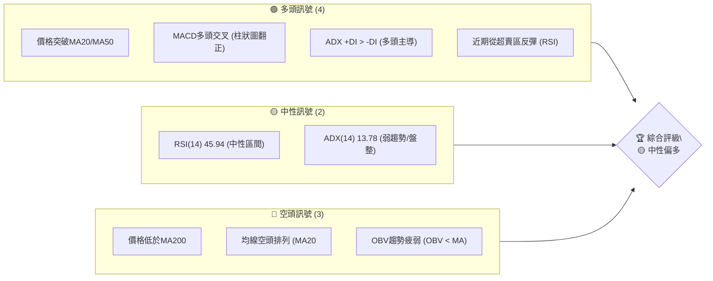
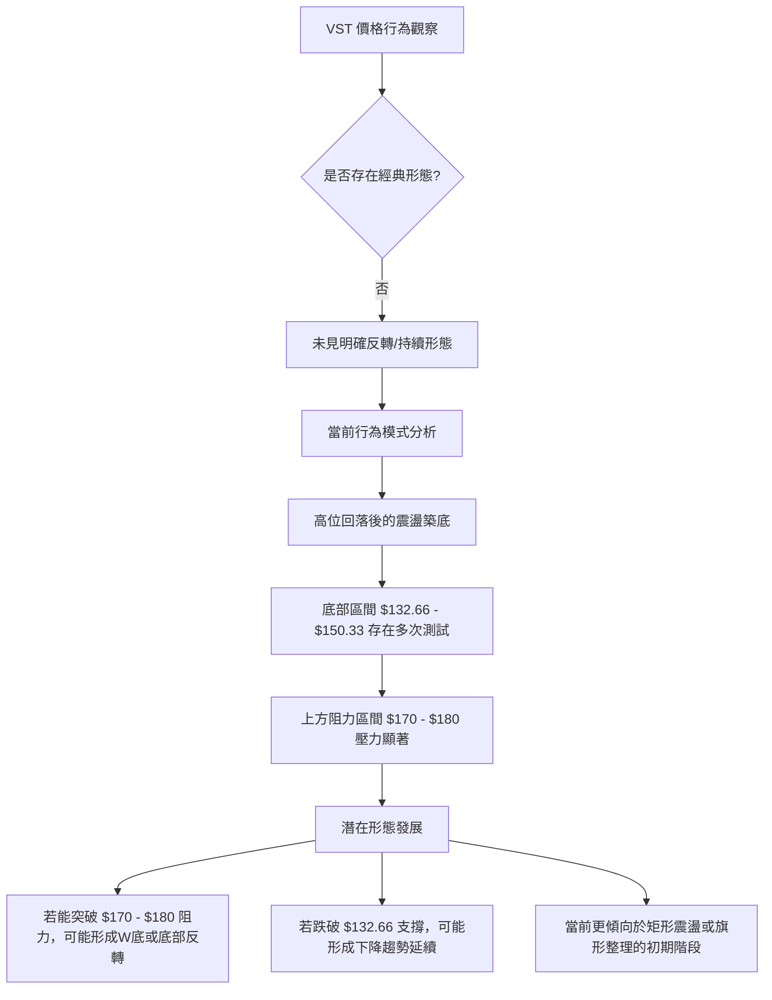

<details>
<summary>📊 靜態圖表 (點擊展開)</summary>

</details>

<html>
<head><meta charset="utf-8" /></head>
<body>
    <div>                        <script>window.PlotlyConfig = {MathJaxConfig: 'local'};</script>
        <script charset="utf-8" src="https://cdn.plot.ly/plotly-3.5.0.min.js" integrity="sha256-fHbNLP+GlIXN+efbQec78UkemUz3NJp7UmfGxC1tNxs=" crossorigin="anonymous"></script>                <div id="candlestick-chart" class="plotly-graph-div" style="height:500px; width:100%;"></div>            <script>                window.PLOTLYENV=window.PLOTLYENV || {};                                if (document.getElementById("candlestick-chart")) {                    Plotly.newPlot(                        "candlestick-chart",                        [{"close":{"dtype":"f8","bdata":"AAAA4LaZaUAAAABgGStpQAAAAKAR6mhAAAAAwEQYakAAAAAg1Y9pQAAAAIBuMmlAAAAAAGiSaEAAAADAXcZoQAAAAMDzGGhAAAAA4IEFaEAAAAAgq7FnQAAAACBot2dAAAAAAEurZ0AAAADA9EtoQAAAAGBhO2hAAAAAoFJ+aEAAAABAX4xnQAAAAAAtI2dAAAAAINBsZ0AAAADAIqBnQAAAAOD8aGdAAAAAgE5pZ0AAAACgPSFoQAAAAKAcDWpAAAAAoJ9oaUAAAABAuxxqQAAAACCBlmpAAAAA4B8UakAAAAAAbPBpQAAAAEBlK2pAAAAAQFlWakAAAACAPiprQAAAAGCwdWlAAAAAAB8waUAAAABgFCJpQAAAAGDJ1GlAAAAA4KSsaEAAAACgLmxoQAAAAMCRHmlAAAAA4PJCaUAAAABA4y1pQAAAAGB3+2hAAAAAYEHiaEAAAADgZ79pQAAAAICALWpAAAAA4C2KaEAAAABAJB9qQAAAAKA3nmlAAAAAgKBIakAAAAAgRDpqQAAAAMB2GWlAAAAAAJI2aEAAAADANUBnQAAAAOAwKmdAAAAAgPvaZ0AAAAAASx1pQAAAAGAL2GhAAAAAYBfCZ0AAAAAgR9poQAAAAGACpmdAAAAAYAN5Z0AAAACARhBoQAAAAKBRJ2dAAAAAIMybZ0AAAADAkwNnQAAAAOAsz2dAAAAAAGB4Z0AAAACgVlVmQAAAAODvOGZAAAAAwM5iZUAAAAAgscZlQAAAAKCV0GVAAAAAYBO+ZUAAAABAs1RmQAAAAID4qWVAAAAAgAcEZUAAAABgDdVlQAAAAMDUS2VAAAAAwAYKZkAAAADAw0tmQAAAAEAvpWVAAAAAgGaCZUAAAAAArmVlQAAAAAC78mVAAAAAALfWZEAAAADgNLVkQAAAAABni2RAAAAAAOSWZEAAAADg0cNlQAAAAIA3NGVAAAAA4C35ZEAAAAAAH59lQAAAAODy8GNAAAAAgM22ZEAAAABgmVJkQAAAAGAyK2RAAAAAgGQuZEAAAAAAqTdkQAAAAIBkLmRAAAAAINMzZEAAAABAwExkQAAAAACHI2RAAAAAQCigZEAAAABAqFZkQAAAAOCRKWVAAAAAAHZMY0AAAACgosxiQAAAAGCWxGRAAAAAgAmLZUAAAACg92VlQAAAAKCsF2VAAAAAwOd9ZkAAAAAA8MtkQAAAAIAVk2NAAAAAIKr5Y0AAAACAhwRkQAAAACDc\u002fGNAAAAAQP\u002fSY0AAAADAKIFkQAAAAGBCrWRAAAAAAHlLZEAAAAAgTMRjQAAAAGCYQWNAAAAAoFQZY0AAAABgbcphQAAAAOAA3GFAAAAAwEauYkAAAAAgXxhjQAAAACA+7GNAAAAAgNH9Y0AAAAAgF1xkQAAAAGA0aGVAAAAAQDCuZUAAAAAAzkplQAAAAAB7iGVAAAAAAFRlZUAAAAAASfJkQAAAAMBbbGVAAAAAIODjZUAAAABAiBJmQAAAAGDmtGVAAAAAwHG4ZEAAAADgWS9kQAAAACBmZGRAAAAAoIDlZEAAAABA4s1jQAAAAAC1bGRAAAAAIKKFZEAAAACgLt5jQAAAAICa62NAAAAAgHjXY0AAAABgnjhkQAAAAIBlg2RAAAAAgGw8ZUAAAABAi+RkQAAAAOCjQGJAAAAAoEfpYkAAAABAChdjQAAAAOBR8GJAAAAAoJkJY0AAAAAgXG9jQAAAAKBHcWJAAAAAYI\u002fKYkAAAABguD5jQAAAAIDC5WJAAAAAQOHyYkAAAACAwjVjQAAAAOB6fGNAAAAAAAAYY0AAAAAgXFdjQAAAAGBmxmNAAAAAQAp\u002fZEAAAACAFF5kQAAAAMD1sGRAAAAAYLhuZEAAAABAM\u002fNjQAAAAMAeXWNAAAAAoEd5Y0AAAABAM5tjQAAAAEAzi2RAAAAAYI\u002fSZEAAAAAA1yNkQAAAAKBHOWNAAAAAQOG6Y0AAAADA9WhjQAAAAEAzG2RAAAAAACkMZEAAAACgR8ljQAAAAGBmPmNAAAAAQAp3YkAAAACgmQFjQAAAAADXW2JAAAAAIIXTYUAAAADAzLxhQAAAAIDCdWFAAAAAAAAYYUAAAABguNZgQAAAAAAAAGJAAAAAYI+iYkAAAADgo4hjQA=="},"high":{"dtype":"f8","bdata":"6KBMmBReakAupSeLlwJqQFQ9qoh6rWlAxYUhFwUlakBzTBwC\u002fItqQL8iihZa42lAb5lylLF1aUCzYGhWZNRoQE9bY+FLuWhAUnIP\u002fgIUaEBvXQ1Tr31oQA4jINERWGhA\u002fm3Napw9aEADv1zk2VxoQFbBFxbbj2hAct4mmYITaUBKYfnOZl9oQNk3cvhIRWdACiaARoV6Z0D2eJMrAexnQNV\u002foWxs1mdAKBlaYG+6Z0C2aX\u002f6EVhoQCJBdj8agmpAmApXxNxiakAvJ7D8JS1qQIHsPsAgImtABR8ZEG6fakDf3sYXbp9qQEWUsSF4tGpAUWI5BQuoakC09I+H4GZrQJYkceG8hWpAISpqT9KzaUDp\u002fX63U3ZpQMTVmc+43WlAgnZhlNHRaUACj4q4Vv5oQCrZtUC1i2lABBmJIfGNaUCCf1td4jNqQJ0\u002fXYtx62lAvSOIssNoaUBAf6QFUsFpQM3MD9+lT2pAwBvB\u002fiF5akByfuf65ytqQMJZyK7NCGpAxxCHExfuakDx+0+JExBrQL3qBfAYL2pAG9Uc9uWdaUCNUcfmZhxoQEtYqr1On2dAeHJyKHj1Z0BNzlrMNC5pQK6RZC4uY2lAAEg\u002f+bKYaEDikNiUrQVpQEcEThG6yGhAddJWHn0LaECj9Dfk4lRoQAXW5vXP3mdA9qnZ7j7+Z0DmAPhFLpNnQO7RDI+R0WdAWE5Nv0OIaEA6yPthhm1nQPiYX0yhmWZAEspWTQsvZkCIOYzhJHBmQBzDF5LTYGZA\u002fIBAuc8dZkCHsiAoA6BmQGeW7vWamGdAo+gd+HWmZUDRT6OF99ZlQJ0Teef3x2VAzD\u002fPs1coZkAn7LRtt4hmQFLLFnXQ\u002f2VAf8zlk+buZUCWL6Hj4qtlQCwHiHnqMWZAYsAeDpoEZkAmhNsJdetkQPU4aT4nLmVAibAHFQSyZEBee931Es1lQNlLZAElcGZAvk6RwsKQZUAClQZNcK5lQB+PYmkN1WVADpV51ktuZUBu7URnBV5lQND88MvBgmRAfju8mENvZEDmWn8GoktkQJFmeQjlWGRAUYub6T1\u002fZEAjDP7Wz1pkQIR+yD\u002fUiGRASAfhrZQhZUAQqKwhem1lQHTW7eD+i2VA18+\u002ftXINZUC35XH4znJjQNaSChgQ0GVAGVPD0\u002fkPZkAnF71mwOZlQNZQaTZMXmVApqueMPbJZkD1RJ1OYVxlQPQyhnDDuGRA+8ucgEw4ZECPOxxV32hkQP9bpG+9VGRAsS19traiZEDZfoDbqYxkQBeNqbuoymRAG4NAetf0ZEBnE1I+1IhkQANilMpi+GNAQUFBkS2JY0Buuu7tay5jQNv1N8DY9mFACIbAv64BY0DkXwtEK3JjQIhFYzBnJmRAO\u002flFqraiZEABFzOLeb9kQI2JVxqjbWVA50HoWhkNZkD4W6l7WehlQGiUALi3imVAKjSZ0G+oZUDN8QqKY3NlQDqMl5RGbmVAcw75Bmn2ZUCtRbdMoh9mQMEv+awlQmZAB19o\u002ffEIZkCTavfT1GlkQPZSsuOPf2RA3jCQw7f3ZEDE0kfq0QRlQC\u002fvcLr7jGRA+qZ8AuwRZUBi6qgZiHhkQGrTCRpJX2RAqIvEDXqgZEAVRiVm32hkQCqXtOOBp2RAGGQcXHWYZUCGNkmdzitlQAAAAEAKz2RAAAAAwMx8Y0AAAABAM0NjQAAAAGBmvmNAAAAAoHAVY0AAAABgZgZkQAAAAIDC3WNAAAAAQArvYkAAAABA4YpjQAAAAIDrUWNAAAAAIFwjY0AAAADAHkVjQAAAAIDrKWRAAAAAwPVQZEAAAAAAKdRjQAAAAEAKF2RAAAAAwPWoZEAAAADgo9BkQAAAAKBw3WRAAAAAIK4PZUAAAACgmYFkQAAAAEAzI2RAAAAAYI\u002fiY0AAAAAA19tjQAAAACBcr2RAAAAAoHANZUAAAABgZmpkQAAAAMByJGRAAAAAACn0Y0AAAADgegRkQAAAAAApTGRAAAAAoJl5ZEAAAAAgrl9kQAAAAOB6DGVAAAAAAABgY0AAAAAAABhjQAAAAABWymJAAAAAwPVIYkAAAACgcOlhQAAAAEDhomFAAAAAoEdxYUAAAABgZhZhQAAAAMDMHGJAAAAAwPWoYkAAAACAPbJjQA=="},"hovertemplate":"\u003cb\u003e%{x|%Y-%m-%d}\u003c\u002fb\u003e\u003cbr\u003e\u958b: $%{open:.2f}\u003cbr\u003e\u9ad8: $%{high:.2f}\u003cbr\u003e\u4f4e: $%{low:.2f}\u003cbr\u003e\u6536: $%{close:.2f}\u003cextra\u003e\u003c\u002fextra\u003e","low":{"dtype":"f8","bdata":"iGFVJ76oZ0ATe2dZZB1pQK+GrE7CvWhA8HRglyP3aEDKIcINs\u002fBoQCW+asGEMGlAxY3\u002fFhNCaEB0yaywsVFoQLNmyKJQz2dA8HubRbLkZkAjqCgmvqhnQCxuIamSTWdA4jExsW2SZ0CbP7fOBZRnQJg4zJJs8WdAslqybQQ8aEBLBlDF6D5nQGKRsVGXrGZASezv0lD0ZkDvOHvEXIJnQH0HMULrN2ZApFdQSuz8ZkDulI1zj49nQBg3NNqE52hAHDDCBFdKaUAEoQC5lydpQOubpFO7HGpAEvZf7qvQaUCUO60vY3xpQNTORD4i6GlAHRD0V9CTaUDJlQ21S+dpQH9o6TbMXGlA8n\u002fbyA4qaUAO9hTCDW9oQKD\u002fy\u002fanDWlAziSHKfykaEDg9AwWmsVnQCn60B6D9GdAzPBXWTfFaEC1NbQsQB5pQCoEgFNenGhA5V5XehBraEDvjxh3b\u002fJoQADAEhKimGlA9G17c4qJaECWcGy1JftoQDOoNS4PG2lAE7h5WZ66aUBrpUZygQNqQCafwHD672hAH2BwMNcIaECcdkXM5CFnQJgSPJz5ZGZA7crJglwmZ0AzXf7rDkJoQEy2++OwfmhA7YgWYsr+ZkDa4bifWZ5nQNvNUAKsgGdA72SHanngZkC7sG1ghmpnQHRCaXa\u002f\u002f2ZAP4\u002fCUngNZ0BHxQRIJWFmQEt4u9mkA2ZA9hAc6OX0ZkCtd4xEK0pmQJBobLmpGWZA1PnIk55BZUDws8Bv+aNkQN1nPAWXlGVAweohShZGZUD1xUqSsbdlQBAiI8LolGVAEkYcb8U\u002fZECfv\u002fWdL65kQAT1LolYrmRAF2ceRnmTZUCr1QOrozBmQGjfM0zehmVAWBr4uJVcZUCszbaChA9lQHo3+iIOQGVAKzXhaGDAZEDj\u002f1TUd3NkQNG\u002f1m3ZiGRAprcZJ9PGY0B4MU73IhJkQLGNS+E+4WRAx1Wmo6bQZEDLIBPZ7cJkQKjUlaNryGNAtR\u002fBbBxHZECaSQ9xEUhkQI3YBCkwFGRAXfhsDy79Y0C1ZWjwrPFjQDMY7to1BGRAYXXooZj2Y0BKt6Eo5hpkQNJoQRoDIGRAVx0g9FV1ZEDPL9XTGP9jQEDF0wrScWRAl11DNJYqY0CHWieck59iQPeJ1dfttGRAXKisWmh7ZECriRsyy1JlQBWO9pVcumRAQWxzm0ZuZUA2bnywNllkQJkZ5D8wgWNAZ4JE3+8xY0D5fvSg3N1jQNsZhsgcuWNADPS9p+q1Y0DLrt7P571jQFwE4D4YHmRAAYbBTz3RY0BwLr2grpRjQAafEtE+OmNAVZV\u002f+vzFYkAe+vukkWJhQLH8U8rrSmFA13emggNnYkCxLHSLhHJiQC4cx9QrU2NAZnMMO7DKY0Duk4bBzgVkQDtB4Lv1KGRAon5YwP02ZUDQy5xWICxlQLYDc22qAGVAg+prCKIYZUCox2ynhJ9kQJ8qbEkPVWRAqQ6cTCU7ZUDsZNq2XXxkQP8zYtoHVWVAiR4byVSzZEAugLPvsBhjQIIDK8jOBWRAX5dMNbYuZECnA+QHs8JjQHcm\u002fjI+WWNAuCtn75iCZEAx08lfCV5jQMVO4qORj2NA0yJ73XuwY0Ce0OxaivxjQOJzvMnFPGRAWX3eDsmoZEAxYWBqM4BkQAAAAGCPGmJAAAAAYLiqYkAAAACgmbFiQAAAAAApzGJAAAAAIK5PYkAAAAAAAPhiQAAAAEAzU2JAAAAAQOHKYUAAAADAzOxiQAAAAADXw2JAAAAAACm8YkAAAADA9chiQAAAAKBHaWNAAAAAgMIVY0AAAAAghSNjQAAAAMDMFGNAAAAAQAoLZEAAAADAzERkQAAAACCFU2RAAAAA4FFIZEAAAACAPcpjQAAAAAApRGNAAAAAoHBdY0AAAAAAAFBjQAAAAMDMZGNAAAAAIIXXY0AAAABACtdjQAAAAGCPImNAAAAAIFx3Y0AAAACAwl1jQAAAAIAUrmNAAAAAoJn5Y0AAAABAM5NjQAAAAOCjOGNAAAAAIFxfYkAAAABg5UhiQAAAAMAeNWJAAAAA4FFwYUAAAAAAgX1hQAAAAIDrOWFAAAAAIIW7YEAAAADAHpVgQAAAAIDrOWFAAAAAACkcYkAAAAAAANhiQA=="},"name":"\u50f9\u683c","open":{"dtype":"f8","bdata":"go2n8m+vZ0Da9yV4SqppQJeERjJHWmlAJA4MC4g3aUCRxQwEWixqQB1L\u002fzBVa2lAYIFY9CZHaUALuT3L4odoQByXVMmMlmhAjUSx+Z7IZ0DNCxEkYAhoQLicF1EVzWdAz7jef9XZZ0BtfZ12FrdnQCAnHWZ0MmhA95nxoIFOaEDDGNzyqVloQHR\u002fn5sC+2ZAwjp7jjspZ0DShwiA3YhnQLmCmF62sGdA9rBtXaybZ0Da8mJSvqhnQMyXwW4Y+GhAJ4KOiGf\u002faUA0ztPMwkRpQOubpFO7HGpABR8ZEG6fakD93aaWk09qQP5l+0rPj2pA0ysXniJbakAjYwDsaU1qQOuArQADMWpAMAmWUGpWaUCIvPABj65oQL+lwUCtFGlApmwJ0jQuaUD17ebCiNRoQMVxg63STmhAot6aZ05vaUBF9i8oM3lpQEQOc7X1smlAce575nsgaUDVfh2zzSBpQGZmZibEzWlArpL1udclakC7Fvu4HxJpQJmInw8np2lA46qHQM0XakByldkAXMZqQBsnfZsl42lA9fvX2i1yaUCqCCB0KwtoQLqaslYUYWdA7crJglwmZ0CPvyLS4YFoQK6RZC4uY2lAAEg\u002f+bKYaED5HGQuqfhnQNtKAG2cRGhA4vo6UBbvZ0B8IYmpHMlnQK\u002fk+4ehcmdAOF\u002fqtOk3Z0CNyhWjXsxmQOesQcFGQGZAnfz\u002f2HBIaEDI4EEPEC1nQPwpA+ysemZAO9foWokNZkC4Dg57CNdkQBbfqG1O3mVAaetMMOmFZUDpYNLfsNVlQMAiU6P1CWdAVK1+WtlwZUAYHTWbTSNlQI110M85s2VAHc7\u002fQ6ywZUBai8t3O1BmQEGGV87Q8GVAyx8OW1ndZUA\u002f9Vk56YVlQA+hY0mobWVANy4faRcBZkAmhNsJdetkQCVON99FnWRA4aWfylCcZEBrvlJDUzNkQO7xz5731mVAfThyCXyPZUArDNa3HsZkQAQwxeT9sGVA2vIWIIemZEDFDo49t8dkQN0DmMHZeGRA2e6mfTIrZEA8eBqTqRhkQAAAAIBkLmRABdHSP\u002fsYZECj2DYr8DhkQOM3URdhVWRAVx0g9FV1ZEAV4anhdCRlQNIXHwqiGGVA18+\u002ftXINZUBzFrd7O2FjQOFpXev1wmVAtX4uBUOOZEChQTg1arhlQBMRIpAYJWVArVVaYHWYZUDj0+fFS+pkQMSk7xmcIWRA1WtwZWPZY0BEspNaszZkQPEWz3YG+WNA+HbQIuELZEBPBHDCXeljQIYohHvDuGRAKFyOR3y3ZECMiOe49ShkQMEaJGvtrWNAzs3Yzgh9Y0AcBrDsZh9jQIkyy3namWFAUlEaGHa5YkDy\u002fxIFdrliQOUne7LOBWRAZn\u002fpn86YZEB0rsJyWhBkQOQevHC4RWRAMDlg\u002f7VUZUDGHWn8u7hlQGGuIae2NWVAaynP1BaCZUB2B1iOCk1lQGzbAe+q4WRAVOmmQaWEZUAwTonODGRlQIjR9Bxf2GVAcCWzBPs+ZUAsgo0cCC9kQPqHjwDWK2RABu3jeRo1ZEB42\u002fAlO4dkQOO4vucAdmNAi85qyU+kZECoMc+TEWxkQOiRP2a2m2NAUBz7o0QxZEB4i1BM+xhkQGtpepbSUmRA19GkRMawZEATW1obJ95kQAAAAEAKz2RAAAAAYGbuYkAAAACgmdFiQAAAAAAAYGNAAAAAAACwYkAAAAAAAPhiQAAAAEAzo2NAAAAAwMz8YUAAAABACu9iQAAAAGC45mJAAAAAoEfhYkAAAACAPeJiQAAAAAAAGGRAAAAA4Hp8Y0AAAAAAADBjQAAAAMDMFGNAAAAAwB5NZEAAAAAAALBkQAAAAIA9kmRAAAAA4FHIZEAAAACgmWFkQAAAAOBRGGRAAAAAoJm5Y0AAAABguH5jQAAAAGCPimNAAAAAAACgZEAAAAAAAFBkQAAAACCFG2RAAAAAoEeJY0AAAACA68ljQAAAAIAUtmNAAAAAAABgZEAAAAAA1y9kQAAAAKBHYWRAAAAAAABgY0AAAAAAAIBiQAAAACCur2JAAAAAwPVIYkAAAAAAKaxhQAAAAMDMeGFAAAAAAABgYUAAAACgmflgQAAAAAAAQGFAAAAAQAovYkAAAADA9eBiQA=="},"x":["2025-08-07T00:00:00-04:00","2025-08-08T00:00:00-04:00","2025-08-11T00:00:00-04:00","2025-08-12T00:00:00-04:00","2025-08-13T00:00:00-04:00","2025-08-14T00:00:00-04:00","2025-08-15T00:00:00-04:00","2025-08-18T00:00:00-04:00","2025-08-19T00:00:00-04:00","2025-08-20T00:00:00-04:00","2025-08-21T00:00:00-04:00","2025-08-22T00:00:00-04:00","2025-08-25T00:00:00-04:00","2025-08-26T00:00:00-04:00","2025-08-27T00:00:00-04:00","2025-08-28T00:00:00-04:00","2025-08-29T00:00:00-04:00","2025-09-02T00:00:00-04:00","2025-09-03T00:00:00-04:00","2025-09-04T00:00:00-04:00","2025-09-05T00:00:00-04:00","2025-09-08T00:00:00-04:00","2025-09-09T00:00:00-04:00","2025-09-10T00:00:00-04:00","2025-09-11T00:00:00-04:00","2025-09-12T00:00:00-04:00","2025-09-15T00:00:00-04:00","2025-09-16T00:00:00-04:00","2025-09-17T00:00:00-04:00","2025-09-18T00:00:00-04:00","2025-09-19T00:00:00-04:00","2025-09-22T00:00:00-04:00","2025-09-23T00:00:00-04:00","2025-09-24T00:00:00-04:00","2025-09-25T00:00:00-04:00","2025-09-26T00:00:00-04:00","2025-09-29T00:00:00-04:00","2025-09-30T00:00:00-04:00","2025-10-01T00:00:00-04:00","2025-10-02T00:00:00-04:00","2025-10-03T00:00:00-04:00","2025-10-06T00:00:00-04:00","2025-10-07T00:00:00-04:00","2025-10-08T00:00:00-04:00","2025-10-09T00:00:00-04:00","2025-10-10T00:00:00-04:00","2025-10-13T00:00:00-04:00","2025-10-14T00:00:00-04:00","2025-10-15T00:00:00-04:00","2025-10-16T00:00:00-04:00","2025-10-17T00:00:00-04:00","2025-10-20T00:00:00-04:00","2025-10-21T00:00:00-04:00","2025-10-22T00:00:00-04:00","2025-10-23T00:00:00-04:00","2025-10-24T00:00:00-04:00","2025-10-27T00:00:00-04:00","2025-10-28T00:00:00-04:00","2025-10-29T00:00:00-04:00","2025-10-30T00:00:00-04:00","2025-10-31T00:00:00-04:00","2025-11-03T00:00:00-05:00","2025-11-04T00:00:00-05:00","2025-11-05T00:00:00-05:00","2025-11-06T00:00:00-05:00","2025-11-07T00:00:00-05:00","2025-11-10T00:00:00-05:00","2025-11-11T00:00:00-05:00","2025-11-12T00:00:00-05:00","2025-11-13T00:00:00-05:00","2025-11-14T00:00:00-05:00","2025-11-17T00:00:00-05:00","2025-11-18T00:00:00-05:00","2025-11-19T00:00:00-05:00","2025-11-20T00:00:00-05:00","2025-11-21T00:00:00-05:00","2025-11-24T00:00:00-05:00","2025-11-25T00:00:00-05:00","2025-11-26T00:00:00-05:00","2025-11-28T00:00:00-05:00","2025-12-01T00:00:00-05:00","2025-12-02T00:00:00-05:00","2025-12-03T00:00:00-05:00","2025-12-04T00:00:00-05:00","2025-12-05T00:00:00-05:00","2025-12-08T00:00:00-05:00","2025-12-09T00:00:00-05:00","2025-12-10T00:00:00-05:00","2025-12-11T00:00:00-05:00","2025-12-12T00:00:00-05:00","2025-12-15T00:00:00-05:00","2025-12-16T00:00:00-05:00","2025-12-17T00:00:00-05:00","2025-12-18T00:00:00-05:00","2025-12-19T00:00:00-05:00","2025-12-22T00:00:00-05:00","2025-12-23T00:00:00-05:00","2025-12-24T00:00:00-05:00","2025-12-26T00:00:00-05:00","2025-12-29T00:00:00-05:00","2025-12-30T00:00:00-05:00","2025-12-31T00:00:00-05:00","2026-01-02T00:00:00-05:00","2026-01-05T00:00:00-05:00","2026-01-06T00:00:00-05:00","2026-01-07T00:00:00-05:00","2026-01-08T00:00:00-05:00","2026-01-09T00:00:00-05:00","2026-01-12T00:00:00-05:00","2026-01-13T00:00:00-05:00","2026-01-14T00:00:00-05:00","2026-01-15T00:00:00-05:00","2026-01-16T00:00:00-05:00","2026-01-20T00:00:00-05:00","2026-01-21T00:00:00-05:00","2026-01-22T00:00:00-05:00","2026-01-23T00:00:00-05:00","2026-01-26T00:00:00-05:00","2026-01-27T00:00:00-05:00","2026-01-28T00:00:00-05:00","2026-01-29T00:00:00-05:00","2026-01-30T00:00:00-05:00","2026-02-02T00:00:00-05:00","2026-02-03T00:00:00-05:00","2026-02-04T00:00:00-05:00","2026-02-05T00:00:00-05:00","2026-02-06T00:00:00-05:00","2026-02-09T00:00:00-05:00","2026-02-10T00:00:00-05:00","2026-02-11T00:00:00-05:00","2026-02-12T00:00:00-05:00","2026-02-13T00:00:00-05:00","2026-02-17T00:00:00-05:00","2026-02-18T00:00:00-05:00","2026-02-19T00:00:00-05:00","2026-02-20T00:00:00-05:00","2026-02-23T00:00:00-05:00","2026-02-24T00:00:00-05:00","2026-02-25T00:00:00-05:00","2026-02-26T00:00:00-05:00","2026-02-27T00:00:00-05:00","2026-03-02T00:00:00-05:00","2026-03-03T00:00:00-05:00","2026-03-04T00:00:00-05:00","2026-03-05T00:00:00-05:00","2026-03-06T00:00:00-05:00","2026-03-09T00:00:00-04:00","2026-03-10T00:00:00-04:00","2026-03-11T00:00:00-04:00","2026-03-12T00:00:00-04:00","2026-03-13T00:00:00-04:00","2026-03-16T00:00:00-04:00","2026-03-17T00:00:00-04:00","2026-03-18T00:00:00-04:00","2026-03-19T00:00:00-04:00","2026-03-20T00:00:00-04:00","2026-03-23T00:00:00-04:00","2026-03-24T00:00:00-04:00","2026-03-25T00:00:00-04:00","2026-03-26T00:00:00-04:00","2026-03-27T00:00:00-04:00","2026-03-30T00:00:00-04:00","2026-03-31T00:00:00-04:00","2026-04-01T00:00:00-04:00","2026-04-02T00:00:00-04:00","2026-04-06T00:00:00-04:00","2026-04-07T00:00:00-04:00","2026-04-08T00:00:00-04:00","2026-04-09T00:00:00-04:00","2026-04-10T00:00:00-04:00","2026-04-13T00:00:00-04:00","2026-04-14T00:00:00-04:00","2026-04-15T00:00:00-04:00","2026-04-16T00:00:00-04:00","2026-04-17T00:00:00-04:00","2026-04-20T00:00:00-04:00","2026-04-21T00:00:00-04:00","2026-04-22T00:00:00-04:00","2026-04-23T00:00:00-04:00","2026-04-24T00:00:00-04:00","2026-04-27T00:00:00-04:00","2026-04-28T00:00:00-04:00","2026-04-29T00:00:00-04:00","2026-04-30T00:00:00-04:00","2026-05-01T00:00:00-04:00","2026-05-04T00:00:00-04:00","2026-05-05T00:00:00-04:00","2026-05-06T00:00:00-04:00","2026-05-07T00:00:00-04:00","2026-05-08T00:00:00-04:00","2026-05-11T00:00:00-04:00","2026-05-12T00:00:00-04:00","2026-05-13T00:00:00-04:00","2026-05-14T00:00:00-04:00","2026-05-15T00:00:00-04:00","2026-05-18T00:00:00-04:00","2026-05-19T00:00:00-04:00","2026-05-20T00:00:00-04:00","2026-05-21T00:00:00-04:00","2026-05-22T00:00:00-04:00"],"type":"candlestick"},{"hovertemplate":"MA30: $%{y:.2f}\u003cextra\u003e\u003c\u002fextra\u003e","line":{"color":"#2196F3","dash":"dash","width":2},"mode":"lines","name":"MA30","x":["2025-08-07T00:00:00-04:00","2025-08-08T00:00:00-04:00","2025-08-11T00:00:00-04:00","2025-08-12T00:00:00-04:00","2025-08-13T00:00:00-04:00","2025-08-14T00:00:00-04:00","2025-08-15T00:00:00-04:00","2025-08-18T00:00:00-04:00","2025-08-19T00:00:00-04:00","2025-08-20T00:00:00-04:00","2025-08-21T00:00:00-04:00","2025-08-22T00:00:00-04:00","2025-08-25T00:00:00-04:00","2025-08-26T00:00:00-04:00","2025-08-27T00:00:00-04:00","2025-08-28T00:00:00-04:00","2025-08-29T00:00:00-04:00","2025-09-02T00:00:00-04:00","2025-09-03T00:00:00-04:00","2025-09-04T00:00:00-04:00","2025-09-05T00:00:00-04:00","2025-09-08T00:00:00-04:00","2025-09-09T00:00:00-04:00","2025-09-10T00:00:00-04:00","2025-09-11T00:00:00-04:00","2025-09-12T00:00:00-04:00","2025-09-15T00:00:00-04:00","2025-09-16T00:00:00-04:00","2025-09-17T00:00:00-04:00","2025-09-18T00:00:00-04:00","2025-09-19T00:00:00-04:00","2025-09-22T00:00:00-04:00","2025-09-23T00:00:00-04:00","2025-09-24T00:00:00-04:00","2025-09-25T00:00:00-04:00","2025-09-26T00:00:00-04:00","2025-09-29T00:00:00-04:00","2025-09-30T00:00:00-04:00","2025-10-01T00:00:00-04:00","2025-10-02T00:00:00-04:00","2025-10-03T00:00:00-04:00","2025-10-06T00:00:00-04:00","2025-10-07T00:00:00-04:00","2025-10-08T00:00:00-04:00","2025-10-09T00:00:00-04:00","2025-10-10T00:00:00-04:00","2025-10-13T00:00:00-04:00","2025-10-14T00:00:00-04:00","2025-10-15T00:00:00-04:00","2025-10-16T00:00:00-04:00","2025-10-17T00:00:00-04:00","2025-10-20T00:00:00-04:00","2025-10-21T00:00:00-04:00","2025-10-22T00:00:00-04:00","2025-10-23T00:00:00-04:00","2025-10-24T00:00:00-04:00","2025-10-27T00:00:00-04:00","2025-10-28T00:00:00-04:00","2025-10-29T00:00:00-04:00","2025-10-30T00:00:00-04:00","2025-10-31T00:00:00-04:00","2025-11-03T00:00:00-05:00","2025-11-04T00:00:00-05:00","2025-11-05T00:00:00-05:00","2025-11-06T00:00:00-05:00","2025-11-07T00:00:00-05:00","2025-11-10T00:00:00-05:00","2025-11-11T00:00:00-05:00","2025-11-12T00:00:00-05:00","2025-11-13T00:00:00-05:00","2025-11-14T00:00:00-05:00","2025-11-17T00:00:00-05:00","2025-11-18T00:00:00-05:00","2025-11-19T00:00:00-05:00","2025-11-20T00:00:00-05:00","2025-11-21T00:00:00-05:00","2025-11-24T00:00:00-05:00","2025-11-25T00:00:00-05:00","2025-11-26T00:00:00-05:00","2025-11-28T00:00:00-05:00","2025-12-01T00:00:00-05:00","2025-12-02T00:00:00-05:00","2025-12-03T00:00:00-05:00","2025-12-04T00:00:00-05:00","2025-12-05T00:00:00-05:00","2025-12-08T00:00:00-05:00","2025-12-09T00:00:00-05:00","2025-12-10T00:00:00-05:00","2025-12-11T00:00:00-05:00","2025-12-12T00:00:00-05:00","2025-12-15T00:00:00-05:00","2025-12-16T00:00:00-05:00","2025-12-17T00:00:00-05:00","2025-12-18T00:00:00-05:00","2025-12-19T00:00:00-05:00","2025-12-22T00:00:00-05:00","2025-12-23T00:00:00-05:00","2025-12-24T00:00:00-05:00","2025-12-26T00:00:00-05:00","2025-12-29T00:00:00-05:00","2025-12-30T00:00:00-05:00","2025-12-31T00:00:00-05:00","2026-01-02T00:00:00-05:00","2026-01-05T00:00:00-05:00","2026-01-06T00:00:00-05:00","2026-01-07T00:00:00-05:00","2026-01-08T00:00:00-05:00","2026-01-09T00:00:00-05:00","2026-01-12T00:00:00-05:00","2026-01-13T00:00:00-05:00","2026-01-14T00:00:00-05:00","2026-01-15T00:00:00-05:00","2026-01-16T00:00:00-05:00","2026-01-20T00:00:00-05:00","2026-01-21T00:00:00-05:00","2026-01-22T00:00:00-05:00","2026-01-23T00:00:00-05:00","2026-01-26T00:00:00-05:00","2026-01-27T00:00:00-05:00","2026-01-28T00:00:00-05:00","2026-01-29T00:00:00-05:00","2026-01-30T00:00:00-05:00","2026-02-02T00:00:00-05:00","2026-02-03T00:00:00-05:00","2026-02-04T00:00:00-05:00","2026-02-05T00:00:00-05:00","2026-02-06T00:00:00-05:00","2026-02-09T00:00:00-05:00","2026-02-10T00:00:00-05:00","2026-02-11T00:00:00-05:00","2026-02-12T00:00:00-05:00","2026-02-13T00:00:00-05:00","2026-02-17T00:00:00-05:00","2026-02-18T00:00:00-05:00","2026-02-19T00:00:00-05:00","2026-02-20T00:00:00-05:00","2026-02-23T00:00:00-05:00","2026-02-24T00:00:00-05:00","2026-02-25T00:00:00-05:00","2026-02-26T00:00:00-05:00","2026-02-27T00:00:00-05:00","2026-03-02T00:00:00-05:00","2026-03-03T00:00:00-05:00","2026-03-04T00:00:00-05:00","2026-03-05T00:00:00-05:00","2026-03-06T00:00:00-05:00","2026-03-09T00:00:00-04:00","2026-03-10T00:00:00-04:00","2026-03-11T00:00:00-04:00","2026-03-12T00:00:00-04:00","2026-03-13T00:00:00-04:00","2026-03-16T00:00:00-04:00","2026-03-17T00:00:00-04:00","2026-03-18T00:00:00-04:00","2026-03-19T00:00:00-04:00","2026-03-20T00:00:00-04:00","2026-03-23T00:00:00-04:00","2026-03-24T00:00:00-04:00","2026-03-25T00:00:00-04:00","2026-03-26T00:00:00-04:00","2026-03-27T00:00:00-04:00","2026-03-30T00:00:00-04:00","2026-03-31T00:00:00-04:00","2026-04-01T00:00:00-04:00","2026-04-02T00:00:00-04:00","2026-04-06T00:00:00-04:00","2026-04-07T00:00:00-04:00","2026-04-08T00:00:00-04:00","2026-04-09T00:00:00-04:00","2026-04-10T00:00:00-04:00","2026-04-13T00:00:00-04:00","2026-04-14T00:00:00-04:00","2026-04-15T00:00:00-04:00","2026-04-16T00:00:00-04:00","2026-04-17T00:00:00-04:00","2026-04-20T00:00:00-04:00","2026-04-21T00:00:00-04:00","2026-04-22T00:00:00-04:00","2026-04-23T00:00:00-04:00","2026-04-24T00:00:00-04:00","2026-04-27T00:00:00-04:00","2026-04-28T00:00:00-04:00","2026-04-29T00:00:00-04:00","2026-04-30T00:00:00-04:00","2026-05-01T00:00:00-04:00","2026-05-04T00:00:00-04:00","2026-05-05T00:00:00-04:00","2026-05-06T00:00:00-04:00","2026-05-07T00:00:00-04:00","2026-05-08T00:00:00-04:00","2026-05-11T00:00:00-04:00","2026-05-12T00:00:00-04:00","2026-05-13T00:00:00-04:00","2026-05-14T00:00:00-04:00","2026-05-15T00:00:00-04:00","2026-05-18T00:00:00-04:00","2026-05-19T00:00:00-04:00","2026-05-20T00:00:00-04:00","2026-05-21T00:00:00-04:00","2026-05-22T00:00:00-04:00"],"y":{"dtype":"f8","bdata":"AAAAAAAA+H8AAAAAAAD4fwAAAAAAAPh\u002fAAAAAAAA+H8AAAAAAAD4fwAAAAAAAPh\u002fAAAAAAAA+H8AAAAAAAD4fwAAAAAAAPh\u002fAAAAAAAA+H8AAAAAAAD4fwAAAAAAAPh\u002fAAAAAAAA+H8AAAAAAAD4fwAAAAAAAPh\u002fAAAAAAAA+H8AAAAAAAD4fwAAAAAAAPh\u002fAAAAAAAA+H8AAAAAAAD4fwAAAAAAAPh\u002fAAAAAAAA+H8AAAAAAAD4fwAAAAAAAPh\u002fAAAAAAAA+H8AAAAAAAD4fwAAAAAAAPh\u002fAAAAAAAA+H8AAAAAAAD4f2ZmZiZjtGhARERE1Ky6aECamZmZtstoQGZmZgZe0GhAiYiICKHIaECamZl5+MRoQHd3d+dhymhAzczMzEHLaECrqqo6QMhoQCIiIrL40GhAd3d3h43baEAREREROuhoQAAAAGAH82hAvLu762T9aEAAAACgxglpQDMzM0NhGmlAAAAAcMYaaUAAAADwuzBpQFVVVfXmRWlAVVVVxUteaUBVVVUVgHRpQLy7u4vqgmlAERERIcKJaUDe3d3dQYJpQImIiGigaWlARERENF9caUBmZmZ221NpQLy7u6v5RGlAZmZmliwxaUB3d3cX5ydpQLy7u8tjEmlAAAAAAPL5aEDNzMzMet9oQJqZmfnMy2hA7+7uvlK+aEBERERkPaxoQBEREXH8mmhAERER4bWQaEARERHh4X5oQImIiEgpZmhAMzMzAxdFaEDv7u7ODChoQImIiEgFDWhAMzMz8zbyZ0C8u7vLDtVnQDMzM0OKrmdAq6qq6neQZ0De3d2N3WtnQERERGT8RmdAEREREcQiZ0ARERFBNwFnQHd3d2e942ZAMzMz46rMZkAAAACQ2bxmQERERMR3smZAAAAAwLmYZkCamZlpH3NmQERERERvTmZAVVVVBWUzZkB3d3fHCxlmQO\u002fu7q4vBGZARERExNvuZUDe3d0dBdplQO\u002fu7o6bvmVAd3d3Z+ilZUAAAAAg8Y5lQN7d3T3gb2VAMzMzU89TZUAREREBwUFlQFVVVfVVMGVAERERgTwmZUCJiIhooxllQO\u002fu7h5WC2VAiYiISM4BZUCrqqrqzfBkQKuqqjqG7GRA7+7uPt\u002fdZEAiIiLS\u002fcNkQN7d3b17v2RAmpmZGUC7ZECamZkpl7NkQLy7u5vfrmRAiYiIyEG3ZECamZnZIbJkQJqZmZngnWRA3t3dTYKWZECJiIionpBkQLy7u0vei2RAvLu7q1aFZEDNzMxMlXpkQJqZmakVdmRA3t3dXUtwZECamZmJd2BkQAAAADCfWmRARERE5NZMZEAzMzPTOzdkQJqZmfmGI2RA7+7uLrkWZEB3d3enJQ1kQM3MzCzxCmRAIiIiUiQJZEB3d3c3pwlkQLy7u8t5FGRAAAAAEHodZEBERER0nSVkQLy7u1vHKGRAAAAAoKw6ZECJiIj4\u002fkxkQN7d3Z2WUmRAREREtIxVZEAiIiJCTVtkQKuqquqKYGRAIiIiYm1RZEDe3d0tNUxkQFVVVVUvU2RAERER0QtbZEAiIiKCOVlkQAAAAPDzXGRAzczMTOhiZEAAAACQeV1kQImIiAgFV2RAZmZmJidTZEAiIiLCB1dkQLy7u8vBYWRAMzMzU\u002f5zZECamZnJdo5kQN7d3Y3RkWRAzczMDMmTZEAAAACwvZNkQCIiIvJXi2RAMzMz8zODZECamZnZT3tkQBEREbEDYmRAIiIiMlxJZEAiIiIC5DdkQERERGRmIWRAMzMzs4QMZECrqqpqs\u002f1jQLy7u+sr7WNA3t3dHU\u002fVY0CJiIjYAL5jQM3MzByFrWNAMzMzQ5urY0BEREQEKq1jQGZmZla3r2NAq6qqusGrY0CamZkpAK1jQO\u002fu7p7yo2NAvLu7qwCbY0B3d3cXxZhjQLy7u\u002fsWnmNAzczMnHWmY0DNzMxMxKVjQN7d3U3DmmNAREREVOmNY0BmZmY2QoFjQKuqqsoTkWNAiYiI+MWaY0AzMzPztqBjQLy7uztRo2NAZmZmlm6eY0CJiIj4xZpjQERERAQPmmNAERER8dKRY0ARERHB9YRjQM3MzHyxeGNA3t3dLd1oY0C8u7sboVRjQImIiFjyR2NAERERMQhEY0B3d3e3rEVjQA=="},"type":"scatter"},{"hovertemplate":"MA60: $%{y:.2f}\u003cextra\u003e\u003c\u002fextra\u003e","line":{"color":"#9C27B0","dash":"dash","width":2},"mode":"lines","name":"MA60","x":["2025-08-07T00:00:00-04:00","2025-08-08T00:00:00-04:00","2025-08-11T00:00:00-04:00","2025-08-12T00:00:00-04:00","2025-08-13T00:00:00-04:00","2025-08-14T00:00:00-04:00","2025-08-15T00:00:00-04:00","2025-08-18T00:00:00-04:00","2025-08-19T00:00:00-04:00","2025-08-20T00:00:00-04:00","2025-08-21T00:00:00-04:00","2025-08-22T00:00:00-04:00","2025-08-25T00:00:00-04:00","2025-08-26T00:00:00-04:00","2025-08-27T00:00:00-04:00","2025-08-28T00:00:00-04:00","2025-08-29T00:00:00-04:00","2025-09-02T00:00:00-04:00","2025-09-03T00:00:00-04:00","2025-09-04T00:00:00-04:00","2025-09-05T00:00:00-04:00","2025-09-08T00:00:00-04:00","2025-09-09T00:00:00-04:00","2025-09-10T00:00:00-04:00","2025-09-11T00:00:00-04:00","2025-09-12T00:00:00-04:00","2025-09-15T00:00:00-04:00","2025-09-16T00:00:00-04:00","2025-09-17T00:00:00-04:00","2025-09-18T00:00:00-04:00","2025-09-19T00:00:00-04:00","2025-09-22T00:00:00-04:00","2025-09-23T00:00:00-04:00","2025-09-24T00:00:00-04:00","2025-09-25T00:00:00-04:00","2025-09-26T00:00:00-04:00","2025-09-29T00:00:00-04:00","2025-09-30T00:00:00-04:00","2025-10-01T00:00:00-04:00","2025-10-02T00:00:00-04:00","2025-10-03T00:00:00-04:00","2025-10-06T00:00:00-04:00","2025-10-07T00:00:00-04:00","2025-10-08T00:00:00-04:00","2025-10-09T00:00:00-04:00","2025-10-10T00:00:00-04:00","2025-10-13T00:00:00-04:00","2025-10-14T00:00:00-04:00","2025-10-15T00:00:00-04:00","2025-10-16T00:00:00-04:00","2025-10-17T00:00:00-04:00","2025-10-20T00:00:00-04:00","2025-10-21T00:00:00-04:00","2025-10-22T00:00:00-04:00","2025-10-23T00:00:00-04:00","2025-10-24T00:00:00-04:00","2025-10-27T00:00:00-04:00","2025-10-28T00:00:00-04:00","2025-10-29T00:00:00-04:00","2025-10-30T00:00:00-04:00","2025-10-31T00:00:00-04:00","2025-11-03T00:00:00-05:00","2025-11-04T00:00:00-05:00","2025-11-05T00:00:00-05:00","2025-11-06T00:00:00-05:00","2025-11-07T00:00:00-05:00","2025-11-10T00:00:00-05:00","2025-11-11T00:00:00-05:00","2025-11-12T00:00:00-05:00","2025-11-13T00:00:00-05:00","2025-11-14T00:00:00-05:00","2025-11-17T00:00:00-05:00","2025-11-18T00:00:00-05:00","2025-11-19T00:00:00-05:00","2025-11-20T00:00:00-05:00","2025-11-21T00:00:00-05:00","2025-11-24T00:00:00-05:00","2025-11-25T00:00:00-05:00","2025-11-26T00:00:00-05:00","2025-11-28T00:00:00-05:00","2025-12-01T00:00:00-05:00","2025-12-02T00:00:00-05:00","2025-12-03T00:00:00-05:00","2025-12-04T00:00:00-05:00","2025-12-05T00:00:00-05:00","2025-12-08T00:00:00-05:00","2025-12-09T00:00:00-05:00","2025-12-10T00:00:00-05:00","2025-12-11T00:00:00-05:00","2025-12-12T00:00:00-05:00","2025-12-15T00:00:00-05:00","2025-12-16T00:00:00-05:00","2025-12-17T00:00:00-05:00","2025-12-18T00:00:00-05:00","2025-12-19T00:00:00-05:00","2025-12-22T00:00:00-05:00","2025-12-23T00:00:00-05:00","2025-12-24T00:00:00-05:00","2025-12-26T00:00:00-05:00","2025-12-29T00:00:00-05:00","2025-12-30T00:00:00-05:00","2025-12-31T00:00:00-05:00","2026-01-02T00:00:00-05:00","2026-01-05T00:00:00-05:00","2026-01-06T00:00:00-05:00","2026-01-07T00:00:00-05:00","2026-01-08T00:00:00-05:00","2026-01-09T00:00:00-05:00","2026-01-12T00:00:00-05:00","2026-01-13T00:00:00-05:00","2026-01-14T00:00:00-05:00","2026-01-15T00:00:00-05:00","2026-01-16T00:00:00-05:00","2026-01-20T00:00:00-05:00","2026-01-21T00:00:00-05:00","2026-01-22T00:00:00-05:00","2026-01-23T00:00:00-05:00","2026-01-26T00:00:00-05:00","2026-01-27T00:00:00-05:00","2026-01-28T00:00:00-05:00","2026-01-29T00:00:00-05:00","2026-01-30T00:00:00-05:00","2026-02-02T00:00:00-05:00","2026-02-03T00:00:00-05:00","2026-02-04T00:00:00-05:00","2026-02-05T00:00:00-05:00","2026-02-06T00:00:00-05:00","2026-02-09T00:00:00-05:00","2026-02-10T00:00:00-05:00","2026-02-11T00:00:00-05:00","2026-02-12T00:00:00-05:00","2026-02-13T00:00:00-05:00","2026-02-17T00:00:00-05:00","2026-02-18T00:00:00-05:00","2026-02-19T00:00:00-05:00","2026-02-20T00:00:00-05:00","2026-02-23T00:00:00-05:00","2026-02-24T00:00:00-05:00","2026-02-25T00:00:00-05:00","2026-02-26T00:00:00-05:00","2026-02-27T00:00:00-05:00","2026-03-02T00:00:00-05:00","2026-03-03T00:00:00-05:00","2026-03-04T00:00:00-05:00","2026-03-05T00:00:00-05:00","2026-03-06T00:00:00-05:00","2026-03-09T00:00:00-04:00","2026-03-10T00:00:00-04:00","2026-03-11T00:00:00-04:00","2026-03-12T00:00:00-04:00","2026-03-13T00:00:00-04:00","2026-03-16T00:00:00-04:00","2026-03-17T00:00:00-04:00","2026-03-18T00:00:00-04:00","2026-03-19T00:00:00-04:00","2026-03-20T00:00:00-04:00","2026-03-23T00:00:00-04:00","2026-03-24T00:00:00-04:00","2026-03-25T00:00:00-04:00","2026-03-26T00:00:00-04:00","2026-03-27T00:00:00-04:00","2026-03-30T00:00:00-04:00","2026-03-31T00:00:00-04:00","2026-04-01T00:00:00-04:00","2026-04-02T00:00:00-04:00","2026-04-06T00:00:00-04:00","2026-04-07T00:00:00-04:00","2026-04-08T00:00:00-04:00","2026-04-09T00:00:00-04:00","2026-04-10T00:00:00-04:00","2026-04-13T00:00:00-04:00","2026-04-14T00:00:00-04:00","2026-04-15T00:00:00-04:00","2026-04-16T00:00:00-04:00","2026-04-17T00:00:00-04:00","2026-04-20T00:00:00-04:00","2026-04-21T00:00:00-04:00","2026-04-22T00:00:00-04:00","2026-04-23T00:00:00-04:00","2026-04-24T00:00:00-04:00","2026-04-27T00:00:00-04:00","2026-04-28T00:00:00-04:00","2026-04-29T00:00:00-04:00","2026-04-30T00:00:00-04:00","2026-05-01T00:00:00-04:00","2026-05-04T00:00:00-04:00","2026-05-05T00:00:00-04:00","2026-05-06T00:00:00-04:00","2026-05-07T00:00:00-04:00","2026-05-08T00:00:00-04:00","2026-05-11T00:00:00-04:00","2026-05-12T00:00:00-04:00","2026-05-13T00:00:00-04:00","2026-05-14T00:00:00-04:00","2026-05-15T00:00:00-04:00","2026-05-18T00:00:00-04:00","2026-05-19T00:00:00-04:00","2026-05-20T00:00:00-04:00","2026-05-21T00:00:00-04:00","2026-05-22T00:00:00-04:00"],"y":{"dtype":"f8","bdata":"AAAAAAAA+H8AAAAAAAD4fwAAAAAAAPh\u002fAAAAAAAA+H8AAAAAAAD4fwAAAAAAAPh\u002fAAAAAAAA+H8AAAAAAAD4fwAAAAAAAPh\u002fAAAAAAAA+H8AAAAAAAD4fwAAAAAAAPh\u002fAAAAAAAA+H8AAAAAAAD4fwAAAAAAAPh\u002fAAAAAAAA+H8AAAAAAAD4fwAAAAAAAPh\u002fAAAAAAAA+H8AAAAAAAD4fwAAAAAAAPh\u002fAAAAAAAA+H8AAAAAAAD4fwAAAAAAAPh\u002fAAAAAAAA+H8AAAAAAAD4fwAAAAAAAPh\u002fAAAAAAAA+H8AAAAAAAD4fwAAAAAAAPh\u002fAAAAAAAA+H8AAAAAAAD4fwAAAAAAAPh\u002fAAAAAAAA+H8AAAAAAAD4fwAAAAAAAPh\u002fAAAAAAAA+H8AAAAAAAD4fwAAAAAAAPh\u002fAAAAAAAA+H8AAAAAAAD4fwAAAAAAAPh\u002fAAAAAAAA+H8AAAAAAAD4fwAAAAAAAPh\u002fAAAAAAAA+H8AAAAAAAD4fwAAAAAAAPh\u002fAAAAAAAA+H8AAAAAAAD4fwAAAAAAAPh\u002fAAAAAAAA+H8AAAAAAAD4fwAAAAAAAPh\u002fAAAAAAAA+H8AAAAAAAD4fwAAAAAAAPh\u002fAAAAAAAA+H8AAAAAAAD4fxEREXlj42hAIiIiak\u002faaEAzMzOzmNVoQAAAAIAVzmhAvLu743nDaEDv7u7umrhoQERERCyvsmhA7+7u1vutaEDe3d0NkaNoQFVVVf2Qm2hAVVVVRVKQaEAAAABwI4hoQERERFQGgGhAd3d37813aEDe3d21am9oQDMzM8N1ZGhAVVVVLZ9VaEDv7u6+TE5oQM3MzKxxRmhAMzMz64dAaEAzMzOr2zpoQJqZmflTM2hAIiIigjYraEDv7u62jR9oQGZmZhYMDmhAIiIieoz6Z0AAAABwfeNnQAAAAHi0yWdA3t3dzUiyZ0B3d3dveaBnQFVVVb1Ji2dAIiIi4mZ0Z0BVVVX1v1xnQEREREQ0RWdAMzMzkx0yZ0AiIiJClx1nQHd3d1duBWdAIiIimkLyZkARERFxUeBmQO\u002fu7p4\u002fy2ZAIiIiwqm1ZkC8u7sb2KBmQLy7u7MtjGZA3t3dnQJ6ZkAzMzNb7mJmQO\u002fu7j6ITWZAzczMlCs3ZkAAAACw7RdmQBERERE8A2ZAVVVVFQLvZUBVVVU1Z9plQJqZmYFOyWVA3t3dVfbBZUDNzMy0fbdlQO\u002fu7i4sqGVA7+7uBp6XZUAREREJ34FlQAAAAMgmbWVAiYiI2F1cZUAiIiKK0EllQERERKwiPWVAERERkZMvZUC8u7tTPh1lQHd3d1+dDGVA3t3dpV\u002f5ZECamZl5FuNkQLy7u5uzyWRAERERQUS1ZEBERERUc6dkQBEREZGjnWRAmpmZabCXZEAAAABQpZFkQFVVVfXnj2RARERELKSPZEB3d3evNYtkQDMzM8umimRAd3d370WMZEBVVVVlfohkQN7d3S0JiWRA7+7uZmaIZEDe3d01codkQDMzM0O1h2RAVVVVlVeEZEC8u7uDK39kQHd3d\u002feHeGRAd3d3D8d4ZEBVVVUV7HRkQN7d3R1pdGRAREREfB90ZEBmZmZuB2xkQBEREVmNZmRAIiIiQrlhZEDe3d2lv1tkQN7d3X0wXmRAvLu7m2pgZEBmZmZO2WJkQLy7u0OsWmRA3t3dHUFVZEC8u7urcVBkQHd3d48kS2RAq6qqIixGZECJiIiIe0JkQGZmZr4+O2RAERERIWszZEAzMzO7wC5kQAAAAOAWJWRAmpmZqZgjZECamZkxWSVkQM3MzEThH2RAERER6W0VZEBVVVUNpwxkQLy7uwMIB2RAq6qqUoT+Y0ARERGZr\u002fxjQN7d3VVzAWRA3t3dxWYDZEDe3d3VHANkQHd3d0dzAGRAREREfPT+Y0C8u7tTH\u002ftjQCIiIgKO+mNAmpmZYc78Y0B3d3cHZv5jQM3MzIxC\u002fmNAvLu70\u002fMAZEAAAACA3AdkQERERKxyEWRAq6qqgkcXZECamZlROhpkQO\u002fu7pZUF2RAzczMRNEQZEARERHpCgtkQKuqqloJ\u002fmNAmpmZkZftY0CamZnhbN5jQImIiPALzWNAiYiI8LC6Y0AzMzNDKqljQCIiIiKPmmNAd3d3p6uMY0AAAADI1oFjQA=="},"type":"scatter"},{"hovertemplate":"MA200: $%{y:.2f}\u003cextra\u003e\u003c\u002fextra\u003e","line":{"color":"#FF6F00","dash":"solid","width":2},"mode":"lines","name":"MA200","x":["2025-08-07T00:00:00-04:00","2025-08-08T00:00:00-04:00","2025-08-11T00:00:00-04:00","2025-08-12T00:00:00-04:00","2025-08-13T00:00:00-04:00","2025-08-14T00:00:00-04:00","2025-08-15T00:00:00-04:00","2025-08-18T00:00:00-04:00","2025-08-19T00:00:00-04:00","2025-08-20T00:00:00-04:00","2025-08-21T00:00:00-04:00","2025-08-22T00:00:00-04:00","2025-08-25T00:00:00-04:00","2025-08-26T00:00:00-04:00","2025-08-27T00:00:00-04:00","2025-08-28T00:00:00-04:00","2025-08-29T00:00:00-04:00","2025-09-02T00:00:00-04:00","2025-09-03T00:00:00-04:00","2025-09-04T00:00:00-04:00","2025-09-05T00:00:00-04:00","2025-09-08T00:00:00-04:00","2025-09-09T00:00:00-04:00","2025-09-10T00:00:00-04:00","2025-09-11T00:00:00-04:00","2025-09-12T00:00:00-04:00","2025-09-15T00:00:00-04:00","2025-09-16T00:00:00-04:00","2025-09-17T00:00:00-04:00","2025-09-18T00:00:00-04:00","2025-09-19T00:00:00-04:00","2025-09-22T00:00:00-04:00","2025-09-23T00:00:00-04:00","2025-09-24T00:00:00-04:00","2025-09-25T00:00:00-04:00","2025-09-26T00:00:00-04:00","2025-09-29T00:00:00-04:00","2025-09-30T00:00:00-04:00","2025-10-01T00:00:00-04:00","2025-10-02T00:00:00-04:00","2025-10-03T00:00:00-04:00","2025-10-06T00:00:00-04:00","2025-10-07T00:00:00-04:00","2025-10-08T00:00:00-04:00","2025-10-09T00:00:00-04:00","2025-10-10T00:00:00-04:00","2025-10-13T00:00:00-04:00","2025-10-14T00:00:00-04:00","2025-10-15T00:00:00-04:00","2025-10-16T00:00:00-04:00","2025-10-17T00:00:00-04:00","2025-10-20T00:00:00-04:00","2025-10-21T00:00:00-04:00","2025-10-22T00:00:00-04:00","2025-10-23T00:00:00-04:00","2025-10-24T00:00:00-04:00","2025-10-27T00:00:00-04:00","2025-10-28T00:00:00-04:00","2025-10-29T00:00:00-04:00","2025-10-30T00:00:00-04:00","2025-10-31T00:00:00-04:00","2025-11-03T00:00:00-05:00","2025-11-04T00:00:00-05:00","2025-11-05T00:00:00-05:00","2025-11-06T00:00:00-05:00","2025-11-07T00:00:00-05:00","2025-11-10T00:00:00-05:00","2025-11-11T00:00:00-05:00","2025-11-12T00:00:00-05:00","2025-11-13T00:00:00-05:00","2025-11-14T00:00:00-05:00","2025-11-17T00:00:00-05:00","2025-11-18T00:00:00-05:00","2025-11-19T00:00:00-05:00","2025-11-20T00:00:00-05:00","2025-11-21T00:00:00-05:00","2025-11-24T00:00:00-05:00","2025-11-25T00:00:00-05:00","2025-11-26T00:00:00-05:00","2025-11-28T00:00:00-05:00","2025-12-01T00:00:00-05:00","2025-12-02T00:00:00-05:00","2025-12-03T00:00:00-05:00","2025-12-04T00:00:00-05:00","2025-12-05T00:00:00-05:00","2025-12-08T00:00:00-05:00","2025-12-09T00:00:00-05:00","2025-12-10T00:00:00-05:00","2025-12-11T00:00:00-05:00","2025-12-12T00:00:00-05:00","2025-12-15T00:00:00-05:00","2025-12-16T00:00:00-05:00","2025-12-17T00:00:00-05:00","2025-12-18T00:00:00-05:00","2025-12-19T00:00:00-05:00","2025-12-22T00:00:00-05:00","2025-12-23T00:00:00-05:00","2025-12-24T00:00:00-05:00","2025-12-26T00:00:00-05:00","2025-12-29T00:00:00-05:00","2025-12-30T00:00:00-05:00","2025-12-31T00:00:00-05:00","2026-01-02T00:00:00-05:00","2026-01-05T00:00:00-05:00","2026-01-06T00:00:00-05:00","2026-01-07T00:00:00-05:00","2026-01-08T00:00:00-05:00","2026-01-09T00:00:00-05:00","2026-01-12T00:00:00-05:00","2026-01-13T00:00:00-05:00","2026-01-14T00:00:00-05:00","2026-01-15T00:00:00-05:00","2026-01-16T00:00:00-05:00","2026-01-20T00:00:00-05:00","2026-01-21T00:00:00-05:00","2026-01-22T00:00:00-05:00","2026-01-23T00:00:00-05:00","2026-01-26T00:00:00-05:00","2026-01-27T00:00:00-05:00","2026-01-28T00:00:00-05:00","2026-01-29T00:00:00-05:00","2026-01-30T00:00:00-05:00","2026-02-02T00:00:00-05:00","2026-02-03T00:00:00-05:00","2026-02-04T00:00:00-05:00","2026-02-05T00:00:00-05:00","2026-02-06T00:00:00-05:00","2026-02-09T00:00:00-05:00","2026-02-10T00:00:00-05:00","2026-02-11T00:00:00-05:00","2026-02-12T00:00:00-05:00","2026-02-13T00:00:00-05:00","2026-02-17T00:00:00-05:00","2026-02-18T00:00:00-05:00","2026-02-19T00:00:00-05:00","2026-02-20T00:00:00-05:00","2026-02-23T00:00:00-05:00","2026-02-24T00:00:00-05:00","2026-02-25T00:00:00-05:00","2026-02-26T00:00:00-05:00","2026-02-27T00:00:00-05:00","2026-03-02T00:00:00-05:00","2026-03-03T00:00:00-05:00","2026-03-04T00:00:00-05:00","2026-03-05T00:00:00-05:00","2026-03-06T00:00:00-05:00","2026-03-09T00:00:00-04:00","2026-03-10T00:00:00-04:00","2026-03-11T00:00:00-04:00","2026-03-12T00:00:00-04:00","2026-03-13T00:00:00-04:00","2026-03-16T00:00:00-04:00","2026-03-17T00:00:00-04:00","2026-03-18T00:00:00-04:00","2026-03-19T00:00:00-04:00","2026-03-20T00:00:00-04:00","2026-03-23T00:00:00-04:00","2026-03-24T00:00:00-04:00","2026-03-25T00:00:00-04:00","2026-03-26T00:00:00-04:00","2026-03-27T00:00:00-04:00","2026-03-30T00:00:00-04:00","2026-03-31T00:00:00-04:00","2026-04-01T00:00:00-04:00","2026-04-02T00:00:00-04:00","2026-04-06T00:00:00-04:00","2026-04-07T00:00:00-04:00","2026-04-08T00:00:00-04:00","2026-04-09T00:00:00-04:00","2026-04-10T00:00:00-04:00","2026-04-13T00:00:00-04:00","2026-04-14T00:00:00-04:00","2026-04-15T00:00:00-04:00","2026-04-16T00:00:00-04:00","2026-04-17T00:00:00-04:00","2026-04-20T00:00:00-04:00","2026-04-21T00:00:00-04:00","2026-04-22T00:00:00-04:00","2026-04-23T00:00:00-04:00","2026-04-24T00:00:00-04:00","2026-04-27T00:00:00-04:00","2026-04-28T00:00:00-04:00","2026-04-29T00:00:00-04:00","2026-04-30T00:00:00-04:00","2026-05-01T00:00:00-04:00","2026-05-04T00:00:00-04:00","2026-05-05T00:00:00-04:00","2026-05-06T00:00:00-04:00","2026-05-07T00:00:00-04:00","2026-05-08T00:00:00-04:00","2026-05-11T00:00:00-04:00","2026-05-12T00:00:00-04:00","2026-05-13T00:00:00-04:00","2026-05-14T00:00:00-04:00","2026-05-15T00:00:00-04:00","2026-05-18T00:00:00-04:00","2026-05-19T00:00:00-04:00","2026-05-20T00:00:00-04:00","2026-05-21T00:00:00-04:00","2026-05-22T00:00:00-04:00"],"y":{"dtype":"f8","bdata":"AAAAAAAA+H8AAAAAAAD4fwAAAAAAAPh\u002fAAAAAAAA+H8AAAAAAAD4fwAAAAAAAPh\u002fAAAAAAAA+H8AAAAAAAD4fwAAAAAAAPh\u002fAAAAAAAA+H8AAAAAAAD4fwAAAAAAAPh\u002fAAAAAAAA+H8AAAAAAAD4fwAAAAAAAPh\u002fAAAAAAAA+H8AAAAAAAD4fwAAAAAAAPh\u002fAAAAAAAA+H8AAAAAAAD4fwAAAAAAAPh\u002fAAAAAAAA+H8AAAAAAAD4fwAAAAAAAPh\u002fAAAAAAAA+H8AAAAAAAD4fwAAAAAAAPh\u002fAAAAAAAA+H8AAAAAAAD4fwAAAAAAAPh\u002fAAAAAAAA+H8AAAAAAAD4fwAAAAAAAPh\u002fAAAAAAAA+H8AAAAAAAD4fwAAAAAAAPh\u002fAAAAAAAA+H8AAAAAAAD4fwAAAAAAAPh\u002fAAAAAAAA+H8AAAAAAAD4fwAAAAAAAPh\u002fAAAAAAAA+H8AAAAAAAD4fwAAAAAAAPh\u002fAAAAAAAA+H8AAAAAAAD4fwAAAAAAAPh\u002fAAAAAAAA+H8AAAAAAAD4fwAAAAAAAPh\u002fAAAAAAAA+H8AAAAAAAD4fwAAAAAAAPh\u002fAAAAAAAA+H8AAAAAAAD4fwAAAAAAAPh\u002fAAAAAAAA+H8AAAAAAAD4fwAAAAAAAPh\u002fAAAAAAAA+H8AAAAAAAD4fwAAAAAAAPh\u002fAAAAAAAA+H8AAAAAAAD4fwAAAAAAAPh\u002fAAAAAAAA+H8AAAAAAAD4fwAAAAAAAPh\u002fAAAAAAAA+H8AAAAAAAD4fwAAAAAAAPh\u002fAAAAAAAA+H8AAAAAAAD4fwAAAAAAAPh\u002fAAAAAAAA+H8AAAAAAAD4fwAAAAAAAPh\u002fAAAAAAAA+H8AAAAAAAD4fwAAAAAAAPh\u002fAAAAAAAA+H8AAAAAAAD4fwAAAAAAAPh\u002fAAAAAAAA+H8AAAAAAAD4fwAAAAAAAPh\u002fAAAAAAAA+H8AAAAAAAD4fwAAAAAAAPh\u002fAAAAAAAA+H8AAAAAAAD4fwAAAAAAAPh\u002fAAAAAAAA+H8AAAAAAAD4fwAAAAAAAPh\u002fAAAAAAAA+H8AAAAAAAD4fwAAAAAAAPh\u002fAAAAAAAA+H8AAAAAAAD4fwAAAAAAAPh\u002fAAAAAAAA+H8AAAAAAAD4fwAAAAAAAPh\u002fAAAAAAAA+H8AAAAAAAD4fwAAAAAAAPh\u002fAAAAAAAA+H8AAAAAAAD4fwAAAAAAAPh\u002fAAAAAAAA+H8AAAAAAAD4fwAAAAAAAPh\u002fAAAAAAAA+H8AAAAAAAD4fwAAAAAAAPh\u002fAAAAAAAA+H8AAAAAAAD4fwAAAAAAAPh\u002fAAAAAAAA+H8AAAAAAAD4fwAAAAAAAPh\u002fAAAAAAAA+H8AAAAAAAD4fwAAAAAAAPh\u002fAAAAAAAA+H8AAAAAAAD4fwAAAAAAAPh\u002fAAAAAAAA+H8AAAAAAAD4fwAAAAAAAPh\u002fAAAAAAAA+H8AAAAAAAD4fwAAAAAAAPh\u002fAAAAAAAA+H8AAAAAAAD4fwAAAAAAAPh\u002fAAAAAAAA+H8AAAAAAAD4fwAAAAAAAPh\u002fAAAAAAAA+H8AAAAAAAD4fwAAAAAAAPh\u002fAAAAAAAA+H8AAAAAAAD4fwAAAAAAAPh\u002fAAAAAAAA+H8AAAAAAAD4fwAAAAAAAPh\u002fAAAAAAAA+H8AAAAAAAD4fwAAAAAAAPh\u002fAAAAAAAA+H8AAAAAAAD4fwAAAAAAAPh\u002fAAAAAAAA+H8AAAAAAAD4fwAAAAAAAPh\u002fAAAAAAAA+H8AAAAAAAD4fwAAAAAAAPh\u002fAAAAAAAA+H8AAAAAAAD4fwAAAAAAAPh\u002fAAAAAAAA+H8AAAAAAAD4fwAAAAAAAPh\u002fAAAAAAAA+H8AAAAAAAD4fwAAAAAAAPh\u002fAAAAAAAA+H8AAAAAAAD4fwAAAAAAAPh\u002fAAAAAAAA+H8AAAAAAAD4fwAAAAAAAPh\u002fAAAAAAAA+H8AAAAAAAD4fwAAAAAAAPh\u002fAAAAAAAA+H8AAAAAAAD4fwAAAAAAAPh\u002fAAAAAAAA+H8AAAAAAAD4fwAAAAAAAPh\u002fAAAAAAAA+H8AAAAAAAD4fwAAAAAAAPh\u002fAAAAAAAA+H8AAAAAAAD4fwAAAAAAAPh\u002fAAAAAAAA+H8AAAAAAAD4fwAAAAAAAPh\u002fAAAAAAAA+H8AAAAAAAD4fwAAAAAAAPh\u002fAAAAAAAA+H8UrkctFLhlQA=="},"type":"scatter"}],                        {"template":{"data":{"barpolar":[{"marker":{"line":{"color":"rgb(17,17,17)","width":0.5},"pattern":{"fillmode":"overlay","size":10,"solidity":0.2}},"type":"barpolar"}],"bar":[{"error_x":{"color":"#f2f5fa"},"error_y":{"color":"#f2f5fa"},"marker":{"line":{"color":"rgb(17,17,17)","width":0.5},"pattern":{"fillmode":"overlay","size":10,"solidity":0.2}},"type":"bar"}],"carpet":[{"aaxis":{"endlinecolor":"#A2B1C6","gridcolor":"#506784","linecolor":"#506784","minorgridcolor":"#506784","startlinecolor":"#A2B1C6"},"baxis":{"endlinecolor":"#A2B1C6","gridcolor":"#506784","linecolor":"#506784","minorgridcolor":"#506784","startlinecolor":"#A2B1C6"},"type":"carpet"}],"choropleth":[{"colorbar":{"outlinewidth":0,"ticks":""},"type":"choropleth"}],"contourcarpet":[{"colorbar":{"outlinewidth":0,"ticks":""},"type":"contourcarpet"}],"contour":[{"colorbar":{"outlinewidth":0,"ticks":""},"colorscale":[[0.0,"#0d0887"],[0.1111111111111111,"#46039f"],[0.2222222222222222,"#7201a8"],[0.3333333333333333,"#9c179e"],[0.4444444444444444,"#bd3786"],[0.5555555555555556,"#d8576b"],[0.6666666666666666,"#ed7953"],[0.7777777777777778,"#fb9f3a"],[0.8888888888888888,"#fdca26"],[1.0,"#f0f921"]],"type":"contour"}],"heatmap":[{"colorbar":{"outlinewidth":0,"ticks":""},"colorscale":[[0.0,"#0d0887"],[0.1111111111111111,"#46039f"],[0.2222222222222222,"#7201a8"],[0.3333333333333333,"#9c179e"],[0.4444444444444444,"#bd3786"],[0.5555555555555556,"#d8576b"],[0.6666666666666666,"#ed7953"],[0.7777777777777778,"#fb9f3a"],[0.8888888888888888,"#fdca26"],[1.0,"#f0f921"]],"type":"heatmap"}],"histogram2dcontour":[{"colorbar":{"outlinewidth":0,"ticks":""},"colorscale":[[0.0,"#0d0887"],[0.1111111111111111,"#46039f"],[0.2222222222222222,"#7201a8"],[0.3333333333333333,"#9c179e"],[0.4444444444444444,"#bd3786"],[0.5555555555555556,"#d8576b"],[0.6666666666666666,"#ed7953"],[0.7777777777777778,"#fb9f3a"],[0.8888888888888888,"#fdca26"],[1.0,"#f0f921"]],"type":"histogram2dcontour"}],"histogram2d":[{"colorbar":{"outlinewidth":0,"ticks":""},"colorscale":[[0.0,"#0d0887"],[0.1111111111111111,"#46039f"],[0.2222222222222222,"#7201a8"],[0.3333333333333333,"#9c179e"],[0.4444444444444444,"#bd3786"],[0.5555555555555556,"#d8576b"],[0.6666666666666666,"#ed7953"],[0.7777777777777778,"#fb9f3a"],[0.8888888888888888,"#fdca26"],[1.0,"#f0f921"]],"type":"histogram2d"}],"histogram":[{"marker":{"pattern":{"fillmode":"overlay","size":10,"solidity":0.2}},"type":"histogram"}],"mesh3d":[{"colorbar":{"outlinewidth":0,"ticks":""},"type":"mesh3d"}],"parcoords":[{"line":{"colorbar":{"outlinewidth":0,"ticks":""}},"type":"parcoords"}],"pie":[{"automargin":true,"type":"pie"}],"scatter3d":[{"line":{"colorbar":{"outlinewidth":0,"ticks":""}},"marker":{"colorbar":{"outlinewidth":0,"ticks":""}},"type":"scatter3d"}],"scattercarpet":[{"marker":{"colorbar":{"outlinewidth":0,"ticks":""}},"type":"scattercarpet"}],"scattergeo":[{"marker":{"colorbar":{"outlinewidth":0,"ticks":""}},"type":"scattergeo"}],"scattergl":[{"marker":{"line":{"color":"#283442"}},"type":"scattergl"}],"scattermapbox":[{"marker":{"colorbar":{"outlinewidth":0,"ticks":""}},"type":"scattermapbox"}],"scattermap":[{"marker":{"colorbar":{"outlinewidth":0,"ticks":""}},"type":"scattermap"}],"scatterpolargl":[{"marker":{"colorbar":{"outlinewidth":0,"ticks":""}},"type":"scatterpolargl"}],"scatterpolar":[{"marker":{"colorbar":{"outlinewidth":0,"ticks":""}},"type":"scatterpolar"}],"scatter":[{"marker":{"line":{"color":"#283442"}},"type":"scatter"}],"scatterternary":[{"marker":{"colorbar":{"outlinewidth":0,"ticks":""}},"type":"scatterternary"}],"surface":[{"colorbar":{"outlinewidth":0,"ticks":""},"colorscale":[[0.0,"#0d0887"],[0.1111111111111111,"#46039f"],[0.2222222222222222,"#7201a8"],[0.3333333333333333,"#9c179e"],[0.4444444444444444,"#bd3786"],[0.5555555555555556,"#d8576b"],[0.6666666666666666,"#ed7953"],[0.7777777777777778,"#fb9f3a"],[0.8888888888888888,"#fdca26"],[1.0,"#f0f921"]],"type":"surface"}],"table":[{"cells":{"fill":{"color":"#506784"},"line":{"color":"rgb(17,17,17)"}},"header":{"fill":{"color":"#2a3f5f"},"line":{"color":"rgb(17,17,17)"}},"type":"table"}]},"layout":{"annotationdefaults":{"arrowcolor":"#f2f5fa","arrowhead":0,"arrowwidth":1},"autotypenumbers":"strict","coloraxis":{"colorbar":{"outlinewidth":0,"ticks":""}},"colorscale":{"diverging":[[0,"#8e0152"],[0.1,"#c51b7d"],[0.2,"#de77ae"],[0.3,"#f1b6da"],[0.4,"#fde0ef"],[0.5,"#f7f7f7"],[0.6,"#e6f5d0"],[0.7,"#b8e186"],[0.8,"#7fbc41"],[0.9,"#4d9221"],[1,"#276419"]],"sequential":[[0.0,"#0d0887"],[0.1111111111111111,"#46039f"],[0.2222222222222222,"#7201a8"],[0.3333333333333333,"#9c179e"],[0.4444444444444444,"#bd3786"],[0.5555555555555556,"#d8576b"],[0.6666666666666666,"#ed7953"],[0.7777777777777778,"#fb9f3a"],[0.8888888888888888,"#fdca26"],[1.0,"#f0f921"]],"sequentialminus":[[0.0,"#0d0887"],[0.1111111111111111,"#46039f"],[0.2222222222222222,"#7201a8"],[0.3333333333333333,"#9c179e"],[0.4444444444444444,"#bd3786"],[0.5555555555555556,"#d8576b"],[0.6666666666666666,"#ed7953"],[0.7777777777777778,"#fb9f3a"],[0.8888888888888888,"#fdca26"],[1.0,"#f0f921"]]},"colorway":["#636efa","#EF553B","#00cc96","#ab63fa","#FFA15A","#19d3f3","#FF6692","#B6E880","#FF97FF","#FECB52"],"font":{"color":"#f2f5fa"},"geo":{"bgcolor":"rgb(17,17,17)","lakecolor":"rgb(17,17,17)","landcolor":"rgb(17,17,17)","showlakes":true,"showland":true,"subunitcolor":"#506784"},"hoverlabel":{"align":"left"},"hovermode":"closest","mapbox":{"style":"dark"},"paper_bgcolor":"rgb(17,17,17)","plot_bgcolor":"rgb(17,17,17)","polar":{"angularaxis":{"gridcolor":"#506784","linecolor":"#506784","ticks":""},"bgcolor":"rgb(17,17,17)","radialaxis":{"gridcolor":"#506784","linecolor":"#506784","ticks":""}},"scene":{"xaxis":{"backgroundcolor":"rgb(17,17,17)","gridcolor":"#506784","gridwidth":2,"linecolor":"#506784","showbackground":true,"ticks":"","zerolinecolor":"#C8D4E3"},"yaxis":{"backgroundcolor":"rgb(17,17,17)","gridcolor":"#506784","gridwidth":2,"linecolor":"#506784","showbackground":true,"ticks":"","zerolinecolor":"#C8D4E3"},"zaxis":{"backgroundcolor":"rgb(17,17,17)","gridcolor":"#506784","gridwidth":2,"linecolor":"#506784","showbackground":true,"ticks":"","zerolinecolor":"#C8D4E3"}},"shapedefaults":{"line":{"color":"#f2f5fa"}},"sliderdefaults":{"bgcolor":"#C8D4E3","bordercolor":"rgb(17,17,17)","borderwidth":1,"tickwidth":0},"ternary":{"aaxis":{"gridcolor":"#506784","linecolor":"#506784","ticks":""},"baxis":{"gridcolor":"#506784","linecolor":"#506784","ticks":""},"bgcolor":"rgb(17,17,17)","caxis":{"gridcolor":"#506784","linecolor":"#506784","ticks":""}},"title":{"x":0.05},"updatemenudefaults":{"bgcolor":"#506784","borderwidth":0},"xaxis":{"automargin":true,"gridcolor":"#283442","linecolor":"#506784","ticks":"","title":{"standoff":15},"zerolinecolor":"#283442","zerolinewidth":2},"yaxis":{"automargin":true,"gridcolor":"#283442","linecolor":"#506784","ticks":"","title":{"standoff":15},"zerolinecolor":"#283442","zerolinewidth":2}}},"xaxis":{"rangeslider":{"visible":false},"title":{"text":"\u65e5\u671f"}},"font":{"size":11},"title":{"text":"VST  |  MA(30\u002f60\u002f200)  |  \u6700\u8fd1200\u4ea4\u6613\u65e5"},"yaxis":{"title":{"text":"\u80a1\u50f9 (USD)"}},"hovermode":"x unified","height":500},                        {"responsive": true}                    )                };            </script>        </div>
</body>
</html>

# VST 技術分析報告

> **報告日期**：2026-05-26 ｜ **語言**：繁體中文 ｜ **數據來源**：Yahoo Finance ｜ **當前價格**：$156.27

---

## 目錄

| 章節 | 內容 |
|------|------|
| [1. 技術面概覽](#1-技術面概覽) | 訊號儀表板、核心指標、評分卡 |
| [2. 趨勢分析](#2-趨勢分析) | 多時框趨勢、長中短期走勢 |
| [3. 圖表形態分析](#3-圖表形態分析) | 形態識別、K線組合、目標價 |
| [4. 支撐與阻力](#4-支撐與阻力) | 關鍵價位、斐波那契回調 |
| [5. 技術指標深度解讀](#5-技術指標深度解讀) | MA/RSI/MACD/布林/成交量 |
| [6. 動能與波動率](#6-動能與波動率) | 動能評估、ATR、Beta |
| [7. 多時框架總結](#7-多時框架總結) | 時框架評分矩陣 |
| [8. 交易策略建議](#8-交易策略建議) | 多空策略、風險報酬比 |
| [9. 風險提示與監控](#9-風險提示與監控) | 監控指標、風險場景 |
| [📋 報告總結](#-報告總結) | 綜合結論與建議 |

---

## 1. 技術面概覽

VST (Vistra Corp.) 目前股價為 $156.27，位於其52週高點 $219.21 和低點 $132.66 區間的 27.3% 位置，顯示其價格相對接近過去一年的低點。從短期來看，價格已突破20日和50日均線，呈現一定的反彈動能。然而，長期均線（MA200）仍遠高於當前價格，且整體均線排列呈現空頭格局，暗示長期下行壓力。動能指標MACD顯示多頭交叉，而RSI處於中性區間。ADX指示趨勢強度較弱，市場可能處於盤整狀態。

### 🎯 技術訊號儀表板


**儀表板解讀**：
當前VST的技術訊號呈現複雜局面。多頭訊號主要來自於短期價格對移動平均線的突破以及MACD的積極變化，顯示短期買盤力量正在積聚。ADX的+DI高於-DI也表明在當前弱勢趨勢中，多頭力量佔據優勢。然而，中性訊號指出RSI尚未進入超買區，且ADX確認當前市場缺乏強勁趨勢，可能處於震盪整理。最值得關注的是空頭訊號，長期均線MA200遠在上方形成強勁阻力，且整體均線排列呈現經典的空頭格局，OBV的疲弱也未能有效支持近期價格的反彈。綜合來看，市場短期有反彈動能，但長期趨勢壓力仍在，建議採取中性偏多的觀望策略，並嚴格控制風險。

### 📊 核心指標速覽表

| 指標類別 | 指標名稱 | 當前數值 | 訊號 | 解讀 |
|----------|----------|----------|------|------|
| **價格** | 當前價格 | $156.27 | 🟡 | 位於52週區間下半部，但近期有所反彈 |
| **均線** | MA20 | $150.99 | 🟢 | 價格 ($156.27) 位於MA20上方，短期看多 |
| **均線** | MA50 | $154.56 | 🟢 | 價格 ($156.27) 位於MA50上方，中期看多 |
| **均線** | MA200 | $173.75 | 🔴 | 價格 ($156.27) 位於MA200下方，長期看空 |
| **動能** | RSI(14) | 45.94 | 🟡 | 處於中性區間，未超買亦未超賣，仍有上升空間 |
| **動能** | MACD | +0.362 (Hist) | 🟢 | MACD柱狀圖翻正，MACD線剛上穿Signal線，形成多頭交叉 |
| **波動** | ATR | $6.76 | 🟡 | 每日波動約4.32%，屬於中等波動水平 |
| **趨勢** | ADX(14) | 13.78 | 🟡 | 趨勢強度弱，市場可能處於盤整或弱趨勢 |
| **量能** | OBV趨勢 | OBV < MA | 🔴 | 量能疲弱，未能有效支持價格上漲，有潛在背離風險 |

### 🏆 技術評分卡

```
╔════════════════════════════════════════════════════╗
║             技術評分卡 — VST (2026-05-26)            ║
╠════════════════════════════════════════════════════╣
║ 趨勢強度      █████░░░░░░░░░░░░░░░░  25/100  🟡      ║  ADX低於25，趨勢不明顯
║ 動能指標      ████████████░░░░░░░░  60/100  🟢      ║  MACD多頭交叉，RSI中性
║ 支撐穩定度    ██████████████░░░░░░  70/100  🟢      ║  MA20/MA50提供短期支撐
║ 成交量配合    ████░░░░░░░░░░░░░░░░  20/100  🔴      ║  OBV疲弱，未能確認上漲
║ 形態完整度    ██████░░░░░░░░░░░░░░  30/100  🟡      ║  未見明確反轉或持續形態
║ 均線排列      ████░░░░░░░░░░░░░░░░  20/100  🔴      ║  MA20<MA50<MA200，空頭排列
╠════════════════════════════════════════════════════╣
║ 綜合評分      ██████░░░░░░░░░░░░░░  42/100  🟡 中性偏空 ║  短期反彈，但長期壓力與量能不足
╚════════════════════════════════════════════════════╝
```
**評分卡解讀**：
VST的技術評分顯示其整體處於中性偏空的狀態。儘管短期動能指標有所改善（MACD多頭交叉），但趨勢強度（ADX）低迷，且長期均線呈現明顯的空頭排列，對股價構成強大阻力。最令人擔憂的是成交量配合度，OBV的疲弱表明當前價格的反彈缺乏實質性買盤支持，這增加了反彈的不可靠性。支撐穩定性尚可，短期均線提供了初步支撐。形態方面，目前市場尚未形成明確的趨勢反轉或持續形態，增加了判斷的複雜性。綜合而言，在長期下行趨勢和量能不足的背景下，投資者應對短期反彈保持謹慎，並密切關注量能變化和關鍵阻力位的表現。

---

## 2. 趨勢分析

### 🌐 多時框趨勢分析

VST的股價走勢在不同時間框架下呈現出不同的特徵，這要求我們進行多時框分析以獲得全面的市場視角。

```mermaid
graph TD
    A[月線趨勢: 過去24個月] --> B{趨勢判斷}
    B --> B1[初期震盪上行 (2024-05 ~ 2025-07)]
    B1 --> B2[高位震盪回落 (2025-08 ~ 2026-05)]

    C[週線趨勢: 過去20週] --> D{趨勢判斷}
    D --> D1[中長期下行壓力 (MA200上方)]
    D1 --> D2[短期底部反彈 (從$139.68反彈)]
    D2 --> D3[盤整/弱勢震盪 (ADX < 25)]

    E[日線趨勢: 當前] --> F{趨勢判斷}
    F --> F1[價格突破短期MA (MA20/MA50)]
    F1 --> F2[MACD多頭交叉]
    F2 --> F3[量能放大 (但OBV疲弱)]

    B1 & B2 --> G[長期趨勢: 🔴 偏空，但有底部反彈跡象]
    D1 & D2 & D3 --> H[中期趨勢: 🟡 盤整震盪，短期偏多]
    F1 & F2 & F3 --> I[短期趨勢: 🟢 短期反彈，動能增強]

    G --> J(綜合判斷)
    H --> J
    I --> J
    J --> K[短期反彈動能積聚，但面臨長期下行壓力，市場處於弱勢反彈後的盤整階段。]
```
**多時框趨勢解讀**：
*   **長期趨勢 (月線)**：從2024年5月的$97.76開始，VST經歷了一波強勁的上升趨勢，在2025年7月達到高點$207.74，隨後在2025年6月達到52週高點$219.21。然而，自2025年下半年以來，股價開始回落，並在2025年12月跌至$161.11，2026年3月跌至$150.33。儘管在2026年2月曾有反彈至$173.65，但未能持續，顯示長期上行趨勢已結束，目前處於震盪下行的修正階段。當前價格$156.27遠低於MA200 ($173.75)，進一步確認了長期趨勢的疲弱。
*   **中期趨勢 (週線)**：過去20週的數據顯示，股價從2026年1月高點$166.37附近開始震盪走低，最低觸及2026年5月17日的$139.68。此後，股價經歷了一次顯著反彈，於2026年5月24日回升至$156.27。儘管有反彈，但整體均線排列（MA20<MA50<MA200）仍顯示中期趨勢偏空。ADX低於25也表明中期市場缺乏強勁的單邊趨勢，更傾向於寬幅震盪或盤整。
*   **短期趨勢 (日線)**：當前價格$156.27已經站上短期MA20 ($150.99) 和MA50 ($154.56)，MACD也形成多頭交叉，且柱狀圖翻正，這些都是短期看漲的訊號。近期從$139.68的超賣區反彈，顯示買盤力量短期介入。然而，OBV趨勢疲弱，對短期反彈的持續性構成疑問。

**總結**：VST正處於長期下行修正中的中期盤整，但短期出現了積極的反彈動能。這種情況下，股價可能在短期支撐位獲得支撐後，向長期阻力位測試，但突破長期阻力的難度較大。

### 📈 長期趨勢 — 12個月走勢圖（Unicode）

以下是VST在過去12個月的月線收盤價走勢圖，標註了關鍵高點和低點。

```
VST 月線走勢圖（過去12個月）
價格軸 ($)
$219.21 ┤                                         ● (2025-06 $193.07, 52W高點 $219.21)
$207.74 ┤                                     ● (2025-07 $207.74)
$195.38 ┤                                 ● (2025-09 $195.38)
$188.39 ┤                            ● (2025-08 $188.39)
$178.37 ┤                          ● (2025-11 $178.37)
$173.65 ┤                                                  ● (2026-02 $173.65)
$166.89 ┤                  ● (2025-01 $166.89)
$161.11 ┤                              ● (2025-12 $161.11)
$159.75 ┤                        ● (2025-05 $159.75)
$158.13 ┤                                        ● (2026-01 $158.13)
$157.84 ┤                                                      ● (2026-04 $157.84)
$156.27 ┤                                                       ● (2026-05 $156.27) ← 現在
$150.33 ┤                                                ● (2026-03 $150.33)
$136.93 ┤                ● (2024-12 $136.93)
$132.75 ┤                  ● (2025-02 $132.75, 52W低點 $132.66)
     └───────────────────────────────────────────────────────────────
      2024-05 2024-07 2024-09 2024-11 2025-01 2025-03 2025-05 2025-07 2025-09 2025-11 2026-01 2026-03 2026-05
```
**走勢特徵分析表格**：

| 時間區間 | 起始價 | 結束價 | 漲跌幅 | 走勢特徵 | 評估 |
|----------|--------|--------|--------|----------|------|
| 2024-05至2025-07 | $97.76 | $207.74 | +112.5% | 強勁上升趨勢，不斷創新高，量能配合良好。在2025年6月觸及52週高點 $219.21。 | 🟢 極度看多 |
| 2025-07至2025-12 | $207.74 | $161.11 | -22.4% | 從高點回落，進入調整階段，形成短期下降趨勢，跌破多條短期均線。 | 🔴 看空 |
| 2026-01至2026-03 | $158.13 | $150.33 | -4.9% | 底部震盪，嘗試反彈但遭遇阻力，顯示市場力量拉鋸。在2026年2月曾反彈至$173.65。 | 🟡 中性偏空 |
| 2026-03至2026-05 | $150.33 | $156.27 | +3.9% | 近期底部反彈，但幅度有限，價格仍受制於長期均線，量能配合度不足。 | 🟡 中性偏多 |

**長期趨勢總結**：
VST在過去12個月的走勢呈現出一個「先揚後抑」的格局。從2024年下半年到2025年上半年，股價經歷了一波史詩級的漲幅，從不足$100飆升至超過$200。這段期間，股價呈現出強勁的上升趨勢，每次回調都迅速被買盤消化，顯示了強大的多頭力量。然而，自2025年第三季度開始，市場情緒轉向謹慎，股價從高點開始回落，進入了震盪下行的調整階段。儘管有幾次嘗試反彈，但都未能突破關鍵阻力位，且每次反彈的力度都較前一波弱。當前價格$156.27仍遠低於2025年的高點，且未能有效站穩長期均線上方，表明長期趨勢仍然偏空。目前股價正在努力從52週低點$132.66附近反彈，但其持續性仍需觀察。

### 📊 中期趨勢（週線分析）

中期趨勢主要關注過去數週至數月的價格行為，以判斷主要波動方向。VST在過去20週的週線走勢顯示出一個從高位回落後試圖築底反彈的過程。

```
VST 近期週線壓力與支撐示意圖
價格軸 ($)
$173.65 ┤                          ● (2026-03-01 週高點)  ← 主要中期阻力 (R1)
$171.26 ┤                        ● (2026-02-15 週高點)
$166.14 ┤                      ● (2026-01-11 週高點)
$164.35 ┤                                       ● (2026-04-26 週高點)
$158.73 ┤                                ● (2026-03-15 週高點)
$156.27 ╠═════════════════════════════════════════════════════════════════╣ ← 現價
$154.73 ┤                                     ● (2026-04-12 週高點)
$150.99 ┤                                                                --- MA20
$149.45 ┤                  ● (2026-02-08 週低點)
$147.72 ┤                                             ● (2026-05-10 週低點)
$139.68 ┤                                                   ● (2026-05-17 週低點) ← 近期強支撐 (S1)
     └───────────────────────────────────────────────────────────────────────────
      2026-01-11   2026-02-01   2026-03-01   2026-04-01   2026-05-01
```
**中期趨勢解讀**：
從週線圖來看，VST在2026年1月曾試圖在$166-$173區間構築平台，但未能成功，並在3月初衝高至$173.65後迅速回落，顯示該區域存在較強的拋壓。隨後股價一路震盪走低，於5月17日觸及$139.68的週線低點。這個低點與52週低點$132.66非常接近，顯示該區域具有較強的支撐作用。
當前股價從$139.68反彈至$156.27，顯示中期超賣後的技術性反彈。MA20 ($150.99) 和MA50 ($154.56) 已經被價格站穩，提供初步的支撐。然而，MA200 ($173.75) 仍是中期趨勢的重要阻力。在反彈過程中，股價需要突破並站穩一系列的週線高點，例如$164.35 (2026-04-26) 和 $173.65 (2026-03-01)，才能確認中期趨勢的反轉。在此之前，市場仍可能在中期阻力位附近遭遇賣壓。

### ⚡ 趨勢強度評估（ADX 解讀）

ADX (Average Directional Index) 指標用於衡量趨勢的強度，而非方向。它由三條線組成：ADX、+DI (正向動向指數) 和 -DI (負向動向指數)。

```mermaid
graph TD
    A[ADX(14) = 13.78] --> B{趨勢強度判斷}
    B -- ADX < 25 --> C[弱趨勢 / 盤整行情]
    B -- ADX > 25 --> D[強趨勢行情]
    B -- ADX > 50 --> E[極強趨勢行情]

    F[+DI = 30.80] --> G{方向判斷}
    G -- +DI > -DI --> H[多頭力量主導]
    G -- -DI > +DI --> I[空頭力量主導]

    J[-DI = 21.60]

    C & H --> K[綜合結論: 市場處於弱勢盤整，但短期內多頭力量稍佔優勢，顯示反彈動能。]
```
**ADX 強度對照表**：

| ADX 數值區間 | 趨勢強度 | 市場性質 | 評估 |
|--------------|----------|----------|------|
| 0 - 20       | 弱趨勢   | 盤整/震盪 | 🔴 缺乏方向 |
| 20 - 25      | 趨勢啟動 | 趨勢醞釀 | 🟡 觀察 |
| 25 - 50      | 強趨勢   | 趨勢行情 | 🟢 順勢交易 |
| 50 - 75      | 極強趨勢 | 趨勢加速 | 🟢 趨勢延續 |
| 75 - 100     | 超強趨勢 | 趨勢末端 | 🟡 警惕反轉 |

**ADX 解讀**：
當前VST的ADX數值為13.78，遠低於25的閾值，這明確指出市場目前處於**弱趨勢或盤整行情**。這意味著股價缺乏明確的單邊方向，可能在一個較寬的區間內震盪。對於趨勢交易者而言，這種市場環境較難操作，更適合區間交易策略。

然而，我們還需要分析+DI和-DI。目前+DI為30.80，而-DI為21.60。由於+DI明顯高於-DI，這表明在當前的弱勢趨勢中，**多頭力量稍佔主導地位**。這與近期股價從低點反彈的走勢相符。儘管整體趨勢強度不高，但多頭在短期內掌握了一定的控制權。

**綜合結論**：VST目前處於一個缺乏強勁趨勢的盤整階段。雖然多頭力量在短期內略佔優勢，但ADX的低數值提醒我們，任何單邊走勢都可能迅速逆轉。投資者應避免追漲殺跌，而應關注區間的支撐與阻力，並在突破關鍵區間時才考慮順勢操作。

---

## 3. 圖表形態分析

圖表形態是價格行為的視覺化表現，它們能夠提供潛在的趨勢反轉或持續的訊號，並有助於預測未來的價格目標。

### 🔍 形態識別系統

根據VST過去24個月的月線和20週的週線數據，目前尚未形成經典且明確的圖表反轉或持續形態（如頭肩頂/底、雙頂/底、三角形整理）。然而，我們可以觀察到一些價格行為的特徵，這些特徵可能預示著潛在的形態發展。


**形態識別解讀**：
從長期的月線走勢來看，VST在2025年7月達到高點後，經歷了一個較為陡峭的回調，隨後在$150-$170區間進行了數月的震盪。這段震盪區間可以被視為在長期上漲後的**高位調整**或**築底過程**。
*   **潛在的築底形態**：近期價格從$139.68反彈，若能持續上漲並突破$170-$180的關鍵阻力區間，則可能形成一個較大的底部結構，例如**W底**。然而，目前僅是反彈的初期階段，W底形態的第二個底部尚未確認。
*   **矩形整理或旗形整理**：在過去的幾個月中，股價在一個相對固定的區間內波動，尤其是在$150-$170之間，這可能是在形成一個**矩形整理**。如果這個整理發生在下降趨勢之後，它可能是一個中繼形態，預示著趨勢的延續。如果發生在強勁上漲之後的回調中，它可能是一個**旗形整理**，預示著下一波上漲。鑒於目前ADX指示弱趨勢，矩形整理的可能性較大。

**結論**：目前VST的圖表形態尚不明確，沒有形成教科書式的反轉或持續形態。市場處於一個震盪調整的階段，投資者應密切關注價格在關鍵支撐和阻力區間的行為，以判斷未來形態的發展。

### 🕯️ 重要K線形態分析

我們將分析過去20週的週線收盤走勢，尋找重要的K線形態及其潛在訊號。

| 日期      | 收盤價 | RSI   | MACD柱 | 週成交量   | K線形態 (週線) | 解讀及訊號 |
|-----------|--------|-------|--------|------------|----------------|------------|
| 2026-02-08 | $149.45 | 33.7  | -1.634 | 37,731,800 | **錘子線 (Hammer)** | 在下跌後出現，下影線較長，暗示底部買盤介入，潛在反轉訊號。🟢 |
| 2026-02-15 | $171.26 | 60.8  | +1.812 | 31,912,400 | **大陽線 (Large Bullish Candle)** | 強勢上漲，確認前一週的反轉訊號，動能強勁。🟢 |
| 2026-03-01 | $173.65 | 76.5  | +1.583 | 26,559,800 | **吊人線 (Hanging Man) / 紡錘線 (Spinning Top)** | 在高位出現，上影線或下影線較長，實體較小，RSI超買，顯示多空力量均衡，潛在頂部反轉或回調訊號。🔴 |
| 2026-03-08 | $158.43 | 37.3  | -1.027 | 27,041,500 | **大陰線 (Large Bearish Candle)** | 吞噬前一週陽線，確認了高位的賣壓，開啟下跌趨勢。🔴 |
| 2026-05-17 | $139.68 | 25.5  | -2.013 | 28,944,400 | **看漲吞噬 (Bullish Engulfing) 前奏** | 價格跌至超賣區，形成一個小實體K線，為隨後的反彈奠定基礎。🟡 (若下一週是陽線則確認) |
| 2026-05-24 | $156.27 | 45.9  | +0.362 | 32,753,600 | **大陽線 (Large Bullish Candle)** | 強勢反彈，幾乎完全吞噬前三週的陰線，形成強烈的看漲吞噬形態，確認底部反彈。🟢 |

**K線形態解讀**：
VST在過去幾個月的週線圖上呈現了幾個關鍵的K線形態，這些形態為我們提供了重要的市場訊號：
1.  **2026年2月8日的錘子線與隨後的大陽線**：在股價從$158.13下跌至$149.45的過程中，出現了錘子線形態，暗示底部有買盤介入。隨後一週的強勁大陽線（從$149.45上漲至$171.26）確認了這一反轉訊號，推動股價進入短暫上漲。
2.  **2026年3月1日的吊人線/紡錘線與隨後的大陰線**：在股價衝高至$173.65，RSI進入超買區（76.5）後，出現了高位震盪的K線形態，緊接著一週的大陰線（從$173.65下跌至$158.43）確認了頂部賣壓，市場開始新一輪下跌。這是一個經典的頂部反轉形態。
3.  **2026年5月17日的超賣觸底與2026年5月24日的大陽線**：股價在$139.68觸及RSI超賣區（25.5），隨後一週（2026年5月24日）形成了一根強勁的大陽線，從$139.68大幅反彈至$156.27。這根大陽線幾乎吞噬了前三週的陰線實體，形成了一個強烈的**看漲吞噬 (Bullish Engulfing)** 形態。這是非常重要的底部反轉訊號，表明在經歷深度調整後，市場在較低價位獲得了強勁的買盤支持。

**結論**：近期的週線K線形態提供了強烈的底部反轉訊號，特別是2026年5月24日的看漲吞噬形態，這表明短期內多頭力量正在集結，股價有望進一步反彈。

### 📉 ASCII 走勢形態示意圖

基於近期的週線走勢和K線形態分析，我們可以繪製一個潛在的底部反轉形態示意圖，雖然尚未完全確認為經典W底，但具備其初步特徵。

```
VST 近期潛在底部反轉形態示意圖 (週線)
價格軸 ($)
$173.65 ┤           /\ (高點)
$164.35 ┤          /  \
$156.27 ╠═════════════════════════════════════════════════════════════════════════════════╣ ← 現價
$149.45 ┤         /    \
$139.68 ┤        /      \  (底部1)
$132.66 ┤       /        \_________________________/\___ (52W低點)
        └───────────────────────────────────────────────────────────
        2026-02-01  2026-03-01  2026-04-01  2026-05-01
        (下跌)      (反彈)      (回落)      (反彈)
```
**形態示意圖解讀**：
上圖描繪了VST自2026年2月以來的一個潛在底部反轉結構。
1.  **第一次下跌 (2026-02至2026-02-08)**：股價從$171.17附近下跌至$149.45，形成第一個低點。
2.  **第一次反彈 (2026-02-08至2026-03-01)**：股價從$149.45反彈至$173.65，觸及一個中期阻力位。
3.  **第二次下跌 (2026-03-01至2026-05-17)**：股價再次回落，並跌破了前一個低點，在$139.68觸及更低的低點。這個低點非常接近52週低點$132.66，顯示該區域有強勁支撐。
4.  **第二次反彈 (2026-05-17至今)**：股價從$139.68強勁反彈至$156.27。

這個走勢呈現出一個**潛在的W底形態 (Double Bottom)**。目前的價格正處於從第二個底部反彈的過程中。W底形態的確認需要價格突破頸線阻力，通常是兩個低點之間的高點。在這個案例中，第一個反彈的高點（或近期高點）約在$173.65。

### 🎯 形態目標價計算

由於目前形態尚未完全確認，我們將基於潛在W底形態進行初步的目標價計算。

**潛在W底形態的關鍵點位**：
*   **第一個底部 (V1)**：約 $149.45 (2026-02-08)
*   **中間高點 (頸線)**：約 $173.65 (2026-03-01)
*   **第二個底部 (V2)**：約 $139.68 (2026-05-17)
*   **頸線阻力**：$173.65 (中間高點)

**形態目標價計算方法**：
W底形態的目標價通常是從頸線位置向上，加上形態的高度。
形態高度 = 中間高點 (頸線) - 第二個底部 (V2)
形態高度 = $173.65 - $139.68 = $33.97

**目標價 T1 (基於W底形態)**：
目標價 T1 = 頸線阻力 + 形態高度
目標價 T1 = $173.65 + $33.97 = $207.62

**形態目標價解讀**：
如果VST能夠成功突破並站穩頸線阻力$173.65，那麼根據W底形態的理論計算，其潛在的目標價將達到$207.62。這個目標價與2025年7月的高點$207.74非常接近，顯示該區域確實是一個重要的心理和技術阻力區。
**重要提示**：此目標價的有效性高度依賴於價格能否成功突破頸線 $173.65，並伴隨放大的成交量。在突破之前，此目標價僅為潛在預測。如果價格無法突破頸線，或者跌破第二個底部 $139.68，則該形態將失效。

---

## 4. 支撐與阻力

支撐位和阻力位是技術分析的基石，它們代表了市場供需力量的平衡點，是價格可能反轉或加速的關鍵區域。

### 🗺️ 關鍵價位分布圖（Unicode）

以下是VST當前的關鍵支撐與阻力價位分布圖，基於歷史價格行為、均線和斐波那契回調位。

```
VST 價位結構分布圖
═══════════════════════════════════════════════════
$219.21 ║████████████████████████║ 強阻力 R4 (52週高點)
$207.74 ║████████████████████    ║ 阻力 R3 (歷史高點)
$188.39 ║████████████████████████║ 阻力 R2 (中期高點, 斐波那契76.4%)
$173.75 ║████████████████████    ║ 關鍵阻力 R1 (MA200, 斐波那契61.8%)
$164.35 ║▓▓▓▓▓▓▓▓▓▓▓▓▓▓▓▓        ║ 近期阻力 (週線高點)
$156.27 ╠════════════════════════╣ ◄ 現價
$154.56 ║▓▓▓▓▓▓▓▓▓▓▓▓▓▓▓▓        ║ 近期支撐 S1 (MA50)
$150.99 ║████████████████████████║ 關鍵支撐 S2 (MA20)
$139.68 ║████████████████████    ║ 強支撐 S3 (近期低點, 斐波那契38.2%)
$132.66 ║████████████████████████║ 極強支撐 S4 (52週低點)
═══════════════════════════════════════════════════
```
**價位結構解讀**：
當前價格$156.27位於一系列密集支撐與阻力之間。上方阻力密集，尤其是在$170-$180區間，有MA200和斐波那契回調位重疊。下方支撐相對明確，MA20和MA50構成短期支撐，而$139.68和$132.66則是更為關鍵的長期支撐。

### 🚧 阻力位分析表

| 阻力級別 | 價位 | 形成原因 | 突破難度 | 重要性 |
|----------|------|----------|----------|--------|
| **R1 (關鍵)** | $164.35 | 2026-04-26週線高點，為近期反彈的首要考驗。 | 中等偏高 | ★★★☆☆ |
| **R2 (中期)** | $173.65 | 2026-03-01週線高點，MA200 ($173.75) 重疊，潛在W底頸線。 | 高 | ★★★★☆ |
| **R3 (強阻力)** | $188.39 | 2025-08月線高點，斐波那契76.4%回調位 ($186.29) 附近。 | 高 | ★★★★☆ |
| **R4 (極強阻力)** | $207.74 | 2025-07月線高點，歷史高位密集區，也是W底形態目標價。 | 極高 | ★★★★★ |
| **R5 (歷史高點)** | $219.21 | 52週高點，強大的心理和技術阻力。 | 極高 | ★★★★★ |

**阻力位分析**：
VST的上方阻力重重。最近的反彈首先需要突破$164.35的近期高點。更為關鍵的阻力是$173.65-$173.75區域，這裡不僅有MA200的壓力，也是前期反彈的高點和潛在W底形態的頸線。成功突破此區域將是確認中期反轉的關鍵。再往上，$188.39附近有較強的歷史阻力，而$207.74和$219.21則是長期目標，突破難度極大，需要極強的買盤動能。

### 🛡️ 支撐位分析表

| 支撐級別 | 價位 | 形成原因 | 守住機率 | 重要性 |
|----------|------|----------|----------|--------|
| **S1 (短期)** | $154.56 | MA50，當前價格上方，提供即時支撐。 | 高 | ★★★☆☆ |
| **S2 (關鍵)** | $150.99 | MA20，當前價格上方，提供更強的短期支撐。 | 高 | ★★★★☆ |
| **S3 (強支撐)** | $139.68 | 2026-05-17週線低點，RSI超賣區反彈啟動點，斐波那契38.2%回調位 ($139.60) 附近。 | 中等偏高 | ★★★★☆ |
| **S4 (極強支撐)** | $132.66 | 52週低點，歷史重要底部，具備極強的心理和技術支撐。 | 極高 | ★★★★★ |

**支撐位分析**：
當前價格$156.27上方有MA20 ($150.99) 和MA50 ($154.56) 提供即時支撐，顯示短期內有較強的買盤意願。更為重要的支撐是$139.68，這是近期反彈的起點，也是斐波那契38.2%回調位附近，具有較強的技術意義。如果跌破此處，則會測試$132.66的52週低點。52週低點是極強的心理和技術支撐，一旦跌破，將預示著更深層次的下跌。

### 📐 斐波那契回調位分析

我們將以VST過去52週的最高點($219.21)和最低點($132.66)作為主要波段，計算其斐波那契回調位，以識別潛在的支撐和阻力。

**斐波那契回調位計算基礎**：
*   **高點 (100%)**：$219.21 (2025-06-XX, 52W高點)
*   **低點 (0%)**：$132.66 (2025-02-XX, 52W低點)
*   **總跌幅**：$219.21 - $132.66 = $86.55

**主要斐波那契回調位**：

| 回調比例 | 價位計算 | 價位 ($) | 類型 | 意義 |
|----------|----------|----------|----------|------|
| **23.6%** | $132.66 + ($86.55 * 0.236) | $153.11 | **支撐** | 較弱的回調支撐，但可能提供初步反彈點。 |
| **38.2%** | $132.66 + ($86.55 * 0.382) | $165.73 | **阻力** | 重要的回調阻力，可能在此遭遇賣壓。 |
| **50.0%** | $132.66 + ($86.55 * 0.500) | $176.01 | **阻力** | 心理和技術上的重要阻力，常與其他阻力重疊。 |
| **61.8%** | $132.66 + ($86.55 * 0.618) | $186.29 | **阻力** | 黃金分割點，極為重要的回調阻力，突破難度大。 |
| **76.4%** | $132.66 + ($86.55 * 0.764) | $198.81 | **阻力** | 較強的回調阻力，突破後趨勢可能逆轉。 |

**斐波那契回調位與現價關係**：
當前價格 $156.27。
*   價格已突破23.6%回調位 $153.11，顯示短期反彈力量。
*   下一個重要阻力位於38.2%回調位 $165.73。這與我們識別的近期阻力R1 ($164.35) 非常接近，形成了強勁的阻力區。
*   50%回調位 $176.01 則與MA200 ($173.75) 和潛在W底頸線 ($173.65) 形成一個極其關鍵的阻力區間。

**斐波那契回調示意圖**：
```mermaid
graph LR
    H(高點 $219.21) --> R76_4[$198.81 (76.4%)]
    R76_4 --> R61_8[$186.29 (61.8%)]
    R61_8 --> R50[$176.01 (50%)]
    R50 --> R38_2[$165.73 (38.2%)]
    R38_2 --> CP[現價 $156.27]
    CP --> S23_6[$153.11 (23.6%)]
    S23_6 --> L(低點 $132.66)
```
**斐波那契回調分析總結**：
斐波那契回調位為VST的支撐與阻力分析提供了額外的維度。當前價格正在嘗試突破38.2%回調位，如果成功，將面臨50%和61.8%回調位與長期均線和形態頸線重疊的強大阻力區。這再次強調了$165-$180區間對VST未來走勢的重要性。如果價格能夠突破這些阻力，將是對長期趨勢反轉的有力確認。反之，若無法突破並再次回落，則可能重新測試$153.11和$139.68的支撐位。

---

## 5. 技術指標深度解讀

本節將對VST的關鍵技術指標進行深入分析，評估其各自的訊號，並探討它們之間的相互確認或矛盾之處。

### 🎛️ 指標訊號總覽

```mermaid
graph TD
    A[價格行為 $156.27] --> B{短期動能}
    A --> C{中期趨勢}
    A --> D{長期趨勢}
    A --> E{波動率}
    A --> F{量能}

    B -- RSI(45.94) --> B1[中性, 有上升空間]
    B -- MACD(+0.362 Hist) --> B2[🟢 多頭交叉, 動能轉強]
    B -- Stoch %K(66.08) --> B3[🟡 中性偏強, 非超買]

    C -- MA20($150.99) --> C1[🟢 價格上方, 短期支撐]
    C -- MA50($154.56) --> C2[🟢 價格上方, 中期支撐]
    C -- ADX(13.78) --> C3[🟡 弱趨勢/盤整]
    C -- +DI(30.80) > -DI(21.60) --> C4[🟢 多頭主導]

    D -- MA200($173.75) --> D1[🔴 價格下方, 長期阻力]
    D -- 均線排列(空頭) --> D2[🔴 長期趨勢偏空]

    E -- ATR($6.76) --> E1[🟡 中等波動 (4.32%)]
    E -- BB %B(0.65) --> E2[🟡 價格在中軌上方，但未觸及上軌]

    F -- 最新成交量(8M) --> F1[🟢 高於均量]
    F -- OBV趨勢(OBV < MA) --> F2[🔴 量能疲弱, 未確認價格反彈]

    B1 & B2 & B3 --> G[短期動能評估: 🟢 強勁反彈，但尚未超買]
    C1 & C2 & C3 & C4 --> H[中期趨勢評估: 🟡 弱勢盤整中多頭佔優，短期支撐穩固]
    D1 & D2 --> I[長期趨勢評估: 🔴 明顯空頭，面臨強大阻力]
    E1 & E2 --> J[波動率評估: 🟡 中等波動，價格在中軌上方運行]
    F1 & F2 --> K[量能評估: 🔴 表面放量但OBV疲弱，量價背離風險]

    G & H & I & J & K --> L[綜合結論: 短期反彈動能強勁，但長期壓力顯著，量能背離是主要隱憂。]
```
**指標訊號總覽解讀**：
VST的技術指標呈現出一個複雜且相互矛盾的畫面。短期動能指標如MACD和Stochastics發出積極訊號，表明近期買盤活躍。RSI處於中性區間，為進一步上漲留有空間。價格成功站上MA20和MA50，也為短期和中期提供了支撐。然而，長期均線MA200仍遠在價格上方，且整體均線呈現空頭排列，這是一個強烈的長期看空訊號。ADX雖然顯示趨勢強度較弱，但+DI高於-DI，說明在當前弱勢中，多頭力量佔優。最令人擔憂的是成交量方面，儘管最新成交量高於平均，但OBV趨勢疲弱，這暗示當前的反彈可能缺乏實質性買盤支持，存在潛在的量價背離風險。總體而言，VST正處於短期反彈與長期下行壓力之間的拉鋸戰。

### 📈 移動平均線排列分析

移動平均線 (MA) 是判斷趨勢方向和強度的重要工具。MA的排列方式能直觀地揭示市場的多空力量對比。

```mermaid
graph TD
    A[當前價格 $156.27]
    B[MA5 $144.16]
    C[MA10 $144.39]
    D[MA20 $150.99]
    E[MA50 $154.56]
    F[MA60 $156.06]
    G[MA120 $160.15]
    H[MA200 $173.75]
    I[MA240 $176.46]

    A -->|上方| D
    A -->|上方| E
    A -->|上方| F
    A -->|下方| G
    A -->|下方| H
    A -->|下方| I

    Subgraph 短期趨勢
        D --> E[MA20 < MA50?]
        E -- 否 (150.99 < 154.56) --> J[短期均線排列: 🟢 價格在MA20/MA50上方]
        J -- 但MA20 < MA50 --> K[短期均線交叉訊號: 🟡 潛在金叉未完全形成]
    End

    Subgraph 中長期趨勢
        E --> G[MA50 < MA120?]
        G -- 是 (154.56 < 160.15) --> L[中期均線排列: 🔴 偏空]
        L --> H[MA120 < MA200?]
        H -- 是 (160.15 < 173.75) --> M[長期均線排列: 🔴 強烈空頭排列 (MA20 < MA50 < MA120 < MA200)]
    End

    K & M --> N[綜合結論: 短期價格強勢反彈，但仍受制於中長期均線的空頭排列壓力。]
```
**移動平均線排列分析**：
1.  **短期均線 (MA5, MA10, MA20)**：
    *   MA5: $144.16, MA10: $144.39, MA20: $150.99。
    *   當前價格 $156.27 位於所有短期均線上方，這是明確的**短期看漲訊號**。
    *   MA5和MA10的走勢呈現強勁上揚，且均線值快速拉升，顯示短期動能非常強勁。
    *   MA20也呈現上升趨勢，且價格位於其上方，提供了堅實的短期支撐。
2.  **中期均線 (MA50, MA60)**：
    *   MA50: $154.56, MA60: $156.06。
    *   當前價格 $156.27 位於MA50和MA60上方，這也是**中期看漲訊號**，表示股價已突破中期阻力。
    *   MA50和MA60的走勢也開始轉為向上，顯示中期趨勢正在改善。
3.  **長期均線 (MA120, MA200, MA240)**：
    *   MA120: $160.15, MA200: $173.75, MA240: $176.46。
    *   當前價格 $156.27 位於所有長期均線下方，這是**長期看跌訊號**。
    *   MA120、MA200和MA240均線仍呈現下行趨勢，且相互之間形成**典型的空頭排列 (MA20 < MA50 < MA120 < MA200)**。這種排列方式表明長期市場仍處於下行趨勢中，上方存在強大的阻力。

**均線系統綜合結論**：
VST的均線系統呈現出一個**短期強勁反彈但長期趨勢仍偏空**的矛盾局面。短期內，價格成功站上MA20、MA50和MA60，顯示買盤動能充足，短期趨勢轉為樂觀。然而，中長期均線MA120、MA200和MA240仍對價格構成強大壓制，且均線的空頭排列格局並未改變。這意味著，儘管短期反彈可期，但上方將面臨巨大的長期阻力。投資者應警惕價格在長期均線附近遭遇賣壓，並在突破長期阻力前保持謹慎。

### 📉 RSI(14) 分析

RSI (Relative Strength Index) 是衡量價格變動速度和變動幅度的動量指標，通常用於判斷超買或超賣狀態。

**RSI(14) 數值進度條**：
RSI(14):      45.94
強度:         ▓▓▓▓▓▓▓▓▓▓▓▓▓▓▓▓▓▓▓▓▓▓▓▓▓░░░░░░░░░░░░░░░░░░░░░░░░ 45.94%

**超買超賣區間分析**：
*   **RSI > 70**：視為超買區，價格可能面臨回調壓力。
*   **RSI < 30**：視為超賣區，價格可能獲得支撐並反彈。
*   **RSI 30-70**：中性區間，市場動能平衡，或趨勢不明顯。

**當前RSI解讀**：
VST的RSI(14)值為45.94，位於中性區間 (30-70)。
*   **既非超買也非超賣**：這表明當前價格的漲跌動能相對平衡，市場情緒沒有極端化。
*   **仍有上升空間**：由於RSI尚未進入超買區，理論上股價仍有進一步上漲的空間，而不會立即面臨超買帶