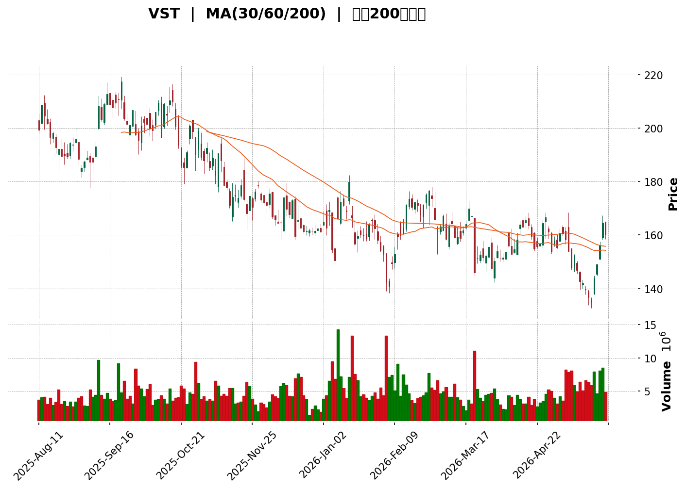
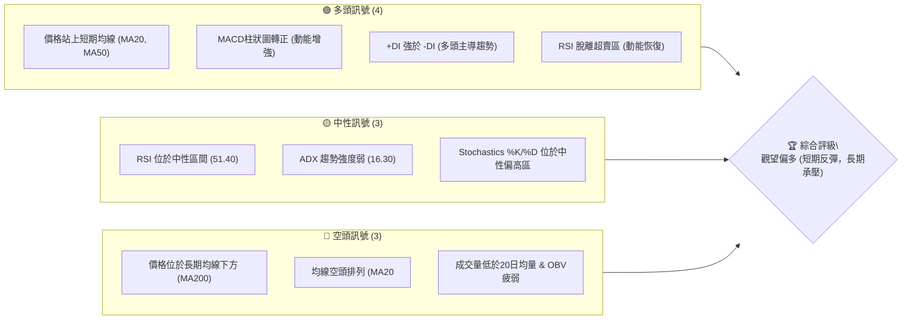
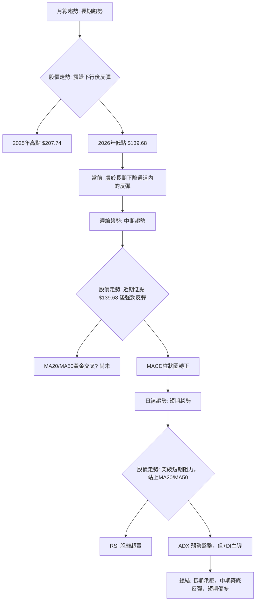
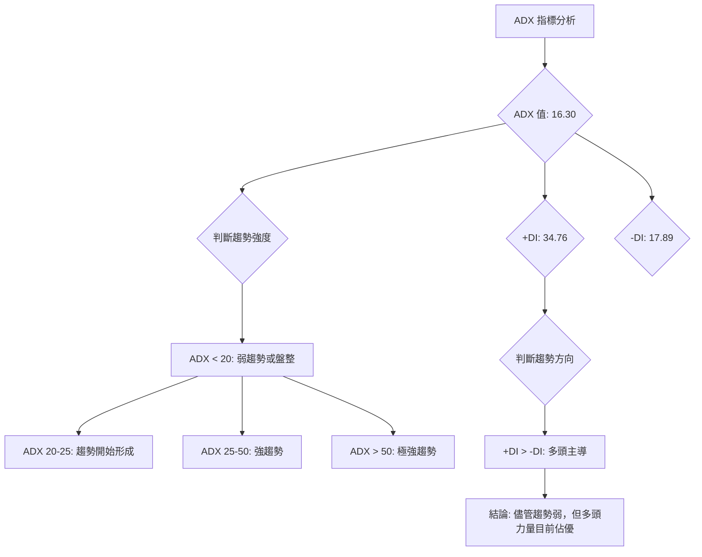
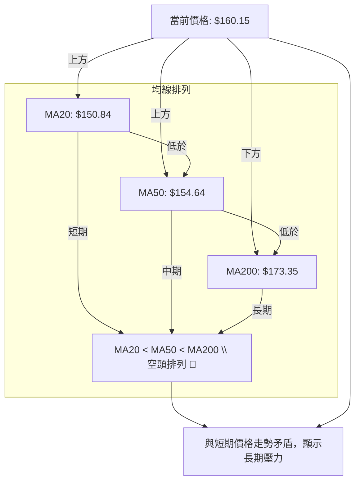
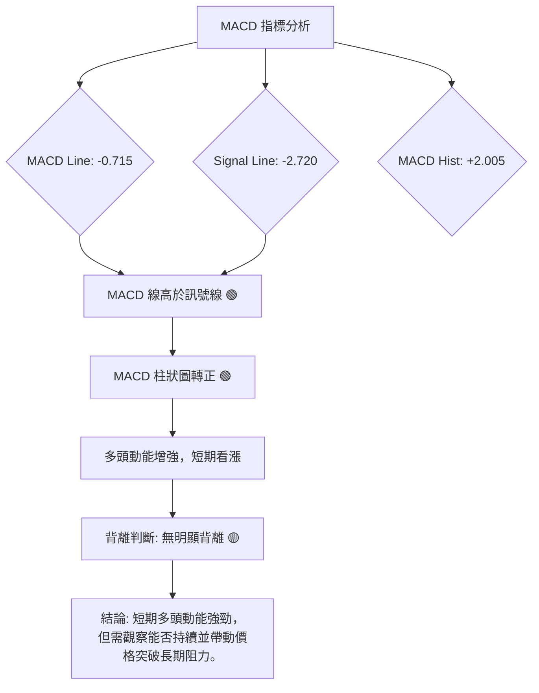

<details>
<summary>📊 靜態圖表 (點擊展開)</summary>

</details>

<html>
<head><meta charset="utf-8" /></head>
<body>
    <div>                        <script>window.PlotlyConfig = {MathJaxConfig: 'local'};</script>
        <script charset="utf-8" src="https://cdn.plot.ly/plotly-3.5.0.min.js" integrity="sha256-fHbNLP+GlIXN+efbQec78UkemUz3NJp7UmfGxC1tNxs=" crossorigin="anonymous"></script>                <div id="candlestick-chart" class="plotly-graph-div" style="height:500px; width:100%;"></div>            <script>                window.PLOTLYENV=window.PLOTLYENV || {};                                if (document.getElementById("candlestick-chart")) {                    Plotly.newPlot(                        "candlestick-chart",                        [{"close":{"dtype":"f8","bdata":"AAAAwBHqaEAAAADARBhqQAAAACDVj2lAAAAAgG4yaUAAAADgZ5JoQAAAAOBdxmhAAAAAwPMYaEAAAADAgQVoQAAAACCrsWdAAAAAQGi3Z0AAAAAAS6tnQAAAAMD0S2hAAAAAQGE7aEAAAACgUn5oQAAAAEBfjGdAAAAAAC0jZ0AAAAAg0GxnQAAAAMAioGdAAAAA4PxoZ0AAAABgTmlnQAAAAKA9IWhAAAAAoBwNakAAAACAn2hpQAAAAGC7HGpAAAAAIIGWakAAAAAAIBRqQAAAAABs8GlAAAAAQGUrakAAAABgWVZqQAAAAIA+KmtAAAAAYLB1aUAAAAAAHzBpQAAAAGAUImlAAAAAYMnUaUAAAADgpKxoQAAAAIAubGhAAAAAwJEeaUAAAADg8kJpQAAAACDjLWlAAAAAgHf7aEAAAACAQeJoQAAAAMBnv2lAAAAAgIAtakAAAADgLYpoQAAAAEAkH2pAAAAAgDeeaUAAAACAoEhqQAAAACBEOmpAAAAAwHYZaUAAAAAAkjZoQAAAAMA1QGdAAAAA4DAqZ0AAAACA+9pnQAAAAABLHWlAAAAAYAvYaEAAAABgF8JnQAAAACBH2mhAAAAAYAKmZ0AAAABgA3lnQAAAAIBGEGhAAAAAoFEnZ0AAAAAAzJtnQAAAAMCTA2dAAAAA4CzPZ0AAAADgX3hnQAAAAKBWVWZAAAAA4O84ZkAAAADAzmJlQAAAAECxxmVAAAAAoJXQZUAAAABgE75lQAAAACCzVGZAAAAAoPipZUAAAACABwRlQAAAAGAN1WVAAAAAwNRLZUAAAADABgpmQAAAAMDDS2ZAAAAAIC+lZUAAAACgZoJlQAAAAACuZWVAAAAAILvyZUAAAADgttZkQAAAAAA1tWRAAAAAAGeLZEAAAAAA5JZkQAAAAADSw2VAAAAAYDc0ZUAAAADgLflkQAAAAAAfn2VAAAAA4PLwY0AAAABgzbZkQAAAAGCZUmRAAAAAYDIrZEAAAACAZC5kQAAAAACpN2RAAAAAgGQuZEAAAAAg0zNkQAAAAEDATGRAAAAAAIcjZEAAAABAKKBkQAAAAECoVmRAAAAA4JEpZUAAAAAAdkxjQAAAAKCizGJAAAAAYJbEZEAAAACACYtlQAAAAKD3ZWVAAAAAoKwXZUAAAADA531mQAAAAADwy2RAAAAAgBWTY0AAAAAgqvljQAAAAICHBGRAAAAAINz8Y0AAAABA\u002f9JjQAAAAMAogWRAAAAAYEKtZEAAAAAAeUtkQAAAACBMxGNAAAAAYJhBY0AAAACgVBljQAAAAGBtymFAAAAA4ADcYUAAAADARq5iQAAAACBfGGNAAAAAID7sY0AAAACA0f1jQAAAACAXXGRAAAAAYDRoZUAAAABAMK5lQAAAAADOSmVAAAAAAHuIZUAAAAAAVGVlQAAAAABJ8mRAAAAAwFtsZUAAAAAg4ONlQAAAAECIEmZAAAAAYOa0ZUAAAADAcbhkQAAAAOBZL2RAAAAAIGZkZEAAAACggOVkQAAAAEDizWNAAAAAALVsZEAAAAAgooVkQAAAAKAu3mNAAAAAgJrrY0AAAACAeNdjQAAAAGCeOGRAAAAAgGWDZEAAAACAbDxlQAAAAECL5GRAAAAA4KNAYkAAAACgR+liQAAAAEAKF2NAAAAA4FHwYkAAAACgmQljQAAAACBcb2NAAAAAoEdxYkAAAABgj8piQAAAAGC4PmNAAAAAgMLlYkAAAABA4fJiQAAAAIDCNWNAAAAA4Hp8Y0AAAAAAABhjQAAAACBcV2NAAAAAYGbGY0AAAABACn9kQAAAAIAUXmRAAAAAwPWwZEAAAABguG5kQAAAAEAz82NAAAAAwB5dY0AAAACgR3ljQAAAAEAzm2NAAAAAQDOLZEAAAABgj9JkQAAAAADXI2RAAAAAoEc5Y0AAAABA4bpjQAAAAMD1aGNAAAAAQDMbZEAAAAAAKQxkQAAAAKBHyWNAAAAAYGY+Y0AAAABACndiQAAAAKCZAWNAAAAAANdbYkAAAAAghdNhQAAAAMDMvGFAAAAAgMJ1YUAAAAAAABhhQAAAAGC41mBAAAAAAAAAYkAAAABgj6JiQAAAAOCjiGNAAAAAgOuRZEAAAADAzARkQA=="},"high":{"dtype":"f8","bdata":"YzmlqXqtaUDFhSEXBSVqQHNMHAL8i2pAvyKKFlrjaUBRmkpzsXVpQGl+enZk1GhAT1tj4Uu5aEDvH\u002fzdAhRoQG9dDVOvfWhAVur48RFYaED+bc1qnD1oQAO\u002fXOTZXGhAEDOo9dqPaEBy3iaZghNpQEph+c5mX2hA2Tdy+EhFZ0AKJoBGhXpnQPZ4kysB7GdA1X+hbGzWZ0AMNes\u002fb7pnQLZpf\u002foRWGhAIkF2PxqCakA84xuj3GJqQI1FxBwmLWpAgew+wCAia0CjDsQwbp9qQN\u002fexhdun2pARZSxIXi0akCxpJwlC6hqQLT0j4fgZmtAliRx4byFakAhKmpP0rNpQOn9frdTdmlAxNWZz7jdaUCCdmGU0dFpQBoOy5dW\u002fmhAKtm1QLWLaUAEGYkh8Y1pQKeHDjziM2pAGKOQrHHraUB6HTXTw2hpQBQeouVRwWlAzcwP36VPakDAG8H+IXlqQHJ+5\u002frnK2pAMzZDjs0IakDHEIcTF+5qQPH7T4kTEGtAveoF8BgvakAb1Rz25Z1pQI1Rx+ZmHGhAS1iqvU6fZ0B4cnIoePVnQE3OWsw0LmlArpFkLi5jaUAASD\u002f5sphoQOKQ2JStBWlARwROEbrIaEB10lYefQtoQKP0N+TiVGhABdbm9c\u002feZ0AWOVTOPv5nQOYA+EUuk2dA7tEMj5HRZ0B+mtqdQ4hoQDrI+2GGbWdA+JhfTKGZZkASylZNCy9mQAI8hQIlcGZAHMMXktNgZkD8gEC5zx1mQIbGtAcDoGZAaTfJGJuYZ0Cj6B34daZlQNFPo4X31mVAnRN55\u002ffHZUDMP8+zVyhmQCfstG23iGZABc+QVND\u002fZUCdN4e05u5lQJYvoePiq2VAsybkmeoxZkBaLE\u002fsmQRmQKZZLyp162RA9ThpPicuZUCJsAcVBLJkQIcW6xUTzWVAdoOH3yRwZkC+TpHCwpBlQAKVBk1wrmVAH49iaQ3VZUAOHV61S25lQG7tRGcFXmVA0Pzwy8GCZEB+O7yYQ29kQOZafwaiS2RAkWZ5COVYZEBRi5vpPX9kQCMM\u002ftbPWmRAhH7IP9SIZEBIB+GtlCFlQBCorCF6bWVAdNbt4P6LZUDXz7+1cg1lQLflcfjOcmNA1pIKGBDQZUAZU8PT+Q9mQCcXvWbA5mVA1lBpNkxeZUCmq54w9slmQPVEnU5hXGVA9DKGcMO4ZED7y5yATDhkQI87HFXfaGRA\u002f1ukb71UZECxLX22tqJkQNl+gNupjGRAF42pu6jKZEAbg0B61\u002fRkQGcTUj7UiGRAA2KUymL4Y0BBQUGRLYljQG667u1rLmNA2\u002fU3wNj2YUAIhsC\u002frgFjQORfC0QrcmNAiEVjMGcmZEA7+UWqtqJkQAEXM4t5v2RAjYlXGqNtZUDnQehaGQ1mQPhbqXtZ6GVAaJQAuLeKZUAqNJnQb6hlQM3xCopjc2VAOoyXlEZuZUBzDvkGafZlQK1Ft0yiH2ZAwS\u002f5rCVCZkAHX2j98QhmQJNq99PUaWRA9lKy449\u002fZEDeMJDDt\u002fdkQMTSR+rRBGVAL+9wuvuMZED6pnwC7BFlQGLqqBmIeGRAatMJGklfZECoi8QNeqBkQBVGJWbfaGRAKpe044GnZEAYZBxcdZhlQIY2SZ3OK2VAAAAAQArPZEAAAADAzHxjQAAAAEAzQ2NAAAAAYGa+Y0AAAACgcBVjQAAAAGBmBmRAAAAAgMLdY0AAAABACu9iQAAAAEDhimNAAAAAgOtRY0AAAAAgXCNjQAAAAMAeRWNAAAAAgOspZEAAAADA9VBkQAAAAAAp1GNAAAAAQAoXZEAAAADA9ahkQAAAAOCj0GRAAAAAoHDdZEAAAAAgrg9lQAAAAKCZgWRAAAAAQDMjZEAAAABgj+JjQAAAAADX22NAAAAAIFyvZEAAAACgcA1lQAAAAGBmamRAAAAAwHIkZEAAAAAAKfRjQAAAAOB6BGRAAAAAAClMZEAAAACgmXlkQAAAACCuX2RAAAAA4HoMZUAAAAAAAGBjQAAAAAAAGGNAAAAAAFbKYkAAAADA9UhiQAAAAKBw6WFAAAAAQOGiYUAAAACgR3FhQAAAAGBmFmFAAAAAwMwcYkAAAADA9ahiQAAAAIA9smNAAAAAwMzsZEAAAABAtKBkQA=="},"hovertemplate":"\u003cb\u003e%{x|%Y-%m-%d}\u003c\u002fb\u003e\u003cbr\u003e\u958b: $%{open:.2f}\u003cbr\u003e\u9ad8: $%{high:.2f}\u003cbr\u003e\u4f4e: $%{low:.2f}\u003cbr\u003e\u6536: $%{close:.2f}\u003cextra\u003e\u003c\u002fextra\u003e","low":{"dtype":"f8","bdata":"UJ1zbsK9aEDwdGCXI\u002fdoQMohwg2z8GhAJb5qwYQwaUB3K2j3EkJoQO0WFtCxUWhAs2bIolDPZ0B1OBwnsuRmQCOoKCa+qGdAn6GSyJJNZ0DiMTGxbZJnQJs\u002ft84FlGdAsOItc2zxZ0CyWrJtBDxoQEsGUMXoPmdAYpGxUZesZkBJ7O\u002fSUPRmQO84e8RcgmdAfQcxQus3ZkDGfOQq7PxmQO6UjXOPj2dAGDc02oTnaEDVU+jkVkppQGo31NeXJ2lA65ukU7scakBIMQ0OrNBpQJQ7rS9jfGlA1M5EPiLoaUCrswd30JNpQMmVDbVL52lAf2jpNsxcaUDyf9vIDippQA72FMINb2hAoP\u002fL9qcNaUDOJIcp\u002fKRoQGo45\u002faZxWdAKfrQHoP0Z0DM8FdZN8VoQCsVyAxAHmlAajQGc16caEAGGL6ZEGtoQD5OF1hv8mhAAMASEqKYaUD0bXtzioloQJZwbLUl+2hANH3ZDg8baUATuHlZnrppQGulRnKBA2pAJp\u002fAcPrvaEAfYHAw1whoQJx2RczkIWdAmBI8nPlkZkDtysmCXCZnQDNd\u002fusOQmhATLb747B+aEDtiBZiyv5mQNrhuJ9ZnmdA281QAqyAZ0DvZIdqeeBmQLuwbWCGamdAdEJpdr\u002f\u002fZkDCeYMzeA1nQEfFBEglYWZAS3i72aQDZkBsU8\u002fI5fRmQK13jEQrSmZAkGhsuakZZkDU+ciTnkFlQHV+FY75o2RA3Wc8BZeUZUDB6iFKFkZlQEfDK3Oxt2VA4AUE4uiUZUASRhxvxT9kQJ+\u002f9Z0vrmRABPUuiViuZEAXZx5GeZNlQKvVA6ujMGZAFLFgLN6GZUAH2L\u002fYlVxlQKzNtoKED2VAL7b1QQ5AZUCmggNJYMBkQNFp7\u002fN3c2RA0b\u002fWbdmIZECmtxkn08ZjQGaR0BQjEmRAAMXIwT7hZEDHVaajptBkQMsgE9ntwmRAqNSVo2vIY0CIq21NHEdkQJpJD3ERSGRAjdgEKTAUZEBd+GwPLv1jQLVlaPCs8WNAMxju2jUEZEBhdeihmPZjQEq3oSjmGmRA0mhBGgMgZEBXHSD0VXVkQM8v1dMY\u002f2NAQMXTCtJxZECXXUM0lipjQIdaJ5yTn2JA94nV1+20ZEBcqKxaaHtkQKuJGzLLUmVAFY72lVy6ZEBBbHObRm5lQDZufLA2WWRAmRnkPzCBY0BngkTf7zFjQPl+9KDc3WNA2xmGyBy5Y0AM9L2n6rVjQMuu3s\u002fnvWNAXATgPhgeZEABhsFPPdFjQHAuvaCulGNABp8S0T46Y0BVlX\u002f6\u002fMViQB76+6SRYmFAsfxTyutKYUDXd6aCA2diQLEsdIuEcmJALhzH1CtTY0Bmcww7sMpjQO6ThsHOBWRAO0Hgu\u002fUoZECifljA\u002fTZlQNDLnFYgLGVAtgNzbaoAZUCD6msIohhlQKjHbKeEn2RAnypsSQ9VZECpDpxMJTtlQOxk2rZdfGRA\u002fzNi2gdVZUCJHhvJVLNkQC6As++wGGNAggMryM4FZEBfl0w1ti5kQKcD5AezwmNAdyb+Mj5ZY0C4K2fvmIJkQDHTyV8JXmNAxU7io5GPY0DTInvde7BjQJ7Q7FqK\u002fGNA4nO8ycU8ZEBZfd4OyahkQDFhYGozgGRAAAAAYI8aYkAAAABguKpiQAAAAKCZsWJAAAAAACnMYkAAAAAgrk9iQAAAAAAA+GJAAAAAQDNTYkAAAABA4cphQAAAAMDM7GJAAAAAANfDYkAAAAAAKbxiQAAAAMD1yGJAAAAAoEdpY0AAAACAwhVjQAAAACCFI2NAAAAAwMwUY0AAAABACgtkQAAAAMDMRGRAAAAAIIVTZEAAAADgUUhkQAAAAIA9ymNAAAAAAClEY0AAAACgcF1jQAAAAAAAUGNAAAAAwMxkY0AAAAAghddjQAAAAEAK12NAAAAAYI8iY0AAAAAgXHdjQAAAAIDCXWNAAAAAgBSuY0AAAACgmfljQAAAAEAzk2NAAAAA4KM4Y0AAAAAgXF9iQAAAAGDlSGJAAAAAwB41YkAAAADgUXBhQAAAAACBfWFAAAAAgOs5YUAAAAAghbtgQAAAAMAelWBAAAAAgOs5YUAAAAAAKRxiQAAAAAAA2GJAAAAAQArHY0AAAABgDs1jQA=="},"name":"\u50f9\u683c","open":{"dtype":"f8","bdata":"wKPWUkdaaUAkDgwLiDdpQJHFDARaLGpAHUv\u002fMFVraUCvHm3TJkdpQHMF7erih2hAHJdUyYyWaEB5YALanshnQM0LESRgCGhAG9w0cRXNZ0DPuN5\u002f1dlnQG19nXYWt2dAmPAoRnQyaED3mfGggU5oQMMY3PKpWWhAdH+fmwL7ZkDCOnuOOylnQNKHCIDdiGdAuYKYXrawZ0Dg2Cg9rJtnQNryYlK+qGdAzJfBbhj4aED5nNBnZ\u002f9pQFojy+vCRGlA65ukU7scakCjDsQwbp9qQP3dppaTT2pA\u002fmX7Ss+PakCo\u002fBy+IltqQCNjAOxpTWpA64CtAAMxakAwCZZQalZpQIi88AGPrmhAv6XBQK0UaUCmbAnSNC5pQG0zXqKI1GhAxXGDrdJOaECi3ppnTm9pQKw\u002f0AczeWlAChhe1vWyaUC69MsGfCBpQHSc4pPNIGlAZmZmJsTNaUCukvW51yVqQLsW+7gfEmlAUV+U7yanaUDjqodAzRdqQHKV2QBcxmpAGyd9myXjaUD1+9faLXJpQKoIIHQrC2hAupqyVhRhZ0DtysmCXCZnQI+\u002fItLhgWhArpFkLi5jaUAASD\u002f5sphoQPkcZC6p+GdA20oAbZxEaEDi+jpQFu9nQHwhiakcyWdAr+T7h6FyZ0BewnGV6TdnQI3KFaNezGZA56xBwUZAZkC2TeS3cEhoQMjgQQ8QLWdA\u002fCkD7Kx6ZkA71+haiQ1mQB3hrZkI12RAFt+obU7eZUBp60ww6YVlQNVhiMCw1WVAtw9bxfUJZ0BUrX5a2XBlQBgdNZtNI2VAjXXQzzmzZUAdzv9DrLBlQFqLy3c7UGZAcLbnrdDwZUA9bpV7Wd1lQD\u002f1WTnphWVAdJyhaKhtZUAl\u002flRHFwFmQKZZLyp162RAJU4330WdZEDhpZ\u002fKUJxkQBTqBWFTM2RAeVTafffWZUB9OHIJfI9lQCsM1rcexmRABDDF5P2wZUBAFzAAh6ZkQMUOjj23x2RA3QOYwdl4ZEDZ7qZ9MitkQDx4GpOpGGRAAAAAgGQuZEAF0dI\u002f+xhkQKPYNivwOGRA4zdRF2FVZEBXHSD0VXVkQBXhqeF0JGVA0hcfCqIYZUDXz7+1cg1lQHMWt3s7YWNA4Wld6\u002fXCZUC1fi4FQ45kQKFBODVquGVAExEikBglZUCtVVpgdZhlQOPT58VL6mRAxKTvGZwhZEDVa3BlY9ljQESyk1qzNmRA8RbPdgb5Y0D4dtAi4QtkQE8EcMJd6WNAhiiEe8O4ZEAoXI5HfLdkQIyI57j1KGRAwRoka+2tY0DOzdjOCH1jQBwGsOxmH2NAiTLLedqZYUBSURoYdrliQPL\u002fEgV2uWJA5Sd7ss4FZEBmf+mfzphkQHSuwnJaEGRA5B68cLhFZEAwOWD\u002ftVRlQMYdafy7uGVAYa4hp7Y1ZUBrKc\u002fUFoJlQHYHWI4KTWVAbNsB76rhZEBU6aZBpYRlQDBOic4MZGVAiNH0HF\u002fYZUBwJbME+z5lQCyCjRwIL2RA+oePANYrZEAG7eN5GjVkQHjb8CU7h2RA47i+5wB2Y0CLzmrJT6RkQKgxz5MRbGRA6JE\u002fZrabY0BQHPujRDFkQHiLUEz7GGRAa2l6ltJSZEDX0aRExrBkQBNbWhsn3mRAAAAAQArPZEAAAABgZu5iQAAAAKCZ0WJAAAAAAABgY0AAAAAAALBiQAAAAAAA+GJAAAAAQDOjY0AAAADAzPxhQAAAAEAK72JAAAAAYLjmYkAAAACgR+FiQAAAAIA94mJAAAAAAAAYZEAAAADgenxjQAAAAAAAMGNAAAAAwMwUY0AAAADAHk1kQAAAAAAAsGRAAAAAgD2SZEAAAADgUchkQAAAAKCZYWRAAAAA4FEYZEAAAACgmbljQAAAAGC4fmNAAAAAYI+KY0AAAAAAAKBkQAAAAAAAUGRAAAAAIIUbZEAAAACgR4ljQAAAAIDryWNAAAAAgBS2Y0AAAAAAAGBkQAAAAADXL2RAAAAAoEdhZEAAAAAAAGBjQAAAAAAAgGJAAAAAIK6vYkAAAADA9UhiQAAAAAAprGFAAAAAwMx4YUAAAAAAAGBhQAAAAKCZ+WBAAAAAAABAYUAAAABACi9iQAAAAMD14GJAAAAAwB7dY0AAAABguJ5kQA=="},"x":["2025-08-11T00:00:00-04:00","2025-08-12T00:00:00-04:00","2025-08-13T00:00:00-04:00","2025-08-14T00:00:00-04:00","2025-08-15T00:00:00-04:00","2025-08-18T00:00:00-04:00","2025-08-19T00:00:00-04:00","2025-08-20T00:00:00-04:00","2025-08-21T00:00:00-04:00","2025-08-22T00:00:00-04:00","2025-08-25T00:00:00-04:00","2025-08-26T00:00:00-04:00","2025-08-27T00:00:00-04:00","2025-08-28T00:00:00-04:00","2025-08-29T00:00:00-04:00","2025-09-02T00:00:00-04:00","2025-09-03T00:00:00-04:00","2025-09-04T00:00:00-04:00","2025-09-05T00:00:00-04:00","2025-09-08T00:00:00-04:00","2025-09-09T00:00:00-04:00","2025-09-10T00:00:00-04:00","2025-09-11T00:00:00-04:00","2025-09-12T00:00:00-04:00","2025-09-15T00:00:00-04:00","2025-09-16T00:00:00-04:00","2025-09-17T00:00:00-04:00","2025-09-18T00:00:00-04:00","2025-09-19T00:00:00-04:00","2025-09-22T00:00:00-04:00","2025-09-23T00:00:00-04:00","2025-09-24T00:00:00-04:00","2025-09-25T00:00:00-04:00","2025-09-26T00:00:00-04:00","2025-09-29T00:00:00-04:00","2025-09-30T00:00:00-04:00","2025-10-01T00:00:00-04:00","2025-10-02T00:00:00-04:00","2025-10-03T00:00:00-04:00","2025-10-06T00:00:00-04:00","2025-10-07T00:00:00-04:00","2025-10-08T00:00:00-04:00","2025-10-09T00:00:00-04:00","2025-10-10T00:00:00-04:00","2025-10-13T00:00:00-04:00","2025-10-14T00:00:00-04:00","2025-10-15T00:00:00-04:00","2025-10-16T00:00:00-04:00","2025-10-17T00:00:00-04:00","2025-10-20T00:00:00-04:00","2025-10-21T00:00:00-04:00","2025-10-22T00:00:00-04:00","2025-10-23T00:00:00-04:00","2025-10-24T00:00:00-04:00","2025-10-27T00:00:00-04:00","2025-10-28T00:00:00-04:00","2025-10-29T00:00:00-04:00","2025-10-30T00:00:00-04:00","2025-10-31T00:00:00-04:00","2025-11-03T00:00:00-05:00","2025-11-04T00:00:00-05:00","2025-11-05T00:00:00-05:00","2025-11-06T00:00:00-05:00","2025-11-07T00:00:00-05:00","2025-11-10T00:00:00-05:00","2025-11-11T00:00:00-05:00","2025-11-12T00:00:00-05:00","2025-11-13T00:00:00-05:00","2025-11-14T00:00:00-05:00","2025-11-17T00:00:00-05:00","2025-11-18T00:00:00-05:00","2025-11-19T00:00:00-05:00","2025-11-20T00:00:00-05:00","2025-11-21T00:00:00-05:00","2025-11-24T00:00:00-05:00","2025-11-25T00:00:00-05:00","2025-11-26T00:00:00-05:00","2025-11-28T00:00:00-05:00","2025-12-01T00:00:00-05:00","2025-12-02T00:00:00-05:00","2025-12-03T00:00:00-05:00","2025-12-04T00:00:00-05:00","2025-12-05T00:00:00-05:00","2025-12-08T00:00:00-05:00","2025-12-09T00:00:00-05:00","2025-12-10T00:00:00-05:00","2025-12-11T00:00:00-05:00","2025-12-12T00:00:00-05:00","2025-12-15T00:00:00-05:00","2025-12-16T00:00:00-05:00","2025-12-17T00:00:00-05:00","2025-12-18T00:00:00-05:00","2025-12-19T00:00:00-05:00","2025-12-22T00:00:00-05:00","2025-12-23T00:00:00-05:00","2025-12-24T00:00:00-05:00","2025-12-26T00:00:00-05:00","2025-12-29T00:00:00-05:00","2025-12-30T00:00:00-05:00","2025-12-31T00:00:00-05:00","2026-01-02T00:00:00-05:00","2026-01-05T00:00:00-05:00","2026-01-06T00:00:00-05:00","2026-01-07T00:00:00-05:00","2026-01-08T00:00:00-05:00","2026-01-09T00:00:00-05:00","2026-01-12T00:00:00-05:00","2026-01-13T00:00:00-05:00","2026-01-14T00:00:00-05:00","2026-01-15T00:00:00-05:00","2026-01-16T00:00:00-05:00","2026-01-20T00:00:00-05:00","2026-01-21T00:00:00-05:00","2026-01-22T00:00:00-05:00","2026-01-23T00:00:00-05:00","2026-01-26T00:00:00-05:00","2026-01-27T00:00:00-05:00","2026-01-28T00:00:00-05:00","2026-01-29T00:00:00-05:00","2026-01-30T00:00:00-05:00","2026-02-02T00:00:00-05:00","2026-02-03T00:00:00-05:00","2026-02-04T00:00:00-05:00","2026-02-05T00:00:00-05:00","2026-02-06T00:00:00-05:00","2026-02-09T00:00:00-05:00","2026-02-10T00:00:00-05:00","2026-02-11T00:00:00-05:00","2026-02-12T00:00:00-05:00","2026-02-13T00:00:00-05:00","2026-02-17T00:00:00-05:00","2026-02-18T00:00:00-05:00","2026-02-19T00:00:00-05:00","2026-02-20T00:00:00-05:00","2026-02-23T00:00:00-05:00","2026-02-24T00:00:00-05:00","2026-02-25T00:00:00-05:00","2026-02-26T00:00:00-05:00","2026-02-27T00:00:00-05:00","2026-03-02T00:00:00-05:00","2026-03-03T00:00:00-05:00","2026-03-04T00:00:00-05:00","2026-03-05T00:00:00-05:00","2026-03-06T00:00:00-05:00","2026-03-09T00:00:00-04:00","2026-03-10T00:00:00-04:00","2026-03-11T00:00:00-04:00","2026-03-12T00:00:00-04:00","2026-03-13T00:00:00-04:00","2026-03-16T00:00:00-04:00","2026-03-17T00:00:00-04:00","2026-03-18T00:00:00-04:00","2026-03-19T00:00:00-04:00","2026-03-20T00:00:00-04:00","2026-03-23T00:00:00-04:00","2026-03-24T00:00:00-04:00","2026-03-25T00:00:00-04:00","2026-03-26T00:00:00-04:00","2026-03-27T00:00:00-04:00","2026-03-30T00:00:00-04:00","2026-03-31T00:00:00-04:00","2026-04-01T00:00:00-04:00","2026-04-02T00:00:00-04:00","2026-04-06T00:00:00-04:00","2026-04-07T00:00:00-04:00","2026-04-08T00:00:00-04:00","2026-04-09T00:00:00-04:00","2026-04-10T00:00:00-04:00","2026-04-13T00:00:00-04:00","2026-04-14T00:00:00-04:00","2026-04-15T00:00:00-04:00","2026-04-16T00:00:00-04:00","2026-04-17T00:00:00-04:00","2026-04-20T00:00:00-04:00","2026-04-21T00:00:00-04:00","2026-04-22T00:00:00-04:00","2026-04-23T00:00:00-04:00","2026-04-24T00:00:00-04:00","2026-04-27T00:00:00-04:00","2026-04-28T00:00:00-04:00","2026-04-29T00:00:00-04:00","2026-04-30T00:00:00-04:00","2026-05-01T00:00:00-04:00","2026-05-04T00:00:00-04:00","2026-05-05T00:00:00-04:00","2026-05-06T00:00:00-04:00","2026-05-07T00:00:00-04:00","2026-05-08T00:00:00-04:00","2026-05-11T00:00:00-04:00","2026-05-12T00:00:00-04:00","2026-05-13T00:00:00-04:00","2026-05-14T00:00:00-04:00","2026-05-15T00:00:00-04:00","2026-05-18T00:00:00-04:00","2026-05-19T00:00:00-04:00","2026-05-20T00:00:00-04:00","2026-05-21T00:00:00-04:00","2026-05-22T00:00:00-04:00","2026-05-26T00:00:00-04:00","2026-05-27T00:00:00-04:00"],"type":"candlestick"},{"hovertemplate":"MA30: $%{y:.2f}\u003cextra\u003e\u003c\u002fextra\u003e","line":{"color":"#2196F3","dash":"dash","width":2},"mode":"lines","name":"MA30","x":["2025-08-11T00:00:00-04:00","2025-08-12T00:00:00-04:00","2025-08-13T00:00:00-04:00","2025-08-14T00:00:00-04:00","2025-08-15T00:00:00-04:00","2025-08-18T00:00:00-04:00","2025-08-19T00:00:00-04:00","2025-08-20T00:00:00-04:00","2025-08-21T00:00:00-04:00","2025-08-22T00:00:00-04:00","2025-08-25T00:00:00-04:00","2025-08-26T00:00:00-04:00","2025-08-27T00:00:00-04:00","2025-08-28T00:00:00-04:00","2025-08-29T00:00:00-04:00","2025-09-02T00:00:00-04:00","2025-09-03T00:00:00-04:00","2025-09-04T00:00:00-04:00","2025-09-05T00:00:00-04:00","2025-09-08T00:00:00-04:00","2025-09-09T00:00:00-04:00","2025-09-10T00:00:00-04:00","2025-09-11T00:00:00-04:00","2025-09-12T00:00:00-04:00","2025-09-15T00:00:00-04:00","2025-09-16T00:00:00-04:00","2025-09-17T00:00:00-04:00","2025-09-18T00:00:00-04:00","2025-09-19T00:00:00-04:00","2025-09-22T00:00:00-04:00","2025-09-23T00:00:00-04:00","2025-09-24T00:00:00-04:00","2025-09-25T00:00:00-04:00","2025-09-26T00:00:00-04:00","2025-09-29T00:00:00-04:00","2025-09-30T00:00:00-04:00","2025-10-01T00:00:00-04:00","2025-10-02T00:00:00-04:00","2025-10-03T00:00:00-04:00","2025-10-06T00:00:00-04:00","2025-10-07T00:00:00-04:00","2025-10-08T00:00:00-04:00","2025-10-09T00:00:00-04:00","2025-10-10T00:00:00-04:00","2025-10-13T00:00:00-04:00","2025-10-14T00:00:00-04:00","2025-10-15T00:00:00-04:00","2025-10-16T00:00:00-04:00","2025-10-17T00:00:00-04:00","2025-10-20T00:00:00-04:00","2025-10-21T00:00:00-04:00","2025-10-22T00:00:00-04:00","2025-10-23T00:00:00-04:00","2025-10-24T00:00:00-04:00","2025-10-27T00:00:00-04:00","2025-10-28T00:00:00-04:00","2025-10-29T00:00:00-04:00","2025-10-30T00:00:00-04:00","2025-10-31T00:00:00-04:00","2025-11-03T00:00:00-05:00","2025-11-04T00:00:00-05:00","2025-11-05T00:00:00-05:00","2025-11-06T00:00:00-05:00","2025-11-07T00:00:00-05:00","2025-11-10T00:00:00-05:00","2025-11-11T00:00:00-05:00","2025-11-12T00:00:00-05:00","2025-11-13T00:00:00-05:00","2025-11-14T00:00:00-05:00","2025-11-17T00:00:00-05:00","2025-11-18T00:00:00-05:00","2025-11-19T00:00:00-05:00","2025-11-20T00:00:00-05:00","2025-11-21T00:00:00-05:00","2025-11-24T00:00:00-05:00","2025-11-25T00:00:00-05:00","2025-11-26T00:00:00-05:00","2025-11-28T00:00:00-05:00","2025-12-01T00:00:00-05:00","2025-12-02T00:00:00-05:00","2025-12-03T00:00:00-05:00","2025-12-04T00:00:00-05:00","2025-12-05T00:00:00-05:00","2025-12-08T00:00:00-05:00","2025-12-09T00:00:00-05:00","2025-12-10T00:00:00-05:00","2025-12-11T00:00:00-05:00","2025-12-12T00:00:00-05:00","2025-12-15T00:00:00-05:00","2025-12-16T00:00:00-05:00","2025-12-17T00:00:00-05:00","2025-12-18T00:00:00-05:00","2025-12-19T00:00:00-05:00","2025-12-22T00:00:00-05:00","2025-12-23T00:00:00-05:00","2025-12-24T00:00:00-05:00","2025-12-26T00:00:00-05:00","2025-12-29T00:00:00-05:00","2025-12-30T00:00:00-05:00","2025-12-31T00:00:00-05:00","2026-01-02T00:00:00-05:00","2026-01-05T00:00:00-05:00","2026-01-06T00:00:00-05:00","2026-01-07T00:00:00-05:00","2026-01-08T00:00:00-05:00","2026-01-09T00:00:00-05:00","2026-01-12T00:00:00-05:00","2026-01-13T00:00:00-05:00","2026-01-14T00:00:00-05:00","2026-01-15T00:00:00-05:00","2026-01-16T00:00:00-05:00","2026-01-20T00:00:00-05:00","2026-01-21T00:00:00-05:00","2026-01-22T00:00:00-05:00","2026-01-23T00:00:00-05:00","2026-01-26T00:00:00-05:00","2026-01-27T00:00:00-05:00","2026-01-28T00:00:00-05:00","2026-01-29T00:00:00-05:00","2026-01-30T00:00:00-05:00","2026-02-02T00:00:00-05:00","2026-02-03T00:00:00-05:00","2026-02-04T00:00:00-05:00","2026-02-05T00:00:00-05:00","2026-02-06T00:00:00-05:00","2026-02-09T00:00:00-05:00","2026-02-10T00:00:00-05:00","2026-02-11T00:00:00-05:00","2026-02-12T00:00:00-05:00","2026-02-13T00:00:00-05:00","2026-02-17T00:00:00-05:00","2026-02-18T00:00:00-05:00","2026-02-19T00:00:00-05:00","2026-02-20T00:00:00-05:00","2026-02-23T00:00:00-05:00","2026-02-24T00:00:00-05:00","2026-02-25T00:00:00-05:00","2026-02-26T00:00:00-05:00","2026-02-27T00:00:00-05:00","2026-03-02T00:00:00-05:00","2026-03-03T00:00:00-05:00","2026-03-04T00:00:00-05:00","2026-03-05T00:00:00-05:00","2026-03-06T00:00:00-05:00","2026-03-09T00:00:00-04:00","2026-03-10T00:00:00-04:00","2026-03-11T00:00:00-04:00","2026-03-12T00:00:00-04:00","2026-03-13T00:00:00-04:00","2026-03-16T00:00:00-04:00","2026-03-17T00:00:00-04:00","2026-03-18T00:00:00-04:00","2026-03-19T00:00:00-04:00","2026-03-20T00:00:00-04:00","2026-03-23T00:00:00-04:00","2026-03-24T00:00:00-04:00","2026-03-25T00:00:00-04:00","2026-03-26T00:00:00-04:00","2026-03-27T00:00:00-04:00","2026-03-30T00:00:00-04:00","2026-03-31T00:00:00-04:00","2026-04-01T00:00:00-04:00","2026-04-02T00:00:00-04:00","2026-04-06T00:00:00-04:00","2026-04-07T00:00:00-04:00","2026-04-08T00:00:00-04:00","2026-04-09T00:00:00-04:00","2026-04-10T00:00:00-04:00","2026-04-13T00:00:00-04:00","2026-04-14T00:00:00-04:00","2026-04-15T00:00:00-04:00","2026-04-16T00:00:00-04:00","2026-04-17T00:00:00-04:00","2026-04-20T00:00:00-04:00","2026-04-21T00:00:00-04:00","2026-04-22T00:00:00-04:00","2026-04-23T00:00:00-04:00","2026-04-24T00:00:00-04:00","2026-04-27T00:00:00-04:00","2026-04-28T00:00:00-04:00","2026-04-29T00:00:00-04:00","2026-04-30T00:00:00-04:00","2026-05-01T00:00:00-04:00","2026-05-04T00:00:00-04:00","2026-05-05T00:00:00-04:00","2026-05-06T00:00:00-04:00","2026-05-07T00:00:00-04:00","2026-05-08T00:00:00-04:00","2026-05-11T00:00:00-04:00","2026-05-12T00:00:00-04:00","2026-05-13T00:00:00-04:00","2026-05-14T00:00:00-04:00","2026-05-15T00:00:00-04:00","2026-05-18T00:00:00-04:00","2026-05-19T00:00:00-04:00","2026-05-20T00:00:00-04:00","2026-05-21T00:00:00-04:00","2026-05-22T00:00:00-04:00","2026-05-26T00:00:00-04:00","2026-05-27T00:00:00-04:00"],"y":{"dtype":"f8","bdata":"AAAAAAAA+H8AAAAAAAD4fwAAAAAAAPh\u002fAAAAAAAA+H8AAAAAAAD4fwAAAAAAAPh\u002fAAAAAAAA+H8AAAAAAAD4fwAAAAAAAPh\u002fAAAAAAAA+H8AAAAAAAD4fwAAAAAAAPh\u002fAAAAAAAA+H8AAAAAAAD4fwAAAAAAAPh\u002fAAAAAAAA+H8AAAAAAAD4fwAAAAAAAPh\u002fAAAAAAAA+H8AAAAAAAD4fwAAAAAAAPh\u002fAAAAAAAA+H8AAAAAAAD4fwAAAAAAAPh\u002fAAAAAAAA+H8AAAAAAAD4fwAAAAAAAPh\u002fAAAAAAAA+H8AAAAAAAD4f6uqqpq2y2hAZmZmBl7QaECJiIgIochoQJqZmXn4xGhAd3d352HKaEDe3d3NQctoQJqZmTlAyGhAERERsfjQaEB3d3eHjdtoQAAAABA66GhA7+7uXgfzaEC8u7vrZP1oQO\u002fu7p7GCWlAMzMzQ2EaaUAAAABwxhppQAAAAPC7MGlARERE9OZFaUBERETES15pQERERBSAdGlAq6qqiuqCaUAREREhwolpQN7d3d1BgmlAiYiIaKBpaUBVVVU1X1xpQGZmZnbbU2lAvLu7q\u002flEaUBVVVWVLDFpQGZmZhbnJ2lAq6qqymMSaUDe3d398floQKuqqsp632hAd3d398zLaEC8u7u7Ur5oQBEREWE9rGhA3t3dbfyaaEDNzMzctZBoQN7d3d3hfmhAVVVVRSlmaEAAAAAAF0VoQN7d3c0MKGhAZmZmRgUNaEAAAADwNvJnQImIiMgO1WdAERERQYquZ0CJiIjod5BnQLy7u4vda2dAMzMzY\u002fxGZ0AAAAAQxCJnQAAAAEA3AWdAVVVVZb3jZkAiIiLiqsxmQO\u002fu7o7ZvGZARERExHeyZkDv7u6+uZhmQJqZmWkfc2ZARERERG9OZkBVVVUFZTNmQImIiMgLGWZA7+7uri8EZkBERETE2+5lQN7d3R0F2mVA7+7ujpu+ZUB3d3dn6KVlQAAAACDxjmVA3t3dPeBvZUBERERUz1NlQCIiIgLBQWVAZmZm9lUwZUAiIiKCPCZlQImIiGijGWVA7+7uHlYLZUCJiIhIzgFlQLy7u+vN8GRAq6qqOobsZEDv7u4+391kQCIiItL9w2RA3t3dvXu\u002fZECamZkZQLtkQJqZmSmXs2RAzczMnN+uZECJiIjIQbdkQJqZmdkhsmRAiYiImOCdZEDe3d1NgpZkQHd3d6eekGRAq6qqSt6LZECrqqqqVoVkQKuqqkqVemRAiYiIqBV2ZEDNzMxcS3BkQImIiIh3YGRA7+7uLp9aZEBERETk1kxkQDMzM9M7N2RAmpmZ+YYjZEDv7u4uuRZkQHd3d6clDWRAzczMLPEKZEAiIiJSJAlkQHd3dzenCWRAvLu7y3kUZEAAAAAQeh1kQERERHSdJWRAvLu7W8coZEAAAACgrDpkQImIiPj+TGRA3t3dnZZSZEBERES0jFVkQCIiIkJNW2RAq6qq6opgZEAiIiJibVFkQN7d3S01TGRAVVVVVS9TZEARERHRC1tkQCIiIoI5WWRAAAAA8PNcZEDNzMxM6GJkQAAAAJB5XWRAiYiICAVXZEBmZmYmJ1NkQCIiIsIHV2RAvLu7y8FhZEAzMzNT\u002fnNkQJqZmcl2jmRA3t3djdGRZEDNzMwMyZNkQAAAALC9k2RAIiIi8leLZEAzMzPzM4NkQJqZmdlPe2RAERERsQNiZEAiIiIyXElkQCIiIgLkN2RAREREZGYhZEAzMzOzhAxkQKuqqmqz\u002fWNAvLu76yvtY0De3d0dT9VjQImIiNgAvmNAzczMHIWtY0AzMzNDm6tjQERERAQqrWNAZmZmVrevY0Crqqq6watjQJqZmSkArWNA7+7unvKjY0C8u7urAJtjQHd3dxfFmGNAvLu7+xaeY0DNzMycdaZjQM3MzEzEpWNA3t3dTcOaY0BERERU6Y1jQGZmZjZCgWNAq6qqyhORY0CJiIj4xZpjQDMzM\u002fO2oGNAvLu7O1GjY0BmZmaWbp5jQImIiPjFmmNAREREBA+aY0ARERHx0pFjQBEREcH1hGNAzczMfLF4Y0De3d0t3WhjQLy7uxuhVGNAiYiIWPJHY0ARERExCERjQHd3d7esRWNAvLu7a3VMY0De3d1NYkhjQA=="},"type":"scatter"},{"hovertemplate":"MA60: $%{y:.2f}\u003cextra\u003e\u003c\u002fextra\u003e","line":{"color":"#9C27B0","dash":"dash","width":2},"mode":"lines","name":"MA60","x":["2025-08-11T00:00:00-04:00","2025-08-12T00:00:00-04:00","2025-08-13T00:00:00-04:00","2025-08-14T00:00:00-04:00","2025-08-15T00:00:00-04:00","2025-08-18T00:00:00-04:00","2025-08-19T00:00:00-04:00","2025-08-20T00:00:00-04:00","2025-08-21T00:00:00-04:00","2025-08-22T00:00:00-04:00","2025-08-25T00:00:00-04:00","2025-08-26T00:00:00-04:00","2025-08-27T00:00:00-04:00","2025-08-28T00:00:00-04:00","2025-08-29T00:00:00-04:00","2025-09-02T00:00:00-04:00","2025-09-03T00:00:00-04:00","2025-09-04T00:00:00-04:00","2025-09-05T00:00:00-04:00","2025-09-08T00:00:00-04:00","2025-09-09T00:00:00-04:00","2025-09-10T00:00:00-04:00","2025-09-11T00:00:00-04:00","2025-09-12T00:00:00-04:00","2025-09-15T00:00:00-04:00","2025-09-16T00:00:00-04:00","2025-09-17T00:00:00-04:00","2025-09-18T00:00:00-04:00","2025-09-19T00:00:00-04:00","2025-09-22T00:00:00-04:00","2025-09-23T00:00:00-04:00","2025-09-24T00:00:00-04:00","2025-09-25T00:00:00-04:00","2025-09-26T00:00:00-04:00","2025-09-29T00:00:00-04:00","2025-09-30T00:00:00-04:00","2025-10-01T00:00:00-04:00","2025-10-02T00:00:00-04:00","2025-10-03T00:00:00-04:00","2025-10-06T00:00:00-04:00","2025-10-07T00:00:00-04:00","2025-10-08T00:00:00-04:00","2025-10-09T00:00:00-04:00","2025-10-10T00:00:00-04:00","2025-10-13T00:00:00-04:00","2025-10-14T00:00:00-04:00","2025-10-15T00:00:00-04:00","2025-10-16T00:00:00-04:00","2025-10-17T00:00:00-04:00","2025-10-20T00:00:00-04:00","2025-10-21T00:00:00-04:00","2025-10-22T00:00:00-04:00","2025-10-23T00:00:00-04:00","2025-10-24T00:00:00-04:00","2025-10-27T00:00:00-04:00","2025-10-28T00:00:00-04:00","2025-10-29T00:00:00-04:00","2025-10-30T00:00:00-04:00","2025-10-31T00:00:00-04:00","2025-11-03T00:00:00-05:00","2025-11-04T00:00:00-05:00","2025-11-05T00:00:00-05:00","2025-11-06T00:00:00-05:00","2025-11-07T00:00:00-05:00","2025-11-10T00:00:00-05:00","2025-11-11T00:00:00-05:00","2025-11-12T00:00:00-05:00","2025-11-13T00:00:00-05:00","2025-11-14T00:00:00-05:00","2025-11-17T00:00:00-05:00","2025-11-18T00:00:00-05:00","2025-11-19T00:00:00-05:00","2025-11-20T00:00:00-05:00","2025-11-21T00:00:00-05:00","2025-11-24T00:00:00-05:00","2025-11-25T00:00:00-05:00","2025-11-26T00:00:00-05:00","2025-11-28T00:00:00-05:00","2025-12-01T00:00:00-05:00","2025-12-02T00:00:00-05:00","2025-12-03T00:00:00-05:00","2025-12-04T00:00:00-05:00","2025-12-05T00:00:00-05:00","2025-12-08T00:00:00-05:00","2025-12-09T00:00:00-05:00","2025-12-10T00:00:00-05:00","2025-12-11T00:00:00-05:00","2025-12-12T00:00:00-05:00","2025-12-15T00:00:00-05:00","2025-12-16T00:00:00-05:00","2025-12-17T00:00:00-05:00","2025-12-18T00:00:00-05:00","2025-12-19T00:00:00-05:00","2025-12-22T00:00:00-05:00","2025-12-23T00:00:00-05:00","2025-12-24T00:00:00-05:00","2025-12-26T00:00:00-05:00","2025-12-29T00:00:00-05:00","2025-12-30T00:00:00-05:00","2025-12-31T00:00:00-05:00","2026-01-02T00:00:00-05:00","2026-01-05T00:00:00-05:00","2026-01-06T00:00:00-05:00","2026-01-07T00:00:00-05:00","2026-01-08T00:00:00-05:00","2026-01-09T00:00:00-05:00","2026-01-12T00:00:00-05:00","2026-01-13T00:00:00-05:00","2026-01-14T00:00:00-05:00","2026-01-15T00:00:00-05:00","2026-01-16T00:00:00-05:00","2026-01-20T00:00:00-05:00","2026-01-21T00:00:00-05:00","2026-01-22T00:00:00-05:00","2026-01-23T00:00:00-05:00","2026-01-26T00:00:00-05:00","2026-01-27T00:00:00-05:00","2026-01-28T00:00:00-05:00","2026-01-29T00:00:00-05:00","2026-01-30T00:00:00-05:00","2026-02-02T00:00:00-05:00","2026-02-03T00:00:00-05:00","2026-02-04T00:00:00-05:00","2026-02-05T00:00:00-05:00","2026-02-06T00:00:00-05:00","2026-02-09T00:00:00-05:00","2026-02-10T00:00:00-05:00","2026-02-11T00:00:00-05:00","2026-02-12T00:00:00-05:00","2026-02-13T00:00:00-05:00","2026-02-17T00:00:00-05:00","2026-02-18T00:00:00-05:00","2026-02-19T00:00:00-05:00","2026-02-20T00:00:00-05:00","2026-02-23T00:00:00-05:00","2026-02-24T00:00:00-05:00","2026-02-25T00:00:00-05:00","2026-02-26T00:00:00-05:00","2026-02-27T00:00:00-05:00","2026-03-02T00:00:00-05:00","2026-03-03T00:00:00-05:00","2026-03-04T00:00:00-05:00","2026-03-05T00:00:00-05:00","2026-03-06T00:00:00-05:00","2026-03-09T00:00:00-04:00","2026-03-10T00:00:00-04:00","2026-03-11T00:00:00-04:00","2026-03-12T00:00:00-04:00","2026-03-13T00:00:00-04:00","2026-03-16T00:00:00-04:00","2026-03-17T00:00:00-04:00","2026-03-18T00:00:00-04:00","2026-03-19T00:00:00-04:00","2026-03-20T00:00:00-04:00","2026-03-23T00:00:00-04:00","2026-03-24T00:00:00-04:00","2026-03-25T00:00:00-04:00","2026-03-26T00:00:00-04:00","2026-03-27T00:00:00-04:00","2026-03-30T00:00:00-04:00","2026-03-31T00:00:00-04:00","2026-04-01T00:00:00-04:00","2026-04-02T00:00:00-04:00","2026-04-06T00:00:00-04:00","2026-04-07T00:00:00-04:00","2026-04-08T00:00:00-04:00","2026-04-09T00:00:00-04:00","2026-04-10T00:00:00-04:00","2026-04-13T00:00:00-04:00","2026-04-14T00:00:00-04:00","2026-04-15T00:00:00-04:00","2026-04-16T00:00:00-04:00","2026-04-17T00:00:00-04:00","2026-04-20T00:00:00-04:00","2026-04-21T00:00:00-04:00","2026-04-22T00:00:00-04:00","2026-04-23T00:00:00-04:00","2026-04-24T00:00:00-04:00","2026-04-27T00:00:00-04:00","2026-04-28T00:00:00-04:00","2026-04-29T00:00:00-04:00","2026-04-30T00:00:00-04:00","2026-05-01T00:00:00-04:00","2026-05-04T00:00:00-04:00","2026-05-05T00:00:00-04:00","2026-05-06T00:00:00-04:00","2026-05-07T00:00:00-04:00","2026-05-08T00:00:00-04:00","2026-05-11T00:00:00-04:00","2026-05-12T00:00:00-04:00","2026-05-13T00:00:00-04:00","2026-05-14T00:00:00-04:00","2026-05-15T00:00:00-04:00","2026-05-18T00:00:00-04:00","2026-05-19T00:00:00-04:00","2026-05-20T00:00:00-04:00","2026-05-21T00:00:00-04:00","2026-05-22T00:00:00-04:00","2026-05-26T00:00:00-04:00","2026-05-27T00:00:00-04:00"],"y":{"dtype":"f8","bdata":"AAAAAAAA+H8AAAAAAAD4fwAAAAAAAPh\u002fAAAAAAAA+H8AAAAAAAD4fwAAAAAAAPh\u002fAAAAAAAA+H8AAAAAAAD4fwAAAAAAAPh\u002fAAAAAAAA+H8AAAAAAAD4fwAAAAAAAPh\u002fAAAAAAAA+H8AAAAAAAD4fwAAAAAAAPh\u002fAAAAAAAA+H8AAAAAAAD4fwAAAAAAAPh\u002fAAAAAAAA+H8AAAAAAAD4fwAAAAAAAPh\u002fAAAAAAAA+H8AAAAAAAD4fwAAAAAAAPh\u002fAAAAAAAA+H8AAAAAAAD4fwAAAAAAAPh\u002fAAAAAAAA+H8AAAAAAAD4fwAAAAAAAPh\u002fAAAAAAAA+H8AAAAAAAD4fwAAAAAAAPh\u002fAAAAAAAA+H8AAAAAAAD4fwAAAAAAAPh\u002fAAAAAAAA+H8AAAAAAAD4fwAAAAAAAPh\u002fAAAAAAAA+H8AAAAAAAD4fwAAAAAAAPh\u002fAAAAAAAA+H8AAAAAAAD4fwAAAAAAAPh\u002fAAAAAAAA+H8AAAAAAAD4fwAAAAAAAPh\u002fAAAAAAAA+H8AAAAAAAD4fwAAAAAAAPh\u002fAAAAAAAA+H8AAAAAAAD4fwAAAAAAAPh\u002fAAAAAAAA+H8AAAAAAAD4fwAAAAAAAPh\u002fAAAAAAAA+H8AAAAAAAD4f6uqqrKY1WhA7+7ufhXOaEAiIiLiecNoQFVVVe2auGhAq6qqKq+yaEBVVVXV+61oQLy7uwuRo2hAMzMz+5CbaEC8u7tDUpBoQO\u002fu7m4jiGhAq6qqUgaAaEDe3d3tzXdoQLy7u7Nqb2hAIiIiwnVkaEBEREQsn1VoQN7d3b1MTmhAvLu7q3FGaEAiIiLqh0BoQCIiIqrbOmhAAAAA+FMzaECamZmBNitoQGZmZraNH2hAZmZmFgwOaEAiIiJ6jPpnQAAAAHB942dAAAAAeLTJZ0BVVVXNSLJnQHd3d295oGdAzczMvEmLZ0ARERHhZnRnQERERPS\u002fXGdAMzMzQzRFZ0CamZmRHTJnQImIiECXHWdA3t3dVW4FZ0CJiIiYQvJmQAAAAHBR4GZA3t3dnT\u002fLZkARERHBqbVmQDMzMxvYoGZAq6qqsi2MZkBEREScAnpmQCIiIlruYmZA3t3dPYhNZkC8u7uTKzdmQO\u002fu7q7tF2ZAiYiIEDwDZkDNzMwUAu9lQM3MzDRn2mVAERERgU7JZUBVVVVV9sFlQERERLR9t2VAZmZmLiyoZUBmZmYGnpdlQImIiAjfgWVAd3d3xyZtZUAAAADYXVxlQJqZmYnQSWVAvLu7qyI9ZUCJiIiQky9lQDMzM1M+HWVA7+7uXp0MZUDe3d2lX\u002flkQJqZmXkW42RAvLu7m7PJZECamZlBRLVkQM3MzFRzp2RAmpmZkaOdZEAiIiJqsJdkQAAAAFClkWRAVVVV9eePZEBEREQspI9kQAAAALA1i2RAMzMzy6aKZEB3d3fvRYxkQFVVVWV+iGRA3t3dLQmJZEDv7u5mZohkQN7d3TVyh2RAvLu7Q7WHZEBVVVWVV4RkQLy7u4Mrf2RA7+7u9od4ZEB3d3cPx3hkQM3MzBTsdGRAVVVVHWl0ZEC8u7t7H3RkQFVVVW0HbGRAiYiIWI1mZECamZlBuWFkQFVVVaW\u002fW2RAVVVVfTBeZEC8u7ubamBkQGZmZk7ZYmRAvLu7Q6xaZEDe3d0dQVVkQLy7u6txUGRAd3d3jyRLZECrqqoiLEZkQImIiIh7QmRAZmZmvj47ZEAREREhazNkQDMzM7vALmRAAAAA4BYlZECamZmpmCNkQJqZmTFZJWRAzczMROEfZEARERHpbRVkQFVVVQ2nDGRAvLu7AwgHZECrqqpShP5jQBEREZmv\u002fGNA3t3dVXMBZEDe3d3FZgNkQN7d3dUcA2RAd3d3R3MAZEBERER89P5jQLy7u1Mf+2NAIiIiAo76Y0CamZlhzvxjQHd3dwdm\u002fmNAzczMjEL+Y0C8u7vT8wBkQAAAAIDcB2RARERErHIRZECrqqqCRxdkQJqZmVE6GmRA7+7ullQXZEDNzMxE0RBkQBEREekKC2RAq6qqWgn+Y0CamZmRl+1jQJqZmeFs3mNAiYiI8AvNY0CJiIjwsLpjQDMzM0MqqWNAIiIiIo+aY0B3d3enq4xjQAAAAMjWgWNARERERP18Y0CJiIjI\u002fnljQA=="},"type":"scatter"},{"hovertemplate":"MA200: $%{y:.2f}\u003cextra\u003e\u003c\u002fextra\u003e","line":{"color":"#FF6F00","dash":"solid","width":2},"mode":"lines","name":"MA200","x":["2025-08-11T00:00:00-04:00","2025-08-12T00:00:00-04:00","2025-08-13T00:00:00-04:00","2025-08-14T00:00:00-04:00","2025-08-15T00:00:00-04:00","2025-08-18T00:00:00-04:00","2025-08-19T00:00:00-04:00","2025-08-20T00:00:00-04:00","2025-08-21T00:00:00-04:00","2025-08-22T00:00:00-04:00","2025-08-25T00:00:00-04:00","2025-08-26T00:00:00-04:00","2025-08-27T00:00:00-04:00","2025-08-28T00:00:00-04:00","2025-08-29T00:00:00-04:00","2025-09-02T00:00:00-04:00","2025-09-03T00:00:00-04:00","2025-09-04T00:00:00-04:00","2025-09-05T00:00:00-04:00","2025-09-08T00:00:00-04:00","2025-09-09T00:00:00-04:00","2025-09-10T00:00:00-04:00","2025-09-11T00:00:00-04:00","2025-09-12T00:00:00-04:00","2025-09-15T00:00:00-04:00","2025-09-16T00:00:00-04:00","2025-09-17T00:00:00-04:00","2025-09-18T00:00:00-04:00","2025-09-19T00:00:00-04:00","2025-09-22T00:00:00-04:00","2025-09-23T00:00:00-04:00","2025-09-24T00:00:00-04:00","2025-09-25T00:00:00-04:00","2025-09-26T00:00:00-04:00","2025-09-29T00:00:00-04:00","2025-09-30T00:00:00-04:00","2025-10-01T00:00:00-04:00","2025-10-02T00:00:00-04:00","2025-10-03T00:00:00-04:00","2025-10-06T00:00:00-04:00","2025-10-07T00:00:00-04:00","2025-10-08T00:00:00-04:00","2025-10-09T00:00:00-04:00","2025-10-10T00:00:00-04:00","2025-10-13T00:00:00-04:00","2025-10-14T00:00:00-04:00","2025-10-15T00:00:00-04:00","2025-10-16T00:00:00-04:00","2025-10-17T00:00:00-04:00","2025-10-20T00:00:00-04:00","2025-10-21T00:00:00-04:00","2025-10-22T00:00:00-04:00","2025-10-23T00:00:00-04:00","2025-10-24T00:00:00-04:00","2025-10-27T00:00:00-04:00","2025-10-28T00:00:00-04:00","2025-10-29T00:00:00-04:00","2025-10-30T00:00:00-04:00","2025-10-31T00:00:00-04:00","2025-11-03T00:00:00-05:00","2025-11-04T00:00:00-05:00","2025-11-05T00:00:00-05:00","2025-11-06T00:00:00-05:00","2025-11-07T00:00:00-05:00","2025-11-10T00:00:00-05:00","2025-11-11T00:00:00-05:00","2025-11-12T00:00:00-05:00","2025-11-13T00:00:00-05:00","2025-11-14T00:00:00-05:00","2025-11-17T00:00:00-05:00","2025-11-18T00:00:00-05:00","2025-11-19T00:00:00-05:00","2025-11-20T00:00:00-05:00","2025-11-21T00:00:00-05:00","2025-11-24T00:00:00-05:00","2025-11-25T00:00:00-05:00","2025-11-26T00:00:00-05:00","2025-11-28T00:00:00-05:00","2025-12-01T00:00:00-05:00","2025-12-02T00:00:00-05:00","2025-12-03T00:00:00-05:00","2025-12-04T00:00:00-05:00","2025-12-05T00:00:00-05:00","2025-12-08T00:00:00-05:00","2025-12-09T00:00:00-05:00","2025-12-10T00:00:00-05:00","2025-12-11T00:00:00-05:00","2025-12-12T00:00:00-05:00","2025-12-15T00:00:00-05:00","2025-12-16T00:00:00-05:00","2025-12-17T00:00:00-05:00","2025-12-18T00:00:00-05:00","2025-12-19T00:00:00-05:00","2025-12-22T00:00:00-05:00","2025-12-23T00:00:00-05:00","2025-12-24T00:00:00-05:00","2025-12-26T00:00:00-05:00","2025-12-29T00:00:00-05:00","2025-12-30T00:00:00-05:00","2025-12-31T00:00:00-05:00","2026-01-02T00:00:00-05:00","2026-01-05T00:00:00-05:00","2026-01-06T00:00:00-05:00","2026-01-07T00:00:00-05:00","2026-01-08T00:00:00-05:00","2026-01-09T00:00:00-05:00","2026-01-12T00:00:00-05:00","2026-01-13T00:00:00-05:00","2026-01-14T00:00:00-05:00","2026-01-15T00:00:00-05:00","2026-01-16T00:00:00-05:00","2026-01-20T00:00:00-05:00","2026-01-21T00:00:00-05:00","2026-01-22T00:00:00-05:00","2026-01-23T00:00:00-05:00","2026-01-26T00:00:00-05:00","2026-01-27T00:00:00-05:00","2026-01-28T00:00:00-05:00","2026-01-29T00:00:00-05:00","2026-01-30T00:00:00-05:00","2026-02-02T00:00:00-05:00","2026-02-03T00:00:00-05:00","2026-02-04T00:00:00-05:00","2026-02-05T00:00:00-05:00","2026-02-06T00:00:00-05:00","2026-02-09T00:00:00-05:00","2026-02-10T00:00:00-05:00","2026-02-11T00:00:00-05:00","2026-02-12T00:00:00-05:00","2026-02-13T00:00:00-05:00","2026-02-17T00:00:00-05:00","2026-02-18T00:00:00-05:00","2026-02-19T00:00:00-05:00","2026-02-20T00:00:00-05:00","2026-02-23T00:00:00-05:00","2026-02-24T00:00:00-05:00","2026-02-25T00:00:00-05:00","2026-02-26T00:00:00-05:00","2026-02-27T00:00:00-05:00","2026-03-02T00:00:00-05:00","2026-03-03T00:00:00-05:00","2026-03-04T00:00:00-05:00","2026-03-05T00:00:00-05:00","2026-03-06T00:00:00-05:00","2026-03-09T00:00:00-04:00","2026-03-10T00:00:00-04:00","2026-03-11T00:00:00-04:00","2026-03-12T00:00:00-04:00","2026-03-13T00:00:00-04:00","2026-03-16T00:00:00-04:00","2026-03-17T00:00:00-04:00","2026-03-18T00:00:00-04:00","2026-03-19T00:00:00-04:00","2026-03-20T00:00:00-04:00","2026-03-23T00:00:00-04:00","2026-03-24T00:00:00-04:00","2026-03-25T00:00:00-04:00","2026-03-26T00:00:00-04:00","2026-03-27T00:00:00-04:00","2026-03-30T00:00:00-04:00","2026-03-31T00:00:00-04:00","2026-04-01T00:00:00-04:00","2026-04-02T00:00:00-04:00","2026-04-06T00:00:00-04:00","2026-04-07T00:00:00-04:00","2026-04-08T00:00:00-04:00","2026-04-09T00:00:00-04:00","2026-04-10T00:00:00-04:00","2026-04-13T00:00:00-04:00","2026-04-14T00:00:00-04:00","2026-04-15T00:00:00-04:00","2026-04-16T00:00:00-04:00","2026-04-17T00:00:00-04:00","2026-04-20T00:00:00-04:00","2026-04-21T00:00:00-04:00","2026-04-22T00:00:00-04:00","2026-04-23T00:00:00-04:00","2026-04-24T00:00:00-04:00","2026-04-27T00:00:00-04:00","2026-04-28T00:00:00-04:00","2026-04-29T00:00:00-04:00","2026-04-30T00:00:00-04:00","2026-05-01T00:00:00-04:00","2026-05-04T00:00:00-04:00","2026-05-05T00:00:00-04:00","2026-05-06T00:00:00-04:00","2026-05-07T00:00:00-04:00","2026-05-08T00:00:00-04:00","2026-05-11T00:00:00-04:00","2026-05-12T00:00:00-04:00","2026-05-13T00:00:00-04:00","2026-05-14T00:00:00-04:00","2026-05-15T00:00:00-04:00","2026-05-18T00:00:00-04:00","2026-05-19T00:00:00-04:00","2026-05-20T00:00:00-04:00","2026-05-21T00:00:00-04:00","2026-05-22T00:00:00-04:00","2026-05-26T00:00:00-04:00","2026-05-27T00:00:00-04:00"],"y":{"dtype":"f8","bdata":"AAAAAAAA+H8AAAAAAAD4fwAAAAAAAPh\u002fAAAAAAAA+H8AAAAAAAD4fwAAAAAAAPh\u002fAAAAAAAA+H8AAAAAAAD4fwAAAAAAAPh\u002fAAAAAAAA+H8AAAAAAAD4fwAAAAAAAPh\u002fAAAAAAAA+H8AAAAAAAD4fwAAAAAAAPh\u002fAAAAAAAA+H8AAAAAAAD4fwAAAAAAAPh\u002fAAAAAAAA+H8AAAAAAAD4fwAAAAAAAPh\u002fAAAAAAAA+H8AAAAAAAD4fwAAAAAAAPh\u002fAAAAAAAA+H8AAAAAAAD4fwAAAAAAAPh\u002fAAAAAAAA+H8AAAAAAAD4fwAAAAAAAPh\u002fAAAAAAAA+H8AAAAAAAD4fwAAAAAAAPh\u002fAAAAAAAA+H8AAAAAAAD4fwAAAAAAAPh\u002fAAAAAAAA+H8AAAAAAAD4fwAAAAAAAPh\u002fAAAAAAAA+H8AAAAAAAD4fwAAAAAAAPh\u002fAAAAAAAA+H8AAAAAAAD4fwAAAAAAAPh\u002fAAAAAAAA+H8AAAAAAAD4fwAAAAAAAPh\u002fAAAAAAAA+H8AAAAAAAD4fwAAAAAAAPh\u002fAAAAAAAA+H8AAAAAAAD4fwAAAAAAAPh\u002fAAAAAAAA+H8AAAAAAAD4fwAAAAAAAPh\u002fAAAAAAAA+H8AAAAAAAD4fwAAAAAAAPh\u002fAAAAAAAA+H8AAAAAAAD4fwAAAAAAAPh\u002fAAAAAAAA+H8AAAAAAAD4fwAAAAAAAPh\u002fAAAAAAAA+H8AAAAAAAD4fwAAAAAAAPh\u002fAAAAAAAA+H8AAAAAAAD4fwAAAAAAAPh\u002fAAAAAAAA+H8AAAAAAAD4fwAAAAAAAPh\u002fAAAAAAAA+H8AAAAAAAD4fwAAAAAAAPh\u002fAAAAAAAA+H8AAAAAAAD4fwAAAAAAAPh\u002fAAAAAAAA+H8AAAAAAAD4fwAAAAAAAPh\u002fAAAAAAAA+H8AAAAAAAD4fwAAAAAAAPh\u002fAAAAAAAA+H8AAAAAAAD4fwAAAAAAAPh\u002fAAAAAAAA+H8AAAAAAAD4fwAAAAAAAPh\u002fAAAAAAAA+H8AAAAAAAD4fwAAAAAAAPh\u002fAAAAAAAA+H8AAAAAAAD4fwAAAAAAAPh\u002fAAAAAAAA+H8AAAAAAAD4fwAAAAAAAPh\u002fAAAAAAAA+H8AAAAAAAD4fwAAAAAAAPh\u002fAAAAAAAA+H8AAAAAAAD4fwAAAAAAAPh\u002fAAAAAAAA+H8AAAAAAAD4fwAAAAAAAPh\u002fAAAAAAAA+H8AAAAAAAD4fwAAAAAAAPh\u002fAAAAAAAA+H8AAAAAAAD4fwAAAAAAAPh\u002fAAAAAAAA+H8AAAAAAAD4fwAAAAAAAPh\u002fAAAAAAAA+H8AAAAAAAD4fwAAAAAAAPh\u002fAAAAAAAA+H8AAAAAAAD4fwAAAAAAAPh\u002fAAAAAAAA+H8AAAAAAAD4fwAAAAAAAPh\u002fAAAAAAAA+H8AAAAAAAD4fwAAAAAAAPh\u002fAAAAAAAA+H8AAAAAAAD4fwAAAAAAAPh\u002fAAAAAAAA+H8AAAAAAAD4fwAAAAAAAPh\u002fAAAAAAAA+H8AAAAAAAD4fwAAAAAAAPh\u002fAAAAAAAA+H8AAAAAAAD4fwAAAAAAAPh\u002fAAAAAAAA+H8AAAAAAAD4fwAAAAAAAPh\u002fAAAAAAAA+H8AAAAAAAD4fwAAAAAAAPh\u002fAAAAAAAA+H8AAAAAAAD4fwAAAAAAAPh\u002fAAAAAAAA+H8AAAAAAAD4fwAAAAAAAPh\u002fAAAAAAAA+H8AAAAAAAD4fwAAAAAAAPh\u002fAAAAAAAA+H8AAAAAAAD4fwAAAAAAAPh\u002fAAAAAAAA+H8AAAAAAAD4fwAAAAAAAPh\u002fAAAAAAAA+H8AAAAAAAD4fwAAAAAAAPh\u002fAAAAAAAA+H8AAAAAAAD4fwAAAAAAAPh\u002fAAAAAAAA+H8AAAAAAAD4fwAAAAAAAPh\u002fAAAAAAAA+H8AAAAAAAD4fwAAAAAAAPh\u002fAAAAAAAA+H8AAAAAAAD4fwAAAAAAAPh\u002fAAAAAAAA+H8AAAAAAAD4fwAAAAAAAPh\u002fAAAAAAAA+H8AAAAAAAD4fwAAAAAAAPh\u002fAAAAAAAA+H8AAAAAAAD4fwAAAAAAAPh\u002fAAAAAAAA+H8AAAAAAAD4fwAAAAAAAPh\u002fAAAAAAAA+H8AAAAAAAD4fwAAAAAAAPh\u002fAAAAAAAA+H8AAAAAAAD4fwAAAAAAAPh\u002fAAAAAAAA+H\u002fD9ShgDKtlQA=="},"type":"scatter"}],                        {"template":{"data":{"barpolar":[{"marker":{"line":{"color":"rgb(17,17,17)","width":0.5},"pattern":{"fillmode":"overlay","size":10,"solidity":0.2}},"type":"barpolar"}],"bar":[{"error_x":{"color":"#f2f5fa"},"error_y":{"color":"#f2f5fa"},"marker":{"line":{"color":"rgb(17,17,17)","width":0.5},"pattern":{"fillmode":"overlay","size":10,"solidity":0.2}},"type":"bar"}],"carpet":[{"aaxis":{"endlinecolor":"#A2B1C6","gridcolor":"#506784","linecolor":"#506784","minorgridcolor":"#506784","startlinecolor":"#A2B1C6"},"baxis":{"endlinecolor":"#A2B1C6","gridcolor":"#506784","linecolor":"#506784","minorgridcolor":"#506784","startlinecolor":"#A2B1C6"},"type":"carpet"}],"choropleth":[{"colorbar":{"outlinewidth":0,"ticks":""},"type":"choropleth"}],"contourcarpet":[{"colorbar":{"outlinewidth":0,"ticks":""},"type":"contourcarpet"}],"contour":[{"colorbar":{"outlinewidth":0,"ticks":""},"colorscale":[[0.0,"#0d0887"],[0.1111111111111111,"#46039f"],[0.2222222222222222,"#7201a8"],[0.3333333333333333,"#9c179e"],[0.4444444444444444,"#bd3786"],[0.5555555555555556,"#d8576b"],[0.6666666666666666,"#ed7953"],[0.7777777777777778,"#fb9f3a"],[0.8888888888888888,"#fdca26"],[1.0,"#f0f921"]],"type":"contour"}],"heatmap":[{"colorbar":{"outlinewidth":0,"ticks":""},"colorscale":[[0.0,"#0d0887"],[0.1111111111111111,"#46039f"],[0.2222222222222222,"#7201a8"],[0.3333333333333333,"#9c179e"],[0.4444444444444444,"#bd3786"],[0.5555555555555556,"#d8576b"],[0.6666666666666666,"#ed7953"],[0.7777777777777778,"#fb9f3a"],[0.8888888888888888,"#fdca26"],[1.0,"#f0f921"]],"type":"heatmap"}],"histogram2dcontour":[{"colorbar":{"outlinewidth":0,"ticks":""},"colorscale":[[0.0,"#0d0887"],[0.1111111111111111,"#46039f"],[0.2222222222222222,"#7201a8"],[0.3333333333333333,"#9c179e"],[0.4444444444444444,"#bd3786"],[0.5555555555555556,"#d8576b"],[0.6666666666666666,"#ed7953"],[0.7777777777777778,"#fb9f3a"],[0.8888888888888888,"#fdca26"],[1.0,"#f0f921"]],"type":"histogram2dcontour"}],"histogram2d":[{"colorbar":{"outlinewidth":0,"ticks":""},"colorscale":[[0.0,"#0d0887"],[0.1111111111111111,"#46039f"],[0.2222222222222222,"#7201a8"],[0.3333333333333333,"#9c179e"],[0.4444444444444444,"#bd3786"],[0.5555555555555556,"#d8576b"],[0.6666666666666666,"#ed7953"],[0.7777777777777778,"#fb9f3a"],[0.8888888888888888,"#fdca26"],[1.0,"#f0f921"]],"type":"histogram2d"}],"histogram":[{"marker":{"pattern":{"fillmode":"overlay","size":10,"solidity":0.2}},"type":"histogram"}],"mesh3d":[{"colorbar":{"outlinewidth":0,"ticks":""},"type":"mesh3d"}],"parcoords":[{"line":{"colorbar":{"outlinewidth":0,"ticks":""}},"type":"parcoords"}],"pie":[{"automargin":true,"type":"pie"}],"scatter3d":[{"line":{"colorbar":{"outlinewidth":0,"ticks":""}},"marker":{"colorbar":{"outlinewidth":0,"ticks":""}},"type":"scatter3d"}],"scattercarpet":[{"marker":{"colorbar":{"outlinewidth":0,"ticks":""}},"type":"scattercarpet"}],"scattergeo":[{"marker":{"colorbar":{"outlinewidth":0,"ticks":""}},"type":"scattergeo"}],"scattergl":[{"marker":{"line":{"color":"#283442"}},"type":"scattergl"}],"scattermapbox":[{"marker":{"colorbar":{"outlinewidth":0,"ticks":""}},"type":"scattermapbox"}],"scattermap":[{"marker":{"colorbar":{"outlinewidth":0,"ticks":""}},"type":"scattermap"}],"scatterpolargl":[{"marker":{"colorbar":{"outlinewidth":0,"ticks":""}},"type":"scatterpolargl"}],"scatterpolar":[{"marker":{"colorbar":{"outlinewidth":0,"ticks":""}},"type":"scatterpolar"}],"scatter":[{"marker":{"line":{"color":"#283442"}},"type":"scatter"}],"scatterternary":[{"marker":{"colorbar":{"outlinewidth":0,"ticks":""}},"type":"scatterternary"}],"surface":[{"colorbar":{"outlinewidth":0,"ticks":""},"colorscale":[[0.0,"#0d0887"],[0.1111111111111111,"#46039f"],[0.2222222222222222,"#7201a8"],[0.3333333333333333,"#9c179e"],[0.4444444444444444,"#bd3786"],[0.5555555555555556,"#d8576b"],[0.6666666666666666,"#ed7953"],[0.7777777777777778,"#fb9f3a"],[0.8888888888888888,"#fdca26"],[1.0,"#f0f921"]],"type":"surface"}],"table":[{"cells":{"fill":{"color":"#506784"},"line":{"color":"rgb(17,17,17)"}},"header":{"fill":{"color":"#2a3f5f"},"line":{"color":"rgb(17,17,17)"}},"type":"table"}]},"layout":{"annotationdefaults":{"arrowcolor":"#f2f5fa","arrowhead":0,"arrowwidth":1},"autotypenumbers":"strict","coloraxis":{"colorbar":{"outlinewidth":0,"ticks":""}},"colorscale":{"diverging":[[0,"#8e0152"],[0.1,"#c51b7d"],[0.2,"#de77ae"],[0.3,"#f1b6da"],[0.4,"#fde0ef"],[0.5,"#f7f7f7"],[0.6,"#e6f5d0"],[0.7,"#b8e186"],[0.8,"#7fbc41"],[0.9,"#4d9221"],[1,"#276419"]],"sequential":[[0.0,"#0d0887"],[0.1111111111111111,"#46039f"],[0.2222222222222222,"#7201a8"],[0.3333333333333333,"#9c179e"],[0.4444444444444444,"#bd3786"],[0.5555555555555556,"#d8576b"],[0.6666666666666666,"#ed7953"],[0.7777777777777778,"#fb9f3a"],[0.8888888888888888,"#fdca26"],[1.0,"#f0f921"]],"sequentialminus":[[0.0,"#0d0887"],[0.1111111111111111,"#46039f"],[0.2222222222222222,"#7201a8"],[0.3333333333333333,"#9c179e"],[0.4444444444444444,"#bd3786"],[0.5555555555555556,"#d8576b"],[0.6666666666666666,"#ed7953"],[0.7777777777777778,"#fb9f3a"],[0.8888888888888888,"#fdca26"],[1.0,"#f0f921"]]},"colorway":["#636efa","#EF553B","#00cc96","#ab63fa","#FFA15A","#19d3f3","#FF6692","#B6E880","#FF97FF","#FECB52"],"font":{"color":"#f2f5fa"},"geo":{"bgcolor":"rgb(17,17,17)","lakecolor":"rgb(17,17,17)","landcolor":"rgb(17,17,17)","showlakes":true,"showland":true,"subunitcolor":"#506784"},"hoverlabel":{"align":"left"},"hovermode":"closest","mapbox":{"style":"dark"},"paper_bgcolor":"rgb(17,17,17)","plot_bgcolor":"rgb(17,17,17)","polar":{"angularaxis":{"gridcolor":"#506784","linecolor":"#506784","ticks":""},"bgcolor":"rgb(17,17,17)","radialaxis":{"gridcolor":"#506784","linecolor":"#506784","ticks":""}},"scene":{"xaxis":{"backgroundcolor":"rgb(17,17,17)","gridcolor":"#506784","gridwidth":2,"linecolor":"#506784","showbackground":true,"ticks":"","zerolinecolor":"#C8D4E3"},"yaxis":{"backgroundcolor":"rgb(17,17,17)","gridcolor":"#506784","gridwidth":2,"linecolor":"#506784","showbackground":true,"ticks":"","zerolinecolor":"#C8D4E3"},"zaxis":{"backgroundcolor":"rgb(17,17,17)","gridcolor":"#506784","gridwidth":2,"linecolor":"#506784","showbackground":true,"ticks":"","zerolinecolor":"#C8D4E3"}},"shapedefaults":{"line":{"color":"#f2f5fa"}},"sliderdefaults":{"bgcolor":"#C8D4E3","bordercolor":"rgb(17,17,17)","borderwidth":1,"tickwidth":0},"ternary":{"aaxis":{"gridcolor":"#506784","linecolor":"#506784","ticks":""},"baxis":{"gridcolor":"#506784","linecolor":"#506784","ticks":""},"bgcolor":"rgb(17,17,17)","caxis":{"gridcolor":"#506784","linecolor":"#506784","ticks":""}},"title":{"x":0.05},"updatemenudefaults":{"bgcolor":"#506784","borderwidth":0},"xaxis":{"automargin":true,"gridcolor":"#283442","linecolor":"#506784","ticks":"","title":{"standoff":15},"zerolinecolor":"#283442","zerolinewidth":2},"yaxis":{"automargin":true,"gridcolor":"#283442","linecolor":"#506784","ticks":"","title":{"standoff":15},"zerolinecolor":"#283442","zerolinewidth":2}}},"xaxis":{"rangeslider":{"visible":false},"title":{"text":"\u65e5\u671f"}},"font":{"size":11},"title":{"text":"VST  |  MA(30\u002f60\u002f200)  |  \u6700\u8fd1200\u4ea4\u6613\u65e5"},"yaxis":{"title":{"text":"\u80a1\u50f9 (USD)"}},"hovermode":"x unified","height":500},                        {"responsive": true}                    )                };            </script>        </div>
</body>
</html>

# VST 技術分析報告

> **報告日期**：2026-05-28 ｜ **語言**：繁體中文 ｜ **數據來源**：Yahoo Finance ｜ **當前價格**：$160.15

---

## 目錄

| 章節 | 內容 |
|------|------|
| [1. 技術面概覽](#1-技術面概覽) | 訊號儀表板、核心指標、評分卡 |
| [2. 趨勢分析](#2-趨勢分析) | 多時框趨勢、長中短期走勢 |
| [3. 圖表形態分析](#3-圖表形態分析) | 形態識別、K線組合、目標價 |
| [4. 支撐與阻力](#4-支撐與阻力) | 關鍵價位、斐波那契回調 |
| [5. 技術指標深度解讀](#5-技術指標深度解讀) | MA/RSI/MACD/布林/成交量 |
| [6. 動能與波動率](#6-動能與波動率) | 動能評估、ATR、Beta |
| [7. 多時框架總結](#7-多時框架總結) | 時框架評分矩陣 |
| [8. 交易策略建議](#8-交易策略建議) | 多空策略、風險報酬比 |
| [9. 風險提示與監控](#9-風險提示與監控) | 監控指標、風險場景 |
| [📋 報告總結](#-報告總結) | 報告總結 |

---

## 1. 技術面概覽

### 🎯 技術訊號儀表板

Vistra Corp. (VST) 目前股價為 $160.15，在經歷了近期的下跌後，展現出一定的反彈動能。從綜合技術指標來看，市場情緒處於多空拉鋸的階段，但短期內多頭訊號有所增強。


**解讀**：
*   **多頭訊號**：短期內，VST 股價已成功站回 MA20 ($150.84) 和 MA50 ($154.64) 之上，顯示短線買盤支撐強勁。MACD 柱狀圖從負轉正 (+2.005)，暗示空頭動能減弱，多頭動能正在累積。ADX 中的 +DI (34.76) 明顯高於 -DI (17.89)，表明儘管整體趨勢強度不高，但多頭力量在主導。RSI 從超賣區 (25.5) 反彈至中性區 (51.40)，顯示股價下跌動能已暫歇。
*   **中性訊號**：RSI 處於 50 附近，既非超買也非超賣，市場情緒相對平衡。ADX 值為 16.30，遠低於 25，明確指出當前市場處於弱趨勢或盤整狀態，缺乏明確的方向性。Stochastics 位於 76.94/77.43，雖然偏高但尚未進入超買區，仍有上行空間。
*   **空頭訊號**：最主要的問題是股價仍遠低於長期均線 MA200 ($173.35)，且均線系統呈現 MA20 < MA50 < MA200 的空頭排列，這從長期角度看依然是空頭趨勢。此外，當前成交量 (4,896,900) 低於 20 日均量 (5,958,715)，且 OBV 趨勢疲弱，顯示反彈缺乏強勁的量能支持，這為反彈的可持續性帶來隱憂。

### 📊 核心指標速覽表

| 指標類別 | 指標名稱 | 當前數值 | 訊號 | 解讀 |
|----------|----------|----------|------|------|
| **價格** | 當前價格 | $160.15 | 🟡 | 位於52W區間中下部 (31.8%)，近期反彈 |
| **均線** | MA20 | $150.84 | 🟢 | 價格在MA20上方，短線偏多 |
| **均線** | MA50 | $154.64 | 🟢 | 價格在MA50上方，中短線偏多 |
| **均線** | MA200 | $173.35 | 🔴 | 價格在MA200下方，長線偏空 |
| **動能** | RSI(14) | 51.40 | 🟡 | 中性區間，脫離超賣，動能恢復 |
| **動能** | MACD Hist | +2.005 | 🟢 | MACD柱狀圖轉正，短期動能看多 |
| **波動** | ATR(14) | $7.28 | 🟡 | 波動率適中 (4.55% of price) |
| **趨勢** | ADX(14) | 16.30 | 🟡 | 弱趨勢/盤整，缺乏明確方向 |
| **量能** | OBV趨勢 | OBV < MA | 🔴 | 量能疲弱，反彈缺乏支持 |

### 🏆 技術評分卡

綜合當前 VST 的技術數據，我們給出以下評分：

```
╔══════════════════════════════════════════════════════════════╗
║              技術評分卡 — VST (2026-05-28)                     ║
╠══════════════════════════════════════════════════════════════╣
║ 趨勢強度      ███████░░░░░░░░░░░░░  35/100  🟡 (ADX弱趨勢，均線空頭排列) ║
║ 動能指標      ██████████░░░░░░░░░░  50/100  🟢 (MACD轉正，RSI反彈，但Stoch偏高) ║
║ 支撐穩定度    █████████████░░░░░░░  65/100  🟢 (短期均線提供支撐，但下方空間仍大) ║
║ 成交量配合    ████░░░░░░░░░░░░░░░░  20/100  🔴 (量能疲弱，OBV未確認反彈) ║
║ 形態完整度    ███████░░░░░░░░░░░░░  35/100  🟡 (缺乏明顯強勢形態，處於震盪反彈中) ║
║ 均線排列      ████░░░░░░░░░░░░░░░░  20/100  🔴 (MA20<MA50<MA200，空頭排列) ║
╠══════════════════════════════════════════════════════════════╣
║ 綜合評分      ██████░░░░░░░░░░░░░░  40/100  ⚖️ 觀望偏多 (短期反彈，長期承壓) ║
╚══════════════════════════════════════════════════════════════╝
```
**評分說明**：
*   **趨勢強度 (35/100, 🟡)**：ADX 顯示當前趨勢非常弱，處於盤整狀態。儘管短期內多頭力量 (+DI) 佔優，但整體均線的空頭排列限制了上行空間。
*   **動能指標 (50/100, 🟢)**：MACD 柱狀圖轉正是一個積極訊號，RSI 從超賣區反彈也顯示動能正在恢復。然而，RSI 尚未進入強勢區，Stochastics 偏高，需警惕回落風險。
*   **支撐穩定度 (65/100, 🟢)**：股價成功站穩 MA20 和 MA50 之上，這些短期均線提供了不錯的支撐。但下方仍有歷史低點及布林下軌等潛在支撐，若跌破，下行空間可能擴大。
*   **成交量配合 (20/100, 🔴)**：當前成交量低於平均水平，且 OBV 趨勢疲弱，這表明當前的反彈缺乏機構資金的積極參與，量價配合度不佳，反彈動能存疑。
*   **形態完整度 (35/100, 🟡)**：從提供的數據來看，VST 尚未形成明確的強勢或弱勢反轉形態。目前更像是下跌後的震盪反彈，形態結構尚不清晰。
*   **均線排列 (20/100, 🔴)**：MA20 < MA50 < MA200 的空頭排列是強烈的長期看跌訊號，表明長期趨勢仍處於下行階段，對股價構成上方壓力。

**綜合評級**：儘管 VST 在短期內表現出反彈動能，並成功站上短期均線，但長期趨勢仍處於空頭排列，且量能配合不佳。ADX 顯示缺乏強勁趨勢。因此，綜合評級為「觀望偏多」，建議投資者在追漲前仍需謹慎，並密切關注量能的變化。

---

## 2. 趨勢分析

### 🌐 多時框趨勢分析

多時框分析是技術分析的核心，它能幫助我們從不同時間維度理解市場的結構和方向，避免「只見樹木不見森林」的誤判。對於 VST，我們將從月線、週線、日線三個主要時框進行層層遞進的分析。



*   **月線趨勢 (長期)**：從過去 24 個月的歷史數據來看，VST 在 2025 年 7 月達到高點 $207.74 後，經歷了一段長時間的震盪下行。雖然期間有多次反彈，但未能突破前高，整體呈現高點下移的趨勢。最新的月度收盤價 $160.15 仍遠低於 2025 年的高點，且在 2026 年 5 月反彈前，曾觸及 $139.68 的近期低點。這表明 VST 仍處於一個較大的長期調整或下降通道中。儘管 5 月有所反彈，但其可持續性仍需觀察。

*   **週線趨勢 (中期)**：參考近 20 週收盤走勢，VST 在 2026 年 5 月 17 日觸及 $139.68 的低點後，隨即出現強勁反彈，連續兩週收漲，最新收盤價為 $160.15。RSI 從 25.5 的嚴重超賣區迅速回升至 51.4，MACD 柱狀圖也從深度負值 (-2.013) 轉為正值 (+2.005)。這些訊號表明中期底部可能正在形成，並啟動了一波反彈行情。然而，股價仍未能突破重要的中期阻力位，且中期均線（如 MA60, MA120）仍可能構成壓力。

*   **日線趨勢 (短期)**：雖然我們沒有日線的詳細數據，但從當前指標快照可以推斷。股價 $160.15 已經站穩在 MA20 ($150.84) 和 MA50 ($154.64) 之上，這是一個非常積極的短期訊號，通常預示著短線多頭力量佔優。MACD 柱狀圖的轉正也確認了短期動能的恢復。然而，ADX 僅為 16.30，表明短期趨勢強度不足，目前可能處於一個盤整或震盪反彈的階段，而非強勁的單邊趨勢。

### 📈 長期趨勢 — 12個月走勢圖（Unicode）

以下是 VST 過去 12 個月的月線收盤價格走勢圖，清晰展示了其長期價格軌跡。

```
VST 月線走勢圖（2025年5月 - 2026年5月）
價格軸 ($)
$210 ┤                               ●(207.74, 2025-07 高點)
$200 ┤              ●(193.07) ●(195.38)
$190 ┤                            ●(188.39) ●(187.78)
$180 ┤                                        ●(178.37)
$170 ┤                                              ●(173.65)
$160 ┤●(159.75)                                              ●(160.15, 現在)
$150 ┤                                                    ●(150.33)
$140 ┤                                                        ●(139.68, 2026-05 低點)
$130 ┤
     └────────────────────────────────────────────────────────────
      2025-05 06    07    08    09    10    11    12    2026-01 02    03    04    05
```

**走勢特徵分析表格**：
| 階段 | 時間區間 | 主要走勢 | 價格區間 | 漲跌幅 | 特徵分析 |
|------|----------|----------|----------|--------|----------|
| **強勁上漲** | 2025-05 至 2025-07 | 連續上漲，創歷史新高 | $159.75 -> $207.74 | +30.04% | 顯著的多頭動能，市場熱情高漲，量能可能放大。 |
| **高位震盪回落** | 2025-08 至 2025-11 | 高位震盪，緩慢下行 | $207.74 -> $178.37 | -14.23% | 價格未能維持高點，出現獲利了結壓力，高點逐漸下移。 |
| **加速下跌** | 2025-12 至 2026-03 | 快速下跌，跌破關鍵支撐 | $161.11 -> $150.33 | -6.70% | 空頭力量佔優，跌破多個支撐位，市場恐慌情緒累積。 |
| **築底反彈** | 2026-04 至 2026-05 | 震盪築底，近期反彈 | $157.84 -> $160.15 | +1.46% | 價格在低位企穩，買盤開始介入，但反彈動能仍需確認。 |

**長期趨勢總結**：從過去 12 個月的走勢來看，VST 在 2025 年夏季達到頂峰後，整體處於一個較大的調整階段。雖然近期有所反彈，但仍未擺脫長期下降通道的壓力。目前的 $160.15 價格位於過去一年高點 $207.74 和低點 $139.68 的中下部，顯示長期趨勢仍偏空。

### 📊 中期趨勢（週線分析）

從近 20 週的收盤價數據來看，VST 的中期趨勢在 2026 年初經歷了一波下跌，隨後在 $139.68 附近找到支撐並開始反彈。

```
VST 近期壓力與支撐示意圖 (週線)
價格軸 ($)
$175 ┤                           ●(173.65, 阻力)
$170 ┤        ●(171.26) ●(171.17)
$165 ┤                               ●(164.35)
$160 ┤───────────────────────────●(160.15, 現價)
$155 ┤      ●(158.43) ●(158.73)        ●(155.28)
$150 ┤  ●(149.45)   ●(150.33)
$145 ┤                                     ●(147.72)
$140 ┤                                         ●(139.68, 支撐)
     └────────────────────────────────────────────
          近期週線走勢
```

**分析**：
*   **近期低點與反彈**：VST 在 2026 年 5 月 17 日觸及 $139.68 的近期低點後，迅速獲得支撐並開始反彈。這表明該價位具有較強的買盤承接力。
*   **短期阻力**：當前價格 $160.15 正面臨來自 $163.46 (2026-04-19) 和 $164.35 (2026-04-26) 附近的小型阻力區域。更重要的中期阻力位於 $171.17 - $173.65 區間 (2026-02-22 至 2026-03-01 的高點)。突破此區域將對中期趨勢產生積極影響。
*   **均線作用**：當前股價已站上 MA20 和 MA50，這些短期均線開始提供支撐。然而，MA200 仍遠在 $173.35，對股價構成強大壓力，是中期趨勢能否反轉的關鍵考驗。

### ⚡ 趨勢強度評估（ADX 解讀）

ADX 指標 (Average Directional Index) 用於衡量趨勢的強度，而非方向。它由 ADX 本身、+DI (正向動向指數) 和 -DI (負向動向指數) 組成。



**ADX 強度對照表**：
| ADX 數值範圍 | 趨勢強度 | 市場狀態 |
|--------------|----------|----------|
| 0 - 20       | 弱趨勢   | 盤整、無方向性 |
| 20 - 25      | 趨勢形成 | 趨勢可能開始發展 |
| 25 - 50      | 強趨勢   | 明確方向性趨勢 |
| 50 - 75      | 極強趨勢 | 強勁單邊趨勢 |
| 75 - 100     | 極端趨勢 | 趨勢過熱，可能反轉 |

**解讀**：
*   **ADX (14) = 16.30**：這個數值明確表示 VST 當前處於一個**弱趨勢或盤整行情**。ADX 低於 20 意味著市場缺乏明確的方向性，價格可能在一個區間內震盪。這也與我們觀察到的長期下跌後的近期反彈相符，市場正在尋找新的平衡點。
*   **+DI = 34.76，-DI = 17.89**：儘管 ADX 顯示趨勢強度弱，但 +DI 顯著高於 -DI，這表明在當前的弱勢趨勢中，**多頭力量是佔據主導地位的一方**。換句話說，雖然市場整體缺乏強勁的單邊趨勢，但如果有任何方向性移動，它更傾向於向上。這確認了短期反彈的傾向，但由於 ADX 整體較低，這種反彈可能不會是爆發性的，更可能以震盪上行的方式進行。

**綜合判斷**：VST 目前處於一個**多頭主導的弱勢盤整行情**。這意味著股價可能會在一個區間內震盪向上，但不會出現快速且強勁的突破。交易者應避免過度追高，並在關鍵支撐位附近尋找買入機會，同時密切關注 ADX 是否能突破 25，以確認趨勢的形成。

---

## 3. 圖表形態分析

### 🔍 形態識別系統

鑑於我們只有月線和週線的收盤價數據，識別精確的日線級別圖表形態會非常困難。然而，我們可以從較長期的走勢中推斷出一些潛在的宏觀形態或價格行為。從 2025 年 7 月的高點 $207.74 到 2026 年 5 月的低點 $139.68，VST 經歷了一個顯著的下跌過程。隨後的反彈可以被視為對前期下跌的修正。

```mermaid
graph TD
    A[VST 形態識別系統] --> B{股價歷史走勢分析}
    B --> C[2025年7月高點 $207.74]
    B --> D[隨後高點下移，低點下移]
    D --> E[形成下降趨勢通道 (潛在)]
    E --> F[2026年5月低點 $139.68]
    F --> G[近期強勁反彈]
    G --> H{當前形態判斷}
    H --> I[缺乏經典反轉形態 (如頭肩底、W底)]
    H --> J[可能處於下跌後的震盪築底階段]
    J --> K[短期反彈更像修正性上漲]
    K --> L[未來可能形成小型整理形態 (如旗形、三角形) 或雙底]
```

**當前形態判斷**：
*   **長期下降通道 (潛在)**：從 2025 年 7 月的高點 $207.74 開始，VST 的高點和低點均呈現下移趨勢，形成一個潛在的下降趨勢通道。當前股價的反彈，可以看作是在這個下降通道下軌附近的反彈。
*   **缺乏經典反轉形態**：目前數據中沒有明顯的頭肩底、雙底或圓弧底等經典反轉形態。這意味著市場尚未形成強烈的反轉共識。
*   **震盪築底與修正性反彈**：當前從 $139.68 低點的反彈，更傾向於是一種對前期下跌的修正性反彈，或者是在較大區間內進行的震盪築底過程。在 ADX 顯示弱趨勢的情況下，這種反彈更可能是盤整性質的。

### 🕯️ 重要K線形態分析

由於僅提供週收盤價，我們無法分析單日 K 線形態。但我們可以根據週價格變化來判斷每週的市場情緒。

| 月份 (週末) | 收盤價 | 週價格變化 | K線形態 (週) 觀察 | 解讀 | 訊號 |
|-------------|--------|------------|--------------------|------|------|
| 2026-05-03  | $155.28 | -9.07      | 大陰線 (從 $164.35) | 空頭強勢，打壓價格 | 🔴 |
| 2026-05-10  | $147.72 | -7.56      | 中陰線              | 空頭持續，但跌幅收斂 | 🔴 |
| 2026-05-17  | $139.68 | -8.04      | 大陰線，創近期新低 | 空頭極度強勢，恐慌拋售 | 🔴 |
| 2026-05-24  | $156.27 | +16.59     | 大陽線 (從 $139.68) | 多頭強勢反攻，止跌企穩 | 🟢 |
| 2026-05-31  | $160.15 | +3.88      | 中陽線              | 多頭延續，但力度減弱 | 🟡 |

**分析**：
*   **2026-05-17 週**：收盤價 $139.68，創下近期新低。儘管我們無法看到影線，但如此大的跌幅 (從前一週的 $147.72 下跌 8.04) 通常伴隨著恐慌性拋售，形成一根長陰線，暗示市場情緒極度悲觀。
*   **2026-05-24 週**：收盤價 $156.27，從 $139.68 反彈 $16.59，漲幅高達 11.87%。這是一個非常強勁的陽線，幾乎吞噬了前幾週的跌幅，顯示在低點附近出現了積極的買盤介入，形成了**吞噬形態**或**錘子線/倒錘子線**的潛力 (如果考慮開盤和影線)。這是一個重要的止跌訊號。
*   **2026-05-31 週**：收盤價 $160.15，繼續上漲 $3.88。這根中陽線確認了上週的反彈動能，但漲幅有所收斂，表明多頭力量在接近阻力位時可能遇到一些壓力。

### 📉 ASCII 走勢形態示意圖

以下是 VST 近期走勢的簡化形態示意圖，展示了從高點回落至低點後反彈的過程。

```
VST 近期走勢形態示意圖
═══════════════════════════════════════════════════
$210 ┤
$200 ┤  /\  (高點 $207.74)
$190 ┤ /  \
$180 ┤/    \               (下降趨勢線)
$170 ┤      \
$160 ┤───────○───────────────● (當前價格 $160.15)
$150 ┤        \
$140 ┤         \          / (低點 $139.68)
$130 ┤          \________/
     └───────────────────────────────────────────
      高點      下跌        低點      反彈
```
**形態分析**：
此示意圖描繪了一個從高點 $207.74 開始的下跌趨勢，直到在 $139.68 附近找到支撐，隨後開始反彈的過程。目前價格 $160.15 處於反彈階段。由於缺乏更詳細的日線數據，我們無法確認如頭肩底、雙底等標準反轉形態。當前的走勢更像是下跌通道中的一個修正性反彈，或者是在形成一個較大的底部結構。如果能突破下降趨勢線的壓力，並伴隨放量，則有望確認底部。

### 🎯 形態目標價計算

由於目前沒有識別出明確的經典圖表反轉形態（如雙底、頭肩底）可以進行精確的形態目標價計算，我們將主要依賴於支撐阻力位以及斐波那契回調作為潛在目標。然而，如果將近期 $139.68 視為一個潛在的底部，並且股價能突破當前反彈的阻力，則可以考慮一個簡化的「W底」或「雙底」的初步目標價。

**假設情境：潛在的小型雙底形態**
如果 VST 能在 $139.68 附近形成一個較小的雙底，並且突破其頸線，則可以計算目標價。目前的數據不足以明確定義一個頸線，但我們可以將近期反彈的高點 $164.35 (2026-04-26) 或 $173.65 (2026-03-01) 視為潛在的頸線。

1.  **若以 $164.35 為頸線**：
    *   底部：$139.68
    *   頸線：$164.35
    *   形態高度 = 頸線 - 底部 = $164.35 - $139.68 = $24.67
    *   **初步目標價** = 頸線 + 形態高度 = $164.35 + $24.67 = **$189.02**
    *   此目標價約落在 2025 年 8 月至 10 月的震盪區間，具有一定合理性。

2.  **若以 $173.65 為頸線 (更強的反轉訊號)**：
    *   底部：$139.68
    *   頸線：$173.65
    *   形態高度 = 頸線 - 底部 = $173.65 - $139.68 = $33.97
    *   **較強目標價** = 頸線 + 形態高度 = $173.65 + $33.97 = **$207.62**
    *   此目標價接近 2025 年 7 月的高點 $207.74，如果能達成，將是極為強勁的反轉訊號。

**結論**：
目前，VST 尚未形成明確的經典反轉形態。當前的反彈更像是對前期下跌的修正。上述目標價是基於「潛在小型雙底」的假設性計算。投資者應密切關注股價能否有效突破 $164.35 及 $173.65 這兩個關鍵阻力位，並伴隨量能放大，才能確認更明確的形態目標。在缺乏明確形態的情況下，支撐與阻力位分析將更為關鍵。

---

## 4. 支撐與阻力

支撐與阻力是技術分析的基石，它們代表了市場供需力量的關鍵轉折點。對於 VST，我們將結合歷史價格、均線系統和斐波那契回調來識別這些關鍵價位。

### 🗺️ 關鍵價位分布圖（Unicode）

以下是 VST 當前價格 $160.15 周圍的關鍵支撐與阻力位分布圖。

```
VST 價位結構分布圖 (2026-05-28)
═══════════════════════════════════════════════════════════════════════════
$207.74 ║████████████████████████████████████████████████████████████████████║ 強阻力 R3 (2025年7月歷史高點)
$193.07 ║████████████████████████████████████████████████████████████████████║ 阻力 R2 (2025年6月高點)
$178.37 ║████████████████████████████████████████████████████████████████████║ 阻力 R1 (2025年11月回落支撐轉阻力)
$173.65 ║████████████████████████████████████████████████████████████████████║ 關鍵阻力 (MA200, 2026年3月高點)
$168.28 ║████████████████████████████████████████████████████████████████████║ 布林上軌 (短期阻力)
$164.35 ║████████████████████████████████████████████████████████████████████║ 短期阻力 (2026年4月高點)
$160.15 ╠════════════════════════════════════════════════════════════════════╣ ◄ 現價
$154.64 ║▓▓▓▓▓▓▓▓▓▓▓▓▓▓▓▓▓▓▓▓▓▓▓▓▓▓▓▓▓▓▓▓▓▓▓▓▓▓▓▓▓▓▓▓▓▓▓▓▓▓▓▓▓▓▓▓▓▓▓▓▓▓▓▓▓▓▓▓▓▓║ 近期支撐 S1 (MA50)
$150.84 ║▓▓▓▓▓▓▓▓▓▓▓▓▓▓▓▓▓▓▓▓▓▓▓▓▓▓▓▓▓▓▓▓▓▓▓▓▓▓▓▓▓▓▓▓▓▓▓▓▓▓▓▓▓▓▓▓▓▓▓▓▓▓▓▓▓▓▓▓▓▓║ 近期支撐 S2 (MA20, 布林中軌)
$139.68 ║████████████████████████████████████████████████████████████████████║ 強支撐 S3 (2026年5月近期低點)
$133.39 ║████████████████████████████████████████████████████████████████████║ 布林下軌 (潛在強支撐)
$132.66 ║████████████████████████████████████████████████████████████████████║ 52週低點 (重要心理支撐)
═══════════════════════════════════════════════════════════════════════════
```

### 🚧 阻力位分析表

| 阻力級別 | 價位 | 形成原因 | 突破難度 | 重要性 |
|----------|------|----------|----------|--------|
| **R1**   | $164.35 | 2026年4月26日週收盤高點，短期反彈壓力。 | 中等 | 短期反彈能否延續的初步考驗。 |
| **R2**   | $168.28 | 布林通道上軌，短期超買區間邊界。 | 中等 | 若突破，可能進入加速上漲階段，但需量能配合。 |
| **R3**   | $173.35 | MA200 (長期均線)，2026年3月1日週高點 $173.65 附近。 | 高 | 長期趨勢能否逆轉的關鍵阻力，突破需極強動能。 |
| **R4**   | $178.37 | 2025年11月收盤價，前期下跌過程中的重要支撐轉阻力。 | 高 | 若突破 R3，此處將是第二道重要關卡。 |
| **R5**   | $193.07 | 2025年6月收盤高點，前期強勢區間的底部。 | 極高 | 突破意味著重回強勢區間。 |
| **R6**   | $207.74 | 2025年7月歷史高點，強大的心理及技術阻力。 | 極高 | 需極大利好及放量才能突破，預示牛市重啟。 |

### 🛡️ 支撐位分析表

| 支撐級別 | 價位 | 形成原因 | 守住機率 | 重要性 |
|----------|------|----------|----------|--------|
| **S1**   | $154.64 | MA50 (中期均線)，短期反彈的第二道防線。 | 中高 | 若跌破，短期反彈可能結束，轉為震盪。 |
| **S2**   | $150.84 | MA20 (短期均線)，同時也是布林通道中軌。 | 中高 | 短期趨勢強弱分界線，守住則多頭佔優。 |
| **S3**   | $139.68 | 2026年5月17日週收盤低點，近期強勁反彈的起點。 | 高 | 重要的短期底部，若跌破將確認反彈失敗，重啟跌勢。 |
| **S4**   | $133.39 | 布林通道下軌，極端超賣區間邊界。 | 中高 | 跌至此處可能觸發技術性反彈。 |
| **S5**   | $132.66 | 52週低點，重要的心理及技術支撐。 | 極高 | 若跌破，市場情緒將極度悲觀，並可能引發深度下跌。 |

### 📐 斐波那契回調位分析

為了評估 VST 從 2025 年 7 月高點 $207.74 到 2026 年 5 月低點 $139.68 的下跌後反彈的潛在目標，我們將應用斐波那契回調工具。

**斐波那契基準點**：
*   **高點 (100%)**：$207.74 (2025-07)
*   **低點 (0%)**：$139.68 (2026-05-17)

**斐波那契回調位計算**：

*   **23.6% 回調** = $139.68 + ($207.74 - $139.68) * 0.236 = $139.68 + $16.00 = **$155.68**
    *   **分析**：此價位已在近期反彈中被突破，並可能轉化為短期支撐。當前價格 $160.15 位於其上方，顯示反彈動能較強。
*   **38.2% 回調** = $139.68 + ($207.74 - $139.68) * 0.382 = $139.68 + $25.92 = **$165.60**
    *   **分析**：此價位是當前反彈的第一個重要阻力位。若能突破 $165.60，將確認反彈的強度，並為進一步上漲打開空間。此處接近我們之前識別的短期阻力 $164.35 和布林上軌 $168.28。
*   **50% 回調** = $139.68 + ($207.74 - $139.68) * 0.500 = $139.68 + $34.03 = **$173.71**
    *   **分析**：50% 回調位是市場心理上非常重要的阻力位，通常與 MA200 ($173.35) 附近重疊，構成強大的中期阻力。突破 $173.71 將是趨勢可能反轉的強烈訊號。
*   **61.8% 回調** = $139.68 + ($207.74 - $139.68) * 0.618 = $139.68 + $41.99 = **$181.67**
    *   **分析**：若能突破 50% 回調位，61.8% 回調位將是下一個關鍵目標。此處也接近歷史上的一些成交密集區，阻力不容小覷。
*   **76.4% 回調** = $139.68 + ($207.74 - $139.68) * 0.764 = $139.68 + $51.90 = **$191.58**
    *   **分析**：接近前高點區域，若能達到此處，意味著股價已幾乎收復所有跌幅，趨勢將極度看漲。

**斐波那契回調位視覺化**：

```
VST 斐波那契回調位示意圖 (從 $207.74 高點至 $139.68 低點)
═══════════════════════════════════════════════════════════════════════════
$207.74 ║████████████████████████████████████████████████████████████████████║ (100%) 高點
        ║                                                                  ║
$191.58 ║████████████████████████████████████████████████████████████████████║ (76.4%) 阻力
        ║                                                                  ║
$181.67 ║████████████████████████████████████████████████████████████████████║ (61.8%) 阻力
        ║                                                                  ║
$173.71 ║████████████████████████████████████████████████████████████████████║ (50%) 關鍵阻力 (與MA200重疊)
        ║                                                                  ║
$165.60 ║████████████████████████████████████████████████████████████████████║ (38.2%) 第一道重要阻力
$160.15 ╠════════════════════════════════════════════════════════════════════╣ ◄ 現價
$155.68 ║▓▓▓▓▓▓▓▓▓▓▓▓▓▓▓▓▓▓▓▓▓▓▓▓▓▓▓▓▓▓▓▓▓▓▓▓▓▓▓▓▓▓▓▓▓▓▓▓▓▓▓▓▓▓▓▓▓▓▓▓▓▓▓▓▓▓▓▓▓▓║ (23.6%) 短期支撐 (已突破)
        ║                                                                  ║
$139.68 ║████████████████████████████████████████████████████████████████████║ (0%) 低點
═══════════════════════════════════════════════════════════════════════════
```
**綜合分析**：VST 目前正處於從近期低點 $139.68 反彈的過程中，並已突破了 23.6% 的斐波那契回調位 $155.68。下一個重要挑戰將是 38.2% 回調位 $165.60。若能有效突破此處，則有望進一步挑戰 50% 回調位 $173.71，該價位與長期均線 MA200 重疊，將是多頭能否扭轉長期頹勢的關鍵戰役。

---

## 5. 技術指標深度解讀

### 🎛️ 指標訊號總覽

本章將對 VST 的各項技術指標進行深入分析，並探討它們之間的相互關係和訊號一致性。

```mermaid
graph TD
    A[價格 $160.15] --> B(MA20: $150.84 🟢)
    A --> C(MA50: $154.64 🟢)
    A --> D(MA200: $173.35 🔴)
    D --> E(均線排列: 空頭 🔴)
    B --> F(短期動能: MACD Hist +2.005 🟢)
    C --> F
    A --> G(RSI(14): 51.40 🟡)
    G --> H(RSI 背離: 無明顯 🟡)
    F --> I(OBV趨勢: 疲弱 🔴)
    A --> J(布林上軌: $168.28)
    A --> K(布林中軌: $150.84)
    A --> L(布林下軌: $133.39)
    J --> M(BB %B: 0.77 🟡)
    K --> M
    L --> M
    A --> N(ADX(14): 16.30 🟡)
    N --> O(+DI: 34.76 🟢)
    N --> P(-DI: 17.89 🔴)
    O --> Q(多頭主導，但趨勢弱 🟡)
    P --> Q
    E & Q & I --> R{綜合判斷: 短期反彈動能強，但長期趨勢仍受壓制，量能不足。}
```

### 📈 移動平均線排列分析

移動平均線 (MA) 是判斷趨勢方向和強度的重要工具。VST 的均線系統呈現了多空拉鋸的複雜局面。



**均線排列狀態**：
| 均線類型 | 數值 | 價格相對位置 | 趨勢訊號 |
|----------|------|--------------|----------|
| MA20     | $150.84 | 價格上方     | 🟢 短線多頭 |
| MA50     | $154.64 | 價格上方     | 🟢 中短線多頭 |
| MA200    | $173.35 | 價格下方     | 🔴 長線空頭 |

**解讀**：
*   **短期與中短期均線**：當前價格 $160.15 位於 MA20 ($150.84) 和 MA50 ($154.64) 之上，這是一個積極的短期訊號。它表明近期買盤力量較強，成功推升股價突破了短中期阻力，並將這些均線轉化為支撐。這預示著短期內 VST 可能會維持反彈或震盪上行的走勢。
*   **長期均線**：然而，股價仍明顯低於 MA200 ($173.35)。MA200 是長期趨勢的關鍵指標，股價位於其下方，表明 VST 的長期趨勢依然偏空。
*   **均線排列**：更為關鍵的是，均線系統呈現 **MA20 ($150.84) < MA50 ($154.64) < MA200 ($173.35)** 的**空頭排列**。這是一個強烈的長期看跌訊號，表示市場的長期結構仍處於弱勢。儘管短期反彈，但上方 MA200 將構成強大阻力。若要扭轉長期趨勢，股價必須突破 MA200，並促使均線重新排列成多頭順序 (MA20 > MA50 > MA200)。
*   **綜合判斷**：均線系統發出了短期多頭與長期空頭的矛盾訊號。這表明 VST 目前處於一個**長期下跌趨勢中的短期反彈階段**。投資者應謹慎對待，並將 MA200 視為能否扭轉頹勢的關鍵考驗。

### 📉 RSI(14) 分析

相對強弱指數 (RSI) 是衡量股價上漲和下跌動能的指標，通常用於判斷超買和超賣區域。

**RSI(14) 數值進度條**：
RSI(14): 51.40
強度：▓▓▓▓▓▓▓▓▓▓▓▓▓▓▓▓▓▓▓▓▓▓▓▓▓▓▓▓▓▓▓▓▓▓▓▓▓▓▓▓▓▓▓▓▓▓▓▓▓▓░░░░░░░░░░░░░░░░░░░░░░░░░░░░░░░░░░░░░░░░░░░░░░░░░░ 51.40%
區間：🟡 中性 (30-70)

**分析**：
*   **RSI 數值 (51.40)**：當前 RSI 位於 30-70 的中性區間內，接近 50。這表明市場買賣力量相對平衡，沒有明顯的超買或超賣現象。
*   **脫離超賣區**：從近 20 週數據來看，VST 在 2026-05-17 週的 RSI 曾跌至 25.5，進入超賣區。隨後價格強勁反彈，RSI 也迅速回升至 51.40。RSI 從超賣區反彈是一個積極訊號，表明前期下跌動能已經衰竭，市場可能正在築底或啟動反彈。
*   **超買超賣區間**：
    *   **超買區 (RSI > 70)**：當前未進入超買區，意味著股價仍有上漲空間，尚未出現過熱跡象。
    *   **超賣區 (RSI < 30)**：已成功脫離超賣區，確認了短期底部買盤的介入。
*   **背離判斷**：根據提供的數據，RSI 並**無明顯背離**。
    *   **頂背離**：如果股價創出新高，但 RSI 未能創出新高，則形成頂背離，預示股價可能見頂回落。目前 VST 處於反彈中，尚未形成新高，因此無頂背離跡象。
    *   **底背離**：如果股價創出新低，但 RSI 未能創出新低，則形成底背離，預示股價可能見底反彈。儘管 VST 在 2026-05-17 創出近期新低 $139.68，但數據中並未提供更早的 RSI 低點來判斷是否形成底背離。不過，RSI 從 25.5 快速回升本身就是一個強烈的反彈訊號。若有更詳細的日線數據，或許能發現更精確的底背離。

**綜合判斷**：RSI 51.40 顯示 VST 處於一個中性偏強的動能狀態，前期超賣狀況已經解除，為股價反彈提供了動力。由於沒有明顯背離，目前的價格反彈與動能指標是同步的。

### 📊 MACD(12/26/9) 訊號解讀

MACD (Moving Average Convergence Divergence) 指標由 MACD 線、訊號線和柱狀圖組成，用於判斷趨勢的方向、動能和潛在反轉。



**MACD 數值解析**：
*   **MACD 線 (-0.715)**：代表快線 (12日 EMA) 與慢線 (26日 EMA) 的差值。
*   **MACD Signal 線 (-2.720)**：MACD 線的 9日 EMA。
*   **MACD Histogram (+2.005)**：MACD 線與訊號線的差值。

**訊號解讀**：
*   **MACD 線與訊號線**：當前 MACD 線 (-0.715) 高於訊號線 (-2.720)。這是一個典型的**黃金交叉訊號 (或稱多頭交叉)**，表明短期動能已超越中期動能，預示股價可能持續上漲。
*   **MACD 柱狀圖**：MACD 柱狀圖為 +2.005，從負值轉為正值。這是一個非常強烈的**多頭訊號**，表示多頭動能正在快速積聚。柱狀圖從負轉正，通常是股價從底部反彈或加速上漲的早期跡象。
*   **背離判斷**：根據提供的數據，MACD **無明顯背離**。
    *   **頂背離**：如果股價創出新高，但 MACD 未能創出新高，則形成頂背離。目前 VST 處於反彈中，無此跡象。
    *   **底背離**：如果股價創出新低，但 MACD 未能創出新低，則形成底背離。雖然 VST 創出 $139.68 的近期新低，但 MACD 數據並未顯示其有明顯的底背離。然而，MACD 柱狀圖從深度負值快速轉正，本身就反映了動能的強勁恢復，這與價格的築底反彈是同步的。

**綜合判斷**：MACD 指標發出了明確的**多頭訊號**，MACD 線黃金交叉訊號線，且柱狀圖轉