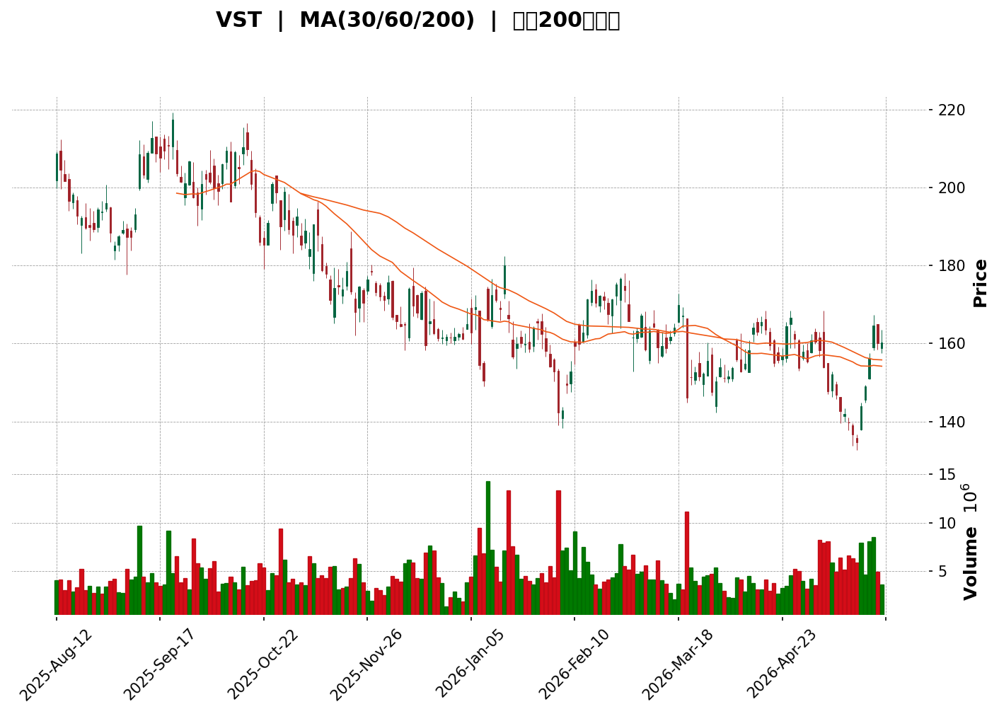
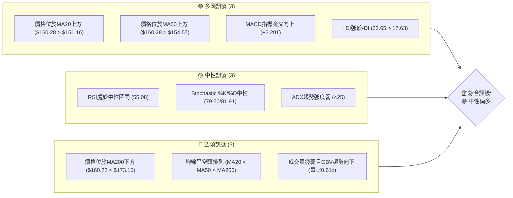
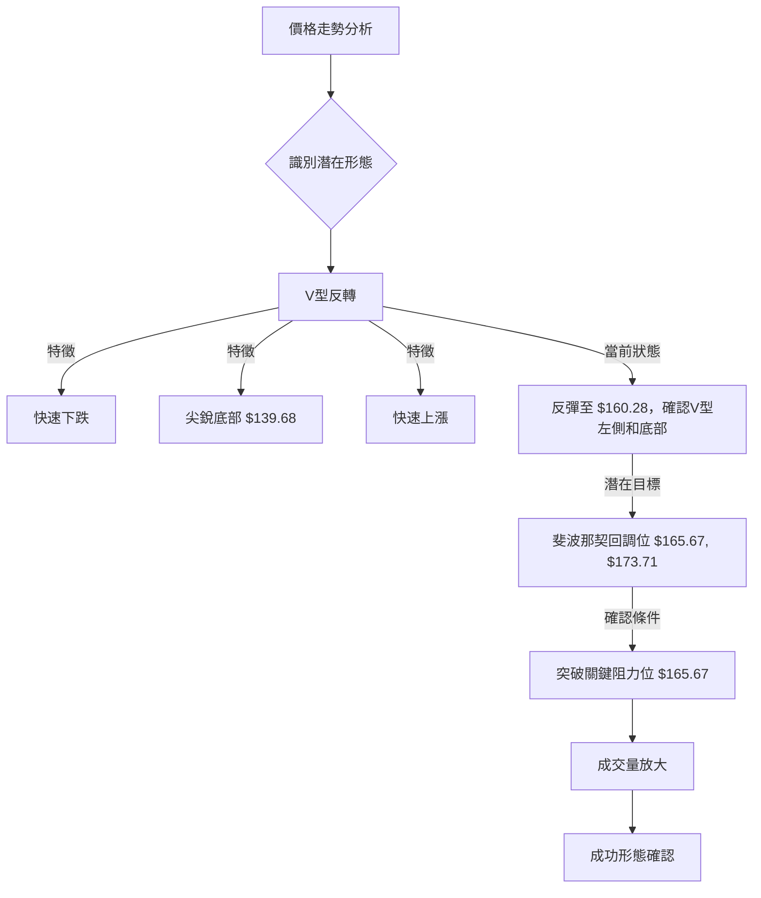

<details>
<summary>📊 靜態圖表 (點擊展開)</summary>

</details>

<html>
<head><meta charset="utf-8" /></head>
<body>
    <div>                        <script>window.PlotlyConfig = {MathJaxConfig: 'local'};</script>
        <script charset="utf-8" src="https://cdn.plot.ly/plotly-3.5.0.min.js" integrity="sha256-fHbNLP+GlIXN+efbQec78UkemUz3NJp7UmfGxC1tNxs=" crossorigin="anonymous"></script>                <div id="candlestick-chart" class="plotly-graph-div" style="height:500px; width:100%;"></div>            <script>                window.PLOTLYENV=window.PLOTLYENV || {};                                if (document.getElementById("candlestick-chart")) {                    Plotly.newPlot(                        "candlestick-chart",                        [{"close":{"dtype":"f8","bdata":"AAAAwEQYakAAAABA1Y9pQAAAAIBuMmlAAAAAAGiSaEAAAADAXcZoQAAAAMDzGGhAAAAAwIEFaEAAAABAq7FnQAAAAEBot2dAAAAAAEurZ0AAAADg9EtoQAAAAEBhO2hAAAAAoFJ+aEAAAABAX4xnQAAAAAAtI2dAAAAAINBsZ0AAAADAIqBnQAAAAOD8aGdAAAAAgE5pZ0AAAACAPSFoQAAAAKAcDWpAAAAAoJ9oaUAAAABAuxxqQAAAACCBlmpAAAAA4B8UakAAAAAAbPBpQAAAAGBlK2pAAAAAQFlWakAAAACAPiprQAAAAGCwdWlAAAAAAB8waUAAAABgFCJpQAAAAGDJ1GlAAAAA4KSsaEAAAACgLmxoQAAAAMCRHmlAAAAA4PJCaUAAAABA4y1pQAAAAGB3+2hAAAAAYEHiaEAAAADgZ79pQAAAAICALWpAAAAA4C2KaEAAAABAJB9qQAAAAKA3nmlAAAAAgKBIakAAAAAgRDpqQAAAAMB2GWlAAAAAAJI2aEAAAADANUBnQAAAAOAwKmdAAAAAgPvaZ0AAAAAASx1pQAAAAGAL2GhAAAAAYBfCZ0AAAAAgR9poQAAAAGACpmdAAAAAYAN5Z0AAAACARhBoQAAAAKBRJ2dAAAAAIMybZ0AAAADAkwNnQAAAAOAsz2dAAAAAAGB4Z0AAAACgVlVmQAAAAODvOGZAAAAAwM5iZUAAAAAgscZlQAAAAKCV0GVAAAAAYBO+ZUAAAABAs1RmQAAAAID4qWVAAAAAgAcEZUAAAABgDdVlQAAAAMDUS2VAAAAAwAYKZkAAAADAw0tmQAAAAEAvpWVAAAAAgGaCZUAAAAAArmVlQAAAAAC78mVAAAAAALfWZEAAAADgNLVkQAAAAABni2RAAAAAAOSWZEAAAADg0cNlQAAAAIA3NGVAAAAA4C35ZEAAAAAAH59lQAAAAODy8GNAAAAAgM22ZEAAAABgmVJkQAAAAGAyK2RAAAAAgGQuZEAAAAAAqTdkQAAAAIBkLmRAAAAAINMzZEAAAABAwExkQAAAAACHI2RAAAAAQCigZEAAAABAqFZkQAAAAOCRKWVAAAAAAHZMY0AAAACgosxiQAAAAGCWxGRAAAAAgAmLZUAAAACg92VlQAAAAKCsF2VAAAAAwOd9ZkAAAAAA8MtkQAAAAIAVk2NAAAAAIKr5Y0AAAACAhwRkQAAAACDc\u002fGNAAAAAQP\u002fSY0AAAADAKIFkQAAAAGBCrWRAAAAAAHlLZEAAAAAgTMRjQAAAAGCYQWNAAAAAoFQZY0AAAABgbcphQAAAAOAA3GFAAAAAwEauYkAAAAAgXxhjQAAAACA+7GNAAAAAgNH9Y0AAAAAgF1xkQAAAAGA0aGVAAAAAQDCuZUAAAAAAzkplQAAAAAB7iGVAAAAAAFRlZUAAAAAASfJkQAAAAMBbbGVAAAAAIODjZUAAAABAiBJmQAAAAGDmtGVAAAAAwHG4ZEAAAADgWS9kQAAAACBmZGRAAAAAoIDlZEAAAABA4s1jQAAAAAC1bGRAAAAAIKKFZEAAAACgLt5jQAAAAICa62NAAAAAgHjXY0AAAABgnjhkQAAAAIBlg2RAAAAAgGw8ZUAAAABAi+RkQAAAAOCjQGJAAAAAoEfpYkAAAABAChdjQAAAAOBR8GJAAAAAoJkJY0AAAAAgXG9jQAAAAKBHcWJAAAAAYI\u002fKYkAAAABguD5jQAAAAIDC5WJAAAAAQOHyYkAAAACAwjVjQAAAAOB6fGNAAAAAAAAYY0AAAAAgXFdjQAAAAGBmxmNAAAAAQAp\u002fZEAAAACAFF5kQAAAAMD1sGRAAAAAYLhuZEAAAABAM\u002fNjQAAAAMAeXWNAAAAAoEd5Y0AAAABAM5tjQAAAAEAzi2RAAAAAYI\u002fSZEAAAAAA1yNkQAAAAKBHOWNAAAAAQOG6Y0AAAADA9WhjQAAAAEAzG2RAAAAAACkMZEAAAACgR8ljQAAAAGBmPmNAAAAAQAp3YkAAAACgmQFjQAAAAADXW2JAAAAAIIXTYUAAAADAzLxhQAAAAIDCdWFAAAAAAAAYYUAAAABguNZgQAAAAAAAAGJAAAAAYI+iYkAAAADgo4hjQAAAAIDrkWRAAAAAwMwEZEAAAADA9QhkQA=="},"high":{"dtype":"f8","bdata":"xYUhFwUlakB99Vcj\u002fItqQL8iihZa42lAb5lylLF1aUCzYGhWZNRoQE9bY+FLuWhA7x\u002f83QIUaEBT5iB0r31oQFbq+PERWGhA\u002fm3Napw9aEBy\u002f3IE2lxoQBAzqPXaj2hAct4mmYITaUBKYfnOZl9oQNk3cvhIRWdACiaARoV6Z0D2eJMrAexnQNV\u002foWxs1mdAKBlaYG+6Z0BJszbaEVhoQCJBdj8agmpAmApXxNxiakAvJ7D8JS1qQIHsPsAgImtABR8ZEG6fakDf3sYXbp9qQEoxWUJ4tGpAUWI5BQuoakC09I+H4GZrQJYkceG8hWpAISpqT9KzaUDp\u002fX63U3ZpQMTVmc+43WlAgnZhlNHRaUACj4q4Vv5oQCrZtUC1i2lABBmJIfGNaUCCf1td4jNqQJ0\u002fXYtx62lAvSOIssNoaUBAf6QFUsFpQM3MD9+lT2pAwBvB\u002fiF5akByfuf65ytqQMJZyK7NCGpAxxCHExfuakDx+0+JExBrQL3qBfAYL2pAG9Uc9uWdaUCNUcfmZhxoQEtYqr1On2dAeHJyKHj1Z0BNzlrMNC5pQK6RZC4uY2lAAEg\u002f+bKYaEDikNiUrQVpQEcEThG6yGhAddJWHn0LaECj9Dfk4lRoQAXW5vXP3mdA9qnZ7j7+Z0DmAPhFLpNnQO7RDI+R0WdAWE5Nv0OIaEA6yPthhm1nQPiYX0yhmWZAEspWTQsvZkCIOYzhJHBmQBzDF5LTYGZA\u002fIBAuc8dZkCHsiAoA6BmQGeW7vWamGdAo+gd+HWmZUDRT6OF99ZlQJ0Teef3x2VAzD\u002fPs1coZkAn7LRtt4hmQFLLFnXQ\u002f2VAf8zlk+buZUCWL6Hj4qtlQCwHiHnqMWZAYsAeDpoEZkAmhNsJdetkQPU4aT4nLmVAibAHFQSyZEBee931Es1lQNlLZAElcGZAvk6RwsKQZUAClQZNcK5lQB+PYmkN1WVADpV51ktuZUBu7URnBV5lQND88MvBgmRAfju8mENvZEDmWn8GoktkQJFmeQjlWGRAUYub6T1\u002fZEAjDP7Wz1pkQIR+yD\u002fUiGRASAfhrZQhZUAQqKwhem1lQHTW7eD+i2VA18+\u002ftXINZUC35XH4znJjQNaSChgQ0GVAGVPD0\u002fkPZkAnF71mwOZlQNZQaTZMXmVApqueMPbJZkD1RJ1OYVxlQPQyhnDDuGRA+8ucgEw4ZECPOxxV32hkQP9bpG+9VGRAsS19traiZEDZfoDbqYxkQBeNqbuoymRAG4NAetf0ZEBnE1I+1IhkQANilMpi+GNAQUFBkS2JY0Buuu7tay5jQNv1N8DY9mFACIbAv64BY0DkXwtEK3JjQIhFYzBnJmRAO\u002flFqraiZEABFzOLeb9kQI2JVxqjbWVA50HoWhkNZkD4W6l7WehlQGiUALi3imVAKjSZ0G+oZUDN8QqKY3NlQDqMl5RGbmVAcw75Bmn2ZUCtRbdMoh9mQMEv+awlQmZAB19o\u002ffEIZkCTavfT1GlkQPZSsuOPf2RA3jCQw7f3ZEDE0kfq0QRlQC\u002fvcLr7jGRA+qZ8AuwRZUBi6qgZiHhkQGrTCRpJX2RAqIvEDXqgZEAVRiVm32hkQCqXtOOBp2RAGGQcXHWYZUCGNkmdzitlQAAAAEAKz2RAAAAAwMx8Y0AAAABAM0NjQAAAAGBmvmNAAAAAoHAVY0AAAABgZgZkQAAAAIDC3WNAAAAAQArvYkAAAABA4YpjQAAAAIDrUWNAAAAAIFwjY0AAAADAHkVjQAAAAIDrKWRAAAAAwPVQZEAAAAAAKdRjQAAAAEAKF2RAAAAAwPWoZEAAAADgo9BkQAAAAKBw3WRAAAAAIK4PZUAAAACgmYFkQAAAAEAzI2RAAAAAYI\u002fiY0AAAAAA19tjQAAAACBcr2RAAAAAoHANZUAAAABgZmpkQAAAAMByJGRAAAAAACn0Y0AAAADgegRkQAAAAAApTGRAAAAAoJl5ZEAAAAAgrl9kQAAAAOB6DGVAAAAAAABgY0AAAAAAABhjQAAAAABWymJAAAAAwPVIYkAAAACgcOlhQAAAAEDhomFAAAAAoEdxYUAAAABgZhZhQAAAAMDMHGJAAAAAwPWoYkAAAACAPbJjQAAAAMDM7GRAAAAAQLSgZEAAAADA9XBkQA=="},"hovertemplate":"\u003cb\u003e%{x|%Y-%m-%d}\u003c\u002fb\u003e\u003cbr\u003e\u958b: $%{open:.2f}\u003cbr\u003e\u9ad8: $%{high:.2f}\u003cbr\u003e\u4f4e: $%{low:.2f}\u003cbr\u003e\u6536: $%{close:.2f}\u003cextra\u003e\u003c\u002fextra\u003e","low":{"dtype":"f8","bdata":"8HRglyP3aEAx6\u002foss\u002fBoQCW+asGEMGlAxY3\u002fFhNCaEB0yaywsVFoQLNmyKJQz2dAdTgcJ7LkZkAomhxGvqhnQJ+hksiSTWdA4jExsW2SZ0Cy\u002f8TtBZRnQLDiLXNs8WdAslqybQQ8aEBLBlDF6D5nQGKRsVGXrGZASezv0lD0ZkDvOHvEXIJnQH0HMULrN2ZApFdQSuz8ZkDqxk5Uj49nQBg3NNqE52hAHDDCBFdKaUAEoQC5lydpQOubpFO7HGpAEvZf7qvQaUCUO60vY3xpQHqP8l0i6GlAHRD0V9CTaUDJlQ21S+dpQH9o6TbMXGlA8n\u002fbyA4qaUAO9hTCDW9oQKD\u002fy\u002fanDWlAziSHKfykaEDg9AwWmsVnQCn60B6D9GdAzPBXWTfFaEC1NbQsQB5pQCoEgFNenGhA5V5XehBraEDvjxh3b\u002fJoQADAEhKimGlA9G17c4qJaECWcGy1JftoQDOoNS4PG2lAE7h5WZ66aUBrpUZygQNqQCafwHD672hAH2BwMNcIaECcdkXM5CFnQJgSPJz5ZGZA7crJglwmZ0AzXf7rDkJoQEy2++OwfmhA7YgWYsr+ZkDa4bifWZ5nQNvNUAKsgGdA72SHanngZkC7sG1ghmpnQHRCaXa\u002f\u002f2ZAP4\u002fCUngNZ0BHxQRIJWFmQEt4u9mkA2ZA9hAc6OX0ZkCtd4xEK0pmQJBobLmpGWZA1PnIk55BZUDws8Bv+aNkQN1nPAWXlGVAweohShZGZUD1xUqSsbdlQBAiI8LolGVAEkYcb8U\u002fZECfv\u002fWdL65kQAT1LolYrmRAF2ceRnmTZUCr1QOrozBmQGjfM0zehmVAWBr4uJVcZUCszbaChA9lQHo3+iIOQGVAKzXhaGDAZEDj\u002f1TUd3NkQNG\u002f1m3ZiGRAprcZJ9PGY0B4MU73IhJkQLGNS+E+4WRAx1Wmo6bQZEDLIBPZ7cJkQKjUlaNryGNAtR\u002fBbBxHZECaSQ9xEUhkQI3YBCkwFGRAXfhsDy79Y0C1ZWjwrPFjQDMY7to1BGRAYXXooZj2Y0BKt6Eo5hpkQNJoQRoDIGRAVx0g9FV1ZEDPL9XTGP9jQEDF0wrScWRAl11DNJYqY0CHWieck59iQPeJ1dfttGRAXKisWmh7ZECriRsyy1JlQBWO9pVcumRAQWxzm0ZuZUA2bnywNllkQJkZ5D8wgWNAZ4JE3+8xY0D5fvSg3N1jQNsZhsgcuWNADPS9p+q1Y0DLrt7P571jQFwE4D4YHmRAAYbBTz3RY0BwLr2grpRjQAafEtE+OmNAVZV\u002f+vzFYkAe+vukkWJhQLH8U8rrSmFA13emggNnYkCxLHSLhHJiQC4cx9QrU2NAZnMMO7DKY0Duk4bBzgVkQDtB4Lv1KGRAon5YwP02ZUDQy5xWICxlQLYDc22qAGVAg+prCKIYZUCox2ynhJ9kQJ8qbEkPVWRAqQ6cTCU7ZUDsZNq2XXxkQP8zYtoHVWVAiR4byVSzZEAugLPvsBhjQIIDK8jOBWRAX5dMNbYuZECnA+QHs8JjQHcm\u002fjI+WWNAuCtn75iCZEAx08lfCV5jQMVO4qORj2NA0yJ73XuwY0Ce0OxaivxjQOJzvMnFPGRAWX3eDsmoZEAxYWBqM4BkQAAAAGCPGmJAAAAAYLiqYkAAAACgmbFiQAAAAAApzGJAAAAAIK5PYkAAAAAAAPhiQAAAAEAzU2JAAAAAQOHKYUAAAADAzOxiQAAAAADXw2JAAAAAACm8YkAAAADA9chiQAAAAKBHaWNAAAAAgMIVY0AAAAAghSNjQAAAAMDMFGNAAAAAQAoLZEAAAADAzERkQAAAACCFU2RAAAAA4FFIZEAAAACAPcpjQAAAAAApRGNAAAAAoHBdY0AAAAAAAFBjQAAAAMDMZGNAAAAAIIXXY0AAAABACtdjQAAAAGCPImNAAAAAIFx3Y0AAAACAwl1jQAAAAIAUrmNAAAAAoJn5Y0AAAABAM5NjQAAAAOCjOGNAAAAAIFxfYkAAAABg5UhiQAAAAMAeNWJAAAAA4FFwYUAAAAAAgX1hQAAAAIDrOWFAAAAAIIW7YEAAAADAHpVgQAAAAIDrOWFAAAAAACkcYkAAAAAAANhiQAAAAEAKx2NAAAAAYA7NY0AAAABAM7NjQA=="},"name":"\u50f9\u683c","open":{"dtype":"f8","bdata":"JA4MC4g3aUBwttAkWixqQB1L\u002fzBVa2lAYIFY9CZHaUALuT3L4odoQByXVMmMlmhAeWAC2p7IZ0AFJoZEYAhoQBvcNHEVzWdAz7jef9XZZ0A7bNmVFrdnQJjwKEZ0MmhA95nxoIFOaEDDGNzyqVloQHR\u002fn5sC+2ZAwjp7jjspZ0DShwiA3YhnQLmCmF62sGdA9rBtXaybZ0BDvwIzvqhnQMyXwW4Y+GhAJ4KOiGf\u002faUA0ztPMwkRpQOubpFO7HGpABR8ZEG6fakD93aaWk09qQEMvdmvPj2pA0ysXniJbakAjYwDsaU1qQOuArQADMWpAMAmWUGpWaUCIvPABj65oQL+lwUCtFGlApmwJ0jQuaUD17ebCiNRoQMVxg63STmhAot6aZ05vaUBF9i8oM3lpQEQOc7X1smlAce575nsgaUDVfh2zzSBpQGZmZibEzWlArpL1udclakC7Fvu4HxJpQJmInw8np2lA46qHQM0XakByldkAXMZqQBsnfZsl42lA9fvX2i1yaUCqCCB0KwtoQLqaslYUYWdA7crJglwmZ0CPvyLS4YFoQK6RZC4uY2lAAEg\u002f+bKYaED5HGQuqfhnQNtKAG2cRGhA4vo6UBbvZ0B8IYmpHMlnQK\u002fk+4ehcmdAOF\u002fqtOk3Z0CNyhWjXsxmQOesQcFGQGZAnfz\u002f2HBIaEDI4EEPEC1nQPwpA+ysemZAO9foWokNZkC4Dg57CNdkQBbfqG1O3mVAaetMMOmFZUDpYNLfsNVlQMAiU6P1CWdAVK1+WtlwZUAYHTWbTSNlQI110M85s2VAHc7\u002fQ6ywZUBai8t3O1BmQEGGV87Q8GVAyx8OW1ndZUA\u002f9Vk56YVlQA+hY0mobWVANy4faRcBZkAmhNsJdetkQCVON99FnWRA4aWfylCcZEBrvlJDUzNkQO7xz5731mVAfThyCXyPZUArDNa3HsZkQAQwxeT9sGVA2vIWIIemZEDFDo49t8dkQN0DmMHZeGRA2e6mfTIrZEA8eBqTqRhkQAAAAIBkLmRABdHSP\u002fsYZECj2DYr8DhkQOM3URdhVWRAVx0g9FV1ZEAV4anhdCRlQNIXHwqiGGVA18+\u002ftXINZUBzFrd7O2FjQOFpXev1wmVAtX4uBUOOZEChQTg1arhlQBMRIpAYJWVArVVaYHWYZUDj0+fFS+pkQMSk7xmcIWRA1WtwZWPZY0BEspNaszZkQPEWz3YG+WNA+HbQIuELZEBPBHDCXeljQIYohHvDuGRAKFyOR3y3ZECMiOe49ShkQMEaJGvtrWNAzs3Yzgh9Y0AcBrDsZh9jQIkyy3namWFAUlEaGHa5YkDy\u002fxIFdrliQOUne7LOBWRAZn\u002fpn86YZEB0rsJyWhBkQOQevHC4RWRAMDlg\u002f7VUZUDGHWn8u7hlQGGuIae2NWVAaynP1BaCZUB2B1iOCk1lQGzbAe+q4WRAVOmmQaWEZUAwTonODGRlQIjR9Bxf2GVAcCWzBPs+ZUAsgo0cCC9kQPqHjwDWK2RABu3jeRo1ZEB42\u002fAlO4dkQOO4vucAdmNAi85qyU+kZECoMc+TEWxkQOiRP2a2m2NAUBz7o0QxZEB4i1BM+xhkQGtpepbSUmRA19GkRMawZEATW1obJ95kQAAAAEAKz2RAAAAAYGbuYkAAAACgmdFiQAAAAAAAYGNAAAAAAACwYkAAAAAAAPhiQAAAAEAzo2NAAAAAwMz8YUAAAABACu9iQAAAAGC45mJAAAAAoEfhYkAAAACAPeJiQAAAAAAAGGRAAAAA4Hp8Y0AAAAAAADBjQAAAAMDMFGNAAAAAwB5NZEAAAAAAALBkQAAAAIA9kmRAAAAA4FHIZEAAAACgmWFkQAAAAOBRGGRAAAAAoJm5Y0AAAABguH5jQAAAAGCPimNAAAAAAACgZEAAAAAAAFBkQAAAACCFG2RAAAAAoEeJY0AAAACA68ljQAAAAIAUtmNAAAAAAABgZEAAAAAA1y9kQAAAAKBHYWRAAAAAAABgY0AAAAAAAIBiQAAAACCur2JAAAAAwPVIYkAAAAAAKaxhQAAAAMDMeGFAAAAAAABgYUAAAACgmflgQAAAAAAAQGFAAAAAQAovYkAAAADA9eBiQAAAAMAe3WNAAAAAYLieZEAAAABA4dpjQA=="},"x":["2025-08-12T00:00:00-04:00","2025-08-13T00:00:00-04:00","2025-08-14T00:00:00-04:00","2025-08-15T00:00:00-04:00","2025-08-18T00:00:00-04:00","2025-08-19T00:00:00-04:00","2025-08-20T00:00:00-04:00","2025-08-21T00:00:00-04:00","2025-08-22T00:00:00-04:00","2025-08-25T00:00:00-04:00","2025-08-26T00:00:00-04:00","2025-08-27T00:00:00-04:00","2025-08-28T00:00:00-04:00","2025-08-29T00:00:00-04:00","2025-09-02T00:00:00-04:00","2025-09-03T00:00:00-04:00","2025-09-04T00:00:00-04:00","2025-09-05T00:00:00-04:00","2025-09-08T00:00:00-04:00","2025-09-09T00:00:00-04:00","2025-09-10T00:00:00-04:00","2025-09-11T00:00:00-04:00","2025-09-12T00:00:00-04:00","2025-09-15T00:00:00-04:00","2025-09-16T00:00:00-04:00","2025-09-17T00:00:00-04:00","2025-09-18T00:00:00-04:00","2025-09-19T00:00:00-04:00","2025-09-22T00:00:00-04:00","2025-09-23T00:00:00-04:00","2025-09-24T00:00:00-04:00","2025-09-25T00:00:00-04:00","2025-09-26T00:00:00-04:00","2025-09-29T00:00:00-04:00","2025-09-30T00:00:00-04:00","2025-10-01T00:00:00-04:00","2025-10-02T00:00:00-04:00","2025-10-03T00:00:00-04:00","2025-10-06T00:00:00-04:00","2025-10-07T00:00:00-04:00","2025-10-08T00:00:00-04:00","2025-10-09T00:00:00-04:00","2025-10-10T00:00:00-04:00","2025-10-13T00:00:00-04:00","2025-10-14T00:00:00-04:00","2025-10-15T00:00:00-04:00","2025-10-16T00:00:00-04:00","2025-10-17T00:00:00-04:00","2025-10-20T00:00:00-04:00","2025-10-21T00:00:00-04:00","2025-10-22T00:00:00-04:00","2025-10-23T00:00:00-04:00","2025-10-24T00:00:00-04:00","2025-10-27T00:00:00-04:00","2025-10-28T00:00:00-04:00","2025-10-29T00:00:00-04:00","2025-10-30T00:00:00-04:00","2025-10-31T00:00:00-04:00","2025-11-03T00:00:00-05:00","2025-11-04T00:00:00-05:00","2025-11-05T00:00:00-05:00","2025-11-06T00:00:00-05:00","2025-11-07T00:00:00-05:00","2025-11-10T00:00:00-05:00","2025-11-11T00:00:00-05:00","2025-11-12T00:00:00-05:00","2025-11-13T00:00:00-05:00","2025-11-14T00:00:00-05:00","2025-11-17T00:00:00-05:00","2025-11-18T00:00:00-05:00","2025-11-19T00:00:00-05:00","2025-11-20T00:00:00-05:00","2025-11-21T00:00:00-05:00","2025-11-24T00:00:00-05:00","2025-11-25T00:00:00-05:00","2025-11-26T00:00:00-05:00","2025-11-28T00:00:00-05:00","2025-12-01T00:00:00-05:00","2025-12-02T00:00:00-05:00","2025-12-03T00:00:00-05:00","2025-12-04T00:00:00-05:00","2025-12-05T00:00:00-05:00","2025-12-08T00:00:00-05:00","2025-12-09T00:00:00-05:00","2025-12-10T00:00:00-05:00","2025-12-11T00:00:00-05:00","2025-12-12T00:00:00-05:00","2025-12-15T00:00:00-05:00","2025-12-16T00:00:00-05:00","2025-12-17T00:00:00-05:00","2025-12-18T00:00:00-05:00","2025-12-19T00:00:00-05:00","2025-12-22T00:00:00-05:00","2025-12-23T00:00:00-05:00","2025-12-24T00:00:00-05:00","2025-12-26T00:00:00-05:00","2025-12-29T00:00:00-05:00","2025-12-30T00:00:00-05:00","2025-12-31T00:00:00-05:00","2026-01-02T00:00:00-05:00","2026-01-05T00:00:00-05:00","2026-01-06T00:00:00-05:00","2026-01-07T00:00:00-05:00","2026-01-08T00:00:00-05:00","2026-01-09T00:00:00-05:00","2026-01-12T00:00:00-05:00","2026-01-13T00:00:00-05:00","2026-01-14T00:00:00-05:00","2026-01-15T00:00:00-05:00","2026-01-16T00:00:00-05:00","2026-01-20T00:00:00-05:00","2026-01-21T00:00:00-05:00","2026-01-22T00:00:00-05:00","2026-01-23T00:00:00-05:00","2026-01-26T00:00:00-05:00","2026-01-27T00:00:00-05:00","2026-01-28T00:00:00-05:00","2026-01-29T00:00:00-05:00","2026-01-30T00:00:00-05:00","2026-02-02T00:00:00-05:00","2026-02-03T00:00:00-05:00","2026-02-04T00:00:00-05:00","2026-02-05T00:00:00-05:00","2026-02-06T00:00:00-05:00","2026-02-09T00:00:00-05:00","2026-02-10T00:00:00-05:00","2026-02-11T00:00:00-05:00","2026-02-12T00:00:00-05:00","2026-02-13T00:00:00-05:00","2026-02-17T00:00:00-05:00","2026-02-18T00:00:00-05:00","2026-02-19T00:00:00-05:00","2026-02-20T00:00:00-05:00","2026-02-23T00:00:00-05:00","2026-02-24T00:00:00-05:00","2026-02-25T00:00:00-05:00","2026-02-26T00:00:00-05:00","2026-02-27T00:00:00-05:00","2026-03-02T00:00:00-05:00","2026-03-03T00:00:00-05:00","2026-03-04T00:00:00-05:00","2026-03-05T00:00:00-05:00","2026-03-06T00:00:00-05:00","2026-03-09T00:00:00-04:00","2026-03-10T00:00:00-04:00","2026-03-11T00:00:00-04:00","2026-03-12T00:00:00-04:00","2026-03-13T00:00:00-04:00","2026-03-16T00:00:00-04:00","2026-03-17T00:00:00-04:00","2026-03-18T00:00:00-04:00","2026-03-19T00:00:00-04:00","2026-03-20T00:00:00-04:00","2026-03-23T00:00:00-04:00","2026-03-24T00:00:00-04:00","2026-03-25T00:00:00-04:00","2026-03-26T00:00:00-04:00","2026-03-27T00:00:00-04:00","2026-03-30T00:00:00-04:00","2026-03-31T00:00:00-04:00","2026-04-01T00:00:00-04:00","2026-04-02T00:00:00-04:00","2026-04-06T00:00:00-04:00","2026-04-07T00:00:00-04:00","2026-04-08T00:00:00-04:00","2026-04-09T00:00:00-04:00","2026-04-10T00:00:00-04:00","2026-04-13T00:00:00-04:00","2026-04-14T00:00:00-04:00","2026-04-15T00:00:00-04:00","2026-04-16T00:00:00-04:00","2026-04-17T00:00:00-04:00","2026-04-20T00:00:00-04:00","2026-04-21T00:00:00-04:00","2026-04-22T00:00:00-04:00","2026-04-23T00:00:00-04:00","2026-04-24T00:00:00-04:00","2026-04-27T00:00:00-04:00","2026-04-28T00:00:00-04:00","2026-04-29T00:00:00-04:00","2026-04-30T00:00:00-04:00","2026-05-01T00:00:00-04:00","2026-05-04T00:00:00-04:00","2026-05-05T00:00:00-04:00","2026-05-06T00:00:00-04:00","2026-05-07T00:00:00-04:00","2026-05-08T00:00:00-04:00","2026-05-11T00:00:00-04:00","2026-05-12T00:00:00-04:00","2026-05-13T00:00:00-04:00","2026-05-14T00:00:00-04:00","2026-05-15T00:00:00-04:00","2026-05-18T00:00:00-04:00","2026-05-19T00:00:00-04:00","2026-05-20T00:00:00-04:00","2026-05-21T00:00:00-04:00","2026-05-22T00:00:00-04:00","2026-05-26T00:00:00-04:00","2026-05-27T00:00:00-04:00","2026-05-28T00:00:00-04:00"],"type":"candlestick"},{"hovertemplate":"MA30: $%{y:.2f}\u003cextra\u003e\u003c\u002fextra\u003e","line":{"color":"#2196F3","dash":"dash","width":2},"mode":"lines","name":"MA30","x":["2025-08-12T00:00:00-04:00","2025-08-13T00:00:00-04:00","2025-08-14T00:00:00-04:00","2025-08-15T00:00:00-04:00","2025-08-18T00:00:00-04:00","2025-08-19T00:00:00-04:00","2025-08-20T00:00:00-04:00","2025-08-21T00:00:00-04:00","2025-08-22T00:00:00-04:00","2025-08-25T00:00:00-04:00","2025-08-26T00:00:00-04:00","2025-08-27T00:00:00-04:00","2025-08-28T00:00:00-04:00","2025-08-29T00:00:00-04:00","2025-09-02T00:00:00-04:00","2025-09-03T00:00:00-04:00","2025-09-04T00:00:00-04:00","2025-09-05T00:00:00-04:00","2025-09-08T00:00:00-04:00","2025-09-09T00:00:00-04:00","2025-09-10T00:00:00-04:00","2025-09-11T00:00:00-04:00","2025-09-12T00:00:00-04:00","2025-09-15T00:00:00-04:00","2025-09-16T00:00:00-04:00","2025-09-17T00:00:00-04:00","2025-09-18T00:00:00-04:00","2025-09-19T00:00:00-04:00","2025-09-22T00:00:00-04:00","2025-09-23T00:00:00-04:00","2025-09-24T00:00:00-04:00","2025-09-25T00:00:00-04:00","2025-09-26T00:00:00-04:00","2025-09-29T00:00:00-04:00","2025-09-30T00:00:00-04:00","2025-10-01T00:00:00-04:00","2025-10-02T00:00:00-04:00","2025-10-03T00:00:00-04:00","2025-10-06T00:00:00-04:00","2025-10-07T00:00:00-04:00","2025-10-08T00:00:00-04:00","2025-10-09T00:00:00-04:00","2025-10-10T00:00:00-04:00","2025-10-13T00:00:00-04:00","2025-10-14T00:00:00-04:00","2025-10-15T00:00:00-04:00","2025-10-16T00:00:00-04:00","2025-10-17T00:00:00-04:00","2025-10-20T00:00:00-04:00","2025-10-21T00:00:00-04:00","2025-10-22T00:00:00-04:00","2025-10-23T00:00:00-04:00","2025-10-24T00:00:00-04:00","2025-10-27T00:00:00-04:00","2025-10-28T00:00:00-04:00","2025-10-29T00:00:00-04:00","2025-10-30T00:00:00-04:00","2025-10-31T00:00:00-04:00","2025-11-03T00:00:00-05:00","2025-11-04T00:00:00-05:00","2025-11-05T00:00:00-05:00","2025-11-06T00:00:00-05:00","2025-11-07T00:00:00-05:00","2025-11-10T00:00:00-05:00","2025-11-11T00:00:00-05:00","2025-11-12T00:00:00-05:00","2025-11-13T00:00:00-05:00","2025-11-14T00:00:00-05:00","2025-11-17T00:00:00-05:00","2025-11-18T00:00:00-05:00","2025-11-19T00:00:00-05:00","2025-11-20T00:00:00-05:00","2025-11-21T00:00:00-05:00","2025-11-24T00:00:00-05:00","2025-11-25T00:00:00-05:00","2025-11-26T00:00:00-05:00","2025-11-28T00:00:00-05:00","2025-12-01T00:00:00-05:00","2025-12-02T00:00:00-05:00","2025-12-03T00:00:00-05:00","2025-12-04T00:00:00-05:00","2025-12-05T00:00:00-05:00","2025-12-08T00:00:00-05:00","2025-12-09T00:00:00-05:00","2025-12-10T00:00:00-05:00","2025-12-11T00:00:00-05:00","2025-12-12T00:00:00-05:00","2025-12-15T00:00:00-05:00","2025-12-16T00:00:00-05:00","2025-12-17T00:00:00-05:00","2025-12-18T00:00:00-05:00","2025-12-19T00:00:00-05:00","2025-12-22T00:00:00-05:00","2025-12-23T00:00:00-05:00","2025-12-24T00:00:00-05:00","2025-12-26T00:00:00-05:00","2025-12-29T00:00:00-05:00","2025-12-30T00:00:00-05:00","2025-12-31T00:00:00-05:00","2026-01-02T00:00:00-05:00","2026-01-05T00:00:00-05:00","2026-01-06T00:00:00-05:00","2026-01-07T00:00:00-05:00","2026-01-08T00:00:00-05:00","2026-01-09T00:00:00-05:00","2026-01-12T00:00:00-05:00","2026-01-13T00:00:00-05:00","2026-01-14T00:00:00-05:00","2026-01-15T00:00:00-05:00","2026-01-16T00:00:00-05:00","2026-01-20T00:00:00-05:00","2026-01-21T00:00:00-05:00","2026-01-22T00:00:00-05:00","2026-01-23T00:00:00-05:00","2026-01-26T00:00:00-05:00","2026-01-27T00:00:00-05:00","2026-01-28T00:00:00-05:00","2026-01-29T00:00:00-05:00","2026-01-30T00:00:00-05:00","2026-02-02T00:00:00-05:00","2026-02-03T00:00:00-05:00","2026-02-04T00:00:00-05:00","2026-02-05T00:00:00-05:00","2026-02-06T00:00:00-05:00","2026-02-09T00:00:00-05:00","2026-02-10T00:00:00-05:00","2026-02-11T00:00:00-05:00","2026-02-12T00:00:00-05:00","2026-02-13T00:00:00-05:00","2026-02-17T00:00:00-05:00","2026-02-18T00:00:00-05:00","2026-02-19T00:00:00-05:00","2026-02-20T00:00:00-05:00","2026-02-23T00:00:00-05:00","2026-02-24T00:00:00-05:00","2026-02-25T00:00:00-05:00","2026-02-26T00:00:00-05:00","2026-02-27T00:00:00-05:00","2026-03-02T00:00:00-05:00","2026-03-03T00:00:00-05:00","2026-03-04T00:00:00-05:00","2026-03-05T00:00:00-05:00","2026-03-06T00:00:00-05:00","2026-03-09T00:00:00-04:00","2026-03-10T00:00:00-04:00","2026-03-11T00:00:00-04:00","2026-03-12T00:00:00-04:00","2026-03-13T00:00:00-04:00","2026-03-16T00:00:00-04:00","2026-03-17T00:00:00-04:00","2026-03-18T00:00:00-04:00","2026-03-19T00:00:00-04:00","2026-03-20T00:00:00-04:00","2026-03-23T00:00:00-04:00","2026-03-24T00:00:00-04:00","2026-03-25T00:00:00-04:00","2026-03-26T00:00:00-04:00","2026-03-27T00:00:00-04:00","2026-03-30T00:00:00-04:00","2026-03-31T00:00:00-04:00","2026-04-01T00:00:00-04:00","2026-04-02T00:00:00-04:00","2026-04-06T00:00:00-04:00","2026-04-07T00:00:00-04:00","2026-04-08T00:00:00-04:00","2026-04-09T00:00:00-04:00","2026-04-10T00:00:00-04:00","2026-04-13T00:00:00-04:00","2026-04-14T00:00:00-04:00","2026-04-15T00:00:00-04:00","2026-04-16T00:00:00-04:00","2026-04-17T00:00:00-04:00","2026-04-20T00:00:00-04:00","2026-04-21T00:00:00-04:00","2026-04-22T00:00:00-04:00","2026-04-23T00:00:00-04:00","2026-04-24T00:00:00-04:00","2026-04-27T00:00:00-04:00","2026-04-28T00:00:00-04:00","2026-04-29T00:00:00-04:00","2026-04-30T00:00:00-04:00","2026-05-01T00:00:00-04:00","2026-05-04T00:00:00-04:00","2026-05-05T00:00:00-04:00","2026-05-06T00:00:00-04:00","2026-05-07T00:00:00-04:00","2026-05-08T00:00:00-04:00","2026-05-11T00:00:00-04:00","2026-05-12T00:00:00-04:00","2026-05-13T00:00:00-04:00","2026-05-14T00:00:00-04:00","2026-05-15T00:00:00-04:00","2026-05-18T00:00:00-04:00","2026-05-19T00:00:00-04:00","2026-05-20T00:00:00-04:00","2026-05-21T00:00:00-04:00","2026-05-22T00:00:00-04:00","2026-05-26T00:00:00-04:00","2026-05-27T00:00:00-04:00","2026-05-28T00:00:00-04:00"],"y":{"dtype":"f8","bdata":"AAAAAAAA+H8AAAAAAAD4fwAAAAAAAPh\u002fAAAAAAAA+H8AAAAAAAD4fwAAAAAAAPh\u002fAAAAAAAA+H8AAAAAAAD4fwAAAAAAAPh\u002fAAAAAAAA+H8AAAAAAAD4fwAAAAAAAPh\u002fAAAAAAAA+H8AAAAAAAD4fwAAAAAAAPh\u002fAAAAAAAA+H8AAAAAAAD4fwAAAAAAAPh\u002fAAAAAAAA+H8AAAAAAAD4fwAAAAAAAPh\u002fAAAAAAAA+H8AAAAAAAD4fwAAAAAAAPh\u002fAAAAAAAA+H8AAAAAAAD4fwAAAAAAAPh\u002fAAAAAAAA+H8AAAAAAAD4f4mIiAhe0GhAq6qqCqHIaECrqqp6+MRoQImIiOhhymhA3t3dzUHLaEC8u7s7QMhoQDMzM7P40GhAmpmZiY3baEAiIiISOuhoQAAAAGAH82hAvLu762T9aEDv7u6exglpQDMzM0NhGmlAAAAAcMYaaUAAAADwuzBpQFVVVfXmRWlAVVVVxUteaUBVVVUVgHRpQLy7u4vqgmlAERERIcKJaUDv7u7eQYJpQJqZmWmgaWlAVVVVNV9caUB3d3d321NpQM3MzKz5RGlAd3d3lywxaUCJiIgY5ydpQLy7u8tjEmlAAAAAAPL5aEDNzMzMet9oQJqZmfnMy2hA7+7uvlK+aEBERERkPaxoQBEREXH8mmhAERER4bWQaEARERHh4X5oQImIiEgpZmhAMzMzAxdFaEDv7u7ODChoQImIiEgFDWhAMzMz8zbyZ0C8u7vLDtVnQDMzM0OKrmdAq6qq6neQZ0De3d2N3WtnQERERGT8RmdAEREREcQiZ0ARERFBNwFnQHd3d2e942ZAMzMz46rMZkAAAACQ2bxmQERERMR3smZAAAAAwLmYZkCamZlpH3NmQERERERvTmZAVVVVBWUzZkB3d3fHCxlmQO\u002fu7q4vBGZARERExNvuZUDe3d0dBdplQO\u002fu7o6bvmVAd3d3Z+ilZUAAAAAg8Y5lQN7d3T3gb2VAMzMzU89TZUAREREBwUFlQFVVVfVVMGVAERERgTwmZUCJiIhooxllQO\u002fu7h5WC2VAiYiISM4BZUCrqqrqzfBkQKuqqjqG7GRA7+7uPt\u002fdZEAiIiLS\u002fcNkQN7d3b17v2RAmpmZGUC7ZECamZkpl7NkQLy7u5vfrmRAiYiIyEG3ZECamZnZIbJkQJqZmZngnWRA3t3dTYKWZECJiIionpBkQLy7u0vei2RAvLu7q1aFZEDNzMxMlXpkQJqZmakVdmRA3t3dXUtwZECamZmJd2BkQAAAADCfWmRARERE5NZMZEAzMzPTOzdkQJqZmfmGI2RA7+7uLrkWZEB3d3enJQ1kQM3MzCzxCmRAIiIiUiQJZEB3d3c3pwlkQLy7u8t5FGRAAAAAEHodZEBERER0nSVkQLy7u1vHKGRAAAAAoKw6ZECJiIj4\u002fkxkQN7d3Z2WUmRAREREtIxVZEAiIiJCTVtkQKuqquqKYGRAIiIiYm1RZEDe3d0tNUxkQFVVVVUvU2RAERER0QtbZEAiIiKCOVlkQAAAAPDzXGRAzczMTOhiZEAAAACQeV1kQImIiAgFV2RAZmZmJidTZEAiIiLCB1dkQLy7u8vBYWRAMzMzU\u002f5zZECamZnJdo5kQN7d3Y3RkWRAzczMDMmTZEAAAACwvZNkQCIiIvJXi2RAMzMz8zODZECamZnZT3tkQBEREbEDYmRAIiIiMlxJZEAiIiIC5DdkQERERGRmIWRAMzMzs4QMZECrqqpqs\u002f1jQLy7u+sr7WNA3t3dHU\u002fVY0CJiIjYAL5jQM3MzByFrWNAMzMzQ5urY0BEREQEKq1jQGZmZla3r2NAq6qqusGrY0CamZkpAK1jQO\u002fu7p7yo2NAvLu7qwCbY0B3d3cXxZhjQLy7u\u002fsWnmNAzczMnHWmY0DNzMxMxKVjQN7d3U3DmmNAREREVOmNY0BmZmY2QoFjQKuqqsoTkWNAiYiI+MWaY0AzMzPztqBjQLy7uztRo2NAZmZmlm6eY0CJiIj4xZpjQERERAQPmmNAERER8dKRY0ARERHB9YRjQM3MzHyxeGNA3t3dLd1oY0C8u7sboVRjQImIiFjyR2NAERERMQhEY0B3d3e3rEVjQLy7u2t1TGNA3t3dTWJIY0AiIiLyi0VjQA=="},"type":"scatter"},{"hovertemplate":"MA60: $%{y:.2f}\u003cextra\u003e\u003c\u002fextra\u003e","line":{"color":"#9C27B0","dash":"dash","width":2},"mode":"lines","name":"MA60","x":["2025-08-12T00:00:00-04:00","2025-08-13T00:00:00-04:00","2025-08-14T00:00:00-04:00","2025-08-15T00:00:00-04:00","2025-08-18T00:00:00-04:00","2025-08-19T00:00:00-04:00","2025-08-20T00:00:00-04:00","2025-08-21T00:00:00-04:00","2025-08-22T00:00:00-04:00","2025-08-25T00:00:00-04:00","2025-08-26T00:00:00-04:00","2025-08-27T00:00:00-04:00","2025-08-28T00:00:00-04:00","2025-08-29T00:00:00-04:00","2025-09-02T00:00:00-04:00","2025-09-03T00:00:00-04:00","2025-09-04T00:00:00-04:00","2025-09-05T00:00:00-04:00","2025-09-08T00:00:00-04:00","2025-09-09T00:00:00-04:00","2025-09-10T00:00:00-04:00","2025-09-11T00:00:00-04:00","2025-09-12T00:00:00-04:00","2025-09-15T00:00:00-04:00","2025-09-16T00:00:00-04:00","2025-09-17T00:00:00-04:00","2025-09-18T00:00:00-04:00","2025-09-19T00:00:00-04:00","2025-09-22T00:00:00-04:00","2025-09-23T00:00:00-04:00","2025-09-24T00:00:00-04:00","2025-09-25T00:00:00-04:00","2025-09-26T00:00:00-04:00","2025-09-29T00:00:00-04:00","2025-09-30T00:00:00-04:00","2025-10-01T00:00:00-04:00","2025-10-02T00:00:00-04:00","2025-10-03T00:00:00-04:00","2025-10-06T00:00:00-04:00","2025-10-07T00:00:00-04:00","2025-10-08T00:00:00-04:00","2025-10-09T00:00:00-04:00","2025-10-10T00:00:00-04:00","2025-10-13T00:00:00-04:00","2025-10-14T00:00:00-04:00","2025-10-15T00:00:00-04:00","2025-10-16T00:00:00-04:00","2025-10-17T00:00:00-04:00","2025-10-20T00:00:00-04:00","2025-10-21T00:00:00-04:00","2025-10-22T00:00:00-04:00","2025-10-23T00:00:00-04:00","2025-10-24T00:00:00-04:00","2025-10-27T00:00:00-04:00","2025-10-28T00:00:00-04:00","2025-10-29T00:00:00-04:00","2025-10-30T00:00:00-04:00","2025-10-31T00:00:00-04:00","2025-11-03T00:00:00-05:00","2025-11-04T00:00:00-05:00","2025-11-05T00:00:00-05:00","2025-11-06T00:00:00-05:00","2025-11-07T00:00:00-05:00","2025-11-10T00:00:00-05:00","2025-11-11T00:00:00-05:00","2025-11-12T00:00:00-05:00","2025-11-13T00:00:00-05:00","2025-11-14T00:00:00-05:00","2025-11-17T00:00:00-05:00","2025-11-18T00:00:00-05:00","2025-11-19T00:00:00-05:00","2025-11-20T00:00:00-05:00","2025-11-21T00:00:00-05:00","2025-11-24T00:00:00-05:00","2025-11-25T00:00:00-05:00","2025-11-26T00:00:00-05:00","2025-11-28T00:00:00-05:00","2025-12-01T00:00:00-05:00","2025-12-02T00:00:00-05:00","2025-12-03T00:00:00-05:00","2025-12-04T00:00:00-05:00","2025-12-05T00:00:00-05:00","2025-12-08T00:00:00-05:00","2025-12-09T00:00:00-05:00","2025-12-10T00:00:00-05:00","2025-12-11T00:00:00-05:00","2025-12-12T00:00:00-05:00","2025-12-15T00:00:00-05:00","2025-12-16T00:00:00-05:00","2025-12-17T00:00:00-05:00","2025-12-18T00:00:00-05:00","2025-12-19T00:00:00-05:00","2025-12-22T00:00:00-05:00","2025-12-23T00:00:00-05:00","2025-12-24T00:00:00-05:00","2025-12-26T00:00:00-05:00","2025-12-29T00:00:00-05:00","2025-12-30T00:00:00-05:00","2025-12-31T00:00:00-05:00","2026-01-02T00:00:00-05:00","2026-01-05T00:00:00-05:00","2026-01-06T00:00:00-05:00","2026-01-07T00:00:00-05:00","2026-01-08T00:00:00-05:00","2026-01-09T00:00:00-05:00","2026-01-12T00:00:00-05:00","2026-01-13T00:00:00-05:00","2026-01-14T00:00:00-05:00","2026-01-15T00:00:00-05:00","2026-01-16T00:00:00-05:00","2026-01-20T00:00:00-05:00","2026-01-21T00:00:00-05:00","2026-01-22T00:00:00-05:00","2026-01-23T00:00:00-05:00","2026-01-26T00:00:00-05:00","2026-01-27T00:00:00-05:00","2026-01-28T00:00:00-05:00","2026-01-29T00:00:00-05:00","2026-01-30T00:00:00-05:00","2026-02-02T00:00:00-05:00","2026-02-03T00:00:00-05:00","2026-02-04T00:00:00-05:00","2026-02-05T00:00:00-05:00","2026-02-06T00:00:00-05:00","2026-02-09T00:00:00-05:00","2026-02-10T00:00:00-05:00","2026-02-11T00:00:00-05:00","2026-02-12T00:00:00-05:00","2026-02-13T00:00:00-05:00","2026-02-17T00:00:00-05:00","2026-02-18T00:00:00-05:00","2026-02-19T00:00:00-05:00","2026-02-20T00:00:00-05:00","2026-02-23T00:00:00-05:00","2026-02-24T00:00:00-05:00","2026-02-25T00:00:00-05:00","2026-02-26T00:00:00-05:00","2026-02-27T00:00:00-05:00","2026-03-02T00:00:00-05:00","2026-03-03T00:00:00-05:00","2026-03-04T00:00:00-05:00","2026-03-05T00:00:00-05:00","2026-03-06T00:00:00-05:00","2026-03-09T00:00:00-04:00","2026-03-10T00:00:00-04:00","2026-03-11T00:00:00-04:00","2026-03-12T00:00:00-04:00","2026-03-13T00:00:00-04:00","2026-03-16T00:00:00-04:00","2026-03-17T00:00:00-04:00","2026-03-18T00:00:00-04:00","2026-03-19T00:00:00-04:00","2026-03-20T00:00:00-04:00","2026-03-23T00:00:00-04:00","2026-03-24T00:00:00-04:00","2026-03-25T00:00:00-04:00","2026-03-26T00:00:00-04:00","2026-03-27T00:00:00-04:00","2026-03-30T00:00:00-04:00","2026-03-31T00:00:00-04:00","2026-04-01T00:00:00-04:00","2026-04-02T00:00:00-04:00","2026-04-06T00:00:00-04:00","2026-04-07T00:00:00-04:00","2026-04-08T00:00:00-04:00","2026-04-09T00:00:00-04:00","2026-04-10T00:00:00-04:00","2026-04-13T00:00:00-04:00","2026-04-14T00:00:00-04:00","2026-04-15T00:00:00-04:00","2026-04-16T00:00:00-04:00","2026-04-17T00:00:00-04:00","2026-04-20T00:00:00-04:00","2026-04-21T00:00:00-04:00","2026-04-22T00:00:00-04:00","2026-04-23T00:00:00-04:00","2026-04-24T00:00:00-04:00","2026-04-27T00:00:00-04:00","2026-04-28T00:00:00-04:00","2026-04-29T00:00:00-04:00","2026-04-30T00:00:00-04:00","2026-05-01T00:00:00-04:00","2026-05-04T00:00:00-04:00","2026-05-05T00:00:00-04:00","2026-05-06T00:00:00-04:00","2026-05-07T00:00:00-04:00","2026-05-08T00:00:00-04:00","2026-05-11T00:00:00-04:00","2026-05-12T00:00:00-04:00","2026-05-13T00:00:00-04:00","2026-05-14T00:00:00-04:00","2026-05-15T00:00:00-04:00","2026-05-18T00:00:00-04:00","2026-05-19T00:00:00-04:00","2026-05-20T00:00:00-04:00","2026-05-21T00:00:00-04:00","2026-05-22T00:00:00-04:00","2026-05-26T00:00:00-04:00","2026-05-27T00:00:00-04:00","2026-05-28T00:00:00-04:00"],"y":{"dtype":"f8","bdata":"AAAAAAAA+H8AAAAAAAD4fwAAAAAAAPh\u002fAAAAAAAA+H8AAAAAAAD4fwAAAAAAAPh\u002fAAAAAAAA+H8AAAAAAAD4fwAAAAAAAPh\u002fAAAAAAAA+H8AAAAAAAD4fwAAAAAAAPh\u002fAAAAAAAA+H8AAAAAAAD4fwAAAAAAAPh\u002fAAAAAAAA+H8AAAAAAAD4fwAAAAAAAPh\u002fAAAAAAAA+H8AAAAAAAD4fwAAAAAAAPh\u002fAAAAAAAA+H8AAAAAAAD4fwAAAAAAAPh\u002fAAAAAAAA+H8AAAAAAAD4fwAAAAAAAPh\u002fAAAAAAAA+H8AAAAAAAD4fwAAAAAAAPh\u002fAAAAAAAA+H8AAAAAAAD4fwAAAAAAAPh\u002fAAAAAAAA+H8AAAAAAAD4fwAAAAAAAPh\u002fAAAAAAAA+H8AAAAAAAD4fwAAAAAAAPh\u002fAAAAAAAA+H8AAAAAAAD4fwAAAAAAAPh\u002fAAAAAAAA+H8AAAAAAAD4fwAAAAAAAPh\u002fAAAAAAAA+H8AAAAAAAD4fwAAAAAAAPh\u002fAAAAAAAA+H8AAAAAAAD4fwAAAAAAAPh\u002fAAAAAAAA+H8AAAAAAAD4fwAAAAAAAPh\u002fAAAAAAAA+H8AAAAAAAD4fwAAAAAAAPh\u002fAAAAAAAA+H8AAAAAAAD4fxEREYEVzmhAzczM5HnDaEB3d3fvmrhoQM3MzCyvsmhAd3d31\u002futaEBmZmYOkaNoQN7d3f2Qm2hAZmZmRlKQaECJiIhwI4hoQERERFQGgGhAd3d37813aEBVVVW1am9oQDMzM8N1ZGhAVVVVLZ9VaEDv7u6+TE5oQM3MzKxxRmhAMzMz64dAaEAzMzOr2zpoQJqZmflTM2hAIiIigjYraEB3d3e3jR9oQO\u002fu7hYMDmhAq6qqeoz6Z0CJiIhwfeNnQImIiHi0yWdAZmZmzkiyZ0AAAABweaBnQFVVVb1Ji2dAIiIi4mZ0Z0BVVVX1v1xnQEREREQ0RWdAMzMzkx0yZ0AiIiJClx1nQHd3d1duBWdAIiIimkLyZkARERFxUeBmQO\u002fu7p4\u002fy2ZAIiIiwqm1ZkC8u7sb2KBmQLy7u7MtjGZA3t3dnQJ6ZkAzMzNb7mJmQO\u002fu7j6ITWZAzczMlCs3ZkAAAACw7RdmQBERERE8A2ZAVVVVFQLvZUBVVVU1Z9plQJqZmYFOyWVA3t3dVfbBZUDNzMy0fbdlQO\u002fu7i4sqGVA7+7uBp6XZUAREREJ34FlQAAAAMgmbWVAiYiI2F1cZUAiIiKK0EllQERERKwiPWVAERERkZMvZUC8u7tTPh1lQHd3d1+dDGVA3t3dpV\u002f5ZECamZl5FuNkQLy7u5uzyWRAERERQUS1ZEBERERUc6dkQBEREZGjnWRAmpmZabCXZEAAAABQpZFkQFVVVfXnj2RARERELKSPZEB3d3evNYtkQDMzM8umimRAd3d370WMZEBVVVVlfohkQN7d3S0JiWRA7+7uZmaIZEDe3d01codkQDMzM0O1h2RAVVVVlVeEZEC8u7uDK39kQHd3d\u002feHeGRAd3d3D8d4ZEBVVVUV7HRkQN7d3R1pdGRAREREfB90ZEBmZmZuB2xkQBEREVmNZmRAIiIiQrlhZEDe3d2lv1tkQN7d3X0wXmRAvLu7m2pgZEBmZmZO2WJkQLy7u0OsWmRA3t3dHUFVZEC8u7urcVBkQHd3d48kS2RAq6qqIixGZECJiIiIe0JkQGZmZr4+O2RAERERIWszZEAzMzO7wC5kQAAAAOAWJWRAmpmZqZgjZECamZkxWSVkQM3MzEThH2RAERER6W0VZEBVVVUNpwxkQLy7uwMIB2RAq6qqUoT+Y0ARERGZr\u002fxjQN7d3VVzAWRA3t3dxWYDZEDe3d3VHANkQHd3d0dzAGRAREREfPT+Y0C8u7tTH\u002ftjQCIiIgKO+mNAmpmZYc78Y0B3d3cHZv5jQM3MzIxC\u002fmNAvLu70\u002fMAZEAAAACA3AdkQERERKxyEWRAq6qqgkcXZECamZlROhpkQO\u002fu7pZUF2RAzczMRNEQZEARERHpCgtkQKuqqloJ\u002fmNAmpmZkZftY0CamZnhbN5jQImIiPALzWNAiYiI8LC6Y0AzMzNDKqljQCIiIiKPmmNAd3d3p6uMY0AAAADI1oFjQERERET9fGNAiYiIyP55Y0AzMzP7WnljQA=="},"type":"scatter"},{"hovertemplate":"MA200: $%{y:.2f}\u003cextra\u003e\u003c\u002fextra\u003e","line":{"color":"#FF6F00","dash":"solid","width":2},"mode":"lines","name":"MA200","x":["2025-08-12T00:00:00-04:00","2025-08-13T00:00:00-04:00","2025-08-14T00:00:00-04:00","2025-08-15T00:00:00-04:00","2025-08-18T00:00:00-04:00","2025-08-19T00:00:00-04:00","2025-08-20T00:00:00-04:00","2025-08-21T00:00:00-04:00","2025-08-22T00:00:00-04:00","2025-08-25T00:00:00-04:00","2025-08-26T00:00:00-04:00","2025-08-27T00:00:00-04:00","2025-08-28T00:00:00-04:00","2025-08-29T00:00:00-04:00","2025-09-02T00:00:00-04:00","2025-09-03T00:00:00-04:00","2025-09-04T00:00:00-04:00","2025-09-05T00:00:00-04:00","2025-09-08T00:00:00-04:00","2025-09-09T00:00:00-04:00","2025-09-10T00:00:00-04:00","2025-09-11T00:00:00-04:00","2025-09-12T00:00:00-04:00","2025-09-15T00:00:00-04:00","2025-09-16T00:00:00-04:00","2025-09-17T00:00:00-04:00","2025-09-18T00:00:00-04:00","2025-09-19T00:00:00-04:00","2025-09-22T00:00:00-04:00","2025-09-23T00:00:00-04:00","2025-09-24T00:00:00-04:00","2025-09-25T00:00:00-04:00","2025-09-26T00:00:00-04:00","2025-09-29T00:00:00-04:00","2025-09-30T00:00:00-04:00","2025-10-01T00:00:00-04:00","2025-10-02T00:00:00-04:00","2025-10-03T00:00:00-04:00","2025-10-06T00:00:00-04:00","2025-10-07T00:00:00-04:00","2025-10-08T00:00:00-04:00","2025-10-09T00:00:00-04:00","2025-10-10T00:00:00-04:00","2025-10-13T00:00:00-04:00","2025-10-14T00:00:00-04:00","2025-10-15T00:00:00-04:00","2025-10-16T00:00:00-04:00","2025-10-17T00:00:00-04:00","2025-10-20T00:00:00-04:00","2025-10-21T00:00:00-04:00","2025-10-22T00:00:00-04:00","2025-10-23T00:00:00-04:00","2025-10-24T00:00:00-04:00","2025-10-27T00:00:00-04:00","2025-10-28T00:00:00-04:00","2025-10-29T00:00:00-04:00","2025-10-30T00:00:00-04:00","2025-10-31T00:00:00-04:00","2025-11-03T00:00:00-05:00","2025-11-04T00:00:00-05:00","2025-11-05T00:00:00-05:00","2025-11-06T00:00:00-05:00","2025-11-07T00:00:00-05:00","2025-11-10T00:00:00-05:00","2025-11-11T00:00:00-05:00","2025-11-12T00:00:00-05:00","2025-11-13T00:00:00-05:00","2025-11-14T00:00:00-05:00","2025-11-17T00:00:00-05:00","2025-11-18T00:00:00-05:00","2025-11-19T00:00:00-05:00","2025-11-20T00:00:00-05:00","2025-11-21T00:00:00-05:00","2025-11-24T00:00:00-05:00","2025-11-25T00:00:00-05:00","2025-11-26T00:00:00-05:00","2025-11-28T00:00:00-05:00","2025-12-01T00:00:00-05:00","2025-12-02T00:00:00-05:00","2025-12-03T00:00:00-05:00","2025-12-04T00:00:00-05:00","2025-12-05T00:00:00-05:00","2025-12-08T00:00:00-05:00","2025-12-09T00:00:00-05:00","2025-12-10T00:00:00-05:00","2025-12-11T00:00:00-05:00","2025-12-12T00:00:00-05:00","2025-12-15T00:00:00-05:00","2025-12-16T00:00:00-05:00","2025-12-17T00:00:00-05:00","2025-12-18T00:00:00-05:00","2025-12-19T00:00:00-05:00","2025-12-22T00:00:00-05:00","2025-12-23T00:00:00-05:00","2025-12-24T00:00:00-05:00","2025-12-26T00:00:00-05:00","2025-12-29T00:00:00-05:00","2025-12-30T00:00:00-05:00","2025-12-31T00:00:00-05:00","2026-01-02T00:00:00-05:00","2026-01-05T00:00:00-05:00","2026-01-06T00:00:00-05:00","2026-01-07T00:00:00-05:00","2026-01-08T00:00:00-05:00","2026-01-09T00:00:00-05:00","2026-01-12T00:00:00-05:00","2026-01-13T00:00:00-05:00","2026-01-14T00:00:00-05:00","2026-01-15T00:00:00-05:00","2026-01-16T00:00:00-05:00","2026-01-20T00:00:00-05:00","2026-01-21T00:00:00-05:00","2026-01-22T00:00:00-05:00","2026-01-23T00:00:00-05:00","2026-01-26T00:00:00-05:00","2026-01-27T00:00:00-05:00","2026-01-28T00:00:00-05:00","2026-01-29T00:00:00-05:00","2026-01-30T00:00:00-05:00","2026-02-02T00:00:00-05:00","2026-02-03T00:00:00-05:00","2026-02-04T00:00:00-05:00","2026-02-05T00:00:00-05:00","2026-02-06T00:00:00-05:00","2026-02-09T00:00:00-05:00","2026-02-10T00:00:00-05:00","2026-02-11T00:00:00-05:00","2026-02-12T00:00:00-05:00","2026-02-13T00:00:00-05:00","2026-02-17T00:00:00-05:00","2026-02-18T00:00:00-05:00","2026-02-19T00:00:00-05:00","2026-02-20T00:00:00-05:00","2026-02-23T00:00:00-05:00","2026-02-24T00:00:00-05:00","2026-02-25T00:00:00-05:00","2026-02-26T00:00:00-05:00","2026-02-27T00:00:00-05:00","2026-03-02T00:00:00-05:00","2026-03-03T00:00:00-05:00","2026-03-04T00:00:00-05:00","2026-03-05T00:00:00-05:00","2026-03-06T00:00:00-05:00","2026-03-09T00:00:00-04:00","2026-03-10T00:00:00-04:00","2026-03-11T00:00:00-04:00","2026-03-12T00:00:00-04:00","2026-03-13T00:00:00-04:00","2026-03-16T00:00:00-04:00","2026-03-17T00:00:00-04:00","2026-03-18T00:00:00-04:00","2026-03-19T00:00:00-04:00","2026-03-20T00:00:00-04:00","2026-03-23T00:00:00-04:00","2026-03-24T00:00:00-04:00","2026-03-25T00:00:00-04:00","2026-03-26T00:00:00-04:00","2026-03-27T00:00:00-04:00","2026-03-30T00:00:00-04:00","2026-03-31T00:00:00-04:00","2026-04-01T00:00:00-04:00","2026-04-02T00:00:00-04:00","2026-04-06T00:00:00-04:00","2026-04-07T00:00:00-04:00","2026-04-08T00:00:00-04:00","2026-04-09T00:00:00-04:00","2026-04-10T00:00:00-04:00","2026-04-13T00:00:00-04:00","2026-04-14T00:00:00-04:00","2026-04-15T00:00:00-04:00","2026-04-16T00:00:00-04:00","2026-04-17T00:00:00-04:00","2026-04-20T00:00:00-04:00","2026-04-21T00:00:00-04:00","2026-04-22T00:00:00-04:00","2026-04-23T00:00:00-04:00","2026-04-24T00:00:00-04:00","2026-04-27T00:00:00-04:00","2026-04-28T00:00:00-04:00","2026-04-29T00:00:00-04:00","2026-04-30T00:00:00-04:00","2026-05-01T00:00:00-04:00","2026-05-04T00:00:00-04:00","2026-05-05T00:00:00-04:00","2026-05-06T00:00:00-04:00","2026-05-07T00:00:00-04:00","2026-05-08T00:00:00-04:00","2026-05-11T00:00:00-04:00","2026-05-12T00:00:00-04:00","2026-05-13T00:00:00-04:00","2026-05-14T00:00:00-04:00","2026-05-15T00:00:00-04:00","2026-05-18T00:00:00-04:00","2026-05-19T00:00:00-04:00","2026-05-20T00:00:00-04:00","2026-05-21T00:00:00-04:00","2026-05-22T00:00:00-04:00","2026-05-26T00:00:00-04:00","2026-05-27T00:00:00-04:00","2026-05-28T00:00:00-04:00"],"y":{"dtype":"f8","bdata":"AAAAAAAA+H8AAAAAAAD4fwAAAAAAAPh\u002fAAAAAAAA+H8AAAAAAAD4fwAAAAAAAPh\u002fAAAAAAAA+H8AAAAAAAD4fwAAAAAAAPh\u002fAAAAAAAA+H8AAAAAAAD4fwAAAAAAAPh\u002fAAAAAAAA+H8AAAAAAAD4fwAAAAAAAPh\u002fAAAAAAAA+H8AAAAAAAD4fwAAAAAAAPh\u002fAAAAAAAA+H8AAAAAAAD4fwAAAAAAAPh\u002fAAAAAAAA+H8AAAAAAAD4fwAAAAAAAPh\u002fAAAAAAAA+H8AAAAAAAD4fwAAAAAAAPh\u002fAAAAAAAA+H8AAAAAAAD4fwAAAAAAAPh\u002fAAAAAAAA+H8AAAAAAAD4fwAAAAAAAPh\u002fAAAAAAAA+H8AAAAAAAD4fwAAAAAAAPh\u002fAAAAAAAA+H8AAAAAAAD4fwAAAAAAAPh\u002fAAAAAAAA+H8AAAAAAAD4fwAAAAAAAPh\u002fAAAAAAAA+H8AAAAAAAD4fwAAAAAAAPh\u002fAAAAAAAA+H8AAAAAAAD4fwAAAAAAAPh\u002fAAAAAAAA+H8AAAAAAAD4fwAAAAAAAPh\u002fAAAAAAAA+H8AAAAAAAD4fwAAAAAAAPh\u002fAAAAAAAA+H8AAAAAAAD4fwAAAAAAAPh\u002fAAAAAAAA+H8AAAAAAAD4fwAAAAAAAPh\u002fAAAAAAAA+H8AAAAAAAD4fwAAAAAAAPh\u002fAAAAAAAA+H8AAAAAAAD4fwAAAAAAAPh\u002fAAAAAAAA+H8AAAAAAAD4fwAAAAAAAPh\u002fAAAAAAAA+H8AAAAAAAD4fwAAAAAAAPh\u002fAAAAAAAA+H8AAAAAAAD4fwAAAAAAAPh\u002fAAAAAAAA+H8AAAAAAAD4fwAAAAAAAPh\u002fAAAAAAAA+H8AAAAAAAD4fwAAAAAAAPh\u002fAAAAAAAA+H8AAAAAAAD4fwAAAAAAAPh\u002fAAAAAAAA+H8AAAAAAAD4fwAAAAAAAPh\u002fAAAAAAAA+H8AAAAAAAD4fwAAAAAAAPh\u002fAAAAAAAA+H8AAAAAAAD4fwAAAAAAAPh\u002fAAAAAAAA+H8AAAAAAAD4fwAAAAAAAPh\u002fAAAAAAAA+H8AAAAAAAD4fwAAAAAAAPh\u002fAAAAAAAA+H8AAAAAAAD4fwAAAAAAAPh\u002fAAAAAAAA+H8AAAAAAAD4fwAAAAAAAPh\u002fAAAAAAAA+H8AAAAAAAD4fwAAAAAAAPh\u002fAAAAAAAA+H8AAAAAAAD4fwAAAAAAAPh\u002fAAAAAAAA+H8AAAAAAAD4fwAAAAAAAPh\u002fAAAAAAAA+H8AAAAAAAD4fwAAAAAAAPh\u002fAAAAAAAA+H8AAAAAAAD4fwAAAAAAAPh\u002fAAAAAAAA+H8AAAAAAAD4fwAAAAAAAPh\u002fAAAAAAAA+H8AAAAAAAD4fwAAAAAAAPh\u002fAAAAAAAA+H8AAAAAAAD4fwAAAAAAAPh\u002fAAAAAAAA+H8AAAAAAAD4fwAAAAAAAPh\u002fAAAAAAAA+H8AAAAAAAD4fwAAAAAAAPh\u002fAAAAAAAA+H8AAAAAAAD4fwAAAAAAAPh\u002fAAAAAAAA+H8AAAAAAAD4fwAAAAAAAPh\u002fAAAAAAAA+H8AAAAAAAD4fwAAAAAAAPh\u002fAAAAAAAA+H8AAAAAAAD4fwAAAAAAAPh\u002fAAAAAAAA+H8AAAAAAAD4fwAAAAAAAPh\u002fAAAAAAAA+H8AAAAAAAD4fwAAAAAAAPh\u002fAAAAAAAA+H8AAAAAAAD4fwAAAAAAAPh\u002fAAAAAAAA+H8AAAAAAAD4fwAAAAAAAPh\u002fAAAAAAAA+H8AAAAAAAD4fwAAAAAAAPh\u002fAAAAAAAA+H8AAAAAAAD4fwAAAAAAAPh\u002fAAAAAAAA+H8AAAAAAAD4fwAAAAAAAPh\u002fAAAAAAAA+H8AAAAAAAD4fwAAAAAAAPh\u002fAAAAAAAA+H8AAAAAAAD4fwAAAAAAAPh\u002fAAAAAAAA+H8AAAAAAAD4fwAAAAAAAPh\u002fAAAAAAAA+H8AAAAAAAD4fwAAAAAAAPh\u002fAAAAAAAA+H8AAAAAAAD4fwAAAAAAAPh\u002fAAAAAAAA+H8AAAAAAAD4fwAAAAAAAPh\u002fAAAAAAAA+H8AAAAAAAD4fwAAAAAAAPh\u002fAAAAAAAA+H8AAAAAAAD4fwAAAAAAAPh\u002fAAAAAAAA+H8AAAAAAAD4fwAAAAAAAPh\u002fAAAAAAAA+H8AAAAAAAD4fwAAAAAAAPh\u002fAAAAAAAA+H\u002fNzMyEzaRlQA=="},"type":"scatter"}],                        {"template":{"data":{"barpolar":[{"marker":{"line":{"color":"rgb(17,17,17)","width":0.5},"pattern":{"fillmode":"overlay","size":10,"solidity":0.2}},"type":"barpolar"}],"bar":[{"error_x":{"color":"#f2f5fa"},"error_y":{"color":"#f2f5fa"},"marker":{"line":{"color":"rgb(17,17,17)","width":0.5},"pattern":{"fillmode":"overlay","size":10,"solidity":0.2}},"type":"bar"}],"carpet":[{"aaxis":{"endlinecolor":"#A2B1C6","gridcolor":"#506784","linecolor":"#506784","minorgridcolor":"#506784","startlinecolor":"#A2B1C6"},"baxis":{"endlinecolor":"#A2B1C6","gridcolor":"#506784","linecolor":"#506784","minorgridcolor":"#506784","startlinecolor":"#A2B1C6"},"type":"carpet"}],"choropleth":[{"colorbar":{"outlinewidth":0,"ticks":""},"type":"choropleth"}],"contourcarpet":[{"colorbar":{"outlinewidth":0,"ticks":""},"type":"contourcarpet"}],"contour":[{"colorbar":{"outlinewidth":0,"ticks":""},"colorscale":[[0.0,"#0d0887"],[0.1111111111111111,"#46039f"],[0.2222222222222222,"#7201a8"],[0.3333333333333333,"#9c179e"],[0.4444444444444444,"#bd3786"],[0.5555555555555556,"#d8576b"],[0.6666666666666666,"#ed7953"],[0.7777777777777778,"#fb9f3a"],[0.8888888888888888,"#fdca26"],[1.0,"#f0f921"]],"type":"contour"}],"heatmap":[{"colorbar":{"outlinewidth":0,"ticks":""},"colorscale":[[0.0,"#0d0887"],[0.1111111111111111,"#46039f"],[0.2222222222222222,"#7201a8"],[0.3333333333333333,"#9c179e"],[0.4444444444444444,"#bd3786"],[0.5555555555555556,"#d8576b"],[0.6666666666666666,"#ed7953"],[0.7777777777777778,"#fb9f3a"],[0.8888888888888888,"#fdca26"],[1.0,"#f0f921"]],"type":"heatmap"}],"histogram2dcontour":[{"colorbar":{"outlinewidth":0,"ticks":""},"colorscale":[[0.0,"#0d0887"],[0.1111111111111111,"#46039f"],[0.2222222222222222,"#7201a8"],[0.3333333333333333,"#9c179e"],[0.4444444444444444,"#bd3786"],[0.5555555555555556,"#d8576b"],[0.6666666666666666,"#ed7953"],[0.7777777777777778,"#fb9f3a"],[0.8888888888888888,"#fdca26"],[1.0,"#f0f921"]],"type":"histogram2dcontour"}],"histogram2d":[{"colorbar":{"outlinewidth":0,"ticks":""},"colorscale":[[0.0,"#0d0887"],[0.1111111111111111,"#46039f"],[0.2222222222222222,"#7201a8"],[0.3333333333333333,"#9c179e"],[0.4444444444444444,"#bd3786"],[0.5555555555555556,"#d8576b"],[0.6666666666666666,"#ed7953"],[0.7777777777777778,"#fb9f3a"],[0.8888888888888888,"#fdca26"],[1.0,"#f0f921"]],"type":"histogram2d"}],"histogram":[{"marker":{"pattern":{"fillmode":"overlay","size":10,"solidity":0.2}},"type":"histogram"}],"mesh3d":[{"colorbar":{"outlinewidth":0,"ticks":""},"type":"mesh3d"}],"parcoords":[{"line":{"colorbar":{"outlinewidth":0,"ticks":""}},"type":"parcoords"}],"pie":[{"automargin":true,"type":"pie"}],"scatter3d":[{"line":{"colorbar":{"outlinewidth":0,"ticks":""}},"marker":{"colorbar":{"outlinewidth":0,"ticks":""}},"type":"scatter3d"}],"scattercarpet":[{"marker":{"colorbar":{"outlinewidth":0,"ticks":""}},"type":"scattercarpet"}],"scattergeo":[{"marker":{"colorbar":{"outlinewidth":0,"ticks":""}},"type":"scattergeo"}],"scattergl":[{"marker":{"line":{"color":"#283442"}},"type":"scattergl"}],"scattermapbox":[{"marker":{"colorbar":{"outlinewidth":0,"ticks":""}},"type":"scattermapbox"}],"scattermap":[{"marker":{"colorbar":{"outlinewidth":0,"ticks":""}},"type":"scattermap"}],"scatterpolargl":[{"marker":{"colorbar":{"outlinewidth":0,"ticks":""}},"type":"scatterpolargl"}],"scatterpolar":[{"marker":{"colorbar":{"outlinewidth":0,"ticks":""}},"type":"scatterpolar"}],"scatter":[{"marker":{"line":{"color":"#283442"}},"type":"scatter"}],"scatterternary":[{"marker":{"colorbar":{"outlinewidth":0,"ticks":""}},"type":"scatterternary"}],"surface":[{"colorbar":{"outlinewidth":0,"ticks":""},"colorscale":[[0.0,"#0d0887"],[0.1111111111111111,"#46039f"],[0.2222222222222222,"#7201a8"],[0.3333333333333333,"#9c179e"],[0.4444444444444444,"#bd3786"],[0.5555555555555556,"#d8576b"],[0.6666666666666666,"#ed7953"],[0.7777777777777778,"#fb9f3a"],[0.8888888888888888,"#fdca26"],[1.0,"#f0f921"]],"type":"surface"}],"table":[{"cells":{"fill":{"color":"#506784"},"line":{"color":"rgb(17,17,17)"}},"header":{"fill":{"color":"#2a3f5f"},"line":{"color":"rgb(17,17,17)"}},"type":"table"}]},"layout":{"annotationdefaults":{"arrowcolor":"#f2f5fa","arrowhead":0,"arrowwidth":1},"autotypenumbers":"strict","coloraxis":{"colorbar":{"outlinewidth":0,"ticks":""}},"colorscale":{"diverging":[[0,"#8e0152"],[0.1,"#c51b7d"],[0.2,"#de77ae"],[0.3,"#f1b6da"],[0.4,"#fde0ef"],[0.5,"#f7f7f7"],[0.6,"#e6f5d0"],[0.7,"#b8e186"],[0.8,"#7fbc41"],[0.9,"#4d9221"],[1,"#276419"]],"sequential":[[0.0,"#0d0887"],[0.1111111111111111,"#46039f"],[0.2222222222222222,"#7201a8"],[0.3333333333333333,"#9c179e"],[0.4444444444444444,"#bd3786"],[0.5555555555555556,"#d8576b"],[0.6666666666666666,"#ed7953"],[0.7777777777777778,"#fb9f3a"],[0.8888888888888888,"#fdca26"],[1.0,"#f0f921"]],"sequentialminus":[[0.0,"#0d0887"],[0.1111111111111111,"#46039f"],[0.2222222222222222,"#7201a8"],[0.3333333333333333,"#9c179e"],[0.4444444444444444,"#bd3786"],[0.5555555555555556,"#d8576b"],[0.6666666666666666,"#ed7953"],[0.7777777777777778,"#fb9f3a"],[0.8888888888888888,"#fdca26"],[1.0,"#f0f921"]]},"colorway":["#636efa","#EF553B","#00cc96","#ab63fa","#FFA15A","#19d3f3","#FF6692","#B6E880","#FF97FF","#FECB52"],"font":{"color":"#f2f5fa"},"geo":{"bgcolor":"rgb(17,17,17)","lakecolor":"rgb(17,17,17)","landcolor":"rgb(17,17,17)","showlakes":true,"showland":true,"subunitcolor":"#506784"},"hoverlabel":{"align":"left"},"hovermode":"closest","mapbox":{"style":"dark"},"paper_bgcolor":"rgb(17,17,17)","plot_bgcolor":"rgb(17,17,17)","polar":{"angularaxis":{"gridcolor":"#506784","linecolor":"#506784","ticks":""},"bgcolor":"rgb(17,17,17)","radialaxis":{"gridcolor":"#506784","linecolor":"#506784","ticks":""}},"scene":{"xaxis":{"backgroundcolor":"rgb(17,17,17)","gridcolor":"#506784","gridwidth":2,"linecolor":"#506784","showbackground":true,"ticks":"","zerolinecolor":"#C8D4E3"},"yaxis":{"backgroundcolor":"rgb(17,17,17)","gridcolor":"#506784","gridwidth":2,"linecolor":"#506784","showbackground":true,"ticks":"","zerolinecolor":"#C8D4E3"},"zaxis":{"backgroundcolor":"rgb(17,17,17)","gridcolor":"#506784","gridwidth":2,"linecolor":"#506784","showbackground":true,"ticks":"","zerolinecolor":"#C8D4E3"}},"shapedefaults":{"line":{"color":"#f2f5fa"}},"sliderdefaults":{"bgcolor":"#C8D4E3","bordercolor":"rgb(17,17,17)","borderwidth":1,"tickwidth":0},"ternary":{"aaxis":{"gridcolor":"#506784","linecolor":"#506784","ticks":""},"baxis":{"gridcolor":"#506784","linecolor":"#506784","ticks":""},"bgcolor":"rgb(17,17,17)","caxis":{"gridcolor":"#506784","linecolor":"#506784","ticks":""}},"title":{"x":0.05},"updatemenudefaults":{"bgcolor":"#506784","borderwidth":0},"xaxis":{"automargin":true,"gridcolor":"#283442","linecolor":"#506784","ticks":"","title":{"standoff":15},"zerolinecolor":"#283442","zerolinewidth":2},"yaxis":{"automargin":true,"gridcolor":"#283442","linecolor":"#506784","ticks":"","title":{"standoff":15},"zerolinecolor":"#283442","zerolinewidth":2}}},"xaxis":{"rangeslider":{"visible":false},"title":{"text":"\u65e5\u671f"}},"font":{"size":11},"title":{"text":"VST  |  MA(30\u002f60\u002f200)  |  \u6700\u8fd1200\u4ea4\u6613\u65e5"},"yaxis":{"title":{"text":"\u80a1\u50f9 (USD)"}},"hovermode":"x unified","height":500},                        {"responsive": true}                    )                };            </script>        </div>
</body>
</html>

# VST 技術分析報告

> **報告日期**：2026-05-29 ｜ **語言**：繁體中文 ｜ **數據來源**：Yahoo Finance ｜ **當前價格**：$160.28

---

## 目錄

| 章節 | 內容 |
|------|------|
| [1. 技術面概覽](#1-技術面概覽) | 訊號儀表板、核心指標、評分卡 |
| [2. 趨勢分析](#2-趨勢分析) | 多時框趨勢、長中短期走勢 |
| [3. 圖表形態分析](#3-圖表形態分析) | 形態識別、K線組合、目標價 |
| [4. 支撐與阻力](#4-支撐與阻力) | 關鍵價位、斐波那契回調 |
| [5. 技術指標深度解讀](#5-技術指標深度解讀) | MA/RSI/MACD/布林/成交量 |
| [6. 動能與波動率](#6-動能與波動率) | 動能評估、ATR、Beta |
| [7. 多時框架總結](#7-多時框架總結) | 時框架評分矩陣 |
| [8. 交易策略建議](#8-交易策略建議) | 多空策略、風險報酬比 |
| [9. 風險提示與監控](#9-風險提示與監控) | 監控指標、風險場景 |
| [10. 報告總結](#10-報告總結) | 綜合評級與關鍵結論 |

---

## 1. 技術面概覽

Vistra Corp. (VST) 目前正處於一個關鍵的轉折點。在經歷了數月的盤整與下跌後，近期股價從低點強勁反彈，顯示出多頭動能的復甦。然而，長期均線的壓制與成交量未能有效配合，為後市增添了不確定性。本章將透過訊號儀表板、核心指標速覽及技術評分卡，對 VST 的當前技術狀態進行初步的、全面的評估。

### 🎯 技術訊號儀表板

本儀表板匯集了 VST 當前主要的技術訊號，將其歸類為多頭、中性或空頭，以提供一目了然的市場情緒與力量平衡。


**儀表板解讀**：
當前多頭訊號主要來自於短期價格動能的改善，包括價格站穩短中期移動平均線以及MACD的看漲交叉。然而，中性訊號表明整體趨勢尚未確立，ADX顯示市場處於弱勢或盤整狀態。最值得警惕的是空頭訊號，長期均線的壓制和均線的空頭排列暗示著長期趨勢的下行壓力，而成交量的疲弱更是對近期反彈持續性的重大考驗。綜合來看，VST 股價在短期內展現出反彈潛力，但長期結構性阻力與量能不足的問題，使其整體評級為「中性偏多」，投資者需謹慎觀察。

### 📊 核心指標速覽表

下表彙整了 VST 當前最關鍵的技術指標數據，提供快速概覽，並附上初步的專業解讀。

| 指標類別 | 指標名稱 | 當前數值 | 訊號 | 解讀 |
|----------|----------|----------|------|------|
| **價格** | 當前價格 | $160.28 | 🟡 | 位於52週高低點區間 31.9%，近期從低點反彈 |
| **均線** | MA20 | $151.16 | 🟢 | 價格位於20日均線上方，短期趨勢看漲 |
| **均線** | MA50 | $154.57 | 🟢 | 價格位於50日均線上方，中期趨勢開始轉強 |
| **均線** | MA200 | $173.15 | 🔴 | 價格位於200日均線下方，長期趨勢仍偏空 |
| **動能** | RSI(14) | 55.08 | 🟡 | 處於中性區間，無超買超賣，但從低點反彈 |
| **動能** | MACD Hist | +2.201 | 🟢 | MACD柱狀圖轉正並擴大，顯示多頭動能增強 |
| **趨勢** | ADX(14) | 17.26 | 🟡 | 趨勢強度較弱，市場處於盤整或弱勢趨勢 |
| **波動** | ATR(14) | $6.66 | 🟡 | 每日波動約4.16%，屬中等波動水平 |
| **成交量** | 量比 (20日) | 0.61x | 🔴 | 成交量低於20日均量，量能疲弱 |
| **量能** | OBV趨勢 | OBV < MA | 🔴 | 累積成交量未能確認價格上漲，潛在背離風險 |

**速覽表解讀**：
從核心指標來看，VST 在短期內呈現出積極的反彈態勢，價格成功站回短中期均線上方，且MACD發出明確的買入訊號。然而，長期均線的壓制及其空頭排列、ADX指示的弱勢趨勢，以及最令人擔憂的成交量不足，都對這波反彈的持續性構成了挑戰。投資者應密切關注這些矛盾訊號，尤其是在價格接近長期阻力位時，量能是否能有效放大將是關鍵。

### 🏆 技術評分卡

本評分卡從多個維度對 VST 的技術面進行量化評估，並以進度條形式直觀展示，幫助投資者快速了解其綜合技術健康度。

```
╔══════════════════════════════════════════════════════════════╗
║              技術評分卡 — VST (2026-05-29)                   ║
╠══════════════════════════════════════════════════════════════╣
║ 趨勢強度      ██████░░░░░░░░░░░░░░  60/100  🟡               ║
║               (ADX弱但+DI強於-DI，短期向上，長期不明)          ║
║ 動能指標      ████████░░░░░░░░░░░░  75/100  🟢               ║
║               (MACD金叉，RSI從超賣區反彈)                      ║
║ 支撐穩定度    ██████████░░░░░░░░░░  80/100  🟢               ║
║               (近期低點強勁反彈，MA20/MA50提供支撐)            ║
║ 成交量配合    ███░░░░░░░░░░░░░░░░░  40/100  🔴               ║
║               (價格上漲但量能不足，OBV疲弱)                    ║
║ 形態完整度    ██████░░░░░░░░░░░░░░  65/100  🟡               ║
║               (V型反轉初期，形態尚待確認)                      ║
║ 均線排列      █████░░░░░░░░░░░░░░░  50/100  🟡               ║
║               (短中期看多，長期看空，排列矛盾)                 ║
╠══════════════════════════════════════════════════════════════╣
║ 綜合評分      ██████░░░░░░░░░░░░░░  62/100  🟡 中性偏多       ║
╚══════════════════════════════════════════════════════════════╝
```
**評分卡解讀**：
綜合技術評分顯示 VST 處於一個中性偏多的狀態。動能指標和支撐穩定度表現優異，表明短期內股價有較強的反彈動能和底部支撐。然而，趨勢強度不足、均線排列矛盾以及成交量配合度差是主要的扣分項，尤其成交量疲弱的風險不容忽視。這意味著當前的反彈可能只是熊市中的一次技術性修正，或是新一輪上漲趨勢的早期階段，但缺乏量能的確認使其持續性存疑。投資者在考慮進場時，必須對潛在的量價背離風險保持高度警惕。

---

## 2. 趨勢分析

對任何股票的技術分析而言，趨勢分析是基石。本章將透過多時框視角，深入剖析 VST 在長期、中期及短期內的價格走勢，並結合 ADX 指標評估趨勢強度，以描繪出其完整的市場圖景。

### 🌐 多時框趨勢分析

多時框分析有助於我們理解不同時間尺度下的市場力量。VST 的趨勢表現出複雜的層次，短期動能與長期結構存在明顯的衝突。

```mermaid
graph TD
    A[月線趨勢 (長期)] --> B{2025年7月高點 $207.74 後回落}
    B --> C{2026年3月低點 $150.33 築底}
    C --> D[目前處於長期下降趨勢中的反彈階段]
    D -- 阻力 --> E(MA200 $173.15)

    F[週線趨勢 (中期)] --> G{2026年5月中旬低點 $139.68 後強勁反彈}
    G --> H{MACD金叉，RSI脫離超賣區}
    H --> I[中期趨勢由跌轉漲，但缺乏成交量確認]
    I -- 考驗 --> J(前期阻力區 $165-$175)

    K[日線趨勢 (短期)] --> L{價格站穩MA20 ($151.16) 和MA50 ($154.57) 上方}
    L --> M{MACD柱狀圖持續擴大，多頭動能強勁}
    M --> N[短期趨勢明確看漲，但面臨上方長期均線壓力]
    N -- 警惕 --> O(成交量疲弱帶來的量價背離風險)

    D & I & N --> P(綜合判斷：短期看漲，中期轉強，長期承壓)
```
**多時框趨勢解讀**：
- **長期趨勢 (月線)**：VST 在2025年7月達到 $207.74 的高點後，進入了長期的回調階段，並在2026年3月觸及 $150.33 的低點。雖然近期有所反彈，但股價仍位於200日移動平均線 ($173.15) 之下，這表明其長期趨勢仍然偏空。任何上漲都可能被視為長期下降通道內的技術性反彈。
- **中期趨勢 (週線)**：根據近20週的數據，VST 在2026年5月17日觸及 $139.68 的階段性低點後，展開了強勁的反彈。RSI 從超賣區迅速回升，MACD 也形成了金叉，這些都預示著中期趨勢正在從下跌轉為上漲。然而，這種轉變的持續性仍需觀察。
- **短期趨勢 (日線)**：當前股價 $160.28 已成功站上20日 ($151.16) 和50日 ($154.57) 移動平均線，顯示短期內買盤力量佔據主導。MACD柱狀圖持續擴大，進一步確認了短期動能的強勁。但需要注意的是，上方即將遭遇長期均線的阻力。

### 📈 長期趨勢 — 12個月走勢圖（Unicode）

以下是 VST 過去12個月的月線收盤價走勢圖，標示了關鍵的高點和低點，以視覺化方式呈現其長期價格演變。

```
VST 月線走勢圖（過去12個月：2025-05 至 2026-05）

$220 ┤                                      ● (207.74, 2025-07)
$210 ┤                                     ╱
$200 ┤                             ● (195.38, 2025-09)
$190 ┤                 ● (193.07, 2025-06)╱   ● (188.39, 2025-08)
$180 ┤                                  ╱       ╲● (187.78, 2025-10)
$170 ┤                                 ╱         ╲   ● (178.37, 2025-11)
$160 ┤● (159.75, 2025-05)━━━━━━━━━━━━━━━━━━━━━● (160.28, 2026-05)
$150 ┤          ╲                                       ╲ ● (161.11, 2025-12)
$140 ┤           ╲                                       ╲ ● (158.13, 2026-01)
     └──────────────────────────────────────────────────────────
      25-05 25-06 25-07 25-08 25-09 25-10 25-11 25-12 26-01 26-02 26-03 26-04 26-05
```
*(註：由於數據限制，圖中僅顯示了過去12個月的收盤價，且為簡化，2026-02至2026-04的數據點未完整繪製於圖形路徑上，但已在表格中列出)*

**走勢特徵分析表格**：
下表詳細分析了 VST 過去12個月的價格走勢特徵。

| 月份 (2025-2026) | 收盤價 | 月度漲跌幅 | 走勢特徵 |
|------------------|--------|------------|----------|
| 2025-05          | $159.75| -          | 基準點，處於上升趨勢中段 |
| 2025-06          | $193.07| +20.86%    | 強勁上漲，突破前期高點 |
| 2025-07          | $207.74| +7.59%     | 創12個月新高，漲勢達到頂峰 |
| 2025-08          | $188.39| -9.31%     | 回調開始，結束強勁漲勢 |
| 2025-09          | $195.38| +3.71%     | 短暫反彈，未能突破前高 |
| 2025-10          | $187.78| -3.89%     | 再次回落，確認回調趨勢 |
| 2025-11          | $178.37| -4.90%     | 持續下跌，跌破關鍵支撐 |
| 2025-12          | $161.11| -9.68%     | 大幅下跌，接近年度低點 |
| 2026-01          | $158.13| -1.85%     | 跌勢趨緩，底部盤整 |
| 2026-02          | $173.65| +9.81%     | 強勁反彈，但未能突破長期阻力 |
| 2026-03          | $150.33| -13.43%    | 再次大幅回落，創近期新低 |
| 2026-04          | $157.84| +5.00%     | 溫和反彈，初步企穩 |
| 2026-05          | $160.28| +1.55%     | 持續反彈，動能增強 |

**走勢特徵分析總結**：
VST 在過去12個月的走勢呈現出一個「先揚後抑再反彈」的複雜格局。從2025年5月到7月，股價經歷了一波強勁的牛市，最高觸及 $207.74。然而，隨後從2025年8月開始，股價進入了漫長的回調期，直到2026年3月跌至 $150.33 的近期低點。雖然在2026年2月曾有一次較大的反彈，但未能持續。近期 (2026年4月至5月) 股價再次啟動反彈，顯示出底部買盤力量的介入。整體而言，長期趨勢仍處於調整區間，但短期內已出現止跌回穩的跡象。

### 📊 中期趨勢（週線分析）

中期趨勢主要關注週線圖上的價格行為，特別是近期反彈的結構和潛在的支撐阻力。

```
VST 近期週線壓力與支撐示意圖

$175.00 ║           R3 (MA200 / Fib 50%)
$170.00 ║     R2 (BB上軌 $169.07)
$165.00 ║ R1 (Fib 38.2%)
$160.00 ╠═● 現價 $160.28
$155.00 ║   S1 (MA50 $154.57)
$150.00 ║     S2 (MA20 $151.16)
$145.00 ║       S3 (近期低點 $139.68)
$140.00 ║
$135.00 ║         S4 (52週低點 $132.66)
        ╚════════════════════════════════════
```
**中期趨勢解讀**：
從週線圖來看，VST 在2026年5月17日觸及 $139.68 的近期低點後，迅速反彈至 $160.28。這次反彈的動能強勁，使得股價重新站上20日和50日移動平均線，這對於中期趨勢的轉強至關重要。當前股價面臨的第一個主要阻力是斐波那契38.2%回調位 $165.67，以及布林通道上軌 $169.07。如果能有效突破這些阻力，下一個目標將是MA200 $173.15 和斐波那契50%回調位 $173.71。下方支撐則由MA20 ($151.16) 和MA50 ($154.57) 構成，近期低點 $139.68 則提供了強勁的心理和技術支撐。

### ⚡ 趨勢強度評估（ADX 解讀）

ADX (Average Directional Index) 指標用於衡量趨勢的強度，而非方向。它由 ADX 本身、+DI (正向動向指數) 和 -DI (負向動向指數) 組成。

```mermaid
graph TD
    A[ADX趨勢強度評估] --> B{ADX值: 17.26}
    B -- 低於25 --> C[弱趨勢/盤整行情]
    C --> D{但 +DI (32.65) > -DI (17.63)}
    D --> E[多頭力量主導，市場有上行動能]
    E -- 綜合判斷 --> F[市場處於弱勢上漲或偏多盤整階段]
    F --> G[需警惕趨勢反轉或陷入區間震盪]
```
**ADX 強度對照表**：

| ADX 數值範圍 | 趨勢強度 | 市場解讀 |
|--------------|----------|----------|
| 0-25         | 弱趨勢   | 盤整或無明顯方向 |
| 25-50        | 中等趨勢 | 趨勢行情確立 |
| 50-75        | 強趨勢   | 趨勢非常明顯 |
| 75-100       | 極強趨勢 | 趨勢極度強勁 |

**ADX 解讀**：
VST 當前的 ADX(14) 值為 17.26，這明確地指示市場處於一個**弱趨勢或盤整行情**。ADX 低於25通常意味著市場缺乏強勁的單一方向性。
然而，我們必須同時觀察 +DI 和 -DI。目前 +DI 為 32.65，而 -DI 為 17.63。+DI 明顯高於 -DI，這表明在當前的市場中，**多頭力量佔據主導地位**。儘管整體趨勢強度不高，但買方仍掌握著主動權，股價有向上的傾向。
**綜合判斷**：VST 目前的市場狀態可被描述為**多頭主導下的弱勢上漲或偏多盤整**。這意味著股價可能在一定的區間內緩慢向上推進，或者在等待更強的催化劑來突破當前的盤整格局。投資者在這種情況下應避免過度追高，並關注關鍵阻力位的突破和成交量的配合。如果ADX能夠在+DI的帶動下突破25，則意味著一個更為明確的上漲趨勢可能正在形成。

---

## 3. 圖表形態分析

圖表形態是價格行為的視覺化表現，它們提供了關於市場心理和未來價格方向的線索。本章將識別 VST 股價中存在的潛在圖表形態和關鍵K線組合，並據此推導可能的目標價。

### 🔍 形態識別系統

在 VST 的近期走勢中，我們觀察到從2026年5月17日低點 $139.68 開始的強勁反彈，這初步形成了一個 V 型反轉的格局。雖然 V 型反轉通常缺乏底部盤整，但其快速且有力的上漲本身就代表了市場情緒的迅速轉變。


**形態識別解讀**：
VST 在2026年5月中旬經歷了一次快速下跌至 $139.68，隨後在極短時間內強力反彈，這正是典型的 **V型反轉** 形態的雛形。這種形態通常發生在市場情緒極度悲觀後，因利空出盡或突發利好而引發的報復性反彈。V型反轉的特點是沒有明顯的底部盤整區域，價格快速跌到底部後又快速上漲，形成一個尖銳的底部。
當前 VST 的價格已從底部 $139.68 反彈至 $160.28，確認了 V 型反轉的左側下跌和底部形成。現在的關鍵是觀察其右側上漲的持續性，以及能否突破關鍵阻力位並伴隨成交量的放大。若能成功，則 V 型反轉形態將被完全確認。

### 🕯️ 重要K線形態分析

K線形態是短期價格行為的窗口，提供了關於買賣雙方力量平衡的即時訊號。

| 月份 (週) | 收盤價 | RSI | MACD柱 | 週成交量 | K線形態 (根據價格變化推斷) | 解讀 | 訊號 |
|-----------|--------|-----|--------|----------|-----------------------------|------|------|
| 2026-05-10| $147.72| 39.1| -0.946 | 31,961,600 | **長陰線/螺旋槳**           | 賣壓沉重，但已接近超賣區 | 🔴 |
| 2026-05-17| $139.68| 25.5| -2.013 | 28,944,400 | **錘子線/看漲吞噬 (假設)**  | 價格觸及低點，RSI超賣，買盤介入，強烈反轉訊號 | 🟢 |
| 2026-05-24| $156.27| 45.9| +0.362 | 32,768,000 | **長陽線/大陽線**           | 強勁反彈，MACD柱轉正，買盤主導 | 🟢 |
| 2026-05-31| $160.28| 55.1| +2.201 | 17,006,700 | **中陽線/小陽線 (量縮)**    | 繼續上漲，動能維持，但成交量未能配合 | 🟡 |

**K線形態解讀**：
- **2026-05-17 (底部反轉)**：當週價格跌至 $139.68，RSI 達到 25.5 的超賣水平，MACD 柱狀圖也達到最低點 -2.013。在如此悲觀的背景下，如果當週K線形成**錘子線 (Hammer)** 或**看漲吞噬 (Bullish Engulfing)** 形態（雖未提供具體K線，但從價格反彈強度和RSI判斷），則預示著強烈的底部反轉訊號。這表明在低位有大量買盤湧入，阻止了價格的進一步下跌。
- **2026-05-24 (確認反彈)**：當週股價強勁上漲至 $156.27，RSI 迅速回升至 45.9，MACD 柱狀圖由負轉正 (+0.362)。這是一個明確的**長陽線或大陽線**形態，確認了前一週的底部反轉，多頭力量完全掌控市場。
- **2026-05-31 (動能持續但量縮)**：當週股價繼續上漲至 $160.28，MACD 柱狀圖進一步擴大至 +2.201，RSI 進入中性偏強區間。K線形態可能為**中陽線或小陽線**，顯示多頭動能持續。然而，需要特別注意的是，**週成交量 (17,006,700) 相比前幾週明顯縮小**。這是一個潛在的量價背離訊號，暗示目前的上漲可能缺乏足夠的買盤支持，反彈的持續性需要進一步的量能確認。

### 📉 ASCII 走勢形態示意圖

以下示意圖展示了 VST 近期從低點反彈的 V 型走勢，並標注了關鍵點位。

```
VST 近期 V 型反轉形態示意圖

價格軸 ($)
$175 ┤
$170 ┤                     R1 ($165.67)
$165 ┤
$160 ┤             ● 現價 ($160.28)
$155 ┤           ╱
$150 ┤         ╱
$145 ┤       ╱
$140 ┤─────● (底部 $139.68)
$135 ┤
     └────────────────────────────
      (2026-05-17)      (2026-05-31)
      時間軸
```
**走勢形態示意圖解讀**：
圖中清晰地展示了 VST 從 $139.68 的底部快速反彈的 V 型走勢。這種形態的形成意味著市場情緒的迅速逆轉，通常預示著一段時間內的上漲行情。當前股價已突破了反轉點，正向第一個斐波那契回調阻力位 $165.67 邁進。能否有效突破此阻力，將是確認 V 型反轉成功的關鍵。

### 🎯 形態目標價計算

基於 V 型反轉形態，我們可以估算其潛在的目標價。V 型反轉的目標價通常是從底部向上的等幅測量，或者參考斐波那契回調位。

**計算方法**：
1. **底部識別**：V 型反轉的最低點為 $139.68 (2026-05-17)。
2. **斐波那契回調目標**：我們將從近期高點 $207.74 (2025-07) 到近期低點 $139.68 (2026-05-17) 的跌幅進行斐波那契回調測量，以確定反彈的潛在目標。
    - 跌幅 = $207.74 - $139.68 = $68.06
    - **38.2% 回調位 (目標價 T1)** = $139.68 + ($68.06 × 0.382) = $139.68 + $25.99 = **$165.67**
    - **50% 回調位 (目標價 T2)** = $139.68 + ($68.06 × 0.500) = $139.68 + $34.03 = **$173.71**
    - **61.8% 回調位 (目標價 T3)** = $139.68 + ($68.06 × 0.618) = $139.68 + $42.07 = **$181.75**

**形態目標價解讀**：
VST 的 V 型反轉形態提供了明確的反彈目標。第一個目標價為斐波那契 38.2% 回調位 $165.67。若能成功突破此價位，則第二個目標價將是 50% 回調位 $173.71，此價位與200日移動平均線 ($173.15) 接近，形成一個強大的阻力區。如果市場情緒極度樂觀且量能能有效放大，則股價甚至可能挑戰 61.8% 回調位 $181.75。然而，考量到當前量能的不足，保守的目標應先關注 $165.67 和 $173.71。

---

## 4. 支撐與阻力

支撐與阻力是技術分析的核心概念，它們代表了買賣雙方力量平衡的關鍵價位。本章將詳細識別 VST 的主要支撐位和阻力位，並結合斐波那契回調位進行分析。

### 🗺️ 關鍵價位分布圖（Unicode）

以下圖表直觀地展示了 VST 當前價格周圍的關鍵支撐與阻力水平。

```
VST 價位結構分布圖 (2026-05-29)
═══════════════════════════════════════════════════
$207.74 ║████████████████████████║ 強阻力 R4 (2025-07高點)
$195.38 ║████████████████████    ║ 阻力 R3 (2025-09高點)
$181.75 ║████████████████████████║ 關鍵阻力 R2 (Fib 61.8%)
$173.71 ║████████████████████████║ 強阻力 R1 (Fib 50% / MA200)
$169.07 ║████████████████████    ║ 近期阻力 (布林上軌)
$165.67 ║████████████████████████║ 短期阻力 (Fib 38.2%)
$160.28 ╠════════════════════════╣ ◄ 現價
$154.57 ║▓▓▓▓▓▓▓▓▓▓▓▓▓▓▓▓        ║ 近期支撐 S1 (MA50)
$151.16 ║▓▓▓▓▓▓▓▓▓▓▓▓▓▓▓▓        ║ 近期支撐 S2 (MA20)
$139.68 ║████████████████████████║ 強支撐 S3 (近期底部)
$133.25 ║████████████████████    ║ 支撐 S4 (布林下軌 / 52W低點)
$132.66 ║████████████████████████║ 強支撐 S5 (52週最低點)
═══════════════════════════════════════════════════
```
**價位分布圖解讀**：
VST 目前正處於多個關鍵價位的交匯點。上方存在層層阻力，包括斐波那契回調位、布林通道上軌以及長期移動平均線。這些阻力位將考驗當前反彈的強度。下方則有多重支撐，短中期均線提供即時支撐，而近期底部和52週低點則構成了堅固的心理和技術防線。

### 🚧 阻力位分析表

下表詳細列出了 VST 的主要阻力位及其形成原因、突破難度與重要性。

| 阻力級別 | 價位 | 形成原因 | 突破難度 | 重要性 |
|----------|------|----------|----------|--------|
| **短期阻力** | $165.67 | 斐波那契38.2%回調位 (從$207.74跌至$139.68)，短期賣壓集中 | 中等 | 高 |
| **短期阻力** | $169.07 | 布林通道上軌，價格可能在此遭遇壓力而回落 | 中等 | 中 |
| **關鍵阻力R1** | $173.15 | 200日移動平均線 (MA200)，長期趨勢分界線，強大心理阻力 | 高 | 極高 |
| **關鍵阻力R2** | $173.71 | 斐波那契50%回調位，與MA200重疊，形成強大阻力區 | 高 | 極高 |
| **中期阻力** | $181.75 | 斐波那契61.8%回調位，若突破R1/R2後的下一個重要目標 | 較高 | 高 |
| **長期阻力** | $195.38 | 2025年9月高點，歷史成交密集區，套牢盤壓力 | 非常高 | 中 |
| **歷史阻力** | $207.74 | 2025年7月歷史高點，強大心理阻力，極難突破 | 極高 | 中 |

**阻力位分析解讀**：
VST 當前反彈面臨的最大挑戰是短期阻力 $165.67 和 $169.07。一旦突破，真正的考驗將是 $173.15 (MA200) 和 $173.71 (Fib 50%) 形成的強大阻力區。這個區域不僅是長期趨勢的分水嶺，也代表了前期下跌的一半反彈幅度，通常會吸引大量賣壓。若能帶量突破此區，則將極大地改變 VST 的長期技術前景。未能突破則可能導致股價再次回落。

### 🛡️ 支撐位分析表

下表詳細列出了 VST 的主要支撐位及其形成原因、守住機率與重要性。

| 支撐級別 | 價位 | 形成原因 | 守住機率 | 重要性 |
|----------|------|----------|----------|--------|
| **近期支撐S1** | $154.57 | 50日移動平均線 (MA50)，中期趨勢線，提供動態支撐 | 高 | 高 |
| **近期支撐S2** | $151.16 | 20日移動平均線 (MA20)，短期趨勢線，提供即時支撐 | 高 | 高 |
| **關鍵支撐S3** | $139.68 | 2026年5月17日近期低點，V型反轉底部，強大心理支撐 | 非常高 | 極高 |
| **關鍵支撐S4** | $133.25 | 布林通道下軌，極端超賣區，通常會有技術性反彈 | 較高 | 中 |
| **歷史支撐S5** | $132.66 | 52週最低點，歷史性低點，具備極強的防禦性 | 極高 | 極高 |

**支撐位分析解讀**：
VST 的下方支撐結構相對穩固。短中期均線 $154.57 (MA50) 和 $151.16 (MA20) 將在股價回調時提供即時的動態支撐。最關鍵的支撐位是 $139.68，這是近期 V 型反轉的底部，也是多頭防守的生命線。若此價位被跌破，則 V 型反轉形態將宣告失敗，股價可能進一步探向 $132.66 (52週低點) 甚至更低。因此，$139.68 是多頭必須堅守的最後防線。

### 📐 斐波那契回調位分析

斐波那契回調是判斷價格反彈或回調潛在目標的重要工具。我們將使用2025年7月高點 $207.74 和2026年5月17日低點 $139.68 作為波動區間，計算其主要回調位。

**斐波那契回調位計算**：
- **高點 (100%)**：$207.74
- **低點 (0%)**：$139.68
- **總跌幅**：$207.74 - $139.68 =