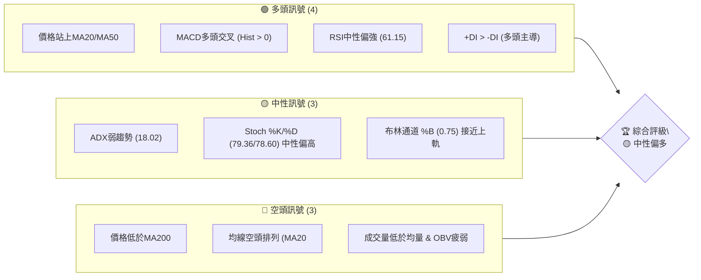
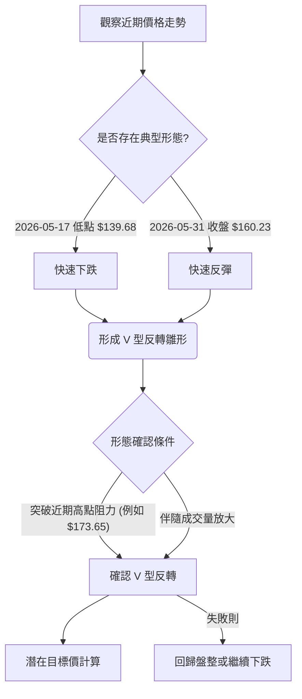

<details>
<summary>📊 靜態圖表 (點擊展開)</summary>

</details>

<html>
<head><meta charset="utf-8" /></head>
<body>
    <div>                        <script>window.PlotlyConfig = {MathJaxConfig: 'local'};</script>
        <script charset="utf-8" src="https://cdn.plot.ly/plotly-3.5.0.min.js" integrity="sha256-fHbNLP+GlIXN+efbQec78UkemUz3NJp7UmfGxC1tNxs=" crossorigin="anonymous"></script>                <div id="candlestick-chart" class="plotly-graph-div" style="height:500px; width:100%;"></div>            <script>                window.PLOTLYENV=window.PLOTLYENV || {};                                if (document.getElementById("candlestick-chart")) {                    Plotly.newPlot(                        "candlestick-chart",                        [{"close":{"dtype":"f8","bdata":"AAAAINWPaUAAAACAbjJpQAAAAABokmhAAAAAwF3GaEAAAADA8xhoQAAAAOCBBWhAAAAAIKuxZ0AAAAAgaLdnQAAAAABLq2dAAAAAwPRLaEAAAABgYTtoQAAAAKBSfmhAAAAAQF+MZ0AAAAAALSNnQAAAACDQbGdAAAAAwCKgZ0AAAADg\u002fGhnQAAAAIBOaWdAAAAAoD0haEAAAACgHA1qQAAAAKCfaGlAAAAAQLscakAAAAAggZZqQAAAAOAfFGpAAAAAAGzwaUAAAABAZStqQAAAAEBZVmpAAAAAgD4qa0AAAABgsHVpQAAAAAAfMGlAAAAAYBQiaUAAAABgydRpQAAAAOCkrGhAAAAAoC5saEAAAADAkR5pQAAAAODyQmlAAAAAQOMtaUAAAABgd\u002ftoQAAAAGBB4mhAAAAA4Ge\u002faUAAAACAgC1qQAAAAOAtimhAAAAAQCQfakAAAACgN55pQAAAAICgSGpAAAAAIEQ6akAAAADAdhlpQAAAAACSNmhAAAAAwDVAZ0AAAADgMCpnQAAAAID72mdAAAAAAEsdaUAAAABgC9hoQAAAAGAXwmdAAAAAIEfaaEAAAABgAqZnQAAAAGADeWdAAAAAgEYQaEAAAACgUSdnQAAAACDMm2dAAAAAwJMDZ0AAAADgLM9nQAAAAABgeGdAAAAAoFZVZkAAAADg7zhmQAAAAMDOYmVAAAAAILHGZUAAAACgldBlQAAAAGATvmVAAAAAQLNUZkAAAACA+KllQAAAAIAHBGVAAAAAYA3VZUAAAADA1EtlQAAAAMAGCmZAAAAAwMNLZkAAAABAL6VlQAAAAIBmgmVAAAAAAK5lZUAAAAAAu\u002fJlQAAAAAC31mRAAAAA4DS1ZEAAAAAAZ4tkQAAAAADklmRAAAAA4NHDZUAAAACANzRlQAAAAOAt+WRAAAAAAB+fZUAAAADg8vBjQAAAAIDNtmRAAAAAYJlSZEAAAABgMitkQAAAAIBkLmRAAAAAAKk3ZEAAAACAZC5kQAAAACDTM2RAAAAAQMBMZEAAAAAAhyNkQAAAAEAooGRAAAAAQKhWZEAAAADgkSllQAAAAAB2TGNAAAAAoKLMYkAAAABglsRkQAAAAIAJi2VAAAAAoPdlZUAAAACgrBdlQAAAAMDnfWZAAAAAAPDLZEAAAACAFZNjQAAAACCq+WNAAAAAgIcEZEAAAAAg3PxjQAAAAED\u002f0mNAAAAAwCiBZEAAAABgQq1kQAAAAAB5S2RAAAAAIEzEY0AAAABgmEFjQAAAAKBUGWNAAAAAYG3KYUAAAADgANxhQAAAAMBGrmJAAAAAIF8YY0AAAAAgPuxjQAAAAIDR\u002fWNAAAAAIBdcZEAAAABgNGhlQAAAAEAwrmVAAAAAAM5KZUAAAAAAe4hlQAAAAABUZWVAAAAAAEnyZEAAAADAW2xlQAAAACDg42VAAAAAQIgSZkAAAABg5rRlQAAAAMBxuGRAAAAA4FkvZEAAAAAgZmRkQAAAAKCA5WRAAAAAQOLNY0AAAAAAtWxkQAAAACCihWRAAAAAoC7eY0AAAACAmutjQAAAAIB412NAAAAAYJ44ZEAAAACAZYNkQAAAAIBsPGVAAAAAQIvkZEAAAADgo0BiQAAAAKBH6WJAAAAAQAoXY0AAAADgUfBiQAAAAKCZCWNAAAAAIFxvY0AAAACgR3FiQAAAAGCPymJAAAAAYLg+Y0AAAACAwuViQAAAAEDh8mJAAAAAgMI1Y0AAAADgenxjQAAAAAAAGGNAAAAAIFxXY0AAAABgZsZjQAAAAEAKf2RAAAAAgBReZEAAAADA9bBkQAAAAGC4bmRAAAAAQDPzY0AAAADAHl1jQAAAAKBHeWNAAAAAQDObY0AAAABAM4tkQAAAAGCP0mRAAAAAANcjZEAAAACgRzljQAAAAEDhumNAAAAAwPVoY0AAAABAMxtkQAAAAAApDGRAAAAAoEfJY0AAAABgZj5jQAAAAEAKd2JAAAAAoJkBY0AAAAAA11tiQAAAACCF02FAAAAAwMy8YUAAAACAwnVhQAAAAAAAGGFAAAAAYLjWYEAAAAAAAABiQAAAAGCPomJAAAAA4KOIY0AAAACA65FkQAAAAMDMBGRAAAAAwPUIZEAAAAAgXAdkQA=="},"high":{"dtype":"f8","bdata":"c0wcAvyLakC\u002fIooWWuNpQG+ZcpSxdWlAs2BoVmTUaEBPW2PhS7loQFJyD\u002f4CFGhAb10NU699aEAOIyDREVhoQP5tzWqcPWhAA79c5NlcaEBWwRcW249oQHLeJpmCE2lASmH5zmZfaEDZN3L4SEVnQAomgEaFemdA9niTKwHsZ0DVf6FsbNZnQCgZWmBvumdAtml\u002f+hFYaEAiQXY\u002fGoJqQJgKV8TcYmpALyew\u002fCUtakCB7D7AICJrQAUfGRBun2pA397GF26fakBFlLEheLRqQFFiOQULqGpAtPSPh+Bma0CWJHHhvIVqQCEqak\u002fSs2lA6f1+t1N2aUDE1ZnPuN1pQIJ2YZTR0WlAAo+KuFb+aEAq2bVAtYtpQAQZiSHxjWlAgn9bXeIzakCdP12LcetpQL0jiLLDaGlAQH+kBVLBaUDNzA\u002ffpU9qQMAbwf4heWpAcn7n+ucrakDCWciuzQhqQMcQhxMX7mpA8ftPiRMQa0C96gXwGC9qQBvVHPblnWlAjVHH5mYcaEBLWKq9Tp9nQHhycih49WdATc5azDQuaUCukWQuLmNpQABIP\u002fmymGhA4pDYlK0FaUBHBE4RushoQHXSVh59C2hAo\u002fQ35OJUaEAF1ub1z95nQPap2e4+\u002fmdA5gD4RS6TZ0Du0QyPkdFnQFhOTb9DiGhAOsj7YYZtZ0D4mF9MoZlmQBLKVk0LL2ZAiDmM4SRwZkAcwxeS02BmQPyAQLnPHWZAh7IgKAOgZkBnlu71mphnQKPoHfh1pmVA0U+jhffWZUCdE3nn98dlQMw\u002fz7NXKGZAJ+y0bbeIZkBSyxZ10P9lQH\u002fM5ZPm7mVAli+h4+KrZUAsB4h56jFmQGLAHg6aBGZAJoTbCXXrZED1OGk+Jy5lQImwBxUEsmRAXnvd9RLNZUDZS2QBJXBmQL5OkcLCkGVAApUGTXCuZUAfj2JpDdVlQA6VedZLbmVAbu1EZwVeZUDQ\u002fPDLwYJkQH47vJhDb2RA5lp\u002fBqJLZECRZnkI5VhkQFGLm+k9f2RAIwz+1s9aZECEfsg\u002f1IhkQEgH4a2UIWVAEKisIXptZUB01u3g\u002fotlQNfPv7VyDWVAt+Vx+M5yY0DWkgoYENBlQBlTw9P5D2ZAJxe9ZsDmZUDWUGk2TF5lQKarnjD2yWZA9USdTmFcZUD0MoZww7hkQPvLnIBMOGRAjzscVd9oZED\u002fW6RvvVRkQLEtfba2omRA2X6A26mMZEAXjam7qMpkQBuDQHrX9GRAZxNSPtSIZEADYpTKYvhjQEFBQZEtiWNAbrru7WsuY0Db9TfA2PZhQAiGwL+uAWNA5F8LRCtyY0CIRWMwZyZkQDv5Raq2omRAARczi3m\u002fZECNiVcao21lQOdB6FoZDWZA+Fupe1noZUBolAC4t4plQCo0mdBvqGVAzfEKimNzZUA6jJeURm5lQHMO+QZp9mVArUW3TKIfZkDBL\u002fmsJUJmQAdfaP3xCGZAk2r309RpZED2UrLjj39kQN4wkMO392RAxNJH6tEEZUAv73C6+4xkQPqmfALsEWVAYuqoGYh4ZEBq0wkaSV9kQKiLxA16oGRAFUYlZt9oZEAql7TjgadkQBhkHFx1mGVAhjZJnc4rZUAAAABACs9kQAAAAMDMfGNAAAAAQDNDY0AAAABgZr5jQAAAAKBwFWNAAAAAYGYGZEAAAACAwt1jQAAAAEAK72JAAAAAQOGKY0AAAACA61FjQAAAACBcI2NAAAAAwB5FY0AAAACA6ylkQAAAAMD1UGRAAAAAACnUY0AAAABAChdkQAAAAMD1qGRAAAAA4KPQZEAAAACgcN1kQAAAACCuD2VAAAAAoJmBZEAAAABAMyNkQAAAAGCP4mNAAAAAANfbY0AAAAAgXK9kQAAAAKBwDWVAAAAAYGZqZEAAAADAciRkQAAAAAAp9GNAAAAA4HoEZEAAAAAAKUxkQAAAAKCZeWRAAAAAIK5fZEAAAADgegxlQAAAAAAAYGNAAAAAAAAYY0AAAAAAVspiQAAAAMD1SGJAAAAAoHDpYUAAAABA4aJhQAAAAKBHcWFAAAAAYGYWYUAAAADAzBxiQAAAAMD1qGJAAAAAgD2yY0AAAADAzOxkQAAAAEC0oGRAAAAAwPVwZEAAAACgR0lkQA=="},"hovertemplate":"\u003cb\u003e%{x|%Y-%m-%d}\u003c\u002fb\u003e\u003cbr\u003e\u958b: $%{open:.2f}\u003cbr\u003e\u9ad8: $%{high:.2f}\u003cbr\u003e\u4f4e: $%{low:.2f}\u003cbr\u003e\u6536: $%{close:.2f}\u003cextra\u003e\u003c\u002fextra\u003e","low":{"dtype":"f8","bdata":"yiHCDbPwaEAlvmrBhDBpQMWN\u002fxYTQmhAdMmssLFRaECzZsiiUM9nQPB7m0Wy5GZAI6goJr6oZ0AsbiGpkk1nQOIxMbFtkmdAmz+3zgWUZ0CYOMySbPFnQLJasm0EPGhASwZQxeg+Z0BikbFRl6xmQEns79JQ9GZA7zh7xFyCZ0B9BzFC6zdmQKRXUErs\u002fGZA7pSNc4+PZ0AYNzTahOdoQBwwwgRXSmlABKEAuZcnaUDrm6RTuxxqQBL2X+6r0GlAlDutL2N8aUDUzkQ+IuhpQB0Q9FfQk2lAyZUNtUvnaUB\u002faOk2zFxpQPJ\u002f28gOKmlADvYUwg1vaECg\u002f8v2pw1pQM4khyn8pGhA4PQMFprFZ0Ap+tAeg\u002fRnQMzwV1k3xWhAtTW0LEAeaUAqBIBTXpxoQOVeV3oQa2hA748Yd2\u002fyaEAAwBISophpQPRte3OKiWhAlnBstSX7aEAzqDUuDxtpQBO4eVmeumlAa6VGcoEDakAmn8Bw+u9oQB9gcDDXCGhAnHZFzOQhZ0CYEjyc+WRmQO3KyYJcJmdAM13+6w5CaEBMtvvjsH5oQO2IFmLK\u002fmZA2uG4n1meZ0DbzVACrIBnQO9kh2p54GZAu7BtYIZqZ0B0Qml2v\u002f9mQD+PwlJ4DWdAR8UESCVhZkBLeLvZpANmQPYQHOjl9GZArXeMRCtKZkCQaGy5qRlmQNT5yJOeQWVA8LPAb\u002fmjZEDdZzwFl5RlQMHqIUoWRmVA9cVKkrG3ZUAQIiPC6JRlQBJGHG\u002fFP2RAn7\u002f1nS+uZEAE9S6JWK5kQBdnHkZ5k2VAq9UDq6MwZkBo3zNM3oZlQFga+LiVXGVArM22goQPZUB6N\u002foiDkBlQCs14WhgwGRA4\u002f9U1HdzZEDRv9Zt2YhkQKa3GSfTxmNAeDFO9yISZECxjUvhPuFkQMdVpqOm0GRAyyAT2e3CZECo1JWja8hjQLUfwWwcR2RAmkkPcRFIZECN2AQpMBRkQF34bA8u\u002fWNAtWVo8KzxY0AzGO7aNQRkQGF16KGY9mNASrehKOYaZEDSaEEaAyBkQFcdIPRVdWRAzy\u002fV0xj\u002fY0BAxdMK0nFkQJddQzSWKmNAh1onnJOfYkD3idXX7bRkQFyorFpoe2RAq4kbMstSZUAVjvaVXLpkQEFsc5tGbmVANm58sDZZZECZGeQ\u002fMIFjQGeCRN\u002fvMWNA+X70oNzdY0DbGYbIHLljQAz0vafqtWNAy67ez+e9Y0BcBOA+GB5kQAGGwU890WNAcC69oK6UY0AGnxLRPjpjQFWVf\u002fr8xWJAHvr7pJFiYUCx\u002fFPK60phQNd3poIDZ2JAsSx0i4RyYkAuHMfUK1NjQGZzDDuwymNA7pOGwc4FZEA7QeC79ShkQKJ+WMD9NmVA0MucViAsZUC2A3NtqgBlQIPqawiiGGVAqMdsp4SfZECfKmxJD1VkQKkOnEwlO2VA7GTatl18ZED\u002fM2LaB1VlQIkeG8lUs2RALoCz77AYY0CCAyvIzgVkQF+XTDW2LmRApwPkB7PCY0B3Jv4yPlljQLgrZ++YgmRAMdPJXwleY0DFTuKjkY9jQNMie917sGNAntDsWor8Y0Dic7zJxTxkQFl93g7JqGRAMWFgajOAZEAAAABgjxpiQAAAAGC4qmJAAAAAoJmxYkAAAAAAKcxiQAAAACCuT2JAAAAAAAD4YkAAAABAM1NiQAAAAEDhymFAAAAAwMzsYkAAAAAA18NiQAAAAAApvGJAAAAAwPXIYkAAAACgR2ljQAAAAIDCFWNAAAAAIIUjY0AAAADAzBRjQAAAAEAKC2RAAAAAwMxEZEAAAAAghVNkQAAAAOBRSGRAAAAAgD3KY0AAAAAAKURjQAAAAKBwXWNAAAAAAABQY0AAAADAzGRjQAAAACCF12NAAAAAQArXY0AAAABgjyJjQAAAACBcd2NAAAAAgMJdY0AAAACAFK5jQAAAAKCZ+WNAAAAAQDOTY0AAAADgozhjQAAAACBcX2JAAAAAYOVIYkAAAADAHjViQAAAAOBRcGFAAAAAAIF9YUAAAACA6zlhQAAAACCFu2BAAAAAwB6VYEAAAACA6zlhQAAAAAApHGJAAAAAAADYYkAAAABACsdjQAAAAGAOzWNAAAAAQDOzY0AAAAAAKZxjQA=="},"name":"\u50f9\u683c","open":{"dtype":"f8","bdata":"kcUMBFosakAdS\u002f8wVWtpQGCBWPQmR2lAC7k9y+KHaEAcl1TJjJZoQI1EsfmeyGdAzQsRJGAIaEC4nBdRFc1nQM+43n\u002fV2WdAbX2ddha3Z0AgJx1mdDJoQPeZ8aCBTmhAwxjc8qlZaEB0f5+bAvtmQMI6e447KWdA0ocIgN2IZ0C5gphetrBnQPawbV2sm2dA2vJiUr6oZ0DMl8FuGPhoQCeCjohn\u002f2lANM7TzMJEaUDrm6RTuxxqQAUfGRBun2pA\u002fd2mlpNPakD+ZftKz49qQNMrF54iW2pAI2MA7GlNakDrgK0AAzFqQDAJllBqVmlAiLzwAY+uaEC\u002fpcFArRRpQKZsCdI0LmlA9e3mwojUaEDFcYOt0k5oQKLemmdOb2lARfYvKDN5aUBEDnO19bJpQHHue+Z7IGlA1X4ds80gaUBmZmYmxM1pQK6S9bnXJWpAuxb7uB8SaUCZiJ8PJ6dpQOOqh0DNF2pAcpXZAFzGakAbJ32bJeNpQPX719otcmlAqgggdCsLaEC6mrJWFGFnQO3KyYJcJmdAj78i0uGBaECukWQuLmNpQABIP\u002fmymGhA+RxkLqn4Z0DbSgBtnERoQOL6OlAW72dAfCGJqRzJZ0Cv5PuHoXJnQDhf6rTpN2dAjcoVo17MZkDnrEHBRkBmQJ38\u002f9hwSGhAyOBBDxAtZ0D8KQPsrHpmQDvX6FqJDWZAuA4OewjXZEAW36htTt5lQGnrTDDphWVA6WDS37DVZUDAIlOj9QlnQFStflrZcGVAGB01m00jZUCNddDPObNlQB3O\u002f0OssGVAWovLdztQZkBBhlfO0PBlQMsfDltZ3WVAP\u002fVZOemFZUAPoWNJqG1lQDcuH2kXAWZAJoTbCXXrZEAlTjffRZ1kQOGln8pQnGRAa75SQ1MzZEDu8c+e99ZlQH04cgl8j2VAKwzWtx7GZEAEMMXk\u002fbBlQNryFiCHpmRAxQ6OPbfHZEDdA5jB2XhkQNnupn0yK2RAPHgak6kYZEAAAACAZC5kQAXR0j\u002f7GGRAo9g2K\u002fA4ZEDjN1EXYVVkQFcdIPRVdWRAFeGp4XQkZUDSFx8KohhlQNfPv7VyDWVAcxa3ezthY0DhaV3r9cJlQLV+LgVDjmRAoUE4NWq4ZUATESKQGCVlQK1VWmB1mGVA49PnxUvqZEDEpO8ZnCFkQNVrcGVj2WNARLKTWrM2ZEDxFs92BvljQPh20CLhC2RATwRwwl3pY0CGKIR7w7hkQChcjkd8t2RAjIjnuPUoZEDBGiRr7a1jQM7N2M4IfWNAHAaw7GYfY0CJMst52plhQFJRGhh2uWJA8v8SBXa5YkDlJ3uyzgVkQGZ\u002f6Z\u002fOmGRAdK7CcloQZEDkHrxwuEVkQDA5YP+1VGVAxh1p\u002fLu4ZUBhriGntjVlQGspz9QWgmVAdgdYjgpNZUBs2wHvquFkQFTppkGlhGVAME6JzgxkZUCI0fQcX9hlQHAlswT7PmVALIKNHAgvZED6h48A1itkQAbt43kaNWRAeNvwJTuHZEDjuL7nAHZjQIvOaslPpGRAqDHPkxFsZEDokT9mtptjQFAc+6NEMWRAeItQTPsYZEBraXqW0lJkQNfRpETGsGRAE1taGyfeZEAAAABACs9kQAAAAGBm7mJAAAAAoJnRYkAAAAAAAGBjQAAAAAAAsGJAAAAAAAD4YkAAAABAM6NjQAAAAMDM\u002fGFAAAAAQArvYkAAAABguOZiQAAAAKBH4WJAAAAAgD3iYkAAAAAAABhkQAAAAOB6fGNAAAAAAAAwY0AAAADAzBRjQAAAAMAeTWRAAAAAAACwZEAAAACAPZJkQAAAAOBRyGRAAAAAoJlhZEAAAADgURhkQAAAAKCZuWNAAAAAYLh+Y0AAAABgj4pjQAAAAAAAoGRAAAAAAABQZEAAAAAghRtkQAAAAKBHiWNAAAAAgOvJY0AAAACAFLZjQAAAAAAAYGRAAAAAANcvZEAAAACgR2FkQAAAAAAAYGNAAAAAAACAYkAAAAAgrq9iQAAAAMD1SGJAAAAAACmsYUAAAADAzHhhQAAAAAAAYGFAAAAAoJn5YEAAAAAAAEBhQAAAAEAKL2JAAAAAwPXgYkAAAADAHt1jQAAAAGC4nmRAAAAAQOHaY0AAAAAAAABkQA=="},"x":["2025-08-13T00:00:00-04:00","2025-08-14T00:00:00-04:00","2025-08-15T00:00:00-04:00","2025-08-18T00:00:00-04:00","2025-08-19T00:00:00-04:00","2025-08-20T00:00:00-04:00","2025-08-21T00:00:00-04:00","2025-08-22T00:00:00-04:00","2025-08-25T00:00:00-04:00","2025-08-26T00:00:00-04:00","2025-08-27T00:00:00-04:00","2025-08-28T00:00:00-04:00","2025-08-29T00:00:00-04:00","2025-09-02T00:00:00-04:00","2025-09-03T00:00:00-04:00","2025-09-04T00:00:00-04:00","2025-09-05T00:00:00-04:00","2025-09-08T00:00:00-04:00","2025-09-09T00:00:00-04:00","2025-09-10T00:00:00-04:00","2025-09-11T00:00:00-04:00","2025-09-12T00:00:00-04:00","2025-09-15T00:00:00-04:00","2025-09-16T00:00:00-04:00","2025-09-17T00:00:00-04:00","2025-09-18T00:00:00-04:00","2025-09-19T00:00:00-04:00","2025-09-22T00:00:00-04:00","2025-09-23T00:00:00-04:00","2025-09-24T00:00:00-04:00","2025-09-25T00:00:00-04:00","2025-09-26T00:00:00-04:00","2025-09-29T00:00:00-04:00","2025-09-30T00:00:00-04:00","2025-10-01T00:00:00-04:00","2025-10-02T00:00:00-04:00","2025-10-03T00:00:00-04:00","2025-10-06T00:00:00-04:00","2025-10-07T00:00:00-04:00","2025-10-08T00:00:00-04:00","2025-10-09T00:00:00-04:00","2025-10-10T00:00:00-04:00","2025-10-13T00:00:00-04:00","2025-10-14T00:00:00-04:00","2025-10-15T00:00:00-04:00","2025-10-16T00:00:00-04:00","2025-10-17T00:00:00-04:00","2025-10-20T00:00:00-04:00","2025-10-21T00:00:00-04:00","2025-10-22T00:00:00-04:00","2025-10-23T00:00:00-04:00","2025-10-24T00:00:00-04:00","2025-10-27T00:00:00-04:00","2025-10-28T00:00:00-04:00","2025-10-29T00:00:00-04:00","2025-10-30T00:00:00-04:00","2025-10-31T00:00:00-04:00","2025-11-03T00:00:00-05:00","2025-11-04T00:00:00-05:00","2025-11-05T00:00:00-05:00","2025-11-06T00:00:00-05:00","2025-11-07T00:00:00-05:00","2025-11-10T00:00:00-05:00","2025-11-11T00:00:00-05:00","2025-11-12T00:00:00-05:00","2025-11-13T00:00:00-05:00","2025-11-14T00:00:00-05:00","2025-11-17T00:00:00-05:00","2025-11-18T00:00:00-05:00","2025-11-19T00:00:00-05:00","2025-11-20T00:00:00-05:00","2025-11-21T00:00:00-05:00","2025-11-24T00:00:00-05:00","2025-11-25T00:00:00-05:00","2025-11-26T00:00:00-05:00","2025-11-28T00:00:00-05:00","2025-12-01T00:00:00-05:00","2025-12-02T00:00:00-05:00","2025-12-03T00:00:00-05:00","2025-12-04T00:00:00-05:00","2025-12-05T00:00:00-05:00","2025-12-08T00:00:00-05:00","2025-12-09T00:00:00-05:00","2025-12-10T00:00:00-05:00","2025-12-11T00:00:00-05:00","2025-12-12T00:00:00-05:00","2025-12-15T00:00:00-05:00","2025-12-16T00:00:00-05:00","2025-12-17T00:00:00-05:00","2025-12-18T00:00:00-05:00","2025-12-19T00:00:00-05:00","2025-12-22T00:00:00-05:00","2025-12-23T00:00:00-05:00","2025-12-24T00:00:00-05:00","2025-12-26T00:00:00-05:00","2025-12-29T00:00:00-05:00","2025-12-30T00:00:00-05:00","2025-12-31T00:00:00-05:00","2026-01-02T00:00:00-05:00","2026-01-05T00:00:00-05:00","2026-01-06T00:00:00-05:00","2026-01-07T00:00:00-05:00","2026-01-08T00:00:00-05:00","2026-01-09T00:00:00-05:00","2026-01-12T00:00:00-05:00","2026-01-13T00:00:00-05:00","2026-01-14T00:00:00-05:00","2026-01-15T00:00:00-05:00","2026-01-16T00:00:00-05:00","2026-01-20T00:00:00-05:00","2026-01-21T00:00:00-05:00","2026-01-22T00:00:00-05:00","2026-01-23T00:00:00-05:00","2026-01-26T00:00:00-05:00","2026-01-27T00:00:00-05:00","2026-01-28T00:00:00-05:00","2026-01-29T00:00:00-05:00","2026-01-30T00:00:00-05:00","2026-02-02T00:00:00-05:00","2026-02-03T00:00:00-05:00","2026-02-04T00:00:00-05:00","2026-02-05T00:00:00-05:00","2026-02-06T00:00:00-05:00","2026-02-09T00:00:00-05:00","2026-02-10T00:00:00-05:00","2026-02-11T00:00:00-05:00","2026-02-12T00:00:00-05:00","2026-02-13T00:00:00-05:00","2026-02-17T00:00:00-05:00","2026-02-18T00:00:00-05:00","2026-02-19T00:00:00-05:00","2026-02-20T00:00:00-05:00","2026-02-23T00:00:00-05:00","2026-02-24T00:00:00-05:00","2026-02-25T00:00:00-05:00","2026-02-26T00:00:00-05:00","2026-02-27T00:00:00-05:00","2026-03-02T00:00:00-05:00","2026-03-03T00:00:00-05:00","2026-03-04T00:00:00-05:00","2026-03-05T00:00:00-05:00","2026-03-06T00:00:00-05:00","2026-03-09T00:00:00-04:00","2026-03-10T00:00:00-04:00","2026-03-11T00:00:00-04:00","2026-03-12T00:00:00-04:00","2026-03-13T00:00:00-04:00","2026-03-16T00:00:00-04:00","2026-03-17T00:00:00-04:00","2026-03-18T00:00:00-04:00","2026-03-19T00:00:00-04:00","2026-03-20T00:00:00-04:00","2026-03-23T00:00:00-04:00","2026-03-24T00:00:00-04:00","2026-03-25T00:00:00-04:00","2026-03-26T00:00:00-04:00","2026-03-27T00:00:00-04:00","2026-03-30T00:00:00-04:00","2026-03-31T00:00:00-04:00","2026-04-01T00:00:00-04:00","2026-04-02T00:00:00-04:00","2026-04-06T00:00:00-04:00","2026-04-07T00:00:00-04:00","2026-04-08T00:00:00-04:00","2026-04-09T00:00:00-04:00","2026-04-10T00:00:00-04:00","2026-04-13T00:00:00-04:00","2026-04-14T00:00:00-04:00","2026-04-15T00:00:00-04:00","2026-04-16T00:00:00-04:00","2026-04-17T00:00:00-04:00","2026-04-20T00:00:00-04:00","2026-04-21T00:00:00-04:00","2026-04-22T00:00:00-04:00","2026-04-23T00:00:00-04:00","2026-04-24T00:00:00-04:00","2026-04-27T00:00:00-04:00","2026-04-28T00:00:00-04:00","2026-04-29T00:00:00-04:00","2026-04-30T00:00:00-04:00","2026-05-01T00:00:00-04:00","2026-05-04T00:00:00-04:00","2026-05-05T00:00:00-04:00","2026-05-06T00:00:00-04:00","2026-05-07T00:00:00-04:00","2026-05-08T00:00:00-04:00","2026-05-11T00:00:00-04:00","2026-05-12T00:00:00-04:00","2026-05-13T00:00:00-04:00","2026-05-14T00:00:00-04:00","2026-05-15T00:00:00-04:00","2026-05-18T00:00:00-04:00","2026-05-19T00:00:00-04:00","2026-05-20T00:00:00-04:00","2026-05-21T00:00:00-04:00","2026-05-22T00:00:00-04:00","2026-05-26T00:00:00-04:00","2026-05-27T00:00:00-04:00","2026-05-28T00:00:00-04:00","2026-05-29T00:00:00-04:00"],"type":"candlestick"},{"hovertemplate":"MA30: $%{y:.2f}\u003cextra\u003e\u003c\u002fextra\u003e","line":{"color":"#2196F3","dash":"dash","width":2},"mode":"lines","name":"MA30","x":["2025-08-13T00:00:00-04:00","2025-08-14T00:00:00-04:00","2025-08-15T00:00:00-04:00","2025-08-18T00:00:00-04:00","2025-08-19T00:00:00-04:00","2025-08-20T00:00:00-04:00","2025-08-21T00:00:00-04:00","2025-08-22T00:00:00-04:00","2025-08-25T00:00:00-04:00","2025-08-26T00:00:00-04:00","2025-08-27T00:00:00-04:00","2025-08-28T00:00:00-04:00","2025-08-29T00:00:00-04:00","2025-09-02T00:00:00-04:00","2025-09-03T00:00:00-04:00","2025-09-04T00:00:00-04:00","2025-09-05T00:00:00-04:00","2025-09-08T00:00:00-04:00","2025-09-09T00:00:00-04:00","2025-09-10T00:00:00-04:00","2025-09-11T00:00:00-04:00","2025-09-12T00:00:00-04:00","2025-09-15T00:00:00-04:00","2025-09-16T00:00:00-04:00","2025-09-17T00:00:00-04:00","2025-09-18T00:00:00-04:00","2025-09-19T00:00:00-04:00","2025-09-22T00:00:00-04:00","2025-09-23T00:00:00-04:00","2025-09-24T00:00:00-04:00","2025-09-25T00:00:00-04:00","2025-09-26T00:00:00-04:00","2025-09-29T00:00:00-04:00","2025-09-30T00:00:00-04:00","2025-10-01T00:00:00-04:00","2025-10-02T00:00:00-04:00","2025-10-03T00:00:00-04:00","2025-10-06T00:00:00-04:00","2025-10-07T00:00:00-04:00","2025-10-08T00:00:00-04:00","2025-10-09T00:00:00-04:00","2025-10-10T00:00:00-04:00","2025-10-13T00:00:00-04:00","2025-10-14T00:00:00-04:00","2025-10-15T00:00:00-04:00","2025-10-16T00:00:00-04:00","2025-10-17T00:00:00-04:00","2025-10-20T00:00:00-04:00","2025-10-21T00:00:00-04:00","2025-10-22T00:00:00-04:00","2025-10-23T00:00:00-04:00","2025-10-24T00:00:00-04:00","2025-10-27T00:00:00-04:00","2025-10-28T00:00:00-04:00","2025-10-29T00:00:00-04:00","2025-10-30T00:00:00-04:00","2025-10-31T00:00:00-04:00","2025-11-03T00:00:00-05:00","2025-11-04T00:00:00-05:00","2025-11-05T00:00:00-05:00","2025-11-06T00:00:00-05:00","2025-11-07T00:00:00-05:00","2025-11-10T00:00:00-05:00","2025-11-11T00:00:00-05:00","2025-11-12T00:00:00-05:00","2025-11-13T00:00:00-05:00","2025-11-14T00:00:00-05:00","2025-11-17T00:00:00-05:00","2025-11-18T00:00:00-05:00","2025-11-19T00:00:00-05:00","2025-11-20T00:00:00-05:00","2025-11-21T00:00:00-05:00","2025-11-24T00:00:00-05:00","2025-11-25T00:00:00-05:00","2025-11-26T00:00:00-05:00","2025-11-28T00:00:00-05:00","2025-12-01T00:00:00-05:00","2025-12-02T00:00:00-05:00","2025-12-03T00:00:00-05:00","2025-12-04T00:00:00-05:00","2025-12-05T00:00:00-05:00","2025-12-08T00:00:00-05:00","2025-12-09T00:00:00-05:00","2025-12-10T00:00:00-05:00","2025-12-11T00:00:00-05:00","2025-12-12T00:00:00-05:00","2025-12-15T00:00:00-05:00","2025-12-16T00:00:00-05:00","2025-12-17T00:00:00-05:00","2025-12-18T00:00:00-05:00","2025-12-19T00:00:00-05:00","2025-12-22T00:00:00-05:00","2025-12-23T00:00:00-05:00","2025-12-24T00:00:00-05:00","2025-12-26T00:00:00-05:00","2025-12-29T00:00:00-05:00","2025-12-30T00:00:00-05:00","2025-12-31T00:00:00-05:00","2026-01-02T00:00:00-05:00","2026-01-05T00:00:00-05:00","2026-01-06T00:00:00-05:00","2026-01-07T00:00:00-05:00","2026-01-08T00:00:00-05:00","2026-01-09T00:00:00-05:00","2026-01-12T00:00:00-05:00","2026-01-13T00:00:00-05:00","2026-01-14T00:00:00-05:00","2026-01-15T00:00:00-05:00","2026-01-16T00:00:00-05:00","2026-01-20T00:00:00-05:00","2026-01-21T00:00:00-05:00","2026-01-22T00:00:00-05:00","2026-01-23T00:00:00-05:00","2026-01-26T00:00:00-05:00","2026-01-27T00:00:00-05:00","2026-01-28T00:00:00-05:00","2026-01-29T00:00:00-05:00","2026-01-30T00:00:00-05:00","2026-02-02T00:00:00-05:00","2026-02-03T00:00:00-05:00","2026-02-04T00:00:00-05:00","2026-02-05T00:00:00-05:00","2026-02-06T00:00:00-05:00","2026-02-09T00:00:00-05:00","2026-02-10T00:00:00-05:00","2026-02-11T00:00:00-05:00","2026-02-12T00:00:00-05:00","2026-02-13T00:00:00-05:00","2026-02-17T00:00:00-05:00","2026-02-18T00:00:00-05:00","2026-02-19T00:00:00-05:00","2026-02-20T00:00:00-05:00","2026-02-23T00:00:00-05:00","2026-02-24T00:00:00-05:00","2026-02-25T00:00:00-05:00","2026-02-26T00:00:00-05:00","2026-02-27T00:00:00-05:00","2026-03-02T00:00:00-05:00","2026-03-03T00:00:00-05:00","2026-03-04T00:00:00-05:00","2026-03-05T00:00:00-05:00","2026-03-06T00:00:00-05:00","2026-03-09T00:00:00-04:00","2026-03-10T00:00:00-04:00","2026-03-11T00:00:00-04:00","2026-03-12T00:00:00-04:00","2026-03-13T00:00:00-04:00","2026-03-16T00:00:00-04:00","2026-03-17T00:00:00-04:00","2026-03-18T00:00:00-04:00","2026-03-19T00:00:00-04:00","2026-03-20T00:00:00-04:00","2026-03-23T00:00:00-04:00","2026-03-24T00:00:00-04:00","2026-03-25T00:00:00-04:00","2026-03-26T00:00:00-04:00","2026-03-27T00:00:00-04:00","2026-03-30T00:00:00-04:00","2026-03-31T00:00:00-04:00","2026-04-01T00:00:00-04:00","2026-04-02T00:00:00-04:00","2026-04-06T00:00:00-04:00","2026-04-07T00:00:00-04:00","2026-04-08T00:00:00-04:00","2026-04-09T00:00:00-04:00","2026-04-10T00:00:00-04:00","2026-04-13T00:00:00-04:00","2026-04-14T00:00:00-04:00","2026-04-15T00:00:00-04:00","2026-04-16T00:00:00-04:00","2026-04-17T00:00:00-04:00","2026-04-20T00:00:00-04:00","2026-04-21T00:00:00-04:00","2026-04-22T00:00:00-04:00","2026-04-23T00:00:00-04:00","2026-04-24T00:00:00-04:00","2026-04-27T00:00:00-04:00","2026-04-28T00:00:00-04:00","2026-04-29T00:00:00-04:00","2026-04-30T00:00:00-04:00","2026-05-01T00:00:00-04:00","2026-05-04T00:00:00-04:00","2026-05-05T00:00:00-04:00","2026-05-06T00:00:00-04:00","2026-05-07T00:00:00-04:00","2026-05-08T00:00:00-04:00","2026-05-11T00:00:00-04:00","2026-05-12T00:00:00-04:00","2026-05-13T00:00:00-04:00","2026-05-14T00:00:00-04:00","2026-05-15T00:00:00-04:00","2026-05-18T00:00:00-04:00","2026-05-19T00:00:00-04:00","2026-05-20T00:00:00-04:00","2026-05-21T00:00:00-04:00","2026-05-22T00:00:00-04:00","2026-05-26T00:00:00-04:00","2026-05-27T00:00:00-04:00","2026-05-28T00:00:00-04:00","2026-05-29T00:00:00-04:00"],"y":{"dtype":"f8","bdata":"AAAAAAAA+H8AAAAAAAD4fwAAAAAAAPh\u002fAAAAAAAA+H8AAAAAAAD4fwAAAAAAAPh\u002fAAAAAAAA+H8AAAAAAAD4fwAAAAAAAPh\u002fAAAAAAAA+H8AAAAAAAD4fwAAAAAAAPh\u002fAAAAAAAA+H8AAAAAAAD4fwAAAAAAAPh\u002fAAAAAAAA+H8AAAAAAAD4fwAAAAAAAPh\u002fAAAAAAAA+H8AAAAAAAD4fwAAAAAAAPh\u002fAAAAAAAA+H8AAAAAAAD4fwAAAAAAAPh\u002fAAAAAAAA+H8AAAAAAAD4fwAAAAAAAPh\u002fAAAAAAAA+H8AAAAAAAD4f4mIiAihyGhAmpmZefjEaEB3d3fnYcpoQM3MzMxBy2hAq6qqOkDIaEAiIiKy+NBoQHd3d4eN22hAERERETroaEAAAABgB\u002fNoQLy7u+tk\u002fWhAAAAAoMYJaUAzMzNDYRppQAAAAHDGGmlAAAAA8LswaUBVVVX15kVpQFVVVcVLXmlAVVVVFYB0aUC8u7uL6oJpQBERESHCiWlA3t3d3UGCaUCJiIhooGlpQERERDRfXGlAZmZmdttTaUC8u7ur+URpQGZmZpYsMWlAd3d3F+cnaUC8u7vLYxJpQAAAAADy+WhAzczMzHrfaECamZn5zMtoQO\u002fu7r5SvmhAREREZD2saEARERFx\u002fJpoQBEREeG1kGhAERER4eF+aECJiIhIKWZoQDMzMwMXRWhA7+7uzgwoaECJiIhIBQ1oQDMzM\u002fM28mdAvLu7yw7VZ0AzMzNDiq5nQKuqqup3kGdA3t3djd1rZ0BERERk\u002fEZnQBERERHEImdAERERQTcBZ0B3d3dnveNmQDMzM+OqzGZAAAAAkNm8ZkBERETEd7JmQAAAAMC5mGZAmpmZaR9zZkBEREREb05mQFVVVQVlM2ZAd3d3xwsZZkDv7u6uLwRmQERERMTb7mVA3t3dHQXaZUDv7u6Om75lQHd3d2fopWVAAAAAIPGOZUDe3d094G9lQDMzM1PPU2VAERERAcFBZUBVVVX1VTBlQBEREYE8JmVAiYiIaKMZZUDv7u4eVgtlQImIiEjOAWVAq6qq6s3wZECrqqo6huxkQO\u002fu7j7f3WRAIiIi0v3DZEDe3d29e79kQJqZmRlAu2RAmpmZKZezZEC8u7ub365kQImIiMhBt2RAmpmZ2SGyZECamZmZ4J1kQN7d3U2ClmRAiYiIqJ6QZEC8u7tL3otkQLy7u6tWhWRAzczMTJV6ZECamZmpFXZkQN7d3V1LcGRAmpmZiXdgZEAAAAAwn1pkQEREROTWTGRAMzMz0zs3ZECamZn5hiNkQO\u002fu7i65FmRAd3d3pyUNZEDNzMws8QpkQCIiIlIkCWRAd3d3N6cJZEC8u7vLeRRkQAAAABB6HWRAREREdJ0lZEC8u7tbxyhkQAAAAKCsOmRAiYiI+P5MZEDe3d2dllJkQERERLSMVWRAIiIiQk1bZECrqqrqimBkQCIiImJtUWRA3t3dLTVMZEBVVVVVL1NkQBEREdELW2RAIiIigjlZZEAAAADw81xkQM3MzEzoYmRAAAAAkHldZECJiIgIBVdkQGZmZiYnU2RAIiIiwgdXZEC8u7vLwWFkQDMzM1P+c2RAmpmZyXaOZEDe3d2N0ZFkQM3MzAzJk2RAAAAAsL2TZEAiIiLyV4tkQDMzM\u002fMzg2RAmpmZ2U97ZEARERGxA2JkQCIiIjJcSWRAIiIiAuQ3ZEBERERkZiFkQDMzM7OEDGRAq6qqarP9Y0C8u7vrK+1jQN7d3R1P1WNAiYiI2AC+Y0DNzMwcha1jQDMzM0Obq2NAREREBCqtY0BmZmZWt69jQKuqqrrBq2NAmpmZKQCtY0Dv7u6e8qNjQLy7u6sAm2NAd3d3F8WYY0C8u7v7Fp5jQM3MzJx1pmNAzczMTMSlY0De3d1Nw5pjQERERFTpjWNAZmZmNkKBY0CrqqrKE5FjQImIiPjFmmNAMzMz87agY0C8u7s7UaNjQGZmZpZunmNAiYiI+MWaY0BEREQED5pjQBEREfHSkWNAERERwfWEY0DNzMx8sXhjQN7d3S3daGNAvLu7G6FUY0CJiIhY8kdjQBERETEIRGNAd3d3t6xFY0C8u7trdUxjQN7d3U1iSGNAIiIi8otFY0ARERGx5D9jQA=="},"type":"scatter"},{"hovertemplate":"MA60: $%{y:.2f}\u003cextra\u003e\u003c\u002fextra\u003e","line":{"color":"#9C27B0","dash":"dash","width":2},"mode":"lines","name":"MA60","x":["2025-08-13T00:00:00-04:00","2025-08-14T00:00:00-04:00","2025-08-15T00:00:00-04:00","2025-08-18T00:00:00-04:00","2025-08-19T00:00:00-04:00","2025-08-20T00:00:00-04:00","2025-08-21T00:00:00-04:00","2025-08-22T00:00:00-04:00","2025-08-25T00:00:00-04:00","2025-08-26T00:00:00-04:00","2025-08-27T00:00:00-04:00","2025-08-28T00:00:00-04:00","2025-08-29T00:00:00-04:00","2025-09-02T00:00:00-04:00","2025-09-03T00:00:00-04:00","2025-09-04T00:00:00-04:00","2025-09-05T00:00:00-04:00","2025-09-08T00:00:00-04:00","2025-09-09T00:00:00-04:00","2025-09-10T00:00:00-04:00","2025-09-11T00:00:00-04:00","2025-09-12T00:00:00-04:00","2025-09-15T00:00:00-04:00","2025-09-16T00:00:00-04:00","2025-09-17T00:00:00-04:00","2025-09-18T00:00:00-04:00","2025-09-19T00:00:00-04:00","2025-09-22T00:00:00-04:00","2025-09-23T00:00:00-04:00","2025-09-24T00:00:00-04:00","2025-09-25T00:00:00-04:00","2025-09-26T00:00:00-04:00","2025-09-29T00:00:00-04:00","2025-09-30T00:00:00-04:00","2025-10-01T00:00:00-04:00","2025-10-02T00:00:00-04:00","2025-10-03T00:00:00-04:00","2025-10-06T00:00:00-04:00","2025-10-07T00:00:00-04:00","2025-10-08T00:00:00-04:00","2025-10-09T00:00:00-04:00","2025-10-10T00:00:00-04:00","2025-10-13T00:00:00-04:00","2025-10-14T00:00:00-04:00","2025-10-15T00:00:00-04:00","2025-10-16T00:00:00-04:00","2025-10-17T00:00:00-04:00","2025-10-20T00:00:00-04:00","2025-10-21T00:00:00-04:00","2025-10-22T00:00:00-04:00","2025-10-23T00:00:00-04:00","2025-10-24T00:00:00-04:00","2025-10-27T00:00:00-04:00","2025-10-28T00:00:00-04:00","2025-10-29T00:00:00-04:00","2025-10-30T00:00:00-04:00","2025-10-31T00:00:00-04:00","2025-11-03T00:00:00-05:00","2025-11-04T00:00:00-05:00","2025-11-05T00:00:00-05:00","2025-11-06T00:00:00-05:00","2025-11-07T00:00:00-05:00","2025-11-10T00:00:00-05:00","2025-11-11T00:00:00-05:00","2025-11-12T00:00:00-05:00","2025-11-13T00:00:00-05:00","2025-11-14T00:00:00-05:00","2025-11-17T00:00:00-05:00","2025-11-18T00:00:00-05:00","2025-11-19T00:00:00-05:00","2025-11-20T00:00:00-05:00","2025-11-21T00:00:00-05:00","2025-11-24T00:00:00-05:00","2025-11-25T00:00:00-05:00","2025-11-26T00:00:00-05:00","2025-11-28T00:00:00-05:00","2025-12-01T00:00:00-05:00","2025-12-02T00:00:00-05:00","2025-12-03T00:00:00-05:00","2025-12-04T00:00:00-05:00","2025-12-05T00:00:00-05:00","2025-12-08T00:00:00-05:00","2025-12-09T00:00:00-05:00","2025-12-10T00:00:00-05:00","2025-12-11T00:00:00-05:00","2025-12-12T00:00:00-05:00","2025-12-15T00:00:00-05:00","2025-12-16T00:00:00-05:00","2025-12-17T00:00:00-05:00","2025-12-18T00:00:00-05:00","2025-12-19T00:00:00-05:00","2025-12-22T00:00:00-05:00","2025-12-23T00:00:00-05:00","2025-12-24T00:00:00-05:00","2025-12-26T00:00:00-05:00","2025-12-29T00:00:00-05:00","2025-12-30T00:00:00-05:00","2025-12-31T00:00:00-05:00","2026-01-02T00:00:00-05:00","2026-01-05T00:00:00-05:00","2026-01-06T00:00:00-05:00","2026-01-07T00:00:00-05:00","2026-01-08T00:00:00-05:00","2026-01-09T00:00:00-05:00","2026-01-12T00:00:00-05:00","2026-01-13T00:00:00-05:00","2026-01-14T00:00:00-05:00","2026-01-15T00:00:00-05:00","2026-01-16T00:00:00-05:00","2026-01-20T00:00:00-05:00","2026-01-21T00:00:00-05:00","2026-01-22T00:00:00-05:00","2026-01-23T00:00:00-05:00","2026-01-26T00:00:00-05:00","2026-01-27T00:00:00-05:00","2026-01-28T00:00:00-05:00","2026-01-29T00:00:00-05:00","2026-01-30T00:00:00-05:00","2026-02-02T00:00:00-05:00","2026-02-03T00:00:00-05:00","2026-02-04T00:00:00-05:00","2026-02-05T00:00:00-05:00","2026-02-06T00:00:00-05:00","2026-02-09T00:00:00-05:00","2026-02-10T00:00:00-05:00","2026-02-11T00:00:00-05:00","2026-02-12T00:00:00-05:00","2026-02-13T00:00:00-05:00","2026-02-17T00:00:00-05:00","2026-02-18T00:00:00-05:00","2026-02-19T00:00:00-05:00","2026-02-20T00:00:00-05:00","2026-02-23T00:00:00-05:00","2026-02-24T00:00:00-05:00","2026-02-25T00:00:00-05:00","2026-02-26T00:00:00-05:00","2026-02-27T00:00:00-05:00","2026-03-02T00:00:00-05:00","2026-03-03T00:00:00-05:00","2026-03-04T00:00:00-05:00","2026-03-05T00:00:00-05:00","2026-03-06T00:00:00-05:00","2026-03-09T00:00:00-04:00","2026-03-10T00:00:00-04:00","2026-03-11T00:00:00-04:00","2026-03-12T00:00:00-04:00","2026-03-13T00:00:00-04:00","2026-03-16T00:00:00-04:00","2026-03-17T00:00:00-04:00","2026-03-18T00:00:00-04:00","2026-03-19T00:00:00-04:00","2026-03-20T00:00:00-04:00","2026-03-23T00:00:00-04:00","2026-03-24T00:00:00-04:00","2026-03-25T00:00:00-04:00","2026-03-26T00:00:00-04:00","2026-03-27T00:00:00-04:00","2026-03-30T00:00:00-04:00","2026-03-31T00:00:00-04:00","2026-04-01T00:00:00-04:00","2026-04-02T00:00:00-04:00","2026-04-06T00:00:00-04:00","2026-04-07T00:00:00-04:00","2026-04-08T00:00:00-04:00","2026-04-09T00:00:00-04:00","2026-04-10T00:00:00-04:00","2026-04-13T00:00:00-04:00","2026-04-14T00:00:00-04:00","2026-04-15T00:00:00-04:00","2026-04-16T00:00:00-04:00","2026-04-17T00:00:00-04:00","2026-04-20T00:00:00-04:00","2026-04-21T00:00:00-04:00","2026-04-22T00:00:00-04:00","2026-04-23T00:00:00-04:00","2026-04-24T00:00:00-04:00","2026-04-27T00:00:00-04:00","2026-04-28T00:00:00-04:00","2026-04-29T00:00:00-04:00","2026-04-30T00:00:00-04:00","2026-05-01T00:00:00-04:00","2026-05-04T00:00:00-04:00","2026-05-05T00:00:00-04:00","2026-05-06T00:00:00-04:00","2026-05-07T00:00:00-04:00","2026-05-08T00:00:00-04:00","2026-05-11T00:00:00-04:00","2026-05-12T00:00:00-04:00","2026-05-13T00:00:00-04:00","2026-05-14T00:00:00-04:00","2026-05-15T00:00:00-04:00","2026-05-18T00:00:00-04:00","2026-05-19T00:00:00-04:00","2026-05-20T00:00:00-04:00","2026-05-21T00:00:00-04:00","2026-05-22T00:00:00-04:00","2026-05-26T00:00:00-04:00","2026-05-27T00:00:00-04:00","2026-05-28T00:00:00-04:00","2026-05-29T00:00:00-04:00"],"y":{"dtype":"f8","bdata":"AAAAAAAA+H8AAAAAAAD4fwAAAAAAAPh\u002fAAAAAAAA+H8AAAAAAAD4fwAAAAAAAPh\u002fAAAAAAAA+H8AAAAAAAD4fwAAAAAAAPh\u002fAAAAAAAA+H8AAAAAAAD4fwAAAAAAAPh\u002fAAAAAAAA+H8AAAAAAAD4fwAAAAAAAPh\u002fAAAAAAAA+H8AAAAAAAD4fwAAAAAAAPh\u002fAAAAAAAA+H8AAAAAAAD4fwAAAAAAAPh\u002fAAAAAAAA+H8AAAAAAAD4fwAAAAAAAPh\u002fAAAAAAAA+H8AAAAAAAD4fwAAAAAAAPh\u002fAAAAAAAA+H8AAAAAAAD4fwAAAAAAAPh\u002fAAAAAAAA+H8AAAAAAAD4fwAAAAAAAPh\u002fAAAAAAAA+H8AAAAAAAD4fwAAAAAAAPh\u002fAAAAAAAA+H8AAAAAAAD4fwAAAAAAAPh\u002fAAAAAAAA+H8AAAAAAAD4fwAAAAAAAPh\u002fAAAAAAAA+H8AAAAAAAD4fwAAAAAAAPh\u002fAAAAAAAA+H8AAAAAAAD4fwAAAAAAAPh\u002fAAAAAAAA+H8AAAAAAAD4fwAAAAAAAPh\u002fAAAAAAAA+H8AAAAAAAD4fwAAAAAAAPh\u002fAAAAAAAA+H8AAAAAAAD4fwAAAAAAAPh\u002fAAAAAAAA+H8AAAAAAAD4f7y7u+N5w2hA7+7u7pq4aEBEREQsr7JoQO\u002fu7tb7rWhA3t3dDZGjaEBVVVX9kJtoQFVVVUVSkGhAAAAAcCOIaEBERERUBoBoQHd3d+\u002fNd2hA3t3dtWpvaEAzMzPDdWRoQFVVVS2fVWhA7+7uvkxOaEDNzMyscUZoQDMzM+uHQGhAMzMzq9s6aECamZn5UzNoQCIiIoI2K2hA7+7uto0faEBmZmYWDA5oQCIiInqM+mdAAAAAcH3jZ0AAAAB4tMlnQN7d3c1IsmdAd3d3b3mgZ0BVVVW9SYtnQCIiIuJmdGdAVVVV9b9cZ0BERERENEVnQDMzM5MdMmdAIiIiQpcdZ0B3d3dXbgVnQCIiIppC8mZAERERcVHgZkDv7u6eP8tmQCIiIsKptWZAvLu7G9igZkC8u7uzLYxmQN7d3Z0CemZAMzMzW+5iZkDv7u4+iE1mQM3MzJQrN2ZAAAAAsO0XZkARERERPANmQFVVVRUC72VAVVVVNWfaZUCamZmBTsllQN7d3VX2wWVAzczMtH23ZUDv7u4uLKhlQO\u002fu7gael2VAERERCd+BZUAAAADIJm1lQImIiNhdXGVAIiIiitBJZUBERESsIj1lQBEREZGTL2VAvLu7Uz4dZUB3d3dfnQxlQN7d3aVf+WRAmpmZeRbjZEC8u7ubs8lkQBEREUFEtWRAREREVHOnZEARERGRo51kQJqZmWmwl2RAAAAAUKWRZEBVVVX1549kQERERCykj2RAd3d3rzWLZEAzMzPLpopkQHd3d+9FjGRAVVVVZX6IZEDe3d0tCYlkQO\u002fu7mZmiGRA3t3dNXKHZEAzMzNDtYdkQFVVVZVXhGRAvLu7gyt\u002fZEB3d3f3h3hkQHd3dw\u002fHeGRAVVVVFex0ZEDe3d0daXRkQERERHwfdGRAZmZmbgdsZEARERFZjWZkQCIiIkK5YWRA3t3dpb9bZEDe3d19MF5kQLy7u5tqYGRAZmZmTtliZEC8u7tDrFpkQN7d3R1BVWRAvLu7q3FQZEB3d3ePJEtkQKuqqiIsRmRAiYiIiHtCZEBmZma+PjtkQBERESFrM2RAMzMzu8AuZEAAAADgFiVkQJqZmamYI2RAmpmZMVklZEDNzMxE4R9kQBEREeltFWRAVVVVDacMZEC8u7sDCAdkQKuqqlKE\u002fmNAERERma\u002f8Y0De3d1VcwFkQN7d3cVmA2RA3t3d1RwDZEB3d3dHcwBkQERERHz0\u002fmNAvLu7Ux\u002f7Y0AiIiICjvpjQJqZmWHO\u002fGNAd3d3B2b+Y0DNzMyMQv5jQLy7u9PzAGRAAAAAgNwHZEBERESschFkQKuqqoJHF2RAmpmZUToaZEDv7u6WVBdkQM3MzETREGRAERER6QoLZECrqqpaCf5jQJqZmZGX7WNAmpmZ4WzeY0CJiIjwC81jQImIiPCwumNAMzMzQyqpY0AiIiIij5pjQHd3d6erjGNAAAAAyNaBY0BERERE\u002fXxjQImIiMj+eWNAMzMz+1p5Y0C8u7sDzndjQA=="},"type":"scatter"},{"hovertemplate":"MA200: $%{y:.2f}\u003cextra\u003e\u003c\u002fextra\u003e","line":{"color":"#FF6F00","dash":"solid","width":2},"mode":"lines","name":"MA200","x":["2025-08-13T00:00:00-04:00","2025-08-14T00:00:00-04:00","2025-08-15T00:00:00-04:00","2025-08-18T00:00:00-04:00","2025-08-19T00:00:00-04:00","2025-08-20T00:00:00-04:00","2025-08-21T00:00:00-04:00","2025-08-22T00:00:00-04:00","2025-08-25T00:00:00-04:00","2025-08-26T00:00:00-04:00","2025-08-27T00:00:00-04:00","2025-08-28T00:00:00-04:00","2025-08-29T00:00:00-04:00","2025-09-02T00:00:00-04:00","2025-09-03T00:00:00-04:00","2025-09-04T00:00:00-04:00","2025-09-05T00:00:00-04:00","2025-09-08T00:00:00-04:00","2025-09-09T00:00:00-04:00","2025-09-10T00:00:00-04:00","2025-09-11T00:00:00-04:00","2025-09-12T00:00:00-04:00","2025-09-15T00:00:00-04:00","2025-09-16T00:00:00-04:00","2025-09-17T00:00:00-04:00","2025-09-18T00:00:00-04:00","2025-09-19T00:00:00-04:00","2025-09-22T00:00:00-04:00","2025-09-23T00:00:00-04:00","2025-09-24T00:00:00-04:00","2025-09-25T00:00:00-04:00","2025-09-26T00:00:00-04:00","2025-09-29T00:00:00-04:00","2025-09-30T00:00:00-04:00","2025-10-01T00:00:00-04:00","2025-10-02T00:00:00-04:00","2025-10-03T00:00:00-04:00","2025-10-06T00:00:00-04:00","2025-10-07T00:00:00-04:00","2025-10-08T00:00:00-04:00","2025-10-09T00:00:00-04:00","2025-10-10T00:00:00-04:00","2025-10-13T00:00:00-04:00","2025-10-14T00:00:00-04:00","2025-10-15T00:00:00-04:00","2025-10-16T00:00:00-04:00","2025-10-17T00:00:00-04:00","2025-10-20T00:00:00-04:00","2025-10-21T00:00:00-04:00","2025-10-22T00:00:00-04:00","2025-10-23T00:00:00-04:00","2025-10-24T00:00:00-04:00","2025-10-27T00:00:00-04:00","2025-10-28T00:00:00-04:00","2025-10-29T00:00:00-04:00","2025-10-30T00:00:00-04:00","2025-10-31T00:00:00-04:00","2025-11-03T00:00:00-05:00","2025-11-04T00:00:00-05:00","2025-11-05T00:00:00-05:00","2025-11-06T00:00:00-05:00","2025-11-07T00:00:00-05:00","2025-11-10T00:00:00-05:00","2025-11-11T00:00:00-05:00","2025-11-12T00:00:00-05:00","2025-11-13T00:00:00-05:00","2025-11-14T00:00:00-05:00","2025-11-17T00:00:00-05:00","2025-11-18T00:00:00-05:00","2025-11-19T00:00:00-05:00","2025-11-20T00:00:00-05:00","2025-11-21T00:00:00-05:00","2025-11-24T00:00:00-05:00","2025-11-25T00:00:00-05:00","2025-11-26T00:00:00-05:00","2025-11-28T00:00:00-05:00","2025-12-01T00:00:00-05:00","2025-12-02T00:00:00-05:00","2025-12-03T00:00:00-05:00","2025-12-04T00:00:00-05:00","2025-12-05T00:00:00-05:00","2025-12-08T00:00:00-05:00","2025-12-09T00:00:00-05:00","2025-12-10T00:00:00-05:00","2025-12-11T00:00:00-05:00","2025-12-12T00:00:00-05:00","2025-12-15T00:00:00-05:00","2025-12-16T00:00:00-05:00","2025-12-17T00:00:00-05:00","2025-12-18T00:00:00-05:00","2025-12-19T00:00:00-05:00","2025-12-22T00:00:00-05:00","2025-12-23T00:00:00-05:00","2025-12-24T00:00:00-05:00","2025-12-26T00:00:00-05:00","2025-12-29T00:00:00-05:00","2025-12-30T00:00:00-05:00","2025-12-31T00:00:00-05:00","2026-01-02T00:00:00-05:00","2026-01-05T00:00:00-05:00","2026-01-06T00:00:00-05:00","2026-01-07T00:00:00-05:00","2026-01-08T00:00:00-05:00","2026-01-09T00:00:00-05:00","2026-01-12T00:00:00-05:00","2026-01-13T00:00:00-05:00","2026-01-14T00:00:00-05:00","2026-01-15T00:00:00-05:00","2026-01-16T00:00:00-05:00","2026-01-20T00:00:00-05:00","2026-01-21T00:00:00-05:00","2026-01-22T00:00:00-05:00","2026-01-23T00:00:00-05:00","2026-01-26T00:00:00-05:00","2026-01-27T00:00:00-05:00","2026-01-28T00:00:00-05:00","2026-01-29T00:00:00-05:00","2026-01-30T00:00:00-05:00","2026-02-02T00:00:00-05:00","2026-02-03T00:00:00-05:00","2026-02-04T00:00:00-05:00","2026-02-05T00:00:00-05:00","2026-02-06T00:00:00-05:00","2026-02-09T00:00:00-05:00","2026-02-10T00:00:00-05:00","2026-02-11T00:00:00-05:00","2026-02-12T00:00:00-05:00","2026-02-13T00:00:00-05:00","2026-02-17T00:00:00-05:00","2026-02-18T00:00:00-05:00","2026-02-19T00:00:00-05:00","2026-02-20T00:00:00-05:00","2026-02-23T00:00:00-05:00","2026-02-24T00:00:00-05:00","2026-02-25T00:00:00-05:00","2026-02-26T00:00:00-05:00","2026-02-27T00:00:00-05:00","2026-03-02T00:00:00-05:00","2026-03-03T00:00:00-05:00","2026-03-04T00:00:00-05:00","2026-03-05T00:00:00-05:00","2026-03-06T00:00:00-05:00","2026-03-09T00:00:00-04:00","2026-03-10T00:00:00-04:00","2026-03-11T00:00:00-04:00","2026-03-12T00:00:00-04:00","2026-03-13T00:00:00-04:00","2026-03-16T00:00:00-04:00","2026-03-17T00:00:00-04:00","2026-03-18T00:00:00-04:00","2026-03-19T00:00:00-04:00","2026-03-20T00:00:00-04:00","2026-03-23T00:00:00-04:00","2026-03-24T00:00:00-04:00","2026-03-25T00:00:00-04:00","2026-03-26T00:00:00-04:00","2026-03-27T00:00:00-04:00","2026-03-30T00:00:00-04:00","2026-03-31T00:00:00-04:00","2026-04-01T00:00:00-04:00","2026-04-02T00:00:00-04:00","2026-04-06T00:00:00-04:00","2026-04-07T00:00:00-04:00","2026-04-08T00:00:00-04:00","2026-04-09T00:00:00-04:00","2026-04-10T00:00:00-04:00","2026-04-13T00:00:00-04:00","2026-04-14T00:00:00-04:00","2026-04-15T00:00:00-04:00","2026-04-16T00:00:00-04:00","2026-04-17T00:00:00-04:00","2026-04-20T00:00:00-04:00","2026-04-21T00:00:00-04:00","2026-04-22T00:00:00-04:00","2026-04-23T00:00:00-04:00","2026-04-24T00:00:00-04:00","2026-04-27T00:00:00-04:00","2026-04-28T00:00:00-04:00","2026-04-29T00:00:00-04:00","2026-04-30T00:00:00-04:00","2026-05-01T00:00:00-04:00","2026-05-04T00:00:00-04:00","2026-05-05T00:00:00-04:00","2026-05-06T00:00:00-04:00","2026-05-07T00:00:00-04:00","2026-05-08T00:00:00-04:00","2026-05-11T00:00:00-04:00","2026-05-12T00:00:00-04:00","2026-05-13T00:00:00-04:00","2026-05-14T00:00:00-04:00","2026-05-15T00:00:00-04:00","2026-05-18T00:00:00-04:00","2026-05-19T00:00:00-04:00","2026-05-20T00:00:00-04:00","2026-05-21T00:00:00-04:00","2026-05-22T00:00:00-04:00","2026-05-26T00:00:00-04:00","2026-05-27T00:00:00-04:00","2026-05-28T00:00:00-04:00","2026-05-29T00:00:00-04:00"],"y":{"dtype":"f8","bdata":"AAAAAAAA+H8AAAAAAAD4fwAAAAAAAPh\u002fAAAAAAAA+H8AAAAAAAD4fwAAAAAAAPh\u002fAAAAAAAA+H8AAAAAAAD4fwAAAAAAAPh\u002fAAAAAAAA+H8AAAAAAAD4fwAAAAAAAPh\u002fAAAAAAAA+H8AAAAAAAD4fwAAAAAAAPh\u002fAAAAAAAA+H8AAAAAAAD4fwAAAAAAAPh\u002fAAAAAAAA+H8AAAAAAAD4fwAAAAAAAPh\u002fAAAAAAAA+H8AAAAAAAD4fwAAAAAAAPh\u002fAAAAAAAA+H8AAAAAAAD4fwAAAAAAAPh\u002fAAAAAAAA+H8AAAAAAAD4fwAAAAAAAPh\u002fAAAAAAAA+H8AAAAAAAD4fwAAAAAAAPh\u002fAAAAAAAA+H8AAAAAAAD4fwAAAAAAAPh\u002fAAAAAAAA+H8AAAAAAAD4fwAAAAAAAPh\u002fAAAAAAAA+H8AAAAAAAD4fwAAAAAAAPh\u002fAAAAAAAA+H8AAAAAAAD4fwAAAAAAAPh\u002fAAAAAAAA+H8AAAAAAAD4fwAAAAAAAPh\u002fAAAAAAAA+H8AAAAAAAD4fwAAAAAAAPh\u002fAAAAAAAA+H8AAAAAAAD4fwAAAAAAAPh\u002fAAAAAAAA+H8AAAAAAAD4fwAAAAAAAPh\u002fAAAAAAAA+H8AAAAAAAD4fwAAAAAAAPh\u002fAAAAAAAA+H8AAAAAAAD4fwAAAAAAAPh\u002fAAAAAAAA+H8AAAAAAAD4fwAAAAAAAPh\u002fAAAAAAAA+H8AAAAAAAD4fwAAAAAAAPh\u002fAAAAAAAA+H8AAAAAAAD4fwAAAAAAAPh\u002fAAAAAAAA+H8AAAAAAAD4fwAAAAAAAPh\u002fAAAAAAAA+H8AAAAAAAD4fwAAAAAAAPh\u002fAAAAAAAA+H8AAAAAAAD4fwAAAAAAAPh\u002fAAAAAAAA+H8AAAAAAAD4fwAAAAAAAPh\u002fAAAAAAAA+H8AAAAAAAD4fwAAAAAAAPh\u002fAAAAAAAA+H8AAAAAAAD4fwAAAAAAAPh\u002fAAAAAAAA+H8AAAAAAAD4fwAAAAAAAPh\u002fAAAAAAAA+H8AAAAAAAD4fwAAAAAAAPh\u002fAAAAAAAA+H8AAAAAAAD4fwAAAAAAAPh\u002fAAAAAAAA+H8AAAAAAAD4fwAAAAAAAPh\u002fAAAAAAAA+H8AAAAAAAD4fwAAAAAAAPh\u002fAAAAAAAA+H8AAAAAAAD4fwAAAAAAAPh\u002fAAAAAAAA+H8AAAAAAAD4fwAAAAAAAPh\u002fAAAAAAAA+H8AAAAAAAD4fwAAAAAAAPh\u002fAAAAAAAA+H8AAAAAAAD4fwAAAAAAAPh\u002fAAAAAAAA+H8AAAAAAAD4fwAAAAAAAPh\u002fAAAAAAAA+H8AAAAAAAD4fwAAAAAAAPh\u002fAAAAAAAA+H8AAAAAAAD4fwAAAAAAAPh\u002fAAAAAAAA+H8AAAAAAAD4fwAAAAAAAPh\u002fAAAAAAAA+H8AAAAAAAD4fwAAAAAAAPh\u002fAAAAAAAA+H8AAAAAAAD4fwAAAAAAAPh\u002fAAAAAAAA+H8AAAAAAAD4fwAAAAAAAPh\u002fAAAAAAAA+H8AAAAAAAD4fwAAAAAAAPh\u002fAAAAAAAA+H8AAAAAAAD4fwAAAAAAAPh\u002fAAAAAAAA+H8AAAAAAAD4fwAAAAAAAPh\u002fAAAAAAAA+H8AAAAAAAD4fwAAAAAAAPh\u002fAAAAAAAA+H8AAAAAAAD4fwAAAAAAAPh\u002fAAAAAAAA+H8AAAAAAAD4fwAAAAAAAPh\u002fAAAAAAAA+H8AAAAAAAD4fwAAAAAAAPh\u002fAAAAAAAA+H8AAAAAAAD4fwAAAAAAAPh\u002fAAAAAAAA+H8AAAAAAAD4fwAAAAAAAPh\u002fAAAAAAAA+H8AAAAAAAD4fwAAAAAAAPh\u002fAAAAAAAA+H8AAAAAAAD4fwAAAAAAAPh\u002fAAAAAAAA+H8AAAAAAAD4fwAAAAAAAPh\u002fAAAAAAAA+H8AAAAAAAD4fwAAAAAAAPh\u002fAAAAAAAA+H8AAAAAAAD4fwAAAAAAAPh\u002fAAAAAAAA+H8AAAAAAAD4fwAAAAAAAPh\u002fAAAAAAAA+H8AAAAAAAD4fwAAAAAAAPh\u002fAAAAAAAA+H8AAAAAAAD4fwAAAAAAAPh\u002fAAAAAAAA+H8AAAAAAAD4fwAAAAAAAPh\u002fAAAAAAAA+H8AAAAAAAD4fwAAAAAAAPh\u002fAAAAAAAA+H8AAAAAAAD4fwAAAAAAAPh\u002fAAAAAAAA+H\u002f2KFzLCZ1lQA=="},"type":"scatter"}],                        {"template":{"data":{"barpolar":[{"marker":{"line":{"color":"rgb(17,17,17)","width":0.5},"pattern":{"fillmode":"overlay","size":10,"solidity":0.2}},"type":"barpolar"}],"bar":[{"error_x":{"color":"#f2f5fa"},"error_y":{"color":"#f2f5fa"},"marker":{"line":{"color":"rgb(17,17,17)","width":0.5},"pattern":{"fillmode":"overlay","size":10,"solidity":0.2}},"type":"bar"}],"carpet":[{"aaxis":{"endlinecolor":"#A2B1C6","gridcolor":"#506784","linecolor":"#506784","minorgridcolor":"#506784","startlinecolor":"#A2B1C6"},"baxis":{"endlinecolor":"#A2B1C6","gridcolor":"#506784","linecolor":"#506784","minorgridcolor":"#506784","startlinecolor":"#A2B1C6"},"type":"carpet"}],"choropleth":[{"colorbar":{"outlinewidth":0,"ticks":""},"type":"choropleth"}],"contourcarpet":[{"colorbar":{"outlinewidth":0,"ticks":""},"type":"contourcarpet"}],"contour":[{"colorbar":{"outlinewidth":0,"ticks":""},"colorscale":[[0.0,"#0d0887"],[0.1111111111111111,"#46039f"],[0.2222222222222222,"#7201a8"],[0.3333333333333333,"#9c179e"],[0.4444444444444444,"#bd3786"],[0.5555555555555556,"#d8576b"],[0.6666666666666666,"#ed7953"],[0.7777777777777778,"#fb9f3a"],[0.8888888888888888,"#fdca26"],[1.0,"#f0f921"]],"type":"contour"}],"heatmap":[{"colorbar":{"outlinewidth":0,"ticks":""},"colorscale":[[0.0,"#0d0887"],[0.1111111111111111,"#46039f"],[0.2222222222222222,"#7201a8"],[0.3333333333333333,"#9c179e"],[0.4444444444444444,"#bd3786"],[0.5555555555555556,"#d8576b"],[0.6666666666666666,"#ed7953"],[0.7777777777777778,"#fb9f3a"],[0.8888888888888888,"#fdca26"],[1.0,"#f0f921"]],"type":"heatmap"}],"histogram2dcontour":[{"colorbar":{"outlinewidth":0,"ticks":""},"colorscale":[[0.0,"#0d0887"],[0.1111111111111111,"#46039f"],[0.2222222222222222,"#7201a8"],[0.3333333333333333,"#9c179e"],[0.4444444444444444,"#bd3786"],[0.5555555555555556,"#d8576b"],[0.6666666666666666,"#ed7953"],[0.7777777777777778,"#fb9f3a"],[0.8888888888888888,"#fdca26"],[1.0,"#f0f921"]],"type":"histogram2dcontour"}],"histogram2d":[{"colorbar":{"outlinewidth":0,"ticks":""},"colorscale":[[0.0,"#0d0887"],[0.1111111111111111,"#46039f"],[0.2222222222222222,"#7201a8"],[0.3333333333333333,"#9c179e"],[0.4444444444444444,"#bd3786"],[0.5555555555555556,"#d8576b"],[0.6666666666666666,"#ed7953"],[0.7777777777777778,"#fb9f3a"],[0.8888888888888888,"#fdca26"],[1.0,"#f0f921"]],"type":"histogram2d"}],"histogram":[{"marker":{"pattern":{"fillmode":"overlay","size":10,"solidity":0.2}},"type":"histogram"}],"mesh3d":[{"colorbar":{"outlinewidth":0,"ticks":""},"type":"mesh3d"}],"parcoords":[{"line":{"colorbar":{"outlinewidth":0,"ticks":""}},"type":"parcoords"}],"pie":[{"automargin":true,"type":"pie"}],"scatter3d":[{"line":{"colorbar":{"outlinewidth":0,"ticks":""}},"marker":{"colorbar":{"outlinewidth":0,"ticks":""}},"type":"scatter3d"}],"scattercarpet":[{"marker":{"colorbar":{"outlinewidth":0,"ticks":""}},"type":"scattercarpet"}],"scattergeo":[{"marker":{"colorbar":{"outlinewidth":0,"ticks":""}},"type":"scattergeo"}],"scattergl":[{"marker":{"line":{"color":"#283442"}},"type":"scattergl"}],"scattermapbox":[{"marker":{"colorbar":{"outlinewidth":0,"ticks":""}},"type":"scattermapbox"}],"scattermap":[{"marker":{"colorbar":{"outlinewidth":0,"ticks":""}},"type":"scattermap"}],"scatterpolargl":[{"marker":{"colorbar":{"outlinewidth":0,"ticks":""}},"type":"scatterpolargl"}],"scatterpolar":[{"marker":{"colorbar":{"outlinewidth":0,"ticks":""}},"type":"scatterpolar"}],"scatter":[{"marker":{"line":{"color":"#283442"}},"type":"scatter"}],"scatterternary":[{"marker":{"colorbar":{"outlinewidth":0,"ticks":""}},"type":"scatterternary"}],"surface":[{"colorbar":{"outlinewidth":0,"ticks":""},"colorscale":[[0.0,"#0d0887"],[0.1111111111111111,"#46039f"],[0.2222222222222222,"#7201a8"],[0.3333333333333333,"#9c179e"],[0.4444444444444444,"#bd3786"],[0.5555555555555556,"#d8576b"],[0.6666666666666666,"#ed7953"],[0.7777777777777778,"#fb9f3a"],[0.8888888888888888,"#fdca26"],[1.0,"#f0f921"]],"type":"surface"}],"table":[{"cells":{"fill":{"color":"#506784"},"line":{"color":"rgb(17,17,17)"}},"header":{"fill":{"color":"#2a3f5f"},"line":{"color":"rgb(17,17,17)"}},"type":"table"}]},"layout":{"annotationdefaults":{"arrowcolor":"#f2f5fa","arrowhead":0,"arrowwidth":1},"autotypenumbers":"strict","coloraxis":{"colorbar":{"outlinewidth":0,"ticks":""}},"colorscale":{"diverging":[[0,"#8e0152"],[0.1,"#c51b7d"],[0.2,"#de77ae"],[0.3,"#f1b6da"],[0.4,"#fde0ef"],[0.5,"#f7f7f7"],[0.6,"#e6f5d0"],[0.7,"#b8e186"],[0.8,"#7fbc41"],[0.9,"#4d9221"],[1,"#276419"]],"sequential":[[0.0,"#0d0887"],[0.1111111111111111,"#46039f"],[0.2222222222222222,"#7201a8"],[0.3333333333333333,"#9c179e"],[0.4444444444444444,"#bd3786"],[0.5555555555555556,"#d8576b"],[0.6666666666666666,"#ed7953"],[0.7777777777777778,"#fb9f3a"],[0.8888888888888888,"#fdca26"],[1.0,"#f0f921"]],"sequentialminus":[[0.0,"#0d0887"],[0.1111111111111111,"#46039f"],[0.2222222222222222,"#7201a8"],[0.3333333333333333,"#9c179e"],[0.4444444444444444,"#bd3786"],[0.5555555555555556,"#d8576b"],[0.6666666666666666,"#ed7953"],[0.7777777777777778,"#fb9f3a"],[0.8888888888888888,"#fdca26"],[1.0,"#f0f921"]]},"colorway":["#636efa","#EF553B","#00cc96","#ab63fa","#FFA15A","#19d3f3","#FF6692","#B6E880","#FF97FF","#FECB52"],"font":{"color":"#f2f5fa"},"geo":{"bgcolor":"rgb(17,17,17)","lakecolor":"rgb(17,17,17)","landcolor":"rgb(17,17,17)","showlakes":true,"showland":true,"subunitcolor":"#506784"},"hoverlabel":{"align":"left"},"hovermode":"closest","mapbox":{"style":"dark"},"paper_bgcolor":"rgb(17,17,17)","plot_bgcolor":"rgb(17,17,17)","polar":{"angularaxis":{"gridcolor":"#506784","linecolor":"#506784","ticks":""},"bgcolor":"rgb(17,17,17)","radialaxis":{"gridcolor":"#506784","linecolor":"#506784","ticks":""}},"scene":{"xaxis":{"backgroundcolor":"rgb(17,17,17)","gridcolor":"#506784","gridwidth":2,"linecolor":"#506784","showbackground":true,"ticks":"","zerolinecolor":"#C8D4E3"},"yaxis":{"backgroundcolor":"rgb(17,17,17)","gridcolor":"#506784","gridwidth":2,"linecolor":"#506784","showbackground":true,"ticks":"","zerolinecolor":"#C8D4E3"},"zaxis":{"backgroundcolor":"rgb(17,17,17)","gridcolor":"#506784","gridwidth":2,"linecolor":"#506784","showbackground":true,"ticks":"","zerolinecolor":"#C8D4E3"}},"shapedefaults":{"line":{"color":"#f2f5fa"}},"sliderdefaults":{"bgcolor":"#C8D4E3","bordercolor":"rgb(17,17,17)","borderwidth":1,"tickwidth":0},"ternary":{"aaxis":{"gridcolor":"#506784","linecolor":"#506784","ticks":""},"baxis":{"gridcolor":"#506784","linecolor":"#506784","ticks":""},"bgcolor":"rgb(17,17,17)","caxis":{"gridcolor":"#506784","linecolor":"#506784","ticks":""}},"title":{"x":0.05},"updatemenudefaults":{"bgcolor":"#506784","borderwidth":0},"xaxis":{"automargin":true,"gridcolor":"#283442","linecolor":"#506784","ticks":"","title":{"standoff":15},"zerolinecolor":"#283442","zerolinewidth":2},"yaxis":{"automargin":true,"gridcolor":"#283442","linecolor":"#506784","ticks":"","title":{"standoff":15},"zerolinecolor":"#283442","zerolinewidth":2}}},"xaxis":{"rangeslider":{"visible":false},"title":{"text":"\u65e5\u671f"}},"font":{"size":11},"title":{"text":"VST  |  MA(30\u002f60\u002f200)  |  \u6700\u8fd1200\u4ea4\u6613\u65e5"},"yaxis":{"title":{"text":"\u80a1\u50f9 (USD)"}},"hovermode":"x unified","height":500},                        {"responsive": true}                    )                };            </script>        </div>
</body>
</html>

# VST 技術分析報告

> **報告日期**：2026-05-30 ｜ **語言**：繁體中文 ｜ **數據來源**：Yahoo Finance ｜ **當前價格**：$160.23

---

## 目錄

| 章節 | 內容 |
|------|------|
| [1. 技術面概覽](#1-技術面概覽) | 訊號儀表板、核心指標、評分卡 |
| [2. 趨勢分析](#2-趨勢分析) | 多時框趨勢、長中短期走勢 |
| [3. 圖表形態分析](#3-圖表形態分析) | 形態識別、K線組合、目標價 |
| [4. 支撐與阻力](#4-支撐與阻力) | 關鍵價位、斐波那契回調 |
| [5. 技術指標深度解讀](#5-技術指標深度解讀) | MA/RSI/MACD/布林/成交量 |
| [6. 動能與波動率](#6-動能與波動率) | 動能評估、ATR、Beta |
| [7. 多時框架總結](#7-多時框架總結) | 時框架評分矩陣 |
| [8. 交易策略建議](#8-交易策略建議) | 多空策略、風險報酬比 |
| [9. 風險提示與監控](#9-風險提示與監控) | 監控指標、風險場景 |
| [10. 報告總結](#10-報告總結) | 綜合評級、關鍵結論、最優策略 |

---

## 1. 技術面概覽

Vistra Corp. (VST) 目前正處於從近期低點反彈的階段。儘管長期均線呈現空頭排列，顯示大趨勢仍偏向下行，但短期價格已成功站上多條短期與中期移動平均線，且動能指標如MACD呈現看多訊號。然而，成交量配合度與ADX趨勢強度不足，暗示此波反彈動能可能尚不穩固，需密切關注後續發展。

### 🎯 技術訊號儀表板

本儀表板綜合評估當前VST的多空技術訊號。



**儀表板解讀**：
當前VST的多頭訊號主要來自短期價格走勢的改善和動能指標的轉強。價格成功站穩短期及中期移動平均線上方，MACD也發出了明確的多頭交叉訊號，顯示短期買盤力量正在積聚。然而，長期均線的空頭排列以及價格仍處於MA200下方，提示長期趨勢依然承壓。此外，ADX顯示趨勢強度不足，結合成交量萎縮和OBV的疲弱，暗示當前反彈可能缺乏強勁的市場共識，隨時可能轉為盤整或再次下探。綜合來看，VST處於一個短期動能改善，但長期結構性壓力仍在的過渡階段，市場情緒偏向中性偏多，但需警惕潛在的賣壓。

### 📊 核心指標速覽表

以下為VST當前關鍵技術指標的快照與初步解讀：

| 指標類別 | 指標名稱 | 當前數值 | 訊號 | 解讀 |
|----------|----------|----------|------|------|
| **價格** | 當前收盤價 | $160.23 | 🟢 | 位於近期反彈高點，高於MA20/MA50 |
| **均線** | MA20 | $151.28 | 🟢 | 價格位於MA20上方 ($160.23 > $151.28) |
| **均線** | MA50 | $154.37 | 🟢 | 價格位於MA50上方 ($160.23 > $154.37) |
| **均線** | MA200 | $172.91 | 🔴 | 價格位於MA200下方 ($160.23 < $172.91) |
| **動能** | RSI(14) | 61.15 | 🟡 | 中性偏強，未進入超買區 |
| **動能** | MACD | 0.612 | 🟢 | MACD線位於訊號線上方，柱狀圖為正 |
| **波動** | ATR(14) | $6.47 | 🟡 | 每日波動約4.04%，屬於中等波動水平 |
| **趨勢** | ADX(14) | 18.02 | 🟡 | 趨勢強度較弱，市場處於盤整或弱勢趨勢 |
| **量能** | 20日均量比 | 0.64x | 🔴 | 成交量顯著低於平均水平，量能疲弱 |

### 🏆 技術評分卡

本評分卡從多個維度量化VST的技術面表現，提供一個直觀的綜合評估。

```
╔══════════════════════════════════════════════════════════════╗
║             技術評分卡 — VST (2026-05-30)                    ║
╠══════════════════════════════════════════════════════════════╣
║ 趨勢強度      ████████░░░░░░░░░░░░  40/100  🟡                 ║
║   (ADX顯示弱趨勢，但短期多頭佔優)                            ║
║ 動能指標      ██████████████░░░░░░  70/100  🟢                 ║
║   (MACD多頭交叉，RSI中性偏強)                                ║
║ 支撐穩定度    ████████████░░░░░░░░  60/100  🟡                 ║
║   (近期低點有強勁反彈，但長期支撐尚未考驗)                   ║
║ 成交量配合    ████░░░░░░░░░░░░░░░░  20/100  🔴                 ║
║   (成交量萎縮，OBV疲弱，不利於反彈持續)                      ║
║ 形態完整度    ████████░░░░░░░░░░░░  45/100  🟡                 ║
║   (近期出現V型反彈雛形，但尚未確認明確反轉形態)              ║
║ 均線排列      ████░░░░░░░░░░░░░░░░  25/100  🔴                 ║
║   (長期均線空頭排列，短期雖站上MA，但壓力仍存)               ║
╠══════════════════════════════════════════════════════════════╣
║ 綜合評分      ████████░░░░░░░░░░░░  47/100  ⚖️ 中性             ║
╚══════════════════════════════════════════════════════════════╝
```

**評分卡總結**：
VST的技術評分顯示其整體處於一個中性狀態，略帶多頭偏向。動能指標表現良好，短期反彈勢頭強勁，但趨勢強度、成交量配合以及長期均線排列的劣勢，嚴重制約了其上行空間和反彈的持續性。當前價格的表現更像是長期下跌趨勢中的一次技術性反彈，而非趨勢反轉的開始。投資者應保持謹慎，關注成交量能否有效放大以確認反彈，以及能否突破關鍵長期阻力位。

---

## 2. 趨勢分析

對VST進行多時框架趨勢分析，可以幫助我們理解不同時間尺度下的市場力量對股價的影響。從長期、中期到短期，趨勢的判斷將作為制定交易策略的基礎。

### 🌐 多時框趨勢分析

```mermaid
graph TD
    A[月線趨勢 - 長期] --> B{股價走勢}
    B -- 2025年7月高點 $207.74 --> C[強勁上升後大幅回調]
    B -- 2026年5月 $160.23 --> D[目前處於MA200下方]
    C --> E(長期看跌壓力)
    D --> E
    E --> F[月線趨勢: 🔴 熊市回調]

    F --> G[週線趨勢 - 中期]
    G -- 近20週波動區間 $139.68 - $173.65 --> H[震盪築底或盤整]
    G -- 價格站上MA50 ($154.37) --> I[中期動能開始改善]
    H --> J(趨勢不明，等待方向)
    I --> J
    J --> K[週線趨勢: 🟡 中性偏多]

    K --> L[日線趨勢 - 短期]
    L -- 價格 $160.23 --> M[站上MA20 ($151.28)]
    L -- MACD多頭交叉 --> N[動能強勁反彈]
    M --> O(短期買盤活躍)
    N --> O
    O --> P[日線趨勢: 🟢 看多反彈]

    P --> Q{綜合趨勢判斷}
    Q --> R[長期承壓，中期築底，短期反彈]
```

**多時框架趨勢分析解讀**：

*   **長期趨勢（月線）**：從24個月的歷史數據來看，VST在2024年初至2025年中經歷了一波強勁的上升趨勢，從$78.37漲至$207.74。然而，自2025年7月觸及高點後，股價進入了顯著的回調階段，目前價格$160.23遠低於2025年的高點，且低於MA200 ($172.91)，長期移動平均線呈現空頭排列。這表明VST的長期趨勢目前處於一個修正或熊市回調階段，上方存在較大的長期賣壓。
*   **中期趨勢（週線）**：觀察近20週的週線走勢，VST股價在$139.68至$173.65之間呈現出較大的震盪，沒有形成明確的單邊趨勢。然而，最近幾週從$139.68的低點強勁反彈，並成功站上MA50 ($154.37)。這暗示中期跌勢可能正在放緩，市場正在尋求新的平衡點，或者進入一個築底的盤整階段。中期趨勢目前可視為中性偏多，等待進一步的方向確認。
*   **短期趨勢（日線）**：根據當前價格和短期移動平均線的關係，VST股價$160.23已明確站上MA20 ($151.28)和MA50 ($154.37)。MACD指標也顯示出多頭交叉，柱狀圖為正並擴大，RSI處於中性偏強區間。這些都表明短期買盤力量活躍，動能強勁，VST正處於一個明顯的短期反彈行情中。

**綜合判斷**：VST當前呈現「長期承壓、中期築底盤整、短期強勁反彈」的複雜局面。短期反彈能否演變成中期趨勢的逆轉，將取決於能否有效突破長期阻力位並伴隨成交量的放大。

### 📈 長期趨勢 — 12個月走勢圖（Unicode）

以下為VST過去12個月的月線收盤價格走勢圖，標注了關鍵高點與低點，以視覺化方式呈現其長期走勢。

```
VST 月線走勢圖（過去12個月: 2025-05 至 2026-05）
價格軸 ($)
$210 ┤                                    ● (207.74, 2025-07 高點)
$200 ┤              ● (195.38, 2025-09)
$190 ┤          ● (193.07, 2025-06)
$180 ┤                               ● (173.65, 2026-02)
$170 ┤                                                                ● (160.23, 現在)
$160 ┤● (159.75, 2025-05) ━━━━━━━━━━━━━━━━━━━━━━━━━━━━━━━━━━━━━━━●
$150 ┤                                           ● (150.33, 2026-03 低點)
$140 ┤
$130 ┤
     └────────────────────────────────────────────────────────────
       25/05 25/06 25/07 25/08 25/09 25/10 25/11 25/12 26/01 26/02 26/03 26/04 26/05
```

**走勢特徵分析表格**：

| 階段日期 | 區間收盤價 | 漲跌幅 | 主要特徵 | 趨勢判斷 |
|----------|------------|--------|----------|----------|
| 2025-05 至 2025-07 | $159.75 → $207.74 | +29.92% | 強勁上漲，創下年內新高 | 🟢 強勁上升趨勢 |
| 2025-07 至 2026-01 | $207.74 → $158.13 | -23.97% | 大幅回調，形成明顯高點 | 🔴 顯著回調趨勢 |
| 2026-01 至 2026-03 | $158.13 → $150.33 | -4.93% | 震盪下行，尋找底部支撐 | 🟡 弱勢盤整下行 |
| 2026-03 至 2026-05 | $150.33 → $160.23 | +6.58% | 從低點反彈，短期動能恢復 | 🟢 短期反彈趨勢 |

**長期走勢分析**：
VST在過去一年中展現了明顯的「過山車」行情。從2025年5月至7月，股價經歷了一波令人印象深刻的飆升，從約$160迅速突破$200大關，達到$207.74的歷史高點。這段時期表現出極強的多頭動能。然而，自2025年7月高點之後，市場情緒發生逆轉，VST進入了長達數月的修正期，股價一路下挫，直至2026年3月觸及$150.33的低點。這段回調顯示出強大的賣壓，導致股價跌破多條長期均線。最近兩個月，從2026年3月的低點開始，VST出現了溫和的反彈，回升至$160.23。儘管有所反彈，但當前價格仍遠低於2025年高點，且未能收復MA200，表明整體長期趨勢仍處於修正階段，反彈的持續性有待觀察。

### 📊 中期趨勢（週線分析）

中期趨勢主要透過週線圖和中期移動平均線來判斷。根據提供的數據，VST在近期的週線走勢中，經歷了從2026年3月1日的$173.65高點回落，到2026年5月17日的$139.68低點，然後快速反彈至$160.23。

**近期壓力與支撐示意圖 (週線)**

```
VST 週線壓力與支撐示意圖
═══════════════════════════════════════════════════════
$173.65 ║███████████████████████████████████████████████████████████████████║ 主要中期阻力 (2026-03-01 高點)
$169.41 ║███████████████████████████████████████████████████████████████████║ 布林通道上軌
$160.23 ╠═════════════════════════════════════════════════════════════════╣ ◄ 現價
$155.74 ║▓▓▓▓▓▓▓▓▓▓▓▓▓▓▓▓▓▓▓▓▓▓▓▓▓▓▓▓▓▓▓▓▓▓▓▓▓▓▓▓▓▓▓▓▓▓▓▓▓▓▓▓▓▓▓▓▓▓▓▓▓▓▓▓▓▓▓▓▓║ MA60 (中期動態支撐)
$154.37 ║▓▓▓▓▓▓▓▓▓▓▓▓▓▓▓▓▓▓▓▓▓▓▓▓▓▓▓▓▓▓▓▓▓▓▓▓▓▓▓▓▓▓▓▓▓▓▓▓▓▓▓▓▓▓▓▓▓▓▓▓▓▓▓▓▓▓▓▓▓║ MA50 (重要中期支撐)
$151.28 ║▓▓▓▓▓▓▓▓▓▓▓▓▓▓▓▓▓▓▓▓▓▓▓▓▓▓▓▓▓▓▓▓▓▓▓▓▓▓▓▓▓▓▓▓▓▓▓▓▓▓▓▓▓▓▓▓▓▓▓▓▓▓▓▓▓▓▓▓▓║ MA20 (短期動態支撐)
$139.68 ║███████████████████████████████████████████████████████████████████║ 近期中期支撐 (2026-05-17 低點)
$132.66 ║███████████████████████████████████████████████████████████████████║ 52週低點 (關鍵長期支撐)
═══════════════════════════════════════════════════════════════
```

**中期趨勢分析**：
從週線角度看，VST在2026年2月至3月曾有一波上攻至$173.65，但未能持續，隨後便開始了一輪快速回調，於5月17日觸及$139.68。此處距離52週低點$132.66不遠，顯示出較強的支撐力度。在此低點之後，VST迅速反彈，目前收盤價$160.23已成功站穩MA50 ($154.37)和MA20 ($151.28)上方，這是一個積極的訊號，表明中期跌勢可能已經結束，或者至少進入了盤整築底階段。

然而，中期上方的阻力依然存在。2026年3月的高點$173.65是一個重要的中期壓力區。此外，MA200 ($172.91)仍然遠高於當前價格，且整體均線排列仍為空頭排列，這意味著中期趨勢雖然有所改善，但要徹底扭轉仍需克服較大的阻力。當前股價位於布林通道中軌上方，並向布林通道上軌 ($169.41)靠攏，顯示中期動能偏多。

### ⚡ 趨勢強度評估（ADX 解讀）

平均趨向指數（ADX）是衡量趨勢強度而非方向的指標。結合+DI和-DI，我們可以判斷市場是處於趨勢行情還是盤整行情，以及多空力量的對比。

```mermaid
graph TD
    A[ADX(14) 數值: 18.02] --> B{趨勢強度判斷}
    B -- ADX < 20 --> C[弱趨勢或盤整]
    B -- 20 < ADX < 25 --> D[趨勢形成初期]
    B -- ADX > 25 --> E[強趨勢行情]
    C --> F(VST 當前處於盤整或弱勢行情)

    G[+DI: 30.81] --> H{多空力量對比}
    I[-DI: 17.39] --> H
    H -- +DI > -DI --> J[多頭力量佔據主導]
    H -- -DI > +DI --> K[空頭力量佔據主導]
    J --> L(VST 短期由多頭主導)

    F & L --> M[綜合ADX解讀]
    M --> N[結論: 儘管趨勢強度偏弱，但短期多頭力量佔優，市場可能處於多頭主導的盤整或弱勢反彈階段。]
```

**ADX 強度對照表**：

| ADX 數值範圍 | 趨勢強度 | 市場判斷 |
|--------------|----------|----------|
| 0 - 20       | 弱       | 盤整或無趨勢 |
| 20 - 25      | 中等     | 趨勢形成初期 |
| 25 - 50      | 強       | 明顯趨勢行情 |
| 50 - 75      | 非常強   | 強勁趨勢 |
| 75 - 100     | 極強     | 極端趨勢 |

**ADX 解讀**：
VST目前的ADX(14)數值為18.02，這明確指示當前市場處於**弱趨勢或盤整行情**。這意味著股價在一個相對固定的區間內波動，缺乏足夠的動能來形成一個持續的單邊趨勢。這與我們在中期趨勢分析中觀察到的震盪築底特徵相符。

然而，更進一步觀察趨向動能指標：+DI為30.81，而-DI為17.39。由於**+DI顯著高於-DI**，這表明儘管整體趨勢強度不足，但在當前的市場波動中，**多頭力量正佔據主導地位**。這與短期價格反彈和MACD多頭交叉的訊號相互印證，確認了短期內買盤力量的活躍。

**結論**：VST目前處於一個多頭主導的盤整或弱勢反彈階段。這提示交易者在追逐短期反彈時應保持謹慎，因為缺乏強勁的趨勢動能可能導致反彈隨時受阻，並再次陷入震盪。在這種市場環境下，突破關鍵支撐或阻力位時的訊號將更為關鍵。

---

## 3. 圖表形態分析

圖表形態是價格行為的視覺化表現，它們能夠預示未來價格的潛在方向和目標。透過對近期價格走勢的觀察，我們可以識別出潛在的形態。

### 🔍 形態識別系統

根據提供的20週週線收盤價數據，我們觀察到VST在2026年5月17日觸及$139.68的低點後，迅速反彈至$160.23。這種快速下跌後快速反彈的走勢，在技術分析中常被稱為「V型反轉」或「V型底」的雛形。如果後續價格能夠有效突破頸線阻力並維持上漲，則V型反轉形態將得以確認。



**形態分析解讀**：
VST在2026年3月1日達到$173.65後開始回落，並在5月17日下探至$139.68。從$173.65到$139.68的下跌，隨後從$139.68反彈至$160.23，這構成了一個初步的「V型反轉」形態。V型反轉的特點是市場情緒迅速從極度悲觀轉為樂觀，價格在沒有明顯盤整的情況下快速反彈。當前價格的表現符合V型反轉的初期特徵。

然而，要完全確認V型反轉，價格需要突破V型形態左側的下跌起始點附近的高點，或者至少突破V型形態的頸線阻力。在本例中，2026年3月1日的$173.65是重要的中期高點，也是V型形態左側的起始點，將成為未來重要的阻力位。如果VST能夠有效突破此阻力，並伴隨成交量的放大，則V型反轉形態將得以確認，並有望開啟一波新的上漲趨勢。

### 🕯️ 重要K線形態分析

根據近20週的週收盤數據，我們可以推斷出一些重要的K線行為，尤其是在關鍵轉折點。由於只提供了收盤價，我們無法繪製完整的K線圖，但可以根據價格變化來判斷蠟燭形態的潛在性質。

| 月份 | 收盤價 | K線形態推斷 | 解讀 | 訊號 |
|------|--------|------------|------|------|
| 2026-02-08 | $149.45 | 大陰線或長下影線 | 價格急劇下跌，顯示空頭力量強勁，但可能在低位遇到支撐。 | 🔴 偏空 |
| 2026-02-15 | $171.26 | 大陽線或吞噬陽線 | 從前一週低點強勁反彈，多頭力量迅速佔優，吞噬前一週跌幅。 | 🟢 強勁看多 |
| 2026-03-01 | $173.65 | 陽線或高位震盪 | 價格繼續上漲，但可能動能減弱，之後開始回調。 | 🟡 中性偏多 |
| 2026-05-17 | $139.68 | 長下影線或錘子線 | 價格創近期新低後迅速拉回，顯示下方有強勁買盤承接。 | 🟢 潛在底部訊號 |
| 2026-05-24 | $156.27 | 大陽線或看漲吞噬 | 從前一週低點大幅反彈，多頭力量強勁，確認底部買盤。 | 🟢 強勁看多 |
| 2026-05-31 | $160.23 | 陽線或小實體陽線 | 價格繼續上漲，動能維持，但漲幅可能較前一週收斂。 | 🟢 看多持續 |

**K線形態分析**：
在2026年2月15日，VST從前一週的下跌中強勁反彈，收盤價從$149.45躍升至$171.26。這暗示可能形成了一根強勢的**看漲吞噬（Bullish Engulfing）**或**大陽線（Large Bullish Candle）**，顯示多頭力量的強勢回歸。

然而，最關鍵的K線形態發生在2026年5月。在5月17日觸及$139.68的低點後，隨後的5月24日收盤價為$156.27，這是一個非常強勁的反彈。這暗示5月17日的蠟燭可能是一個帶有**長下影線的錘子線（Hammer）**或**倒錘子線（Inverted Hammer）**，預示著潛在的底部反轉。而5月24日的強勁上漲，則可能形成**看漲吞噬**或**啟明星（Morning Star）**形態，強烈確認了底部的買盤力量。最近一週（5月31日）的持續上漲，進一步鞏固了短期反彈的勢頭。

### 📉 ASCII 走勢形態示意圖

以下示意圖展示了VST近期從2026年3月高點回落，並在5月形成V型反彈雛形的價格走勢。

```
VST 近期 V 型反彈雛形示意圖 (週線)
價格軸 ($)
$175 ┤                          ● (高點 $173.65)
$170 ┤                          /
$165 ┤                         /
$160 ┤                        /               ● (現價 $160.23)
$155 ┤                       /               /
$150 ┤                      /               /
$145 ┤                     /               /
$140 ┤                    ● (低點 $139.68)
     └─────────────────────────────────────────
      2026-03    2026-04    2026-05 (中) 2026-05 (末)
```

**形態示意圖解讀**：
此圖清晰地展示了VST在2026年3月初達到$173.65的高點後，經歷了一個相對快速的下跌過程，直至5月中旬觸及$139.68的低點。隨後，股價迅速掉頭向上，形成了一個非常明顯的「V」字形走勢。這種形態通常表明市場情緒發生了快速而劇烈的轉變，從極度悲觀轉為快速買入。當前價格$160.23位於V型形態的右側上升通道中。

### 🎯 形態目標價計算

基於上述識別出的V型反轉形態（雛形），我們可以嘗試計算其潛在的目標價。V型反轉的目標價通常是從最低點到V型左側高點的距離，加到突破頸線的點位上。

*   **V型形態低點**：$139.68 (2026-05-17)
*   **V型形態左側高點/潛在頸線阻力**：$173.65 (2026-03-01)
*   **形態高度**：$173.65 - $139.68 = $33.97

**目標價計算方法**：
假設價格能夠有效突破並站穩$173.65的頸線阻力位，則V型反轉的目標價可以計算為：
目標價 = 突破點 + 形態高度
目標價 = $173.65 (突破點) + $33.97 (形態高度) = **$207.62**

**形態目標價分析**：
這個$207.62的目標價，非常接近2025年7月的歷史高點$207.74。這表明如果V型反轉形態能夠成功確立並突破關鍵阻力，VST有望回歸到之前的上漲趨勢，甚至測試歷史高位。

**重要提示**：此目標價基於形態的理想化突破。實際交易中，價格在突破$173.65後可能面臨多重阻力，包括MA200 ($172.91)和布林通道上軌 ($169.41)等。在達到目標價之前，價格可能會經歷多次震盪和回調。此外，成交量的配合對於形態的確認至關重要，若突破時成交量未能有效放大，則形態的可靠性將會降低。

---

## 4. 支撐與阻力

識別關鍵的支撐與阻力位是技術分析的核心，它們是價格可能發生逆轉或加速的區域。這些價位不僅基於歷史高低點，也考慮到移動平均線、布林通道以及斐波那契回調等指標。

### 🗺️ 關鍵價位分布圖（Unicode）

以下圖表展示了VST當前價格周圍的重要支撐與阻力位。

```
VST 價位結構分布圖 (當前價格 $160.23)
═══════════════════════════════════════════════════
$219.21 ║██████████████████████████████████████████████████████████████████████████████████████████████████████████████████████████████████████████████████████████████████████████████████████████████████████████████████████████████████████████████████████████████████████████████████████████████████████████████████████████████████████████████████████████████████████████████████████████████████████████████████████████████████████████████████████████████████████████████████████████████████████████████████████████████████████████████████████████████████████████████████████████████████████████████████████████████████████████████████████████████████████████████████████████████████████████████████████████████████████████████████████████████████████████████████████████████████████████████████████████████████████████████████████████████████████████████████████████████████████████████████████████████████████████████████████████████████████████████████████████████████████████████████████████████████████████████████████████████████████████████████████████████████████████████████████████████████████████████████████████████████████████████████████████████████████████████████████████████████████████████████████████████████████████████████████████████████████████████████████████████████████████████████████████████████████████████████████████████████████████████████████████████████████████████████████████████████████████████████████████████████████████████████████████████████████████████████████████████████████████████████████████████████████████████████████████████████████████████████████████████████████████████████████████████████████████████████████████████████████████████████████████████████████████████████████████████████████████████████████████████████████████████████████████████████████████████████████████████████████████████████████████████████████████████████████████████████████████████████████████████████████████████████████████████████████████████████████████████████████████████████████████████████████████████████████████████████████████████████████████████████████████████████████████████████████████████████████████████████████████████████████████████████████████████████████████████████████████████████████████████████████████████████████████████████████████████████████████████████████████████████████████████████████████████████████████████████████████████████████████████████████████████████████████████████████████████████████████████████████████████████████████████████████████████████████████████████████████████████████████████████████████████████████████████████████████████████████████████████████████████████████████████████████████████████████████████████████████████████████████████████████████████████████████████████████████████████████████████████████████████████████████████████████████████████████████████████████████████████████████████████████████████████████████████████████████████████████████████████████████████████████████████████████████████████████████████████████████████████████████████████████████████████████████████████████████████████████████████████████████████████████████████████████████████████████████████████████████████████████████████████████████████████████████████████████████████████════════════════════════════════════════════════════════════════════════════════════════════════════════════════════════════════════════════════════════════════════════════════════════════════════════════════════════════════════════════════════════██████████████════════════════════════════════════════════════════════════════════████████════════██████████████████████████████████████████████████████████████████████████████████████████████████████████████████████████████████████████████████████████████████████████████████████████████████████████████████████████████████████████████████████████████████████████████████████████████████████████████████████████████████████████████████████████████████████████████████████████████████████████████████████████████████████████████████████████████████████████████████████████████████████████████████████████████████████████████████████████████████████████████████████████████████████████████████████████████████████████████████████████████████████████████████████████████████████████████████████████████████████████████████████████████████████████████████████████████████████████████████████████████████████████████████████████████████████████████████████████████████████████████████████████████████████████████████████████████████████████████████████████████████████████████████████████████████████████████████████████████████████████████████════════════════════════════════════════════════════════════════════════════════════════════════════════════════════════════════════════════════════════════════════════════════════════════════════════════════════════════════════════════════════════════════════════════════════════════════════════════════════════════════════════════════════════════════════════════════════════════════════════════════════════════════════════════════════════════════════════════════════════════════════════════════════════════════════════════════════════════════════════════════════════════════════════════════════════════════════════════════════════════════════════════════════════════════════════════════════════════════════════════════════════════════════════════════════════════════════════════════════════════════════════════════════════════════════════════════════════════════════════════════════════════════════════════════════════════════════════════════════════════════════════════════════════════════════════════════════════════════════════════════════════════════════════════════════════════════════════════════════════════════════════════════════════════════════════════════════════════════════════════════════════════════════════════════════════════════════════════════════════════════════════════════════════════════════════════════════════════════════════════════════════════════════════════════════════════════════════════════════════════════════════════════════════════════════════════════════════════════════════════════════════════════════════════════════════════════════════════════════════════════════════════════════════════════════════════════════════════════════════════════════════════════════════════════════════════════════════════════════════════════════════════════════════════════════════════════════════════════════════════════════════════════════════════════════════════════════════════════════════════════════════════════════════════════════════════════════════════════════════════════════════════════════════════════════════════════════════════════════════════════════════════════════════════════════════════════════════════════════════════════════════════════════════════════════════════════════════════════════════════════════════════════════════════════════════════════════════════════════════════════════════════════════════════════════════════════════════════════════════════════════════════════════════════════════════════════════════════════════════════════════════════════════════════════════════════════════════════════════════════════════════════════════════════════════════════════════════════════════════════════════════════════════════════════════════════════════════════════════════════════════════════════════════════════════════════════════════════════════════════════════════════════════════════════════════════════════════════════════════════════════════════════════════════════════════════════════════════════════════════════════════════════════════════════════════════════════════════════════════════════════════════════════════════════════════════════════════════════════════════════════════════════════════════════════════════════════════════════════════════════════════════════════════════════════════════════════════════════════════════════════════════════════════════════════════════════════════════════════════════════════════════════════════════════════════════════════════════════════════════════════════════════════════════════════════════════════════════════════════════════════════════════════════════════════════════════════════════════════════════════════════════════════════════════════════════════════════════════════════════════════════════════════════════════════════════════════════════════════════════════════════════════════════════════════════════════════════════════════════════════════════════════════════════════════════════════════════════════════════════════════════════════════════════════════════════════════════════════════════════════════════════════════════════════════════════════════════════════════════════════════════════════════════════════════════════════════════════════════════════════════════════════════════════════════════════════════════════════════════════════════════════════════════════════════════════════════════════════════════════════════════════════════════════════════════════════════════════════════════════════════════════════════════════════════════════════════════════════════════════════════════════════════════════════════════════════════════════════════════════════════════════════════════════════════════════════════════════════════════════════════════════════════════════════════════════════════════════════════════════════════════════════════════════════════════════════════════════════════════════════════════════════════════════════════════════════════════════════════════════════════════════════════════════════════════════════════════════════════════════════════════════════════════════════════════════════════════════════════════════════════════════════════════════════════════════════════════════════════════════════════════════════════════════════════════════════════════════════════════════════════════════════════════════════════════════════════════════════════════════════════════════════════════════════════════════════════════════════════════════════════════════════════════════════════════════════════════════════════════════════════════════════════════════════════════════════════════════════════════════════════════════════════════════════════════════════════