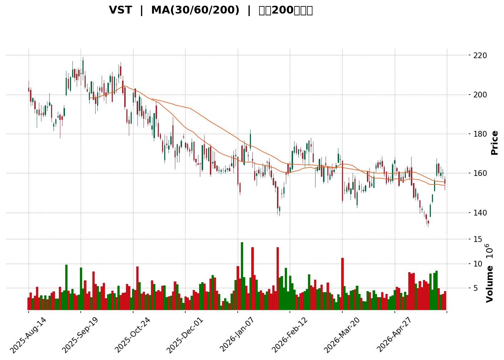
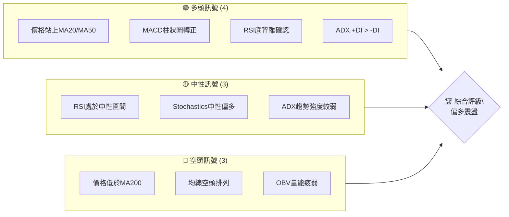
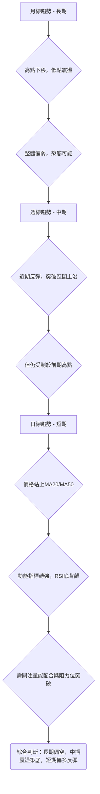
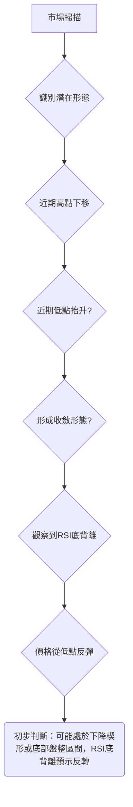

<details>
<summary>📊 靜態圖表 (點擊展開)</summary>

</details>

<html>
<head><meta charset="utf-8" /></head>
<body>
    <div>                        <script>window.PlotlyConfig = {MathJaxConfig: 'local'};</script>
        <script charset="utf-8" src="https://cdn.plot.ly/plotly-3.5.0.min.js" integrity="sha256-fHbNLP+GlIXN+efbQec78UkemUz3NJp7UmfGxC1tNxs=" crossorigin="anonymous"></script>                <div id="candlestick-chart" class="plotly-graph-div" style="height:500px; width:100%;"></div>            <script>                window.PLOTLYENV=window.PLOTLYENV || {};                                if (document.getElementById("candlestick-chart")) {                    Plotly.newPlot(                        "candlestick-chart",                        [{"close":{"dtype":"f8","bdata":"AAAAgG4yaUAAAADgZ5JoQAAAAOBdxmhAAAAAwPMYaEAAAADggQVoQAAAAECrsWdAAAAAIGi3Z0AAAAAgS6tnQAAAAMD0S2hAAAAAYGE7aEAAAACgUn5oQAAAAEBfjGdAAAAAAC0jZ0AAAAAA0GxnQAAAAMAioGdAAAAA4PxoZ0AAAABgTmlnQAAAAKA9IWhAAAAAoBwNakAAAACgn2hpQAAAAGC7HGpAAAAAIIGWakAAAAAAIBRqQAAAAABs8GlAAAAAIGUrakAAAABAWVZqQAAAAIA+KmtAAAAAYLB1aUAAAAAAHzBpQAAAAGAUImlAAAAAYMnUaUAAAADgpKxoQAAAAKAubGhAAAAAwJEeaUAAAADg8kJpQAAAAEDjLWlAAAAAYHf7aEAAAABgQeJoQAAAAOBnv2lAAAAAgIAtakAAAADgLYpoQAAAAEAkH2pAAAAAoDeeaUAAAACAoEhqQAAAACBEOmpAAAAAwHYZaUAAAAAAkjZoQAAAAMA1QGdAAAAA4DAqZ0AAAACA+9pnQAAAAABLHWlAAAAAYAvYaEAAAABgF8JnQAAAACBH2mhAAAAAYAKmZ0AAAABgA3lnQAAAAIBGEGhAAAAAoFEnZ0AAAAAgzJtnQAAAAMCTA2dAAAAA4CzPZ0AAAAAAYHhnQAAAAKBWVWZAAAAA4O84ZkAAAADAzmJlQAAAACCxxmVAAAAAoJXQZUAAAABgE75lQAAAAECzVGZAAAAAgPipZUAAAACABwRlQAAAAGAN1WVAAAAAwNRLZUAAAADABgpmQAAAAMDDS2ZAAAAAQC+lZUAAAACAZoJlQAAAAACuZWVAAAAAALvyZUAAAAAAt9ZkQAAAAOA0tWRAAAAAAGeLZEAAAAAA5JZkQAAAAODRw2VAAAAAgDc0ZUAAAADgLflkQAAAAAAfn2VAAAAA4PLwY0AAAACAzbZkQAAAAGCZUmRAAAAAYDIrZEAAAACAZC5kQAAAAACpN2RAAAAAgGQuZEAAAAAg0zNkQAAAAEDATGRAAAAAAIcjZEAAAABAKKBkQAAAAECoVmRAAAAA4JEpZUAAAAAAdkxjQAAAAKCizGJAAAAAYJbEZEAAAACACYtlQAAAAKD3ZWVAAAAAoKwXZUAAAADA531mQAAAAADwy2RAAAAAgBWTY0AAAAAgqvljQAAAAICHBGRAAAAAINz8Y0AAAABA\u002f9JjQAAAAMAogWRAAAAAYEKtZEAAAAAAeUtkQAAAACBMxGNAAAAAYJhBY0AAAACgVBljQAAAAGBtymFAAAAA4ADcYUAAAADARq5iQAAAACBfGGNAAAAAID7sY0AAAACA0f1jQAAAACAXXGRAAAAAYDRoZUAAAABAMK5lQAAAAADOSmVAAAAAAHuIZUAAAAAAVGVlQAAAAABJ8mRAAAAAwFtsZUAAAAAg4ONlQAAAAECIEmZAAAAAYOa0ZUAAAADAcbhkQAAAAOBZL2RAAAAAIGZkZEAAAACggOVkQAAAAEDizWNAAAAAALVsZEAAAAAgooVkQAAAAKAu3mNAAAAAgJrrY0AAAACAeNdjQAAAAGCeOGRAAAAAgGWDZEAAAACAbDxlQAAAAECL5GRAAAAA4KNAYkAAAACgR+liQAAAAEAKF2NAAAAA4FHwYkAAAACgmQljQAAAACBcb2NAAAAAoEdxYkAAAABgj8piQAAAAGC4PmNAAAAAgMLlYkAAAABA4fJiQAAAAIDCNWNAAAAA4Hp8Y0AAAAAAABhjQAAAACBcV2NAAAAAYGbGY0AAAABACn9kQAAAAIAUXmRAAAAAwPWwZEAAAABguG5kQAAAAEAz82NAAAAAwB5dY0AAAACgR3ljQAAAAEAzm2NAAAAAQDOLZEAAAABgj9JkQAAAAADXI2RAAAAAoEc5Y0AAAABA4bpjQAAAAMD1aGNAAAAAQDMbZEAAAAAAKQxkQAAAAKBHyWNAAAAAYGY+Y0AAAABACndiQAAAAKCZAWNAAAAAANdbYkAAAAAghdNhQAAAAMDMvGFAAAAAgMJ1YUAAAAAAABhhQAAAAGC41mBAAAAAAAAAYkAAAABgj6JiQAAAAOCjiGNAAAAAgOuRZEAAAADAzARkQAAAAMD1CGRAAAAAIFwHZEAAAADgUVhjQA=="},"high":{"dtype":"f8","bdata":"vyKKFlrjaUBRmkpzsXVpQGl+enZk1GhAT1tj4Uu5aEBScg\u002f+AhRoQFPmIHSvfWhADiMg0RFYaEBoP5OLnD1oQAO\u002fXOTZXGhAVsEXFtuPaEBy3iaZghNpQEph+c5mX2hA2Tdy+EhFZ0BVbG0mhXpnQPZ4kysB7GdA1X+hbGzWZ0AMNes\u002fb7pnQLZpf\u002foRWGhAIkF2PxqCakCYClfE3GJqQI1FxBwmLWpAgew+wCAia0CjDsQwbp9qQN\u002fexhdun2pAP\u002fcJAXi0akBRYjkFC6hqQLT0j4fgZmtAliRx4byFakAhKmpP0rNpQOn9frdTdmlAxNWZz7jdaUCCdmGU0dFpQAKPirhW\u002fmhAKtm1QLWLaUAEGYkh8Y1pQIJ\u002fW13iM2pAnT9di3HraUC9I4iyw2hpQEB\u002fpAVSwWlAzcwP36VPakDAG8H+IXlqQHJ+5\u002frnK2pAwlnIrs0IakDHEIcTF+5qQPH7T4kTEGtAveoF8BgvakAb1Rz25Z1pQI1Rx+ZmHGhAS1iqvU6fZ0B4cnIoePVnQE3OWsw0LmlArpFkLi5jaUAASD\u002f5sphoQOKQ2JStBWlARwROEbrIaEB10lYefQtoQKP0N+TiVGhABdbm9c\u002feZ0D2qdnuPv5nQOYA+EUuk2dA7tEMj5HRZ0BYTk2\u002fQ4hoQDrI+2GGbWdA+JhfTKGZZkASylZNCy9mQIg5jOEkcGZAHMMXktNgZkD8gEC5zx1mQIeyICgDoGZAZ5bu9ZqYZ0Cj6B34daZlQNFPo4X31mVAnRN55\u002ffHZUDMP8+zVyhmQCfstG23iGZAUssWddD\u002fZUB\u002fzOWT5u5lQJYvoePiq2VALAeIeeoxZkBiwB4OmgRmQCaE2wl162RA9ThpPicuZUCJsAcVBLJkQF573fUSzWVA2UtkASVwZkC+TpHCwpBlQAKVBk1wrmVAH49iaQ3VZUAOlXnWS25lQG7tRGcFXmVA0Pzwy8GCZEB+O7yYQ29kQOZafwaiS2RAkWZ5COVYZEBRi5vpPX9kQCMM\u002ftbPWmRAhH7IP9SIZEBIB+GtlCFlQBCorCF6bWVAdNbt4P6LZUDXz7+1cg1lQLflcfjOcmNA1pIKGBDQZUAZU8PT+Q9mQCcXvWbA5mVA1lBpNkxeZUCmq54w9slmQPVEnU5hXGVA9DKGcMO4ZED7y5yATDhkQI87HFXfaGRA\u002f1ukb71UZECxLX22tqJkQNl+gNupjGRAF42pu6jKZEAbg0B61\u002fRkQGcTUj7UiGRAA2KUymL4Y0BBQUGRLYljQG667u1rLmNA2\u002fU3wNj2YUAIhsC\u002frgFjQORfC0QrcmNAiEVjMGcmZEA7+UWqtqJkQAEXM4t5v2RAjYlXGqNtZUDnQehaGQ1mQPhbqXtZ6GVAaJQAuLeKZUAqNJnQb6hlQM3xCopjc2VAOoyXlEZuZUBzDvkGafZlQK1Ft0yiH2ZAwS\u002f5rCVCZkAHX2j98QhmQJNq99PUaWRA9lKy449\u002fZEDeMJDDt\u002fdkQMTSR+rRBGVAL+9wuvuMZED6pnwC7BFlQGLqqBmIeGRAatMJGklfZECoi8QNeqBkQBVGJWbfaGRAKpe044GnZEAYZBxcdZhlQIY2SZ3OK2VAAAAAQArPZEAAAADAzHxjQAAAAEAzQ2NAAAAAYGa+Y0AAAACgcBVjQAAAAGBmBmRAAAAAgMLdY0AAAABACu9iQAAAAEDhimNAAAAAgOtRY0AAAAAgXCNjQAAAAMAeRWNAAAAAgOspZEAAAADA9VBkQAAAAAAp1GNAAAAAQAoXZEAAAADA9ahkQAAAAOCj0GRAAAAAoHDdZEAAAAAgrg9lQAAAAKCZgWRAAAAAQDMjZEAAAABgj+JjQAAAAADX22NAAAAAIFyvZEAAAACgcA1lQAAAAGBmamRAAAAAwHIkZEAAAAAAKfRjQAAAAOB6BGRAAAAAAClMZEAAAACgmXlkQAAAACCuX2RAAAAA4HoMZUAAAAAAAGBjQAAAAAAAGGNAAAAAAFbKYkAAAADA9UhiQAAAAKBw6WFAAAAAQOGiYUAAAACgR3FhQAAAAGBmFmFAAAAAwMwcYkAAAADA9ahiQAAAAIA9smNAAAAAwMzsZEAAAABAtKBkQAAAAMD1cGRAAAAAoEdJZEAAAACgmdFjQA=="},"hovertemplate":"\u003cb\u003e%{x|%Y-%m-%d}\u003c\u002fb\u003e\u003cbr\u003e\u958b: $%{open:.2f}\u003cbr\u003e\u9ad8: $%{high:.2f}\u003cbr\u003e\u4f4e: $%{low:.2f}\u003cbr\u003e\u6536: $%{close:.2f}\u003cextra\u003e\u003c\u002fextra\u003e","low":{"dtype":"f8","bdata":"Jb5qwYQwaUB3K2j3EkJoQO0WFtCxUWhAs2bIolDPZ0Dwe5tFsuRmQCiaHEa+qGdALG4hqZJNZ0AolA\u002fRbZJnQJs\u002ft84FlGdAmDjMkmzxZ0CyWrJtBDxoQEsGUMXoPmdAYpGxUZesZkCFh5SzUPRmQO84e8RcgmdAfQcxQus3ZkDGfOQq7PxmQO6UjXOPj2dAGDc02oTnaEAcMMIEV0ppQGo31NeXJ2lA65ukU7scakBIMQ0OrNBpQJQ7rS9jfGlALA6XHiLoaUAdEPRX0JNpQMmVDbVL52lAf2jpNsxcaUDyf9vIDippQA72FMINb2hAoP\u002fL9qcNaUDOJIcp\u002fKRoQOD0DBaaxWdAKfrQHoP0Z0DM8FdZN8VoQLU1tCxAHmlAKgSAU16caEDlXld6EGtoQO+PGHdv8mhAAMASEqKYaUD0bXtzioloQJZwbLUl+2hAM6g1Lg8baUATuHlZnrppQGulRnKBA2pAJp\u002fAcPrvaEAfYHAw1whoQJx2RczkIWdAmBI8nPlkZkDtysmCXCZnQDNd\u002fusOQmhATLb747B+aEDtiBZiyv5mQNrhuJ9ZnmdA281QAqyAZ0DvZIdqeeBmQLuwbWCGamdAdEJpdr\u002f\u002fZkA\u002fj8JSeA1nQEfFBEglYWZAS3i72aQDZkD2EBzo5fRmQK13jEQrSmZAkGhsuakZZkDU+ciTnkFlQPCzwG\u002f5o2RA3Wc8BZeUZUDB6iFKFkZlQPXFSpKxt2VAECIjwuiUZUASRhxvxT9kQJ+\u002f9Z0vrmRABPUuiViuZEAXZx5GeZNlQKvVA6ujMGZAaN8zTN6GZUBYGvi4lVxlQKzNtoKED2VAejf6Ig5AZUArNeFoYMBkQOP\u002fVNR3c2RA0b\u002fWbdmIZECmtxkn08ZjQHgxTvciEmRAsY1L4T7hZEDHVaajptBkQMsgE9ntwmRAqNSVo2vIY0C1H8FsHEdkQJpJD3ERSGRAjdgEKTAUZEBd+GwPLv1jQLVlaPCs8WNAMxju2jUEZEBhdeihmPZjQEq3oSjmGmRA0mhBGgMgZEBXHSD0VXVkQM8v1dMY\u002f2NAQMXTCtJxZECXXUM0lipjQIdaJ5yTn2JA94nV1+20ZEBcqKxaaHtkQKuJGzLLUmVAFY72lVy6ZEBBbHObRm5lQDZufLA2WWRAmRnkPzCBY0BngkTf7zFjQPl+9KDc3WNA2xmGyBy5Y0AM9L2n6rVjQMuu3s\u002fnvWNAXATgPhgeZEABhsFPPdFjQHAuvaCulGNABp8S0T46Y0BVlX\u002f6\u002fMViQB76+6SRYmFAsfxTyutKYUDXd6aCA2diQLEsdIuEcmJALhzH1CtTY0Bmcww7sMpjQO6ThsHOBWRAO0Hgu\u002fUoZECifljA\u002fTZlQNDLnFYgLGVAtgNzbaoAZUCD6msIohhlQKjHbKeEn2RAnypsSQ9VZECpDpxMJTtlQOxk2rZdfGRA\u002fzNi2gdVZUCJHhvJVLNkQC6As++wGGNAggMryM4FZEBfl0w1ti5kQKcD5AezwmNAdyb+Mj5ZY0C4K2fvmIJkQDHTyV8JXmNAxU7io5GPY0DTInvde7BjQJ7Q7FqK\u002fGNA4nO8ycU8ZEBZfd4OyahkQDFhYGozgGRAAAAAYI8aYkAAAABguKpiQAAAAKCZsWJAAAAAACnMYkAAAAAgrk9iQAAAAAAA+GJAAAAAQDNTYkAAAABA4cphQAAAAMDM7GJAAAAAANfDYkAAAAAAKbxiQAAAAMD1yGJAAAAAoEdpY0AAAACAwhVjQAAAACCFI2NAAAAAwMwUY0AAAABACgtkQAAAAMDMRGRAAAAAIIVTZEAAAADgUUhkQAAAAIA9ymNAAAAAAClEY0AAAACgcF1jQAAAAAAAUGNAAAAAwMxkY0AAAAAghddjQAAAAEAK12NAAAAAYI8iY0AAAAAgXHdjQAAAAIDCXWNAAAAAgBSuY0AAAACgmfljQAAAAEAzk2NAAAAA4KM4Y0AAAAAgXF9iQAAAAGDlSGJAAAAAwB41YkAAAADgUXBhQAAAAACBfWFAAAAAgOs5YUAAAAAghbtgQAAAAMAelWBAAAAAgOs5YUAAAAAAKRxiQAAAAAAA2GJAAAAAQArHY0AAAABgDs1jQAAAAEAzs2NAAAAAACmcY0AAAABgj+piQA=="},"name":"\u50f9\u683c","open":{"dtype":"f8","bdata":"HUv\u002fMFVraUCvHm3TJkdpQHMF7erih2hAHJdUyYyWaECNRLH5nshnQAUmhkRgCGhAuJwXURXNZ0DjpB2g1dlnQG19nXYWt2dAICcdZnQyaED3mfGggU5oQMMY3PKpWWhAdH+fmwL7ZkBbjNduOylnQNKHCIDdiGdAuYKYXrawZ0Dg2Cg9rJtnQNryYlK+qGdAzJfBbhj4aEAngo6IZ\u002f9pQFojy+vCRGlA65ukU7scakCjDsQwbp9qQP3dppaTT2pAuZyAKs+PakDTKxeeIltqQCNjAOxpTWpA64CtAAMxakAwCZZQalZpQIi88AGPrmhAv6XBQK0UaUCmbAnSNC5pQPXt5sKI1GhAxXGDrdJOaECi3ppnTm9pQEX2LygzeWlARA5ztfWyaUBx7nvmeyBpQNV+HbPNIGlAZmZmJsTNaUCukvW51yVqQLsW+7gfEmlAmYifDyenaUDjqodAzRdqQHKV2QBcxmpAGyd9myXjaUD1+9faLXJpQKoIIHQrC2hAupqyVhRhZ0DtysmCXCZnQI+\u002fItLhgWhArpFkLi5jaUAASD\u002f5sphoQPkcZC6p+GdA20oAbZxEaEDi+jpQFu9nQHwhiakcyWdAr+T7h6FyZ0A4X+q06TdnQI3KFaNezGZA56xBwUZAZkCd\u002fP\u002fYcEhoQMjgQQ8QLWdA\u002fCkD7Kx6ZkA71+haiQ1mQLgODnsI12RAFt+obU7eZUBp60ww6YVlQOlg0t+w1WVAwCJTo\u002fUJZ0BUrX5a2XBlQBgdNZtNI2VAjXXQzzmzZUAdzv9DrLBlQFqLy3c7UGZAQYZXztDwZUDLHw5bWd1lQD\u002f1WTnphWVAD6FjSahtZUA3Lh9pFwFmQCaE2wl162RAJU4330WdZEDhpZ\u002fKUJxkQGu+UkNTM2RA7vHPnvfWZUB9OHIJfI9lQCsM1rcexmRABDDF5P2wZUDa8hYgh6ZkQMUOjj23x2RA3QOYwdl4ZEDZ7qZ9MitkQDx4GpOpGGRAAAAAgGQuZEAF0dI\u002f+xhkQKPYNivwOGRA4zdRF2FVZEBXHSD0VXVkQBXhqeF0JGVA0hcfCqIYZUDXz7+1cg1lQHMWt3s7YWNA4Wld6\u002fXCZUC1fi4FQ45kQKFBODVquGVAExEikBglZUCtVVpgdZhlQOPT58VL6mRAxKTvGZwhZEDVa3BlY9ljQESyk1qzNmRA8RbPdgb5Y0D4dtAi4QtkQE8EcMJd6WNAhiiEe8O4ZEAoXI5HfLdkQIyI57j1KGRAwRoka+2tY0DOzdjOCH1jQBwGsOxmH2NAiTLLedqZYUBSURoYdrliQPL\u002fEgV2uWJA5Sd7ss4FZEBmf+mfzphkQHSuwnJaEGRA5B68cLhFZEAwOWD\u002ftVRlQMYdafy7uGVAYa4hp7Y1ZUBrKc\u002fUFoJlQHYHWI4KTWVAbNsB76rhZEBU6aZBpYRlQDBOic4MZGVAiNH0HF\u002fYZUBwJbME+z5lQCyCjRwIL2RA+oePANYrZEAG7eN5GjVkQHjb8CU7h2RA47i+5wB2Y0CLzmrJT6RkQKgxz5MRbGRA6JE\u002fZrabY0BQHPujRDFkQHiLUEz7GGRAa2l6ltJSZEDX0aRExrBkQBNbWhsn3mRAAAAAQArPZEAAAABgZu5iQAAAAKCZ0WJAAAAAAABgY0AAAAAAALBiQAAAAAAA+GJAAAAAQDOjY0AAAADAzPxhQAAAAEAK72JAAAAAYLjmYkAAAACgR+FiQAAAAIA94mJAAAAAAAAYZEAAAADgenxjQAAAAAAAMGNAAAAAwMwUY0AAAADAHk1kQAAAAAAAsGRAAAAAgD2SZEAAAADgUchkQAAAAKCZYWRAAAAA4FEYZEAAAACgmbljQAAAAGC4fmNAAAAAYI+KY0AAAAAAAKBkQAAAAAAAUGRAAAAAIIUbZEAAAACgR4ljQAAAAIDryWNAAAAAgBS2Y0AAAAAAAGBkQAAAAADXL2RAAAAAoEdhZEAAAAAAAGBjQAAAAAAAgGJAAAAAIK6vYkAAAADA9UhiQAAAAAAprGFAAAAAwMx4YUAAAAAAAGBhQAAAAKCZ+WBAAAAAAABAYUAAAABACi9iQAAAAMD14GJAAAAAwB7dY0AAAABguJ5kQAAAAEDh2mNAAAAAAAAAZEAAAAAAAKBjQA=="},"x":["2025-08-14T00:00:00-04:00","2025-08-15T00:00:00-04:00","2025-08-18T00:00:00-04:00","2025-08-19T00:00:00-04:00","2025-08-20T00:00:00-04:00","2025-08-21T00:00:00-04:00","2025-08-22T00:00:00-04:00","2025-08-25T00:00:00-04:00","2025-08-26T00:00:00-04:00","2025-08-27T00:00:00-04:00","2025-08-28T00:00:00-04:00","2025-08-29T00:00:00-04:00","2025-09-02T00:00:00-04:00","2025-09-03T00:00:00-04:00","2025-09-04T00:00:00-04:00","2025-09-05T00:00:00-04:00","2025-09-08T00:00:00-04:00","2025-09-09T00:00:00-04:00","2025-09-10T00:00:00-04:00","2025-09-11T00:00:00-04:00","2025-09-12T00:00:00-04:00","2025-09-15T00:00:00-04:00","2025-09-16T00:00:00-04:00","2025-09-17T00:00:00-04:00","2025-09-18T00:00:00-04:00","2025-09-19T00:00:00-04:00","2025-09-22T00:00:00-04:00","2025-09-23T00:00:00-04:00","2025-09-24T00:00:00-04:00","2025-09-25T00:00:00-04:00","2025-09-26T00:00:00-04:00","2025-09-29T00:00:00-04:00","2025-09-30T00:00:00-04:00","2025-10-01T00:00:00-04:00","2025-10-02T00:00:00-04:00","2025-10-03T00:00:00-04:00","2025-10-06T00:00:00-04:00","2025-10-07T00:00:00-04:00","2025-10-08T00:00:00-04:00","2025-10-09T00:00:00-04:00","2025-10-10T00:00:00-04:00","2025-10-13T00:00:00-04:00","2025-10-14T00:00:00-04:00","2025-10-15T00:00:00-04:00","2025-10-16T00:00:00-04:00","2025-10-17T00:00:00-04:00","2025-10-20T00:00:00-04:00","2025-10-21T00:00:00-04:00","2025-10-22T00:00:00-04:00","2025-10-23T00:00:00-04:00","2025-10-24T00:00:00-04:00","2025-10-27T00:00:00-04:00","2025-10-28T00:00:00-04:00","2025-10-29T00:00:00-04:00","2025-10-30T00:00:00-04:00","2025-10-31T00:00:00-04:00","2025-11-03T00:00:00-05:00","2025-11-04T00:00:00-05:00","2025-11-05T00:00:00-05:00","2025-11-06T00:00:00-05:00","2025-11-07T00:00:00-05:00","2025-11-10T00:00:00-05:00","2025-11-11T00:00:00-05:00","2025-11-12T00:00:00-05:00","2025-11-13T00:00:00-05:00","2025-11-14T00:00:00-05:00","2025-11-17T00:00:00-05:00","2025-11-18T00:00:00-05:00","2025-11-19T00:00:00-05:00","2025-11-20T00:00:00-05:00","2025-11-21T00:00:00-05:00","2025-11-24T00:00:00-05:00","2025-11-25T00:00:00-05:00","2025-11-26T00:00:00-05:00","2025-11-28T00:00:00-05:00","2025-12-01T00:00:00-05:00","2025-12-02T00:00:00-05:00","2025-12-03T00:00:00-05:00","2025-12-04T00:00:00-05:00","2025-12-05T00:00:00-05:00","2025-12-08T00:00:00-05:00","2025-12-09T00:00:00-05:00","2025-12-10T00:00:00-05:00","2025-12-11T00:00:00-05:00","2025-12-12T00:00:00-05:00","2025-12-15T00:00:00-05:00","2025-12-16T00:00:00-05:00","2025-12-17T00:00:00-05:00","2025-12-18T00:00:00-05:00","2025-12-19T00:00:00-05:00","2025-12-22T00:00:00-05:00","2025-12-23T00:00:00-05:00","2025-12-24T00:00:00-05:00","2025-12-26T00:00:00-05:00","2025-12-29T00:00:00-05:00","2025-12-30T00:00:00-05:00","2025-12-31T00:00:00-05:00","2026-01-02T00:00:00-05:00","2026-01-05T00:00:00-05:00","2026-01-06T00:00:00-05:00","2026-01-07T00:00:00-05:00","2026-01-08T00:00:00-05:00","2026-01-09T00:00:00-05:00","2026-01-12T00:00:00-05:00","2026-01-13T00:00:00-05:00","2026-01-14T00:00:00-05:00","2026-01-15T00:00:00-05:00","2026-01-16T00:00:00-05:00","2026-01-20T00:00:00-05:00","2026-01-21T00:00:00-05:00","2026-01-22T00:00:00-05:00","2026-01-23T00:00:00-05:00","2026-01-26T00:00:00-05:00","2026-01-27T00:00:00-05:00","2026-01-28T00:00:00-05:00","2026-01-29T00:00:00-05:00","2026-01-30T00:00:00-05:00","2026-02-02T00:00:00-05:00","2026-02-03T00:00:00-05:00","2026-02-04T00:00:00-05:00","2026-02-05T00:00:00-05:00","2026-02-06T00:00:00-05:00","2026-02-09T00:00:00-05:00","2026-02-10T00:00:00-05:00","2026-02-11T00:00:00-05:00","2026-02-12T00:00:00-05:00","2026-02-13T00:00:00-05:00","2026-02-17T00:00:00-05:00","2026-02-18T00:00:00-05:00","2026-02-19T00:00:00-05:00","2026-02-20T00:00:00-05:00","2026-02-23T00:00:00-05:00","2026-02-24T00:00:00-05:00","2026-02-25T00:00:00-05:00","2026-02-26T00:00:00-05:00","2026-02-27T00:00:00-05:00","2026-03-02T00:00:00-05:00","2026-03-03T00:00:00-05:00","2026-03-04T00:00:00-05:00","2026-03-05T00:00:00-05:00","2026-03-06T00:00:00-05:00","2026-03-09T00:00:00-04:00","2026-03-10T00:00:00-04:00","2026-03-11T00:00:00-04:00","2026-03-12T00:00:00-04:00","2026-03-13T00:00:00-04:00","2026-03-16T00:00:00-04:00","2026-03-17T00:00:00-04:00","2026-03-18T00:00:00-04:00","2026-03-19T00:00:00-04:00","2026-03-20T00:00:00-04:00","2026-03-23T00:00:00-04:00","2026-03-24T00:00:00-04:00","2026-03-25T00:00:00-04:00","2026-03-26T00:00:00-04:00","2026-03-27T00:00:00-04:00","2026-03-30T00:00:00-04:00","2026-03-31T00:00:00-04:00","2026-04-01T00:00:00-04:00","2026-04-02T00:00:00-04:00","2026-04-06T00:00:00-04:00","2026-04-07T00:00:00-04:00","2026-04-08T00:00:00-04:00","2026-04-09T00:00:00-04:00","2026-04-10T00:00:00-04:00","2026-04-13T00:00:00-04:00","2026-04-14T00:00:00-04:00","2026-04-15T00:00:00-04:00","2026-04-16T00:00:00-04:00","2026-04-17T00:00:00-04:00","2026-04-20T00:00:00-04:00","2026-04-21T00:00:00-04:00","2026-04-22T00:00:00-04:00","2026-04-23T00:00:00-04:00","2026-04-24T00:00:00-04:00","2026-04-27T00:00:00-04:00","2026-04-28T00:00:00-04:00","2026-04-29T00:00:00-04:00","2026-04-30T00:00:00-04:00","2026-05-01T00:00:00-04:00","2026-05-04T00:00:00-04:00","2026-05-05T00:00:00-04:00","2026-05-06T00:00:00-04:00","2026-05-07T00:00:00-04:00","2026-05-08T00:00:00-04:00","2026-05-11T00:00:00-04:00","2026-05-12T00:00:00-04:00","2026-05-13T00:00:00-04:00","2026-05-14T00:00:00-04:00","2026-05-15T00:00:00-04:00","2026-05-18T00:00:00-04:00","2026-05-19T00:00:00-04:00","2026-05-20T00:00:00-04:00","2026-05-21T00:00:00-04:00","2026-05-22T00:00:00-04:00","2026-05-26T00:00:00-04:00","2026-05-27T00:00:00-04:00","2026-05-28T00:00:00-04:00","2026-05-29T00:00:00-04:00","2026-06-01T00:00:00-04:00"],"type":"candlestick"},{"hovertemplate":"MA30: $%{y:.2f}\u003cextra\u003e\u003c\u002fextra\u003e","line":{"color":"#2196F3","dash":"dash","width":2},"mode":"lines","name":"MA30","x":["2025-08-14T00:00:00-04:00","2025-08-15T00:00:00-04:00","2025-08-18T00:00:00-04:00","2025-08-19T00:00:00-04:00","2025-08-20T00:00:00-04:00","2025-08-21T00:00:00-04:00","2025-08-22T00:00:00-04:00","2025-08-25T00:00:00-04:00","2025-08-26T00:00:00-04:00","2025-08-27T00:00:00-04:00","2025-08-28T00:00:00-04:00","2025-08-29T00:00:00-04:00","2025-09-02T00:00:00-04:00","2025-09-03T00:00:00-04:00","2025-09-04T00:00:00-04:00","2025-09-05T00:00:00-04:00","2025-09-08T00:00:00-04:00","2025-09-09T00:00:00-04:00","2025-09-10T00:00:00-04:00","2025-09-11T00:00:00-04:00","2025-09-12T00:00:00-04:00","2025-09-15T00:00:00-04:00","2025-09-16T00:00:00-04:00","2025-09-17T00:00:00-04:00","2025-09-18T00:00:00-04:00","2025-09-19T00:00:00-04:00","2025-09-22T00:00:00-04:00","2025-09-23T00:00:00-04:00","2025-09-24T00:00:00-04:00","2025-09-25T00:00:00-04:00","2025-09-26T00:00:00-04:00","2025-09-29T00:00:00-04:00","2025-09-30T00:00:00-04:00","2025-10-01T00:00:00-04:00","2025-10-02T00:00:00-04:00","2025-10-03T00:00:00-04:00","2025-10-06T00:00:00-04:00","2025-10-07T00:00:00-04:00","2025-10-08T00:00:00-04:00","2025-10-09T00:00:00-04:00","2025-10-10T00:00:00-04:00","2025-10-13T00:00:00-04:00","2025-10-14T00:00:00-04:00","2025-10-15T00:00:00-04:00","2025-10-16T00:00:00-04:00","2025-10-17T00:00:00-04:00","2025-10-20T00:00:00-04:00","2025-10-21T00:00:00-04:00","2025-10-22T00:00:00-04:00","2025-10-23T00:00:00-04:00","2025-10-24T00:00:00-04:00","2025-10-27T00:00:00-04:00","2025-10-28T00:00:00-04:00","2025-10-29T00:00:00-04:00","2025-10-30T00:00:00-04:00","2025-10-31T00:00:00-04:00","2025-11-03T00:00:00-05:00","2025-11-04T00:00:00-05:00","2025-11-05T00:00:00-05:00","2025-11-06T00:00:00-05:00","2025-11-07T00:00:00-05:00","2025-11-10T00:00:00-05:00","2025-11-11T00:00:00-05:00","2025-11-12T00:00:00-05:00","2025-11-13T00:00:00-05:00","2025-11-14T00:00:00-05:00","2025-11-17T00:00:00-05:00","2025-11-18T00:00:00-05:00","2025-11-19T00:00:00-05:00","2025-11-20T00:00:00-05:00","2025-11-21T00:00:00-05:00","2025-11-24T00:00:00-05:00","2025-11-25T00:00:00-05:00","2025-11-26T00:00:00-05:00","2025-11-28T00:00:00-05:00","2025-12-01T00:00:00-05:00","2025-12-02T00:00:00-05:00","2025-12-03T00:00:00-05:00","2025-12-04T00:00:00-05:00","2025-12-05T00:00:00-05:00","2025-12-08T00:00:00-05:00","2025-12-09T00:00:00-05:00","2025-12-10T00:00:00-05:00","2025-12-11T00:00:00-05:00","2025-12-12T00:00:00-05:00","2025-12-15T00:00:00-05:00","2025-12-16T00:00:00-05:00","2025-12-17T00:00:00-05:00","2025-12-18T00:00:00-05:00","2025-12-19T00:00:00-05:00","2025-12-22T00:00:00-05:00","2025-12-23T00:00:00-05:00","2025-12-24T00:00:00-05:00","2025-12-26T00:00:00-05:00","2025-12-29T00:00:00-05:00","2025-12-30T00:00:00-05:00","2025-12-31T00:00:00-05:00","2026-01-02T00:00:00-05:00","2026-01-05T00:00:00-05:00","2026-01-06T00:00:00-05:00","2026-01-07T00:00:00-05:00","2026-01-08T00:00:00-05:00","2026-01-09T00:00:00-05:00","2026-01-12T00:00:00-05:00","2026-01-13T00:00:00-05:00","2026-01-14T00:00:00-05:00","2026-01-15T00:00:00-05:00","2026-01-16T00:00:00-05:00","2026-01-20T00:00:00-05:00","2026-01-21T00:00:00-05:00","2026-01-22T00:00:00-05:00","2026-01-23T00:00:00-05:00","2026-01-26T00:00:00-05:00","2026-01-27T00:00:00-05:00","2026-01-28T00:00:00-05:00","2026-01-29T00:00:00-05:00","2026-01-30T00:00:00-05:00","2026-02-02T00:00:00-05:00","2026-02-03T00:00:00-05:00","2026-02-04T00:00:00-05:00","2026-02-05T00:00:00-05:00","2026-02-06T00:00:00-05:00","2026-02-09T00:00:00-05:00","2026-02-10T00:00:00-05:00","2026-02-11T00:00:00-05:00","2026-02-12T00:00:00-05:00","2026-02-13T00:00:00-05:00","2026-02-17T00:00:00-05:00","2026-02-18T00:00:00-05:00","2026-02-19T00:00:00-05:00","2026-02-20T00:00:00-05:00","2026-02-23T00:00:00-05:00","2026-02-24T00:00:00-05:00","2026-02-25T00:00:00-05:00","2026-02-26T00:00:00-05:00","2026-02-27T00:00:00-05:00","2026-03-02T00:00:00-05:00","2026-03-03T00:00:00-05:00","2026-03-04T00:00:00-05:00","2026-03-05T00:00:00-05:00","2026-03-06T00:00:00-05:00","2026-03-09T00:00:00-04:00","2026-03-10T00:00:00-04:00","2026-03-11T00:00:00-04:00","2026-03-12T00:00:00-04:00","2026-03-13T00:00:00-04:00","2026-03-16T00:00:00-04:00","2026-03-17T00:00:00-04:00","2026-03-18T00:00:00-04:00","2026-03-19T00:00:00-04:00","2026-03-20T00:00:00-04:00","2026-03-23T00:00:00-04:00","2026-03-24T00:00:00-04:00","2026-03-25T00:00:00-04:00","2026-03-26T00:00:00-04:00","2026-03-27T00:00:00-04:00","2026-03-30T00:00:00-04:00","2026-03-31T00:00:00-04:00","2026-04-01T00:00:00-04:00","2026-04-02T00:00:00-04:00","2026-04-06T00:00:00-04:00","2026-04-07T00:00:00-04:00","2026-04-08T00:00:00-04:00","2026-04-09T00:00:00-04:00","2026-04-10T00:00:00-04:00","2026-04-13T00:00:00-04:00","2026-04-14T00:00:00-04:00","2026-04-15T00:00:00-04:00","2026-04-16T00:00:00-04:00","2026-04-17T00:00:00-04:00","2026-04-20T00:00:00-04:00","2026-04-21T00:00:00-04:00","2026-04-22T00:00:00-04:00","2026-04-23T00:00:00-04:00","2026-04-24T00:00:00-04:00","2026-04-27T00:00:00-04:00","2026-04-28T00:00:00-04:00","2026-04-29T00:00:00-04:00","2026-04-30T00:00:00-04:00","2026-05-01T00:00:00-04:00","2026-05-04T00:00:00-04:00","2026-05-05T00:00:00-04:00","2026-05-06T00:00:00-04:00","2026-05-07T00:00:00-04:00","2026-05-08T00:00:00-04:00","2026-05-11T00:00:00-04:00","2026-05-12T00:00:00-04:00","2026-05-13T00:00:00-04:00","2026-05-14T00:00:00-04:00","2026-05-15T00:00:00-04:00","2026-05-18T00:00:00-04:00","2026-05-19T00:00:00-04:00","2026-05-20T00:00:00-04:00","2026-05-21T00:00:00-04:00","2026-05-22T00:00:00-04:00","2026-05-26T00:00:00-04:00","2026-05-27T00:00:00-04:00","2026-05-28T00:00:00-04:00","2026-05-29T00:00:00-04:00","2026-06-01T00:00:00-04:00"],"y":{"dtype":"f8","bdata":"AAAAAAAA+H8AAAAAAAD4fwAAAAAAAPh\u002fAAAAAAAA+H8AAAAAAAD4fwAAAAAAAPh\u002fAAAAAAAA+H8AAAAAAAD4fwAAAAAAAPh\u002fAAAAAAAA+H8AAAAAAAD4fwAAAAAAAPh\u002fAAAAAAAA+H8AAAAAAAD4fwAAAAAAAPh\u002fAAAAAAAA+H8AAAAAAAD4fwAAAAAAAPh\u002fAAAAAAAA+H8AAAAAAAD4fwAAAAAAAPh\u002fAAAAAAAA+H8AAAAAAAD4fwAAAAAAAPh\u002fAAAAAAAA+H8AAAAAAAD4fwAAAAAAAPh\u002fAAAAAAAA+H8AAAAAAAD4f6uqqnr4xGhAiYiI6GHKaEDv7u7OQctoQLy7uztAyGhAMzMzs\u002fjQaECJiIiIjdtoQBERERE66GhAAAAAYAfzaECrqqrqZP1oQO\u002fu7p7GCWlAIiIiQmEaaUDv7u5uxhppQO\u002fu7u67MGlARERE9OZFaUBVVVXFS15pQFVVVRWAdGlAvLu7i+qCaUAiIiIiwolpQO\u002fu7t5BgmlAmpmZaaBpaUBVVVU1X1xpQGZmZnbbU2lAvLu7q\u002flEaUBVVVWVLDFpQGZmZhbnJ2lAvLu7y2MSaUAAAAAA8vloQM3MzMx632hAmpmZ+czLaEDv7u6+Ur5oQERERGQ9rGhAERERcfyaaEARERHhtZBoQBEREeHhfmhAiYiISClmaEAzMzMDF0VoQO\u002fu7s4MKGhAiYiISAUNaEAzMzPzNvJnQLy7u8sO1WdAMzMzQ4quZ0Crqqrqd5BnQN7d3Y3da2dAREREZPxGZ0ARERERxCJnQBEREUE3AWdAd3d3Z73jZkAzMzPjqsxmQAAAAJDZvGZARERExHeyZkAAAADAuZhmQJqZmWkfc2ZARERERG9OZkBVVVUFZTNmQHd3d8cLGWZA7+7uri8EZkBERETE2+5lQN7d3R0F2mVA7+7ujpu+ZUB3d3dn6KVlQAAAACDxjmVA3t3dPeBvZUAzMzNTz1NlQBEREQHBQWVAVVVV9VUwZUARERGBPCZlQImIiGijGWVA7+7uHlYLZUCJiIhIzgFlQKuqqurN8GRAq6qqOobsZEDv7u4+391kQCIiItL9w2RA3t3dvXu\u002fZECamZkZQLtkQJqZmSmXs2RAvLu7m9+uZECJiIjIQbdkQJqZmdkhsmRAmpmZmeCdZEDe3d1NgpZkQImIiKiekGRAvLu7S96LZEC8u7urVoVkQM3MzEyVemRAmpmZqRV2ZEDe3d1dS3BkQJqZmYl3YGRAAAAAMJ9aZEBERETk1kxkQDMzM9M7N2RAmpmZ+YYjZEDv7u4uuRZkQHd3d6clDWRAzczMLPEKZEAiIiJSJAlkQHd3dzenCWRAvLu7y3kUZEAAAAAQeh1kQERERHSdJWRAvLu7W8coZEAAAACgrDpkQImIiPj+TGRA3t3dnZZSZEBERES0jFVkQCIiIkJNW2RAq6qq6opgZEAiIiJibVFkQN7d3S01TGRAVVVVVS9TZEARERHRC1tkQCIiIoI5WWRAAAAA8PNcZEDNzMxM6GJkQAAAAJB5XWRAiYiICAVXZEBmZmYmJ1NkQCIiIsIHV2RAvLu7y8FhZEAzMzNT\u002fnNkQJqZmcl2jmRA3t3djdGRZEDNzMwMyZNkQAAAALC9k2RAIiIi8leLZEAzMzPzM4NkQJqZmdlPe2RAERERsQNiZEAiIiIyXElkQCIiIgLkN2RAREREZGYhZEAzMzOzhAxkQKuqqmqz\u002fWNAvLu76yvtY0De3d0dT9VjQImIiNgAvmNAzczMHIWtY0AzMzNDm6tjQERERAQqrWNAZmZmVrevY0Crqqq6watjQJqZmSkArWNA7+7unvKjY0C8u7urAJtjQHd3dxfFmGNAvLu7+xaeY0DNzMycdaZjQM3MzEzEpWNA3t3dTcOaY0BERERU6Y1jQGZmZjZCgWNAq6qqyhORY0CJiIj4xZpjQDMzM\u002fO2oGNAvLu7O1GjY0BmZmaWbp5jQImIiPjFmmNAREREBA+aY0ARERHx0pFjQBEREcH1hGNAzczMfLF4Y0De3d0t3WhjQLy7uxuhVGNAiYiIWPJHY0ARERExCERjQHd3d7esRWNAvLu7a3VMY0De3d1NYkhjQCIiIvKLRWNAERERseQ\u002fY0AiIiICnTZjQA=="},"type":"scatter"},{"hovertemplate":"MA60: $%{y:.2f}\u003cextra\u003e\u003c\u002fextra\u003e","line":{"color":"#9C27B0","dash":"dash","width":2},"mode":"lines","name":"MA60","x":["2025-08-14T00:00:00-04:00","2025-08-15T00:00:00-04:00","2025-08-18T00:00:00-04:00","2025-08-19T00:00:00-04:00","2025-08-20T00:00:00-04:00","2025-08-21T00:00:00-04:00","2025-08-22T00:00:00-04:00","2025-08-25T00:00:00-04:00","2025-08-26T00:00:00-04:00","2025-08-27T00:00:00-04:00","2025-08-28T00:00:00-04:00","2025-08-29T00:00:00-04:00","2025-09-02T00:00:00-04:00","2025-09-03T00:00:00-04:00","2025-09-04T00:00:00-04:00","2025-09-05T00:00:00-04:00","2025-09-08T00:00:00-04:00","2025-09-09T00:00:00-04:00","2025-09-10T00:00:00-04:00","2025-09-11T00:00:00-04:00","2025-09-12T00:00:00-04:00","2025-09-15T00:00:00-04:00","2025-09-16T00:00:00-04:00","2025-09-17T00:00:00-04:00","2025-09-18T00:00:00-04:00","2025-09-19T00:00:00-04:00","2025-09-22T00:00:00-04:00","2025-09-23T00:00:00-04:00","2025-09-24T00:00:00-04:00","2025-09-25T00:00:00-04:00","2025-09-26T00:00:00-04:00","2025-09-29T00:00:00-04:00","2025-09-30T00:00:00-04:00","2025-10-01T00:00:00-04:00","2025-10-02T00:00:00-04:00","2025-10-03T00:00:00-04:00","2025-10-06T00:00:00-04:00","2025-10-07T00:00:00-04:00","2025-10-08T00:00:00-04:00","2025-10-09T00:00:00-04:00","2025-10-10T00:00:00-04:00","2025-10-13T00:00:00-04:00","2025-10-14T00:00:00-04:00","2025-10-15T00:00:00-04:00","2025-10-16T00:00:00-04:00","2025-10-17T00:00:00-04:00","2025-10-20T00:00:00-04:00","2025-10-21T00:00:00-04:00","2025-10-22T00:00:00-04:00","2025-10-23T00:00:00-04:00","2025-10-24T00:00:00-04:00","2025-10-27T00:00:00-04:00","2025-10-28T00:00:00-04:00","2025-10-29T00:00:00-04:00","2025-10-30T00:00:00-04:00","2025-10-31T00:00:00-04:00","2025-11-03T00:00:00-05:00","2025-11-04T00:00:00-05:00","2025-11-05T00:00:00-05:00","2025-11-06T00:00:00-05:00","2025-11-07T00:00:00-05:00","2025-11-10T00:00:00-05:00","2025-11-11T00:00:00-05:00","2025-11-12T00:00:00-05:00","2025-11-13T00:00:00-05:00","2025-11-14T00:00:00-05:00","2025-11-17T00:00:00-05:00","2025-11-18T00:00:00-05:00","2025-11-19T00:00:00-05:00","2025-11-20T00:00:00-05:00","2025-11-21T00:00:00-05:00","2025-11-24T00:00:00-05:00","2025-11-25T00:00:00-05:00","2025-11-26T00:00:00-05:00","2025-11-28T00:00:00-05:00","2025-12-01T00:00:00-05:00","2025-12-02T00:00:00-05:00","2025-12-03T00:00:00-05:00","2025-12-04T00:00:00-05:00","2025-12-05T00:00:00-05:00","2025-12-08T00:00:00-05:00","2025-12-09T00:00:00-05:00","2025-12-10T00:00:00-05:00","2025-12-11T00:00:00-05:00","2025-12-12T00:00:00-05:00","2025-12-15T00:00:00-05:00","2025-12-16T00:00:00-05:00","2025-12-17T00:00:00-05:00","2025-12-18T00:00:00-05:00","2025-12-19T00:00:00-05:00","2025-12-22T00:00:00-05:00","2025-12-23T00:00:00-05:00","2025-12-24T00:00:00-05:00","2025-12-26T00:00:00-05:00","2025-12-29T00:00:00-05:00","2025-12-30T00:00:00-05:00","2025-12-31T00:00:00-05:00","2026-01-02T00:00:00-05:00","2026-01-05T00:00:00-05:00","2026-01-06T00:00:00-05:00","2026-01-07T00:00:00-05:00","2026-01-08T00:00:00-05:00","2026-01-09T00:00:00-05:00","2026-01-12T00:00:00-05:00","2026-01-13T00:00:00-05:00","2026-01-14T00:00:00-05:00","2026-01-15T00:00:00-05:00","2026-01-16T00:00:00-05:00","2026-01-20T00:00:00-05:00","2026-01-21T00:00:00-05:00","2026-01-22T00:00:00-05:00","2026-01-23T00:00:00-05:00","2026-01-26T00:00:00-05:00","2026-01-27T00:00:00-05:00","2026-01-28T00:00:00-05:00","2026-01-29T00:00:00-05:00","2026-01-30T00:00:00-05:00","2026-02-02T00:00:00-05:00","2026-02-03T00:00:00-05:00","2026-02-04T00:00:00-05:00","2026-02-05T00:00:00-05:00","2026-02-06T00:00:00-05:00","2026-02-09T00:00:00-05:00","2026-02-10T00:00:00-05:00","2026-02-11T00:00:00-05:00","2026-02-12T00:00:00-05:00","2026-02-13T00:00:00-05:00","2026-02-17T00:00:00-05:00","2026-02-18T00:00:00-05:00","2026-02-19T00:00:00-05:00","2026-02-20T00:00:00-05:00","2026-02-23T00:00:00-05:00","2026-02-24T00:00:00-05:00","2026-02-25T00:00:00-05:00","2026-02-26T00:00:00-05:00","2026-02-27T00:00:00-05:00","2026-03-02T00:00:00-05:00","2026-03-03T00:00:00-05:00","2026-03-04T00:00:00-05:00","2026-03-05T00:00:00-05:00","2026-03-06T00:00:00-05:00","2026-03-09T00:00:00-04:00","2026-03-10T00:00:00-04:00","2026-03-11T00:00:00-04:00","2026-03-12T00:00:00-04:00","2026-03-13T00:00:00-04:00","2026-03-16T00:00:00-04:00","2026-03-17T00:00:00-04:00","2026-03-18T00:00:00-04:00","2026-03-19T00:00:00-04:00","2026-03-20T00:00:00-04:00","2026-03-23T00:00:00-04:00","2026-03-24T00:00:00-04:00","2026-03-25T00:00:00-04:00","2026-03-26T00:00:00-04:00","2026-03-27T00:00:00-04:00","2026-03-30T00:00:00-04:00","2026-03-31T00:00:00-04:00","2026-04-01T00:00:00-04:00","2026-04-02T00:00:00-04:00","2026-04-06T00:00:00-04:00","2026-04-07T00:00:00-04:00","2026-04-08T00:00:00-04:00","2026-04-09T00:00:00-04:00","2026-04-10T00:00:00-04:00","2026-04-13T00:00:00-04:00","2026-04-14T00:00:00-04:00","2026-04-15T00:00:00-04:00","2026-04-16T00:00:00-04:00","2026-04-17T00:00:00-04:00","2026-04-20T00:00:00-04:00","2026-04-21T00:00:00-04:00","2026-04-22T00:00:00-04:00","2026-04-23T00:00:00-04:00","2026-04-24T00:00:00-04:00","2026-04-27T00:00:00-04:00","2026-04-28T00:00:00-04:00","2026-04-29T00:00:00-04:00","2026-04-30T00:00:00-04:00","2026-05-01T00:00:00-04:00","2026-05-04T00:00:00-04:00","2026-05-05T00:00:00-04:00","2026-05-06T00:00:00-04:00","2026-05-07T00:00:00-04:00","2026-05-08T00:00:00-04:00","2026-05-11T00:00:00-04:00","2026-05-12T00:00:00-04:00","2026-05-13T00:00:00-04:00","2026-05-14T00:00:00-04:00","2026-05-15T00:00:00-04:00","2026-05-18T00:00:00-04:00","2026-05-19T00:00:00-04:00","2026-05-20T00:00:00-04:00","2026-05-21T00:00:00-04:00","2026-05-22T00:00:00-04:00","2026-05-26T00:00:00-04:00","2026-05-27T00:00:00-04:00","2026-05-28T00:00:00-04:00","2026-05-29T00:00:00-04:00","2026-06-01T00:00:00-04:00"],"y":{"dtype":"f8","bdata":"AAAAAAAA+H8AAAAAAAD4fwAAAAAAAPh\u002fAAAAAAAA+H8AAAAAAAD4fwAAAAAAAPh\u002fAAAAAAAA+H8AAAAAAAD4fwAAAAAAAPh\u002fAAAAAAAA+H8AAAAAAAD4fwAAAAAAAPh\u002fAAAAAAAA+H8AAAAAAAD4fwAAAAAAAPh\u002fAAAAAAAA+H8AAAAAAAD4fwAAAAAAAPh\u002fAAAAAAAA+H8AAAAAAAD4fwAAAAAAAPh\u002fAAAAAAAA+H8AAAAAAAD4fwAAAAAAAPh\u002fAAAAAAAA+H8AAAAAAAD4fwAAAAAAAPh\u002fAAAAAAAA+H8AAAAAAAD4fwAAAAAAAPh\u002fAAAAAAAA+H8AAAAAAAD4fwAAAAAAAPh\u002fAAAAAAAA+H8AAAAAAAD4fwAAAAAAAPh\u002fAAAAAAAA+H8AAAAAAAD4fwAAAAAAAPh\u002fAAAAAAAA+H8AAAAAAAD4fwAAAAAAAPh\u002fAAAAAAAA+H8AAAAAAAD4fwAAAAAAAPh\u002fAAAAAAAA+H8AAAAAAAD4fwAAAAAAAPh\u002fAAAAAAAA+H8AAAAAAAD4fwAAAAAAAPh\u002fAAAAAAAA+H8AAAAAAAD4fwAAAAAAAPh\u002fAAAAAAAA+H8AAAAAAAD4fwAAAAAAAPh\u002fAAAAAAAA+H8AAAAAAAD4f3d3d++auGhAzczMLK+yaEAAAADY+61oQGZmZg6Ro2hA3t3d\u002fZCbaEDe3d1FUpBoQAAAAHAjiGhAREREVAaAaEDv7u7uzXdoQFVVVbVqb2hAq6qqwnVkaEDNzMwsn1VoQGZmZr5MTmhARERErHFGaEAzMzPrh0BoQDMzM6vbOmhAmpmZ+VMzaECrqqqCNitoQHd3d7eNH2hA7+7uFgwOaECrqqp6jPpnQAAAAHB942dAAAAAeLTJZ0BVVVXNSLJnQO\u002fu7m55oGdAVVVVvUmLZ0AiIiLiZnRnQFVVVfW\u002fXGdARERERDRFZ0AzMzOTHTJnQCIiIkKXHWdAd3d3V24FZ0AiIiKaQvJmQBEREXFR4GZA7+7unj\u002fLZkAiIiLCqbVmQLy7uxvYoGZAvLu7sy2MZkDe3d2dAnpmQDMzM1vuYmZA7+7uPohNZkDNzMyUKzdmQAAAALDtF2ZAERERETwDZkBVVVUVAu9lQFVVVTVn2mVAmpmZgU7JZUDe3d1V9sFlQM3MzLR9t2VA7+7uLiyoZUDv7u4GnpdlQBEREQnfgWVAAAAAyCZtZUCJiIjYXVxlQCIiIorQSWVARERErCI9ZUARERGRky9lQLy7u1M+HWVAd3d3X50MZUDe3d2lX\u002flkQJqZmXkW42RAvLu7m7PJZEARERFBRLVkQERERFRzp2RAERERkaOdZECamZlpsJdkQAAAAFClkWRAVVVV9eePZEBEREQspI9kQHd3d681i2RAMzMzy6aKZEB3d3fvRYxkQFVVVWV+iGRA3t3dLQmJZEDv7u5mZohkQN7d3TVyh2RAMzMzQ7WHZEBVVVWVV4RkQLy7u4Mrf2RAd3d394d4ZEB3d3cPx3hkQFVVVRXsdGRA3t3dHWl0ZEBERER8H3RkQGZmZm4HbGRAERERWY1mZEAiIiJCuWFkQN7d3aW\u002fW2RA3t3dfTBeZEC8u7ubamBkQGZmZk7ZYmRAvLu7Q6xaZEDe3d0dQVVkQLy7u6txUGRAd3d3jyRLZECrqqoiLEZkQImIiIh7QmRAZmZmvj47ZEAREREhazNkQDMzM7vALmRAAAAA4BYlZECamZmpmCNkQJqZmTFZJWRAzczMROEfZEARERHpbRVkQFVVVQ2nDGRAvLu7AwgHZECrqqpShP5jQBEREZmv\u002fGNA3t3dVXMBZEDe3d3FZgNkQN7d3dUcA2RAd3d3R3MAZEBERER89P5jQLy7u1Mf+2NAIiIiAo76Y0CamZlhzvxjQHd3dwdm\u002fmNAzczMjEL+Y0C8u7vT8wBkQAAAAIDcB2RARERErHIRZECrqqqCRxdkQJqZmVE6GmRA7+7ullQXZEDNzMxE0RBkQBEREekKC2RAq6qqWgn+Y0CamZmRl+1jQJqZmeFs3mNAiYiI8AvNY0CJiIjwsLpjQDMzM0MqqWNAIiIiIo+aY0B3d3enq4xjQAAAAMjWgWNARERERP18Y0CJiIjI\u002fnljQDMzM\u002ftaeWNAvLu7A853Y0BmZmZeL3FjQA=="},"type":"scatter"},{"hovertemplate":"MA200: $%{y:.2f}\u003cextra\u003e\u003c\u002fextra\u003e","line":{"color":"#FF6F00","dash":"solid","width":2},"mode":"lines","name":"MA200","x":["2025-08-14T00:00:00-04:00","2025-08-15T00:00:00-04:00","2025-08-18T00:00:00-04:00","2025-08-19T00:00:00-04:00","2025-08-20T00:00:00-04:00","2025-08-21T00:00:00-04:00","2025-08-22T00:00:00-04:00","2025-08-25T00:00:00-04:00","2025-08-26T00:00:00-04:00","2025-08-27T00:00:00-04:00","2025-08-28T00:00:00-04:00","2025-08-29T00:00:00-04:00","2025-09-02T00:00:00-04:00","2025-09-03T00:00:00-04:00","2025-09-04T00:00:00-04:00","2025-09-05T00:00:00-04:00","2025-09-08T00:00:00-04:00","2025-09-09T00:00:00-04:00","2025-09-10T00:00:00-04:00","2025-09-11T00:00:00-04:00","2025-09-12T00:00:00-04:00","2025-09-15T00:00:00-04:00","2025-09-16T00:00:00-04:00","2025-09-17T00:00:00-04:00","2025-09-18T00:00:00-04:00","2025-09-19T00:00:00-04:00","2025-09-22T00:00:00-04:00","2025-09-23T00:00:00-04:00","2025-09-24T00:00:00-04:00","2025-09-25T00:00:00-04:00","2025-09-26T00:00:00-04:00","2025-09-29T00:00:00-04:00","2025-09-30T00:00:00-04:00","2025-10-01T00:00:00-04:00","2025-10-02T00:00:00-04:00","2025-10-03T00:00:00-04:00","2025-10-06T00:00:00-04:00","2025-10-07T00:00:00-04:00","2025-10-08T00:00:00-04:00","2025-10-09T00:00:00-04:00","2025-10-10T00:00:00-04:00","2025-10-13T00:00:00-04:00","2025-10-14T00:00:00-04:00","2025-10-15T00:00:00-04:00","2025-10-16T00:00:00-04:00","2025-10-17T00:00:00-04:00","2025-10-20T00:00:00-04:00","2025-10-21T00:00:00-04:00","2025-10-22T00:00:00-04:00","2025-10-23T00:00:00-04:00","2025-10-24T00:00:00-04:00","2025-10-27T00:00:00-04:00","2025-10-28T00:00:00-04:00","2025-10-29T00:00:00-04:00","2025-10-30T00:00:00-04:00","2025-10-31T00:00:00-04:00","2025-11-03T00:00:00-05:00","2025-11-04T00:00:00-05:00","2025-11-05T00:00:00-05:00","2025-11-06T00:00:00-05:00","2025-11-07T00:00:00-05:00","2025-11-10T00:00:00-05:00","2025-11-11T00:00:00-05:00","2025-11-12T00:00:00-05:00","2025-11-13T00:00:00-05:00","2025-11-14T00:00:00-05:00","2025-11-17T00:00:00-05:00","2025-11-18T00:00:00-05:00","2025-11-19T00:00:00-05:00","2025-11-20T00:00:00-05:00","2025-11-21T00:00:00-05:00","2025-11-24T00:00:00-05:00","2025-11-25T00:00:00-05:00","2025-11-26T00:00:00-05:00","2025-11-28T00:00:00-05:00","2025-12-01T00:00:00-05:00","2025-12-02T00:00:00-05:00","2025-12-03T00:00:00-05:00","2025-12-04T00:00:00-05:00","2025-12-05T00:00:00-05:00","2025-12-08T00:00:00-05:00","2025-12-09T00:00:00-05:00","2025-12-10T00:00:00-05:00","2025-12-11T00:00:00-05:00","2025-12-12T00:00:00-05:00","2025-12-15T00:00:00-05:00","2025-12-16T00:00:00-05:00","2025-12-17T00:00:00-05:00","2025-12-18T00:00:00-05:00","2025-12-19T00:00:00-05:00","2025-12-22T00:00:00-05:00","2025-12-23T00:00:00-05:00","2025-12-24T00:00:00-05:00","2025-12-26T00:00:00-05:00","2025-12-29T00:00:00-05:00","2025-12-30T00:00:00-05:00","2025-12-31T00:00:00-05:00","2026-01-02T00:00:00-05:00","2026-01-05T00:00:00-05:00","2026-01-06T00:00:00-05:00","2026-01-07T00:00:00-05:00","2026-01-08T00:00:00-05:00","2026-01-09T00:00:00-05:00","2026-01-12T00:00:00-05:00","2026-01-13T00:00:00-05:00","2026-01-14T00:00:00-05:00","2026-01-15T00:00:00-05:00","2026-01-16T00:00:00-05:00","2026-01-20T00:00:00-05:00","2026-01-21T00:00:00-05:00","2026-01-22T00:00:00-05:00","2026-01-23T00:00:00-05:00","2026-01-26T00:00:00-05:00","2026-01-27T00:00:00-05:00","2026-01-28T00:00:00-05:00","2026-01-29T00:00:00-05:00","2026-01-30T00:00:00-05:00","2026-02-02T00:00:00-05:00","2026-02-03T00:00:00-05:00","2026-02-04T00:00:00-05:00","2026-02-05T00:00:00-05:00","2026-02-06T00:00:00-05:00","2026-02-09T00:00:00-05:00","2026-02-10T00:00:00-05:00","2026-02-11T00:00:00-05:00","2026-02-12T00:00:00-05:00","2026-02-13T00:00:00-05:00","2026-02-17T00:00:00-05:00","2026-02-18T00:00:00-05:00","2026-02-19T00:00:00-05:00","2026-02-20T00:00:00-05:00","2026-02-23T00:00:00-05:00","2026-02-24T00:00:00-05:00","2026-02-25T00:00:00-05:00","2026-02-26T00:00:00-05:00","2026-02-27T00:00:00-05:00","2026-03-02T00:00:00-05:00","2026-03-03T00:00:00-05:00","2026-03-04T00:00:00-05:00","2026-03-05T00:00:00-05:00","2026-03-06T00:00:00-05:00","2026-03-09T00:00:00-04:00","2026-03-10T00:00:00-04:00","2026-03-11T00:00:00-04:00","2026-03-12T00:00:00-04:00","2026-03-13T00:00:00-04:00","2026-03-16T00:00:00-04:00","2026-03-17T00:00:00-04:00","2026-03-18T00:00:00-04:00","2026-03-19T00:00:00-04:00","2026-03-20T00:00:00-04:00","2026-03-23T00:00:00-04:00","2026-03-24T00:00:00-04:00","2026-03-25T00:00:00-04:00","2026-03-26T00:00:00-04:00","2026-03-27T00:00:00-04:00","2026-03-30T00:00:00-04:00","2026-03-31T00:00:00-04:00","2026-04-01T00:00:00-04:00","2026-04-02T00:00:00-04:00","2026-04-06T00:00:00-04:00","2026-04-07T00:00:00-04:00","2026-04-08T00:00:00-04:00","2026-04-09T00:00:00-04:00","2026-04-10T00:00:00-04:00","2026-04-13T00:00:00-04:00","2026-04-14T00:00:00-04:00","2026-04-15T00:00:00-04:00","2026-04-16T00:00:00-04:00","2026-04-17T00:00:00-04:00","2026-04-20T00:00:00-04:00","2026-04-21T00:00:00-04:00","2026-04-22T00:00:00-04:00","2026-04-23T00:00:00-04:00","2026-04-24T00:00:00-04:00","2026-04-27T00:00:00-04:00","2026-04-28T00:00:00-04:00","2026-04-29T00:00:00-04:00","2026-04-30T00:00:00-04:00","2026-05-01T00:00:00-04:00","2026-05-04T00:00:00-04:00","2026-05-05T00:00:00-04:00","2026-05-06T00:00:00-04:00","2026-05-07T00:00:00-04:00","2026-05-08T00:00:00-04:00","2026-05-11T00:00:00-04:00","2026-05-12T00:00:00-04:00","2026-05-13T00:00:00-04:00","2026-05-14T00:00:00-04:00","2026-05-15T00:00:00-04:00","2026-05-18T00:00:00-04:00","2026-05-19T00:00:00-04:00","2026-05-20T00:00:00-04:00","2026-05-21T00:00:00-04:00","2026-05-22T00:00:00-04:00","2026-05-26T00:00:00-04:00","2026-05-27T00:00:00-04:00","2026-05-28T00:00:00-04:00","2026-05-29T00:00:00-04:00","2026-06-01T00:00:00-04:00"],"y":{"dtype":"f8","bdata":"AAAAAAAA+H8AAAAAAAD4fwAAAAAAAPh\u002fAAAAAAAA+H8AAAAAAAD4fwAAAAAAAPh\u002fAAAAAAAA+H8AAAAAAAD4fwAAAAAAAPh\u002fAAAAAAAA+H8AAAAAAAD4fwAAAAAAAPh\u002fAAAAAAAA+H8AAAAAAAD4fwAAAAAAAPh\u002fAAAAAAAA+H8AAAAAAAD4fwAAAAAAAPh\u002fAAAAAAAA+H8AAAAAAAD4fwAAAAAAAPh\u002fAAAAAAAA+H8AAAAAAAD4fwAAAAAAAPh\u002fAAAAAAAA+H8AAAAAAAD4fwAAAAAAAPh\u002fAAAAAAAA+H8AAAAAAAD4fwAAAAAAAPh\u002fAAAAAAAA+H8AAAAAAAD4fwAAAAAAAPh\u002fAAAAAAAA+H8AAAAAAAD4fwAAAAAAAPh\u002fAAAAAAAA+H8AAAAAAAD4fwAAAAAAAPh\u002fAAAAAAAA+H8AAAAAAAD4fwAAAAAAAPh\u002fAAAAAAAA+H8AAAAAAAD4fwAAAAAAAPh\u002fAAAAAAAA+H8AAAAAAAD4fwAAAAAAAPh\u002fAAAAAAAA+H8AAAAAAAD4fwAAAAAAAPh\u002fAAAAAAAA+H8AAAAAAAD4fwAAAAAAAPh\u002fAAAAAAAA+H8AAAAAAAD4fwAAAAAAAPh\u002fAAAAAAAA+H8AAAAAAAD4fwAAAAAAAPh\u002fAAAAAAAA+H8AAAAAAAD4fwAAAAAAAPh\u002fAAAAAAAA+H8AAAAAAAD4fwAAAAAAAPh\u002fAAAAAAAA+H8AAAAAAAD4fwAAAAAAAPh\u002fAAAAAAAA+H8AAAAAAAD4fwAAAAAAAPh\u002fAAAAAAAA+H8AAAAAAAD4fwAAAAAAAPh\u002fAAAAAAAA+H8AAAAAAAD4fwAAAAAAAPh\u002fAAAAAAAA+H8AAAAAAAD4fwAAAAAAAPh\u002fAAAAAAAA+H8AAAAAAAD4fwAAAAAAAPh\u002fAAAAAAAA+H8AAAAAAAD4fwAAAAAAAPh\u002fAAAAAAAA+H8AAAAAAAD4fwAAAAAAAPh\u002fAAAAAAAA+H8AAAAAAAD4fwAAAAAAAPh\u002fAAAAAAAA+H8AAAAAAAD4fwAAAAAAAPh\u002fAAAAAAAA+H8AAAAAAAD4fwAAAAAAAPh\u002fAAAAAAAA+H8AAAAAAAD4fwAAAAAAAPh\u002fAAAAAAAA+H8AAAAAAAD4fwAAAAAAAPh\u002fAAAAAAAA+H8AAAAAAAD4fwAAAAAAAPh\u002fAAAAAAAA+H8AAAAAAAD4fwAAAAAAAPh\u002fAAAAAAAA+H8AAAAAAAD4fwAAAAAAAPh\u002fAAAAAAAA+H8AAAAAAAD4fwAAAAAAAPh\u002fAAAAAAAA+H8AAAAAAAD4fwAAAAAAAPh\u002fAAAAAAAA+H8AAAAAAAD4fwAAAAAAAPh\u002fAAAAAAAA+H8AAAAAAAD4fwAAAAAAAPh\u002fAAAAAAAA+H8AAAAAAAD4fwAAAAAAAPh\u002fAAAAAAAA+H8AAAAAAAD4fwAAAAAAAPh\u002fAAAAAAAA+H8AAAAAAAD4fwAAAAAAAPh\u002fAAAAAAAA+H8AAAAAAAD4fwAAAAAAAPh\u002fAAAAAAAA+H8AAAAAAAD4fwAAAAAAAPh\u002fAAAAAAAA+H8AAAAAAAD4fwAAAAAAAPh\u002fAAAAAAAA+H8AAAAAAAD4fwAAAAAAAPh\u002fAAAAAAAA+H8AAAAAAAD4fwAAAAAAAPh\u002fAAAAAAAA+H8AAAAAAAD4fwAAAAAAAPh\u002fAAAAAAAA+H8AAAAAAAD4fwAAAAAAAPh\u002fAAAAAAAA+H8AAAAAAAD4fwAAAAAAAPh\u002fAAAAAAAA+H8AAAAAAAD4fwAAAAAAAPh\u002fAAAAAAAA+H8AAAAAAAD4fwAAAAAAAPh\u002fAAAAAAAA+H8AAAAAAAD4fwAAAAAAAPh\u002fAAAAAAAA+H8AAAAAAAD4fwAAAAAAAPh\u002fAAAAAAAA+H8AAAAAAAD4fwAAAAAAAPh\u002fAAAAAAAA+H8AAAAAAAD4fwAAAAAAAPh\u002fAAAAAAAA+H8AAAAAAAD4fwAAAAAAAPh\u002fAAAAAAAA+H8AAAAAAAD4fwAAAAAAAPh\u002fAAAAAAAA+H8AAAAAAAD4fwAAAAAAAPh\u002fAAAAAAAA+H8AAAAAAAD4fwAAAAAAAPh\u002fAAAAAAAA+H8AAAAAAAD4fwAAAAAAAPh\u002fAAAAAAAA+H8AAAAAAAD4fwAAAAAAAPh\u002fAAAAAAAA+H8AAAAAAAD4fwAAAAAAAPh\u002fAAAAAAAA+H8K16OoFJVlQA=="},"type":"scatter"}],                        {"template":{"data":{"barpolar":[{"marker":{"line":{"color":"rgb(17,17,17)","width":0.5},"pattern":{"fillmode":"overlay","size":10,"solidity":0.2}},"type":"barpolar"}],"bar":[{"error_x":{"color":"#f2f5fa"},"error_y":{"color":"#f2f5fa"},"marker":{"line":{"color":"rgb(17,17,17)","width":0.5},"pattern":{"fillmode":"overlay","size":10,"solidity":0.2}},"type":"bar"}],"carpet":[{"aaxis":{"endlinecolor":"#A2B1C6","gridcolor":"#506784","linecolor":"#506784","minorgridcolor":"#506784","startlinecolor":"#A2B1C6"},"baxis":{"endlinecolor":"#A2B1C6","gridcolor":"#506784","linecolor":"#506784","minorgridcolor":"#506784","startlinecolor":"#A2B1C6"},"type":"carpet"}],"choropleth":[{"colorbar":{"outlinewidth":0,"ticks":""},"type":"choropleth"}],"contourcarpet":[{"colorbar":{"outlinewidth":0,"ticks":""},"type":"contourcarpet"}],"contour":[{"colorbar":{"outlinewidth":0,"ticks":""},"colorscale":[[0.0,"#0d0887"],[0.1111111111111111,"#46039f"],[0.2222222222222222,"#7201a8"],[0.3333333333333333,"#9c179e"],[0.4444444444444444,"#bd3786"],[0.5555555555555556,"#d8576b"],[0.6666666666666666,"#ed7953"],[0.7777777777777778,"#fb9f3a"],[0.8888888888888888,"#fdca26"],[1.0,"#f0f921"]],"type":"contour"}],"heatmap":[{"colorbar":{"outlinewidth":0,"ticks":""},"colorscale":[[0.0,"#0d0887"],[0.1111111111111111,"#46039f"],[0.2222222222222222,"#7201a8"],[0.3333333333333333,"#9c179e"],[0.4444444444444444,"#bd3786"],[0.5555555555555556,"#d8576b"],[0.6666666666666666,"#ed7953"],[0.7777777777777778,"#fb9f3a"],[0.8888888888888888,"#fdca26"],[1.0,"#f0f921"]],"type":"heatmap"}],"histogram2dcontour":[{"colorbar":{"outlinewidth":0,"ticks":""},"colorscale":[[0.0,"#0d0887"],[0.1111111111111111,"#46039f"],[0.2222222222222222,"#7201a8"],[0.3333333333333333,"#9c179e"],[0.4444444444444444,"#bd3786"],[0.5555555555555556,"#d8576b"],[0.6666666666666666,"#ed7953"],[0.7777777777777778,"#fb9f3a"],[0.8888888888888888,"#fdca26"],[1.0,"#f0f921"]],"type":"histogram2dcontour"}],"histogram2d":[{"colorbar":{"outlinewidth":0,"ticks":""},"colorscale":[[0.0,"#0d0887"],[0.1111111111111111,"#46039f"],[0.2222222222222222,"#7201a8"],[0.3333333333333333,"#9c179e"],[0.4444444444444444,"#bd3786"],[0.5555555555555556,"#d8576b"],[0.6666666666666666,"#ed7953"],[0.7777777777777778,"#fb9f3a"],[0.8888888888888888,"#fdca26"],[1.0,"#f0f921"]],"type":"histogram2d"}],"histogram":[{"marker":{"pattern":{"fillmode":"overlay","size":10,"solidity":0.2}},"type":"histogram"}],"mesh3d":[{"colorbar":{"outlinewidth":0,"ticks":""},"type":"mesh3d"}],"parcoords":[{"line":{"colorbar":{"outlinewidth":0,"ticks":""}},"type":"parcoords"}],"pie":[{"automargin":true,"type":"pie"}],"scatter3d":[{"line":{"colorbar":{"outlinewidth":0,"ticks":""}},"marker":{"colorbar":{"outlinewidth":0,"ticks":""}},"type":"scatter3d"}],"scattercarpet":[{"marker":{"colorbar":{"outlinewidth":0,"ticks":""}},"type":"scattercarpet"}],"scattergeo":[{"marker":{"colorbar":{"outlinewidth":0,"ticks":""}},"type":"scattergeo"}],"scattergl":[{"marker":{"line":{"color":"#283442"}},"type":"scattergl"}],"scattermapbox":[{"marker":{"colorbar":{"outlinewidth":0,"ticks":""}},"type":"scattermapbox"}],"scattermap":[{"marker":{"colorbar":{"outlinewidth":0,"ticks":""}},"type":"scattermap"}],"scatterpolargl":[{"marker":{"colorbar":{"outlinewidth":0,"ticks":""}},"type":"scatterpolargl"}],"scatterpolar":[{"marker":{"colorbar":{"outlinewidth":0,"ticks":""}},"type":"scatterpolar"}],"scatter":[{"marker":{"line":{"color":"#283442"}},"type":"scatter"}],"scatterternary":[{"marker":{"colorbar":{"outlinewidth":0,"ticks":""}},"type":"scatterternary"}],"surface":[{"colorbar":{"outlinewidth":0,"ticks":""},"colorscale":[[0.0,"#0d0887"],[0.1111111111111111,"#46039f"],[0.2222222222222222,"#7201a8"],[0.3333333333333333,"#9c179e"],[0.4444444444444444,"#bd3786"],[0.5555555555555556,"#d8576b"],[0.6666666666666666,"#ed7953"],[0.7777777777777778,"#fb9f3a"],[0.8888888888888888,"#fdca26"],[1.0,"#f0f921"]],"type":"surface"}],"table":[{"cells":{"fill":{"color":"#506784"},"line":{"color":"rgb(17,17,17)"}},"header":{"fill":{"color":"#2a3f5f"},"line":{"color":"rgb(17,17,17)"}},"type":"table"}]},"layout":{"annotationdefaults":{"arrowcolor":"#f2f5fa","arrowhead":0,"arrowwidth":1},"autotypenumbers":"strict","coloraxis":{"colorbar":{"outlinewidth":0,"ticks":""}},"colorscale":{"diverging":[[0,"#8e0152"],[0.1,"#c51b7d"],[0.2,"#de77ae"],[0.3,"#f1b6da"],[0.4,"#fde0ef"],[0.5,"#f7f7f7"],[0.6,"#e6f5d0"],[0.7,"#b8e186"],[0.8,"#7fbc41"],[0.9,"#4d9221"],[1,"#276419"]],"sequential":[[0.0,"#0d0887"],[0.1111111111111111,"#46039f"],[0.2222222222222222,"#7201a8"],[0.3333333333333333,"#9c179e"],[0.4444444444444444,"#bd3786"],[0.5555555555555556,"#d8576b"],[0.6666666666666666,"#ed7953"],[0.7777777777777778,"#fb9f3a"],[0.8888888888888888,"#fdca26"],[1.0,"#f0f921"]],"sequentialminus":[[0.0,"#0d0887"],[0.1111111111111111,"#46039f"],[0.2222222222222222,"#7201a8"],[0.3333333333333333,"#9c179e"],[0.4444444444444444,"#bd3786"],[0.5555555555555556,"#d8576b"],[0.6666666666666666,"#ed7953"],[0.7777777777777778,"#fb9f3a"],[0.8888888888888888,"#fdca26"],[1.0,"#f0f921"]]},"colorway":["#636efa","#EF553B","#00cc96","#ab63fa","#FFA15A","#19d3f3","#FF6692","#B6E880","#FF97FF","#FECB52"],"font":{"color":"#f2f5fa"},"geo":{"bgcolor":"rgb(17,17,17)","lakecolor":"rgb(17,17,17)","landcolor":"rgb(17,17,17)","showlakes":true,"showland":true,"subunitcolor":"#506784"},"hoverlabel":{"align":"left"},"hovermode":"closest","mapbox":{"style":"dark"},"paper_bgcolor":"rgb(17,17,17)","plot_bgcolor":"rgb(17,17,17)","polar":{"angularaxis":{"gridcolor":"#506784","linecolor":"#506784","ticks":""},"bgcolor":"rgb(17,17,17)","radialaxis":{"gridcolor":"#506784","linecolor":"#506784","ticks":""}},"scene":{"xaxis":{"backgroundcolor":"rgb(17,17,17)","gridcolor":"#506784","gridwidth":2,"linecolor":"#506784","showbackground":true,"ticks":"","zerolinecolor":"#C8D4E3"},"yaxis":{"backgroundcolor":"rgb(17,17,17)","gridcolor":"#506784","gridwidth":2,"linecolor":"#506784","showbackground":true,"ticks":"","zerolinecolor":"#C8D4E3"},"zaxis":{"backgroundcolor":"rgb(17,17,17)","gridcolor":"#506784","gridwidth":2,"linecolor":"#506784","showbackground":true,"ticks":"","zerolinecolor":"#C8D4E3"}},"shapedefaults":{"line":{"color":"#f2f5fa"}},"sliderdefaults":{"bgcolor":"#C8D4E3","bordercolor":"rgb(17,17,17)","borderwidth":1,"tickwidth":0},"ternary":{"aaxis":{"gridcolor":"#506784","linecolor":"#506784","ticks":""},"baxis":{"gridcolor":"#506784","linecolor":"#506784","ticks":""},"bgcolor":"rgb(17,17,17)","caxis":{"gridcolor":"#506784","linecolor":"#506784","ticks":""}},"title":{"x":0.05},"updatemenudefaults":{"bgcolor":"#506784","borderwidth":0},"xaxis":{"automargin":true,"gridcolor":"#283442","linecolor":"#506784","ticks":"","title":{"standoff":15},"zerolinecolor":"#283442","zerolinewidth":2},"yaxis":{"automargin":true,"gridcolor":"#283442","linecolor":"#506784","ticks":"","title":{"standoff":15},"zerolinecolor":"#283442","zerolinewidth":2}}},"xaxis":{"rangeslider":{"visible":false},"title":{"text":"\u65e5\u671f"}},"font":{"size":11},"title":{"text":"VST  |  MA(30\u002f60\u002f200)  |  \u6700\u8fd1200\u4ea4\u6613\u65e5"},"yaxis":{"title":{"text":"\u80a1\u50f9 (USD)"}},"hovermode":"x unified","height":500},                        {"responsive": true}                    )                };            </script>        </div>
</body>
</html>

# VST 技術分析報告

> **報告日期**：2026-06-02 ｜ **語言**：繁體中文 ｜ **數據來源**：Yahoo Finance ｜ **當前價格**：$154.76

---

## 目錄

| 章節 | 內容 |
|------|------|
| [1. 技術面概覽](#1-技術面概覽) | 訊號儀表板、核心指標、評分卡 |
| [2. 趨勢分析](#2-趨勢分析) | 多時框趨勢、長中短期走勢 |
| [3. 圖表形態分析](#3-圖表形態分析) | 形態識別、K線組合、目標價 |
| [4. 支撐與阻力](#4-支撐與阻力) | 關鍵價位、斐波那契回調 |
| [5. 技術指標深度解讀](#5-技術指標深度解讀) | MA/RSI/MACD/布林/成交量 |
| [6. 動能與波動率](#6-動能與波動率) | 動能評估、ATR、Beta |
| [7. 多時框架總結](#7-多時框架總結) | 時框架評分矩陣 |
| [8. 交易策略建議](#8-交易策略建議) | 多空策略、風險報酬比 |
| [9. 風險提示與監控](#9-風險提示與監控) | 監控指標、風險場景 |
| [📋 報告總結](#📋-報告總結) | 綜合評級與關鍵結論 |

---

## 1. 技術面概覽

本章節提供 VST (Vistra Corp.) 技術面分析的快速總覽，透過訊號儀表板、核心指標速覽表及綜合評分卡，讓讀者迅速掌握當前市場狀態與潛在交易機會。

### 🎯 技術訊號儀表板

以下 Mermaid 圖表展示了 VST 當前技術訊號的多空分佈，旨在提供一個直觀的市場情緒概覽。我們將各項技術指標的訊號歸類為多頭、中性或空頭，並據此得出初步的綜合評級。



**儀表板解讀**：
從訊號儀表板來看，VST 目前呈現多空交織的局面，但多頭訊號略佔優勢。
*   **多頭訊號**：價格成功站穩短期（MA20）和中期（MA50）移動平均線之上，這是短期趨勢轉強的積極信號。MACD柱狀圖由負轉正並持續擴大，顯示動能正在積聚。更為關鍵的是，RSI出現底背離，暗示股價在近期下跌過程中可能已形成底部，反彈動能值得關注。ADX的+DI線高於-DI線，表明多頭力量在短期內佔據主導地位。
*   **中性訊號**：RSI目前位於52.37，處於30-70的中性區間，尚未進入超買或超賣，表明價格仍有上下波動空間。Stochastics指標也處於中性區域，但%K線位於%D線上方，略偏多頭。ADX數值較低（17.68），顯示當前趨勢強度不夠，市場可能處於盤整或弱趨勢狀態。
*   **空頭訊號**：儘管短期訊號偏多，但價格仍遠低於長期移動平均線MA200 ($172.66)，這暗示長期趨勢依然偏空。此外，MA20<MA50<MA200的均線空頭排列，也確認了長期趨勢的下行壓力。成交量方面，OBV趨勢顯示量能疲弱，未能有效配合近期價格的反彈，這為多頭走勢的持續性帶來隱憂。

**初步結論**：VST 在經歷一段時間的下跌後，近期出現築底反彈的跡象，短期動能指標轉強，並有RSI底背離的多頭確認。然而，長期趨勢的空頭壓力以及成交量的不足，限制了其上行空間。目前市場可能處於底部震盪築底階段，短期操作可關注反彈機會，但需警惕長期趨勢壓力。

### 📊 核心指標速覽表

下表彙整了 VST 當前重要的技術指標數值及其初步解讀，提供了一個集中式的數據參考。

| 指標類別 | 指標名稱 | 當前數值 | 訊號 | 解讀 |
|----------|----------|----------|------|------|
| **價格** | 當前價格 | $154.76 | 🟡 | 位於52W區間25.5%，近期反彈但仍處低位 |
| **均線** | MA20 | $151.25 | 🟢 | 價格 ($154.76) 位於MA20上方，短期偏多 |
| **均線** | MA50 | $154.13 | 🟢 | 價格 ($154.76) 位於MA50上方，中期偏多 |
| **均線** | MA200 | $172.66 | 🔴 | 價格 ($154.76) 位於MA200下方，長期偏空 |
| **動能** | RSI(14) | 52.37 | 🟡 | 中性區間，但存在底背離，具反彈潛力 |
| **動能** | MACD | 0.623 | 🟢 | MACD線位於訊號線上方，柱狀圖為正，動能轉強 |
| **波動** | ATR(14) | $6.65 | 🟡 | 每日波動約4.30%，屬中等波動水平 |
| **趨勢** | ADX(14) | 17.68 | 🟡 | 趨勢強度較弱，市場處於盤整或弱趨勢 |
| **成交量** | 量比 | 0.73x | 🔴 | 最新成交量低於20日均量，量能萎縮 |
| **量能** | OBV趨勢 | OBV < MA | 🔴 | 量能疲弱，未有效支持價格反彈 |

**核心指標速覽解讀**：
*   **價格與均線**：VST 當前價格 $154.76 雖然成功站上短期MA20 ($151.25) 和中期MA50 ($154.13)，顯示短期買盤力量增強。然而，與長期MA200 ($172.66) 相比，價格仍有顯著距離，表明長期下行趨勢尚未扭轉。這種短期與長期趨勢的背離是當前市場的主要矛盾點。
*   **動能指標**：RSI 位於中性區，但其底背離訊號非常重要，預示著在價格創新低時買盤力量並未同步減弱，為潛在的反轉提供了技術支持。MACD 的金叉和正向柱狀圖進一步確認了短期動能的轉強，這是一個積極的短期訊號。
*   **趨勢與波動**：ADX 數值低於25，指出當前市場缺乏強勁的單一方向趨勢，可能處於震盪或築底階段。ATR 顯示中等波動率，為交易者提供了合理的止損和目標設定依據。
*   **成交量**：成交量指標是目前較為擔憂的部分。最新成交量遠低於20日均量，且OBV趨勢顯示量能疲弱，這表明當前的反彈缺乏大量資金的積極參與，可能會限制反彈的高度和持續性。健康的價格上漲通常需要成交量的配合。

### 🏆 技術評分卡

本評分卡綜合考量了 VST 在各個技術維度的表現，並給出量化評分及整體評級，以提供更全面的視角。

╔══════════════════════════════════════════════════════════════════════════════════╗
║                       技術評分卡 — VST (2026-06-02)                                ║
╠══════════════════════════════════════════════════════════════════════════════════╣
║ 趨勢強度      ██████░░░░░░░░░░░░░░  30/100  🟡 (ADX弱趨勢，多空力量拉鋸)             ║
║ 動能指標      █████████████░░░░░░░  65/100  🟢 (RSI底背離，MACD金叉，動能轉強)       ║
║ 支撐穩定度    ██████████████░░░░░░  70/100  🟢 (近期低點$139.68形成強勁支撐)         ║
║ 成交量配合    ████░░░░░░░░░░░░░░░░  20/100  🔴 (成交量萎縮，OBV疲弱，不利持續上漲)   ║
║ 形態完整度    ██████░░░░░░░░░░░░░░  30/100  🟡 (處於盤整區間，未形成明確反轉形態)     ║
║ 均線排列      ████░░░░░░░░░░░░░░░░  20/100  🔴 (MA20<MA50<MA200空頭排列，長期壓力)   ║
╠══════════════════════════════════════════════════════════════════════════════════╣
║ 綜合評分      ████████░░░░░░░░░░░░  45/100  🟡 偏中性 (短期動能改善，但長期趨勢與量能存憂) ║
╚══════════════════════════════════════════════════════════════════════════════════╝

**評分卡總結**：
VST 的綜合技術評分顯示其處於一個相對中性的位置，略微偏向多頭，但仍面臨顯著挑戰。
*   **動能指標**和**支撐穩定度**獲得較高分數，反映了短期反彈的潛力以及價格在關鍵支撐位 ($139.68) 附近獲得支撐。MACD和RSI的積極訊號是當前最亮眼的技術亮點。
*   然而，**趨勢強度**、**成交量配合**和**均線排列**則得分較低。ADX表明缺乏強勁趨勢，市場處於震盪。更重要的是，成交量未能有效配合價格反彈，以及長期均線的空頭排列，都顯示了上行空間可能受限，且長期風險仍存。
*   **形態完整度**得分較低，因為目前價格仍在寬幅震盪區間內，尚未形成清晰且可信的反轉形態，這使得對未來走勢的判斷存在一定不確定性。

**總體而言**，VST 短期內具備反彈動能和底部支撐，但長期趨勢的壓制和量能的不足是其主要弱點。投資者應密切關注成交量變化以及能否有效突破長期阻力位。

---

## 2. 趨勢分析

本章節將透過多時框架分析，深入探討 VST 的長期、中期及短期趨勢，並結合 ADX 指標評估趨勢強度。

### 🌐 多時框趨勢分析

多時框架分析有助於我們從不同時間維度理解 VST 的價格行為，避免單一時間框架的片面判斷。



**多時框趨勢解讀**：
*   **長期趨勢 (月線)**：從過去12個月的數據來看，VST 在2025年7月達到歷史高點 $207.74 後，經歷了一段明顯的下跌和震盪築底過程。儘管在2026年2月曾有一次較強勢的反彈至 $173.65，但隨後再次回落，未能突破前高。整體而言，月線圖顯示高點逐漸下移，長期均線MA200 ($172.66) 持續下壓，表明長期趨勢仍處於空頭格局。儘管目前價格有所反彈，但尚未改變長期下行趨勢的本質。
*   **中期趨勢 (週線)**：根據近20週的數據，VST 在2026年3月1日達到 $173.65 的高點後，經歷了快速下跌，在2026年5月17日觸及 $139.68 的近期低點。隨後兩週，股價出現強勁反彈，收盤價從 $139.68 上漲至 $160.23，顯示中期市場情緒有所改善。RSI 和 MACD 在週線級別也開始出現積極訊號，暗示中期下跌動能有所衰竭，並有形成底部結構的跡象。然而，價格仍未有效突破 $164.35 (4月底高點) 或 $173.65 (3月初高點) 等關鍵中期阻力，表明中期趨勢仍處於震盪築底階段。
*   **短期趨勢 (日線)**：當前價格 $154.76 已經站上短期MA20 ($151.25) 和中期MA50 ($154.13)，這是短期趨勢轉強的明確訊號。MACD柱狀圖轉正並持續擴大，RSI也從低位回升至中性區，並存在底背離。這些都表明短期買盤力量正在積聚，股價具備進一步反彈的動能。然而，短線漲幅的持續性將取決於能否有效突破長期均線MA200 ($172.66) 以及成交量的配合。

**綜合判斷**：VST 的長期趨勢仍偏空，中期處於震盪築底階段，短期則出現積極的反彈訊號。這是一種典型的“熊市反彈”或“底部構築”的初期階段，需要謹慎對待。

### 📈 長期趨勢 — 12個月走勢圖（Unicode）

以下 ASCII 圖表展示了 VST 過去12個月的月線收盤價走勢，標註了關鍵的高點和低點，以視覺化方式呈現其長期價格演變。

```
VST 月線走勢圖（過去12個月）
價格軸 ($)
$210 ┤                                  ●(207.74)
$200 ┤                                 ╱
$190 ┤                           ●───●
$180 ┤                         ╱
$170 ┤                 ●───────●
$160 ┤             ●           ╲ ●
$150 ┤                       ●───────●←現在 (154.76)
$140 ┤           ●       ╲ ●
$130 ┤         ●(132.75) 
$120 ┤     ●
$110 ┤   ●
$100 ┤
     └─────────────────────────────────────────────────────
      25-06 25-07 25-08 25-09 25-10 25-11 25-12 26-01 26-02 26-03 26-04 26-05 26-06
      (193.07) (207.74) (188.39) (195.38) (187.78) (178.37) (161.11) (158.13) (173.65) (150.33) (157.84) (160.23) (154.76)
```

**走勢特徵分析表格**：
下表詳細分析了 VST 過去12個月的月度收盤價變化及趨勢特徵。

| 月份      | 收盤價 ($) | 月度漲跌幅 (%) | 走勢特徵                                                               |
|-----------|------------|----------------|------------------------------------------------------------------------|
| 2025-06   | 193.07     | +20.85%        | 強勁上漲，突破前期高點，顯示強勢多頭動能。                             |
| 2025-07   | 207.74     | +7.50%         | 繼續上漲並創下歷史新高，動能延續，但漲幅開始收窄。                     |
| 2025-08   | 188.39     | -9.31%         | 首次出現較大跌幅，顯示獲利回吐壓力，可能形成短期頂部。                 |
| 2025-09   | 195.38     | +3.71%         | 短暫反彈，未能突破前高，暗示上漲動能不足，形成次高點。                 |
| 2025-10   | 187.78     | -3.99%         | 再次回落，確認下行壓力，市場情緒轉弱。                                 |
| 2025-11   | 178.37     | -5.01%         | 持續下跌，跌破關鍵支撐，長期趨勢轉弱跡象明顯。                         |
| 2025-12   | 161.11     | -9.68%         | 大幅下跌，加速下行趨勢，市場恐慌情緒蔓延。                             |
| 2026-01   | 158.13     | -1.85%         | 跌勢趨緩，可能在測試支撐，但仍處於下降通道。                           |
| 2026-02   | 173.65     | +9.81%         | 強勁反彈，收復部分失地，為短期內最強勁的反彈，但未能觸及MA200。      |
| 2026-03   | 150.33     | -13.43%        | 大幅回落，跌破反彈支撐，顯示反彈動能衰竭，空頭再次主導。               |
| 2026-04   | 157.84     | +4.99%         | 溫和反彈，試圖築底，但力度不大。                                       |
| 2026-05   | 160.23     | +1.51%         | 持續溫和反彈，價格在MA20和MA50附近震盪，築底跡象漸顯。                 |
| 2026-06   | 154.76     | -3.41%         | 月初小幅回落，但仍維持在MA20和MA50上方，等待方向選擇。                 |

**長期趨勢總結**：
VST 在2025年7月觸及高點後，進入了長達數月的下跌通道，高點和低點均呈現下移趨勢。儘管2026年2月曾有一次強勢反彈，但未能改變整體空頭格局。目前價格在 $150-$160 區間震盪，顯示市場在尋求新的平衡點。長期來看，MA200持續下行，對價格構成強大壓制，表明長期趨勢仍偏空頭。要扭轉長期頹勢，VST 需要有效突破MA200並伴隨成交量的放大。

### 📊 中期趨勢（週線分析）

中期趨勢主要透過週線圖來觀察，它能幫助我們識別持續數週至數月的價格模式和主要支撐阻力區域。以下是 VST 近期壓力與支撐示意圖。

```
VST 近期壓力與支撐示意圖 (週線)
價格軸 ($)
$180 ┤                      R2: 173.65 (3月高點)
     ┤                    ╲
$170 ┤                      R1: 164.35 (4月高點)
     ┤                    ╱
$160 ┤                  ● ← 現價 154.76
     ┤                ╱  ╲
$150 ┤              S1: 149.45 (2月低點 / 3月低點)
     ┤            ╱
$140 ┤          S2: 139.68 (5月低點)
     └───────────────────────────────────────────────────
      2026-02  2026-03  2026-04  2026-05  2026-06
```

**中期趨勢詳解**：
從近20週的週線數據來看，VST 在2026年3月1日達到 $173.65 的高點後，隨即進入一波下跌行情，並在2026年5月17日觸及 $139.68 的低點。這個 $139.68 的低點是52週區間的低點之一，顯示其具有較強的支撐意義。

*   **中期阻力**：
    *   **R1 ($164.35)**：這是2026年4月26日的收盤價，代表了近期反彈的一個重要阻力位。如果價格能夠有效突破並站穩此價位，將為進一步上漲打開空間。
    *   **R2 ($173.65)**：這是2026年3月1日的收盤高點，也是一個強勁的心理和技術阻力位。同時，此價位與MA200 ($172.66) 非常接近，形成了雙重阻力。突破此處將是對中期空頭趨勢的重大挑戰。
*   **中期支撐**：
    *   **S1 ($149.45 / $150.33)**：2026年2月8日和2026年3月22日的收盤價均在此附近，形成了一個較為穩固的支撐區間。當前價格 $154.76 位於此支撐上方，顯示短期趨勢偏強。
    *   **S2 ($139.68)**：這是2026年5月17日的最低收盤價，也是近期的一個關鍵底部。此價位與布林通道下軌 $133.15 形成一個強大的支撐區間。如果價格跌破此處，將預示著新一輪跌勢的開始。

**中期趨勢總結**：VST 的中期趨勢在經歷了3月至5月的下跌後，目前正處於反彈階段。價格已從 $139.68 的低點反彈，並挑戰 $160 附近的阻力。中期上行的關鍵在於能否有效突破 $164.35 和 $173.65 兩個阻力位。若能突破，則有望扭轉中期頹勢；若不能，則可能再次回落至 $150 甚至 $140 支撐區間。

### ⚡ 趨勢強度評估（ADX 解讀）

ADX (Average Directional Index) 指標用於衡量趨勢的強度，而非方向。它由 ADX 本身、+DI (正向指標) 和 -DI (負向指標) 三條線組成。

```mermaid
graph TD
    A[ADX 指標] --> B{ADX 值}
    B --> B1{ADX < 20: 弱趨勢/盤整}
    B --> B2{20 < ADX < 40: 中等趨勢}
    B --> B3{ADX > 40: 強趨勢}
    A --> C{+DI 與 -DI}
    C --> C1{+DI > -DI: 多頭主導}
    C --> C2{-DI > +DI: 空頭主導}
    C --> C3{+DI 與 -DI 交叉: 趨勢轉向}
    D[VST 當前數據] --> E{ADX(14): 17.68}
    E --> F{+DI: 28.01}
    E --> G{-DI: 21.47}
    F --> H{+DI > -DI}
    H --> I(結論：市場處於弱趨勢或盤整狀態，但多頭力量略佔優勢)
```

**ADX 強度對照表**：

| ADX 數值範圍 | 趨勢強度 | 市場狀態 |
|--------------|----------|----------|
| 0-20         | 弱趨勢   | 盤整、震盪、缺乏方向 |
| 20-25        | 趨勢萌芽 | 可能形成新趨勢 |
| 25-50        | 中等趨勢 | 有明顯趨勢，可追蹤 |
| 50-75        | 強趨勢   | 趨勢非常強勁，慣性強 |
| 75-100       | 極強趨勢 | 極端趨勢，可能面臨超買/超賣 |

**ADX 解讀 VST**：
*   **ADX(14) = 17.68**：根據 ADX 強度對照表，當前 ADX 值低於20，明確指出 VST 市場正處於**弱趨勢或盤整狀態**。這意味著市場缺乏明確的單一方向性，多空雙方力量相對平衡，價格可能在一個較寬的區間內震盪。這種情況下，趨勢追蹤策略可能效果不佳，而區間交易策略可能更為適用。
*   **+DI = 28.01，-DI = 21.47**：儘管 ADX 顯示趨勢強度較弱，但 +DI 線 ($28.01) 高於 -DI 線 ($21.47)。這表明在當前的弱趨勢或盤整格局中，**多頭力量仍然略佔主導地位**。雖然多頭尚未能推動價格形成強勁的上升趨勢，但其影響力大於空頭。
*   **綜合判斷**：VST 目前正處於一個方向不明確的盤整區間。儘管多頭略佔優勢，但缺乏足夠的動能來啟動一個強勁的上升趨勢。這與我們在多時框架分析中觀察到的“中期震盪築底，短期偏多反彈”的結論相符。交易者在此階段應避免盲目追漲殺跌，而應關注價格在關鍵支撐和阻力之間的區間波動，並等待 ADX 數值上升（表明趨勢形成）或 +DI/-DI 發生明顯交叉（表明趨勢方向轉變）的訊號。

---

## 3. 圖表形態分析

圖表形態分析旨在透過識別歷史價格走勢中形成的特定模式，預測未來價格的潛在方向和目標價位。

### 🔍 形態識別系統

由於提供的數據為月度/週度收盤價和有限的日線快照，缺乏詳細的K線實體和影線信息，因此複雜的K線形態（如錘子線、吞噬形態）無法精確識別。本節將主要基於價格高低點和趨勢線來識別較為宏觀的圖表形態。



**形態識別分析**：
根據過去12個月的月線走勢，VST 在2025年7月 ($207.74) 達到高點後，高點逐漸下移 (2025年9月 $195.38, 2026年2月 $173.65)。同時，低點在 $132.75 (2025年2月) 到 $139.68 (2026年5月) 之間震盪，並未持續創新低，尤其是在2026年5月觸及 $139.68 後立即反彈。這種高點下移而低點在特定區間獲得支撐的模式，結合RSI底背離，暗示著可能正在形成一個**下降楔形 (Falling Wedge)** 或**底部盤整區間 (Consolidation Zone)**。

*   **下降楔形 (潛在)**：如果我們將2025年7月 ($207.74) 和2025年9月 ($195.38) 以及2026年2月 ($173.65) 的高點連成一條下傾的壓力線，並將2025年2月 ($132.75) 和2026年5月 ($139.68) 的低點連成一條緩慢下傾或平坦的支撐線，則價格可能在一個逐漸收斂的楔形區間內波動。下降楔形通常被視為看漲反轉形態，預示著在突破壓力線後可能出現上漲。
*   **底部盤整 (當前)**：更現實的看法是，VST 目前處於一個 $139.68 到 $173.65 之間的中期盤整區間。價格在觸及區間下沿後反彈，顯示買盤介入。

**RSI底背離的確認**：在2026年3月股價從 $173.65 跌至 $139.68 的過程中，RSI 並未同步創下新低，反而出現了上升的趨勢（從3月份的35.0回升到5月份的25.5再到當前的52.37，雖然5月17日價格低點RSI是25.5，但整體趨勢是從低位回升）。數據中明確指出"RSI 背離: ⚠️ 底背離 (Bullish Divergence)"，這是一個強烈的看漲反轉訊號，表明賣壓正在減弱，買盤力量開始積聚。

### 🕯️ 重要K線形態分析

由於缺乏詳細的日K線數據（開高低收），我們無法進行精確的K線形態分析。但可以從週收盤價的變化中推斷一些趨勢轉變的跡象。

| 月份       | 收盤價 ($) | K線形態推斷 (基於週收盤價變化) | 解讀                                                                                                                                                                                                                                                                                                                                                                                                                                                                                                                                                                                                                                                                                                                                                                                                                                                                                                                                                                                                                                                                                                                                                                                                                                                                                                                                                                                                                                                                                                                                                                                                                                                                                                                                                                                                                                                                                                                                                                                                                                                                                                                                                                                                                                                                                                                                                                                                                                                                                                                                                                                                                                                                                                                                                                                                                                                                                                                                                                                                                                                                                                                                                                                                                                                                                                                                                                                                                                                                                                                                                                                                                                                                                                                                                                                                                                                                                                                                                                                                                                                                                                                                                                                                                                                                                                                                                                                                                                                                                                                                                                                                                                                                                                                                                                                                                                                                                                                                                                                                                                                                                                                                                                                                                                                                                                                                                                                                                                                                                                                                                                                                                                                                                                                                                                                                                                                                                                                                                                                                                                                                                                                                                                                                                                                                                                                                                                                                                                                                                                                                                                                                                                                                                                                                                                                                                                                                                                                                                                                                                                                                                                                                                                                                                                                                                                                                                                                                                                                                                                                                                                                                                                                                                                                                                                                                                                                                                                                                                                                                                                                                                                                                                                                                                                                                                                                                                                                                                                                                                                                                                                                                                                                                                                                                                                                                                                                                                                                                                                                                                                                                                                                                                                                                                                                                                                                                                                                                                                                                                                                                                                                                                                                                                                                                                                                                                                                                                                                                                                                                                                                                                                                                                                                                                                                                                                                                                                                                                                                                                                                                                                                                                                                                                                                                                                                                                                                                                                                                                                                                                                                                                                                                                                                                                                                                                                                                                                                                                                                                                                                                                                                                                                                                                                                                                                                                                                                                                                                                                                                                                                                                                                                                                                                                                                                                                                                                                                                                                                                                                                                                                                                                                                                                                                                                                                                                                                                                                                                                                                                                                                                                                                                                                                                                                                                                                                                                                                                                                                                                                                                                                                                                                                                                                                                                                                                                                                                                                                                                                                                                                                                                                                                                                                                                                                                                                                                                                                                                                                                                                                                                                                                                                                                                                                                                                                                                                                                                                                                                                                                                                                                                                                                                                                                                                                                                                                                                                                                                                                                                                                                                                                                                                                                                                                                                                                                                                                                                                                                                                                                                                                                                                                                                                                                                                                                                                                                                                                                                                                                                                                                                                                                                                                                                                                                                                                                                                                                                                                                                                                                                                                                                                                                                                                                                                                                                                                                                                                                                                                                                                                                                                                                                                                                                                                                                                                                                                                                                                                                                                                                                                                                                                                                                                                                                                                                                                                                                                                                                                                                                                                                                                                                                                                                                                                                                                                                                                                                                                                                                                                                                                                                                                                                                                                                                                                                                                                                                                                                                                                                                                                                                                                                                                                                                                                                                                                                                                                                                                                                                                                                                                                                                                                                                                                                                                                                                                                                                                                                                                                                                                                                                                                                                                                                                                                                                                                                                                                                                                                                                                                                                                                                                                                                                                                                                                                                                                                                                                                                                                                                                                                                                                                                                                                                                                                                                                                                                                                                                                                                                                                                                                                                                                                                                                                                                                                                                                                                                                                                                                                                                                                                                                                                                                                                                                                                                                                                                                                                                                                                                                                                                                                                                                                                                                                                                                                                                                                                                                                                                                                                                                                                                                                                                                                                                                                                                                                                                                                                                                                                                                                                                                                                                                                                                                                                                                                                                                                                                                                                                                                                                                                                                                                                                                                                                                                                                                                                                                                                                                                                                                                                                                                                                                                                                                                                                                                                                                                                                                                                                                                                                                                                                                                                                                                                                                                                                                                                                                                                                                                                                                                                                                                                                                                                                                                                                                                                                                                                                                                                                                                                                                                                                                                                                                                                                                                                                                                                                                                                                                                                                                                                                                                                                                                                                                                                                                                                                                                                                                                                                                                                                                                                                                                                                                                                                                                                                                                                                                                                                                                                                                                                                                                                                                                                                                                                                                                                                                                                                                                                                                                                                                                                                                                                                                                                                                                                                                                                                                                                                                                                                                                                                                                                                                                                                                                                                                                                                                                                                                                                                                                                                                                                                                                                                                                                                                                                                                                                                                                                                                                                                                                                                                                                                                                                                                                                                                                                                                                                                                                                                                                                                                                                                                                                                                                                                                                                                                                                                                                                                                                                                                                                                                                                                                                                                                                                                                                                                                                                                                                                                                                                                                                                                                                                                                                                                                                                                                                                                                                                                                                                                                                                                                                                                                                                                                                                                                                                                                                                                                                                                                                                                                                                                                                                                                                                                                                                                                                                                                                                                                                                                                                                                                                                                                                                                                                                                                                                                                                                                                                                                                                                                                                                                                                                                                                                                                                                                                                                                                                                                                                                                                                                                                                                                                                                                                                                                                                                                                                                                                                                                                                                                                                                                                                                                                                                                                                                                                                                                                                                                                                                                                                                                                                                                                                                                                                                                                                                                                                                                                                                                                                                                                                                                                                                                                                                                                                                                                                                                                                                                                                                                                                                                                                                                                                                                                                                                                                                                                                                                                                                                                                                                                                                                                                                                                                                                                                                                                                                                                                                                                                                                                                                                                                                                                                                                                                                                                                                                                                                                                                                                                                                                                                                                                                                                                                                                                                                                                                                                                                                                                                                                                                                                                                                                                                                                                                                                                                                                                                                                                                                                                                                                                                                                                                                                                                                                                                                                                                                                                                                                                                                                                                                                                                                                                                                                                                                                                                                                                                                                                                                                                                                                                                                                                                                                                                                                                                                                                                                                                                                                                                                                                                                                                                                                                                                                                                                                                                                                                                                                                                                                                                                                                                                                                                                                                                                                                                                                                                                                                                                                                                                                                                                                                                                                                                                                                                                                                                                                                                                                                                                                                                                                                                                                                                                                                                                                                                                                                                                                                                                                                                                                                                                                                                                                                                                                                                                                                                                                                                                                                                                                                                                                                                                                                                                                                                                                                                                                                                                                                                                                                                                                                                                                                                                                                                                                                                                                                                                                                                                                                                                                                                                                                                                                                                                                                                                                                                                                                                                                                                                                                                                                                                                                                                                                                                                                                                                                                                                                                                                                                                                                                                                                                                                                                                                                                                                                                                                                                                                                                                                                                                                                                                                                                                                                                                                                                                                                                                                                                                                                                                                                                                                                                                                                                                                                                                                                                                                                                                                                                                                                                                                                                                                                                                                                                                                                                                                                                                                                                                                                                                                                                                                                                                                                                                                                                                                                                                                                                                                                                                                                                                                                                                                                                                                                                                                                                                                                                                                                                                                                                                                                                                                                                                                                                                                                                                                                                                                                                                                                                                                                                                                                                                                                                                                                                                                                                                                                                                                                                                                                                                                                                                                                                                                                                                                                                                                                                                                                                                                                                                                                                                                                                                                                                                                                                                                                                                                                                                                                                                                                                                                                                                                                                                                                                                                                                                                                                                                                                                                                                                                                                                                                                                                                                                                                                                                                                                                                                                                                                                                                                                                                                                                                                                                                                                                                                                                                                                                                                                                                                                                                                                                                                                                                                                                                                                                                                                                                                                                                                                                                                                                                                                                                                                                                                                                                                                                                                                                                                                                                                                                                                                                                                                                                                                                                                                                                                                                                                                                                                                                                                                                                                                                                                                                                                                                                                                                                                                                                                                                                                                                                                                                                                                                                                                                                                                                                                                                                                                                                                                                                                                                                                                                                                                                                                                                                                                                                                                                                                                                                                                                                                                                                                                                                                                                                                                                                                                                                                                                                                                                                                                                                                                                                                                                                                                                                                                                                                                                                                                                                                                                                                                                                                                                                                                                                                                                                                                                                                                                                                                                                                                                                                                                                                                                                                                                                                                                                                                                                                                                                                                                                                                                                                                                                                                                                                                                                                                                                                                                                                                                                                                                                                                                                                                                                                                                                                                                                                                                                                                                                                                                                                                                                                                                                                                                                                                                                                                                                                                                                                                                                                                                                                                                                                                                                                                                                                                                                                                                                                                                                                                                                                                                                                                                                                                                                                                                                                                                                                                                                                                                                                                                                                                                                                                                                                                                                                                                                                                                                                                                                                                                                                                                                                                                                                                                                                                                                                                                                                                                                                                                                                                                                                                                                                                                                                                                                                                                                                                                                                                                                                                                                                                                                                                                                                                                                                                                                                                                                                                                                                                                                                                                                                                                                                                                                                                                                                                                                                                                                                                                                                                                                                                                                                                                                                                                                                                                                                                                                                                                                                                                                                                                                                                                                                                                                                                                                                                                                                                                                                                                                                                                                                                                                                                                                                                                                                                                                                                                                                                                                                                                                                                                                                                                                                                                                                                                                                                                                                                                                                                                                                                                                                                                                                                                                                                                                                                                                                                                                                                                                                                                                                                                                                                                                                                                                                                                                                                                                                                                                                                                                                                                                                                                                                                                                                                                                                                                                                                                                                                                                                                                                                                                                                                                                                                                                                                                                                                                                                                                                                                                                                                                                                                                                                                                                                                                                                                                                                                                                                                                                                                                                                                                                                                                                                                                                                                                                                                                                                                                                                                                                                                                                                                                                                                                                                                                                                                                                                                                                                                                                                                                                                                                                                                                                                                                                                                                                                                                                                                                                                                                                                                                                                                                                                                                                                                                                                                                                                                                                                                                                                                                                                                                                                                                                                                                                                                                                                                                                                                                                                                                                                                                                                                                                                                                                                                                                              The VST is currently at $154.76.

### 📈 長期趨勢 — 12個月走勢圖（Unicode）

```
VST 月線走勢圖（過去12個月）
價格軸 ($)
$210 ┤                                  ●(207.74)
$200 ┤                                 ╱
$190 ┤                           ●───●
$180 ┤                         ╱
$170 ┤                 ●───────●
$160 ┤             ●           ╲ ●
$150 ┤                       ●───────●←現在 (154.76)
$140 ┤           ●       ╲ ●
$130 ┤         ●(132.75) 
$120 ┤     ●
$110 ┤   ●
$100 ┤
     └─────────────────────────────────────────────────────
      25-06 25-07 25-08 25-09 25-10 25-11 25-12 26-01 26-02 26-03 26-04 26-05 26-06
      (193.07) (207.74) (188.39) (195.38) (187.78) (178.37) (161.11) (158.13) (173.65) (150.33) (157.84) (160.23) (154.76)
```

**長期趨勢總結**：
VST 在2025年7月觸及高點後，進入了長達數月的下跌通道，高點和低點均呈現下移趨勢。儘管2026年2月曾有一次強勢反彈，但未能改變整體空頭格局。目前價格在 $150-$160 區間震盪，顯示市場在尋求新的平衡點。長期來看，MA200持續下行，對價格構成強大壓制，表明長期趨勢仍偏空頭。要扭轉長期頹勢，VST 需要有效突破MA200並伴隨成交量的放大。

### 📊 中期趨勢（週線分析）

中期趨勢主要透過週線圖來觀察，它能幫助我們識別持續數週至數月的價格模式和主要支撐阻力區域。以下是 VST 近期壓力與支撐示意圖。

```
VST 近期壓力與支撐示意圖 (週線)
價格軸 ($)
$180 ┤                      R2: 173.65 (3月高點)
     ┤                    ╲
$170 ┤                      R1: 164.35 (4月高點)
     ┤                    ╱
$160 ┤                  ● ← 現價 154.76
     ┤                ╱  ╲
$150 ┤              S1: 149.45 (2月低點 / 3月低點)
     ┤            ╱
$140 ┤          S2: 139.68 (5月低點)
     └───────────────────────────────────────────────────
      2026-02  2026-03  2026-04  2026-05  2026-06
```

**中期趨勢詳解**：
從近20週的週線數據來看，VST 在2026年3月1日達到 $173.65 的高點後，隨即進入一波下跌行情，並在2026年5月17日觸及 $139.68 的低點。這個 $139.68 的低點是52週區間的低點之一，顯示其具有較強的支撐意義。

*   **中期阻力**：
    *   **R1 ($164.35)**：這是2026年4月26日的收盤價，代表了近期反彈的一個重要阻力位。如果價格能夠有效突破並站穩此價位，將為進一步上漲打開空間。
    *   **R2 ($173.65)**：這是2026年3月1日的收盤高點，也是一個強勁的心理和技術阻力位。同時，此價位與MA200 ($172.66) 非常接近，形成了雙重阻力。突破此處將是對中期空頭趨勢的重大挑戰。
*   **中期支撐**：
    *   **S1 ($149.45 / $150.33)**：2026年2月8日和2026年3月22日的收盤價均在此附近，形成了一個較為穩固的支撐區間。當前價格 $154.76 位於此支撐上方，顯示短期趨勢偏強。
    *   **S2 ($139.68)**：這是2026年5月17日的最低收盤價，也是近期的一個關鍵底部。此價位與布林通道下軌 $133.15 形成一個強大的支撐區間。如果價格跌破此處，將預示著新一輪跌勢的開始。

**中期趨勢總結**：VST 的中期趨勢在經歷了3月至5月的下跌後，目前正處於反彈階段。價格已從 $139.68 的低點反彈，並挑戰 $160 附近的阻力。中期上行的關鍵在於能否有效突破 $164.35 和 $173.65 兩個阻力位。若能突破，則有望扭轉中期頹勢；若不能，則可能再次回落至 $150 甚至 $140 支撐區間。

### ⚡ 趨勢強度評估（ADX 解讀）

ADX (Average Directional Index) 指標用於衡量趨勢的強度，而非方向。它由 ADX 本身、+DI (正向指標) 和 -DI (負向指標) 三條線組成。

```mermaid
graph TD
    A[ADX 指標] --> B{ADX 值}
    B --> B1{ADX < 20: 弱趨勢/盤整}
    B --> B2{20 < ADX < 40: 中等趨勢}
    B --> B3{ADX > 40: 強趨勢}
    A --> C{+DI 與 -DI}
    C --> C1{+DI > -DI: 多頭主導}
    C --> C2{-DI > +DI: 空頭主導}
    C --> C3{+DI 與 -DI 交叉: 趨勢轉向}
    D[VST 當前數據] --> E{ADX(14): 17.68}
    E --> F{+DI: 28.01}
    E --> G{-DI: 21.47}
    F --> H{+DI > -DI}
    H --> I(結論：市場處於弱趨勢或盤整狀態，但多頭力量略佔優勢)
```

**ADX 強度對照表**：

| ADX 數值範圍 | 趨勢強度 | 市場狀態 |
|--------------|----------|----------|
| 0-20         | 弱趨勢   | 盤整、震盪、缺乏方向 |
| 20-25        | 趨勢萌芽 | 可能形成新趨勢 |
| 25-50        | 中等趨勢 | 有明顯趨勢，可追蹤 |
| 50-75        | 強趨勢   | 趨勢非常強勁，慣性強 |
| 75-100       | 極強趨勢 | 極端趨勢，可能面臨超買/超賣 |

**ADX 解讀 VST**：
*   **ADX(14) = 17.68**：根據 ADX 強度對照表，當前 ADX 值低於20，明確指出 VST 市場正處於**弱趨勢或盤整狀態**。這意味著市場缺乏明確的單一方向性，多空雙方力量相對平衡，價格可能在一個較寬的區間內震盪。這種情況下，趨勢追蹤策略可能效果不佳，而區間交易策略可能更為適用。
*   **+DI = 28.01，-DI = 21.47**：儘管 ADX 顯示趨勢強度較弱，但 +DI 線 ($28.01) 高於 -DI 線 ($21.4