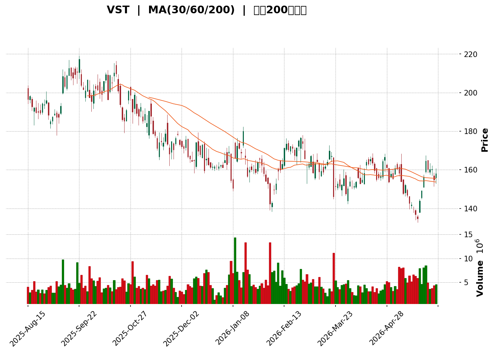
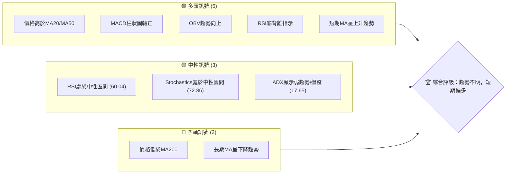

<details>
<summary>📊 靜態圖表 (點擊展開)</summary>

</details>

<html>
<head><meta charset="utf-8" /></head>
<body>
    <div>                        <script>window.PlotlyConfig = {MathJaxConfig: 'local'};</script>
        <script charset="utf-8" src="https://cdn.plot.ly/plotly-3.5.0.min.js" integrity="sha256-fHbNLP+GlIXN+efbQec78UkemUz3NJp7UmfGxC1tNxs=" crossorigin="anonymous"></script>                <div id="candlestick-chart" class="plotly-graph-div" style="height:500px; width:100%;"></div>            <script>                window.PLOTLYENV=window.PLOTLYENV || {};                                if (document.getElementById("candlestick-chart")) {                    Plotly.newPlot(                        "candlestick-chart",                        [{"close":{"dtype":"f8","bdata":"AAAA4GeSaEAAAADAXcZoQAAAAMDzGGhAAAAAwIEFaEAAAABAq7FnQAAAACBot2dAAAAAIEurZ0AAAADA9EtoQAAAAEBhO2hAAAAAgFJ+aEAAAAAgX4xnQAAAAAAtI2dAAAAAQNBsZ0AAAADAIqBnQAAAAMD8aGdAAAAAgE5pZ0AAAACgPSFoQAAAAKAcDWpAAAAAgJ9oaUAAAABAuxxqQAAAACCBlmpAAAAA4B8UakAAAAAAbPBpQAAAAGBlK2pAAAAAYFlWakAAAACAPiprQAAAAGCwdWlAAAAAAB8waUAAAABgFCJpQAAAAGDJ1GlAAAAA4KSsaEAAAACALmxoQAAAAMCRHmlAAAAA4PJCaUAAAAAg4y1pQAAAAIB3+2hAAAAAgEHiaEAAAADAZ79pQAAAAICALWpAAAAA4C2KaEAAAABAJB9qQAAAAIA3nmlAAAAAgKBIakAAAAAgRDpqQAAAAMB2GWlAAAAAAJI2aEAAAADANUBnQAAAAOAwKmdAAAAAgPvaZ0AAAAAASx1pQAAAAGAL2GhAAAAAYBfCZ0AAAAAgR9poQAAAAGACpmdAAAAAYAN5Z0AAAACARhBoQAAAAKBRJ2dAAAAAAMybZ0AAAADAkwNnQAAAAOAsz2dAAAAA4F94Z0AAAACgVlVmQAAAAODvOGZAAAAAwM5iZUAAAABAscZlQAAAAKCV0GVAAAAAYBO+ZUAAAAAgs1RmQAAAAKD4qWVAAAAAgAcEZUAAAABgDdVlQAAAAMDUS2VAAAAAwAYKZkAAAADAw0tmQAAAACAvpWVAAAAAoGaCZUAAAAAArmVlQAAAACC78mVAAAAA4LbWZEAAAAAANbVkQAAAAABni2RAAAAAAOSWZEAAAAAA0sNlQAAAAGA3NGVAAAAA4C35ZEAAAAAAH59lQAAAAODy8GNAAAAAYM22ZEAAAABgmVJkQAAAAGAyK2RAAAAAgGQuZEAAAAAAqTdkQAAAAIBkLmRAAAAAINMzZEAAAABAwExkQAAAAACHI2RAAAAAQCigZEAAAABAqFZkQAAAAOCRKWVAAAAAAHZMY0AAAACgosxiQAAAAGCWxGRAAAAAgAmLZUAAAACg92VlQAAAAKCsF2VAAAAAwOd9ZkAAAAAA8MtkQAAAAIAVk2NAAAAAIKr5Y0AAAACAhwRkQAAAACDc\u002fGNAAAAAQP\u002fSY0AAAADAKIFkQAAAAGBCrWRAAAAAAHlLZEAAAAAgTMRjQAAAAGCYQWNAAAAAoFQZY0AAAABgbcphQAAAAOAA3GFAAAAAwEauYkAAAAAgXxhjQAAAACA+7GNAAAAAgNH9Y0AAAAAgF1xkQAAAAGA0aGVAAAAAQDCuZUAAAAAAzkplQAAAAAB7iGVAAAAAAFRlZUAAAAAASfJkQAAAAMBbbGVAAAAAIODjZUAAAABAiBJmQAAAAGDmtGVAAAAAwHG4ZEAAAADgWS9kQAAAACBmZGRAAAAAoIDlZEAAAABA4s1jQAAAAAC1bGRAAAAAIKKFZEAAAACgLt5jQAAAAICa62NAAAAAgHjXY0AAAABgnjhkQAAAAIBlg2RAAAAAgGw8ZUAAAABAi+RkQAAAAOCjQGJAAAAAoEfpYkAAAABAChdjQAAAAOBR8GJAAAAAoJkJY0AAAAAgXG9jQAAAAKBHcWJAAAAAYI\u002fKYkAAAABguD5jQAAAAIDC5WJAAAAAQOHyYkAAAACAwjVjQAAAAOB6fGNAAAAAAAAYY0AAAAAgXFdjQAAAAGBmxmNAAAAAQAp\u002fZEAAAACAFF5kQAAAAMD1sGRAAAAAYLhuZEAAAABAM\u002fNjQAAAAMAeXWNAAAAAoEd5Y0AAAABAM5tjQAAAAEAzi2RAAAAAYI\u002fSZEAAAAAA1yNkQAAAAKBHOWNAAAAAQOG6Y0AAAADA9WhjQAAAAEAzG2RAAAAAACkMZEAAAACgR8ljQAAAAGBmPmNAAAAAQAp3YkAAAACgmQFjQAAAAADXW2JAAAAAIIXTYUAAAADAzLxhQAAAAIDCdWFAAAAAAAAYYUAAAABguNZgQAAAAAAAAGJAAAAAYI+iYkAAAADgo4hjQAAAAIDrkWRAAAAAwMwEZEAAAADA9QhkQAAAACBcB2RAAAAA4FFYY0AAAABACr9jQA=="},"high":{"dtype":"f8","bdata":"UZpKc7F1aUCzYGhWZNRoQE9bY+FLuWhA7x\u002f83QIUaEBT5iB0r31oQA4jINERWGhAaD+Ti5w9aEADv1zk2VxoQBAzqPXaj2hAtvVjeIITaUBFnNqtZl9oQNk3cvhIRWdAv9+SZoV6Z0D2eJMrAexnQIPoC0xs1mdAKBlaYG+6Z0C2aX\u002f6EVhoQCJBdj8agmpAPOMbo9xiakAvJ7D8JS1qQIHsPsAgImtABR8ZEG6fakDf3sYXbp9qQEoxWUJ4tGpAsaScJQuoakC09I+H4GZrQJYkceG8hWpAISpqT9KzaUDp\u002fX63U3ZpQMTVmc+43WlAgnZhlNHRaUAaDsuXVv5oQCrZtUC1i2lABBmJIfGNaUCnhw484jNqQBijkKxx62lAeh0108NoaUAUHqLlUcFpQM3MD9+lT2pAwBvB\u002fiF5akByfuf65ytqQDM2Q47NCGpAxxCHExfuakDx+0+JExBrQL3qBfAYL2pAG9Uc9uWdaUCNUcfmZhxoQEtYqr1On2dAeHJyKHj1Z0BNzlrMNC5pQK6RZC4uY2lAAEg\u002f+bKYaEDikNiUrQVpQEcEThG6yGhAddJWHn0LaECj9Dfk4lRoQAXW5vXP3mdAFjlUzj7+Z0DmAPhFLpNnQO7RDI+R0WdAfpranUOIaEA6yPthhm1nQPiYX0yhmWZAEspWTQsvZkACPIUCJXBmQBzDF5LTYGZA\u002fIBAuc8dZkCGxrQHA6BmQGk3yRibmGdAo+gd+HWmZUDRT6OF99ZlQJ0Teef3x2VAzD\u002fPs1coZkAn7LRtt4hmQAXPkFTQ\u002f2VAnTeHtObuZUCWL6Hj4qtlQLMm5JnqMWZAWixP7JkEZkCmWS8qdetkQPU4aT4nLmVAibAHFQSyZECHFusVE81lQHaDh98kcGZAvk6RwsKQZUAClQZNcK5lQB+PYmkN1WVADh1etUtuZUBu7URnBV5lQND88MvBgmRAfju8mENvZEDmWn8GoktkQJFmeQjlWGRAUYub6T1\u002fZEAjDP7Wz1pkQIR+yD\u002fUiGRASAfhrZQhZUAQqKwhem1lQHTW7eD+i2VA18+\u002ftXINZUC35XH4znJjQNaSChgQ0GVAGVPD0\u002fkPZkAnF71mwOZlQNZQaTZMXmVApqueMPbJZkD1RJ1OYVxlQPQyhnDDuGRA+8ucgEw4ZECPOxxV32hkQP9bpG+9VGRAsS19traiZEDZfoDbqYxkQBeNqbuoymRAG4NAetf0ZEBnE1I+1IhkQANilMpi+GNAQUFBkS2JY0Buuu7tay5jQNv1N8DY9mFACIbAv64BY0DkXwtEK3JjQIhFYzBnJmRAO\u002flFqraiZEABFzOLeb9kQI2JVxqjbWVA50HoWhkNZkD4W6l7WehlQGiUALi3imVAKjSZ0G+oZUDN8QqKY3NlQDqMl5RGbmVAcw75Bmn2ZUCtRbdMoh9mQMEv+awlQmZAB19o\u002ffEIZkCTavfT1GlkQPZSsuOPf2RA3jCQw7f3ZEDE0kfq0QRlQC\u002fvcLr7jGRA+qZ8AuwRZUBi6qgZiHhkQGrTCRpJX2RAqIvEDXqgZEAVRiVm32hkQCqXtOOBp2RAGGQcXHWYZUCGNkmdzitlQAAAAEAKz2RAAAAAwMx8Y0AAAABAM0NjQAAAAGBmvmNAAAAAoHAVY0AAAABgZgZkQAAAAIDC3WNAAAAAQArvYkAAAABA4YpjQAAAAIDrUWNAAAAAIFwjY0AAAADAHkVjQAAAAIDrKWRAAAAAwPVQZEAAAAAAKdRjQAAAAEAKF2RAAAAAwPWoZEAAAADgo9BkQAAAAKBw3WRAAAAAIK4PZUAAAACgmYFkQAAAAEAzI2RAAAAAYI\u002fiY0AAAAAA19tjQAAAACBcr2RAAAAAoHANZUAAAABgZmpkQAAAAMByJGRAAAAAACn0Y0AAAADgegRkQAAAAAApTGRAAAAAoJl5ZEAAAAAgrl9kQAAAAOB6DGVAAAAAAABgY0AAAAAAABhjQAAAAABWymJAAAAAwPVIYkAAAACgcOlhQAAAAEDhomFAAAAAoEdxYUAAAABgZhZhQAAAAMDMHGJAAAAAwPWoYkAAAACAPbJjQAAAAMDM7GRAAAAAQLSgZEAAAADA9XBkQAAAAKBHSWRAAAAAoJnRY0AAAADA9RhkQA=="},"hovertemplate":"\u003cb\u003e%{x|%Y-%m-%d}\u003c\u002fb\u003e\u003cbr\u003e\u958b: $%{open:.2f}\u003cbr\u003e\u9ad8: $%{high:.2f}\u003cbr\u003e\u4f4e: $%{low:.2f}\u003cbr\u003e\u6536: $%{close:.2f}\u003cextra\u003e\u003c\u002fextra\u003e","low":{"dtype":"f8","bdata":"dyto9xJCaEB0yaywsVFoQLNmyKJQz2dAdTgcJ7LkZkAomhxGvqhnQCxuIamSTWdAKJQP0W2SZ0CbP7fOBZRnQLDiLXNs8WdAAfsITgQ8aEAUSrml6D5nQGKRsVGXrGZADlFL8lD0ZkDvOHvEXIJnQIgJ0iPrN2ZApFdQSuz8ZkDulI1zj49nQBg3NNqE52hA1VPo5FZKaUAEoQC5lydpQOubpFO7HGpAEvZf7qvQaUCUO60vY3xpQHqP8l0i6GlAq7MHd9CTaUDJlQ21S+dpQH9o6TbMXGlA8n\u002fbyA4qaUAO9hTCDW9oQKD\u002fy\u002fanDWlAziSHKfykaEBqOOf2mcVnQCn60B6D9GdAzPBXWTfFaEArFcgMQB5pQGo0BnNenGhABhi+mRBraEA+ThdYb\u002fJoQADAEhKimGlA9G17c4qJaECWcGy1JftoQDR92Q4PG2lAE7h5WZ66aUBrpUZygQNqQCafwHD672hAH2BwMNcIaECcdkXM5CFnQJgSPJz5ZGZA7crJglwmZ0AzXf7rDkJoQEy2++OwfmhA7YgWYsr+ZkDa4bifWZ5nQNvNUAKsgGdA72SHanngZkC7sG1ghmpnQHRCaXa\u002f\u002f2ZAwnmDM3gNZ0BHxQRIJWFmQEt4u9mkA2ZAbFPPyOX0ZkCtd4xEK0pmQJBobLmpGWZA1PnIk55BZUB1fhWO+aNkQN1nPAWXlGVAweohShZGZUBHwytzsbdlQOAFBOLolGVAEkYcb8U\u002fZECfv\u002fWdL65kQAT1LolYrmRAF2ceRnmTZUCr1QOrozBmQBSxYCzehmVAB9i\u002f2JVcZUCszbaChA9lQC+29UEOQGVApoIDSWDAZEDRae\u002fzd3NkQNG\u002f1m3ZiGRAprcZJ9PGY0BmkdAUIxJkQADFyME+4WRAx1Wmo6bQZEDLIBPZ7cJkQKjUlaNryGNAiKttTRxHZECaSQ9xEUhkQI3YBCkwFGRAXfhsDy79Y0C1ZWjwrPFjQDMY7to1BGRAYXXooZj2Y0BKt6Eo5hpkQNJoQRoDIGRAVx0g9FV1ZEDPL9XTGP9jQEDF0wrScWRAl11DNJYqY0CHWieck59iQPeJ1dfttGRAXKisWmh7ZECriRsyy1JlQBWO9pVcumRAQWxzm0ZuZUA2bnywNllkQJkZ5D8wgWNAZ4JE3+8xY0D5fvSg3N1jQNsZhsgcuWNADPS9p+q1Y0DLrt7P571jQFwE4D4YHmRAAYbBTz3RY0BwLr2grpRjQAafEtE+OmNAVZV\u002f+vzFYkAe+vukkWJhQLH8U8rrSmFA13emggNnYkCxLHSLhHJiQC4cx9QrU2NAZnMMO7DKY0Duk4bBzgVkQDtB4Lv1KGRAon5YwP02ZUDQy5xWICxlQLYDc22qAGVAg+prCKIYZUCox2ynhJ9kQJ8qbEkPVWRAqQ6cTCU7ZUDsZNq2XXxkQP8zYtoHVWVAiR4byVSzZEAugLPvsBhjQIIDK8jOBWRAX5dMNbYuZECnA+QHs8JjQHcm\u002fjI+WWNAuCtn75iCZEAx08lfCV5jQMVO4qORj2NA0yJ73XuwY0Ce0OxaivxjQOJzvMnFPGRAWX3eDsmoZEAxYWBqM4BkQAAAAGCPGmJAAAAAYLiqYkAAAACgmbFiQAAAAAApzGJAAAAAIK5PYkAAAAAAAPhiQAAAAEAzU2JAAAAAQOHKYUAAAADAzOxiQAAAAADXw2JAAAAAACm8YkAAAADA9chiQAAAAKBHaWNAAAAAgMIVY0AAAAAghSNjQAAAAMDMFGNAAAAAQAoLZEAAAADAzERkQAAAACCFU2RAAAAA4FFIZEAAAACAPcpjQAAAAAApRGNAAAAAoHBdY0AAAAAAAFBjQAAAAMDMZGNAAAAAIIXXY0AAAABACtdjQAAAAGCPImNAAAAAIFx3Y0AAAACAwl1jQAAAAIAUrmNAAAAAoJn5Y0AAAABAM5NjQAAAAOCjOGNAAAAAIFxfYkAAAABg5UhiQAAAAMAeNWJAAAAA4FFwYUAAAAAAgX1hQAAAAIDrOWFAAAAAIIW7YEAAAADAHpVgQAAAAIDrOWFAAAAAACkcYkAAAAAAANhiQAAAAEAKx2NAAAAAYA7NY0AAAABAM7NjQAAAAAApnGNAAAAAYI\u002fqYkAAAAAAKRxjQA=="},"name":"\u50f9\u683c","open":{"dtype":"f8","bdata":"rx5t0yZHaUALuT3L4odoQByXVMmMlmhAeWAC2p7IZ0AFJoZEYAhoQLicF1EVzWdA46QdoNXZZ0BtfZ12FrdnQJjwKEZ0MmhAfBIwgYFOaEDKH8XRqVloQHR\u002fn5sC+2ZAKukerjspZ0DShwiA3YhnQNV3Nj62sGdA9rBtXaybZ0Da8mJSvqhnQMyXwW4Y+GhA+ZzQZ2f\u002faUA0ztPMwkRpQOubpFO7HGpABR8ZEG6fakD93aaWk09qQEMvdmvPj2pAqPwcviJbakAjYwDsaU1qQOuArQADMWpAMAmWUGpWaUCIvPABj65oQL+lwUCtFGlApmwJ0jQuaUBtM16iiNRoQMVxg63STmhAot6aZ05vaUCsP9AHM3lpQAoYXtb1smlAuvTLBnwgaUB0nOKTzSBpQGZmZibEzWlArpL1udclakC7Fvu4HxJpQFFflO8mp2lA46qHQM0XakByldkAXMZqQBsnfZsl42lA9fvX2i1yaUCqCCB0KwtoQLqaslYUYWdA7crJglwmZ0CPvyLS4YFoQK6RZC4uY2lAAEg\u002f+bKYaED5HGQuqfhnQNtKAG2cRGhA4vo6UBbvZ0B8IYmpHMlnQK\u002fk+4ehcmdAXsJxlek3Z0CNyhWjXsxmQOesQcFGQGZAtk3kt3BIaEDI4EEPEC1nQPwpA+ysemZAO9foWokNZkAd4a2ZCNdkQBbfqG1O3mVAaetMMOmFZUDVYYjAsNVlQLcPW8X1CWdAVK1+WtlwZUAYHTWbTSNlQI110M85s2VAHc7\u002fQ6ywZUBai8t3O1BmQHC2563Q8GVAPW6Ve1ndZUA\u002f9Vk56YVlQHScoWiobWVAJf5URxcBZkCmWS8qdetkQCVON99FnWRA4aWfylCcZEAU6gVhUzNkQHlU2n331mVAfThyCXyPZUArDNa3HsZkQAQwxeT9sGVAQBcwAIemZEDFDo49t8dkQN0DmMHZeGRA2e6mfTIrZEA8eBqTqRhkQAAAAIBkLmRABdHSP\u002fsYZECj2DYr8DhkQOM3URdhVWRAVx0g9FV1ZEAV4anhdCRlQNIXHwqiGGVA18+\u002ftXINZUBzFrd7O2FjQOFpXev1wmVAtX4uBUOOZEChQTg1arhlQBMRIpAYJWVArVVaYHWYZUDj0+fFS+pkQMSk7xmcIWRA1WtwZWPZY0BEspNaszZkQPEWz3YG+WNA+HbQIuELZEBPBHDCXeljQIYohHvDuGRAKFyOR3y3ZECMiOe49ShkQMEaJGvtrWNAzs3Yzgh9Y0AcBrDsZh9jQIkyy3namWFAUlEaGHa5YkDy\u002fxIFdrliQOUne7LOBWRAZn\u002fpn86YZEB0rsJyWhBkQOQevHC4RWRAMDlg\u002f7VUZUDGHWn8u7hlQGGuIae2NWVAaynP1BaCZUB2B1iOCk1lQGzbAe+q4WRAVOmmQaWEZUAwTonODGRlQIjR9Bxf2GVAcCWzBPs+ZUAsgo0cCC9kQPqHjwDWK2RABu3jeRo1ZEB42\u002fAlO4dkQOO4vucAdmNAi85qyU+kZECoMc+TEWxkQOiRP2a2m2NAUBz7o0QxZEB4i1BM+xhkQGtpepbSUmRA19GkRMawZEATW1obJ95kQAAAAEAKz2RAAAAAYGbuYkAAAACgmdFiQAAAAAAAYGNAAAAAAACwYkAAAAAAAPhiQAAAAEAzo2NAAAAAwMz8YUAAAABACu9iQAAAAGC45mJAAAAAoEfhYkAAAACAPeJiQAAAAAAAGGRAAAAA4Hp8Y0AAAAAAADBjQAAAAMDMFGNAAAAAwB5NZEAAAAAAALBkQAAAAIA9kmRAAAAA4FHIZEAAAACgmWFkQAAAAOBRGGRAAAAAoJm5Y0AAAABguH5jQAAAAGCPimNAAAAAAACgZEAAAAAAAFBkQAAAACCFG2RAAAAAoEeJY0AAAACA68ljQAAAAIAUtmNAAAAAAABgZEAAAAAA1y9kQAAAAKBHYWRAAAAAAABgY0AAAAAAAIBiQAAAACCur2JAAAAAwPVIYkAAAAAAKaxhQAAAAMDMeGFAAAAAAABgYUAAAACgmflgQAAAAAAAQGFAAAAAQAovYkAAAADA9eBiQAAAAMAe3WNAAAAAYLieZEAAAABA4dpjQAAAAAAAAGRAAAAAAACgY0AAAACAFH5jQA=="},"x":["2025-08-15T00:00:00-04:00","2025-08-18T00:00:00-04:00","2025-08-19T00:00:00-04:00","2025-08-20T00:00:00-04:00","2025-08-21T00:00:00-04:00","2025-08-22T00:00:00-04:00","2025-08-25T00:00:00-04:00","2025-08-26T00:00:00-04:00","2025-08-27T00:00:00-04:00","2025-08-28T00:00:00-04:00","2025-08-29T00:00:00-04:00","2025-09-02T00:00:00-04:00","2025-09-03T00:00:00-04:00","2025-09-04T00:00:00-04:00","2025-09-05T00:00:00-04:00","2025-09-08T00:00:00-04:00","2025-09-09T00:00:00-04:00","2025-09-10T00:00:00-04:00","2025-09-11T00:00:00-04:00","2025-09-12T00:00:00-04:00","2025-09-15T00:00:00-04:00","2025-09-16T00:00:00-04:00","2025-09-17T00:00:00-04:00","2025-09-18T00:00:00-04:00","2025-09-19T00:00:00-04:00","2025-09-22T00:00:00-04:00","2025-09-23T00:00:00-04:00","2025-09-24T00:00:00-04:00","2025-09-25T00:00:00-04:00","2025-09-26T00:00:00-04:00","2025-09-29T00:00:00-04:00","2025-09-30T00:00:00-04:00","2025-10-01T00:00:00-04:00","2025-10-02T00:00:00-04:00","2025-10-03T00:00:00-04:00","2025-10-06T00:00:00-04:00","2025-10-07T00:00:00-04:00","2025-10-08T00:00:00-04:00","2025-10-09T00:00:00-04:00","2025-10-10T00:00:00-04:00","2025-10-13T00:00:00-04:00","2025-10-14T00:00:00-04:00","2025-10-15T00:00:00-04:00","2025-10-16T00:00:00-04:00","2025-10-17T00:00:00-04:00","2025-10-20T00:00:00-04:00","2025-10-21T00:00:00-04:00","2025-10-22T00:00:00-04:00","2025-10-23T00:00:00-04:00","2025-10-24T00:00:00-04:00","2025-10-27T00:00:00-04:00","2025-10-28T00:00:00-04:00","2025-10-29T00:00:00-04:00","2025-10-30T00:00:00-04:00","2025-10-31T00:00:00-04:00","2025-11-03T00:00:00-05:00","2025-11-04T00:00:00-05:00","2025-11-05T00:00:00-05:00","2025-11-06T00:00:00-05:00","2025-11-07T00:00:00-05:00","2025-11-10T00:00:00-05:00","2025-11-11T00:00:00-05:00","2025-11-12T00:00:00-05:00","2025-11-13T00:00:00-05:00","2025-11-14T00:00:00-05:00","2025-11-17T00:00:00-05:00","2025-11-18T00:00:00-05:00","2025-11-19T00:00:00-05:00","2025-11-20T00:00:00-05:00","2025-11-21T00:00:00-05:00","2025-11-24T00:00:00-05:00","2025-11-25T00:00:00-05:00","2025-11-26T00:00:00-05:00","2025-11-28T00:00:00-05:00","2025-12-01T00:00:00-05:00","2025-12-02T00:00:00-05:00","2025-12-03T00:00:00-05:00","2025-12-04T00:00:00-05:00","2025-12-05T00:00:00-05:00","2025-12-08T00:00:00-05:00","2025-12-09T00:00:00-05:00","2025-12-10T00:00:00-05:00","2025-12-11T00:00:00-05:00","2025-12-12T00:00:00-05:00","2025-12-15T00:00:00-05:00","2025-12-16T00:00:00-05:00","2025-12-17T00:00:00-05:00","2025-12-18T00:00:00-05:00","2025-12-19T00:00:00-05:00","2025-12-22T00:00:00-05:00","2025-12-23T00:00:00-05:00","2025-12-24T00:00:00-05:00","2025-12-26T00:00:00-05:00","2025-12-29T00:00:00-05:00","2025-12-30T00:00:00-05:00","2025-12-31T00:00:00-05:00","2026-01-02T00:00:00-05:00","2026-01-05T00:00:00-05:00","2026-01-06T00:00:00-05:00","2026-01-07T00:00:00-05:00","2026-01-08T00:00:00-05:00","2026-01-09T00:00:00-05:00","2026-01-12T00:00:00-05:00","2026-01-13T00:00:00-05:00","2026-01-14T00:00:00-05:00","2026-01-15T00:00:00-05:00","2026-01-16T00:00:00-05:00","2026-01-20T00:00:00-05:00","2026-01-21T00:00:00-05:00","2026-01-22T00:00:00-05:00","2026-01-23T00:00:00-05:00","2026-01-26T00:00:00-05:00","2026-01-27T00:00:00-05:00","2026-01-28T00:00:00-05:00","2026-01-29T00:00:00-05:00","2026-01-30T00:00:00-05:00","2026-02-02T00:00:00-05:00","2026-02-03T00:00:00-05:00","2026-02-04T00:00:00-05:00","2026-02-05T00:00:00-05:00","2026-02-06T00:00:00-05:00","2026-02-09T00:00:00-05:00","2026-02-10T00:00:00-05:00","2026-02-11T00:00:00-05:00","2026-02-12T00:00:00-05:00","2026-02-13T00:00:00-05:00","2026-02-17T00:00:00-05:00","2026-02-18T00:00:00-05:00","2026-02-19T00:00:00-05:00","2026-02-20T00:00:00-05:00","2026-02-23T00:00:00-05:00","2026-02-24T00:00:00-05:00","2026-02-25T00:00:00-05:00","2026-02-26T00:00:00-05:00","2026-02-27T00:00:00-05:00","2026-03-02T00:00:00-05:00","2026-03-03T00:00:00-05:00","2026-03-04T00:00:00-05:00","2026-03-05T00:00:00-05:00","2026-03-06T00:00:00-05:00","2026-03-09T00:00:00-04:00","2026-03-10T00:00:00-04:00","2026-03-11T00:00:00-04:00","2026-03-12T00:00:00-04:00","2026-03-13T00:00:00-04:00","2026-03-16T00:00:00-04:00","2026-03-17T00:00:00-04:00","2026-03-18T00:00:00-04:00","2026-03-19T00:00:00-04:00","2026-03-20T00:00:00-04:00","2026-03-23T00:00:00-04:00","2026-03-24T00:00:00-04:00","2026-03-25T00:00:00-04:00","2026-03-26T00:00:00-04:00","2026-03-27T00:00:00-04:00","2026-03-30T00:00:00-04:00","2026-03-31T00:00:00-04:00","2026-04-01T00:00:00-04:00","2026-04-02T00:00:00-04:00","2026-04-06T00:00:00-04:00","2026-04-07T00:00:00-04:00","2026-04-08T00:00:00-04:00","2026-04-09T00:00:00-04:00","2026-04-10T00:00:00-04:00","2026-04-13T00:00:00-04:00","2026-04-14T00:00:00-04:00","2026-04-15T00:00:00-04:00","2026-04-16T00:00:00-04:00","2026-04-17T00:00:00-04:00","2026-04-20T00:00:00-04:00","2026-04-21T00:00:00-04:00","2026-04-22T00:00:00-04:00","2026-04-23T00:00:00-04:00","2026-04-24T00:00:00-04:00","2026-04-27T00:00:00-04:00","2026-04-28T00:00:00-04:00","2026-04-29T00:00:00-04:00","2026-04-30T00:00:00-04:00","2026-05-01T00:00:00-04:00","2026-05-04T00:00:00-04:00","2026-05-05T00:00:00-04:00","2026-05-06T00:00:00-04:00","2026-05-07T00:00:00-04:00","2026-05-08T00:00:00-04:00","2026-05-11T00:00:00-04:00","2026-05-12T00:00:00-04:00","2026-05-13T00:00:00-04:00","2026-05-14T00:00:00-04:00","2026-05-15T00:00:00-04:00","2026-05-18T00:00:00-04:00","2026-05-19T00:00:00-04:00","2026-05-20T00:00:00-04:00","2026-05-21T00:00:00-04:00","2026-05-22T00:00:00-04:00","2026-05-26T00:00:00-04:00","2026-05-27T00:00:00-04:00","2026-05-28T00:00:00-04:00","2026-05-29T00:00:00-04:00","2026-06-01T00:00:00-04:00","2026-06-02T00:00:00-04:00"],"type":"candlestick"},{"hovertemplate":"MA30: $%{y:.2f}\u003cextra\u003e\u003c\u002fextra\u003e","line":{"color":"#2196F3","dash":"dash","width":2},"mode":"lines","name":"MA30","x":["2025-08-15T00:00:00-04:00","2025-08-18T00:00:00-04:00","2025-08-19T00:00:00-04:00","2025-08-20T00:00:00-04:00","2025-08-21T00:00:00-04:00","2025-08-22T00:00:00-04:00","2025-08-25T00:00:00-04:00","2025-08-26T00:00:00-04:00","2025-08-27T00:00:00-04:00","2025-08-28T00:00:00-04:00","2025-08-29T00:00:00-04:00","2025-09-02T00:00:00-04:00","2025-09-03T00:00:00-04:00","2025-09-04T00:00:00-04:00","2025-09-05T00:00:00-04:00","2025-09-08T00:00:00-04:00","2025-09-09T00:00:00-04:00","2025-09-10T00:00:00-04:00","2025-09-11T00:00:00-04:00","2025-09-12T00:00:00-04:00","2025-09-15T00:00:00-04:00","2025-09-16T00:00:00-04:00","2025-09-17T00:00:00-04:00","2025-09-18T00:00:00-04:00","2025-09-19T00:00:00-04:00","2025-09-22T00:00:00-04:00","2025-09-23T00:00:00-04:00","2025-09-24T00:00:00-04:00","2025-09-25T00:00:00-04:00","2025-09-26T00:00:00-04:00","2025-09-29T00:00:00-04:00","2025-09-30T00:00:00-04:00","2025-10-01T00:00:00-04:00","2025-10-02T00:00:00-04:00","2025-10-03T00:00:00-04:00","2025-10-06T00:00:00-04:00","2025-10-07T00:00:00-04:00","2025-10-08T00:00:00-04:00","2025-10-09T00:00:00-04:00","2025-10-10T00:00:00-04:00","2025-10-13T00:00:00-04:00","2025-10-14T00:00:00-04:00","2025-10-15T00:00:00-04:00","2025-10-16T00:00:00-04:00","2025-10-17T00:00:00-04:00","2025-10-20T00:00:00-04:00","2025-10-21T00:00:00-04:00","2025-10-22T00:00:00-04:00","2025-10-23T00:00:00-04:00","2025-10-24T00:00:00-04:00","2025-10-27T00:00:00-04:00","2025-10-28T00:00:00-04:00","2025-10-29T00:00:00-04:00","2025-10-30T00:00:00-04:00","2025-10-31T00:00:00-04:00","2025-11-03T00:00:00-05:00","2025-11-04T00:00:00-05:00","2025-11-05T00:00:00-05:00","2025-11-06T00:00:00-05:00","2025-11-07T00:00:00-05:00","2025-11-10T00:00:00-05:00","2025-11-11T00:00:00-05:00","2025-11-12T00:00:00-05:00","2025-11-13T00:00:00-05:00","2025-11-14T00:00:00-05:00","2025-11-17T00:00:00-05:00","2025-11-18T00:00:00-05:00","2025-11-19T00:00:00-05:00","2025-11-20T00:00:00-05:00","2025-11-21T00:00:00-05:00","2025-11-24T00:00:00-05:00","2025-11-25T00:00:00-05:00","2025-11-26T00:00:00-05:00","2025-11-28T00:00:00-05:00","2025-12-01T00:00:00-05:00","2025-12-02T00:00:00-05:00","2025-12-03T00:00:00-05:00","2025-12-04T00:00:00-05:00","2025-12-05T00:00:00-05:00","2025-12-08T00:00:00-05:00","2025-12-09T00:00:00-05:00","2025-12-10T00:00:00-05:00","2025-12-11T00:00:00-05:00","2025-12-12T00:00:00-05:00","2025-12-15T00:00:00-05:00","2025-12-16T00:00:00-05:00","2025-12-17T00:00:00-05:00","2025-12-18T00:00:00-05:00","2025-12-19T00:00:00-05:00","2025-12-22T00:00:00-05:00","2025-12-23T00:00:00-05:00","2025-12-24T00:00:00-05:00","2025-12-26T00:00:00-05:00","2025-12-29T00:00:00-05:00","2025-12-30T00:00:00-05:00","2025-12-31T00:00:00-05:00","2026-01-02T00:00:00-05:00","2026-01-05T00:00:00-05:00","2026-01-06T00:00:00-05:00","2026-01-07T00:00:00-05:00","2026-01-08T00:00:00-05:00","2026-01-09T00:00:00-05:00","2026-01-12T00:00:00-05:00","2026-01-13T00:00:00-05:00","2026-01-14T00:00:00-05:00","2026-01-15T00:00:00-05:00","2026-01-16T00:00:00-05:00","2026-01-20T00:00:00-05:00","2026-01-21T00:00:00-05:00","2026-01-22T00:00:00-05:00","2026-01-23T00:00:00-05:00","2026-01-26T00:00:00-05:00","2026-01-27T00:00:00-05:00","2026-01-28T00:00:00-05:00","2026-01-29T00:00:00-05:00","2026-01-30T00:00:00-05:00","2026-02-02T00:00:00-05:00","2026-02-03T00:00:00-05:00","2026-02-04T00:00:00-05:00","2026-02-05T00:00:00-05:00","2026-02-06T00:00:00-05:00","2026-02-09T00:00:00-05:00","2026-02-10T00:00:00-05:00","2026-02-11T00:00:00-05:00","2026-02-12T00:00:00-05:00","2026-02-13T00:00:00-05:00","2026-02-17T00:00:00-05:00","2026-02-18T00:00:00-05:00","2026-02-19T00:00:00-05:00","2026-02-20T00:00:00-05:00","2026-02-23T00:00:00-05:00","2026-02-24T00:00:00-05:00","2026-02-25T00:00:00-05:00","2026-02-26T00:00:00-05:00","2026-02-27T00:00:00-05:00","2026-03-02T00:00:00-05:00","2026-03-03T00:00:00-05:00","2026-03-04T00:00:00-05:00","2026-03-05T00:00:00-05:00","2026-03-06T00:00:00-05:00","2026-03-09T00:00:00-04:00","2026-03-10T00:00:00-04:00","2026-03-11T00:00:00-04:00","2026-03-12T00:00:00-04:00","2026-03-13T00:00:00-04:00","2026-03-16T00:00:00-04:00","2026-03-17T00:00:00-04:00","2026-03-18T00:00:00-04:00","2026-03-19T00:00:00-04:00","2026-03-20T00:00:00-04:00","2026-03-23T00:00:00-04:00","2026-03-24T00:00:00-04:00","2026-03-25T00:00:00-04:00","2026-03-26T00:00:00-04:00","2026-03-27T00:00:00-04:00","2026-03-30T00:00:00-04:00","2026-03-31T00:00:00-04:00","2026-04-01T00:00:00-04:00","2026-04-02T00:00:00-04:00","2026-04-06T00:00:00-04:00","2026-04-07T00:00:00-04:00","2026-04-08T00:00:00-04:00","2026-04-09T00:00:00-04:00","2026-04-10T00:00:00-04:00","2026-04-13T00:00:00-04:00","2026-04-14T00:00:00-04:00","2026-04-15T00:00:00-04:00","2026-04-16T00:00:00-04:00","2026-04-17T00:00:00-04:00","2026-04-20T00:00:00-04:00","2026-04-21T00:00:00-04:00","2026-04-22T00:00:00-04:00","2026-04-23T00:00:00-04:00","2026-04-24T00:00:00-04:00","2026-04-27T00:00:00-04:00","2026-04-28T00:00:00-04:00","2026-04-29T00:00:00-04:00","2026-04-30T00:00:00-04:00","2026-05-01T00:00:00-04:00","2026-05-04T00:00:00-04:00","2026-05-05T00:00:00-04:00","2026-05-06T00:00:00-04:00","2026-05-07T00:00:00-04:00","2026-05-08T00:00:00-04:00","2026-05-11T00:00:00-04:00","2026-05-12T00:00:00-04:00","2026-05-13T00:00:00-04:00","2026-05-14T00:00:00-04:00","2026-05-15T00:00:00-04:00","2026-05-18T00:00:00-04:00","2026-05-19T00:00:00-04:00","2026-05-20T00:00:00-04:00","2026-05-21T00:00:00-04:00","2026-05-22T00:00:00-04:00","2026-05-26T00:00:00-04:00","2026-05-27T00:00:00-04:00","2026-05-28T00:00:00-04:00","2026-05-29T00:00:00-04:00","2026-06-01T00:00:00-04:00","2026-06-02T00:00:00-04:00"],"y":{"dtype":"f8","bdata":"AAAAAAAA+H8AAAAAAAD4fwAAAAAAAPh\u002fAAAAAAAA+H8AAAAAAAD4fwAAAAAAAPh\u002fAAAAAAAA+H8AAAAAAAD4fwAAAAAAAPh\u002fAAAAAAAA+H8AAAAAAAD4fwAAAAAAAPh\u002fAAAAAAAA+H8AAAAAAAD4fwAAAAAAAPh\u002fAAAAAAAA+H8AAAAAAAD4fwAAAAAAAPh\u002fAAAAAAAA+H8AAAAAAAD4fwAAAAAAAPh\u002fAAAAAAAA+H8AAAAAAAD4fwAAAAAAAPh\u002fAAAAAAAA+H8AAAAAAAD4fwAAAAAAAPh\u002fAAAAAAAA+H8AAAAAAAD4f1VVVeVhymhAvLu7y0HLaECJiIg4QMhoQAAAALD40GhAZmZmho3baEDe3d0NOuhoQN7d3V0H82hAmpmZ6WT9aEDNzMycxglpQBEREUFhGmlA7+7ubsYaaUAAAADwuzBpQERERPTmRWlAMzMzw0teaUAzMzMTgHRpQKuqqorqgmlAAAAAIMKJaUDNzMzcQYJpQHd3d2egaWlARERENF9caUBmZmZ221NpQLy7u6v5RGlAZmZmliwxaUB3d3cX5ydpQKuqqspjEmlA3t3d\u002ffH5aECrqqrKet9oQHd3d\u002ffMy2hAvLu7u1K+aEARERFhPaxoQN7d3W38mmhAzczM3LWQaEDe3d3d4X5oQFVVVUUpZmhAAAAAABdFaEDe3d3NDChoQGZmZkYFDWhAAAAA8DbyZ0CJiIjIDtVnQBEREUGKrmdAiYiI6HeQZ0C8u7uL3WtnQDMzM2P8RmdAAAAAEMQiZ0AAAABANwFnQFVVVWW942ZAIiIi4qrMZkDv7u6O2bxmQERERMR3smZA7+7uvrmYZkCamZlpH3NmQERERERvTmZAVVVVBWUzZkCJiIjICxlmQO\u002fu7q4vBGZARERExNvuZUDe3d0dBdplQO\u002fu7o6bvmVAd3d3Z+ilZUAAAAAg8Y5lQN7d3T3gb2VAREREVM9TZUAiIiICwUFlQGZmZvZVMGVAIiIigjwmZUCJiIhooxllQO\u002fu7h5WC2VAiYiISM4BZUC8u7vrzfBkQKuqqjqG7GRA7+7uPt\u002fdZEAiIiLS\u002fcNkQN7d3b17v2RAmpmZGUC7ZECamZkpl7NkQM3MzJzfrmRAiYiIyEG3ZECamZnZIbJkQImIiJjgnWRA3t3dTYKWZEB3d3ennpBkQKuqqkrei2RAq6qqqlaFZECrqqpKlXpkQImIiKgVdmRAzczMXEtwZECJiIiId2BkQO\u002fu7i6fWmRARERE5NZMZEAzMzPTOzdkQJqZmfmGI2RA7+7uLrkWZEB3d3enJQ1kQM3MzCzxCmRAIiIiUiQJZEB3d3c3pwlkQLy7u8t5FGRAAAAAEHodZEBERER0nSVkQLy7u1vHKGRAAAAAoKw6ZECJiIj4\u002fkxkQN7d3Z2WUmRAREREtIxVZEAiIiJCTVtkQKuqquqKYGRAIiIiYm1RZEDe3d0tNUxkQFVVVVUvU2RAERER0QtbZEAiIiKCOVlkQAAAAPDzXGRAzczMTOhiZEAAAACQeV1kQImIiAgFV2RAZmZmJidTZEAiIiLCB1dkQLy7u8vBYWRAMzMzU\u002f5zZECamZnJdo5kQN7d3Y3RkWRAzczMDMmTZEAAAACwvZNkQCIiIvJXi2RAMzMz8zODZECamZnZT3tkQBEREbEDYmRAIiIiMlxJZEAiIiIC5DdkQERERGRmIWRAMzMzs4QMZECrqqpqs\u002f1jQLy7u+sr7WNA3t3dHU\u002fVY0CJiIjYAL5jQM3MzByFrWNAMzMzQ5urY0BEREQEKq1jQGZmZla3r2NAq6qqusGrY0CamZkpAK1jQO\u002fu7p7yo2NAvLu7qwCbY0B3d3cXxZhjQLy7u\u002fsWnmNAzczMnHWmY0DNzMxMxKVjQN7d3U3DmmNAREREVOmNY0BmZmY2QoFjQKuqqsoTkWNAiYiI+MWaY0AzMzPztqBjQLy7uztRo2NAZmZmlm6eY0CJiIj4xZpjQERERAQPmmNAERER8dKRY0ARERHB9YRjQM3MzHyxeGNA3t3dLd1oY0C8u7sboVRjQImIiFjyR2NAERERMQhEY0B3d3e3rEVjQLy7u2t1TGNA3t3dTWJIY0AiIiLyi0VjQBEREbHkP2NAIiIiAp02Y0CJiIjo3zRjQA=="},"type":"scatter"},{"hovertemplate":"MA60: $%{y:.2f}\u003cextra\u003e\u003c\u002fextra\u003e","line":{"color":"#9C27B0","dash":"dash","width":2},"mode":"lines","name":"MA60","x":["2025-08-15T00:00:00-04:00","2025-08-18T00:00:00-04:00","2025-08-19T00:00:00-04:00","2025-08-20T00:00:00-04:00","2025-08-21T00:00:00-04:00","2025-08-22T00:00:00-04:00","2025-08-25T00:00:00-04:00","2025-08-26T00:00:00-04:00","2025-08-27T00:00:00-04:00","2025-08-28T00:00:00-04:00","2025-08-29T00:00:00-04:00","2025-09-02T00:00:00-04:00","2025-09-03T00:00:00-04:00","2025-09-04T00:00:00-04:00","2025-09-05T00:00:00-04:00","2025-09-08T00:00:00-04:00","2025-09-09T00:00:00-04:00","2025-09-10T00:00:00-04:00","2025-09-11T00:00:00-04:00","2025-09-12T00:00:00-04:00","2025-09-15T00:00:00-04:00","2025-09-16T00:00:00-04:00","2025-09-17T00:00:00-04:00","2025-09-18T00:00:00-04:00","2025-09-19T00:00:00-04:00","2025-09-22T00:00:00-04:00","2025-09-23T00:00:00-04:00","2025-09-24T00:00:00-04:00","2025-09-25T00:00:00-04:00","2025-09-26T00:00:00-04:00","2025-09-29T00:00:00-04:00","2025-09-30T00:00:00-04:00","2025-10-01T00:00:00-04:00","2025-10-02T00:00:00-04:00","2025-10-03T00:00:00-04:00","2025-10-06T00:00:00-04:00","2025-10-07T00:00:00-04:00","2025-10-08T00:00:00-04:00","2025-10-09T00:00:00-04:00","2025-10-10T00:00:00-04:00","2025-10-13T00:00:00-04:00","2025-10-14T00:00:00-04:00","2025-10-15T00:00:00-04:00","2025-10-16T00:00:00-04:00","2025-10-17T00:00:00-04:00","2025-10-20T00:00:00-04:00","2025-10-21T00:00:00-04:00","2025-10-22T00:00:00-04:00","2025-10-23T00:00:00-04:00","2025-10-24T00:00:00-04:00","2025-10-27T00:00:00-04:00","2025-10-28T00:00:00-04:00","2025-10-29T00:00:00-04:00","2025-10-30T00:00:00-04:00","2025-10-31T00:00:00-04:00","2025-11-03T00:00:00-05:00","2025-11-04T00:00:00-05:00","2025-11-05T00:00:00-05:00","2025-11-06T00:00:00-05:00","2025-11-07T00:00:00-05:00","2025-11-10T00:00:00-05:00","2025-11-11T00:00:00-05:00","2025-11-12T00:00:00-05:00","2025-11-13T00:00:00-05:00","2025-11-14T00:00:00-05:00","2025-11-17T00:00:00-05:00","2025-11-18T00:00:00-05:00","2025-11-19T00:00:00-05:00","2025-11-20T00:00:00-05:00","2025-11-21T00:00:00-05:00","2025-11-24T00:00:00-05:00","2025-11-25T00:00:00-05:00","2025-11-26T00:00:00-05:00","2025-11-28T00:00:00-05:00","2025-12-01T00:00:00-05:00","2025-12-02T00:00:00-05:00","2025-12-03T00:00:00-05:00","2025-12-04T00:00:00-05:00","2025-12-05T00:00:00-05:00","2025-12-08T00:00:00-05:00","2025-12-09T00:00:00-05:00","2025-12-10T00:00:00-05:00","2025-12-11T00:00:00-05:00","2025-12-12T00:00:00-05:00","2025-12-15T00:00:00-05:00","2025-12-16T00:00:00-05:00","2025-12-17T00:00:00-05:00","2025-12-18T00:00:00-05:00","2025-12-19T00:00:00-05:00","2025-12-22T00:00:00-05:00","2025-12-23T00:00:00-05:00","2025-12-24T00:00:00-05:00","2025-12-26T00:00:00-05:00","2025-12-29T00:00:00-05:00","2025-12-30T00:00:00-05:00","2025-12-31T00:00:00-05:00","2026-01-02T00:00:00-05:00","2026-01-05T00:00:00-05:00","2026-01-06T00:00:00-05:00","2026-01-07T00:00:00-05:00","2026-01-08T00:00:00-05:00","2026-01-09T00:00:00-05:00","2026-01-12T00:00:00-05:00","2026-01-13T00:00:00-05:00","2026-01-14T00:00:00-05:00","2026-01-15T00:00:00-05:00","2026-01-16T00:00:00-05:00","2026-01-20T00:00:00-05:00","2026-01-21T00:00:00-05:00","2026-01-22T00:00:00-05:00","2026-01-23T00:00:00-05:00","2026-01-26T00:00:00-05:00","2026-01-27T00:00:00-05:00","2026-01-28T00:00:00-05:00","2026-01-29T00:00:00-05:00","2026-01-30T00:00:00-05:00","2026-02-02T00:00:00-05:00","2026-02-03T00:00:00-05:00","2026-02-04T00:00:00-05:00","2026-02-05T00:00:00-05:00","2026-02-06T00:00:00-05:00","2026-02-09T00:00:00-05:00","2026-02-10T00:00:00-05:00","2026-02-11T00:00:00-05:00","2026-02-12T00:00:00-05:00","2026-02-13T00:00:00-05:00","2026-02-17T00:00:00-05:00","2026-02-18T00:00:00-05:00","2026-02-19T00:00:00-05:00","2026-02-20T00:00:00-05:00","2026-02-23T00:00:00-05:00","2026-02-24T00:00:00-05:00","2026-02-25T00:00:00-05:00","2026-02-26T00:00:00-05:00","2026-02-27T00:00:00-05:00","2026-03-02T00:00:00-05:00","2026-03-03T00:00:00-05:00","2026-03-04T00:00:00-05:00","2026-03-05T00:00:00-05:00","2026-03-06T00:00:00-05:00","2026-03-09T00:00:00-04:00","2026-03-10T00:00:00-04:00","2026-03-11T00:00:00-04:00","2026-03-12T00:00:00-04:00","2026-03-13T00:00:00-04:00","2026-03-16T00:00:00-04:00","2026-03-17T00:00:00-04:00","2026-03-18T00:00:00-04:00","2026-03-19T00:00:00-04:00","2026-03-20T00:00:00-04:00","2026-03-23T00:00:00-04:00","2026-03-24T00:00:00-04:00","2026-03-25T00:00:00-04:00","2026-03-26T00:00:00-04:00","2026-03-27T00:00:00-04:00","2026-03-30T00:00:00-04:00","2026-03-31T00:00:00-04:00","2026-04-01T00:00:00-04:00","2026-04-02T00:00:00-04:00","2026-04-06T00:00:00-04:00","2026-04-07T00:00:00-04:00","2026-04-08T00:00:00-04:00","2026-04-09T00:00:00-04:00","2026-04-10T00:00:00-04:00","2026-04-13T00:00:00-04:00","2026-04-14T00:00:00-04:00","2026-04-15T00:00:00-04:00","2026-04-16T00:00:00-04:00","2026-04-17T00:00:00-04:00","2026-04-20T00:00:00-04:00","2026-04-21T00:00:00-04:00","2026-04-22T00:00:00-04:00","2026-04-23T00:00:00-04:00","2026-04-24T00:00:00-04:00","2026-04-27T00:00:00-04:00","2026-04-28T00:00:00-04:00","2026-04-29T00:00:00-04:00","2026-04-30T00:00:00-04:00","2026-05-01T00:00:00-04:00","2026-05-04T00:00:00-04:00","2026-05-05T00:00:00-04:00","2026-05-06T00:00:00-04:00","2026-05-07T00:00:00-04:00","2026-05-08T00:00:00-04:00","2026-05-11T00:00:00-04:00","2026-05-12T00:00:00-04:00","2026-05-13T00:00:00-04:00","2026-05-14T00:00:00-04:00","2026-05-15T00:00:00-04:00","2026-05-18T00:00:00-04:00","2026-05-19T00:00:00-04:00","2026-05-20T00:00:00-04:00","2026-05-21T00:00:00-04:00","2026-05-22T00:00:00-04:00","2026-05-26T00:00:00-04:00","2026-05-27T00:00:00-04:00","2026-05-28T00:00:00-04:00","2026-05-29T00:00:00-04:00","2026-06-01T00:00:00-04:00","2026-06-02T00:00:00-04:00"],"y":{"dtype":"f8","bdata":"AAAAAAAA+H8AAAAAAAD4fwAAAAAAAPh\u002fAAAAAAAA+H8AAAAAAAD4fwAAAAAAAPh\u002fAAAAAAAA+H8AAAAAAAD4fwAAAAAAAPh\u002fAAAAAAAA+H8AAAAAAAD4fwAAAAAAAPh\u002fAAAAAAAA+H8AAAAAAAD4fwAAAAAAAPh\u002fAAAAAAAA+H8AAAAAAAD4fwAAAAAAAPh\u002fAAAAAAAA+H8AAAAAAAD4fwAAAAAAAPh\u002fAAAAAAAA+H8AAAAAAAD4fwAAAAAAAPh\u002fAAAAAAAA+H8AAAAAAAD4fwAAAAAAAPh\u002fAAAAAAAA+H8AAAAAAAD4fwAAAAAAAPh\u002fAAAAAAAA+H8AAAAAAAD4fwAAAAAAAPh\u002fAAAAAAAA+H8AAAAAAAD4fwAAAAAAAPh\u002fAAAAAAAA+H8AAAAAAAD4fwAAAAAAAPh\u002fAAAAAAAA+H8AAAAAAAD4fwAAAAAAAPh\u002fAAAAAAAA+H8AAAAAAAD4fwAAAAAAAPh\u002fAAAAAAAA+H8AAAAAAAD4fwAAAAAAAPh\u002fAAAAAAAA+H8AAAAAAAD4fwAAAAAAAPh\u002fAAAAAAAA+H8AAAAAAAD4fwAAAAAAAPh\u002fAAAAAAAA+H8AAAAAAAD4fwAAAAAAAPh\u002fAAAAAAAA+H8AAAAAAAD4f5qZmSmvsmhARERE1PutaEAzMzMLkaNoQKuqqvqQm2hAMzMzQ1KQaEDe3d1tI4hoQCIiIlIGgGhAzczM7M13aECrqqqyam9oQBEREcF1ZGhAvLu7K59VaEDe3d29TE5oQLy7u6txRmhAmpmZ6YdAaECamZmp2zpoQAAAAPhTM2hAERERgTYraEDe3d21jR9oQN7d3RUMDmhAmpmZeYz6Z0AAAABwfeNnQAAAAHi0yWdA3t3dzUiyZ0AAAABweaBnQM3MzLxJi2dAERER4WZ0Z0BERET0v1xnQDMzM0M0RWdAmpmZkR0yZ0CJiIhAlx1nQN7d3VVuBWdAiYiImELyZkAAAABwUeBmQN7d3Z0\u002fy2ZAERERwam1ZkAzMzMb2KBmQKuqqrItjGZAREREnAJ6ZkAiIiJa7mJmQN7d3T2ITWZAvLu7kys3ZkDv7u6u7RdmQImIiBA8A2ZAzczMFALvZUDNzMw0Z9plQBEREYFOyWVAVVVVVfbBZUBERES0fbdlQGZmZi4sqGVAZmZmBp6XZUCJiIgI34FlQHd3d8cmbWVAAAAA2F1cZUCamZmJ0EllQLy7u6siPWVAiYiIkJMvZUAzMzNTPh1lQO\u002fu7l6dDGVA3t3dpV\u002f5ZECamZl5FuNkQLy7u5uzyWRAmpmZQUS1ZEDNzMxUc6dkQJqZmZGjnWRAIiIiarCXZEAAAABQpZFkQFVVVfXnj2RARERELKSPZEAAAACwNYtkQDMzM8umimRAd3d370WMZEBVVVVlfohkQN7d3S0JiWRA7+7uZmaIZEDe3d01codkQLy7u0O1h2RAVVVVlVeEZEC8u7uDK39kQO\u002fu7vaHeGRAd3d3D8d4ZEDNzMwU7HRkQFVVVR1pdGRAvLu7ex90ZEBVVVVtB2xkQImIiFiNZmRAmpmZQblhZEBVVVWlv1tkQFVVVX0wXmRAvLu7m2pgZEBmZmZO2WJkQLy7u0OsWmRA3t3dHUFVZEC8u7urcVBkQHd3d48kS2RAq6qqIixGZECJiIiIe0JkQGZmZr4+O2RAERERIWszZEAzMzO7wC5kQAAAAOAWJWRAmpmZqZgjZECamZkxWSVkQM3MzEThH2RAERER6W0VZEBVVVUNpwxkQLy7uwMIB2RAq6qqUoT+Y0ARERGZr\u002fxjQN7d3VVzAWRA3t3dxWYDZEDe3d3VHANkQHd3d0dzAGRAREREfPT+Y0C8u7tTH\u002ftjQCIiIgKO+mNAmpmZYc78Y0B3d3cHZv5jQM3MzIxC\u002fmNAvLu70\u002fMAZEAAAACA3AdkQERERKxyEWRAq6qqgkcXZECamZlROhpkQO\u002fu7pZUF2RAzczMRNEQZEARERHpCgtkQKuqqloJ\u002fmNAmpmZkZftY0CamZnhbN5jQImIiPALzWNAiYiI8LC6Y0AzMzNDKqljQCIiIiKPmmNAd3d3p6uMY0AAAADI1oFjQERERET9fGNAiYiIyP55Y0AzMzP7WnljQLy7uwPOd2NAZmZmXi9xY0AREREJ8HBjQA=="},"type":"scatter"},{"hovertemplate":"MA200: $%{y:.2f}\u003cextra\u003e\u003c\u002fextra\u003e","line":{"color":"#FF6F00","dash":"solid","width":2},"mode":"lines","name":"MA200","x":["2025-08-15T00:00:00-04:00","2025-08-18T00:00:00-04:00","2025-08-19T00:00:00-04:00","2025-08-20T00:00:00-04:00","2025-08-21T00:00:00-04:00","2025-08-22T00:00:00-04:00","2025-08-25T00:00:00-04:00","2025-08-26T00:00:00-04:00","2025-08-27T00:00:00-04:00","2025-08-28T00:00:00-04:00","2025-08-29T00:00:00-04:00","2025-09-02T00:00:00-04:00","2025-09-03T00:00:00-04:00","2025-09-04T00:00:00-04:00","2025-09-05T00:00:00-04:00","2025-09-08T00:00:00-04:00","2025-09-09T00:00:00-04:00","2025-09-10T00:00:00-04:00","2025-09-11T00:00:00-04:00","2025-09-12T00:00:00-04:00","2025-09-15T00:00:00-04:00","2025-09-16T00:00:00-04:00","2025-09-17T00:00:00-04:00","2025-09-18T00:00:00-04:00","2025-09-19T00:00:00-04:00","2025-09-22T00:00:00-04:00","2025-09-23T00:00:00-04:00","2025-09-24T00:00:00-04:00","2025-09-25T00:00:00-04:00","2025-09-26T00:00:00-04:00","2025-09-29T00:00:00-04:00","2025-09-30T00:00:00-04:00","2025-10-01T00:00:00-04:00","2025-10-02T00:00:00-04:00","2025-10-03T00:00:00-04:00","2025-10-06T00:00:00-04:00","2025-10-07T00:00:00-04:00","2025-10-08T00:00:00-04:00","2025-10-09T00:00:00-04:00","2025-10-10T00:00:00-04:00","2025-10-13T00:00:00-04:00","2025-10-14T00:00:00-04:00","2025-10-15T00:00:00-04:00","2025-10-16T00:00:00-04:00","2025-10-17T00:00:00-04:00","2025-10-20T00:00:00-04:00","2025-10-21T00:00:00-04:00","2025-10-22T00:00:00-04:00","2025-10-23T00:00:00-04:00","2025-10-24T00:00:00-04:00","2025-10-27T00:00:00-04:00","2025-10-28T00:00:00-04:00","2025-10-29T00:00:00-04:00","2025-10-30T00:00:00-04:00","2025-10-31T00:00:00-04:00","2025-11-03T00:00:00-05:00","2025-11-04T00:00:00-05:00","2025-11-05T00:00:00-05:00","2025-11-06T00:00:00-05:00","2025-11-07T00:00:00-05:00","2025-11-10T00:00:00-05:00","2025-11-11T00:00:00-05:00","2025-11-12T00:00:00-05:00","2025-11-13T00:00:00-05:00","2025-11-14T00:00:00-05:00","2025-11-17T00:00:00-05:00","2025-11-18T00:00:00-05:00","2025-11-19T00:00:00-05:00","2025-11-20T00:00:00-05:00","2025-11-21T00:00:00-05:00","2025-11-24T00:00:00-05:00","2025-11-25T00:00:00-05:00","2025-11-26T00:00:00-05:00","2025-11-28T00:00:00-05:00","2025-12-01T00:00:00-05:00","2025-12-02T00:00:00-05:00","2025-12-03T00:00:00-05:00","2025-12-04T00:00:00-05:00","2025-12-05T00:00:00-05:00","2025-12-08T00:00:00-05:00","2025-12-09T00:00:00-05:00","2025-12-10T00:00:00-05:00","2025-12-11T00:00:00-05:00","2025-12-12T00:00:00-05:00","2025-12-15T00:00:00-05:00","2025-12-16T00:00:00-05:00","2025-12-17T00:00:00-05:00","2025-12-18T00:00:00-05:00","2025-12-19T00:00:00-05:00","2025-12-22T00:00:00-05:00","2025-12-23T00:00:00-05:00","2025-12-24T00:00:00-05:00","2025-12-26T00:00:00-05:00","2025-12-29T00:00:00-05:00","2025-12-30T00:00:00-05:00","2025-12-31T00:00:00-05:00","2026-01-02T00:00:00-05:00","2026-01-05T00:00:00-05:00","2026-01-06T00:00:00-05:00","2026-01-07T00:00:00-05:00","2026-01-08T00:00:00-05:00","2026-01-09T00:00:00-05:00","2026-01-12T00:00:00-05:00","2026-01-13T00:00:00-05:00","2026-01-14T00:00:00-05:00","2026-01-15T00:00:00-05:00","2026-01-16T00:00:00-05:00","2026-01-20T00:00:00-05:00","2026-01-21T00:00:00-05:00","2026-01-22T00:00:00-05:00","2026-01-23T00:00:00-05:00","2026-01-26T00:00:00-05:00","2026-01-27T00:00:00-05:00","2026-01-28T00:00:00-05:00","2026-01-29T00:00:00-05:00","2026-01-30T00:00:00-05:00","2026-02-02T00:00:00-05:00","2026-02-03T00:00:00-05:00","2026-02-04T00:00:00-05:00","2026-02-05T00:00:00-05:00","2026-02-06T00:00:00-05:00","2026-02-09T00:00:00-05:00","2026-02-10T00:00:00-05:00","2026-02-11T00:00:00-05:00","2026-02-12T00:00:00-05:00","2026-02-13T00:00:00-05:00","2026-02-17T00:00:00-05:00","2026-02-18T00:00:00-05:00","2026-02-19T00:00:00-05:00","2026-02-20T00:00:00-05:00","2026-02-23T00:00:00-05:00","2026-02-24T00:00:00-05:00","2026-02-25T00:00:00-05:00","2026-02-26T00:00:00-05:00","2026-02-27T00:00:00-05:00","2026-03-02T00:00:00-05:00","2026-03-03T00:00:00-05:00","2026-03-04T00:00:00-05:00","2026-03-05T00:00:00-05:00","2026-03-06T00:00:00-05:00","2026-03-09T00:00:00-04:00","2026-03-10T00:00:00-04:00","2026-03-11T00:00:00-04:00","2026-03-12T00:00:00-04:00","2026-03-13T00:00:00-04:00","2026-03-16T00:00:00-04:00","2026-03-17T00:00:00-04:00","2026-03-18T00:00:00-04:00","2026-03-19T00:00:00-04:00","2026-03-20T00:00:00-04:00","2026-03-23T00:00:00-04:00","2026-03-24T00:00:00-04:00","2026-03-25T00:00:00-04:00","2026-03-26T00:00:00-04:00","2026-03-27T00:00:00-04:00","2026-03-30T00:00:00-04:00","2026-03-31T00:00:00-04:00","2026-04-01T00:00:00-04:00","2026-04-02T00:00:00-04:00","2026-04-06T00:00:00-04:00","2026-04-07T00:00:00-04:00","2026-04-08T00:00:00-04:00","2026-04-09T00:00:00-04:00","2026-04-10T00:00:00-04:00","2026-04-13T00:00:00-04:00","2026-04-14T00:00:00-04:00","2026-04-15T00:00:00-04:00","2026-04-16T00:00:00-04:00","2026-04-17T00:00:00-04:00","2026-04-20T00:00:00-04:00","2026-04-21T00:00:00-04:00","2026-04-22T00:00:00-04:00","2026-04-23T00:00:00-04:00","2026-04-24T00:00:00-04:00","2026-04-27T00:00:00-04:00","2026-04-28T00:00:00-04:00","2026-04-29T00:00:00-04:00","2026-04-30T00:00:00-04:00","2026-05-01T00:00:00-04:00","2026-05-04T00:00:00-04:00","2026-05-05T00:00:00-04:00","2026-05-06T00:00:00-04:00","2026-05-07T00:00:00-04:00","2026-05-08T00:00:00-04:00","2026-05-11T00:00:00-04:00","2026-05-12T00:00:00-04:00","2026-05-13T00:00:00-04:00","2026-05-14T00:00:00-04:00","2026-05-15T00:00:00-04:00","2026-05-18T00:00:00-04:00","2026-05-19T00:00:00-04:00","2026-05-20T00:00:00-04:00","2026-05-21T00:00:00-04:00","2026-05-22T00:00:00-04:00","2026-05-26T00:00:00-04:00","2026-05-27T00:00:00-04:00","2026-05-28T00:00:00-04:00","2026-05-29T00:00:00-04:00","2026-06-01T00:00:00-04:00","2026-06-02T00:00:00-04:00"],"y":{"dtype":"f8","bdata":"AAAAAAAA+H8AAAAAAAD4fwAAAAAAAPh\u002fAAAAAAAA+H8AAAAAAAD4fwAAAAAAAPh\u002fAAAAAAAA+H8AAAAAAAD4fwAAAAAAAPh\u002fAAAAAAAA+H8AAAAAAAD4fwAAAAAAAPh\u002fAAAAAAAA+H8AAAAAAAD4fwAAAAAAAPh\u002fAAAAAAAA+H8AAAAAAAD4fwAAAAAAAPh\u002fAAAAAAAA+H8AAAAAAAD4fwAAAAAAAPh\u002fAAAAAAAA+H8AAAAAAAD4fwAAAAAAAPh\u002fAAAAAAAA+H8AAAAAAAD4fwAAAAAAAPh\u002fAAAAAAAA+H8AAAAAAAD4fwAAAAAAAPh\u002fAAAAAAAA+H8AAAAAAAD4fwAAAAAAAPh\u002fAAAAAAAA+H8AAAAAAAD4fwAAAAAAAPh\u002fAAAAAAAA+H8AAAAAAAD4fwAAAAAAAPh\u002fAAAAAAAA+H8AAAAAAAD4fwAAAAAAAPh\u002fAAAAAAAA+H8AAAAAAAD4fwAAAAAAAPh\u002fAAAAAAAA+H8AAAAAAAD4fwAAAAAAAPh\u002fAAAAAAAA+H8AAAAAAAD4fwAAAAAAAPh\u002fAAAAAAAA+H8AAAAAAAD4fwAAAAAAAPh\u002fAAAAAAAA+H8AAAAAAAD4fwAAAAAAAPh\u002fAAAAAAAA+H8AAAAAAAD4fwAAAAAAAPh\u002fAAAAAAAA+H8AAAAAAAD4fwAAAAAAAPh\u002fAAAAAAAA+H8AAAAAAAD4fwAAAAAAAPh\u002fAAAAAAAA+H8AAAAAAAD4fwAAAAAAAPh\u002fAAAAAAAA+H8AAAAAAAD4fwAAAAAAAPh\u002fAAAAAAAA+H8AAAAAAAD4fwAAAAAAAPh\u002fAAAAAAAA+H8AAAAAAAD4fwAAAAAAAPh\u002fAAAAAAAA+H8AAAAAAAD4fwAAAAAAAPh\u002fAAAAAAAA+H8AAAAAAAD4fwAAAAAAAPh\u002fAAAAAAAA+H8AAAAAAAD4fwAAAAAAAPh\u002fAAAAAAAA+H8AAAAAAAD4fwAAAAAAAPh\u002fAAAAAAAA+H8AAAAAAAD4fwAAAAAAAPh\u002fAAAAAAAA+H8AAAAAAAD4fwAAAAAAAPh\u002fAAAAAAAA+H8AAAAAAAD4fwAAAAAAAPh\u002fAAAAAAAA+H8AAAAAAAD4fwAAAAAAAPh\u002fAAAAAAAA+H8AAAAAAAD4fwAAAAAAAPh\u002fAAAAAAAA+H8AAAAAAAD4fwAAAAAAAPh\u002fAAAAAAAA+H8AAAAAAAD4fwAAAAAAAPh\u002fAAAAAAAA+H8AAAAAAAD4fwAAAAAAAPh\u002fAAAAAAAA+H8AAAAAAAD4fwAAAAAAAPh\u002fAAAAAAAA+H8AAAAAAAD4fwAAAAAAAPh\u002fAAAAAAAA+H8AAAAAAAD4fwAAAAAAAPh\u002fAAAAAAAA+H8AAAAAAAD4fwAAAAAAAPh\u002fAAAAAAAA+H8AAAAAAAD4fwAAAAAAAPh\u002fAAAAAAAA+H8AAAAAAAD4fwAAAAAAAPh\u002fAAAAAAAA+H8AAAAAAAD4fwAAAAAAAPh\u002fAAAAAAAA+H8AAAAAAAD4fwAAAAAAAPh\u002fAAAAAAAA+H8AAAAAAAD4fwAAAAAAAPh\u002fAAAAAAAA+H8AAAAAAAD4fwAAAAAAAPh\u002fAAAAAAAA+H8AAAAAAAD4fwAAAAAAAPh\u002fAAAAAAAA+H8AAAAAAAD4fwAAAAAAAPh\u002fAAAAAAAA+H8AAAAAAAD4fwAAAAAAAPh\u002fAAAAAAAA+H8AAAAAAAD4fwAAAAAAAPh\u002fAAAAAAAA+H8AAAAAAAD4fwAAAAAAAPh\u002fAAAAAAAA+H8AAAAAAAD4fwAAAAAAAPh\u002fAAAAAAAA+H8AAAAAAAD4fwAAAAAAAPh\u002fAAAAAAAA+H8AAAAAAAD4fwAAAAAAAPh\u002fAAAAAAAA+H8AAAAAAAD4fwAAAAAAAPh\u002fAAAAAAAA+H8AAAAAAAD4fwAAAAAAAPh\u002fAAAAAAAA+H8AAAAAAAD4fwAAAAAAAPh\u002fAAAAAAAA+H8AAAAAAAD4fwAAAAAAAPh\u002fAAAAAAAA+H8AAAAAAAD4fwAAAAAAAPh\u002fAAAAAAAA+H8AAAAAAAD4fwAAAAAAAPh\u002fAAAAAAAA+H8AAAAAAAD4fwAAAAAAAPh\u002fAAAAAAAA+H8AAAAAAAD4fwAAAAAAAPh\u002fAAAAAAAA+H8AAAAAAAD4fwAAAAAAAPh\u002fAAAAAAAA+H8AAAAAAAD4fwAAAAAAAPh\u002fAAAAAAAA+H9cj8KNGo5lQA=="},"type":"scatter"}],                        {"template":{"data":{"barpolar":[{"marker":{"line":{"color":"rgb(17,17,17)","width":0.5},"pattern":{"fillmode":"overlay","size":10,"solidity":0.2}},"type":"barpolar"}],"bar":[{"error_x":{"color":"#f2f5fa"},"error_y":{"color":"#f2f5fa"},"marker":{"line":{"color":"rgb(17,17,17)","width":0.5},"pattern":{"fillmode":"overlay","size":10,"solidity":0.2}},"type":"bar"}],"carpet":[{"aaxis":{"endlinecolor":"#A2B1C6","gridcolor":"#506784","linecolor":"#506784","minorgridcolor":"#506784","startlinecolor":"#A2B1C6"},"baxis":{"endlinecolor":"#A2B1C6","gridcolor":"#506784","linecolor":"#506784","minorgridcolor":"#506784","startlinecolor":"#A2B1C6"},"type":"carpet"}],"choropleth":[{"colorbar":{"outlinewidth":0,"ticks":""},"type":"choropleth"}],"contourcarpet":[{"colorbar":{"outlinewidth":0,"ticks":""},"type":"contourcarpet"}],"contour":[{"colorbar":{"outlinewidth":0,"ticks":""},"colorscale":[[0.0,"#0d0887"],[0.1111111111111111,"#46039f"],[0.2222222222222222,"#7201a8"],[0.3333333333333333,"#9c179e"],[0.4444444444444444,"#bd3786"],[0.5555555555555556,"#d8576b"],[0.6666666666666666,"#ed7953"],[0.7777777777777778,"#fb9f3a"],[0.8888888888888888,"#fdca26"],[1.0,"#f0f921"]],"type":"contour"}],"heatmap":[{"colorbar":{"outlinewidth":0,"ticks":""},"colorscale":[[0.0,"#0d0887"],[0.1111111111111111,"#46039f"],[0.2222222222222222,"#7201a8"],[0.3333333333333333,"#9c179e"],[0.4444444444444444,"#bd3786"],[0.5555555555555556,"#d8576b"],[0.6666666666666666,"#ed7953"],[0.7777777777777778,"#fb9f3a"],[0.8888888888888888,"#fdca26"],[1.0,"#f0f921"]],"type":"heatmap"}],"histogram2dcontour":[{"colorbar":{"outlinewidth":0,"ticks":""},"colorscale":[[0.0,"#0d0887"],[0.1111111111111111,"#46039f"],[0.2222222222222222,"#7201a8"],[0.3333333333333333,"#9c179e"],[0.4444444444444444,"#bd3786"],[0.5555555555555556,"#d8576b"],[0.6666666666666666,"#ed7953"],[0.7777777777777778,"#fb9f3a"],[0.8888888888888888,"#fdca26"],[1.0,"#f0f921"]],"type":"histogram2dcontour"}],"histogram2d":[{"colorbar":{"outlinewidth":0,"ticks":""},"colorscale":[[0.0,"#0d0887"],[0.1111111111111111,"#46039f"],[0.2222222222222222,"#7201a8"],[0.3333333333333333,"#9c179e"],[0.4444444444444444,"#bd3786"],[0.5555555555555556,"#d8576b"],[0.6666666666666666,"#ed7953"],[0.7777777777777778,"#fb9f3a"],[0.8888888888888888,"#fdca26"],[1.0,"#f0f921"]],"type":"histogram2d"}],"histogram":[{"marker":{"pattern":{"fillmode":"overlay","size":10,"solidity":0.2}},"type":"histogram"}],"mesh3d":[{"colorbar":{"outlinewidth":0,"ticks":""},"type":"mesh3d"}],"parcoords":[{"line":{"colorbar":{"outlinewidth":0,"ticks":""}},"type":"parcoords"}],"pie":[{"automargin":true,"type":"pie"}],"scatter3d":[{"line":{"colorbar":{"outlinewidth":0,"ticks":""}},"marker":{"colorbar":{"outlinewidth":0,"ticks":""}},"type":"scatter3d"}],"scattercarpet":[{"marker":{"colorbar":{"outlinewidth":0,"ticks":""}},"type":"scattercarpet"}],"scattergeo":[{"marker":{"colorbar":{"outlinewidth":0,"ticks":""}},"type":"scattergeo"}],"scattergl":[{"marker":{"line":{"color":"#283442"}},"type":"scattergl"}],"scattermapbox":[{"marker":{"colorbar":{"outlinewidth":0,"ticks":""}},"type":"scattermapbox"}],"scattermap":[{"marker":{"colorbar":{"outlinewidth":0,"ticks":""}},"type":"scattermap"}],"scatterpolargl":[{"marker":{"colorbar":{"outlinewidth":0,"ticks":""}},"type":"scatterpolargl"}],"scatterpolar":[{"marker":{"colorbar":{"outlinewidth":0,"ticks":""}},"type":"scatterpolar"}],"scatter":[{"marker":{"line":{"color":"#283442"}},"type":"scatter"}],"scatterternary":[{"marker":{"colorbar":{"outlinewidth":0,"ticks":""}},"type":"scatterternary"}],"surface":[{"colorbar":{"outlinewidth":0,"ticks":""},"colorscale":[[0.0,"#0d0887"],[0.1111111111111111,"#46039f"],[0.2222222222222222,"#7201a8"],[0.3333333333333333,"#9c179e"],[0.4444444444444444,"#bd3786"],[0.5555555555555556,"#d8576b"],[0.6666666666666666,"#ed7953"],[0.7777777777777778,"#fb9f3a"],[0.8888888888888888,"#fdca26"],[1.0,"#f0f921"]],"type":"surface"}],"table":[{"cells":{"fill":{"color":"#506784"},"line":{"color":"rgb(17,17,17)"}},"header":{"fill":{"color":"#2a3f5f"},"line":{"color":"rgb(17,17,17)"}},"type":"table"}]},"layout":{"annotationdefaults":{"arrowcolor":"#f2f5fa","arrowhead":0,"arrowwidth":1},"autotypenumbers":"strict","coloraxis":{"colorbar":{"outlinewidth":0,"ticks":""}},"colorscale":{"diverging":[[0,"#8e0152"],[0.1,"#c51b7d"],[0.2,"#de77ae"],[0.3,"#f1b6da"],[0.4,"#fde0ef"],[0.5,"#f7f7f7"],[0.6,"#e6f5d0"],[0.7,"#b8e186"],[0.8,"#7fbc41"],[0.9,"#4d9221"],[1,"#276419"]],"sequential":[[0.0,"#0d0887"],[0.1111111111111111,"#46039f"],[0.2222222222222222,"#7201a8"],[0.3333333333333333,"#9c179e"],[0.4444444444444444,"#bd3786"],[0.5555555555555556,"#d8576b"],[0.6666666666666666,"#ed7953"],[0.7777777777777778,"#fb9f3a"],[0.8888888888888888,"#fdca26"],[1.0,"#f0f921"]],"sequentialminus":[[0.0,"#0d0887"],[0.1111111111111111,"#46039f"],[0.2222222222222222,"#7201a8"],[0.3333333333333333,"#9c179e"],[0.4444444444444444,"#bd3786"],[0.5555555555555556,"#d8576b"],[0.6666666666666666,"#ed7953"],[0.7777777777777778,"#fb9f3a"],[0.8888888888888888,"#fdca26"],[1.0,"#f0f921"]]},"colorway":["#636efa","#EF553B","#00cc96","#ab63fa","#FFA15A","#19d3f3","#FF6692","#B6E880","#FF97FF","#FECB52"],"font":{"color":"#f2f5fa"},"geo":{"bgcolor":"rgb(17,17,17)","lakecolor":"rgb(17,17,17)","landcolor":"rgb(17,17,17)","showlakes":true,"showland":true,"subunitcolor":"#506784"},"hoverlabel":{"align":"left"},"hovermode":"closest","mapbox":{"style":"dark"},"paper_bgcolor":"rgb(17,17,17)","plot_bgcolor":"rgb(17,17,17)","polar":{"angularaxis":{"gridcolor":"#506784","linecolor":"#506784","ticks":""},"bgcolor":"rgb(17,17,17)","radialaxis":{"gridcolor":"#506784","linecolor":"#506784","ticks":""}},"scene":{"xaxis":{"backgroundcolor":"rgb(17,17,17)","gridcolor":"#506784","gridwidth":2,"linecolor":"#506784","showbackground":true,"ticks":"","zerolinecolor":"#C8D4E3"},"yaxis":{"backgroundcolor":"rgb(17,17,17)","gridcolor":"#506784","gridwidth":2,"linecolor":"#506784","showbackground":true,"ticks":"","zerolinecolor":"#C8D4E3"},"zaxis":{"backgroundcolor":"rgb(17,17,17)","gridcolor":"#506784","gridwidth":2,"linecolor":"#506784","showbackground":true,"ticks":"","zerolinecolor":"#C8D4E3"}},"shapedefaults":{"line":{"color":"#f2f5fa"}},"sliderdefaults":{"bgcolor":"#C8D4E3","bordercolor":"rgb(17,17,17)","borderwidth":1,"tickwidth":0},"ternary":{"aaxis":{"gridcolor":"#506784","linecolor":"#506784","ticks":""},"baxis":{"gridcolor":"#506784","linecolor":"#506784","ticks":""},"bgcolor":"rgb(17,17,17)","caxis":{"gridcolor":"#506784","linecolor":"#506784","ticks":""}},"title":{"x":0.05},"updatemenudefaults":{"bgcolor":"#506784","borderwidth":0},"xaxis":{"automargin":true,"gridcolor":"#283442","linecolor":"#506784","ticks":"","title":{"standoff":15},"zerolinecolor":"#283442","zerolinewidth":2},"yaxis":{"automargin":true,"gridcolor":"#283442","linecolor":"#506784","ticks":"","title":{"standoff":15},"zerolinecolor":"#283442","zerolinewidth":2}}},"xaxis":{"rangeslider":{"visible":false},"title":{"text":"\u65e5\u671f"}},"font":{"size":11},"title":{"text":"VST  |  MA(30\u002f60\u002f200)  |  \u6700\u8fd1200\u4ea4\u6613\u65e5"},"yaxis":{"title":{"text":"\u80a1\u50f9 (USD)"}},"hovermode":"x unified","height":500},                        {"responsive": true}                    )                };            </script>        </div>
</body>
</html>

# VST 技術分析報告

> **報告日期**：2026-06-03 ｜ **語言**：繁體中文 ｜ **數據來源**：Yahoo Finance ｜ **當前價格**：$157.97

---

## 目錄

| 章節 | 內容 |
|------|------|
| [1. 技術面概覽](#1-技術面概覽) | 訊號儀表板、核心指標、評分卡 |
| [2. 趨勢分析](#2-趨勢分析) | 多時框趨勢、長中短期走勢 |
| [3. 圖表形態分析](#3-圖表形態分析) | 形態識別、K線組合、目標價 |
| [4. 支撐與阻力](#4-支撐與阻力) | 關鍵價位、斐波那契回調 |
| [5. 技術指標深度解讀](#5-技術指標深度解讀) | MA/RSI/MACD/布林/成交量 |
| [6. 動能與波動率](#6-動能與波動率) | 動能評估、ATR、Beta |
| [7. 多時框架總結](#7-多時框架總結) | 時框架評分矩陣 |
| [8. 交易策略建議](#8-交易策略建議) | 多空策略、風險報酬比 |
| [9. 風險提示與監控](#9-風險提示與監控) | 監控指標、風險場景 |

---

## 1. 技術面概覽

本章節將透過視覺化儀表板、核心指標速覽表及綜合評分卡，為 VST 提供即時的技術面概覽，幫助投資者快速掌握其當前市場狀況與潛在趨勢。

### 🎯 技術訊號儀表板

以下 Mermaid 圖表展示了 VST 當前主要技術指標的多空訊號分佈，提供快速的視覺化判斷。



**解讀**：
VST 目前的多頭訊號數量較多，主要體現在短期動能和均線支撐上。價格成功站穩短期及中期移動平均線（MA20、MA50）上方，MACD柱狀圖由負轉正，配合OBV的上升趨勢，這些都是強烈的短期看漲訊號。RSI底背離的指示進一步強化了潛在反轉的預期。然而，ADX顯示當前趨勢強度較弱，市場可能處於盤整階段，且價格仍位於長期MA200下方，以及長期MA（如MA240）仍呈下降趨勢，這為長期走勢帶來不確定性。綜合來看，VST在短期內展現出一定的上漲動能，但中期趨勢仍需觀察，長期趨勢則偏空。

### 📊 核心指標速覽表

下表彙整了 VST 的關鍵技術指標數據，並提供簡潔的訊號解讀。

| 指標類別 | 指標名稱 | 當前數值 | 訊號 | 解讀 |
|----------|----------|----------|------|------|
| **價格** | 當前收盤價 | $157.97 | 🟡 | 位於52週高點 $219.21 與低點 $132.66 之間，偏向低點，但近期有反彈 |
| **均線** | MA20 | $151.11 | 🟢 | 價格 ($157.97) 位於MA20上方，短期看多 |
| **均線** | MA50 | $154.36 | 🟢 | 價格 ($157.97) 位於MA50上方，中期看多 |
| **均線** | MA200 | $172.44 | 🔴 | 價格 ($157.97) 位於MA200下方，長期看空 |
| **動能** | RSI(14) | 60.04 | 🟡 | 位於中性區間 (30-70)，未超買或超賣，略偏強勢 |
| **動能** | MACD | 0.881 | 🟢 | MACD線 ($0.881) 高於訊號線 ($-0.757)，且柱狀圖 (+1.637) 為正，看多 |
| **波動** | ATR(14) | $6.76 | 🟡 | 每日波動約為價格的 4.28%，屬於中等波動水平 |
| **趨勢** | ADX(14) | 17.65 | 🟡 | 低於25，顯示當前趨勢較弱，可能處於盤整或弱趨勢中 |
| **量能** | OBV趨勢 | OBV > MA | 🟢 | 量能確認價格上漲，看多 |

### 🏆 技術評分卡

本評分卡綜合評估 VST 各項技術指標表現，提供量化評分與總體評級。

```
技術評分卡 — VST (2026-06-03)
════════════════════════════════════════════════════
趨勢強度      ██████░░░░░░░░░░░░░░  30/100  🟡
  理由：ADX值低於25，顯示趨勢強度不足，市場處於盤整或弱趨勢。
動能指標      ████████████░░░░░░░░  65/100  🟢
  理由：MACD柱狀圖為正且MACD線上穿訊號線，RSI底背離，顯示短期動能強勁。
支撐穩定度    ██████████████░░░░░░  75/100  🟢
  理由：價格位於MA20和MA50上方，且近期從52週低點附近強勁反彈，築底跡象明顯。
成交量配合    ██████████░░░░░░░░░░  55/100  🟡
  理由：OBV趨勢向上，但最新成交量低於20日均量，量能略顯不足，需觀察後續放量。
形態完整度    ██████████░░░░░░░░░░  50/100  🟡
  理由：近期形成下降通道後反彈，潛在築底形態，但尚未完全確認突破。
均線排列      ██████░░░░░░░░░░░░░░  30/100  🔴
  理由：MA20<MA50<MA200 仍為空頭排列，儘管價格已站穩短期均線，長期壓力仍存。
════════════════════════════════════════════════════
綜合評分      ████████░░░░░░░░░░░░  55/100  🟡 中性偏多
════════════════════════════════════════════════════
```

**總體評級**：VST 當前技術面呈現「中性偏多」的態勢。短期內，多項動能指標和均線支撐顯示出積極的反彈力量。然而，長期趨勢的空頭排列以及ADX所揭示的弱趨勢強度，提醒投資者仍需謹慎。目前的市場環境可能更適合區間操作或等待趨勢進一步明朗。

---

## 2. 趨勢分析

本章將從多時框架深入分析 VST 的價格趨勢，包括長期、中期和短期走勢，並結合 ADX 指標評估趨勢強度。

### 🌐 多時框趨勢分析

透過 Mermaid 流程圖，我們將 VST 的趨勢分解為月線、週線和日線三個時框架，以提供全面的市場視角。

```mermaid
graph TD
    A[月線趨勢 - 長期 (24個月)] --> A1{2024年6月至2025年7月：強勁上升趨勢}
    A1 --> A2{2025年7月至2026年5月：明顯回調與盤整}
    A2 --> A3{當前：從低點反彈，試圖築底}
    A3 --> B[週線趨勢 - 中期 (20週)]
    B --> B1{2026年3月高點 $173.65}
    B1 --> B2{2026年5月低點 $139.68}
    B2 --> B3{近期反彈至 $157.97}
    B3 --> B4{形成下降通道後突破，進入盤整反彈階段}
    B4 --> C[日線趨勢 - 短期 (即時)]
    C --> C1{價格位於MA20, MA50上方}
    C1 --> C2{MACD黃金交叉，柱狀圖為正}
    C2 --> C3{ADX顯示趨勢弱，但+DI主導}
    C3 --> C4{總結：短期偏多，中期築底反彈，長期回調中}
```

**詳細解讀**：
1.  **長期趨勢 (月線)**：
    *   從2024年6月的 $85.05 開始，VST 經歷了一波強勁的牛市，在2025年7月達到 $207.74 的高點。這顯示出公司在過去一年中的強大基本面支撐和市場認可。
    *   然而，自2025年7月高點以來，股價開始進入明顯的回調與盤整階段，從 $207.74 跌至2026年5月的 $160.23，最大跌幅達到約 23%。期間經歷多次反彈，但未能突破前期高點。
    *   當前價格 $157.97 仍明顯低於2025年高點，且低於MA200，表明長期上漲趨勢已受到挑戰，目前處於較大的回調或潛在的長期頂部構築過程中。儘管如此，相對其歷史底部，整體仍處於較高水平。

2.  **中期趨勢 (週線)**：
    *   觀察近20週數據，VST 在2026年3月1日達到 $173.65 的局部高點後，再次經歷一波下跌，於2026年5月17日觸及 $139.68 的近期低點。
    *   此後，股價開始強勁反彈，在2026年5月31日回升至 $160.23，並在2026年6月7日收於 $157.97。這段走勢呈現出一個下降通道的特徵，但在 $139.68 附近獲得支撐後向上突破了通道上沿，顯示出中期築底反彈的跡象。
    *   目前股價已成功站穩MA20和MA50上方，為中期反彈提供了技術支撐。

3.  **短期趨勢 (日線)**：
    *   當前價格 $157.97 位於短期移動平均線 MA20 ($151.11) 和中期移動平均線 MA50 ($154.36) 之上，這是一個明確的短期看漲訊號。
    *   MACD 指標已出現黃金交叉，且MACD柱狀圖為正，進一步確認了短期動能的轉強。
    *   雖然 ADX 值較低，顯示整體趨勢強度不足，但 +DI 高於 -DI，表明在當前弱勢趨勢中，多頭力量佔據主導地位。

**綜合結論**：VST 在長期來看正處於從高點回調的階段，但中期和短期內已展現出從底部反彈的強勁動能。當前市場正試圖在關鍵支撐位上方構築底部，並尋求向上突破的機會。

### 📈 長期趨勢 — 12個月走勢圖（Unicode）

以下是 VST 過去12個月（2025年6月至2026年6月）的月線收盤價格走勢圖，標示出關鍵高低點。

```
VST 月線走勢圖（過去12個月）
價格軸 ($)
$220 ┤                                                                       
     │                                                                       
$210 ┤                                                                       
     │                                                                       
$200 ┤                                                                       
     │                                                                       
$190 ┤                                                                       
     │                                                                       
$180 ┤                                                                       
     │                                                                       
$170 ┤                                                                       
     │                                                                       
$160 ┤             ●(2025-06: 193.07)                  ●(2025-09: 195.38)   
     │                       ●(2025-07: 207.74)         ●(2026-02: 173.65)
     │                                                                       
$150 ┤                                                                       
     │                                                                       
$140 ┤                                                                       
     │                                                                       
$130 ┤                                                                       
     └───────────────────────────────────────────────────────────────────────
      2025-06 2025-07 2025-08 2025-09 2025-10 2025-11 2025-12 2026-01 2026-02 2026-03 2026-04 2026-05 2026-06
      $193.07 $207.74 $188.39 $195.38 $187.78 $178.37 $161.11 $158.13 $173.65 $150.33 $157.84 $160.23 $157.97

高點標記:
  - 2025年7月: $207.74 (歷史高點)
  - 2025年9月: $195.38 (次高點)
  - 2026年2月: $173.65 (近期反彈高點)
低點標記:
  - 2026年3月: $150.33 (近期低點之一)
  - 2026年5月: $139.68 (未在月線圖中直接顯示，但為20週數據中重要低點)
  - 2026年1月: $158.13 (近期相對低點)

當前價格: $157.97
```

**走勢特徵分析表格**：

| 時間區段 | 漲跌幅 (月) | 區間高點 | 區間低點 | 主要特徵 | 趨勢判斷 |
|----------|-------------|----------|----------|----------|----------|
| 2025-06 | +20.94%     | $193.07  | $159.75  | 強勁上升，突破前高 | 🟢 強勁上升 |
| 2025-07 | +7.65%      | $207.74  | $193.07  | 創歷史新高，動能強勁 | 🟢 強勁上升 |
| 2025-08 | -9.31%      | $207.74  | $188.39  | 首次較大回調，獲利了結 | 🟡 頂部回調 |
| 2025-09 | +3.71%      | $195.38  | $188.39  | 反彈但未能突破前高 | 🟡 高位震盪 |
| 2025-10 | -3.89%      | $195.38  | $187.78  | 再次回調，動能減弱 | 🔴 下跌震盪 |
| 2025-11 | -5.01%      | $187.78  | $178.37  | 持續下跌，跌破關鍵支撐 | 🔴 下跌趨勢 |
| 2025-12 | -9.79%      | $178.37  | $161.11  | 加速下跌，進入調整期 | 🔴 加速下跌 |
| 2026-01 | -1.85%      | $161.11  | $158.13  | 跌勢趨緩，尋找支撐 | 🟡 底部盤整 |
| 2026-02 | +9.81%      | $173.65  | $158.13  | 強勁反彈，但受阻於長期均線 | 🟢 短期反彈 |
| 2026-03 | -13.43%     | $173.65  | $150.33  | 反彈失敗，再次下跌 | 🔴 下跌趨勢 |
| 2026-04 | +4.99%      | $157.84  | $150.33  | 小幅反彈，動能不足 | 🟡 弱勢反彈 |
| 2026-05 | +1.52%      | $160.23  | $139.68  | 波動加劇，探底後反彈 | 🟢 築底反彈 |
| 2026-06 | -1.41%      | $160.23  | $157.97  | 高位震盪，趨勢不明 | 🟡 震盪整理 |

**長期趨勢總結**：
VST 在過去一年中經歷了從歷史高點 $207.74 (2025年7月) 的大幅回調，目前價格 $157.97 仍處於下降通道中。儘管在2026年2月和5月出現了兩次較為明顯的反彈，但都未能持續突破長期阻力。目前的走勢更像是長期下跌趨勢中的築底或反彈嘗試，尚未形成明確的長期上漲趨勢反轉訊號。投資者應警惕長期下行風險，同時關注短期反彈的持續性。

### 📊 中期趨勢（週線分析）

針對近20週的週線數據，我們可以看到 VST 的中期走勢經歷了一段震盪下行後，近期出現了積極的反彈。

**近期壓力與支撐示意圖**
```
VST 週線壓力與支撐示意圖 (近20週)
價格軸 ($)
$175 ┤                   R1: $173.65 (2026-03-01 高點)
     │                                     
$170 ┤                                     
     │                                     
$165 ┤                                     
     │                                     
$160 ┤                                     
     │                             ● 現價: $157.97
$155 ┤                                     
     │                                     
$150 ┤                                     
     │                                     
$145 ┤                                     
     │                                     
$140 ┤                   S1: $139.68 (2026-05-17 低點)
     └────────────────────────────────────
      時間軸

關鍵價位分析：
- **短期阻力 (R1)**: $173.65 (2026年3月1日高點)，這是近期反彈的關鍵壓力位。
- **中期阻力 (R2)**: $164.35 (2026年4月26日高點)，近期反彈受阻點。
- **當前價格**: $157.97
- **短期支撐 (S1)**: $155.28 (2026年5月3日低點)，近期有效支撐。
- **中期支撐 (S2)**: $147.72 (2026年5月10日低點)，若短期支撐失守，此為下一支撐。
- **強勁支撐 (S3)**: $139.68 (2026年5月17日低點)，近期底部，具有較強支撐作用。
```

**中期走勢解讀**：
從2026年3月的高點 $173.65 開始，VST 進入了一個明顯的下降通道，連續形成更低的高點和更低的低點。在2026年5月17日觸及 $139.68 的低點後，股價出現了強勁的反彈，並成功突破了下降通道的壓力線。這暗示中期下跌趨勢可能已經結束，或者至少進入了築底反彈階段。當前股價在 $157.97 附近，面臨著 $160.23 (2026-05-31 高點) 和 $164.35 (2026-04-26 高點) 的短期阻力。若能有效突破這些阻力，將有機會測試 $173.65 的中期高點。反之，若跌破 $155.28 的支撐，則需警惕再次下探 $147.72 甚至 $139.68 的風險。

### ⚡ 趨勢強度評估（ADX 解讀）

ADX (Average Directional Index) 指標用於衡量趨勢的強度，而非方向。結合 +DI (Positive Directional Indicator) 和 -DI (Negative Directional Indicator) 可以判斷趨勢的方向。

```mermaid
graph TD
    A[ADX 指標分析] --> B{ADX(14): 17.65}
    B --> B1{趨勢強度判斷: < 25}
    B1 --> B2[結果: 弱趨勢或盤整行情]
    A --> C{+DI: 28.03}
    A --> D{-DI: 19.75}
    C --> C1{方向判斷: +DI > -DI}
    C1 --> C2[結果: 多頭主導]
    B2 & C2 --> E[綜合結論: 市場處於弱勢多頭趨勢或帶有多頭偏好的盤整行情]
```

**ADX 強度對照表**：

| ADX 值範圍 | 趨勢強度 | 市場行為 |
|------------|----------|----------|
| 0-25       | 弱趨勢   | 盤整、震盪 |
| 25-50      | 中等趨勢 | 趨勢形成、動能增強 |
| 50-75      | 強趨勢   | 趨勢明確、加速上漲/下跌 |
| 75-100     | 極強趨勢 | 趨勢過熱、可能反轉 |

**ADX 解讀**：
VST 當前的 ADX(14) 值為 17.65，位於 0-25 的區間內。這明確指示市場目前處於**弱趨勢或盤整行情**。這意味著近期股價並沒有形成明確的單邊趨勢，而是傾向於在一個區間內震盪。

然而，我們需要進一步觀察 +DI 和 -DI 的關係。當前 +DI 為 28.03，而 -DI 為 19.75。由於 +DI > -DI，這表明在當前的弱趨勢或盤整行情中，**多頭力量佔據主導地位**。換句話說，雖然市場缺乏明確的強勁趨勢，但多方相對於空方更具影響力，股價在盤整時更傾向於向上波動或在底部獲得支撐。

**綜合判斷**：VST 目前的市場環境是一個帶有多頭偏好的盤整行情。這對於趨勢追隨者來說可能不是最佳的進場時機，但對於擅長區間操作的交易者而言，可以在支撐位附近尋找買入機會，並在阻力位附近獲利了結。若未來 ADX 值能有效突破 25 並持續上升，同時 +DI 維持在 -DI 之上，則預示著新的上升趨勢可能正在形成。

---

## 3. 圖表形態分析

本章將深入分析 VST 的圖表形態，識別潛在的價格模式和K線組合，並據此推導出可能的價格目標。

### 🔍 形態識別系統

根據 VST 近期的價格走勢，我們觀察到一個潛在的底部反轉形態。

```mermaid
graph TD
    A[VST 圖表形態識別] --> B{中期趨勢回調}
    B --> C{2025年7月高點 ($207.74)}
    C --> D{2026年5月低點 ($139.68)}
    D --> E{形成下降通道}
    E --> F{近期從低點反彈，突破下降通道上沿}
    F --> G{潛在形態: 底部反轉形態 (如：雙底、頭肩底或碗形底)}
    G --> H{當前階段: 築底成功後的反彈初期}
    H --> I{關鍵確認點: 突破 $164.35 (近期高點) 或 $173.65 (中期高點)}
```

**形態分析**：
從2025年7月的高點 $207.74 到2026年5月的低點 $139.68，VST 的股價呈現出一個明顯的下降趨勢，並在週線圖上形成了一個清晰的下降通道。在2026年5月17日觸及 $139.68 之後，股價展開了強勁的反彈，並在近期成功突破了這個下降通道的上沿壓力線。

這種突破下降通道的行為，通常被視為趨勢反轉的早期訊號，表明空頭力量正在減弱，多頭力量開始主導市場。雖然目前尚未形成教科書式的經典反轉形態（如明確的雙底或頭肩底），但從價格行為來看，**$139.68 附近極有可能是一個重要的底部區域**。當前股價正在從這個底部區域向上運行，試圖建立一個新的上升趨勢。我們可以將其視為一個潛在的「築底成功後的回升初期」形態。

**關鍵確認點**：
1.  **突破近期高點 $164.35 (2026年4月26日)**：這是確認短期反彈動能持續的關鍵。
2.  **突破中期高點 $173.65 (2026年3月1日)**：若能有效突破此點，則意味著中期下跌趨勢的正式結束，並有望開啟一波新的上漲行情。

### 🕯️ 重要K線形態分析

根據近20週的收盤走勢數據，我們分析以下幾個關鍵K線形態及其意義。

| 月份       | 收盤價  | K線形態 (週) | 解讀                                         | 訊號 |
|------------|---------|--------------|----------------------------------------------|------|
| 2026-03-01 | $173.65 | 長上影線/高位十字星 | 價格達到階段性高點，多頭上攻乏力，面臨賣壓 | 🔴 |
| 2026-03-08 | $158.43 | 長陰線        | 賣壓沉重，確認下跌趨勢                       | 🔴 |
| 2026-05-17 | $139.68 | 錘頭線/長下影線 | 股價觸及低點後獲得強勁支撐，買盤湧入       | 🟢 |
| 2026-05-24 | $156.27 | 大陽線/看漲吞噬 | 強勁反彈，吞噬前一週跌幅，確認底部反轉動能 | 🟢 |
| 2026-05-31 | $160.23 | 陽線          | 反彈持續，但量能略顯不足，顯示動能需觀察   | 🟡 |
| 2026-06-07 | $157.97 | 小陰線/十字星 | 反彈後短期整理，多空拉鋸，等待方向           | 🟡 |

**K線形態解讀**：
*   **2026年3月1日的高點 $173.65 附近**：可能形成了一根帶有長上影線的K線或十字星，表明多頭在高位遭遇強大阻力，隨後一週的長陰線確認了賣壓的來臨，開啟了新一輪的下跌。
*   **2026年5月17日的 $139.68 低點**：在這裡出現了一根帶有長下影線的K線（類似錘頭線或倒錘頭線，具體形態需看開盤價和收盤價相對位置，但長下影線本身就是強烈支撐訊號），表明在低位有強勁買盤介入，阻止了價格進一步下跌。
*   **2026年5月24日的 $156.27**：這週形成了一根強勁的大陽線，如果它吞噬了前一週或前幾週的陰線實體，則構成「看漲吞噬」或「啟明星」等底部反轉形態，強烈預示著趨勢的反轉。
*   **2026年5月31日和2026年6月7日**：後續兩週的陽線和十字星形態表明反彈仍在繼續，但動能可能有所放緩，進入短期整理階段。這是一個健康的走勢，為後續上漲積蓄力量。

### 📉 ASCII 走勢形態示意圖

以下示意圖展示了 VST 近期從下降通道中反轉的走勢形態。

```
VST 近期走勢形態示意圖 (下降通道突破)

價格軸 ($)
$175 ┤           R1 ($173.65)
     │          /
$170 ┤         /
     │        /
$165 ┤       /
     │      /
$160 ┤     /
     │    /      ┌───┐  (當前整理區間)
$155 ┤   /       │ 現價 │ ($157.97)
     │  /        └─▲─┘
$150 ┤ /          │
     │/           │
$145 ┤            │
     │            │
$140 ┤───────S1 ($139.68)
     └───────────────────────────────────
      時間軸

關鍵點位：
- **下降通道上沿**：由 $173.65 (Mar 1) 和 $164.35 (Apr 26) 等高點構成的趨勢線。
- **下降通道下沿**：由 $149.45 (Feb 8) 和 $139.68 (May 17) 等低點構成的趨勢線。
- **S1: $139.68**：近期底部支撐。
- **R1: $173.65**：中期阻力。
- **當前價格 $157.97**：位於下降通道突破後的回調或盤整階段。

形態解讀：
股價在2026年3月至5月期間，沿著下降通道運行，不斷創出更低的高點和更低的低點。在觸及 $139.68 的重要支撐位後，買盤介入，推動股價強勁反彈，並成功向上突破了下降通道的上沿壓力線。這是一個典型的**趨勢反轉訊號**。目前股價在突破後進行回測或小幅盤整，若能守住突破點，則後續有望展開一波新的上漲行情。

### 🎯 形態目標價計算

根據近期識別的下降通道突破形態，我們可以初步估算其目標價。

**形態類型**：下降通道突破 (Falling Wedge Breakout 或 Descending Channel Breakout)

**計算方法**：
下降通道突破後的目標價通常可以通過測量通道最寬處的高度，並將其加到突破點來估算。

1.  **通道最高點 (A)**: $173.65 (2026年3月1日週收盤價)
2.  **通道最低點 (B)**: $139.68 (2026年5月17日週收盤價)
3.  **通道高度 (H)**: A - B = $173.65 - $139.68 = $33.97
4.  **突破點 (Breakout Point)**: 由於股價在 $139.68 反彈後突破通道，我們可以將突破點暫定為 $150.00 (通道上沿在反彈時的約略價位，或以 $139.68 為形態底部)。考慮到實際突破發生在反彈過程中，我們使用最近的反彈低點作為基準點。

**目標價估算**：
*   **保守目標價 (T1)**：突破點 + (H * 0.5) = $150.00 + ($33.97 * 0.5) = $150.00 + $16.985 = **$166.985**
*   **樂觀目標價 (T2)**：突破點 + H = $150.00 + $33.97 = **$183.97**

**備註**：
*   這裡的突破點 $150.00 是一個假設，實際突破點可能在 $150-$155 之間。
*   此目標價是基於形態測量，並未考慮其他技術或基本面因素。
*   通道高度的測量可以有多種方法，這裡採用的是通道內最大垂直距離。

**形態目標價總結**：
根據下降通道突破形態，VST 的初步上漲目標價區間為 **$166.985 至 $183.97**。其中，中期阻力 $173.65 (MA200 附近) 將是第一個重要的考驗。若能有效站穩並突破 $173.65，則有望挑戰更高目標。

---

## 4. 支撐與阻力

本章將詳細分析 VST 的關鍵支撐與阻力價位，包括基於歷史價格、均線系統和斐波那契回調的計算，並透過視覺化圖表呈現。

### 🗺️ 關鍵價位分布圖（Unicode）

以下是 VST 當前價格 $157.97 周圍的關鍵支撐與阻力價位分布圖。

```
VST 價位結構分布圖 (2026-06-03)
═══════════════════════════════════════════════════
$219.21 ║████████████████████████║ 極強阻力 R4 (52週高點)
$207.74 ║████████████████████    ║ 強阻力 R3 (歷史高點)
$195.38 ║████████████████████████║ 阻力 R2 (2025-09高點)
$178.37 ║████████████████████    ║ 阻力 R1.5 (2025-11收盤)
$172.44 ║████████████████████████║ 關鍵阻力 R1 (MA200)
$168.94 ║████████████████████    ║ 布林上軌
$164.35 ║████████████████████████║ 近期阻力 (2026-04高點)
$160.23 ║████████████████████    ║ 短期阻力 (2026-05高點)
$159.59 ║████████████████████████║ MA120
$157.97 ╠════════════════════════╣ ◄ 現價
$154.36 ║▓▓▓▓▓▓▓▓▓▓▓▓▓▓▓▓        ║ 短期支撐 S1 (MA50)
$151.11 ║▓▓▓▓▓▓▓▓▓▓▓▓▓▓▓▓▓▓▓▓▓▓▓▓║ 關鍵支撐 S2 (MA20 / 布林中軌)
$147.72 ║▓▓▓▓▓▓▓▓▓▓▓▓▓▓▓▓        ║ 短期支撐 S3 (2026-05-10低點)
$139.68 ║████████████████████████║ 強支撐 S4 (2026-05-17低點 / 形態底部)
$133.28 ║████████████████████    ║ 布林下軌
$132.66 ║████████████████████████║ 極強支撐 S5 (52週低點)
═══════════════════════════════════════════════════
```

### 🚧 阻力位分析表

| 阻力級別 | 價位     | 形成原因                                   | 突破難度 | 重要性 |
|----------|----------|--------------------------------------------|----------|--------|
| **短期阻力** | $160.23 | 2026年5月31日收盤價，短期反彈高點          | 中等     | 🟢🟢🟢 |
| **近期阻力** | $164.35 | 2026年4月26日收盤價，前一波反彈受阻位     | 中等     | 🟢🟢🟢🟢 |
| **關鍵阻力 (R1)** | $172.44 | MA200 所在價位，長期趨勢判斷關鍵         | 高       | 🟢🟢🟢🟢🟢 |
| **中期阻力 (R1.5)** | $173.65 | 2026年3月1日高點，中期反彈極限           | 高       | 🟢🟢🟢🟢🟢 |
| **強阻力 (R2)** | $195.38 | 2025年9月高點，歷史回調前高點              | 極高     | 🟢🟢🟢🟢🟢 |
| **極強阻力 (R3)** | $207.74 | 2025年7月歷史高點，強大心理與技術阻力   | 極高     | 🟢🟢🟢🟢🟢 |
| **極強阻力 (R4)** | $219.21 | 52週最高點，市場上行空間的極限           | 極高     | 🟢🟢🟢🟢🟢 |

**阻力位解讀**：
VST 目前面臨著多重阻力。最直接的壓力來自於近期反彈高點 $160.23 和 $164.35。若能突破這些短期阻力，則將面臨更為嚴峻的考驗：MA200 ($172.44) 和中期高點 $173.65。MA200 尤其重要，因為它代表著長期趨勢的分水嶺。如果股價能夠有效站穩 MA200 之上，將預示著長期趨勢的扭轉。再往上，歷史高點 $207.74 和52週高點 $219.21 將是極為強大的心理和技術阻力。

### 🛡️ 支撐位分析表

| 支撐級別 | 價位     | 形成原因                                   | 守住機率 | 重要性 |
|----------|----------|--------------------------------------------|----------|--------|
| **短期支撐 (S1)** | $154.36 | MA50 所在價位，中期趨勢支撐              | 高       | 🟢🟢🟢🟢 |
| **關鍵支撐 (S2)** | $151.11 | MA20 和布林通道中軌，短期強勁支撐        | 高       | 🟢🟢🟢🟢🟢 |
| **近期支撐 (S3)** | $147.72 | 2026年5月10日低點，前期反彈低點          | 中等     | 🟢🟢🟢🟢 |
| **強支撐 (S4)** | $139.68 | 2026年5月17日低點，形態底部，具有較強買盤 | 極高     | 🟢🟢🟢🟢🟢 |
| **極強支撐 (S5)** | $133.28 | 布林通道下軌，極端情況下的技術支撐       | 高       | 🟢🟢🟢🟢 |
| **極強支撐 (S6)** | $132.66 | 52週最低點，市場下跌空間的極限           | 極高     | 🟢🟢🟢🟢🟢 |

**支撐位解讀**：
VST 在下方也擁有多個強勁的支撐位。最近的支撐來自於 MA50 ($154.36) 和 MA20 ($151.11)。特別是 MA20，它同時也是布林通道的中軌，具有雙重支撐作用，是短期走勢的關鍵。若這些短期支撐失守，股價將可能回測 $147.72。而 $139.68 則是一個極為重要的強支撐位，它不僅是近期反彈的起點，也是多頭力量介入的關鍵區域，預計在此處會有強大買盤承接。52週低點 $132.66 則是最終防線，在此價位以下將面臨更大的下行風險。

### 📐 斐波那契回調位分析

我們將使用 VST 從2025年7月歷史高點 $207.74 到2026年5月近期低點 $139.68 的這波下跌趨勢，來計算其斐波那契回調位，以判斷潛在的反彈目標。

**斐波那契回調位計算**：
*   **高點 (Swing High)**: $207.74 (2025年7月)
*   **低點 (Swing Low)**: $139.68 (2026年5月17日)
*   **總跌幅**: $207.74 - $139.68 = $68.06

| 斐波那契水平 | 計算公式                 | 價位       | 意義                                         |
|--------------|--------------------------|------------|----------------------------------------------|
| **23.6%**    | $139.68 + ($68.06 * 0.236) | **$155.75** | 初步反彈阻力，若突破則有望繼續上漲         |
| **38.2%**    | $139.68 + ($68.06 * 0.382) | **$165.66** | 重要的反彈阻力位，通常是第一道較強的關卡   |
| **50.0%**    | $139.68 + ($68.06 * 0.500) | **$173.71** | 強大的心理和技術阻力位，若突破則趨勢可能反轉 |
| **61.8%**    | $139.68 + ($68.06 * 0.618) | **$181.65** | 趨勢反轉的黃金比例，若能突破則確認反轉     |
| **76.4%**    | $139.68 + ($68.06 * 0.764) | **$191.68** | 接近前高的回調極限，突破則有望挑戰歷史高點 |

**斐波那契回調位視覺化**：
```
VST 斐波那契回調位示意圖
價格軸 ($)
$210 ┤                                        High: $207.74
     │
$200 ┤
     │
$190 ┤───────────────────────────────────── 76.4% ($191.68)
     │
$180 ┤───────────────────────────────────── 61.8% ($181.65)
     │
$170 ┤───────────────────────────────────── 50.0% ($173.71)
     │                                     (接近MA200 $172.44)
$160 ┤───────────────────────────────────── 38.2% ($165.66)
     │                                     (接近近期阻力 $164.35)
$150 ┤───────────────────────────────────── 23.6% ($155.75)
     │                                     (接近MA50 $154.36)
$140 ┤───────────────────────────────────── Low: $139.68
     └────────────────────────────────────────────────────────
      時間軸

當前價格: $157.97
```

**斐波那契回調分析**：
當前價格 $157.97 已經突破了 23.6% 的回調位 ($155.75)，顯示出一定的反彈強度。下一個重要的阻力位將是 **38.2% 回調位 $165.66**，這個價位也與我們之前識別的近期阻力 $164.35 相當接近，形成了一個強大的阻力區。若能成功突破 $165.66，則股價有望挑戰 **50.0% 回調位 $173.71**，這個價位與 MA200 ($172.44) 以及中期高點 $173.65 幾乎重合，構成了一個極為關鍵的阻力區。能否突破 $173.71 將是判斷 VST 中期趨勢能否反轉的決定性訊號。

---

## 5. 技術指標深度解讀

本章將對 VST 的主要技術指標進行深入剖析，包括移動平均線、RSI、MACD、布林通道和成交量，並探討它們之間的相互關係和訊號確認。

### 🎛️ 指標訊號總覽

以下 Mermaid 圖表展示了各主要技術指標當前的訊號及其相互關係。

```mermaid
graph TD
    A[VST 技術指標訊號總