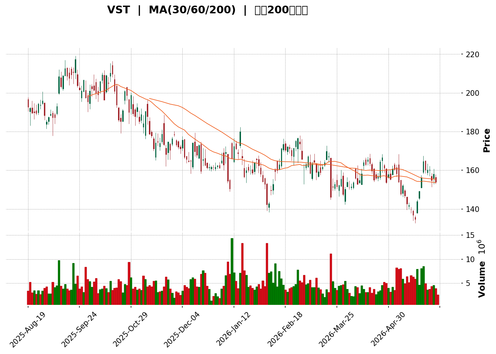
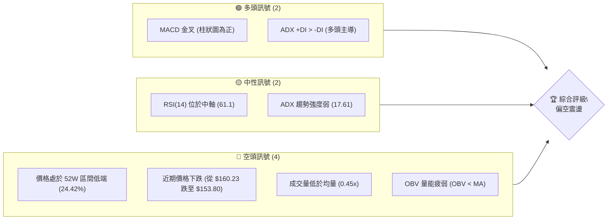
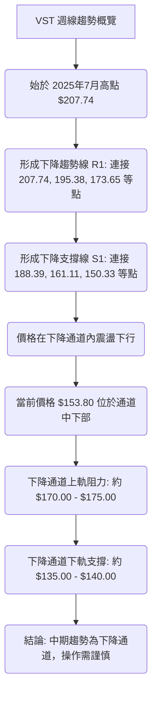
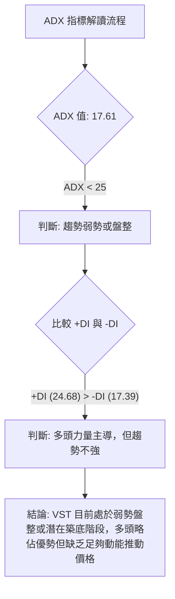
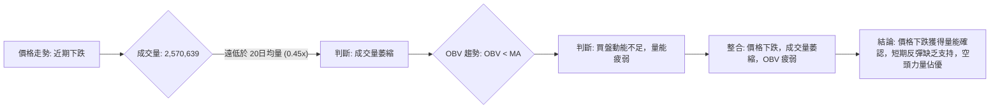

<details>
<summary>📊 靜態圖表 (點擊展開)</summary>

</details>

<html>
<head><meta charset="utf-8" /></head>
<body>
    <div style="height:500px; width:100%;">                        <script>window.PlotlyConfig = {MathJaxConfig: 'local'};</script>
        <script charset="utf-8" src="https://cdn.plot.ly/plotly-3.6.0.min.js" integrity="sha256-QaOVwtVY0T02VaHrr6pnoHLCwayMJp4O5n4YyaE3rJk=" crossorigin="anonymous"></script>                <div id="candlestick-chart" class="plotly-graph-div" style="height:100%; width:100%;"></div>            <script>                window.PLOTLYENV=window.PLOTLYENV || {};                                if (document.getElementById("candlestick-chart")) {                    Plotly.newPlot(                        "candlestick-chart",                        [{"close":{"dtype":"f8","bdata":"AAAAwPMYaEAAAADggQVoQAAAACCrsWdAAAAAIGi3Z0AAAAAAS6tnQAAAAMD0S2hAAAAAYGE7aEAAAACgUn5oQAAAAEBfjGdAAAAAAC0jZ0AAAAAg0GxnQAAAAMAioGdAAAAA4PxoZ0AAAACATmlnQAAAAKA9IWhAAAAAoBwNakAAAACgn2hpQAAAAEC7HGpAAAAAIIGWakAAAADgHxRqQAAAAABs8GlAAAAAQGUrakAAAABAWVZqQAAAAIA+KmtAAAAAYLB1aUAAAAAAHzBpQAAAAGAUImlAAAAAYMnUaUAAAADgpKxoQAAAAKAubGhAAAAAwJEeaUAAAADg8kJpQAAAAEDjLWlAAAAAYHf7aEAAAABgQeJoQAAAAOBnv2lAAAAAgIAtakAAAADgLYpoQAAAAEAkH2pAAAAAoDeeaUAAAACAoEhqQAAAACBEOmpAAAAAwHYZaUAAAAAAkjZoQAAAAMA1QGdAAAAA4DAqZ0AAAACA+9pnQAAAAABLHWlAAAAAYAvYaEAAAABgF8JnQAAAACBH2mhAAAAAYAKmZ0AAAABgA3lnQAAAAIBGEGhAAAAAoFEnZ0AAAAAgzJtnQAAAAMCTA2dAAAAA4CzPZ0AAAAAAYHhnQAAAAKBWVWZAAAAA4O84ZkAAAADAzmJlQAAAACCxxmVAAAAAoJXQZUAAAABgE75lQAAAAECzVGZAAAAAgPipZUAAAACABwRlQAAAAGAN1WVAAAAAwNRLZUAAAADABgpmQAAAAMDDS2ZAAAAAQC+lZUAAAACAZoJlQAAAAACuZWVAAAAAALvyZUAAAAAAt9ZkQAAAAOA0tWRAAAAAAGeLZEAAAAAA5JZkQAAAAODRw2VAAAAAgDc0ZUAAAADgLflkQAAAAAAfn2VAAAAA4PLwY0AAAACAzbZkQAAAAGCZUmRAAAAAYDIrZEAAAACAZC5kQAAAAACpN2RAAAAAgGQuZEAAAAAg0zNkQAAAAEDATGRAAAAAAIcjZEAAAABAKKBkQAAAAECoVmRAAAAA4JEpZUAAAAAAdkxjQAAAAKCizGJAAAAAYJbEZEAAAACACYtlQAAAAKD3ZWVAAAAAoKwXZUAAAADA531mQAAAAADwy2RAAAAAgBWTY0AAAAAgqvljQAAAAICHBGRAAAAAINz8Y0AAAABA\u002f9JjQAAAAMAogWRAAAAAYEKtZEAAAAAAeUtkQAAAACBMxGNAAAAAYJhBY0AAAACgVBljQAAAAGBtymFAAAAA4ADcYUAAAADARq5iQAAAACBfGGNAAAAAID7sY0AAAACA0f1jQAAAACAXXGRAAAAAYDRoZUAAAABAMK5lQAAAAADOSmVAAAAAAHuIZUAAAAAAVGVlQAAAAABJ8mRAAAAAwFtsZUAAAAAg4ONlQAAAAECIEmZAAAAAYOa0ZUAAAADAcbhkQAAAAOBZL2RAAAAAIGZkZEAAAACggOVkQAAAAEDizWNAAAAAALVsZEAAAAAgooVkQAAAAKAu3mNAAAAAgJrrY0AAAACAeNdjQAAAAGCeOGRAAAAAgGWDZEAAAACAbDxlQAAAAECL5GRAAAAA4KNAYkAAAACgR+liQAAAAEAKF2NAAAAA4FHwYkAAAACgmQljQAAAACBcb2NAAAAAoEdxYkAAAABgj8piQAAAAGC4PmNAAAAAgMLlYkAAAABA4fJiQAAAAIDCNWNAAAAA4Hp8Y0AAAAAAABhjQAAAACBcV2NAAAAAYGbGY0AAAABACn9kQAAAAIAUXmRAAAAAwPWwZEAAAABguG5kQAAAAEAz82NAAAAAwB5dY0AAAACgR3ljQAAAAEAzm2NAAAAAQDOLZEAAAABgj9JkQAAAAADXI2RAAAAAoEc5Y0AAAABA4bpjQAAAAMD1aGNAAAAAQDMbZEAAAAAAKQxkQAAAAKBHyWNAAAAAYGY+Y0AAAABACndiQAAAAKCZAWNAAAAAANdbYkAAAAAghdNhQAAAAMDMvGFAAAAAgMJ1YUAAAAAAABhhQAAAAGC41mBAAAAAAAAAYkAAAABgj6JiQAAAAOCjiGNAAAAAgOuRZEAAAADAzARkQAAAAMD1CGRAAAAAIFwHZEAAAADgUVhjQAAAAEAKv2NAAAAAoJk5Y0AAAAAAAAD4fw=="},"high":{"dtype":"f8","bdata":"T1tj4Uu5aEBScg\u002f+AhRoQG9dDVOvfWhADiMg0RFYaED+bc1qnD1oQAO\u002fXOTZXGhAVsEXFtuPaEBy3iaZghNpQEph+c5mX2hA2Tdy+EhFZ0AKJoBGhXpnQPZ4kysB7GdA1X+hbGzWZ0AoGVpgb7pnQLZpf\u002foRWGhAIkF2PxqCakCYClfE3GJqQC8nsPwlLWpAgew+wCAia0AFHxkQbp9qQN\u002fexhdun2pARZSxIXi0akBRYjkFC6hqQLT0j4fgZmtAliRx4byFakAhKmpP0rNpQOn9frdTdmlAxNWZz7jdaUCCdmGU0dFpQAKPirhW\u002fmhAKtm1QLWLaUAEGYkh8Y1pQIJ\u002fW13iM2pAnT9di3HraUC9I4iyw2hpQEB\u002fpAVSwWlAzcwP36VPakDAG8H+IXlqQHJ+5\u002frnK2pAwlnIrs0IakDHEIcTF+5qQPH7T4kTEGtAveoF8BgvakAb1Rz25Z1pQI1Rx+ZmHGhAS1iqvU6fZ0B4cnIoePVnQE3OWsw0LmlArpFkLi5jaUAASD\u002f5sphoQOKQ2JStBWlARwROEbrIaEB10lYefQtoQKP0N+TiVGhABdbm9c\u002feZ0D2qdnuPv5nQOYA+EUuk2dA7tEMj5HRZ0BYTk2\u002fQ4hoQDrI+2GGbWdA+JhfTKGZZkASylZNCy9mQIg5jOEkcGZAHMMXktNgZkD8gEC5zx1mQIeyICgDoGZAZ5bu9ZqYZ0Cj6B34daZlQNFPo4X31mVAnRN55\u002ffHZUDMP8+zVyhmQCfstG23iGZAUssWddD\u002fZUB\u002fzOWT5u5lQJYvoePiq2VALAeIeeoxZkBiwB4OmgRmQCaE2wl162RA9ThpPicuZUCJsAcVBLJkQF573fUSzWVA2UtkASVwZkC+TpHCwpBlQAKVBk1wrmVAH49iaQ3VZUAOlXnWS25lQG7tRGcFXmVA0Pzwy8GCZEB+O7yYQ29kQOZafwaiS2RAkWZ5COVYZEBRi5vpPX9kQCMM\u002ftbPWmRAhH7IP9SIZEBIB+GtlCFlQBCorCF6bWVAdNbt4P6LZUDXz7+1cg1lQLflcfjOcmNA1pIKGBDQZUAZU8PT+Q9mQCcXvWbA5mVA1lBpNkxeZUCmq54w9slmQPVEnU5hXGVA9DKGcMO4ZED7y5yATDhkQI87HFXfaGRA\u002f1ukb71UZECxLX22tqJkQNl+gNupjGRAF42pu6jKZEAbg0B61\u002fRkQGcTUj7UiGRAA2KUymL4Y0BBQUGRLYljQG667u1rLmNA2\u002fU3wNj2YUAIhsC\u002frgFjQORfC0QrcmNAiEVjMGcmZEA7+UWqtqJkQAEXM4t5v2RAjYlXGqNtZUDnQehaGQ1mQPhbqXtZ6GVAaJQAuLeKZUAqNJnQb6hlQM3xCopjc2VAOoyXlEZuZUBzDvkGafZlQK1Ft0yiH2ZAwS\u002f5rCVCZkAHX2j98QhmQJNq99PUaWRA9lKy449\u002fZEDeMJDDt\u002fdkQMTSR+rRBGVAL+9wuvuMZED6pnwC7BFlQGLqqBmIeGRAatMJGklfZECoi8QNeqBkQBVGJWbfaGRAKpe044GnZEAYZBxcdZhlQIY2SZ3OK2VAAAAAQArPZEAAAADAzHxjQAAAAEAzQ2NAAAAAYGa+Y0AAAACgcBVjQAAAAGBmBmRAAAAAgMLdY0AAAABACu9iQAAAAEDhimNAAAAAgOtRY0AAAAAgXCNjQAAAAMAeRWNAAAAAgOspZEAAAADA9VBkQAAAAAAp1GNAAAAAQAoXZEAAAADA9ahkQAAAAOCj0GRAAAAAoHDdZEAAAAAgrg9lQAAAAKCZgWRAAAAAQDMjZEAAAABgj+JjQAAAAADX22NAAAAAIFyvZEAAAACgcA1lQAAAAGBmamRAAAAAwHIkZEAAAAAAKfRjQAAAAOB6BGRAAAAAAClMZEAAAACgmXlkQAAAACCuX2RAAAAA4HoMZUAAAAAAAGBjQAAAAAAAGGNAAAAAAFbKYkAAAADA9UhiQAAAAKBw6WFAAAAAQOGiYUAAAACgR3FhQAAAAGBmFmFAAAAAwMwcYkAAAADA9ahiQAAAAIA9smNAAAAAwMzsZEAAAABAtKBkQAAAAMD1cGRAAAAAoEdJZEAAAACgmdFjQAAAAMD1GGRAAAAAwB69Y0AAAAAAAAD4fw=="},"hovertemplate":"\u003cb\u003e%{x|%Y-%m-%d}\u003c\u002fb\u003e\u003cbr\u003e\u958b: $%{open:.2f}\u003cbr\u003e\u9ad8: $%{high:.2f}\u003cbr\u003e\u4f4e: $%{low:.2f}\u003cbr\u003e\u6536: $%{close:.2f}\u003cextra\u003e\u003c\u002fextra\u003e","low":{"dtype":"f8","bdata":"s2bIolDPZ0Dwe5tFsuRmQCOoKCa+qGdALG4hqZJNZ0DiMTGxbZJnQJs\u002ft84FlGdAmDjMkmzxZ0CyWrJtBDxoQEsGUMXoPmdAYpGxUZesZkBJ7O\u002fSUPRmQO84e8RcgmdAfQcxQus3ZkCkV1BK7PxmQO6UjXOPj2dAGDc02oTnaEAcMMIEV0ppQAShALmXJ2lA65ukU7scakAS9l\u002fuq9BpQJQ7rS9jfGlA1M5EPiLoaUAdEPRX0JNpQMmVDbVL52lAf2jpNsxcaUDyf9vIDippQA72FMINb2hAoP\u002fL9qcNaUDOJIcp\u002fKRoQOD0DBaaxWdAKfrQHoP0Z0DM8FdZN8VoQLU1tCxAHmlAKgSAU16caEDlXld6EGtoQO+PGHdv8mhAAMASEqKYaUD0bXtzioloQJZwbLUl+2hAM6g1Lg8baUATuHlZnrppQGulRnKBA2pAJp\u002fAcPrvaEAfYHAw1whoQJx2RczkIWdAmBI8nPlkZkDtysmCXCZnQDNd\u002fusOQmhATLb747B+aEDtiBZiyv5mQNrhuJ9ZnmdA281QAqyAZ0DvZIdqeeBmQLuwbWCGamdAdEJpdr\u002f\u002fZkA\u002fj8JSeA1nQEfFBEglYWZAS3i72aQDZkD2EBzo5fRmQK13jEQrSmZAkGhsuakZZkDU+ciTnkFlQPCzwG\u002f5o2RA3Wc8BZeUZUDB6iFKFkZlQPXFSpKxt2VAECIjwuiUZUASRhxvxT9kQJ+\u002f9Z0vrmRABPUuiViuZEAXZx5GeZNlQKvVA6ujMGZAaN8zTN6GZUBYGvi4lVxlQKzNtoKED2VAejf6Ig5AZUArNeFoYMBkQOP\u002fVNR3c2RA0b\u002fWbdmIZECmtxkn08ZjQHgxTvciEmRAsY1L4T7hZEDHVaajptBkQMsgE9ntwmRAqNSVo2vIY0C1H8FsHEdkQJpJD3ERSGRAjdgEKTAUZEBd+GwPLv1jQLVlaPCs8WNAMxju2jUEZEBhdeihmPZjQEq3oSjmGmRA0mhBGgMgZEBXHSD0VXVkQM8v1dMY\u002f2NAQMXTCtJxZECXXUM0lipjQIdaJ5yTn2JA94nV1+20ZEBcqKxaaHtkQKuJGzLLUmVAFY72lVy6ZEBBbHObRm5lQDZufLA2WWRAmRnkPzCBY0BngkTf7zFjQPl+9KDc3WNA2xmGyBy5Y0AM9L2n6rVjQMuu3s\u002fnvWNAXATgPhgeZEABhsFPPdFjQHAuvaCulGNABp8S0T46Y0BVlX\u002f6\u002fMViQB76+6SRYmFAsfxTyutKYUDXd6aCA2diQLEsdIuEcmJALhzH1CtTY0Bmcww7sMpjQO6ThsHOBWRAO0Hgu\u002fUoZECifljA\u002fTZlQNDLnFYgLGVAtgNzbaoAZUCD6msIohhlQKjHbKeEn2RAnypsSQ9VZECpDpxMJTtlQOxk2rZdfGRA\u002fzNi2gdVZUCJHhvJVLNkQC6As++wGGNAggMryM4FZEBfl0w1ti5kQKcD5AezwmNAdyb+Mj5ZY0C4K2fvmIJkQDHTyV8JXmNAxU7io5GPY0DTInvde7BjQJ7Q7FqK\u002fGNA4nO8ycU8ZEBZfd4OyahkQDFhYGozgGRAAAAAYI8aYkAAAABguKpiQAAAAKCZsWJAAAAAACnMYkAAAAAgrk9iQAAAAAAA+GJAAAAAQDNTYkAAAABA4cphQAAAAMDM7GJAAAAAANfDYkAAAAAAKbxiQAAAAMD1yGJAAAAAoEdpY0AAAACAwhVjQAAAACCFI2NAAAAAwMwUY0AAAABACgtkQAAAAMDMRGRAAAAAIIVTZEAAAADgUUhkQAAAAIA9ymNAAAAAAClEY0AAAACgcF1jQAAAAAAAUGNAAAAAwMxkY0AAAAAghddjQAAAAEAK12NAAAAAYI8iY0AAAAAgXHdjQAAAAIDCXWNAAAAAgBSuY0AAAACgmfljQAAAAEAzk2NAAAAA4KM4Y0AAAAAgXF9iQAAAAGDlSGJAAAAAwB41YkAAAADgUXBhQAAAAACBfWFAAAAAgOs5YUAAAAAghbtgQAAAAMAelWBAAAAAgOs5YUAAAAAAKRxiQAAAAAAA2GJAAAAAQArHY0AAAABgDs1jQAAAAEAzs2NAAAAAACmcY0AAAABgj+piQAAAAAApHGNAAAAAYGYeY0AAAAAAAAD4fw=="},"name":"\u50f9\u683c","open":{"dtype":"f8","bdata":"HJdUyYyWaECNRLH5nshnQM0LESRgCGhAuJwXURXNZ0DPuN5\u002f1dlnQG19nXYWt2dAICcdZnQyaED3mfGggU5oQMMY3PKpWWhAdH+fmwL7ZkDCOnuOOylnQNKHCIDdiGdAuYKYXrawZ0D2sG1drJtnQNryYlK+qGdAzJfBbhj4aEAngo6IZ\u002f9pQDTO08zCRGlA65ukU7scakAFHxkQbp9qQP3dppaTT2pA\u002fmX7Ss+PakDTKxeeIltqQCNjAOxpTWpA64CtAAMxakAwCZZQalZpQIi88AGPrmhAv6XBQK0UaUCmbAnSNC5pQPXt5sKI1GhAxXGDrdJOaECi3ppnTm9pQEX2LygzeWlARA5ztfWyaUBx7nvmeyBpQNV+HbPNIGlAZmZmJsTNaUCukvW51yVqQLsW+7gfEmlAmYifDyenaUDjqodAzRdqQHKV2QBcxmpAGyd9myXjaUD1+9faLXJpQKoIIHQrC2hAupqyVhRhZ0DtysmCXCZnQI+\u002fItLhgWhArpFkLi5jaUAASD\u002f5sphoQPkcZC6p+GdA20oAbZxEaEDi+jpQFu9nQHwhiakcyWdAr+T7h6FyZ0A4X+q06TdnQI3KFaNezGZA56xBwUZAZkCd\u002fP\u002fYcEhoQMjgQQ8QLWdA\u002fCkD7Kx6ZkA71+haiQ1mQLgODnsI12RAFt+obU7eZUBp60ww6YVlQOlg0t+w1WVAwCJTo\u002fUJZ0BUrX5a2XBlQBgdNZtNI2VAjXXQzzmzZUAdzv9DrLBlQFqLy3c7UGZAQYZXztDwZUDLHw5bWd1lQD\u002f1WTnphWVAD6FjSahtZUA3Lh9pFwFmQCaE2wl162RAJU4330WdZEDhpZ\u002fKUJxkQGu+UkNTM2RA7vHPnvfWZUB9OHIJfI9lQCsM1rcexmRABDDF5P2wZUDa8hYgh6ZkQMUOjj23x2RA3QOYwdl4ZEDZ7qZ9MitkQDx4GpOpGGRAAAAAgGQuZEAF0dI\u002f+xhkQKPYNivwOGRA4zdRF2FVZEBXHSD0VXVkQBXhqeF0JGVA0hcfCqIYZUDXz7+1cg1lQHMWt3s7YWNA4Wld6\u002fXCZUC1fi4FQ45kQKFBODVquGVAExEikBglZUCtVVpgdZhlQOPT58VL6mRAxKTvGZwhZEDVa3BlY9ljQESyk1qzNmRA8RbPdgb5Y0D4dtAi4QtkQE8EcMJd6WNAhiiEe8O4ZEAoXI5HfLdkQIyI57j1KGRAwRoka+2tY0DOzdjOCH1jQBwGsOxmH2NAiTLLedqZYUBSURoYdrliQPL\u002fEgV2uWJA5Sd7ss4FZEBmf+mfzphkQHSuwnJaEGRA5B68cLhFZEAwOWD\u002ftVRlQMYdafy7uGVAYa4hp7Y1ZUBrKc\u002fUFoJlQHYHWI4KTWVAbNsB76rhZEBU6aZBpYRlQDBOic4MZGVAiNH0HF\u002fYZUBwJbME+z5lQCyCjRwIL2RA+oePANYrZEAG7eN5GjVkQHjb8CU7h2RA47i+5wB2Y0CLzmrJT6RkQKgxz5MRbGRA6JE\u002fZrabY0BQHPujRDFkQHiLUEz7GGRAa2l6ltJSZEDX0aRExrBkQBNbWhsn3mRAAAAAQArPZEAAAABgZu5iQAAAAKCZ0WJAAAAAAABgY0AAAAAAALBiQAAAAAAA+GJAAAAAQDOjY0AAAADAzPxhQAAAAEAK72JAAAAAYLjmYkAAAACgR+FiQAAAAIA94mJAAAAAAAAYZEAAAADgenxjQAAAAAAAMGNAAAAAwMwUY0AAAADAHk1kQAAAAAAAsGRAAAAAgD2SZEAAAADgUchkQAAAAKCZYWRAAAAA4FEYZEAAAACgmbljQAAAAGC4fmNAAAAAYI+KY0AAAAAAAKBkQAAAAAAAUGRAAAAAIIUbZEAAAACgR4ljQAAAAIDryWNAAAAAgBS2Y0AAAAAAAGBkQAAAAADXL2RAAAAAoEdhZEAAAAAAAGBjQAAAAAAAgGJAAAAAIK6vYkAAAADA9UhiQAAAAAAprGFAAAAAwMx4YUAAAAAAAGBhQAAAAKCZ+WBAAAAAAABAYUAAAABACi9iQAAAAMD14GJAAAAAwB7dY0AAAABguJ5kQAAAAEDh2mNAAAAAAAAAZEAAAAAAAKBjQAAAAIAUfmNAAAAA4FGQY0AAAAAAAAD4fw=="},"x":["2025-08-19T00:00:00-04:00","2025-08-20T00:00:00-04:00","2025-08-21T00:00:00-04:00","2025-08-22T00:00:00-04:00","2025-08-25T00:00:00-04:00","2025-08-26T00:00:00-04:00","2025-08-27T00:00:00-04:00","2025-08-28T00:00:00-04:00","2025-08-29T00:00:00-04:00","2025-09-02T00:00:00-04:00","2025-09-03T00:00:00-04:00","2025-09-04T00:00:00-04:00","2025-09-05T00:00:00-04:00","2025-09-08T00:00:00-04:00","2025-09-09T00:00:00-04:00","2025-09-10T00:00:00-04:00","2025-09-11T00:00:00-04:00","2025-09-12T00:00:00-04:00","2025-09-15T00:00:00-04:00","2025-09-16T00:00:00-04:00","2025-09-17T00:00:00-04:00","2025-09-18T00:00:00-04:00","2025-09-19T00:00:00-04:00","2025-09-22T00:00:00-04:00","2025-09-23T00:00:00-04:00","2025-09-24T00:00:00-04:00","2025-09-25T00:00:00-04:00","2025-09-26T00:00:00-04:00","2025-09-29T00:00:00-04:00","2025-09-30T00:00:00-04:00","2025-10-01T00:00:00-04:00","2025-10-02T00:00:00-04:00","2025-10-03T00:00:00-04:00","2025-10-06T00:00:00-04:00","2025-10-07T00:00:00-04:00","2025-10-08T00:00:00-04:00","2025-10-09T00:00:00-04:00","2025-10-10T00:00:00-04:00","2025-10-13T00:00:00-04:00","2025-10-14T00:00:00-04:00","2025-10-15T00:00:00-04:00","2025-10-16T00:00:00-04:00","2025-10-17T00:00:00-04:00","2025-10-20T00:00:00-04:00","2025-10-21T00:00:00-04:00","2025-10-22T00:00:00-04:00","2025-10-23T00:00:00-04:00","2025-10-24T00:00:00-04:00","2025-10-27T00:00:00-04:00","2025-10-28T00:00:00-04:00","2025-10-29T00:00:00-04:00","2025-10-30T00:00:00-04:00","2025-10-31T00:00:00-04:00","2025-11-03T00:00:00-05:00","2025-11-04T00:00:00-05:00","2025-11-05T00:00:00-05:00","2025-11-06T00:00:00-05:00","2025-11-07T00:00:00-05:00","2025-11-10T00:00:00-05:00","2025-11-11T00:00:00-05:00","2025-11-12T00:00:00-05:00","2025-11-13T00:00:00-05:00","2025-11-14T00:00:00-05:00","2025-11-17T00:00:00-05:00","2025-11-18T00:00:00-05:00","2025-11-19T00:00:00-05:00","2025-11-20T00:00:00-05:00","2025-11-21T00:00:00-05:00","2025-11-24T00:00:00-05:00","2025-11-25T00:00:00-05:00","2025-11-26T00:00:00-05:00","2025-11-28T00:00:00-05:00","2025-12-01T00:00:00-05:00","2025-12-02T00:00:00-05:00","2025-12-03T00:00:00-05:00","2025-12-04T00:00:00-05:00","2025-12-05T00:00:00-05:00","2025-12-08T00:00:00-05:00","2025-12-09T00:00:00-05:00","2025-12-10T00:00:00-05:00","2025-12-11T00:00:00-05:00","2025-12-12T00:00:00-05:00","2025-12-15T00:00:00-05:00","2025-12-16T00:00:00-05:00","2025-12-17T00:00:00-05:00","2025-12-18T00:00:00-05:00","2025-12-19T00:00:00-05:00","2025-12-22T00:00:00-05:00","2025-12-23T00:00:00-05:00","2025-12-24T00:00:00-05:00","2025-12-26T00:00:00-05:00","2025-12-29T00:00:00-05:00","2025-12-30T00:00:00-05:00","2025-12-31T00:00:00-05:00","2026-01-02T00:00:00-05:00","2026-01-05T00:00:00-05:00","2026-01-06T00:00:00-05:00","2026-01-07T00:00:00-05:00","2026-01-08T00:00:00-05:00","2026-01-09T00:00:00-05:00","2026-01-12T00:00:00-05:00","2026-01-13T00:00:00-05:00","2026-01-14T00:00:00-05:00","2026-01-15T00:00:00-05:00","2026-01-16T00:00:00-05:00","2026-01-20T00:00:00-05:00","2026-01-21T00:00:00-05:00","2026-01-22T00:00:00-05:00","2026-01-23T00:00:00-05:00","2026-01-26T00:00:00-05:00","2026-01-27T00:00:00-05:00","2026-01-28T00:00:00-05:00","2026-01-29T00:00:00-05:00","2026-01-30T00:00:00-05:00","2026-02-02T00:00:00-05:00","2026-02-03T00:00:00-05:00","2026-02-04T00:00:00-05:00","2026-02-05T00:00:00-05:00","2026-02-06T00:00:00-05:00","2026-02-09T00:00:00-05:00","2026-02-10T00:00:00-05:00","2026-02-11T00:00:00-05:00","2026-02-12T00:00:00-05:00","2026-02-13T00:00:00-05:00","2026-02-17T00:00:00-05:00","2026-02-18T00:00:00-05:00","2026-02-19T00:00:00-05:00","2026-02-20T00:00:00-05:00","2026-02-23T00:00:00-05:00","2026-02-24T00:00:00-05:00","2026-02-25T00:00:00-05:00","2026-02-26T00:00:00-05:00","2026-02-27T00:00:00-05:00","2026-03-02T00:00:00-05:00","2026-03-03T00:00:00-05:00","2026-03-04T00:00:00-05:00","2026-03-05T00:00:00-05:00","2026-03-06T00:00:00-05:00","2026-03-09T00:00:00-04:00","2026-03-10T00:00:00-04:00","2026-03-11T00:00:00-04:00","2026-03-12T00:00:00-04:00","2026-03-13T00:00:00-04:00","2026-03-16T00:00:00-04:00","2026-03-17T00:00:00-04:00","2026-03-18T00:00:00-04:00","2026-03-19T00:00:00-04:00","2026-03-20T00:00:00-04:00","2026-03-23T00:00:00-04:00","2026-03-24T00:00:00-04:00","2026-03-25T00:00:00-04:00","2026-03-26T00:00:00-04:00","2026-03-27T00:00:00-04:00","2026-03-30T00:00:00-04:00","2026-03-31T00:00:00-04:00","2026-04-01T00:00:00-04:00","2026-04-02T00:00:00-04:00","2026-04-06T00:00:00-04:00","2026-04-07T00:00:00-04:00","2026-04-08T00:00:00-04:00","2026-04-09T00:00:00-04:00","2026-04-10T00:00:00-04:00","2026-04-13T00:00:00-04:00","2026-04-14T00:00:00-04:00","2026-04-15T00:00:00-04:00","2026-04-16T00:00:00-04:00","2026-04-17T00:00:00-04:00","2026-04-20T00:00:00-04:00","2026-04-21T00:00:00-04:00","2026-04-22T00:00:00-04:00","2026-04-23T00:00:00-04:00","2026-04-24T00:00:00-04:00","2026-04-27T00:00:00-04:00","2026-04-28T00:00:00-04:00","2026-04-29T00:00:00-04:00","2026-04-30T00:00:00-04:00","2026-05-01T00:00:00-04:00","2026-05-04T00:00:00-04:00","2026-05-05T00:00:00-04:00","2026-05-06T00:00:00-04:00","2026-05-07T00:00:00-04:00","2026-05-08T00:00:00-04:00","2026-05-11T00:00:00-04:00","2026-05-12T00:00:00-04:00","2026-05-13T00:00:00-04:00","2026-05-14T00:00:00-04:00","2026-05-15T00:00:00-04:00","2026-05-18T00:00:00-04:00","2026-05-19T00:00:00-04:00","2026-05-20T00:00:00-04:00","2026-05-21T00:00:00-04:00","2026-05-22T00:00:00-04:00","2026-05-26T00:00:00-04:00","2026-05-27T00:00:00-04:00","2026-05-28T00:00:00-04:00","2026-05-29T00:00:00-04:00","2026-06-01T00:00:00-04:00","2026-06-02T00:00:00-04:00","2026-06-03T00:00:00-04:00","2026-06-04T00:00:00-04:00"],"type":"candlestick"},{"hovertemplate":"MA30: $%{y:.2f}\u003cextra\u003e\u003c\u002fextra\u003e","line":{"color":"#2196F3","dash":"dash","width":2},"mode":"lines","name":"MA30","x":["2025-08-19T00:00:00-04:00","2025-08-20T00:00:00-04:00","2025-08-21T00:00:00-04:00","2025-08-22T00:00:00-04:00","2025-08-25T00:00:00-04:00","2025-08-26T00:00:00-04:00","2025-08-27T00:00:00-04:00","2025-08-28T00:00:00-04:00","2025-08-29T00:00:00-04:00","2025-09-02T00:00:00-04:00","2025-09-03T00:00:00-04:00","2025-09-04T00:00:00-04:00","2025-09-05T00:00:00-04:00","2025-09-08T00:00:00-04:00","2025-09-09T00:00:00-04:00","2025-09-10T00:00:00-04:00","2025-09-11T00:00:00-04:00","2025-09-12T00:00:00-04:00","2025-09-15T00:00:00-04:00","2025-09-16T00:00:00-04:00","2025-09-17T00:00:00-04:00","2025-09-18T00:00:00-04:00","2025-09-19T00:00:00-04:00","2025-09-22T00:00:00-04:00","2025-09-23T00:00:00-04:00","2025-09-24T00:00:00-04:00","2025-09-25T00:00:00-04:00","2025-09-26T00:00:00-04:00","2025-09-29T00:00:00-04:00","2025-09-30T00:00:00-04:00","2025-10-01T00:00:00-04:00","2025-10-02T00:00:00-04:00","2025-10-03T00:00:00-04:00","2025-10-06T00:00:00-04:00","2025-10-07T00:00:00-04:00","2025-10-08T00:00:00-04:00","2025-10-09T00:00:00-04:00","2025-10-10T00:00:00-04:00","2025-10-13T00:00:00-04:00","2025-10-14T00:00:00-04:00","2025-10-15T00:00:00-04:00","2025-10-16T00:00:00-04:00","2025-10-17T00:00:00-04:00","2025-10-20T00:00:00-04:00","2025-10-21T00:00:00-04:00","2025-10-22T00:00:00-04:00","2025-10-23T00:00:00-04:00","2025-10-24T00:00:00-04:00","2025-10-27T00:00:00-04:00","2025-10-28T00:00:00-04:00","2025-10-29T00:00:00-04:00","2025-10-30T00:00:00-04:00","2025-10-31T00:00:00-04:00","2025-11-03T00:00:00-05:00","2025-11-04T00:00:00-05:00","2025-11-05T00:00:00-05:00","2025-11-06T00:00:00-05:00","2025-11-07T00:00:00-05:00","2025-11-10T00:00:00-05:00","2025-11-11T00:00:00-05:00","2025-11-12T00:00:00-05:00","2025-11-13T00:00:00-05:00","2025-11-14T00:00:00-05:00","2025-11-17T00:00:00-05:00","2025-11-18T00:00:00-05:00","2025-11-19T00:00:00-05:00","2025-11-20T00:00:00-05:00","2025-11-21T00:00:00-05:00","2025-11-24T00:00:00-05:00","2025-11-25T00:00:00-05:00","2025-11-26T00:00:00-05:00","2025-11-28T00:00:00-05:00","2025-12-01T00:00:00-05:00","2025-12-02T00:00:00-05:00","2025-12-03T00:00:00-05:00","2025-12-04T00:00:00-05:00","2025-12-05T00:00:00-05:00","2025-12-08T00:00:00-05:00","2025-12-09T00:00:00-05:00","2025-12-10T00:00:00-05:00","2025-12-11T00:00:00-05:00","2025-12-12T00:00:00-05:00","2025-12-15T00:00:00-05:00","2025-12-16T00:00:00-05:00","2025-12-17T00:00:00-05:00","2025-12-18T00:00:00-05:00","2025-12-19T00:00:00-05:00","2025-12-22T00:00:00-05:00","2025-12-23T00:00:00-05:00","2025-12-24T00:00:00-05:00","2025-12-26T00:00:00-05:00","2025-12-29T00:00:00-05:00","2025-12-30T00:00:00-05:00","2025-12-31T00:00:00-05:00","2026-01-02T00:00:00-05:00","2026-01-05T00:00:00-05:00","2026-01-06T00:00:00-05:00","2026-01-07T00:00:00-05:00","2026-01-08T00:00:00-05:00","2026-01-09T00:00:00-05:00","2026-01-12T00:00:00-05:00","2026-01-13T00:00:00-05:00","2026-01-14T00:00:00-05:00","2026-01-15T00:00:00-05:00","2026-01-16T00:00:00-05:00","2026-01-20T00:00:00-05:00","2026-01-21T00:00:00-05:00","2026-01-22T00:00:00-05:00","2026-01-23T00:00:00-05:00","2026-01-26T00:00:00-05:00","2026-01-27T00:00:00-05:00","2026-01-28T00:00:00-05:00","2026-01-29T00:00:00-05:00","2026-01-30T00:00:00-05:00","2026-02-02T00:00:00-05:00","2026-02-03T00:00:00-05:00","2026-02-04T00:00:00-05:00","2026-02-05T00:00:00-05:00","2026-02-06T00:00:00-05:00","2026-02-09T00:00:00-05:00","2026-02-10T00:00:00-05:00","2026-02-11T00:00:00-05:00","2026-02-12T00:00:00-05:00","2026-02-13T00:00:00-05:00","2026-02-17T00:00:00-05:00","2026-02-18T00:00:00-05:00","2026-02-19T00:00:00-05:00","2026-02-20T00:00:00-05:00","2026-02-23T00:00:00-05:00","2026-02-24T00:00:00-05:00","2026-02-25T00:00:00-05:00","2026-02-26T00:00:00-05:00","2026-02-27T00:00:00-05:00","2026-03-02T00:00:00-05:00","2026-03-03T00:00:00-05:00","2026-03-04T00:00:00-05:00","2026-03-05T00:00:00-05:00","2026-03-06T00:00:00-05:00","2026-03-09T00:00:00-04:00","2026-03-10T00:00:00-04:00","2026-03-11T00:00:00-04:00","2026-03-12T00:00:00-04:00","2026-03-13T00:00:00-04:00","2026-03-16T00:00:00-04:00","2026-03-17T00:00:00-04:00","2026-03-18T00:00:00-04:00","2026-03-19T00:00:00-04:00","2026-03-20T00:00:00-04:00","2026-03-23T00:00:00-04:00","2026-03-24T00:00:00-04:00","2026-03-25T00:00:00-04:00","2026-03-26T00:00:00-04:00","2026-03-27T00:00:00-04:00","2026-03-30T00:00:00-04:00","2026-03-31T00:00:00-04:00","2026-04-01T00:00:00-04:00","2026-04-02T00:00:00-04:00","2026-04-06T00:00:00-04:00","2026-04-07T00:00:00-04:00","2026-04-08T00:00:00-04:00","2026-04-09T00:00:00-04:00","2026-04-10T00:00:00-04:00","2026-04-13T00:00:00-04:00","2026-04-14T00:00:00-04:00","2026-04-15T00:00:00-04:00","2026-04-16T00:00:00-04:00","2026-04-17T00:00:00-04:00","2026-04-20T00:00:00-04:00","2026-04-21T00:00:00-04:00","2026-04-22T00:00:00-04:00","2026-04-23T00:00:00-04:00","2026-04-24T00:00:00-04:00","2026-04-27T00:00:00-04:00","2026-04-28T00:00:00-04:00","2026-04-29T00:00:00-04:00","2026-04-30T00:00:00-04:00","2026-05-01T00:00:00-04:00","2026-05-04T00:00:00-04:00","2026-05-05T00:00:00-04:00","2026-05-06T00:00:00-04:00","2026-05-07T00:00:00-04:00","2026-05-08T00:00:00-04:00","2026-05-11T00:00:00-04:00","2026-05-12T00:00:00-04:00","2026-05-13T00:00:00-04:00","2026-05-14T00:00:00-04:00","2026-05-15T00:00:00-04:00","2026-05-18T00:00:00-04:00","2026-05-19T00:00:00-04:00","2026-05-20T00:00:00-04:00","2026-05-21T00:00:00-04:00","2026-05-22T00:00:00-04:00","2026-05-26T00:00:00-04:00","2026-05-27T00:00:00-04:00","2026-05-28T00:00:00-04:00","2026-05-29T00:00:00-04:00","2026-06-01T00:00:00-04:00","2026-06-02T00:00:00-04:00","2026-06-03T00:00:00-04:00","2026-06-04T00:00:00-04:00"],"y":{"dtype":"f8","bdata":"AAAAAAAA+H8AAAAAAAD4fwAAAAAAAPh\u002fAAAAAAAA+H8AAAAAAAD4fwAAAAAAAPh\u002fAAAAAAAA+H8AAAAAAAD4fwAAAAAAAPh\u002fAAAAAAAA+H8AAAAAAAD4fwAAAAAAAPh\u002fAAAAAAAA+H8AAAAAAAD4fwAAAAAAAPh\u002fAAAAAAAA+H8AAAAAAAD4fwAAAAAAAPh\u002fAAAAAAAA+H8AAAAAAAD4fwAAAAAAAPh\u002fAAAAAAAA+H8AAAAAAAD4fwAAAAAAAPh\u002fAAAAAAAA+H8AAAAAAAD4fwAAAAAAAPh\u002fAAAAAAAA+H8AAAAAAAD4f6uqqjpAyGhAIiIisvjQaEB3d3eHjdtoQBERERE66GhAAAAAYAfzaEC8u7vrZP1oQAAAAKDGCWlAMzMzQ2EaaUAAAABwxhppQAAAAPC7MGlAVVVV9eZFaUBVVVXFS15pQFVVVRWAdGlAvLu7i+qCaUAREREhwolpQN7d3d1BgmlAiYiIaKBpaUBEREQ0X1xpQGZmZnbbU2lAvLu7q\u002flEaUBmZmaWLDFpQHd3dxfnJ2lAvLu7y2MSaUAAAAAA8vloQM3MzMx632hAmpmZ+czLaEDv7u6+Ur5oQERERGQ9rGhAERERcfyaaEARERHhtZBoQBEREeHhfmhAiYiISClmaEAzMzMDF0VoQO\u002fu7s4MKGhAiYiISAUNaEAzMzPzNvJnQLy7u8sO1WdAMzMzQ4quZ0Crqqrqd5BnQN7d3Y3da2dAREREZPxGZ0ARERERxCJnQBEREUE3AWdAd3d3Z73jZkAzMzPjqsxmQAAAAJDZvGZARERExHeyZkAAAADAuZhmQJqZmWkfc2ZARERERG9OZkBVVVUFZTNmQHd3d8cLGWZA7+7uri8EZkBERETE2+5lQN7d3R0F2mVA7+7ujpu+ZUB3d3dn6KVlQAAAACDxjmVA3t3dPeBvZUAzMzNTz1NlQBEREQHBQWVAVVVV9VUwZUARERGBPCZlQImIiGijGWVA7+7uHlYLZUCJiIhIzgFlQKuqqurN8GRAq6qqOobsZEDv7u4+391kQCIiItL9w2RA3t3dvXu\u002fZECamZkZQLtkQJqZmSmXs2RAvLu7m9+uZECJiIjIQbdkQJqZmdkhsmRAmpmZmeCdZEDe3d1NgpZkQImIiKiekGRAvLu7S96LZEC8u7urVoVkQM3MzEyVemRAmpmZqRV2ZEDe3d1dS3BkQJqZmYl3YGRAAAAAMJ9aZEBERETk1kxkQDMzM9M7N2RAmpmZ+YYjZEDv7u4uuRZkQHd3d6clDWRAzczMLPEKZEAiIiJSJAlkQHd3dzenCWRAvLu7y3kUZEAAAAAQeh1kQERERHSdJWRAvLu7W8coZEAAAACgrDpkQImIiPj+TGRA3t3dnZZSZEBERES0jFVkQCIiIkJNW2RAq6qq6opgZEAiIiJibVFkQN7d3S01TGRAVVVVVS9TZEARERHRC1tkQCIiIoI5WWRAAAAA8PNcZEDNzMxM6GJkQAAAAJB5XWRAiYiICAVXZEBmZmYmJ1NkQCIiIsIHV2RAvLu7y8FhZEAzMzNT\u002fnNkQJqZmcl2jmRA3t3djdGRZEDNzMwMyZNkQAAAALC9k2RAIiIi8leLZEAzMzPzM4NkQJqZmdlPe2RAERERsQNiZEAiIiIyXElkQCIiIgLkN2RAREREZGYhZEAzMzOzhAxkQKuqqmqz\u002fWNAvLu76yvtY0De3d0dT9VjQImIiNgAvmNAzczMHIWtY0AzMzNDm6tjQERERAQqrWNAZmZmVrevY0Crqqq6watjQJqZmSkArWNA7+7unvKjY0C8u7urAJtjQHd3dxfFmGNAvLu7+xaeY0DNzMycdaZjQM3MzEzEpWNA3t3dTcOaY0BERERU6Y1jQGZmZjZCgWNAq6qqyhORY0CJiIj4xZpjQDMzM\u002fO2oGNAvLu7O1GjY0BmZmaWbp5jQImIiPjFmmNAREREBA+aY0ARERHx0pFjQBEREcH1hGNAzczMfLF4Y0De3d0t3WhjQLy7uxuhVGNAiYiIWPJHY0ARERExCERjQHd3d7esRWNAvLu7a3VMY0De3d1NYkhjQCIiIvKLRWNAERERseQ\u002fY0AiIiICnTZjQImIiOjfNGNA3t3dzbAzY0AAAAAAAAD4fw=="},"type":"scatter"},{"hovertemplate":"MA60: $%{y:.2f}\u003cextra\u003e\u003c\u002fextra\u003e","line":{"color":"#9C27B0","dash":"dash","width":2},"mode":"lines","name":"MA60","x":["2025-08-19T00:00:00-04:00","2025-08-20T00:00:00-04:00","2025-08-21T00:00:00-04:00","2025-08-22T00:00:00-04:00","2025-08-25T00:00:00-04:00","2025-08-26T00:00:00-04:00","2025-08-27T00:00:00-04:00","2025-08-28T00:00:00-04:00","2025-08-29T00:00:00-04:00","2025-09-02T00:00:00-04:00","2025-09-03T00:00:00-04:00","2025-09-04T00:00:00-04:00","2025-09-05T00:00:00-04:00","2025-09-08T00:00:00-04:00","2025-09-09T00:00:00-04:00","2025-09-10T00:00:00-04:00","2025-09-11T00:00:00-04:00","2025-09-12T00:00:00-04:00","2025-09-15T00:00:00-04:00","2025-09-16T00:00:00-04:00","2025-09-17T00:00:00-04:00","2025-09-18T00:00:00-04:00","2025-09-19T00:00:00-04:00","2025-09-22T00:00:00-04:00","2025-09-23T00:00:00-04:00","2025-09-24T00:00:00-04:00","2025-09-25T00:00:00-04:00","2025-09-26T00:00:00-04:00","2025-09-29T00:00:00-04:00","2025-09-30T00:00:00-04:00","2025-10-01T00:00:00-04:00","2025-10-02T00:00:00-04:00","2025-10-03T00:00:00-04:00","2025-10-06T00:00:00-04:00","2025-10-07T00:00:00-04:00","2025-10-08T00:00:00-04:00","2025-10-09T00:00:00-04:00","2025-10-10T00:00:00-04:00","2025-10-13T00:00:00-04:00","2025-10-14T00:00:00-04:00","2025-10-15T00:00:00-04:00","2025-10-16T00:00:00-04:00","2025-10-17T00:00:00-04:00","2025-10-20T00:00:00-04:00","2025-10-21T00:00:00-04:00","2025-10-22T00:00:00-04:00","2025-10-23T00:00:00-04:00","2025-10-24T00:00:00-04:00","2025-10-27T00:00:00-04:00","2025-10-28T00:00:00-04:00","2025-10-29T00:00:00-04:00","2025-10-30T00:00:00-04:00","2025-10-31T00:00:00-04:00","2025-11-03T00:00:00-05:00","2025-11-04T00:00:00-05:00","2025-11-05T00:00:00-05:00","2025-11-06T00:00:00-05:00","2025-11-07T00:00:00-05:00","2025-11-10T00:00:00-05:00","2025-11-11T00:00:00-05:00","2025-11-12T00:00:00-05:00","2025-11-13T00:00:00-05:00","2025-11-14T00:00:00-05:00","2025-11-17T00:00:00-05:00","2025-11-18T00:00:00-05:00","2025-11-19T00:00:00-05:00","2025-11-20T00:00:00-05:00","2025-11-21T00:00:00-05:00","2025-11-24T00:00:00-05:00","2025-11-25T00:00:00-05:00","2025-11-26T00:00:00-05:00","2025-11-28T00:00:00-05:00","2025-12-01T00:00:00-05:00","2025-12-02T00:00:00-05:00","2025-12-03T00:00:00-05:00","2025-12-04T00:00:00-05:00","2025-12-05T00:00:00-05:00","2025-12-08T00:00:00-05:00","2025-12-09T00:00:00-05:00","2025-12-10T00:00:00-05:00","2025-12-11T00:00:00-05:00","2025-12-12T00:00:00-05:00","2025-12-15T00:00:00-05:00","2025-12-16T00:00:00-05:00","2025-12-17T00:00:00-05:00","2025-12-18T00:00:00-05:00","2025-12-19T00:00:00-05:00","2025-12-22T00:00:00-05:00","2025-12-23T00:00:00-05:00","2025-12-24T00:00:00-05:00","2025-12-26T00:00:00-05:00","2025-12-29T00:00:00-05:00","2025-12-30T00:00:00-05:00","2025-12-31T00:00:00-05:00","2026-01-02T00:00:00-05:00","2026-01-05T00:00:00-05:00","2026-01-06T00:00:00-05:00","2026-01-07T00:00:00-05:00","2026-01-08T00:00:00-05:00","2026-01-09T00:00:00-05:00","2026-01-12T00:00:00-05:00","2026-01-13T00:00:00-05:00","2026-01-14T00:00:00-05:00","2026-01-15T00:00:00-05:00","2026-01-16T00:00:00-05:00","2026-01-20T00:00:00-05:00","2026-01-21T00:00:00-05:00","2026-01-22T00:00:00-05:00","2026-01-23T00:00:00-05:00","2026-01-26T00:00:00-05:00","2026-01-27T00:00:00-05:00","2026-01-28T00:00:00-05:00","2026-01-29T00:00:00-05:00","2026-01-30T00:00:00-05:00","2026-02-02T00:00:00-05:00","2026-02-03T00:00:00-05:00","2026-02-04T00:00:00-05:00","2026-02-05T00:00:00-05:00","2026-02-06T00:00:00-05:00","2026-02-09T00:00:00-05:00","2026-02-10T00:00:00-05:00","2026-02-11T00:00:00-05:00","2026-02-12T00:00:00-05:00","2026-02-13T00:00:00-05:00","2026-02-17T00:00:00-05:00","2026-02-18T00:00:00-05:00","2026-02-19T00:00:00-05:00","2026-02-20T00:00:00-05:00","2026-02-23T00:00:00-05:00","2026-02-24T00:00:00-05:00","2026-02-25T00:00:00-05:00","2026-02-26T00:00:00-05:00","2026-02-27T00:00:00-05:00","2026-03-02T00:00:00-05:00","2026-03-03T00:00:00-05:00","2026-03-04T00:00:00-05:00","2026-03-05T00:00:00-05:00","2026-03-06T00:00:00-05:00","2026-03-09T00:00:00-04:00","2026-03-10T00:00:00-04:00","2026-03-11T00:00:00-04:00","2026-03-12T00:00:00-04:00","2026-03-13T00:00:00-04:00","2026-03-16T00:00:00-04:00","2026-03-17T00:00:00-04:00","2026-03-18T00:00:00-04:00","2026-03-19T00:00:00-04:00","2026-03-20T00:00:00-04:00","2026-03-23T00:00:00-04:00","2026-03-24T00:00:00-04:00","2026-03-25T00:00:00-04:00","2026-03-26T00:00:00-04:00","2026-03-27T00:00:00-04:00","2026-03-30T00:00:00-04:00","2026-03-31T00:00:00-04:00","2026-04-01T00:00:00-04:00","2026-04-02T00:00:00-04:00","2026-04-06T00:00:00-04:00","2026-04-07T00:00:00-04:00","2026-04-08T00:00:00-04:00","2026-04-09T00:00:00-04:00","2026-04-10T00:00:00-04:00","2026-04-13T00:00:00-04:00","2026-04-14T00:00:00-04:00","2026-04-15T00:00:00-04:00","2026-04-16T00:00:00-04:00","2026-04-17T00:00:00-04:00","2026-04-20T00:00:00-04:00","2026-04-21T00:00:00-04:00","2026-04-22T00:00:00-04:00","2026-04-23T00:00:00-04:00","2026-04-24T00:00:00-04:00","2026-04-27T00:00:00-04:00","2026-04-28T00:00:00-04:00","2026-04-29T00:00:00-04:00","2026-04-30T00:00:00-04:00","2026-05-01T00:00:00-04:00","2026-05-04T00:00:00-04:00","2026-05-05T00:00:00-04:00","2026-05-06T00:00:00-04:00","2026-05-07T00:00:00-04:00","2026-05-08T00:00:00-04:00","2026-05-11T00:00:00-04:00","2026-05-12T00:00:00-04:00","2026-05-13T00:00:00-04:00","2026-05-14T00:00:00-04:00","2026-05-15T00:00:00-04:00","2026-05-18T00:00:00-04:00","2026-05-19T00:00:00-04:00","2026-05-20T00:00:00-04:00","2026-05-21T00:00:00-04:00","2026-05-22T00:00:00-04:00","2026-05-26T00:00:00-04:00","2026-05-27T00:00:00-04:00","2026-05-28T00:00:00-04:00","2026-05-29T00:00:00-04:00","2026-06-01T00:00:00-04:00","2026-06-02T00:00:00-04:00","2026-06-03T00:00:00-04:00","2026-06-04T00:00:00-04:00"],"y":{"dtype":"f8","bdata":"AAAAAAAA+H8AAAAAAAD4fwAAAAAAAPh\u002fAAAAAAAA+H8AAAAAAAD4fwAAAAAAAPh\u002fAAAAAAAA+H8AAAAAAAD4fwAAAAAAAPh\u002fAAAAAAAA+H8AAAAAAAD4fwAAAAAAAPh\u002fAAAAAAAA+H8AAAAAAAD4fwAAAAAAAPh\u002fAAAAAAAA+H8AAAAAAAD4fwAAAAAAAPh\u002fAAAAAAAA+H8AAAAAAAD4fwAAAAAAAPh\u002fAAAAAAAA+H8AAAAAAAD4fwAAAAAAAPh\u002fAAAAAAAA+H8AAAAAAAD4fwAAAAAAAPh\u002fAAAAAAAA+H8AAAAAAAD4fwAAAAAAAPh\u002fAAAAAAAA+H8AAAAAAAD4fwAAAAAAAPh\u002fAAAAAAAA+H8AAAAAAAD4fwAAAAAAAPh\u002fAAAAAAAA+H8AAAAAAAD4fwAAAAAAAPh\u002fAAAAAAAA+H8AAAAAAAD4fwAAAAAAAPh\u002fAAAAAAAA+H8AAAAAAAD4fwAAAAAAAPh\u002fAAAAAAAA+H8AAAAAAAD4fwAAAAAAAPh\u002fAAAAAAAA+H8AAAAAAAD4fwAAAAAAAPh\u002fAAAAAAAA+H8AAAAAAAD4fwAAAAAAAPh\u002fAAAAAAAA+H8AAAAAAAD4fwAAAAAAAPh\u002fAAAAAAAA+H8AAAAAAAD4f97d3Q2Ro2hAVVVV\u002fZCbaEBVVVVFUpBoQAAAAHAjiGhAREREVAaAaEB3d3fvzXdoQN7d3bVqb2hAMzMzw3VkaEBVVVUtn1VoQO\u002fu7r5MTmhAzczMrHFGaEAzMzPrh0BoQDMzM6vbOmhAmpmZ+VMzaEAiIiKCNitoQO\u002fu7raNH2hAZmZmFgwOaEAiIiJ6jPpnQAAAAHB942dAAAAAeLTJZ0De3d3NSLJnQHd3d295oGdAVVVVvUmLZ0AiIiLiZnRnQFVVVfW\u002fXGdARERERDRFZ0AzMzOTHTJnQCIiIkKXHWdAd3d3V24FZ0AiIiKaQvJmQBEREXFR4GZA7+7unj\u002fLZkAiIiLCqbVmQLy7uxvYoGZAvLu7sy2MZkDe3d2dAnpmQDMzM1vuYmZA7+7uPohNZkDNzMyUKzdmQAAAALDtF2ZAERERETwDZkBVVVUVAu9lQFVVVTVn2mVAmpmZgU7JZUDe3d1V9sFlQM3MzLR9t2VA7+7uLiyoZUDv7u4GnpdlQBEREQnfgWVAAAAAyCZtZUCJiIjYXVxlQCIiIorQSWVARERErCI9ZUARERGRky9lQLy7u1M+HWVAd3d3X50MZUDe3d2lX\u002flkQJqZmXkW42RAvLu7m7PJZEARERFBRLVkQERERFRzp2RAERERkaOdZECamZlpsJdkQAAAAFClkWRAVVVV9eePZEBEREQspI9kQHd3d681i2RAMzMzy6aKZEB3d3fvRYxkQFVVVWV+iGRA3t3dLQmJZEDv7u5mZohkQN7d3TVyh2RAMzMzQ7WHZEBVVVWVV4RkQLy7u4Mrf2RAd3d394d4ZEB3d3cPx3hkQFVVVRXsdGRA3t3dHWl0ZEBERER8H3RkQGZmZm4HbGRAERERWY1mZEAiIiJCuWFkQN7d3aW\u002fW2RA3t3dfTBeZEC8u7ubamBkQGZmZk7ZYmRAvLu7Q6xaZEDe3d0dQVVkQLy7u6txUGRAd3d3jyRLZECrqqoiLEZkQImIiIh7QmRAZmZmvj47ZEAREREhazNkQDMzM7vALmRAAAAA4BYlZECamZmpmCNkQJqZmTFZJWRAzczMROEfZEARERHpbRVkQFVVVQ2nDGRAvLu7AwgHZECrqqpShP5jQBEREZmv\u002fGNA3t3dVXMBZEDe3d3FZgNkQN7d3dUcA2RAd3d3R3MAZEBERER89P5jQLy7u1Mf+2NAIiIiAo76Y0CamZlhzvxjQHd3dwdm\u002fmNAzczMjEL+Y0C8u7vT8wBkQAAAAIDcB2RARERErHIRZECrqqqCRxdkQJqZmVE6GmRA7+7ullQXZEDNzMxE0RBkQBEREekKC2RAq6qqWgn+Y0CamZmRl+1jQJqZmeFs3mNAiYiI8AvNY0CJiIjwsLpjQDMzM0MqqWNAIiIiIo+aY0B3d3enq4xjQAAAAMjWgWNARERERP18Y0CJiIjI\u002fnljQDMzM\u002ftaeWNAvLu7A853Y0BmZmZeL3FjQBEREQnwcGNAZmZmttFrY0AAAAAAAAD4fw=="},"type":"scatter"},{"hovertemplate":"MA200: $%{y:.2f}\u003cextra\u003e\u003c\u002fextra\u003e","line":{"color":"#FF6F00","dash":"solid","width":2},"mode":"lines","name":"MA200","x":["2025-08-19T00:00:00-04:00","2025-08-20T00:00:00-04:00","2025-08-21T00:00:00-04:00","2025-08-22T00:00:00-04:00","2025-08-25T00:00:00-04:00","2025-08-26T00:00:00-04:00","2025-08-27T00:00:00-04:00","2025-08-28T00:00:00-04:00","2025-08-29T00:00:00-04:00","2025-09-02T00:00:00-04:00","2025-09-03T00:00:00-04:00","2025-09-04T00:00:00-04:00","2025-09-05T00:00:00-04:00","2025-09-08T00:00:00-04:00","2025-09-09T00:00:00-04:00","2025-09-10T00:00:00-04:00","2025-09-11T00:00:00-04:00","2025-09-12T00:00:00-04:00","2025-09-15T00:00:00-04:00","2025-09-16T00:00:00-04:00","2025-09-17T00:00:00-04:00","2025-09-18T00:00:00-04:00","2025-09-19T00:00:00-04:00","2025-09-22T00:00:00-04:00","2025-09-23T00:00:00-04:00","2025-09-24T00:00:00-04:00","2025-09-25T00:00:00-04:00","2025-09-26T00:00:00-04:00","2025-09-29T00:00:00-04:00","2025-09-30T00:00:00-04:00","2025-10-01T00:00:00-04:00","2025-10-02T00:00:00-04:00","2025-10-03T00:00:00-04:00","2025-10-06T00:00:00-04:00","2025-10-07T00:00:00-04:00","2025-10-08T00:00:00-04:00","2025-10-09T00:00:00-04:00","2025-10-10T00:00:00-04:00","2025-10-13T00:00:00-04:00","2025-10-14T00:00:00-04:00","2025-10-15T00:00:00-04:00","2025-10-16T00:00:00-04:00","2025-10-17T00:00:00-04:00","2025-10-20T00:00:00-04:00","2025-10-21T00:00:00-04:00","2025-10-22T00:00:00-04:00","2025-10-23T00:00:00-04:00","2025-10-24T00:00:00-04:00","2025-10-27T00:00:00-04:00","2025-10-28T00:00:00-04:00","2025-10-29T00:00:00-04:00","2025-10-30T00:00:00-04:00","2025-10-31T00:00:00-04:00","2025-11-03T00:00:00-05:00","2025-11-04T00:00:00-05:00","2025-11-05T00:00:00-05:00","2025-11-06T00:00:00-05:00","2025-11-07T00:00:00-05:00","2025-11-10T00:00:00-05:00","2025-11-11T00:00:00-05:00","2025-11-12T00:00:00-05:00","2025-11-13T00:00:00-05:00","2025-11-14T00:00:00-05:00","2025-11-17T00:00:00-05:00","2025-11-18T00:00:00-05:00","2025-11-19T00:00:00-05:00","2025-11-20T00:00:00-05:00","2025-11-21T00:00:00-05:00","2025-11-24T00:00:00-05:00","2025-11-25T00:00:00-05:00","2025-11-26T00:00:00-05:00","2025-11-28T00:00:00-05:00","2025-12-01T00:00:00-05:00","2025-12-02T00:00:00-05:00","2025-12-03T00:00:00-05:00","2025-12-04T00:00:00-05:00","2025-12-05T00:00:00-05:00","2025-12-08T00:00:00-05:00","2025-12-09T00:00:00-05:00","2025-12-10T00:00:00-05:00","2025-12-11T00:00:00-05:00","2025-12-12T00:00:00-05:00","2025-12-15T00:00:00-05:00","2025-12-16T00:00:00-05:00","2025-12-17T00:00:00-05:00","2025-12-18T00:00:00-05:00","2025-12-19T00:00:00-05:00","2025-12-22T00:00:00-05:00","2025-12-23T00:00:00-05:00","2025-12-24T00:00:00-05:00","2025-12-26T00:00:00-05:00","2025-12-29T00:00:00-05:00","2025-12-30T00:00:00-05:00","2025-12-31T00:00:00-05:00","2026-01-02T00:00:00-05:00","2026-01-05T00:00:00-05:00","2026-01-06T00:00:00-05:00","2026-01-07T00:00:00-05:00","2026-01-08T00:00:00-05:00","2026-01-09T00:00:00-05:00","2026-01-12T00:00:00-05:00","2026-01-13T00:00:00-05:00","2026-01-14T00:00:00-05:00","2026-01-15T00:00:00-05:00","2026-01-16T00:00:00-05:00","2026-01-20T00:00:00-05:00","2026-01-21T00:00:00-05:00","2026-01-22T00:00:00-05:00","2026-01-23T00:00:00-05:00","2026-01-26T00:00:00-05:00","2026-01-27T00:00:00-05:00","2026-01-28T00:00:00-05:00","2026-01-29T00:00:00-05:00","2026-01-30T00:00:00-05:00","2026-02-02T00:00:00-05:00","2026-02-03T00:00:00-05:00","2026-02-04T00:00:00-05:00","2026-02-05T00:00:00-05:00","2026-02-06T00:00:00-05:00","2026-02-09T00:00:00-05:00","2026-02-10T00:00:00-05:00","2026-02-11T00:00:00-05:00","2026-02-12T00:00:00-05:00","2026-02-13T00:00:00-05:00","2026-02-17T00:00:00-05:00","2026-02-18T00:00:00-05:00","2026-02-19T00:00:00-05:00","2026-02-20T00:00:00-05:00","2026-02-23T00:00:00-05:00","2026-02-24T00:00:00-05:00","2026-02-25T00:00:00-05:00","2026-02-26T00:00:00-05:00","2026-02-27T00:00:00-05:00","2026-03-02T00:00:00-05:00","2026-03-03T00:00:00-05:00","2026-03-04T00:00:00-05:00","2026-03-05T00:00:00-05:00","2026-03-06T00:00:00-05:00","2026-03-09T00:00:00-04:00","2026-03-10T00:00:00-04:00","2026-03-11T00:00:00-04:00","2026-03-12T00:00:00-04:00","2026-03-13T00:00:00-04:00","2026-03-16T00:00:00-04:00","2026-03-17T00:00:00-04:00","2026-03-18T00:00:00-04:00","2026-03-19T00:00:00-04:00","2026-03-20T00:00:00-04:00","2026-03-23T00:00:00-04:00","2026-03-24T00:00:00-04:00","2026-03-25T00:00:00-04:00","2026-03-26T00:00:00-04:00","2026-03-27T00:00:00-04:00","2026-03-30T00:00:00-04:00","2026-03-31T00:00:00-04:00","2026-04-01T00:00:00-04:00","2026-04-02T00:00:00-04:00","2026-04-06T00:00:00-04:00","2026-04-07T00:00:00-04:00","2026-04-08T00:00:00-04:00","2026-04-09T00:00:00-04:00","2026-04-10T00:00:00-04:00","2026-04-13T00:00:00-04:00","2026-04-14T00:00:00-04:00","2026-04-15T00:00:00-04:00","2026-04-16T00:00:00-04:00","2026-04-17T00:00:00-04:00","2026-04-20T00:00:00-04:00","2026-04-21T00:00:00-04:00","2026-04-22T00:00:00-04:00","2026-04-23T00:00:00-04:00","2026-04-24T00:00:00-04:00","2026-04-27T00:00:00-04:00","2026-04-28T00:00:00-04:00","2026-04-29T00:00:00-04:00","2026-04-30T00:00:00-04:00","2026-05-01T00:00:00-04:00","2026-05-04T00:00:00-04:00","2026-05-05T00:00:00-04:00","2026-05-06T00:00:00-04:00","2026-05-07T00:00:00-04:00","2026-05-08T00:00:00-04:00","2026-05-11T00:00:00-04:00","2026-05-12T00:00:00-04:00","2026-05-13T00:00:00-04:00","2026-05-14T00:00:00-04:00","2026-05-15T00:00:00-04:00","2026-05-18T00:00:00-04:00","2026-05-19T00:00:00-04:00","2026-05-20T00:00:00-04:00","2026-05-21T00:00:00-04:00","2026-05-22T00:00:00-04:00","2026-05-26T00:00:00-04:00","2026-05-27T00:00:00-04:00","2026-05-28T00:00:00-04:00","2026-05-29T00:00:00-04:00","2026-06-01T00:00:00-04:00","2026-06-02T00:00:00-04:00","2026-06-03T00:00:00-04:00","2026-06-04T00:00:00-04:00"],"y":{"dtype":"f8","bdata":"AAAAAAAA+H8AAAAAAAD4fwAAAAAAAPh\u002fAAAAAAAA+H8AAAAAAAD4fwAAAAAAAPh\u002fAAAAAAAA+H8AAAAAAAD4fwAAAAAAAPh\u002fAAAAAAAA+H8AAAAAAAD4fwAAAAAAAPh\u002fAAAAAAAA+H8AAAAAAAD4fwAAAAAAAPh\u002fAAAAAAAA+H8AAAAAAAD4fwAAAAAAAPh\u002fAAAAAAAA+H8AAAAAAAD4fwAAAAAAAPh\u002fAAAAAAAA+H8AAAAAAAD4fwAAAAAAAPh\u002fAAAAAAAA+H8AAAAAAAD4fwAAAAAAAPh\u002fAAAAAAAA+H8AAAAAAAD4fwAAAAAAAPh\u002fAAAAAAAA+H8AAAAAAAD4fwAAAAAAAPh\u002fAAAAAAAA+H8AAAAAAAD4fwAAAAAAAPh\u002fAAAAAAAA+H8AAAAAAAD4fwAAAAAAAPh\u002fAAAAAAAA+H8AAAAAAAD4fwAAAAAAAPh\u002fAAAAAAAA+H8AAAAAAAD4fwAAAAAAAPh\u002fAAAAAAAA+H8AAAAAAAD4fwAAAAAAAPh\u002fAAAAAAAA+H8AAAAAAAD4fwAAAAAAAPh\u002fAAAAAAAA+H8AAAAAAAD4fwAAAAAAAPh\u002fAAAAAAAA+H8AAAAAAAD4fwAAAAAAAPh\u002fAAAAAAAA+H8AAAAAAAD4fwAAAAAAAPh\u002fAAAAAAAA+H8AAAAAAAD4fwAAAAAAAPh\u002fAAAAAAAA+H8AAAAAAAD4fwAAAAAAAPh\u002fAAAAAAAA+H8AAAAAAAD4fwAAAAAAAPh\u002fAAAAAAAA+H8AAAAAAAD4fwAAAAAAAPh\u002fAAAAAAAA+H8AAAAAAAD4fwAAAAAAAPh\u002fAAAAAAAA+H8AAAAAAAD4fwAAAAAAAPh\u002fAAAAAAAA+H8AAAAAAAD4fwAAAAAAAPh\u002fAAAAAAAA+H8AAAAAAAD4fwAAAAAAAPh\u002fAAAAAAAA+H8AAAAAAAD4fwAAAAAAAPh\u002fAAAAAAAA+H8AAAAAAAD4fwAAAAAAAPh\u002fAAAAAAAA+H8AAAAAAAD4fwAAAAAAAPh\u002fAAAAAAAA+H8AAAAAAAD4fwAAAAAAAPh\u002fAAAAAAAA+H8AAAAAAAD4fwAAAAAAAPh\u002fAAAAAAAA+H8AAAAAAAD4fwAAAAAAAPh\u002fAAAAAAAA+H8AAAAAAAD4fwAAAAAAAPh\u002fAAAAAAAA+H8AAAAAAAD4fwAAAAAAAPh\u002fAAAAAAAA+H8AAAAAAAD4fwAAAAAAAPh\u002fAAAAAAAA+H8AAAAAAAD4fwAAAAAAAPh\u002fAAAAAAAA+H8AAAAAAAD4fwAAAAAAAPh\u002fAAAAAAAA+H8AAAAAAAD4fwAAAAAAAPh\u002fAAAAAAAA+H8AAAAAAAD4fwAAAAAAAPh\u002fAAAAAAAA+H8AAAAAAAD4fwAAAAAAAPh\u002fAAAAAAAA+H8AAAAAAAD4fwAAAAAAAPh\u002fAAAAAAAA+H8AAAAAAAD4fwAAAAAAAPh\u002fAAAAAAAA+H8AAAAAAAD4fwAAAAAAAPh\u002fAAAAAAAA+H8AAAAAAAD4fwAAAAAAAPh\u002fAAAAAAAA+H8AAAAAAAD4fwAAAAAAAPh\u002fAAAAAAAA+H8AAAAAAAD4fwAAAAAAAPh\u002fAAAAAAAA+H8AAAAAAAD4fwAAAAAAAPh\u002fAAAAAAAA+H8AAAAAAAD4fwAAAAAAAPh\u002fAAAAAAAA+H8AAAAAAAD4fwAAAAAAAPh\u002fAAAAAAAA+H8AAAAAAAD4fwAAAAAAAPh\u002fAAAAAAAA+H8AAAAAAAD4fwAAAAAAAPh\u002fAAAAAAAA+H8AAAAAAAD4fwAAAAAAAPh\u002fAAAAAAAA+H8AAAAAAAD4fwAAAAAAAPh\u002fAAAAAAAA+H8AAAAAAAD4fwAAAAAAAPh\u002fAAAAAAAA+H8AAAAAAAD4fwAAAAAAAPh\u002fAAAAAAAA+H8AAAAAAAD4fwAAAAAAAPh\u002fAAAAAAAA+H8AAAAAAAD4fwAAAAAAAPh\u002fAAAAAAAA+H8AAAAAAAD4fwAAAAAAAPh\u002fAAAAAAAA+H8AAAAAAAD4fwAAAAAAAPh\u002fAAAAAAAA+H8AAAAAAAD4fwAAAAAAAPh\u002fAAAAAAAA+H8AAAAAAAD4fwAAAAAAAPh\u002fAAAAAAAA+H8AAAAAAAD4fwAAAAAAAPh\u002fAAAAAAAA+H8AAAAAAAD4fwAAAAAAAPh\u002fAAAAAAAA+H8AAAAAAAD4fwAAAAAAAPh\u002fAAAAAAAA+H8AAAAAAAD4fw=="},"type":"scatter"}],                        {"template":{"data":{"barpolar":[{"marker":{"line":{"color":"rgb(17,17,17)","width":0.5},"pattern":{"fillmode":"overlay","size":10,"solidity":0.2}},"type":"barpolar"}],"bar":[{"error_x":{"color":"#f2f5fa"},"error_y":{"color":"#f2f5fa"},"marker":{"line":{"color":"rgb(17,17,17)","width":0.5},"pattern":{"fillmode":"overlay","size":10,"solidity":0.2}},"type":"bar"}],"carpet":[{"aaxis":{"endlinecolor":"#A2B1C6","gridcolor":"#506784","linecolor":"#506784","minorgridcolor":"#506784","startlinecolor":"#A2B1C6"},"baxis":{"endlinecolor":"#A2B1C6","gridcolor":"#506784","linecolor":"#506784","minorgridcolor":"#506784","startlinecolor":"#A2B1C6"},"type":"carpet"}],"choropleth":[{"colorbar":{"outlinewidth":0,"ticks":""},"type":"choropleth"}],"contourcarpet":[{"colorbar":{"outlinewidth":0,"ticks":""},"type":"contourcarpet"}],"contour":[{"colorbar":{"outlinewidth":0,"ticks":""},"colorscale":[[0.0,"#0d0887"],[0.1111111111111111,"#46039f"],[0.2222222222222222,"#7201a8"],[0.3333333333333333,"#9c179e"],[0.4444444444444444,"#bd3786"],[0.5555555555555556,"#d8576b"],[0.6666666666666666,"#ed7953"],[0.7777777777777778,"#fb9f3a"],[0.8888888888888888,"#fdca26"],[1.0,"#f0f921"]],"type":"contour"}],"heatmap":[{"colorbar":{"outlinewidth":0,"ticks":""},"colorscale":[[0.0,"#0d0887"],[0.1111111111111111,"#46039f"],[0.2222222222222222,"#7201a8"],[0.3333333333333333,"#9c179e"],[0.4444444444444444,"#bd3786"],[0.5555555555555556,"#d8576b"],[0.6666666666666666,"#ed7953"],[0.7777777777777778,"#fb9f3a"],[0.8888888888888888,"#fdca26"],[1.0,"#f0f921"]],"type":"heatmap"}],"histogram2dcontour":[{"colorbar":{"outlinewidth":0,"ticks":""},"colorscale":[[0.0,"#0d0887"],[0.1111111111111111,"#46039f"],[0.2222222222222222,"#7201a8"],[0.3333333333333333,"#9c179e"],[0.4444444444444444,"#bd3786"],[0.5555555555555556,"#d8576b"],[0.6666666666666666,"#ed7953"],[0.7777777777777778,"#fb9f3a"],[0.8888888888888888,"#fdca26"],[1.0,"#f0f921"]],"type":"histogram2dcontour"}],"histogram2d":[{"colorbar":{"outlinewidth":0,"ticks":""},"colorscale":[[0.0,"#0d0887"],[0.1111111111111111,"#46039f"],[0.2222222222222222,"#7201a8"],[0.3333333333333333,"#9c179e"],[0.4444444444444444,"#bd3786"],[0.5555555555555556,"#d8576b"],[0.6666666666666666,"#ed7953"],[0.7777777777777778,"#fb9f3a"],[0.8888888888888888,"#fdca26"],[1.0,"#f0f921"]],"type":"histogram2d"}],"histogram":[{"marker":{"pattern":{"fillmode":"overlay","size":10,"solidity":0.2}},"type":"histogram"}],"mesh3d":[{"colorbar":{"outlinewidth":0,"ticks":""},"type":"mesh3d"}],"parcoords":[{"line":{"colorbar":{"outlinewidth":0,"ticks":""}},"type":"parcoords"}],"pie":[{"automargin":true,"type":"pie"}],"scatter3d":[{"line":{"colorbar":{"outlinewidth":0,"ticks":""}},"marker":{"colorbar":{"outlinewidth":0,"ticks":""}},"type":"scatter3d"}],"scattercarpet":[{"marker":{"colorbar":{"outlinewidth":0,"ticks":""}},"type":"scattercarpet"}],"scattergeo":[{"marker":{"colorbar":{"outlinewidth":0,"ticks":""}},"type":"scattergeo"}],"scattergl":[{"marker":{"line":{"color":"#283442"}},"type":"scattergl"}],"scattermapbox":[{"marker":{"colorbar":{"outlinewidth":0,"ticks":""}},"type":"scattermapbox"}],"scattermap":[{"marker":{"colorbar":{"outlinewidth":0,"ticks":""}},"type":"scattermap"}],"scatterpolargl":[{"marker":{"colorbar":{"outlinewidth":0,"ticks":""}},"type":"scatterpolargl"}],"scatterpolar":[{"marker":{"colorbar":{"outlinewidth":0,"ticks":""}},"type":"scatterpolar"}],"scatter":[{"marker":{"line":{"color":"#283442"}},"type":"scatter"}],"scatterternary":[{"marker":{"colorbar":{"outlinewidth":0,"ticks":""}},"type":"scatterternary"}],"surface":[{"colorbar":{"outlinewidth":0,"ticks":""},"colorscale":[[0.0,"#0d0887"],[0.1111111111111111,"#46039f"],[0.2222222222222222,"#7201a8"],[0.3333333333333333,"#9c179e"],[0.4444444444444444,"#bd3786"],[0.5555555555555556,"#d8576b"],[0.6666666666666666,"#ed7953"],[0.7777777777777778,"#fb9f3a"],[0.8888888888888888,"#fdca26"],[1.0,"#f0f921"]],"type":"surface"}],"table":[{"cells":{"fill":{"color":"#506784"},"line":{"color":"rgb(17,17,17)"}},"header":{"fill":{"color":"#2a3f5f"},"line":{"color":"rgb(17,17,17)"}},"type":"table"}]},"layout":{"annotationdefaults":{"arrowcolor":"#f2f5fa","arrowhead":0,"arrowwidth":1},"autotypenumbers":"strict","coloraxis":{"colorbar":{"outlinewidth":0,"ticks":""}},"colorscale":{"diverging":[[0,"#8e0152"],[0.1,"#c51b7d"],[0.2,"#de77ae"],[0.3,"#f1b6da"],[0.4,"#fde0ef"],[0.5,"#f7f7f7"],[0.6,"#e6f5d0"],[0.7,"#b8e186"],[0.8,"#7fbc41"],[0.9,"#4d9221"],[1,"#276419"]],"sequential":[[0.0,"#0d0887"],[0.1111111111111111,"#46039f"],[0.2222222222222222,"#7201a8"],[0.3333333333333333,"#9c179e"],[0.4444444444444444,"#bd3786"],[0.5555555555555556,"#d8576b"],[0.6666666666666666,"#ed7953"],[0.7777777777777778,"#fb9f3a"],[0.8888888888888888,"#fdca26"],[1.0,"#f0f921"]],"sequentialminus":[[0.0,"#0d0887"],[0.1111111111111111,"#46039f"],[0.2222222222222222,"#7201a8"],[0.3333333333333333,"#9c179e"],[0.4444444444444444,"#bd3786"],[0.5555555555555556,"#d8576b"],[0.6666666666666666,"#ed7953"],[0.7777777777777778,"#fb9f3a"],[0.8888888888888888,"#fdca26"],[1.0,"#f0f921"]]},"colorway":["#636efa","#EF553B","#00cc96","#ab63fa","#FFA15A","#19d3f3","#FF6692","#B6E880","#FF97FF","#FECB52"],"font":{"color":"#f2f5fa"},"geo":{"bgcolor":"rgb(17,17,17)","lakecolor":"rgb(17,17,17)","landcolor":"rgb(17,17,17)","showlakes":true,"showland":true,"subunitcolor":"#506784"},"hoverlabel":{"align":"left"},"hovermode":"closest","mapbox":{"style":"dark"},"paper_bgcolor":"rgb(17,17,17)","plot_bgcolor":"rgb(17,17,17)","polar":{"angularaxis":{"gridcolor":"#506784","linecolor":"#506784","ticks":""},"bgcolor":"rgb(17,17,17)","radialaxis":{"gridcolor":"#506784","linecolor":"#506784","ticks":""}},"scene":{"xaxis":{"backgroundcolor":"rgb(17,17,17)","gridcolor":"#506784","gridwidth":2,"linecolor":"#506784","showbackground":true,"ticks":"","zerolinecolor":"#C8D4E3"},"yaxis":{"backgroundcolor":"rgb(17,17,17)","gridcolor":"#506784","gridwidth":2,"linecolor":"#506784","showbackground":true,"ticks":"","zerolinecolor":"#C8D4E3"},"zaxis":{"backgroundcolor":"rgb(17,17,17)","gridcolor":"#506784","gridwidth":2,"linecolor":"#506784","showbackground":true,"ticks":"","zerolinecolor":"#C8D4E3"}},"shapedefaults":{"line":{"color":"#f2f5fa"}},"sliderdefaults":{"bgcolor":"#C8D4E3","bordercolor":"rgb(17,17,17)","borderwidth":1,"tickwidth":0},"ternary":{"aaxis":{"gridcolor":"#506784","linecolor":"#506784","ticks":""},"baxis":{"gridcolor":"#506784","linecolor":"#506784","ticks":""},"bgcolor":"rgb(17,17,17)","caxis":{"gridcolor":"#506784","linecolor":"#506784","ticks":""}},"title":{"x":0.05},"updatemenudefaults":{"bgcolor":"#506784","borderwidth":0},"xaxis":{"automargin":true,"gridcolor":"#283442","linecolor":"#506784","ticks":"","title":{"standoff":15},"zerolinecolor":"#283442","zerolinewidth":2},"yaxis":{"automargin":true,"gridcolor":"#283442","linecolor":"#506784","ticks":"","title":{"standoff":15},"zerolinecolor":"#283442","zerolinewidth":2}}},"xaxis":{"rangeslider":{"visible":false},"title":{"text":"\u65e5\u671f"}},"font":{"size":11},"title":{"text":"VST  |  MA(30\u002f60\u002f200)  |  \u6700\u8fd1200\u4ea4\u6613\u65e5"},"yaxis":{"title":{"text":"\u80a1\u50f9 (USD)"}},"hovermode":"x unified","height":500},                        {"responsive": true}                    )                };            </script>        </div>
</body>
</html>

# VST 技術分析報告

> **報告日期**：2026-06-05 ｜ **語言**：繁體中文 ｜ **數據來源**：Yahoo Finance ｜ **當前價格**：$153.80

---

## 目錄

| 章節 | 內容 |
|------|------|
| [1. 技術面概覽](#1-技術面概覽) | 訊號儀表板、核心指標、評分卡 |
| [2. 趨勢分析](#2-趨勢分析) | 多時框趨勢、長中短期走勢 |
| [3. 圖表形態分析](#3-圖表形態分析) | 形態識別、K線組合、目標價 |
| [4. 支撐與阻力](#4-支撐與阻力) | 關鍵價位、斐波那契回調 |
| [5. 技術指標深度解讀](#5-技術指標深度解讀) | MA/RSI/MACD/布林/成交量 |
| [6. 動能與波動率](#6-動能與波動率) | 動能評估、ATR、Beta |
| [7. 多時框架總結](#7-多時框架總結) | 時框架評分矩陣 |
| [8. 交易策略建議](#8-交易策略建議) | 多空策略、風險報酬比 |
| [9. 風險提示與監控](#9-風險提示與監控) | 監控指標、風險場景 |

---

## 1. 技術面概覽

Vistra Corp. (VST) 近期股價呈現複雜的技術面訊號。儘管長期趨勢仍維持上行，但中短期內面臨明顯的回調壓力，並在關鍵支撐位附近掙扎。多個動能指標顯示市場力量正在轉換，需要仔細辨識。

### 🎯 技術訊號儀表板


**儀表板解讀**：
當前市場訊號呈現多空交織的複雜局面。儘管 MACD 顯示短期動能轉多，且 ADX 的 +DI 線在 -DI 線之上，暗示多頭力量仍佔優勢，但整體趨勢強度薄弱。更重要的是，價格正處於過去52週區間的較低位置，近期表現疲軟，成交量顯著萎縮且OBV指標確認量能疲弱，這些都是明顯的空頭警訊。綜合來看，VST 目前處於偏空震盪的格局，缺乏明確方向，投資者應保持謹慎。

### 📊 核心指標速覽表

| 指標類別 | 指標名稱 | 當前數值 | 訊號 | 解讀 |
|----------|----------|----------|------|------|
| **價格** | 當前價格 | $153.80 | 🔴 | 較 52W 高點 $219.21 顯著回落 |
| **均線** | MA20 | N/A | 🟡 | 數據缺失，但價格近期處於回調，推測可能位於短期均線下方 |
| **均線** | MA50 | N/A | 🟡 | 數據缺失，推測可能位於中期均線下方 |
| **均線** | MA200 | N/A | 🟢 | 數據缺失，但長期價格走勢向上，推測可能位於長期均線上方 |
| **動能** | RSI(14) | 61.1 | 🟡 | 位於中性區間，接近超買區，但未達超買 |
| **動能** | MACD | 0.740 | 🟢 | MACD 線上穿訊號線，柱狀圖為正，顯示短期動能轉強 |
| **波動** | ATR(14) | N/A | 🟡 | 數據缺失，但近期價格波動較大，推測波動率中等偏高 |

**速覽表解讀**：
VST 的核心指標顯示價格正經歷一段修正期。儘管長期趨勢（從24個月歷史數據推斷）仍為上升，但短期內價格已從高點大幅回落，並位於52週區間的底部附近。移動平均線數據缺失，但根據價格走勢判斷，短期和中期均線可能已形成壓力。動能指標 MACD 呈現多頭金叉，看似樂觀，但 RSI 僅在中性區間，且 ADX 指出趨勢強度不足。這表明短期內雖有反彈動能，但整體趨勢仍不穩定，市場尚未形成明確的單邊趨勢。

### 🏆 技術評分卡

```
╔══════════════════════════════════════════════════════════════╗
║             技術評分卡 — VST (2026-06-05)                    ║
╠══════════════════════════════════════════════════════════════╣
║ 趨勢強度      █████░░░░░░░░░░░░░░░░  25/100  🔴 (ADX 弱趨勢)    ║
║ 動能指標      ███████████░░░░░░░░░░  55/100  🟡 (MACD 看多，RSI 中性)║
║ 支撐穩定度    ██████████░░░░░░░░░░░  50/100  🟡 (接近關鍵支撐 $147.72)║
║ 成交量配合    ██░░░░░░░░░░░░░░░░░░░  10/100  🔴 (量能疲弱，OBV 負面)║
║ 形態完整度    ██████░░░░░░░░░░░░░░░  30/100  🔴 (近期無明顯反轉形態)║
║ 均線排列      ████░░░░░░░░░░░░░░░░░  20/100  🔴 (混合排列，無明確多頭)║
╠══════════════════════════════════════════════════════════════╣
║ 綜合評分      ████░░░░░░░░░░░░░░░░░  35/100  評級：偏空震盪   ║
╚══════════════════════════════════════════════════════════════╝
```
**評分卡解讀**：
VST 的技術評分卡顯示整體技術面偏弱。趨勢強度極低（ADX < 25），表明市場處於盤整或弱勢狀態。儘管動能指標 MACD 呈現短期看多訊號，但 RSI 僅為中性，且缺乏其他指標的強烈配合，導致動能評分中等。支撐穩定度因價格接近關鍵支撐而獲得中等評分，但若跌破則風險大增。成交量配合度極差，量能疲弱是價格難以有效反彈的重要阻礙。圖表形態目前未見明確的反轉形態。均線排列為「混合排列」，顯示市場方向不明，缺乏一致的多頭或空頭趨勢。綜合來看，VST 的技術面處於偏空震盪的狀態，風險較高，不建議貿然進場。

---

## 2. 趨勢分析

### 🌐 多時框趨勢分析

對 VST 進行多時框趨勢分析，可以幫助我們從宏觀到微觀全面理解其市場行為。

```mermaid
graph TD
    A[月線趨勢 - 長期] --> B{自2024年中以來明顯上升趨勢}
    B --> C[2025年7月觸及高點 $207.74]
    C --> D[隨後進入回調階段，目前在 $150-$160 區間震盪]
    D --> E[週線趨勢 - 中期]
    E --> F{2025年7月至2026年5月呈現下降通道}
    F --> G[通道下沿約在 $135-$140 區間提供支撐]
    G --> H[通道上沿約在 $170-$180 區間形成阻力]
    H --> I[日線趨勢 - 短期]
    I --> J{近期從 $160.23 (2026-05-31) 回落至 $153.80}
    J --> K[短期均線壓力明顯，價格在 MA20/MA50 下方運行]
    K --> L[成交量萎縮，顯示短期反彈無力]
    L --> M[綜合判斷：長期看多，中短期偏空震盪]
```
**多時框趨勢解讀**：
- **月線趨勢 (長期)**：從2024年6月的 $85.05 低點開始，VST 股價經歷了一波強勁的長期上升趨勢，並在2025年7月達到月線收盤高點 $207.74。此後，股價進入了長期趨勢中的回調階段，目前在 $150-$160 的區間內波動，但整體而言，自2024年以來的上升結構仍未被完全破壞，長期趨勢判斷為**🟢 上升趨勢**。
- **週線趨勢 (中期)**：從2025年7月的高點 $207.74 至今，VST 股價在週線圖上呈現一個明顯的下降通道。價格多次在通道上沿受阻，並在通道下沿獲得支撐。當前股價 $153.80 位於通道下半部分，顯示中期趨勢為**🔴 下降趨勢**。關鍵的中期支撐位在 $135-$140 區間，阻力位在 $170-$180 區間。
- **日線趨勢 (短期)**：從2026年5月31日的 $160.23 高點，股價已回落至 $153.80，顯示短期內再次承壓。由於缺乏日線級別的移動平均線數據，我們根據價格行為推斷，價格可能已跌破短期和中期均線，並將這些均線轉化為上方阻力。成交量萎縮進一步確認了短期反彈動能的不足。短期趨勢判斷為**🔴 下降趨勢**。

**綜合判斷**：VST 股票目前處於一個長期上升趨勢中的中期和短期回調階段。長期投資者可能視為買入機會，但中短期交易者需警惕下降趨勢的壓力。

### 📈 長期趨勢 — 12個月走勢圖（Unicode）

以下是 VST 過去12個月的月線收盤價走勢圖，標註了關鍵高點、低點及當前價位。

```
VST 月線走勢圖（過去12個月：2025年6月 - 2026年6月）
價格軸 ($)
$210 ┤                                ●(207.74, 25/07)
$200 ┤                                
$190 ┤●(193.07, 25/06)   ●(195.38, 25/09)
$180 ┤                ●(188.39, 25/08) ●(187.78, 25/10)
$170 ┤                                        ●(173.65, 26/02)
$160 ┤                                                 ●(160.23, 26/05)
$150 ┤                                                         ●(153.80, 26/06)
$140 ┤                                        ●(150.33, 26/03)
     └───────────────────────────────────────────────────────────────
      25/06 25/07 25/08 25/09 25/10 25/11 25/12 26/01 26/02 26/03 26/04 26/05 26/06
```
**圖表關鍵點標註**：
- **歷史高點 (24個月內)**：$207.74 (2025年7月月線收盤)
- **歷史低點 (24個月內)**：$85.05 (2024年6月月線收盤)
- **52週高點**：$219.21 (未在月線收盤中顯示，但為過去一年最高價)
- **52週低點**：$132.66 (未在月線收盤中顯示，但為過去一年最低價)
- **當前價格 (2026-06)**：$153.80

**走勢特徵分析表格**：

| 階段 | 期間 (月) | 價格區間 ($) | 漲跌幅 (%) | 特徵描述 | 趨勢判斷 |
|------|-------------|--------------|------------|------------|------------|
| 1    | 2024/06-2025/07 | 85.05 - 207.74 | +144.27% | 確立長期上升趨勢，連續創歷史新高 | 🟢 強勁上升 |
| 2    | 2025/07-2025/12 | 207.74 - 161.11 | -22.45% | 首次大幅回調，打破上升動能，形成中期下降通道 | 🔴 中期回調 |
| 3    | 2025/12-2026/02 | 161.11 - 173.65 | +7.78% | 嘗試反彈，但未能突破前期阻力，動能不足 | 🟡 弱勢反彈 |
| 4    | 2026/02-2026/05 | 173.65 - 160.23 | -7.62% | 再次回落，測試前期支撐，成交量萎縮 | 🔴 再次回調 |
| 5    | 2026/05-2026/06 | 160.23 - 153.80 | -4.01% | 短期繼續下跌，接近關鍵支撐區間 | 🔴 短期下行 |

**解讀**：
VST 在過去12個月中，經歷了從強勁上升到明顯回調的轉變。2025年7月達到歷史高點 $207.74 後，股價進入了修正階段。雖然期間有多次反彈嘗試，但均未能突破關鍵阻力，顯示市場對高價位的接受度降低，或者有獲利了結壓力。目前的價格 $153.80 已經顯著低於過去一年的高點，並接近52週低點 $132.66，表明長期趨勢雖未完全逆轉，但中期壓力巨大。

### 📊 中期趨勢（週線分析）

針對 VST 的中期趨勢，我們觀察到自2025年7月高點以來，股價形成了一個較為清晰的下降通道。



**近期壓力與支撐示意圖 (週線級別)**：

```
VST 週線壓力與支撐示意圖
價格軸 ($)
$210 ┤                                    R1: $207.74 (2025/07 高點)
$200 ┤                                  
$190 ┤                                  
$180 ┤                                     
$170 ┤                                      R2: $173.65 (2026/02 反彈高點)
$160 ┤                                          
$150 ┤───────────────────────────────◄ 現價 $153.80
$140 ┤                                      S1: $139.68 (2026/05 週線低點)
$130 ┤                                  
$120 ┤                                    S2: $132.66 (52週低點)
     └───────────────────────────────────────────────────────────────
      時間軸 (週)
```
**中期趨勢解讀**：
自2025年7月創下 $207.74 的高點後，VST 的股價進入了中期回調階段，並在週線圖上形成了一個清晰的下降通道。當前價格 $153.80 位於該下降通道的中下部。
- **中期阻力位**：通道上軌約在 $170.00 至 $175.00 之間，此區域也是2026年2月反彈高點 $173.65 附近。若要逆轉中期下降趨勢，價格必須有效突破並站穩此區域。
- **中期支撐位**：通道下軌約在 $135.00 至 $140.00 之間。2026年5月曾觸及週線低點 $139.68，而 $132.66 則是過去52週的最低點。這些價位構成強有力的中期支撐，是判斷中期趨勢能否止跌的關鍵。

目前價格處於下降通道中，表明中期壓力依然存在。儘管短期 MACD 顯示金叉，但若不能有效突破通道上軌，中期趨勢仍將偏空。

### ⚡ 趨勢強度評估（ADX 解讀）

ADX (Average Directional Index) 指標用於衡量趨勢的強度，而非方向。數值越高，趨勢越強。同時，+DI 和 -DI 則指示多頭或空頭的市場主導力量。



**ADX 強度對照表**：

| ADX 數值區間 | 趨勢強度 | 市場行為 |
|---------------|----------|----------|
| 0 - 25        | 弱趨勢/盤整 | 市場方向不明確，波動性低或價格橫盤 |
| 25 - 50       | 中等趨勢 | 趨勢正在形成或已確立，動能適中 |
| 50 - 75       | 強趨勢 | 趨勢強勁，價格快速移動 |
| 75 - 100      | 極強趨勢 | 趨勢極度強勁，通常伴隨超買/超賣 |

**解讀**：
VST 的 ADX(14) 數值為 **17.61**，遠低於25的閾值。這明確指出當前市場處於**弱勢趨勢或盤整狀態**。儘管價格在過去幾個月有明顯的回調，但 ADX 並未確認這是強勁的下降趨勢，反而暗示市場缺乏一個明確的單邊方向，可能正處於築底或橫盤整理的階段。

進一步觀察 +DI 和 -DI：
- **+DI (24.68)**
- **-DI (17.39)**
由於 +DI 高於 -DI，這表明在當前的弱勢市場中，**多頭力量略佔主導地位**。然而，由於 ADX 整體數值較低，這種多頭主導並不足以推動股價形成強勁的上升趨勢。這與 MACD 顯示短期金叉的訊號相符，即存在一定的多頭動能，但整體市場力量不足以支撐趨勢的持續發展。投資者應警惕這種弱勢盤整中可能出現的假突破或快速反轉。

---

## 3. 圖表形態分析

圖表形態是技術分析中預測價格行為的重要工具。通過識別經典形態，我們可以推測未來的價格方向和目標價位。

### 🔍 形態識別系統

```mermaid
graph TD
    A[圖表形態識別] --> B{觀察 VST 歷史價格走勢}
    B --> C{識別潛在反轉或持續形態}
    C -- 過去12個月高點回落 --> D[下降通道形態 (中期)]
    D --> E{形態特徵：高點降低，低點降低}
    E --> F{當前位置：通道下半部，接近支撐}
    F --> G[無明顯反轉形態 (如頭肩底、雙底)]
    G --> H[無明顯持續形態 (如旗形、三角形)]
    H --> I[結論：中期為下降通道，短期無明確反轉或持續形態，可能處於盤整築底]
```
**形態識別結果**：
- **中期下降通道 (Descending Channel)**：如 [2.2 中期趨勢](#📊-中期趨勢週線分析) 所述，自2025年7月高點 $207.74 以來，VST 股價形成了一個清晰的下降通道。這是一種持續形態，表明在通道被有效突破之前，價格將繼續在通道內震盪下行。
- **近期無明顯反轉形態**：在 $153.80 的當前價位附近，尚未觀察到如頭肩底、雙底、三重底等明確的反轉形態。這意味著市場可能仍在尋找底部，或者需要更長時間的盤整來積累反彈動能。
- **近期無明顯持續形態**：也未見旗形、三角形、矩形等明確的持續形態，這進一步支持了當前市場處於弱勢盤整的判斷。

### 🕯️ 重要K線形態分析

根據近20週的收盤走勢，我們來分析關鍵的K線形態。由於提供的數據是週收盤價，我們將分析週K線形態。

| 月份 | 收盤價 | K線形態 (週) | 解讀 | 訊號 |
|------|--------|--------------|------|------|
| 2026-02-08 | 149.45 | 長陰線 | 價格急劇下跌，顯示強烈賣壓，短期空頭主導。 | 🔴 強烈看空 |
| 2026-02-15 | 171.26 | 長陽線 | 價格從低位強勁反彈，吞噬前一週跌幅，顯示買盤介入。 | 🟢 強烈看多 |
| 2026-03-01 | 173.65 | 帶上影線陽線 | 價格上漲但受阻回落，顯示上方賣壓沉重，上漲動能減弱。 | 🟡 潛在見頂 |
| 2026-03-08 | 158.43 | 長陰線 | 價格再次大幅下跌，確認前期反彈受阻，空頭力量恢復。 | 🔴 強烈看空 |
| 2026-05-17 | 139.68 | 長陰線 | 價格跌破關鍵支撐，創下近期新低，賣壓持續。 | 🔴 強烈看空 |
| 2026-05-24 | 156.27 | 長陽線 | 從低位強勁反彈，吞噬前幾週跌幅，顯示強勁買盤介入。 | 🟢 強烈看多 |
| 2026-05-31 | 160.23 | 陽線 | 延續上週漲勢，但動能減弱，可能遇到短期阻力。 | 🟡 趨勢減緩 |
| 2026-06-07 | 153.80 | 陰線 | 價格回落，未能延續漲勢，顯示反彈無力，空頭再次主導。 | 🔴 短期看空 |

**K線形態解讀**：
最近20週的K線形態顯示市場情緒反覆，多空力量拉鋸。在2026年2月和5月，股價曾出現長陰線後的長陽線反彈，這通常被視為底部買盤介入的訊號。例如，2026-02-08 的 $149.45 長陰線後，2026-02-15 出現了 $171.26 的長陽線，形成看漲吞噬或類似形態，預示短期反彈。同樣，2026-05-17 的 $139.68 長陰線後，2026-05-24 的 $156.27 長陽線也顯示了類似的底部反彈嘗試。
然而，這些反彈都未能持續，隨後又出現了帶上影線的陽線或陰線，表明上方壓力沉重。最新的2026-06-07 週收盤價 $153.80 是一根陰線，未能延續前兩週的反彈勢頭，這是一個負面訊號，表明多頭動能再次衰竭，空頭力量重新佔據上風。

### 📉 ASCII 走勢形態示意圖

以下是 VST 近期週線走勢的下降通道形態示意圖，標注了關鍵點位。

```
VST 週線下降通道形態示意圖 (2025/07 - 2026/06)

價格軸 ($)
$210 ┤      R1 (207.74)
$200 ┤        ╲
$190 ┤          ╲   R2 (195.38)
$180 ┤            ╲
$170 ┤              ╲   R3 (173.65)
$160 ┤                ╲
$150 ┤                  ╲
$140 ┤                    ╲   S1 (139.68)
$130 ┤                      ╲
     └────────────────────────────────────
      時間軸 (週)
```
**形態示意圖解讀**：
此 ASCII 圖清晰描繪了 VST 自2025年7月高點以來形成的中期下降通道。R1、R2、R3 代表了下降趨勢線上的阻力點，而 S1 則代表了通道下沿的支撐點。當前價格 $153.80 位於通道內部，靠近下軌，顯示股價仍在下降趨勢的控制下。除非價格能有效突破下降趨勢線 R3 ($173.65)，否則中期下行壓力將持續存在。

### 🎯 形態目標價計算

由於 VST 目前處於下降通道形態中，且未形成明確的反轉形態，因此當前的形態目標價計算主要基於通道的延續性。

**下降通道形態目標價**：
- **形態類型**：中期下降通道 (Descending Channel)
- **通道上軌阻力**：約 $170.00 - $175.00
- **通道下軌支撐**：約 $135.00 - $140.00

**計算方法**：
在下降通道中，價格傾向於在通道內震盪。
1. **短期目標 (向下)**：若價格跌破近期支撐 $150.33 (2026-03 月線收盤)，則可能測試通道下軌支撐。
   - **目標價 T1 (向下)**：$139.68 (2026-05 週線低點，也是通道下軌附近)
   - **目標價 T2 (向下)**：$132.66 (52週低點，若跌破通道下軌，則可能測試此強支撐)
2. **短期目標 (向上)**：若價格能從當前位置反彈，則可能測試通道上軌阻力。
   - **目標價 T1 (向上)**：$160.23 (2026-05 週線高點，近期阻力)
   - **目標價 T2 (向上)**：$173.65 (2026-02 反彈高點，下降通道上軌阻力)

**解讀**：
目前股價 $153.80 位於下降通道中，短期內可能繼續在通道內波動。若未能有效突破 $160.23 的短期阻力，則下行風險較大，可能測試 $139.68 甚至 $132.66 的支撐。若能強勢突破 $173.65 的通道上軌，則下降通道形態被破壞，可能預示著中期趨勢的反轉。

---

## 4. 支撐與阻力

識別關鍵的支撐與阻力價位是技術分析的基石，它們代表了市場供需力量的轉折點。

### 🗺️ 關鍵價位分布圖（Unicode）

以下是 VST 關鍵支撐與阻力價位的分布圖。

```
VST 價位結構分布圖 (2026-06-05)
═══════════════════════════════════════════════════════
$219.21 ║████████████████████████║ 強阻力 R4 (52週高點)
$207.74 ║████████████████████    ║ 阻力 R3 (2025/07 月高點)
$173.65 ║████████████████████████║ 關鍵阻力 R2 (下降通道上軌，2026/02 反彈高點)
$160.23 ║████████████████████    ║ 近期阻力 R1 (2026/05 週高點)
$153.80 ╠════════════════════════╣ ◄ 現價
$147.72 ║▓▓▓▓▓▓▓▓▓▓▓▓▓▓▓▓        ║ 近期支撐 S1 (2026/05 週低點，也是潛在通道中線)
$139.68 ║████████████████████████║ 強支撐 S2 (下降通道下軌，2026/05 週線低點)
$132.66 ║████████████████████████║ 極強支撐 S3 (52週低點)
═══════════════════════════════════════════════════════
```
**關鍵價位分布圖解讀**：
當前價格 $153.80 位於多個關鍵價位之間。上方存在多重阻力，特別是下降通道的上軌 $173.65。下方則有 $147.72、$139.68 和 $132.66 等多重支撐，這些支撐位對於判斷股價能否止跌回穩至關重要。

### 🚧 阻力位分析表

| 阻力級別 | 價位 ($) | 形成原因 | 突破難度 | 重要性 |
|----------|----------|----------|----------|--------|
| **R1** | 160.23 | 2026年5月31日週線收盤高點，短期賣壓區。 | 中等 | 🟢 |
| **R2** | 173.65 | 2026年2月22日週線收盤高點，下降通道上軌，多條均線壓制。 | 高 | 🟡 |
| **R3** | 207.74 | 2025年7月月線收盤高點，長期獲利盤出貨壓力。 | 極高 | 🔴 |
| **R4** | 219.21 | 過去52週最高點，歷史性阻力。 | 極高 | 🔴 |

**阻力位解讀**：
VST 面臨的阻力重重。最近的阻力是 $160.23，這是上次反彈的高點，若能突破此處，則短期內有機會挑戰 $173.65。然而，$173.65 不僅是2026年2月的高點，更是中期下降通道的上軌，其突破難度極高，需要強大的買盤和成交量配合。若能成功突破 $173.65，則可能預示著中期趨勢的反轉。再往上，歷史高點 $207.74 和52週高點 $219.21 將構成極強的心理和技術阻力。

### 🛡️ 支撐位分析表

| 支撐級別 | 價位 ($) | 形成原因 | 守住機率 | 重要性 |
|----------|----------|----------|----------|--------|
| **S1** | 147.72 | 2026年5月10日週線收盤低點，短期買盤介入區。 | 中等 | 🟡 |
| **S2** | 139.68 | 2026年5月17日週線收盤低點，下降通道下軌，可能形成雙底結構。 | 高 | 🟢 |
| **S3** | 132.66 | 過去52週最低點，強大心理支撐，長期買盤潛在介入區。 | 極高 | 🟢 |

**支撐位解讀**：
當前價格 $153.80 距離第一道支撐 $147.72 不遠。若此支撐未能守住，股價將可能下探至 $139.68，此價位是中期下降通道的下軌，也是2026年5月的週線低點，具有較強的支撐作用。若在此處形成有效的反彈，則可能構成一個潛在的雙底形態。最關鍵的支撐位是 $132.66，這是過去52週的最低點，也是一個極為重要的心理和技術支撐。一旦此價位被跌破，則意味著中期下降趨勢將進一步惡化，並可能引發更深層次的回調。

### 📐 斐波那契回調位分析

我們以 VST 從2024年6月低點 $85.05 到2025年7月高點 $207.74 的這波主要上升趨勢作為基準，計算其斐波那契回調位。

- **趨勢起始點 (0%)**：$85.05 (2024年6月)
- **趨勢終止點 (100%)**：$207.74 (2025年7月)
- **總漲幅**：$207.74 - $85.05 = $122.69

**斐波那契回調位計算**：
- **23.6% 回調**：$207.74 - ($122.69 * 0.236) = $207.74 - $28.97 = **$178.77**
- **38.2% 回調**：$207.74 - ($122.69 * 0.382) = $207.74 - $46.87 = **$160.87**
- **50.0% 回調**：$207.74 - ($122.69 * 0.500) = $207.74 - $61.35 = **$146.39**
- **61.8% 回調**：$207.74 - ($122.69 * 0.618) = $207.74 - $75.83 = **$131.91**
- **76.4% 回調**：$207.74 - ($122.69 * 0.764) = $207.74 - $93.70 = **$114.04**

**斐波那契回調位視覺化**：

```
VST 斐波那契回調位 (基於 $85.05 - $207.74 上升趨勢)
價格軸 ($)
$210 ┤                                ◄ $207.74 (100%)
$200 ┤
$190 ┤
$180 ┤                            ◄ $178.77 (23.6% 回調)
$170 ┤
$160 ┤                        ◄ $160.87 (38.2% 回調)
$150 ┤────────────────────────◄ 現價 $153.80
$140 ┤                    ◄ $146.39 (50.0% 回調)
$130 ┤                ◄ $131.91 (61.8% 回調)
$120 ┤
$110 ┤            ◄ $114.04 (76.4% 回調)
$100 ┤
$ 90 ┤        ◄ $85.05 (0%)
     └────────────────────────────────────
      時間軸
```
**斐波那契回調位解讀**：
當前價格 $153.80 位於 38.2% 回調位 $160.87 和 50.0% 回調位 $146.39 之間。
- **$160.87 (38.2% 回調)**：這是一個重要的阻力位。價格在近期從 $160.23 回落，顯示此區域存在賣壓。若能突破並站穩 $160.87，則回調壓力可能減輕。
- **$146.39 (50.0% 回調)**：這是一個極為重要的心理和技術支撐位。歷史上，許多股票在經歷大幅上漲後，會回調至50%甚至61.8%的回調位。如果 VST 能在此處獲得支撐並反彈，則說明長期上升趨勢的根基依然穩固。
- **$131.91 (61.8% 回調)**：這是黃金分割位，通常被視為一個強勁的買入區間。此價位與前述的52週低點 $132.66 非常接近，構成極強的共振支撐。如果價格跌至此處，很可能會吸引大量買盤。

**結論**：斐波那契回調分析進一步確認了 $160.87 附近的阻力以及 $146.39 和 $131.91 附近的強勁支撐。投資者應密切關注價格在這些關鍵斐波那契水平上的反應。

---

## 5. 技術指標深度解讀

### 🎛️ 指標訊號總覽

```mermaid
graph TD
    A[VST 技術指標訊號] --> B(當前價格 $153.80)
    B --> C{均線系統: 混合排列}
    C --> D[MA20/MA50: 推測價格下方，壓力]
    C --> E[MA200: 推測價格上方，長期支撐]
    F[RSI(14): 61.1 (中性偏強)] --> G{無明顯背離}
    H[MACD: 金叉, 柱狀圖為正 (0.958)] --> I{短期動能看多}
    J[ADX(14): 17.61 (弱趨勢)] --> K{+DI > -DI (多頭主導)}
    L[成交量: 低於均量 (0.45x)] --> M{OBV: 量能疲弱}
    M --> N[整體判斷: 短期動能反彈，但缺乏趨勢強度與量能配合，中長期壓力仍在]
```
**指標訊號總覽解讀**：
整體來看，VST 的技術指標呈現出矛盾的訊號。MACD 指標發出短期看多訊號，但 ADX 指標卻顯示趨勢強度不足，且成交量萎縮，OBV 疲弱。均線系統（儘管數據缺失，但根據價格行為推斷）可能呈現混合排列，表明市場缺乏明確的方向。這種多空交織的局面，要求投資者在決策時極為謹慎。

### 📈 移動平均線排列分析

由於數據中 MA20、MA50、MA200 的具體數值缺失，我們將根據提供的「均線排列：混合排列」以及價格的歷史走勢進行推斷性分析。

```mermaid
graph TD
    A[VST 移動平均線分析 (推斷)] --> B{均線排列: 混合排列}
    B --> C[短期 MA (如 MA20): 推測價格可能位於其下方]
    C --> D[中期 MA (如 MA50): 推測價格可能位於其下方]
    D --> E[長期 MA (如 MA200): 推測價格可能位於其上方]
    E --> F[結論: 短期和中期面臨均線壓力，長期趨勢支撐尚存，市場缺乏明確多頭排列]
```

**移動平均線 (MA) 排列狀態**：
- **當前價格**：$153.80
- **均線排列**：混合排列

**推斷與解讀**：
「混合排列」通常發生在盤整或趨勢轉換的初期，意味著短期、中期和長期均線之間沒有形成一致的多頭（短>中>長）或空頭（短<中<長）排列。
1.  **短期趨勢 (MA20)**：考慮到價格從 $160.23 回落到 $153.80，且整體處於回調階段，**價格很可能已經跌破其20日移動平均線**。這意味著短期內 MA20 將轉化為阻力，對股價構成壓力。
2.  **中期趨勢 (MA50)**：同樣，在下降通道中，價格可能也**跌破了其50日移動平均線**。MA50 將成為中期反彈的重要阻力。
3.  **長期趨勢 (MA200)**：由於 VST 在過去24個月經歷了大幅上漲，儘管近期回調，但整體長期趨勢仍向上。因此，**價格仍有可能位於其200日移動平均線上方**。MA200 通常被視為牛熊分界線，若價格能守住 MA200，則長期牛市格局不變。

**綜合判斷**：
當前的「混合排列」配合價格的下跌，暗示短期和中期趨勢正在轉弱，股價面臨均線壓力。只有當價格能有效突破短期和中期均線，並形成多頭排列（例如 MA20 > MA50 > MA200），才能確認新的上升趨勢。目前，均線系統對價格構成壓力，短期內偏向**🔴 空頭訊號**。

### 📉 RSI(14) 分析

RSI (Relative Strength Index) 衡量價格變動的速度和變化，以判斷超買或超賣狀態。

- **RSI(14) 當前數值**：61.1 (來自2026-05-31週收盤價)
- **RSI 超買區**：>70
- **RSI 超賣區**：<30
- **RSI 中性區**：30-70

**RSI 數值進度條**：
RSI(14): ▓▓▓▓▓▓▓▓▓▓▓▓░░░░░░░░░░░░ 61.1 (中性偏強)

**超買超賣區間分析**：
當前 RSI 值為 61.1，位於中性區間 (30-70)。這表示 VST 既沒有處於超買狀態（通常預示回調），也沒有處於超賣狀態（通常預示反彈）。然而，61.1 靠近超買區間，表明在2026年5月31日之前，買盤動能相對活躍。但隨後價格從 $160.23 跌至 $153.80，預計最新 RSI 會有所回落，但仍可能在中性區間。

**背離判斷 (頂背離/底背離)**：
- **頂背離**：價格創出新高，但 RSI 未能創出新高，反而走低。這通常預示著上漲動能減弱，可能出現頂部反轉。
- **底背離**：價格創出新低，但 RSI 未能創出新低，反而走高。這通常預示著下跌動能減弱，可能出現底部反轉。

根據提供的數據：「RSI 背離: 無明顯背離」。
**解讀**：
目前沒有觀察到 VST 的價格走勢與 RSI 之間存在明顯的頂背離或底背離現象。這意味著當前的價格變動與動能指標相對一致。缺乏背離訊號，意味著市場尚未發出強烈的反轉預警。RSI 的中性讀數結合 ADX 的弱勢趨勢，進一步確認了市場目前缺乏明確的單邊動能，處於盤整或方向不明的狀態。RSI 訊號為**🟡 中性**。

### 📊 MACD(12/26/9) 訊號解讀

MACD (Moving Average Convergence Divergence) 是一個趨勢追蹤動量指標，顯示兩個移動平均線之間的關係。

- **MACD 線**：0.740
- **MACD Signal 線**：-0.218
- **MACD 柱狀圖 (Histogram)**：+0.958

**MACD 指標關係視覺化**：

```mermaid
graph TD
    A[MACD 指標分析] --> B{MACD 線 (0.740) 與 Signal 線 (-0.218)}
    B -- MACD 線 > Signal 線 --> C[判斷: 金叉訊號]
    C --> D{MACD 柱狀圖 (+0.958)}
    D -- 柱狀圖為正且擴大 --> E[判斷: 多頭動能增強]
    E --> F[結論: MACD 發出短期看多訊號，顯示買盤力量正在積累]
```
**MACD 訊號解讀**：
1.  **MACD 線 (0.740) 上穿 Signal 線 (-0.218)**：這是一個經典的**金叉 (Golden Cross)** 訊號，表示短期平均價格趨勢開始強於長期平均價格趨勢，通常被視為**買入訊號**。
2.  **MACD 柱狀圖為正 (+0.958)**：柱狀圖是 MACD 線與 Signal 線的差值。當柱狀圖為正時，表示 MACD 線在 Signal 線上方，確認了金叉的形成，並且柱狀圖的數值越大，代表多頭動能越強。當前 +0.958 的數值顯示多頭動能正在累積。

**指標整合與矛盾**：
MACD 發出的金叉訊號和正向柱狀圖明確指示**🟢 短期看多動能**。然而，這與 ADX 顯示的弱趨勢和 OBV 顯示的量能疲弱存在矛盾。
- **與 ADX 的矛盾**：MACD 顯示動能轉強，但 ADX 卻說趨勢很弱。這可能意味著當前的多頭動能只是一個短暫的反彈，尚未形成強勁的趨勢，或者市場仍處於築底階段，動能積累但尚未爆發。
- **與 OBV 的矛盾**：MACD 看多，但 OBV 卻疲弱。這是一個重要的警訊。量價背離，即價格或動能指標上漲，但成交量未能配合放大，通常預示著上漲的持續性存疑，可能是「無量上漲」，容易隨時反轉。

**結論**：MACD 雖然發出短期看多訊號，但由於缺乏趨勢強度和成交量的配合，其可靠性有所降低。投資者應謹慎對待此訊號，並結合其他指標進行確認。

### 📦 布林通道分析

由於數據中布林通道的具體數值 (上軌、中軌、下軌) 缺失，我們將根據價格的波動性和均線的推斷進行概念性分析。布林通道主要用於衡量價格的波動範圍和相對位置。

**布林通道示意圖 (概念性)**：

```
VST 布林通道示意圖 (概念性)

價格軸 ($)
$180 ┤                        ▲ 上軌 (BB_UP)
$170 ┤
$160 ┤                        
$150 ┤────────────────────────◄ 現價 $153.80
$140 ┤                        ▼ 中軌 (MA20)
$130 ┤
$120 ┤                        ▼ 下軌 (BB_LOW)
     └────────────────────────────────────
      時間軸
```
**布林通道分析 (推斷)**：
1.  **中軌 (MA20)**：由於價格近期從 $160.23 回落至 $153.80，且均線呈現混合排列，推斷價格很可能已經跌破20日移動平均線，即布林通道的中軌。若價格在中軌下方運行，則表明短期趨勢偏弱。
2.  **通道寬度 (波動率)**：從2026年2月至5月的價格波動來看，從 $173.65 跌至 $139.68，再反彈至 $160.23，顯示價格波動幅度不小。這意味著布林通道的寬度可能處於中等偏寬的狀態，反映了市場存在一定的波動性。
3.  **價格位置 (%B)**：若價格位於中軌下方，且接近下軌，則通常被視為超賣或測試支撐的訊號。當前價格 $153.80 位於中軌下方，但在近期低點 $139.68 之上，可能尚未觸及下軌。

**結論**：
儘管缺乏具體數值，但根據價格行為推斷，VST 股價目前可能處於布林通道中軌下方，顯示短期趨勢偏弱。通道的寬度可能反映出中等的波動性。若價格能重新站上中軌，將是短期轉強的訊號。反之，若繼續在中軌下方運行並觸及下軌，則可能預示進一步的下跌或超賣反彈機會。布林通道訊號為**🟡 中性偏空**。

### 💹 成交量分析（量價配合度）

成交量是價格走勢的燃料。量價配合度分析可以判斷價格變動的可靠性。

- **最新成交量**：2,570,639
- **20日均量**：5,689,687 (量比: 0.45x)
- **50日均量**：4,630,451
- **OBV 趨勢**：OBV < MA → 量能疲弱

**成交量與價格關係圖 (概念性)**：



**成交量分析解讀**：
1.  **成交量萎縮**：最新成交量 2,570,639 遠低於20日均量 5,689,687 (量比僅為 0.45x) 和50日均量 4,630,451。這是一個非常重要的負面訊號。
    -   **價格下跌時成交量萎縮**：通常被解讀為下跌動能減弱，可能預示著即將築底或反彈。然而，這也可能表示市場觀望情緒濃厚，缺乏買盤介入。
    -   **價格反彈時成交量萎縮**：如果是在反彈中出現這種情況，則表示反彈缺乏實質買盤支持，很可能是「無量反彈」，難以持續。
    VST 從 $160.23 回落至 $153.80，同時成交量萎縮，這表明即使 MACD 發出金叉訊號，