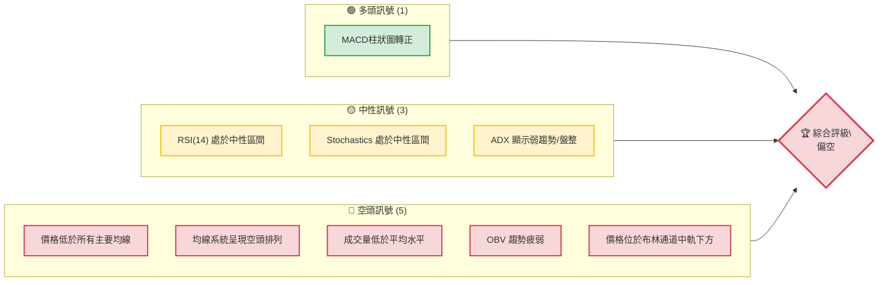
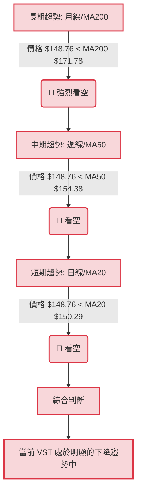

<details>
<summary>📊 靜態圖表 (點擊展開)</summary>

</details>

<html>
<head><meta charset="utf-8" /></head>
<body>
    <div style="height:500px; width:100%;">                        <script>window.PlotlyConfig = {MathJaxConfig: 'local'};</script>
        <script charset="utf-8" src="https://cdn.plot.ly/plotly-3.6.0.min.js" integrity="sha256-QaOVwtVY0T02VaHrr6pnoHLCwayMJp4O5n4YyaE3rJk=" crossorigin="anonymous"></script>                <div id="candlestick-chart" class="plotly-graph-div" style="height:100%; width:100%;"></div>            <script>                window.PLOTLYENV=window.PLOTLYENV || {};                                if (document.getElementById("candlestick-chart")) {                    Plotly.newPlot(                        "candlestick-chart",                        [{"close":{"dtype":"f8","bdata":"AAAA4IEFaEAAAABAq7FnQAAAACBot2dAAAAAIEurZ0AAAADA9EtoQAAAAGBhO2hAAAAAoFJ+aEAAAABAX4xnQAAAAAAtI2dAAAAAANBsZ0AAAADAIqBnQAAAAOD8aGdAAAAAYE5pZ0AAAACgPSFoQAAAAKAcDWpAAAAAoJ9oaUAAAABguxxqQAAAACCBlmpAAAAAACAUakAAAAAAbPBpQAAAACBlK2pAAAAAQFlWakAAAACAPiprQAAAAGCwdWlAAAAAAB8waUAAAABgFCJpQAAAAGDJ1GlAAAAA4KSsaEAAAACgLmxoQAAAAMCRHmlAAAAA4PJCaUAAAABA4y1pQAAAAGB3+2hAAAAAYEHiaEAAAADgZ79pQAAAAICALWpAAAAA4C2KaEAAAABAJB9qQAAAAKA3nmlAAAAAgKBIakAAAAAgRDpqQAAAAMB2GWlAAAAAAJI2aEAAAADANUBnQAAAAOAwKmdAAAAAgPvaZ0AAAAAASx1pQAAAAGAL2GhAAAAAYBfCZ0AAAAAgR9poQAAAAGACpmdAAAAAYAN5Z0AAAACARhBoQAAAAKBRJ2dAAAAAIMybZ0AAAADAkwNnQAAAAOAsz2dAAAAAAGB4Z0AAAACgVlVmQAAAAODvOGZAAAAAwM5iZUAAAAAgscZlQAAAAKCV0GVAAAAAYBO+ZUAAAABAs1RmQAAAAID4qWVAAAAAgAcEZUAAAABgDdVlQAAAAMDUS2VAAAAAwAYKZkAAAADAw0tmQAAAAEAvpWVAAAAAgGaCZUAAAAAArmVlQAAAAAC78mVAAAAAALfWZEAAAADgNLVkQAAAAABni2RAAAAAAOSWZEAAAADg0cNlQAAAAIA3NGVAAAAA4C35ZEAAAAAAH59lQAAAAODy8GNAAAAAgM22ZEAAAABgmVJkQAAAAGAyK2RAAAAAgGQuZEAAAAAAqTdkQAAAAIBkLmRAAAAAINMzZEAAAABAwExkQAAAAACHI2RAAAAAQCigZEAAAABAqFZkQAAAAOCRKWVAAAAAAHZMY0AAAACgosxiQAAAAGCWxGRAAAAAgAmLZUAAAACg92VlQAAAAKCsF2VAAAAAwOd9ZkAAAAAA8MtkQAAAAIAVk2NAAAAAIKr5Y0AAAACAhwRkQAAAACDc\u002fGNAAAAAQP\u002fSY0AAAADAKIFkQAAAAGBCrWRAAAAAAHlLZEAAAAAgTMRjQAAAAGCYQWNAAAAAoFQZY0AAAABgbcphQAAAAOAA3GFAAAAAwEauYkAAAAAgXxhjQAAAACA+7GNAAAAAgNH9Y0AAAAAgF1xkQAAAAGA0aGVAAAAAQDCuZUAAAAAAzkplQAAAAAB7iGVAAAAAAFRlZUAAAAAASfJkQAAAAMBbbGVAAAAAIODjZUAAAABAiBJmQAAAAGDmtGVAAAAAwHG4ZEAAAADgWS9kQAAAACBmZGRAAAAAoIDlZEAAAABA4s1jQAAAAAC1bGRAAAAAIKKFZEAAAACgLt5jQAAAAICa62NAAAAAgHjXY0AAAABgnjhkQAAAAIBlg2RAAAAAgGw8ZUAAAABAi+RkQAAAAOCjQGJAAAAAoEfpYkAAAABAChdjQAAAAOBR8GJAAAAAoJkJY0AAAAAgXG9jQAAAAKBHcWJAAAAAYI\u002fKYkAAAABguD5jQAAAAIDC5WJAAAAAQOHyYkAAAACAwjVjQAAAAOB6fGNAAAAAAAAYY0AAAAAgXFdjQAAAAGBmxmNAAAAAQAp\u002fZEAAAACAFF5kQAAAAMD1sGRAAAAAYLhuZEAAAABAM\u002fNjQAAAAMAeXWNAAAAAoEd5Y0AAAABAM5tjQAAAAEAzi2RAAAAAYI\u002fSZEAAAAAA1yNkQAAAAKBHOWNAAAAAQOG6Y0AAAADA9WhjQAAAAEAzG2RAAAAAACkMZEAAAACgR8ljQAAAAGBmPmNAAAAAQAp3YkAAAACgmQFjQAAAAADXW2JAAAAAIIXTYUAAAADAzLxhQAAAAIDCdWFAAAAAAAAYYUAAAABguNZgQAAAAAAAAGJAAAAAYI+iYkAAAADgo4hjQAAAAIDrkWRAAAAAwMwEZEAAAADA9QhkQAAAACBcB2RAAAAA4FFYY0AAAABACr9jQAAAAKCZOWNAAAAAYGY2Y0AAAADgUZhiQA=="},"high":{"dtype":"f8","bdata":"UnIP\u002fgIUaEBT5iB0r31oQA4jINERWGhAaD+Ti5w9aEADv1zk2VxoQFbBFxbbj2hAct4mmYITaUBKYfnOZl9oQNk3cvhIRWdAVWxtJoV6Z0D2eJMrAexnQNV\u002foWxs1mdADDXrP2+6Z0C2aX\u002f6EVhoQCJBdj8agmpAmApXxNxiakCNRcQcJi1qQIHsPsAgImtAow7EMG6fakDf3sYXbp9qQD\u002f3CQF4tGpAUWI5BQuoakC09I+H4GZrQJYkceG8hWpAISpqT9KzaUDp\u002fX63U3ZpQMTVmc+43WlAgnZhlNHRaUACj4q4Vv5oQCrZtUC1i2lABBmJIfGNaUCCf1td4jNqQJ0\u002fXYtx62lAvSOIssNoaUBAf6QFUsFpQM3MD9+lT2pAwBvB\u002fiF5akByfuf65ytqQMJZyK7NCGpAxxCHExfuakDx+0+JExBrQL3qBfAYL2pAG9Uc9uWdaUCNUcfmZhxoQEtYqr1On2dAeHJyKHj1Z0BNzlrMNC5pQK6RZC4uY2lAAEg\u002f+bKYaEDikNiUrQVpQEcEThG6yGhAddJWHn0LaECj9Dfk4lRoQAXW5vXP3mdA9qnZ7j7+Z0DmAPhFLpNnQO7RDI+R0WdAWE5Nv0OIaEA6yPthhm1nQPiYX0yhmWZAEspWTQsvZkCIOYzhJHBmQBzDF5LTYGZA\u002fIBAuc8dZkCHsiAoA6BmQGeW7vWamGdAo+gd+HWmZUDRT6OF99ZlQJ0Teef3x2VAzD\u002fPs1coZkAn7LRtt4hmQFLLFnXQ\u002f2VAf8zlk+buZUCWL6Hj4qtlQCwHiHnqMWZAYsAeDpoEZkAmhNsJdetkQPU4aT4nLmVAibAHFQSyZEBee931Es1lQNlLZAElcGZAvk6RwsKQZUAClQZNcK5lQB+PYmkN1WVADpV51ktuZUBu7URnBV5lQND88MvBgmRAfju8mENvZEDmWn8GoktkQJFmeQjlWGRAUYub6T1\u002fZEAjDP7Wz1pkQIR+yD\u002fUiGRASAfhrZQhZUAQqKwhem1lQHTW7eD+i2VA18+\u002ftXINZUC35XH4znJjQNaSChgQ0GVAGVPD0\u002fkPZkAnF71mwOZlQNZQaTZMXmVApqueMPbJZkD1RJ1OYVxlQPQyhnDDuGRA+8ucgEw4ZECPOxxV32hkQP9bpG+9VGRAsS19traiZEDZfoDbqYxkQBeNqbuoymRAG4NAetf0ZEBnE1I+1IhkQANilMpi+GNAQUFBkS2JY0Buuu7tay5jQNv1N8DY9mFACIbAv64BY0DkXwtEK3JjQIhFYzBnJmRAO\u002flFqraiZEABFzOLeb9kQI2JVxqjbWVA50HoWhkNZkD4W6l7WehlQGiUALi3imVAKjSZ0G+oZUDN8QqKY3NlQDqMl5RGbmVAcw75Bmn2ZUCtRbdMoh9mQMEv+awlQmZAB19o\u002ffEIZkCTavfT1GlkQPZSsuOPf2RA3jCQw7f3ZEDE0kfq0QRlQC\u002fvcLr7jGRA+qZ8AuwRZUBi6qgZiHhkQGrTCRpJX2RAqIvEDXqgZEAVRiVm32hkQCqXtOOBp2RAGGQcXHWYZUCGNkmdzitlQAAAAEAKz2RAAAAAwMx8Y0AAAABAM0NjQAAAAGBmvmNAAAAAoHAVY0AAAABgZgZkQAAAAIDC3WNAAAAAQArvYkAAAABA4YpjQAAAAIDrUWNAAAAAIFwjY0AAAADAHkVjQAAAAIDrKWRAAAAAwPVQZEAAAAAAKdRjQAAAAEAKF2RAAAAAwPWoZEAAAADgo9BkQAAAAKBw3WRAAAAAIK4PZUAAAACgmYFkQAAAAEAzI2RAAAAAYI\u002fiY0AAAAAA19tjQAAAACBcr2RAAAAAoHANZUAAAABgZmpkQAAAAMByJGRAAAAAACn0Y0AAAADgegRkQAAAAAApTGRAAAAAoJl5ZEAAAAAgrl9kQAAAAOB6DGVAAAAAAABgY0AAAAAAABhjQAAAAABWymJAAAAAwPVIYkAAAACgcOlhQAAAAEDhomFAAAAAoEdxYUAAAABgZhZhQAAAAMDMHGJAAAAAwPWoYkAAAACAPbJjQAAAAMDM7GRAAAAAQLSgZEAAAADA9XBkQAAAAKBHSWRAAAAAoJnRY0AAAADA9RhkQAAAAMAevWNAAAAAoEdBY0AAAACgR0ljQA=="},"hovertemplate":"\u003cb\u003e%{x|%Y-%m-%d}\u003c\u002fb\u003e\u003cbr\u003e\u958b: $%{open:.2f}\u003cbr\u003e\u9ad8: $%{high:.2f}\u003cbr\u003e\u4f4e: $%{low:.2f}\u003cbr\u003e\u6536: $%{close:.2f}\u003cextra\u003e\u003c\u002fextra\u003e","low":{"dtype":"f8","bdata":"8HubRbLkZkAomhxGvqhnQCxuIamSTWdAKJQP0W2SZ0CbP7fOBZRnQJg4zJJs8WdAslqybQQ8aEBLBlDF6D5nQGKRsVGXrGZAhYeUs1D0ZkDvOHvEXIJnQH0HMULrN2ZAxnzkKuz8ZkDulI1zj49nQBg3NNqE52hAHDDCBFdKaUBqN9TXlydpQOubpFO7HGpASDENDqzQaUCUO60vY3xpQCwOlx4i6GlAHRD0V9CTaUDJlQ21S+dpQH9o6TbMXGlA8n\u002fbyA4qaUAO9hTCDW9oQKD\u002fy\u002fanDWlAziSHKfykaEDg9AwWmsVnQCn60B6D9GdAzPBXWTfFaEC1NbQsQB5pQCoEgFNenGhA5V5XehBraEDvjxh3b\u002fJoQADAEhKimGlA9G17c4qJaECWcGy1JftoQDOoNS4PG2lAE7h5WZ66aUBrpUZygQNqQCafwHD672hAH2BwMNcIaECcdkXM5CFnQJgSPJz5ZGZA7crJglwmZ0AzXf7rDkJoQEy2++OwfmhA7YgWYsr+ZkDa4bifWZ5nQNvNUAKsgGdA72SHanngZkC7sG1ghmpnQHRCaXa\u002f\u002f2ZAP4\u002fCUngNZ0BHxQRIJWFmQEt4u9mkA2ZA9hAc6OX0ZkCtd4xEK0pmQJBobLmpGWZA1PnIk55BZUDws8Bv+aNkQN1nPAWXlGVAweohShZGZUD1xUqSsbdlQBAiI8LolGVAEkYcb8U\u002fZECfv\u002fWdL65kQAT1LolYrmRAF2ceRnmTZUCr1QOrozBmQGjfM0zehmVAWBr4uJVcZUCszbaChA9lQHo3+iIOQGVAKzXhaGDAZEDj\u002f1TUd3NkQNG\u002f1m3ZiGRAprcZJ9PGY0B4MU73IhJkQLGNS+E+4WRAx1Wmo6bQZEDLIBPZ7cJkQKjUlaNryGNAtR\u002fBbBxHZECaSQ9xEUhkQI3YBCkwFGRAXfhsDy79Y0C1ZWjwrPFjQDMY7to1BGRAYXXooZj2Y0BKt6Eo5hpkQNJoQRoDIGRAVx0g9FV1ZEDPL9XTGP9jQEDF0wrScWRAl11DNJYqY0CHWieck59iQPeJ1dfttGRAXKisWmh7ZECriRsyy1JlQBWO9pVcumRAQWxzm0ZuZUA2bnywNllkQJkZ5D8wgWNAZ4JE3+8xY0D5fvSg3N1jQNsZhsgcuWNADPS9p+q1Y0DLrt7P571jQFwE4D4YHmRAAYbBTz3RY0BwLr2grpRjQAafEtE+OmNAVZV\u002f+vzFYkAe+vukkWJhQLH8U8rrSmFA13emggNnYkCxLHSLhHJiQC4cx9QrU2NAZnMMO7DKY0Duk4bBzgVkQDtB4Lv1KGRAon5YwP02ZUDQy5xWICxlQLYDc22qAGVAg+prCKIYZUCox2ynhJ9kQJ8qbEkPVWRAqQ6cTCU7ZUDsZNq2XXxkQP8zYtoHVWVAiR4byVSzZEAugLPvsBhjQIIDK8jOBWRAX5dMNbYuZECnA+QHs8JjQHcm\u002fjI+WWNAuCtn75iCZEAx08lfCV5jQMVO4qORj2NA0yJ73XuwY0Ce0OxaivxjQOJzvMnFPGRAWX3eDsmoZEAxYWBqM4BkQAAAAGCPGmJAAAAAYLiqYkAAAACgmbFiQAAAAAApzGJAAAAAIK5PYkAAAAAAAPhiQAAAAEAzU2JAAAAAQOHKYUAAAADAzOxiQAAAAADXw2JAAAAAACm8YkAAAADA9chiQAAAAKBHaWNAAAAAgMIVY0AAAAAghSNjQAAAAMDMFGNAAAAAQAoLZEAAAADAzERkQAAAACCFU2RAAAAA4FFIZEAAAACAPcpjQAAAAAApRGNAAAAAoHBdY0AAAAAAAFBjQAAAAMDMZGNAAAAAIIXXY0AAAABACtdjQAAAAGCPImNAAAAAIFx3Y0AAAACAwl1jQAAAAIAUrmNAAAAAoJn5Y0AAAABAM5NjQAAAAOCjOGNAAAAAIFxfYkAAAABg5UhiQAAAAMAeNWJAAAAA4FFwYUAAAAAAgX1hQAAAAIDrOWFAAAAAIIW7YEAAAADAHpVgQAAAAIDrOWFAAAAAACkcYkAAAAAAANhiQAAAAEAKx2NAAAAAYA7NY0AAAABAM7NjQAAAAAApnGNAAAAAYI\u002fqYkAAAAAAKRxjQAAAAGBmHmNAAAAAgBTGYkAAAAAAAHBiQA=="},"name":"\u50f9\u683c","open":{"dtype":"f8","bdata":"jUSx+Z7IZ0AFJoZEYAhoQLicF1EVzWdA46QdoNXZZ0BtfZ12FrdnQCAnHWZ0MmhA95nxoIFOaEDDGNzyqVloQHR\u002fn5sC+2ZAW4zXbjspZ0DShwiA3YhnQLmCmF62sGdA4NgoPaybZ0Da8mJSvqhnQMyXwW4Y+GhAJ4KOiGf\u002faUBaI8vrwkRpQOubpFO7HGpAow7EMG6fakD93aaWk09qQLmcgCrPj2pA0ysXniJbakAjYwDsaU1qQOuArQADMWpAMAmWUGpWaUCIvPABj65oQL+lwUCtFGlApmwJ0jQuaUD17ebCiNRoQMVxg63STmhAot6aZ05vaUBF9i8oM3lpQEQOc7X1smlAce575nsgaUDVfh2zzSBpQGZmZibEzWlArpL1udclakC7Fvu4HxJpQJmInw8np2lA46qHQM0XakByldkAXMZqQBsnfZsl42lA9fvX2i1yaUCqCCB0KwtoQLqaslYUYWdA7crJglwmZ0CPvyLS4YFoQK6RZC4uY2lAAEg\u002f+bKYaED5HGQuqfhnQNtKAG2cRGhA4vo6UBbvZ0B8IYmpHMlnQK\u002fk+4ehcmdAOF\u002fqtOk3Z0CNyhWjXsxmQOesQcFGQGZAnfz\u002f2HBIaEDI4EEPEC1nQPwpA+ysemZAO9foWokNZkC4Dg57CNdkQBbfqG1O3mVAaetMMOmFZUDpYNLfsNVlQMAiU6P1CWdAVK1+WtlwZUAYHTWbTSNlQI110M85s2VAHc7\u002fQ6ywZUBai8t3O1BmQEGGV87Q8GVAyx8OW1ndZUA\u002f9Vk56YVlQA+hY0mobWVANy4faRcBZkAmhNsJdetkQCVON99FnWRA4aWfylCcZEBrvlJDUzNkQO7xz5731mVAfThyCXyPZUArDNa3HsZkQAQwxeT9sGVA2vIWIIemZEDFDo49t8dkQN0DmMHZeGRA2e6mfTIrZEA8eBqTqRhkQAAAAIBkLmRABdHSP\u002fsYZECj2DYr8DhkQOM3URdhVWRAVx0g9FV1ZEAV4anhdCRlQNIXHwqiGGVA18+\u002ftXINZUBzFrd7O2FjQOFpXev1wmVAtX4uBUOOZEChQTg1arhlQBMRIpAYJWVArVVaYHWYZUDj0+fFS+pkQMSk7xmcIWRA1WtwZWPZY0BEspNaszZkQPEWz3YG+WNA+HbQIuELZEBPBHDCXeljQIYohHvDuGRAKFyOR3y3ZECMiOe49ShkQMEaJGvtrWNAzs3Yzgh9Y0AcBrDsZh9jQIkyy3namWFAUlEaGHa5YkDy\u002fxIFdrliQOUne7LOBWRAZn\u002fpn86YZEB0rsJyWhBkQOQevHC4RWRAMDlg\u002f7VUZUDGHWn8u7hlQGGuIae2NWVAaynP1BaCZUB2B1iOCk1lQGzbAe+q4WRAVOmmQaWEZUAwTonODGRlQIjR9Bxf2GVAcCWzBPs+ZUAsgo0cCC9kQPqHjwDWK2RABu3jeRo1ZEB42\u002fAlO4dkQOO4vucAdmNAi85qyU+kZECoMc+TEWxkQOiRP2a2m2NAUBz7o0QxZEB4i1BM+xhkQGtpepbSUmRA19GkRMawZEATW1obJ95kQAAAAEAKz2RAAAAAYGbuYkAAAACgmdFiQAAAAAAAYGNAAAAAAACwYkAAAAAAAPhiQAAAAEAzo2NAAAAAwMz8YUAAAABACu9iQAAAAGC45mJAAAAAoEfhYkAAAACAPeJiQAAAAAAAGGRAAAAA4Hp8Y0AAAAAAADBjQAAAAMDMFGNAAAAAwB5NZEAAAAAAALBkQAAAAIA9kmRAAAAA4FHIZEAAAACgmWFkQAAAAOBRGGRAAAAAoJm5Y0AAAABguH5jQAAAAGCPimNAAAAAAACgZEAAAAAAAFBkQAAAACCFG2RAAAAAoEeJY0AAAACA68ljQAAAAIAUtmNAAAAAAABgZEAAAAAA1y9kQAAAAKBHYWRAAAAAAABgY0AAAAAAAIBiQAAAACCur2JAAAAAwPVIYkAAAAAAKaxhQAAAAMDMeGFAAAAAAABgYUAAAACgmflgQAAAAAAAQGFAAAAAQAovYkAAAADA9eBiQAAAAMAe3WNAAAAAYLieZEAAAABA4dpjQAAAAAAAAGRAAAAAAACgY0AAAACAFH5jQAAAAOBRkGNAAAAAoEfxYkAAAAAAAABjQA=="},"x":["2025-08-20T00:00:00-04:00","2025-08-21T00:00:00-04:00","2025-08-22T00:00:00-04:00","2025-08-25T00:00:00-04:00","2025-08-26T00:00:00-04:00","2025-08-27T00:00:00-04:00","2025-08-28T00:00:00-04:00","2025-08-29T00:00:00-04:00","2025-09-02T00:00:00-04:00","2025-09-03T00:00:00-04:00","2025-09-04T00:00:00-04:00","2025-09-05T00:00:00-04:00","2025-09-08T00:00:00-04:00","2025-09-09T00:00:00-04:00","2025-09-10T00:00:00-04:00","2025-09-11T00:00:00-04:00","2025-09-12T00:00:00-04:00","2025-09-15T00:00:00-04:00","2025-09-16T00:00:00-04:00","2025-09-17T00:00:00-04:00","2025-09-18T00:00:00-04:00","2025-09-19T00:00:00-04:00","2025-09-22T00:00:00-04:00","2025-09-23T00:00:00-04:00","2025-09-24T00:00:00-04:00","2025-09-25T00:00:00-04:00","2025-09-26T00:00:00-04:00","2025-09-29T00:00:00-04:00","2025-09-30T00:00:00-04:00","2025-10-01T00:00:00-04:00","2025-10-02T00:00:00-04:00","2025-10-03T00:00:00-04:00","2025-10-06T00:00:00-04:00","2025-10-07T00:00:00-04:00","2025-10-08T00:00:00-04:00","2025-10-09T00:00:00-04:00","2025-10-10T00:00:00-04:00","2025-10-13T00:00:00-04:00","2025-10-14T00:00:00-04:00","2025-10-15T00:00:00-04:00","2025-10-16T00:00:00-04:00","2025-10-17T00:00:00-04:00","2025-10-20T00:00:00-04:00","2025-10-21T00:00:00-04:00","2025-10-22T00:00:00-04:00","2025-10-23T00:00:00-04:00","2025-10-24T00:00:00-04:00","2025-10-27T00:00:00-04:00","2025-10-28T00:00:00-04:00","2025-10-29T00:00:00-04:00","2025-10-30T00:00:00-04:00","2025-10-31T00:00:00-04:00","2025-11-03T00:00:00-05:00","2025-11-04T00:00:00-05:00","2025-11-05T00:00:00-05:00","2025-11-06T00:00:00-05:00","2025-11-07T00:00:00-05:00","2025-11-10T00:00:00-05:00","2025-11-11T00:00:00-05:00","2025-11-12T00:00:00-05:00","2025-11-13T00:00:00-05:00","2025-11-14T00:00:00-05:00","2025-11-17T00:00:00-05:00","2025-11-18T00:00:00-05:00","2025-11-19T00:00:00-05:00","2025-11-20T00:00:00-05:00","2025-11-21T00:00:00-05:00","2025-11-24T00:00:00-05:00","2025-11-25T00:00:00-05:00","2025-11-26T00:00:00-05:00","2025-11-28T00:00:00-05:00","2025-12-01T00:00:00-05:00","2025-12-02T00:00:00-05:00","2025-12-03T00:00:00-05:00","2025-12-04T00:00:00-05:00","2025-12-05T00:00:00-05:00","2025-12-08T00:00:00-05:00","2025-12-09T00:00:00-05:00","2025-12-10T00:00:00-05:00","2025-12-11T00:00:00-05:00","2025-12-12T00:00:00-05:00","2025-12-15T00:00:00-05:00","2025-12-16T00:00:00-05:00","2025-12-17T00:00:00-05:00","2025-12-18T00:00:00-05:00","2025-12-19T00:00:00-05:00","2025-12-22T00:00:00-05:00","2025-12-23T00:00:00-05:00","2025-12-24T00:00:00-05:00","2025-12-26T00:00:00-05:00","2025-12-29T00:00:00-05:00","2025-12-30T00:00:00-05:00","2025-12-31T00:00:00-05:00","2026-01-02T00:00:00-05:00","2026-01-05T00:00:00-05:00","2026-01-06T00:00:00-05:00","2026-01-07T00:00:00-05:00","2026-01-08T00:00:00-05:00","2026-01-09T00:00:00-05:00","2026-01-12T00:00:00-05:00","2026-01-13T00:00:00-05:00","2026-01-14T00:00:00-05:00","2026-01-15T00:00:00-05:00","2026-01-16T00:00:00-05:00","2026-01-20T00:00:00-05:00","2026-01-21T00:00:00-05:00","2026-01-22T00:00:00-05:00","2026-01-23T00:00:00-05:00","2026-01-26T00:00:00-05:00","2026-01-27T00:00:00-05:00","2026-01-28T00:00:00-05:00","2026-01-29T00:00:00-05:00","2026-01-30T00:00:00-05:00","2026-02-02T00:00:00-05:00","2026-02-03T00:00:00-05:00","2026-02-04T00:00:00-05:00","2026-02-05T00:00:00-05:00","2026-02-06T00:00:00-05:00","2026-02-09T00:00:00-05:00","2026-02-10T00:00:00-05:00","2026-02-11T00:00:00-05:00","2026-02-12T00:00:00-05:00","2026-02-13T00:00:00-05:00","2026-02-17T00:00:00-05:00","2026-02-18T00:00:00-05:00","2026-02-19T00:00:00-05:00","2026-02-20T00:00:00-05:00","2026-02-23T00:00:00-05:00","2026-02-24T00:00:00-05:00","2026-02-25T00:00:00-05:00","2026-02-26T00:00:00-05:00","2026-02-27T00:00:00-05:00","2026-03-02T00:00:00-05:00","2026-03-03T00:00:00-05:00","2026-03-04T00:00:00-05:00","2026-03-05T00:00:00-05:00","2026-03-06T00:00:00-05:00","2026-03-09T00:00:00-04:00","2026-03-10T00:00:00-04:00","2026-03-11T00:00:00-04:00","2026-03-12T00:00:00-04:00","2026-03-13T00:00:00-04:00","2026-03-16T00:00:00-04:00","2026-03-17T00:00:00-04:00","2026-03-18T00:00:00-04:00","2026-03-19T00:00:00-04:00","2026-03-20T00:00:00-04:00","2026-03-23T00:00:00-04:00","2026-03-24T00:00:00-04:00","2026-03-25T00:00:00-04:00","2026-03-26T00:00:00-04:00","2026-03-27T00:00:00-04:00","2026-03-30T00:00:00-04:00","2026-03-31T00:00:00-04:00","2026-04-01T00:00:00-04:00","2026-04-02T00:00:00-04:00","2026-04-06T00:00:00-04:00","2026-04-07T00:00:00-04:00","2026-04-08T00:00:00-04:00","2026-04-09T00:00:00-04:00","2026-04-10T00:00:00-04:00","2026-04-13T00:00:00-04:00","2026-04-14T00:00:00-04:00","2026-04-15T00:00:00-04:00","2026-04-16T00:00:00-04:00","2026-04-17T00:00:00-04:00","2026-04-20T00:00:00-04:00","2026-04-21T00:00:00-04:00","2026-04-22T00:00:00-04:00","2026-04-23T00:00:00-04:00","2026-04-24T00:00:00-04:00","2026-04-27T00:00:00-04:00","2026-04-28T00:00:00-04:00","2026-04-29T00:00:00-04:00","2026-04-30T00:00:00-04:00","2026-05-01T00:00:00-04:00","2026-05-04T00:00:00-04:00","2026-05-05T00:00:00-04:00","2026-05-06T00:00:00-04:00","2026-05-07T00:00:00-04:00","2026-05-08T00:00:00-04:00","2026-05-11T00:00:00-04:00","2026-05-12T00:00:00-04:00","2026-05-13T00:00:00-04:00","2026-05-14T00:00:00-04:00","2026-05-15T00:00:00-04:00","2026-05-18T00:00:00-04:00","2026-05-19T00:00:00-04:00","2026-05-20T00:00:00-04:00","2026-05-21T00:00:00-04:00","2026-05-22T00:00:00-04:00","2026-05-26T00:00:00-04:00","2026-05-27T00:00:00-04:00","2026-05-28T00:00:00-04:00","2026-05-29T00:00:00-04:00","2026-06-01T00:00:00-04:00","2026-06-02T00:00:00-04:00","2026-06-03T00:00:00-04:00","2026-06-04T00:00:00-04:00","2026-06-05T00:00:00-04:00"],"type":"candlestick"},{"hovertemplate":"MA30: $%{y:.2f}\u003cextra\u003e\u003c\u002fextra\u003e","line":{"color":"#2196F3","dash":"dash","width":2},"mode":"lines","name":"MA30","x":["2025-08-20T00:00:00-04:00","2025-08-21T00:00:00-04:00","2025-08-22T00:00:00-04:00","2025-08-25T00:00:00-04:00","2025-08-26T00:00:00-04:00","2025-08-27T00:00:00-04:00","2025-08-28T00:00:00-04:00","2025-08-29T00:00:00-04:00","2025-09-02T00:00:00-04:00","2025-09-03T00:00:00-04:00","2025-09-04T00:00:00-04:00","2025-09-05T00:00:00-04:00","2025-09-08T00:00:00-04:00","2025-09-09T00:00:00-04:00","2025-09-10T00:00:00-04:00","2025-09-11T00:00:00-04:00","2025-09-12T00:00:00-04:00","2025-09-15T00:00:00-04:00","2025-09-16T00:00:00-04:00","2025-09-17T00:00:00-04:00","2025-09-18T00:00:00-04:00","2025-09-19T00:00:00-04:00","2025-09-22T00:00:00-04:00","2025-09-23T00:00:00-04:00","2025-09-24T00:00:00-04:00","2025-09-25T00:00:00-04:00","2025-09-26T00:00:00-04:00","2025-09-29T00:00:00-04:00","2025-09-30T00:00:00-04:00","2025-10-01T00:00:00-04:00","2025-10-02T00:00:00-04:00","2025-10-03T00:00:00-04:00","2025-10-06T00:00:00-04:00","2025-10-07T00:00:00-04:00","2025-10-08T00:00:00-04:00","2025-10-09T00:00:00-04:00","2025-10-10T00:00:00-04:00","2025-10-13T00:00:00-04:00","2025-10-14T00:00:00-04:00","2025-10-15T00:00:00-04:00","2025-10-16T00:00:00-04:00","2025-10-17T00:00:00-04:00","2025-10-20T00:00:00-04:00","2025-10-21T00:00:00-04:00","2025-10-22T00:00:00-04:00","2025-10-23T00:00:00-04:00","2025-10-24T00:00:00-04:00","2025-10-27T00:00:00-04:00","2025-10-28T00:00:00-04:00","2025-10-29T00:00:00-04:00","2025-10-30T00:00:00-04:00","2025-10-31T00:00:00-04:00","2025-11-03T00:00:00-05:00","2025-11-04T00:00:00-05:00","2025-11-05T00:00:00-05:00","2025-11-06T00:00:00-05:00","2025-11-07T00:00:00-05:00","2025-11-10T00:00:00-05:00","2025-11-11T00:00:00-05:00","2025-11-12T00:00:00-05:00","2025-11-13T00:00:00-05:00","2025-11-14T00:00:00-05:00","2025-11-17T00:00:00-05:00","2025-11-18T00:00:00-05:00","2025-11-19T00:00:00-05:00","2025-11-20T00:00:00-05:00","2025-11-21T00:00:00-05:00","2025-11-24T00:00:00-05:00","2025-11-25T00:00:00-05:00","2025-11-26T00:00:00-05:00","2025-11-28T00:00:00-05:00","2025-12-01T00:00:00-05:00","2025-12-02T00:00:00-05:00","2025-12-03T00:00:00-05:00","2025-12-04T00:00:00-05:00","2025-12-05T00:00:00-05:00","2025-12-08T00:00:00-05:00","2025-12-09T00:00:00-05:00","2025-12-10T00:00:00-05:00","2025-12-11T00:00:00-05:00","2025-12-12T00:00:00-05:00","2025-12-15T00:00:00-05:00","2025-12-16T00:00:00-05:00","2025-12-17T00:00:00-05:00","2025-12-18T00:00:00-05:00","2025-12-19T00:00:00-05:00","2025-12-22T00:00:00-05:00","2025-12-23T00:00:00-05:00","2025-12-24T00:00:00-05:00","2025-12-26T00:00:00-05:00","2025-12-29T00:00:00-05:00","2025-12-30T00:00:00-05:00","2025-12-31T00:00:00-05:00","2026-01-02T00:00:00-05:00","2026-01-05T00:00:00-05:00","2026-01-06T00:00:00-05:00","2026-01-07T00:00:00-05:00","2026-01-08T00:00:00-05:00","2026-01-09T00:00:00-05:00","2026-01-12T00:00:00-05:00","2026-01-13T00:00:00-05:00","2026-01-14T00:00:00-05:00","2026-01-15T00:00:00-05:00","2026-01-16T00:00:00-05:00","2026-01-20T00:00:00-05:00","2026-01-21T00:00:00-05:00","2026-01-22T00:00:00-05:00","2026-01-23T00:00:00-05:00","2026-01-26T00:00:00-05:00","2026-01-27T00:00:00-05:00","2026-01-28T00:00:00-05:00","2026-01-29T00:00:00-05:00","2026-01-30T00:00:00-05:00","2026-02-02T00:00:00-05:00","2026-02-03T00:00:00-05:00","2026-02-04T00:00:00-05:00","2026-02-05T00:00:00-05:00","2026-02-06T00:00:00-05:00","2026-02-09T00:00:00-05:00","2026-02-10T00:00:00-05:00","2026-02-11T00:00:00-05:00","2026-02-12T00:00:00-05:00","2026-02-13T00:00:00-05:00","2026-02-17T00:00:00-05:00","2026-02-18T00:00:00-05:00","2026-02-19T00:00:00-05:00","2026-02-20T00:00:00-05:00","2026-02-23T00:00:00-05:00","2026-02-24T00:00:00-05:00","2026-02-25T00:00:00-05:00","2026-02-26T00:00:00-05:00","2026-02-27T00:00:00-05:00","2026-03-02T00:00:00-05:00","2026-03-03T00:00:00-05:00","2026-03-04T00:00:00-05:00","2026-03-05T00:00:00-05:00","2026-03-06T00:00:00-05:00","2026-03-09T00:00:00-04:00","2026-03-10T00:00:00-04:00","2026-03-11T00:00:00-04:00","2026-03-12T00:00:00-04:00","2026-03-13T00:00:00-04:00","2026-03-16T00:00:00-04:00","2026-03-17T00:00:00-04:00","2026-03-18T00:00:00-04:00","2026-03-19T00:00:00-04:00","2026-03-20T00:00:00-04:00","2026-03-23T00:00:00-04:00","2026-03-24T00:00:00-04:00","2026-03-25T00:00:00-04:00","2026-03-26T00:00:00-04:00","2026-03-27T00:00:00-04:00","2026-03-30T00:00:00-04:00","2026-03-31T00:00:00-04:00","2026-04-01T00:00:00-04:00","2026-04-02T00:00:00-04:00","2026-04-06T00:00:00-04:00","2026-04-07T00:00:00-04:00","2026-04-08T00:00:00-04:00","2026-04-09T00:00:00-04:00","2026-04-10T00:00:00-04:00","2026-04-13T00:00:00-04:00","2026-04-14T00:00:00-04:00","2026-04-15T00:00:00-04:00","2026-04-16T00:00:00-04:00","2026-04-17T00:00:00-04:00","2026-04-20T00:00:00-04:00","2026-04-21T00:00:00-04:00","2026-04-22T00:00:00-04:00","2026-04-23T00:00:00-04:00","2026-04-24T00:00:00-04:00","2026-04-27T00:00:00-04:00","2026-04-28T00:00:00-04:00","2026-04-29T00:00:00-04:00","2026-04-30T00:00:00-04:00","2026-05-01T00:00:00-04:00","2026-05-04T00:00:00-04:00","2026-05-05T00:00:00-04:00","2026-05-06T00:00:00-04:00","2026-05-07T00:00:00-04:00","2026-05-08T00:00:00-04:00","2026-05-11T00:00:00-04:00","2026-05-12T00:00:00-04:00","2026-05-13T00:00:00-04:00","2026-05-14T00:00:00-04:00","2026-05-15T00:00:00-04:00","2026-05-18T00:00:00-04:00","2026-05-19T00:00:00-04:00","2026-05-20T00:00:00-04:00","2026-05-21T00:00:00-04:00","2026-05-22T00:00:00-04:00","2026-05-26T00:00:00-04:00","2026-05-27T00:00:00-04:00","2026-05-28T00:00:00-04:00","2026-05-29T00:00:00-04:00","2026-06-01T00:00:00-04:00","2026-06-02T00:00:00-04:00","2026-06-03T00:00:00-04:00","2026-06-04T00:00:00-04:00","2026-06-05T00:00:00-04:00"],"y":{"dtype":"f8","bdata":"AAAAAAAA+H8AAAAAAAD4fwAAAAAAAPh\u002fAAAAAAAA+H8AAAAAAAD4fwAAAAAAAPh\u002fAAAAAAAA+H8AAAAAAAD4fwAAAAAAAPh\u002fAAAAAAAA+H8AAAAAAAD4fwAAAAAAAPh\u002fAAAAAAAA+H8AAAAAAAD4fwAAAAAAAPh\u002fAAAAAAAA+H8AAAAAAAD4fwAAAAAAAPh\u002fAAAAAAAA+H8AAAAAAAD4fwAAAAAAAPh\u002fAAAAAAAA+H8AAAAAAAD4fwAAAAAAAPh\u002fAAAAAAAA+H8AAAAAAAD4fwAAAAAAAPh\u002fAAAAAAAA+H8AAAAAAAD4fzMzM7P40GhAiYiIiI3baEAREREROuhoQAAAAGAH82hAq6qq6mT9aEDv7u6exglpQCIiIkJhGmlA7+7ubsYaaUDv7u7uuzBpQERERPTmRWlAVVVVxUteaUBVVVUVgHRpQLy7u4vqgmlAIiIiIsKJaUDv7u7eQYJpQJqZmWmgaWlAVVVVNV9caUBmZmZ221NpQLy7u6v5RGlAVVVVlSwxaUBmZmYW5ydpQLy7u8tjEmlAAAAAAPL5aEDNzMzMet9oQJqZmfnMy2hA7+7uvlK+aEBERERkPaxoQBEREXH8mmhAERER4bWQaEARERHh4X5oQImIiEgpZmhAMzMzAxdFaEDv7u7ODChoQImIiEgFDWhAMzMz8zbyZ0C8u7vLDtVnQDMzM0OKrmdAq6qq6neQZ0De3d2N3WtnQERERGT8RmdAEREREcQiZ0ARERFBNwFnQHd3d2e942ZAMzMz46rMZkAAAACQ2bxmQERERMR3smZAAAAAwLmYZkCamZlpH3NmQERERERvTmZAVVVVBWUzZkB3d3fHCxlmQO\u002fu7q4vBGZARERExNvuZUDe3d0dBdplQO\u002fu7o6bvmVAd3d3Z+ilZUAAAAAg8Y5lQN7d3T3gb2VAMzMzU89TZUAREREBwUFlQFVVVfVVMGVAERERgTwmZUCJiIhooxllQO\u002fu7h5WC2VAiYiISM4BZUCrqqrqzfBkQKuqqjqG7GRA7+7uPt\u002fdZEAiIiLS\u002fcNkQN7d3b17v2RAmpmZGUC7ZECamZkpl7NkQLy7u5vfrmRAiYiIyEG3ZECamZnZIbJkQJqZmZngnWRA3t3dTYKWZECJiIionpBkQLy7u0vei2RAvLu7q1aFZEDNzMxMlXpkQJqZmakVdmRA3t3dXUtwZECamZmJd2BkQAAAADCfWmRARERE5NZMZEAzMzPTOzdkQJqZmfmGI2RA7+7uLrkWZEB3d3enJQ1kQM3MzCzxCmRAIiIiUiQJZEB3d3c3pwlkQLy7u8t5FGRAAAAAEHodZEBERER0nSVkQLy7u1vHKGRAAAAAoKw6ZECJiIj4\u002fkxkQN7d3Z2WUmRAREREtIxVZEAiIiJCTVtkQKuqquqKYGRAIiIiYm1RZEDe3d0tNUxkQFVVVVUvU2RAERER0QtbZEAiIiKCOVlkQAAAAPDzXGRAzczMTOhiZEAAAACQeV1kQImIiAgFV2RAZmZmJidTZEAiIiLCB1dkQLy7u8vBYWRAMzMzU\u002f5zZECamZnJdo5kQN7d3Y3RkWRAzczMDMmTZEAAAACwvZNkQCIiIvJXi2RAMzMz8zODZECamZnZT3tkQBEREbEDYmRAIiIiMlxJZEAiIiIC5DdkQERERGRmIWRAMzMzs4QMZECrqqpqs\u002f1jQLy7u+sr7WNA3t3dHU\u002fVY0CJiIjYAL5jQM3MzByFrWNAMzMzQ5urY0BEREQEKq1jQGZmZla3r2NAq6qqusGrY0CamZkpAK1jQO\u002fu7p7yo2NAvLu7qwCbY0B3d3cXxZhjQLy7u\u002fsWnmNAzczMnHWmY0DNzMxMxKVjQN7d3U3DmmNAREREVOmNY0BmZmY2QoFjQKuqqsoTkWNAiYiI+MWaY0AzMzPztqBjQLy7uztRo2NAZmZmlm6eY0CJiIj4xZpjQERERAQPmmNAERER8dKRY0ARERHB9YRjQM3MzHyxeGNA3t3dLd1oY0C8u7sboVRjQImIiFjyR2NAERERMQhEY0B3d3e3rEVjQLy7u2t1TGNA3t3dTWJIY0AiIiLyi0VjQBEREbHkP2NAIiIiAp02Y0CJiIjo3zRjQN7d3c2wM2NAiYiIGHYxY0C8u7v71ChjQA=="},"type":"scatter"},{"hovertemplate":"MA60: $%{y:.2f}\u003cextra\u003e\u003c\u002fextra\u003e","line":{"color":"#9C27B0","dash":"dash","width":2},"mode":"lines","name":"MA60","x":["2025-08-20T00:00:00-04:00","2025-08-21T00:00:00-04:00","2025-08-22T00:00:00-04:00","2025-08-25T00:00:00-04:00","2025-08-26T00:00:00-04:00","2025-08-27T00:00:00-04:00","2025-08-28T00:00:00-04:00","2025-08-29T00:00:00-04:00","2025-09-02T00:00:00-04:00","2025-09-03T00:00:00-04:00","2025-09-04T00:00:00-04:00","2025-09-05T00:00:00-04:00","2025-09-08T00:00:00-04:00","2025-09-09T00:00:00-04:00","2025-09-10T00:00:00-04:00","2025-09-11T00:00:00-04:00","2025-09-12T00:00:00-04:00","2025-09-15T00:00:00-04:00","2025-09-16T00:00:00-04:00","2025-09-17T00:00:00-04:00","2025-09-18T00:00:00-04:00","2025-09-19T00:00:00-04:00","2025-09-22T00:00:00-04:00","2025-09-23T00:00:00-04:00","2025-09-24T00:00:00-04:00","2025-09-25T00:00:00-04:00","2025-09-26T00:00:00-04:00","2025-09-29T00:00:00-04:00","2025-09-30T00:00:00-04:00","2025-10-01T00:00:00-04:00","2025-10-02T00:00:00-04:00","2025-10-03T00:00:00-04:00","2025-10-06T00:00:00-04:00","2025-10-07T00:00:00-04:00","2025-10-08T00:00:00-04:00","2025-10-09T00:00:00-04:00","2025-10-10T00:00:00-04:00","2025-10-13T00:00:00-04:00","2025-10-14T00:00:00-04:00","2025-10-15T00:00:00-04:00","2025-10-16T00:00:00-04:00","2025-10-17T00:00:00-04:00","2025-10-20T00:00:00-04:00","2025-10-21T00:00:00-04:00","2025-10-22T00:00:00-04:00","2025-10-23T00:00:00-04:00","2025-10-24T00:00:00-04:00","2025-10-27T00:00:00-04:00","2025-10-28T00:00:00-04:00","2025-10-29T00:00:00-04:00","2025-10-30T00:00:00-04:00","2025-10-31T00:00:00-04:00","2025-11-03T00:00:00-05:00","2025-11-04T00:00:00-05:00","2025-11-05T00:00:00-05:00","2025-11-06T00:00:00-05:00","2025-11-07T00:00:00-05:00","2025-11-10T00:00:00-05:00","2025-11-11T00:00:00-05:00","2025-11-12T00:00:00-05:00","2025-11-13T00:00:00-05:00","2025-11-14T00:00:00-05:00","2025-11-17T00:00:00-05:00","2025-11-18T00:00:00-05:00","2025-11-19T00:00:00-05:00","2025-11-20T00:00:00-05:00","2025-11-21T00:00:00-05:00","2025-11-24T00:00:00-05:00","2025-11-25T00:00:00-05:00","2025-11-26T00:00:00-05:00","2025-11-28T00:00:00-05:00","2025-12-01T00:00:00-05:00","2025-12-02T00:00:00-05:00","2025-12-03T00:00:00-05:00","2025-12-04T00:00:00-05:00","2025-12-05T00:00:00-05:00","2025-12-08T00:00:00-05:00","2025-12-09T00:00:00-05:00","2025-12-10T00:00:00-05:00","2025-12-11T00:00:00-05:00","2025-12-12T00:00:00-05:00","2025-12-15T00:00:00-05:00","2025-12-16T00:00:00-05:00","2025-12-17T00:00:00-05:00","2025-12-18T00:00:00-05:00","2025-12-19T00:00:00-05:00","2025-12-22T00:00:00-05:00","2025-12-23T00:00:00-05:00","2025-12-24T00:00:00-05:00","2025-12-26T00:00:00-05:00","2025-12-29T00:00:00-05:00","2025-12-30T00:00:00-05:00","2025-12-31T00:00:00-05:00","2026-01-02T00:00:00-05:00","2026-01-05T00:00:00-05:00","2026-01-06T00:00:00-05:00","2026-01-07T00:00:00-05:00","2026-01-08T00:00:00-05:00","2026-01-09T00:00:00-05:00","2026-01-12T00:00:00-05:00","2026-01-13T00:00:00-05:00","2026-01-14T00:00:00-05:00","2026-01-15T00:00:00-05:00","2026-01-16T00:00:00-05:00","2026-01-20T00:00:00-05:00","2026-01-21T00:00:00-05:00","2026-01-22T00:00:00-05:00","2026-01-23T00:00:00-05:00","2026-01-26T00:00:00-05:00","2026-01-27T00:00:00-05:00","2026-01-28T00:00:00-05:00","2026-01-29T00:00:00-05:00","2026-01-30T00:00:00-05:00","2026-02-02T00:00:00-05:00","2026-02-03T00:00:00-05:00","2026-02-04T00:00:00-05:00","2026-02-05T00:00:00-05:00","2026-02-06T00:00:00-05:00","2026-02-09T00:00:00-05:00","2026-02-10T00:00:00-05:00","2026-02-11T00:00:00-05:00","2026-02-12T00:00:00-05:00","2026-02-13T00:00:00-05:00","2026-02-17T00:00:00-05:00","2026-02-18T00:00:00-05:00","2026-02-19T00:00:00-05:00","2026-02-20T00:00:00-05:00","2026-02-23T00:00:00-05:00","2026-02-24T00:00:00-05:00","2026-02-25T00:00:00-05:00","2026-02-26T00:00:00-05:00","2026-02-27T00:00:00-05:00","2026-03-02T00:00:00-05:00","2026-03-03T00:00:00-05:00","2026-03-04T00:00:00-05:00","2026-03-05T00:00:00-05:00","2026-03-06T00:00:00-05:00","2026-03-09T00:00:00-04:00","2026-03-10T00:00:00-04:00","2026-03-11T00:00:00-04:00","2026-03-12T00:00:00-04:00","2026-03-13T00:00:00-04:00","2026-03-16T00:00:00-04:00","2026-03-17T00:00:00-04:00","2026-03-18T00:00:00-04:00","2026-03-19T00:00:00-04:00","2026-03-20T00:00:00-04:00","2026-03-23T00:00:00-04:00","2026-03-24T00:00:00-04:00","2026-03-25T00:00:00-04:00","2026-03-26T00:00:00-04:00","2026-03-27T00:00:00-04:00","2026-03-30T00:00:00-04:00","2026-03-31T00:00:00-04:00","2026-04-01T00:00:00-04:00","2026-04-02T00:00:00-04:00","2026-04-06T00:00:00-04:00","2026-04-07T00:00:00-04:00","2026-04-08T00:00:00-04:00","2026-04-09T00:00:00-04:00","2026-04-10T00:00:00-04:00","2026-04-13T00:00:00-04:00","2026-04-14T00:00:00-04:00","2026-04-15T00:00:00-04:00","2026-04-16T00:00:00-04:00","2026-04-17T00:00:00-04:00","2026-04-20T00:00:00-04:00","2026-04-21T00:00:00-04:00","2026-04-22T00:00:00-04:00","2026-04-23T00:00:00-04:00","2026-04-24T00:00:00-04:00","2026-04-27T00:00:00-04:00","2026-04-28T00:00:00-04:00","2026-04-29T00:00:00-04:00","2026-04-30T00:00:00-04:00","2026-05-01T00:00:00-04:00","2026-05-04T00:00:00-04:00","2026-05-05T00:00:00-04:00","2026-05-06T00:00:00-04:00","2026-05-07T00:00:00-04:00","2026-05-08T00:00:00-04:00","2026-05-11T00:00:00-04:00","2026-05-12T00:00:00-04:00","2026-05-13T00:00:00-04:00","2026-05-14T00:00:00-04:00","2026-05-15T00:00:00-04:00","2026-05-18T00:00:00-04:00","2026-05-19T00:00:00-04:00","2026-05-20T00:00:00-04:00","2026-05-21T00:00:00-04:00","2026-05-22T00:00:00-04:00","2026-05-26T00:00:00-04:00","2026-05-27T00:00:00-04:00","2026-05-28T00:00:00-04:00","2026-05-29T00:00:00-04:00","2026-06-01T00:00:00-04:00","2026-06-02T00:00:00-04:00","2026-06-03T00:00:00-04:00","2026-06-04T00:00:00-04:00","2026-06-05T00:00:00-04:00"],"y":{"dtype":"f8","bdata":"AAAAAAAA+H8AAAAAAAD4fwAAAAAAAPh\u002fAAAAAAAA+H8AAAAAAAD4fwAAAAAAAPh\u002fAAAAAAAA+H8AAAAAAAD4fwAAAAAAAPh\u002fAAAAAAAA+H8AAAAAAAD4fwAAAAAAAPh\u002fAAAAAAAA+H8AAAAAAAD4fwAAAAAAAPh\u002fAAAAAAAA+H8AAAAAAAD4fwAAAAAAAPh\u002fAAAAAAAA+H8AAAAAAAD4fwAAAAAAAPh\u002fAAAAAAAA+H8AAAAAAAD4fwAAAAAAAPh\u002fAAAAAAAA+H8AAAAAAAD4fwAAAAAAAPh\u002fAAAAAAAA+H8AAAAAAAD4fwAAAAAAAPh\u002fAAAAAAAA+H8AAAAAAAD4fwAAAAAAAPh\u002fAAAAAAAA+H8AAAAAAAD4fwAAAAAAAPh\u002fAAAAAAAA+H8AAAAAAAD4fwAAAAAAAPh\u002fAAAAAAAA+H8AAAAAAAD4fwAAAAAAAPh\u002fAAAAAAAA+H8AAAAAAAD4fwAAAAAAAPh\u002fAAAAAAAA+H8AAAAAAAD4fwAAAAAAAPh\u002fAAAAAAAA+H8AAAAAAAD4fwAAAAAAAPh\u002fAAAAAAAA+H8AAAAAAAD4fwAAAAAAAPh\u002fAAAAAAAA+H8AAAAAAAD4fwAAAAAAAPh\u002fAAAAAAAA+H8AAAAAAAD4f97d3f2Qm2hA3t3dRVKQaEAAAABwI4hoQERERFQGgGhA7+7u7s13aEBVVVW1am9oQKuqqsJ1ZGhAzczMLJ9VaEBmZma+TE5oQERERKxxRmhAMzMz64dAaEAzMzOr2zpoQJqZmflTM2hAq6qqgjYraEB3d3e3jR9oQO\u002fu7hYMDmhAq6qqeoz6Z0AAAABwfeNnQAAAAHi0yWdAVVVVzUiyZ0Dv7u5ueaBnQFVVVb1Ji2dAIiIi4mZ0Z0BVVVX1v1xnQEREREQ0RWdAMzMzkx0yZ0AiIiJClx1nQHd3d1duBWdAIiIimkLyZkARERFxUeBmQO\u002fu7p4\u002fy2ZAIiIiwqm1ZkC8u7sb2KBmQLy7u7MtjGZA3t3dnQJ6ZkAzMzNb7mJmQO\u002fu7j6ITWZAzczMlCs3ZkAAAACw7RdmQBERERE8A2ZAVVVVFQLvZUBVVVU1Z9plQJqZmYFOyWVA3t3dVfbBZUDNzMy0fbdlQO\u002fu7i4sqGVA7+7uBp6XZUAREREJ34FlQAAAAMgmbWVAiYiI2F1cZUAiIiKK0EllQERERKwiPWVAERERkZMvZUC8u7tTPh1lQHd3d1+dDGVA3t3dpV\u002f5ZECamZl5FuNkQLy7u5uzyWRAERERQUS1ZEBERERUc6dkQBEREZGjnWRAmpmZabCXZEAAAABQpZFkQFVVVfXnj2RARERELKSPZEB3d3evNYtkQDMzM8umimRAd3d370WMZEBVVVVlfohkQN7d3S0JiWRA7+7uZmaIZEDe3d01codkQDMzM0O1h2RAVVVVlVeEZEC8u7uDK39kQHd3d\u002feHeGRAd3d3D8d4ZEBVVVUV7HRkQN7d3R1pdGRAREREfB90ZEBmZmZuB2xkQBEREVmNZmRAIiIiQrlhZEDe3d2lv1tkQN7d3X0wXmRAvLu7m2pgZEBmZmZO2WJkQLy7u0OsWmRA3t3dHUFVZEC8u7urcVBkQHd3d48kS2RAq6qqIixGZECJiIiIe0JkQGZmZr4+O2RAERERIWszZEAzMzO7wC5kQAAAAOAWJWRAmpmZqZgjZECamZkxWSVkQM3MzEThH2RAERER6W0VZEBVVVUNpwxkQLy7uwMIB2RAq6qqUoT+Y0ARERGZr\u002fxjQN7d3VVzAWRA3t3dxWYDZEDe3d3VHANkQHd3d0dzAGRAREREfPT+Y0C8u7tTH\u002ftjQCIiIgKO+mNAmpmZYc78Y0B3d3cHZv5jQM3MzIxC\u002fmNAvLu70\u002fMAZEAAAACA3AdkQERERKxyEWRAq6qqgkcXZECamZlROhpkQO\u002fu7pZUF2RAzczMRNEQZEARERHpCgtkQKuqqloJ\u002fmNAmpmZkZftY0CamZnhbN5jQImIiPALzWNAiYiI8LC6Y0AzMzNDKqljQCIiIiKPmmNAd3d3p6uMY0AAAADI1oFjQERERET9fGNAiYiIyP55Y0AzMzP7WnljQLy7uwPOd2NAZmZmXi9xY0AREREJ8HBjQGZmZrbRa2NAIiIiYjtmY0CamZkJzWBjQA=="},"type":"scatter"},{"hovertemplate":"MA200: $%{y:.2f}\u003cextra\u003e\u003c\u002fextra\u003e","line":{"color":"#FF6F00","dash":"solid","width":2},"mode":"lines","name":"MA200","x":["2025-08-20T00:00:00-04:00","2025-08-21T00:00:00-04:00","2025-08-22T00:00:00-04:00","2025-08-25T00:00:00-04:00","2025-08-26T00:00:00-04:00","2025-08-27T00:00:00-04:00","2025-08-28T00:00:00-04:00","2025-08-29T00:00:00-04:00","2025-09-02T00:00:00-04:00","2025-09-03T00:00:00-04:00","2025-09-04T00:00:00-04:00","2025-09-05T00:00:00-04:00","2025-09-08T00:00:00-04:00","2025-09-09T00:00:00-04:00","2025-09-10T00:00:00-04:00","2025-09-11T00:00:00-04:00","2025-09-12T00:00:00-04:00","2025-09-15T00:00:00-04:00","2025-09-16T00:00:00-04:00","2025-09-17T00:00:00-04:00","2025-09-18T00:00:00-04:00","2025-09-19T00:00:00-04:00","2025-09-22T00:00:00-04:00","2025-09-23T00:00:00-04:00","2025-09-24T00:00:00-04:00","2025-09-25T00:00:00-04:00","2025-09-26T00:00:00-04:00","2025-09-29T00:00:00-04:00","2025-09-30T00:00:00-04:00","2025-10-01T00:00:00-04:00","2025-10-02T00:00:00-04:00","2025-10-03T00:00:00-04:00","2025-10-06T00:00:00-04:00","2025-10-07T00:00:00-04:00","2025-10-08T00:00:00-04:00","2025-10-09T00:00:00-04:00","2025-10-10T00:00:00-04:00","2025-10-13T00:00:00-04:00","2025-10-14T00:00:00-04:00","2025-10-15T00:00:00-04:00","2025-10-16T00:00:00-04:00","2025-10-17T00:00:00-04:00","2025-10-20T00:00:00-04:00","2025-10-21T00:00:00-04:00","2025-10-22T00:00:00-04:00","2025-10-23T00:00:00-04:00","2025-10-24T00:00:00-04:00","2025-10-27T00:00:00-04:00","2025-10-28T00:00:00-04:00","2025-10-29T00:00:00-04:00","2025-10-30T00:00:00-04:00","2025-10-31T00:00:00-04:00","2025-11-03T00:00:00-05:00","2025-11-04T00:00:00-05:00","2025-11-05T00:00:00-05:00","2025-11-06T00:00:00-05:00","2025-11-07T00:00:00-05:00","2025-11-10T00:00:00-05:00","2025-11-11T00:00:00-05:00","2025-11-12T00:00:00-05:00","2025-11-13T00:00:00-05:00","2025-11-14T00:00:00-05:00","2025-11-17T00:00:00-05:00","2025-11-18T00:00:00-05:00","2025-11-19T00:00:00-05:00","2025-11-20T00:00:00-05:00","2025-11-21T00:00:00-05:00","2025-11-24T00:00:00-05:00","2025-11-25T00:00:00-05:00","2025-11-26T00:00:00-05:00","2025-11-28T00:00:00-05:00","2025-12-01T00:00:00-05:00","2025-12-02T00:00:00-05:00","2025-12-03T00:00:00-05:00","2025-12-04T00:00:00-05:00","2025-12-05T00:00:00-05:00","2025-12-08T00:00:00-05:00","2025-12-09T00:00:00-05:00","2025-12-10T00:00:00-05:00","2025-12-11T00:00:00-05:00","2025-12-12T00:00:00-05:00","2025-12-15T00:00:00-05:00","2025-12-16T00:00:00-05:00","2025-12-17T00:00:00-05:00","2025-12-18T00:00:00-05:00","2025-12-19T00:00:00-05:00","2025-12-22T00:00:00-05:00","2025-12-23T00:00:00-05:00","2025-12-24T00:00:00-05:00","2025-12-26T00:00:00-05:00","2025-12-29T00:00:00-05:00","2025-12-30T00:00:00-05:00","2025-12-31T00:00:00-05:00","2026-01-02T00:00:00-05:00","2026-01-05T00:00:00-05:00","2026-01-06T00:00:00-05:00","2026-01-07T00:00:00-05:00","2026-01-08T00:00:00-05:00","2026-01-09T00:00:00-05:00","2026-01-12T00:00:00-05:00","2026-01-13T00:00:00-05:00","2026-01-14T00:00:00-05:00","2026-01-15T00:00:00-05:00","2026-01-16T00:00:00-05:00","2026-01-20T00:00:00-05:00","2026-01-21T00:00:00-05:00","2026-01-22T00:00:00-05:00","2026-01-23T00:00:00-05:00","2026-01-26T00:00:00-05:00","2026-01-27T00:00:00-05:00","2026-01-28T00:00:00-05:00","2026-01-29T00:00:00-05:00","2026-01-30T00:00:00-05:00","2026-02-02T00:00:00-05:00","2026-02-03T00:00:00-05:00","2026-02-04T00:00:00-05:00","2026-02-05T00:00:00-05:00","2026-02-06T00:00:00-05:00","2026-02-09T00:00:00-05:00","2026-02-10T00:00:00-05:00","2026-02-11T00:00:00-05:00","2026-02-12T00:00:00-05:00","2026-02-13T00:00:00-05:00","2026-02-17T00:00:00-05:00","2026-02-18T00:00:00-05:00","2026-02-19T00:00:00-05:00","2026-02-20T00:00:00-05:00","2026-02-23T00:00:00-05:00","2026-02-24T00:00:00-05:00","2026-02-25T00:00:00-05:00","2026-02-26T00:00:00-05:00","2026-02-27T00:00:00-05:00","2026-03-02T00:00:00-05:00","2026-03-03T00:00:00-05:00","2026-03-04T00:00:00-05:00","2026-03-05T00:00:00-05:00","2026-03-06T00:00:00-05:00","2026-03-09T00:00:00-04:00","2026-03-10T00:00:00-04:00","2026-03-11T00:00:00-04:00","2026-03-12T00:00:00-04:00","2026-03-13T00:00:00-04:00","2026-03-16T00:00:00-04:00","2026-03-17T00:00:00-04:00","2026-03-18T00:00:00-04:00","2026-03-19T00:00:00-04:00","2026-03-20T00:00:00-04:00","2026-03-23T00:00:00-04:00","2026-03-24T00:00:00-04:00","2026-03-25T00:00:00-04:00","2026-03-26T00:00:00-04:00","2026-03-27T00:00:00-04:00","2026-03-30T00:00:00-04:00","2026-03-31T00:00:00-04:00","2026-04-01T00:00:00-04:00","2026-04-02T00:00:00-04:00","2026-04-06T00:00:00-04:00","2026-04-07T00:00:00-04:00","2026-04-08T00:00:00-04:00","2026-04-09T00:00:00-04:00","2026-04-10T00:00:00-04:00","2026-04-13T00:00:00-04:00","2026-04-14T00:00:00-04:00","2026-04-15T00:00:00-04:00","2026-04-16T00:00:00-04:00","2026-04-17T00:00:00-04:00","2026-04-20T00:00:00-04:00","2026-04-21T00:00:00-04:00","2026-04-22T00:00:00-04:00","2026-04-23T00:00:00-04:00","2026-04-24T00:00:00-04:00","2026-04-27T00:00:00-04:00","2026-04-28T00:00:00-04:00","2026-04-29T00:00:00-04:00","2026-04-30T00:00:00-04:00","2026-05-01T00:00:00-04:00","2026-05-04T00:00:00-04:00","2026-05-05T00:00:00-04:00","2026-05-06T00:00:00-04:00","2026-05-07T00:00:00-04:00","2026-05-08T00:00:00-04:00","2026-05-11T00:00:00-04:00","2026-05-12T00:00:00-04:00","2026-05-13T00:00:00-04:00","2026-05-14T00:00:00-04:00","2026-05-15T00:00:00-04:00","2026-05-18T00:00:00-04:00","2026-05-19T00:00:00-04:00","2026-05-20T00:00:00-04:00","2026-05-21T00:00:00-04:00","2026-05-22T00:00:00-04:00","2026-05-26T00:00:00-04:00","2026-05-27T00:00:00-04:00","2026-05-28T00:00:00-04:00","2026-05-29T00:00:00-04:00","2026-06-01T00:00:00-04:00","2026-06-02T00:00:00-04:00","2026-06-03T00:00:00-04:00","2026-06-04T00:00:00-04:00","2026-06-05T00:00:00-04:00"],"y":{"dtype":"f8","bdata":"AAAAAAAA+H8AAAAAAAD4fwAAAAAAAPh\u002fAAAAAAAA+H8AAAAAAAD4fwAAAAAAAPh\u002fAAAAAAAA+H8AAAAAAAD4fwAAAAAAAPh\u002fAAAAAAAA+H8AAAAAAAD4fwAAAAAAAPh\u002fAAAAAAAA+H8AAAAAAAD4fwAAAAAAAPh\u002fAAAAAAAA+H8AAAAAAAD4fwAAAAAAAPh\u002fAAAAAAAA+H8AAAAAAAD4fwAAAAAAAPh\u002fAAAAAAAA+H8AAAAAAAD4fwAAAAAAAPh\u002fAAAAAAAA+H8AAAAAAAD4fwAAAAAAAPh\u002fAAAAAAAA+H8AAAAAAAD4fwAAAAAAAPh\u002fAAAAAAAA+H8AAAAAAAD4fwAAAAAAAPh\u002fAAAAAAAA+H8AAAAAAAD4fwAAAAAAAPh\u002fAAAAAAAA+H8AAAAAAAD4fwAAAAAAAPh\u002fAAAAAAAA+H8AAAAAAAD4fwAAAAAAAPh\u002fAAAAAAAA+H8AAAAAAAD4fwAAAAAAAPh\u002fAAAAAAAA+H8AAAAAAAD4fwAAAAAAAPh\u002fAAAAAAAA+H8AAAAAAAD4fwAAAAAAAPh\u002fAAAAAAAA+H8AAAAAAAD4fwAAAAAAAPh\u002fAAAAAAAA+H8AAAAAAAD4fwAAAAAAAPh\u002fAAAAAAAA+H8AAAAAAAD4fwAAAAAAAPh\u002fAAAAAAAA+H8AAAAAAAD4fwAAAAAAAPh\u002fAAAAAAAA+H8AAAAAAAD4fwAAAAAAAPh\u002fAAAAAAAA+H8AAAAAAAD4fwAAAAAAAPh\u002fAAAAAAAA+H8AAAAAAAD4fwAAAAAAAPh\u002fAAAAAAAA+H8AAAAAAAD4fwAAAAAAAPh\u002fAAAAAAAA+H8AAAAAAAD4fwAAAAAAAPh\u002fAAAAAAAA+H8AAAAAAAD4fwAAAAAAAPh\u002fAAAAAAAA+H8AAAAAAAD4fwAAAAAAAPh\u002fAAAAAAAA+H8AAAAAAAD4fwAAAAAAAPh\u002fAAAAAAAA+H8AAAAAAAD4fwAAAAAAAPh\u002fAAAAAAAA+H8AAAAAAAD4fwAAAAAAAPh\u002fAAAAAAAA+H8AAAAAAAD4fwAAAAAAAPh\u002fAAAAAAAA+H8AAAAAAAD4fwAAAAAAAPh\u002fAAAAAAAA+H8AAAAAAAD4fwAAAAAAAPh\u002fAAAAAAAA+H8AAAAAAAD4fwAAAAAAAPh\u002fAAAAAAAA+H8AAAAAAAD4fwAAAAAAAPh\u002fAAAAAAAA+H8AAAAAAAD4fwAAAAAAAPh\u002fAAAAAAAA+H8AAAAAAAD4fwAAAAAAAPh\u002fAAAAAAAA+H8AAAAAAAD4fwAAAAAAAPh\u002fAAAAAAAA+H8AAAAAAAD4fwAAAAAAAPh\u002fAAAAAAAA+H8AAAAAAAD4fwAAAAAAAPh\u002fAAAAAAAA+H8AAAAAAAD4fwAAAAAAAPh\u002fAAAAAAAA+H8AAAAAAAD4fwAAAAAAAPh\u002fAAAAAAAA+H8AAAAAAAD4fwAAAAAAAPh\u002fAAAAAAAA+H8AAAAAAAD4fwAAAAAAAPh\u002fAAAAAAAA+H8AAAAAAAD4fwAAAAAAAPh\u002fAAAAAAAA+H8AAAAAAAD4fwAAAAAAAPh\u002fAAAAAAAA+H8AAAAAAAD4fwAAAAAAAPh\u002fAAAAAAAA+H8AAAAAAAD4fwAAAAAAAPh\u002fAAAAAAAA+H8AAAAAAAD4fwAAAAAAAPh\u002fAAAAAAAA+H8AAAAAAAD4fwAAAAAAAPh\u002fAAAAAAAA+H8AAAAAAAD4fwAAAAAAAPh\u002fAAAAAAAA+H8AAAAAAAD4fwAAAAAAAPh\u002fAAAAAAAA+H8AAAAAAAD4fwAAAAAAAPh\u002fAAAAAAAA+H8AAAAAAAD4fwAAAAAAAPh\u002fAAAAAAAA+H8AAAAAAAD4fwAAAAAAAPh\u002fAAAAAAAA+H8AAAAAAAD4fwAAAAAAAPh\u002fAAAAAAAA+H8AAAAAAAD4fwAAAAAAAPh\u002fAAAAAAAA+H8AAAAAAAD4fwAAAAAAAPh\u002fAAAAAAAA+H8AAAAAAAD4fwAAAAAAAPh\u002fAAAAAAAA+H8AAAAAAAD4fwAAAAAAAPh\u002fAAAAAAAA+H8AAAAAAAD4fwAAAAAAAPh\u002fAAAAAAAA+H8AAAAAAAD4fwAAAAAAAPh\u002fAAAAAAAA+H8AAAAAAAD4fwAAAAAAAPh\u002fAAAAAAAA+H8AAAAAAAD4fwAAAAAAAPh\u002fAAAAAAAA+H8AAAAAAAD4fwAAAAAAAPh\u002fAAAAAAAA+H9mZmbCGHllQA=="},"type":"scatter"}],                        {"template":{"data":{"barpolar":[{"marker":{"line":{"color":"rgb(17,17,17)","width":0.5},"pattern":{"fillmode":"overlay","size":10,"solidity":0.2}},"type":"barpolar"}],"bar":[{"error_x":{"color":"#f2f5fa"},"error_y":{"color":"#f2f5fa"},"marker":{"line":{"color":"rgb(17,17,17)","width":0.5},"pattern":{"fillmode":"overlay","size":10,"solidity":0.2}},"type":"bar"}],"carpet":[{"aaxis":{"endlinecolor":"#A2B1C6","gridcolor":"#506784","linecolor":"#506784","minorgridcolor":"#506784","startlinecolor":"#A2B1C6"},"baxis":{"endlinecolor":"#A2B1C6","gridcolor":"#506784","linecolor":"#506784","minorgridcolor":"#506784","startlinecolor":"#A2B1C6"},"type":"carpet"}],"choropleth":[{"colorbar":{"outlinewidth":0,"ticks":""},"type":"choropleth"}],"contourcarpet":[{"colorbar":{"outlinewidth":0,"ticks":""},"type":"contourcarpet"}],"contour":[{"colorbar":{"outlinewidth":0,"ticks":""},"colorscale":[[0.0,"#0d0887"],[0.1111111111111111,"#46039f"],[0.2222222222222222,"#7201a8"],[0.3333333333333333,"#9c179e"],[0.4444444444444444,"#bd3786"],[0.5555555555555556,"#d8576b"],[0.6666666666666666,"#ed7953"],[0.7777777777777778,"#fb9f3a"],[0.8888888888888888,"#fdca26"],[1.0,"#f0f921"]],"type":"contour"}],"heatmap":[{"colorbar":{"outlinewidth":0,"ticks":""},"colorscale":[[0.0,"#0d0887"],[0.1111111111111111,"#46039f"],[0.2222222222222222,"#7201a8"],[0.3333333333333333,"#9c179e"],[0.4444444444444444,"#bd3786"],[0.5555555555555556,"#d8576b"],[0.6666666666666666,"#ed7953"],[0.7777777777777778,"#fb9f3a"],[0.8888888888888888,"#fdca26"],[1.0,"#f0f921"]],"type":"heatmap"}],"histogram2dcontour":[{"colorbar":{"outlinewidth":0,"ticks":""},"colorscale":[[0.0,"#0d0887"],[0.1111111111111111,"#46039f"],[0.2222222222222222,"#7201a8"],[0.3333333333333333,"#9c179e"],[0.4444444444444444,"#bd3786"],[0.5555555555555556,"#d8576b"],[0.6666666666666666,"#ed7953"],[0.7777777777777778,"#fb9f3a"],[0.8888888888888888,"#fdca26"],[1.0,"#f0f921"]],"type":"histogram2dcontour"}],"histogram2d":[{"colorbar":{"outlinewidth":0,"ticks":""},"colorscale":[[0.0,"#0d0887"],[0.1111111111111111,"#46039f"],[0.2222222222222222,"#7201a8"],[0.3333333333333333,"#9c179e"],[0.4444444444444444,"#bd3786"],[0.5555555555555556,"#d8576b"],[0.6666666666666666,"#ed7953"],[0.7777777777777778,"#fb9f3a"],[0.8888888888888888,"#fdca26"],[1.0,"#f0f921"]],"type":"histogram2d"}],"histogram":[{"marker":{"pattern":{"fillmode":"overlay","size":10,"solidity":0.2}},"type":"histogram"}],"mesh3d":[{"colorbar":{"outlinewidth":0,"ticks":""},"type":"mesh3d"}],"parcoords":[{"line":{"colorbar":{"outlinewidth":0,"ticks":""}},"type":"parcoords"}],"pie":[{"automargin":true,"type":"pie"}],"scatter3d":[{"line":{"colorbar":{"outlinewidth":0,"ticks":""}},"marker":{"colorbar":{"outlinewidth":0,"ticks":""}},"type":"scatter3d"}],"scattercarpet":[{"marker":{"colorbar":{"outlinewidth":0,"ticks":""}},"type":"scattercarpet"}],"scattergeo":[{"marker":{"colorbar":{"outlinewidth":0,"ticks":""}},"type":"scattergeo"}],"scattergl":[{"marker":{"line":{"color":"#283442"}},"type":"scattergl"}],"scattermapbox":[{"marker":{"colorbar":{"outlinewidth":0,"ticks":""}},"type":"scattermapbox"}],"scattermap":[{"marker":{"colorbar":{"outlinewidth":0,"ticks":""}},"type":"scattermap"}],"scatterpolargl":[{"marker":{"colorbar":{"outlinewidth":0,"ticks":""}},"type":"scatterpolargl"}],"scatterpolar":[{"marker":{"colorbar":{"outlinewidth":0,"ticks":""}},"type":"scatterpolar"}],"scatter":[{"marker":{"line":{"color":"#283442"}},"type":"scatter"}],"scatterternary":[{"marker":{"colorbar":{"outlinewidth":0,"ticks":""}},"type":"scatterternary"}],"surface":[{"colorbar":{"outlinewidth":0,"ticks":""},"colorscale":[[0.0,"#0d0887"],[0.1111111111111111,"#46039f"],[0.2222222222222222,"#7201a8"],[0.3333333333333333,"#9c179e"],[0.4444444444444444,"#bd3786"],[0.5555555555555556,"#d8576b"],[0.6666666666666666,"#ed7953"],[0.7777777777777778,"#fb9f3a"],[0.8888888888888888,"#fdca26"],[1.0,"#f0f921"]],"type":"surface"}],"table":[{"cells":{"fill":{"color":"#506784"},"line":{"color":"rgb(17,17,17)"}},"header":{"fill":{"color":"#2a3f5f"},"line":{"color":"rgb(17,17,17)"}},"type":"table"}]},"layout":{"annotationdefaults":{"arrowcolor":"#f2f5fa","arrowhead":0,"arrowwidth":1},"autotypenumbers":"strict","coloraxis":{"colorbar":{"outlinewidth":0,"ticks":""}},"colorscale":{"diverging":[[0,"#8e0152"],[0.1,"#c51b7d"],[0.2,"#de77ae"],[0.3,"#f1b6da"],[0.4,"#fde0ef"],[0.5,"#f7f7f7"],[0.6,"#e6f5d0"],[0.7,"#b8e186"],[0.8,"#7fbc41"],[0.9,"#4d9221"],[1,"#276419"]],"sequential":[[0.0,"#0d0887"],[0.1111111111111111,"#46039f"],[0.2222222222222222,"#7201a8"],[0.3333333333333333,"#9c179e"],[0.4444444444444444,"#bd3786"],[0.5555555555555556,"#d8576b"],[0.6666666666666666,"#ed7953"],[0.7777777777777778,"#fb9f3a"],[0.8888888888888888,"#fdca26"],[1.0,"#f0f921"]],"sequentialminus":[[0.0,"#0d0887"],[0.1111111111111111,"#46039f"],[0.2222222222222222,"#7201a8"],[0.3333333333333333,"#9c179e"],[0.4444444444444444,"#bd3786"],[0.5555555555555556,"#d8576b"],[0.6666666666666666,"#ed7953"],[0.7777777777777778,"#fb9f3a"],[0.8888888888888888,"#fdca26"],[1.0,"#f0f921"]]},"colorway":["#636efa","#EF553B","#00cc96","#ab63fa","#FFA15A","#19d3f3","#FF6692","#B6E880","#FF97FF","#FECB52"],"font":{"color":"#f2f5fa"},"geo":{"bgcolor":"rgb(17,17,17)","lakecolor":"rgb(17,17,17)","landcolor":"rgb(17,17,17)","showlakes":true,"showland":true,"subunitcolor":"#506784"},"hoverlabel":{"align":"left"},"hovermode":"closest","mapbox":{"style":"dark"},"paper_bgcolor":"rgb(17,17,17)","plot_bgcolor":"rgb(17,17,17)","polar":{"angularaxis":{"gridcolor":"#506784","linecolor":"#506784","ticks":""},"bgcolor":"rgb(17,17,17)","radialaxis":{"gridcolor":"#506784","linecolor":"#506784","ticks":""}},"scene":{"xaxis":{"backgroundcolor":"rgb(17,17,17)","gridcolor":"#506784","gridwidth":2,"linecolor":"#506784","showbackground":true,"ticks":"","zerolinecolor":"#C8D4E3"},"yaxis":{"backgroundcolor":"rgb(17,17,17)","gridcolor":"#506784","gridwidth":2,"linecolor":"#506784","showbackground":true,"ticks":"","zerolinecolor":"#C8D4E3"},"zaxis":{"backgroundcolor":"rgb(17,17,17)","gridcolor":"#506784","gridwidth":2,"linecolor":"#506784","showbackground":true,"ticks":"","zerolinecolor":"#C8D4E3"}},"shapedefaults":{"line":{"color":"#f2f5fa"}},"sliderdefaults":{"bgcolor":"#C8D4E3","bordercolor":"rgb(17,17,17)","borderwidth":1,"tickwidth":0},"ternary":{"aaxis":{"gridcolor":"#506784","linecolor":"#506784","ticks":""},"baxis":{"gridcolor":"#506784","linecolor":"#506784","ticks":""},"bgcolor":"rgb(17,17,17)","caxis":{"gridcolor":"#506784","linecolor":"#506784","ticks":""}},"title":{"x":0.05},"updatemenudefaults":{"bgcolor":"#506784","borderwidth":0},"xaxis":{"automargin":true,"gridcolor":"#283442","linecolor":"#506784","ticks":"","title":{"standoff":15},"zerolinecolor":"#283442","zerolinewidth":2},"yaxis":{"automargin":true,"gridcolor":"#283442","linecolor":"#506784","ticks":"","title":{"standoff":15},"zerolinecolor":"#283442","zerolinewidth":2}}},"xaxis":{"rangeslider":{"visible":false},"title":{"text":"\u65e5\u671f"}},"font":{"size":11},"title":{"text":"VST  |  MA(30\u002f60\u002f200)  |  \u6700\u8fd1200\u4ea4\u6613\u65e5"},"yaxis":{"title":{"text":"\u80a1\u50f9 (USD)"}},"hovermode":"x unified","height":500},                        {"responsive": true}                    )                };            </script>        </div>
</body>
</html>

# VST 技術分析報告

> **報告日期**：2026-06-07 ｜ **語言**：繁體中文 ｜ **數據來源**：Yahoo Finance ｜ **當前價格**：$148.76

---

## 目錄

| 章節 | 內容 |
|------|------|
| [1. 技術面概覽](#1-技術面概覽) | 訊號儀表板、核心指標、評分卡 |
| [2. 趨勢分析](#2-趨勢分析) | 多時框趨勢、長中短期走勢 |
| [3. 圖表形態分析](#3-圖表形態分析) | 形態識別、K線組合、目標價 |
| [4. 支撐與阻力](#4-支撐與阻力) | 關鍵價位、斐波那契回調 |
| [5. 技術指標深度解讀](#5-技術指標深度解讀) | MA/RSI/MACD/布林/成交量 |
| [6. 動能與波動率](#6-動能與波動率) | 動能評估、ATR、Beta |
| [7. 多時框架總結](#7-多時框架總結) | 時框架評分矩陣 |
| [8. 交易策略建議](#8-交易策略建議) | 多空策略、風險報酬比 |
| [9. 風險提示與監控](#9-風險提示與監控) | 監控指標、風險場景 |

---

## 1. 技術面概覽

### 🎯 技術訊號儀表板

本節提供 VST 當前技術面訊號的快速概覽，將各主要指標的訊號歸類為多頭、中性或空頭，以Mermaid圖表形式清晰呈現。



**解讀**：
VST 的技術訊號儀表板顯示，空頭訊號數量明顯多於多頭和中性訊號，這表明當前市場情緒和技術結構整體偏向空方。儘管 MACD 柱狀圖轉正提供了一絲短線動能回升的希望，但價格持續位於主要均線下方、均線空頭排列以及成交量疲弱等核心趨勢指標均指向下行壓力。ADX 弱趨勢的判斷，則暗示市場可能處於盤整或緩慢下跌的階段，缺乏明確的強勢方向。

### 📊 核心指標速覽表

以下表格匯總了 VST 當前的關鍵技術指標數據及其初步解讀。

| 指標類別 | 指標名稱 | 當前數值 | 訊號 | 解讀 |
|----------|----------|----------|------|------|
| **價格** | 當前價格 | $148.76 | 🔴 | 位於所有主要均線下方，近52週區間底部18.6% |
| **均線** | MA20 (短期) | $150.29 | 🔴 | 價格位於MA20下方，短期趨勢承壓 |
| **均線** | MA50 (中期) | $154.38 | 🔴 | 價格位於MA50下方，中期趨勢下行 |
| **均線** | MA200 (長期) | $171.78 | 🔴 | 價格位於MA200下方，長期趨勢轉弱 |
| **動能** | RSI(14) | 57.92 | 🟡 | 處於中性區間，未顯著超買或超賣 |
| **動能** | MACD | 0.113 | 🟢 | MACD線位於訊號線上方，柱狀圖轉正，短線動能回升 |
| **動能** | Stoch %K | 46.34 | 🟡 | 處於中性區間，未顯著超買或超賣 |
| **趨勢** | ADX(14) | 16.07 | 🟡 | 趨勢強度較弱，可能處於盤整或緩慢趨勢中 |
| **波動** | ATR(14) | $6.82 | 🟡 | 每日波動約4.58%，屬於中等波動水平 |
| **成交量** | 量比 (vs. 20日均量) | 0.67x | 🔴 | 成交量萎縮，低於平均水平，買盤意願不強 |
| **成交量** | OBV趨勢 | OBV < MA | 🔴 | 能量潮線低於其均線，顯示量能疲弱，未確認價格上漲 |

**初步總結**：
VST 的核心指標顯示出多數偏空訊號。價格已跌破所有關鍵移動平均線，且均線呈現空頭排列，這是經典的下跌趨勢特徵。雖然 MACD 指標在短線出現了多頭交叉，但其動能是否能克服整體空頭壓力仍需觀察。RSI 和 Stochastics 處於中性區間，表明當前市場未處於極端狀態。ADX 的低讀數則強化了市場缺乏強勁趨勢的判斷，可能更多是區間震盪或緩步下行。成交量的萎縮和 OBV 的疲弱進一步證實了當前市場缺乏買盤支撐，不利於股價上漲。

### 🏆 技術評分卡

本評分卡綜合評估 VST 在各技術面維度的表現，並給出總體評級。

```
╔══════════════════════════════════════════════════════════════╗
║              技術評分卡 — VST (2026-06-07)                   ║
╠══════════════════════════════════════════════════════════════╣
║ 趨勢強度      ███░░░░░░░░░░░░░░░░░░  15/100  🔴               ║
║ 動能指標      ████████░░░░░░░░░░░░  40/100  🟡               ║
║ 支撐穩定度    ██████████░░░░░░░░░░  50/100  🟡               ║
║ 成交量配合    ██░░░░░░░░░░░░░░░░░░░  10/100  🔴               ║
║ 形態完整度    ████░░░░░░░░░░░░░░░░░  20/100  🔴               ║
║ 均線排列      █░░░░░░░░░░░░░░░░░░░░  05/100  🔴               ║
╠══════════════════════════════════════════════════════════════╣
║ 綜合評分      ████░░░░░░░░░░░░░░░░░  23/100  🔴 偏空          ║
╚══════════════════════════════════════════════════════════════╝
```

**評分解讀**：
- **趨勢強度 (15/100) 🔴**：ADX 低於25，顯示趨勢不強。主要均線下行且價格在其下方，表明趨勢偏空。
- **動能指標 (40/100) 🟡**：RSI 和 Stochastics 處於中性區間，但 MACD 柱狀圖轉正提供了一些短期多頭動能。整體而言，動能不足以扭轉大趨勢。
- **支撐穩定度 (50/100) 🟡**：雖然價格接近52週低點，但下方仍有$139.68、$133.30（布林下軌）和 $132.66（52週低點）等關鍵支撐。這些價位在短期內可能提供一定的支撐作用。
- **成交量配合 (10/100) 🔴**：成交量顯著萎縮，遠低於平均水平，且 OBV 趨勢疲弱，顯示市場缺乏買盤動能，不利於價格上漲。
- **形態完整度 (20/100) 🔴**：目前價格走勢呈現下跌後的震盪反彈再下跌，未形成明顯且可靠的反轉形態，反而更像下跌中繼或下降通道。
- **均線排列 (05/100) 🔴**：MA20 < MA50 < MA200 的空頭排列，是極度看跌的訊號，表明所有時間框架的趨勢都處於下行狀態。

**綜合評分**：VST 的技術評分僅為 23/100，整體評級為「偏空」。這反映了當前股價面臨的強大下行壓力，以及缺乏買盤支撐和明確的反轉訊號。投資者應對此保持高度警惕。

---

## 2. 趨勢分析

### 🌐 多時框趨勢分析

多時框架分析是技術分析的核心，它幫助我們從宏觀到微觀全面理解股價的運動方向。對於 VST 而言，當前的多時框趨勢分析顯示出一致的弱勢訊號。



**詳細解讀**：
- **長期趨勢 (月線/MA200)**：VST 的長期趨勢明顯偏空。當前收盤價 $148.76 遠低於 MA200 的 $171.78。這表明從歷史較長的時間維度來看，股價處於一個下行通道中，買盤力量長期被壓制。MA200 作為長期牛熊分界線，其被跌破並持續位於價格之上，是長期看空的重要訊號。
- **中期趨勢 (週線/MA50)**：中期而言，股價同樣處於下行趨勢。收盤價 $148.76 位於 MA50 的 $154.38 之下。這表明即使是過去幾個月，股價也未能有效突破並企穩於中期均線之上，反彈動能不足，持續被中期賣壓所壓制。
- **短期趨勢 (日線/MA20)**：短期走勢也顯示出疲態。股價 $148.76 位於 MA20 的 $150.29 下方。這意味著最近20個交易日的平均成本高於當前價格，短期內多頭未能佔據優勢，股價面臨即時的短期壓力。

**綜合結論**：從月線、週線到日線，所有主要時間框架的趨勢都指向下行。這種多時框的一致性空頭訊號，強化了當前 VST 股價的弱勢地位。在趨勢未能有效逆轉之前，任何反彈都應被視為下跌途中的調整，而非趨勢反轉的訊號。

### 📈 長期趨勢 — 12個月走勢圖（Unicode）

以下為 VST 過去12個月的月線收盤價走勢圖，標註了關鍵的高點與低點。

```
VST 月線走勢圖（過去12個月：2025-06 至 2026-06）
價格軸 ($)
$210 ┤                                   ● (207.74, 2025-07 高點)
$200 ┤                                   │
$190 ┤● (193.07, 2025-06)   ● (195.38, 2025-09)
$180 ┤                ● (188.39, 2025-08)       ● (187.78, 2025-10)
$170 ┤                                                    ● (178.37, 2025-11)
$160 ┤                                                               ● (161.11, 2025-12)  ● (160.23, 2026-05)
$150 ┤                                                                   ● (158.13, 2026-01)  ● (157.84, 2026-04)
$140 ┤                                                                       ● (150.33, 2026-03)
$130 ┤                                                                           ● (148.76, 2026-06 現價, 12個月低點)
     └───────────────────────────────────────────────────────────────────────────────────────
      2025-06  07  08  09  10  11  12  2026-01  02  03  04  05  06
```

**走勢特徵分析表格**：

| 階段 | 時間區間 | 起始價 | 結束價 | 漲跌幅 | 走勢特徵 | 評估 |
|------|----------|--------|--------|--------|----------|------|
| **1** | 2025-06 至 2025-07 | $193.07 | $207.74 | +7.59% | 觸及歷史高點，強勢上漲 | 🟢 階段性強勢 |
| **2** | 2025-07 至 2026-01 | $207.74 | $158.13 | -23.97% | 明顯回調，形成下降趨勢 | 🔴 明顯下跌 |
| **3** | 2026-01 至 2026-03 | $158.13 | $173.65 | +9.81% | 短暫反彈，未能突破前期阻力 | 🟡 反彈乏力 |
| **4** | 2026-03 至 2026-06 | $173.65 | $148.76 | -14.34% | 再次下跌，創12個月新低 | 🔴 趨勢延續 |

**總結**：
VST 在過去12個月的走勢呈現明顯的下降趨勢。從2025年7月的 $207.74 高點開始，股價經歷了一波大幅回調，雖然在2026年初有過一次短暫的反彈，但未能持續，隨後又再次跌破重要的心理關口，並在2026年6月創下了過去12個月的最低收盤價 $148.76。這表明市場的長期情緒偏空，賣壓持續主導。

### 📊 中期趨勢（週線分析）

從提供的近20週數據（約5個月）來看，VST 的中期趨勢呈現出震盪下行的特點。價格在 $173.65 (2026-03-01) 達到一個階段性高點後，便進入了持續的下跌通道。

**近期壓力與支撐示意圖**：

```
VST 週線近期壓力與支撐示意圖 (2026-01-25 至 2026-06-07)
══════════════════════════════════════════════════════════════════
$175 ║                                    R (173.65, 2026-03-01)
$170 ║                                  R (171.26, 2026-02-15)
$165 ║                                              R (164.35, 2026-04-26)
$160 ║                                                          R (160.23, 2026-05-31)
$155 ║                                        R (155.48, 2026-03-29)
$150 ╠═══════════════════════════════════════════════════════════════╣ MA20 ($150.29)
$145 ║                                                      S (146.02, 2026-03-22)
$140 ║                                                            S (139.68, 2026-05-17)
$135 ║                                                          S (133.30, 布林下軌)
$130 ║                                                        S (132.66, 52W 低點)
     └──────────────────────────────────────────────────────────────────────────────────
       過去20週走勢：高點逐漸降低，低點逐漸降低，形成下降通道。
       當前價格 $148.76 位於 MA20 ($150.29) 之下，且靠近近期低點。
```

**中期走勢分析**：
- **下降通道形成**：從2026年3月初的 $173.65 高點開始，VST 股價經歷了數次反彈，但每次反彈的高點都未能超越前高，例如 $164.35 (2026-04-26) 和 $160.23 (2026-05-31)。同時，低點也呈現逐漸降低的趨勢，如 $146.02 (2026-03-22) 和 $139.68 (2026-05-17)。這清晰地描繪出一個中期下降通道的結構。
- **均線壓制**：股價持續運行在 MA20 ($150.29) 和 MA50 ($154.38) 之下，這兩條均線形成了強大的動態阻力。每次股價嘗試反彈，都受到這些均線的壓制而回落。
- **反彈動能不足**：儘管在 $139.68 附近出現了較強的反彈（從 $139.68 到 $160.23），但這次反彈未能突破關鍵阻力位 $173.65，且在達到 $160.23 後再次迅速回落，顯示買盤力量不足以扭轉中期趨勢。
- **當前位置**：當前價格 $148.76 位於 MA20 ($150.29) 略下方，且在近期反彈的高點 $160.23 之後再次下跌，顯示中期趨勢依然偏空。

### ⚡ 趨勢強度評估（ADX 解讀）

ADX (Average Directional Index) 用於衡量趨勢的強度，而非方向。通常，ADX 值高於25表示趨勢強勁，低於20則表示趨勢疲弱或盤整。

```mermaid
graph TD
    A[ADX(14) 值: 16.07] --> B{ADX < 20?}
    B -- 是 --> C[趨勢疲弱或盤整行情]
    B -- 否 --> D[趨勢強勁]

    C --> E[判斷多空方向: +DI vs -DI]
    E --> F{+DI (23.64) > -DI (22.26)?}
    F -- 是 --> G[🟢 弱勢多頭主導]
    F -- 否 --> H[🔴 弱勢空頭主導]

    G --> I[綜合結論: 市場處於弱勢盤整或緩慢上行，缺乏明確方向]
    H --> I

    style A fill:#D1ECF1,stroke:#007BFF,stroke-width:2px
    style B fill:#D1ECF1,stroke:#007BFF,stroke-width:2px
    style C fill:#FFF3CD,stroke:#FFC107,stroke-width:2px
    style D fill:#D4EDDA,stroke:#28A745,stroke-width:2px
    style E fill:#D1ECF1,stroke:#007BFF,stroke-width:2px
    style F fill:#D1ECF1,stroke:#007BFF,stroke-width:2px
    style G fill:#D4EDDA,stroke:#28A745,stroke-width:2px
    style H fill:#F8D7DA,stroke:#DC3545,stroke-width:2px
    style I fill:#FFF3CD,stroke:#FFC107,stroke-width:3px
```

**ADX 強度對照表**：

| ADX 值範圍 | 趨勢強度 | 市場狀態 |
|------------|----------|----------|
| 0-20       | 弱       | 盤整或震盪 |
| 20-25      | 中等     | 趨勢正在形成或減弱 |
| 25-50      | 強       | 明顯趨勢 |
| 50-75      | 非常強   | 極強趨勢 |
| 75-100     | 極端強   | 罕見的極端趨勢 |

**解讀**：
VST 當前的 ADX(14) 值為 **16.07**，遠低於25的強弱分界線，這明確指示當前市場處於**弱趨勢或盤整行情**。這與我們前面對均線系統的分析形成對比，均線顯示明確的空頭排列，但 ADX 卻告訴我們這個空頭趨勢的「強度」並不高。這可能意味著：
1. **緩慢下跌**：市場可能正在經歷一個緩慢的、缺乏爆發力的下跌過程，而不是急劇的崩跌。
2. **震盪築底**：在特定區間內進行震盪，等待新的催化劑。
3. **動能不足**：無論多空，市場參與者的動能都相對不足。

進一步觀察方向指標：+DI (23.64) 略高於 -DI (22.26)。這表示在當前弱趨勢/盤整的背景下，多頭力量稍微佔據上風，但幅度非常有限。這與 MACD 柱狀圖轉正的短線多頭訊號有所呼應，但由於 ADX 總體強度低，這種多頭主導性是脆弱的，不足以支撐股價形成強勁的反彈。

**結論**：VST 目前處於一個缺乏強勁趨勢的市場環境。雖然多頭力量略佔優勢（+DI > -DI），但 ADX 的低值警告我們，市場可能更多是處於震盪或緩步調整的狀態，而非明確的趨勢行情。這對於趨勢追蹤型交易者而言，可能不是一個理想的交易環境。

---

## 3. 圖表形態分析

### 🔍 形態識別系統

在技術分析中，圖表形態是價格行為在圖表上留下的特定模式，它們通常預示著趨勢的延續或反轉。對於 VST 的股價走勢，我們將重點關注其在過去一年多以來的結構性變化。

```mermaid
graph TD
    A[VST 股價走勢分析] --> B{識別主要趨勢}
    B --> C[從 2025-07 高點 $207.74 開始的下降趨勢]
    C --> D{尋找趨勢延續或反轉形態}
    D --> E[近期高點不斷降低: $173.65 (Mar 1) -> $160.23 (May 31)]
    D --> F[近期低點不斷降低: $146.02 (Mar 22) -> $139.68 (May 17) -> $148.76 (Jun 7)]
    F --> G{形成下降通道或一系列的下降高點和下降低點}
    G --> H[當前價格 $148.76]
    H --> I{未見明顯反轉形態}
    I --> J[潛在的下降旗形或熊旗形態 (Bear Flag) 在較短週期內]
    J --> K[綜合判斷: 趨勢延續形態，偏空]

    style A fill:#D1ECF1,stroke:#007BFF,stroke-width:2px
    style B fill:#D1ECF1,stroke:#007BFF,stroke-width:2px
    style C fill:#F8D7DA,stroke:#DC3545,stroke-width:2px
    style D fill:#D1ECF1,stroke:#007BFF,stroke-width:2px
    style E fill:#F8D7DA,stroke:#DC3545,stroke-width:2px
    style F fill:#F8D7DA,stroke:#DC3545,stroke-width:2px
    style G fill:#F8D7DA,stroke:#DC3545,stroke-width:2px
    style H fill:#D1ECF1,stroke:#007BFF,stroke-width:2px
    style I fill:#F8D7DA,stroke:#DC3545,stroke-width:2px
    style J fill:#F8D7DA,stroke:#DC3545,stroke-width:2px
    style K fill:#F8D7DA,stroke:#DC3545,stroke-width:3px
```

**形態分析**：
VST 自2025年7月觸及 $207.74 的高點後，便進入了漫長的下跌趨勢。在此期間，我們觀察到一系列的**下降高點 (Lower Highs)** 和**下降低點 (Lower Lows)**，這是經典的下降趨勢特徵。

- **主要下降趨勢 (Major Downtrend)**：從 $207.74 (2025-07) 到目前的 $148.76 (2026-06)，股價下跌了近28%。期間雖有反彈，但均未能突破前高，顯示賣壓強勁。
- **近期下降通道/熊旗形態 (Descending Channel / Bear Flag)**：
    - 從2026年3月初的 $173.65 高點，到5月17日的 $139.68 低點，再到5月底的 $160.23 反彈，以及目前的 $148.76，股價呈現出一個震盪下行的通道。
    - 在 $139.68 附近形成一個短期的底部後，股價反彈至 $160.23。然而，這次反彈的成交量並未顯著放大，且隨後迅速回落至 $148.76。這種「急跌-縮量反彈-再下跌」的模式，在技術上常被解讀為一個**熊旗 (Bear Flag)** 或**下降旗形 (Descending Flag)** 的構築。熊旗通常被視為一個趨勢延續形態，預示著下跌趨勢在短暫整理後將會繼續。
- **未見反轉形態**：目前圖表上未出現任何明確的底部反轉形態，如頭肩底、雙重底或圓弧底等。這意味著當前的下跌趨勢仍然是主導。

**結論**：VST 的股價走勢清晰地呈現出下降趨勢的特徵，近期可能正在構築一個熊旗形態。這暗示了在短期反彈後，股價很可能將繼續其下跌趨勢。

### 🕯️ 重要K線形態分析

K線形態是理解市場情緒和短期價格行為的微觀視角。分析近期的週K線形態，有助於我們捕捉市場的潛在轉折點或趨勢確認。

| 月份 | 收盤價 | K線形態 (週) | 解讀 | 訊號 |
|------|--------|--------------|------|------|
| 2026-02-08 | $149.45 | 長陰線 (Large Bearish Candle) | 大幅下跌，顯示空頭力量強勁 | 🔴 強烈看空 |
| 2026-02-15 | $171.26 | 長陽線 (Large Bullish Candle) | 價格從低位強勁反彈，吞噬前一週跌幅 | 🟢 強烈看多 |
| 2026-03-01 | $173.65 | 射擊之星/烏雲蓋頂 (Shooting Star/Dark Cloud Cover) | 價格衝高後回落，實體較小，上影線長，顯示上方壓力沉重，或高位遇阻 | 🔴 看空 |
| 2026-05-17 | $139.68 | 錘頭線 (Hammer) 的底部形態 | 股價大幅下跌後，出現長下影線，表明下方有買盤支撐，但收盤價仍低 | 🟡 潛在見底訊號，但需確認 |
| 2026-05-24 | $156.27 | 大陽線 (Large Bullish Candle) | 強勁反彈，吞噬前一週跌幅，確認底部買盤力量 | 🟢 強烈看多 |
| 2026-05-31 | $160.23 | 小陽線/高位震盪 (Small Bullish/Doji-like) | 漲勢放緩，顯示多頭動能減弱，可能面臨阻力 | 🟡 動能減弱 |
| 2026-06-07 | $148.76 | 長陰線/看跌吞噬 (Large Bearish/Bearish Engulfing) | 價格大幅下跌，完全吞噬前一週漲幅，顯示賣壓重新主導 | 🔴 強烈看空 |

**綜合K線分析**：
- **2026年2月至3月**：經歷了一次劇烈的V型反轉。2月8日的長陰線顯示強烈賣壓，但2月15日的長陽線幾乎完全吞噬了跌幅，預示短期底部。然而，3月1日的射擊之星或烏雲蓋頂形態，預示著在 $173.65 附近遭遇強大阻力，隨後股價再次回落。
- **2026年5月至6月**：類似的模式再次出現。5月17日的錘頭線（或其底部形態）伴隨低位 RSI (25.5)，預示著超賣反彈。隨後的5月24日大陽線確認了短期買盤的介入。然而，5月31日的小陽線已顯示動能減弱，而本週（6月7日）的長陰線或看跌吞噬形態，則明確宣告了多頭反彈的結束，賣壓重新佔據主導，並將價格推回到布林通道中軌下方，甚至接近前低。

**結論**：近期的K線形態顯示市場情緒反覆，但每次反彈後都未能持續，最終被更強的賣壓所吞噬。尤其是本週的長陰線，是對前期反彈的強力否定，強化了下跌趨勢的延續性。

### 📉 ASCII 走勢形態示意圖

以下圖表繪製了 VST 近期股價走勢中可能形成的下降通道或熊旗形態。

```
VST 近期走勢形態示意圖 (2026-03 至 2026-06)
══════════════════════════════════════════════════════════════════
價格軸 ($)
$175 ┤  R1 (173.65)
$170 ┤  ╲
$165 ┤    ╲
$160 ┤      ╲         R2 (160.23)
$155 ┤        ╲         ╱
$150 ┤          ╲     ╱   <-- MA20 ($150.29)
$145 ┤            ╲ ╱     S1 (146.02)
$140 ┤              S2 (139.68)
$135 ┤
$130 ┤
     └───────────────────────────────────────────────────────────
      Mar      Apr      May      Jun
      ───────────────────────────────────────────────────────────
      ● R1: 2026-03-01 ($173.65) - 階段性高點
      ● S1: 2026-03-22 ($146.02) - 階段性低點
      ● S2: 2026-05-17 ($139.68) - 近期低點
      ● R2: 2026-05-31 ($160.23) - 反彈高點
      ● 現價: 2026-06-07 ($148.76) - 位於 R2 和 S1 之間，MA20 之下

**形態解讀**：
從 R1 開始，股價呈現下降趨勢。在 S2 附近獲得支撐後，出現了一波反彈至 R2。然而，R2 未能突破 R1，且反彈後股價迅速回落。當前價格 $148.76 位於 R2 和 S1 之間，且已跌破 MA20。這種 "急跌-縮量反彈-再下跌" 的模式，符合**熊旗 (Bear Flag)** 的構築特徵。熊旗通常預示著在短暫整理後，前期的下跌趨勢將會延續。

**可能的通道線 (虛線示意)**：
- 上軌 (阻力): 連接 R1 ($173.65) 和 R2 ($160.23)
- 下軌 (支撐): 連接 S1 ($146.02) 和 S2 ($139.68)
若股價繼續沿此通道下行，則後續目標將指向更低水平。
```

### 🎯 形態目標價計算

基於上述形態分析，如果 VST 的股價確認跌破熊旗的下邊界，則可以根據熊旗的量度跌幅來估算目標價。

**形態識別**：
- **熊旗 (Bear Flag)**：從2026年3月初的 $173.65 高點到2026年5月17日的 $139.68 低點，這段急劇下跌可視為旗桿。隨後從 $139.68 反彈至 $160.23，再回落至 $148.76，這段震盪整理可以視為旗面。當前價格 $148.76 已經跌破了近期反彈的50%斐波那契回調位 $149.96，並接近61.8%回調位 $147.53。

**計算方法**：
熊旗形態的目標價通常是將旗桿的長度（即旗形形成前的跌幅）從旗形突破點（旗面下邊界）向下投射。

1.  **旗桿長度 (Pole Length)**：
    - 旗桿起點：2026-03-01 高點 $173.65
    - 旗桿終點：2026-05-17 低點 $139.68
    - 旗桿長度 = $173.65 - $139.68 = $33.97

2.  **旗面突破點 (Breakout Point)**：
    - 熊旗的旗面下邊界目前約在 $146.00 附近 (2026-03-22低點作為參考)。如果股價跌破此點，則視為旗形確認。
    - 考慮到當前價格 $148.76 已接近此點，我們可以將突破點暫定為 $146.00。

3.  **形態目標價 (Pattern Target Price)**：
    - 目標價 = 突破點 - 旗桿長度
    - 目標價 = $146.00 - $33.97 = $112.0