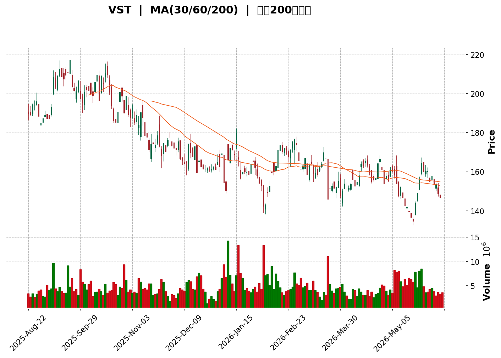
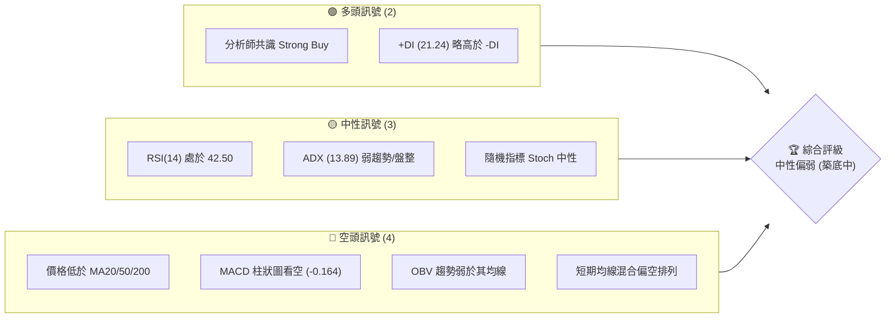
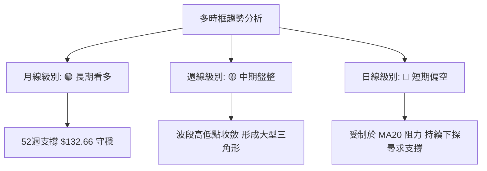
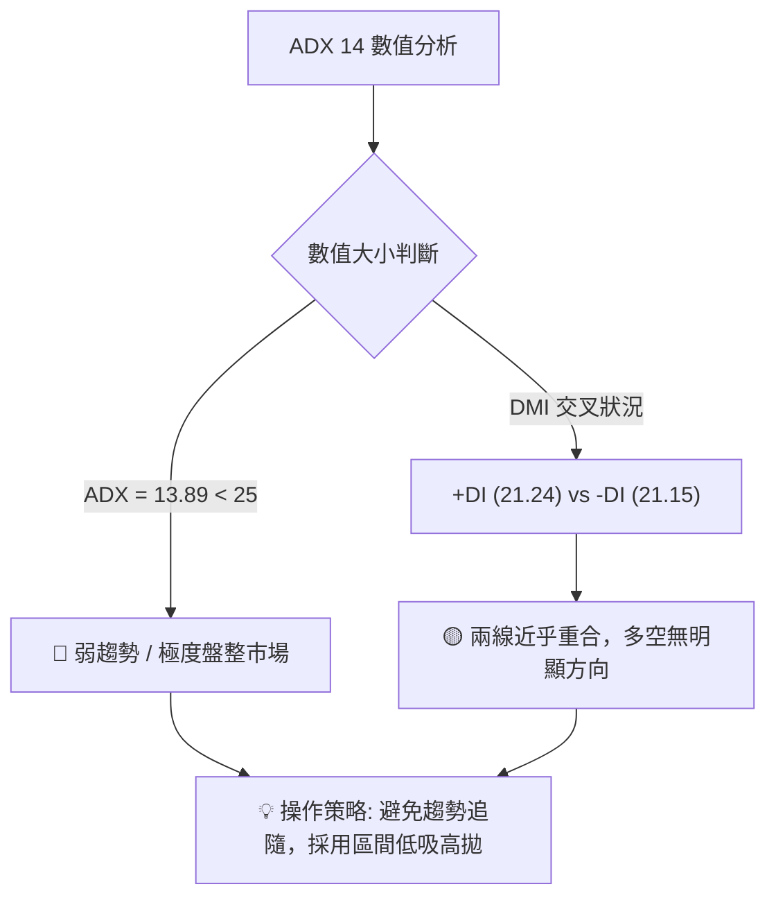
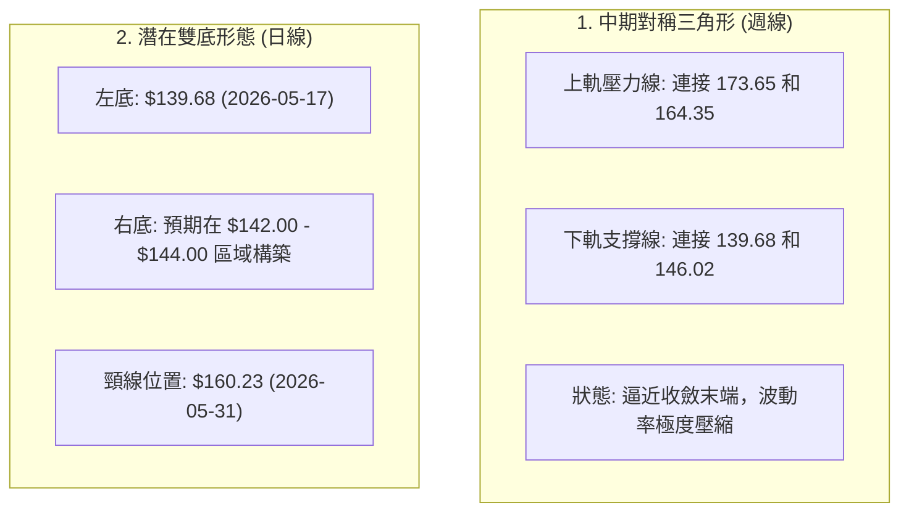

<details>
<summary>📊 靜態圖表 (點擊展開)</summary>

</details>

<html>
<head><meta charset="utf-8" /></head>
<body>
    <div style="height:500px; width:100%;">                        <script>window.PlotlyConfig = {MathJaxConfig: 'local'};</script>
        <script charset="utf-8" src="https://cdn.plot.ly/plotly-3.6.0.min.js" integrity="sha256-QaOVwtVY0T02VaHrr6pnoHLCwayMJp4O5n4YyaE3rJk=" crossorigin="anonymous"></script>                <div id="candlestick-chart" class="plotly-graph-div" style="height:100%; width:100%;"></div>            <script>                window.PLOTLYENV=window.PLOTLYENV || {};                                if (document.getElementById("candlestick-chart")) {                    Plotly.newPlot(                        "candlestick-chart",                        [{"close":{"dtype":"f8","bdata":"AAAAQGi3Z0AAAAAAS6tnQAAAAMD0S2hAAAAAQGE7aEAAAACgUn5oQAAAAEBfjGdAAAAAAC0jZ0AAAAAg0GxnQAAAAMAioGdAAAAA4PxoZ0AAAABgTmlnQAAAAKA9IWhAAAAAoBwNakAAAACAn2hpQAAAAGC7HGpAAAAAIIGWakAAAAAAIBRqQAAAAABs8GlAAAAAQGUrakAAAABgWVZqQAAAAIA+KmtAAAAAYLB1aUAAAAAAHzBpQAAAAGAUImlAAAAAYMnUaUAAAADgpKxoQAAAAIAubGhAAAAAwJEeaUAAAADg8kJpQAAAACDjLWlAAAAAgHf7aEAAAACAQeJoQAAAAMBnv2lAAAAAgIAtakAAAADgLYpoQAAAAEAkH2pAAAAAgDeeaUAAAACAoEhqQAAAACBEOmpAAAAAwHYZaUAAAAAAkjZoQAAAAMA1QGdAAAAA4DAqZ0AAAACA+9pnQAAAAABLHWlAAAAAYAvYaEAAAABgF8JnQAAAACBH2mhAAAAAYAKmZ0AAAABgA3lnQAAAAIBGEGhAAAAAoFEnZ0AAAAAAzJtnQAAAAMCTA2dAAAAA4CzPZ0AAAADgX3hnQAAAAKBWVWZAAAAA4O84ZkAAAADAzmJlQAAAAECxxmVAAAAAoJXQZUAAAABgE75lQAAAACCzVGZAAAAAoPipZUAAAACABwRlQAAAAGAN1WVAAAAAwNRLZUAAAADABgpmQAAAAMDDS2ZAAAAAIC+lZUAAAACgZoJlQAAAAACuZWVAAAAAILvyZUAAAADgttZkQAAAAAA1tWRAAAAAAGeLZEAAAAAA5JZkQAAAAADSw2VAAAAAYDc0ZUAAAADgLflkQAAAAAAfn2VAAAAA4PLwY0AAAABgzbZkQAAAAGCZUmRAAAAAYDIrZEAAAACAZC5kQAAAAACpN2RAAAAAgGQuZEAAAAAg0zNkQAAAAEDATGRAAAAAAIcjZEAAAABAKKBkQAAAAECoVmRAAAAA4JEpZUAAAAAAdkxjQAAAAKCizGJAAAAAYJbEZEAAAACACYtlQAAAAKD3ZWVAAAAAoKwXZUAAAADA531mQAAAAADwy2RAAAAAgBWTY0AAAAAgqvljQAAAAICHBGRAAAAAINz8Y0AAAABA\u002f9JjQAAAAMAogWRAAAAAYEKtZEAAAAAAeUtkQAAAACBMxGNAAAAAYJhBY0AAAACgVBljQAAAAGBtymFAAAAA4ADcYUAAAADARq5iQAAAACBfGGNAAAAAID7sY0AAAACA0f1jQAAAACAXXGRAAAAAYDRoZUAAAABAMK5lQAAAAADOSmVAAAAAAHuIZUAAAAAAVGVlQAAAAABJ8mRAAAAAwFtsZUAAAAAg4ONlQAAAAECIEmZAAAAAYOa0ZUAAAADAcbhkQAAAAOBZL2RAAAAAIGZkZEAAAACggOVkQAAAAEDizWNAAAAAALVsZEAAAAAgooVkQAAAAKAu3mNAAAAAgJrrY0AAAACAeNdjQAAAAGCeOGRAAAAAgGWDZEAAAACAbDxlQAAAAECL5GRAAAAA4KNAYkAAAACgR+liQAAAAEAKF2NAAAAA4FHwYkAAAACgmQljQAAAACBcb2NAAAAAoEdxYkAAAABgj8piQAAAAGC4PmNAAAAAgMLlYkAAAABA4fJiQAAAAIDCNWNAAAAA4Hp8Y0AAAAAAABhjQAAAACBcV2NAAAAAYGbGY0AAAABACn9kQAAAAIAUXmRAAAAAwPWwZEAAAABguG5kQAAAAEAz82NAAAAAwB5dY0AAAACgR3ljQAAAAEAzm2NAAAAAQDOLZEAAAABgj9JkQAAAAADXI2RAAAAAoEc5Y0AAAABA4bpjQAAAAMD1aGNAAAAAQDMbZEAAAAAAKQxkQAAAAKBHyWNAAAAAYGY+Y0AAAABACndiQAAAAKCZAWNAAAAAANdbYkAAAAAghdNhQAAAAMDMvGFAAAAAgMJ1YUAAAAAAABhhQAAAAGC41mBAAAAAAAAAYkAAAABgj6JiQAAAAOCjiGNAAAAAgOuRZEAAAADAzARkQAAAAMD1CGRAAAAAIFwHZEAAAADgUVhjQAAAAEAKv2NAAAAAoJk5Y0AAAABgZjZjQAAAAOBRmGJAAAAAwMxcYkAAAAAAAAD4fw=="},"high":{"dtype":"f8","bdata":"Vur48RFYaED+bc1qnD1oQAO\u002fXOTZXGhAEDOo9dqPaEBy3iaZghNpQEph+c5mX2hA2Tdy+EhFZ0AKJoBGhXpnQPZ4kysB7GdA1X+hbGzWZ0AMNes\u002fb7pnQLZpf\u002foRWGhAIkF2PxqCakA84xuj3GJqQI1FxBwmLWpAgew+wCAia0CjDsQwbp9qQN\u002fexhdun2pARZSxIXi0akCxpJwlC6hqQLT0j4fgZmtAliRx4byFakAhKmpP0rNpQOn9frdTdmlAxNWZz7jdaUCCdmGU0dFpQBoOy5dW\u002fmhAKtm1QLWLaUAEGYkh8Y1pQKeHDjziM2pAGKOQrHHraUB6HTXTw2hpQBQeouVRwWlAzcwP36VPakDAG8H+IXlqQHJ+5\u002frnK2pAMzZDjs0IakDHEIcTF+5qQPH7T4kTEGtAveoF8BgvakAb1Rz25Z1pQI1Rx+ZmHGhAS1iqvU6fZ0B4cnIoePVnQE3OWsw0LmlArpFkLi5jaUAASD\u002f5sphoQOKQ2JStBWlARwROEbrIaEB10lYefQtoQKP0N+TiVGhABdbm9c\u002feZ0AWOVTOPv5nQOYA+EUuk2dA7tEMj5HRZ0B+mtqdQ4hoQDrI+2GGbWdA+JhfTKGZZkASylZNCy9mQAI8hQIlcGZAHMMXktNgZkD8gEC5zx1mQIbGtAcDoGZAaTfJGJuYZ0Cj6B34daZlQNFPo4X31mVAnRN55\u002ffHZUDMP8+zVyhmQCfstG23iGZABc+QVND\u002fZUCdN4e05u5lQJYvoePiq2VAsybkmeoxZkBaLE\u002fsmQRmQKZZLyp162RA9ThpPicuZUCJsAcVBLJkQIcW6xUTzWVAdoOH3yRwZkC+TpHCwpBlQAKVBk1wrmVAH49iaQ3VZUAOHV61S25lQG7tRGcFXmVA0Pzwy8GCZEB+O7yYQ29kQOZafwaiS2RAkWZ5COVYZEBRi5vpPX9kQCMM\u002ftbPWmRAhH7IP9SIZEBIB+GtlCFlQBCorCF6bWVAdNbt4P6LZUDXz7+1cg1lQLflcfjOcmNA1pIKGBDQZUAZU8PT+Q9mQCcXvWbA5mVA1lBpNkxeZUCmq54w9slmQPVEnU5hXGVA9DKGcMO4ZED7y5yATDhkQI87HFXfaGRA\u002f1ukb71UZECxLX22tqJkQNl+gNupjGRAF42pu6jKZEAbg0B61\u002fRkQGcTUj7UiGRAA2KUymL4Y0BBQUGRLYljQG667u1rLmNA2\u002fU3wNj2YUAIhsC\u002frgFjQORfC0QrcmNAiEVjMGcmZEA7+UWqtqJkQAEXM4t5v2RAjYlXGqNtZUDnQehaGQ1mQPhbqXtZ6GVAaJQAuLeKZUAqNJnQb6hlQM3xCopjc2VAOoyXlEZuZUBzDvkGafZlQK1Ft0yiH2ZAwS\u002f5rCVCZkAHX2j98QhmQJNq99PUaWRA9lKy449\u002fZEDeMJDDt\u002fdkQMTSR+rRBGVAL+9wuvuMZED6pnwC7BFlQGLqqBmIeGRAatMJGklfZECoi8QNeqBkQBVGJWbfaGRAKpe044GnZEAYZBxcdZhlQIY2SZ3OK2VAAAAAQArPZEAAAADAzHxjQAAAAEAzQ2NAAAAAYGa+Y0AAAACgcBVjQAAAAGBmBmRAAAAAgMLdY0AAAABACu9iQAAAAEDhimNAAAAAgOtRY0AAAAAgXCNjQAAAAMAeRWNAAAAAgOspZEAAAADA9VBkQAAAAAAp1GNAAAAAQAoXZEAAAADA9ahkQAAAAOCj0GRAAAAAoHDdZEAAAAAgrg9lQAAAAKCZgWRAAAAAQDMjZEAAAABgj+JjQAAAAADX22NAAAAAIFyvZEAAAACgcA1lQAAAAGBmamRAAAAAwHIkZEAAAAAAKfRjQAAAAOB6BGRAAAAAAClMZEAAAACgmXlkQAAAACCuX2RAAAAA4HoMZUAAAAAAAGBjQAAAAAAAGGNAAAAAAFbKYkAAAADA9UhiQAAAAKBw6WFAAAAAQOGiYUAAAACgR3FhQAAAAGBmFmFAAAAAwMwcYkAAAADA9ahiQAAAAIA9smNAAAAAwMzsZEAAAABAtKBkQAAAAMD1cGRAAAAAoEdJZEAAAACgmdFjQAAAAMD1GGRAAAAAwB69Y0AAAACgR0FjQAAAAKBHSWNAAAAAoJmpYkAAAAAAAAD4fw=="},"hovertemplate":"\u003cb\u003e%{x|%Y-%m-%d}\u003c\u002fb\u003e\u003cbr\u003e\u958b: $%{open:.2f}\u003cbr\u003e\u9ad8: $%{high:.2f}\u003cbr\u003e\u4f4e: $%{low:.2f}\u003cbr\u003e\u6536: $%{close:.2f}\u003cextra\u003e\u003c\u002fextra\u003e","low":{"dtype":"f8","bdata":"n6GSyJJNZ0DiMTGxbZJnQJs\u002ft84FlGdAsOItc2zxZ0CyWrJtBDxoQEsGUMXoPmdAYpGxUZesZkBJ7O\u002fSUPRmQO84e8RcgmdAfQcxQus3ZkDGfOQq7PxmQO6UjXOPj2dAGDc02oTnaEDVU+jkVkppQGo31NeXJ2lA65ukU7scakBIMQ0OrNBpQJQ7rS9jfGlA1M5EPiLoaUCrswd30JNpQMmVDbVL52lAf2jpNsxcaUDyf9vIDippQA72FMINb2hAoP\u002fL9qcNaUDOJIcp\u002fKRoQGo45\u002faZxWdAKfrQHoP0Z0DM8FdZN8VoQCsVyAxAHmlAajQGc16caEAGGL6ZEGtoQD5OF1hv8mhAAMASEqKYaUD0bXtzioloQJZwbLUl+2hANH3ZDg8baUATuHlZnrppQGulRnKBA2pAJp\u002fAcPrvaEAfYHAw1whoQJx2RczkIWdAmBI8nPlkZkDtysmCXCZnQDNd\u002fusOQmhATLb747B+aEDtiBZiyv5mQNrhuJ9ZnmdA281QAqyAZ0DvZIdqeeBmQLuwbWCGamdAdEJpdr\u002f\u002fZkDCeYMzeA1nQEfFBEglYWZAS3i72aQDZkBsU8\u002fI5fRmQK13jEQrSmZAkGhsuakZZkDU+ciTnkFlQHV+FY75o2RA3Wc8BZeUZUDB6iFKFkZlQEfDK3Oxt2VA4AUE4uiUZUASRhxvxT9kQJ+\u002f9Z0vrmRABPUuiViuZEAXZx5GeZNlQKvVA6ujMGZAFLFgLN6GZUAH2L\u002fYlVxlQKzNtoKED2VAL7b1QQ5AZUCmggNJYMBkQNFp7\u002fN3c2RA0b\u002fWbdmIZECmtxkn08ZjQGaR0BQjEmRAAMXIwT7hZEDHVaajptBkQMsgE9ntwmRAqNSVo2vIY0CIq21NHEdkQJpJD3ERSGRAjdgEKTAUZEBd+GwPLv1jQLVlaPCs8WNAMxju2jUEZEBhdeihmPZjQEq3oSjmGmRA0mhBGgMgZEBXHSD0VXVkQM8v1dMY\u002f2NAQMXTCtJxZECXXUM0lipjQIdaJ5yTn2JA94nV1+20ZEBcqKxaaHtkQKuJGzLLUmVAFY72lVy6ZEBBbHObRm5lQDZufLA2WWRAmRnkPzCBY0BngkTf7zFjQPl+9KDc3WNA2xmGyBy5Y0AM9L2n6rVjQMuu3s\u002fnvWNAXATgPhgeZEABhsFPPdFjQHAuvaCulGNABp8S0T46Y0BVlX\u002f6\u002fMViQB76+6SRYmFAsfxTyutKYUDXd6aCA2diQLEsdIuEcmJALhzH1CtTY0Bmcww7sMpjQO6ThsHOBWRAO0Hgu\u002fUoZECifljA\u002fTZlQNDLnFYgLGVAtgNzbaoAZUCD6msIohhlQKjHbKeEn2RAnypsSQ9VZECpDpxMJTtlQOxk2rZdfGRA\u002fzNi2gdVZUCJHhvJVLNkQC6As++wGGNAggMryM4FZEBfl0w1ti5kQKcD5AezwmNAdyb+Mj5ZY0C4K2fvmIJkQDHTyV8JXmNAxU7io5GPY0DTInvde7BjQJ7Q7FqK\u002fGNA4nO8ycU8ZEBZfd4OyahkQDFhYGozgGRAAAAAYI8aYkAAAABguKpiQAAAAKCZsWJAAAAAACnMYkAAAAAgrk9iQAAAAAAA+GJAAAAAQDNTYkAAAABA4cphQAAAAMDM7GJAAAAAANfDYkAAAAAAKbxiQAAAAMD1yGJAAAAAoEdpY0AAAACAwhVjQAAAACCFI2NAAAAAwMwUY0AAAABACgtkQAAAAMDMRGRAAAAAIIVTZEAAAADgUUhkQAAAAIA9ymNAAAAAAClEY0AAAACgcF1jQAAAAAAAUGNAAAAAwMxkY0AAAAAghddjQAAAAEAK12NAAAAAYI8iY0AAAAAgXHdjQAAAAIDCXWNAAAAAgBSuY0AAAACgmfljQAAAAEAzk2NAAAAA4KM4Y0AAAAAgXF9iQAAAAGDlSGJAAAAAwB41YkAAAADgUXBhQAAAAACBfWFAAAAAgOs5YUAAAAAghbtgQAAAAMAelWBAAAAAgOs5YUAAAAAAKRxiQAAAAAAA2GJAAAAAQArHY0AAAABgDs1jQAAAAEAzs2NAAAAAACmcY0AAAABgj+piQAAAAAApHGNAAAAAYGYeY0AAAACAFMZiQAAAAAAAcGJAAAAAAClMYkAAAAAAAAD4fw=="},"name":"\u50f9\u683c","open":{"dtype":"f8","bdata":"G9w0cRXNZ0DPuN5\u002f1dlnQG19nXYWt2dAmPAoRnQyaED3mfGggU5oQMMY3PKpWWhAdH+fmwL7ZkDCOnuOOylnQNKHCIDdiGdAuYKYXrawZ0Dg2Cg9rJtnQNryYlK+qGdAzJfBbhj4aED5nNBnZ\u002f9pQFojy+vCRGlA65ukU7scakCjDsQwbp9qQP3dppaTT2pA\u002fmX7Ss+PakCo\u002fBy+IltqQCNjAOxpTWpA64CtAAMxakAwCZZQalZpQIi88AGPrmhAv6XBQK0UaUCmbAnSNC5pQG0zXqKI1GhAxXGDrdJOaECi3ppnTm9pQKw\u002f0AczeWlAChhe1vWyaUC69MsGfCBpQHSc4pPNIGlAZmZmJsTNaUCukvW51yVqQLsW+7gfEmlAUV+U7yanaUDjqodAzRdqQHKV2QBcxmpAGyd9myXjaUD1+9faLXJpQKoIIHQrC2hAupqyVhRhZ0DtysmCXCZnQI+\u002fItLhgWhArpFkLi5jaUAASD\u002f5sphoQPkcZC6p+GdA20oAbZxEaEDi+jpQFu9nQHwhiakcyWdAr+T7h6FyZ0BewnGV6TdnQI3KFaNezGZA56xBwUZAZkC2TeS3cEhoQMjgQQ8QLWdA\u002fCkD7Kx6ZkA71+haiQ1mQB3hrZkI12RAFt+obU7eZUBp60ww6YVlQNVhiMCw1WVAtw9bxfUJZ0BUrX5a2XBlQBgdNZtNI2VAjXXQzzmzZUAdzv9DrLBlQFqLy3c7UGZAcLbnrdDwZUA9bpV7Wd1lQD\u002f1WTnphWVAdJyhaKhtZUAl\u002flRHFwFmQKZZLyp162RAJU4330WdZEDhpZ\u002fKUJxkQBTqBWFTM2RAeVTafffWZUB9OHIJfI9lQCsM1rcexmRABDDF5P2wZUBAFzAAh6ZkQMUOjj23x2RA3QOYwdl4ZEDZ7qZ9MitkQDx4GpOpGGRAAAAAgGQuZEAF0dI\u002f+xhkQKPYNivwOGRA4zdRF2FVZEBXHSD0VXVkQBXhqeF0JGVA0hcfCqIYZUDXz7+1cg1lQHMWt3s7YWNA4Wld6\u002fXCZUC1fi4FQ45kQKFBODVquGVAExEikBglZUCtVVpgdZhlQOPT58VL6mRAxKTvGZwhZEDVa3BlY9ljQESyk1qzNmRA8RbPdgb5Y0D4dtAi4QtkQE8EcMJd6WNAhiiEe8O4ZEAoXI5HfLdkQIyI57j1KGRAwRoka+2tY0DOzdjOCH1jQBwGsOxmH2NAiTLLedqZYUBSURoYdrliQPL\u002fEgV2uWJA5Sd7ss4FZEBmf+mfzphkQHSuwnJaEGRA5B68cLhFZEAwOWD\u002ftVRlQMYdafy7uGVAYa4hp7Y1ZUBrKc\u002fUFoJlQHYHWI4KTWVAbNsB76rhZEBU6aZBpYRlQDBOic4MZGVAiNH0HF\u002fYZUBwJbME+z5lQCyCjRwIL2RA+oePANYrZEAG7eN5GjVkQHjb8CU7h2RA47i+5wB2Y0CLzmrJT6RkQKgxz5MRbGRA6JE\u002fZrabY0BQHPujRDFkQHiLUEz7GGRAa2l6ltJSZEDX0aRExrBkQBNbWhsn3mRAAAAAQArPZEAAAABgZu5iQAAAAKCZ0WJAAAAAAABgY0AAAAAAALBiQAAAAAAA+GJAAAAAQDOjY0AAAADAzPxhQAAAAEAK72JAAAAAYLjmYkAAAACgR+FiQAAAAIA94mJAAAAAAAAYZEAAAADgenxjQAAAAAAAMGNAAAAAwMwUY0AAAADAHk1kQAAAAAAAsGRAAAAAgD2SZEAAAADgUchkQAAAAKCZYWRAAAAA4FEYZEAAAACgmbljQAAAAGC4fmNAAAAAYI+KY0AAAAAAAKBkQAAAAAAAUGRAAAAAIIUbZEAAAACgR4ljQAAAAIDryWNAAAAAgBS2Y0AAAAAAAGBkQAAAAADXL2RAAAAAoEdhZEAAAAAAAGBjQAAAAAAAgGJAAAAAIK6vYkAAAADA9UhiQAAAAAAprGFAAAAAwMx4YUAAAAAAAGBhQAAAAKCZ+WBAAAAAAABAYUAAAABACi9iQAAAAMD14GJAAAAAwB7dY0AAAABguJ5kQAAAAEDh2mNAAAAAAAAAZEAAAAAAAKBjQAAAAIAUfmNAAAAA4FGQY0AAAACgR\u002fFiQAAAAAAAAGNAAAAAgOuJYkAAAAAAAAD4fw=="},"x":["2025-08-22T00:00:00-04:00","2025-08-25T00:00:00-04:00","2025-08-26T00:00:00-04:00","2025-08-27T00:00:00-04:00","2025-08-28T00:00:00-04:00","2025-08-29T00:00:00-04:00","2025-09-02T00:00:00-04:00","2025-09-03T00:00:00-04:00","2025-09-04T00:00:00-04:00","2025-09-05T00:00:00-04:00","2025-09-08T00:00:00-04:00","2025-09-09T00:00:00-04:00","2025-09-10T00:00:00-04:00","2025-09-11T00:00:00-04:00","2025-09-12T00:00:00-04:00","2025-09-15T00:00:00-04:00","2025-09-16T00:00:00-04:00","2025-09-17T00:00:00-04:00","2025-09-18T00:00:00-04:00","2025-09-19T00:00:00-04:00","2025-09-22T00:00:00-04:00","2025-09-23T00:00:00-04:00","2025-09-24T00:00:00-04:00","2025-09-25T00:00:00-04:00","2025-09-26T00:00:00-04:00","2025-09-29T00:00:00-04:00","2025-09-30T00:00:00-04:00","2025-10-01T00:00:00-04:00","2025-10-02T00:00:00-04:00","2025-10-03T00:00:00-04:00","2025-10-06T00:00:00-04:00","2025-10-07T00:00:00-04:00","2025-10-08T00:00:00-04:00","2025-10-09T00:00:00-04:00","2025-10-10T00:00:00-04:00","2025-10-13T00:00:00-04:00","2025-10-14T00:00:00-04:00","2025-10-15T00:00:00-04:00","2025-10-16T00:00:00-04:00","2025-10-17T00:00:00-04:00","2025-10-20T00:00:00-04:00","2025-10-21T00:00:00-04:00","2025-10-22T00:00:00-04:00","2025-10-23T00:00:00-04:00","2025-10-24T00:00:00-04:00","2025-10-27T00:00:00-04:00","2025-10-28T00:00:00-04:00","2025-10-29T00:00:00-04:00","2025-10-30T00:00:00-04:00","2025-10-31T00:00:00-04:00","2025-11-03T00:00:00-05:00","2025-11-04T00:00:00-05:00","2025-11-05T00:00:00-05:00","2025-11-06T00:00:00-05:00","2025-11-07T00:00:00-05:00","2025-11-10T00:00:00-05:00","2025-11-11T00:00:00-05:00","2025-11-12T00:00:00-05:00","2025-11-13T00:00:00-05:00","2025-11-14T00:00:00-05:00","2025-11-17T00:00:00-05:00","2025-11-18T00:00:00-05:00","2025-11-19T00:00:00-05:00","2025-11-20T00:00:00-05:00","2025-11-21T00:00:00-05:00","2025-11-24T00:00:00-05:00","2025-11-25T00:00:00-05:00","2025-11-26T00:00:00-05:00","2025-11-28T00:00:00-05:00","2025-12-01T00:00:00-05:00","2025-12-02T00:00:00-05:00","2025-12-03T00:00:00-05:00","2025-12-04T00:00:00-05:00","2025-12-05T00:00:00-05:00","2025-12-08T00:00:00-05:00","2025-12-09T00:00:00-05:00","2025-12-10T00:00:00-05:00","2025-12-11T00:00:00-05:00","2025-12-12T00:00:00-05:00","2025-12-15T00:00:00-05:00","2025-12-16T00:00:00-05:00","2025-12-17T00:00:00-05:00","2025-12-18T00:00:00-05:00","2025-12-19T00:00:00-05:00","2025-12-22T00:00:00-05:00","2025-12-23T00:00:00-05:00","2025-12-24T00:00:00-05:00","2025-12-26T00:00:00-05:00","2025-12-29T00:00:00-05:00","2025-12-30T00:00:00-05:00","2025-12-31T00:00:00-05:00","2026-01-02T00:00:00-05:00","2026-01-05T00:00:00-05:00","2026-01-06T00:00:00-05:00","2026-01-07T00:00:00-05:00","2026-01-08T00:00:00-05:00","2026-01-09T00:00:00-05:00","2026-01-12T00:00:00-05:00","2026-01-13T00:00:00-05:00","2026-01-14T00:00:00-05:00","2026-01-15T00:00:00-05:00","2026-01-16T00:00:00-05:00","2026-01-20T00:00:00-05:00","2026-01-21T00:00:00-05:00","2026-01-22T00:00:00-05:00","2026-01-23T00:00:00-05:00","2026-01-26T00:00:00-05:00","2026-01-27T00:00:00-05:00","2026-01-28T00:00:00-05:00","2026-01-29T00:00:00-05:00","2026-01-30T00:00:00-05:00","2026-02-02T00:00:00-05:00","2026-02-03T00:00:00-05:00","2026-02-04T00:00:00-05:00","2026-02-05T00:00:00-05:00","2026-02-06T00:00:00-05:00","2026-02-09T00:00:00-05:00","2026-02-10T00:00:00-05:00","2026-02-11T00:00:00-05:00","2026-02-12T00:00:00-05:00","2026-02-13T00:00:00-05:00","2026-02-17T00:00:00-05:00","2026-02-18T00:00:00-05:00","2026-02-19T00:00:00-05:00","2026-02-20T00:00:00-05:00","2026-02-23T00:00:00-05:00","2026-02-24T00:00:00-05:00","2026-02-25T00:00:00-05:00","2026-02-26T00:00:00-05:00","2026-02-27T00:00:00-05:00","2026-03-02T00:00:00-05:00","2026-03-03T00:00:00-05:00","2026-03-04T00:00:00-05:00","2026-03-05T00:00:00-05:00","2026-03-06T00:00:00-05:00","2026-03-09T00:00:00-04:00","2026-03-10T00:00:00-04:00","2026-03-11T00:00:00-04:00","2026-03-12T00:00:00-04:00","2026-03-13T00:00:00-04:00","2026-03-16T00:00:00-04:00","2026-03-17T00:00:00-04:00","2026-03-18T00:00:00-04:00","2026-03-19T00:00:00-04:00","2026-03-20T00:00:00-04:00","2026-03-23T00:00:00-04:00","2026-03-24T00:00:00-04:00","2026-03-25T00:00:00-04:00","2026-03-26T00:00:00-04:00","2026-03-27T00:00:00-04:00","2026-03-30T00:00:00-04:00","2026-03-31T00:00:00-04:00","2026-04-01T00:00:00-04:00","2026-04-02T00:00:00-04:00","2026-04-06T00:00:00-04:00","2026-04-07T00:00:00-04:00","2026-04-08T00:00:00-04:00","2026-04-09T00:00:00-04:00","2026-04-10T00:00:00-04:00","2026-04-13T00:00:00-04:00","2026-04-14T00:00:00-04:00","2026-04-15T00:00:00-04:00","2026-04-16T00:00:00-04:00","2026-04-17T00:00:00-04:00","2026-04-20T00:00:00-04:00","2026-04-21T00:00:00-04:00","2026-04-22T00:00:00-04:00","2026-04-23T00:00:00-04:00","2026-04-24T00:00:00-04:00","2026-04-27T00:00:00-04:00","2026-04-28T00:00:00-04:00","2026-04-29T00:00:00-04:00","2026-04-30T00:00:00-04:00","2026-05-01T00:00:00-04:00","2026-05-04T00:00:00-04:00","2026-05-05T00:00:00-04:00","2026-05-06T00:00:00-04:00","2026-05-07T00:00:00-04:00","2026-05-08T00:00:00-04:00","2026-05-11T00:00:00-04:00","2026-05-12T00:00:00-04:00","2026-05-13T00:00:00-04:00","2026-05-14T00:00:00-04:00","2026-05-15T00:00:00-04:00","2026-05-18T00:00:00-04:00","2026-05-19T00:00:00-04:00","2026-05-20T00:00:00-04:00","2026-05-21T00:00:00-04:00","2026-05-22T00:00:00-04:00","2026-05-26T00:00:00-04:00","2026-05-27T00:00:00-04:00","2026-05-28T00:00:00-04:00","2026-05-29T00:00:00-04:00","2026-06-01T00:00:00-04:00","2026-06-02T00:00:00-04:00","2026-06-03T00:00:00-04:00","2026-06-04T00:00:00-04:00","2026-06-05T00:00:00-04:00","2026-06-08T00:00:00-04:00","2026-06-09T00:00:00-04:00"],"type":"candlestick"},{"hovertemplate":"MA30: $%{y:.2f}\u003cextra\u003e\u003c\u002fextra\u003e","line":{"color":"#2196F3","dash":"dash","width":2},"mode":"lines","name":"MA30","x":["2025-08-22T00:00:00-04:00","2025-08-25T00:00:00-04:00","2025-08-26T00:00:00-04:00","2025-08-27T00:00:00-04:00","2025-08-28T00:00:00-04:00","2025-08-29T00:00:00-04:00","2025-09-02T00:00:00-04:00","2025-09-03T00:00:00-04:00","2025-09-04T00:00:00-04:00","2025-09-05T00:00:00-04:00","2025-09-08T00:00:00-04:00","2025-09-09T00:00:00-04:00","2025-09-10T00:00:00-04:00","2025-09-11T00:00:00-04:00","2025-09-12T00:00:00-04:00","2025-09-15T00:00:00-04:00","2025-09-16T00:00:00-04:00","2025-09-17T00:00:00-04:00","2025-09-18T00:00:00-04:00","2025-09-19T00:00:00-04:00","2025-09-22T00:00:00-04:00","2025-09-23T00:00:00-04:00","2025-09-24T00:00:00-04:00","2025-09-25T00:00:00-04:00","2025-09-26T00:00:00-04:00","2025-09-29T00:00:00-04:00","2025-09-30T00:00:00-04:00","2025-10-01T00:00:00-04:00","2025-10-02T00:00:00-04:00","2025-10-03T00:00:00-04:00","2025-10-06T00:00:00-04:00","2025-10-07T00:00:00-04:00","2025-10-08T00:00:00-04:00","2025-10-09T00:00:00-04:00","2025-10-10T00:00:00-04:00","2025-10-13T00:00:00-04:00","2025-10-14T00:00:00-04:00","2025-10-15T00:00:00-04:00","2025-10-16T00:00:00-04:00","2025-10-17T00:00:00-04:00","2025-10-20T00:00:00-04:00","2025-10-21T00:00:00-04:00","2025-10-22T00:00:00-04:00","2025-10-23T00:00:00-04:00","2025-10-24T00:00:00-04:00","2025-10-27T00:00:00-04:00","2025-10-28T00:00:00-04:00","2025-10-29T00:00:00-04:00","2025-10-30T00:00:00-04:00","2025-10-31T00:00:00-04:00","2025-11-03T00:00:00-05:00","2025-11-04T00:00:00-05:00","2025-11-05T00:00:00-05:00","2025-11-06T00:00:00-05:00","2025-11-07T00:00:00-05:00","2025-11-10T00:00:00-05:00","2025-11-11T00:00:00-05:00","2025-11-12T00:00:00-05:00","2025-11-13T00:00:00-05:00","2025-11-14T00:00:00-05:00","2025-11-17T00:00:00-05:00","2025-11-18T00:00:00-05:00","2025-11-19T00:00:00-05:00","2025-11-20T00:00:00-05:00","2025-11-21T00:00:00-05:00","2025-11-24T00:00:00-05:00","2025-11-25T00:00:00-05:00","2025-11-26T00:00:00-05:00","2025-11-28T00:00:00-05:00","2025-12-01T00:00:00-05:00","2025-12-02T00:00:00-05:00","2025-12-03T00:00:00-05:00","2025-12-04T00:00:00-05:00","2025-12-05T00:00:00-05:00","2025-12-08T00:00:00-05:00","2025-12-09T00:00:00-05:00","2025-12-10T00:00:00-05:00","2025-12-11T00:00:00-05:00","2025-12-12T00:00:00-05:00","2025-12-15T00:00:00-05:00","2025-12-16T00:00:00-05:00","2025-12-17T00:00:00-05:00","2025-12-18T00:00:00-05:00","2025-12-19T00:00:00-05:00","2025-12-22T00:00:00-05:00","2025-12-23T00:00:00-05:00","2025-12-24T00:00:00-05:00","2025-12-26T00:00:00-05:00","2025-12-29T00:00:00-05:00","2025-12-30T00:00:00-05:00","2025-12-31T00:00:00-05:00","2026-01-02T00:00:00-05:00","2026-01-05T00:00:00-05:00","2026-01-06T00:00:00-05:00","2026-01-07T00:00:00-05:00","2026-01-08T00:00:00-05:00","2026-01-09T00:00:00-05:00","2026-01-12T00:00:00-05:00","2026-01-13T00:00:00-05:00","2026-01-14T00:00:00-05:00","2026-01-15T00:00:00-05:00","2026-01-16T00:00:00-05:00","2026-01-20T00:00:00-05:00","2026-01-21T00:00:00-05:00","2026-01-22T00:00:00-05:00","2026-01-23T00:00:00-05:00","2026-01-26T00:00:00-05:00","2026-01-27T00:00:00-05:00","2026-01-28T00:00:00-05:00","2026-01-29T00:00:00-05:00","2026-01-30T00:00:00-05:00","2026-02-02T00:00:00-05:00","2026-02-03T00:00:00-05:00","2026-02-04T00:00:00-05:00","2026-02-05T00:00:00-05:00","2026-02-06T00:00:00-05:00","2026-02-09T00:00:00-05:00","2026-02-10T00:00:00-05:00","2026-02-11T00:00:00-05:00","2026-02-12T00:00:00-05:00","2026-02-13T00:00:00-05:00","2026-02-17T00:00:00-05:00","2026-02-18T00:00:00-05:00","2026-02-19T00:00:00-05:00","2026-02-20T00:00:00-05:00","2026-02-23T00:00:00-05:00","2026-02-24T00:00:00-05:00","2026-02-25T00:00:00-05:00","2026-02-26T00:00:00-05:00","2026-02-27T00:00:00-05:00","2026-03-02T00:00:00-05:00","2026-03-03T00:00:00-05:00","2026-03-04T00:00:00-05:00","2026-03-05T00:00:00-05:00","2026-03-06T00:00:00-05:00","2026-03-09T00:00:00-04:00","2026-03-10T00:00:00-04:00","2026-03-11T00:00:00-04:00","2026-03-12T00:00:00-04:00","2026-03-13T00:00:00-04:00","2026-03-16T00:00:00-04:00","2026-03-17T00:00:00-04:00","2026-03-18T00:00:00-04:00","2026-03-19T00:00:00-04:00","2026-03-20T00:00:00-04:00","2026-03-23T00:00:00-04:00","2026-03-24T00:00:00-04:00","2026-03-25T00:00:00-04:00","2026-03-26T00:00:00-04:00","2026-03-27T00:00:00-04:00","2026-03-30T00:00:00-04:00","2026-03-31T00:00:00-04:00","2026-04-01T00:00:00-04:00","2026-04-02T00:00:00-04:00","2026-04-06T00:00:00-04:00","2026-04-07T00:00:00-04:00","2026-04-08T00:00:00-04:00","2026-04-09T00:00:00-04:00","2026-04-10T00:00:00-04:00","2026-04-13T00:00:00-04:00","2026-04-14T00:00:00-04:00","2026-04-15T00:00:00-04:00","2026-04-16T00:00:00-04:00","2026-04-17T00:00:00-04:00","2026-04-20T00:00:00-04:00","2026-04-21T00:00:00-04:00","2026-04-22T00:00:00-04:00","2026-04-23T00:00:00-04:00","2026-04-24T00:00:00-04:00","2026-04-27T00:00:00-04:00","2026-04-28T00:00:00-04:00","2026-04-29T00:00:00-04:00","2026-04-30T00:00:00-04:00","2026-05-01T00:00:00-04:00","2026-05-04T00:00:00-04:00","2026-05-05T00:00:00-04:00","2026-05-06T00:00:00-04:00","2026-05-07T00:00:00-04:00","2026-05-08T00:00:00-04:00","2026-05-11T00:00:00-04:00","2026-05-12T00:00:00-04:00","2026-05-13T00:00:00-04:00","2026-05-14T00:00:00-04:00","2026-05-15T00:00:00-04:00","2026-05-18T00:00:00-04:00","2026-05-19T00:00:00-04:00","2026-05-20T00:00:00-04:00","2026-05-21T00:00:00-04:00","2026-05-22T00:00:00-04:00","2026-05-26T00:00:00-04:00","2026-05-27T00:00:00-04:00","2026-05-28T00:00:00-04:00","2026-05-29T00:00:00-04:00","2026-06-01T00:00:00-04:00","2026-06-02T00:00:00-04:00","2026-06-03T00:00:00-04:00","2026-06-04T00:00:00-04:00","2026-06-05T00:00:00-04:00","2026-06-08T00:00:00-04:00","2026-06-09T00:00:00-04:00"],"y":{"dtype":"f8","bdata":"AAAAAAAA+H8AAAAAAAD4fwAAAAAAAPh\u002fAAAAAAAA+H8AAAAAAAD4fwAAAAAAAPh\u002fAAAAAAAA+H8AAAAAAAD4fwAAAAAAAPh\u002fAAAAAAAA+H8AAAAAAAD4fwAAAAAAAPh\u002fAAAAAAAA+H8AAAAAAAD4fwAAAAAAAPh\u002fAAAAAAAA+H8AAAAAAAD4fwAAAAAAAPh\u002fAAAAAAAA+H8AAAAAAAD4fwAAAAAAAPh\u002fAAAAAAAA+H8AAAAAAAD4fwAAAAAAAPh\u002fAAAAAAAA+H8AAAAAAAD4fwAAAAAAAPh\u002fAAAAAAAA+H8AAAAAAAD4fwAAABA66GhA7+7uXgfzaEC8u7vrZP1oQO\u002fu7p7GCWlAMzMzQ2EaaUAAAABwxhppQAAAAPC7MGlARERE9OZFaUBERETES15pQERERBSAdGlAq6qqiuqCaUAREREhwolpQN7d3d1BgmlAiYiIaKBpaUBVVVU1X1xpQGZmZnbbU2lAvLu7q\u002flEaUBVVVWVLDFpQGZmZhbnJ2lAq6qqymMSaUDe3d398floQKuqqsp632hAd3d398zLaEC8u7u7Ur5oQBEREWE9rGhA3t3dbfyaaEDNzMzctZBoQN7d3d3hfmhAVVVVRSlmaEAAAAAAF0VoQN7d3c0MKGhAZmZmRgUNaEAAAADwNvJnQImIiMgO1WdAERERQYquZ0CJiIjod5BnQLy7u4vda2dAMzMzY\u002fxGZ0AAAAAQxCJnQAAAAEA3AWdAVVVVZb3jZkAiIiLiqsxmQO\u002fu7o7ZvGZARERExHeyZkDv7u6+uZhmQJqZmWkfc2ZARERERG9OZkBVVVUFZTNmQImIiMgLGWZA7+7uri8EZkBERETE2+5lQN7d3R0F2mVA7+7ujpu+ZUB3d3dn6KVlQAAAACDxjmVA3t3dPeBvZUBERERUz1NlQCIiIgLBQWVAZmZm9lUwZUAiIiKCPCZlQImIiGijGWVA7+7uHlYLZUCJiIhIzgFlQLy7u+vN8GRAq6qqOobsZEDv7u4+391kQCIiItL9w2RA3t3dvXu\u002fZECamZkZQLtkQJqZmSmXs2RAzczMnN+uZECJiIjIQbdkQJqZmdkhsmRAiYiImOCdZEDe3d1NgpZkQHd3d6eekGRAq6qqSt6LZECrqqqqVoVkQKuqqkqVemRAiYiIqBV2ZEDNzMxcS3BkQImIiIh3YGRA7+7uLp9aZEBERETk1kxkQDMzM9M7N2RAmpmZ+YYjZEDv7u4uuRZkQHd3d6clDWRAzczMLPEKZEAiIiJSJAlkQHd3dzenCWRAvLu7y3kUZEAAAAAQeh1kQERERHSdJWRAvLu7W8coZEAAAACgrDpkQImIiPj+TGRA3t3dnZZSZEBERES0jFVkQCIiIkJNW2RAq6qq6opgZEAiIiJibVFkQN7d3S01TGRAVVVVVS9TZEARERHRC1tkQCIiIoI5WWRAAAAA8PNcZEDNzMxM6GJkQAAAAJB5XWRAiYiICAVXZEBmZmYmJ1NkQCIiIsIHV2RAvLu7y8FhZEAzMzNT\u002fnNkQJqZmcl2jmRA3t3djdGRZEDNzMwMyZNkQAAAALC9k2RAIiIi8leLZEAzMzPzM4NkQJqZmdlPe2RAERERsQNiZEAiIiIyXElkQCIiIgLkN2RAREREZGYhZEAzMzOzhAxkQKuqqmqz\u002fWNAvLu76yvtY0De3d0dT9VjQImIiNgAvmNAzczMHIWtY0AzMzNDm6tjQERERAQqrWNAZmZmVrevY0Crqqq6watjQJqZmSkArWNA7+7unvKjY0C8u7urAJtjQHd3dxfFmGNAvLu7+xaeY0DNzMycdaZjQM3MzEzEpWNA3t3dTcOaY0BERERU6Y1jQGZmZjZCgWNAq6qqyhORY0CJiIj4xZpjQDMzM\u002fO2oGNAvLu7O1GjY0BmZmaWbp5jQImIiPjFmmNAREREBA+aY0ARERHx0pFjQBEREcH1hGNAzczMfLF4Y0De3d0t3WhjQLy7uxuhVGNAiYiIWPJHY0ARERExCERjQHd3d7esRWNAvLu7a3VMY0De3d1NYkhjQCIiIvKLRWNAERERseQ\u002fY0AiIiICnTZjQImIiOjfNGNA3t3dzbAzY0CJiIgYdjFjQLy7u\u002fvUKGNAd3d39zcWY0AAAAAAAAD4fw=="},"type":"scatter"},{"hovertemplate":"MA60: $%{y:.2f}\u003cextra\u003e\u003c\u002fextra\u003e","line":{"color":"#9C27B0","dash":"dash","width":2},"mode":"lines","name":"MA60","x":["2025-08-22T00:00:00-04:00","2025-08-25T00:00:00-04:00","2025-08-26T00:00:00-04:00","2025-08-27T00:00:00-04:00","2025-08-28T00:00:00-04:00","2025-08-29T00:00:00-04:00","2025-09-02T00:00:00-04:00","2025-09-03T00:00:00-04:00","2025-09-04T00:00:00-04:00","2025-09-05T00:00:00-04:00","2025-09-08T00:00:00-04:00","2025-09-09T00:00:00-04:00","2025-09-10T00:00:00-04:00","2025-09-11T00:00:00-04:00","2025-09-12T00:00:00-04:00","2025-09-15T00:00:00-04:00","2025-09-16T00:00:00-04:00","2025-09-17T00:00:00-04:00","2025-09-18T00:00:00-04:00","2025-09-19T00:00:00-04:00","2025-09-22T00:00:00-04:00","2025-09-23T00:00:00-04:00","2025-09-24T00:00:00-04:00","2025-09-25T00:00:00-04:00","2025-09-26T00:00:00-04:00","2025-09-29T00:00:00-04:00","2025-09-30T00:00:00-04:00","2025-10-01T00:00:00-04:00","2025-10-02T00:00:00-04:00","2025-10-03T00:00:00-04:00","2025-10-06T00:00:00-04:00","2025-10-07T00:00:00-04:00","2025-10-08T00:00:00-04:00","2025-10-09T00:00:00-04:00","2025-10-10T00:00:00-04:00","2025-10-13T00:00:00-04:00","2025-10-14T00:00:00-04:00","2025-10-15T00:00:00-04:00","2025-10-16T00:00:00-04:00","2025-10-17T00:00:00-04:00","2025-10-20T00:00:00-04:00","2025-10-21T00:00:00-04:00","2025-10-22T00:00:00-04:00","2025-10-23T00:00:00-04:00","2025-10-24T00:00:00-04:00","2025-10-27T00:00:00-04:00","2025-10-28T00:00:00-04:00","2025-10-29T00:00:00-04:00","2025-10-30T00:00:00-04:00","2025-10-31T00:00:00-04:00","2025-11-03T00:00:00-05:00","2025-11-04T00:00:00-05:00","2025-11-05T00:00:00-05:00","2025-11-06T00:00:00-05:00","2025-11-07T00:00:00-05:00","2025-11-10T00:00:00-05:00","2025-11-11T00:00:00-05:00","2025-11-12T00:00:00-05:00","2025-11-13T00:00:00-05:00","2025-11-14T00:00:00-05:00","2025-11-17T00:00:00-05:00","2025-11-18T00:00:00-05:00","2025-11-19T00:00:00-05:00","2025-11-20T00:00:00-05:00","2025-11-21T00:00:00-05:00","2025-11-24T00:00:00-05:00","2025-11-25T00:00:00-05:00","2025-11-26T00:00:00-05:00","2025-11-28T00:00:00-05:00","2025-12-01T00:00:00-05:00","2025-12-02T00:00:00-05:00","2025-12-03T00:00:00-05:00","2025-12-04T00:00:00-05:00","2025-12-05T00:00:00-05:00","2025-12-08T00:00:00-05:00","2025-12-09T00:00:00-05:00","2025-12-10T00:00:00-05:00","2025-12-11T00:00:00-05:00","2025-12-12T00:00:00-05:00","2025-12-15T00:00:00-05:00","2025-12-16T00:00:00-05:00","2025-12-17T00:00:00-05:00","2025-12-18T00:00:00-05:00","2025-12-19T00:00:00-05:00","2025-12-22T00:00:00-05:00","2025-12-23T00:00:00-05:00","2025-12-24T00:00:00-05:00","2025-12-26T00:00:00-05:00","2025-12-29T00:00:00-05:00","2025-12-30T00:00:00-05:00","2025-12-31T00:00:00-05:00","2026-01-02T00:00:00-05:00","2026-01-05T00:00:00-05:00","2026-01-06T00:00:00-05:00","2026-01-07T00:00:00-05:00","2026-01-08T00:00:00-05:00","2026-01-09T00:00:00-05:00","2026-01-12T00:00:00-05:00","2026-01-13T00:00:00-05:00","2026-01-14T00:00:00-05:00","2026-01-15T00:00:00-05:00","2026-01-16T00:00:00-05:00","2026-01-20T00:00:00-05:00","2026-01-21T00:00:00-05:00","2026-01-22T00:00:00-05:00","2026-01-23T00:00:00-05:00","2026-01-26T00:00:00-05:00","2026-01-27T00:00:00-05:00","2026-01-28T00:00:00-05:00","2026-01-29T00:00:00-05:00","2026-01-30T00:00:00-05:00","2026-02-02T00:00:00-05:00","2026-02-03T00:00:00-05:00","2026-02-04T00:00:00-05:00","2026-02-05T00:00:00-05:00","2026-02-06T00:00:00-05:00","2026-02-09T00:00:00-05:00","2026-02-10T00:00:00-05:00","2026-02-11T00:00:00-05:00","2026-02-12T00:00:00-05:00","2026-02-13T00:00:00-05:00","2026-02-17T00:00:00-05:00","2026-02-18T00:00:00-05:00","2026-02-19T00:00:00-05:00","2026-02-20T00:00:00-05:00","2026-02-23T00:00:00-05:00","2026-02-24T00:00:00-05:00","2026-02-25T00:00:00-05:00","2026-02-26T00:00:00-05:00","2026-02-27T00:00:00-05:00","2026-03-02T00:00:00-05:00","2026-03-03T00:00:00-05:00","2026-03-04T00:00:00-05:00","2026-03-05T00:00:00-05:00","2026-03-06T00:00:00-05:00","2026-03-09T00:00:00-04:00","2026-03-10T00:00:00-04:00","2026-03-11T00:00:00-04:00","2026-03-12T00:00:00-04:00","2026-03-13T00:00:00-04:00","2026-03-16T00:00:00-04:00","2026-03-17T00:00:00-04:00","2026-03-18T00:00:00-04:00","2026-03-19T00:00:00-04:00","2026-03-20T00:00:00-04:00","2026-03-23T00:00:00-04:00","2026-03-24T00:00:00-04:00","2026-03-25T00:00:00-04:00","2026-03-26T00:00:00-04:00","2026-03-27T00:00:00-04:00","2026-03-30T00:00:00-04:00","2026-03-31T00:00:00-04:00","2026-04-01T00:00:00-04:00","2026-04-02T00:00:00-04:00","2026-04-06T00:00:00-04:00","2026-04-07T00:00:00-04:00","2026-04-08T00:00:00-04:00","2026-04-09T00:00:00-04:00","2026-04-10T00:00:00-04:00","2026-04-13T00:00:00-04:00","2026-04-14T00:00:00-04:00","2026-04-15T00:00:00-04:00","2026-04-16T00:00:00-04:00","2026-04-17T00:00:00-04:00","2026-04-20T00:00:00-04:00","2026-04-21T00:00:00-04:00","2026-04-22T00:00:00-04:00","2026-04-23T00:00:00-04:00","2026-04-24T00:00:00-04:00","2026-04-27T00:00:00-04:00","2026-04-28T00:00:00-04:00","2026-04-29T00:00:00-04:00","2026-04-30T00:00:00-04:00","2026-05-01T00:00:00-04:00","2026-05-04T00:00:00-04:00","2026-05-05T00:00:00-04:00","2026-05-06T00:00:00-04:00","2026-05-07T00:00:00-04:00","2026-05-08T00:00:00-04:00","2026-05-11T00:00:00-04:00","2026-05-12T00:00:00-04:00","2026-05-13T00:00:00-04:00","2026-05-14T00:00:00-04:00","2026-05-15T00:00:00-04:00","2026-05-18T00:00:00-04:00","2026-05-19T00:00:00-04:00","2026-05-20T00:00:00-04:00","2026-05-21T00:00:00-04:00","2026-05-22T00:00:00-04:00","2026-05-26T00:00:00-04:00","2026-05-27T00:00:00-04:00","2026-05-28T00:00:00-04:00","2026-05-29T00:00:00-04:00","2026-06-01T00:00:00-04:00","2026-06-02T00:00:00-04:00","2026-06-03T00:00:00-04:00","2026-06-04T00:00:00-04:00","2026-06-05T00:00:00-04:00","2026-06-08T00:00:00-04:00","2026-06-09T00:00:00-04:00"],"y":{"dtype":"f8","bdata":"AAAAAAAA+H8AAAAAAAD4fwAAAAAAAPh\u002fAAAAAAAA+H8AAAAAAAD4fwAAAAAAAPh\u002fAAAAAAAA+H8AAAAAAAD4fwAAAAAAAPh\u002fAAAAAAAA+H8AAAAAAAD4fwAAAAAAAPh\u002fAAAAAAAA+H8AAAAAAAD4fwAAAAAAAPh\u002fAAAAAAAA+H8AAAAAAAD4fwAAAAAAAPh\u002fAAAAAAAA+H8AAAAAAAD4fwAAAAAAAPh\u002fAAAAAAAA+H8AAAAAAAD4fwAAAAAAAPh\u002fAAAAAAAA+H8AAAAAAAD4fwAAAAAAAPh\u002fAAAAAAAA+H8AAAAAAAD4fwAAAAAAAPh\u002fAAAAAAAA+H8AAAAAAAD4fwAAAAAAAPh\u002fAAAAAAAA+H8AAAAAAAD4fwAAAAAAAPh\u002fAAAAAAAA+H8AAAAAAAD4fwAAAAAAAPh\u002fAAAAAAAA+H8AAAAAAAD4fwAAAAAAAPh\u002fAAAAAAAA+H8AAAAAAAD4fwAAAAAAAPh\u002fAAAAAAAA+H8AAAAAAAD4fwAAAAAAAPh\u002fAAAAAAAA+H8AAAAAAAD4fwAAAAAAAPh\u002fAAAAAAAA+H8AAAAAAAD4fwAAAAAAAPh\u002fAAAAAAAA+H8AAAAAAAD4fwAAAAAAAPh\u002fAAAAAAAA+H8AAAAAAAD4f+\u002fu7m4jiGhAq6qqUgaAaEDe3d3tzXdoQLy7u7Nqb2hAIiIiwnVkaEBEREQsn1VoQN7d3b1MTmhAvLu7q3FGaEAiIiLqh0BoQCIiIqrbOmhAAAAA+FMzaECamZmBNitoQGZmZraNH2hAZmZmFgwOaEAiIiJ6jPpnQAAAAHB942dAAAAAeLTJZ0BVVVXNSLJnQHd3d295oGdAzczMvEmLZ0ARERHhZnRnQERERPS\u002fXGdAMzMzQzRFZ0CamZmRHTJnQImIiECXHWdA3t3dVW4FZ0CJiIiYQvJmQAAAAHBR4GZA3t3dnT\u002fLZkARERHBqbVmQDMzMxvYoGZAq6qqsi2MZkBEREScAnpmQCIiIlruYmZA3t3dPYhNZkC8u7uTKzdmQO\u002fu7q7tF2ZAiYiIEDwDZkDNzMwUAu9lQM3MzDRn2mVAERERgU7JZUBVVVVV9sFlQERERLR9t2VAZmZmLiyoZUBmZmYGnpdlQImIiAjfgWVAd3d3xyZtZUAAAADYXVxlQJqZmYnQSWVAvLu7qyI9ZUCJiIiQky9lQDMzM1M+HWVA7+7uXp0MZUDe3d2lX\u002flkQJqZmXkW42RAvLu7m7PJZECamZlBRLVkQM3MzFRzp2RAmpmZkaOdZEAiIiJqsJdkQAAAAFClkWRAVVVV9eePZEBEREQspI9kQAAAALA1i2RAMzMzy6aKZEB3d3fvRYxkQFVVVWV+iGRA3t3dLQmJZEDv7u5mZohkQN7d3TVyh2RAvLu7Q7WHZEBVVVWVV4RkQLy7u4Mrf2RA7+7u9od4ZEB3d3cPx3hkQM3MzBTsdGRAVVVVHWl0ZEC8u7t7H3RkQFVVVW0HbGRAiYiIWI1mZECamZlBuWFkQFVVVaW\u002fW2RAVVVVfTBeZEC8u7ubamBkQGZmZk7ZYmRAvLu7Q6xaZEDe3d0dQVVkQLy7u6txUGRAd3d3jyRLZECrqqoiLEZkQImIiIh7QmRAZmZmvj47ZEAREREhazNkQDMzM7vALmRAAAAA4BYlZECamZmpmCNkQJqZmTFZJWRAzczMROEfZEARERHpbRVkQFVVVQ2nDGRAvLu7AwgHZECrqqpShP5jQBEREZmv\u002fGNA3t3dVXMBZEDe3d3FZgNkQN7d3dUcA2RAd3d3R3MAZEBERER89P5jQLy7u1Mf+2NAIiIiAo76Y0CamZlhzvxjQHd3dwdm\u002fmNAzczMjEL+Y0C8u7vT8wBkQAAAAIDcB2RARERErHIRZECrqqqCRxdkQJqZmVE6GmRA7+7ullQXZEDNzMxE0RBkQBEREekKC2RAq6qqWgn+Y0CamZmRl+1jQJqZmeFs3mNAiYiI8AvNY0CJiIjwsLpjQDMzM0MqqWNAIiIiIo+aY0B3d3enq4xjQAAAAMjWgWNARERERP18Y0CJiIjI\u002fnljQDMzM\u002ftaeWNAvLu7A853Y0BmZmZeL3FjQBEREQnwcGNAZmZmttFrY0AiIiJiO2ZjQJqZmQnNYGNAmpmZeSdaY0AAAAAAAAD4fw=="},"type":"scatter"},{"hovertemplate":"MA200: $%{y:.2f}\u003cextra\u003e\u003c\u002fextra\u003e","line":{"color":"#FF6F00","dash":"solid","width":2},"mode":"lines","name":"MA200","x":["2025-08-22T00:00:00-04:00","2025-08-25T00:00:00-04:00","2025-08-26T00:00:00-04:00","2025-08-27T00:00:00-04:00","2025-08-28T00:00:00-04:00","2025-08-29T00:00:00-04:00","2025-09-02T00:00:00-04:00","2025-09-03T00:00:00-04:00","2025-09-04T00:00:00-04:00","2025-09-05T00:00:00-04:00","2025-09-08T00:00:00-04:00","2025-09-09T00:00:00-04:00","2025-09-10T00:00:00-04:00","2025-09-11T00:00:00-04:00","2025-09-12T00:00:00-04:00","2025-09-15T00:00:00-04:00","2025-09-16T00:00:00-04:00","2025-09-17T00:00:00-04:00","2025-09-18T00:00:00-04:00","2025-09-19T00:00:00-04:00","2025-09-22T00:00:00-04:00","2025-09-23T00:00:00-04:00","2025-09-24T00:00:00-04:00","2025-09-25T00:00:00-04:00","2025-09-26T00:00:00-04:00","2025-09-29T00:00:00-04:00","2025-09-30T00:00:00-04:00","2025-10-01T00:00:00-04:00","2025-10-02T00:00:00-04:00","2025-10-03T00:00:00-04:00","2025-10-06T00:00:00-04:00","2025-10-07T00:00:00-04:00","2025-10-08T00:00:00-04:00","2025-10-09T00:00:00-04:00","2025-10-10T00:00:00-04:00","2025-10-13T00:00:00-04:00","2025-10-14T00:00:00-04:00","2025-10-15T00:00:00-04:00","2025-10-16T00:00:00-04:00","2025-10-17T00:00:00-04:00","2025-10-20T00:00:00-04:00","2025-10-21T00:00:00-04:00","2025-10-22T00:00:00-04:00","2025-10-23T00:00:00-04:00","2025-10-24T00:00:00-04:00","2025-10-27T00:00:00-04:00","2025-10-28T00:00:00-04:00","2025-10-29T00:00:00-04:00","2025-10-30T00:00:00-04:00","2025-10-31T00:00:00-04:00","2025-11-03T00:00:00-05:00","2025-11-04T00:00:00-05:00","2025-11-05T00:00:00-05:00","2025-11-06T00:00:00-05:00","2025-11-07T00:00:00-05:00","2025-11-10T00:00:00-05:00","2025-11-11T00:00:00-05:00","2025-11-12T00:00:00-05:00","2025-11-13T00:00:00-05:00","2025-11-14T00:00:00-05:00","2025-11-17T00:00:00-05:00","2025-11-18T00:00:00-05:00","2025-11-19T00:00:00-05:00","2025-11-20T00:00:00-05:00","2025-11-21T00:00:00-05:00","2025-11-24T00:00:00-05:00","2025-11-25T00:00:00-05:00","2025-11-26T00:00:00-05:00","2025-11-28T00:00:00-05:00","2025-12-01T00:00:00-05:00","2025-12-02T00:00:00-05:00","2025-12-03T00:00:00-05:00","2025-12-04T00:00:00-05:00","2025-12-05T00:00:00-05:00","2025-12-08T00:00:00-05:00","2025-12-09T00:00:00-05:00","2025-12-10T00:00:00-05:00","2025-12-11T00:00:00-05:00","2025-12-12T00:00:00-05:00","2025-12-15T00:00:00-05:00","2025-12-16T00:00:00-05:00","2025-12-17T00:00:00-05:00","2025-12-18T00:00:00-05:00","2025-12-19T00:00:00-05:00","2025-12-22T00:00:00-05:00","2025-12-23T00:00:00-05:00","2025-12-24T00:00:00-05:00","2025-12-26T00:00:00-05:00","2025-12-29T00:00:00-05:00","2025-12-30T00:00:00-05:00","2025-12-31T00:00:00-05:00","2026-01-02T00:00:00-05:00","2026-01-05T00:00:00-05:00","2026-01-06T00:00:00-05:00","2026-01-07T00:00:00-05:00","2026-01-08T00:00:00-05:00","2026-01-09T00:00:00-05:00","2026-01-12T00:00:00-05:00","2026-01-13T00:00:00-05:00","2026-01-14T00:00:00-05:00","2026-01-15T00:00:00-05:00","2026-01-16T00:00:00-05:00","2026-01-20T00:00:00-05:00","2026-01-21T00:00:00-05:00","2026-01-22T00:00:00-05:00","2026-01-23T00:00:00-05:00","2026-01-26T00:00:00-05:00","2026-01-27T00:00:00-05:00","2026-01-28T00:00:00-05:00","2026-01-29T00:00:00-05:00","2026-01-30T00:00:00-05:00","2026-02-02T00:00:00-05:00","2026-02-03T00:00:00-05:00","2026-02-04T00:00:00-05:00","2026-02-05T00:00:00-05:00","2026-02-06T00:00:00-05:00","2026-02-09T00:00:00-05:00","2026-02-10T00:00:00-05:00","2026-02-11T00:00:00-05:00","2026-02-12T00:00:00-05:00","2026-02-13T00:00:00-05:00","2026-02-17T00:00:00-05:00","2026-02-18T00:00:00-05:00","2026-02-19T00:00:00-05:00","2026-02-20T00:00:00-05:00","2026-02-23T00:00:00-05:00","2026-02-24T00:00:00-05:00","2026-02-25T00:00:00-05:00","2026-02-26T00:00:00-05:00","2026-02-27T00:00:00-05:00","2026-03-02T00:00:00-05:00","2026-03-03T00:00:00-05:00","2026-03-04T00:00:00-05:00","2026-03-05T00:00:00-05:00","2026-03-06T00:00:00-05:00","2026-03-09T00:00:00-04:00","2026-03-10T00:00:00-04:00","2026-03-11T00:00:00-04:00","2026-03-12T00:00:00-04:00","2026-03-13T00:00:00-04:00","2026-03-16T00:00:00-04:00","2026-03-17T00:00:00-04:00","2026-03-18T00:00:00-04:00","2026-03-19T00:00:00-04:00","2026-03-20T00:00:00-04:00","2026-03-23T00:00:00-04:00","2026-03-24T00:00:00-04:00","2026-03-25T00:00:00-04:00","2026-03-26T00:00:00-04:00","2026-03-27T00:00:00-04:00","2026-03-30T00:00:00-04:00","2026-03-31T00:00:00-04:00","2026-04-01T00:00:00-04:00","2026-04-02T00:00:00-04:00","2026-04-06T00:00:00-04:00","2026-04-07T00:00:00-04:00","2026-04-08T00:00:00-04:00","2026-04-09T00:00:00-04:00","2026-04-10T00:00:00-04:00","2026-04-13T00:00:00-04:00","2026-04-14T00:00:00-04:00","2026-04-15T00:00:00-04:00","2026-04-16T00:00:00-04:00","2026-04-17T00:00:00-04:00","2026-04-20T00:00:00-04:00","2026-04-21T00:00:00-04:00","2026-04-22T00:00:00-04:00","2026-04-23T00:00:00-04:00","2026-04-24T00:00:00-04:00","2026-04-27T00:00:00-04:00","2026-04-28T00:00:00-04:00","2026-04-29T00:00:00-04:00","2026-04-30T00:00:00-04:00","2026-05-01T00:00:00-04:00","2026-05-04T00:00:00-04:00","2026-05-05T00:00:00-04:00","2026-05-06T00:00:00-04:00","2026-05-07T00:00:00-04:00","2026-05-08T00:00:00-04:00","2026-05-11T00:00:00-04:00","2026-05-12T00:00:00-04:00","2026-05-13T00:00:00-04:00","2026-05-14T00:00:00-04:00","2026-05-15T00:00:00-04:00","2026-05-18T00:00:00-04:00","2026-05-19T00:00:00-04:00","2026-05-20T00:00:00-04:00","2026-05-21T00:00:00-04:00","2026-05-22T00:00:00-04:00","2026-05-26T00:00:00-04:00","2026-05-27T00:00:00-04:00","2026-05-28T00:00:00-04:00","2026-05-29T00:00:00-04:00","2026-06-01T00:00:00-04:00","2026-06-02T00:00:00-04:00","2026-06-03T00:00:00-04:00","2026-06-04T00:00:00-04:00","2026-06-05T00:00:00-04:00","2026-06-08T00:00:00-04:00","2026-06-09T00:00:00-04:00"],"y":{"dtype":"f8","bdata":"AAAAAAAA+H8AAAAAAAD4fwAAAAAAAPh\u002fAAAAAAAA+H8AAAAAAAD4fwAAAAAAAPh\u002fAAAAAAAA+H8AAAAAAAD4fwAAAAAAAPh\u002fAAAAAAAA+H8AAAAAAAD4fwAAAAAAAPh\u002fAAAAAAAA+H8AAAAAAAD4fwAAAAAAAPh\u002fAAAAAAAA+H8AAAAAAAD4fwAAAAAAAPh\u002fAAAAAAAA+H8AAAAAAAD4fwAAAAAAAPh\u002fAAAAAAAA+H8AAAAAAAD4fwAAAAAAAPh\u002fAAAAAAAA+H8AAAAAAAD4fwAAAAAAAPh\u002fAAAAAAAA+H8AAAAAAAD4fwAAAAAAAPh\u002fAAAAAAAA+H8AAAAAAAD4fwAAAAAAAPh\u002fAAAAAAAA+H8AAAAAAAD4fwAAAAAAAPh\u002fAAAAAAAA+H8AAAAAAAD4fwAAAAAAAPh\u002fAAAAAAAA+H8AAAAAAAD4fwAAAAAAAPh\u002fAAAAAAAA+H8AAAAAAAD4fwAAAAAAAPh\u002fAAAAAAAA+H8AAAAAAAD4fwAAAAAAAPh\u002fAAAAAAAA+H8AAAAAAAD4fwAAAAAAAPh\u002fAAAAAAAA+H8AAAAAAAD4fwAAAAAAAPh\u002fAAAAAAAA+H8AAAAAAAD4fwAAAAAAAPh\u002fAAAAAAAA+H8AAAAAAAD4fwAAAAAAAPh\u002fAAAAAAAA+H8AAAAAAAD4fwAAAAAAAPh\u002fAAAAAAAA+H8AAAAAAAD4fwAAAAAAAPh\u002fAAAAAAAA+H8AAAAAAAD4fwAAAAAAAPh\u002fAAAAAAAA+H8AAAAAAAD4fwAAAAAAAPh\u002fAAAAAAAA+H8AAAAAAAD4fwAAAAAAAPh\u002fAAAAAAAA+H8AAAAAAAD4fwAAAAAAAPh\u002fAAAAAAAA+H8AAAAAAAD4fwAAAAAAAPh\u002fAAAAAAAA+H8AAAAAAAD4fwAAAAAAAPh\u002fAAAAAAAA+H8AAAAAAAD4fwAAAAAAAPh\u002fAAAAAAAA+H8AAAAAAAD4fwAAAAAAAPh\u002fAAAAAAAA+H8AAAAAAAD4fwAAAAAAAPh\u002fAAAAAAAA+H8AAAAAAAD4fwAAAAAAAPh\u002fAAAAAAAA+H8AAAAAAAD4fwAAAAAAAPh\u002fAAAAAAAA+H8AAAAAAAD4fwAAAAAAAPh\u002fAAAAAAAA+H8AAAAAAAD4fwAAAAAAAPh\u002fAAAAAAAA+H8AAAAAAAD4fwAAAAAAAPh\u002fAAAAAAAA+H8AAAAAAAD4fwAAAAAAAPh\u002fAAAAAAAA+H8AAAAAAAD4fwAAAAAAAPh\u002fAAAAAAAA+H8AAAAAAAD4fwAAAAAAAPh\u002fAAAAAAAA+H8AAAAAAAD4fwAAAAAAAPh\u002fAAAAAAAA+H8AAAAAAAD4fwAAAAAAAPh\u002fAAAAAAAA+H8AAAAAAAD4fwAAAAAAAPh\u002fAAAAAAAA+H8AAAAAAAD4fwAAAAAAAPh\u002fAAAAAAAA+H8AAAAAAAD4fwAAAAAAAPh\u002fAAAAAAAA+H8AAAAAAAD4fwAAAAAAAPh\u002fAAAAAAAA+H8AAAAAAAD4fwAAAAAAAPh\u002fAAAAAAAA+H8AAAAAAAD4fwAAAAAAAPh\u002fAAAAAAAA+H8AAAAAAAD4fwAAAAAAAPh\u002fAAAAAAAA+H8AAAAAAAD4fwAAAAAAAPh\u002fAAAAAAAA+H8AAAAAAAD4fwAAAAAAAPh\u002fAAAAAAAA+H8AAAAAAAD4fwAAAAAAAPh\u002fAAAAAAAA+H8AAAAAAAD4fwAAAAAAAPh\u002fAAAAAAAA+H8AAAAAAAD4fwAAAAAAAPh\u002fAAAAAAAA+H8AAAAAAAD4fwAAAAAAAPh\u002fAAAAAAAA+H8AAAAAAAD4fwAAAAAAAPh\u002fAAAAAAAA+H8AAAAAAAD4fwAAAAAAAPh\u002fAAAAAAAA+H8AAAAAAAD4fwAAAAAAAPh\u002fAAAAAAAA+H8AAAAAAAD4fwAAAAAAAPh\u002fAAAAAAAA+H8AAAAAAAD4fwAAAAAAAPh\u002fAAAAAAAA+H8AAAAAAAD4fwAAAAAAAPh\u002fAAAAAAAA+H8AAAAAAAD4fwAAAAAAAPh\u002fAAAAAAAA+H8AAAAAAAD4fwAAAAAAAPh\u002fAAAAAAAA+H8AAAAAAAD4fwAAAAAAAPh\u002fAAAAAAAA+H8AAAAAAAD4fwAAAAAAAPh\u002fAAAAAAAA+H8AAAAAAAD4fwAAAAAAAPh\u002fAAAAAAAA+H8AAAAAAAD4fwAAAAAAAPh\u002fAAAAAAAA+H8AAAAAAAD4fw=="},"type":"scatter"}],                        {"template":{"data":{"barpolar":[{"marker":{"line":{"color":"rgb(17,17,17)","width":0.5},"pattern":{"fillmode":"overlay","size":10,"solidity":0.2}},"type":"barpolar"}],"bar":[{"error_x":{"color":"#f2f5fa"},"error_y":{"color":"#f2f5fa"},"marker":{"line":{"color":"rgb(17,17,17)","width":0.5},"pattern":{"fillmode":"overlay","size":10,"solidity":0.2}},"type":"bar"}],"carpet":[{"aaxis":{"endlinecolor":"#A2B1C6","gridcolor":"#506784","linecolor":"#506784","minorgridcolor":"#506784","startlinecolor":"#A2B1C6"},"baxis":{"endlinecolor":"#A2B1C6","gridcolor":"#506784","linecolor":"#506784","minorgridcolor":"#506784","startlinecolor":"#A2B1C6"},"type":"carpet"}],"choropleth":[{"colorbar":{"outlinewidth":0,"ticks":""},"type":"choropleth"}],"contourcarpet":[{"colorbar":{"outlinewidth":0,"ticks":""},"type":"contourcarpet"}],"contour":[{"colorbar":{"outlinewidth":0,"ticks":""},"colorscale":[[0.0,"#0d0887"],[0.1111111111111111,"#46039f"],[0.2222222222222222,"#7201a8"],[0.3333333333333333,"#9c179e"],[0.4444444444444444,"#bd3786"],[0.5555555555555556,"#d8576b"],[0.6666666666666666,"#ed7953"],[0.7777777777777778,"#fb9f3a"],[0.8888888888888888,"#fdca26"],[1.0,"#f0f921"]],"type":"contour"}],"heatmap":[{"colorbar":{"outlinewidth":0,"ticks":""},"colorscale":[[0.0,"#0d0887"],[0.1111111111111111,"#46039f"],[0.2222222222222222,"#7201a8"],[0.3333333333333333,"#9c179e"],[0.4444444444444444,"#bd3786"],[0.5555555555555556,"#d8576b"],[0.6666666666666666,"#ed7953"],[0.7777777777777778,"#fb9f3a"],[0.8888888888888888,"#fdca26"],[1.0,"#f0f921"]],"type":"heatmap"}],"histogram2dcontour":[{"colorbar":{"outlinewidth":0,"ticks":""},"colorscale":[[0.0,"#0d0887"],[0.1111111111111111,"#46039f"],[0.2222222222222222,"#7201a8"],[0.3333333333333333,"#9c179e"],[0.4444444444444444,"#bd3786"],[0.5555555555555556,"#d8576b"],[0.6666666666666666,"#ed7953"],[0.7777777777777778,"#fb9f3a"],[0.8888888888888888,"#fdca26"],[1.0,"#f0f921"]],"type":"histogram2dcontour"}],"histogram2d":[{"colorbar":{"outlinewidth":0,"ticks":""},"colorscale":[[0.0,"#0d0887"],[0.1111111111111111,"#46039f"],[0.2222222222222222,"#7201a8"],[0.3333333333333333,"#9c179e"],[0.4444444444444444,"#bd3786"],[0.5555555555555556,"#d8576b"],[0.6666666666666666,"#ed7953"],[0.7777777777777778,"#fb9f3a"],[0.8888888888888888,"#fdca26"],[1.0,"#f0f921"]],"type":"histogram2d"}],"histogram":[{"marker":{"pattern":{"fillmode":"overlay","size":10,"solidity":0.2}},"type":"histogram"}],"mesh3d":[{"colorbar":{"outlinewidth":0,"ticks":""},"type":"mesh3d"}],"parcoords":[{"line":{"colorbar":{"outlinewidth":0,"ticks":""}},"type":"parcoords"}],"pie":[{"automargin":true,"type":"pie"}],"scatter3d":[{"line":{"colorbar":{"outlinewidth":0,"ticks":""}},"marker":{"colorbar":{"outlinewidth":0,"ticks":""}},"type":"scatter3d"}],"scattercarpet":[{"marker":{"colorbar":{"outlinewidth":0,"ticks":""}},"type":"scattercarpet"}],"scattergeo":[{"marker":{"colorbar":{"outlinewidth":0,"ticks":""}},"type":"scattergeo"}],"scattergl":[{"marker":{"line":{"color":"#283442"}},"type":"scattergl"}],"scattermapbox":[{"marker":{"colorbar":{"outlinewidth":0,"ticks":""}},"type":"scattermapbox"}],"scattermap":[{"marker":{"colorbar":{"outlinewidth":0,"ticks":""}},"type":"scattermap"}],"scatterpolargl":[{"marker":{"colorbar":{"outlinewidth":0,"ticks":""}},"type":"scatterpolargl"}],"scatterpolar":[{"marker":{"colorbar":{"outlinewidth":0,"ticks":""}},"type":"scatterpolar"}],"scatter":[{"marker":{"line":{"color":"#283442"}},"type":"scatter"}],"scatterternary":[{"marker":{"colorbar":{"outlinewidth":0,"ticks":""}},"type":"scatterternary"}],"surface":[{"colorbar":{"outlinewidth":0,"ticks":""},"colorscale":[[0.0,"#0d0887"],[0.1111111111111111,"#46039f"],[0.2222222222222222,"#7201a8"],[0.3333333333333333,"#9c179e"],[0.4444444444444444,"#bd3786"],[0.5555555555555556,"#d8576b"],[0.6666666666666666,"#ed7953"],[0.7777777777777778,"#fb9f3a"],[0.8888888888888888,"#fdca26"],[1.0,"#f0f921"]],"type":"surface"}],"table":[{"cells":{"fill":{"color":"#506784"},"line":{"color":"rgb(17,17,17)"}},"header":{"fill":{"color":"#2a3f5f"},"line":{"color":"rgb(17,17,17)"}},"type":"table"}]},"layout":{"annotationdefaults":{"arrowcolor":"#f2f5fa","arrowhead":0,"arrowwidth":1},"autotypenumbers":"strict","coloraxis":{"colorbar":{"outlinewidth":0,"ticks":""}},"colorscale":{"diverging":[[0,"#8e0152"],[0.1,"#c51b7d"],[0.2,"#de77ae"],[0.3,"#f1b6da"],[0.4,"#fde0ef"],[0.5,"#f7f7f7"],[0.6,"#e6f5d0"],[0.7,"#b8e186"],[0.8,"#7fbc41"],[0.9,"#4d9221"],[1,"#276419"]],"sequential":[[0.0,"#0d0887"],[0.1111111111111111,"#46039f"],[0.2222222222222222,"#7201a8"],[0.3333333333333333,"#9c179e"],[0.4444444444444444,"#bd3786"],[0.5555555555555556,"#d8576b"],[0.6666666666666666,"#ed7953"],[0.7777777777777778,"#fb9f3a"],[0.8888888888888888,"#fdca26"],[1.0,"#f0f921"]],"sequentialminus":[[0.0,"#0d0887"],[0.1111111111111111,"#46039f"],[0.2222222222222222,"#7201a8"],[0.3333333333333333,"#9c179e"],[0.4444444444444444,"#bd3786"],[0.5555555555555556,"#d8576b"],[0.6666666666666666,"#ed7953"],[0.7777777777777778,"#fb9f3a"],[0.8888888888888888,"#fdca26"],[1.0,"#f0f921"]]},"colorway":["#636efa","#EF553B","#00cc96","#ab63fa","#FFA15A","#19d3f3","#FF6692","#B6E880","#FF97FF","#FECB52"],"font":{"color":"#f2f5fa"},"geo":{"bgcolor":"rgb(17,17,17)","lakecolor":"rgb(17,17,17)","landcolor":"rgb(17,17,17)","showlakes":true,"showland":true,"subunitcolor":"#506784"},"hoverlabel":{"align":"left"},"hovermode":"closest","mapbox":{"style":"dark"},"paper_bgcolor":"rgb(17,17,17)","plot_bgcolor":"rgb(17,17,17)","polar":{"angularaxis":{"gridcolor":"#506784","linecolor":"#506784","ticks":""},"bgcolor":"rgb(17,17,17)","radialaxis":{"gridcolor":"#506784","linecolor":"#506784","ticks":""}},"scene":{"xaxis":{"backgroundcolor":"rgb(17,17,17)","gridcolor":"#506784","gridwidth":2,"linecolor":"#506784","showbackground":true,"ticks":"","zerolinecolor":"#C8D4E3"},"yaxis":{"backgroundcolor":"rgb(17,17,17)","gridcolor":"#506784","gridwidth":2,"linecolor":"#506784","showbackground":true,"ticks":"","zerolinecolor":"#C8D4E3"},"zaxis":{"backgroundcolor":"rgb(17,17,17)","gridcolor":"#506784","gridwidth":2,"linecolor":"#506784","showbackground":true,"ticks":"","zerolinecolor":"#C8D4E3"}},"shapedefaults":{"line":{"color":"#f2f5fa"}},"sliderdefaults":{"bgcolor":"#C8D4E3","bordercolor":"rgb(17,17,17)","borderwidth":1,"tickwidth":0},"ternary":{"aaxis":{"gridcolor":"#506784","linecolor":"#506784","ticks":""},"baxis":{"gridcolor":"#506784","linecolor":"#506784","ticks":""},"bgcolor":"rgb(17,17,17)","caxis":{"gridcolor":"#506784","linecolor":"#506784","ticks":""}},"title":{"x":0.05},"updatemenudefaults":{"bgcolor":"#506784","borderwidth":0},"xaxis":{"automargin":true,"gridcolor":"#283442","linecolor":"#506784","ticks":"","title":{"standoff":15},"zerolinecolor":"#283442","zerolinewidth":2},"yaxis":{"automargin":true,"gridcolor":"#283442","linecolor":"#506784","ticks":"","title":{"standoff":15},"zerolinecolor":"#283442","zerolinewidth":2}}},"xaxis":{"rangeslider":{"visible":false},"title":{"text":"\u65e5\u671f"}},"font":{"size":11},"title":{"text":"VST  |  MA(30\u002f60\u002f200)  |  \u6700\u8fd1200\u4ea4\u6613\u65e5"},"yaxis":{"title":{"text":"\u80a1\u50f9 (USD)"}},"hovermode":"x unified","height":500},                        {"responsive": true}                    )                };            </script>        </div>
</body>
</html>

# VST 技術分析報告

> **報告日期**：2026-06-10 ｜ **語言**：繁體中文 ｜ **數據來源**：Yahoo Finance ｜ **當前價格**：$146.90

---

## 目錄

| 章節 | 內容 |
|------|------|
| [1. 技術面概覽](#1-技術面概覽) | 訊號儀表板、核心指標、評分卡 |
| [2. 趨勢分析](#2-趨勢分析) | 多時框趨勢、長中短期走勢 |
| [3. 圖表形態分析](#3-圖表形態分析) | 形態識別、K線組合、目標價 |
| [4. 支撐與阻力](#4-支撐與阻力) | 關鍵價位、斐波那契回調 |
| [5. 技術指標深度解讀](#5-技術指標深度解讀) | MA/RSI/MACD/布林/成交量 |
| [6. 動能與波動率](#6-動能與波動率) | 動能評估、ATR、Beta |
| [7. 多時框架總結](#7-多時框架總結) | 時框架評分矩陣 |
| [8. 交易策略建議](#8-交易策略建議) | 多空策略、風險報酬比 |
| [9. 風險提示與監控](#9-風險提示與監控) | 監控指標、風險場景 |
| [10. 📋 報告總結](#-報告總結) | 核心結論與最優策略組合 |

---

## 1. 技術面概覽

Vistra Corp. (VST) 目前正處於中長期多頭趨勢中的**中期調整與築底階段**。從 2025 年 7 月的高點 $207.74 以及 52 週高點 $219.21 回落以來，股價經歷了顯著的價值修正。當前價格 $146.90 處於 52 週波動區間（$132.66 - $219.21）的相對低位（約 16.45% 分位數），顯示下行風險已得到大幅釋放，但短期動能依舊疲弱，市場正在等待明確的止跌訊號。

### 🎯 技術訊號儀表板



### 📊 核心指標速覽表

| 指標類別 | 指標名稱 | 當前數值 | 訊號 | 解讀 |
|----------|----------|----------|------|------|
| **價格** | 當前價格 | $146.90 | 🔴 | 價格低於短期與中期均線，短期空頭佔優 |
| **均線** | MA20 | $151.20 | 🔴 | 價格在 MA20 下方，MA20 轉為短期阻力 |
| **均線** | MA50 | $155.80 | 🔴 | 中期均線下行，壓制股價反彈空間 |
| **均線** | MA200 | $159.40 | 🔴 | 跌破牛熊分界線，長期趨勢轉入防守 |
| **動能** | RSI(14) | 42.50 | 🟡 | 處於 30-70 中性偏弱區間，無超買超賣 |
| **動能** | MACD | -0.429 | 🔴 | 雙線位於零軸下方，DIF < DEA 呈空頭排列 |
| **波動** | ATR(14) | $5.20 | 🟡 | 佔股價 3.54%，波動度適中，適合區間交易 |
| **趨勢** | ADX(14) | 13.89 | 🟡 | 數值 < 25，顯示當前為無趨勢的盤整行情 |
| **量能** | OBV | 弱於均線 | 🔴 | 資金流入放緩，量能未對價格形成支撐 |

### 🏆 技術評分卡

```
技術評分卡 — VST (2026-06-10)
════════════════════════════════════════════════════
趨勢強度      ███████░░░░░░░░░░░░░  35/100  🟡 中性
動能指標      ████████░░░░░░░░░░░░  40/100  🟡 中性
支撐穩定度    ██████████████░░░░░░  70/100  🟢 偏強
成交量配合    ██████░░░░░░░░░░░░░░  30/100  🔴 看空
形態完整度    ███████████░░░░░░░░░  55/100  🟡 中性
均線排列      ███████░░░░░░░░░░░░░  35/100  🔴 看空
════════════════════════════════════════════════════
綜合評分      █████████░░░░░░░░░░░  45/100  ⚖️ 中性偏空
════════════════════════════════════════════════════
```

---

## 2. 趨勢分析

### 🌐 多時框趨勢分析

技術分析必須遵循「自上而下」的原則。VST 在不同時間框架下的表現呈現出明顯的衝突，這正是典型「大週期築底、小週期震盪」的特徵。



### 📈 長期趨勢 — 12個月走勢圖（Unicode）

以下為 VST 過去 12 個月（2025-07 至 2026-06）的收盤價走勢圖，清晰展示了股價從歷史高位回落、並在 $140 - $160 區間反覆築底的軌跡。

```
VST 月線走勢圖（過去12個月）
價格軸 ($)
$210 ┤      ●(207.74)
$200 ┤          ●(195.38)
$190 ┤        ●      ●(187.78)
$180 ┤              ●      ●(178.37)
$170 ┤                                  ●(173.65)
$160 ┤                    ●(161.11) ●(158.13)      ●(157.84)●(160.23)
$150 ┤                                        ●(150.33)        ●←現在(146.90)
$140 ┤                                                    
$130 ┤                                                    
     └─────────────────────────────────────────────────────────────
       07   08  09  10  11   12   01   02   03   04   05   06  (月份)
```

**走勢特徵分析表**：

| 階段 | 時間區間 | 價格區間 | 漲跌幅 | 走勢特徵與量能配合 |
|------|----------|----------|--------|-------------------|
| **階段 I** | 2025-07 ~ 2025-10 | $207.74 → $187.78 | -9.61% | 高位見頂後的震盪出貨期，成交量維持高檔但價格滯漲。 |
| **階段 II** | 2025-11 ~ 2026-01 | $178.37 → $158.13 | -11.35% | 加速回落階段，跌破多條短期均線，市場情緒轉向悲觀。 |
| **階段 III** | 2026-02 ~ 2026-05 | $173.65 → $160.23 | -7.73% | 寬幅震盪築底期，出現多次假突破與假跌破，波動率收窄。 |
| **階段 IV** | 2026-06 (至今) | $160.23 → $146.90 | -8.32% | 月初至今震盪下探，測試前期低點支撐，量能萎縮。 |

### 📊 中期趨勢（週線分析）

從週線級別來看，VST 的走勢呈現出一個**對稱三角形（Symmetrical Triangle）**的格局。高點不斷降低（$173.65 → $164.35 → $160.23），而低點不斷墊高（$139.68 → $146.02）。這種形態通常意味著市場面臨方向性選擇，目前股價正逼近三角形的收斂末端。

```
週線級別阻力與支撐收斂示意圖：
$175 ┤      \ (173.65)
$165 ┤       \       \ (164.35)
$155 ┤────────\───────\───────\ (現價 $146.90 處於中軸下方)
$145 ┤         /       / 
$135 ┤        / (139.68)
     └───────────────────────────────────────► 時間 (週)
```

### ⚡ 趨勢強度評估（ADX 解讀）

當前的 ADX 數據為技術分析提供了極其關鍵的背景資訊：



**ADX 趨勢強度對照表**：

| ADX 區間 | 趨勢強度 | VST 當前狀態 (13.89) | 適用交易策略 |
|----------|----------|----------------------|--------------|
| **< 20** | **極弱/無趨勢** | **✓ 處於此區間** | **網格交易、箱體震盪、賣出寬跨式期權** |
| 20 - 25 | 溫和趨勢 | ❌ 否 | 觀察趨勢醞釀，等待突破 |
| 25 - 50 | 強烈趨勢 | ❌ 否 | 順勢交易，回踩均線買入/賣出 |
| > 50 | 極強趨勢 | ❌ 否 | 強烈動能跟隨，避免逆勢摸頂/抄底 |

---

## 3. 圖表形態分析

### 🔍 形態識別系統

在日線與週線圖表上，VST 呈現出兩個極具參考價值的幾何形態：



### 🕯️ 重要K線形態分析

分析最近 10 週的 K線組合，可以發現多空雙方在關鍵節點上的博弈：

| 日期 | 收盤價 | K線形態 | 技術解讀 | 訊號強度 |
|------|--------|---------|------