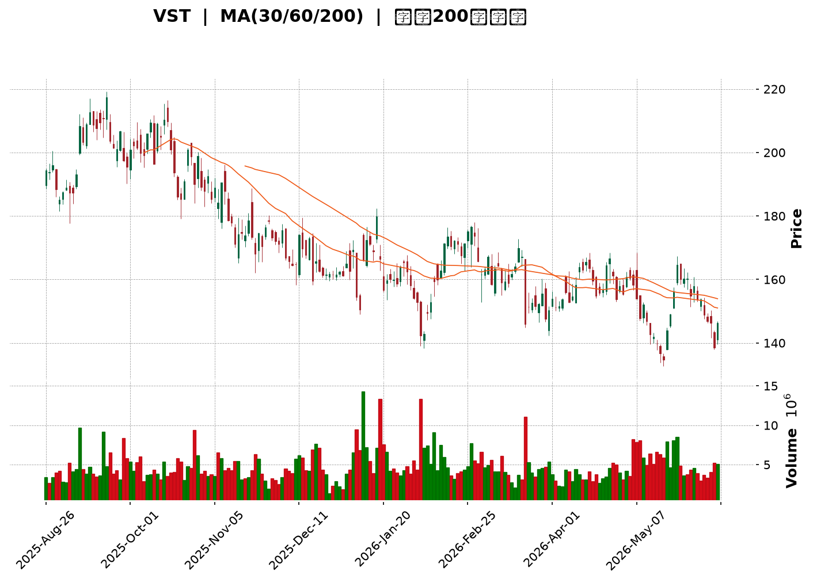
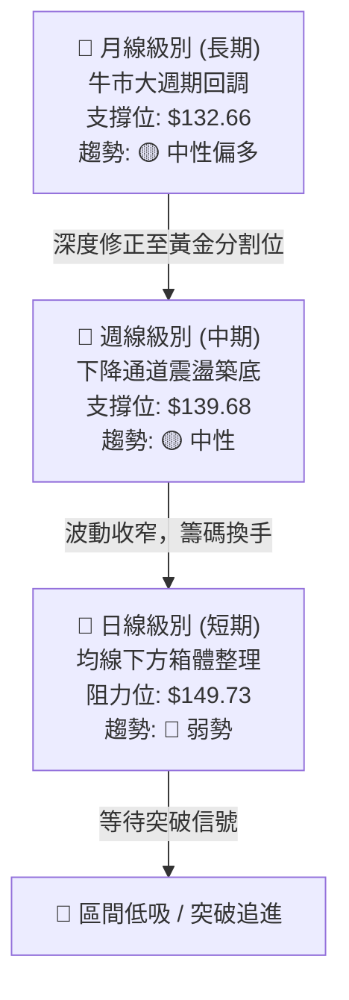
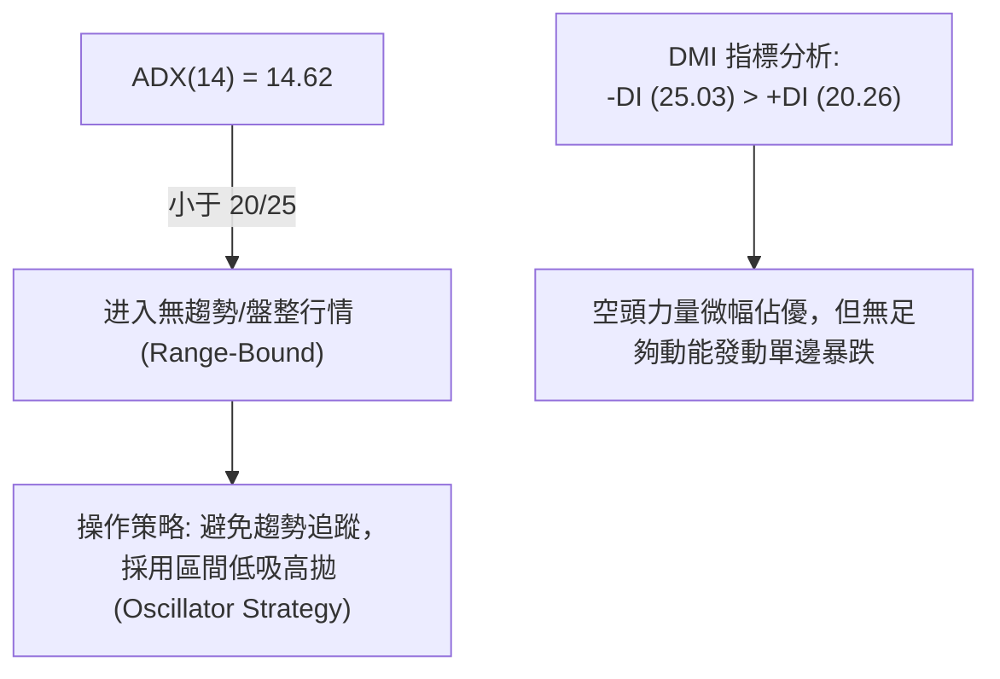

<details>
<summary>📊 靜態圖表 (點擊展開)</summary>

</details>

<html>
<head><meta charset="utf-8" /></head>
<body>
    <div style="height:500px; width:100%;">                        <script>window.PlotlyConfig = {MathJaxConfig: 'local'};</script>
        <script charset="utf-8" src="https://cdn.plot.ly/plotly-3.6.0.min.js" integrity="sha256-QaOVwtVY0T02VaHrr6pnoHLCwayMJp4O5n4YyaE3rJk=" crossorigin="anonymous"></script>                <div id="candlestick-chart" class="plotly-graph-div" style="height:100%; width:100%;"></div>            <script>                window.PLOTLYENV=window.PLOTLYENV || {};                                if (document.getElementById("candlestick-chart")) {                    Plotly.newPlot(                        "candlestick-chart",                        [{"close":{"dtype":"f8","bdata":"AAAAwPRLaEAAAABgYTtoQAAAAKBSfmhAAAAAQF+MZ0AAAAAALSNnQAAAACDQbGdAAAAAwCKgZ0AAAADg\u002fGhnQAAAAIBOaWdAAAAAoD0haEAAAACgHA1qQAAAAKCfaGlAAAAAQLscakAAAAAggZZqQAAAAOAfFGpAAAAAAGzwaUAAAABAZStqQAAAAEBZVmpAAAAAgD4qa0AAAABgsHVpQAAAAAAfMGlAAAAAYBQiaUAAAABgydRpQAAAAOCkrGhAAAAAoC5saEAAAADAkR5pQAAAAODyQmlAAAAAQOMtaUAAAABgd\u002ftoQAAAAGBB4mhAAAAA4Ge\u002faUAAAACAgC1qQAAAAOAtimhAAAAAQCQfakAAAACgN55pQAAAAICgSGpAAAAAIEQ6akAAAADAdhlpQAAAAACSNmhAAAAAwDVAZ0AAAADgMCpnQAAAAID72mdAAAAAAEsdaUAAAABgC9hoQAAAAGAXwmdAAAAAIEfaaEAAAABgAqZnQAAAAGADeWdAAAAAgEYQaEAAAACgUSdnQAAAACDMm2dAAAAAwJMDZ0AAAADgLM9nQAAAAABgeGdAAAAAoFZVZkAAAADg7zhmQAAAAMDOYmVAAAAAILHGZUAAAACgldBlQAAAAGATvmVAAAAAQLNUZkAAAACA+KllQAAAAIAHBGVAAAAAYA3VZUAAAADA1EtlQAAAAMAGCmZAAAAAwMNLZkAAAABAL6VlQAAAAIBmgmVAAAAAAK5lZUAAAAAAu\u002fJlQAAAAAC31mRAAAAA4DS1ZEAAAAAAZ4tkQAAAAADklmRAAAAA4NHDZUAAAACANzRlQAAAAOAt+WRAAAAAAB+fZUAAAADg8vBjQAAAAIDNtmRAAAAAYJlSZEAAAABgMitkQAAAAIBkLmRAAAAAAKk3ZEAAAACAZC5kQAAAACDTM2RAAAAAQMBMZEAAAAAAhyNkQAAAAEAooGRAAAAAQKhWZEAAAADgkSllQAAAAAB2TGNAAAAAoKLMYkAAAABglsRkQAAAAIAJi2VAAAAAoPdlZUAAAACgrBdlQAAAAMDnfWZAAAAAAPDLZEAAAACAFZNjQAAAACCq+WNAAAAAgIcEZEAAAAAg3PxjQAAAAED\u002f0mNAAAAAwCiBZEAAAABgQq1kQAAAAAB5S2RAAAAAIEzEY0AAAABgmEFjQAAAAKBUGWNAAAAAYG3KYUAAAADgANxhQAAAAMBGrmJAAAAAIF8YY0AAAAAgPuxjQAAAAIDR\u002fWNAAAAAIBdcZEAAAABgNGhlQAAAAEAwrmVAAAAAAM5KZUAAAAAAe4hlQAAAAABUZWVAAAAAAEnyZEAAAADAW2xlQAAAACDg42VAAAAAQIgSZkAAAABg5rRlQAAAAMBxuGRAAAAA4FkvZEAAAAAgZmRkQAAAAKCA5WRAAAAAQOLNY0AAAAAAtWxkQAAAACCihWRAAAAAoC7eY0AAAACAmutjQAAAAIB412NAAAAAYJ44ZEAAAACAZYNkQAAAAIBsPGVAAAAAQIvkZEAAAADgo0BiQAAAAKBH6WJAAAAAQAoXY0AAAADgUfBiQAAAAKCZCWNAAAAAIFxvY0AAAACgR3FiQAAAAGCPymJAAAAAYLg+Y0AAAACAwuViQAAAAEDh8mJAAAAAgMI1Y0AAAADgenxjQAAAAAAAGGNAAAAAIFxXY0AAAABgZsZjQAAAAEAKf2RAAAAAgBReZEAAAADA9bBkQAAAAGC4bmRAAAAAQDPzY0AAAADAHl1jQAAAAKBHeWNAAAAAQDObY0AAAABAM4tkQAAAAGCP0mRAAAAAANcjZEAAAACgRzljQAAAAEDhumNAAAAAwPVoY0AAAABAMxtkQAAAAAApDGRAAAAAoEfJY0AAAABgZj5jQAAAAEAKd2JAAAAAoJkBY0AAAAAA11tiQAAAACCF02FAAAAAwMy8YUAAAACAwnVhQAAAAAAAGGFAAAAAYLjWYEAAAAAAAABiQAAAAGCPomJAAAAA4KOIY0AAAACA65FkQAAAAMDMBGRAAAAAwPUIZEAAAAAgXAdkQAAAAOBRWGNAAAAAQAq\u002fY0AAAACgmTljQAAAAGBmNmNAAAAA4FGYYkAAAADAzFxiQAAAAEAKR2JAAAAAoEdRYUAAAAAAKUxiQA=="},"high":{"dtype":"f8","bdata":"A79c5NlcaEBWwRcW249oQHLeJpmCE2lASmH5zmZfaEDZN3L4SEVnQAomgEaFemdA9niTKwHsZ0DVf6FsbNZnQCgZWmBvumdAtml\u002f+hFYaEAiQXY\u002fGoJqQJgKV8TcYmpALyew\u002fCUtakCB7D7AICJrQAUfGRBun2pA397GF26fakBFlLEheLRqQFFiOQULqGpAtPSPh+Bma0CWJHHhvIVqQCEqak\u002fSs2lA6f1+t1N2aUDE1ZnPuN1pQIJ2YZTR0WlAAo+KuFb+aEAq2bVAtYtpQAQZiSHxjWlAgn9bXeIzakCdP12LcetpQL0jiLLDaGlAQH+kBVLBaUDNzA\u002ffpU9qQMAbwf4heWpAcn7n+ucrakDCWciuzQhqQMcQhxMX7mpA8ftPiRMQa0C96gXwGC9qQBvVHPblnWlAjVHH5mYcaEBLWKq9Tp9nQHhycih49WdATc5azDQuaUCukWQuLmNpQABIP\u002fmymGhA4pDYlK0FaUBHBE4RushoQHXSVh59C2hAo\u002fQ35OJUaEAF1ub1z95nQPap2e4+\u002fmdA5gD4RS6TZ0Du0QyPkdFnQFhOTb9DiGhAOsj7YYZtZ0D4mF9MoZlmQBLKVk0LL2ZAiDmM4SRwZkAcwxeS02BmQPyAQLnPHWZAh7IgKAOgZkBnlu71mphnQKPoHfh1pmVA0U+jhffWZUCdE3nn98dlQMw\u002fz7NXKGZAJ+y0bbeIZkBSyxZ10P9lQH\u002fM5ZPm7mVAli+h4+KrZUAsB4h56jFmQGLAHg6aBGZAJoTbCXXrZED1OGk+Jy5lQImwBxUEsmRAXnvd9RLNZUDZS2QBJXBmQL5OkcLCkGVAApUGTXCuZUAfj2JpDdVlQA6VedZLbmVAbu1EZwVeZUDQ\u002fPDLwYJkQH47vJhDb2RA5lp\u002fBqJLZECRZnkI5VhkQFGLm+k9f2RAIwz+1s9aZECEfsg\u002f1IhkQEgH4a2UIWVAEKisIXptZUB01u3g\u002fotlQNfPv7VyDWVAt+Vx+M5yY0DWkgoYENBlQBlTw9P5D2ZAJxe9ZsDmZUDWUGk2TF5lQKarnjD2yWZA9USdTmFcZUD0MoZww7hkQPvLnIBMOGRAjzscVd9oZED\u002fW6RvvVRkQLEtfba2omRA2X6A26mMZEAXjam7qMpkQBuDQHrX9GRAZxNSPtSIZEADYpTKYvhjQEFBQZEtiWNAbrru7WsuY0Db9TfA2PZhQAiGwL+uAWNA5F8LRCtyY0CIRWMwZyZkQDv5Raq2omRAARczi3m\u002fZECNiVcao21lQOdB6FoZDWZA+Fupe1noZUBolAC4t4plQCo0mdBvqGVAzfEKimNzZUA6jJeURm5lQHMO+QZp9mVArUW3TKIfZkDBL\u002fmsJUJmQAdfaP3xCGZAk2r309RpZED2UrLjj39kQN4wkMO392RAxNJH6tEEZUAv73C6+4xkQPqmfALsEWVAYuqoGYh4ZEBq0wkaSV9kQKiLxA16oGRAFUYlZt9oZEAql7TjgadkQBhkHFx1mGVAhjZJnc4rZUAAAABACs9kQAAAAMDMfGNAAAAAQDNDY0AAAABgZr5jQAAAAKBwFWNAAAAAYGYGZEAAAACAwt1jQAAAAEAK72JAAAAAQOGKY0AAAACA61FjQAAAACBcI2NAAAAAwB5FY0AAAACA6ylkQAAAAMD1UGRAAAAAACnUY0AAAABAChdkQAAAAMD1qGRAAAAA4KPQZEAAAACgcN1kQAAAACCuD2VAAAAAoJmBZEAAAABAMyNkQAAAAGCP4mNAAAAAANfbY0AAAAAgXK9kQAAAAKBwDWVAAAAAYGZqZEAAAADAciRkQAAAAAAp9GNAAAAA4HoEZEAAAAAAKUxkQAAAAKCZeWRAAAAAIK5fZEAAAADgegxlQAAAAAAAYGNAAAAAAAAYY0AAAAAAVspiQAAAAMD1SGJAAAAAoHDpYUAAAABA4aJhQAAAAKBHcWFAAAAAYGYWYUAAAADAzBxiQAAAAMD1qGJAAAAAgD2yY0AAAADAzOxkQAAAAEC0oGRAAAAAwPVwZEAAAACgR0lkQAAAAKCZ0WNAAAAAwPUYZEAAAADAHr1jQAAAAKBHQWNAAAAAoEdJY0AAAACgmaliQAAAAKCZyWJAAAAAAAAAYkAAAADAzFxiQA=="},"hovertemplate":"\u003cb\u003e%{x|%Y-%m-%d}\u003c\u002fb\u003e\u003cbr\u003e\u958b: $%{open:.2f}\u003cbr\u003e\u9ad8: $%{high:.2f}\u003cbr\u003e\u4f4e: $%{low:.2f}\u003cbr\u003e\u6536: $%{close:.2f}\u003cextra\u003e\u003c\u002fextra\u003e","low":{"dtype":"f8","bdata":"mz+3zgWUZ0CYOMySbPFnQLJasm0EPGhASwZQxeg+Z0BikbFRl6xmQEns79JQ9GZA7zh7xFyCZ0B9BzFC6zdmQKRXUErs\u002fGZA7pSNc4+PZ0AYNzTahOdoQBwwwgRXSmlABKEAuZcnaUDrm6RTuxxqQBL2X+6r0GlAlDutL2N8aUDUzkQ+IuhpQB0Q9FfQk2lAyZUNtUvnaUB\u002faOk2zFxpQPJ\u002f28gOKmlADvYUwg1vaECg\u002f8v2pw1pQM4khyn8pGhA4PQMFprFZ0Ap+tAeg\u002fRnQMzwV1k3xWhAtTW0LEAeaUAqBIBTXpxoQOVeV3oQa2hA748Yd2\u002fyaEAAwBISophpQPRte3OKiWhAlnBstSX7aEAzqDUuDxtpQBO4eVmeumlAa6VGcoEDakAmn8Bw+u9oQB9gcDDXCGhAnHZFzOQhZ0CYEjyc+WRmQO3KyYJcJmdAM13+6w5CaEBMtvvjsH5oQO2IFmLK\u002fmZA2uG4n1meZ0DbzVACrIBnQO9kh2p54GZAu7BtYIZqZ0B0Qml2v\u002f9mQD+PwlJ4DWdAR8UESCVhZkBLeLvZpANmQPYQHOjl9GZArXeMRCtKZkCQaGy5qRlmQNT5yJOeQWVA8LPAb\u002fmjZEDdZzwFl5RlQMHqIUoWRmVA9cVKkrG3ZUAQIiPC6JRlQBJGHG\u002fFP2RAn7\u002f1nS+uZEAE9S6JWK5kQBdnHkZ5k2VAq9UDq6MwZkBo3zNM3oZlQFga+LiVXGVArM22goQPZUB6N\u002foiDkBlQCs14WhgwGRA4\u002f9U1HdzZEDRv9Zt2YhkQKa3GSfTxmNAeDFO9yISZECxjUvhPuFkQMdVpqOm0GRAyyAT2e3CZECo1JWja8hjQLUfwWwcR2RAmkkPcRFIZECN2AQpMBRkQF34bA8u\u002fWNAtWVo8KzxY0AzGO7aNQRkQGF16KGY9mNASrehKOYaZEDSaEEaAyBkQFcdIPRVdWRAzy\u002fV0xj\u002fY0BAxdMK0nFkQJddQzSWKmNAh1onnJOfYkD3idXX7bRkQFyorFpoe2RAq4kbMstSZUAVjvaVXLpkQEFsc5tGbmVANm58sDZZZECZGeQ\u002fMIFjQGeCRN\u002fvMWNA+X70oNzdY0DbGYbIHLljQAz0vafqtWNAy67ez+e9Y0BcBOA+GB5kQAGGwU890WNAcC69oK6UY0AGnxLRPjpjQFWVf\u002fr8xWJAHvr7pJFiYUCx\u002fFPK60phQNd3poIDZ2JAsSx0i4RyYkAuHMfUK1NjQGZzDDuwymNA7pOGwc4FZEA7QeC79ShkQKJ+WMD9NmVA0MucViAsZUC2A3NtqgBlQIPqawiiGGVAqMdsp4SfZECfKmxJD1VkQKkOnEwlO2VA7GTatl18ZED\u002fM2LaB1VlQIkeG8lUs2RALoCz77AYY0CCAyvIzgVkQF+XTDW2LmRApwPkB7PCY0B3Jv4yPlljQLgrZ++YgmRAMdPJXwleY0DFTuKjkY9jQNMie917sGNAntDsWor8Y0Dic7zJxTxkQFl93g7JqGRAMWFgajOAZEAAAABgjxpiQAAAAGC4qmJAAAAAoJmxYkAAAAAAKcxiQAAAACCuT2JAAAAAAAD4YkAAAABAM1NiQAAAAEDhymFAAAAAwMzsYkAAAAAA18NiQAAAAAApvGJAAAAAwPXIYkAAAACgR2ljQAAAAIDCFWNAAAAAIIUjY0AAAADAzBRjQAAAAEAKC2RAAAAAwMxEZEAAAAAghVNkQAAAAOBRSGRAAAAAgD3KY0AAAAAAKURjQAAAAKBwXWNAAAAAAABQY0AAAADAzGRjQAAAACCF12NAAAAAQArXY0AAAABgjyJjQAAAACBcd2NAAAAAgMJdY0AAAACAFK5jQAAAAKCZ+WNAAAAAQDOTY0AAAADgozhjQAAAACBcX2JAAAAAYOVIYkAAAADAHjViQAAAAOBRcGFAAAAAAIF9YUAAAACA6zlhQAAAACCFu2BAAAAAwB6VYEAAAACA6zlhQAAAAAApHGJAAAAAAADYYkAAAABACsdjQAAAAGAOzWNAAAAAQDOzY0AAAAAAKZxjQAAAAGCP6mJAAAAAACkcY0AAAABgZh5jQAAAAIAUxmJAAAAAAABwYkAAAAAAKUxiQAAAAKBHsWFAAAAAwB49YUAAAACAPXJhQA=="},"name":"\u50f9\u683c","open":{"dtype":"f8","bdata":"bX2ddha3Z0AgJx1mdDJoQPeZ8aCBTmhAwxjc8qlZaEB0f5+bAvtmQMI6e447KWdA0ocIgN2IZ0C5gphetrBnQPawbV2sm2dA2vJiUr6oZ0DMl8FuGPhoQCeCjohn\u002f2lANM7TzMJEaUDrm6RTuxxqQAUfGRBun2pA\u002fd2mlpNPakD+ZftKz49qQNMrF54iW2pAI2MA7GlNakDrgK0AAzFqQDAJllBqVmlAiLzwAY+uaEC\u002fpcFArRRpQKZsCdI0LmlA9e3mwojUaEDFcYOt0k5oQKLemmdOb2lARfYvKDN5aUBEDnO19bJpQHHue+Z7IGlA1X4ds80gaUBmZmYmxM1pQK6S9bnXJWpAuxb7uB8SaUCZiJ8PJ6dpQOOqh0DNF2pAcpXZAFzGakAbJ32bJeNpQPX719otcmlAqgggdCsLaEC6mrJWFGFnQO3KyYJcJmdAj78i0uGBaECukWQuLmNpQABIP\u002fmymGhA+RxkLqn4Z0DbSgBtnERoQOL6OlAW72dAfCGJqRzJZ0Cv5PuHoXJnQDhf6rTpN2dAjcoVo17MZkDnrEHBRkBmQJ38\u002f9hwSGhAyOBBDxAtZ0D8KQPsrHpmQDvX6FqJDWZAuA4OewjXZEAW36htTt5lQGnrTDDphWVA6WDS37DVZUDAIlOj9QlnQFStflrZcGVAGB01m00jZUCNddDPObNlQB3O\u002f0OssGVAWovLdztQZkBBhlfO0PBlQMsfDltZ3WVAP\u002fVZOemFZUAPoWNJqG1lQDcuH2kXAWZAJoTbCXXrZEAlTjffRZ1kQOGln8pQnGRAa75SQ1MzZEDu8c+e99ZlQH04cgl8j2VAKwzWtx7GZEAEMMXk\u002fbBlQNryFiCHpmRAxQ6OPbfHZEDdA5jB2XhkQNnupn0yK2RAPHgak6kYZEAAAACAZC5kQAXR0j\u002f7GGRAo9g2K\u002fA4ZEDjN1EXYVVkQFcdIPRVdWRAFeGp4XQkZUDSFx8KohhlQNfPv7VyDWVAcxa3ezthY0DhaV3r9cJlQLV+LgVDjmRAoUE4NWq4ZUATESKQGCVlQK1VWmB1mGVA49PnxUvqZEDEpO8ZnCFkQNVrcGVj2WNARLKTWrM2ZEDxFs92BvljQPh20CLhC2RATwRwwl3pY0CGKIR7w7hkQChcjkd8t2RAjIjnuPUoZEDBGiRr7a1jQM7N2M4IfWNAHAaw7GYfY0CJMst52plhQFJRGhh2uWJA8v8SBXa5YkDlJ3uyzgVkQGZ\u002f6Z\u002fOmGRAdK7CcloQZEDkHrxwuEVkQDA5YP+1VGVAxh1p\u002fLu4ZUBhriGntjVlQGspz9QWgmVAdgdYjgpNZUBs2wHvquFkQFTppkGlhGVAME6JzgxkZUCI0fQcX9hlQHAlswT7PmVALIKNHAgvZED6h48A1itkQAbt43kaNWRAeNvwJTuHZEDjuL7nAHZjQIvOaslPpGRAqDHPkxFsZEDokT9mtptjQFAc+6NEMWRAeItQTPsYZEBraXqW0lJkQNfRpETGsGRAE1taGyfeZEAAAABACs9kQAAAAGBm7mJAAAAAoJnRYkAAAAAAAGBjQAAAAAAAsGJAAAAAAAD4YkAAAABAM6NjQAAAAMDM\u002fGFAAAAAQArvYkAAAABguOZiQAAAAKBH4WJAAAAAgD3iYkAAAAAAABhkQAAAAOB6fGNAAAAAAAAwY0AAAADAzBRjQAAAAMAeTWRAAAAAAACwZEAAAACAPZJkQAAAAOBRyGRAAAAAoJlhZEAAAADgURhkQAAAAKCZuWNAAAAAYLh+Y0AAAABgj4pjQAAAAAAAoGRAAAAAAABQZEAAAAAghRtkQAAAAKBHiWNAAAAAgOvJY0AAAACAFLZjQAAAAAAAYGRAAAAAANcvZEAAAACgR2FkQAAAAAAAYGNAAAAAAACAYkAAAAAgrq9iQAAAAMD1SGJAAAAAACmsYUAAAADAzHhhQAAAAAAAYGFAAAAAoJn5YEAAAAAAAEBhQAAAAEAKL2JAAAAAwPXgYkAAAADAHt1jQAAAAGC4nmRAAAAAQOHaY0AAAAAAAABkQAAAAAAAoGNAAAAAgBR+Y0AAAADgUZBjQAAAAKBH8WJAAAAAAAAAY0AAAACA64liQAAAAKBwjWJAAAAAQDPrYUAAAAAgrp9hQA=="},"x":["2025-08-26T00:00:00-04:00","2025-08-27T00:00:00-04:00","2025-08-28T00:00:00-04:00","2025-08-29T00:00:00-04:00","2025-09-02T00:00:00-04:00","2025-09-03T00:00:00-04:00","2025-09-04T00:00:00-04:00","2025-09-05T00:00:00-04:00","2025-09-08T00:00:00-04:00","2025-09-09T00:00:00-04:00","2025-09-10T00:00:00-04:00","2025-09-11T00:00:00-04:00","2025-09-12T00:00:00-04:00","2025-09-15T00:00:00-04:00","2025-09-16T00:00:00-04:00","2025-09-17T00:00:00-04:00","2025-09-18T00:00:00-04:00","2025-09-19T00:00:00-04:00","2025-09-22T00:00:00-04:00","2025-09-23T00:00:00-04:00","2025-09-24T00:00:00-04:00","2025-09-25T00:00:00-04:00","2025-09-26T00:00:00-04:00","2025-09-29T00:00:00-04:00","2025-09-30T00:00:00-04:00","2025-10-01T00:00:00-04:00","2025-10-02T00:00:00-04:00","2025-10-03T00:00:00-04:00","2025-10-06T00:00:00-04:00","2025-10-07T00:00:00-04:00","2025-10-08T00:00:00-04:00","2025-10-09T00:00:00-04:00","2025-10-10T00:00:00-04:00","2025-10-13T00:00:00-04:00","2025-10-14T00:00:00-04:00","2025-10-15T00:00:00-04:00","2025-10-16T00:00:00-04:00","2025-10-17T00:00:00-04:00","2025-10-20T00:00:00-04:00","2025-10-21T00:00:00-04:00","2025-10-22T00:00:00-04:00","2025-10-23T00:00:00-04:00","2025-10-24T00:00:00-04:00","2025-10-27T00:00:00-04:00","2025-10-28T00:00:00-04:00","2025-10-29T00:00:00-04:00","2025-10-30T00:00:00-04:00","2025-10-31T00:00:00-04:00","2025-11-03T00:00:00-05:00","2025-11-04T00:00:00-05:00","2025-11-05T00:00:00-05:00","2025-11-06T00:00:00-05:00","2025-11-07T00:00:00-05:00","2025-11-10T00:00:00-05:00","2025-11-11T00:00:00-05:00","2025-11-12T00:00:00-05:00","2025-11-13T00:00:00-05:00","2025-11-14T00:00:00-05:00","2025-11-17T00:00:00-05:00","2025-11-18T00:00:00-05:00","2025-11-19T00:00:00-05:00","2025-11-20T00:00:00-05:00","2025-11-21T00:00:00-05:00","2025-11-24T00:00:00-05:00","2025-11-25T00:00:00-05:00","2025-11-26T00:00:00-05:00","2025-11-28T00:00:00-05:00","2025-12-01T00:00:00-05:00","2025-12-02T00:00:00-05:00","2025-12-03T00:00:00-05:00","2025-12-04T00:00:00-05:00","2025-12-05T00:00:00-05:00","2025-12-08T00:00:00-05:00","2025-12-09T00:00:00-05:00","2025-12-10T00:00:00-05:00","2025-12-11T00:00:00-05:00","2025-12-12T00:00:00-05:00","2025-12-15T00:00:00-05:00","2025-12-16T00:00:00-05:00","2025-12-17T00:00:00-05:00","2025-12-18T00:00:00-05:00","2025-12-19T00:00:00-05:00","2025-12-22T00:00:00-05:00","2025-12-23T00:00:00-05:00","2025-12-24T00:00:00-05:00","2025-12-26T00:00:00-05:00","2025-12-29T00:00:00-05:00","2025-12-30T00:00:00-05:00","2025-12-31T00:00:00-05:00","2026-01-02T00:00:00-05:00","2026-01-05T00:00:00-05:00","2026-01-06T00:00:00-05:00","2026-01-07T00:00:00-05:00","2026-01-08T00:00:00-05:00","2026-01-09T00:00:00-05:00","2026-01-12T00:00:00-05:00","2026-01-13T00:00:00-05:00","2026-01-14T00:00:00-05:00","2026-01-15T00:00:00-05:00","2026-01-16T00:00:00-05:00","2026-01-20T00:00:00-05:00","2026-01-21T00:00:00-05:00","2026-01-22T00:00:00-05:00","2026-01-23T00:00:00-05:00","2026-01-26T00:00:00-05:00","2026-01-27T00:00:00-05:00","2026-01-28T00:00:00-05:00","2026-01-29T00:00:00-05:00","2026-01-30T00:00:00-05:00","2026-02-02T00:00:00-05:00","2026-02-03T00:00:00-05:00","2026-02-04T00:00:00-05:00","2026-02-05T00:00:00-05:00","2026-02-06T00:00:00-05:00","2026-02-09T00:00:00-05:00","2026-02-10T00:00:00-05:00","2026-02-11T00:00:00-05:00","2026-02-12T00:00:00-05:00","2026-02-13T00:00:00-05:00","2026-02-17T00:00:00-05:00","2026-02-18T00:00:00-05:00","2026-02-19T00:00:00-05:00","2026-02-20T00:00:00-05:00","2026-02-23T00:00:00-05:00","2026-02-24T00:00:00-05:00","2026-02-25T00:00:00-05:00","2026-02-26T00:00:00-05:00","2026-02-27T00:00:00-05:00","2026-03-02T00:00:00-05:00","2026-03-03T00:00:00-05:00","2026-03-04T00:00:00-05:00","2026-03-05T00:00:00-05:00","2026-03-06T00:00:00-05:00","2026-03-09T00:00:00-04:00","2026-03-10T00:00:00-04:00","2026-03-11T00:00:00-04:00","2026-03-12T00:00:00-04:00","2026-03-13T00:00:00-04:00","2026-03-16T00:00:00-04:00","2026-03-17T00:00:00-04:00","2026-03-18T00:00:00-04:00","2026-03-19T00:00:00-04:00","2026-03-20T00:00:00-04:00","2026-03-23T00:00:00-04:00","2026-03-24T00:00:00-04:00","2026-03-25T00:00:00-04:00","2026-03-26T00:00:00-04:00","2026-03-27T00:00:00-04:00","2026-03-30T00:00:00-04:00","2026-03-31T00:00:00-04:00","2026-04-01T00:00:00-04:00","2026-04-02T00:00:00-04:00","2026-04-06T00:00:00-04:00","2026-04-07T00:00:00-04:00","2026-04-08T00:00:00-04:00","2026-04-09T00:00:00-04:00","2026-04-10T00:00:00-04:00","2026-04-13T00:00:00-04:00","2026-04-14T00:00:00-04:00","2026-04-15T00:00:00-04:00","2026-04-16T00:00:00-04:00","2026-04-17T00:00:00-04:00","2026-04-20T00:00:00-04:00","2026-04-21T00:00:00-04:00","2026-04-22T00:00:00-04:00","2026-04-23T00:00:00-04:00","2026-04-24T00:00:00-04:00","2026-04-27T00:00:00-04:00","2026-04-28T00:00:00-04:00","2026-04-29T00:00:00-04:00","2026-04-30T00:00:00-04:00","2026-05-01T00:00:00-04:00","2026-05-04T00:00:00-04:00","2026-05-05T00:00:00-04:00","2026-05-06T00:00:00-04:00","2026-05-07T00:00:00-04:00","2026-05-08T00:00:00-04:00","2026-05-11T00:00:00-04:00","2026-05-12T00:00:00-04:00","2026-05-13T00:00:00-04:00","2026-05-14T00:00:00-04:00","2026-05-15T00:00:00-04:00","2026-05-18T00:00:00-04:00","2026-05-19T00:00:00-04:00","2026-05-20T00:00:00-04:00","2026-05-21T00:00:00-04:00","2026-05-22T00:00:00-04:00","2026-05-26T00:00:00-04:00","2026-05-27T00:00:00-04:00","2026-05-28T00:00:00-04:00","2026-05-29T00:00:00-04:00","2026-06-01T00:00:00-04:00","2026-06-02T00:00:00-04:00","2026-06-03T00:00:00-04:00","2026-06-04T00:00:00-04:00","2026-06-05T00:00:00-04:00","2026-06-08T00:00:00-04:00","2026-06-09T00:00:00-04:00","2026-06-10T00:00:00-04:00","2026-06-11T00:00:00-04:00"],"type":"candlestick"},{"hovertemplate":"MA30: $%{y:.2f}\u003cextra\u003e\u003c\u002fextra\u003e","line":{"color":"#2196F3","dash":"dash","width":2},"mode":"lines","name":"MA30","x":["2025-08-26T00:00:00-04:00","2025-08-27T00:00:00-04:00","2025-08-28T00:00:00-04:00","2025-08-29T00:00:00-04:00","2025-09-02T00:00:00-04:00","2025-09-03T00:00:00-04:00","2025-09-04T00:00:00-04:00","2025-09-05T00:00:00-04:00","2025-09-08T00:00:00-04:00","2025-09-09T00:00:00-04:00","2025-09-10T00:00:00-04:00","2025-09-11T00:00:00-04:00","2025-09-12T00:00:00-04:00","2025-09-15T00:00:00-04:00","2025-09-16T00:00:00-04:00","2025-09-17T00:00:00-04:00","2025-09-18T00:00:00-04:00","2025-09-19T00:00:00-04:00","2025-09-22T00:00:00-04:00","2025-09-23T00:00:00-04:00","2025-09-24T00:00:00-04:00","2025-09-25T00:00:00-04:00","2025-09-26T00:00:00-04:00","2025-09-29T00:00:00-04:00","2025-09-30T00:00:00-04:00","2025-10-01T00:00:00-04:00","2025-10-02T00:00:00-04:00","2025-10-03T00:00:00-04:00","2025-10-06T00:00:00-04:00","2025-10-07T00:00:00-04:00","2025-10-08T00:00:00-04:00","2025-10-09T00:00:00-04:00","2025-10-10T00:00:00-04:00","2025-10-13T00:00:00-04:00","2025-10-14T00:00:00-04:00","2025-10-15T00:00:00-04:00","2025-10-16T00:00:00-04:00","2025-10-17T00:00:00-04:00","2025-10-20T00:00:00-04:00","2025-10-21T00:00:00-04:00","2025-10-22T00:00:00-04:00","2025-10-23T00:00:00-04:00","2025-10-24T00:00:00-04:00","2025-10-27T00:00:00-04:00","2025-10-28T00:00:00-04:00","2025-10-29T00:00:00-04:00","2025-10-30T00:00:00-04:00","2025-10-31T00:00:00-04:00","2025-11-03T00:00:00-05:00","2025-11-04T00:00:00-05:00","2025-11-05T00:00:00-05:00","2025-11-06T00:00:00-05:00","2025-11-07T00:00:00-05:00","2025-11-10T00:00:00-05:00","2025-11-11T00:00:00-05:00","2025-11-12T00:00:00-05:00","2025-11-13T00:00:00-05:00","2025-11-14T00:00:00-05:00","2025-11-17T00:00:00-05:00","2025-11-18T00:00:00-05:00","2025-11-19T00:00:00-05:00","2025-11-20T00:00:00-05:00","2025-11-21T00:00:00-05:00","2025-11-24T00:00:00-05:00","2025-11-25T00:00:00-05:00","2025-11-26T00:00:00-05:00","2025-11-28T00:00:00-05:00","2025-12-01T00:00:00-05:00","2025-12-02T00:00:00-05:00","2025-12-03T00:00:00-05:00","2025-12-04T00:00:00-05:00","2025-12-05T00:00:00-05:00","2025-12-08T00:00:00-05:00","2025-12-09T00:00:00-05:00","2025-12-10T00:00:00-05:00","2025-12-11T00:00:00-05:00","2025-12-12T00:00:00-05:00","2025-12-15T00:00:00-05:00","2025-12-16T00:00:00-05:00","2025-12-17T00:00:00-05:00","2025-12-18T00:00:00-05:00","2025-12-19T00:00:00-05:00","2025-12-22T00:00:00-05:00","2025-12-23T00:00:00-05:00","2025-12-24T00:00:00-05:00","2025-12-26T00:00:00-05:00","2025-12-29T00:00:00-05:00","2025-12-30T00:00:00-05:00","2025-12-31T00:00:00-05:00","2026-01-02T00:00:00-05:00","2026-01-05T00:00:00-05:00","2026-01-06T00:00:00-05:00","2026-01-07T00:00:00-05:00","2026-01-08T00:00:00-05:00","2026-01-09T00:00:00-05:00","2026-01-12T00:00:00-05:00","2026-01-13T00:00:00-05:00","2026-01-14T00:00:00-05:00","2026-01-15T00:00:00-05:00","2026-01-16T00:00:00-05:00","2026-01-20T00:00:00-05:00","2026-01-21T00:00:00-05:00","2026-01-22T00:00:00-05:00","2026-01-23T00:00:00-05:00","2026-01-26T00:00:00-05:00","2026-01-27T00:00:00-05:00","2026-01-28T00:00:00-05:00","2026-01-29T00:00:00-05:00","2026-01-30T00:00:00-05:00","2026-02-02T00:00:00-05:00","2026-02-03T00:00:00-05:00","2026-02-04T00:00:00-05:00","2026-02-05T00:00:00-05:00","2026-02-06T00:00:00-05:00","2026-02-09T00:00:00-05:00","2026-02-10T00:00:00-05:00","2026-02-11T00:00:00-05:00","2026-02-12T00:00:00-05:00","2026-02-13T00:00:00-05:00","2026-02-17T00:00:00-05:00","2026-02-18T00:00:00-05:00","2026-02-19T00:00:00-05:00","2026-02-20T00:00:00-05:00","2026-02-23T00:00:00-05:00","2026-02-24T00:00:00-05:00","2026-02-25T00:00:00-05:00","2026-02-26T00:00:00-05:00","2026-02-27T00:00:00-05:00","2026-03-02T00:00:00-05:00","2026-03-03T00:00:00-05:00","2026-03-04T00:00:00-05:00","2026-03-05T00:00:00-05:00","2026-03-06T00:00:00-05:00","2026-03-09T00:00:00-04:00","2026-03-10T00:00:00-04:00","2026-03-11T00:00:00-04:00","2026-03-12T00:00:00-04:00","2026-03-13T00:00:00-04:00","2026-03-16T00:00:00-04:00","2026-03-17T00:00:00-04:00","2026-03-18T00:00:00-04:00","2026-03-19T00:00:00-04:00","2026-03-20T00:00:00-04:00","2026-03-23T00:00:00-04:00","2026-03-24T00:00:00-04:00","2026-03-25T00:00:00-04:00","2026-03-26T00:00:00-04:00","2026-03-27T00:00:00-04:00","2026-03-30T00:00:00-04:00","2026-03-31T00:00:00-04:00","2026-04-01T00:00:00-04:00","2026-04-02T00:00:00-04:00","2026-04-06T00:00:00-04:00","2026-04-07T00:00:00-04:00","2026-04-08T00:00:00-04:00","2026-04-09T00:00:00-04:00","2026-04-10T00:00:00-04:00","2026-04-13T00:00:00-04:00","2026-04-14T00:00:00-04:00","2026-04-15T00:00:00-04:00","2026-04-16T00:00:00-04:00","2026-04-17T00:00:00-04:00","2026-04-20T00:00:00-04:00","2026-04-21T00:00:00-04:00","2026-04-22T00:00:00-04:00","2026-04-23T00:00:00-04:00","2026-04-24T00:00:00-04:00","2026-04-27T00:00:00-04:00","2026-04-28T00:00:00-04:00","2026-04-29T00:00:00-04:00","2026-04-30T00:00:00-04:00","2026-05-01T00:00:00-04:00","2026-05-04T00:00:00-04:00","2026-05-05T00:00:00-04:00","2026-05-06T00:00:00-04:00","2026-05-07T00:00:00-04:00","2026-05-08T00:00:00-04:00","2026-05-11T00:00:00-04:00","2026-05-12T00:00:00-04:00","2026-05-13T00:00:00-04:00","2026-05-14T00:00:00-04:00","2026-05-15T00:00:00-04:00","2026-05-18T00:00:00-04:00","2026-05-19T00:00:00-04:00","2026-05-20T00:00:00-04:00","2026-05-21T00:00:00-04:00","2026-05-22T00:00:00-04:00","2026-05-26T00:00:00-04:00","2026-05-27T00:00:00-04:00","2026-05-28T00:00:00-04:00","2026-05-29T00:00:00-04:00","2026-06-01T00:00:00-04:00","2026-06-02T00:00:00-04:00","2026-06-03T00:00:00-04:00","2026-06-04T00:00:00-04:00","2026-06-05T00:00:00-04:00","2026-06-08T00:00:00-04:00","2026-06-09T00:00:00-04:00","2026-06-10T00:00:00-04:00","2026-06-11T00:00:00-04:00"],"y":{"dtype":"f8","bdata":"AAAAAAAA+H8AAAAAAAD4fwAAAAAAAPh\u002fAAAAAAAA+H8AAAAAAAD4fwAAAAAAAPh\u002fAAAAAAAA+H8AAAAAAAD4fwAAAAAAAPh\u002fAAAAAAAA+H8AAAAAAAD4fwAAAAAAAPh\u002fAAAAAAAA+H8AAAAAAAD4fwAAAAAAAPh\u002fAAAAAAAA+H8AAAAAAAD4fwAAAAAAAPh\u002fAAAAAAAA+H8AAAAAAAD4fwAAAAAAAPh\u002fAAAAAAAA+H8AAAAAAAD4fwAAAAAAAPh\u002fAAAAAAAA+H8AAAAAAAD4fwAAAAAAAPh\u002fAAAAAAAA+H8AAAAAAAD4f7y7u+tk\u002fWhAAAAAoMYJaUAzMzNDYRppQAAAAHDGGmlAAAAA8LswaUBVVVX15kVpQFVVVcVLXmlAVVVVFYB0aUC8u7uL6oJpQBERESHCiWlA3t3d3UGCaUCJiIhooGlpQERERDRfXGlAZmZmdttTaUC8u7ur+URpQGZmZpYsMWlAd3d3F+cnaUC8u7vLYxJpQAAAAADy+WhAzczMzHrfaECamZn5zMtoQO\u002fu7r5SvmhAREREZD2saEARERFx\u002fJpoQBEREeG1kGhAERER4eF+aECJiIhIKWZoQDMzMwMXRWhA7+7uzgwoaECJiIhIBQ1oQDMzM\u002fM28mdAvLu7yw7VZ0AzMzNDiq5nQKuqqup3kGdA3t3djd1rZ0BERERk\u002fEZnQBERERHEImdAERERQTcBZ0B3d3dnveNmQDMzM+OqzGZAAAAAkNm8ZkBERETEd7JmQAAAAMC5mGZAmpmZaR9zZkBEREREb05mQFVVVQVlM2ZAd3d3xwsZZkDv7u6uLwRmQERERMTb7mVA3t3dHQXaZUDv7u6Om75lQHd3d2fopWVAAAAAIPGOZUDe3d094G9lQDMzM1PPU2VAERERAcFBZUBVVVX1VTBlQBEREYE8JmVAiYiIaKMZZUDv7u4eVgtlQImIiEjOAWVAq6qq6s3wZECrqqo6huxkQO\u002fu7j7f3WRAIiIi0v3DZEDe3d29e79kQJqZmRlAu2RAmpmZKZezZEC8u7ub365kQImIiMhBt2RAmpmZ2SGyZECamZmZ4J1kQN7d3U2ClmRAiYiIqJ6QZEC8u7tL3otkQLy7u6tWhWRAzczMTJV6ZECamZmpFXZkQN7d3V1LcGRAmpmZiXdgZEAAAAAwn1pkQEREROTWTGRAMzMz0zs3ZECamZn5hiNkQO\u002fu7i65FmRAd3d3pyUNZEDNzMws8QpkQCIiIlIkCWRAd3d3N6cJZEC8u7vLeRRkQAAAABB6HWRAREREdJ0lZEC8u7tbxyhkQAAAAKCsOmRAiYiI+P5MZEDe3d2dllJkQERERLSMVWRAIiIiQk1bZECrqqrqimBkQCIiImJtUWRA3t3dLTVMZEBVVVVVL1NkQBEREdELW2RAIiIigjlZZEAAAADw81xkQM3MzEzoYmRAAAAAkHldZECJiIgIBVdkQGZmZiYnU2RAIiIiwgdXZEC8u7vLwWFkQDMzM1P+c2RAmpmZyXaOZEDe3d2N0ZFkQM3MzAzJk2RAAAAAsL2TZEAiIiLyV4tkQDMzM\u002fMzg2RAmpmZ2U97ZEARERGxA2JkQCIiIjJcSWRAIiIiAuQ3ZEBERERkZiFkQDMzM7OEDGRAq6qqarP9Y0C8u7vrK+1jQN7d3R1P1WNAiYiI2AC+Y0DNzMwcha1jQDMzM0Obq2NAREREBCqtY0BmZmZWt69jQKuqqrrBq2NAmpmZKQCtY0Dv7u6e8qNjQLy7u6sAm2NAd3d3F8WYY0C8u7v7Fp5jQM3MzJx1pmNAzczMTMSlY0De3d1Nw5pjQERERFTpjWNAZmZmNkKBY0CrqqrKE5FjQImIiPjFmmNAMzMz87agY0C8u7s7UaNjQGZmZpZunmNAiYiI+MWaY0BEREQED5pjQBEREfHSkWNAERERwfWEY0DNzMx8sXhjQN7d3S3daGNAvLu7G6FUY0CJiIhY8kdjQBERETEIRGNAd3d3t6xFY0C8u7trdUxjQN7d3U1iSGNAIiIi8otFY0ARERGx5D9jQCIiIgKdNmNAiYiI6N80Y0De3d3NsDNjQImIiBh2MWNAvLu7+9QoY0B3d3f3NxZjQERERFSAAGNAvLu7e2roYkAAAAAQg+BiQA=="},"type":"scatter"},{"hovertemplate":"MA60: $%{y:.2f}\u003cextra\u003e\u003c\u002fextra\u003e","line":{"color":"#9C27B0","dash":"dash","width":2},"mode":"lines","name":"MA60","x":["2025-08-26T00:00:00-04:00","2025-08-27T00:00:00-04:00","2025-08-28T00:00:00-04:00","2025-08-29T00:00:00-04:00","2025-09-02T00:00:00-04:00","2025-09-03T00:00:00-04:00","2025-09-04T00:00:00-04:00","2025-09-05T00:00:00-04:00","2025-09-08T00:00:00-04:00","2025-09-09T00:00:00-04:00","2025-09-10T00:00:00-04:00","2025-09-11T00:00:00-04:00","2025-09-12T00:00:00-04:00","2025-09-15T00:00:00-04:00","2025-09-16T00:00:00-04:00","2025-09-17T00:00:00-04:00","2025-09-18T00:00:00-04:00","2025-09-19T00:00:00-04:00","2025-09-22T00:00:00-04:00","2025-09-23T00:00:00-04:00","2025-09-24T00:00:00-04:00","2025-09-25T00:00:00-04:00","2025-09-26T00:00:00-04:00","2025-09-29T00:00:00-04:00","2025-09-30T00:00:00-04:00","2025-10-01T00:00:00-04:00","2025-10-02T00:00:00-04:00","2025-10-03T00:00:00-04:00","2025-10-06T00:00:00-04:00","2025-10-07T00:00:00-04:00","2025-10-08T00:00:00-04:00","2025-10-09T00:00:00-04:00","2025-10-10T00:00:00-04:00","2025-10-13T00:00:00-04:00","2025-10-14T00:00:00-04:00","2025-10-15T00:00:00-04:00","2025-10-16T00:00:00-04:00","2025-10-17T00:00:00-04:00","2025-10-20T00:00:00-04:00","2025-10-21T00:00:00-04:00","2025-10-22T00:00:00-04:00","2025-10-23T00:00:00-04:00","2025-10-24T00:00:00-04:00","2025-10-27T00:00:00-04:00","2025-10-28T00:00:00-04:00","2025-10-29T00:00:00-04:00","2025-10-30T00:00:00-04:00","2025-10-31T00:00:00-04:00","2025-11-03T00:00:00-05:00","2025-11-04T00:00:00-05:00","2025-11-05T00:00:00-05:00","2025-11-06T00:00:00-05:00","2025-11-07T00:00:00-05:00","2025-11-10T00:00:00-05:00","2025-11-11T00:00:00-05:00","2025-11-12T00:00:00-05:00","2025-11-13T00:00:00-05:00","2025-11-14T00:00:00-05:00","2025-11-17T00:00:00-05:00","2025-11-18T00:00:00-05:00","2025-11-19T00:00:00-05:00","2025-11-20T00:00:00-05:00","2025-11-21T00:00:00-05:00","2025-11-24T00:00:00-05:00","2025-11-25T00:00:00-05:00","2025-11-26T00:00:00-05:00","2025-11-28T00:00:00-05:00","2025-12-01T00:00:00-05:00","2025-12-02T00:00:00-05:00","2025-12-03T00:00:00-05:00","2025-12-04T00:00:00-05:00","2025-12-05T00:00:00-05:00","2025-12-08T00:00:00-05:00","2025-12-09T00:00:00-05:00","2025-12-10T00:00:00-05:00","2025-12-11T00:00:00-05:00","2025-12-12T00:00:00-05:00","2025-12-15T00:00:00-05:00","2025-12-16T00:00:00-05:00","2025-12-17T00:00:00-05:00","2025-12-18T00:00:00-05:00","2025-12-19T00:00:00-05:00","2025-12-22T00:00:00-05:00","2025-12-23T00:00:00-05:00","2025-12-24T00:00:00-05:00","2025-12-26T00:00:00-05:00","2025-12-29T00:00:00-05:00","2025-12-30T00:00:00-05:00","2025-12-31T00:00:00-05:00","2026-01-02T00:00:00-05:00","2026-01-05T00:00:00-05:00","2026-01-06T00:00:00-05:00","2026-01-07T00:00:00-05:00","2026-01-08T00:00:00-05:00","2026-01-09T00:00:00-05:00","2026-01-12T00:00:00-05:00","2026-01-13T00:00:00-05:00","2026-01-14T00:00:00-05:00","2026-01-15T00:00:00-05:00","2026-01-16T00:00:00-05:00","2026-01-20T00:00:00-05:00","2026-01-21T00:00:00-05:00","2026-01-22T00:00:00-05:00","2026-01-23T00:00:00-05:00","2026-01-26T00:00:00-05:00","2026-01-27T00:00:00-05:00","2026-01-28T00:00:00-05:00","2026-01-29T00:00:00-05:00","2026-01-30T00:00:00-05:00","2026-02-02T00:00:00-05:00","2026-02-03T00:00:00-05:00","2026-02-04T00:00:00-05:00","2026-02-05T00:00:00-05:00","2026-02-06T00:00:00-05:00","2026-02-09T00:00:00-05:00","2026-02-10T00:00:00-05:00","2026-02-11T00:00:00-05:00","2026-02-12T00:00:00-05:00","2026-02-13T00:00:00-05:00","2026-02-17T00:00:00-05:00","2026-02-18T00:00:00-05:00","2026-02-19T00:00:00-05:00","2026-02-20T00:00:00-05:00","2026-02-23T00:00:00-05:00","2026-02-24T00:00:00-05:00","2026-02-25T00:00:00-05:00","2026-02-26T00:00:00-05:00","2026-02-27T00:00:00-05:00","2026-03-02T00:00:00-05:00","2026-03-03T00:00:00-05:00","2026-03-04T00:00:00-05:00","2026-03-05T00:00:00-05:00","2026-03-06T00:00:00-05:00","2026-03-09T00:00:00-04:00","2026-03-10T00:00:00-04:00","2026-03-11T00:00:00-04:00","2026-03-12T00:00:00-04:00","2026-03-13T00:00:00-04:00","2026-03-16T00:00:00-04:00","2026-03-17T00:00:00-04:00","2026-03-18T00:00:00-04:00","2026-03-19T00:00:00-04:00","2026-03-20T00:00:00-04:00","2026-03-23T00:00:00-04:00","2026-03-24T00:00:00-04:00","2026-03-25T00:00:00-04:00","2026-03-26T00:00:00-04:00","2026-03-27T00:00:00-04:00","2026-03-30T00:00:00-04:00","2026-03-31T00:00:00-04:00","2026-04-01T00:00:00-04:00","2026-04-02T00:00:00-04:00","2026-04-06T00:00:00-04:00","2026-04-07T00:00:00-04:00","2026-04-08T00:00:00-04:00","2026-04-09T00:00:00-04:00","2026-04-10T00:00:00-04:00","2026-04-13T00:00:00-04:00","2026-04-14T00:00:00-04:00","2026-04-15T00:00:00-04:00","2026-04-16T00:00:00-04:00","2026-04-17T00:00:00-04:00","2026-04-20T00:00:00-04:00","2026-04-21T00:00:00-04:00","2026-04-22T00:00:00-04:00","2026-04-23T00:00:00-04:00","2026-04-24T00:00:00-04:00","2026-04-27T00:00:00-04:00","2026-04-28T00:00:00-04:00","2026-04-29T00:00:00-04:00","2026-04-30T00:00:00-04:00","2026-05-01T00:00:00-04:00","2026-05-04T00:00:00-04:00","2026-05-05T00:00:00-04:00","2026-05-06T00:00:00-04:00","2026-05-07T00:00:00-04:00","2026-05-08T00:00:00-04:00","2026-05-11T00:00:00-04:00","2026-05-12T00:00:00-04:00","2026-05-13T00:00:00-04:00","2026-05-14T00:00:00-04:00","2026-05-15T00:00:00-04:00","2026-05-18T00:00:00-04:00","2026-05-19T00:00:00-04:00","2026-05-20T00:00:00-04:00","2026-05-21T00:00:00-04:00","2026-05-22T00:00:00-04:00","2026-05-26T00:00:00-04:00","2026-05-27T00:00:00-04:00","2026-05-28T00:00:00-04:00","2026-05-29T00:00:00-04:00","2026-06-01T00:00:00-04:00","2026-06-02T00:00:00-04:00","2026-06-03T00:00:00-04:00","2026-06-04T00:00:00-04:00","2026-06-05T00:00:00-04:00","2026-06-08T00:00:00-04:00","2026-06-09T00:00:00-04:00","2026-06-10T00:00:00-04:00","2026-06-11T00:00:00-04:00"],"y":{"dtype":"f8","bdata":"AAAAAAAA+H8AAAAAAAD4fwAAAAAAAPh\u002fAAAAAAAA+H8AAAAAAAD4fwAAAAAAAPh\u002fAAAAAAAA+H8AAAAAAAD4fwAAAAAAAPh\u002fAAAAAAAA+H8AAAAAAAD4fwAAAAAAAPh\u002fAAAAAAAA+H8AAAAAAAD4fwAAAAAAAPh\u002fAAAAAAAA+H8AAAAAAAD4fwAAAAAAAPh\u002fAAAAAAAA+H8AAAAAAAD4fwAAAAAAAPh\u002fAAAAAAAA+H8AAAAAAAD4fwAAAAAAAPh\u002fAAAAAAAA+H8AAAAAAAD4fwAAAAAAAPh\u002fAAAAAAAA+H8AAAAAAAD4fwAAAAAAAPh\u002fAAAAAAAA+H8AAAAAAAD4fwAAAAAAAPh\u002fAAAAAAAA+H8AAAAAAAD4fwAAAAAAAPh\u002fAAAAAAAA+H8AAAAAAAD4fwAAAAAAAPh\u002fAAAAAAAA+H8AAAAAAAD4fwAAAAAAAPh\u002fAAAAAAAA+H8AAAAAAAD4fwAAAAAAAPh\u002fAAAAAAAA+H8AAAAAAAD4fwAAAAAAAPh\u002fAAAAAAAA+H8AAAAAAAD4fwAAAAAAAPh\u002fAAAAAAAA+H8AAAAAAAD4fwAAAAAAAPh\u002fAAAAAAAA+H8AAAAAAAD4fwAAAAAAAPh\u002fAAAAAAAA+H8AAAAAAAD4f3d3d+\u002fNd2hA3t3dtWpvaEAzMzPDdWRoQFVVVS2fVWhA7+7uvkxOaEDNzMyscUZoQDMzM+uHQGhAMzMzq9s6aECamZn5UzNoQCIiIoI2K2hA7+7uto0faEBmZmYWDA5oQCIiInqM+mdAAAAAcH3jZ0AAAAB4tMlnQN7d3c1IsmdAd3d3b3mgZ0BVVVW9SYtnQCIiIuJmdGdAVVVV9b9cZ0BERERENEVnQDMzM5MdMmdAIiIiQpcdZ0B3d3dXbgVnQCIiIppC8mZAERERcVHgZkDv7u6eP8tmQCIiIsKptWZAvLu7G9igZkC8u7uzLYxmQN7d3Z0CemZAMzMzW+5iZkDv7u4+iE1mQM3MzJQrN2ZAAAAAsO0XZkARERERPANmQFVVVRUC72VAVVVVNWfaZUCamZmBTsllQN7d3VX2wWVAzczMtH23ZUDv7u4uLKhlQO\u002fu7gael2VAERERCd+BZUAAAADIJm1lQImIiNhdXGVAIiIiitBJZUBERESsIj1lQBEREZGTL2VAvLu7Uz4dZUB3d3dfnQxlQN7d3aVf+WRAmpmZeRbjZEC8u7ubs8lkQBEREUFEtWRAREREVHOnZEARERGRo51kQJqZmWmwl2RAAAAAUKWRZEBVVVX1549kQERERCykj2RAd3d3rzWLZEAzMzPLpopkQHd3d+9FjGRAVVVVZX6IZEDe3d0tCYlkQO\u002fu7mZmiGRA3t3dNXKHZEAzMzNDtYdkQFVVVZVXhGRAvLu7gyt\u002fZEB3d3f3h3hkQHd3dw\u002fHeGRAVVVVFex0ZEDe3d0daXRkQERERHwfdGRAZmZmbgdsZEARERFZjWZkQCIiIkK5YWRA3t3dpb9bZEDe3d19MF5kQLy7u5tqYGRAZmZmTtliZEC8u7tDrFpkQN7d3R1BVWRAvLu7q3FQZEB3d3ePJEtkQKuqqiIsRmRAiYiIiHtCZEBmZma+PjtkQBERESFrM2RAMzMzu8AuZEAAAADgFiVkQJqZmamYI2RAmpmZMVklZEDNzMxE4R9kQBEREeltFWRAVVVVDacMZEC8u7sDCAdkQKuqqlKE\u002fmNAERERma\u002f8Y0De3d1VcwFkQN7d3cVmA2RA3t3d1RwDZEB3d3dHcwBkQERERHz0\u002fmNAvLu7Ux\u002f7Y0AiIiICjvpjQJqZmWHO\u002fGNAd3d3B2b+Y0DNzMyMQv5jQLy7u9PzAGRAAAAAgNwHZEBERESschFkQKuqqoJHF2RAmpmZUToaZEDv7u6WVBdkQM3MzETREGRAERER6QoLZECrqqpaCf5jQJqZmZGX7WNAmpmZ4WzeY0CJiIjwC81jQImIiPCwumNAMzMzQyqpY0AiIiIij5pjQHd3d6erjGNAAAAAyNaBY0BERERE\u002fXxjQImIiMj+eWNAMzMz+1p5Y0C8u7sDzndjQGZmZl4vcWNAERERCfBwY0BmZma20WtjQCIiImI7ZmNAmpmZCc1gY0CamZl5J1pjQImIiPh6U2NAREREZBdHY0Dv7u4uoz1jQA=="},"type":"scatter"},{"hovertemplate":"MA200: $%{y:.2f}\u003cextra\u003e\u003c\u002fextra\u003e","line":{"color":"#FF6F00","dash":"solid","width":2},"mode":"lines","name":"MA200","x":["2025-08-26T00:00:00-04:00","2025-08-27T00:00:00-04:00","2025-08-28T00:00:00-04:00","2025-08-29T00:00:00-04:00","2025-09-02T00:00:00-04:00","2025-09-03T00:00:00-04:00","2025-09-04T00:00:00-04:00","2025-09-05T00:00:00-04:00","2025-09-08T00:00:00-04:00","2025-09-09T00:00:00-04:00","2025-09-10T00:00:00-04:00","2025-09-11T00:00:00-04:00","2025-09-12T00:00:00-04:00","2025-09-15T00:00:00-04:00","2025-09-16T00:00:00-04:00","2025-09-17T00:00:00-04:00","2025-09-18T00:00:00-04:00","2025-09-19T00:00:00-04:00","2025-09-22T00:00:00-04:00","2025-09-23T00:00:00-04:00","2025-09-24T00:00:00-04:00","2025-09-25T00:00:00-04:00","2025-09-26T00:00:00-04:00","2025-09-29T00:00:00-04:00","2025-09-30T00:00:00-04:00","2025-10-01T00:00:00-04:00","2025-10-02T00:00:00-04:00","2025-10-03T00:00:00-04:00","2025-10-06T00:00:00-04:00","2025-10-07T00:00:00-04:00","2025-10-08T00:00:00-04:00","2025-10-09T00:00:00-04:00","2025-10-10T00:00:00-04:00","2025-10-13T00:00:00-04:00","2025-10-14T00:00:00-04:00","2025-10-15T00:00:00-04:00","2025-10-16T00:00:00-04:00","2025-10-17T00:00:00-04:00","2025-10-20T00:00:00-04:00","2025-10-21T00:00:00-04:00","2025-10-22T00:00:00-04:00","2025-10-23T00:00:00-04:00","2025-10-24T00:00:00-04:00","2025-10-27T00:00:00-04:00","2025-10-28T00:00:00-04:00","2025-10-29T00:00:00-04:00","2025-10-30T00:00:00-04:00","2025-10-31T00:00:00-04:00","2025-11-03T00:00:00-05:00","2025-11-04T00:00:00-05:00","2025-11-05T00:00:00-05:00","2025-11-06T00:00:00-05:00","2025-11-07T00:00:00-05:00","2025-11-10T00:00:00-05:00","2025-11-11T00:00:00-05:00","2025-11-12T00:00:00-05:00","2025-11-13T00:00:00-05:00","2025-11-14T00:00:00-05:00","2025-11-17T00:00:00-05:00","2025-11-18T00:00:00-05:00","2025-11-19T00:00:00-05:00","2025-11-20T00:00:00-05:00","2025-11-21T00:00:00-05:00","2025-11-24T00:00:00-05:00","2025-11-25T00:00:00-05:00","2025-11-26T00:00:00-05:00","2025-11-28T00:00:00-05:00","2025-12-01T00:00:00-05:00","2025-12-02T00:00:00-05:00","2025-12-03T00:00:00-05:00","2025-12-04T00:00:00-05:00","2025-12-05T00:00:00-05:00","2025-12-08T00:00:00-05:00","2025-12-09T00:00:00-05:00","2025-12-10T00:00:00-05:00","2025-12-11T00:00:00-05:00","2025-12-12T00:00:00-05:00","2025-12-15T00:00:00-05:00","2025-12-16T00:00:00-05:00","2025-12-17T00:00:00-05:00","2025-12-18T00:00:00-05:00","2025-12-19T00:00:00-05:00","2025-12-22T00:00:00-05:00","2025-12-23T00:00:00-05:00","2025-12-24T00:00:00-05:00","2025-12-26T00:00:00-05:00","2025-12-29T00:00:00-05:00","2025-12-30T00:00:00-05:00","2025-12-31T00:00:00-05:00","2026-01-02T00:00:00-05:00","2026-01-05T00:00:00-05:00","2026-01-06T00:00:00-05:00","2026-01-07T00:00:00-05:00","2026-01-08T00:00:00-05:00","2026-01-09T00:00:00-05:00","2026-01-12T00:00:00-05:00","2026-01-13T00:00:00-05:00","2026-01-14T00:00:00-05:00","2026-01-15T00:00:00-05:00","2026-01-16T00:00:00-05:00","2026-01-20T00:00:00-05:00","2026-01-21T00:00:00-05:00","2026-01-22T00:00:00-05:00","2026-01-23T00:00:00-05:00","2026-01-26T00:00:00-05:00","2026-01-27T00:00:00-05:00","2026-01-28T00:00:00-05:00","2026-01-29T00:00:00-05:00","2026-01-30T00:00:00-05:00","2026-02-02T00:00:00-05:00","2026-02-03T00:00:00-05:00","2026-02-04T00:00:00-05:00","2026-02-05T00:00:00-05:00","2026-02-06T00:00:00-05:00","2026-02-09T00:00:00-05:00","2026-02-10T00:00:00-05:00","2026-02-11T00:00:00-05:00","2026-02-12T00:00:00-05:00","2026-02-13T00:00:00-05:00","2026-02-17T00:00:00-05:00","2026-02-18T00:00:00-05:00","2026-02-19T00:00:00-05:00","2026-02-20T00:00:00-05:00","2026-02-23T00:00:00-05:00","2026-02-24T00:00:00-05:00","2026-02-25T00:00:00-05:00","2026-02-26T00:00:00-05:00","2026-02-27T00:00:00-05:00","2026-03-02T00:00:00-05:00","2026-03-03T00:00:00-05:00","2026-03-04T00:00:00-05:00","2026-03-05T00:00:00-05:00","2026-03-06T00:00:00-05:00","2026-03-09T00:00:00-04:00","2026-03-10T00:00:00-04:00","2026-03-11T00:00:00-04:00","2026-03-12T00:00:00-04:00","2026-03-13T00:00:00-04:00","2026-03-16T00:00:00-04:00","2026-03-17T00:00:00-04:00","2026-03-18T00:00:00-04:00","2026-03-19T00:00:00-04:00","2026-03-20T00:00:00-04:00","2026-03-23T00:00:00-04:00","2026-03-24T00:00:00-04:00","2026-03-25T00:00:00-04:00","2026-03-26T00:00:00-04:00","2026-03-27T00:00:00-04:00","2026-03-30T00:00:00-04:00","2026-03-31T00:00:00-04:00","2026-04-01T00:00:00-04:00","2026-04-02T00:00:00-04:00","2026-04-06T00:00:00-04:00","2026-04-07T00:00:00-04:00","2026-04-08T00:00:00-04:00","2026-04-09T00:00:00-04:00","2026-04-10T00:00:00-04:00","2026-04-13T00:00:00-04:00","2026-04-14T00:00:00-04:00","2026-04-15T00:00:00-04:00","2026-04-16T00:00:00-04:00","2026-04-17T00:00:00-04:00","2026-04-20T00:00:00-04:00","2026-04-21T00:00:00-04:00","2026-04-22T00:00:00-04:00","2026-04-23T00:00:00-04:00","2026-04-24T00:00:00-04:00","2026-04-27T00:00:00-04:00","2026-04-28T00:00:00-04:00","2026-04-29T00:00:00-04:00","2026-04-30T00:00:00-04:00","2026-05-01T00:00:00-04:00","2026-05-04T00:00:00-04:00","2026-05-05T00:00:00-04:00","2026-05-06T00:00:00-04:00","2026-05-07T00:00:00-04:00","2026-05-08T00:00:00-04:00","2026-05-11T00:00:00-04:00","2026-05-12T00:00:00-04:00","2026-05-13T00:00:00-04:00","2026-05-14T00:00:00-04:00","2026-05-15T00:00:00-04:00","2026-05-18T00:00:00-04:00","2026-05-19T00:00:00-04:00","2026-05-20T00:00:00-04:00","2026-05-21T00:00:00-04:00","2026-05-22T00:00:00-04:00","2026-05-26T00:00:00-04:00","2026-05-27T00:00:00-04:00","2026-05-28T00:00:00-04:00","2026-05-29T00:00:00-04:00","2026-06-01T00:00:00-04:00","2026-06-02T00:00:00-04:00","2026-06-03T00:00:00-04:00","2026-06-04T00:00:00-04:00","2026-06-05T00:00:00-04:00","2026-06-08T00:00:00-04:00","2026-06-09T00:00:00-04:00","2026-06-10T00:00:00-04:00","2026-06-11T00:00:00-04:00"],"y":{"dtype":"f8","bdata":"AAAAAAAA+H8AAAAAAAD4fwAAAAAAAPh\u002fAAAAAAAA+H8AAAAAAAD4fwAAAAAAAPh\u002fAAAAAAAA+H8AAAAAAAD4fwAAAAAAAPh\u002fAAAAAAAA+H8AAAAAAAD4fwAAAAAAAPh\u002fAAAAAAAA+H8AAAAAAAD4fwAAAAAAAPh\u002fAAAAAAAA+H8AAAAAAAD4fwAAAAAAAPh\u002fAAAAAAAA+H8AAAAAAAD4fwAAAAAAAPh\u002fAAAAAAAA+H8AAAAAAAD4fwAAAAAAAPh\u002fAAAAAAAA+H8AAAAAAAD4fwAAAAAAAPh\u002fAAAAAAAA+H8AAAAAAAD4fwAAAAAAAPh\u002fAAAAAAAA+H8AAAAAAAD4fwAAAAAAAPh\u002fAAAAAAAA+H8AAAAAAAD4fwAAAAAAAPh\u002fAAAAAAAA+H8AAAAAAAD4fwAAAAAAAPh\u002fAAAAAAAA+H8AAAAAAAD4fwAAAAAAAPh\u002fAAAAAAAA+H8AAAAAAAD4fwAAAAAAAPh\u002fAAAAAAAA+H8AAAAAAAD4fwAAAAAAAPh\u002fAAAAAAAA+H8AAAAAAAD4fwAAAAAAAPh\u002fAAAAAAAA+H8AAAAAAAD4fwAAAAAAAPh\u002fAAAAAAAA+H8AAAAAAAD4fwAAAAAAAPh\u002fAAAAAAAA+H8AAAAAAAD4fwAAAAAAAPh\u002fAAAAAAAA+H8AAAAAAAD4fwAAAAAAAPh\u002fAAAAAAAA+H8AAAAAAAD4fwAAAAAAAPh\u002fAAAAAAAA+H8AAAAAAAD4fwAAAAAAAPh\u002fAAAAAAAA+H8AAAAAAAD4fwAAAAAAAPh\u002fAAAAAAAA+H8AAAAAAAD4fwAAAAAAAPh\u002fAAAAAAAA+H8AAAAAAAD4fwAAAAAAAPh\u002fAAAAAAAA+H8AAAAAAAD4fwAAAAAAAPh\u002fAAAAAAAA+H8AAAAAAAD4fwAAAAAAAPh\u002fAAAAAAAA+H8AAAAAAAD4fwAAAAAAAPh\u002fAAAAAAAA+H8AAAAAAAD4fwAAAAAAAPh\u002fAAAAAAAA+H8AAAAAAAD4fwAAAAAAAPh\u002fAAAAAAAA+H8AAAAAAAD4fwAAAAAAAPh\u002fAAAAAAAA+H8AAAAAAAD4fwAAAAAAAPh\u002fAAAAAAAA+H8AAAAAAAD4fwAAAAAAAPh\u002fAAAAAAAA+H8AAAAAAAD4fwAAAAAAAPh\u002fAAAAAAAA+H8AAAAAAAD4fwAAAAAAAPh\u002fAAAAAAAA+H8AAAAAAAD4fwAAAAAAAPh\u002fAAAAAAAA+H8AAAAAAAD4fwAAAAAAAPh\u002fAAAAAAAA+H8AAAAAAAD4fwAAAAAAAPh\u002fAAAAAAAA+H8AAAAAAAD4fwAAAAAAAPh\u002fAAAAAAAA+H8AAAAAAAD4fwAAAAAAAPh\u002fAAAAAAAA+H8AAAAAAAD4fwAAAAAAAPh\u002fAAAAAAAA+H8AAAAAAAD4fwAAAAAAAPh\u002fAAAAAAAA+H8AAAAAAAD4fwAAAAAAAPh\u002fAAAAAAAA+H8AAAAAAAD4fwAAAAAAAPh\u002fAAAAAAAA+H8AAAAAAAD4fwAAAAAAAPh\u002fAAAAAAAA+H8AAAAAAAD4fwAAAAAAAPh\u002fAAAAAAAA+H8AAAAAAAD4fwAAAAAAAPh\u002fAAAAAAAA+H8AAAAAAAD4fwAAAAAAAPh\u002fAAAAAAAA+H8AAAAAAAD4fwAAAAAAAPh\u002fAAAAAAAA+H8AAAAAAAD4fwAAAAAAAPh\u002fAAAAAAAA+H8AAAAAAAD4fwAAAAAAAPh\u002fAAAAAAAA+H8AAAAAAAD4fwAAAAAAAPh\u002fAAAAAAAA+H8AAAAAAAD4fwAAAAAAAPh\u002fAAAAAAAA+H8AAAAAAAD4fwAAAAAAAPh\u002fAAAAAAAA+H8AAAAAAAD4fwAAAAAAAPh\u002fAAAAAAAA+H8AAAAAAAD4fwAAAAAAAPh\u002fAAAAAAAA+H8AAAAAAAD4fwAAAAAAAPh\u002fAAAAAAAA+H8AAAAAAAD4fwAAAAAAAPh\u002fAAAAAAAA+H8AAAAAAAD4fwAAAAAAAPh\u002fAAAAAAAA+H8AAAAAAAD4fwAAAAAAAPh\u002fAAAAAAAA+H8AAAAAAAD4fwAAAAAAAPh\u002fAAAAAAAA+H8AAAAAAAD4fwAAAAAAAPh\u002fAAAAAAAA+H8AAAAAAAD4fwAAAAAAAPh\u002fAAAAAAAA+H8AAAAAAAD4fwAAAAAAAPh\u002fAAAAAAAA+H8AAAAAAAD4fwAAAAAAAPh\u002fAAAAAAAA+H9mZmaO2ltlQA=="},"type":"scatter"}],                        {"template":{"data":{"barpolar":[{"marker":{"line":{"color":"rgb(17,17,17)","width":0.5},"pattern":{"fillmode":"overlay","size":10,"solidity":0.2}},"type":"barpolar"}],"bar":[{"error_x":{"color":"#f2f5fa"},"error_y":{"color":"#f2f5fa"},"marker":{"line":{"color":"rgb(17,17,17)","width":0.5},"pattern":{"fillmode":"overlay","size":10,"solidity":0.2}},"type":"bar"}],"carpet":[{"aaxis":{"endlinecolor":"#A2B1C6","gridcolor":"#506784","linecolor":"#506784","minorgridcolor":"#506784","startlinecolor":"#A2B1C6"},"baxis":{"endlinecolor":"#A2B1C6","gridcolor":"#506784","linecolor":"#506784","minorgridcolor":"#506784","startlinecolor":"#A2B1C6"},"type":"carpet"}],"choropleth":[{"colorbar":{"outlinewidth":0,"ticks":""},"type":"choropleth"}],"contourcarpet":[{"colorbar":{"outlinewidth":0,"ticks":""},"type":"contourcarpet"}],"contour":[{"colorbar":{"outlinewidth":0,"ticks":""},"colorscale":[[0.0,"#0d0887"],[0.1111111111111111,"#46039f"],[0.2222222222222222,"#7201a8"],[0.3333333333333333,"#9c179e"],[0.4444444444444444,"#bd3786"],[0.5555555555555556,"#d8576b"],[0.6666666666666666,"#ed7953"],[0.7777777777777778,"#fb9f3a"],[0.8888888888888888,"#fdca26"],[1.0,"#f0f921"]],"type":"contour"}],"heatmap":[{"colorbar":{"outlinewidth":0,"ticks":""},"colorscale":[[0.0,"#0d0887"],[0.1111111111111111,"#46039f"],[0.2222222222222222,"#7201a8"],[0.3333333333333333,"#9c179e"],[0.4444444444444444,"#bd3786"],[0.5555555555555556,"#d8576b"],[0.6666666666666666,"#ed7953"],[0.7777777777777778,"#fb9f3a"],[0.8888888888888888,"#fdca26"],[1.0,"#f0f921"]],"type":"heatmap"}],"histogram2dcontour":[{"colorbar":{"outlinewidth":0,"ticks":""},"colorscale":[[0.0,"#0d0887"],[0.1111111111111111,"#46039f"],[0.2222222222222222,"#7201a8"],[0.3333333333333333,"#9c179e"],[0.4444444444444444,"#bd3786"],[0.5555555555555556,"#d8576b"],[0.6666666666666666,"#ed7953"],[0.7777777777777778,"#fb9f3a"],[0.8888888888888888,"#fdca26"],[1.0,"#f0f921"]],"type":"histogram2dcontour"}],"histogram2d":[{"colorbar":{"outlinewidth":0,"ticks":""},"colorscale":[[0.0,"#0d0887"],[0.1111111111111111,"#46039f"],[0.2222222222222222,"#7201a8"],[0.3333333333333333,"#9c179e"],[0.4444444444444444,"#bd3786"],[0.5555555555555556,"#d8576b"],[0.6666666666666666,"#ed7953"],[0.7777777777777778,"#fb9f3a"],[0.8888888888888888,"#fdca26"],[1.0,"#f0f921"]],"type":"histogram2d"}],"histogram":[{"marker":{"pattern":{"fillmode":"overlay","size":10,"solidity":0.2}},"type":"histogram"}],"mesh3d":[{"colorbar":{"outlinewidth":0,"ticks":""},"type":"mesh3d"}],"parcoords":[{"line":{"colorbar":{"outlinewidth":0,"ticks":""}},"type":"parcoords"}],"pie":[{"automargin":true,"type":"pie"}],"scatter3d":[{"line":{"colorbar":{"outlinewidth":0,"ticks":""}},"marker":{"colorbar":{"outlinewidth":0,"ticks":""}},"type":"scatter3d"}],"scattercarpet":[{"marker":{"colorbar":{"outlinewidth":0,"ticks":""}},"type":"scattercarpet"}],"scattergeo":[{"marker":{"colorbar":{"outlinewidth":0,"ticks":""}},"type":"scattergeo"}],"scattergl":[{"marker":{"line":{"color":"#283442"}},"type":"scattergl"}],"scattermapbox":[{"marker":{"colorbar":{"outlinewidth":0,"ticks":""}},"type":"scattermapbox"}],"scattermap":[{"marker":{"colorbar":{"outlinewidth":0,"ticks":""}},"type":"scattermap"}],"scatterpolargl":[{"marker":{"colorbar":{"outlinewidth":0,"ticks":""}},"type":"scatterpolargl"}],"scatterpolar":[{"marker":{"colorbar":{"outlinewidth":0,"ticks":""}},"type":"scatterpolar"}],"scatter":[{"marker":{"line":{"color":"#283442"}},"type":"scatter"}],"scatterternary":[{"marker":{"colorbar":{"outlinewidth":0,"ticks":""}},"type":"scatterternary"}],"surface":[{"colorbar":{"outlinewidth":0,"ticks":""},"colorscale":[[0.0,"#0d0887"],[0.1111111111111111,"#46039f"],[0.2222222222222222,"#7201a8"],[0.3333333333333333,"#9c179e"],[0.4444444444444444,"#bd3786"],[0.5555555555555556,"#d8576b"],[0.6666666666666666,"#ed7953"],[0.7777777777777778,"#fb9f3a"],[0.8888888888888888,"#fdca26"],[1.0,"#f0f921"]],"type":"surface"}],"table":[{"cells":{"fill":{"color":"#506784"},"line":{"color":"rgb(17,17,17)"}},"header":{"fill":{"color":"#2a3f5f"},"line":{"color":"rgb(17,17,17)"}},"type":"table"}]},"layout":{"annotationdefaults":{"arrowcolor":"#f2f5fa","arrowhead":0,"arrowwidth":1},"autotypenumbers":"strict","coloraxis":{"colorbar":{"outlinewidth":0,"ticks":""}},"colorscale":{"diverging":[[0,"#8e0152"],[0.1,"#c51b7d"],[0.2,"#de77ae"],[0.3,"#f1b6da"],[0.4,"#fde0ef"],[0.5,"#f7f7f7"],[0.6,"#e6f5d0"],[0.7,"#b8e186"],[0.8,"#7fbc41"],[0.9,"#4d9221"],[1,"#276419"]],"sequential":[[0.0,"#0d0887"],[0.1111111111111111,"#46039f"],[0.2222222222222222,"#7201a8"],[0.3333333333333333,"#9c179e"],[0.4444444444444444,"#bd3786"],[0.5555555555555556,"#d8576b"],[0.6666666666666666,"#ed7953"],[0.7777777777777778,"#fb9f3a"],[0.8888888888888888,"#fdca26"],[1.0,"#f0f921"]],"sequentialminus":[[0.0,"#0d0887"],[0.1111111111111111,"#46039f"],[0.2222222222222222,"#7201a8"],[0.3333333333333333,"#9c179e"],[0.4444444444444444,"#bd3786"],[0.5555555555555556,"#d8576b"],[0.6666666666666666,"#ed7953"],[0.7777777777777778,"#fb9f3a"],[0.8888888888888888,"#fdca26"],[1.0,"#f0f921"]]},"colorway":["#636efa","#EF553B","#00cc96","#ab63fa","#FFA15A","#19d3f3","#FF6692","#B6E880","#FF97FF","#FECB52"],"font":{"color":"#f2f5fa"},"geo":{"bgcolor":"rgb(17,17,17)","lakecolor":"rgb(17,17,17)","landcolor":"rgb(17,17,17)","showlakes":true,"showland":true,"subunitcolor":"#506784"},"hoverlabel":{"align":"left"},"hovermode":"closest","mapbox":{"style":"dark"},"paper_bgcolor":"rgb(17,17,17)","plot_bgcolor":"rgb(17,17,17)","polar":{"angularaxis":{"gridcolor":"#506784","linecolor":"#506784","ticks":""},"bgcolor":"rgb(17,17,17)","radialaxis":{"gridcolor":"#506784","linecolor":"#506784","ticks":""}},"scene":{"xaxis":{"backgroundcolor":"rgb(17,17,17)","gridcolor":"#506784","gridwidth":2,"linecolor":"#506784","showbackground":true,"ticks":"","zerolinecolor":"#C8D4E3"},"yaxis":{"backgroundcolor":"rgb(17,17,17)","gridcolor":"#506784","gridwidth":2,"linecolor":"#506784","showbackground":true,"ticks":"","zerolinecolor":"#C8D4E3"},"zaxis":{"backgroundcolor":"rgb(17,17,17)","gridcolor":"#506784","gridwidth":2,"linecolor":"#506784","showbackground":true,"ticks":"","zerolinecolor":"#C8D4E3"}},"shapedefaults":{"line":{"color":"#f2f5fa"}},"sliderdefaults":{"bgcolor":"#C8D4E3","bordercolor":"rgb(17,17,17)","borderwidth":1,"tickwidth":0},"ternary":{"aaxis":{"gridcolor":"#506784","linecolor":"#506784","ticks":""},"baxis":{"gridcolor":"#506784","linecolor":"#506784","ticks":""},"bgcolor":"rgb(17,17,17)","caxis":{"gridcolor":"#506784","linecolor":"#506784","ticks":""}},"title":{"x":0.05},"updatemenudefaults":{"bgcolor":"#506784","borderwidth":0},"xaxis":{"automargin":true,"gridcolor":"#283442","linecolor":"#506784","ticks":"","title":{"standoff":15},"zerolinecolor":"#283442","zerolinewidth":2},"yaxis":{"automargin":true,"gridcolor":"#283442","linecolor":"#506784","ticks":"","title":{"standoff":15},"zerolinecolor":"#283442","zerolinewidth":2}}},"xaxis":{"rangeslider":{"visible":false},"title":{"text":"\u65e5\u671f"}},"font":{"size":11},"title":{"text":"VST  |  MA(30\u002f60\u002f200)  |  \u6700\u8fd1200\u4ea4\u6613\u65e5"},"yaxis":{"title":{"text":"\u80a1\u50f9 (USD)"}},"hovermode":"x unified","height":500},                        {"responsive": true}                    )                };            </script>        </div>
</body>
</html>

# VST 技術分析報告

> **報告日期**：2026-06-12 ｜ **語言**：繁體中文 ｜ **數據來源**：Yahoo Finance ｜ **當前價格**：$146.38

---

## 目錄

| 章節 | 內容 |
|------|------|
| [1. 技術面概覽](#1-技術面概覽) | 訊號儀表板、核心指標、評分卡 |
| [2. 趨勢分析](#2-趨勢分析) | 多時框趨勢、長中短期走勢、ADX 趨勢強度 |
| [3. 圖表形態分析](#3-圖表形態分析) | 形態識別、K線組合、目標價計算 |
| [4. 支撐與阻力](#4-支撐與阻力) | 關鍵價位分布、斐波那契回調位 |
| [5. 技術指標深度解讀](#5-技術指標深度解讀) | 均線系統、RSI、MACD、布林通道、量價分析 |
| [6. 動能與波動率](#6-動能與波動率) | 動能四象限、ATR 波動率、Beta 分析 |
| [7. 多時框架總結](#7-多時框架總結) | 時框架評分矩陣、訊號一致性 |
| [8. 交易策略建議](#8-交易策略建議) | 多空雙向策略、精確點位與風控 |
| [9. 風險提示與監控](#9-風險提示與監控) | 監控指標 Checklist、三情境路徑分析 |

---

## 1. 技術面概覽

### 🎯 技術訊號儀表板

目前 Vistra Corp. (VST) 的整體技術面呈現**「中期震盪築底、短期弱勢整理」**的格局。均線系統雖呈空頭排列，但價格已逼近 52 週低點支撐區，且波動率開始收斂，暗示下行空間受限，正處於多空力量重新洗牌的過渡階段。

```mermaid
graph LR
    subgraph BULL ["🟢 多頭訊號 (3)"]
        B1["52W 低點強支撐 ($132.66)"]
        B2["Stochastic 隨機指標超賣區金叉"]
        B3["分析師強烈買入共識 (17人)"]
    end
    subgraph NEUTRAL ["🟡 中性訊號 (3)"]
        N1["RSI(14) 位於 47.59 中性區"]
        N2["ADX(14) = 14.62 進入無趨勢盤整"]
        N3["布林通道 %B = 0.40 處於中下軌"]
    end
    subgraph BEAR ["🔴 空頭訊號 (4)"]
        D1["均線空頭排列 (MA20 < MA50 < MA200)"]
        D2["MACD 柱狀圖持續為負 (-1.063)"]
        D3=-DI > +DI (25.03 > 20.26) 賣方主導
        D4["OBV 處於均線下方 量能疲弱"]
    end
    BULL --> VERDICT{"🏆 綜合評級\n中性偏空 (蓄勢築底)"}
    NEUTRAL --> VERDICT
    BEAR --> VERDICT
```

### 📊 核心指標速覽表

| 指標類別 | 指標名稱 | 當前數值 | 訊號 | 解讀 |
|----------|----------|----------|------|------|
| **價格** | 當前收盤價 | $146.38 | 🟡 中性 | 位於 52W 區間 ($132.66 - $219.21) 的 15.9% 低位，具備估值安全邊際。 |
| **均線** | MA20 | $149.73 | 🔴 空頭 | 股價位於 MA20 下方 (-2.24%)，短期面臨下行壓力與蓋頭阻力。 |
| **均線** | MA50 | $153.83 | 🔴 空頭 | 股價位於 MA50 下方 (-4.84%)，中期趨勢偏弱，尚未扭轉。 |
| **均線** | MA200 | $170.87 | 🔴 空頭 | 股價遠低於 MA200 (-14.33%)，長期牛熊分界線失守，轉為防守格局。 |
| **動能** | RSI(14) | 47.59 | 🟡 中性 | 處於 30-70 無方向區間，多空動能相對平衡，無超買或超賣。 |
| **動能** | MACD | -1.992 | 🔴 空頭 | MACD 位於零軸下方，雙線呈死叉狀態，柱狀圖 -1.063 顯示空頭佔優。 |
| **動能** | Stochastic | 28.72 / 19.76 | 🟢 多頭 | %K (28.72) 向上突破 %D (19.76)，在低檔形成黃金交叉，暗示短期反彈。 |
| **趨勢** | ADX(14) | 14.62 | 🟡 中性 | 數值遠低於 25，顯示當前無明顯單邊趨勢，行情轉入區間震盪。 |
| **波動** | ATR(14) | $7.03 | 🟡 中性 | 佔股價 4.80%，每日波動幅度適中，提供良好的波段操作空間。 |
| **量能** | OBV | 弱於均線 | 🔴 空頭 | 量能指標持續低於其移動平均線，買盤跟進意願低迷，量價配合欠佳。 |

### 🏆 技術評分卡

╔══════════════════════════════════════════════════════════════════╗
║              技術評分卡 — VST (2026-06-12)                       ║
╠══════════════════════════════════════════════════════════════════╣
║ 趨勢強度      ████████░░░░░░░░░░░░  40/100 🟡 中性 (ADX極低)     ║
║ 動能指標      ████████░░░░░░░░░░░░  40/100 🟡 中性偏弱 (RSI平緩) ║
║ 支撐穩定度    ██══════════════════  75/100 🟢 良好 (52W低點強撐) ║
║ 成交量配合    ████████░░░░░░░░░░░░  42/100 🟡 偏弱 (缺乏主動買盤) ║
║ 形態完整度    ██══════════════════  65/100 🟢 良好 (箱體震盪邊界) ║
║ 均線排列      ████░░░░░░░░░░░░░░░░  20/100 🔴 極弱 (空頭完美排列) ║
╠══════════════════════════════════════════════════════════════════╣
║ 綜合評分      ██████████░░░░░░░░░░  47/100  評級：⚖️ 中性蓄勢     ║
╚══════════════════════════════════════════════════════════════════╝

---

## 2. 趨勢分析

### 🌐 多時框趨勢分析

透過多時框架的交互檢視，我們可以清晰勾勒出 VST 的多空全景圖。



### 📈 長期趨勢 — 24個月走勢圖（Unicode）

以下為 VST 過去 24 個月的月線收盤價走勢。從圖中可看出，VST 經歷了 2024 年至 2025 年中的超級牛市（受惠於 AI 數據中心電力需求爆發），在 2025 年 7 月觸及 $207.74 的歷史高點後，展開了長達近一年的中期健康修正與震盪築底。

```
VST 月線走勢圖（24個月歷史）
價格軸 ($)
$210 ┤                               ● (2025-07: $207.74)
$195 ┤                        ●   ●     ●
$180 ┤                  ●           ●       ●
$165 ┤            ●   ●                       ●   ●
$150 ┤                                                    ●   ● (現在: $146.38)
$135 ┤         ●     ●                                 ●
$120 ┤       ●
$105 ┤
$90  ┤ ●   ●
$75  ┤   ●
     └─┬───┬───┬───┬───┬───┬───┬───┬───┬───┬───┬───┬───┬───┬───┬───┬───┬───→
      24/06   08  10  12  25/02   04  06  08  10  12  26/02   04  06 (月份)
```

**走勢特徵分析表**：

| 階段時間 | 價格區間 | 趨勢特徵 | 量能表現 | 技術面解讀 |
|----------|----------|----------|----------|------------|
| **24Q3 - 25Q1** | $85.05 → $166.89 | **主升段** | 放量上攻 | AI 電力需求驅動，股價呈現典型的多頭初升段與主升段，均線多頭排列。 |
| **25Q2 - 25Q3** | $159.75 → $207.74 | **末升段與見頂** | 爆量震盪 | 股價衝高至 $207.74 歷史高位，RSI 出現嚴重超買，隨後高檔獲利了結賣壓湧現。 |
| **25Q4 - 26Q1** | $187.78 → $158.13 | **修正段** | 縮量下跌 | 股價跌破 MA20 與 MA50，中期趨勢轉弱，資金流出，呈現震盪下行格局。 |
| **26Q2 至今** | $173.65 → $146.38 | **築底與箱體震盪** | 極度縮量 | 股價在 $132.66 - $160.23 區間內反覆築底，波動度顯著收斂，等待新方向。 |

### 📊 中期趨勢（週線分析）

從週線級別來看，VST 自 2026 年初以來，主要在一個大型的「下降楔形」或「矩形箱體」內運行。近期週線收盤價呈現一陽一陰的交錯走勢，顯示多空在此價位拉鋸劇烈。

```
【週線中期阻力與支撐示意圖】

  $173.65 ─────────────────────────────── (3月波段高點 - 中期強阻力)
            \
             \     ●
              \   / \
  $160.23 ─────●─────●────────────────── (箱體上軌 - 近期阻力)
              / \   / \
             /   \ /   \     ● (現價: $146.38)
  $146.38 ──/─────●─────●───/──────────── (箱體中軸 - 多空拉鋸區)
           /             \ /
  $139.68 ────────────────●────────────── (5月波段低點 - 近期強支撐)
```

### ⚡ 趨勢強度評估（ADX 解讀）

當前的 ADX(14) 數值為 **14.62**，這是一個極度關鍵的量化訊號。



* **ADX 趨勢強度對照表**：
  * **< 20**: ▓▓▓▓▓░░░░░░░░░░░░░░░ (14.62) -> **極弱趨勢 / 盤整行情** (當前狀態)
  * **20 - 25**: ▓▓▓▓▓▓▓▓░░░░░░░░░░░░ -> 趨勢過渡期
  * **25 - 50**: ▓▓▓▓▓▓▓▓▓▓▓▓▓░░░░░░░ -> 強烈趨勢行情
  * **> 50**: ▓▓▓▓▓▓▓▓▓▓▓▓▓▓▓▓▓▓▓▓ -> 極端極速趨勢

---

## 3. 圖表形態分析

### 🔍 形態識別系統

在日線與週線圖表上，VST 正在構築一個標準的**「雙底形態（W底）」**，並伴隨著**「下降楔形」**的向上突破嘗試