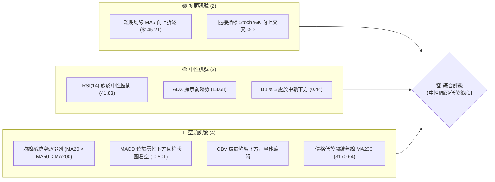
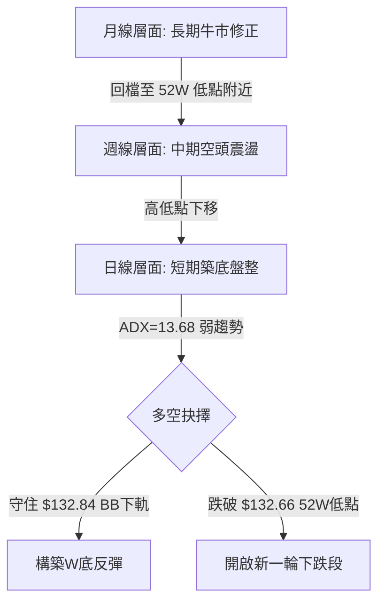
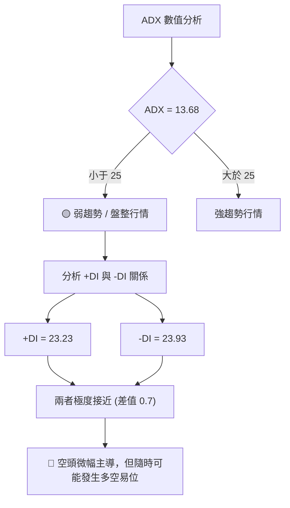
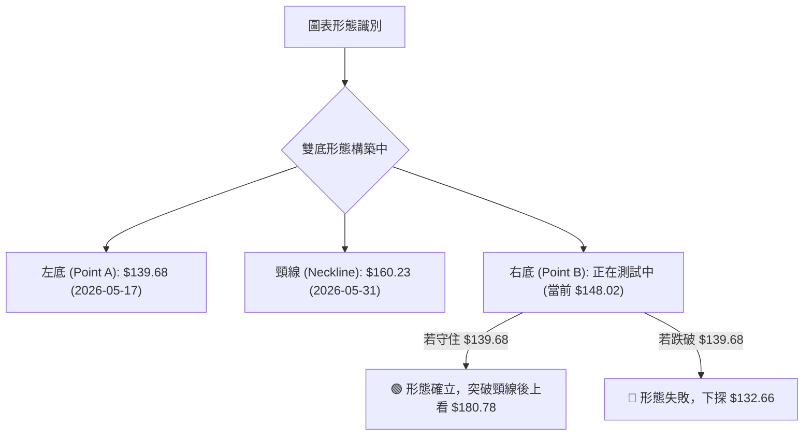
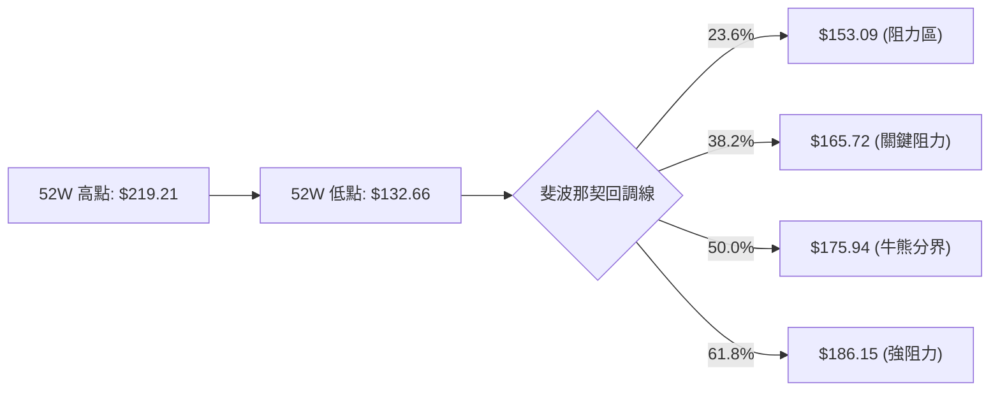
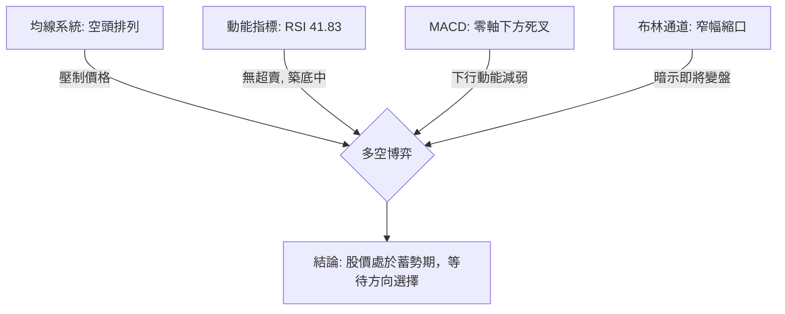

<details>
<summary>📊 靜態圖表 (點擊展開)</summary>

</details>

<html>
<head><meta charset="utf-8" /></head>
<body>
    <div style="height:500px; width:100%;">                        <script>window.PlotlyConfig = {MathJaxConfig: 'local'};</script>
        <script charset="utf-8" src="https://cdn.plot.ly/plotly-3.6.0.min.js" integrity="sha256-QaOVwtVY0T02VaHrr6pnoHLCwayMJp4O5n4YyaE3rJk=" crossorigin="anonymous"></script>                <div id="candlestick-chart" class="plotly-graph-div" style="height:100%; width:100%;"></div>            <script>                window.PLOTLYENV=window.PLOTLYENV || {};                                if (document.getElementById("candlestick-chart")) {                    Plotly.newPlot(                        "candlestick-chart",                        [{"close":{"dtype":"f8","bdata":"AAAAQGE7aEAAAACgUn5oQAAAAEBfjGdAAAAAAC0jZ0AAAAAg0GxnQAAAAMAioGdAAAAA4PxoZ0AAAABgTmlnQAAAAKA9IWhAAAAAoBwNakAAAACAn2hpQAAAAGC7HGpAAAAAIIGWakAAAAAAIBRqQAAAAABs8GlAAAAAQGUrakAAAABgWVZqQAAAAIA+KmtAAAAAYLB1aUAAAAAAHzBpQAAAAGAUImlAAAAAYMnUaUAAAADgpKxoQAAAAIAubGhAAAAAwJEeaUAAAADg8kJpQAAAACDjLWlAAAAAgHf7aEAAAACAQeJoQAAAAMBnv2lAAAAAgIAtakAAAADgLYpoQAAAAEAkH2pAAAAAgDeeaUAAAACAoEhqQAAAACBEOmpAAAAAwHYZaUAAAAAAkjZoQAAAAMA1QGdAAAAA4DAqZ0AAAACA+9pnQAAAAABLHWlAAAAAYAvYaEAAAABgF8JnQAAAACBH2mhAAAAAYAKmZ0AAAABgA3lnQAAAAIBGEGhAAAAAoFEnZ0AAAAAAzJtnQAAAAMCTA2dAAAAA4CzPZ0AAAADgX3hnQAAAAKBWVWZAAAAA4O84ZkAAAADAzmJlQAAAAECxxmVAAAAAoJXQZUAAAABgE75lQAAAACCzVGZAAAAAoPipZUAAAACABwRlQAAAAGAN1WVAAAAAwNRLZUAAAADABgpmQAAAAMDDS2ZAAAAAIC+lZUAAAACgZoJlQAAAAACuZWVAAAAAILvyZUAAAADgttZkQAAAAAA1tWRAAAAAAGeLZEAAAAAA5JZkQAAAAADSw2VAAAAAYDc0ZUAAAADgLflkQAAAAAAfn2VAAAAA4PLwY0AAAABgzbZkQAAAAGCZUmRAAAAAYDIrZEAAAACAZC5kQAAAAACpN2RAAAAAgGQuZEAAAAAg0zNkQAAAAEDATGRAAAAAAIcjZEAAAABAKKBkQAAAAECoVmRAAAAA4JEpZUAAAAAAdkxjQAAAAKCizGJAAAAAYJbEZEAAAACACYtlQAAAAKD3ZWVAAAAAoKwXZUAAAADA531mQAAAAADwy2RAAAAAgBWTY0AAAAAgqvljQAAAAICHBGRAAAAAINz8Y0AAAABA\u002f9JjQAAAAMAogWRAAAAAYEKtZEAAAAAAeUtkQAAAACBMxGNAAAAAYJhBY0AAAACgVBljQAAAAGBtymFAAAAA4ADcYUAAAADARq5iQAAAACBfGGNAAAAAID7sY0AAAACA0f1jQAAAACAXXGRAAAAAYDRoZUAAAABAMK5lQAAAAADOSmVAAAAAAHuIZUAAAAAAVGVlQAAAAABJ8mRAAAAAwFtsZUAAAAAg4ONlQAAAAECIEmZAAAAAYOa0ZUAAAADAcbhkQAAAAOBZL2RAAAAAIGZkZEAAAACggOVkQAAAAEDizWNAAAAAALVsZEAAAAAgooVkQAAAAKAu3mNAAAAAgJrrY0AAAACAeNdjQAAAAGCeOGRAAAAAgGWDZEAAAACAbDxlQAAAAECL5GRAAAAA4KNAYkAAAACgR+liQAAAAEAKF2NAAAAA4FHwYkAAAACgmQljQAAAACBcb2NAAAAAoEdxYkAAAABgj8piQAAAAGC4PmNAAAAAgMLlYkAAAABA4fJiQAAAAIDCNWNAAAAA4Hp8Y0AAAAAAABhjQAAAACBcV2NAAAAAYGbGY0AAAABACn9kQAAAAIAUXmRAAAAAwPWwZEAAAABguG5kQAAAAEAz82NAAAAAwB5dY0AAAACgR3ljQAAAAEAzm2NAAAAAQDOLZEAAAABgj9JkQAAAAADXI2RAAAAAoEc5Y0AAAABA4bpjQAAAAMD1aGNAAAAAQDMbZEAAAAAAKQxkQAAAAKBHyWNAAAAAYGY+Y0AAAABACndiQAAAAKCZAWNAAAAAANdbYkAAAAAghdNhQAAAAMDMvGFAAAAAgMJ1YUAAAAAAABhhQAAAAGC41mBAAAAAAAAAYkAAAABgj6JiQAAAAOCjiGNAAAAAgOuRZEAAAADAzARkQAAAAMD1CGRAAAAAIFwHZEAAAADgUVhjQAAAAEAKv2NAAAAAoJk5Y0AAAABgZjZjQAAAAOBRmGJAAAAAwMxcYkAAAABACkdiQAAAAKBHUWFAAAAAAClMYkAAAADgo4BiQA=="},"high":{"dtype":"f8","bdata":"EDOo9dqPaEBy3iaZghNpQEph+c5mX2hA2Tdy+EhFZ0AKJoBGhXpnQPZ4kysB7GdA1X+hbGzWZ0AMNes\u002fb7pnQLZpf\u002foRWGhAIkF2PxqCakA84xuj3GJqQI1FxBwmLWpAgew+wCAia0CjDsQwbp9qQN\u002fexhdun2pARZSxIXi0akCxpJwlC6hqQLT0j4fgZmtAliRx4byFakAhKmpP0rNpQOn9frdTdmlAxNWZz7jdaUCCdmGU0dFpQBoOy5dW\u002fmhAKtm1QLWLaUAEGYkh8Y1pQKeHDjziM2pAGKOQrHHraUB6HTXTw2hpQBQeouVRwWlAzcwP36VPakDAG8H+IXlqQHJ+5\u002frnK2pAMzZDjs0IakDHEIcTF+5qQPH7T4kTEGtAveoF8BgvakAb1Rz25Z1pQI1Rx+ZmHGhAS1iqvU6fZ0B4cnIoePVnQE3OWsw0LmlArpFkLi5jaUAASD\u002f5sphoQOKQ2JStBWlARwROEbrIaEB10lYefQtoQKP0N+TiVGhABdbm9c\u002feZ0AWOVTOPv5nQOYA+EUuk2dA7tEMj5HRZ0B+mtqdQ4hoQDrI+2GGbWdA+JhfTKGZZkASylZNCy9mQAI8hQIlcGZAHMMXktNgZkD8gEC5zx1mQIbGtAcDoGZAaTfJGJuYZ0Cj6B34daZlQNFPo4X31mVAnRN55\u002ffHZUDMP8+zVyhmQCfstG23iGZABc+QVND\u002fZUCdN4e05u5lQJYvoePiq2VAsybkmeoxZkBaLE\u002fsmQRmQKZZLyp162RA9ThpPicuZUCJsAcVBLJkQIcW6xUTzWVAdoOH3yRwZkC+TpHCwpBlQAKVBk1wrmVAH49iaQ3VZUAOHV61S25lQG7tRGcFXmVA0Pzwy8GCZEB+O7yYQ29kQOZafwaiS2RAkWZ5COVYZEBRi5vpPX9kQCMM\u002ftbPWmRAhH7IP9SIZEBIB+GtlCFlQBCorCF6bWVAdNbt4P6LZUDXz7+1cg1lQLflcfjOcmNA1pIKGBDQZUAZU8PT+Q9mQCcXvWbA5mVA1lBpNkxeZUCmq54w9slmQPVEnU5hXGVA9DKGcMO4ZED7y5yATDhkQI87HFXfaGRA\u002f1ukb71UZECxLX22tqJkQNl+gNupjGRAF42pu6jKZEAbg0B61\u002fRkQGcTUj7UiGRAA2KUymL4Y0BBQUGRLYljQG667u1rLmNA2\u002fU3wNj2YUAIhsC\u002frgFjQORfC0QrcmNAiEVjMGcmZEA7+UWqtqJkQAEXM4t5v2RAjYlXGqNtZUDnQehaGQ1mQPhbqXtZ6GVAaJQAuLeKZUAqNJnQb6hlQM3xCopjc2VAOoyXlEZuZUBzDvkGafZlQK1Ft0yiH2ZAwS\u002f5rCVCZkAHX2j98QhmQJNq99PUaWRA9lKy449\u002fZEDeMJDDt\u002fdkQMTSR+rRBGVAL+9wuvuMZED6pnwC7BFlQGLqqBmIeGRAatMJGklfZECoi8QNeqBkQBVGJWbfaGRAKpe044GnZEAYZBxcdZhlQIY2SZ3OK2VAAAAAQArPZEAAAADAzHxjQAAAAEAzQ2NAAAAAYGa+Y0AAAACgcBVjQAAAAGBmBmRAAAAAgMLdY0AAAABACu9iQAAAAEDhimNAAAAAgOtRY0AAAAAgXCNjQAAAAMAeRWNAAAAAgOspZEAAAADA9VBkQAAAAAAp1GNAAAAAQAoXZEAAAADA9ahkQAAAAOCj0GRAAAAAoHDdZEAAAAAgrg9lQAAAAKCZgWRAAAAAQDMjZEAAAABgj+JjQAAAAADX22NAAAAAIFyvZEAAAACgcA1lQAAAAGBmamRAAAAAwHIkZEAAAAAAKfRjQAAAAOB6BGRAAAAAAClMZEAAAACgmXlkQAAAACCuX2RAAAAA4HoMZUAAAAAAAGBjQAAAAAAAGGNAAAAAAFbKYkAAAADA9UhiQAAAAKBw6WFAAAAAQOGiYUAAAACgR3FhQAAAAGBmFmFAAAAAwMwcYkAAAADA9ahiQAAAAIA9smNAAAAAwMzsZEAAAABAtKBkQAAAAMD1cGRAAAAAoEdJZEAAAACgmdFjQAAAAMD1GGRAAAAAwB69Y0AAAACgR0FjQAAAAKBHSWNAAAAAoJmpYkAAAACgmcliQAAAAAAAAGJAAAAAwMxcYkAAAAAAANBiQA=="},"hovertemplate":"\u003cb\u003e%{x|%Y-%m-%d}\u003c\u002fb\u003e\u003cbr\u003e\u958b: $%{open:.2f}\u003cbr\u003e\u9ad8: $%{high:.2f}\u003cbr\u003e\u4f4e: $%{low:.2f}\u003cbr\u003e\u6536: $%{close:.2f}\u003cextra\u003e\u003c\u002fextra\u003e","low":{"dtype":"f8","bdata":"sOItc2zxZ0CyWrJtBDxoQEsGUMXoPmdAYpGxUZesZkBJ7O\u002fSUPRmQO84e8RcgmdAfQcxQus3ZkDGfOQq7PxmQO6UjXOPj2dAGDc02oTnaEDVU+jkVkppQGo31NeXJ2lA65ukU7scakBIMQ0OrNBpQJQ7rS9jfGlA1M5EPiLoaUCrswd30JNpQMmVDbVL52lAf2jpNsxcaUDyf9vIDippQA72FMINb2hAoP\u002fL9qcNaUDOJIcp\u002fKRoQGo45\u002faZxWdAKfrQHoP0Z0DM8FdZN8VoQCsVyAxAHmlAajQGc16caEAGGL6ZEGtoQD5OF1hv8mhAAMASEqKYaUD0bXtzioloQJZwbLUl+2hANH3ZDg8baUATuHlZnrppQGulRnKBA2pAJp\u002fAcPrvaEAfYHAw1whoQJx2RczkIWdAmBI8nPlkZkDtysmCXCZnQDNd\u002fusOQmhATLb747B+aEDtiBZiyv5mQNrhuJ9ZnmdA281QAqyAZ0DvZIdqeeBmQLuwbWCGamdAdEJpdr\u002f\u002fZkDCeYMzeA1nQEfFBEglYWZAS3i72aQDZkBsU8\u002fI5fRmQK13jEQrSmZAkGhsuakZZkDU+ciTnkFlQHV+FY75o2RA3Wc8BZeUZUDB6iFKFkZlQEfDK3Oxt2VA4AUE4uiUZUASRhxvxT9kQJ+\u002f9Z0vrmRABPUuiViuZEAXZx5GeZNlQKvVA6ujMGZAFLFgLN6GZUAH2L\u002fYlVxlQKzNtoKED2VAL7b1QQ5AZUCmggNJYMBkQNFp7\u002fN3c2RA0b\u002fWbdmIZECmtxkn08ZjQGaR0BQjEmRAAMXIwT7hZEDHVaajptBkQMsgE9ntwmRAqNSVo2vIY0CIq21NHEdkQJpJD3ERSGRAjdgEKTAUZEBd+GwPLv1jQLVlaPCs8WNAMxju2jUEZEBhdeihmPZjQEq3oSjmGmRA0mhBGgMgZEBXHSD0VXVkQM8v1dMY\u002f2NAQMXTCtJxZECXXUM0lipjQIdaJ5yTn2JA94nV1+20ZEBcqKxaaHtkQKuJGzLLUmVAFY72lVy6ZEBBbHObRm5lQDZufLA2WWRAmRnkPzCBY0BngkTf7zFjQPl+9KDc3WNA2xmGyBy5Y0AM9L2n6rVjQMuu3s\u002fnvWNAXATgPhgeZEABhsFPPdFjQHAuvaCulGNABp8S0T46Y0BVlX\u002f6\u002fMViQB76+6SRYmFAsfxTyutKYUDXd6aCA2diQLEsdIuEcmJALhzH1CtTY0Bmcww7sMpjQO6ThsHOBWRAO0Hgu\u002fUoZECifljA\u002fTZlQNDLnFYgLGVAtgNzbaoAZUCD6msIohhlQKjHbKeEn2RAnypsSQ9VZECpDpxMJTtlQOxk2rZdfGRA\u002fzNi2gdVZUCJHhvJVLNkQC6As++wGGNAggMryM4FZEBfl0w1ti5kQKcD5AezwmNAdyb+Mj5ZY0C4K2fvmIJkQDHTyV8JXmNAxU7io5GPY0DTInvde7BjQJ7Q7FqK\u002fGNA4nO8ycU8ZEBZfd4OyahkQDFhYGozgGRAAAAAYI8aYkAAAABguKpiQAAAAKCZsWJAAAAAACnMYkAAAAAgrk9iQAAAAAAA+GJAAAAAQDNTYkAAAABA4cphQAAAAMDM7GJAAAAAANfDYkAAAAAAKbxiQAAAAMD1yGJAAAAAoEdpY0AAAACAwhVjQAAAACCFI2NAAAAAwMwUY0AAAABACgtkQAAAAMDMRGRAAAAAIIVTZEAAAADgUUhkQAAAAIA9ymNAAAAAAClEY0AAAACgcF1jQAAAAAAAUGNAAAAAwMxkY0AAAAAghddjQAAAAEAK12NAAAAAYI8iY0AAAAAgXHdjQAAAAIDCXWNAAAAAgBSuY0AAAACgmfljQAAAAEAzk2NAAAAA4KM4Y0AAAAAgXF9iQAAAAGDlSGJAAAAAwB41YkAAAADgUXBhQAAAAACBfWFAAAAAgOs5YUAAAAAghbtgQAAAAMAelWBAAAAAgOs5YUAAAAAAKRxiQAAAAAAA2GJAAAAAQArHY0AAAABgDs1jQAAAAEAzs2NAAAAAACmcY0AAAABgj+piQAAAAAApHGNAAAAAYGYeY0AAAACAFMZiQAAAAAAAcGJAAAAAAClMYkAAAACgR7FhQAAAAMAePWFAAAAAgD1yYUAAAAAAAGBiQA=="},"name":"\u50f9\u683c","open":{"dtype":"f8","bdata":"mPAoRnQyaED3mfGggU5oQMMY3PKpWWhAdH+fmwL7ZkDCOnuOOylnQNKHCIDdiGdAuYKYXrawZ0Dg2Cg9rJtnQNryYlK+qGdAzJfBbhj4aED5nNBnZ\u002f9pQFojy+vCRGlA65ukU7scakCjDsQwbp9qQP3dppaTT2pA\u002fmX7Ss+PakCo\u002fBy+IltqQCNjAOxpTWpA64CtAAMxakAwCZZQalZpQIi88AGPrmhAv6XBQK0UaUCmbAnSNC5pQG0zXqKI1GhAxXGDrdJOaECi3ppnTm9pQKw\u002f0AczeWlAChhe1vWyaUC69MsGfCBpQHSc4pPNIGlAZmZmJsTNaUCukvW51yVqQLsW+7gfEmlAUV+U7yanaUDjqodAzRdqQHKV2QBcxmpAGyd9myXjaUD1+9faLXJpQKoIIHQrC2hAupqyVhRhZ0DtysmCXCZnQI+\u002fItLhgWhArpFkLi5jaUAASD\u002f5sphoQPkcZC6p+GdA20oAbZxEaEDi+jpQFu9nQHwhiakcyWdAr+T7h6FyZ0BewnGV6TdnQI3KFaNezGZA56xBwUZAZkC2TeS3cEhoQMjgQQ8QLWdA\u002fCkD7Kx6ZkA71+haiQ1mQB3hrZkI12RAFt+obU7eZUBp60ww6YVlQNVhiMCw1WVAtw9bxfUJZ0BUrX5a2XBlQBgdNZtNI2VAjXXQzzmzZUAdzv9DrLBlQFqLy3c7UGZAcLbnrdDwZUA9bpV7Wd1lQD\u002f1WTnphWVAdJyhaKhtZUAl\u002flRHFwFmQKZZLyp162RAJU4330WdZEDhpZ\u002fKUJxkQBTqBWFTM2RAeVTafffWZUB9OHIJfI9lQCsM1rcexmRABDDF5P2wZUBAFzAAh6ZkQMUOjj23x2RA3QOYwdl4ZEDZ7qZ9MitkQDx4GpOpGGRAAAAAgGQuZEAF0dI\u002f+xhkQKPYNivwOGRA4zdRF2FVZEBXHSD0VXVkQBXhqeF0JGVA0hcfCqIYZUDXz7+1cg1lQHMWt3s7YWNA4Wld6\u002fXCZUC1fi4FQ45kQKFBODVquGVAExEikBglZUCtVVpgdZhlQOPT58VL6mRAxKTvGZwhZEDVa3BlY9ljQESyk1qzNmRA8RbPdgb5Y0D4dtAi4QtkQE8EcMJd6WNAhiiEe8O4ZEAoXI5HfLdkQIyI57j1KGRAwRoka+2tY0DOzdjOCH1jQBwGsOxmH2NAiTLLedqZYUBSURoYdrliQPL\u002fEgV2uWJA5Sd7ss4FZEBmf+mfzphkQHSuwnJaEGRA5B68cLhFZEAwOWD\u002ftVRlQMYdafy7uGVAYa4hp7Y1ZUBrKc\u002fUFoJlQHYHWI4KTWVAbNsB76rhZEBU6aZBpYRlQDBOic4MZGVAiNH0HF\u002fYZUBwJbME+z5lQCyCjRwIL2RA+oePANYrZEAG7eN5GjVkQHjb8CU7h2RA47i+5wB2Y0CLzmrJT6RkQKgxz5MRbGRA6JE\u002fZrabY0BQHPujRDFkQHiLUEz7GGRAa2l6ltJSZEDX0aRExrBkQBNbWhsn3mRAAAAAQArPZEAAAABgZu5iQAAAAKCZ0WJAAAAAAABgY0AAAAAAALBiQAAAAAAA+GJAAAAAQDOjY0AAAADAzPxhQAAAAEAK72JAAAAAYLjmYkAAAACgR+FiQAAAAIA94mJAAAAAAAAYZEAAAADgenxjQAAAAAAAMGNAAAAAwMwUY0AAAADAHk1kQAAAAAAAsGRAAAAAgD2SZEAAAADgUchkQAAAAKCZYWRAAAAA4FEYZEAAAACgmbljQAAAAGC4fmNAAAAAYI+KY0AAAAAAAKBkQAAAAAAAUGRAAAAAIIUbZEAAAACgR4ljQAAAAIDryWNAAAAAgBS2Y0AAAAAAAGBkQAAAAADXL2RAAAAAoEdhZEAAAAAAAGBjQAAAAAAAgGJAAAAAIK6vYkAAAADA9UhiQAAAAAAprGFAAAAAwMx4YUAAAAAAAGBhQAAAAKCZ+WBAAAAAAABAYUAAAABACi9iQAAAAMD14GJAAAAAwB7dY0AAAABguJ5kQAAAAEDh2mNAAAAAAAAAZEAAAAAAAKBjQAAAAIAUfmNAAAAA4FGQY0AAAACgR\u002fFiQAAAAAAAAGNAAAAAgOuJYkAAAACgcI1iQAAAAEAz62FAAAAAIK6fYUAAAAAAAIBiQA=="},"x":["2025-08-27T00:00:00-04:00","2025-08-28T00:00:00-04:00","2025-08-29T00:00:00-04:00","2025-09-02T00:00:00-04:00","2025-09-03T00:00:00-04:00","2025-09-04T00:00:00-04:00","2025-09-05T00:00:00-04:00","2025-09-08T00:00:00-04:00","2025-09-09T00:00:00-04:00","2025-09-10T00:00:00-04:00","2025-09-11T00:00:00-04:00","2025-09-12T00:00:00-04:00","2025-09-15T00:00:00-04:00","2025-09-16T00:00:00-04:00","2025-09-17T00:00:00-04:00","2025-09-18T00:00:00-04:00","2025-09-19T00:00:00-04:00","2025-09-22T00:00:00-04:00","2025-09-23T00:00:00-04:00","2025-09-24T00:00:00-04:00","2025-09-25T00:00:00-04:00","2025-09-26T00:00:00-04:00","2025-09-29T00:00:00-04:00","2025-09-30T00:00:00-04:00","2025-10-01T00:00:00-04:00","2025-10-02T00:00:00-04:00","2025-10-03T00:00:00-04:00","2025-10-06T00:00:00-04:00","2025-10-07T00:00:00-04:00","2025-10-08T00:00:00-04:00","2025-10-09T00:00:00-04:00","2025-10-10T00:00:00-04:00","2025-10-13T00:00:00-04:00","2025-10-14T00:00:00-04:00","2025-10-15T00:00:00-04:00","2025-10-16T00:00:00-04:00","2025-10-17T00:00:00-04:00","2025-10-20T00:00:00-04:00","2025-10-21T00:00:00-04:00","2025-10-22T00:00:00-04:00","2025-10-23T00:00:00-04:00","2025-10-24T00:00:00-04:00","2025-10-27T00:00:00-04:00","2025-10-28T00:00:00-04:00","2025-10-29T00:00:00-04:00","2025-10-30T00:00:00-04:00","2025-10-31T00:00:00-04:00","2025-11-03T00:00:00-05:00","2025-11-04T00:00:00-05:00","2025-11-05T00:00:00-05:00","2025-11-06T00:00:00-05:00","2025-11-07T00:00:00-05:00","2025-11-10T00:00:00-05:00","2025-11-11T00:00:00-05:00","2025-11-12T00:00:00-05:00","2025-11-13T00:00:00-05:00","2025-11-14T00:00:00-05:00","2025-11-17T00:00:00-05:00","2025-11-18T00:00:00-05:00","2025-11-19T00:00:00-05:00","2025-11-20T00:00:00-05:00","2025-11-21T00:00:00-05:00","2025-11-24T00:00:00-05:00","2025-11-25T00:00:00-05:00","2025-11-26T00:00:00-05:00","2025-11-28T00:00:00-05:00","2025-12-01T00:00:00-05:00","2025-12-02T00:00:00-05:00","2025-12-03T00:00:00-05:00","2025-12-04T00:00:00-05:00","2025-12-05T00:00:00-05:00","2025-12-08T00:00:00-05:00","2025-12-09T00:00:00-05:00","2025-12-10T00:00:00-05:00","2025-12-11T00:00:00-05:00","2025-12-12T00:00:00-05:00","2025-12-15T00:00:00-05:00","2025-12-16T00:00:00-05:00","2025-12-17T00:00:00-05:00","2025-12-18T00:00:00-05:00","2025-12-19T00:00:00-05:00","2025-12-22T00:00:00-05:00","2025-12-23T00:00:00-05:00","2025-12-24T00:00:00-05:00","2025-12-26T00:00:00-05:00","2025-12-29T00:00:00-05:00","2025-12-30T00:00:00-05:00","2025-12-31T00:00:00-05:00","2026-01-02T00:00:00-05:00","2026-01-05T00:00:00-05:00","2026-01-06T00:00:00-05:00","2026-01-07T00:00:00-05:00","2026-01-08T00:00:00-05:00","2026-01-09T00:00:00-05:00","2026-01-12T00:00:00-05:00","2026-01-13T00:00:00-05:00","2026-01-14T00:00:00-05:00","2026-01-15T00:00:00-05:00","2026-01-16T00:00:00-05:00","2026-01-20T00:00:00-05:00","2026-01-21T00:00:00-05:00","2026-01-22T00:00:00-05:00","2026-01-23T00:00:00-05:00","2026-01-26T00:00:00-05:00","2026-01-27T00:00:00-05:00","2026-01-28T00:00:00-05:00","2026-01-29T00:00:00-05:00","2026-01-30T00:00:00-05:00","2026-02-02T00:00:00-05:00","2026-02-03T00:00:00-05:00","2026-02-04T00:00:00-05:00","2026-02-05T00:00:00-05:00","2026-02-06T00:00:00-05:00","2026-02-09T00:00:00-05:00","2026-02-10T00:00:00-05:00","2026-02-11T00:00:00-05:00","2026-02-12T00:00:00-05:00","2026-02-13T00:00:00-05:00","2026-02-17T00:00:00-05:00","2026-02-18T00:00:00-05:00","2026-02-19T00:00:00-05:00","2026-02-20T00:00:00-05:00","2026-02-23T00:00:00-05:00","2026-02-24T00:00:00-05:00","2026-02-25T00:00:00-05:00","2026-02-26T00:00:00-05:00","2026-02-27T00:00:00-05:00","2026-03-02T00:00:00-05:00","2026-03-03T00:00:00-05:00","2026-03-04T00:00:00-05:00","2026-03-05T00:00:00-05:00","2026-03-06T00:00:00-05:00","2026-03-09T00:00:00-04:00","2026-03-10T00:00:00-04:00","2026-03-11T00:00:00-04:00","2026-03-12T00:00:00-04:00","2026-03-13T00:00:00-04:00","2026-03-16T00:00:00-04:00","2026-03-17T00:00:00-04:00","2026-03-18T00:00:00-04:00","2026-03-19T00:00:00-04:00","2026-03-20T00:00:00-04:00","2026-03-23T00:00:00-04:00","2026-03-24T00:00:00-04:00","2026-03-25T00:00:00-04:00","2026-03-26T00:00:00-04:00","2026-03-27T00:00:00-04:00","2026-03-30T00:00:00-04:00","2026-03-31T00:00:00-04:00","2026-04-01T00:00:00-04:00","2026-04-02T00:00:00-04:00","2026-04-06T00:00:00-04:00","2026-04-07T00:00:00-04:00","2026-04-08T00:00:00-04:00","2026-04-09T00:00:00-04:00","2026-04-10T00:00:00-04:00","2026-04-13T00:00:00-04:00","2026-04-14T00:00:00-04:00","2026-04-15T00:00:00-04:00","2026-04-16T00:00:00-04:00","2026-04-17T00:00:00-04:00","2026-04-20T00:00:00-04:00","2026-04-21T00:00:00-04:00","2026-04-22T00:00:00-04:00","2026-04-23T00:00:00-04:00","2026-04-24T00:00:00-04:00","2026-04-27T00:00:00-04:00","2026-04-28T00:00:00-04:00","2026-04-29T00:00:00-04:00","2026-04-30T00:00:00-04:00","2026-05-01T00:00:00-04:00","2026-05-04T00:00:00-04:00","2026-05-05T00:00:00-04:00","2026-05-06T00:00:00-04:00","2026-05-07T00:00:00-04:00","2026-05-08T00:00:00-04:00","2026-05-11T00:00:00-04:00","2026-05-12T00:00:00-04:00","2026-05-13T00:00:00-04:00","2026-05-14T00:00:00-04:00","2026-05-15T00:00:00-04:00","2026-05-18T00:00:00-04:00","2026-05-19T00:00:00-04:00","2026-05-20T00:00:00-04:00","2026-05-21T00:00:00-04:00","2026-05-22T00:00:00-04:00","2026-05-26T00:00:00-04:00","2026-05-27T00:00:00-04:00","2026-05-28T00:00:00-04:00","2026-05-29T00:00:00-04:00","2026-06-01T00:00:00-04:00","2026-06-02T00:00:00-04:00","2026-06-03T00:00:00-04:00","2026-06-04T00:00:00-04:00","2026-06-05T00:00:00-04:00","2026-06-08T00:00:00-04:00","2026-06-09T00:00:00-04:00","2026-06-10T00:00:00-04:00","2026-06-11T00:00:00-04:00","2026-06-12T00:00:00-04:00"],"type":"candlestick"},{"hovertemplate":"MA30: $%{y:.2f}\u003cextra\u003e\u003c\u002fextra\u003e","line":{"color":"#2196F3","dash":"dash","width":2},"mode":"lines","name":"MA30","x":["2025-08-27T00:00:00-04:00","2025-08-28T00:00:00-04:00","2025-08-29T00:00:00-04:00","2025-09-02T00:00:00-04:00","2025-09-03T00:00:00-04:00","2025-09-04T00:00:00-04:00","2025-09-05T00:00:00-04:00","2025-09-08T00:00:00-04:00","2025-09-09T00:00:00-04:00","2025-09-10T00:00:00-04:00","2025-09-11T00:00:00-04:00","2025-09-12T00:00:00-04:00","2025-09-15T00:00:00-04:00","2025-09-16T00:00:00-04:00","2025-09-17T00:00:00-04:00","2025-09-18T00:00:00-04:00","2025-09-19T00:00:00-04:00","2025-09-22T00:00:00-04:00","2025-09-23T00:00:00-04:00","2025-09-24T00:00:00-04:00","2025-09-25T00:00:00-04:00","2025-09-26T00:00:00-04:00","2025-09-29T00:00:00-04:00","2025-09-30T00:00:00-04:00","2025-10-01T00:00:00-04:00","2025-10-02T00:00:00-04:00","2025-10-03T00:00:00-04:00","2025-10-06T00:00:00-04:00","2025-10-07T00:00:00-04:00","2025-10-08T00:00:00-04:00","2025-10-09T00:00:00-04:00","2025-10-10T00:00:00-04:00","2025-10-13T00:00:00-04:00","2025-10-14T00:00:00-04:00","2025-10-15T00:00:00-04:00","2025-10-16T00:00:00-04:00","2025-10-17T00:00:00-04:00","2025-10-20T00:00:00-04:00","2025-10-21T00:00:00-04:00","2025-10-22T00:00:00-04:00","2025-10-23T00:00:00-04:00","2025-10-24T00:00:00-04:00","2025-10-27T00:00:00-04:00","2025-10-28T00:00:00-04:00","2025-10-29T00:00:00-04:00","2025-10-30T00:00:00-04:00","2025-10-31T00:00:00-04:00","2025-11-03T00:00:00-05:00","2025-11-04T00:00:00-05:00","2025-11-05T00:00:00-05:00","2025-11-06T00:00:00-05:00","2025-11-07T00:00:00-05:00","2025-11-10T00:00:00-05:00","2025-11-11T00:00:00-05:00","2025-11-12T00:00:00-05:00","2025-11-13T00:00:00-05:00","2025-11-14T00:00:00-05:00","2025-11-17T00:00:00-05:00","2025-11-18T00:00:00-05:00","2025-11-19T00:00:00-05:00","2025-11-20T00:00:00-05:00","2025-11-21T00:00:00-05:00","2025-11-24T00:00:00-05:00","2025-11-25T00:00:00-05:00","2025-11-26T00:00:00-05:00","2025-11-28T00:00:00-05:00","2025-12-01T00:00:00-05:00","2025-12-02T00:00:00-05:00","2025-12-03T00:00:00-05:00","2025-12-04T00:00:00-05:00","2025-12-05T00:00:00-05:00","2025-12-08T00:00:00-05:00","2025-12-09T00:00:00-05:00","2025-12-10T00:00:00-05:00","2025-12-11T00:00:00-05:00","2025-12-12T00:00:00-05:00","2025-12-15T00:00:00-05:00","2025-12-16T00:00:00-05:00","2025-12-17T00:00:00-05:00","2025-12-18T00:00:00-05:00","2025-12-19T00:00:00-05:00","2025-12-22T00:00:00-05:00","2025-12-23T00:00:00-05:00","2025-12-24T00:00:00-05:00","2025-12-26T00:00:00-05:00","2025-12-29T00:00:00-05:00","2025-12-30T00:00:00-05:00","2025-12-31T00:00:00-05:00","2026-01-02T00:00:00-05:00","2026-01-05T00:00:00-05:00","2026-01-06T00:00:00-05:00","2026-01-07T00:00:00-05:00","2026-01-08T00:00:00-05:00","2026-01-09T00:00:00-05:00","2026-01-12T00:00:00-05:00","2026-01-13T00:00:00-05:00","2026-01-14T00:00:00-05:00","2026-01-15T00:00:00-05:00","2026-01-16T00:00:00-05:00","2026-01-20T00:00:00-05:00","2026-01-21T00:00:00-05:00","2026-01-22T00:00:00-05:00","2026-01-23T00:00:00-05:00","2026-01-26T00:00:00-05:00","2026-01-27T00:00:00-05:00","2026-01-28T00:00:00-05:00","2026-01-29T00:00:00-05:00","2026-01-30T00:00:00-05:00","2026-02-02T00:00:00-05:00","2026-02-03T00:00:00-05:00","2026-02-04T00:00:00-05:00","2026-02-05T00:00:00-05:00","2026-02-06T00:00:00-05:00","2026-02-09T00:00:00-05:00","2026-02-10T00:00:00-05:00","2026-02-11T00:00:00-05:00","2026-02-12T00:00:00-05:00","2026-02-13T00:00:00-05:00","2026-02-17T00:00:00-05:00","2026-02-18T00:00:00-05:00","2026-02-19T00:00:00-05:00","2026-02-20T00:00:00-05:00","2026-02-23T00:00:00-05:00","2026-02-24T00:00:00-05:00","2026-02-25T00:00:00-05:00","2026-02-26T00:00:00-05:00","2026-02-27T00:00:00-05:00","2026-03-02T00:00:00-05:00","2026-03-03T00:00:00-05:00","2026-03-04T00:00:00-05:00","2026-03-05T00:00:00-05:00","2026-03-06T00:00:00-05:00","2026-03-09T00:00:00-04:00","2026-03-10T00:00:00-04:00","2026-03-11T00:00:00-04:00","2026-03-12T00:00:00-04:00","2026-03-13T00:00:00-04:00","2026-03-16T00:00:00-04:00","2026-03-17T00:00:00-04:00","2026-03-18T00:00:00-04:00","2026-03-19T00:00:00-04:00","2026-03-20T00:00:00-04:00","2026-03-23T00:00:00-04:00","2026-03-24T00:00:00-04:00","2026-03-25T00:00:00-04:00","2026-03-26T00:00:00-04:00","2026-03-27T00:00:00-04:00","2026-03-30T00:00:00-04:00","2026-03-31T00:00:00-04:00","2026-04-01T00:00:00-04:00","2026-04-02T00:00:00-04:00","2026-04-06T00:00:00-04:00","2026-04-07T00:00:00-04:00","2026-04-08T00:00:00-04:00","2026-04-09T00:00:00-04:00","2026-04-10T00:00:00-04:00","2026-04-13T00:00:00-04:00","2026-04-14T00:00:00-04:00","2026-04-15T00:00:00-04:00","2026-04-16T00:00:00-04:00","2026-04-17T00:00:00-04:00","2026-04-20T00:00:00-04:00","2026-04-21T00:00:00-04:00","2026-04-22T00:00:00-04:00","2026-04-23T00:00:00-04:00","2026-04-24T00:00:00-04:00","2026-04-27T00:00:00-04:00","2026-04-28T00:00:00-04:00","2026-04-29T00:00:00-04:00","2026-04-30T00:00:00-04:00","2026-05-01T00:00:00-04:00","2026-05-04T00:00:00-04:00","2026-05-05T00:00:00-04:00","2026-05-06T00:00:00-04:00","2026-05-07T00:00:00-04:00","2026-05-08T00:00:00-04:00","2026-05-11T00:00:00-04:00","2026-05-12T00:00:00-04:00","2026-05-13T00:00:00-04:00","2026-05-14T00:00:00-04:00","2026-05-15T00:00:00-04:00","2026-05-18T00:00:00-04:00","2026-05-19T00:00:00-04:00","2026-05-20T00:00:00-04:00","2026-05-21T00:00:00-04:00","2026-05-22T00:00:00-04:00","2026-05-26T00:00:00-04:00","2026-05-27T00:00:00-04:00","2026-05-28T00:00:00-04:00","2026-05-29T00:00:00-04:00","2026-06-01T00:00:00-04:00","2026-06-02T00:00:00-04:00","2026-06-03T00:00:00-04:00","2026-06-04T00:00:00-04:00","2026-06-05T00:00:00-04:00","2026-06-08T00:00:00-04:00","2026-06-09T00:00:00-04:00","2026-06-10T00:00:00-04:00","2026-06-11T00:00:00-04:00","2026-06-12T00:00:00-04:00"],"y":{"dtype":"f8","bdata":"AAAAAAAA+H8AAAAAAAD4fwAAAAAAAPh\u002fAAAAAAAA+H8AAAAAAAD4fwAAAAAAAPh\u002fAAAAAAAA+H8AAAAAAAD4fwAAAAAAAPh\u002fAAAAAAAA+H8AAAAAAAD4fwAAAAAAAPh\u002fAAAAAAAA+H8AAAAAAAD4fwAAAAAAAPh\u002fAAAAAAAA+H8AAAAAAAD4fwAAAAAAAPh\u002fAAAAAAAA+H8AAAAAAAD4fwAAAAAAAPh\u002fAAAAAAAA+H8AAAAAAAD4fwAAAAAAAPh\u002fAAAAAAAA+H8AAAAAAAD4fwAAAAAAAPh\u002fAAAAAAAA+H8AAAAAAAD4f+\u002fu7p7GCWlAMzMzQ2EaaUAAAABwxhppQAAAAPC7MGlARERE9OZFaUBERETES15pQERERBSAdGlAq6qqiuqCaUAREREhwolpQN7d3d1BgmlAiYiIaKBpaUBVVVU1X1xpQGZmZnbbU2lAvLu7q\u002flEaUBVVVWVLDFpQGZmZhbnJ2lAq6qqymMSaUDe3d398floQKuqqsp632hAd3d398zLaEC8u7u7Ur5oQBEREWE9rGhA3t3dbfyaaEDNzMzctZBoQN7d3d3hfmhAVVVVRSlmaEAAAAAAF0VoQN7d3c0MKGhAZmZmRgUNaEAAAADwNvJnQImIiMgO1WdAERERQYquZ0CJiIjod5BnQLy7u4vda2dAMzMzY\u002fxGZ0AAAAAQxCJnQAAAAEA3AWdAVVVVZb3jZkAiIiLiqsxmQO\u002fu7o7ZvGZARERExHeyZkDv7u6+uZhmQJqZmWkfc2ZARERERG9OZkBVVVUFZTNmQImIiMgLGWZA7+7uri8EZkBERETE2+5lQN7d3R0F2mVA7+7ujpu+ZUB3d3dn6KVlQAAAACDxjmVA3t3dPeBvZUBERERUz1NlQCIiIgLBQWVAZmZm9lUwZUAiIiKCPCZlQImIiGijGWVA7+7uHlYLZUCJiIhIzgFlQLy7u+vN8GRAq6qqOobsZEDv7u4+391kQCIiItL9w2RA3t3dvXu\u002fZECamZkZQLtkQJqZmSmXs2RAzczMnN+uZECJiIjIQbdkQJqZmdkhsmRAiYiImOCdZEDe3d1NgpZkQHd3d6eekGRAq6qqSt6LZECrqqqqVoVkQKuqqkqVemRAiYiIqBV2ZEDNzMxcS3BkQImIiIh3YGRA7+7uLp9aZEBERETk1kxkQDMzM9M7N2RAmpmZ+YYjZEDv7u4uuRZkQHd3d6clDWRAzczMLPEKZEAiIiJSJAlkQHd3dzenCWRAvLu7y3kUZEAAAAAQeh1kQERERHSdJWRAvLu7W8coZEAAAACgrDpkQImIiPj+TGRA3t3dnZZSZEBERES0jFVkQCIiIkJNW2RAq6qq6opgZEAiIiJibVFkQN7d3S01TGRAVVVVVS9TZEARERHRC1tkQCIiIoI5WWRAAAAA8PNcZEDNzMxM6GJkQAAAAJB5XWRAiYiICAVXZEBmZmYmJ1NkQCIiIsIHV2RAvLu7y8FhZEAzMzNT\u002fnNkQJqZmcl2jmRA3t3djdGRZEDNzMwMyZNkQAAAALC9k2RAIiIi8leLZEAzMzPzM4NkQJqZmdlPe2RAERERsQNiZEAiIiIyXElkQCIiIgLkN2RAREREZGYhZEAzMzOzhAxkQKuqqmqz\u002fWNAvLu76yvtY0De3d0dT9VjQImIiNgAvmNAzczMHIWtY0AzMzNDm6tjQERERAQqrWNAZmZmVrevY0Crqqq6watjQJqZmSkArWNA7+7unvKjY0C8u7urAJtjQHd3dxfFmGNAvLu7+xaeY0DNzMycdaZjQM3MzEzEpWNA3t3dTcOaY0BERERU6Y1jQGZmZjZCgWNAq6qqyhORY0CJiIj4xZpjQDMzM\u002fO2oGNAvLu7O1GjY0BmZmaWbp5jQImIiPjFmmNAREREBA+aY0ARERHx0pFjQBEREcH1hGNAzczMfLF4Y0De3d0t3WhjQLy7uxuhVGNAiYiIWPJHY0ARERExCERjQHd3d7esRWNAvLu7a3VMY0De3d1NYkhjQCIiIvKLRWNAERERseQ\u002fY0AiIiICnTZjQImIiOjfNGNA3t3dzbAzY0CJiIgYdjFjQLy7u\u002fvUKGNAd3d39zcWY0BERERUgABjQLy7u3tq6GJAAAAAEIPgYkDNzMyMCdZiQA=="},"type":"scatter"},{"hovertemplate":"MA60: $%{y:.2f}\u003cextra\u003e\u003c\u002fextra\u003e","line":{"color":"#9C27B0","dash":"dash","width":2},"mode":"lines","name":"MA60","x":["2025-08-27T00:00:00-04:00","2025-08-28T00:00:00-04:00","2025-08-29T00:00:00-04:00","2025-09-02T00:00:00-04:00","2025-09-03T00:00:00-04:00","2025-09-04T00:00:00-04:00","2025-09-05T00:00:00-04:00","2025-09-08T00:00:00-04:00","2025-09-09T00:00:00-04:00","2025-09-10T00:00:00-04:00","2025-09-11T00:00:00-04:00","2025-09-12T00:00:00-04:00","2025-09-15T00:00:00-04:00","2025-09-16T00:00:00-04:00","2025-09-17T00:00:00-04:00","2025-09-18T00:00:00-04:00","2025-09-19T00:00:00-04:00","2025-09-22T00:00:00-04:00","2025-09-23T00:00:00-04:00","2025-09-24T00:00:00-04:00","2025-09-25T00:00:00-04:00","2025-09-26T00:00:00-04:00","2025-09-29T00:00:00-04:00","2025-09-30T00:00:00-04:00","2025-10-01T00:00:00-04:00","2025-10-02T00:00:00-04:00","2025-10-03T00:00:00-04:00","2025-10-06T00:00:00-04:00","2025-10-07T00:00:00-04:00","2025-10-08T00:00:00-04:00","2025-10-09T00:00:00-04:00","2025-10-10T00:00:00-04:00","2025-10-13T00:00:00-04:00","2025-10-14T00:00:00-04:00","2025-10-15T00:00:00-04:00","2025-10-16T00:00:00-04:00","2025-10-17T00:00:00-04:00","2025-10-20T00:00:00-04:00","2025-10-21T00:00:00-04:00","2025-10-22T00:00:00-04:00","2025-10-23T00:00:00-04:00","2025-10-24T00:00:00-04:00","2025-10-27T00:00:00-04:00","2025-10-28T00:00:00-04:00","2025-10-29T00:00:00-04:00","2025-10-30T00:00:00-04:00","2025-10-31T00:00:00-04:00","2025-11-03T00:00:00-05:00","2025-11-04T00:00:00-05:00","2025-11-05T00:00:00-05:00","2025-11-06T00:00:00-05:00","2025-11-07T00:00:00-05:00","2025-11-10T00:00:00-05:00","2025-11-11T00:00:00-05:00","2025-11-12T00:00:00-05:00","2025-11-13T00:00:00-05:00","2025-11-14T00:00:00-05:00","2025-11-17T00:00:00-05:00","2025-11-18T00:00:00-05:00","2025-11-19T00:00:00-05:00","2025-11-20T00:00:00-05:00","2025-11-21T00:00:00-05:00","2025-11-24T00:00:00-05:00","2025-11-25T00:00:00-05:00","2025-11-26T00:00:00-05:00","2025-11-28T00:00:00-05:00","2025-12-01T00:00:00-05:00","2025-12-02T00:00:00-05:00","2025-12-03T00:00:00-05:00","2025-12-04T00:00:00-05:00","2025-12-05T00:00:00-05:00","2025-12-08T00:00:00-05:00","2025-12-09T00:00:00-05:00","2025-12-10T00:00:00-05:00","2025-12-11T00:00:00-05:00","2025-12-12T00:00:00-05:00","2025-12-15T00:00:00-05:00","2025-12-16T00:00:00-05:00","2025-12-17T00:00:00-05:00","2025-12-18T00:00:00-05:00","2025-12-19T00:00:00-05:00","2025-12-22T00:00:00-05:00","2025-12-23T00:00:00-05:00","2025-12-24T00:00:00-05:00","2025-12-26T00:00:00-05:00","2025-12-29T00:00:00-05:00","2025-12-30T00:00:00-05:00","2025-12-31T00:00:00-05:00","2026-01-02T00:00:00-05:00","2026-01-05T00:00:00-05:00","2026-01-06T00:00:00-05:00","2026-01-07T00:00:00-05:00","2026-01-08T00:00:00-05:00","2026-01-09T00:00:00-05:00","2026-01-12T00:00:00-05:00","2026-01-13T00:00:00-05:00","2026-01-14T00:00:00-05:00","2026-01-15T00:00:00-05:00","2026-01-16T00:00:00-05:00","2026-01-20T00:00:00-05:00","2026-01-21T00:00:00-05:00","2026-01-22T00:00:00-05:00","2026-01-23T00:00:00-05:00","2026-01-26T00:00:00-05:00","2026-01-27T00:00:00-05:00","2026-01-28T00:00:00-05:00","2026-01-29T00:00:00-05:00","2026-01-30T00:00:00-05:00","2026-02-02T00:00:00-05:00","2026-02-03T00:00:00-05:00","2026-02-04T00:00:00-05:00","2026-02-05T00:00:00-05:00","2026-02-06T00:00:00-05:00","2026-02-09T00:00:00-05:00","2026-02-10T00:00:00-05:00","2026-02-11T00:00:00-05:00","2026-02-12T00:00:00-05:00","2026-02-13T00:00:00-05:00","2026-02-17T00:00:00-05:00","2026-02-18T00:00:00-05:00","2026-02-19T00:00:00-05:00","2026-02-20T00:00:00-05:00","2026-02-23T00:00:00-05:00","2026-02-24T00:00:00-05:00","2026-02-25T00:00:00-05:00","2026-02-26T00:00:00-05:00","2026-02-27T00:00:00-05:00","2026-03-02T00:00:00-05:00","2026-03-03T00:00:00-05:00","2026-03-04T00:00:00-05:00","2026-03-05T00:00:00-05:00","2026-03-06T00:00:00-05:00","2026-03-09T00:00:00-04:00","2026-03-10T00:00:00-04:00","2026-03-11T00:00:00-04:00","2026-03-12T00:00:00-04:00","2026-03-13T00:00:00-04:00","2026-03-16T00:00:00-04:00","2026-03-17T00:00:00-04:00","2026-03-18T00:00:00-04:00","2026-03-19T00:00:00-04:00","2026-03-20T00:00:00-04:00","2026-03-23T00:00:00-04:00","2026-03-24T00:00:00-04:00","2026-03-25T00:00:00-04:00","2026-03-26T00:00:00-04:00","2026-03-27T00:00:00-04:00","2026-03-30T00:00:00-04:00","2026-03-31T00:00:00-04:00","2026-04-01T00:00:00-04:00","2026-04-02T00:00:00-04:00","2026-04-06T00:00:00-04:00","2026-04-07T00:00:00-04:00","2026-04-08T00:00:00-04:00","2026-04-09T00:00:00-04:00","2026-04-10T00:00:00-04:00","2026-04-13T00:00:00-04:00","2026-04-14T00:00:00-04:00","2026-04-15T00:00:00-04:00","2026-04-16T00:00:00-04:00","2026-04-17T00:00:00-04:00","2026-04-20T00:00:00-04:00","2026-04-21T00:00:00-04:00","2026-04-22T00:00:00-04:00","2026-04-23T00:00:00-04:00","2026-04-24T00:00:00-04:00","2026-04-27T00:00:00-04:00","2026-04-28T00:00:00-04:00","2026-04-29T00:00:00-04:00","2026-04-30T00:00:00-04:00","2026-05-01T00:00:00-04:00","2026-05-04T00:00:00-04:00","2026-05-05T00:00:00-04:00","2026-05-06T00:00:00-04:00","2026-05-07T00:00:00-04:00","2026-05-08T00:00:00-04:00","2026-05-11T00:00:00-04:00","2026-05-12T00:00:00-04:00","2026-05-13T00:00:00-04:00","2026-05-14T00:00:00-04:00","2026-05-15T00:00:00-04:00","2026-05-18T00:00:00-04:00","2026-05-19T00:00:00-04:00","2026-05-20T00:00:00-04:00","2026-05-21T00:00:00-04:00","2026-05-22T00:00:00-04:00","2026-05-26T00:00:00-04:00","2026-05-27T00:00:00-04:00","2026-05-28T00:00:00-04:00","2026-05-29T00:00:00-04:00","2026-06-01T00:00:00-04:00","2026-06-02T00:00:00-04:00","2026-06-03T00:00:00-04:00","2026-06-04T00:00:00-04:00","2026-06-05T00:00:00-04:00","2026-06-08T00:00:00-04:00","2026-06-09T00:00:00-04:00","2026-06-10T00:00:00-04:00","2026-06-11T00:00:00-04:00","2026-06-12T00:00:00-04:00"],"y":{"dtype":"f8","bdata":"AAAAAAAA+H8AAAAAAAD4fwAAAAAAAPh\u002fAAAAAAAA+H8AAAAAAAD4fwAAAAAAAPh\u002fAAAAAAAA+H8AAAAAAAD4fwAAAAAAAPh\u002fAAAAAAAA+H8AAAAAAAD4fwAAAAAAAPh\u002fAAAAAAAA+H8AAAAAAAD4fwAAAAAAAPh\u002fAAAAAAAA+H8AAAAAAAD4fwAAAAAAAPh\u002fAAAAAAAA+H8AAAAAAAD4fwAAAAAAAPh\u002fAAAAAAAA+H8AAAAAAAD4fwAAAAAAAPh\u002fAAAAAAAA+H8AAAAAAAD4fwAAAAAAAPh\u002fAAAAAAAA+H8AAAAAAAD4fwAAAAAAAPh\u002fAAAAAAAA+H8AAAAAAAD4fwAAAAAAAPh\u002fAAAAAAAA+H8AAAAAAAD4fwAAAAAAAPh\u002fAAAAAAAA+H8AAAAAAAD4fwAAAAAAAPh\u002fAAAAAAAA+H8AAAAAAAD4fwAAAAAAAPh\u002fAAAAAAAA+H8AAAAAAAD4fwAAAAAAAPh\u002fAAAAAAAA+H8AAAAAAAD4fwAAAAAAAPh\u002fAAAAAAAA+H8AAAAAAAD4fwAAAAAAAPh\u002fAAAAAAAA+H8AAAAAAAD4fwAAAAAAAPh\u002fAAAAAAAA+H8AAAAAAAD4fwAAAAAAAPh\u002fAAAAAAAA+H8AAAAAAAD4f7y7u7Nqb2hAIiIiwnVkaEBEREQsn1VoQN7d3b1MTmhAvLu7q3FGaEAiIiLqh0BoQCIiIqrbOmhAAAAA+FMzaECamZmBNitoQGZmZraNH2hAZmZmFgwOaEAiIiJ6jPpnQAAAAHB942dAAAAAeLTJZ0BVVVXNSLJnQHd3d295oGdAzczMvEmLZ0ARERHhZnRnQERERPS\u002fXGdAMzMzQzRFZ0CamZmRHTJnQImIiECXHWdA3t3dVW4FZ0CJiIiYQvJmQAAAAHBR4GZA3t3dnT\u002fLZkARERHBqbVmQDMzMxvYoGZAq6qqsi2MZkBEREScAnpmQCIiIlruYmZA3t3dPYhNZkC8u7uTKzdmQO\u002fu7q7tF2ZAiYiIEDwDZkDNzMwUAu9lQM3MzDRn2mVAERERgU7JZUBVVVVV9sFlQERERLR9t2VAZmZmLiyoZUBmZmYGnpdlQImIiAjfgWVAd3d3xyZtZUAAAADYXVxlQJqZmYnQSWVAvLu7qyI9ZUCJiIiQky9lQDMzM1M+HWVA7+7uXp0MZUDe3d2lX\u002flkQJqZmXkW42RAvLu7m7PJZECamZlBRLVkQM3MzFRzp2RAmpmZkaOdZEAiIiJqsJdkQAAAAFClkWRAVVVV9eePZEBEREQspI9kQAAAALA1i2RAMzMzy6aKZEB3d3fvRYxkQFVVVWV+iGRA3t3dLQmJZEDv7u5mZohkQN7d3TVyh2RAvLu7Q7WHZEBVVVWVV4RkQLy7u4Mrf2RA7+7u9od4ZEB3d3cPx3hkQM3MzBTsdGRAVVVVHWl0ZEC8u7t7H3RkQFVVVW0HbGRAiYiIWI1mZECamZlBuWFkQFVVVaW\u002fW2RAVVVVfTBeZEC8u7ubamBkQGZmZk7ZYmRAvLu7Q6xaZEDe3d0dQVVkQLy7u6txUGRAd3d3jyRLZECrqqoiLEZkQImIiIh7QmRAZmZmvj47ZEAREREhazNkQDMzM7vALmRAAAAA4BYlZECamZmpmCNkQJqZmTFZJWRAzczMROEfZEARERHpbRVkQFVVVQ2nDGRAvLu7AwgHZECrqqpShP5jQBEREZmv\u002fGNA3t3dVXMBZEDe3d3FZgNkQN7d3dUcA2RAd3d3R3MAZEBERER89P5jQLy7u1Mf+2NAIiIiAo76Y0CamZlhzvxjQHd3dwdm\u002fmNAzczMjEL+Y0C8u7vT8wBkQAAAAIDcB2RARERErHIRZECrqqqCRxdkQJqZmVE6GmRA7+7ullQXZEDNzMxE0RBkQBEREekKC2RAq6qqWgn+Y0CamZmRl+1jQJqZmeFs3mNAiYiI8AvNY0CJiIjwsLpjQDMzM0MqqWNAIiIiIo+aY0B3d3enq4xjQAAAAMjWgWNARERERP18Y0CJiIjI\u002fnljQDMzM\u002ftaeWNAvLu7A853Y0BmZmZeL3FjQBEREQnwcGNAZmZmttFrY0AiIiJiO2ZjQJqZmQnNYGNAmpmZeSdaY0CJiIj4elNjQERERGQXR2NA7+7uLqM9Y0CJiIhw+TFjQA=="},"type":"scatter"},{"hovertemplate":"MA200: $%{y:.2f}\u003cextra\u003e\u003c\u002fextra\u003e","line":{"color":"#FF6F00","dash":"solid","width":2},"mode":"lines","name":"MA200","x":["2025-08-27T00:00:00-04:00","2025-08-28T00:00:00-04:00","2025-08-29T00:00:00-04:00","2025-09-02T00:00:00-04:00","2025-09-03T00:00:00-04:00","2025-09-04T00:00:00-04:00","2025-09-05T00:00:00-04:00","2025-09-08T00:00:00-04:00","2025-09-09T00:00:00-04:00","2025-09-10T00:00:00-04:00","2025-09-11T00:00:00-04:00","2025-09-12T00:00:00-04:00","2025-09-15T00:00:00-04:00","2025-09-16T00:00:00-04:00","2025-09-17T00:00:00-04:00","2025-09-18T00:00:00-04:00","2025-09-19T00:00:00-04:00","2025-09-22T00:00:00-04:00","2025-09-23T00:00:00-04:00","2025-09-24T00:00:00-04:00","2025-09-25T00:00:00-04:00","2025-09-26T00:00:00-04:00","2025-09-29T00:00:00-04:00","2025-09-30T00:00:00-04:00","2025-10-01T00:00:00-04:00","2025-10-02T00:00:00-04:00","2025-10-03T00:00:00-04:00","2025-10-06T00:00:00-04:00","2025-10-07T00:00:00-04:00","2025-10-08T00:00:00-04:00","2025-10-09T00:00:00-04:00","2025-10-10T00:00:00-04:00","2025-10-13T00:00:00-04:00","2025-10-14T00:00:00-04:00","2025-10-15T00:00:00-04:00","2025-10-16T00:00:00-04:00","2025-10-17T00:00:00-04:00","2025-10-20T00:00:00-04:00","2025-10-21T00:00:00-04:00","2025-10-22T00:00:00-04:00","2025-10-23T00:00:00-04:00","2025-10-24T00:00:00-04:00","2025-10-27T00:00:00-04:00","2025-10-28T00:00:00-04:00","2025-10-29T00:00:00-04:00","2025-10-30T00:00:00-04:00","2025-10-31T00:00:00-04:00","2025-11-03T00:00:00-05:00","2025-11-04T00:00:00-05:00","2025-11-05T00:00:00-05:00","2025-11-06T00:00:00-05:00","2025-11-07T00:00:00-05:00","2025-11-10T00:00:00-05:00","2025-11-11T00:00:00-05:00","2025-11-12T00:00:00-05:00","2025-11-13T00:00:00-05:00","2025-11-14T00:00:00-05:00","2025-11-17T00:00:00-05:00","2025-11-18T00:00:00-05:00","2025-11-19T00:00:00-05:00","2025-11-20T00:00:00-05:00","2025-11-21T00:00:00-05:00","2025-11-24T00:00:00-05:00","2025-11-25T00:00:00-05:00","2025-11-26T00:00:00-05:00","2025-11-28T00:00:00-05:00","2025-12-01T00:00:00-05:00","2025-12-02T00:00:00-05:00","2025-12-03T00:00:00-05:00","2025-12-04T00:00:00-05:00","2025-12-05T00:00:00-05:00","2025-12-08T00:00:00-05:00","2025-12-09T00:00:00-05:00","2025-12-10T00:00:00-05:00","2025-12-11T00:00:00-05:00","2025-12-12T00:00:00-05:00","2025-12-15T00:00:00-05:00","2025-12-16T00:00:00-05:00","2025-12-17T00:00:00-05:00","2025-12-18T00:00:00-05:00","2025-12-19T00:00:00-05:00","2025-12-22T00:00:00-05:00","2025-12-23T00:00:00-05:00","2025-12-24T00:00:00-05:00","2025-12-26T00:00:00-05:00","2025-12-29T00:00:00-05:00","2025-12-30T00:00:00-05:00","2025-12-31T00:00:00-05:00","2026-01-02T00:00:00-05:00","2026-01-05T00:00:00-05:00","2026-01-06T00:00:00-05:00","2026-01-07T00:00:00-05:00","2026-01-08T00:00:00-05:00","2026-01-09T00:00:00-05:00","2026-01-12T00:00:00-05:00","2026-01-13T00:00:00-05:00","2026-01-14T00:00:00-05:00","2026-01-15T00:00:00-05:00","2026-01-16T00:00:00-05:00","2026-01-20T00:00:00-05:00","2026-01-21T00:00:00-05:00","2026-01-22T00:00:00-05:00","2026-01-23T00:00:00-05:00","2026-01-26T00:00:00-05:00","2026-01-27T00:00:00-05:00","2026-01-28T00:00:00-05:00","2026-01-29T00:00:00-05:00","2026-01-30T00:00:00-05:00","2026-02-02T00:00:00-05:00","2026-02-03T00:00:00-05:00","2026-02-04T00:00:00-05:00","2026-02-05T00:00:00-05:00","2026-02-06T00:00:00-05:00","2026-02-09T00:00:00-05:00","2026-02-10T00:00:00-05:00","2026-02-11T00:00:00-05:00","2026-02-12T00:00:00-05:00","2026-02-13T00:00:00-05:00","2026-02-17T00:00:00-05:00","2026-02-18T00:00:00-05:00","2026-02-19T00:00:00-05:00","2026-02-20T00:00:00-05:00","2026-02-23T00:00:00-05:00","2026-02-24T00:00:00-05:00","2026-02-25T00:00:00-05:00","2026-02-26T00:00:00-05:00","2026-02-27T00:00:00-05:00","2026-03-02T00:00:00-05:00","2026-03-03T00:00:00-05:00","2026-03-04T00:00:00-05:00","2026-03-05T00:00:00-05:00","2026-03-06T00:00:00-05:00","2026-03-09T00:00:00-04:00","2026-03-10T00:00:00-04:00","2026-03-11T00:00:00-04:00","2026-03-12T00:00:00-04:00","2026-03-13T00:00:00-04:00","2026-03-16T00:00:00-04:00","2026-03-17T00:00:00-04:00","2026-03-18T00:00:00-04:00","2026-03-19T00:00:00-04:00","2026-03-20T00:00:00-04:00","2026-03-23T00:00:00-04:00","2026-03-24T00:00:00-04:00","2026-03-25T00:00:00-04:00","2026-03-26T00:00:00-04:00","2026-03-27T00:00:00-04:00","2026-03-30T00:00:00-04:00","2026-03-31T00:00:00-04:00","2026-04-01T00:00:00-04:00","2026-04-02T00:00:00-04:00","2026-04-06T00:00:00-04:00","2026-04-07T00:00:00-04:00","2026-04-08T00:00:00-04:00","2026-04-09T00:00:00-04:00","2026-04-10T00:00:00-04:00","2026-04-13T00:00:00-04:00","2026-04-14T00:00:00-04:00","2026-04-15T00:00:00-04:00","2026-04-16T00:00:00-04:00","2026-04-17T00:00:00-04:00","2026-04-20T00:00:00-04:00","2026-04-21T00:00:00-04:00","2026-04-22T00:00:00-04:00","2026-04-23T00:00:00-04:00","2026-04-24T00:00:00-04:00","2026-04-27T00:00:00-04:00","2026-04-28T00:00:00-04:00","2026-04-29T00:00:00-04:00","2026-04-30T00:00:00-04:00","2026-05-01T00:00:00-04:00","2026-05-04T00:00:00-04:00","2026-05-05T00:00:00-04:00","2026-05-06T00:00:00-04:00","2026-05-07T00:00:00-04:00","2026-05-08T00:00:00-04:00","2026-05-11T00:00:00-04:00","2026-05-12T00:00:00-04:00","2026-05-13T00:00:00-04:00","2026-05-14T00:00:00-04:00","2026-05-15T00:00:00-04:00","2026-05-18T00:00:00-04:00","2026-05-19T00:00:00-04:00","2026-05-20T00:00:00-04:00","2026-05-21T00:00:00-04:00","2026-05-22T00:00:00-04:00","2026-05-26T00:00:00-04:00","2026-05-27T00:00:00-04:00","2026-05-28T00:00:00-04:00","2026-05-29T00:00:00-04:00","2026-06-01T00:00:00-04:00","2026-06-02T00:00:00-04:00","2026-06-03T00:00:00-04:00","2026-06-04T00:00:00-04:00","2026-06-05T00:00:00-04:00","2026-06-08T00:00:00-04:00","2026-06-09T00:00:00-04:00","2026-06-10T00:00:00-04:00","2026-06-11T00:00:00-04:00","2026-06-12T00:00:00-04:00"],"y":{"dtype":"f8","bdata":"AAAAAAAA+H8AAAAAAAD4fwAAAAAAAPh\u002fAAAAAAAA+H8AAAAAAAD4fwAAAAAAAPh\u002fAAAAAAAA+H8AAAAAAAD4fwAAAAAAAPh\u002fAAAAAAAA+H8AAAAAAAD4fwAAAAAAAPh\u002fAAAAAAAA+H8AAAAAAAD4fwAAAAAAAPh\u002fAAAAAAAA+H8AAAAAAAD4fwAAAAAAAPh\u002fAAAAAAAA+H8AAAAAAAD4fwAAAAAAAPh\u002fAAAAAAAA+H8AAAAAAAD4fwAAAAAAAPh\u002fAAAAAAAA+H8AAAAAAAD4fwAAAAAAAPh\u002fAAAAAAAA+H8AAAAAAAD4fwAAAAAAAPh\u002fAAAAAAAA+H8AAAAAAAD4fwAAAAAAAPh\u002fAAAAAAAA+H8AAAAAAAD4fwAAAAAAAPh\u002fAAAAAAAA+H8AAAAAAAD4fwAAAAAAAPh\u002fAAAAAAAA+H8AAAAAAAD4fwAAAAAAAPh\u002fAAAAAAAA+H8AAAAAAAD4fwAAAAAAAPh\u002fAAAAAAAA+H8AAAAAAAD4fwAAAAAAAPh\u002fAAAAAAAA+H8AAAAAAAD4fwAAAAAAAPh\u002fAAAAAAAA+H8AAAAAAAD4fwAAAAAAAPh\u002fAAAAAAAA+H8AAAAAAAD4fwAAAAAAAPh\u002fAAAAAAAA+H8AAAAAAAD4fwAAAAAAAPh\u002fAAAAAAAA+H8AAAAAAAD4fwAAAAAAAPh\u002fAAAAAAAA+H8AAAAAAAD4fwAAAAAAAPh\u002fAAAAAAAA+H8AAAAAAAD4fwAAAAAAAPh\u002fAAAAAAAA+H8AAAAAAAD4fwAAAAAAAPh\u002fAAAAAAAA+H8AAAAAAAD4fwAAAAAAAPh\u002fAAAAAAAA+H8AAAAAAAD4fwAAAAAAAPh\u002fAAAAAAAA+H8AAAAAAAD4fwAAAAAAAPh\u002fAAAAAAAA+H8AAAAAAAD4fwAAAAAAAPh\u002fAAAAAAAA+H8AAAAAAAD4fwAAAAAAAPh\u002fAAAAAAAA+H8AAAAAAAD4fwAAAAAAAPh\u002fAAAAAAAA+H8AAAAAAAD4fwAAAAAAAPh\u002fAAAAAAAA+H8AAAAAAAD4fwAAAAAAAPh\u002fAAAAAAAA+H8AAAAAAAD4fwAAAAAAAPh\u002fAAAAAAAA+H8AAAAAAAD4fwAAAAAAAPh\u002fAAAAAAAA+H8AAAAAAAD4fwAAAAAAAPh\u002fAAAAAAAA+H8AAAAAAAD4fwAAAAAAAPh\u002fAAAAAAAA+H8AAAAAAAD4fwAAAAAAAPh\u002fAAAAAAAA+H8AAAAAAAD4fwAAAAAAAPh\u002fAAAAAAAA+H8AAAAAAAD4fwAAAAAAAPh\u002fAAAAAAAA+H8AAAAAAAD4fwAAAAAAAPh\u002fAAAAAAAA+H8AAAAAAAD4fwAAAAAAAPh\u002fAAAAAAAA+H8AAAAAAAD4fwAAAAAAAPh\u002fAAAAAAAA+H8AAAAAAAD4fwAAAAAAAPh\u002fAAAAAAAA+H8AAAAAAAD4fwAAAAAAAPh\u002fAAAAAAAA+H8AAAAAAAD4fwAAAAAAAPh\u002fAAAAAAAA+H8AAAAAAAD4fwAAAAAAAPh\u002fAAAAAAAA+H8AAAAAAAD4fwAAAAAAAPh\u002fAAAAAAAA+H8AAAAAAAD4fwAAAAAAAPh\u002fAAAAAAAA+H8AAAAAAAD4fwAAAAAAAPh\u002fAAAAAAAA+H8AAAAAAAD4fwAAAAAAAPh\u002fAAAAAAAA+H8AAAAAAAD4fwAAAAAAAPh\u002fAAAAAAAA+H8AAAAAAAD4fwAAAAAAAPh\u002fAAAAAAAA+H8AAAAAAAD4fwAAAAAAAPh\u002fAAAAAAAA+H8AAAAAAAD4fwAAAAAAAPh\u002fAAAAAAAA+H8AAAAAAAD4fwAAAAAAAPh\u002fAAAAAAAA+H8AAAAAAAD4fwAAAAAAAPh\u002fAAAAAAAA+H8AAAAAAAD4fwAAAAAAAPh\u002fAAAAAAAA+H8AAAAAAAD4fwAAAAAAAPh\u002fAAAAAAAA+H8AAAAAAAD4fwAAAAAAAPh\u002fAAAAAAAA+H8AAAAAAAD4fwAAAAAAAPh\u002fAAAAAAAA+H8AAAAAAAD4fwAAAAAAAPh\u002fAAAAAAAA+H8AAAAAAAD4fwAAAAAAAPh\u002fAAAAAAAA+H8AAAAAAAD4fwAAAAAAAPh\u002fAAAAAAAA+H8AAAAAAAD4fwAAAAAAAPh\u002fAAAAAAAA+H8AAAAAAAD4fwAAAAAAAPh\u002fAAAAAAAA+H8AAAAAAAD4fwAAAAAAAPh\u002fAAAAAAAA+H+PwvXob1RlQA=="},"type":"scatter"}],                        {"template":{"data":{"barpolar":[{"marker":{"line":{"color":"rgb(17,17,17)","width":0.5},"pattern":{"fillmode":"overlay","size":10,"solidity":0.2}},"type":"barpolar"}],"bar":[{"error_x":{"color":"#f2f5fa"},"error_y":{"color":"#f2f5fa"},"marker":{"line":{"color":"rgb(17,17,17)","width":0.5},"pattern":{"fillmode":"overlay","size":10,"solidity":0.2}},"type":"bar"}],"carpet":[{"aaxis":{"endlinecolor":"#A2B1C6","gridcolor":"#506784","linecolor":"#506784","minorgridcolor":"#506784","startlinecolor":"#A2B1C6"},"baxis":{"endlinecolor":"#A2B1C6","gridcolor":"#506784","linecolor":"#506784","minorgridcolor":"#506784","startlinecolor":"#A2B1C6"},"type":"carpet"}],"choropleth":[{"colorbar":{"outlinewidth":0,"ticks":""},"type":"choropleth"}],"contourcarpet":[{"colorbar":{"outlinewidth":0,"ticks":""},"type":"contourcarpet"}],"contour":[{"colorbar":{"outlinewidth":0,"ticks":""},"colorscale":[[0.0,"#0d0887"],[0.1111111111111111,"#46039f"],[0.2222222222222222,"#7201a8"],[0.3333333333333333,"#9c179e"],[0.4444444444444444,"#bd3786"],[0.5555555555555556,"#d8576b"],[0.6666666666666666,"#ed7953"],[0.7777777777777778,"#fb9f3a"],[0.8888888888888888,"#fdca26"],[1.0,"#f0f921"]],"type":"contour"}],"heatmap":[{"colorbar":{"outlinewidth":0,"ticks":""},"colorscale":[[0.0,"#0d0887"],[0.1111111111111111,"#46039f"],[0.2222222222222222,"#7201a8"],[0.3333333333333333,"#9c179e"],[0.4444444444444444,"#bd3786"],[0.5555555555555556,"#d8576b"],[0.6666666666666666,"#ed7953"],[0.7777777777777778,"#fb9f3a"],[0.8888888888888888,"#fdca26"],[1.0,"#f0f921"]],"type":"heatmap"}],"histogram2dcontour":[{"colorbar":{"outlinewidth":0,"ticks":""},"colorscale":[[0.0,"#0d0887"],[0.1111111111111111,"#46039f"],[0.2222222222222222,"#7201a8"],[0.3333333333333333,"#9c179e"],[0.4444444444444444,"#bd3786"],[0.5555555555555556,"#d8576b"],[0.6666666666666666,"#ed7953"],[0.7777777777777778,"#fb9f3a"],[0.8888888888888888,"#fdca26"],[1.0,"#f0f921"]],"type":"histogram2dcontour"}],"histogram2d":[{"colorbar":{"outlinewidth":0,"ticks":""},"colorscale":[[0.0,"#0d0887"],[0.1111111111111111,"#46039f"],[0.2222222222222222,"#7201a8"],[0.3333333333333333,"#9c179e"],[0.4444444444444444,"#bd3786"],[0.5555555555555556,"#d8576b"],[0.6666666666666666,"#ed7953"],[0.7777777777777778,"#fb9f3a"],[0.8888888888888888,"#fdca26"],[1.0,"#f0f921"]],"type":"histogram2d"}],"histogram":[{"marker":{"pattern":{"fillmode":"overlay","size":10,"solidity":0.2}},"type":"histogram"}],"mesh3d":[{"colorbar":{"outlinewidth":0,"ticks":""},"type":"mesh3d"}],"parcoords":[{"line":{"colorbar":{"outlinewidth":0,"ticks":""}},"type":"parcoords"}],"pie":[{"automargin":true,"type":"pie"}],"scatter3d":[{"line":{"colorbar":{"outlinewidth":0,"ticks":""}},"marker":{"colorbar":{"outlinewidth":0,"ticks":""}},"type":"scatter3d"}],"scattercarpet":[{"marker":{"colorbar":{"outlinewidth":0,"ticks":""}},"type":"scattercarpet"}],"scattergeo":[{"marker":{"colorbar":{"outlinewidth":0,"ticks":""}},"type":"scattergeo"}],"scattergl":[{"marker":{"line":{"color":"#283442"}},"type":"scattergl"}],"scattermapbox":[{"marker":{"colorbar":{"outlinewidth":0,"ticks":""}},"type":"scattermapbox"}],"scattermap":[{"marker":{"colorbar":{"outlinewidth":0,"ticks":""}},"type":"scattermap"}],"scatterpolargl":[{"marker":{"colorbar":{"outlinewidth":0,"ticks":""}},"type":"scatterpolargl"}],"scatterpolar":[{"marker":{"colorbar":{"outlinewidth":0,"ticks":""}},"type":"scatterpolar"}],"scatter":[{"marker":{"line":{"color":"#283442"}},"type":"scatter"}],"scatterternary":[{"marker":{"colorbar":{"outlinewidth":0,"ticks":""}},"type":"scatterternary"}],"surface":[{"colorbar":{"outlinewidth":0,"ticks":""},"colorscale":[[0.0,"#0d0887"],[0.1111111111111111,"#46039f"],[0.2222222222222222,"#7201a8"],[0.3333333333333333,"#9c179e"],[0.4444444444444444,"#bd3786"],[0.5555555555555556,"#d8576b"],[0.6666666666666666,"#ed7953"],[0.7777777777777778,"#fb9f3a"],[0.8888888888888888,"#fdca26"],[1.0,"#f0f921"]],"type":"surface"}],"table":[{"cells":{"fill":{"color":"#506784"},"line":{"color":"rgb(17,17,17)"}},"header":{"fill":{"color":"#2a3f5f"},"line":{"color":"rgb(17,17,17)"}},"type":"table"}]},"layout":{"annotationdefaults":{"arrowcolor":"#f2f5fa","arrowhead":0,"arrowwidth":1},"autotypenumbers":"strict","coloraxis":{"colorbar":{"outlinewidth":0,"ticks":""}},"colorscale":{"diverging":[[0,"#8e0152"],[0.1,"#c51b7d"],[0.2,"#de77ae"],[0.3,"#f1b6da"],[0.4,"#fde0ef"],[0.5,"#f7f7f7"],[0.6,"#e6f5d0"],[0.7,"#b8e186"],[0.8,"#7fbc41"],[0.9,"#4d9221"],[1,"#276419"]],"sequential":[[0.0,"#0d0887"],[0.1111111111111111,"#46039f"],[0.2222222222222222,"#7201a8"],[0.3333333333333333,"#9c179e"],[0.4444444444444444,"#bd3786"],[0.5555555555555556,"#d8576b"],[0.6666666666666666,"#ed7953"],[0.7777777777777778,"#fb9f3a"],[0.8888888888888888,"#fdca26"],[1.0,"#f0f921"]],"sequentialminus":[[0.0,"#0d0887"],[0.1111111111111111,"#46039f"],[0.2222222222222222,"#7201a8"],[0.3333333333333333,"#9c179e"],[0.4444444444444444,"#bd3786"],[0.5555555555555556,"#d8576b"],[0.6666666666666666,"#ed7953"],[0.7777777777777778,"#fb9f3a"],[0.8888888888888888,"#fdca26"],[1.0,"#f0f921"]]},"colorway":["#636efa","#EF553B","#00cc96","#ab63fa","#FFA15A","#19d3f3","#FF6692","#B6E880","#FF97FF","#FECB52"],"font":{"color":"#f2f5fa"},"geo":{"bgcolor":"rgb(17,17,17)","lakecolor":"rgb(17,17,17)","landcolor":"rgb(17,17,17)","showlakes":true,"showland":true,"subunitcolor":"#506784"},"hoverlabel":{"align":"left"},"hovermode":"closest","mapbox":{"style":"dark"},"paper_bgcolor":"rgb(17,17,17)","plot_bgcolor":"rgb(17,17,17)","polar":{"angularaxis":{"gridcolor":"#506784","linecolor":"#506784","ticks":""},"bgcolor":"rgb(17,17,17)","radialaxis":{"gridcolor":"#506784","linecolor":"#506784","ticks":""}},"scene":{"xaxis":{"backgroundcolor":"rgb(17,17,17)","gridcolor":"#506784","gridwidth":2,"linecolor":"#506784","showbackground":true,"ticks":"","zerolinecolor":"#C8D4E3"},"yaxis":{"backgroundcolor":"rgb(17,17,17)","gridcolor":"#506784","gridwidth":2,"linecolor":"#506784","showbackground":true,"ticks":"","zerolinecolor":"#C8D4E3"},"zaxis":{"backgroundcolor":"rgb(17,17,17)","gridcolor":"#506784","gridwidth":2,"linecolor":"#506784","showbackground":true,"ticks":"","zerolinecolor":"#C8D4E3"}},"shapedefaults":{"line":{"color":"#f2f5fa"}},"sliderdefaults":{"bgcolor":"#C8D4E3","bordercolor":"rgb(17,17,17)","borderwidth":1,"tickwidth":0},"ternary":{"aaxis":{"gridcolor":"#506784","linecolor":"#506784","ticks":""},"baxis":{"gridcolor":"#506784","linecolor":"#506784","ticks":""},"bgcolor":"rgb(17,17,17)","caxis":{"gridcolor":"#506784","linecolor":"#506784","ticks":""}},"title":{"x":0.05},"updatemenudefaults":{"bgcolor":"#506784","borderwidth":0},"xaxis":{"automargin":true,"gridcolor":"#283442","linecolor":"#506784","ticks":"","title":{"standoff":15},"zerolinecolor":"#283442","zerolinewidth":2},"yaxis":{"automargin":true,"gridcolor":"#283442","linecolor":"#506784","ticks":"","title":{"standoff":15},"zerolinecolor":"#283442","zerolinewidth":2}}},"xaxis":{"rangeslider":{"visible":false},"title":{"text":"\u65e5\u671f"}},"font":{"size":11},"title":{"text":"VST  |  MA(30\u002f60\u002f200)  |  \u6700\u8fd1200\u4ea4\u6613\u65e5"},"yaxis":{"title":{"text":"\u80a1\u50f9 (USD)"}},"hovermode":"x unified","height":500},                        {"responsive": true}                    )                };            </script>        </div>
</body>
</html>

# VST 技術分析報告

> **報告日期**：2026-06-13 ｜ **語言**：繁體中文 ｜ **數據來源**：Yahoo Finance ｜ **當前價格**：$148.02

---

## 目錄

| 章節 | 內容 |
|------|------|
| [1. 技術面概覽](#1-技術面概覽) | 訊號儀表板、核心指標、評分卡 |
| [2. 趨勢分析](#2-趨勢分析) | 多時框趨勢、長中短期走勢 |
| [3. 圖表形態分析](#3-圖表形態分析) | 形態識別、K線組合、目標價 |
| [4. 支撐與阻力](#4-支撐與阻力) | 關鍵價位、斐波那契回調 |
| [5. 技術指標深度解讀](#5-技術指標深度解讀) | MA/RSI/MACD/布林/成交量 |
| [6. 動能與波動率](#6-動能與波動率) | 動能評估、ATR、Beta |
| [7. 多時框架總結](#7-多時框架總結) | 時框架評分矩陣 |
| [8. 交易策略建議](#8-交易策略建議) | 多空策略、風險報酬比 |
| [9. 風險提示與監控](#9-風險提示與監控) | 監控指標、風險場景 |
| [10. 報告總結](#-報告總結) | 綜合結論與最優策略 |

---

## 1. 技術面概覽

### 🎯 技術訊號儀表板

目前 VST 的技術結構呈現典型的**中期修正與短期築底盤整**特徵。整體均線系統呈現空頭排列，但動能指標與趨勢強度指標（ADX）顯示下行壓力已顯著減弱，市場正在進入低波動的籌碼沉澱期。



### 📊 核心指標速覽表

| 指標類別 | 指標名稱 | 當前數值 | 訊號 | 解讀 |
|----------|----------|----------|------|------|
| **價格** | 當前價格 | $148.02 | 🟡 中性 | 位於 52W 區間低檔（17.7%），短期尋求支撐 |
| **均線** | MA20 | $150.04 | 🔴 空頭 | 價格在 MA20 下方，且 MA20 呈下行趨勢 |
| **均線** | MA50 | $153.71 | 🔴 空頭 | 中期壓制線，斜率向下，阻力強勁 |
| **均線** | MA200 | $170.64 | 🔴 空頭 | 長期牛熊分界線，失守後轉為強大中期阻力 |
| **動能** | RSI(14) | 41.83 | 🟡 中性 | 無超買或超賣，動能偏弱但未進入極端恐慌區 |
| **動能** | MACD | -1.929 | 🔴 空頭 | 雙線在零軸下方運行，MACD 柱為 -0.801，偏空 |
| **波動** | ATR(14) | $6.72 | 🟡 中性 | 佔股價 4.54%，波動率較前期高點已大幅收斂 |
| **量能** | 量比 | 0.90x | 🔴 空頭 | 最新量低於20日均量，買盤追價意願不足，OBV 疲軟 |

### 🏆 技術評分卡

╔══════════════════════════════════════════════════════════════╗
║             技術評分卡 — VST (2026-06-13)                    ║
╠══════════════════════════════════════════════════════════════╣
║ 趨勢強度    ██████░░░░░░░░░░░░░░  30/100  🔴 空頭主導/趨勢極弱 ║
║ 動能指標    ████████░░░░░░░░░░░░  40/100  🟡 中性偏弱          ║
║ 支撐穩定度  ████████████░░░░░░░░  60/100  🟡 中期支撐初步浮現  ║
║ 成交量配合  ████████░░░░░░░░░░░░  40/100  🔴 無量反彈/量能疲弱 ║
║ 形態完整度  ████████████░░░░░░░░  60/100  🟡 構築雙底形態中    ║
║ 均線排列    ████░░░░░░░░░░░░░░░░  20/100  🔴 典型空頭排列      ║
╠══════════════════════════════════════════════════════════════╣
║ 綜合評分    ████████░░░░░░░░░░░░  41.6/100 ⚖️ 中性偏弱         ║
╚══════════════════════════════════════════════════════════════╝

---

## 2. 趨勢分析

### 🌐 多時框趨勢分析

技術分析必須從多個時間框架出發，以避免「不識廬山真面目」的盲區。以下為 VST 從月線、週線至日線的趨勢演變邏輯：



### 📈 長期趨勢 — 12個月走勢圖（Unicode）

以下為 VST 過去 12 個月的月線收盤價走勢。可以看出股價在 2025 年 7 月達到 $207.74 的高點後，經歷了漫長的震盪下行，目前正處於過去一年來的相對低位。

```
VST 月線走勢圖（過去12個月）
價格軸 ($)
$210 ┤                               ● (2025-07: $207.74)
$200 ┤                           ●       ●
$190 ┤                       ●               ●   ●
$180 ┤                                           ●
$170 ┤                                               ●   ● (2026-02: $173.65)
$160 ┤               ●                                       ●   ●
$150 ┤                                                           ● ◄ 現在 ($148.02)
$140 ┤                                                   ●
$130 ┤                                                       ● (2026-03: $150.33)
     └──────────────────────────────────────────────────────────────────────────
       07/25  08/25  09/25  10/25  11/25  12/25  01/26  02/26  03/26  04/26  05/26  06/26
```

#### 走勢特徵分析表格

| 階段 | 時間區間 | 收盤價變動 | 累計漲跌幅 | 主要技術特徵 |
|------|----------|------------|------------|--------------|
| **見頂回落** | 2025-07 ~ 2025-12 | $207.74 → $161.11 | -22.45% | 高位出現頂部放量，跌破中期均線，多頭獲利了結。 |
| **超跌反彈** | 2025-12 ~ 2026-02 | $161.11 → $173.65 | +7.78% | 於 $158 附近獲得短暫支撐，反彈受阻於 MA200。 |
| **二次探底** | 2026-02 ~ 2026-05 | $173.65 → $160.23 | -7.73% | 震盪下行，2026年5月中旬探底至 $139.68 後快速拉回。 |
| **現階段盤整** | 2026-05 ~ 2026-06 | $160.23 → $148.02 | -7.62% | 股價縮量回落，波動率收窄，進入窄幅區間整理。 |

### 📊 中期趨勢（週線分析）

從週線級別來看，VST 的中期走勢正在嘗試構築一個寬幅的底部區域。

```
               (壓力區: $160.23 - $164.35)
               ┌─────────────────────────┐
               │   ▲                 ▲   │
               │  / \               / \  │
  ─────────────┼─/───\─────────────/───\─┼──────────── $160
               │/     \           /     \│
               │       \         /       │
               │        \       /        │
               │         \     /         │
  ─────────────┼──────────\───/──────────┼──────────── $148 (現價 $148.02)
               │           \ /           │
               │            ▼            │
               └─────────────────────────┘
               (近期支撐/頸線: $139.68)
```

中期趨勢特徵：
1. **高點下移 (Lower Highs)**：從 2026-04-26 的 $164.35 下移至 2026-05-31 的 $160.23。
2. **低點抬高 (Higher Lows)**：2026-05-17 的低點為 $139.68，而目前價格在 $148.02 尋求支撐，若不破 $139.68，則中期雙底（W底）形態有望成立。

### ⚡ 趨勢強度評估（ADX 解讀）

為了量化當前的趨勢強度，我們引入 ADX (平均趨向指標) 分析流程：



#### ADX 強度對照與 VST 評估

| ADX 區間 | 趨勢強度 | 市場狀態 | VST 適用性 |
|----------|----------|----------|------------|
| **0 - 20** | **極弱趨勢** | **無方向，橫盤整理** | **★ 適用（當前 13.68）** |
| 20 - 25 | 溫和趨勢 | 趨勢正在形成中 | 否 |
| 25 - 50 | 強趨勢 | 單邊行情（多/空） | 否 |
| > 50 | 極強趨勢 | 嚴重超買/超賣單邊 | 否 |

**結論**：ADX 僅為 13.68，表明 VST 目前**不具備任何單邊趨勢**。此時，任何基於均線突破的趨勢追隨策略（如黃金交叉買入、死亡交叉賣出）都容易產生「巴掌效應」（Whipsaw），交易應轉向**區間震盪策略**。

---

## 3. 圖表形態分析

### 🔍 形態識別系統

在日線與週線圖上，VST 正在展現出一個潛在的**雙底（W底）**或**矩形箱體整理**形態。



### 🕯️ 重要K線形態分析

觀察近期的週 K 線組合，可以發現多空力量在關鍵位置的博弈特徵：

| 日期 | 收盤價 | K線形態 | 解讀 | 訊號 |
|------|--------|---------|------|------|
| **2026-05-17** | $139.68 | **長下影錘子線 (Hammer)** | 股價探底 $139.68 後獲得強力買盤支撐，週成交量放大至 28.9M，顯示低位有主力資金承接。 | 🟢 看多反彈 |
| **2026-05-24** | $156.27 | **大陽線 (Marubozu)** | 實體極長，幾乎無上下影線，成交量放大至 32.7M，確認了錘子線的底部反轉信號。 | 🟢 強烈看多 |
| **2026-05-31** | $160.23 | **高檔十字星 (Doji)** | 在 $160 阻力關口收出十字星，成交量萎縮，暗示向上動能衰竭。 | 🟡 警惕回調 |
| **2026-06-07** | $148.76 | **中陰線 (Bearish Engulfing)** | 吞沒前一週實體，顯示空頭重新奪回短期主導權。 | 🔴 看空回落 |
| **2026-06-14** | $148.02 | **窄幅孕線 (Harami)** | 波動幅度顯著收窄，成交量持平，表明多空雙方在 $148 附近達成暫時平衡。 | 🟡 觀望 |

### 📉 ASCII 雙底形態示意圖

```
                    [頸線阻力位: $160.23]
                    ━━━━━●━━━━━
                   /           \
                  /             \
                 /               \  ◄ 當前位置 ($148.02)
                /                 ●
               /                   \
              /                     \
             ●                       ●
       [左底: $139.68]         [潛在右底: $145 - $139]
```

### 🎯 形態目標價計算

若 VST 成功在 $139.68 - $145.00 區域止跌，並在未來放量突破頸線阻力位 **$160.23**，則雙底形態正式宣告成立。

*   **形態高度 (H)** = 頸線價格 - 左底最低價
    $$H = 160.23 - 139.68 = 20.55$$
*   **第一目標價 (T1)** = 頸線價格 + H
    $$T1 = 160.23 + 20.55 = 180.78$$
*   **第二目標價 (T2)** = 1.618 擴展位
    $$T2 = 160.23 + (20.55 \times 1.618) = 193.48$$

---

## 4. 支撐與阻力

### 🗺️ 關鍵價位分布圖（Unicode）

基於密集成交區、均線系統與歷史高低點，VST 的關鍵支撐與阻力結構如下：

```
VST 價位結構分布圖
═══════════════════════════════════════════════════
$219.21 ║████████████████████████║ 52W 歷史高點 (極強阻力)
$186.15 ║████████████████        ║ 斐波那契 61.8% 回調位
$170.64 ║████████████████████████║ MA200 年線 / 關鍵阻力 R3
$160.23 ║████████████████████    ║ 近期波段高點 / 阻力 R2
$150.04 ║████████████████████████║ MA20 / BB中軌 / 阻力 R1
$148.02 ╠════════════════════════╣ ◄ 當前價格 (現價)
$139.68 ║▓▓▓▓▓▓▓▓▓▓▓▓▓▓▓▓        ║ 近期波段低點 / 關鍵支撐 S1
$132.66 ║████████████████████████║ 52W 歷史低點 / 強支撐 S2
$116.84 ║████████████████████████║ 歷史密集成交區 / 終極支撐 S3
═══════════════════════════════════════════════════
```

### 🚧 阻力位分析表

| 阻力級別 | 價位 | 形成原因 | 突破難度 | 重要性 |
|----------|------|----------|----------|--------|
| **R1** | **$150.04** | MA20 均線與布林通道中軌重合區。 | 🟢 低 | 短期多空分水嶺，站上此處則短期轉多。 |
| **R2** | **$160.23** | 近期雙底形態的頸線位置，且鄰近 MA120 ($158.29)。 | 🟡 中 | 中期反彈的關鍵天花板，需放量才能突破。 |
| **R3** | **$170.64** | MA200 年線與長期密集成交壓制區。 | 🔴 高 | 牛熊分界線，此處堆積了大量前期套牢盤。 |

### 🛡️ 支撐位分析表

| 支撐級別 | 價位 | 形成原因 | 守住機率 | 重要性 |
|----------|------|----------|----------|--------|
| **S1** | **$139.68** | 2026-05-17 的波段低點，錘子線支撐。 | 🟡 中 | 守住此處則雙底形態成立，否則將繼續尋底。 |
| **S2** | **$132.66** | 52週最低價，同時接近布林通道下軌 ($132.84)。 | 🟢 高 | 強力支撐，此處具備極佳的波段買入價值。 |
| **S3** | **$116.84** | 2025年3月的歷史平台低點。 | 🟢 極高 | 戰略級長線買入區，幾乎不可能在短期內被有效跌破。 |

### 📐 📐 斐波那契回調位分析

以 52W 最高點 **$219.21** 至 52W 最低點 **$132.66** 作為一個完整下跌波段進行斐波那契回調計算：



*   **當前價格 $148.02** 處於 23.6% 回調位 ($153.09) 下方，說明市場依然處於**極弱勢的修正區間**。
*   只有當價格有效站上 **$153.09**，才能確認擺脫極弱勢格局；若能收復 **$165.72** (38.2%)，則中期上漲趨勢方可宣告重啟。

---

## 5. 技術指標深度解讀

### 🎛️ 指標訊號總覽

技術指標之間往往存在共振或矛盾。我們將多個指標整合分析，以得出更客觀的結論：



### 📈 移動平均線排列分析

目前 VST 的均線系統呈現典型的**空頭排列**：
$$\text{現價 } (\$148.02) < \text{MA20 } (\$150.04) < \text{MA50 } (\$153.71) < \text{MA200 } (\$170.64)$$

*   **短期亮點**：MA5 目前位於 **$145.21**，現價高於 MA5（+1.93%），顯示短期有超跌反彈的跡象，但上方隨即面臨 MA10 ($149.50) 與 MA20 ($150.04) 的雙重壓制。
*   **中期斜率**：MA60 ($153.56) 與 MA120 ($158.29) 均呈現向下傾斜，說明中期趨勢依然由空頭掌控，反彈至此區域應視為減碼機會。

### 📉 RSI(14) 分析

*   **當前數值**：**41.83** 
    ▓▓▓▓▓▓▓▓▓▓░░░░░░░░░░ 41.83% (中性偏弱)
*   **背離分析**：
    *   **價格走勢**：2026-05-17 股價創下近期新低 **$139.68**，但當時的 RSI 最低點為 **25.5**（進入超賣區）。
    *   隨後股價回落至當前 **$1