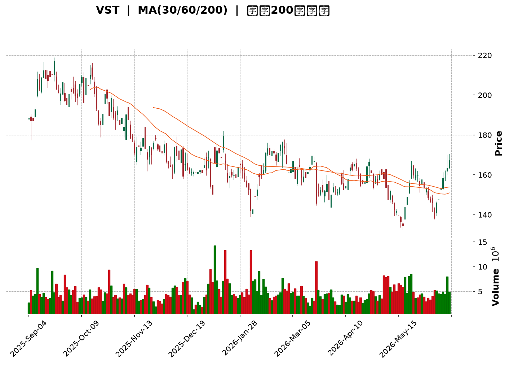
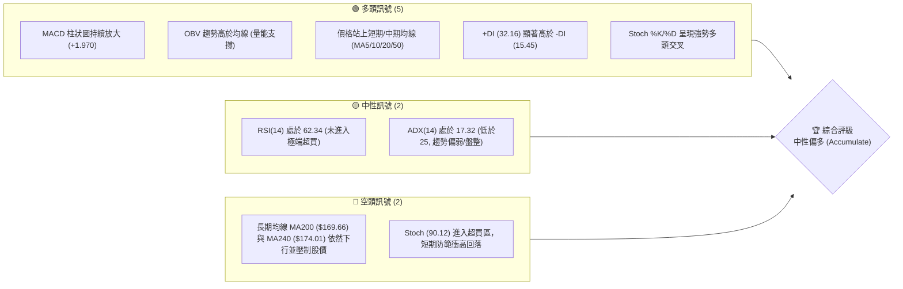
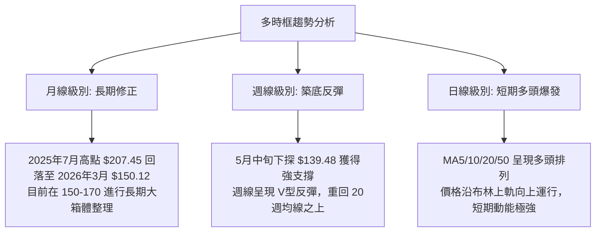
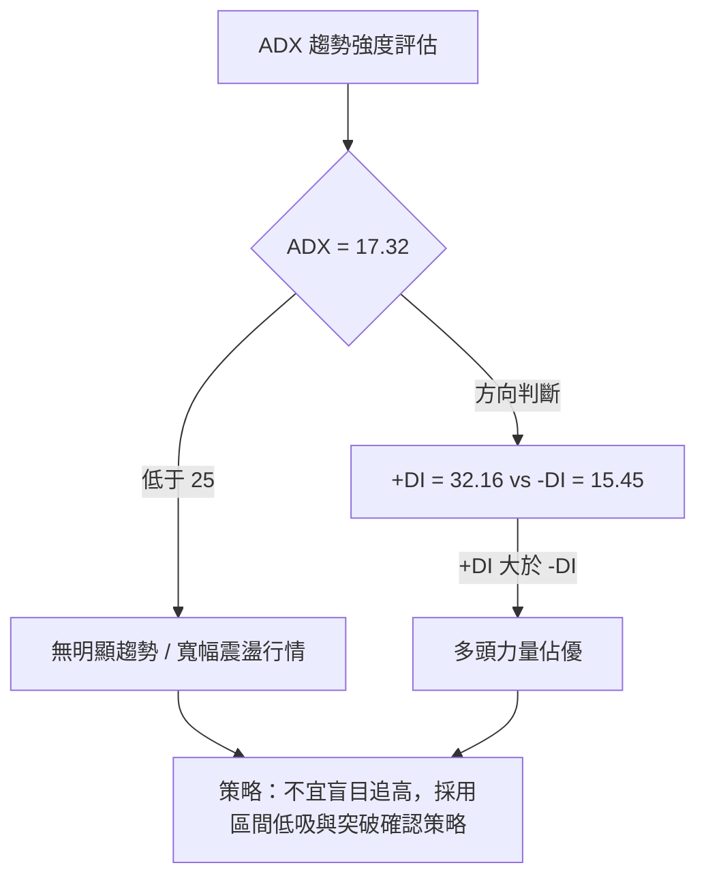
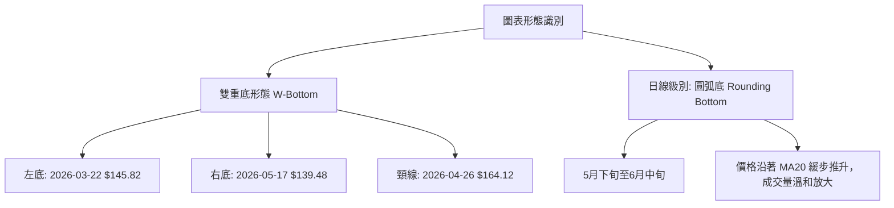
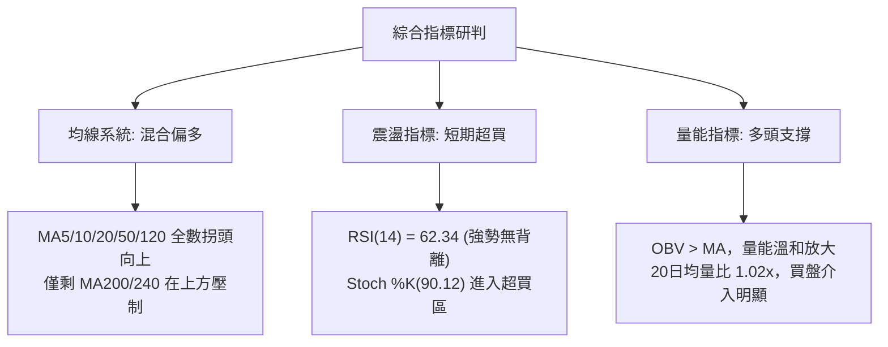
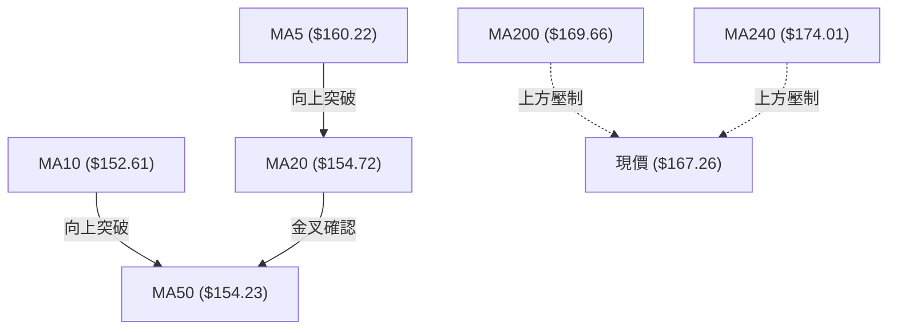
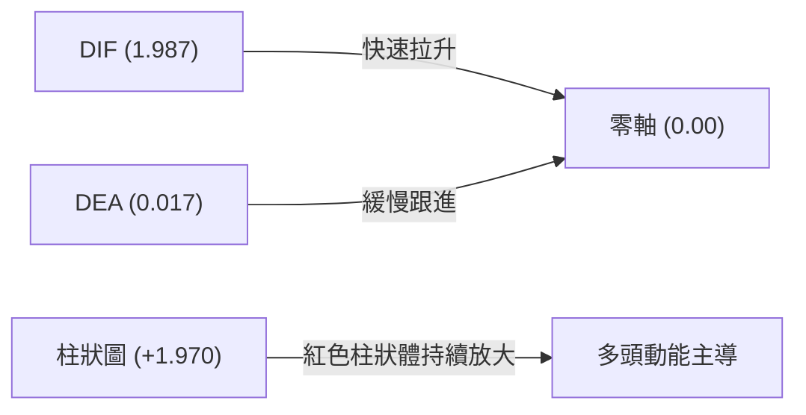
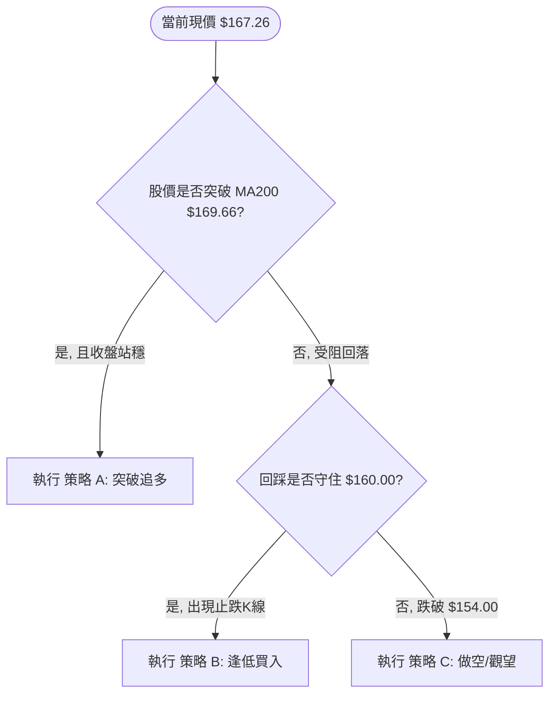
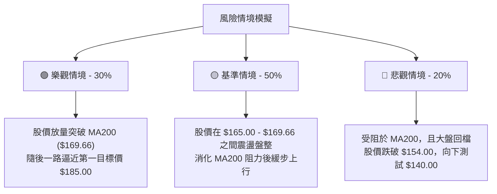

<details>
<summary>📊 靜態圖表 (點擊展開)</summary>

</details>

<html>
<head><meta charset="utf-8" /></head>
<body>
    <div style="height:500px; width:100%;">                        <script>window.PlotlyConfig = {MathJaxConfig: 'local'};</script>
        <script charset="utf-8" src="https://cdn.plot.ly/plotly-3.6.0.min.js" integrity="sha256-QaOVwtVY0T02VaHrr6pnoHLCwayMJp4O5n4YyaE3rJk=" crossorigin="anonymous"></script>                <div id="candlestick-chart" class="plotly-graph-div" style="height:100%; width:100%;"></div>            <script>                window.PLOTLYENV=window.PLOTLYENV || {};                                if (document.getElementById("candlestick-chart")) {                    Plotly.newPlot(                        "candlestick-chart",                        [{"close":{"dtype":"f8","bdata":"AAAAgK2XZ0AAAABAm2BnQAAAAODsYGdAAAAAIJoYaEAAAAAgyQNqQAAAAOCGX2lAAAAAIGITakAAAABg\u002fIxqQAAAAMDJCmpAAAAAwCLnaUAAAAAAByJqQAAAAKDrTGpAAAAA4IQga0AAAAAAk2xpQAAAAIAaJ2lAAAAAABUZaUAAAAAAistpQAAAAIDPo2hAAAAAQHBjaEAAAACgkxVpQAAAAMDnOWlAAAAAgN8kaUAAAADghfJoQAAAAABZ2WhAAAAAADC2aUAAAABgISRqQAAAAOBkgWhAAAAAQMoVakAAAACgC5VpQAAAAKA3P2pAAAAAYOAwakAAAABgehBpQAAAAODmLWhAAAAA4OI3Z0AAAADg5SFnQAAAAEBx0mdAAAAAQE0UaUAAAACAJs9oQAAAAACWuWdAAAAAYGHRaEAAAAAAi51nQAAAACCccGdAAAAAIKkHaEAAAACgBx9nQAAAAEBYk2dAAAAAgFb7ZkAAAADApsZnQAAAAOD4b2dAAAAAwFdNZkAAAABA+zBmQAAAAMAmW2VAAAAAgOW+ZUAAAABgxshlQAAAAMBKtmVAAAAAgLRMZkAAAAAgN6JlQAAAAICB\u002fGRAAAAAgDzNZUAAAAAANURlQAAAAOAiAmZAAAAAYMhDZkAAAABgb51lQAAAAGCzemVAAAAAAAVeZUAAAACg3+plQAAAAABBz2RAAAAAIMutZEAAAAAgDIRkQAAAAACFj2RAAAAAQAe8ZUAAAAAgoCxlQAAAAMCr8WRAAAAAYGGXZUAAAABAz+ljQAAAAABjr2RAAAAA4FJLZEAAAAAA+iNkQAAAAOAqJ2RAAAAAIGwwZEAAAADgKidkQAAAAKCXLGRAAAAAwHtFZEAAAABAURxkQAAAAADGmGRAAAAAQGBPZEAAAABg\u002fiFlQAAAAECNRWNAAAAAwOfFYkAAAAAAJ71kQAAAACBTg2VAAAAAgE5eZUAAAACAHxBlQAAAAGDadWZAAAAAAH7EZEAAAACAE4xjQAAAAGCD8mNAAAAA4Fz9Y0AAAABAtPVjQAAAAGDmy2NAAAAAgNF5ZEAAAABg26VkQAAAAAA1RGRAAAAAgDi9Y0AAAACgszpjQAAAAEB+EmNAAAAA4A7EYUAAAAAgnNVhQAAAAKCWp2JAAAAAIIkRY0AAAABAHOVjQAAAAECp9mNAAAAAQM1UZEAAAACAimBlQAAAAEBtpmVAAAAAoC5DZUAAAACAxYBlQAAAACCrXWVAAAAAQMnqZEAAAABgsGRlQAAAAOAJ3GVAAAAAYKEKZkAAAAAAIa1lQAAAAMAGsWRAAAAAACAoZEAAAABAGV1kQAAAAIAF3mRAAAAAQMvGY0AAAAAgZWVkQAAAAGBJfmRAAAAAwBHXY0AAAADgeORjQAAAAABe0GNAAAAAIGExZEAAAACADXxkQAAAAEDSNGVAAAAAgBDdZEAAAAAAGzpiQAAAAICC4mJAAAAAoDQQY0AAAAAgiuliQAAAAODIAmNAAAAAAGdoY0AAAABgrWpiQAAAACDVw2JAAAAAoNQ3Y0AAAACg\u002ft5iQAAAAKAY7GJAAAAA4OEuY0AAAAAAgXVjQAAAACAqEWNAAAAAgG9QY0AAAAAAUr9jQAAAAMCzd2RAAAAA4MlWZEAAAABgjalkQAAAAMBnZ2RAAAAA4A7sY0AAAAAgMFZjQAAAAOBOcmNAAAAAYC6UY0AAAACA2INkQAAAAAAby2RAAAAAQKEcZEAAAADAZTJjQAAAAADRs2NAAAAA4AJiY0AAAACAABRkQAAAAKD7BGRAAAAAQDLCY0AAAADAgjdjQAAAAABucGJAAAAAwMv6YkAAAACARFViQAAAAGAjzWFAAAAAIHO2YUAAAABggm9hQAAAAGDhEWFAAAAAILHQYEAAAABgjvlhQAAAAIDjm2JAAAAAoKWBY0AAAABAjopkQAAAACCi\u002fWNAAAAAoMkBZEAAAACAMABkQAAAAOBkUWNAAAAAgPi3Y0AAAACgtzJjQAAAAKCFL2NAAAAAoKmRYkAAAADgOVZiQAAAACB\u002fQGJAAAAAgBRLYUAAAAAgnEViQAAAACAEemJAAAAAIMUpY0AAAAAgbMxjQAAAAMBz02NAAAAAIKxwZEAAAADgUehkQA=="},"high":{"dtype":"f8","bdata":"QDJLwnDjZ0Cjbm6e481nQP9JBbXwsWdAe95f2VpPaEDwiK\u002fdnHhqQDqOhG1qWWpA4CEd\u002fMYjakBiSeoDahhrQNDipRDmlWpA2PzEMOaVakBSmNvP6KpqQFn\u002fgyaAnmpAScupMhFda0BApEEcPnxqQLEr9KieqmlA6SB5LjZtaUAWI7M8dtRpQAY1UT+TyGlA\u002f4AEBWT1aEDAO3MOkIJpQOO9ryjLhGlA93Sg0IAqakAysasiKuJpQPV+\u002fyurX2lAzJwodhm4aUAp16qFOkZqQKVfp82nb2pADicOaYkiakCXN7eFe\u002f9pQEh6\u002ffZy5GpACdOvPWMGa0CD4s8quSVqQB084DG6lGlAQYTGMsUTaEAvGzPQ2ZZnQPLUBm3k7GdAw5I+\u002fjAlaUDxMPp+F1ppQMaZ\u002fsTkj2hAFRM1S7j8aEDBkCKd2r9oQDJvAG7hAmhAxDkt9CxMaEBxp+5ERNZnQI73bc+n9WdAytOTnL2KZ0BPO7STCslnQPwusUd7f2hANUuYMiNlZ0Cr87UOipFmQFsESi8aJ2ZAltR8mBxoZkAzk8+u0FhmQG1KZdPkFWZArOFXcemXZkDjAIuDKJBnQDSr+9G1nmVACnIq9iXPZUAJY5G2K8BlQGkTWfloIGZAxk+aO6aAZkCENIIi8PdlQEah5pwM52VAfKxdwSCkZUBYTRZ7+ClmQDAcS\u002fi3\u002fGVATRAc3vfjZEBCb4oakiZlQEdQBV+bqmRAEPXEBUXFZUAIwyaGHGhmQKJYt14KiWVA9dQpMa2mZUDeJfV4PM1lQBdczqSfZmVAkvD6Kl9WZUD9YG8TantkQC+VNr\u002fyZ2RA\u002f6sLAF5EZEBT3R8xnFFkQBW902nnd2RAaKRLToZTZEAmYFI7eoFkQJeCwhgEGmVATeopUM5lZUBp8FokSIRlQAyWdjfpBWVAROJtm9hrY0COJfr1QMhlQJWwPdwTCGZAsBfXK+neZUCMn8fNpVZlQOXpDJbNwWZAeQWHmLtUZUAdJ+lMWLFkQB2MH1QPMWRALe2lyJBhZEBltG4Zdk1kQMN8ZnlTm2RAbfYffU6FZEBKFzU1N8NkQPdYvtdW7WRAjvAyQnqBZEDdR5uaPPFjQAdcsSYvgmNArwJ2+40nY0DTwSBkavBhQARwbMPg+mJAVNJ2HjVrY0CoNSN+MB9kQFzWX2FTm2RAd\u002fMSFwy4ZEBml3hI92VlQLi3ZmA0BWZAdF8WtYHgZUAzM\u002fdqAYNlQGJVQOquoGVASzahkbVrZUDnf+CEmmZlQD+xPiSM7mVAWbD5u7YXZkA+i+m7LTpmQG31n4UOAWZAjrl4BIZiZECvNElKOXhkQD8jKB428GRA\u002f6bjmUv9ZEDWRGNMoIVkQLW1qQlhCmVA55Wq9zNxZEBq9DMQ\u002fldkQDxQdpcXmWRA5cq235BhZEDtwTb2HKBkQEdRRym6kGVABnFCWjokZUAS2w0Xl8dkQCj9f9DSdWNArBCp0E08Y0DJ0ZzYVLdjQP255qKbDmNAJp7mLTv\u002fY0A8coLDpdZjQJA+jPBC6GJAtnEuPOKDY0DZhpXnAEtjQLeT4SSCHGNAum8zoDg+Y0AGa5WIsyJkQPAhUtavSWRAXnQOsg\u002fNY0AKvFgB2Q9kQHM\u002fAD6QoWRA5UvjPDDJZEBq01xT+NVkQBSlIOAjCGVAl1FaRUJ6ZEApP5q2\u002fRtkQMePKu9w22NAd6\u002fm+7rUY0DtmB1u9KdkQHfPrSvnBWVAe0d0XRdjZEDmAJauPB1kQDWgRj4E7WNAObMAU1D9Y0A6Qsq45ERkQPwsthFFcmRAvncR6GJYZEBQzOnT8QRlQLp1EVoQWWNAofcaGyoRY0CrwoLxm8NiQA6qzPRpQmJAWRXGBAfjYUASR\u002fX4kJxhQCHzmAkJa2FAVIfWU0gQYUCqLp7QUBZiQOrudJVHomJApM9jWzCrY0CkD9H2TuVkQCksGdBRmWRAhVjUZKRpZEC6wXhmBEJkQGFCeDSBymNAzaDPzsMRZECPZ\u002f6pDbZjQL3L5vpiOmNAeP9xBWBCY0BbQnRB66JiQIgbOsLfwmJA4OUhU475YUDpFA\u002frOVZiQBK6r9ZDyWJAf9bCg3FnY0C9wjo\u002fIihkQBc1bITPRmRAPn6+4UFDZUAAAAAAAFBlQA=="},"hovertemplate":"\u003cb\u003e%{x|%Y-%m-%d}\u003c\u002fb\u003e\u003cbr\u003e\u958b: $%{open:.2f}\u003cbr\u003e\u9ad8: $%{high:.2f}\u003cbr\u003e\u4f4e: $%{low:.2f}\u003cbr\u003e\u6536: $%{close:.2f}\u003cextra\u003e\u003c\u002fextra\u003e","low":{"dtype":"f8","bdata":"+0ksLfJ5Z0Dq++ba9i9mQEsfjnex9GZAoeonGyCHZ0AwzO10mt5oQET6TRxJQWlAO+llW5YeaUDM\u002fvUrYhNqQGJvfPRtx2lAievneUNzaUBjcFQS3N5pQKS7rFuoimlANgeysgXeaUABxi\u002fAt1NpQO9pkXQMIWlAQ9lCeU5maEAUm7DgrwRpQMXad4cpnGhAlG9vWRe9Z0DYM++y7+tnQGT8QzxZvGhAhn3hBUIVaUBHE7zejpNoQD4IHcVSYmhA3jRt+YDpaEBV5Yg9eI9pQMnE\u002fK3BgGhANoMnPjTyaEDiAGMjEhJpQFugZ1BosWlA51cNTTH6aUCMsOvqDOdoQPH5i288AGhAVc2rxpwZZ0CDtpo29VxmQLdR+OsSHmdAs+32qF85aEBVNvkA7HVoQIMJ5uyO9mZA3ZOP+uSVZ0D29kUAQnhnQDjBkMZI2GZAT5kaVyRiZ0ADEwuhg\u002fdmQDu09Gc3BWdADv4ALyJZZkDEkt49w\u002ftlQLLFatqt7GZA+4Y7ZDBCZkCb5ppLwBFmQO+1cXUCOmVACufm4ZWcZEDNzIc\u002f3YxlQD\u002fYrp54PmVAjWfVCOuvZUC070zsLo1lQDlvTLGFOGRA0MXITcimZEBs51gq8aZkQCblY9e\u002fi2VA65T9ALIoZkA+k85GKX9lQIchZSLwVGVAzflBW\u002foHZUAW4SS5cjhlQPrLUWjyuGRAZMbenCVsZEAIgdF3f4FkQLArIaS+v2NAO4jIl\u002fMKZEBEZ7k1xdlkQB2V5wUzyWRAs9PBDX+7ZEASOAeGVsFjQI2mmOnZP2RA3yQwts5AZED6zqgFAA1kQBwFzg0G9mNAcoBRHonqY0C4gPZUC\u002f1jQC8TVg1z72NAKY+dgbMTZEBdZG6czhhkQHYNiAgDbmRADECgLPD3Y0DJlyxTgGpkQNhP4ZS5I2NAQrOS3eiYYkBPjuoShK1kQNZA3jgTdGRA3i1W7yhLZUAJrhDe8LJkQCxWSnqaZmVAkOfdwu1RZEBGAwKoNHpjQBOeeqAQK2NAUsTV2L\u002fWY0AXq5IpDbJjQLD08TDcrmNA2KP2dta2Y0Byb7Z\u002f5BZkQJY9ThIlymNAR\u002furDKyNY0CJRaeyXDNjQMfxonBEv2JAUcp6U1hcYUCQf536ukRhQKFQ\u002f+VsYGJAKc9N6+lrYkByNGHBQExjQN5PMEmaw2NAWY7vxKP+Y0DidHElviFkQJsLt2xlL2VAY1s08oskZUDNzMyMJflkQDb2WZ0UEWVA0tMOiSKYZEDuJ0Lmx01kQILs1nSLM2VAbwviPgh1ZEBtuKDMZE1lQMSnt53rq2RAQZvR0doRY0BLvyHFo\u002f5jQGVNuoV8J2RAbKrpCKC7Y0Cf5bHwUFJjQMMkoUVBe2RA1HE1YBpXY0CX44T2kIhjQElApVJvqWNAHnsInWL1Y0Bf8kUShzVkQJFttaljoWRAwrR7ltx4ZED80hsiFBRiQDCcSKUJpGJAyIIcUeiqYkDrQA8ybsViQPVLM+8fSWJAEhzDmjXxYkDRQsnEo0xiQIi6hYmCxGFA8DrGUwbmYkCspp1EH71iQHp9+\u002fZztWJASPupEzzCYkAzn6ifVGJjQMhBT23tDmNAMcweD6scY0Bm\u002fQP19w1jQIN0gUfdA2RALPfdLIs9ZECnqN4zPkxkQJS7Xv8OQWRA2ZzkySfDY0BB439PQz1jQFCOfteBVmNAst3zCxZJY0AByZRk211jQNzBu59q0GNANrhk\u002fu\u002fPY0BX4EiitRtjQPbMMQxkcGNAYtt3otNWY0BSrOzQCKdjQHihDOVy8mNAFapMPDGMY0Cf+NxPwjFjQFqsM1rIWGJA8Hmqn1lCYkBT2n4cmi5iQE3hjaMTamFA5lUCCT53YUBVuQjMwDNhQDF9spuHtWBARUYq\u002fC6PYEBVvTbJwDNhQNs5lj2tFWJAvFPn\u002fEDRYkALBQmi9b9jQMdPpbT3xWNAJEOH0yWsY0Bq28zAI5VjQNVHqKvJ42JAs\u002f\u002f9j1EVY0BVQ\u002fAcjhdjQJGDq\u002fVbv2JAUQJaL2ZpYkCM8PoUnEViQPVudh3yqmFAABqb1\u002fI2YUBpIkej\u002fmthQAsPdu9rWWJA4+8leT7BYkBBg9+WuBNjQDVlMk+vn2NAMhGFfcz5Y0AAAADAzFxkQA=="},"name":"\u50f9\u683c","open":{"dtype":"f8","bdata":"hfS+lHCAZ0DJFcQQO6hnQEIRYbU4k2dAc7n19UWgZ0BKYE4aKO9oQJsfOs0Y9mlAOegE\u002frY7aUDM\u002fvUrYhNqQNDipRDmlWpAZw3\u002fRShGakBmNLsYTYZqQGgBb0ezUWpAgsG1Wv9DakADBZyQoidqQB2R4xpYTWlAf7cW\u002fbilaEC2gDinsgtpQFh40w8xJWlA7CnXBqXLaEDBy+XsHkZoQPtzZmYzZmlAR3mdcRRwaUAN+zOFwqlpQGQXzD99F2lATPCgm84XaUB8xVdMh8RpQKOcKVp7HGpAg5vyByYJaUBAeKrc951pQDpeT9t1DmpAnm5aGca8akA1GisH4dlpQIeWcr0RaWlA44lo648CaEB2IEuwtVhnQLdR+OsSHmdAz9WetRt5aEDxMPp+F1ppQMaZ\u002fsTkj2hAVOM6NBTwZ0DrajNF7DtoQOiM3sqE5mdAqs6Cw5jAZ0AYhbaRPGpnQI3c85eZL2dAUHrlJjXEZkCiOWtwTzhmQPKSDzu\u002fP2hAvnHl88MkZ0BenUHDoHJmQP5SyzukBWZA1QwKppLPZEAAgBhEetZlQN0Jnas0fmVACVjxmN\u002fNZUCiDphBtgFnQLMLpWUsaWVA4Z6CXbwbZUBSvuoLdatlQPc6L2HoqGVAN1NYfj5IZkAEh3La9ehlQHAFf6yF1WVAFWBtrzR+ZUB0NHuM\u002fGVlQPzuCZU2+WVATRAc3vfjZEBNcmeZ5JVkQPhBbtnvlGRA1jlCAhgsZEB0cX76Jc9lQMIjjxrEh2VATEcSyK6+ZEDno1LdOallQGJJunMin2RAIQc50EbAZECtOPeUhXFkQD4gggL6I2RAn+L3y3cRZEAAAADgKidkQG7571vJEWRA4rgUw7IxZEDE909+GU5kQHYNiAgDbmRAkXplNOMcZUB\u002fyluaFBFlQAyWdjfpBWVAg314aUtaY0BDTR56K7tlQEKobyPnhmRA7ZsDkaOwZUB+cQqihh1lQB4XJiW6kGVAqwSR587iZEA2FYATZxpkQOIDlzNI0mNAe0NexHYvZECQRUD23\u002fFjQF+aleWzBGRAT3RV2jziY0ADEildWLFkQPqRSZwRsGRAiTsxD74hZEATEffi4aZjQPSeN70OdmNAR5C9Wo4YY0CiNDVojZNhQGvQ+\u002fbBsmJAbvtA\u002f8GyYkD\u002fGoqro\u002f5jQLVo8+JukWRAkFS1rysJZED6JoGOdj5kQK3P8gcTTWVAs6ulQfWwZUDNzK7IHi5lQH1Q7ahjemVA5YCBUGpFZUDqU5E1MdpkQEAljxnxfGVAA7NbZWRcZUA5TwsKjdBlQLXxqtpfN2VAaNHSWc4nZEBBE15gnSRkQF+1iIDeLWRAgE9oy+F\u002fZEBk8plZCW9jQIbS4Q3snGRAI2cJ6MFkZEB0vvdfsZRjQF2rAP4JKmRAxPbQX8kRZEC2Ry36i0tkQI9bSwNeqWRAdFoVpa7WZEAS2w0Xl8dkQJsRxGqf52JAVVhE3NzKYkCDeW5EEFljQBbcrFNPqWJAEhzDmjXxYkDDZ3p6K5xjQBLZRipc9mFA\u002fZJ2BkPoYkCAm\u002fon9N9iQPTlBU2F2mJA3HawxnrbYkAFbOhyzhBkQD0FXQeBdWNAtZZUdyEpY0Bm\u002fQP19w1jQGrRNB\u002faRWRAwRlEDJioZEAS234f4IpkQLuBQSzhwGRAbaMVuk1aZECY18A7IBFkQElCG9mJsmNAS5sisr13Y0BNfAKAkINjQHTgz7mdmGRAgy\u002fmcLpIZECguN1AUhRkQFJ21iFJgmNAFnTg6dXCY0AlPbjzBa9jQED1\u002fJu0WGRAQvmM6JwoZEAIBNbd+1lkQLp1EVoQWWNA1M6FhWB5YkD6ZWWc\u002fahiQA6qzPRpQmJAOw0CVdWlYUC\u002fIGWJi3JhQKy7RZnHWWFAa6VN44XzYEAAAAAc0zlhQPzERLuHKGJA8Ee7hzPaYkDHxmI6AtZjQCqM6aVWl2RAr4IMn8XTY0BDIIcC1\u002fhjQMLQZVb5mGNAY8mZARp3Y0C17QHUUIljQAw4lp5\u002f6mJArxqcoTL5YkC3\u002fdt4SINiQDEc4UvMhmJAButnBcnkYUDK3O7+XplhQFYbq3pgeWJAgqlK4hQTY0CbYydnJCFjQIfXM+n7ymNA8Fc8ZKA7ZEAAAAAAKXBkQA=="},"x":["2025-09-04T00:00:00-04:00","2025-09-05T00:00:00-04:00","2025-09-08T00:00:00-04:00","2025-09-09T00:00:00-04:00","2025-09-10T00:00:00-04:00","2025-09-11T00:00:00-04:00","2025-09-12T00:00:00-04:00","2025-09-15T00:00:00-04:00","2025-09-16T00:00:00-04:00","2025-09-17T00:00:00-04:00","2025-09-18T00:00:00-04:00","2025-09-19T00:00:00-04:00","2025-09-22T00:00:00-04:00","2025-09-23T00:00:00-04:00","2025-09-24T00:00:00-04:00","2025-09-25T00:00:00-04:00","2025-09-26T00:00:00-04:00","2025-09-29T00:00:00-04:00","2025-09-30T00:00:00-04:00","2025-10-01T00:00:00-04:00","2025-10-02T00:00:00-04:00","2025-10-03T00:00:00-04:00","2025-10-06T00:00:00-04:00","2025-10-07T00:00:00-04:00","2025-10-08T00:00:00-04:00","2025-10-09T00:00:00-04:00","2025-10-10T00:00:00-04:00","2025-10-13T00:00:00-04:00","2025-10-14T00:00:00-04:00","2025-10-15T00:00:00-04:00","2025-10-16T00:00:00-04:00","2025-10-17T00:00:00-04:00","2025-10-20T00:00:00-04:00","2025-10-21T00:00:00-04:00","2025-10-22T00:00:00-04:00","2025-10-23T00:00:00-04:00","2025-10-24T00:00:00-04:00","2025-10-27T00:00:00-04:00","2025-10-28T00:00:00-04:00","2025-10-29T00:00:00-04:00","2025-10-30T00:00:00-04:00","2025-10-31T00:00:00-04:00","2025-11-03T00:00:00-05:00","2025-11-04T00:00:00-05:00","2025-11-05T00:00:00-05:00","2025-11-06T00:00:00-05:00","2025-11-07T00:00:00-05:00","2025-11-10T00:00:00-05:00","2025-11-11T00:00:00-05:00","2025-11-12T00:00:00-05:00","2025-11-13T00:00:00-05:00","2025-11-14T00:00:00-05:00","2025-11-17T00:00:00-05:00","2025-11-18T00:00:00-05:00","2025-11-19T00:00:00-05:00","2025-11-20T00:00:00-05:00","2025-11-21T00:00:00-05:00","2025-11-24T00:00:00-05:00","2025-11-25T00:00:00-05:00","2025-11-26T00:00:00-05:00","2025-11-28T00:00:00-05:00","2025-12-01T00:00:00-05:00","2025-12-02T00:00:00-05:00","2025-12-03T00:00:00-05:00","2025-12-04T00:00:00-05:00","2025-12-05T00:00:00-05:00","2025-12-08T00:00:00-05:00","2025-12-09T00:00:00-05:00","2025-12-10T00:00:00-05:00","2025-12-11T00:00:00-05:00","2025-12-12T00:00:00-05:00","2025-12-15T00:00:00-05:00","2025-12-16T00:00:00-05:00","2025-12-17T00:00:00-05:00","2025-12-18T00:00:00-05:00","2025-12-19T00:00:00-05:00","2025-12-22T00:00:00-05:00","2025-12-23T00:00:00-05:00","2025-12-24T00:00:00-05:00","2025-12-26T00:00:00-05:00","2025-12-29T00:00:00-05:00","2025-12-30T00:00:00-05:00","2025-12-31T00:00:00-05:00","2026-01-02T00:00:00-05:00","2026-01-05T00:00:00-05:00","2026-01-06T00:00:00-05:00","2026-01-07T00:00:00-05:00","2026-01-08T00:00:00-05:00","2026-01-09T00:00:00-05:00","2026-01-12T00:00:00-05:00","2026-01-13T00:00:00-05:00","2026-01-14T00:00:00-05:00","2026-01-15T00:00:00-05:00","2026-01-16T00:00:00-05:00","2026-01-20T00:00:00-05:00","2026-01-21T00:00:00-05:00","2026-01-22T00:00:00-05:00","2026-01-23T00:00:00-05:00","2026-01-26T00:00:00-05:00","2026-01-27T00:00:00-05:00","2026-01-28T00:00:00-05:00","2026-01-29T00:00:00-05:00","2026-01-30T00:00:00-05:00","2026-02-02T00:00:00-05:00","2026-02-03T00:00:00-05:00","2026-02-04T00:00:00-05:00","2026-02-05T00:00:00-05:00","2026-02-06T00:00:00-05:00","2026-02-09T00:00:00-05:00","2026-02-10T00:00:00-05:00","2026-02-11T00:00:00-05:00","2026-02-12T00:00:00-05:00","2026-02-13T00:00:00-05:00","2026-02-17T00:00:00-05:00","2026-02-18T00:00:00-05:00","2026-02-19T00:00:00-05:00","2026-02-20T00:00:00-05:00","2026-02-23T00:00:00-05:00","2026-02-24T00:00:00-05:00","2026-02-25T00:00:00-05:00","2026-02-26T00:00:00-05:00","2026-02-27T00:00:00-05:00","2026-03-02T00:00:00-05:00","2026-03-03T00:00:00-05:00","2026-03-04T00:00:00-05:00","2026-03-05T00:00:00-05:00","2026-03-06T00:00:00-05:00","2026-03-09T00:00:00-04:00","2026-03-10T00:00:00-04:00","2026-03-11T00:00:00-04:00","2026-03-12T00:00:00-04:00","2026-03-13T00:00:00-04:00","2026-03-16T00:00:00-04:00","2026-03-17T00:00:00-04:00","2026-03-18T00:00:00-04:00","2026-03-19T00:00:00-04:00","2026-03-20T00:00:00-04:00","2026-03-23T00:00:00-04:00","2026-03-24T00:00:00-04:00","2026-03-25T00:00:00-04:00","2026-03-26T00:00:00-04:00","2026-03-27T00:00:00-04:00","2026-03-30T00:00:00-04:00","2026-03-31T00:00:00-04:00","2026-04-01T00:00:00-04:00","2026-04-02T00:00:00-04:00","2026-04-06T00:00:00-04:00","2026-04-07T00:00:00-04:00","2026-04-08T00:00:00-04:00","2026-04-09T00:00:00-04:00","2026-04-10T00:00:00-04:00","2026-04-13T00:00:00-04:00","2026-04-14T00:00:00-04:00","2026-04-15T00:00:00-04:00","2026-04-16T00:00:00-04:00","2026-04-17T00:00:00-04:00","2026-04-20T00:00:00-04:00","2026-04-21T00:00:00-04:00","2026-04-22T00:00:00-04:00","2026-04-23T00:00:00-04:00","2026-04-24T00:00:00-04:00","2026-04-27T00:00:00-04:00","2026-04-28T00:00:00-04:00","2026-04-29T00:00:00-04:00","2026-04-30T00:00:00-04:00","2026-05-01T00:00:00-04:00","2026-05-04T00:00:00-04:00","2026-05-05T00:00:00-04:00","2026-05-06T00:00:00-04:00","2026-05-07T00:00:00-04:00","2026-05-08T00:00:00-04:00","2026-05-11T00:00:00-04:00","2026-05-12T00:00:00-04:00","2026-05-13T00:00:00-04:00","2026-05-14T00:00:00-04:00","2026-05-15T00:00:00-04:00","2026-05-18T00:00:00-04:00","2026-05-19T00:00:00-04:00","2026-05-20T00:00:00-04:00","2026-05-21T00:00:00-04:00","2026-05-22T00:00:00-04:00","2026-05-26T00:00:00-04:00","2026-05-27T00:00:00-04:00","2026-05-28T00:00:00-04:00","2026-05-29T00:00:00-04:00","2026-06-01T00:00:00-04:00","2026-06-02T00:00:00-04:00","2026-06-03T00:00:00-04:00","2026-06-04T00:00:00-04:00","2026-06-05T00:00:00-04:00","2026-06-08T00:00:00-04:00","2026-06-09T00:00:00-04:00","2026-06-10T00:00:00-04:00","2026-06-11T00:00:00-04:00","2026-06-12T00:00:00-04:00","2026-06-15T00:00:00-04:00","2026-06-16T00:00:00-04:00","2026-06-17T00:00:00-04:00","2026-06-18T00:00:00-04:00","2026-06-22T00:00:00-04:00"],"type":"candlestick"},{"hovertemplate":"MA30: $%{y:.2f}\u003cextra\u003e\u003c\u002fextra\u003e","line":{"color":"#2196F3","dash":"dash","width":2},"mode":"lines","name":"MA30","x":["2025-09-04T00:00:00-04:00","2025-09-05T00:00:00-04:00","2025-09-08T00:00:00-04:00","2025-09-09T00:00:00-04:00","2025-09-10T00:00:00-04:00","2025-09-11T00:00:00-04:00","2025-09-12T00:00:00-04:00","2025-09-15T00:00:00-04:00","2025-09-16T00:00:00-04:00","2025-09-17T00:00:00-04:00","2025-09-18T00:00:00-04:00","2025-09-19T00:00:00-04:00","2025-09-22T00:00:00-04:00","2025-09-23T00:00:00-04:00","2025-09-24T00:00:00-04:00","2025-09-25T00:00:00-04:00","2025-09-26T00:00:00-04:00","2025-09-29T00:00:00-04:00","2025-09-30T00:00:00-04:00","2025-10-01T00:00:00-04:00","2025-10-02T00:00:00-04:00","2025-10-03T00:00:00-04:00","2025-10-06T00:00:00-04:00","2025-10-07T00:00:00-04:00","2025-10-08T00:00:00-04:00","2025-10-09T00:00:00-04:00","2025-10-10T00:00:00-04:00","2025-10-13T00:00:00-04:00","2025-10-14T00:00:00-04:00","2025-10-15T00:00:00-04:00","2025-10-16T00:00:00-04:00","2025-10-17T00:00:00-04:00","2025-10-20T00:00:00-04:00","2025-10-21T00:00:00-04:00","2025-10-22T00:00:00-04:00","2025-10-23T00:00:00-04:00","2025-10-24T00:00:00-04:00","2025-10-27T00:00:00-04:00","2025-10-28T00:00:00-04:00","2025-10-29T00:00:00-04:00","2025-10-30T00:00:00-04:00","2025-10-31T00:00:00-04:00","2025-11-03T00:00:00-05:00","2025-11-04T00:00:00-05:00","2025-11-05T00:00:00-05:00","2025-11-06T00:00:00-05:00","2025-11-07T00:00:00-05:00","2025-11-10T00:00:00-05:00","2025-11-11T00:00:00-05:00","2025-11-12T00:00:00-05:00","2025-11-13T00:00:00-05:00","2025-11-14T00:00:00-05:00","2025-11-17T00:00:00-05:00","2025-11-18T00:00:00-05:00","2025-11-19T00:00:00-05:00","2025-11-20T00:00:00-05:00","2025-11-21T00:00:00-05:00","2025-11-24T00:00:00-05:00","2025-11-25T00:00:00-05:00","2025-11-26T00:00:00-05:00","2025-11-28T00:00:00-05:00","2025-12-01T00:00:00-05:00","2025-12-02T00:00:00-05:00","2025-12-03T00:00:00-05:00","2025-12-04T00:00:00-05:00","2025-12-05T00:00:00-05:00","2025-12-08T00:00:00-05:00","2025-12-09T00:00:00-05:00","2025-12-10T00:00:00-05:00","2025-12-11T00:00:00-05:00","2025-12-12T00:00:00-05:00","2025-12-15T00:00:00-05:00","2025-12-16T00:00:00-05:00","2025-12-17T00:00:00-05:00","2025-12-18T00:00:00-05:00","2025-12-19T00:00:00-05:00","2025-12-22T00:00:00-05:00","2025-12-23T00:00:00-05:00","2025-12-24T00:00:00-05:00","2025-12-26T00:00:00-05:00","2025-12-29T00:00:00-05:00","2025-12-30T00:00:00-05:00","2025-12-31T00:00:00-05:00","2026-01-02T00:00:00-05:00","2026-01-05T00:00:00-05:00","2026-01-06T00:00:00-05:00","2026-01-07T00:00:00-05:00","2026-01-08T00:00:00-05:00","2026-01-09T00:00:00-05:00","2026-01-12T00:00:00-05:00","2026-01-13T00:00:00-05:00","2026-01-14T00:00:00-05:00","2026-01-15T00:00:00-05:00","2026-01-16T00:00:00-05:00","2026-01-20T00:00:00-05:00","2026-01-21T00:00:00-05:00","2026-01-22T00:00:00-05:00","2026-01-23T00:00:00-05:00","2026-01-26T00:00:00-05:00","2026-01-27T00:00:00-05:00","2026-01-28T00:00:00-05:00","2026-01-29T00:00:00-05:00","2026-01-30T00:00:00-05:00","2026-02-02T00:00:00-05:00","2026-02-03T00:00:00-05:00","2026-02-04T00:00:00-05:00","2026-02-05T00:00:00-05:00","2026-02-06T00:00:00-05:00","2026-02-09T00:00:00-05:00","2026-02-10T00:00:00-05:00","2026-02-11T00:00:00-05:00","2026-02-12T00:00:00-05:00","2026-02-13T00:00:00-05:00","2026-02-17T00:00:00-05:00","2026-02-18T00:00:00-05:00","2026-02-19T00:00:00-05:00","2026-02-20T00:00:00-05:00","2026-02-23T00:00:00-05:00","2026-02-24T00:00:00-05:00","2026-02-25T00:00:00-05:00","2026-02-26T00:00:00-05:00","2026-02-27T00:00:00-05:00","2026-03-02T00:00:00-05:00","2026-03-03T00:00:00-05:00","2026-03-04T00:00:00-05:00","2026-03-05T00:00:00-05:00","2026-03-06T00:00:00-05:00","2026-03-09T00:00:00-04:00","2026-03-10T00:00:00-04:00","2026-03-11T00:00:00-04:00","2026-03-12T00:00:00-04:00","2026-03-13T00:00:00-04:00","2026-03-16T00:00:00-04:00","2026-03-17T00:00:00-04:00","2026-03-18T00:00:00-04:00","2026-03-19T00:00:00-04:00","2026-03-20T00:00:00-04:00","2026-03-23T00:00:00-04:00","2026-03-24T00:00:00-04:00","2026-03-25T00:00:00-04:00","2026-03-26T00:00:00-04:00","2026-03-27T00:00:00-04:00","2026-03-30T00:00:00-04:00","2026-03-31T00:00:00-04:00","2026-04-01T00:00:00-04:00","2026-04-02T00:00:00-04:00","2026-04-06T00:00:00-04:00","2026-04-07T00:00:00-04:00","2026-04-08T00:00:00-04:00","2026-04-09T00:00:00-04:00","2026-04-10T00:00:00-04:00","2026-04-13T00:00:00-04:00","2026-04-14T00:00:00-04:00","2026-04-15T00:00:00-04:00","2026-04-16T00:00:00-04:00","2026-04-17T00:00:00-04:00","2026-04-20T00:00:00-04:00","2026-04-21T00:00:00-04:00","2026-04-22T00:00:00-04:00","2026-04-23T00:00:00-04:00","2026-04-24T00:00:00-04:00","2026-04-27T00:00:00-04:00","2026-04-28T00:00:00-04:00","2026-04-29T00:00:00-04:00","2026-04-30T00:00:00-04:00","2026-05-01T00:00:00-04:00","2026-05-04T00:00:00-04:00","2026-05-05T00:00:00-04:00","2026-05-06T00:00:00-04:00","2026-05-07T00:00:00-04:00","2026-05-08T00:00:00-04:00","2026-05-11T00:00:00-04:00","2026-05-12T00:00:00-04:00","2026-05-13T00:00:00-04:00","2026-05-14T00:00:00-04:00","2026-05-15T00:00:00-04:00","2026-05-18T00:00:00-04:00","2026-05-19T00:00:00-04:00","2026-05-20T00:00:00-04:00","2026-05-21T00:00:00-04:00","2026-05-22T00:00:00-04:00","2026-05-26T00:00:00-04:00","2026-05-27T00:00:00-04:00","2026-05-28T00:00:00-04:00","2026-05-29T00:00:00-04:00","2026-06-01T00:00:00-04:00","2026-06-02T00:00:00-04:00","2026-06-03T00:00:00-04:00","2026-06-04T00:00:00-04:00","2026-06-05T00:00:00-04:00","2026-06-08T00:00:00-04:00","2026-06-09T00:00:00-04:00","2026-06-10T00:00:00-04:00","2026-06-11T00:00:00-04:00","2026-06-12T00:00:00-04:00","2026-06-15T00:00:00-04:00","2026-06-16T00:00:00-04:00","2026-06-17T00:00:00-04:00","2026-06-18T00:00:00-04:00","2026-06-22T00:00:00-04:00"],"y":{"dtype":"f8","bdata":"AAAAAAAA+H8AAAAAAAD4fwAAAAAAAPh\u002fAAAAAAAA+H8AAAAAAAD4fwAAAAAAAPh\u002fAAAAAAAA+H8AAAAAAAD4fwAAAAAAAPh\u002fAAAAAAAA+H8AAAAAAAD4fwAAAAAAAPh\u002fAAAAAAAA+H8AAAAAAAD4fwAAAAAAAPh\u002fAAAAAAAA+H8AAAAAAAD4fwAAAAAAAPh\u002fAAAAAAAA+H8AAAAAAAD4fwAAAAAAAPh\u002fAAAAAAAA+H8AAAAAAAD4fwAAAAAAAPh\u002fAAAAAAAA+H8AAAAAAAD4fwAAAAAAAPh\u002fAAAAAAAA+H8AAAAAAAD4f83MzMw2VWlAmpmZKWNraUB3d3d3yHlpQJqZmZmdgGlAZmZmBiB5aUAiIiJih2BpQN7d3e1KU2lAvLu7O8pKaUBVVVXF7TtpQHd3d8cnKGlAmpmZmeUeaUAAAAAAaglpQDMzM\u002fMA8WhAmpmZOZPWaEAiIiJy7MJoQJqZmQl3tWhAd3d3J2ijaEARERFhLZJoQN7d3X3qh2hAAAAA4Bx2aEAREREhbV1oQCIiIrJmPGhAVVVV5WYfaEC8u7sLaQRoQN7d3U2k6WdAZmZmlobMZ0CJiIjYD6ZnQEREREQIiGdAIiIiAntjZ0De3d0Npz5nQCIiIrJ7GmdAVVVV5fr4ZkCJiIiYi9tmQImIiFiBxGZA7+7urrW0ZkC8u7ubV6pmQM3MzMyikGZA3t3d7RVrZkCrqqrqckZmQJqZmVlyK2ZAvLu7iyIRZkCrqqrqTfxlQDMzM6MB52VAIiIicjLSZUAzMzOz0rZlQERERGQonmVAZmZmVjmHZUBERESUM2hlQGZmZrYsTGVAvLu72yQ6ZUC8u7sLwChlQFVVVTWqHmVA3t3dnRUSZUAiIiJyzQNlQFVVVQVJ+mRA7+7uvk7pZEBmZmaWCOVkQImIiNhm1mRAAAAAsI68ZECJiIg4DrhkQImIiBjUs2RAZmZm5i2sZECamZkJeKdkQERERDTXr2RAq6qqGrmqZECamZkZf5ZkQCIiInIjj2RAd3d350GJZEDe3d09g4RkQERERPT9fWRA3t3dbUBzZEB3d3dnwm5kQN7d3S36aGRAREREBCxZZEAzMzPDVVNkQHd3d2eSRWRAIiIiEv8vZEBmZmZGURxkQBERERGID2RAd3d39\u002fcFZEB3d3dHxANkQBERERH4AWRAiYiIyHoCZEDe3d19SQ1kQImIiIhGFmRAMzMzA2ceZECJiIjIjyFkQFVVVaVuM2RA3t3dbbpFZEAzMzMTUEtkQJqZmRlFTmRAiYiImANUZEARERFhP1lkQCIiIkInSmRAzczM7PBEZEBVVVWV6EtkQBEREUHCU2RAmpmZmfBRZEAiIiKyqVVkQN7d3e2bW2RAMzMzIy9WZEC8u7vrvE9kQLy7u2vgS2RAREREpL9PZEBmZmbWdVpkQGZmZtarbGRAMzMz0xqHZEAzMzNjdIpkQO\u002fu7i5rjGRAVVVV1V+MZECJiIgY\u002fYNkQERERATce2RA3t3dvfpzZEAzMzOjt1pkQHd3d\u002fcYQmRAiYiICKcwZECJiIh4MRpkQBEREUFXBWRAZmZmRov2Y0AiIiKyCeZjQAAAAHA1zmNAIiIigu+2Y0DNzMyseaZjQCIiIoKQpGNAREREtB6mY0C8u7sbq6hjQKuqquq2pGNAd3d35\u002fSlY0Crqqqa6pxjQKuqqtr7k2NAMzMzE8GRY0AAAAAQEZdjQCIiIrJsn2NAIiIiorueY0AzMzOTvpNjQDMzMzPphmNAzczMnEZ6Y0B3d3eHEopjQLy7uzvBk2NAZmZmFrCZY0ARERFxSZxjQLy7u4tol2NAzczMPMGTY0CrqqqKCpNjQKuqqmrRimNAVVVV1fh9Y0BVVVX1uHFjQBEREVHqYWNA3t3dfbVNY0BVVVVFC0FjQERERIQiPWNAREREdMY+Y0Crqqq6jEVjQDMzMxN7QWNAvLu7u6U+Y0ARERGBADljQERERCS8L2NAmpmZqf8tY0Crqqr60CxjQCIiIhKXKmNAvLu7C\u002fkhY0ARERGxYg9jQERERNSy+WJAq6qqmqXhYkBEREQEwdliQBEREUFLz2JAREREVGvNYkBERESECMtiQKuqqtphyWJAd3d3tzLPYkBVVVUFoN1iQA=="},"type":"scatter"},{"hovertemplate":"MA60: $%{y:.2f}\u003cextra\u003e\u003c\u002fextra\u003e","line":{"color":"#9C27B0","dash":"dash","width":2},"mode":"lines","name":"MA60","x":["2025-09-04T00:00:00-04:00","2025-09-05T00:00:00-04:00","2025-09-08T00:00:00-04:00","2025-09-09T00:00:00-04:00","2025-09-10T00:00:00-04:00","2025-09-11T00:00:00-04:00","2025-09-12T00:00:00-04:00","2025-09-15T00:00:00-04:00","2025-09-16T00:00:00-04:00","2025-09-17T00:00:00-04:00","2025-09-18T00:00:00-04:00","2025-09-19T00:00:00-04:00","2025-09-22T00:00:00-04:00","2025-09-23T00:00:00-04:00","2025-09-24T00:00:00-04:00","2025-09-25T00:00:00-04:00","2025-09-26T00:00:00-04:00","2025-09-29T00:00:00-04:00","2025-09-30T00:00:00-04:00","2025-10-01T00:00:00-04:00","2025-10-02T00:00:00-04:00","2025-10-03T00:00:00-04:00","2025-10-06T00:00:00-04:00","2025-10-07T00:00:00-04:00","2025-10-08T00:00:00-04:00","2025-10-09T00:00:00-04:00","2025-10-10T00:00:00-04:00","2025-10-13T00:00:00-04:00","2025-10-14T00:00:00-04:00","2025-10-15T00:00:00-04:00","2025-10-16T00:00:00-04:00","2025-10-17T00:00:00-04:00","2025-10-20T00:00:00-04:00","2025-10-21T00:00:00-04:00","2025-10-22T00:00:00-04:00","2025-10-23T00:00:00-04:00","2025-10-24T00:00:00-04:00","2025-10-27T00:00:00-04:00","2025-10-28T00:00:00-04:00","2025-10-29T00:00:00-04:00","2025-10-30T00:00:00-04:00","2025-10-31T00:00:00-04:00","2025-11-03T00:00:00-05:00","2025-11-04T00:00:00-05:00","2025-11-05T00:00:00-05:00","2025-11-06T00:00:00-05:00","2025-11-07T00:00:00-05:00","2025-11-10T00:00:00-05:00","2025-11-11T00:00:00-05:00","2025-11-12T00:00:00-05:00","2025-11-13T00:00:00-05:00","2025-11-14T00:00:00-05:00","2025-11-17T00:00:00-05:00","2025-11-18T00:00:00-05:00","2025-11-19T00:00:00-05:00","2025-11-20T00:00:00-05:00","2025-11-21T00:00:00-05:00","2025-11-24T00:00:00-05:00","2025-11-25T00:00:00-05:00","2025-11-26T00:00:00-05:00","2025-11-28T00:00:00-05:00","2025-12-01T00:00:00-05:00","2025-12-02T00:00:00-05:00","2025-12-03T00:00:00-05:00","2025-12-04T00:00:00-05:00","2025-12-05T00:00:00-05:00","2025-12-08T00:00:00-05:00","2025-12-09T00:00:00-05:00","2025-12-10T00:00:00-05:00","2025-12-11T00:00:00-05:00","2025-12-12T00:00:00-05:00","2025-12-15T00:00:00-05:00","2025-12-16T00:00:00-05:00","2025-12-17T00:00:00-05:00","2025-12-18T00:00:00-05:00","2025-12-19T00:00:00-05:00","2025-12-22T00:00:00-05:00","2025-12-23T00:00:00-05:00","2025-12-24T00:00:00-05:00","2025-12-26T00:00:00-05:00","2025-12-29T00:00:00-05:00","2025-12-30T00:00:00-05:00","2025-12-31T00:00:00-05:00","2026-01-02T00:00:00-05:00","2026-01-05T00:00:00-05:00","2026-01-06T00:00:00-05:00","2026-01-07T00:00:00-05:00","2026-01-08T00:00:00-05:00","2026-01-09T00:00:00-05:00","2026-01-12T00:00:00-05:00","2026-01-13T00:00:00-05:00","2026-01-14T00:00:00-05:00","2026-01-15T00:00:00-05:00","2026-01-16T00:00:00-05:00","2026-01-20T00:00:00-05:00","2026-01-21T00:00:00-05:00","2026-01-22T00:00:00-05:00","2026-01-23T00:00:00-05:00","2026-01-26T00:00:00-05:00","2026-01-27T00:00:00-05:00","2026-01-28T00:00:00-05:00","2026-01-29T00:00:00-05:00","2026-01-30T00:00:00-05:00","2026-02-02T00:00:00-05:00","2026-02-03T00:00:00-05:00","2026-02-04T00:00:00-05:00","2026-02-05T00:00:00-05:00","2026-02-06T00:00:00-05:00","2026-02-09T00:00:00-05:00","2026-02-10T00:00:00-05:00","2026-02-11T00:00:00-05:00","2026-02-12T00:00:00-05:00","2026-02-13T00:00:00-05:00","2026-02-17T00:00:00-05:00","2026-02-18T00:00:00-05:00","2026-02-19T00:00:00-05:00","2026-02-20T00:00:00-05:00","2026-02-23T00:00:00-05:00","2026-02-24T00:00:00-05:00","2026-02-25T00:00:00-05:00","2026-02-26T00:00:00-05:00","2026-02-27T00:00:00-05:00","2026-03-02T00:00:00-05:00","2026-03-03T00:00:00-05:00","2026-03-04T00:00:00-05:00","2026-03-05T00:00:00-05:00","2026-03-06T00:00:00-05:00","2026-03-09T00:00:00-04:00","2026-03-10T00:00:00-04:00","2026-03-11T00:00:00-04:00","2026-03-12T00:00:00-04:00","2026-03-13T00:00:00-04:00","2026-03-16T00:00:00-04:00","2026-03-17T00:00:00-04:00","2026-03-18T00:00:00-04:00","2026-03-19T00:00:00-04:00","2026-03-20T00:00:00-04:00","2026-03-23T00:00:00-04:00","2026-03-24T00:00:00-04:00","2026-03-25T00:00:00-04:00","2026-03-26T00:00:00-04:00","2026-03-27T00:00:00-04:00","2026-03-30T00:00:00-04:00","2026-03-31T00:00:00-04:00","2026-04-01T00:00:00-04:00","2026-04-02T00:00:00-04:00","2026-04-06T00:00:00-04:00","2026-04-07T00:00:00-04:00","2026-04-08T00:00:00-04:00","2026-04-09T00:00:00-04:00","2026-04-10T00:00:00-04:00","2026-04-13T00:00:00-04:00","2026-04-14T00:00:00-04:00","2026-04-15T00:00:00-04:00","2026-04-16T00:00:00-04:00","2026-04-17T00:00:00-04:00","2026-04-20T00:00:00-04:00","2026-04-21T00:00:00-04:00","2026-04-22T00:00:00-04:00","2026-04-23T00:00:00-04:00","2026-04-24T00:00:00-04:00","2026-04-27T00:00:00-04:00","2026-04-28T00:00:00-04:00","2026-04-29T00:00:00-04:00","2026-04-30T00:00:00-04:00","2026-05-01T00:00:00-04:00","2026-05-04T00:00:00-04:00","2026-05-05T00:00:00-04:00","2026-05-06T00:00:00-04:00","2026-05-07T00:00:00-04:00","2026-05-08T00:00:00-04:00","2026-05-11T00:00:00-04:00","2026-05-12T00:00:00-04:00","2026-05-13T00:00:00-04:00","2026-05-14T00:00:00-04:00","2026-05-15T00:00:00-04:00","2026-05-18T00:00:00-04:00","2026-05-19T00:00:00-04:00","2026-05-20T00:00:00-04:00","2026-05-21T00:00:00-04:00","2026-05-22T00:00:00-04:00","2026-05-26T00:00:00-04:00","2026-05-27T00:00:00-04:00","2026-05-28T00:00:00-04:00","2026-05-29T00:00:00-04:00","2026-06-01T00:00:00-04:00","2026-06-02T00:00:00-04:00","2026-06-03T00:00:00-04:00","2026-06-04T00:00:00-04:00","2026-06-05T00:00:00-04:00","2026-06-08T00:00:00-04:00","2026-06-09T00:00:00-04:00","2026-06-10T00:00:00-04:00","2026-06-11T00:00:00-04:00","2026-06-12T00:00:00-04:00","2026-06-15T00:00:00-04:00","2026-06-16T00:00:00-04:00","2026-06-17T00:00:00-04:00","2026-06-18T00:00:00-04:00","2026-06-22T00:00:00-04:00"],"y":{"dtype":"f8","bdata":"AAAAAAAA+H8AAAAAAAD4fwAAAAAAAPh\u002fAAAAAAAA+H8AAAAAAAD4fwAAAAAAAPh\u002fAAAAAAAA+H8AAAAAAAD4fwAAAAAAAPh\u002fAAAAAAAA+H8AAAAAAAD4fwAAAAAAAPh\u002fAAAAAAAA+H8AAAAAAAD4fwAAAAAAAPh\u002fAAAAAAAA+H8AAAAAAAD4fwAAAAAAAPh\u002fAAAAAAAA+H8AAAAAAAD4fwAAAAAAAPh\u002fAAAAAAAA+H8AAAAAAAD4fwAAAAAAAPh\u002fAAAAAAAA+H8AAAAAAAD4fwAAAAAAAPh\u002fAAAAAAAA+H8AAAAAAAD4fwAAAAAAAPh\u002fAAAAAAAA+H8AAAAAAAD4fwAAAAAAAPh\u002fAAAAAAAA+H8AAAAAAAD4fwAAAAAAAPh\u002fAAAAAAAA+H8AAAAAAAD4fwAAAAAAAPh\u002fAAAAAAAA+H8AAAAAAAD4fwAAAAAAAPh\u002fAAAAAAAA+H8AAAAAAAD4fwAAAAAAAPh\u002fAAAAAAAA+H8AAAAAAAD4fwAAAAAAAPh\u002fAAAAAAAA+H8AAAAAAAD4fwAAAAAAAPh\u002fAAAAAAAA+H8AAAAAAAD4fwAAAAAAAPh\u002fAAAAAAAA+H8AAAAAAAD4fwAAAAAAAPh\u002fAAAAAAAA+H8AAAAAAAD4f3d3dz\u002fZN2hAd3d3By8yaEAAAAAIqipoQBEREXmPImhAq6qq2uoWaEDv7u5+bwVoQFVVVd328WdAzczMFPDaZ0AAAABYMMFnQImIiBDNqWdAq6qqEgSYZ0BVVVX124JnQDMzM0sBbGdA3t3d1WJUZ0CrqqqS3zxnQO\u002fu7rbPKWdA7+7uvlAVZ0Crqqp6MP1mQCIiIpoL6mZA3t3d3SDYZkBmZmaWFsNmQLy7u3OIrWZAmpmZQb6YZkDv7u4+G4RmQJqZman2cWZAq6qqqupaZkB3d3c3jEVmQGZmZo43L2ZAERER2QQQZkAzMzOjWvtlQFVVVeUn52VA3t3dZZTSZUARERHRgcFlQGZmZkYsumVAzczMZLevZUCrqqpaa6BlQHd3dx\u002fjj2VAq6qq6it6ZUBEREQUe2VlQO\u002fu7ia4VGVAzczMfDFCZUAREREpiDVlQImIiOj9J2VAMzMzO68VZUAzMzM7FAVlQN7d3WXd8WRARERENJzbZEBVVVVtQsJkQLy7u2ParWRAmpmZaQ6gZECamZkpQpZkQDMzMyNRkGRAMzMzM0iKZEAAAAB4i4hkQO\u002fu7sZHiGRAERER4dqDZEB3d3cvTINkQO\u002fu7r7qhGRA7+7ujiSBZEDe3d0lr4FkQBEREZkMgWRAd3d3vxiAZEBVVVW1W4BkQDMzMzv\u002ffGRAvLu7A9V3ZEB3d3fXM3FkQJqZmdlycWRAiYiIQJltZEAAAAB4Fm1kQBEREfHMbGRAiYiIyLdkZECamZmpP19kQM3MzExtWmRARERE1HVUZEDNzMzM5VZkQO\u002fu7h4fWWRAq6qq8oxbZEDNzMzUYlNkQAAAAKD5TWRAZmZm5itJZEAAAACw4ENkQKuqqgrqPmRAMzMzwzo7ZECJiIiQADRkQAAAAMAvLGRA3t3dBYcnZECJiIig4B1kQDMzM\u002fNiHGRAIiIi2iIeZECrqqrirBhkQM3MzEQ9DmRAVVVVjXkFZEDv7u6G3P9jQCIiIuJb92NAiYiI0If1Y0CJiIjYSfpjQN7d3ZU8\u002fGNAiYiIwPL7Y0BmZmYmSvljQEREROTL92NAMzMzG\u002fjzY0De3d39ZvNjQO\u002fu7o6m9WNAMzMzoz33Y0DNzMw0GvdjQM3MzITK+WNAAAAAuLAAZEBVVVV1QwpkQFVVVTUWEGRA3t3d9QcTZEDNzMxEIxBkQAAAAEiiCWRAVVVV\u002fd0DZEDv7u4W4fZjQBERETF15mNA7+7u7k\u002fXY0Dv7u429cVjQBEREcmgs2NAIiIiYiCiY0C8u7t7ipNjQCIiIvqrhWNAMzMz+9p6Y0C8u7szA3ZjQKuqqsoFc2NAAAAAOGJyY0BmZmbO1XBjQHd3d4c5amNAiYiISPppY0CrqqrK3WRjQGZmZnZJX2NAd3d3D91ZY0CJiIjgOVNjQDMzM8OPTGNAZmZmnjBAY0C8u7vLvzZjQCIiIjoaK2NAiYiI+NgjY0De3d2FjSpjQDMzM4uRLmNA7+7uZnE0Y0AzMzO79DxjQA=="},"type":"scatter"},{"hovertemplate":"MA200: $%{y:.2f}\u003cextra\u003e\u003c\u002fextra\u003e","line":{"color":"#FF6F00","dash":"solid","width":2},"mode":"lines","name":"MA200","x":["2025-09-04T00:00:00-04:00","2025-09-05T00:00:00-04:00","2025-09-08T00:00:00-04:00","2025-09-09T00:00:00-04:00","2025-09-10T00:00:00-04:00","2025-09-11T00:00:00-04:00","2025-09-12T00:00:00-04:00","2025-09-15T00:00:00-04:00","2025-09-16T00:00:00-04:00","2025-09-17T00:00:00-04:00","2025-09-18T00:00:00-04:00","2025-09-19T00:00:00-04:00","2025-09-22T00:00:00-04:00","2025-09-23T00:00:00-04:00","2025-09-24T00:00:00-04:00","2025-09-25T00:00:00-04:00","2025-09-26T00:00:00-04:00","2025-09-29T00:00:00-04:00","2025-09-30T00:00:00-04:00","2025-10-01T00:00:00-04:00","2025-10-02T00:00:00-04:00","2025-10-03T00:00:00-04:00","2025-10-06T00:00:00-04:00","2025-10-07T00:00:00-04:00","2025-10-08T00:00:00-04:00","2025-10-09T00:00:00-04:00","2025-10-10T00:00:00-04:00","2025-10-13T00:00:00-04:00","2025-10-14T00:00:00-04:00","2025-10-15T00:00:00-04:00","2025-10-16T00:00:00-04:00","2025-10-17T00:00:00-04:00","2025-10-20T00:00:00-04:00","2025-10-21T00:00:00-04:00","2025-10-22T00:00:00-04:00","2025-10-23T00:00:00-04:00","2025-10-24T00:00:00-04:00","2025-10-27T00:00:00-04:00","2025-10-28T00:00:00-04:00","2025-10-29T00:00:00-04:00","2025-10-30T00:00:00-04:00","2025-10-31T00:00:00-04:00","2025-11-03T00:00:00-05:00","2025-11-04T00:00:00-05:00","2025-11-05T00:00:00-05:00","2025-11-06T00:00:00-05:00","2025-11-07T00:00:00-05:00","2025-11-10T00:00:00-05:00","2025-11-11T00:00:00-05:00","2025-11-12T00:00:00-05:00","2025-11-13T00:00:00-05:00","2025-11-14T00:00:00-05:00","2025-11-17T00:00:00-05:00","2025-11-18T00:00:00-05:00","2025-11-19T00:00:00-05:00","2025-11-20T00:00:00-05:00","2025-11-21T00:00:00-05:00","2025-11-24T00:00:00-05:00","2025-11-25T00:00:00-05:00","2025-11-26T00:00:00-05:00","2025-11-28T00:00:00-05:00","2025-12-01T00:00:00-05:00","2025-12-02T00:00:00-05:00","2025-12-03T00:00:00-05:00","2025-12-04T00:00:00-05:00","2025-12-05T00:00:00-05:00","2025-12-08T00:00:00-05:00","2025-12-09T00:00:00-05:00","2025-12-10T00:00:00-05:00","2025-12-11T00:00:00-05:00","2025-12-12T00:00:00-05:00","2025-12-15T00:00:00-05:00","2025-12-16T00:00:00-05:00","2025-12-17T00:00:00-05:00","2025-12-18T00:00:00-05:00","2025-12-19T00:00:00-05:00","2025-12-22T00:00:00-05:00","2025-12-23T00:00:00-05:00","2025-12-24T00:00:00-05:00","2025-12-26T00:00:00-05:00","2025-12-29T00:00:00-05:00","2025-12-30T00:00:00-05:00","2025-12-31T00:00:00-05:00","2026-01-02T00:00:00-05:00","2026-01-05T00:00:00-05:00","2026-01-06T00:00:00-05:00","2026-01-07T00:00:00-05:00","2026-01-08T00:00:00-05:00","2026-01-09T00:00:00-05:00","2026-01-12T00:00:00-05:00","2026-01-13T00:00:00-05:00","2026-01-14T00:00:00-05:00","2026-01-15T00:00:00-05:00","2026-01-16T00:00:00-05:00","2026-01-20T00:00:00-05:00","2026-01-21T00:00:00-05:00","2026-01-22T00:00:00-05:00","2026-01-23T00:00:00-05:00","2026-01-26T00:00:00-05:00","2026-01-27T00:00:00-05:00","2026-01-28T00:00:00-05:00","2026-01-29T00:00:00-05:00","2026-01-30T00:00:00-05:00","2026-02-02T00:00:00-05:00","2026-02-03T00:00:00-05:00","2026-02-04T00:00:00-05:00","2026-02-05T00:00:00-05:00","2026-02-06T00:00:00-05:00","2026-02-09T00:00:00-05:00","2026-02-10T00:00:00-05:00","2026-02-11T00:00:00-05:00","2026-02-12T00:00:00-05:00","2026-02-13T00:00:00-05:00","2026-02-17T00:00:00-05:00","2026-02-18T00:00:00-05:00","2026-02-19T00:00:00-05:00","2026-02-20T00:00:00-05:00","2026-02-23T00:00:00-05:00","2026-02-24T00:00:00-05:00","2026-02-25T00:00:00-05:00","2026-02-26T00:00:00-05:00","2026-02-27T00:00:00-05:00","2026-03-02T00:00:00-05:00","2026-03-03T00:00:00-05:00","2026-03-04T00:00:00-05:00","2026-03-05T00:00:00-05:00","2026-03-06T00:00:00-05:00","2026-03-09T00:00:00-04:00","2026-03-10T00:00:00-04:00","2026-03-11T00:00:00-04:00","2026-03-12T00:00:00-04:00","2026-03-13T00:00:00-04:00","2026-03-16T00:00:00-04:00","2026-03-17T00:00:00-04:00","2026-03-18T00:00:00-04:00","2026-03-19T00:00:00-04:00","2026-03-20T00:00:00-04:00","2026-03-23T00:00:00-04:00","2026-03-24T00:00:00-04:00","2026-03-25T00:00:00-04:00","2026-03-26T00:00:00-04:00","2026-03-27T00:00:00-04:00","2026-03-30T00:00:00-04:00","2026-03-31T00:00:00-04:00","2026-04-01T00:00:00-04:00","2026-04-02T00:00:00-04:00","2026-04-06T00:00:00-04:00","2026-04-07T00:00:00-04:00","2026-04-08T00:00:00-04:00","2026-04-09T00:00:00-04:00","2026-04-10T00:00:00-04:00","2026-04-13T00:00:00-04:00","2026-04-14T00:00:00-04:00","2026-04-15T00:00:00-04:00","2026-04-16T00:00:00-04:00","2026-04-17T00:00:00-04:00","2026-04-20T00:00:00-04:00","2026-04-21T00:00:00-04:00","2026-04-22T00:00:00-04:00","2026-04-23T00:00:00-04:00","2026-04-24T00:00:00-04:00","2026-04-27T00:00:00-04:00","2026-04-28T00:00:00-04:00","2026-04-29T00:00:00-04:00","2026-04-30T00:00:00-04:00","2026-05-01T00:00:00-04:00","2026-05-04T00:00:00-04:00","2026-05-05T00:00:00-04:00","2026-05-06T00:00:00-04:00","2026-05-07T00:00:00-04:00","2026-05-08T00:00:00-04:00","2026-05-11T00:00:00-04:00","2026-05-12T00:00:00-04:00","2026-05-13T00:00:00-04:00","2026-05-14T00:00:00-04:00","2026-05-15T00:00:00-04:00","2026-05-18T00:00:00-04:00","2026-05-19T00:00:00-04:00","2026-05-20T00:00:00-04:00","2026-05-21T00:00:00-04:00","2026-05-22T00:00:00-04:00","2026-05-26T00:00:00-04:00","2026-05-27T00:00:00-04:00","2026-05-28T00:00:00-04:00","2026-05-29T00:00:00-04:00","2026-06-01T00:00:00-04:00","2026-06-02T00:00:00-04:00","2026-06-03T00:00:00-04:00","2026-06-04T00:00:00-04:00","2026-06-05T00:00:00-04:00","2026-06-08T00:00:00-04:00","2026-06-09T00:00:00-04:00","2026-06-10T00:00:00-04:00","2026-06-11T00:00:00-04:00","2026-06-12T00:00:00-04:00","2026-06-15T00:00:00-04:00","2026-06-16T00:00:00-04:00","2026-06-17T00:00:00-04:00","2026-06-18T00:00:00-04:00","2026-06-22T00:00:00-04:00"],"y":{"dtype":"f8","bdata":"AAAAAAAA+H8AAAAAAAD4fwAAAAAAAPh\u002fAAAAAAAA+H8AAAAAAAD4fwAAAAAAAPh\u002fAAAAAAAA+H8AAAAAAAD4fwAAAAAAAPh\u002fAAAAAAAA+H8AAAAAAAD4fwAAAAAAAPh\u002fAAAAAAAA+H8AAAAAAAD4fwAAAAAAAPh\u002fAAAAAAAA+H8AAAAAAAD4fwAAAAAAAPh\u002fAAAAAAAA+H8AAAAAAAD4fwAAAAAAAPh\u002fAAAAAAAA+H8AAAAAAAD4fwAAAAAAAPh\u002fAAAAAAAA+H8AAAAAAAD4fwAAAAAAAPh\u002fAAAAAAAA+H8AAAAAAAD4fwAAAAAAAPh\u002fAAAAAAAA+H8AAAAAAAD4fwAAAAAAAPh\u002fAAAAAAAA+H8AAAAAAAD4fwAAAAAAAPh\u002fAAAAAAAA+H8AAAAAAAD4fwAAAAAAAPh\u002fAAAAAAAA+H8AAAAAAAD4fwAAAAAAAPh\u002fAAAAAAAA+H8AAAAAAAD4fwAAAAAAAPh\u002fAAAAAAAA+H8AAAAAAAD4fwAAAAAAAPh\u002fAAAAAAAA+H8AAAAAAAD4fwAAAAAAAPh\u002fAAAAAAAA+H8AAAAAAAD4fwAAAAAAAPh\u002fAAAAAAAA+H8AAAAAAAD4fwAAAAAAAPh\u002fAAAAAAAA+H8AAAAAAAD4fwAAAAAAAPh\u002fAAAAAAAA+H8AAAAAAAD4fwAAAAAAAPh\u002fAAAAAAAA+H8AAAAAAAD4fwAAAAAAAPh\u002fAAAAAAAA+H8AAAAAAAD4fwAAAAAAAPh\u002fAAAAAAAA+H8AAAAAAAD4fwAAAAAAAPh\u002fAAAAAAAA+H8AAAAAAAD4fwAAAAAAAPh\u002fAAAAAAAA+H8AAAAAAAD4fwAAAAAAAPh\u002fAAAAAAAA+H8AAAAAAAD4fwAAAAAAAPh\u002fAAAAAAAA+H8AAAAAAAD4fwAAAAAAAPh\u002fAAAAAAAA+H8AAAAAAAD4fwAAAAAAAPh\u002fAAAAAAAA+H8AAAAAAAD4fwAAAAAAAPh\u002fAAAAAAAA+H8AAAAAAAD4fwAAAAAAAPh\u002fAAAAAAAA+H8AAAAAAAD4fwAAAAAAAPh\u002fAAAAAAAA+H8AAAAAAAD4fwAAAAAAAPh\u002fAAAAAAAA+H8AAAAAAAD4fwAAAAAAAPh\u002fAAAAAAAA+H8AAAAAAAD4fwAAAAAAAPh\u002fAAAAAAAA+H8AAAAAAAD4fwAAAAAAAPh\u002fAAAAAAAA+H8AAAAAAAD4fwAAAAAAAPh\u002fAAAAAAAA+H8AAAAAAAD4fwAAAAAAAPh\u002fAAAAAAAA+H8AAAAAAAD4fwAAAAAAAPh\u002fAAAAAAAA+H8AAAAAAAD4fwAAAAAAAPh\u002fAAAAAAAA+H8AAAAAAAD4fwAAAAAAAPh\u002fAAAAAAAA+H8AAAAAAAD4fwAAAAAAAPh\u002fAAAAAAAA+H8AAAAAAAD4fwAAAAAAAPh\u002fAAAAAAAA+H8AAAAAAAD4fwAAAAAAAPh\u002fAAAAAAAA+H8AAAAAAAD4fwAAAAAAAPh\u002fAAAAAAAA+H8AAAAAAAD4fwAAAAAAAPh\u002fAAAAAAAA+H8AAAAAAAD4fwAAAAAAAPh\u002fAAAAAAAA+H8AAAAAAAD4fwAAAAAAAPh\u002fAAAAAAAA+H8AAAAAAAD4fwAAAAAAAPh\u002fAAAAAAAA+H8AAAAAAAD4fwAAAAAAAPh\u002fAAAAAAAA+H8AAAAAAAD4fwAAAAAAAPh\u002fAAAAAAAA+H8AAAAAAAD4fwAAAAAAAPh\u002fAAAAAAAA+H8AAAAAAAD4fwAAAAAAAPh\u002fAAAAAAAA+H8AAAAAAAD4fwAAAAAAAPh\u002fAAAAAAAA+H8AAAAAAAD4fwAAAAAAAPh\u002fAAAAAAAA+H8AAAAAAAD4fwAAAAAAAPh\u002fAAAAAAAA+H8AAAAAAAD4fwAAAAAAAPh\u002fAAAAAAAA+H8AAAAAAAD4fwAAAAAAAPh\u002fAAAAAAAA+H8AAAAAAAD4fwAAAAAAAPh\u002fAAAAAAAA+H8AAAAAAAD4fwAAAAAAAPh\u002fAAAAAAAA+H8AAAAAAAD4fwAAAAAAAPh\u002fAAAAAAAA+H8AAAAAAAD4fwAAAAAAAPh\u002fAAAAAAAA+H8AAAAAAAD4fwAAAAAAAPh\u002fAAAAAAAA+H8AAAAAAAD4fwAAAAAAAPh\u002fAAAAAAAA+H8AAAAAAAD4fwAAAAAAAPh\u002fAAAAAAAA+H8AAAAAAAD4fwAAAAAAAPh\u002fAAAAAAAA+H\u002fNzMycEzVlQA=="},"type":"scatter"}],                        {"template":{"data":{"barpolar":[{"marker":{"line":{"color":"rgb(17,17,17)","width":0.5},"pattern":{"fillmode":"overlay","size":10,"solidity":0.2}},"type":"barpolar"}],"bar":[{"error_x":{"color":"#f2f5fa"},"error_y":{"color":"#f2f5fa"},"marker":{"line":{"color":"rgb(17,17,17)","width":0.5},"pattern":{"fillmode":"overlay","size":10,"solidity":0.2}},"type":"bar"}],"carpet":[{"aaxis":{"endlinecolor":"#A2B1C6","gridcolor":"#506784","linecolor":"#506784","minorgridcolor":"#506784","startlinecolor":"#A2B1C6"},"baxis":{"endlinecolor":"#A2B1C6","gridcolor":"#506784","linecolor":"#506784","minorgridcolor":"#506784","startlinecolor":"#A2B1C6"},"type":"carpet"}],"choropleth":[{"colorbar":{"outlinewidth":0,"ticks":""},"type":"choropleth"}],"contourcarpet":[{"colorbar":{"outlinewidth":0,"ticks":""},"type":"contourcarpet"}],"contour":[{"colorbar":{"outlinewidth":0,"ticks":""},"colorscale":[[0.0,"#0d0887"],[0.1111111111111111,"#46039f"],[0.2222222222222222,"#7201a8"],[0.3333333333333333,"#9c179e"],[0.4444444444444444,"#bd3786"],[0.5555555555555556,"#d8576b"],[0.6666666666666666,"#ed7953"],[0.7777777777777778,"#fb9f3a"],[0.8888888888888888,"#fdca26"],[1.0,"#f0f921"]],"type":"contour"}],"heatmap":[{"colorbar":{"outlinewidth":0,"ticks":""},"colorscale":[[0.0,"#0d0887"],[0.1111111111111111,"#46039f"],[0.2222222222222222,"#7201a8"],[0.3333333333333333,"#9c179e"],[0.4444444444444444,"#bd3786"],[0.5555555555555556,"#d8576b"],[0.6666666666666666,"#ed7953"],[0.7777777777777778,"#fb9f3a"],[0.8888888888888888,"#fdca26"],[1.0,"#f0f921"]],"type":"heatmap"}],"histogram2dcontour":[{"colorbar":{"outlinewidth":0,"ticks":""},"colorscale":[[0.0,"#0d0887"],[0.1111111111111111,"#46039f"],[0.2222222222222222,"#7201a8"],[0.3333333333333333,"#9c179e"],[0.4444444444444444,"#bd3786"],[0.5555555555555556,"#d8576b"],[0.6666666666666666,"#ed7953"],[0.7777777777777778,"#fb9f3a"],[0.8888888888888888,"#fdca26"],[1.0,"#f0f921"]],"type":"histogram2dcontour"}],"histogram2d":[{"colorbar":{"outlinewidth":0,"ticks":""},"colorscale":[[0.0,"#0d0887"],[0.1111111111111111,"#46039f"],[0.2222222222222222,"#7201a8"],[0.3333333333333333,"#9c179e"],[0.4444444444444444,"#bd3786"],[0.5555555555555556,"#d8576b"],[0.6666666666666666,"#ed7953"],[0.7777777777777778,"#fb9f3a"],[0.8888888888888888,"#fdca26"],[1.0,"#f0f921"]],"type":"histogram2d"}],"histogram":[{"marker":{"pattern":{"fillmode":"overlay","size":10,"solidity":0.2}},"type":"histogram"}],"mesh3d":[{"colorbar":{"outlinewidth":0,"ticks":""},"type":"mesh3d"}],"parcoords":[{"line":{"colorbar":{"outlinewidth":0,"ticks":""}},"type":"parcoords"}],"pie":[{"automargin":true,"type":"pie"}],"scatter3d":[{"line":{"colorbar":{"outlinewidth":0,"ticks":""}},"marker":{"colorbar":{"outlinewidth":0,"ticks":""}},"type":"scatter3d"}],"scattercarpet":[{"marker":{"colorbar":{"outlinewidth":0,"ticks":""}},"type":"scattercarpet"}],"scattergeo":[{"marker":{"colorbar":{"outlinewidth":0,"ticks":""}},"type":"scattergeo"}],"scattergl":[{"marker":{"line":{"color":"#283442"}},"type":"scattergl"}],"scattermapbox":[{"marker":{"colorbar":{"outlinewidth":0,"ticks":""}},"type":"scattermapbox"}],"scattermap":[{"marker":{"colorbar":{"outlinewidth":0,"ticks":""}},"type":"scattermap"}],"scatterpolargl":[{"marker":{"colorbar":{"outlinewidth":0,"ticks":""}},"type":"scatterpolargl"}],"scatterpolar":[{"marker":{"colorbar":{"outlinewidth":0,"ticks":""}},"type":"scatterpolar"}],"scatter":[{"marker":{"line":{"color":"#283442"}},"type":"scatter"}],"scatterternary":[{"marker":{"colorbar":{"outlinewidth":0,"ticks":""}},"type":"scatterternary"}],"surface":[{"colorbar":{"outlinewidth":0,"ticks":""},"colorscale":[[0.0,"#0d0887"],[0.1111111111111111,"#46039f"],[0.2222222222222222,"#7201a8"],[0.3333333333333333,"#9c179e"],[0.4444444444444444,"#bd3786"],[0.5555555555555556,"#d8576b"],[0.6666666666666666,"#ed7953"],[0.7777777777777778,"#fb9f3a"],[0.8888888888888888,"#fdca26"],[1.0,"#f0f921"]],"type":"surface"}],"table":[{"cells":{"fill":{"color":"#506784"},"line":{"color":"rgb(17,17,17)"}},"header":{"fill":{"color":"#2a3f5f"},"line":{"color":"rgb(17,17,17)"}},"type":"table"}]},"layout":{"annotationdefaults":{"arrowcolor":"#f2f5fa","arrowhead":0,"arrowwidth":1},"autotypenumbers":"strict","coloraxis":{"colorbar":{"outlinewidth":0,"ticks":""}},"colorscale":{"diverging":[[0,"#8e0152"],[0.1,"#c51b7d"],[0.2,"#de77ae"],[0.3,"#f1b6da"],[0.4,"#fde0ef"],[0.5,"#f7f7f7"],[0.6,"#e6f5d0"],[0.7,"#b8e186"],[0.8,"#7fbc41"],[0.9,"#4d9221"],[1,"#276419"]],"sequential":[[0.0,"#0d0887"],[0.1111111111111111,"#46039f"],[0.2222222222222222,"#7201a8"],[0.3333333333333333,"#9c179e"],[0.4444444444444444,"#bd3786"],[0.5555555555555556,"#d8576b"],[0.6666666666666666,"#ed7953"],[0.7777777777777778,"#fb9f3a"],[0.8888888888888888,"#fdca26"],[1.0,"#f0f921"]],"sequentialminus":[[0.0,"#0d0887"],[0.1111111111111111,"#46039f"],[0.2222222222222222,"#7201a8"],[0.3333333333333333,"#9c179e"],[0.4444444444444444,"#bd3786"],[0.5555555555555556,"#d8576b"],[0.6666666666666666,"#ed7953"],[0.7777777777777778,"#fb9f3a"],[0.8888888888888888,"#fdca26"],[1.0,"#f0f921"]]},"colorway":["#636efa","#EF553B","#00cc96","#ab63fa","#FFA15A","#19d3f3","#FF6692","#B6E880","#FF97FF","#FECB52"],"font":{"color":"#f2f5fa"},"geo":{"bgcolor":"rgb(17,17,17)","lakecolor":"rgb(17,17,17)","landcolor":"rgb(17,17,17)","showlakes":true,"showland":true,"subunitcolor":"#506784"},"hoverlabel":{"align":"left"},"hovermode":"closest","mapbox":{"style":"dark"},"paper_bgcolor":"rgb(17,17,17)","plot_bgcolor":"rgb(17,17,17)","polar":{"angularaxis":{"gridcolor":"#506784","linecolor":"#506784","ticks":""},"bgcolor":"rgb(17,17,17)","radialaxis":{"gridcolor":"#506784","linecolor":"#506784","ticks":""}},"scene":{"xaxis":{"backgroundcolor":"rgb(17,17,17)","gridcolor":"#506784","gridwidth":2,"linecolor":"#506784","showbackground":true,"ticks":"","zerolinecolor":"#C8D4E3"},"yaxis":{"backgroundcolor":"rgb(17,17,17)","gridcolor":"#506784","gridwidth":2,"linecolor":"#506784","showbackground":true,"ticks":"","zerolinecolor":"#C8D4E3"},"zaxis":{"backgroundcolor":"rgb(17,17,17)","gridcolor":"#506784","gridwidth":2,"linecolor":"#506784","showbackground":true,"ticks":"","zerolinecolor":"#C8D4E3"}},"shapedefaults":{"line":{"color":"#f2f5fa"}},"sliderdefaults":{"bgcolor":"#C8D4E3","bordercolor":"rgb(17,17,17)","borderwidth":1,"tickwidth":0},"ternary":{"aaxis":{"gridcolor":"#506784","linecolor":"#506784","ticks":""},"baxis":{"gridcolor":"#506784","linecolor":"#506784","ticks":""},"bgcolor":"rgb(17,17,17)","caxis":{"gridcolor":"#506784","linecolor":"#506784","ticks":""}},"title":{"x":0.05},"updatemenudefaults":{"bgcolor":"#506784","borderwidth":0},"xaxis":{"automargin":true,"gridcolor":"#283442","linecolor":"#506784","ticks":"","title":{"standoff":15},"zerolinecolor":"#283442","zerolinewidth":2},"yaxis":{"automargin":true,"gridcolor":"#283442","linecolor":"#506784","ticks":"","title":{"standoff":15},"zerolinecolor":"#283442","zerolinewidth":2}}},"xaxis":{"rangeslider":{"visible":false},"title":{"text":"\u65e5\u671f"}},"font":{"size":11},"title":{"text":"VST  |  MA(30\u002f60\u002f200)  |  \u6700\u8fd1200\u4ea4\u6613\u65e5"},"yaxis":{"title":{"text":"\u80a1\u50f9 (USD)"}},"hovermode":"x unified","height":500},                        {"responsive": true}                    )                };            </script>        </div>
</body>
</html>

# VST 技術分析報告

> **報告日期**：2026-06-23 ｜ **語言**：繁體中文 ｜ **數據來源**：Yahoo Finance ｜ **當前價格**：$167.26

---

## 目錄

| 章節 | 內容 |
|------|------|
| [1. 技術面概覽](#1-技術面概覽) | 訊號儀表板、核心指標、評分卡 |
| [2. 趨勢分析](#2-趨勢分析) | 多時框趨勢、長中短期走勢 |
| [3. 圖表形態分析](#3-圖表形態分析) | 形態識別、K線組合、目標價 |
| [4. 支撐與阻力](#4-支撐與阻力) | 關鍵價位、斐波那契回調 |
| [5. 技術指標深度解讀](#5-技術指標深度解讀) | MA/RSI/MACD/布林/成交量 |
| [6. 動能與波動率](#6-動能與波動率) | 動能評估、ATR、Beta |
| [7. 多時框架總結](#7-多時框架總結) | 時框架評分矩陣 |
| [8. 交易策略建議](#8-交易策略建議) | 多空策略、風險報酬比 |
| [9. 風險提示與監控](#9-風險提示與監控) | 監控指標、風險場景 |

---

## 1. 技術面概覽

### 🎯 技術訊號儀表板



### 📊 核心指標速覽表

| 指標類別 | 指標名稱 | 當前數值 | 訊號 | 解讀 |
|----------|----------|----------|------|------|
| **價格** | 當前價格 | $167.26 | 🟡 中性 | 位於 52W 區間 ($132.47 - $218.91) 的 40.2% 位置，剛擺脫底部，開始向上測試中期阻力。 |
| **均線** | MA20 | $154.72 | 🟢 看多 | 股價站上 MA20，且 MA20 曲線（$154.72）已開始拐頭向上，提供短期支撐。 |
| **均線** | MA50 | $154.23 | 🟢 看多 | 股價成功站上 MA50，且 MA20 與 MA50 形成黃金交叉，中期多頭結構初顯。 |
| **均線** | MA200 | $169.66 | 🔴 看空 | 股價仍低於 MA200，此處為長期多空分水嶺，將面臨極大拋壓。 |
| **動能** | RSI(14) | 62.34 | 🟢 看多 | RSI 處於多頭擴張區間，未達 70 超買界限，顯示仍有上升空間。 |
| **動能** | MACD | 1.987 | 🟢 看多 | MACD 柱狀圖達 +1.970，雙線於零軸上方金叉，多頭動能強勁。 |
| **波動** | ATR(14) | $6.88 | 🟡 中性 | 佔股價 4.11%，波動率處於中等水平，適合進行波段操作。 |

### 🏆 技術評分卡

```
╔══════════════════════════════════════════════════════════════╗
║             技術評分卡 — VST (2026-06-23)                    ║
╠══════════════════════════════════════════════════════════════╣
║ 趨勢強度      ████████░░░░░░░░░░░░  40/100  🟡 中性          ║
║ 動能指標      ████████████████░░░░  80/100  🟢 強勢          ║
║ 支撐穩定度    ██████████████░░░░░░  70/100  🟢 穩定          ║
║ 成交量配合    ████████████░░░░░░░░  60/100  🟡 中性          ║
║ 形態完整度    ██████████████░░░░░░  70/100  🟢 良好          ║
║ 均線排列      ██████████░░░░░░░░░░  50/100  🟡 混合          ║
╠══════════════════════════════════════════════════════════════╣
║ 綜合評分      ████████████░░░░░░░░  62/100  ⚖️ 中性偏多       ║
╚══════════════════════════════════════════════════════════════╝
```

---

## 2. 趨勢分析

### 🌐 多時框趨勢分析



### 📈 長期趨勢 — 12個月走勢圖

```
VST 月線走勢圖（2025-07 至 2026-06）
價格軸 ($)
$210 ┤      ● (207.45)
$200 ┤          ● (195.11)
$190 ┤        ●     ● (187.52)
$180 ┤                  ● (178.12)
$170 ┤                              ● (173.41)          ● (167.26)現價
$160 ┤                      ● (160.88)          ● (160.01)
$150 ┤                          ● (157.91)  ● (150.12)
$140 ┤
     └──────────────────────────────────────────────────────────
       07   08  09  10  11  12  01  02  03  04  05  06  (月份)
```

**走勢特徵分析表格**：

| 階段 | 時間區間 | 收盤價區間 | 漲跌幅 | 走勢特徵與量能配合 |
|------|----------|------------|--------|-------------------|
| **階段 I** | 2025-07 ~ 2025-10 | $207.45 → $187.52 | -9.61% | **高檔震盪出貨**：成交量逐步萎縮，價格在高檔形成雙頂雛形，資金開始撤離。 |
| **階段 II** | 2025-11 ~ 2026-01 | $178.12 → $157.91 | -11.35% | **震盪下行**：均線系統轉為空頭排列，跌破多條中期均線，尋求下檔支撐。 |
| **階段 III** | 2026-02 ~ 2026-03 | $173.41 → $150.12 | -13.43% | **恐慌盤整與二次探底**：3月份週成交量放大至 27M 以上，殺出恐慌盤，最低探至 $132.47。 |
| **階段 IV** | 2026-04 ~ 2026-06 | $157.62 → $167.26 | +6.12% | **築底反彈**：5月中旬下探 $139.48 後迅速拉回，6月量能溫和放大，短期多頭強勁。 |

### 📊 中期趨勢（週線分析）

中期走勢上，VST 在 $132.47 至 $140.00 區間形成了極為強勁的「雙重底（Double Bottom）」結構。

```
週線中期阻力與支撐示意圖
──────────────────────────────────────────────────────────
[強阻力帶] ────────────────────────── $173.41 - $174.01 (MA240/前高)
              ▲
              │ (目前上攻路徑)
[現價位置] ───┼────────────────────── $167.26
              │
[關鍵支撐] ───┴────────────────────── $154.23 - $154.72 (MA20/MA50共振)
              ▲
              │ (防守腹地)
[中期底線] ────────────────────────── $139.48 - $140.05 (布林下軌/前低)
──────────────────────────────────────────────────────────
```

### ⚡ 趨勢強度評估（ADX 解讀）



**ADX 趨勢強度對照表**：

| ADX 數值區間 | 趨勢強度 | 市場狀態 | VST 當前狀態 ($17.32) |
|--------------|----------|----------|-----------------------|
| **< 20** | 🔴 極弱趨勢 | 盤整 / 箱體震盪 | **符合**。當前正處於 $140 - $170 的寬幅箱體盤整中。 |
| **20 - 25** | 🟡 溫和趨勢 | 趨勢形成初期 | 尚未達到。需突破 $170 並伴隨 ADX 上升。 |
| **25 - 50** | 🟢 強勢趨勢 | 單邊趨勢行情 | 無。 |
| **> 50** | 🔴 極強趨勢 | 極端單邊 / 接近尾聲 | 無。 |

---

## 3. 圖表形態分析

### 🔍 形態識別系統



### 🕯️ 重要K線形態分析

| 日期/月份 | 收盤價 | K線形態 | 解讀 | 訊號 |
|-----------|--------|---------|------|------|
| **2026-05-17** | $139.48 | **長下影錘頭線 (Hammer)** | 在連續下跌後出現，最低探至 $139.48，隨後收復失地。顯示下方買盤極其強勁，見底訊號明確。 | 🟢 強烈看多 |
| **2026-05-24** | $156.05 | **大陽線吞噬 (Bullish Engulfing)** | 一舉收復前一週的失地，並站上 50 週均線。成交量放大至 32.7M，確認底部成立。 | 🟢 強烈看多 |
| **2026-06-14** | $147.81 | **縮量十字星 (Doji)** | 在回踩 $147 附近時成交量萎縮，顯示賣壓枯竭，為典型的「無量回踩」確認。 | 🟢 看多 (洗盤結束) |
| **2026-06-21** | $163.52 | **突破中陽線** | 實體穿過 MA20 與 MA50，並突破前高頸線 $164.12，形成形態上的實質突破。 | 🟢 看多 |

### 📉 ASCII 走勢形態示意圖

```
                    [雙重底 (W-Bottom) 形態與突破示意圖]

$170 ┤                                                 ● (現價 $167.26)
$165 ┤                                     ┌───● (突破頸線 $164.12)
$160 ┤                         ● (反彈高點)│
$155 ┤                        / \          │
$150 ┤                       /   \         /
$145 ┤            ● (左底)  /     \       / 
$140 ┤             \       /       \     ● (右底 $139.48)
$135 ┤              \_____/         \___/
     └──────────────────────────────────────────────────────────
                 2026-03-22       2026-04-26   2026-05-17
```

### 🎯 形態目標價計算

1. **雙重底高度計算**：
   * 頸線位置 ($H$) = $164.12
   * 最低底點 ($L$) = $139.48 (以右底為準)
   * 形態高度 ($D$) = $164.12 - $139.48 = $24.64

2. **第一目標價 (H + 1.0D)**：
   $$\text{T1} = 164.12 + 24.64 = 188.76$$
   *(此位置與 2025年8月的成交密集區 $188.12 形成技術共振)*

3. **第二目標價 (H + 1.618D)**：
   $$\text{T2} = 164.12 + (24.64 \times 1.618) = 164.12 + 39.87 = 203.99$$
   *(此位置接近歷史高點阻力區 $207.45)*

---

## 4. 支撐與阻力

### 🗺️ 關鍵價位分布圖

```
VST 價位結構分布圖 (2026-06-23)
══════════════════════════════════════════════════════════════════════════
$207.45 ║██████████████████████████████████████║ 強阻力 R3 (歷史高點阻力)
$188.12 ║████████████████████████████          ║ 阻力 R2 (中期成交密集區)
$169.66 ║██████████████████████                ║ 關鍵阻力 R1 (MA200與布林上軌)
$167.26 ╠══════════════════════════════════════╣ ◄ 當前現價
$160.01 ║▓▓▓▓▓▓▓▓▓▓▓▓▓▓▓                      ║ 短期支撐 S1 (MA5與整數關口)
$154.72 ║▓▓▓▓▓▓▓▓▓▓▓▓▓▓▓▓▓▓▓▓▓▓                ║ 關鍵支撐 S2 (MA20/MA50共振區)
$139.48 ║▓▓▓▓▓▓▓▓▓▓▓▓▓▓▓▓▓▓▓▓▓▓▓▓▓▓▓▓▓▓        ║ 強支撐 S3 (雙底底線/布林下軌)
══════════════════════════════════════════════════════════════════════════
```

### 🚧 阻力位分析表

| 阻力級別 | 價位 | 形成原因 | 突破難度 | 重要性 |
|----------|------|----------|----------|--------|
| **R1** | **$169.66** | MA200 均線壓力與布林通道上軌 ($169.39) 重合。 | 🟡 中等 | **極高**。此處為牛熊分界線，站穩此處方能打開波段上漲空間。 |
| **R2** | **$174.01** | MA240 均線壓力與 2026-02-15 反彈高點 ($173.41) 密集區。 | 🔴 困難 | **中等**。屬於中期多頭的解套盤壓力區。 |
| **R3** | **$188.12** | 2025年8月收盤價，亦是雙重底形態的第一理論目標位。 | 🔴🔴 極難 | **極高**。若能突破此位，中期趨勢將完全轉為牛市。 |

### 🛡️ 支撐位分析表

| 支撐級別 | 價位 | 形成原因 | 守住機率 | 重要性 |
|----------|------|----------|----------|--------|
| **S1** | **$160.01** | 2026-05-31 收盤價、MA5 均線位置與 $160 整數心理關口。 | 🟢 高 | **中等**。短期多頭防線，不宜跌破。 |
| **S2** | **$154.72** | MA20 ($154.72)、MA50 ($154.23) 與布林中軌共振區。 | 🟢🟢 極高 | **極高**。中期多空分水嶺，守住此處則多頭結構不變。 |
| **S3** | **$139.48** | 雙重底之右底、2026-05-17 錘頭線低點與布林下軌 ($140.05)。 | 🟢🟢🟢 堅不可摧 | **極高**。一旦跌破，宣告雙底失敗，將向下測試 $132.47。 |

### 📐 斐波那契回調位分析

以 52週高點 **$218.91** 至 52週低點 **$132.47** 進行斐波那契黃金分割計算：

```
斐波那契回調位與現價關係
$218.91 ├───────────────────────────────────────── 0% (52W 高點)
$185.89 ├───────────────────────────────────────── 38.2% 回撤位 (R2阻力附近)
$175.69 ├───────────────────────────────────────── 50.0% 回撤位 (MA240附近)
$167.26 ├───────────────★ 現價位置 (已突破61.8%)
$165.49 ├───────────────────────────────────────── 61.8% 回撤位 (關鍵支撐轉換)
$152.87 ├───────────────────────────────────────── 76.4% 回撤位 (MA20/50共振)
$132.47 ├───────────────────────────────────────── 100% (52W 低點)
```

**分析結論**：
現價 $167.26 已成功收復斐波那契 **61.8%** 回撤位（$165.49），這在技術上屬於強勢反彈特徵。只要價格能穩定在 $165.49 上方，後市將大概率向 **50.0%**（$175.69）及 **38.2%**（$185.89）推進。

---

## 5. 技術指標深度解讀

### 🎛️ 指標訊號總覽



### 📈 移動平均線排列分析

目前 VST 的均線系統呈現「**低位黃金交叉與長期均線壓制並存**」的混合排列狀態：



* **均線金叉**：MA5、MA10、MA20 及 MA50 均已拐頭向上，且短期均線群已成功穿過中期均線群，形成「中期底部金叉」，這是買盤持續流入的特徵。
* **長期壓制**：MA200 ($169.66) 與 MA240 ($174.01) 仍呈現緩步下行之勢。股價目前正逼近 MA200，預計此處將有較大的技術性回檔壓力。

### 📉 RSI(14) 分析

* **當前數值**：**62.34** 
* **區間評估**：
  ```
  [RSI 區間分佈]
  0  ├──────────────▒▒▒▒▒▒───────────────█───────────┤ 100
    超賣區 (30)       中性區 (50)     現價 (62.34)  超買區 (70)
  ```
* **背離研判**：
  * **價格走勢**：2026-05-17 至 2026-06-23 價格低點一底比一底高（$139.48 → $147.81 → $167.26）。
  * **RSI 走勢**：RSI 相應低點也呈現一底比一底高（25.5 → 41.8 → 62.34）。
  * **結論**：價格與 RSI 指標呈現**同步上升**，無任何頂背離或底背離跡象，顯示當前上漲由實質動能推動，健康度高。

### 📊 MACD 訊號解讀

* **MACD 主線**：1.987
* **信號線 (Signal)**：0.017
* **柱狀圖 (Histogram)**：**+1.970** (🟢 看多)



* **解讀**：MACD 雙線在零軸附近完成黃金交叉後，DIF 快速向上拉升，柱狀圖（Histogram）呈現顯著的紅色多頭擴張狀態，顯示短期多頭爆發力強勁，上漲動能仍未枯竭。

### 📦 布林通道分析

* **布林上軌**：$169.39
* **布林中軌**：$154.72
* **布林下軌**：$140.05
* **當前 %B 數值**：**0.93**

```
                     [布林通道寬度與現價位置示意圖]

$169.39 ├───────────────────────────────────────── 布林上軌 (R1共振區)
$167.26 ├───────────────────────────────────────★ 現價位置 (%B = 0.93)
        │
$154.72 ├───────────────────────────────────────── 布林中軌 (MA20支撐)
        │
$140.05 ├───────────────────────────────────────── 布林下軌 (強支撐)
```

* **解讀**：%B 達 0.93 顯示股價已極度貼近布林上軌（$169.39）。歷史經驗顯示，當 %B 突破 0.90 且 ADX 處於低位時，股價容易在觸及上軌後出現短期的技術性回踩。因此，**不建議在當前位置盲目追高進場**。

### 💹 成交量分析（量價配合度）

1. **量比分析**：當前成交量為 4,965,900，20日均量為 4,867,950，量比為 **1.02x**。這屬於「**溫和放量**」，顯示主力資金在拉升時並未採取暴量對倒的方式，而是穩健吸籌。
2. **OBV (能量潮) 研判**：
   * OBV 線持續運行於其 20日均線之上，且斜率向上。
   * **結論**：量能指標完全確認了價格的突破，屬於典型的「**量增價漲**」多頭格局。

---

## 6. 動能與波動率

### ⚡ 動能評估四象限

根據 VST 當前的技術表現，將其定位於**第二象限（Q2：弱趨勢、高動能）**，並正向**第一象限**過渡。

| 象限 | 動能 (RSI/MACD) | 波動/趨勢 (ADX/ATR) | 當前狀態 | 評估與操作策略 |
|------|-----------------|---------------------|----------|----------------|
| **Q1** | 🟢 強 | 🟢 高 (ADX > 25) | - | **最佳主升浪階段**：全力做多，持股待漲。 |
| **Q2** | 🟢 強 (RSI=62) | 🔴 低 (ADX=17.32) | **✓ 當前** | **蓄勢突破階段**：動能已足，但受制於寬幅箱體。適合「低吸」或「突破確認買入」。 |
| **Q3** | 🔴 弱 | 🟢 高 | - | **高風險高波動**：多空拉鋸，觀望為主。 |
| **Q4** | 🔴 弱 | 🔴 低 | - | **無量陰跌 / 盤整**：資金佔用率高，避開。 |

### 📊 ATR 波動率分析

* **當前 ATR(14)**：**$6.88** (佔股價 4.11%)
* **波動率解讀**：VST 的每日平均波動幅度約為 $6.88。這意味著在設定交易策略時，必須預留足夠的波動空間，以防被隨機雜訊掃單出場。
* **基於 ATR 的風控設計**：
  * **超短期止損 (1.0x ATR)**：$167.26 - $6.88 = **$160.38** (剛好位於 S1 支撐附近)
  * **標準波段止損 (2.0x ATR)**：$167.26 - $13.76 = **$153.50** (位於 S2 關鍵支撐下方，安全性極高)

### 📐 Beta 與市場相關性

* **Beta 估算值**：**1.15** (相對於 S&P 500)
* **市場相關性分析**：VST 作為獨立發電廠及零售電力龍頭，雖然屬於公用事業板塊，但其具備高成長及高 Beta 的特徵（受電力需求與 AI 數據中心用電增長驅動）。在市場上漲時，其彈性高於傳統公用事業股，而在大盤回檔時，其也具備防禦屬性。

---

## 7. 多時框架總結

### 📋 時框架評分表

| 時框架 | 趨勢方向 | 動能 (RSI/MACD) | 均線排列 | 形態 | 綜合評分 | 建議操作策略 |
|--------|----------|-----------------|----------|------|----------|--------------|
| **日線 (短期)** | 🟢 多頭 | 🟢 強勢 (MACD金叉) | 🟢 多頭排列 | 🟢 圓弧底突破 | **85/100** | 回踩五日線 ($160.22) 附近逢低吸納。 |
| **週線 (中期)** | 🟡 中性 | 🟢 偏多 (RSI=53.3) | 🟡 混合排列 | 🟢 雙重底確立 | **70/100** | 待突破 MA200 ($169.66) 後加倉。 |
| **月線 (長期)** | 🔴 弱勢 | 🟡 中性 (RSI=62.3) | 🔴 空頭排列 | 🟡 箱體整理 | **45/100** | 長期投資者可於箱體下軌分批建倉。 |

### 🔲 綜合訊號矩陣

```
╔══════════════════════════════════════════════════════════════╗
║                    VST 綜合技術訊號矩陣                      ║
╠══════════════════════════════════════════════════════════════╣
║ 時框架   │ 趨勢指標 │ 動能指標 │ 波動指標 │ 量價配合 │ 綜合研判║
╠══════════════════════════════════════════════════════════════╣
║ 短期(日) │   🟢     │   🟢     │   🟡     │   🟢     │  🟢 多頭║
║ 中期(週) │   🟡     │   🟢     │   🟡     │   🟢     │  🟢 偏多║
║ 長期(月) │   🔴     │   🟡     │   🟡     │   🟡     │  🟡 中性║
╚══════════════════════════════════════════════════════════════╝
```
* **結論**：長中短期訊號出現**多頭共振**，但受制於長期均線壓制。此時最佳策略為「**戰術性做多，戰略性防守**」。

---

## 8. 交易策略建議

### 🗺️ 策略決策流程圖



### 🟢 多頭策略詳情

| 策略要素 | 策略 A：突破 MA200 追多策略 | 策略 B：回踩支撐逢低吸納策略 |
|----------|----------------------------|----------------------------|
| **進場條件** | 日線收盤價突破 **$169.66** (伴隨成交量 > 5M) | 股價回踩 **$160.22 - $161.50** 區間且企穩 |
| **進場價格** | **$170.00** | **$161.00** |
| **目標價 T1** | **$185.00** (斐波那契 38.2% 阻力) | **$169.00** (前高阻力) |
| **目標價 T2** | **$195.00** (2025年9月高點) | **$185.00** (波段目標) |
| **止損價格** | **$163.50** (跌破頸線) | **$153.50** (跌破 MA20/50 關鍵支撐) |
| **風險報酬比** | **1 : 2.31** (風險 $6.50 / 預期回報 $15.00) | **1 : 3.20** (風險 $7.50 / 預期回報 $24.00) |
| **成功機率** | **65%** | **75%** |
| **建議倉位** | **15% 核心倉位** | **25% 波段倉位** |

### 🔴 空頭策略詳情

| 策略要素 | 策略 C：受阻 MA200 輕倉做空策略 | 策略 D：破位追空策略 |
|----------|------------------------------|--------------------|
| **進場條件** | 股價觸及 **$169.39 - $169.66** 出現長上影線或陰吞噬 | 日線收盤跌破 **$154.00** (MA20/50 支撐失守) |
| **進場價格** | **$168.50** | **$153.50** |
| **目標價 T1** | **$160.00** (短期支撐) | **$140.00** (雙底底線) |
| **目標價 T2** | **$154.00** (中期支撐) | **$132.50** (52W 低點) |
| **止損價格** | **$174.50** (突破 MA240) | **$160.50** (重回均線之上) |
| **風險報酬比** | **1 : 2.42** (風險 $6.00 / 預期回報 $14.50) | **1 : 2.25** (風險 $7.00 / 預期回報 $21.00) |
| **成功機率** | **55%** | **45%** |
| **建議倉位** | **5% 投機倉位** | **10% 避險倉位** |

### ⭐ 整體訊號強度評星

```
做多訊號強度：★★★★☆  (4/5星) - 雙底確立，多頭動能充沛
做空訊號強度：★★☆☆☆  (2/5星) - 逆勢操作，僅限於阻力位短線對沖
整體可信度：  ★★★★☆  (4/5星) - 多個量化指標與形態學相互印證
```

---

## 9. 風險提示與監控

### ✅ 關鍵監控指標 Checklist

```
╔══════════════════════════════════════════════════════════════╗
║                 每日交易監控 Checklist                       ║
╠══════════════════════════════════════════════════════════════╣
║ [ ] 價格是否跌破 $163.52 (多頭防守第一線)                     ║
║ [ ] 日成交量是否萎縮至 3.5M 以下 (警惕無量上漲，動能衰竭)      ║
║ [ ] RSI(14) 是否突破 70 進入極端超買區                       ║
║ [ ] MACD 柱狀圖是否出現「紅柱縮短」 (動能減弱訊號)            ║
║ [ ] 是否有跌破 MA50 ($154.23) 的收盤表現 (中期轉空警告)        ║
╚══════════════════════════════════════════════════════════════╝
```

### ⚠️ 風險場景分析



### 🛡️ 風險管理重要提醒

1. **嚴格執行資金管理**：單筆交易的最大損失（Stop Loss）不應超過總賬戶資金的 **1% - 2%**。
2. **警惕假突破**：若股價盤中突破 $169.66，但收盤未能站穩，且成交量未配合放大，需防範「**派發式假突破（Bull Trap）**」。
3. **板塊聯動風險**：密切關注天然氣價格及美債收益率走勢。若美債收益率大幅飆升，公用事業板塊通常會面臨估值承壓。

---

## 📋 報告總結

```
╔══════════════════════════════════════════════════════════════╗
║                  VST 技術分析報告總結                        ║
╠══════════════════════════════════════════════════════════════╣
║ 報告日期：2026-06-23                                         ║
║ 當前價格：$167.26                                            ║
║ 分析評級：⚖️ 中性偏多 (Accumulate)                           ║
║                                                              ║
║ 關鍵結論：                                                   ║
║ ├─ 長期趨勢：🟡 中性 (處於 $140 - $170 寬幅整理箱體上軌)      ║
║ ├─ 中期趨勢：🟢 偏多 (週線雙重底確立，反彈動能強勁)           ║
║ ├─ 短期趨勢：🟢 看多 (日線級別均線多頭排列，沿布林上軌運行)    ║
║ ├─ 關鍵支撐：$160.01 (短期) ｜ $154.72 (中期防線)            ║
║ ├─ 關鍵阻力：$169.66 (MA200) ｜ $174.01 (MA240)              ║
║ └─ 分析師平均目標價：$223.00 (潛在空間 +33.3%)               ║
║                                                              ║
║ 最優策略組合：                                               ║
║ 1. 🥇 首選機會：等待回踩 $161.00 附近，執行策略 B 逢低買入。   ║
║ 2. 🥈 次選機會：若強勢放量突破 $170.00，執行策略 A 追多。     ║
║ 3. 🥉 風險防範：若日線收盤跌破 $153.50，多頭必須無條件止損。   ║
╚══════════════════════════════════════════════════════════════╝
```

---

> ⚠️ **免責聲明**：本報告為基於歷史數據與量化指標進行之技術分析，所有數據及估算均不構成任何實質性投資建議。股市有風險，投資需謹慎，請投資人依據自身風險承受能力做出獨立決策。

---

*報告生成時間：2026-06-23 ｜ 數據來源：Yahoo Finance ｜ 分析框架：多時框技術分析*