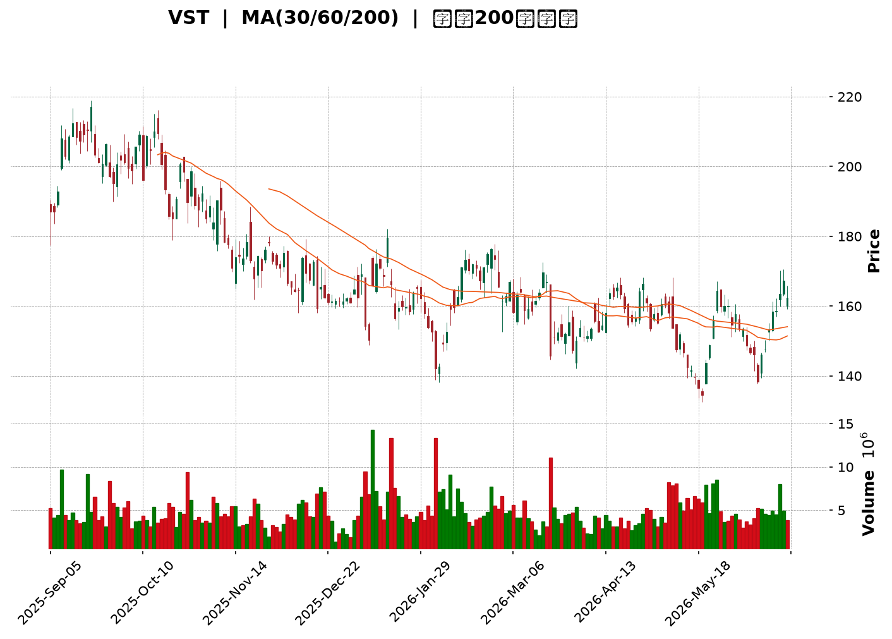
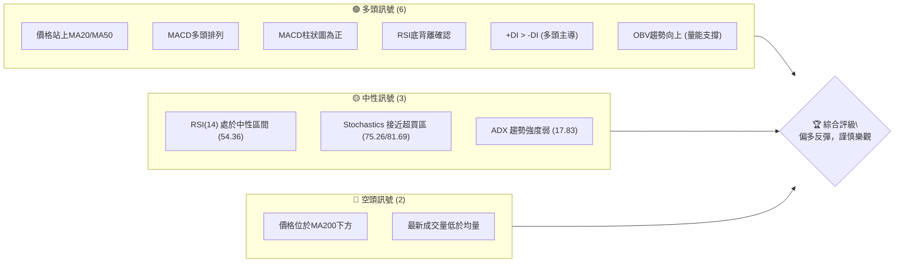
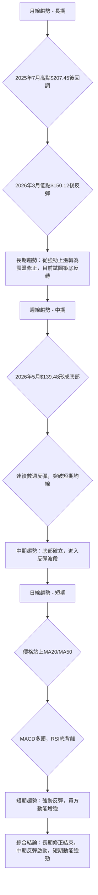
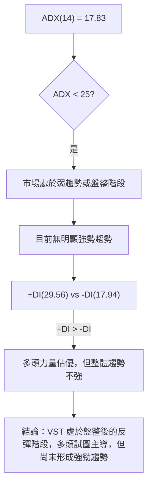
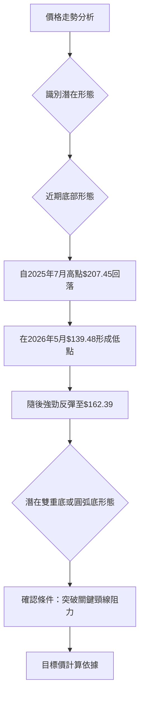
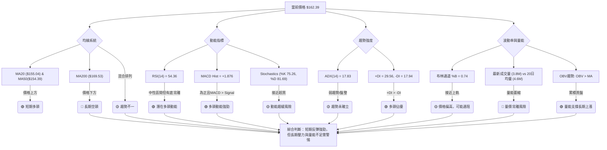
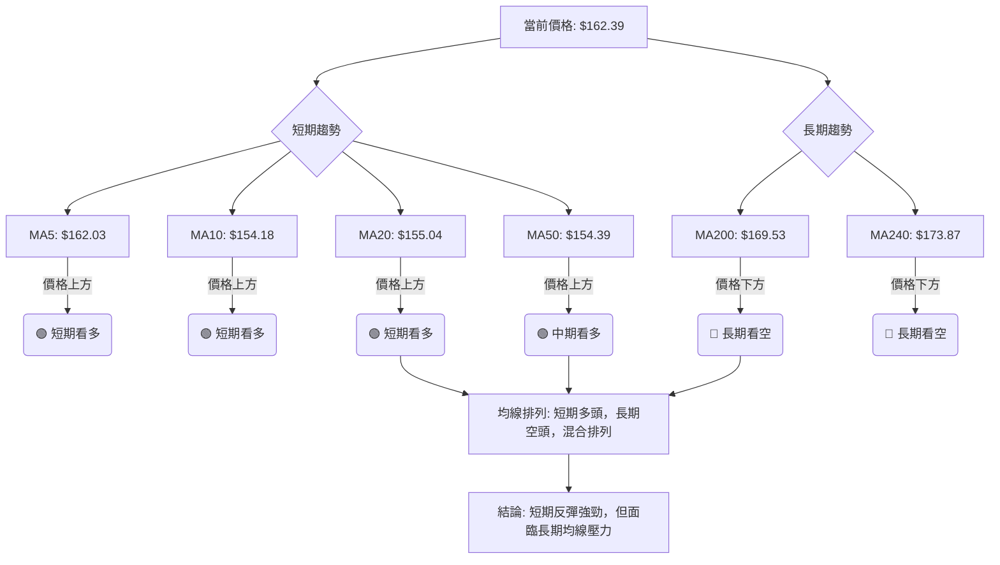
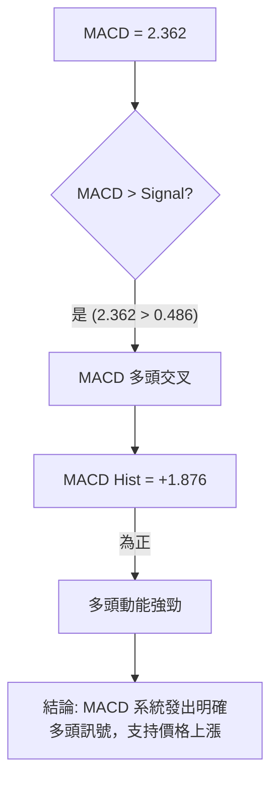

<details>
<summary>📊 靜態圖表 (點擊展開)</summary>

</details>

<html>
<head><meta charset="utf-8" /></head>
<body>
    <div style="height:500px; width:100%;">                        <script>window.PlotlyConfig = {MathJaxConfig: 'local'};</script>
        <script charset="utf-8" src="https://cdn.plot.ly/plotly-3.6.0.min.js" integrity="sha256-QaOVwtVY0T02VaHrr6pnoHLCwayMJp4O5n4YyaE3rJk=" crossorigin="anonymous"></script>                <div id="candlestick-chart" class="plotly-graph-div" style="height:100%; width:100%;"></div>            <script>                window.PLOTLYENV=window.PLOTLYENV || {};                                if (document.getElementById("candlestick-chart")) {                    Plotly.newPlot(                        "candlestick-chart",                        [{"close":{"dtype":"f8","bdata":"AAAAYJtgZ0AAAADg7GBnQAAAACCaGGhAAAAAIMkDakAAAAAAh19pQAAAACBiE2pAAAAAYPyMakAAAADgyQpqQAAAAMAi52lAAAAAwAYiakAAAACA60xqQAAAAOCEIGtAAAAAAJNsaUAAAACAGidpQAAAAAAVGWlAAAAAAIrLaUAAAACAz6NoQAAAAGBwY2hAAAAAoJMVaUAAAADA5zlpQAAAAKDfJGlAAAAAwIXyaEAAAADgWNloQAAAACAwtmlAAAAAYCEkakAAAADgZIFoQAAAAEDKFWpAAAAAwAuVaUAAAACgNz9qQAAAAGDgMGpAAAAAYHoQaUAAAADg5i1oQAAAAODiN2dAAAAA4OUhZ0AAAABAcdJnQAAAAEBNFGlAAAAAgCbPaEAAAAAAlrlnQAAAAGBh0WhAAAAAAIudZ0AAAAAgnHBnQAAAACCpB2hAAAAAoAcfZ0AAAABgWJNnQAAAAIBW+2ZAAAAAwKbGZ0AAAAAA+W9nQAAAAMBXTWZAAAAAQPswZkAAAADAJltlQAAAAGDlvmVAAAAAYMbIZUAAAADASrZlQAAAAKC0TGZAAAAAADeiZUAAAACAgfxkQAAAAIA8zWVAAAAAADVEZUAAAADgIgJmQAAAAGDIQ2ZAAAAAgG+dZUAAAABAs3plQAAAAAAFXmVAAAAAgN\u002fqZUAAAAAgQc9kQAAAAADLrWRAAAAAIAyEZEAAAAAAhY9kQAAAACAHvGVAAAAAQKAsZUAAAADAq\u002fFkQAAAAGBhl2VAAAAAQM\u002fpY0AAAAAgY69kQAAAAOBSS2RAAAAAAPojZEAAAADgKidkQAAAACBsMGRAAAAA4ConZEAAAACglyxkQAAAAMB7RWRAAAAAQFEcZEAAAAAAxphkQAAAAEBgT2RAAAAAYP4hZUAAAABAjUVjQAAAAMDnxWJAAAAAACe9ZEAAAAAgU4NlQAAAAIBOXmVAAAAAgB8QZUAAAABg2nVmQAAAAAB+xGRAAAAAgBOMY0AAAABgg\u002fJjQAAAAOBc\u002fWNAAAAAQLT1Y0AAAABg5stjQAAAAIDReWRAAAAAYNulZEAAAAAANURkQAAAAIA4vWNAAAAAoLM6Y0AAAABAfhJjQAAAAOAOxGFAAAAAIJzVYUAAAACglqdiQAAAACCJEWNAAAAAQBzlY0AAAABAqfZjQAAAAEDNVGRAAAAAgIpgZUAAAABAbaZlQAAAAKAuQ2VAAAAAgMWAZUAAAAAgq11lQAAAAEDJ6mRAAAAAYLBkZUAAAADgCdxlQAAAAGChCmZAAAAAACGtZUAAAADABrFkQAAAAAAgKGRAAAAAQBldZEAAAACABd5kQAAAAEDLxmNAAAAAIGVlZEAAAABgSX5kQAAAAMAR12NAAAAA4HjkY0AAAAAAXtBjQAAAACBhMWRAAAAAgA18ZEAAAABA0jRlQAAAAIAQ3WRAAAAAABs6YkAAAACAguJiQAAAAKA0EGNAAAAAIIrpYkAAAADgyAJjQAAAAABnaGNAAAAAYK1qYkAAAAAg1cNiQAAAAKDUN2NAAAAAoP7eYkAAAACgGOxiQAAAAODhLmNAAAAAAIF1Y0AAAAAgKhFjQAAAAIBvUGNAAAAAAFK\u002fY0AAAADAs3dkQAAAAODJVmRAAAAAYI2pZEAAAADAZ2dkQAAAAOAO7GNAAAAAIDBWY0AAAADgTnJjQAAAAGAulGNAAAAAgNiDZEAAAAAAG8tkQAAAAEChHGRAAAAAwGUyY0AAAAAA0bNjQAAAAOACYmNAAAAAgAAUZEAAAACg+wRkQAAAAEAywmNAAAAAwII3Y0AAAAAAbnBiQAAAAMDL+mJAAAAAgERVYkAAAABgI81hQAAAACBztmFAAAAAYIJvYUAAAABg4RFhQAAAACCx0GBAAAAAYI75YUAAAACA45tiQAAAAKClgWNAAAAAQI6KZEAAAAAgov1jQAAAAKDJAWRAAAAAgDAAZEAAAADgZFFjQAAAAID4t2NAAAAAoLcyY0AAAACghS9jQAAAAKCpkWJAAAAA4DlWYkAAAAAgf0BiQAAAAIAUS2FAAAAAIJxFYkAAAAAgBHpiQAAAACDFKWNAAAAAIGzMY0AAAADAc9NjQAAAACCscGRAAAAA4FHoZEAAAADgekxkQA=="},"high":{"dtype":"f8","bdata":"9QUEv+PNZ0D\u002fSQW18LFnQHveX9laT2hA8Iiv3Zx4akCXtb+OallqQOAhHfzGI2pAYknqA2oYa0Bt0lAx5pVqQNj8xDDmlWpAR16MjuiqakD5vCAGgJ5qQEnLqTIRXWtAQKRBHD58akCxK\u002fSonqppQOkgeS42bWlAFiOzPHbUaUAGNVE\u002fk8hpQOgBxCVk9WhAwDtzDpCCaUDjva8oy4RpQNNs7fGAKmpAt014ASriaUA4hVILq19pQPf9KpYZuGlAKdeqhTpGakClX6fNp29qQA4nDmmJImpAJ1s8pnv\u002faUBIev32cuRqQAnTrz1jBmtAg+LPKrklakAdPOAxupRpQEGExjLFE2hALxsz0NmWZ0Dy1AZt5OxnQMOSPv4wJWlA8TD6fhdaaUDGmf7E5I9oQBUTNUu4\u002fGhAwZAindq\u002faEAybwBu4QJoQMQ5LfQsTGhAcafuRETWZ0BuaPPvp\u002fVnQMrTk5y9imdATzu0kwrJZ0DX4iNpe39oQDVLmDIjZWdAq\u002fO1DoqRZkBbBEovGidmQBzSg3ccaGZAM5PPrtBYZkBtSmXT5BVmQKzNw5Hpl2ZA4F+wYCiQZ0A0q\u002fvRtZ5lQApyKvYlz2VACWORtivAZUBpE1n5aCBmQMZPmjumgGZA0DAIQ\u002fD3ZUAoNkV8DOdlQHysXcEgpGVA0S26WvgpZkA4sBoauPxlQM46yL3342RAQm+KGpImZUBHUAVfm6pkQOdZt+VExWVAbIsDqBxoZkCiWLdeCollQPXUKTGtpmVA3iX1eDzNZUAX1OnFn2ZlQJLw+ipfVmVA\u002fWBvE2p7ZEAvlTa\u002f8mdkQP+rCwBeRGRAU90fMZxRZEAVvdNp53dkQGikS06GU2RAJmBSO3qBZECXgsIYBBplQE3qKVDOZWVAafBaJEiEZUAMlnY36QVlQETibZvYa2NAjiX69UDIZUCVsD3cEwhmQLAX1yvp3mVAjJ\u002fHzaVWZUDl6QyWzcFmQHkFh5i7VGVAHSfpTFixZEAdjB9UDzFkQC3tpciQYWRAZbRuGXZNZEDDfGZ5U5tkQG32H31OhWRAShc1NTfDZED3WL7XVu1kQI7wMkJ6gWRA3UebmjzxY0AHXLEmL4JjQK8CdvuNJ2NA08EgZGrwYUAEcGzD4PpiQFTSdh41a2NAqDUjfjAfZEBc1l9hU5tkQHfzEhcMuGRAZpd4SPdlZUC4t2ZgNAVmQHRfFrWB4GVAMzP3agGDZUBiVUDqrqBlQEs2oZG1a2VA53\u002fghJpmZUA\u002fsT4kjO5lQFmw+bu2F2ZAPovpuy06ZkBt9Z+FDgFmQI65eASGYmRArzRJSjl4ZEA\u002fIygeNvBkQP+m45lL\u002fWRA1kRjTKCFZEC1takJYQplQOeVqvczcWRAavQzEP5XZEA8UHaXF5lkQOXKtt+QYWRA7cE29hygZEBHUUcpupBlQAZxQlo6JGVAEtsNF5fHZEAo\u002fX\u002fQ0nVjQKwQqdBNPGNAydGc2FS3Y0D9ueaimw5jQCae5i07\u002f2NAPHKCw6XWY0CQPozwQuhiQLZxLjzig2NA2YaV5wBLY0C3k+EkghxjQLpvM6A4PmNABmuViLMiZEDwIVLWr0lkQF50DrIPzWNACrxYAdkPZEBzPwA+kKFkQOVL4zwwyWRAatNcU\u002fjVZEAUpSDgIwhlQJdRWkVCemRAKT+atv0bZEDHjyrvcNtjQHev5vu61GNA7ZgdbvSnZEB3z60r5wVlQHtHdF0XY2RA5gCWrjwdZEA1oEY+BO1jQDmzAFNQ\u002fWNAOkLKuOREZED8LLYRRXJkQL53EehiWGRAUMzp0\u002fEEZUC6dRFaEFljQKH3GhsqEWNAq8KC8ZvDYkAOqsz0aUJiQFkVxgQH42FAEkf1+JCcYUAh85gJCWthQFSH1lNIEGFAqi6e0FAWYkDq7nSVR6JiQKTPY1swq2NApA\u002fR9k7lZEApLBnQUZlkQIVY1GSkaWRAusF4ZgRCZEBhQng0gcpjQM2gz87DEWRAj2f+qQ22Y0C9y+b6YjpjQHj\u002fcQVgQmNAW0J0QeuiYkCIGzrC38JiQODlIVOO+WFA6RQP6zlWYkASuq\u002fWQ8liQH\u002fWwoNxZ2NAvcI6PyIoZEAXNWyEz0ZkQD5+vuFBQ2VAAAAAAABQZUAAAABgZrpkQA=="},"hovertemplate":"\u003cb\u003e%{x|%Y-%m-%d}\u003c\u002fb\u003e\u003cbr\u003e\u958b: $%{open:.2f}\u003cbr\u003e\u9ad8: $%{high:.2f}\u003cbr\u003e\u4f4e: $%{low:.2f}\u003cbr\u003e\u6536: $%{close:.2f}\u003cextra\u003e\u003c\u002fextra\u003e","low":{"dtype":"f8","bdata":"3\u002flF+fYvZkBLH453sfRmQKHqJxsgh2dAMMztdJreaECK1ic8SUFpQDvpZVuWHmlAzP71K2ITakCXqikUbsdpQInr53lDc2lAFe\u002f40tveaUAWGJk8qIppQDYHsrIF3mlAAcYvwLdTaUDvaZF0DCFpQEPZQnlOZmhAFJuw4K8EaUDF2neHKZxoQAoslXgXvWdA2DPvsu\u002frZ0Bk\u002fEM8WbxoQBGezSVCFWlAB+M1v46TaEAeT7alUmJoQI92bhiB6WhAVeWIPXiPaUDJxPytwYBoQDaDJz408mhA4Su\u002fQhISaUBboGdQaLFpQOdXDU0x+mlAjLDr6gznaEDx+YtvPABoQFXNq8acGWdAg7aaNvVcZkC3UfjrEh5nQLPt9qhfOWhAVTb5AOx1aECDCebsjvZmQN2Tj\u002frklWdA9vZFAEJ4Z0A4wZDGSNhmQE+ZGlckYmdAAxMLoYP3ZkC3yTOHNwVnQA7+AC8iWWZAxJLePcP7ZUA8g7f5rexmQPuGO2QwQmZAm+aaS8ARZkDvtXF1AjplQIUcksOVnGRAzcyHP92MZUA\u002f2K6eeD5lQDtq9Cfrr2VA5AtszC6NZUA5b0yxhThkQNDFyE3IpmRAbOdYKvGmZEAm5WPXv4tlQOuU\u002fQCyKGZAksGhZil\u002fZUDYY50C8FRlQM35QVv6B2VAYWIpmnI4ZUB\u002ffi+I8rhkQHVcRH0lbGRACIHRd3+BZECwKyGkvr9jQEwoRnrzCmRA9i88VcXZZEAdlecFM8lkQLPTwQ1\u002fu2RAEjgHhlbBY0C7GuwI2j9kQN8kMLbOQGRA+s6oBQANZEAcBc4NBvZjQHKAUR6J6mNAuID2VAv9Y0AvE1YNc+9jQCmPnYGzE2RAXWRunM4YZEB2DYgIA25kQAxAoCzw92NAyZcsU4BqZEDYT+GUuSNjQEKzkt3omGJAT47qEoStZEDWQN44E3RkQN4tVu8oS2VACa4Q3vCyZEAsVkp6mmZlQJDn3cLtUWRARgMCqDR6Y0ATnnqgECtjQFLE1di\u002f1mNAF6uSKQ2yY0Cw9PEw3K5jQNij9nbWtmNAcm+2f+QWZECWPU4SJcpjQEf7qwysjWNAiUWnslwzY0DH8aJwRL9iQFHKelNYXGFAkH+d+rpEYUChUP\u002flbGBiQCnPTevpa2JAcjRhwUBMY0DeTzBJmsNjQFmO78Sj\u002fmNA4nRxJb4hZECbC7dsZS9lQGNbNPKLJGVAzczMjCX5ZEA29lmdFBFlQNLTDokimGRA7idC5sdNZECC7NZ0izNlQG8L4j4IdWRAbbigzGRNZUDEp7ed66tkQEGb0dHaEWNAS78hxaP+Y0BlTbqFfCdkQGyq6Qigu2NAn+Wx8FBSY0DDJKFFQXtkQNRxNWAaV2NAl+OE9pCIY0BJQKVSb6ljQB57CJ1i9WNAX\u002fJFEoc1ZECRbbWpY6FkQMK0e5bceGRA\u002fNIbIhQUYkAwnEilCaRiQMiCHFHoqmJA60APMm7FYkD1SzPvH0liQBIcw5o18WJA0ULJxKNMYkCIuoWJgsRhQPA6xlMG5mJArKadRB+9YkB6ffv2c7ViQEj7qRM8wmJAM5+on1RiY0DIQU9t7Q5jQDHMHg+rHGNAZv0D9fcNY0CDdIFH3QNkQCz33SyLPWRAp6jeMz5MZECUu17\u002fDkFkQNmc5Mknw2NAQeN\u002fT0M9Y0BQjn7XgVZjQLLd8wsWSWNAAcmUZNtdY0DcwbufatBjQDa4ZP7vz2NAV+BIorUbY0D2zDEMZHBjQGLbd6LTVmNAUqzs0AinY0B4oQzlcvJjQBWqTDwxjGNAn\u002fjcT8IxY0BarDNayFhiQPB5qp9ZQmJAU9p+HJouYkBN4Y2jE2phQOZVAgk+d2FAVbkIzMAzYUAxfbKbh7VgQEVGKvwuj2BAVb02ycAzYUDbOZY9rRViQLxT5\u002fxA0WJACwUJovW\u002fY0DHT6W098VjQCRDh9MlrGNAatvMwCOVY0DVR6iryeNiQLP\u002f\u002fY9RFWNAVUPwHI4XY0CRg6v1W79iQFECWi9maWJAjPD6FJxFYkD1bnYd8qphQAAam9fyNmFAaSJHo\u002f5rYUALD3bva1liQOPvJXk+wWJAQYPflrgTY0A1ZTJPr59jQDIRhX3M+WNAAAAAwMxcZEAAAADgo+RjQA=="},"name":"\u50f9\u683c","open":{"dtype":"f8","bdata":"riAmMTuoZ0BCEWG1OJNnQHO59fVFoGdASmBOGijvaEDJBPjtGPZpQDnoBP62O2lAzP71K2ITakBt0lAx5pVqQGcN\u002f0UoRmpA3aHF10yGakCUMGkns1FqQILBtVr\u002fQ2pAAwWckKInakAdkeMaWE1pQH+3Fv24pWhAtoA4p7ILaUBYeNMPMSVpQHTkXyely2hAwcvl7B5GaED7c2ZmM2ZpQOAv\u002fZEUcGlAR\u002fFIZMKpaUAbEXwffRdpQKzS27rOF2lAfMVXTIfEaUCjnClaexxqQIOb8gcmCWlAiaG1\u002fPedaUA6Xk\u002fbdQ5qQJ5uWhnGvGpANRorB+HZaUCHlnK9EWlpQOOJaOuPAmhAdiBLsLVYZ0C3UfjrEh5nQM\u002fVnrUbeWhA8TD6fhdaaUDGmf7E5I9oQFTjOjQU8GdA62ozRew7aEDojN7KhOZnQKrOgsOYwGdAGIW2kTxqZ0BneWy3mS9nQFB65SY1xGZAojlrcE84ZkDZQStcvz9oQL5x5fPDJGdAXp1Bw6ByZkD+Uss7pAVmQG86aoeSz2RAAIAYRHrWZUDdCZ2rNH5lQB1XO7jfzWVAqiGQH7YBZ0CzC6VlLGllQOGegl28G2VAUr7qC3WrZUD3Oi9h6KhlQDdTWH4+SGZA1lbi+vXoZUD+tveLhdVlQBVgba80fmVAEDk9bfxlZUAOH9S2NvllQM46yL3342RATXJnmeSVZED4QW7Z75RkQC0Oj+QXLGRA6Q50GybPZUDCI48axIdlQExHEsiuvmRA56NS3TmpZUD9JKGTIp9kQCEHOdBGwGRArTj3lIVxZEA+IIIC+iNkQJ\u002fi98t3EWRAAAAA4ConZEBu+e9byRFkQOK4FMOyMWRAxPdPfhlOZEB2DYgIA25kQJF6ZTTjHGVAf8pbmhQRZUAMlnY36QVlQIN9eGlLWmNAQ00eeiu7ZUBCqG8j54ZkQO2bA5GjsGVAfnEKooYdZUAeFyYlupBlQKsEkefO4mRANhWAE2caZEDiA5czSNJjQHtDXsR2L2RAkEVA9t\u002fxY0BfmpXlswRkQE90Vdo84mNAAxIpXVixZED6kUmcEbBkQIk7MQ++IWRAExH34uGmY0D0nje9DnZjQEeQvVqOGGNAojQ1aI2TYUBr0Pv2wbJiQG77QP\u002fBsmJA\u002fxqKq6P+Y0C1aPPibpFkQJBUta8rCWRA+iaBjnY+ZECtz\u002fIHE01lQLOrpUH1sGVAzcyuyB4uZUB9UO2oY3plQOWAgVBqRWVA6lORNTHaZEBAJY8Z8XxlQAOzW2VkXGVAOU8LCo3QZUC18araXzdlQGjR0lnOJ2RAQRNeYJ0kZEBftYiA3i1kQIBPaMvhf2RAZPKZWQlvY0CG0uEN7JxkQCNnCejBZGRAdL73X7GUY0BdqwD+CSpkQMT20F\u002fJEWRAtkct+otLZECPW0sDXqlkQHRaFaWu1mRAEtsNF5fHZECbEcRqn+diQFVYRNzcymJAg3luRBBZY0AW3KxTT6liQBIcw5o18WJAw2d6eiucY0AS2UYqXPZhQP2SdgZD6GJAgJv6J\u002fTfYkD05QVNhdpiQNx2sMZ622JABWzocs4QZEA9BV0HgXVjQLWWVHchKWNAZv0D9fcNY0Bq0TQf2kVkQMEZRAyYqGRAEtt+H+CKZEC7gUEs4cBkQG2jFbpNWmRAmNfAOyARZEBJQhvZibJjQEubIrK9d2NATXwCgJCDY0B04M+5nZhkQIMv5nC6SGRAoLjdQFIUZEBSdtYhSYJjQBZ04OnVwmNAJT248wWvY0BA9fybtFhkQEL5jOicKGRACATW3ftZZEC6dRFaEFljQNTOhYVgeWJA+mVlnP2oYkAOqsz0aUJiQDsNAlXVpWFAvyBliYtyYUCsu0WZx1lhQGulTeOF82BAAAAAHNM5YUD8xES7hyhiQPBHu4cz2mJAx8ZiOgLWY0AqjOmlVpdkQK+CDJ\u002fF02NAQyCHAtf4Y0DC0GVW+ZhjQGPJmQEad2NAte0B1FCJY0AMOJaef+piQK8anKEy+WJAt\u002f3beEiDYkAxHOFLzIZiQAbrZwXJ5GFAytzu\u002fl6ZYUBWG6t6YHliQIKpSuIUE2NAm2MnZyQhY0CH1zPp+8pjQPBXPGSgO2RAAAAAAClwZEAAAABgjwJkQA=="},"x":["2025-09-05T00:00:00-04:00","2025-09-08T00:00:00-04:00","2025-09-09T00:00:00-04:00","2025-09-10T00:00:00-04:00","2025-09-11T00:00:00-04:00","2025-09-12T00:00:00-04:00","2025-09-15T00:00:00-04:00","2025-09-16T00:00:00-04:00","2025-09-17T00:00:00-04:00","2025-09-18T00:00:00-04:00","2025-09-19T00:00:00-04:00","2025-09-22T00:00:00-04:00","2025-09-23T00:00:00-04:00","2025-09-24T00:00:00-04:00","2025-09-25T00:00:00-04:00","2025-09-26T00:00:00-04:00","2025-09-29T00:00:00-04:00","2025-09-30T00:00:00-04:00","2025-10-01T00:00:00-04:00","2025-10-02T00:00:00-04:00","2025-10-03T00:00:00-04:00","2025-10-06T00:00:00-04:00","2025-10-07T00:00:00-04:00","2025-10-08T00:00:00-04:00","2025-10-09T00:00:00-04:00","2025-10-10T00:00:00-04:00","2025-10-13T00:00:00-04:00","2025-10-14T00:00:00-04:00","2025-10-15T00:00:00-04:00","2025-10-16T00:00:00-04:00","2025-10-17T00:00:00-04:00","2025-10-20T00:00:00-04:00","2025-10-21T00:00:00-04:00","2025-10-22T00:00:00-04:00","2025-10-23T00:00:00-04:00","2025-10-24T00:00:00-04:00","2025-10-27T00:00:00-04:00","2025-10-28T00:00:00-04:00","2025-10-29T00:00:00-04:00","2025-10-30T00:00:00-04:00","2025-10-31T00:00:00-04:00","2025-11-03T00:00:00-05:00","2025-11-04T00:00:00-05:00","2025-11-05T00:00:00-05:00","2025-11-06T00:00:00-05:00","2025-11-07T00:00:00-05:00","2025-11-10T00:00:00-05:00","2025-11-11T00:00:00-05:00","2025-11-12T00:00:00-05:00","2025-11-13T00:00:00-05:00","2025-11-14T00:00:00-05:00","2025-11-17T00:00:00-05:00","2025-11-18T00:00:00-05:00","2025-11-19T00:00:00-05:00","2025-11-20T00:00:00-05:00","2025-11-21T00:00:00-05:00","2025-11-24T00:00:00-05:00","2025-11-25T00:00:00-05:00","2025-11-26T00:00:00-05:00","2025-11-28T00:00:00-05:00","2025-12-01T00:00:00-05:00","2025-12-02T00:00:00-05:00","2025-12-03T00:00:00-05:00","2025-12-04T00:00:00-05:00","2025-12-05T00:00:00-05:00","2025-12-08T00:00:00-05:00","2025-12-09T00:00:00-05:00","2025-12-10T00:00:00-05:00","2025-12-11T00:00:00-05:00","2025-12-12T00:00:00-05:00","2025-12-15T00:00:00-05:00","2025-12-16T00:00:00-05:00","2025-12-17T00:00:00-05:00","2025-12-18T00:00:00-05:00","2025-12-19T00:00:00-05:00","2025-12-22T00:00:00-05:00","2025-12-23T00:00:00-05:00","2025-12-24T00:00:00-05:00","2025-12-26T00:00:00-05:00","2025-12-29T00:00:00-05:00","2025-12-30T00:00:00-05:00","2025-12-31T00:00:00-05:00","2026-01-02T00:00:00-05:00","2026-01-05T00:00:00-05:00","2026-01-06T00:00:00-05:00","2026-01-07T00:00:00-05:00","2026-01-08T00:00:00-05:00","2026-01-09T00:00:00-05:00","2026-01-12T00:00:00-05:00","2026-01-13T00:00:00-05:00","2026-01-14T00:00:00-05:00","2026-01-15T00:00:00-05:00","2026-01-16T00:00:00-05:00","2026-01-20T00:00:00-05:00","2026-01-21T00:00:00-05:00","2026-01-22T00:00:00-05:00","2026-01-23T00:00:00-05:00","2026-01-26T00:00:00-05:00","2026-01-27T00:00:00-05:00","2026-01-28T00:00:00-05:00","2026-01-29T00:00:00-05:00","2026-01-30T00:00:00-05:00","2026-02-02T00:00:00-05:00","2026-02-03T00:00:00-05:00","2026-02-04T00:00:00-05:00","2026-02-05T00:00:00-05:00","2026-02-06T00:00:00-05:00","2026-02-09T00:00:00-05:00","2026-02-10T00:00:00-05:00","2026-02-11T00:00:00-05:00","2026-02-12T00:00:00-05:00","2026-02-13T00:00:00-05:00","2026-02-17T00:00:00-05:00","2026-02-18T00:00:00-05:00","2026-02-19T00:00:00-05:00","2026-02-20T00:00:00-05:00","2026-02-23T00:00:00-05:00","2026-02-24T00:00:00-05:00","2026-02-25T00:00:00-05:00","2026-02-26T00:00:00-05:00","2026-02-27T00:00:00-05:00","2026-03-02T00:00:00-05:00","2026-03-03T00:00:00-05:00","2026-03-04T00:00:00-05:00","2026-03-05T00:00:00-05:00","2026-03-06T00:00:00-05:00","2026-03-09T00:00:00-04:00","2026-03-10T00:00:00-04:00","2026-03-11T00:00:00-04:00","2026-03-12T00:00:00-04:00","2026-03-13T00:00:00-04:00","2026-03-16T00:00:00-04:00","2026-03-17T00:00:00-04:00","2026-03-18T00:00:00-04:00","2026-03-19T00:00:00-04:00","2026-03-20T00:00:00-04:00","2026-03-23T00:00:00-04:00","2026-03-24T00:00:00-04:00","2026-03-25T00:00:00-04:00","2026-03-26T00:00:00-04:00","2026-03-27T00:00:00-04:00","2026-03-30T00:00:00-04:00","2026-03-31T00:00:00-04:00","2026-04-01T00:00:00-04:00","2026-04-02T00:00:00-04:00","2026-04-06T00:00:00-04:00","2026-04-07T00:00:00-04:00","2026-04-08T00:00:00-04:00","2026-04-09T00:00:00-04:00","2026-04-10T00:00:00-04:00","2026-04-13T00:00:00-04:00","2026-04-14T00:00:00-04:00","2026-04-15T00:00:00-04:00","2026-04-16T00:00:00-04:00","2026-04-17T00:00:00-04:00","2026-04-20T00:00:00-04:00","2026-04-21T00:00:00-04:00","2026-04-22T00:00:00-04:00","2026-04-23T00:00:00-04:00","2026-04-24T00:00:00-04:00","2026-04-27T00:00:00-04:00","2026-04-28T00:00:00-04:00","2026-04-29T00:00:00-04:00","2026-04-30T00:00:00-04:00","2026-05-01T00:00:00-04:00","2026-05-04T00:00:00-04:00","2026-05-05T00:00:00-04:00","2026-05-06T00:00:00-04:00","2026-05-07T00:00:00-04:00","2026-05-08T00:00:00-04:00","2026-05-11T00:00:00-04:00","2026-05-12T00:00:00-04:00","2026-05-13T00:00:00-04:00","2026-05-14T00:00:00-04:00","2026-05-15T00:00:00-04:00","2026-05-18T00:00:00-04:00","2026-05-19T00:00:00-04:00","2026-05-20T00:00:00-04:00","2026-05-21T00:00:00-04:00","2026-05-22T00:00:00-04:00","2026-05-26T00:00:00-04:00","2026-05-27T00:00:00-04:00","2026-05-28T00:00:00-04:00","2026-05-29T00:00:00-04:00","2026-06-01T00:00:00-04:00","2026-06-02T00:00:00-04:00","2026-06-03T00:00:00-04:00","2026-06-04T00:00:00-04:00","2026-06-05T00:00:00-04:00","2026-06-08T00:00:00-04:00","2026-06-09T00:00:00-04:00","2026-06-10T00:00:00-04:00","2026-06-11T00:00:00-04:00","2026-06-12T00:00:00-04:00","2026-06-15T00:00:00-04:00","2026-06-16T00:00:00-04:00","2026-06-17T00:00:00-04:00","2026-06-18T00:00:00-04:00","2026-06-22T00:00:00-04:00","2026-06-23T00:00:00-04:00"],"type":"candlestick"},{"hovertemplate":"MA30: $%{y:.2f}\u003cextra\u003e\u003c\u002fextra\u003e","line":{"color":"#2196F3","dash":"dash","width":2},"mode":"lines","name":"MA30","x":["2025-09-05T00:00:00-04:00","2025-09-08T00:00:00-04:00","2025-09-09T00:00:00-04:00","2025-09-10T00:00:00-04:00","2025-09-11T00:00:00-04:00","2025-09-12T00:00:00-04:00","2025-09-15T00:00:00-04:00","2025-09-16T00:00:00-04:00","2025-09-17T00:00:00-04:00","2025-09-18T00:00:00-04:00","2025-09-19T00:00:00-04:00","2025-09-22T00:00:00-04:00","2025-09-23T00:00:00-04:00","2025-09-24T00:00:00-04:00","2025-09-25T00:00:00-04:00","2025-09-26T00:00:00-04:00","2025-09-29T00:00:00-04:00","2025-09-30T00:00:00-04:00","2025-10-01T00:00:00-04:00","2025-10-02T00:00:00-04:00","2025-10-03T00:00:00-04:00","2025-10-06T00:00:00-04:00","2025-10-07T00:00:00-04:00","2025-10-08T00:00:00-04:00","2025-10-09T00:00:00-04:00","2025-10-10T00:00:00-04:00","2025-10-13T00:00:00-04:00","2025-10-14T00:00:00-04:00","2025-10-15T00:00:00-04:00","2025-10-16T00:00:00-04:00","2025-10-17T00:00:00-04:00","2025-10-20T00:00:00-04:00","2025-10-21T00:00:00-04:00","2025-10-22T00:00:00-04:00","2025-10-23T00:00:00-04:00","2025-10-24T00:00:00-04:00","2025-10-27T00:00:00-04:00","2025-10-28T00:00:00-04:00","2025-10-29T00:00:00-04:00","2025-10-30T00:00:00-04:00","2025-10-31T00:00:00-04:00","2025-11-03T00:00:00-05:00","2025-11-04T00:00:00-05:00","2025-11-05T00:00:00-05:00","2025-11-06T00:00:00-05:00","2025-11-07T00:00:00-05:00","2025-11-10T00:00:00-05:00","2025-11-11T00:00:00-05:00","2025-11-12T00:00:00-05:00","2025-11-13T00:00:00-05:00","2025-11-14T00:00:00-05:00","2025-11-17T00:00:00-05:00","2025-11-18T00:00:00-05:00","2025-11-19T00:00:00-05:00","2025-11-20T00:00:00-05:00","2025-11-21T00:00:00-05:00","2025-11-24T00:00:00-05:00","2025-11-25T00:00:00-05:00","2025-11-26T00:00:00-05:00","2025-11-28T00:00:00-05:00","2025-12-01T00:00:00-05:00","2025-12-02T00:00:00-05:00","2025-12-03T00:00:00-05:00","2025-12-04T00:00:00-05:00","2025-12-05T00:00:00-05:00","2025-12-08T00:00:00-05:00","2025-12-09T00:00:00-05:00","2025-12-10T00:00:00-05:00","2025-12-11T00:00:00-05:00","2025-12-12T00:00:00-05:00","2025-12-15T00:00:00-05:00","2025-12-16T00:00:00-05:00","2025-12-17T00:00:00-05:00","2025-12-18T00:00:00-05:00","2025-12-19T00:00:00-05:00","2025-12-22T00:00:00-05:00","2025-12-23T00:00:00-05:00","2025-12-24T00:00:00-05:00","2025-12-26T00:00:00-05:00","2025-12-29T00:00:00-05:00","2025-12-30T00:00:00-05:00","2025-12-31T00:00:00-05:00","2026-01-02T00:00:00-05:00","2026-01-05T00:00:00-05:00","2026-01-06T00:00:00-05:00","2026-01-07T00:00:00-05:00","2026-01-08T00:00:00-05:00","2026-01-09T00:00:00-05:00","2026-01-12T00:00:00-05:00","2026-01-13T00:00:00-05:00","2026-01-14T00:00:00-05:00","2026-01-15T00:00:00-05:00","2026-01-16T00:00:00-05:00","2026-01-20T00:00:00-05:00","2026-01-21T00:00:00-05:00","2026-01-22T00:00:00-05:00","2026-01-23T00:00:00-05:00","2026-01-26T00:00:00-05:00","2026-01-27T00:00:00-05:00","2026-01-28T00:00:00-05:00","2026-01-29T00:00:00-05:00","2026-01-30T00:00:00-05:00","2026-02-02T00:00:00-05:00","2026-02-03T00:00:00-05:00","2026-02-04T00:00:00-05:00","2026-02-05T00:00:00-05:00","2026-02-06T00:00:00-05:00","2026-02-09T00:00:00-05:00","2026-02-10T00:00:00-05:00","2026-02-11T00:00:00-05:00","2026-02-12T00:00:00-05:00","2026-02-13T00:00:00-05:00","2026-02-17T00:00:00-05:00","2026-02-18T00:00:00-05:00","2026-02-19T00:00:00-05:00","2026-02-20T00:00:00-05:00","2026-02-23T00:00:00-05:00","2026-02-24T00:00:00-05:00","2026-02-25T00:00:00-05:00","2026-02-26T00:00:00-05:00","2026-02-27T00:00:00-05:00","2026-03-02T00:00:00-05:00","2026-03-03T00:00:00-05:00","2026-03-04T00:00:00-05:00","2026-03-05T00:00:00-05:00","2026-03-06T00:00:00-05:00","2026-03-09T00:00:00-04:00","2026-03-10T00:00:00-04:00","2026-03-11T00:00:00-04:00","2026-03-12T00:00:00-04:00","2026-03-13T00:00:00-04:00","2026-03-16T00:00:00-04:00","2026-03-17T00:00:00-04:00","2026-03-18T00:00:00-04:00","2026-03-19T00:00:00-04:00","2026-03-20T00:00:00-04:00","2026-03-23T00:00:00-04:00","2026-03-24T00:00:00-04:00","2026-03-25T00:00:00-04:00","2026-03-26T00:00:00-04:00","2026-03-27T00:00:00-04:00","2026-03-30T00:00:00-04:00","2026-03-31T00:00:00-04:00","2026-04-01T00:00:00-04:00","2026-04-02T00:00:00-04:00","2026-04-06T00:00:00-04:00","2026-04-07T00:00:00-04:00","2026-04-08T00:00:00-04:00","2026-04-09T00:00:00-04:00","2026-04-10T00:00:00-04:00","2026-04-13T00:00:00-04:00","2026-04-14T00:00:00-04:00","2026-04-15T00:00:00-04:00","2026-04-16T00:00:00-04:00","2026-04-17T00:00:00-04:00","2026-04-20T00:00:00-04:00","2026-04-21T00:00:00-04:00","2026-04-22T00:00:00-04:00","2026-04-23T00:00:00-04:00","2026-04-24T00:00:00-04:00","2026-04-27T00:00:00-04:00","2026-04-28T00:00:00-04:00","2026-04-29T00:00:00-04:00","2026-04-30T00:00:00-04:00","2026-05-01T00:00:00-04:00","2026-05-04T00:00:00-04:00","2026-05-05T00:00:00-04:00","2026-05-06T00:00:00-04:00","2026-05-07T00:00:00-04:00","2026-05-08T00:00:00-04:00","2026-05-11T00:00:00-04:00","2026-05-12T00:00:00-04:00","2026-05-13T00:00:00-04:00","2026-05-14T00:00:00-04:00","2026-05-15T00:00:00-04:00","2026-05-18T00:00:00-04:00","2026-05-19T00:00:00-04:00","2026-05-20T00:00:00-04:00","2026-05-21T00:00:00-04:00","2026-05-22T00:00:00-04:00","2026-05-26T00:00:00-04:00","2026-05-27T00:00:00-04:00","2026-05-28T00:00:00-04:00","2026-05-29T00:00:00-04:00","2026-06-01T00:00:00-04:00","2026-06-02T00:00:00-04:00","2026-06-03T00:00:00-04:00","2026-06-04T00:00:00-04:00","2026-06-05T00:00:00-04:00","2026-06-08T00:00:00-04:00","2026-06-09T00:00:00-04:00","2026-06-10T00:00:00-04:00","2026-06-11T00:00:00-04:00","2026-06-12T00:00:00-04:00","2026-06-15T00:00:00-04:00","2026-06-16T00:00:00-04:00","2026-06-17T00:00:00-04:00","2026-06-18T00:00:00-04:00","2026-06-22T00:00:00-04:00","2026-06-23T00:00:00-04:00"],"y":{"dtype":"f8","bdata":"AAAAAAAA+H8AAAAAAAD4fwAAAAAAAPh\u002fAAAAAAAA+H8AAAAAAAD4fwAAAAAAAPh\u002fAAAAAAAA+H8AAAAAAAD4fwAAAAAAAPh\u002fAAAAAAAA+H8AAAAAAAD4fwAAAAAAAPh\u002fAAAAAAAA+H8AAAAAAAD4fwAAAAAAAPh\u002fAAAAAAAA+H8AAAAAAAD4fwAAAAAAAPh\u002fAAAAAAAA+H8AAAAAAAD4fwAAAAAAAPh\u002fAAAAAAAA+H8AAAAAAAD4fwAAAAAAAPh\u002fAAAAAAAA+H8AAAAAAAD4fwAAAAAAAPh\u002fAAAAAAAA+H8AAAAAAAD4f7y7uytja2lAiYiIeMh5aUCrqqqanYBpQHd3dwcgeWlAMzMzY4dgaUDe3d3tSlNpQLy7uzvKSmlAVVVVxe07aUBmZmbGJyhpQImIiJjlHmlAERERAWoJaUBVVVX1APFoQLy7uzuT1mhAREREdOzCaEDNzMwMd7VoQKuqqipoo2hAREREZC2SaEAiIiKC6odoQDMzM+McdmhAREREJG1daEBVVVW1ZjxoQGZmZuZmH2hA3t3dDWkEaEARERFRpOlnQJqZmZmGzGdAq6qq2g+mZ0BmZmZGCIhnQERERAR7Y2dA7+7uDqc+Z0AzMzOzexpnQGZmZub6+GZAq6qqmovbZkCamZlZgcRmQAAAALC1tGZAvLu7m1eqZkDe3d3NopBmQN7d3e0Va2ZAq6qq6nJGZkCamZlZcitmQKuqqooiEWZAq6qq6k38ZUAzMzOjAedlQCIiInIy0mVAMzMzs9K2ZUBERERkKJ5lQGZmZlY5h2VARERElDNoZUBVVVW1LExlQKuqqtokOmVAq6qqCsAoZUBEREQ0qh5lQN7d3Z0VEmVAIiIics0DZUBVVVUFSfpkQN7d3b1O6WRAZmZmlgjlZECJiIjYZtZkQAAAALCOvGRAiYiIOA64ZECJiIgY1LNkQGZmZuYtrGRAiYiICHinZEBEREQ0169kQKuqqhq5qmRAq6qqGn+WZEAiIiJyI49kQImIiOhBiWRA7+7uPoOEZEBVVVX1\u002fX1kQAAAAHBAc2RAiYiIaMJuZEDv7u4u+mhkQFVVVQUsWWRARERExFVTZEB3d3dnkkVkQCIiIhL\u002fL2RAZmZmRlEcZEARERERiA9kQHd3d\u002ff3BWRAd3d3R8QDZEARERER+AFkQImIiMh6AmRA3t3dfUkNZECJiIiIRhZkQDMzMwNnHmRAiYiIyI8hZEBVVVWlbjNkQN7d3W26RWRAMzMzE1BLZECamZkZRU5kQImIiJgDVGRAERERYT9ZZEAiIiJCJ0pkQM3MzOzwRGRAVVVVlehLZEARERFBwlNkQJqZmZnwUWRAIiIisqlVZEDe3d3tm1tkQDMzMyMvVmRAvLu767xPZEC8u7tr4EtkQERERKS\u002fT2RAZmZm1nVaZEBmZmbWq2xkQDMzM9Mah2RAMzMzY3SKZEDv7u4ua4xkQFVVVdVfjGRAiYiIGP2DZEBEREQE3HtkQN7d3b36c2RAMzMzo7daZEB3d3f3GEJkQImIiAinMGRAiYiIeDEaZEARERFBVwVkQGZmZkaL9mNAIiIisgnmY0AAAABwNc5jQCIiIoLvtmNAzczMrHmmY0AiIiKCkKRjQERERLQepmNAvLu7G6uoY0CrqqrqtqRjQHd3d+f0pWNAq6qqmuqcY0Crqqra+5NjQDMzMxPBkWNAAAAAEBGXY0AiIiKybJ9jQCIiIqK7nmNAMzMzk76TY0AzMzMz6YZjQM3MzJxGemNAd3d3hxKKY0C8u7s7wZNjQGZmZhawmWNAERERcUmcY0C8u7uLaJdjQM3MzDzBk2NAq6qqigqTY0Crqqpq0YpjQFVVVdX4fWNAVVVV9bhxY0ARERFR6mFjQN7d3X21TWNAVVVVRQtBY0BERESEIj1jQERERHTGPmNAq6qquoxFY0AzMzMTe0FjQLy7u7ulPmNAERERgQA5Y0BEREQkvC9jQJqZman\u002fLWNAq6qq+tAsY0AiIiISlypjQLy7uwv5IWNAERERsWIPY0BERETUsvliQKuqqpql4WJAREREBMHZYkARERFBS89iQERERFRrzWJAREREhAjLYkCrqqraYcliQHd3d7cyz2JAVVVVBaDdYkARERFRfu1iQA=="},"type":"scatter"},{"hovertemplate":"MA60: $%{y:.2f}\u003cextra\u003e\u003c\u002fextra\u003e","line":{"color":"#9C27B0","dash":"dash","width":2},"mode":"lines","name":"MA60","x":["2025-09-05T00:00:00-04:00","2025-09-08T00:00:00-04:00","2025-09-09T00:00:00-04:00","2025-09-10T00:00:00-04:00","2025-09-11T00:00:00-04:00","2025-09-12T00:00:00-04:00","2025-09-15T00:00:00-04:00","2025-09-16T00:00:00-04:00","2025-09-17T00:00:00-04:00","2025-09-18T00:00:00-04:00","2025-09-19T00:00:00-04:00","2025-09-22T00:00:00-04:00","2025-09-23T00:00:00-04:00","2025-09-24T00:00:00-04:00","2025-09-25T00:00:00-04:00","2025-09-26T00:00:00-04:00","2025-09-29T00:00:00-04:00","2025-09-30T00:00:00-04:00","2025-10-01T00:00:00-04:00","2025-10-02T00:00:00-04:00","2025-10-03T00:00:00-04:00","2025-10-06T00:00:00-04:00","2025-10-07T00:00:00-04:00","2025-10-08T00:00:00-04:00","2025-10-09T00:00:00-04:00","2025-10-10T00:00:00-04:00","2025-10-13T00:00:00-04:00","2025-10-14T00:00:00-04:00","2025-10-15T00:00:00-04:00","2025-10-16T00:00:00-04:00","2025-10-17T00:00:00-04:00","2025-10-20T00:00:00-04:00","2025-10-21T00:00:00-04:00","2025-10-22T00:00:00-04:00","2025-10-23T00:00:00-04:00","2025-10-24T00:00:00-04:00","2025-10-27T00:00:00-04:00","2025-10-28T00:00:00-04:00","2025-10-29T00:00:00-04:00","2025-10-30T00:00:00-04:00","2025-10-31T00:00:00-04:00","2025-11-03T00:00:00-05:00","2025-11-04T00:00:00-05:00","2025-11-05T00:00:00-05:00","2025-11-06T00:00:00-05:00","2025-11-07T00:00:00-05:00","2025-11-10T00:00:00-05:00","2025-11-11T00:00:00-05:00","2025-11-12T00:00:00-05:00","2025-11-13T00:00:00-05:00","2025-11-14T00:00:00-05:00","2025-11-17T00:00:00-05:00","2025-11-18T00:00:00-05:00","2025-11-19T00:00:00-05:00","2025-11-20T00:00:00-05:00","2025-11-21T00:00:00-05:00","2025-11-24T00:00:00-05:00","2025-11-25T00:00:00-05:00","2025-11-26T00:00:00-05:00","2025-11-28T00:00:00-05:00","2025-12-01T00:00:00-05:00","2025-12-02T00:00:00-05:00","2025-12-03T00:00:00-05:00","2025-12-04T00:00:00-05:00","2025-12-05T00:00:00-05:00","2025-12-08T00:00:00-05:00","2025-12-09T00:00:00-05:00","2025-12-10T00:00:00-05:00","2025-12-11T00:00:00-05:00","2025-12-12T00:00:00-05:00","2025-12-15T00:00:00-05:00","2025-12-16T00:00:00-05:00","2025-12-17T00:00:00-05:00","2025-12-18T00:00:00-05:00","2025-12-19T00:00:00-05:00","2025-12-22T00:00:00-05:00","2025-12-23T00:00:00-05:00","2025-12-24T00:00:00-05:00","2025-12-26T00:00:00-05:00","2025-12-29T00:00:00-05:00","2025-12-30T00:00:00-05:00","2025-12-31T00:00:00-05:00","2026-01-02T00:00:00-05:00","2026-01-05T00:00:00-05:00","2026-01-06T00:00:00-05:00","2026-01-07T00:00:00-05:00","2026-01-08T00:00:00-05:00","2026-01-09T00:00:00-05:00","2026-01-12T00:00:00-05:00","2026-01-13T00:00:00-05:00","2026-01-14T00:00:00-05:00","2026-01-15T00:00:00-05:00","2026-01-16T00:00:00-05:00","2026-01-20T00:00:00-05:00","2026-01-21T00:00:00-05:00","2026-01-22T00:00:00-05:00","2026-01-23T00:00:00-05:00","2026-01-26T00:00:00-05:00","2026-01-27T00:00:00-05:00","2026-01-28T00:00:00-05:00","2026-01-29T00:00:00-05:00","2026-01-30T00:00:00-05:00","2026-02-02T00:00:00-05:00","2026-02-03T00:00:00-05:00","2026-02-04T00:00:00-05:00","2026-02-05T00:00:00-05:00","2026-02-06T00:00:00-05:00","2026-02-09T00:00:00-05:00","2026-02-10T00:00:00-05:00","2026-02-11T00:00:00-05:00","2026-02-12T00:00:00-05:00","2026-02-13T00:00:00-05:00","2026-02-17T00:00:00-05:00","2026-02-18T00:00:00-05:00","2026-02-19T00:00:00-05:00","2026-02-20T00:00:00-05:00","2026-02-23T00:00:00-05:00","2026-02-24T00:00:00-05:00","2026-02-25T00:00:00-05:00","2026-02-26T00:00:00-05:00","2026-02-27T00:00:00-05:00","2026-03-02T00:00:00-05:00","2026-03-03T00:00:00-05:00","2026-03-04T00:00:00-05:00","2026-03-05T00:00:00-05:00","2026-03-06T00:00:00-05:00","2026-03-09T00:00:00-04:00","2026-03-10T00:00:00-04:00","2026-03-11T00:00:00-04:00","2026-03-12T00:00:00-04:00","2026-03-13T00:00:00-04:00","2026-03-16T00:00:00-04:00","2026-03-17T00:00:00-04:00","2026-03-18T00:00:00-04:00","2026-03-19T00:00:00-04:00","2026-03-20T00:00:00-04:00","2026-03-23T00:00:00-04:00","2026-03-24T00:00:00-04:00","2026-03-25T00:00:00-04:00","2026-03-26T00:00:00-04:00","2026-03-27T00:00:00-04:00","2026-03-30T00:00:00-04:00","2026-03-31T00:00:00-04:00","2026-04-01T00:00:00-04:00","2026-04-02T00:00:00-04:00","2026-04-06T00:00:00-04:00","2026-04-07T00:00:00-04:00","2026-04-08T00:00:00-04:00","2026-04-09T00:00:00-04:00","2026-04-10T00:00:00-04:00","2026-04-13T00:00:00-04:00","2026-04-14T00:00:00-04:00","2026-04-15T00:00:00-04:00","2026-04-16T00:00:00-04:00","2026-04-17T00:00:00-04:00","2026-04-20T00:00:00-04:00","2026-04-21T00:00:00-04:00","2026-04-22T00:00:00-04:00","2026-04-23T00:00:00-04:00","2026-04-24T00:00:00-04:00","2026-04-27T00:00:00-04:00","2026-04-28T00:00:00-04:00","2026-04-29T00:00:00-04:00","2026-04-30T00:00:00-04:00","2026-05-01T00:00:00-04:00","2026-05-04T00:00:00-04:00","2026-05-05T00:00:00-04:00","2026-05-06T00:00:00-04:00","2026-05-07T00:00:00-04:00","2026-05-08T00:00:00-04:00","2026-05-11T00:00:00-04:00","2026-05-12T00:00:00-04:00","2026-05-13T00:00:00-04:00","2026-05-14T00:00:00-04:00","2026-05-15T00:00:00-04:00","2026-05-18T00:00:00-04:00","2026-05-19T00:00:00-04:00","2026-05-20T00:00:00-04:00","2026-05-21T00:00:00-04:00","2026-05-22T00:00:00-04:00","2026-05-26T00:00:00-04:00","2026-05-27T00:00:00-04:00","2026-05-28T00:00:00-04:00","2026-05-29T00:00:00-04:00","2026-06-01T00:00:00-04:00","2026-06-02T00:00:00-04:00","2026-06-03T00:00:00-04:00","2026-06-04T00:00:00-04:00","2026-06-05T00:00:00-04:00","2026-06-08T00:00:00-04:00","2026-06-09T00:00:00-04:00","2026-06-10T00:00:00-04:00","2026-06-11T00:00:00-04:00","2026-06-12T00:00:00-04:00","2026-06-15T00:00:00-04:00","2026-06-16T00:00:00-04:00","2026-06-17T00:00:00-04:00","2026-06-18T00:00:00-04:00","2026-06-22T00:00:00-04:00","2026-06-23T00:00:00-04:00"],"y":{"dtype":"f8","bdata":"AAAAAAAA+H8AAAAAAAD4fwAAAAAAAPh\u002fAAAAAAAA+H8AAAAAAAD4fwAAAAAAAPh\u002fAAAAAAAA+H8AAAAAAAD4fwAAAAAAAPh\u002fAAAAAAAA+H8AAAAAAAD4fwAAAAAAAPh\u002fAAAAAAAA+H8AAAAAAAD4fwAAAAAAAPh\u002fAAAAAAAA+H8AAAAAAAD4fwAAAAAAAPh\u002fAAAAAAAA+H8AAAAAAAD4fwAAAAAAAPh\u002fAAAAAAAA+H8AAAAAAAD4fwAAAAAAAPh\u002fAAAAAAAA+H8AAAAAAAD4fwAAAAAAAPh\u002fAAAAAAAA+H8AAAAAAAD4fwAAAAAAAPh\u002fAAAAAAAA+H8AAAAAAAD4fwAAAAAAAPh\u002fAAAAAAAA+H8AAAAAAAD4fwAAAAAAAPh\u002fAAAAAAAA+H8AAAAAAAD4fwAAAAAAAPh\u002fAAAAAAAA+H8AAAAAAAD4fwAAAAAAAPh\u002fAAAAAAAA+H8AAAAAAAD4fwAAAAAAAPh\u002fAAAAAAAA+H8AAAAAAAD4fwAAAAAAAPh\u002fAAAAAAAA+H8AAAAAAAD4fwAAAAAAAPh\u002fAAAAAAAA+H8AAAAAAAD4fwAAAAAAAPh\u002fAAAAAAAA+H8AAAAAAAD4fwAAAAAAAPh\u002fAAAAAAAA+H8AAAAAAAD4fxEREQkvMmhAmpmZCaoqaEAiIiJ6jyJoQLy7u9vqFmhAd3d3f28FaEDe3d3d9vFnQM3MzBTw2mdAAAAAWDDBZ0AAAAAQzalnQJqZmREEmGdA3t3d9duCZ0BERERMAWxnQO\u002fu7tZiVGdAvLu7k988Z0CJiIi4zylnQImIiMBQFWdAREREfDD9ZkC8u7ubC+pmQO\u002fu7t4g2GZAd3d3lxbDZkDNzMx0iK1mQCIiIkK+mGZAAAAAQBuEZkAzMzOr9nFmQLy7u6vqWmZAiYiIOIxFZkB3d3ePNy9mQCIiItoEEGZAvLu7o1r7ZUDe3d3lJ+dlQGZmZmaU0mVAmpmZ0YHBZUDv7u5GLLplQFVVVWW3r2VAMzMzW2ugZUAAAAAg449lQDMzM+sremVAzczMFHtlZUB3d3cnuFRlQFVVVX0xQmVAmpmZKYg1ZUARERHp\u002fSdlQLy7uzuvFWVAvLu7OxQFZUDe3d1l3fFkQERERDSc22RAVVVVbULCZEAzMzNj2q1kQBEREWkOoGRAERERKUKWZECrqqoiUZBkQDMzMzNIimRAAAAAeIuIZEDv7u7GR4hkQImIiODag2RAd3d3L0yDZEDv7u6+6oRkQO\u002fu7o4kgWRA3t3dJa+BZEARERGZDIFkQHd3d78YgGRAzczMtFuAZEAzMzM7\u002f3xkQLy7uwPVd2RAAAAA2DNxZECamZnZcnFkQBEREUGZbWRAiYiIeBZtZECamZnxzGxkQJqZmcm3ZGRAIiIiqj9fZEBVVVVNbVpkQM3MzNR1VGRAVVVVzeVWZEDv7u4eH1lkQKuqqvKMW2RAzczM1GJTZEAAAACg+U1kQGZmZuYrSWRAAAAAsOBDZECrqqoK6j5kQDMzM8M6O2RAiYiIkAA0ZEAAAADALyxkQN7d3QWHJ2RAiYiIoOAdZEAzMzPzYhxkQCIiItoiHmRAq6qq4qwYZEDNzMxEPQ5kQFVVVY15BWRA7+7uhtz\u002fY0AiIiLiW\u002fdjQImIiNCH9WNAiYiI2En6Y0De3d2VPPxjQImIiMDy+2NAZmZmJkr5Y0BERETky\u002fdjQDMzMxv482NA3t3d\u002fWbzY0Dv7u6OpvVjQDMzM6M992NAzczMNBr3Y0DNzMyEyvljQAAAALiwAGRAVVVVdUMKZEBVVVU1FhBkQN7d3fUHE2RAzczMRCMQZEAAAABIoglkQFVVVf3dA2RA7+7uFuH2Y0ARERExdeZjQO\u002fu7u5P12NA7+7uNvXFY0ARERHJoLNjQCIiImIgomNAvLu7e4qTY0AiIiL6q4VjQDMzM\u002fvaemNAvLu7MwN2Y0CrqqrKBXNjQAAAADhicmNAZmZmztVwY0B3d3eHOWpjQImIiEj6aWNAq6qqyt1kY0BmZmZ2SV9jQHd3dw\u002fdWWNAiYiI4DlTY0AzMzPDj0xjQGZmZp4wQGNAvLu7y782Y0AiIiI6GitjQImIiPjYI2NA3t3dhY0qY0AzMzOLkS5jQO\u002fu7mZxNGNAMzMzu\u002fQ8Y0BmZmZuc0JjQA=="},"type":"scatter"},{"hovertemplate":"MA200: $%{y:.2f}\u003cextra\u003e\u003c\u002fextra\u003e","line":{"color":"#FF6F00","dash":"solid","width":2},"mode":"lines","name":"MA200","x":["2025-09-05T00:00:00-04:00","2025-09-08T00:00:00-04:00","2025-09-09T00:00:00-04:00","2025-09-10T00:00:00-04:00","2025-09-11T00:00:00-04:00","2025-09-12T00:00:00-04:00","2025-09-15T00:00:00-04:00","2025-09-16T00:00:00-04:00","2025-09-17T00:00:00-04:00","2025-09-18T00:00:00-04:00","2025-09-19T00:00:00-04:00","2025-09-22T00:00:00-04:00","2025-09-23T00:00:00-04:00","2025-09-24T00:00:00-04:00","2025-09-25T00:00:00-04:00","2025-09-26T00:00:00-04:00","2025-09-29T00:00:00-04:00","2025-09-30T00:00:00-04:00","2025-10-01T00:00:00-04:00","2025-10-02T00:00:00-04:00","2025-10-03T00:00:00-04:00","2025-10-06T00:00:00-04:00","2025-10-07T00:00:00-04:00","2025-10-08T00:00:00-04:00","2025-10-09T00:00:00-04:00","2025-10-10T00:00:00-04:00","2025-10-13T00:00:00-04:00","2025-10-14T00:00:00-04:00","2025-10-15T00:00:00-04:00","2025-10-16T00:00:00-04:00","2025-10-17T00:00:00-04:00","2025-10-20T00:00:00-04:00","2025-10-21T00:00:00-04:00","2025-10-22T00:00:00-04:00","2025-10-23T00:00:00-04:00","2025-10-24T00:00:00-04:00","2025-10-27T00:00:00-04:00","2025-10-28T00:00:00-04:00","2025-10-29T00:00:00-04:00","2025-10-30T00:00:00-04:00","2025-10-31T00:00:00-04:00","2025-11-03T00:00:00-05:00","2025-11-04T00:00:00-05:00","2025-11-05T00:00:00-05:00","2025-11-06T00:00:00-05:00","2025-11-07T00:00:00-05:00","2025-11-10T00:00:00-05:00","2025-11-11T00:00:00-05:00","2025-11-12T00:00:00-05:00","2025-11-13T00:00:00-05:00","2025-11-14T00:00:00-05:00","2025-11-17T00:00:00-05:00","2025-11-18T00:00:00-05:00","2025-11-19T00:00:00-05:00","2025-11-20T00:00:00-05:00","2025-11-21T00:00:00-05:00","2025-11-24T00:00:00-05:00","2025-11-25T00:00:00-05:00","2025-11-26T00:00:00-05:00","2025-11-28T00:00:00-05:00","2025-12-01T00:00:00-05:00","2025-12-02T00:00:00-05:00","2025-12-03T00:00:00-05:00","2025-12-04T00:00:00-05:00","2025-12-05T00:00:00-05:00","2025-12-08T00:00:00-05:00","2025-12-09T00:00:00-05:00","2025-12-10T00:00:00-05:00","2025-12-11T00:00:00-05:00","2025-12-12T00:00:00-05:00","2025-12-15T00:00:00-05:00","2025-12-16T00:00:00-05:00","2025-12-17T00:00:00-05:00","2025-12-18T00:00:00-05:00","2025-12-19T00:00:00-05:00","2025-12-22T00:00:00-05:00","2025-12-23T00:00:00-05:00","2025-12-24T00:00:00-05:00","2025-12-26T00:00:00-05:00","2025-12-29T00:00:00-05:00","2025-12-30T00:00:00-05:00","2025-12-31T00:00:00-05:00","2026-01-02T00:00:00-05:00","2026-01-05T00:00:00-05:00","2026-01-06T00:00:00-05:00","2026-01-07T00:00:00-05:00","2026-01-08T00:00:00-05:00","2026-01-09T00:00:00-05:00","2026-01-12T00:00:00-05:00","2026-01-13T00:00:00-05:00","2026-01-14T00:00:00-05:00","2026-01-15T00:00:00-05:00","2026-01-16T00:00:00-05:00","2026-01-20T00:00:00-05:00","2026-01-21T00:00:00-05:00","2026-01-22T00:00:00-05:00","2026-01-23T00:00:00-05:00","2026-01-26T00:00:00-05:00","2026-01-27T00:00:00-05:00","2026-01-28T00:00:00-05:00","2026-01-29T00:00:00-05:00","2026-01-30T00:00:00-05:00","2026-02-02T00:00:00-05:00","2026-02-03T00:00:00-05:00","2026-02-04T00:00:00-05:00","2026-02-05T00:00:00-05:00","2026-02-06T00:00:00-05:00","2026-02-09T00:00:00-05:00","2026-02-10T00:00:00-05:00","2026-02-11T00:00:00-05:00","2026-02-12T00:00:00-05:00","2026-02-13T00:00:00-05:00","2026-02-17T00:00:00-05:00","2026-02-18T00:00:00-05:00","2026-02-19T00:00:00-05:00","2026-02-20T00:00:00-05:00","2026-02-23T00:00:00-05:00","2026-02-24T00:00:00-05:00","2026-02-25T00:00:00-05:00","2026-02-26T00:00:00-05:00","2026-02-27T00:00:00-05:00","2026-03-02T00:00:00-05:00","2026-03-03T00:00:00-05:00","2026-03-04T00:00:00-05:00","2026-03-05T00:00:00-05:00","2026-03-06T00:00:00-05:00","2026-03-09T00:00:00-04:00","2026-03-10T00:00:00-04:00","2026-03-11T00:00:00-04:00","2026-03-12T00:00:00-04:00","2026-03-13T00:00:00-04:00","2026-03-16T00:00:00-04:00","2026-03-17T00:00:00-04:00","2026-03-18T00:00:00-04:00","2026-03-19T00:00:00-04:00","2026-03-20T00:00:00-04:00","2026-03-23T00:00:00-04:00","2026-03-24T00:00:00-04:00","2026-03-25T00:00:00-04:00","2026-03-26T00:00:00-04:00","2026-03-27T00:00:00-04:00","2026-03-30T00:00:00-04:00","2026-03-31T00:00:00-04:00","2026-04-01T00:00:00-04:00","2026-04-02T00:00:00-04:00","2026-04-06T00:00:00-04:00","2026-04-07T00:00:00-04:00","2026-04-08T00:00:00-04:00","2026-04-09T00:00:00-04:00","2026-04-10T00:00:00-04:00","2026-04-13T00:00:00-04:00","2026-04-14T00:00:00-04:00","2026-04-15T00:00:00-04:00","2026-04-16T00:00:00-04:00","2026-04-17T00:00:00-04:00","2026-04-20T00:00:00-04:00","2026-04-21T00:00:00-04:00","2026-04-22T00:00:00-04:00","2026-04-23T00:00:00-04:00","2026-04-24T00:00:00-04:00","2026-04-27T00:00:00-04:00","2026-04-28T00:00:00-04:00","2026-04-29T00:00:00-04:00","2026-04-30T00:00:00-04:00","2026-05-01T00:00:00-04:00","2026-05-04T00:00:00-04:00","2026-05-05T00:00:00-04:00","2026-05-06T00:00:00-04:00","2026-05-07T00:00:00-04:00","2026-05-08T00:00:00-04:00","2026-05-11T00:00:00-04:00","2026-05-12T00:00:00-04:00","2026-05-13T00:00:00-04:00","2026-05-14T00:00:00-04:00","2026-05-15T00:00:00-04:00","2026-05-18T00:00:00-04:00","2026-05-19T00:00:00-04:00","2026-05-20T00:00:00-04:00","2026-05-21T00:00:00-04:00","2026-05-22T00:00:00-04:00","2026-05-26T00:00:00-04:00","2026-05-27T00:00:00-04:00","2026-05-28T00:00:00-04:00","2026-05-29T00:00:00-04:00","2026-06-01T00:00:00-04:00","2026-06-02T00:00:00-04:00","2026-06-03T00:00:00-04:00","2026-06-04T00:00:00-04:00","2026-06-05T00:00:00-04:00","2026-06-08T00:00:00-04:00","2026-06-09T00:00:00-04:00","2026-06-10T00:00:00-04:00","2026-06-11T00:00:00-04:00","2026-06-12T00:00:00-04:00","2026-06-15T00:00:00-04:00","2026-06-16T00:00:00-04:00","2026-06-17T00:00:00-04:00","2026-06-18T00:00:00-04:00","2026-06-22T00:00:00-04:00","2026-06-23T00:00:00-04:00"],"y":{"dtype":"f8","bdata":"AAAAAAAA+H8AAAAAAAD4fwAAAAAAAPh\u002fAAAAAAAA+H8AAAAAAAD4fwAAAAAAAPh\u002fAAAAAAAA+H8AAAAAAAD4fwAAAAAAAPh\u002fAAAAAAAA+H8AAAAAAAD4fwAAAAAAAPh\u002fAAAAAAAA+H8AAAAAAAD4fwAAAAAAAPh\u002fAAAAAAAA+H8AAAAAAAD4fwAAAAAAAPh\u002fAAAAAAAA+H8AAAAAAAD4fwAAAAAAAPh\u002fAAAAAAAA+H8AAAAAAAD4fwAAAAAAAPh\u002fAAAAAAAA+H8AAAAAAAD4fwAAAAAAAPh\u002fAAAAAAAA+H8AAAAAAAD4fwAAAAAAAPh\u002fAAAAAAAA+H8AAAAAAAD4fwAAAAAAAPh\u002fAAAAAAAA+H8AAAAAAAD4fwAAAAAAAPh\u002fAAAAAAAA+H8AAAAAAAD4fwAAAAAAAPh\u002fAAAAAAAA+H8AAAAAAAD4fwAAAAAAAPh\u002fAAAAAAAA+H8AAAAAAAD4fwAAAAAAAPh\u002fAAAAAAAA+H8AAAAAAAD4fwAAAAAAAPh\u002fAAAAAAAA+H8AAAAAAAD4fwAAAAAAAPh\u002fAAAAAAAA+H8AAAAAAAD4fwAAAAAAAPh\u002fAAAAAAAA+H8AAAAAAAD4fwAAAAAAAPh\u002fAAAAAAAA+H8AAAAAAAD4fwAAAAAAAPh\u002fAAAAAAAA+H8AAAAAAAD4fwAAAAAAAPh\u002fAAAAAAAA+H8AAAAAAAD4fwAAAAAAAPh\u002fAAAAAAAA+H8AAAAAAAD4fwAAAAAAAPh\u002fAAAAAAAA+H8AAAAAAAD4fwAAAAAAAPh\u002fAAAAAAAA+H8AAAAAAAD4fwAAAAAAAPh\u002fAAAAAAAA+H8AAAAAAAD4fwAAAAAAAPh\u002fAAAAAAAA+H8AAAAAAAD4fwAAAAAAAPh\u002fAAAAAAAA+H8AAAAAAAD4fwAAAAAAAPh\u002fAAAAAAAA+H8AAAAAAAD4fwAAAAAAAPh\u002fAAAAAAAA+H8AAAAAAAD4fwAAAAAAAPh\u002fAAAAAAAA+H8AAAAAAAD4fwAAAAAAAPh\u002fAAAAAAAA+H8AAAAAAAD4fwAAAAAAAPh\u002fAAAAAAAA+H8AAAAAAAD4fwAAAAAAAPh\u002fAAAAAAAA+H8AAAAAAAD4fwAAAAAAAPh\u002fAAAAAAAA+H8AAAAAAAD4fwAAAAAAAPh\u002fAAAAAAAA+H8AAAAAAAD4fwAAAAAAAPh\u002fAAAAAAAA+H8AAAAAAAD4fwAAAAAAAPh\u002fAAAAAAAA+H8AAAAAAAD4fwAAAAAAAPh\u002fAAAAAAAA+H8AAAAAAAD4fwAAAAAAAPh\u002fAAAAAAAA+H8AAAAAAAD4fwAAAAAAAPh\u002fAAAAAAAA+H8AAAAAAAD4fwAAAAAAAPh\u002fAAAAAAAA+H8AAAAAAAD4fwAAAAAAAPh\u002fAAAAAAAA+H8AAAAAAAD4fwAAAAAAAPh\u002fAAAAAAAA+H8AAAAAAAD4fwAAAAAAAPh\u002fAAAAAAAA+H8AAAAAAAD4fwAAAAAAAPh\u002fAAAAAAAA+H8AAAAAAAD4fwAAAAAAAPh\u002fAAAAAAAA+H8AAAAAAAD4fwAAAAAAAPh\u002fAAAAAAAA+H8AAAAAAAD4fwAAAAAAAPh\u002fAAAAAAAA+H8AAAAAAAD4fwAAAAAAAPh\u002fAAAAAAAA+H8AAAAAAAD4fwAAAAAAAPh\u002fAAAAAAAA+H8AAAAAAAD4fwAAAAAAAPh\u002fAAAAAAAA+H8AAAAAAAD4fwAAAAAAAPh\u002fAAAAAAAA+H8AAAAAAAD4fwAAAAAAAPh\u002fAAAAAAAA+H8AAAAAAAD4fwAAAAAAAPh\u002fAAAAAAAA+H8AAAAAAAD4fwAAAAAAAPh\u002fAAAAAAAA+H8AAAAAAAD4fwAAAAAAAPh\u002fAAAAAAAA+H8AAAAAAAD4fwAAAAAAAPh\u002fAAAAAAAA+H8AAAAAAAD4fwAAAAAAAPh\u002fAAAAAAAA+H8AAAAAAAD4fwAAAAAAAPh\u002fAAAAAAAA+H8AAAAAAAD4fwAAAAAAAPh\u002fAAAAAAAA+H8AAAAAAAD4fwAAAAAAAPh\u002fAAAAAAAA+H8AAAAAAAD4fwAAAAAAAPh\u002fAAAAAAAA+H8AAAAAAAD4fwAAAAAAAPh\u002fAAAAAAAA+H8AAAAAAAD4fwAAAAAAAPh\u002fAAAAAAAA+H8AAAAAAAD4fwAAAAAAAPh\u002fAAAAAAAA+H8AAAAAAAD4fwAAAAAAAPh\u002fAAAAAAAA+H+kcD1S3DBlQA=="},"type":"scatter"}],                        {"template":{"data":{"barpolar":[{"marker":{"line":{"color":"rgb(17,17,17)","width":0.5},"pattern":{"fillmode":"overlay","size":10,"solidity":0.2}},"type":"barpolar"}],"bar":[{"error_x":{"color":"#f2f5fa"},"error_y":{"color":"#f2f5fa"},"marker":{"line":{"color":"rgb(17,17,17)","width":0.5},"pattern":{"fillmode":"overlay","size":10,"solidity":0.2}},"type":"bar"}],"carpet":[{"aaxis":{"endlinecolor":"#A2B1C6","gridcolor":"#506784","linecolor":"#506784","minorgridcolor":"#506784","startlinecolor":"#A2B1C6"},"baxis":{"endlinecolor":"#A2B1C6","gridcolor":"#506784","linecolor":"#506784","minorgridcolor":"#506784","startlinecolor":"#A2B1C6"},"type":"carpet"}],"choropleth":[{"colorbar":{"outlinewidth":0,"ticks":""},"type":"choropleth"}],"contourcarpet":[{"colorbar":{"outlinewidth":0,"ticks":""},"type":"contourcarpet"}],"contour":[{"colorbar":{"outlinewidth":0,"ticks":""},"colorscale":[[0.0,"#0d0887"],[0.1111111111111111,"#46039f"],[0.2222222222222222,"#7201a8"],[0.3333333333333333,"#9c179e"],[0.4444444444444444,"#bd3786"],[0.5555555555555556,"#d8576b"],[0.6666666666666666,"#ed7953"],[0.7777777777777778,"#fb9f3a"],[0.8888888888888888,"#fdca26"],[1.0,"#f0f921"]],"type":"contour"}],"heatmap":[{"colorbar":{"outlinewidth":0,"ticks":""},"colorscale":[[0.0,"#0d0887"],[0.1111111111111111,"#46039f"],[0.2222222222222222,"#7201a8"],[0.3333333333333333,"#9c179e"],[0.4444444444444444,"#bd3786"],[0.5555555555555556,"#d8576b"],[0.6666666666666666,"#ed7953"],[0.7777777777777778,"#fb9f3a"],[0.8888888888888888,"#fdca26"],[1.0,"#f0f921"]],"type":"heatmap"}],"histogram2dcontour":[{"colorbar":{"outlinewidth":0,"ticks":""},"colorscale":[[0.0,"#0d0887"],[0.1111111111111111,"#46039f"],[0.2222222222222222,"#7201a8"],[0.3333333333333333,"#9c179e"],[0.4444444444444444,"#bd3786"],[0.5555555555555556,"#d8576b"],[0.6666666666666666,"#ed7953"],[0.7777777777777778,"#fb9f3a"],[0.8888888888888888,"#fdca26"],[1.0,"#f0f921"]],"type":"histogram2dcontour"}],"histogram2d":[{"colorbar":{"outlinewidth":0,"ticks":""},"colorscale":[[0.0,"#0d0887"],[0.1111111111111111,"#46039f"],[0.2222222222222222,"#7201a8"],[0.3333333333333333,"#9c179e"],[0.4444444444444444,"#bd3786"],[0.5555555555555556,"#d8576b"],[0.6666666666666666,"#ed7953"],[0.7777777777777778,"#fb9f3a"],[0.8888888888888888,"#fdca26"],[1.0,"#f0f921"]],"type":"histogram2d"}],"histogram":[{"marker":{"pattern":{"fillmode":"overlay","size":10,"solidity":0.2}},"type":"histogram"}],"mesh3d":[{"colorbar":{"outlinewidth":0,"ticks":""},"type":"mesh3d"}],"parcoords":[{"line":{"colorbar":{"outlinewidth":0,"ticks":""}},"type":"parcoords"}],"pie":[{"automargin":true,"type":"pie"}],"scatter3d":[{"line":{"colorbar":{"outlinewidth":0,"ticks":""}},"marker":{"colorbar":{"outlinewidth":0,"ticks":""}},"type":"scatter3d"}],"scattercarpet":[{"marker":{"colorbar":{"outlinewidth":0,"ticks":""}},"type":"scattercarpet"}],"scattergeo":[{"marker":{"colorbar":{"outlinewidth":0,"ticks":""}},"type":"scattergeo"}],"scattergl":[{"marker":{"line":{"color":"#283442"}},"type":"scattergl"}],"scattermapbox":[{"marker":{"colorbar":{"outlinewidth":0,"ticks":""}},"type":"scattermapbox"}],"scattermap":[{"marker":{"colorbar":{"outlinewidth":0,"ticks":""}},"type":"scattermap"}],"scatterpolargl":[{"marker":{"colorbar":{"outlinewidth":0,"ticks":""}},"type":"scatterpolargl"}],"scatterpolar":[{"marker":{"colorbar":{"outlinewidth":0,"ticks":""}},"type":"scatterpolar"}],"scatter":[{"marker":{"line":{"color":"#283442"}},"type":"scatter"}],"scatterternary":[{"marker":{"colorbar":{"outlinewidth":0,"ticks":""}},"type":"scatterternary"}],"surface":[{"colorbar":{"outlinewidth":0,"ticks":""},"colorscale":[[0.0,"#0d0887"],[0.1111111111111111,"#46039f"],[0.2222222222222222,"#7201a8"],[0.3333333333333333,"#9c179e"],[0.4444444444444444,"#bd3786"],[0.5555555555555556,"#d8576b"],[0.6666666666666666,"#ed7953"],[0.7777777777777778,"#fb9f3a"],[0.8888888888888888,"#fdca26"],[1.0,"#f0f921"]],"type":"surface"}],"table":[{"cells":{"fill":{"color":"#506784"},"line":{"color":"rgb(17,17,17)"}},"header":{"fill":{"color":"#2a3f5f"},"line":{"color":"rgb(17,17,17)"}},"type":"table"}]},"layout":{"annotationdefaults":{"arrowcolor":"#f2f5fa","arrowhead":0,"arrowwidth":1},"autotypenumbers":"strict","coloraxis":{"colorbar":{"outlinewidth":0,"ticks":""}},"colorscale":{"diverging":[[0,"#8e0152"],[0.1,"#c51b7d"],[0.2,"#de77ae"],[0.3,"#f1b6da"],[0.4,"#fde0ef"],[0.5,"#f7f7f7"],[0.6,"#e6f5d0"],[0.7,"#b8e186"],[0.8,"#7fbc41"],[0.9,"#4d9221"],[1,"#276419"]],"sequential":[[0.0,"#0d0887"],[0.1111111111111111,"#46039f"],[0.2222222222222222,"#7201a8"],[0.3333333333333333,"#9c179e"],[0.4444444444444444,"#bd3786"],[0.5555555555555556,"#d8576b"],[0.6666666666666666,"#ed7953"],[0.7777777777777778,"#fb9f3a"],[0.8888888888888888,"#fdca26"],[1.0,"#f0f921"]],"sequentialminus":[[0.0,"#0d0887"],[0.1111111111111111,"#46039f"],[0.2222222222222222,"#7201a8"],[0.3333333333333333,"#9c179e"],[0.4444444444444444,"#bd3786"],[0.5555555555555556,"#d8576b"],[0.6666666666666666,"#ed7953"],[0.7777777777777778,"#fb9f3a"],[0.8888888888888888,"#fdca26"],[1.0,"#f0f921"]]},"colorway":["#636efa","#EF553B","#00cc96","#ab63fa","#FFA15A","#19d3f3","#FF6692","#B6E880","#FF97FF","#FECB52"],"font":{"color":"#f2f5fa"},"geo":{"bgcolor":"rgb(17,17,17)","lakecolor":"rgb(17,17,17)","landcolor":"rgb(17,17,17)","showlakes":true,"showland":true,"subunitcolor":"#506784"},"hoverlabel":{"align":"left"},"hovermode":"closest","mapbox":{"style":"dark"},"paper_bgcolor":"rgb(17,17,17)","plot_bgcolor":"rgb(17,17,17)","polar":{"angularaxis":{"gridcolor":"#506784","linecolor":"#506784","ticks":""},"bgcolor":"rgb(17,17,17)","radialaxis":{"gridcolor":"#506784","linecolor":"#506784","ticks":""}},"scene":{"xaxis":{"backgroundcolor":"rgb(17,17,17)","gridcolor":"#506784","gridwidth":2,"linecolor":"#506784","showbackground":true,"ticks":"","zerolinecolor":"#C8D4E3"},"yaxis":{"backgroundcolor":"rgb(17,17,17)","gridcolor":"#506784","gridwidth":2,"linecolor":"#506784","showbackground":true,"ticks":"","zerolinecolor":"#C8D4E3"},"zaxis":{"backgroundcolor":"rgb(17,17,17)","gridcolor":"#506784","gridwidth":2,"linecolor":"#506784","showbackground":true,"ticks":"","zerolinecolor":"#C8D4E3"}},"shapedefaults":{"line":{"color":"#f2f5fa"}},"sliderdefaults":{"bgcolor":"#C8D4E3","bordercolor":"rgb(17,17,17)","borderwidth":1,"tickwidth":0},"ternary":{"aaxis":{"gridcolor":"#506784","linecolor":"#506784","ticks":""},"baxis":{"gridcolor":"#506784","linecolor":"#506784","ticks":""},"bgcolor":"rgb(17,17,17)","caxis":{"gridcolor":"#506784","linecolor":"#506784","ticks":""}},"title":{"x":0.05},"updatemenudefaults":{"bgcolor":"#506784","borderwidth":0},"xaxis":{"automargin":true,"gridcolor":"#283442","linecolor":"#506784","ticks":"","title":{"standoff":15},"zerolinecolor":"#283442","zerolinewidth":2},"yaxis":{"automargin":true,"gridcolor":"#283442","linecolor":"#506784","ticks":"","title":{"standoff":15},"zerolinecolor":"#283442","zerolinewidth":2}}},"xaxis":{"rangeslider":{"visible":false},"title":{"text":"\u65e5\u671f"}},"font":{"size":11},"title":{"text":"VST  |  MA(30\u002f60\u002f200)  |  \u6700\u8fd1200\u4ea4\u6613\u65e5"},"yaxis":{"title":{"text":"\u80a1\u50f9 (USD)"}},"hovermode":"x unified","height":500},                        {"responsive": true}                    )                };            </script>        </div>
</body>
</html>

# VST 技術分析報告

> **報告日期**：2026-06-24 ｜ **語言**：繁體中文 ｜ **數據來源**：Yahoo Finance ｜ **當前價格**：$162.39

---

## 目錄

| 章節 | 內容 |
|------|------|
| [1. 技術面概覽](#1-技術面概覽) | 訊號儀表板、核心指標、評分卡 |
| [2. 趨勢分析](#2-趨勢分析) | 多時框趨勢、長中短期走勢 |
| [3. 圖表形態分析](#3-圖表形態分析) | 形態識別、K線組合、目標價 |
| [4. 支撐與阻力](#4-支撐與阻力) | 關鍵價位、斐波那契回調 |
| [5. 技術指標深度解讀](#5-技術指標深度解讀) | MA/RSI/MACD/布林/成交量 |
| [6. 動能與波動率](#6-動能與波動率) | 動能評估、ATR、Beta |
| [7. 多時框架總結](#7-多時框架總結) | 時框架評分矩陣 |
| [8. 交易策略建議](#8-交易策略建議) | 多空策略、風險報酬比 |
| [9. 風險提示與監控](#9-風險提示與監控) | 監控指標、風險場景 |

---

## 1. 技術面概覽

Vistra Corp. (VST) 目前股價為 $162.39，正處於從近期低點反彈的階段。整體技術面呈現短期偏多但長期趨勢仍待確認的「混合」訊號。多數短期動能指標顯示買方力量佔優，但成交量未能有效配合，且長期均線仍構成上方壓力。

### 🎯 技術訊號儀表板

以下儀表板綜合了當前 VST 的關鍵技術訊號，以視覺化方式呈現多空力量的對比。


**儀表板解讀**：
目前多頭訊號佔據優勢，主要體現在短期均線的突破、MACD 的多頭排列以及關鍵的 RSI 底背離所帶來的反彈動能。然而，中性訊號提示我們市場趨勢尚未形成強勢方向，且長期均線的壓制與成交量不足是需要關注的空頭風險。整體而言，VST 處於一個從底部反彈的初期階段，潛在的上漲空間值得期待，但需警惕上方阻力及量能不足的問題。

### 📊 核心指標速覽表

| 指標類別 | 指標名稱 | 當前數值 | 訊號 | 解讀 |
|----------|----------|----------|------|------|
| **價格** | 當前價格 | $162.39 | 🟢 | 處於近期反彈波段 |
| **均線** | MA20 | $155.04 | 🟢 | 價格位於MA20上方，短期偏多 |
| **均線** | MA50 | $154.39 | 🟢 | 價格位於MA50上方，中期偏多 |
| **均線** | MA200 | $169.53 | 🔴 | 價格位於MA200下方，長期趨勢受壓 |
| **動能** | RSI(14) | 54.36 | 🟡 | 中性區間，但有底背離訊號支持反彈 |
| **動能** | MACD | +1.876 | 🟢 | MACD柱狀圖為正，多頭動能增強 |
| **波動** | ATR(14) | $6.90 | 🟡 | 中等波動，每日平均波幅約 4.25% |
| **趨勢** | ADX(14) | 17.83 | 🟡 | 趨勢強度弱，處於盤整或趨勢轉換期 |
| **量能** | OBV趨勢 | OBV > MA | 🟢 | 買盤累積，量能支撐上漲 |

### 🏆 技術評分卡

本評分卡綜合分析 VST 各技術面向的表現，並給予量化評分與視覺化進度條。

```
╔══════════════════════════════════════════════════════════════╗
║                技術評分卡 — VST (2026-06-24)                 ║
╠══════════════════════════════════════════════════════════════╣
║ 趨勢強度      ████████░░░░░░░░░░░░  40/100  🟡 (ADX弱，但多頭主導) ║
║ 動能指標      ████████████░░░░░░░░  65/100  🟢 (MACD強勁，RSI底背離) ║
║ 支撐穩定度    ██████████████░░░░░░  75/100  🟢 (近期底部形成，多重支撐) ║
║ 成交量配合    ██████░░░░░░░░░░░░░░  30/100  🔴 (量能不足，需觀察) ║
║ 形態完整度    ██████████░░░░░░░░░░  50/100  🟡 (初步底部形態，待確認) ║
║ 均線排列      ████████░░░░░░░░░░░░  45/100  🟡 (短期多頭，長期空頭) ║
╠══════════════════════════════════════════════════════════════╣
║ 綜合評分      ████████░░░░░░░░░░░░  55/100  🟡 偏多反彈，謹慎樂觀      ║
╚══════════════════════════════════════════════════════════════╝
```
**評分卡解讀**：
VST 的綜合評分為 55/100，顯示其技術面處於中性偏多的狀態。動能指標表現突出，顯示反彈的潛力較大，且近期支撐位穩定。然而，趨勢強度不足，表明目前仍處於盤整或趨勢轉換階段，而非明確的強勢趨勢。成交量未能有效配合價格上漲，是其最大的技術面隱憂，可能限制上漲的持續性。均線排列的混合狀態也反映了短期與長期趨勢的矛盾。投資者應謹慎樂觀，重點關注成交量的變化及能否有效突破長期阻力。

---

## 2. 趨勢分析

### 🌐 多時框趨勢分析

對 VST 進行多時框趨勢分析，從宏觀到微觀層層遞進，以全面理解其價格走勢。


**多時框趨勢解讀**：
- **月線趨勢 (長期)**：VST 在 2025 年 7 月達到歷史高點 $207.45 後進入顯著回調，直到 2026 年 3 月份的 $150.12 形成階段性低點。隨後股價開始震盪築底並反彈。這表明長期的強勁上漲趨勢已告一段落，目前處於修正後的築底反轉階段。儘管價格仍低於 2025 年的高點，但月線級別的下跌動能已有所減弱。
- **週線趨勢 (中期)**：從 2026 年 5 月份的低點 $139.48 開始，VST 展現出明確的築底反彈跡象。股價連續數週上漲，成功突破了中短期移動平均線，並在多個動能指標上呈現積極訊號。中期趨勢目前被定義為一個健康的底部確立後的反彈波段。
- **日線趨勢 (短期)**：當前價格 $162.39 顯著高於日線級別的 MA20 ($155.04) 和 MA50 ($154.39)，顯示短期買盤力量強勁。MACD 呈現多頭排列且柱狀圖為正，RSI 存在底背離訊號，進一步確認了短期反彈的動能。短期趨勢明確偏多。
**總結**：VST 經歷了長期的修正，目前已在周線和日線層級觀察到強勁的反彈動能和築底跡象。雖然長期趨勢尚未完全轉為上漲，但中期和短期趨勢均指向積極。

### 📈 長期趨勢 — 12個月走勢圖（Unicode）

以下為 VST 過去 12 個月的月線收盤價走勢圖，清晰標示了關鍵高低點。

```
VST 月線走勢圖（2025-06 至 2026-06）
價格軸 ($)
$210 ┤                                  ●(207.45, 25/07)
$200 ┤                                 ╱
$190 ┤                            ●(195.11, 25/09)
$180 ┤                        ●(188.12, 25/08)
$170 ┤                                    ╱  ●(173.41, 26/02)
$160 ┤●(162.39, 26/06)━━━━━●(160.01, 26/05)━━━━━●(160.88, 25/12)
$150 ┤          ●(150.12, 26/03)
$140 ┤        ●(139.48, 26/05低點，不在月線收盤)
$130 ┤
$120 ┤
     └──────────────────────────────────────────────────────────
      25/06 25/07 25/08 25/09 25/10 25/11 25/12 26/01 26/02 26/03 26/04 26/05 26/06
```
**圖表關鍵點位**：
- **歷史高點**：$207.45 (2025年7月)
- **歷史低點**：$116.68 (2025年3月, 數據中最近12個月未包含此低點，但24個月數據有)
- **近期底部**：$139.48 (2026年5月17日週，非月線收盤)
- **當前價格**：$162.39 (2026年6月)

**走勢特徵分析表格**：
| 階段 | 時間週期 | 漲跌幅 | 特徵描述 |
|------|----------|--------|----------|
| **強勢上漲** | 2024年9月 - 2025年7月 | +76.7% | 股價從 $117.38 飆升至 $207.45，呈現明確的多頭趨勢，動能強勁。 |
| **高位震盪** | 2025年7月 - 2025年11月 | -14.2% | 股價在 $207.45 高點後開始回落，於 $178.12 附近震盪，顯示買盤動能減弱，賣壓浮現。 |
| **回調修正** | 2025年12月 - 2026年3月 | -27.6% | 股價從 $160.88 持續下跌至 $150.12，跌破多條長期均線，空頭力量佔據主導。 |
| **築底反彈** | 226年4月 - 2026年6月 | +8.2% | 股價從 $150.12 附近開始反彈，特別是從 $139.48 的週線低點強勁回升至 $162.39，顯示底部確立及買盤承接。 |

### 📊 中期趨勢（週線分析）

以下為 VST 近期週線壓力與支撐示意圖，以視覺化方式呈現當前價格所處的關鍵位置。

```
VST 近期壓力與支撐示意圖 (週線)
═══════════════════════════════════════════════════
$173.41 ║████████████████████████║ 近期高點阻力 (2026/03/01週)
$170.10 ║████████████████████    ║ 布林上軌阻力
$169.53 ║████████████████████████║ MA200 長期阻力
$162.39 ╠════════════════════════╣ ◄ 現價 (2026/06/24)
$155.04 ║▓▓▓▓▓▓▓▓▓▓▓▓▓▓▓▓        ║ MA20/MA50 匯合支撐
$154.39 ║▓▓▓▓▓▓▓▓▓▓▓▓▓▓▓▓▓▓▓▓▓▓▓▓║ 近期多重支撐區 (2026/04/05週低點)
$139.98 ║████████████████████████║ 布林下軌支撐
$139.48 ║████████████████████████║ 週線低點強支撐 (2026/05/17週)
═══════════════════════════════════════════════════
```
**中期趨勢解讀**：
從週線角度觀察，VST 在 2026 年 5 月 17 日當週觸及 $139.48 的低點後，展開了強勁的反彈。目前股價 $162.39 已經站穩了週線級別的 MA20 和 MA50，這是一個積極的訊號。然而，上方仍面臨來自 2026 年 3 月 1 日當週高點 $173.41、布林上軌 $170.10 以及長期 MA200 $169.53 的密集阻力。這些阻力位將考驗 VST 反彈的持續性。若能有效突破 $170-173 區間，將確認中期趨勢的進一步轉強。

### ⚡ 趨勢強度評估（ADX 解讀）

ADX (Average Directional Index) 用於衡量趨勢的強度，而非方向。+DI 和 -DI 則指示多頭和空頭的力量。


**ADX 強度對照表**：
| ADX 數值 | 趨勢強度 | 市場狀態 |
|----------|----------|----------|
| 0-25     | 弱趨勢   | 盤整、無方向、趨勢轉換 |
| 25-50    | 中等趨勢 | 明確趨勢，動能良好 |
| 50-75    | 強趨勢   | 強勁趨勢，動能非常強 |
| 75-100   | 極強趨勢 | 趨勢極端強勁，可能超買/超賣 |

**ADX 解讀**：
VST 的 ADX(14) 值為 17.83，明確低於 25 的閾值，這表明當前市場處於一個弱趨勢或盤整行情中。儘管股價近期有所反彈，但從 ADX 的角度來看，這一反彈尚未發展成為一個強勁的、可持續的趨勢。
然而，值得注意的是，+DI (29.56) 顯著高於 -DI (17.94)。這意味著在當前的弱勢趨勢或盤整格局中，多頭力量佔據了主導地位。換句話說，雖然整體市場沒有明確的強勢方向，但在 VST 內部，買方正在積極推動價格上漲，並試圖建立一個新的上升趨勢。這與價格站上短期均線的訊號相符，顯示多頭正在蓄力，但仍需等待 ADX 值上升至 25 以上，才能確認強勁趨勢的形成。

---

## 3. 圖表形態分析

### 🔍 形態識別系統

根據 VST 過去一年的價格走勢及近期反彈，我們識別出潛在的底部反轉形態。


**形態識別解讀**：
VST 在 2025 年下半年至 2026 年初經歷了顯著的回調，從 $207.45 的高點一路下行。在 2026 年 5 月 17 日當週，價格觸及 $139.48 的低點，隨後展開了強勁的反彈。這種從下跌趨勢中，在低位形成一個明顯的支撐區，並伴隨價格回升的走勢，暗示了一個潛在的底部反轉形態，可能是「雙重底」或「圓弧底」的雛形。雖然目前形態尚未完全確立，但強勁的反彈和 RSI 底背離訊號增加了其形成的潛力。若要確認，股價需要有效突破形態的頸線阻力位。

### 🕯️ 重要K線形態分析

以下表格分析了 VST 近 20 週內關鍵的週線 K 線形態及其市場意義。

| 月份 (週結) | 收盤價 | K線形態 | 解讀 | 訊號 |
|-------------|--------|---------|------|------|
| 2026-03-01  | $173.41| 長上影線  | 股價衝高回落，顯示上方賣壓沉重，預示短期見頂。 | 🔴 |
| 2026-03-08  | $158.21| 長陰線    | 大幅下跌，確認賣方力量強勁，跌破重要支撐。 | 🔴 |
| 2026-05-17  | $139.48| 長下影線  | 股價觸及低點後迅速反彈，顯示買盤承接力道強，潛在底部訊號。 | 🟢 |
| 2026-05-24  | $156.05| 大陽線    | 在長下影線後出現大陽線，確認底部反轉動能，多頭強勢。 | 🟢 |
| 2026-06-21  | $163.52| 陽線      | 股價持續上漲，多頭動能維持，但量能略顯不足。 | 🟢 |
| 2026-06-28  | $162.39| 紡錘線    | 股價高位震盪，多空力量平衡，可能預示短期調整或趨勢延續。 | 🟡 |

**K線形態解讀**：
- **2026年3月1日週的長上影線**：在股價達到 $173.41 高點後出現，暗示多頭動能耗盡，上方賣壓巨大，隨後股價開始回調。
- **2026年5月17日週的長下影線**：在 $139.48 的低點附近形成，表明市場在該價位獲得強勁支撐，買盤積極介入，是潛在底部反轉的早期訊號。
- **2026年5月24日週的大陽線**：確認了前一週的長下影線所暗示的底部反轉。這根大陽線伴隨著價格的顯著上漲，顯示買方重新掌控市場。
- **近期K線**：2026年6月21日週的陽線延續了反彈勢頭，但最新一週（截至2026年6月28日）的紡錘線顯示在 $162.39 附近多空力量暫時平衡，可能需要進一步的催化劑來決定方向，或面臨短期整理。

### 📉 ASCII 走勢形態示意圖

根據近期的價格行為，VST 可能正在形成一個底部反轉形態，特別是從 $139.48 低點的反彈，暗示一個潛在的「W」底形態。

```
VST 潛在「W」底形態示意圖
═══════════════════════════════════════════════════════════
$XXX ┤                                 
     ┤                                 ╱╲
     ┤                               ╱    ╲
     ┤                             ╱        ╲
     ┤                           ╱            ╲
     ┤                         ╱                ╲
     ┤                       ╱                    ╲
$170 ┤                     ╱                        ╲
     ┤                   ╱                            ╲
     ┤                 ╱                                ╲
$160 ┤               ╱                                    ╲
     ┤             ╱                                        ╲
     ┤           ╱                                            ╲
     ┤         ╱                                                ╲
$150 ┤       ╱                                                    ╲
     ┤     ╱                                                        ╲
     ┤   ╱                                                            ╲
$140 ┤─●─────────────────────────────────────────────────────────●─
     └───────────────────────────────────────────────────────────────
      時間軸 (示意)
      (2026/05/17低點)                          (反彈中)

關鍵點位：
  第一底：$139.48 (2026/05/17週)
  反彈高點 (頸線雛形)：約 $164.12 (2026/04/26週) / $173.41 (2026/03/01週)
  第二底：目前在 $147.81 (2026/06/14週) 附近形成，若價格持續上漲突破頸線則確認
  當前價格：$162.39
```
**形態示意圖解讀**：
上述示意圖描繪了 VST 從 2026 年 5 月中旬開始的價格反轉走勢。股價在 $139.48 附近探底（第一底），隨後強勁反彈。雖然數據中沒有明確的「第二底」形成並突破頸線的完整「W」底，但最新的價格行為顯示，在 $147.81 (2026/06/14週) 附近再次獲得支撐後，價格再次上漲。若能有效突破前期的反彈高點（例如 $164.12 或 $173.41），則「W」底形態將得到確認。目前，價格正處於「W」底的右側上升階段，朝向頸線發起衝擊。

### 🎯 形態目標價計算

基於上述潛在的「W」底形態（或雙重底），我們可以估算潛在的目標價。我們將採用 2026 年 5 月 17 日週的低點 $139.48 作為底部，並將 2026 年 4 月 26 日週的高點 $164.12 作為初步的頸線參考點。

**計算方法**：
1.  **形態高度 (H)** = 頸線價位 - 底部價位
    H = $164.12 - $139.48 = $24.64
2.  **目標價** = 頸線價位 + 形態高度
    目標價 = $164.12 + $24.64 = $188.76

**目標價解讀**：
若 VST 能有效突破並站穩 $164.12 的頸線阻力（或更強的 $173.41 阻力），則潛在的「W」底形態將被確認。基於此形態的保守目標價將指向 $188.76。這個目標價位與 2025 年 8 月的月線收盤價 $188.12 接近，顯示其具備一定的合理性。投資者應密切關注價格能否帶量突破頸線，這是形態確認的關鍵。

---

## 4. 支撐與阻力

精確識別關鍵的支撐與阻力位對於制定交易策略至關重要。這些價位不僅是歷史價格行為的反映，也是潛在多空轉折點的指標。

### 🗺️ 關鍵價位分布圖（Unicode）

以下為 VST 股價的關鍵價位結構分布圖，包含當前價格、重要支撐與阻力位。

```
VST 價位結構分布圖 (2026-06-24)
═══════════════════════════════════════════════════════════════
$207.45 ║████████████████████████████████████████████████████████║ 歷史最高點 / 強阻力 R4
$191.38 ║████████████████████████████████████████████████████████║ 斐波那契 76.4% 回調 / 阻力 R3
$181.47 ║████████████████████████████████████████████████████████║ 斐波那契 61.8% 回調 / 阻力 R2
$173.46 ║████████████████████████████████████████████████████████║ 斐波那契 50% 回調 / 近期高點阻力 (2026/03/01週)
$170.10 ║████████████████████████████████████████████████████████║ 布林上軌 / 強阻力 R1
$169.53 ║████████████████████████████████████████████████████████║ MA200 長期阻力
$165.44 ║████████████████████████████████████████████████████████║ 斐波那契 38.2% 回調
$162.39 ╠═════════════════════════════════════════════════════════╣ ◄ 現價
$155.48 ║▓▓▓▓▓▓▓▓▓▓▓▓▓▓▓▓▓▓▓▓▓▓▓▓▓▓▓▓▓▓▓▓▓▓▓▓▓▓▓▓▓▓▓▓▓▓▓▓▓▓▓▓▓▓▓▓▓▓║ 斐波那契 23.6% 回調
$155.04 ║▓▓▓▓▓▓▓▓▓▓▓▓▓▓▓▓▓▓▓▓▓▓▓▓▓▓▓▓▓▓▓▓▓▓▓▓▓▓▓▓▓▓▓▓▓▓▓▓▓▓▓▓▓▓▓▓▓▓║ MA20 中期支撐 S1
$154.39 ║▓▓▓▓▓▓▓▓▓▓▓▓▓▓▓▓▓▓▓▓▓▓▓▓▓▓▓▓▓▓▓▓▓▓▓▓▓▓▓▓▓▓▓▓▓▓▓▓▓▓▓▓▓▓▓▓▓▓║ MA50 中期支撐 S1
$139.98 ║████████████████████████████████████████████████████████║ 布林下軌 / 強支撐 S2
$139.48 ║████████████████████████████████████████████████████████║ 週線底部強支撐 S2 (2026/05/17週)
$132.47 ║████████████████████████████████████████████████████████║ 52週低點 / 極強支撐 S3
═══════════════════════════════════════════════════════════════
```
**關鍵價位分析**：
當前價格 $162.39 處於多重阻力區和支撐區之間。上方阻力密集，主要集中在 $165.44 (Fib 38.2%) 到 $173.46 (Fib 50% / 近期高點) 的範圍。下方則有多重支撐，尤其是 MA20/MA50 匯合點 $155.04-$154.39，以及更強的布林下軌 $139.98 和週線底部 $139.48。

### 🚧 阻力位分析表

| 阻力級別 | 價位 | 形成原因 | 突破難度 | 重要性 |
|----------|------|----------|----------|--------|
| **R1 (關鍵)** | $170.10 - $173.46 | 布林上軌、MA200、斐波那契 50% 回調、2026/03/01週高點 $173.41 | 極高 | 突破此區間將確認中期趨勢反轉，並打開上漲空間。 |
| **R2 (中等)** | $181.47 | 斐波那契 61.8% 回調 | 中等 | 若突破 R1，此為下一個潛在阻力區，考驗反彈持續性。 |
| **R3 (強)** | $191.38 | 斐波那契 76.4% 回調 | 高 | 接近 2025 年 9 月份高點，是恢復長期上升趨勢的關鍵考驗。 |
| **R4 (極強)** | $207.45 | 歷史最高點 (2025年7月) | 極高 | 長期牛市的最終考驗，代表完全收復失地。 |

### 🛡️ 支撐位分析表

| 支撐級別 | 價位 | 形成原因 | 守住機率 | 重要性 |
|----------|------|----------|----------|--------|
| **S1 (關鍵)** | $154.39 - $155.48 | MA20、MA50 匯合點、斐波那契 23.6% 回調 | 高 | 短期反彈的第一道防線，若跌破可能預示短期回調。 |
| **S2 (強)** | $139.48 - $139.98 | 布林下軌、2026/05/17 週線底部 | 極高 | 中期趨勢的關鍵支撐，守住此點則反彈趨勢不變。 |
| **S3 (極強)** | $132.47 | 52週低點 | 極高 | 長期下跌趨勢的極限支撐，跌破將預示長期空頭趨勢。 |

### 📐 斐波那契回調位分析

我們以 2025 年 7 月高點 $207.45 和 2026 年 5 月 17 日週低點 $139.48 作為主要波動區間來計算斐波那契回調位。這些水平線通常被視為重要的支撐和阻力。

**斐波那契回調計算**：
- **波動範圍**：$207.45 (高點) - $139.48 (低點) = $67.97
- **當前價格**：$162.39

```
斐波那契回調位 (從 $207.45 至 $139.48)
═══════════════════════════════════════════════════════════════
$207.45 ║████████████████████████████████████████████████████████║ (0% - 高點)
$191.38 ║████████████████████████████████████████████████████████║ (23.6% 回調位)
$181.47 ║████████████████████████████████████████████████████████║ (38.2% 回調位)
$173.46 ║████████████████████████████████████████████████████████║ (50.0% 回調位)
$165.44 ║████████████████████████████████████████████████████████║ (61.8% 回調位)
$162.39 ╠═════════════════════════════════════════════════════════╣ ◄ 現價
$155.48 ║▓▓▓▓▓▓▓▓▓▓▓▓▓▓▓▓▓▓▓▓▓▓▓▓▓▓▓▓▓▓▓▓▓▓▓▓▓▓▓▓▓▓▓▓▓▓▓▓▓▓▓▓▓▓▓▓▓▓║ (76.4% 回調位)
$139.48 ║████████████████████████████████████████████████████████║ (100% - 低點)
═══════════════════════════════════════════════════════════════
```
**斐波那契回調解讀**：
- **$155.48 (76.4% 回調)**：此價位非常接近 MA20 ($155.04) 和 MA50 ($154.39)，構成一個強大的短期支撐區。若股價回調，此處將是重要的考驗。
- **$165.44 (61.8% 回調)**：這是當前價格上方最近的一個重要阻力位。若能突破此處，將為進一步上漲至 50% 回調位 ($173.46) 打開通道。
- **$173.46 (50.0% 回調)**：此價位與 2026 年 3 月 1 日週的高點 $173.41 以及長期 MA200 ($169.53) 形成一個強大的阻力區。這是 VST 能否確立中期上漲趨勢的關鍵考驗。
- **$181.47 (38.2% 回調)** 和 **$191.38 (23.6% 回調)**：這些是更上方的阻力位，若 VST 能有效突破 50% 回調位，這些價位將成為下一個目標。

總體而言，斐波那契回調位為 VST 的未來走勢提供了清晰的潛在轉折點。當前股價正努力向上突破，但上方阻力重重，尤其是 $165.44 和 $173.46 區間。

---

## 5. 技術指標深度解讀

本章將深入分析 VST 的各項技術指標，探討它們之間的相互關係，以形成更全面的市場判斷。

### 🎛️ 指標訊號總覽

以下 Mermaid 圖展示了各主要技術指標的訊號方向及其綜合判斷。


**指標訊號總覽解讀**：
VST 的各項技術指標呈現複雜的混合訊號。短期動能指標如 MACD 顯示強勁的多頭力量，並且 RSI 的底背離確認了近期反彈的有效性。價格也成功站上了短期和中期移動平均線，進一步支持了短期看漲的觀點。然而，長期均線 MA200 仍在價格上方形成壓力，且 ADX 指出目前的趨勢強度較弱，市場仍處於盤整狀態。最值得關注的是，當前成交量低於平均水平，這可能導致量價背離，為上漲的持續性帶來隱憂。整體而言，VST 處於一個從底部反彈的階段，短期動能良好，但需警惕上方阻力與量能不足的風險。

### 📈 移動平均線排列分析

移動平均線 (MA) 是判斷趨勢方向和強度的重要工具。VST 的均線系統呈現「混合排列」狀態。


**移動平均線排列解讀**：
VST 的當前股價 $162.39 位於短期均線 (MA5, MA10, MA20) 和中期均線 (MA50, MA60, MA120) 之上，這是一個非常積極的短期和中期訊號，顯示近期買盤力量強勁，並成功推動股價突破了這些關鍵的短期趨勢線。短期均線呈現多頭排列，即 MA5 > MA10 > MA20，進一步強化了短期看漲的觀點。
然而，股價仍位於長期均線 MA200 ($169.53) 和 MA240 ($173.87) 之下。這表明儘管近期有所反彈，但 VST 的長期趨勢仍然偏空或至少尚未完全轉為多頭。MA200 和 MA240 將成為上方重要的阻力區，若股價要確立長期上升趨勢，必須有效突破並站穩這些長期均線。
**綜合判斷**：均線系統呈現「混合排列」，短期趨勢樂觀，但長期趨勢仍受壓。這是一個典型的築底反彈階段，股價在測試並試圖扭轉長期趨勢。

### 📉 RSI(14) 分析

RSI (Relative Strength Index) 衡量價格變動的幅度，以評估超買或超賣狀態。

- **RSI 數值**：54.36
- **RSI 區間**：中性 (30-70)
- **RSI 背離**：⚠️ 底背離 (Bullish Divergence)

**RSI 強度進度條**：
RSI(14) 強度: ▓▓▓▓▓▓▓▓▓▓▓░░░░░░░░░░░░░░░░░░ 54.36/100 🟡 中性

**超買超賣區間分析**：
- **超買區 (RSI > 70)**：VST 在 2026 年 3 月 1 日當週 RSI 達到 76.5，隨後價格見頂回落，驗證了超買訊號的有效性。目前 RSI 54.36 處於中性區間，尚未進入超買，表明股價仍有上漲空間。
- **超賣區 (RSI < 30)**：VST 在 2026 年 5 月 17 日當週 RSI 降至 25.5，進入超賣區，隨後價格強勁反彈，驗證了超賣訊號的有效性。

**背離判斷 (底背離)**：
數據明確指出 VST 存在 **RSI 底背離 (Bullish Divergence)** 訊號。
- **形成原因**：在 2026 年 5 月 17 日當週，價格創下新低 $139.48，而 RSI 值 (25.5) 雖然進入超賣區，但可能高於前一個價格低點時的 RSI (若有更早的低點)。更重要的是，在價格築底過程中，如果價格創下更低的低點，而 RSI 未能創下更低的低點，或者價格止跌反彈而 RSI 提前向上，都構成底背離。根據提供的數據，價格在 2026 年 3 月 22 日為 $145.82 (RSI 35.0)，隨後在 2026 年 5 月 17 日降至 $139.48 (RSI 25.5)。雖然 RSI 創下新低，但關鍵在於其後的反彈。在 2026 年 6 月 14 日，價格回調至 $147.81，RSI 為 41.8。而當前價格 $162.39，RSI 為 54.36。這顯示在價格從 $139.48 反彈的過程中，RSI 迅速脫離超賣區並持續上升，且在價格回調時，RSI 的低點不再創下新低，形成一個強勁的看漲背離訊號。
- **訊號意義**：底背離是強烈的反轉訊號，表明儘管價格下跌或盤整，但賣方動能已經減弱，買方力量正在積聚。這通常預示著股價即將見底回升。VST 的底背離訊號在 2026 年 5 月 17 日週的底部形成後得到確認，並支持了當前的反彈走勢。
**綜合判斷**：RSI 雖然目前處於中性區間，但其之前形成的底背離訊號為當前的反彈提供了強有力的技術支持。這是一個重要的看漲訊號。

### 📊 MACD(12/26/9) 訊號解讀

MACD (Moving Average Convergence Divergence) 是一個趨勢追蹤動量指標，用於識別新的趨勢、超買超賣狀況以及潛在的反轉。

- **MACD 線**：2.362
- **MACD Signal 線**：0.486
- **MACD 柱狀圖 (Hist)**：+1.876


**MACD 訊號解讀**：
- **MACD 線與訊號線交叉**：當前 MACD 線 (2.362) 位於其訊號線 (0.486) 之上，這是一個明確的「黃金交叉」多頭訊號。這表示短期動能正在超越長期動能，買盤力量開始佔據主導地位。回顧 20 週數據，MACD 柱狀圖在 2026 年 5 月 10 日當週為 -0.945，5 月 17 日當週為 -2.010 (最低點)，隨後在 5 月 24 日當週轉為 +0.362，確認了 MACD 的多頭交叉發生在 5 月中下旬，與價格築底反彈的時間點高度吻合。
- **MACD 柱狀圖**：當前 MACD 柱狀圖為 +1.876，且為正值並持續擴大。這表明多頭動能正在增強，價格上漲的勢頭強勁。柱狀圖的增長通常預示著趨勢的加速。
- **背離分析**：目前 MACD 未觀察到明顯的頂背離或底背離訊號。然而，MACD 的黃金交叉和柱狀圖由負轉正，本身就是從底部反轉的強烈訊號，與 RSI 的底背離相互印證，增強了多頭訊號的可靠性。
**綜合判斷**：MACD 指標系統發出強烈的多頭訊號，與價格上漲和 RSI 底背離相輔相成，共同支持 VST 近期的反彈走勢。這是一個積極的指標，表明短期內股價有望繼續上行。

### 📦 布林通道分析

布林通道 (Bollinger Bands) 由三條線組成，用於衡量價格波動率和判斷超買超賣狀況。

- **布林上軌**：$170.10
- **布林中軌 (MA20)**：$155.04
- **布林下軌**：$139.98
- **布林 %B**：0.74 (0=下軌, 0.5=中軌, 1=上軌)

**ASCII 布林通道示意圖**：
```
VST 布林通道示意圖 (2026-06-24)
價格軸 ($)
$175 ┤                                                  
$170 ┤═════════════════════════════════════════════════ 布林上軌 ($170.10)
$165 ┤           ● (價格接近上軌)
$160 ┤               ● (現價 $162.39)
$155 ┤───────────────────────────────────────────────── 布林中軌 (MA20 $155.04)
$150 ┤                                                  
$145 ┤                                                  
$140 ┤═════════════════════════════════════════════════ 布林下軌 ($139.98)
$135 ┤                                                  
     └──────────────────────────────────────────────────
      時間軸 (示意)
```
**布林通道解讀**：
- **價格位置**：當前價格 $162.39 位於布林通道中軌 ($155.04) 之上，並正向布林